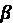
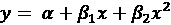

# 第六章：预测数值数据 – 回归方法

数学关系帮助我们理解日常生活的许多方面。例如，体重是个人摄入卡路里的函数；收入通常与教育和工作经验相关；而民意调查数字有助于估计总统候选人连任的机会。

当用数字来表述这些模式时，我们能够获得额外的清晰度。例如，每天额外摄入 250 千卡路里可能会导致每月增加近 1 公斤的体重；每增加一年的工作经验可能会使年薪增加 1000 美元；当经济强劲时，总统更有可能获得连任。显然，这些方程并不完美地适用于每一种情况，但我们预期它们在大多数时候是相当准确的。

本章通过超越之前介绍的分类方法，并引入用于估计数值数据中关系的技巧，扩展了我们的机器学习工具箱。在考察几个现实世界的数值预测任务时，你将学习：

+   回归中使用的基本统计原理，这是一种模拟数值关系大小和强度的技术

+   如何为回归分析准备数据，估计和解释回归模型，以及应用回归变体，如广义线性模型

+   一对称为回归树和模型树的混合技术，这些技术将决策树分类器适应于数值预测任务

基于统计学领域的丰富研究成果，本章所使用的方法在数学方面比之前介绍的方法更为复杂，但请放心！即使你的代数技能有些生疏，R 语言会帮你处理繁重的工作。

# 理解回归

回归涉及指定单个数值**因变量**（要预测的值）与一个或多个数值**自变量**（预测因子）之间的关系。正如其名称所暗示的，因变量依赖于自变量或变量的值。回归的最简单形式假设自变量和因变量之间的关系遵循一条直线。

术语“回归”用来描述将线拟合到数据的过程，其起源可以追溯到 19 世纪末弗朗西斯·高尔顿爵士对遗传学的研究。他发现，身高极矮或极高的父亲往往会有身高更接近平均值的儿子。他把这种现象称为“回归到平均值”。

你可能还记得从基础代数中，直线可以用类似于 *y* = *a* + *bx* 的**斜率截距形式**来定义。在这种形式中，字母 *y* 表示因变量，*x* 表示自变量。**斜率**项 *b* 指定了直线在 *x* 增加时上升的量。正值定义了向上倾斜的直线，而负值定义了向下倾斜的直线。项 *a* 被称为**截距**，因为它指定了直线与垂直 *y* 轴相交或截取的点。它表示当 *x* = 0 时 *y* 的值。


图 6.1：具有各种斜率和截距的直线示例

回归方程使用类似的斜率截距格式来模拟数据。机器的任务是确定* a* 和 *b* 的值，使得指定的直线最能将提供的 *x* 值与 *y* 的值联系起来。

可能并不总是存在一组完美的 *a* 和 *b* 参数来完美地关联这些值，因此机器还必须有一些方法来量化误差范围并选择最佳拟合。我们将在稍后深入讨论这个问题。

回归分析被用于各种任务——它几乎肯定是应用最广泛的机器学习方法。它可以用于解释过去并预测未来，并且可以应用于几乎任何任务。一些具体的用例包括：

+   检验人口和个体通过其测量的特征如何变化，这在经济学、社会学、心理学、物理学和生态学等科学研究中

+   量化事件与其响应之间的因果关系，例如在临床试验、工程安全测试或市场研究中

+   识别可以使用已知标准来预测未来行为的模式，例如用于预测保险索赔、自然灾害损失、选举结果和犯罪率

回归方法也用于**统计假设检验**，这决定了在观察数据的基础上，一个前提是否可能是真实的或错误的。回归模型对关系强度和一致性的估计提供了可用于评估观察结果是否仅由偶然性引起的信息。

假设检验非常微妙，超出了机器学习的范围。如果你对这个主题感兴趣，一本入门统计学教科书是一个好的起点，例如，*直观入门统计学，沃尔夫，D. A. 和施奈德，G.，斯普林格，2017*。

回归分析并不等同于单个算法。相反，它是一个涵盖许多方法的术语，这些方法可以适应几乎任何机器学习任务。如果你只能选择一个机器学习方法来研究，回归将是一个不错的选择。一个人可能可以将整个职业生涯都投入到这个领域，也许仍然有很多东西要学习。

在本章中，我们将从最基本的**线性回归**模型开始——那些使用直线的模型。只有一个自变量的情况被称为**简单线性回归**。有两个或更多自变量的情况被称为**多元线性回归**，或简称**多元回归**。这两种技术都假设有一个单一的因变量，它在连续尺度上被测量。

回归还可以用于其他类型的因变量，甚至可以用于某些分类任务。例如，**逻辑回归**用于建模二元分类结果，而**泊松回归**（以法国数学家西莫恩·泊松的名字命名）用于建模整数计数数据。被称为**多项式逻辑回归**的方法用于建模分类结果，因此可以用于分类。

这些专门的回归方法属于**广义线性模型**（**GLMs**）类别，它们将传统回归模型的直线调整为允许建模其他形式的数据。这些将在本章后面进行描述。

由于类似的统计原理适用于所有回归方法，一旦你理解了线性情况，了解其他变体就变得简单直接。我们将从简单线性回归的基本情况开始。尽管名称上看似简单，但这种方法并不简单到无法解决复杂问题。在下一节中，我们将看到简单线性回归模型的使用如何可能避免一场悲剧性的工程灾难。

## 简单线性回归

1986 年 1 月 28 日，美国航天飞机“挑战者”号的七名机组人员在火箭助推器故障导致灾难性解体时丧生。在事故发生后，专家们迅速将发射温度视为潜在的罪魁祸首。负责密封火箭接头的橡胶 O 形圈从未在 40°F（4°C）以下进行过测试！[](img/B17290_06_001.png)F (4C)，而发射当天的天气异常寒冷，低于冰点。

借助事后诸葛的优势，这次事故已成为数据分析可视化的重要性案例研究。尽管不清楚火箭工程师和决策者在发射前可以获得哪些信息，但不可否认的是，更好的数据，如果被谨慎使用，很可能避免这场灾难。

本节的分析基于*《航天飞机风险分析：挑战者号之前的故障预测》，Dalal, S. R., Fowlkes, E. B., 和 Hoadley, B.，美国统计学会杂志，1989 年，第 84 卷，第 945-957 页*中呈现的数据。关于数据如何可能改变结果的一个观点，请参阅*《视觉解释：图像与数量，证据与叙事》，Tufte, E. R.，Cheshire, C. T.：Graphics Press，1997 年*。对于相反的观点，请参阅*《表现与误表现：图夫特与挑战者号上的莫顿·索尔科工程师》，Robison, W.，Boisjoly, R.，Hoeker, D.，和 Young, S.，《科学和工程伦理》，2002 年，第 8 卷，第 59-81 页*。

火箭工程师几乎肯定知道低温会使组件变得更加脆弱，密封性能降低，这会导致危险燃料泄漏的概率增加。然而，鉴于继续发射的政治压力，他们需要数据来支持这一假设。一个展示温度与 O 形圈故障之间联系的回归模型，并且能够根据预期的发射温度预测故障概率，可能会非常有帮助。

为了构建回归模型，科学家可能使用了在 23 次之前成功的航天飞机发射中记录的发射温度和组件故障的数据。组件故障表明两种类型的问题之一。第一种问题，称为侵蚀，发生在过度的热量烧毁 O 形圈时。第二种问题，称为吹过，发生在热气体通过或“吹过”密封不良的 O 形圈时。由于航天飞机共有六个主要 O 形圈，每次飞行可能发生多达六个故障。尽管火箭可以生存一个或多个故障事件或被一个故障摧毁，但每个额外的故障都会增加灾难性故障的概率。以下散点图显示了之前 23 次发射检测到的初级 O 形圈故障，与发射温度的对比：


图 6.2：航天飞机 O 形圈故障与发射温度的可视化

检查图表，存在一个明显的趋势：在较高温度下进行的发射往往有较少的 O 形圈故障事件。此外，最冷的发射（53°F）发生了两个故障事件，这个水平只在另一次发射中达到。考虑到这些信息，挑战者号计划在比这低 20 多度的条件下发射似乎令人担忧。但他们应该有多担心？为了回答这个问题，我们可以转向简单线性回归。

简单线性回归模型定义了因变量与单个自变量预测变量之间的关系，使用以下形式的方程定义的线：


除了希腊字母外，这个方程几乎与之前描述的斜截式相同。截距 （alpha）描述了直线与 *y* 轴的交点，而斜率 （beta）描述了在 *x* 增加时 *y* 的变化。对于航天飞机发射数据，斜率将告诉我们发射温度每增加一度，O 形圈故障预期的变化。

在统计学领域，希腊字母通常用于表示统计函数的参数变量。因此，进行回归分析涉及找到  和  的**参数估计**。alpha 和 beta 的参数估计通常用 *a* 和 *b* 表示，尽管你可能发现一些术语和符号被交替使用。

假设我们知道航天飞机发射数据方程中估计的回归参数是 *a* = 3.70 和 *b* = -0.048。因此，完整的线性方程是 *y* = 3.70 – 0.048x。暂时忽略这些数字是如何得到的，我们可以像这样在散点图上绘制这条线：


图 6.3：一个回归线，用于模拟压力事件与发射温度之间的关系

如线所示，在 60 华氏度时，我们预测不到一个 O 形圈的故障事件。在 50 华氏度时，我们预计大约有 1.3 次故障。如果我们使用该模型外推到 31 度——挑战者号预测的温度——我们预计大约会有 *3.70 - 0.048 * 31 = 2.21* 次 O 形圈的故障事件。

假设每个 O 形圈故障同样可能引起灾难性的燃料泄漏，这意味着挑战者号在 31 度发射的风险几乎是 60 度典型发射的三倍，比 70 度发射的风险超过八倍。

注意到直线并没有精确地穿过每个数据点。相反，它在大约均匀地穿过数据，一些预测值低于或高于直线。在下一节中，我们将学习为什么选择这条特定的线。

## 普通最小二乘估计

为了确定  和  的最佳估计值，使用了一种称为**普通最小二乘法**（OLS）的估计方法。在 OLS 回归中，斜率和截距被选择以最小化**平方误差和**（SSE）。误差，也称为**残差**，是预测的 *y* 值与实际 *y* 值之间的垂直距离。由于误差可能是高估或低估，它们可以是正数或负数；平方它们使得误差无论方向如何都是正数。以下图表展示了几个点的残差：


图 6.4：回归线的预测值与实际值之间的差异由残差量决定

用数学术语来说，OLS 回归的目标可以表达为最小化以下方程的任务：


用简单的话说，这个方程定义*e*（误差）为实际*y*值与预测*y*值之间的差异。误差值被平方以消除负值，并在数据中的所有点上进行求和。

在*y*项上方的撇号（^）是统计符号中常用的一个特征。它表示该项是对真实*y*值的估计。这被称为*y*的估计值。

*a*的解取决于*b*的值。可以使用以下公式获得：


要理解这些方程，你需要了解另一部分统计符号。出现在*x*和*y*项上方的水平横线表示*x*或*y*的均值值。这被称为*x*横或*y*横。

虽然证明超出了本书的范围，但可以使用微积分证明，导致最小平方误差的*b*的值是：


如果我们将这个方程分解为其组成部分，我们可以稍微简化它。*b*的分母应该看起来很熟悉；它与*x*的方差非常相似，表示为 Var(*x*)。正如我们在*第二章*，*管理和理解数据*中学到的，方差涉及找到*x*的均值与均值的平均平方偏差。这可以表示为：


分子涉及将每个数据点的偏差（与均值*x*值的偏差）乘以该点偏离均值*y*值的偏差之和。这与*x*和*y*的协方差函数类似，表示为 Cov(*x*, *y*)。协方差公式是：


如果我们将协方差函数除以方差函数，分子和分母中的*n*项会相互抵消，我们可以将*b*的公式重写为：


给出这种重述后，使用内置的 R 函数很容易计算出*b*的值。让我们将它们应用于航天飞机发射数据来估计回归线。

如果你想跟随这些示例，请从 Packt Publishing 网站下载`challenger.csv`文件，并使用`launch <- read.csv("challenger.csv")`命令将其加载到数据框中。

如果航天飞机数据存储在名为`launch`的数据框中，自变量*x*命名为`temperature`，因变量*y*命名为`distress_ct`，则可以使用 R 函数`cov()`和`var()`来估计*b*：

```py
> b <- cov(launch$temperature, launch$distress_ct) /
         var(launch$temperature)
> b 
```

```py
[1] -0.04753968 
```

然后，我们可以通过使用计算出的`b`值并应用`mean()`函数来估计`a`：

```py
> a <- mean(launch$distress_ct) - b * mean(launch$temperature)
> a 
```

```py
[1] 3.698413 
```

手动估计回归方程显然不是最佳选择，因此 R 预期地提供了一个用于自动拟合回归模型的功能。我们很快就会使用这个功能。在此之前，通过首先学习一种衡量线性关系强度的方法，来扩展你对回归模型拟合的理解是很重要的。此外，你很快就会学习如何将多元线性回归应用于具有多个自变量的问题。

## 相关性

两个变量之间的**相关性**是一个数字，表示它们之间的关系有多接近一条直线。如果没有额外的限定，相关性通常指的是**皮尔逊相关系数**，这是 20 世纪数学家卡尔·皮尔逊开发的。相关性的范围在 -1 到 +1 之间。最大值和最小值表示完全的线性关系，而接近零的相关性表示没有线性关系。

以下公式定义了皮尔逊相关系数：


这里引入了更多的希腊符号：第一个符号（看起来像小写的 *p*）是 *rho*，它用来表示皮尔逊相关统计量。看起来像 *q* 字符逆时针旋转的符号是希腊字母小写 *sigma*，它们表示 *x* 或 *y* 的标准差。

使用这个公式，我们可以计算发射温度和 O 型圈故障事件数之间的相关性。回想一下，协方差函数是 `cov()`，标准差函数是 `sd()`。我们将结果存储在 `r` 中，这是一个常用来表示估计相关性的字母：

```py
> r <- cov(launch$temperature, launch$distress_ct) /
         (sd(launch$temperature) * sd(launch$distress_ct))
> r 
```

```py
[1] -0.5111264 
```

或者，我们可以使用 `cor()` 相关函数得到相同的结果：

```py
> cor(launch$temperature, launch$distress_ct) 
```

```py
[1] -0.5111264 
```

温度和故障 O 型圈数量之间的相关系数是 -0.51。负相关性表明温度的增加与故障 O 型圈数量的减少有关。对于研究 O 型圈数据的 NASA 工程师来说，这将是一个非常明确的指标，表明低温发射可能存在问题。相关性还告诉我们温度和 O 型圈故障之间的相对强度。因为 -0.51 是最大负相关系数 -1 的一半，这意味着存在中等强度的负线性关联。

在解释相关性强度方面，有许多经验法则。一种方法是将 0.1 到 0.3 之间的值标记为“弱”；0.3 到 0.5 之间的范围标记为“中等”；而高于 0.5 的值标记为“强”（这些也适用于类似范围的负相关性）。然而，这些阈值对于某些目的可能过于严格或过于宽松。通常，相关性必须在特定背景下进行解释。

对于涉及人类的数据，0.5 的相关性可能被认为非常高；对于由机械过程生成的数据，0.5 的相关性可能非常弱。

你可能听说过“相关性不等于因果关系”这个说法。这源于这样一个事实，即相关性仅描述了一对变量之间的关联，但可能存在其他未考虑的解释，这些解释可能是观察到的关系的责任。例如，寿命与每天观看电影的时间之间可能存在强烈的关联，但在医生建议我们所有人都看更多电影之前，我们需要排除另一个解释：年轻人看更多的电影，而年轻人（总的来说）不太可能死亡。

测量两个变量之间的相关性为我们提供了一种快速检查独立变量和因变量之间线性关系的方法。随着我们开始定义具有更多预测因子的回归模型，这一点将变得越来越重要。

## 多元线性回归

大多数现实世界的分析都有多个自变量。因此，你很可能会在大多数数值预测任务中使用多元线性回归。多元线性回归的优缺点如下表所示：

| **优点** | **缺点** |
| --- | --- |

|

+   到目前为止，建模数值数据最常见的方法

+   可以适应几乎任何建模任务

+   提供了特征和结果之间关系的大小和强度的估计

|

+   对数据有强烈的假设

+   模型的形式必须由用户事先指定

+   无法处理缺失数据

+   只适用于数值特征，因此分类数据需要额外的准备

+   需要一些统计学知识来理解模型

|

我们可以将多元回归视为简单线性回归的扩展。在两种情况下，目标都是相似的——找到斜率系数的值，以最小化线性方程的预测误差。关键的区别是，对于额外的自变量，有额外的项。

多元回归模型具有以下方程的形式。因变量 *y* 被指定为截距项  与每个 *i* 个特征对应的估计值  与 *x* 变量的乘积之和。这里增加了一个误差项 （用希腊字母 *epsilon* 表示），作为提醒预测并不完美。这代表了之前提到的残差项：


让我们暂时考虑一下估计的回归参数的解释。你会注意到，在前面的方程中，为每个特征提供了一个系数。这允许每个特征对 *y* 的值有单独的估计影响。换句话说，当特征 ![img/B17290_06_023.png] 每增加一个单位时，*y* 的变化量为 ![img/B17290_06_022.png]。因此，截距 ![img/B17290_06_005.png] 是当独立变量都为零时 *y* 的期望值。

由于截距项 ![img/B17290_06_005.png] 真的与其他任何回归参数没有区别，它有时也用 ![img/B17290_06_024.png] （发音为 *beta naught*）表示，如下面的公式所示：

![img/B17290_06_025.png]

就像之前一样，截距与任何独立变量 *x* 都无关。然而，由于以下原因将在短时间内变得清楚，想象 ![img/B17290_06_024.png] 被乘以一个项 *x*[0] 有助于理解。我们将 *x*[0] 分配为一个常量，其值为 1：

![img/B17290_06_027.png]

为了估计回归参数，必须将因变量 *y* 的每个观测值与独立变量 *x* 的观测值通过前面形式的回归方程联系起来。以下图是多个回归任务设置的图形表示：


图 6.5：多重回归试图找到![img/B17290_06_006.png]值，这些值将 X 值与 Y 值相关联，同时最小化![img/B17290_06_020.png]

上述图中所展示的许多行和列的数据可以用加粗的矩阵符号来压缩表示，以表明每个项代表多个值。以这种方式简化后，公式如下：

![img/B17290_06_030.png]

在矩阵表示法中，因变量是一个向量，**Y**，其中每一行代表一个示例。独立变量被组合成一个矩阵，**X**，其中每一列代表一个特征，还有一个额外的截距列，值为 1。每一列都有每一行的示例。回归系数 ![img/B17290_06_031.png] 和残差误差 **![img/_eqn_032.png]** 现在也是向量。

目标现在是要求解![img/B17290_06_031.png]，这是使预测值和实际**Y**值之间平方误差和最小的回归系数向量。找到最优解需要使用矩阵代数；因此，推导需要比本文中提供的更仔细的注意。然而，如果你愿意相信他人的工作，向量![img/B17290_06_031.png]的最佳估计可以计算如下：

![img/B17290_06_034.png]

这个解决方案使用了一对矩阵运算：**T** 表示矩阵 **X** 的转置，而负指数表示 **矩阵逆**。利用 R 的内置矩阵运算，我们可以实现一个简单的多元回归学习器。让我们将这个公式应用到挑战者号发射数据上。

如果你对前面的矩阵运算不熟悉，Wolfram MathWorld 的转置页面 ([`mathworld.wolfram.com/Transpose.html`](http://mathworld.wolfram.com/Transpose.html)) 和矩阵逆页面 ([`mathworld.wolfram.com/MatrixInverse.html`](http://mathworld.wolfram.com/MatrixInverse.html)) 提供了全面的介绍，即使没有高级数学背景也能理解。

使用以下代码，我们可以创建一个名为 `reg()` 的基本回归函数，它接受参数 `y` 和 `x`，并返回一个估计的贝塔系数向量：

```py
> reg <- function(y, x) {
    x <- as.matrix(x)
    x <- cbind(Intercept = 1, x)
    b <- solve(t(x) %*% x) %*% t(x) %*% y
    colnames(b) <- "estimate"
    print(b)
  } 
```

这里创建的 `reg()` 函数使用了几个我们之前没有用过的 R 命令。首先，由于我们将使用该函数与数据框的列集一起使用，`as.matrix()` 函数将数据框转换为矩阵形式。

接下来，`cbind()` 函数将一个额外的列绑定到 `x` 矩阵上；命令 `Intercept = 1` 指示 R 将新列命名为 `Intercept` 并用重复的 `1` 值填充该列。然后，对 `x` 和 `y` 对象执行一系列矩阵运算：

+   `solve()` 取矩阵的逆

+   `t()` 用于矩阵的转置

+   `%*%` 用于两个矩阵的乘法

通过将这些 R 函数组合起来，我们的函数将返回一个向量 `b`，其中包含与 `x` 到 `y` 相关的线性模型的估计参数。函数中的最后两行给 `b` 向量命名并在屏幕上打印结果。

让我们将这个函数应用到航天飞机发射数据上。如下面的代码所示，数据集包括三个特征和灾情计数（`distress_ct`），这是我们感兴趣的结果：

```py
> str(launch) 
```

```py
'data.frame':    23 obs. of  4 variables:
 $ distress_ct         : int  0 1 0 0 0 0 0 0 1 1 ...
 $ temperature         : int  66 70 69 68 67 72 73 70 57 63 ...
 $ field_check_pressure: int  50 50 50 50 50 50 100 100 200 200 ...
 $ flight_num          : int  1 2 3 4 5 6 7 8 9 10 ... 
```

我们可以通过比较其对于之前找到的 O 型环故障与温度的简单线性回归模型的结果来确认我们的函数是否正确工作，该模型具有参数 *a* = 3.70 和 *b* = -0.048。由于温度位于发射数据的第二列，我们可以如下运行 `reg()` 函数：

```py
> reg(y = launch$distress_ct, x = launch[2]) 
```

```py
 estimate
Intercept    3.69841270
temperature -0.04753968 
```

这些值与我们之前的结果完全匹配，因此让我们使用这个函数来构建一个多元回归模型。我们将像之前一样应用它，但这次我们将指定 `x` 参数的第二到第四列以添加两个额外的预测因子：

```py
> reg(y = launch$distress_ct, x = launch[2:4]) 
```

```py
 estimate
Intercept             3.527093383
temperature          -0.051385940
field_check_pressure  0.001757009
flight_num            0.014292843 
```

该模型使用温度、现场检查压力和发射 ID 号来预测 O 形圈故障事件的数量。值得注意的是，加入这两个新的预测因子并没有改变我们从简单线性回归模型中得到的结果。正如之前一样，温度变量的系数为负，这表明随着温度的升高，预期的 O 形圈事件数量会减少。这种影响的大小也大致相同：发射温度每增加一度，预计的故障事件将减少大约 0.05 次。

这两个新的预测因子也对预测的故障事件有贡献。现场检查压力是指在发射前测试中对 O 形圈施加的压力量。虽然检查压力最初是 50 磅力，但在某些发射中提高到 100 和 200 磅力，这导致一些人认为这可能是 O 形圈侵蚀的原因。系数为正，但很小，至少为这个假设提供了一些证据。飞行次数代表了航天飞机的年龄。每次飞行，它都会变老，部件可能会更脆弱或更容易损坏。飞行次数与故障计数之间的小的正相关可能反映了这一事实。

总体而言，我们对航天飞机数据的回顾性分析表明，考虑到天气条件，挑战者号的发射风险很高。也许如果工程师们事先应用线性回归，灾难可能就可以避免。当然，当时的情况现实，以及涉及的政治影响，肯定没有现在回望时看起来那么简单。

## 广义线性模型和逻辑回归

如同在挑战者号航天飞机发射数据分析中所展示的那样，标准线性回归是用于建模数值结果与一个或多个预测因子之间关系的有用方法。回归能够经受时间的考验，这并不奇怪。即使在一百多年后，它仍然是我们工具箱中最重要的技术之一，尽管它并不比找到最佳直线来拟合数据更复杂。

然而，并非每个问题都适合用一条线来建模，而且，回归模型在许多实际任务中违反了统计假设。即使是挑战者号的数据，对于线性回归来说也不够理想，因为它违反了回归假设，即目标变量是在连续尺度上测量的。由于 O 形圈的故障次数只能取可数值，因此模型预测出恰好 2.21 次故障事件，而不是两个或三个，这是没有意义的。

对于建模计数值、分类或二元结果，以及其他目标变量不是正态分布的连续变量的情况，标准线性回归并不是最佳工具——尽管许多人仍然将这些类型的问题应用于它，并且它通常表现得相当出色。

为了解决这些不足，可以使用名为 GLM 的适当名称来适应其他用例，该模型最早由统计学家 John Nelder 和 Robert Wedderburn 于 1972 年描述。GLM 放宽了传统回归模型的两个假设。首先，它允许目标变量是非正态分布的、非连续变量。其次，它允许目标变量的方差与其均值相关。前者为建模分类数据或计数数据，甚至预测值范围有限的情况（例如，落在 0 到 1 之间的概率值）打开了大门。后者允许模型更好地拟合预测变量与预测以非线性方式相关的情况，例如指数增长，其中时间的增加导致结果的增加越来越大。

要阅读关于广义线性模型（GLM）的原始出版物，请参阅*Nelder, J. A. 和 Wedderburn, T. W. M.，皇家统计学会杂志，1972 年，第 135 卷，第 370-384 页*。对于更温和、非数学性的介绍，请参阅*Dunteman, G. H. 和 Ho, M. H. R.，社会科学定量应用，2006 年，第 145 卷*。

这两种对线性回归的推广反映在任何 GLM 的两个关键组件中：

1.  **家族**指的是目标特征的分布，必须从**指数分布族**的成员中选择，该族包括正态高斯分布以及其他如泊松、二项和伽马分布。所选分布可以是离散的或连续的，并且可以跨越不同的值范围，例如仅正数或仅介于零和一之间的值。

1.  **链接函数**将预测变量与目标变量之间的关系转换为可以使用线性方程进行建模的形式，尽管原始关系是非线性的。始终存在一个**标准链接函数**，它由所选的家族确定并默认使用，但在某些情况下，可以选择不同的链接来改变模型的理解方式或获得更好的模型拟合。

调整家族和链接函数使广义线性模型（GLM）方法具有极大的灵活性，以适应许多不同的实际应用场景，并符合目标变量的自然分布。了解使用哪种组合取决于模型的应用方式以及目标变量的理论分布。详细了解这些因素需要了解指数族中的各种分布以及统计学理论背景。幸运的是，大多数广义线性模型（GLM）的应用符合一些常见的家族和链接组合，这些组合在下面的表中列出：

| **家族** | **规范链接函数** | **目标范围** | **注意事项和应用** |
| --- | --- | --- | --- |
| 高斯（正态） | 恒等 | -![img/B17290_06_036.png]到![img/B17290_06_036.png] | 用于线性响应建模；将广义线性模型（GLM）简化为标准线性回归。 |
| 泊松 | 对数 | 整数 0 到![img/B17290_06_036.png] | 称为泊松回归；通过估计事件发生的频率来建模事件发生的次数（如 O 型圈故障的总数）。 |
| 二项式 | 对数几率 | 0 到 1 | 称为逻辑回归；通过估计结果发生的概率来建模二元结果（如是否有 O 型圈故障）。 |
| 伽马 | 负逆 | 0 到![img/B17290_06_036.png] | 建模右偏斜数据的一种可能性；可用于建模事件发生的时间（如 O 型圈故障的秒数）或成本数据（如汽车事故的保险索赔成本）。 |
| 多项式 | 对数几率 | *K*个类别中的 1 个 | 称为多项式逻辑回归；通过估计示例落在每个类别中的概率来建模分类结果（如成功、失败或中止的航天飞机发射）。通常使用专门的软件包而不是广义线性模型（GLM）函数来帮助解释。 |

由于解释广义线性模型（GLM）的细微差别，要熟练应用一个模型需要大量的实践和仔细的研究，而且很少有人能声称自己是所有这些模型的专家。整本教科书都致力于每种广义线性模型（GLM）变体。幸运的是，在机器学习的领域，解释和理解的重要性不如能够将正确的广义线性模型（GLM）形式应用于实际问题并产生有用的预测。虽然本章不能涵盖列出的每种方法，但关键细节的介绍将允许你后来追求与你自己的工作最相关的广义线性模型（GLM）变体。

从表中列出的最简单变体开始，标准线性回归可以被视为一种特殊的 GLM，它使用高斯族和恒等链接函数。**恒等链接**意味着目标 *y* 与预测变量 *x*[i] 之间的关系没有进行任何转换。因此，与标准回归一样，一个估计的回归参数  可以相当简单地解释为在 *x*[i] 增加 1 个单位时 *y* 的增加量，假设所有其他因素都保持不变。

使用其他链接函数的 GLM 形式并不容易解释，要完全理解单个预测变量的影响需要更加仔细的分析。这是因为回归参数必须被解释为在 *x* 增加 1 个单位时 *y* 的增加量，但这是在通过链接函数转换之后。

例如，使用 **对数链接** 函数来模拟事件预期计数的泊松族，通过自然对数将 *y* 与预测变量 *x*[i] 相关联；因此， 对 *y* 的加性效应在响应变量的原始尺度上变成了乘性效应。这是因为利用对数的性质，我们知道 ，在指数化以消除对数后，这变成了 。

由于这种乘性影响，参数估计被理解为相对增加率，而不是像线性回归中那样是 *y* 的绝对增加量。

为了在实践中看到这一点，假设我们构建了一个关于 O 型圈故障数与发射温度的泊松回归模型。如果 *x*[1] 是温度，并且估计的  = -0.103，那么我们可以确定，在发射时每增加 1 度温度，平均 O 型圈故障数会减少约 9.8%。这是因为 *exp(-0.103) = 0.902*，或者说每度故障的 90.2%，这意味着我们预计每增加 1 度温度，故障数会减少 9.8%。将此应用于挑战者号发射时的 36 华氏度温度，我们可以外推，如果发射温度再高 17 度（53 华氏度是之前的最低发射温度），那么预期的故障数将大约是 *(0.902)¹⁷ = 17.2*%，相当于减少 82.8%。

在航天飞机数据的背景下，假设我们为预测发射过程中是否会发生一个或多个 O 形圈故障的二元分类任务构建了一个逻辑回归模型。一个不会改变 O 形圈故障概率的因素将保持赔率为 1:1（50-50 的概率），这转化为对数赔率 *log(0.5 / (1 - 0.5)) = 0* 以及对于这个特征的估计回归系数  = 0。找到赔率比 *exp(0) = 1* 表明，无论这个因素的价值如何，赔率保持不变。现在，假设像温度这样的因素降低了结果发生的可能性，并且在这个以 *x*[1] 作为温度的逻辑回归模型中，那么估计的  = -0.232。通过指数化这个值，我们找到赔率比 *exp(-0.232) = 0.793*，这意味着在保持其他条件不变的情况下，温度每上升一度，故障的赔率降低约 20%。需要注意的是，这并不意味着每次温度上升一度，故障的概率就会降低 20%。

因为赔率和概率之间的关系是非线性的，温度变化对失效概率的影响取决于温度变化发生的具体环境！

概率和几率通过 logit 和逻辑函数之间的逆关系相关联。逻辑函数有一个方便的性质，即对于任何输入*x*值，输出都在 0 到 1 的范围内——正好与概率的范围相同。此外，逻辑函数在绘制时创建一个 S 形曲线，如图*图 6.6*所示，该图显示了 O 形圈故障概率与发射温度的假设逻辑回归模型。在温度范围的中间，失败概率在*y*轴上变化最为强烈；在温度极端情况下，每增加或减少一度温度，预测的失败概率变化很小。


图 6.6：表示航天飞机发射数据的假设逻辑回归曲线

拟合的逻辑回归模型在 0 到 1 的范围内创建了一条曲线，表示对连续尺度上的概率估计，尽管目标结果（如图中圆圈所示）只取值为*y* = 0 或*y* = 1。为了获得二元预测，只需定义一个概率阈值，目标结果将据此进行预测。例如，如果预测的 O 形圈故障概率大于 0.50，则预测“故障”，否则预测“无故障”。使用 50%的阈值是常见的，但可以使用更高的或更低的阈值来调整模型对成本的敏感度。

检视*图 6.6*中的逻辑曲线会引出另一个问题：建模算法是如何确定最适合数据的曲线的呢？毕竟，鉴于这并非一条直线，标准线性回归中使用的 OLS 算法似乎不再适用。

事实上，广义线性模型使用一种称为**最大似然估计**（**MLE**）的不同技术，该技术找到指定分布中最有可能生成观察数据的参数值。

由于 OLS 估计是最大似然估计的特殊情况，只要满足 OLS 建模的假设，使用 OLS 或 MLE 对线性模型进行建模就没有区别。对于线性建模之外的应用，MLE 技术会产生不同的结果，并且必须使用 MLE 而不是 OLS。MLE 技术内置在 GLM 建模软件中，通常通过在数据上反复迭代以识别最优模型参数，而不是直接找到正确解。幸运的是，正如我们很快将看到的，在 R 中构建 GLM 几乎不比训练一个更简单的线性模型更具挑战性。

本介绍仅触及了线性回归和 GLM 可能性的表面。尽管理论和像挑战者数据集这样的简单例子有助于理解回归模型的工作原理，但构建一个有用的模型所涉及的不仅仅是我们所看到的。R 内置的回归函数包括拟合更复杂模型所需的功能，同时提供额外的诊断输出，以帮助模型解释和评估拟合度。让我们应用这些函数，通过尝试一个现实世界的学习任务来扩展我们对回归的了解。

# 示例 – 使用线性回归预测汽车保险索赔成本

对于一家汽车保险公司来说，为了盈利，它需要收取的会员费比支付给其受益人的车辆盗窃、损坏或事故中生命损失索赔要多。因此，保险公司投入时间和金钱来开发模型，以准确预测受保人群的索赔成本。这是被称为**精算科学**的领域，它使用复杂的统计技术来估计受保人群的风险。

由于事故，尤其是致命事故相对罕见——在美国，每行驶 1 亿英里车辆中略超过 1 起死亡事故——因此，个人保险费用难以准确预测。然而，当事故发生时，它们代价极高。此外，导致任何特定事故的具体条件基于难以衡量的因素，它们看起来似乎是随机的。一个有良好驾驶记录的优秀驾驶员可能会遭遇不幸，被醉酒驾驶员撞到，而另一个人可能会因分心驾驶手机，由于好运，从未造成事故。

由于预测个人费用的几乎不可能性，保险公司应用平均法则，计算具有相似风险特征的人群保险段的平均成本。如果每个风险段的费用估计是正确的，保险公司可以为风险较低的段定价较低的保险费，并可能从竞争的保险公司吸引新的低风险客户。在接下来的分析中，我们将模拟这种场景。

## 第 1 步 – 收集数据

本例的数据集是基于美国政府的人口统计和交通统计数据创建的模拟数据。它的目的是近似美国密歇根州汽车保险公司的现实世界条件，该州约有 1000 万居民和 700 万持牌驾驶员。

如果你想交互式地跟随，请从本书的 Packt Publishing GitHub 仓库下载`autoinsurance.csv`文件，并将其保存到你的 R 工作文件夹中。

保险数据集包括 20,000 个受益者参加的假设汽车车辆保险计划的示例。这比实际精算师使用的典型数据集要小得多，特别是对于非常罕见的结果，但规模已经缩小，以便即使在内存有限的计算机上也能进行分析。每个示例代表一个被保险个人的特征和计划在日历年度中收取的总保险索赔成本（费用）。在登记时可用的是以下特征：

+   `age`: 驾驶者的年龄，从 16 岁到 89 岁

+   `geo_area`: 车主主要居住地的地理区域，以及车辆最常使用的地方；邮编被归入城市、郊区和农村类别

+   `est_value`: 根据年龄和折旧估计的车辆（们）的市场价值；上限为 125,000 美元——允许的最大保险价值

+   `vehicle_type`: 乘客车辆的类型，可以是汽车、卡车、微型货车或运动型多功能车（SUV）

+   `miles_driven`: 在日历年度内驾驶的距离（英里）

+   `college_grad_ind`: 如果受益者拥有大学学历或更高，则该二进制指示器设置为`1`

+   `speeding_ticket_ind`: 如果在过去五年内收到过超速罚单或违规，则该二进制指示器设置为`1`

+   `clean_driving_ind`: 如果在过去五年内没有支付过责任保险索赔，则该二进制指示器设置为`1`

在这个示例场景中，有 20,000 名受益者参加了“安全驾驶折扣”计划，该计划要求使用设备或手机应用程序进行位置跟踪，以监控全年安全驾驶条件。这有助于验证`miles_driven`的准确性，并创建了以下两个额外的预测因子，旨在反映更危险的驾驶行为：

+   `hard_braking_ind`: 如果车辆经常应用“硬刹车”（例如突然停车的情况），则该二进制指示器设置为`1`

+   `late_driving_ind`: 如果车辆在午夜后经常驾驶，则该二进制指示器设置为`1`

考虑这些变量如何与保险费用相关是很重要的——有些方式比其他方式更明显。例如，我们显然预期经常驾驶的汽车比那些停在车库里的汽车更容易发生事故。另一方面，城市、农村或郊区的驾驶员哪个风险更高并不那么明显；农村驾驶员可能驾驶的距离更远，但城市驾驶涉及更多的交通，可能更容易发生车辆盗窃。回归模型将帮助我们解开这些关系，但需要我们自己指定特征之间的联系，而不是自动检测，这与许多其他机器学习方法不同。我们将在下一节中探讨一些潜在的关系。

考虑哪些可能的有用预测因子没有被包含在训练数据集中也许也很有趣。性别常被用于汽车保险定价（并且男女成本不同！）但密歇根州在 2020 年禁止了为此目的使用性别和信用评分。这些特征可能具有高度预测性，但可能导致对受保护群体的系统性偏见，如第一章*介绍机器学习*中所述。

## 第 2 步 – 探索和准备数据

如我们之前所做的那样，我们将使用`read.csv()`函数来加载数据进行分析。我们可以安全地使用`stringsAsFactors = TRUE`，因为将三个名义变量转换为因子是合适的：

```py
> insurance <- read.csv("insurance.csv", stringsAsFactors = TRUE) 
```

`str()`函数确认数据格式正如我们所期望的：

```py
> str(insurance) 
```

```py
'data.frame':    20000 obs. of  11 variables:
 $ age                : int  19 30 39 64 33 27 62 39 67 38 ...
 $ geo_area           : Factor w/ 3 levels "rural","suburban", ...
 $ vehicle_type       : Factor w/ 4 levels "car","minivan", ...
 $ est_value          : int  28811 52603 113870 35228 ...
 $ miles_driven       : int  11700 12811 9784 17400 ...
 $ college_grad_ind   : int  0 1 1 0 0 1 1 0 1 1 ...
 $ speeding_ticket_ind: int  1 0 0 0 0 0 0 0 0 0 ...
 $ hard_braking_ind   : int  1 0 0 0 0 0 0 0 0 0 ...
 $ late_driving_ind   : int  0 0 0 0 0 0 0 0 0 0 ...
 $ clean_driving_ind  : int  0 1 0 1 1 0 1 1 0 1 ...
 $ expenses           : num  0 6311 49684 0 0 ... 
```

我们的模型因变量是`expenses`，它衡量每个人在保险计划下一年内所声称的损失或损害。在构建线性回归模型之前，检查正态性通常很有帮助。尽管没有正态分布的因变量，线性回归也不会失败，但模型在这一点上通常拟合得更好。让我们看看总结统计：

```py
> summary(insurance$expenses) 
```

```py
 Min. 1st Qu.  Median    Mean 3rd Qu.    Max. 
      0       0       0    1709       0  232797 
```

最小值、第一四分位数、中位数和第三四分位数都是零，这意味着至少 75%的受益人在日历年度内没有费用。平均值大于中位数的事实让我们感觉到保险费用的分布是右偏的，但偏斜可能非常极端，因为平均费用是 1,709 美元，而最大值是 232,797 美元。我们可以使用直方图来直观地确认这一点：

```py
> hist(insurance$expenses) 
```


图 6.7：年度保险索赔成本的分布

如预期的那样，该图显示了一个右偏分布，在零处有一个巨大的峰值，反映了只有一小部分（大约 8.6%）提出了保险索赔。在那些确实提出了车辆损失或损害索赔的人中，分布的尾部延伸到右侧，超过了 200,000 美元的昂贵伤害费用。尽管这种分布不适合线性回归，但提前知道这种弱点可能有助于我们稍后设计一个更好的拟合模型。现在，仅使用`expenses`的分布，我们可以这样说，平均受益人应该被收取每年 1,709 美元的保险费，这样保险公司才能收支平衡，或者每月每名订阅者约 150 美元的轻微利润。当然，这假设风险和成本是平均分担的。一个改进的保险模型会将更大的成本转嫁给风险较高的驾驶员，并为安全驾驶员提供经济上的节省。

在添加额外的预测变量之前，重要的是要注意回归模型要求每个特征都是数值型的，而我们的数据框中有两个因素类型的特征。例如，`geo_area`变量被分为`urban`、`suburban`和`rural`等级，而`vehicle_type`有`car`、`truck`、`suv`和`minivan`等类别。

让我们更仔细地看看它们的分布情况：

```py
> table(insurance$geo_area) 
```

```py
 rural suburban    urban 
    3622     8727     7651 
```

```py
> table(insurance$vehicle_type) 
```

```py
 car minivan     suv   truck 
   5801     726    9838    3635 
```

在这里，我们看到数据几乎均匀地分布在城市和郊区之间，但农村数据占比较小。此外，SUV 是最受欢迎的车型，其次是汽车和卡车，微型货车位于遥远的第四位。我们将很快看到 R 的线性回归函数如何处理这些因素变量。

### 探索特征之间的关系——相关矩阵

在将回归模型拟合到数据之前，确定自变量如何与因变量以及彼此相关可能很有用。**相关矩阵**提供了这些关系的快速概述。给定一组变量，它为每对关系提供相关性。

要为保险数据框中的四个数值型、非二进制变量创建相关矩阵，请使用`cor()`命令：

```py
> cor(insurance[c("age", "est_value", "miles_driven", "expenses")]) 
```

```py
 age   est_value miles_driven     expenses
age           1.000000000 -0.05990552   0.04812638 -0.009121269
est_value    -0.059905524  1.00000000  -0.01804807  0.088100468
miles_driven  0.048126376 -0.01804807   1.00000000  0.062146507
expenses     -0.009121269  0.08810047   0.06214651  1.000000000 
```

在每一行和每一列的交叉处，列出该行和列所指示变量的相关性。对角线始终是`1.0000000`，因为变量与其自身之间总是存在完美的相关性。对角线上方和下方的值是相同的，因为相关性是对称的。换句话说，`cor(x, y)`等于`cor(y, x)`。

矩阵中的相关性都不强，但关联与常识相符。例如，`age`和`expenses`似乎存在弱负相关性，这意味着随着年龄的增长，预期的保险费用会略有下降——这可能是由于更丰富的驾驶经验。还有`est_value`和`expenses`以及`miles_driven`和`expenses`之间的正相关性，这表明更昂贵的汽车和更广泛的驾驶会导致更高的费用。当我们构建最终的回归模型时，我们将尝试更清晰地揭示这些类型的关系。

### 可视化特征之间的关系——散点图矩阵

使用散点图可视化数值特征之间的关系也可能很有帮助。尽管我们可以为每种可能的关系创建一个散点图，但对于大量特征来说，这样做很快就会变得繁琐。

另一种选择是创建一个**散点图矩阵**（有时简称为**SPLOM**），它只是按网格排列的散点图的集合。它用于检测三个或更多变量之间的模式。散点图矩阵不是真正的多维可视化，因为一次只检查两个特征。尽管如此，它提供了数据可能相互关联的一般感觉。

我们可以使用 R 的图形功能来创建四个非二进制数值特征（`age`、`est_value`、`miles_driven`和`expenses`）的散点图矩阵。`pairs()`函数是 R 默认安装的一部分，提供了生成散点图矩阵的基本功能。要调用此函数，只需提供要绘制的数据框的子集。鉴于我们的`insurance`数据集相对较大，我们将设置绘图字符参数`pch = "."`为点，以便使可视化更容易阅读，然后限制列为我们感兴趣的四个变量：

```py
> pairs(insurance[c("age", "est_value", "miles_driven",
                  "expenses")], pch = ".") 
```

这会产生以下散点图矩阵：


图 6.8：保险数据集中数值特征的散点图矩阵

在散点图矩阵中，每一行和每一列的交叉处持有由行和列对指示的变量的散点图。对角线以上和以下的图是转置的，因为*x*轴和*y*轴已经交换了。您在这些图中注意到任何模式吗？尽管它们大多看起来像随机的点云，但其中一些似乎显示出一些微妙趋势。`est_value`和`miles_driven`与`expenses`的关系似乎显示出轻微的上升趋势，这从相关矩阵中我们已经学到的内容得到了视觉上的证实。

通过向图中添加更多信息，可以使它变得更加有用。可以使用`psych`包中的`pairs.panels()`函数创建增强的散点图矩阵。如果您尚未安装此包，请在系统上输入`install.packages("psych")`进行安装，并使用`library(psych)`命令加载它。然后，我们可以使用`pch`参数设置绘图字符，就像我们之前做的那样来创建散点图矩阵：

```py
> library(psych)
> pairs.panels(insurance[c("age", "est_value", "miles_driven",
                           "expenses")], pch = ".") 
```

这会产生一个更信息丰富的散点图矩阵，如下所示：


图 6.9：`pairs.panels()`函数为散点图矩阵添加了细节

在`pairs.panels()`输出中，对角线以上的散点图被相关矩阵所取代。对角线现在包含描述每个特征值分布的直方图。最后，对角线以下的散点图展示了额外的视觉信息。

每个散点图上的椭圆形物体（由于大量黑色点可能难以在打印中看到，但在电脑屏幕上更容易看到）是一个**相关椭圆**。它提供了一个简单的视觉指示，表示相关强度。在这个数据集中，没有强烈的关联，所以椭圆大多是平的；有更强的关联时，椭圆会向上或向下倾斜，以表示正相关或负相关。椭圆中心的小点是一个反映*x*轴和*y*轴变量平均值的点。

投影在散点图上的线（在计算机屏幕上显示为红色）称为**局部加权回归曲线**。它表示*x*轴和*y*轴变量之间的一般关系。最好通过例子来理解。尽管图表的小尺寸使得这种趋势难以看到，但`age`和`miles_driven`的曲线在达到中年之前略微上升，然后趋于平稳。这意味着驾驶往往随着年龄的增长而增加，直到它随时间大致保持恒定。

虽然在此处未观察到，但局部加权回归曲线有时可以非常显著，具有 V 形或 U 形曲线以及阶梯状模式。识别这些模式可以帮助后来开发更好的拟合回归模型。

## 第 3 步 – 在数据上训练模型

要使用 R 拟合线性回归模型，可以使用`lm()`函数。这是`stats`包的一部分，应该默认包含并加载到您的 R 安装中。`lm()`的语法如下：


图 6.10：多重回归语法

以下命令拟合了一个线性回归模型，该模型将十个独立变量与总保险费用相关联。R 公式语法使用波浪线字符（`~`）来描述模型；因变量`expenses`写在波浪线的左侧，而独立变量则写在右侧，由加号（`+`）分隔。

没有必要指定回归模型的截距项，因为它默认包含：

```py
> ins_model <- lm(expenses ~ age + geo_area + vehicle_type +
                    est_value + miles_driven +
                    college_grad_ind + speeding_ticket_ind +
                    hard_braking_ind + late_driving_ind +
                    clean_driving_ind,
                  data = insurance) 
```

因为点号字符（`.`）可以用来指定所有特征（不包括公式中已指定的那些），所以以下命令与之前的命令等价：

```py
> ins_model <- lm(expenses ~ ., data = insurance) 
```

在构建模型后，只需输入模型对象的名称即可查看估计的贝塔系数。请注意，`options(scipen = 999)`命令关闭了科学记数法，以便更容易阅读输出：

```py
> options(scipen = 999)
> ins_model 
```

```py
Call:
lm(formula = expenses ~ ., data = insurance)
Coefficients:
        (Intercept)                  age     geo_areasuburban  
        -1154.91486             -1.88603            191.07895  
      geo_areaurban  vehicle_typeminivan      vehicle_typesuv  
          169.11426            115.27862            -19.69500  
  vehicle_typetruck            est_value         miles_driven  
           21.56836              0.03115              0.11899  
   college_grad_ind  speeding_ticket_ind     hard_braking_ind  
          -25.04030            155.82410             11.84522  
   late_driving_ind    clean_driving_ind  
          362.48550           -239.04740 
```

理解线性回归模型的回归系数相对简单。截距是当独立变量等于零时`expenses`的预测值。然而，在许多情况下，截距本身具有很小的解释价值，因为通常不可能所有特征都具有零值。

这就是这种情况，因为没有任何投保人可以有零岁或没有行驶英里，因此截距没有实际世界的解释。因此，在实践中，截距通常被忽略。

贝塔系数表示每个特征增加一个单位时，保险索赔成本的估计增加量，假设其他所有值保持不变。例如，对于每增加一岁，我们预计平均保险索赔成本将降低 1.89 美元，假设其他所有条件保持不变。同样，我们预计每增加一英里行驶将增加 0.12 美元的索赔，每增加一美元的保险价值将增加 0.03 美元，其他条件相同。

您可能会注意到，尽管我们在模型公式中只指定了 10 个特征，但除了截距之外，还报告了 13 个系数。这是因为 `lm()` 函数自动对模型中包含的每个因子类型变量应用虚拟编码。

如 *第三章* 所述，*懒惰学习 – 使用最近邻进行分类*，虚拟编码允许将名义特征通过为特征的每个类别（除了一个参考类别外）创建一个二元变量来处理为数值。每个虚拟变量在观测值属于指定类别时设置为 `1`，否则设置为 `0`。例如，`geo_area` 特征有三个类别：`urban`、`suburban` 和 `rural`。因此，使用了两个虚拟变量，分别命名为 `geo_areaurban` 和 `geo_areasuburban`。对于 `geo_area = "rural"` 的观测值，`geo_areaurban` 和 `geo_areasuburban` 都将设置为零。同样，对于四类 `vehicle_type` 特征，R 创建了三个虚拟变量，分别命名为 `vehicle_typeminivan`、`vehicle_typesuv` 和 `vehicle_typetruck`。这使 `vehicle_type = "car"` 在三个虚拟变量都为零时作为参考类别。

当在回归模型中使用虚拟编码特征时，回归系数的解释是相对于省略的类别。在我们的模型中，R 自动保留了 `geo_arearural` 和 `vehicle_typecar` 变量，使农村汽车所有者成为参考组。因此，与农村地区相比，城市居民每年的索赔成本高出 $169.11，而卡车每年比汽车使保险公司多花费 $21.57。为了清楚起见，这些差异假设所有其他特征都保持相等，因此它们独立于农村驾驶员可能行驶更多里程或拥有更便宜车辆的事实。我们预计两个在其他方面完全相同的人，除了一个住在农村地区，一个住在城市地区，平均差异约为 $170。

默认情况下，R 使用因子变量的第一级作为参考。如果您希望使用其他级别，可以使用 `relevel()` 函数手动指定参考组。在 R 中使用 `?relevel` 命令获取更多信息。

通常，线性回归模型的结果具有逻辑意义；然而，我们目前还没有关于模型如何拟合数据的良好感觉。我们将在下一节回答这个问题。

## 第 4 步 – 评估模型性能

通过输入 `ins_model` 获得的参数估计告诉我们独立变量与因变量之间的关系，但它们没有告诉我们模型如何拟合我们的数据。为了评估模型性能，我们可以使用存储的模型上的 `summary()` 命令：

```py
> summary(ins_model) 
```

这产生了以下输出，其中已添加注释以供说明：


图 6.11：回归模型的总结输出可以分为三个主要部分，如图中所示

`summary()`输出的内容一开始可能看起来令人不知所措，但基本内容很容易掌握。如前述输出中的编号标签所示，评估我们模型性能或拟合度主要有三种方式：

1.  **残差**部分提供了预测误差的汇总统计，其中一些误差显然相当大。由于残差等于真实值减去预测值，最大误差`231252`表明模型至少对一个观测值预测费用低于 230,000 美元以上。另一方面，大多数误差是相对较小的负值，这意味着我们对大多数受保人的费用估计过高。这正是保险公司能够承担昂贵事故费用的原因。

1.  对于每个估计的回归系数，**p 值**（用`Pr(>|t|)`表示），提供了在给定估计值的情况下，真实系数为零的概率估计。小的 p 值表明真实系数极不可能为零，这意味着该特征极不可能与因变量没有关系。请注意，一些 p 值有星号（`***`），这对应于指定估计所达到的**显著性水平**的脚注。这个水平是一个阈值，在构建模型之前选择，将用于指示“真实”发现，而不是仅由偶然引起的那些；小于显著性水平的 p 值被认为是**统计显著的**。如果模型中这样的项很少，这可能是一个值得关注的问题，因为这表明所使用的特征对结果不是很有预测性。在这里，我们的模型有几个高度显著的自变量，并且它们似乎以预期的方式与结果相关。

1.  **多重 R 平方**值（也称为确定系数）提供了衡量我们的模型整体解释因变量值好坏的指标。它与相关系数类似，即值越接近 1.0，模型对数据的解释就越完美。由于 R 平方值为 0.01241，我们知道该模型解释了因变量变化的约 1.2%。由于具有更多特征的模型总是解释更多的变化，**调整 R 平方**值通过惩罚具有大量独立变量的模型来纠正 R 平方。这对于比较具有不同数量解释变量的模型性能是有用的。

根据前面的三个性能指标，我们的模型表现足够好。一些误差的大小有点令人担忧，但考虑到保险费用数据的性质，这并不令人惊讶。

此外，现实世界数据的回归模型具有低 R-squared 值并不罕见。尽管 0.01241 的值特别低，但它反映了我们没有汽车事故的近因预测因子；要真正预测事故，我们需要实时驾驶数据，或者至少需要一些衡量真实驾驶技能的指标。话虽如此，正如我们将在下一节中看到的，我们仍然可以通过以略微不同的方式指定模型来提高模型的表现。

## 第 5 步 – 提高模型性能

如前所述，回归建模与其他机器学习方法的显著区别在于，回归通常将特征选择和模型指定留给用户。因此，如果我们对某个特征与结果之间的关系有专业知识，我们可以利用这些信息来指导模型指定，并可能提高模型的表现。

### 模型指定 – 添加非线性关系

在线性回归中，假设自变量和因变量之间的关系是线性的，但这并不一定正确。例如，年龄对保险支出的影响可能不会在所有年龄值上保持恒定；对于最年轻和最年长的群体，治疗可能变得不成比例地昂贵——如果将费用与年龄绘制成曲线，则呈现 U 形曲线。

如果你还记得，典型的回归方程遵循类似以下的形式：


为了考虑非线性关系，我们可以在回归方程中添加一个更高阶的项，将模型视为多项式。实际上，我们将模拟如下关系：



这两个模型之间的区别在于，将估计一个额外的回归参数，目的是捕捉*x*²项的影响。这允许将年龄的影响作为年龄和年龄平方的函数来衡量。

要将非线性年龄添加到模型中，我们只需创建一个新的变量：

```py
> insurance$age2 <- insurance$age² 
```

然后，当我们生成改进的模型时，我们将使用形式`expenses ~ age + age2`将`age`和`age2`都添加到`lm()`公式中。这将允许模型分离年龄对医疗费用的线性和非线性影响。

### 模型指定 – 添加交互效应

到目前为止，我们只考虑了每个特征对结果的单个贡献。如果某些特征对因变量有联合影响怎么办？例如，硬刹车和晚开车的不良习惯可能分别有有害的影响，但可以合理地假设它们的联合影响可能比单独每个的影响更糟。

当两个特征有联合效应时，这被称为**交互作用**。如果我们怀疑两个变量之间存在交互作用，我们可以通过将它们的交互作用添加到模型中来测试这个假设。交互作用使用 R 公式语法来指定。为了将硬刹车指标（`hard_braking_ind`）与晚驾指标（`late_driving_ind`）进行交互，我们将编写一个形式为`expenses ~ hard_braking_ind*late_driving_ind`的公式。

`*`运算符是一个简写，指示 R 对`expenses ~ hard_braking_ind +` `late_driving_ind` `+ hard_braking_ind:late_driving_ind`进行建模。在展开形式中，冒号运算符（`:`）表示`hard_braking_ind:late_driving_ind`是两个变量之间的交互作用。请注意，展开形式自动还包括了单个`hard_braking_ind`和`late_driving_ind`变量以及它们的交互作用。

如果你在决定是否包含一个变量时遇到困难，一个常见的做法是先包含它，然后检查 p 值。如果变量在统计上不显著，你就有了一个合理的理由将其排除在模型之外。

### 将所有内容整合在一起——一个改进的回归模型

基于一些关于保险成本可能与报名者特征相关的主观知识，我们开发了一个我们认为更精确指定的回归公式。为了总结改进之处，我们：

+   为年龄添加了一个非线性项

+   指定硬刹车和晚驾之间的交互作用

我们将使用与之前相同的`lm()`函数来训练模型，但这次我们将添加交互项以及`age2`，它将自动包含：

```py
> ins_model2 <- lm(expenses ~ . + hard_braking_ind:late_driving_ind,
                 data = insurance) 
```

接下来，我们总结一下结果：

```py
> summary(ins_model2) 
```

输出如下：

```py
Call:
lm(formula = expenses ~ . hard_barking_ind:late_driving_ind, 
    data = insurance)
Residuals: 
    Min       1Q   Median       3Q      Max  
  -6618    -1996    -1491    -1044   231358  
Coefficients:
                      Estimate   Std. Error  t value  Pr(>|z|)   
(Intercept)        -535.038171   457.146614   -1.170   0.2419 
age                 -33.142400   15.366892    -2.157   0.0310 *
geo_areasuburban    178.825158   143.305863    1.248   0.2121 
geo_areaurban       132.463265   158.726709    0.835   0.4040 
vehicle_typeminivan 178.825158   143.305863    1.248   0.2121 
vehicle_typesuv      -8.006108   118.116633   -0.068   0.9460 
vehicle_typetruck    26.426396   153.650455    0.172   0.8634 
est_value             0.031179   0.002496    12.489   <0.000000002 ***
miles_driven          0.118748   0.014327     8.289   <0.000000002 ***
college_grad_ind     17.248581   117.398583    0.147   0.8832 
speeding_ticket_ind 155.061583   140.143658    1.107   0.2658 
hard_braking_ind    -12.442358   109.794208   -0.113   0.9098 
late_driving_ind    183.329848   284.218859    0.645   0.5189 
clean driving_ind    -232.843170   111.106714    -2.096   0.0361 
age2                    0.343165     0.165340     2.076   0.0380 
hard_braking_ind:     469.079140   461.685886     1.016   0.3096 
 late_driving_ind
Signif. codes:  0 '***' 0.001 '**' 0.01 '*' 0.05 '.' 0.1 ' ' 1
Residual standard error: 6995 on 19984 degrees of freedom
Multiple R-squared: 0.01267,  Adjusted R-squared: 0.01193
F-statistic: 17.1 on 15 and 19984 DF,
p-value: <0.00000000000000022 
```

尽管与之前的模型相比，R 平方和调整 R 平方值变化不大，但新特征提供了一些有趣的见解。特别是，`age`的估计值相对较大且为负（支出较低），而`age2`的估计值相对较小且为正（支出较高）。然而，由于年龄平方的增长速度快于年龄，对于年龄非常高的群体，支出将会开始上升。整体效果是一个 U 形的支出曲线，预测最年轻和最年长的报名者将有更高的支出。`hard_braking_ind`和`late_driving_ind`的交互作用也很有趣，因为它是一个相对较大的正值。尽管交互作用在统计上不显著，但效应的方向暗示了如果你是那种已经危险驾驶的司机，那么在晚上晚些时候驾驶尤其危险。

严格来说，回归建模对数据做出了一些强烈的假设。这些假设对于数值预测并不那么重要，因为模型的价值并不在于它是否真正捕捉到了潜在的过程——我们只关心其预测的准确性。然而，如果你想要从回归模型系数中得出明确的推断，就必须运行诊断测试以确保回归假设没有被违反。关于这个主题的优秀介绍，请参阅 *《多元回归：入门》，Allison, P. D.，Pine Forge Press，1998 年*。

### 使用回归模型进行预测

在检查了估计的回归系数和拟合统计量之后，我们还可以使用该模型来预测保险计划未来参保人的支出。为了说明预测过程，让我们首先使用 `predict()` 函数将模型应用于原始训练数据，如下所示：

```py
> insurance$pred <- predict(ins_model2, insurance) 
```

这将预测结果保存为名为 `pred` 的新向量，在保险数据框中。然后我们可以计算预测的保险成本与实际成本之间的相关性：

```py
> cor(insurance$pred, insurance$expenses) 
```

```py
[1] 0.1125714 
```

0.11 的相关性表明预测值和实际值之间存在着相对较弱的线性关系，这在某种程度上令人失望，但鉴于交通事故看似随机的性质，这并不太令人惊讶。将这一发现作为散点图来考察也是有用的。以下 R 命令绘制了这种关系，并添加了一条截距为零、斜率为一的识别线。`col`、`lwd` 和 `lty` 参数分别影响线的颜色、宽度和类型：

```py
> plot(insurance$pred, insurance$expenses)
> abline(a = 0, b = 1, col = "red", lwd = 3, lty = 2) 
```


图 6.12：在这个散点图中，落在或接近对角虚线（*y = x*）上的点表示预测值与实际值非常接近

位于线上方的非对角点表示实际支出大于预期的案例，而位于线下方的案例表示支出小于预期的案例。我们可以看到，少数支出远大于预期的个人被大量支出略小于预期的个人所平衡。

现在，假设你想预测保险计划中潜在新参保人的支出。为此，你必须向 `predict()` 函数提供一个包含潜在驾驶员数据的数据框。对于许多驾驶员，你可能考虑创建一个 CSV 电子表格文件以在 R 中加载，或者对于较少的驾驶员，你可以在 `predict()` 函数内部直接创建一个数据框。例如，为了估计一个 30 岁、居住在农村、驾驶价值为 25,000 美元的卡车、每年行驶约 14,000 英里且驾驶记录良好的驾驶员的保险费用：

```py
> predict(ins_model2,
          data.frame(age = 30, age2 = 30², geo_area = "rural", 
                     vehicle_type = "truck", est_value = 25000,
                     miles_driven = 14000, college_grad_ind = 0,
                     speeding_ticket_ind = 0, hard_braking_ind = 0,
                     late_driving_ind = 0, clean_driving_ind = 1)) 
```

```py
 1 
1015.059 
```

使用这个值，保险公司需要每年收取约 1015 美元才能为这个人口群体实现盈亏平衡。要比较一个在其他方面都与上述情况相似，但最近有过事故记录的人的费率，可以使用`predict()`函数以类似的方式：

```py
> predict(ins_model2,
          data.frame(age = 30, age2 = 30², geo_area = "rural", 
                     vehicle_type = "truck", est_value = 25000,
                     miles_driven = 14000, college_grad_ind = 0,
                     speeding_ticket_ind = 0, hard_braking_ind = 0,
                     late_driving_ind = 0, clean_driving_ind = 0)) 
```

```py
 1 
1247.903 
```

注意，这两个值之间的差异，*1015.059 – 1247.903 = -232.844*，与估计的回归模型系数`clean_driving_ind`相同。平均而言，拥有良好驾驶记录的驾驶员预计每年在计划上的支出将少约 232.84 美元，其他条件相同。

这说明了更普遍的事实，即预测的支出是每个回归系数与其预测数据框中相应值的乘积之和。例如，使用模型对行驶里程的回归系数 0.118748，我们可以预测增加 10,000 英里将导致支出增加*10,000 * 0.118748 = 1187.48*，如下所示：

```py
> predict(ins_model2,
          data.frame(age = 30, age2 = 30², geo_area = "rural", 
                     vehicle_type = "truck", est_value = 25000,
                     miles_driven = 14000, college_grad_ind = 0,
                     speeding_ticket_ind = 0, hard_braking_ind = 0,
                     late_driving_ind = 0, clean_driving_ind = 0)) 
```

```py
 1 
1247.903 
```

```py
> 2435.384 - 1247.903 
```

```py
[1] 1187.481 
```

通过对多个额外的客户风险细分进行类似的步骤，保险公司能够开发出一个定价结构，该结构根据驾驶员的估计风险水平公平地设定成本，同时在整个细分市场保持一致的利润。

导出模型的回归系数允许你构建自己的预测函数。这样做的一个潜在用例是在客户数据库中实现回归模型，以进行实时预测。

## 进一步——使用逻辑回归预测保险保单持有人流失率

在保险公司内部，机器学习的潜在应用不仅限于对索赔成本的精算估计。营销和客户保留团队很可能对预测**流失率**，即选择不续保保险计划后离开公司的客户感兴趣。在许多业务中，防止流失率被高度重视，因为流失的客户不仅会减少一个企业的收入流，而且通常还会增加直接竞争对手的收入流。此外，营销团队知道，获取新客户的成本通常远高于保留现有客户的成本。

因此，提前知道哪些客户最有可能流失可以帮助将保留资源用于干预，防止流失发生。

历史上，营销团队使用一个名为**最近购买频率、货币价值**（**RFM**）的简单模型来识别高价值客户以及最有可能流失的客户。RFM 分析考虑了每位客户的三个特征：

+   他们最近一次购买是什么时候？一段时间没有购买的客户可能价值较低，也更可能永远不会回来。

+   他们购买频率如何？他们是一年复一年地回来，还是购买行为中存在不规则的间隔？表现出忠诚度的客户可能更有价值，也更可能回头。

+   他们在购买时花费多少钱？他们是否比平均客户花费更多或升级到高级产品？这些客户在财务上更有价值，同时也表现出对品牌的喜爱。

收集历史客户购买数据是为了开发这三个因素中每个因素的度量标准。然后，将这些度量标准转换为每个三个领域的标准尺度（例如，从零到十的尺度），并将它们相加以创建每个客户的最终 RFM 分数。一个最近且频繁购买且平均花费的客户可能的总分为 *10 + 10 + 5 = 25*，而一个很久以前只购买过一次的客户可能得分为 *2 + 1 + 4 = 7*，这在 RFM 尺度上要低得多。

这种分析是一种粗略但有用的工具，用于理解一组客户并帮助识别可能对预测流失有用的数据类型。然而，RFM 分析并不特别科学，也不提供正式的流失概率估计或增加其可能性的因素。相比之下，预测二元流失结果的逻辑回归模型为每个客户提供流失的估计概率，以及每个预测变量的影响。

就像保险索赔成本示例一样，我们将使用为本书创建的模拟数据集构建一个流失模型，该数据集旨在模拟汽车保险公司的客户行为。

如果您想交互式地跟随学习，请从本书的 Packt Publishing GitHub 仓库下载 `insurance_churn.csv` 文件，并将其保存到您的 R 工作文件夹中。

流失数据集包括 5,000 个当前和以前的受益人，他们参加了假设的汽车保险计划。每个示例包括衡量计划年度客户行为的特征，以及一个二进制指标（`churn`），表示他们是否在年底未续约而退出计划。可用的特征包括：

+   `member_id`：一个随机分配的客户识别号。

+   `loyalty_years`：连续参加保险计划的年数。

+   `vehicles_covered`：保险计划覆盖的车辆数量。

+   `premium_plan_ind`：一个二进制指标，表示成员支付了包含额外福利的昂贵计划的高级版本。

+   `mobile_app_user`：一个二进制指标，表示成员使用手机伴侣应用程序。

+   `home_auto_bundle`：一个二进制指标，表示成员还持有由同一家公司提供的房主保险计划。

+   `auto_pay_ind`：一个二进制指标，表示成员已开启自动支付。

+   `recent_rate_increase`：一个二进制指标，表示成员的价格最近有所提高。

注意，许多这些因素与 RFM 的三个组成部分相关，因为它们是忠诚度和货币价值的衡量标准。因此，即使后来构建了一个更复杂的模型，仍然可以在处理过程的早期步骤中进行 RFM 分析，这仍然是有帮助的。

要将此数据集读入 R，请输入：

```py
> churn_data <- read.csv("insurance_churn.csv") 
```

使用 `table()` 和 `prop.table()` 函数，我们可以看到整体流失率仅为 15%以上：

```py
> prop.table(table(churn_data$churn)) 
```

```py
 0      1 
0.8492 0.1508 
```

在更正式的分析中，在进行进一步分析之前进行更多数据探索是明智的。在这里，我们将跳过创建逻辑回归模型来预测这些流失客户。

`glm()` 函数是 R 内置的 `stats` 包的一部分，用于拟合 GLM 模型，如逻辑回归以及本章前面描述的其他变体，如泊松回归。逻辑回归的语法如下所示：


图 6.13：逻辑回归语法

注意 `glm()` 函数语法与之前用于标准线性回归的 `lm()` 函数之间的许多相似之处。除了指定家族和链接函数外，拟合模型并不更困难。主要差异主要在于如何解释生成的模型。

注意，R 的 `glm()` 函数默认使用高斯分布和恒等链接，因此在需要其他 GLM 形式时，很容易意外地执行标准线性回归！因此，在 R 中构建 GLM 时，始终指定家族和链接是一个明智的习惯。

要拟合逻辑回归流失模型，我们指定 `binomial` 家族和 `logit` 链接函数。在这里，我们将流失建模为数据集中除 `member_id` 之外所有其他特征的函数，`member_id` 对每个成员来说是唯一的，因此对预测无用：

```py
> churn_model <- glm(churn ~ . -member_id, data = churn_data,
                     family = binomial(link = "logit")) 
```

使用 `summary()` 对生成的 `churn_model` 对象进行操作，可以显示估计的回归参数：

```py
> summary(churn_model) 
```

```py
Call:
glm(formula = churn ~ . - member_id,
      family = binomial(link = "logit"), data = ins_churn)
Deviance Residuals: 
    Min       1Q   Median       3Q      Max  
-1.1244  -0.6152  -0.5033  -0.3950   2.4995  
Coefficients:
                      Estimate Std. Error z value Pr(>|z|)    
(Intercept)          -0.488893   0.141666  -3.451 0.000558 ***
loyalty_years        -0.072284   0.007193 -10.050  < 2e-16 ***
vehicles_covered     -0.212980   0.055237  -3.856 0.000115 ***
premium_plan_ind     -0.370574   0.148937  -2.488 0.012842 *  
mobile_app_user      -0.292273   0.080651  -3.624 0.000290 ***
home_auto_bundle     -0.267032   0.093932  -2.843 0.004472 ** 
auto_pay_ind         -0.075698   0.106130  -0.713 0.475687    
recent_rate_increase  0.648100   0.102596   6.317 2.67e-10 ***
---
Signif. codes:  0 '***' 0.001 '**' 0.01 '*' 0.05 '.' 0.1 ' ' 1
(Dispersion parameter for binomial family taken to be 1)
    Null deviance: 4240.9  on 4999  degrees of freedom
Residual deviance: 4059.2  on 4992  degrees of freedom
AIC: 4075.2
Number of Fisher Scoring iterations: 5 
```

从高层次来看，逻辑回归的输出与线性回归的输出相当相似。p 值（标记为 `Pr(>|z|)`) 和显著性代码（由 `*` 字符表示）表明变量是否具有统计学意义。除了 `auto_pay_ind` 之外的所有特征在 0.05 水平或更好上都是显著的。通过查看 `Estimate` 值之前的关系（正或负）也可以简单地理解预测变量与目标结果之间的关系。几乎所有估计值都是负的，这意味着这些特征会减少流失，除了 `recent_rate_increase` 是正的，因此会增加流失。这些联系是有意义的；预计保险计划的价格上涨会增加流失，而忠诚度多年或支付高级计划特征的成员不太可能离开。

解释特定特征对流失的影响比线性回归更困难，因为估计值以对数优势形式显示。假设我们想知道在保险计划价格最近增加后，流失的可能性增加了多少。由于`recent_rate_increase`的估计值为 0.6481，这意味着当增加指标为`1`时，流失的对数优势增加 0.6481，而当它为`0`时。对此进行指数化以消除对数并找到优势比，我们发现*exp(0.6481) = 1.911905*，这意味着在增加费率后，流失的可能性几乎是两倍（或增加了 91.2%）。

在相反的方向上，使用移动应用（`mobile_app_user`）的成员与未使用应用的成员相比，估计的对数优势差异为-0.292273。将优势比计算为*exp(-0.292273) = 0.7465647*表明，应用用户的流失率大约是未使用应用用户的 75%，或者应用用户减少了大约 25%。同样，我们可以发现，对于忠诚度每增加一年，流失率会减少大约 7%，如*exp(-0.072284) = 0.9302667*。对于模型中的所有其他预测因子，包括截距（代表所有预测因子为零时的流失优势），都可以进行类似的计算。

要使用此模型来防止流失，我们可以在当前计划成员的数据库上进行预测。让我们从这个章节可用的`test`数据集开始，加载包含 1000 个订阅者的数据集：

```py
> churn_test <- read.csv("insurance_churn_test.csv") 
```

然后，我们将使用带有`predict()`函数的逻辑回归模型对象来向这个数据框添加一个新列，其中包含每个成员的预测值：

```py
> churn_test$churn_prob <- predict(churn_model, churn_test,
                                   type = "response") 
```

注意，`type = "response"`参数被设置为使预测以概率形式呈现，而不是默认的`type = "link"`设置，后者以对数优势值的形式产生预测。

总结这些预测概率，我们看到平均流失概率大约为 15%，但一些用户预测的流失率非常低，而其他用户的流失概率高达 41%：

```py
> summary(churn_test$churn_prob) 
```

```py
 Min. 1st Qu.  Median    Mean 3rd Qu.    Max. 
0.02922 0.09349 0.13489 0.14767 0.18452 0.41604 
```

假设客户保留团队有资源在有限数量的案例中干预。通过排序成员以识别那些预测流失可能性最高的成员，我们可以为团队提供最有可能产生最大影响的指导方向。

首先，使用`order()`函数获取一个按流失概率降序排列的行号向量：

```py
> churn_order <- order(churn_test$churn_prob, decreasing = TRUE) 
```

接下来，在根据`churn_order`向量对`churn_test`数据框进行排序并取两个感兴趣的列之后，使用`head()`函数取前`n`行；在这种情况下，我们将`n = 5`设置为限制流失可能性最高的五个成员：

```py
> head(churn_test[churn_order,
        c("member_id", "churn_prob")], n = 5) 
```

```py
 member_id churn_prob
406  29603520  0.4160438
742  12588881  0.4160438
390  23228258  0.3985958
541  86406649  0.3985958
614  49806111  0.3985958 
```

在将结果保存到具有`n`设置为更高数值的电子表格后，就可以为保留团队提供一份最有可能流失的保险计划成员名单。将保留努力集中在这些成员上，可能比随机针对成员更有利于营销预算的利用，因为大多数成员的流失概率非常低。通过这种方式，机器学习可以在最小投资的情况下提供实质性的回报，其影响可以通过比较干预前后的流失率来轻松量化。

可以通过关于将响应保留努力的客户比例的简单假设来获得防止客户流失所保留的收益的估计。例如，如果我们假设流失模型针对的*N*名成员将被保留，这将导致*N*倍的*$X*保留收入，其中*$X*是平均客户消费。将这个数字带给利益相关者有助于为实施机器学习项目提供正当理由。

这个例子只是冰山一角，因为通过额外的努力，客户流失建模可以变得更加复杂。例如，我们不仅可以将目标对准流失概率最高的客户，还可以考虑如果客户流失将失去的收入；即使比低价值客户流失概率低，优先考虑高价值客户也可能是值得的。此外，由于一些客户无论是否干预都肯定会流失，而另一些客户可能更愿意留下，因此除了建模流失概率外，还可以建模保留的可能性。在任何情况下，即使以简单形式，客户流失建模对大多数企业来说都是低垂的果实，并且是实施机器学习的绝佳起点。

# 理解回归树和模型树

如果你还记得*第五章*，*分而治之 – 使用决策树和规则进行分类*，决策树构建了一个模型，就像流程图一样，其中决策节点、叶节点和分支定义了一系列决策，这些决策用于分类示例。这样的树也可以通过仅对树生长算法进行微小调整来用于数值预测。在本节中，我们将考虑用于数值预测的树与用于分类的树的不同之处。

用于数值预测的树分为两类。第一类，称为**回归树**，在 20 世纪 80 年代作为**分类与回归树**（**CART**）算法的一部分被引入。尽管名称如此，回归树并不使用本章前面描述的线性回归方法；相反，它们根据达到叶节点的示例的平均值进行预测。

CART 算法在*《分类与回归树》，Breiman, L.，Friedman, J. H.，Stone, C. J.，Olshen, R. A.，Chapman and Hall，1984*中有详细描述。

用于数值预测的第二种树被称为**模型树**。比回归树晚几年引入，它们不太为人所知，但可能更强大。模型树的生长方式与回归树非常相似，但在每个叶节点，都会从到达该节点的示例中构建一个多元线性回归模型。根据叶节点的数量，模型树可能会构建数十甚至数百个这样的模型。

这使得模型树比等效的回归树更难以理解，但它们可能产生更精确的模型。

最早的模型树算法**M5**在*使用连续类别的学习，Quinlan, J. R.，第五次澳大利亚联合人工智能会议论文集，1992 年，第 343-348 页*中进行了描述。

## 将回归添加到树中

能够执行数值预测的树提供了一个引人注目但往往被忽视的回归建模替代方案。以下表格列出了相对于更常见的回归方法，回归树和模型树的优缺点：

| **优点** | **缺点** |
| --- | --- |

|

+   结合了决策树的优势以及建模数值数据的能力

+   不需要用户事先指定模型

+   使用自动特征选择，这使得方法可以与大量特征一起使用

+   可能比线性回归更适合某些类型的数据

+   解释模型不需要了解统计学知识

|

+   不如线性回归知名

+   需要大量的训练数据

+   难以确定单个特征对结果的整体净效应

+   大树可能比回归模型更难以解释

|

尽管传统的回归方法通常是数值预测任务的第一个选择，但在某些情况下，数值决策树提供了独特的优势。例如，决策树可能更适合具有许多特征或特征与结果之间存在许多复杂、非线性关系的任务；这些情况对回归构成了挑战。回归建模也假设数据具有某些属性，但在现实世界的数据中这些属性通常被违反；而对于树来说并非如此。

用于数值预测的树与用于分类的树构建方式非常相似。从根节点开始，数据根据将导致分割后结果同质性最大增加的特征，使用分而治之的策略进行分区。

在分类树中，你可能记得同质性是通过熵来衡量的。对于数值数据，这将是未定义的。相反，对于数值决策树，同质性是通过诸如方差、标准差或平均值的绝对偏差等统计量来衡量的。

一种常见的分割标准被称为**标准差减少**（**SDR**）。它由以下公式定义：


在这个公式中，*sd*(*T*)函数指的是集合*T*中值的标准差，而*T*[1]，*T*[2]，...，*T*[n]是特征分割后得到的值集。*|T|*项指的是集合*T*中的观测值数量。本质上，该公式通过比较分割前后的加权标准差来衡量标准差的减少。

例如，考虑以下情况，其中树正在决定是否在二元特征 A 上进行分割或在二元特征 B 上进行分割：


图 6.14：算法考虑在特征 A 和 B 上进行分割，这会创建不同的 T[1]和 T[2]组

使用由提议的分割产生的组，我们可以计算 A 和 B 的 SDR 如下。这里使用的`length()`函数返回向量的元素数量。请注意，整体组 T 被命名为`tee`，以避免覆盖 R 的内置`T()`和`t()`函数。

```py
> tee <- c(1, 1, 1, 2, 2, 3, 4, 5, 5, 6, 6, 7, 7, 7, 7)
> at1 <- c(1, 1, 1, 2, 2, 3, 4, 5, 5)
> at2 <- c(6, 6, 7, 7, 7, 7)
> bt1 <- c(1, 1, 1, 2, 2, 3, 4)
> bt2 <- c(5, 5, 6, 6, 7, 7, 7, 7)
> sdr_a <- sd(tee) - (length(at1) / length(tee) * sd(at1) +
             length(at2) / length(tee) * sd(at2))
> sdr_b <- sd(tee) - (length(bt1) / length(tee) * sd(bt1) +
             length(bt2) / length(tee) * sd(bt2)) 
```

让我们比较 A 的 SDR 与 B 的 SDR：

```py
> sdr_a 
```

```py
[1] 1.202815 
```

```py
> sdr_b 
```

```py
[1] 1.392751 
```

在特征 A 上的分割 SDR 约为 1.2，而在特征 B 上的分割 SDR 为 1.4。由于 B 的分割降低了更多的标准差，决策树将首先使用 B。这比 A 产生了稍微更均匀的集合。

假设树在这里停止生长，使用这个唯一的一次分割。回归树的工作就完成了。它可以根据示例在特征 B 上的值，将示例放入组*T*[1]或*T*[2]，从而对新示例进行预测。如果示例最终落在*T*[1]中，模型将预测*mean*(*bt1*) = *2*，否则它将预测*mean*(*bt2*) = *6.25*。

相比之下，模型树会更进一步。使用落在*T*[1]组的七个训练示例和*T*[2]组的八个示例，模型树可以构建一个关于特征 A 的线性回归模型。请注意，特征 B 在构建回归模型时没有帮助，因为所有叶节点上的 B 值都相同——它们根据 B 的值被放入*T*[1]或*T*[2]。然后模型树可以使用这两个线性模型中的任何一个对新示例进行预测。

为了进一步说明这两种方法之间的差异，让我们通过一个现实世界的例子来分析。

# 示例 - 使用回归树和模型树估计葡萄酒的质量

葡萄酒酿造是一项具有挑战性和竞争性的业务，具有巨大的盈利潜力。然而，有许多因素会影响酒庄的盈利能力。作为一个农产品，从天气到生长环境等各种各样的变量都会影响品种的质量。装瓶和制造也可能影响口味，无论是好是坏。甚至产品的营销方式，从瓶子设计到价格点，都可能影响顾客对味道的认知。

因此，酿酒业在数据收集和可能协助酿酒决策科学的机器学习方法上投入了大量资金。例如，机器学习已被用于发现不同地区葡萄酒化学成分的关键差异，以及识别导致葡萄酒味道更甜的化学因素。

最近，机器学习已被用于协助评估葡萄酒的质量——这是一个众所周知困难的任务。一篇由著名葡萄酒评论家撰写的评论通常决定了产品最终会放在货架的顶部还是底部，尽管即使是专家评委在盲品测试中对葡萄酒的评分也不一致。

在本案例研究中，我们将使用回归树和模型树创建一个能够模仿专家葡萄酒评分的系统。由于树可以产生易于理解的模型，这可能会让酿酒师识别出有助于获得更高评分的关键因素。也许更重要的是，该系统不受品尝过程中的人类因素影响，如评分者的情绪或味蕾疲劳。因此，计算机辅助的葡萄酒测试可能因此产生更好的产品，以及更客观、一致和公平的评分。

## 第一步 – 收集数据

为了开发葡萄酒评分模型，我们将使用 P. Cortez、A. Cerdeira、F. Almeida、T. Matos 和 J. Reis 捐赠给 UCI 机器学习仓库（[`archive.ics.uci.edu/ml`](http://archive.ics.uci.edu/ml)）的数据。他们的数据集包括来自葡萄牙的红色和白色 Vinho Verde 葡萄酒的示例——葡萄牙是世界上领先的葡萄酒生产国之一。由于影响高度评分葡萄酒的因素可能在红葡萄酒和白葡萄酒品种之间有所不同，因此，在本分析中，我们将仅检查更受欢迎的白葡萄酒。

为了跟随这个示例，请从本书的 Packt Publishing GitHub 仓库下载`whitewines.csv`文件，并将其保存到您的 R 工作目录中。如果您想自己探索这些数据，`redwines.csv`文件也是可用的。

白葡萄酒数据包括 4,898 个酒样 11 种化学特性的信息。对于每一款酒，实验室分析测量了如酸度、糖含量、氯化物、硫、酒精、pH 值和密度等特征。然后，由不少于三位评委在从 0（非常差）到 10（优秀）的质量等级上进行盲品评分。如果评委对评分有分歧，则使用中位数值。

Cortez 的研究评估了三种机器学习方法建模葡萄酒数据的能力：多元回归、人工神经网络和支持向量机。我们在本章前面介绍了多元回归，我们将在*第七章*，*黑盒方法 – 神经网络和支持向量机*中学习神经网络和支持向量机。该研究发现，支持向量机模型比线性回归模型提供了显著更好的结果。然而，与回归不同，支持向量机模型难以解释。使用回归树和模型树，我们可能能够在保持模型相对容易理解的同时提高回归结果。

要了解更多关于这里描述的葡萄酒研究的信息，请参阅*Cortez, P.，Cerdeira, A.，Almeida, F.，Matos, T.，和 Reis, J.，通过数据挖掘物理化学特性建模葡萄酒偏好，决策支持系统，2009 年，第 47 卷，第 547-553 页*。

## 第 2 步 – 探索和准备数据

如往常一样，我们将使用`read.csv()`函数将数据加载到 R 中。由于所有特征都是数值型的，我们可以安全地忽略`stringsAsFactors`参数：

```py
> wine <- read.csv("whitewines.csv") 
```

`wine`数据包括 11 个特征和品质结果，如下所示：

```py
> str(wine) 
```

```py
'data.frame':	4898 obs. of  12 variables:
 $ fixed.acidity       : num  6.7 5.7 5.9 5.3 6.4 7 7.9 ...
 $ volatile.acidity    : num  0.62 0.22 0.19 0.47 0.29 ...
 $ citric.acid         : num  0.24 0.2 0.26 0.1 0.21 0.41 ...
 $ residual.sugar      : num  1.1 16 7.4 1.3 9.65 0.9 ...
 $ chlorides           : num  0.039 0.044 0.034 0.036 0.041 ...
 $ free.sulfur.dioxide : num  6 41 33 11 36 22 33 17 34 40 ...
 $ total.sulfur.dioxide: num  62 113 123 74 119 95 152 ...
 $ density             : num  0.993 0.999 0.995 0.991 0.993 ...
 $ pH                  : num  3.41 3.22 3.49 3.48 2.99 3.25 ...
 $ sulphates           : num  0.32 0.46 0.42 0.54 0.34 0.43 ...
 $ alcohol             : num  10.4 8.9 10.1 11.2 10.9 ...
 $ quality             : int  5 6 6 4 6 6 6 6 6 7 ... 
```

与其他类型的机器学习模型相比，树模型的一个优点是它们可以处理许多类型的数据而无需预处理。这意味着我们不需要对特征进行归一化或标准化。

然而，为了了解模型性能的评估，我们需要对结果变量的分布进行一些检查。例如，假设葡萄酒之间的质量变化非常小，或者葡萄酒落入双峰分布：要么非常好，要么非常差。这可能会影响我们设计模型的方式。为了检查这种极端情况，我们可以使用直方图检查葡萄酒质量的分布：

```py
> hist(wine$quality) 
```

这产生了以下图示：


图 6.15：白葡萄酒质量评分的分布

葡萄酒质量值似乎遵循一个大致正常的、钟形的分布，中心值为六。从直观上看，这是有道理的，因为大多数葡萄酒的平均质量；很少有特别差或好的。尽管这里没有显示结果，但检查`summary(wine)`输出以查找异常值或其他潜在的数据问题也是有用的。尽管树模型对杂乱的数据相当稳健，但始终检查严重问题总是谨慎的。目前，我们假设数据是可靠的。

因此，我们的最后一步是将数据集划分为训练集和测试集。由于`wine`数据集已经被随机排序，我们可以将其划分为两个连续行集，如下所示：

```py
> wine_train <- wine[1:3750, ]
> wine_test <- wine[3751:4898, ] 
```

为了与 Cortez 使用的条件相匹配，我们分别使用了 75% 和 25% 的数据集用于训练和测试。我们将评估基于树的模型在测试数据上的性能，以查看我们是否能获得与先前研究相似的结果。

## 第 3 步 – 在数据上训练模型

我们将首先训练一个回归树模型。尽管几乎任何决策树的实现都可以用于回归树建模，但 `rpart`（递归分区）包提供了最忠实的回归树实现，正如 CART 团队所描述的那样。作为经典的 R 实现 CART，`rpart` 包也具有良好的文档支持，并提供了用于可视化和评估 `rpart` 模型的函数。

使用 `install.packages("rpart")` 命令安装 `rpart` 包。然后可以使用 `library(rpart)` 语句将其加载到您的 R 会话中。以下语法将使用默认设置训练一个树，这些设置在大多数情况下都很好，但并不总是如此。如果您需要更精细的设置，请参阅 `?rpart.control` 命令的文档以了解控制参数。


图 6.16：回归树语法

使用 R 公式接口，我们可以将 `quality` 指定为结果变量，并使用点符号允许 `wine_train` 数据框中的所有其他列用作预测变量。生成的回归树模型对象命名为 `m.rpart`，以区分我们稍后将要训练的模型树：

```py
> m.rpart <- rpart(quality ~ ., data = wine_train) 
```

要获取关于树的基本信息，只需输入模型对象的名称：

```py
> m.rpart 
```

```py
n= 3750 
node), split, n, deviance, yval
      * denotes terminal node
 1) root 3750 2945.53200 5.870933  
   2) alcohol< 10.85 2372 1418.86100 5.604975  
     4) volatile.acidity>=0.2275 1611  821.30730 5.432030  
       8) volatile.acidity>=0.3025 688  278.97670 5.255814 *
       9) volatile.acidity< 0.3025 923  505.04230 5.563380 *
     5) volatile.acidity< 0.2275 761  447.36400 5.971091 *
   3) alcohol>=10.85 1378 1070.08200 6.328737  
     6) free.sulfur.dioxide< 10.5 84   95.55952 5.369048 *
     7) free.sulfur.dioxide>=10.5 1294  892.13600 6.391036  
      14) alcohol< 11.76667 629  430.11130 6.173291  
        28) volatile.acidity>=0.465 11   10.72727 4.545455 *
        29) volatile.acidity< 0.465 618  389.71680 6.202265 *
      15) alcohol>=11.76667 665  403.99400 6.596992 * 
```

对于树中的每个节点，都会列出到达决策点的示例数量。例如，所有 3,750 个示例都从根节点开始，其中 2,372 个具有 `alcohol < 10.85`，1,378 个具有 `alcohol >= 10.85`。因为 `alcohol` 在树中首先被使用，所以它是葡萄酒质量的最重要预测变量。

由 `*` 标记的节点是终端或叶节点，这意味着它们会导致一个预测（在此处列为 `yval`）。例如，节点 5 的 `yval` 值为 5.971091。当使用此树进行预测时，任何酒精含量小于 10.85 且挥发性酸度小于 0.2275 的葡萄酒样品都会被预测为具有 5.97 的质量值。

使用 `summary(m.rpart)` 命令可以获得关于树拟合的更详细摘要，包括每个节点的均方误差以及特征重要性的总体度量。

### 可视化决策树

虽然可以使用前面的输出理解树，但使用可视化通常更容易理解。Stephen Milborrow 的 `rpart.plot` 包提供了一个易于使用的函数，可以生成高质量的决策树。

关于`rpart.plot`的更多信息，包括该函数可以生成的决策树图类型的额外示例，请参阅作者的网站[`www.milbo.org/rpart-plot/`](http://www.milbo.org/rpart-plot/)。

使用`install.packages("rpart.plot")`命令安装包后，`rpart.plot()`函数可以从任何`rpart`模型对象生成树形图。以下命令绘制了我们之前构建的回归树：

```py
> library(rpart.plot)
> rpart.plot(m.rpart, digits = 3) 
```

生成的树形图如下：


图 6.17：葡萄酒质量回归树模型的可视化

除了控制图中包含的数字位数的`digits`参数外，许多其他可视化方面都可以进行调整。以下命令显示了其中一些有用的选项：

```py
> rpart.plot(m.rpart, digits = 4, fallen.leaves = TRUE,
               type = 3, extra = 101) 
```

`fallen.leaves`参数强制叶节点对齐在图的底部，而`type`和`extra`参数影响决策和节点标签的方式。数字`3`和`101`指的是特定的样式格式，可以在命令的文档中找到，或者通过尝试不同的数字进行实验。

这些更改的结果是一个看起来非常不同的树形图：


图 6.18：更改绘图函数参数允许自定义树形可视化

这种类型的可视化有助于传播回归树结果，因为即使没有数学背景也能轻松理解。在两种情况下，叶节点中显示的数字都是到达该节点的示例的预测值。因此，向葡萄酒生产商展示此图可能有助于识别预测高分葡萄酒的关键因素。

## 第 4 步 – 评估模型性能

要使用回归树模型对测试数据进行预测，我们使用`predict()`函数。默认情况下，这返回了结果变量的估计数值，我们将将其保存在名为`p.rpart`的向量中：

```py
> p.rpart <- predict(m.rpart, wine_test) 
```

快速查看预测的摘要统计数据显示了一个潜在问题：预测值落在比真实值更窄的范围内：

```py
> summary(p.rpart) 
```

```py
 Min. 1st Qu.  Median    Mean 3rd Qu.    Max.
  4.545   5.563   5.971   5.893   6.202   6.597 
```

```py
> summary(wine_test$quality) 
```

```py
 Min. 1st Qu.  Median    Mean 3rd Qu.    Max.
  3.000   5.000   6.000   5.901   6.000   9.000 
```

这个发现表明，模型没有正确识别极端情况，特别是最好的和最差的葡萄酒。另一方面，在第一和第三四分位数之间，我们可能做得很好。

预测值和实际质量值之间的相关性提供了一个简单的方法来衡量模型的表现。回想一下，`cor()`函数可以用来测量两个等长向量之间的关系。我们将使用它来比较预测值与真实值之间的对应程度：

```py
> cor(p.rpart, wine_test$quality) 
```

```py
[1] 0.5369525 
```

`0.54`的相关性当然是可以接受的。然而，相关性仅衡量预测与真实值之间的相关性强度；它不是衡量预测偏离真实值程度的指标。

### 使用平均绝对误差衡量性能

另一种思考模型性能的方法是考虑其预测值平均偏离真实值的程度。这种测量称为**平均绝对误差**（**MAE**）。

MAE 的公式如下，其中*n*表示预测的数量，而*e*[i]表示预测*i*的错误：


如其名所示，此公式计算误差绝对值的平均值。由于误差仅仅是预测值与实际值之间的差异，我们可以创建一个简单的`MAE()`函数，如下所示：

```py
> MAE <- function(actual, predicted) {
    mean(abs(actual - predicted))
} 
```

我们的预测的 MAE 如下：

```py
> MAE(p.rpart, wine_test$quality) 
```

```py
[1] 0.5872652 
```

这意味着，平均而言，我们的模型预测与真实质量评分之间的差异约为`0.59`。在 0 到 10 的质量尺度上，这似乎表明我们的模型表现相当不错。

另一方面，回想一下，大多数酒既不是非常好也不是非常差；典型的质量评分在 5 到 6 之间。因此，仅预测平均值的分类器根据这个指标也可能表现相当不错。

训练数据中的平均质量评分如下：

```py
> mean(wine_train$quality) 
```

```py
[1] 5.870933 
```

如果我们预测每个酒样值为`5.87`，我们的 MAE 将只有大约`0.67`：

```py
> MAE(5.87, wine_test$quality) 
```

```py
[1] 0.6722474 
```

我们的回归树（**MAE** = **0.59**）平均来说比插补的均值（**MAE** = **0.67**）更接近真实质量评分，但差距不大。相比之下，Cortez 报告了神经网络模型的 MAE 为 0.58，支持向量机的 MAE 为`0.45`。这表明还有改进的空间。

## 第 5 步 - 提高模型性能

为了提高学习器的性能，让我们应用模型树算法，这是一种更复杂的将树应用于数值预测的应用。回想一下，模型树通过用回归模型替换叶节点来扩展回归树。这通常比只使用单个数值值进行叶节点预测的回归树产生更准确的结果。

在模型树领域，当前最先进的技术是**Cubist**算法，该算法本身是对 M5 模型树算法的改进——这两者都是由 J. R. Quinlan 在 20 世纪 90 年代初发表的。尽管实现细节超出了本书的范围，但 Cubist 算法涉及构建决策树，根据树的分支创建决策规则，并在每个叶节点构建回归模型。使用额外的启发式方法，如剪枝和提升，以提高预测质量并平滑预测值的范围。

关于 Cubist 和 M5 算法的更多背景信息，请参阅*《使用连续类学习》，Quinlan, J. R.，1992 年第五次澳大利亚联合人工智能会议论文集，第 343-348 页*。此外，请参阅*《结合实例学习和基于模型的学习》，Quinlan, J. R.，1993 年第十次国际机器学习会议论文集，第 236-243 页*。

Cubist 算法在 R 中通过`Cubist`包和相关的`cubist()`函数可用。此函数的语法在以下表格中显示：


图 6.19：模型树语法

我们将使用与回归树不同的语法来拟合 Cubist 模型树，因为`cubist()`函数不接受 R 公式语法。相反，我们必须指定用于`x`独立变量和`y`因变量的数据帧列。由于要预测的葡萄酒质量位于第 12 列，并使用所有其他列作为预测变量，完整的命令如下：

```py
> library(Cubist)
> m.cubist <- cubist(x = wine_train[-12], y = wine_train$quality) 
```

模型树的基本信息可以通过输入其名称来检查：

```py
> m.cubist 
```

```py
Call:
cubist.default(x = wine_train[-12], y = wine_train$quality)
Number of samples: 3750
Number of predictors: 11
Number of committees: 1
Number of rules: 25 
```

在这个输出中，我们看到算法生成了 25 条规则来模拟葡萄酒质量。要检查这些规则中的几个，我们可以对模型对象应用`summary()`函数。由于完整的树非常大，这里只包括描述第一个决策规则的输出前几行：

```py
> summary(m.cubist) 
```

```py
 Rule 1: [21 cases, mean 5.0, range 4 to 6, est err 0.5]
   if
        free.sulfur.dioxide > 30
        total.sulfur.dioxide > 195
        total.sulfur.dioxide <= 235
        sulphates > 0.64
        alcohol > 9.1
   then
        outcome = 573.6 + 0.0478 total.sulfur.dioxide
                  - 573 density - 0.788 alcohol
                  + 0.186 residual.sugar - 4.73 volatile.acidity 
```

你会注意到输出中的`if`部分与我们在早期构建的回归树有些相似。一系列基于二氧化硫、硫酸盐和酒精的葡萄酒特性的决策创建了一个以最终预测为终点的规则。然而，这个模型树输出与早期回归树输出的一个关键区别是，这里的节点不是以数值预测结束，而是一个线性模型。

该规则的线性模型显示在`outcome =`语句之后的`then`输出中。这些数字可以与我们在本章早期构建的多元回归模型完全相同地解释。每个值都是相关特征的估计影响，即该特征单位增加对预测葡萄酒质量的净效应。例如，残留糖的系数为 0.186 意味着残留糖增加一个单位时，预计葡萄酒质量评分将增加 0.186。

重要的是要注意，此模型估计的回归效应仅适用于达到此节点的葡萄酒样本；检查 Cubist 输出的全部内容揭示，在这个模型树中总共构建了 25 个线性模型，每个决策规则一个，每个模型对残留糖和 10 个其他特征的参数估计都不同。

为了检验这个模型的表现，我们将查看它在未见过的测试数据上的表现如何。`predict()`函数为我们提供了一个预测值的向量：

```py
> p.cubist <- predict(m.cubist, wine_test) 
```

模型树似乎在预测值范围上比回归树更广：

```py
> summary(p.cubist) 
```

```py
 Min. 1st Qu.  Median    Mean 3rd Qu.    Max.
  3.677   5.416   5.906   5.848   6.238   7.393 
```

相关性似乎也显著更高：

```py
> cor(p.cubist, wine_test$quality) 
```

```py
[1] 0.6201015 
```

此外，该模型略微降低了 MAE：

```py
> MAE(wine_test$quality, p.cubist) 
```

```py
[1] 0.5339725 
```

尽管我们没有在回归树模型上取得很大的改进，但我们超越了 Cortez 发布的神经网络模型的性能，并且在使用一个简单得多的学习方法的同时，我们正接近支持向量机模型发布的 MAE 值 0.45。

毫不奇怪，我们证实了预测葡萄酒质量是一个困难的问题；毕竟，品酒本质上是一种主观行为。如果您想进行额外的练习，您可以在阅读*第十四章*，*构建更好的学习者*之后，再次尝试这个问题，该章节涵盖了可能带来更好结果的技术。

# 摘要

在本章中，我们研究了两种建模数值数据的方法。第一种方法，线性回归，涉及将直线拟合到数据上，但一种称为广义线性建模的技术可以使回归适应其他环境。第二种方法使用决策树进行数值预测。后者有两种形式：回归树，它使用叶节点上示例的平均值进行数值预测，以及模型树，它以混合方法在每个叶节点构建回归模型，这种混合方法在某些方面是两者的最佳结合。

我们通过使用回归模型来调查挑战者号航天飞机灾难的原因，开始理解回归模型的有用性。然后，我们使用线性回归模型来计算各种汽车驾驶者的预期保险索赔成本。

由于估计的回归模型很好地记录了特征与目标变量之间的关系，我们能够识别出某些人口统计特征，例如高里程和深夜驾驶者，他们可能需要支付更高的保险费来覆盖他们高于平均的索赔成本。然后，我们将逻辑回归，一种用于二元分类的回归变体，应用于建模保险客户保留的任务。这些例子展示了回归如何灵活地适应许多类型的现实世界问题。

在机器学习的某种不太商业化的应用中，回归树和模型树被用来根据可测量的特征建模葡萄酒的主观质量。在这个过程中，我们了解到回归树提供了一种简单的方法来解释特征与数值结果之间的关系，但更复杂的模型树可能更准确。在这个过程中，我们还学习了新的方法来评估数值模型的表现。

与本章所涵盖的、导致对输入和输出之间关系有清晰理解的机器学习方法截然不同，下一章涵盖了导致几乎无法理解模型的算法。优点是它们是极其强大的技术——属于最强大的股票分类器之一——可以应用于分类和数值预测问题。

# 加入我们书籍的 Discord 空间

加入我们的 Discord 社区，与志同道合的人相聚，并与其他 4000 多人一起学习：

[`packt.link/r`](https://packt.link/r)


