# 7

# 黑盒方法 – 神经网络和支持向量机

已故科幻小说作家亚瑟·C·克拉克写道：“任何足够先进的技术都与魔法无法区分。”本章涵盖了两种机器学习方法，它们乍一看可能像是魔法。虽然它们非常强大，但它们的内部工作原理可能难以理解。

在工程学中，这些被称为黑盒过程，因为将输入转换为输出的机制被一个想象中的盒子所掩盖。例如，封闭源代码软件的黑盒有意隐藏了专有算法，政治立法的黑盒根植于官僚程序，而香肠制作的黑盒则涉及一点有意的（但美味的）无知。在机器学习的情况下，黑盒是由于复杂的数学使得它们能够运作。

虽然它们可能不容易理解，但盲目地应用黑盒模型是危险的。因此，在本章中，我们将窥视盒子内部，调查在拟合此类模型中涉及的统计香肠制作过程。你会发现如何：

+   神经网络模仿生物大脑来模拟数学函数

+   支持向量机使用多维表面来定义特征与结果之间的关系

+   尽管它们很复杂，但它们可以轻松应用于现实世界的问题

希望你能意识到，你不需要在统计学上拥有黑带级别的能力来应对黑盒机器学习方法——无需感到害怕！

# 理解神经网络

**人工神经网络**（**ANN**）通过从我们对生物大脑如何对感官输入的刺激做出反应的理解中得出的模型，模拟了一组输入信号与输出信号之间的关系。就像大脑使用称为**神经元**的相互连接的细胞网络来提供强大的学习能力一样，ANN 使用人工神经元或**节点**来解决具有挑战性的学习问题。

人类大脑由大约 850 亿个神经元组成，形成一个能够表示大量知识网络的网络。正如你所预期的那样，这使其他生物的大脑相形见绌。例如，一只猫大约有 10 亿个神经元，一只老鼠大约有 7500 万个神经元，而一只蟑螂只有大约 100 万个神经元。相比之下，许多 ANN 包含的神经元要少得多，通常只有数百或数千个，所以我们不会在近期内创造出人工大脑——即使是一只拥有 10 万个神经元的果蝇也远远超过在标准计算硬件上运行的最新 ANN——而且这些 ANN 仍然被小型动物的大脑所 dwarf，更不用说人类的大脑了——而生物大脑可以装入一个更小的包装中！

尽管可能无法完全模拟蟑螂的大脑，但神经网络仍然可以提供某些行为的足够启发式模型。假设我们开发了一个算法，可以模仿蟑螂被发现时逃跑的方式。如果机器人蟑螂的行为令人信服，那么它的脑部是否像活体生物一样复杂就无关紧要了。同样，如果基于神经网络工具（如 ChatGPT [`openai.com/blog/ChatGPT/`](https://openai.com/blog/ChatGPT/)）产生的文本大多数时候可以冒充人类文本，那么神经网络是否是完美的人脑模型就无关紧要了。这个问题是 1950 年由计算机科学先驱艾伦·图灵提出的有争议的**图灵测试**的核心，该测试将机器视为智能，如果人类无法区分其行为与生物体的行为。

更多关于围绕图灵测试的神秘和争议的信息，请参阅*斯坦福哲学百科全书*：[`plato.stanford.edu/entries/turing-test/`](https://plato.stanford.edu/entries/turing-test/)。

简单的 ANNs 已经超过 60 年用于模拟大脑的解决问题的方法。最初，这涉及到学习简单的函数，如逻辑与函数或逻辑或函数。这些早期的练习主要用于帮助科学家了解生物大脑可能如何运作。然而，随着近年来计算机变得越来越强大，ANNs 的复杂性也相应增加，以至于它们现在经常应用于更实际的问题，包括：

+   语音、手写和图像识别程序，如智能手机应用、邮件分拣机和搜索引擎所使用的程序

+   智能设备的自动化，例如办公大楼的环境控制，或自动驾驶汽车和自主飞行的无人机控制

+   复杂的天气和气候模式、抗拉强度、流体动力学以及许多其他科学、社会或经济现象的模型

从广义上讲，ANNs 是多才多艺的学习者，可以应用于几乎任何学习任务：分类、数值预测，甚至无监督模式识别。

无论是否值得，ANN 学习者经常在媒体上被大肆报道。例如，谷歌开发的一个“人工大脑”因其能够识别 YouTube 上的猫视频而备受赞誉。这种炒作可能更多与 ANNs 的独特性无关，而更多与 ANNs 因其与生物大脑的相似性而具有吸引力的事实有关。

ANNs 通常应用于输入数据和输出数据定义良好，但将输入与输出联系起来的过程极其复杂且难以定义的问题。作为一种黑盒方法，ANNs 对于这些类型的黑盒问题非常有效。

## 从生物神经元到人工神经元

由于人工神经网络（ANNs）被有意设计成人类大脑活动的概念模型，因此首先了解生物神经元是如何工作的是有帮助的。如图所示，细胞通过生化过程接收传入的信号，这些信号通过细胞**树突**。这个过程允许根据其相对重要性或频率对冲动进行加权。当**细胞体**开始积累传入的信号时，会达到一个阈值，此时细胞会放电，输出信号通过电化学过程沿着轴突传递。在轴突的末端，电信号再次被处理成化学信号，通过一个称为**突触**的微小间隙传递给相邻的神经元。

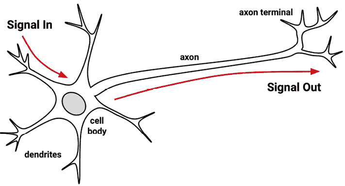

图 7.1：生物神经元的艺术描绘

单个人工神经元的模型可以用与生物模型非常相似的方式来理解。如图所示，一个有向网络图定义了通过树突接收的输入信号（*x*变量）和输出信号（*y*变量）之间的关系。就像生物神经元一样，每个树突的信号都会根据其重要性进行加权（现在忽略这些权重是如何确定的）。输入信号由细胞体相加，然后根据一个表示为*f*的**激活函数**传递信号。

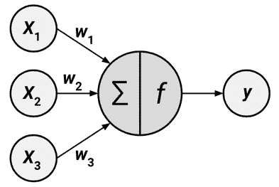

图 7.2：人工神经元的设计旨在模仿生物神经元的结构和功能

典型的人工神经元可以用以下公式表示，其中*n*表示输入树突的数量。*w*权重允许每个*n*个输入（用*x*[i]表示）对输入信号的总和贡献更多或更少的量。净总信号由激活函数*f(x)*使用，产生的信号*y(x)*是输出轴突：

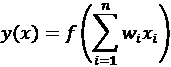

神经网络使用这种方式定义的神经元作为构建复杂数据模型的基石。尽管神经网络有无数种变体，但每种都可以用以下特征来定义：

+   **激活函数**，它将神经元的净输入信号转换成单个输出信号，以便在网络中进一步广播

+   **网络拓扑**（或架构），它描述了模型中的神经元数量，以及层数和它们之间的连接方式

+   **训练算法**，它指定了如何根据输入信号的比例来设置连接权重以抑制或兴奋神经元

让我们来看看每个类别中的一些变体，看看它们如何被用来构建典型的神经网络模型。

## 激活函数

**激活函数**是人工神经元处理传入信息并确定是否将信号传递给网络中其他神经元的机制。正如人工神经元是模仿生物版本一样，激活函数也是模仿自然的设计。

在生物案例中，激活函数可以想象为一个涉及求和总输入信号并确定它是否达到触发阈值的进程。如果是这样，神经元就会传递信号；否则，它就什么都不做。在 ANN 术语中，这被称为**阈值激活函数**，因为它只在达到指定的输入阈值时产生输出信号。

以下图描绘了一个典型的阈值函数；在这种情况下，当输入信号的求和至少为零时，神经元就会触发。由于其形状类似于楼梯，有时也被称为**单位步激活函数**。

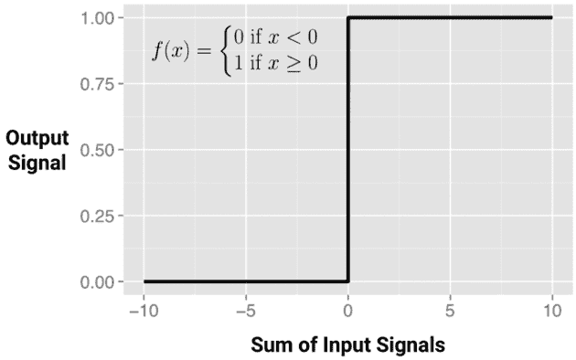

图 7.3：阈值激活函数仅在输入信号达到阈值后才“开启”

尽管阈值激活函数由于其与生物学的相似性而有趣，但在 ANN 中很少使用。摆脱生物化学的限制，ANN 激活函数可以根据其展示的期望数学特征和准确模拟数据之间关系的能力来选择。

可能最常用的替代方案是以下图中所示的**S 型激活函数**（更具体地说，是*逻辑* S 型）。请注意，在所示公式中，*e*是自然对数的底（大约为 2.72）。尽管它与阈值激活函数具有相似的步骤或“S”形状，但输出信号不再是二进制的；输出值可以落在零到一之间的任何地方。此外，S 型函数是**可微分的**，这意味着可以计算整个输入范围内的导数（曲线上的某一点的切线斜率）。正如你稍后将会学到的那样，这一特性对于创建高效的 ANN 优化算法至关重要。

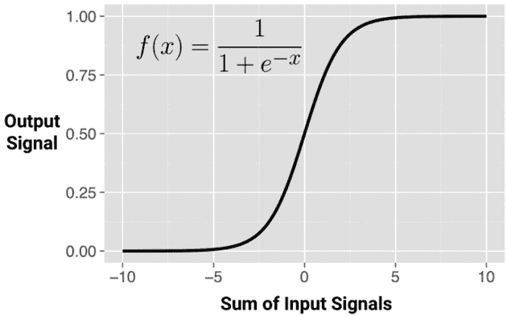

图 7.4：S 型激活函数使用平滑曲线来模拟自然界中发现的单位步激活函数

尽管 S 型函数可能是最常用的激活函数，并且通常默认使用，但一些神经网络算法允许选择替代方案。以下图 7.5 中展示了这类激活函数的选择：

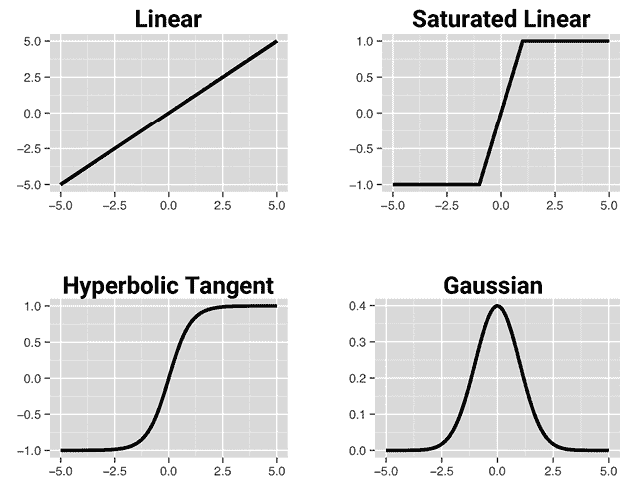

图 7.5：几种常见的神经网络激活函数

区分这些激活函数的主要细节是输出信号的范围。通常，这可能是以下之一：(0, 1)，(-1, +1)，或 (-∞, +∞)。激活函数的选择会影响神经网络的偏差，使其可能更适合某些类型的数据，从而允许构建专门的神经网络。例如，线性激活函数会导致神经网络非常类似于线性回归模型，而高斯激活函数是**径向基函数**（RBF）网络的基础。这些中的每一个都有适合某些学习任务的优点，而不适合其他任务。

神经网络几乎只使用非线性激活函数，因为这是网络随着节点数量的增加而变得更智能的原因。仅限于线性激活函数的网络将限于线性解决方案，并且其表现不会优于许多更简单的回归方法。

重要的是要认识到，对于许多激活函数，影响输出信号的输入值范围相对较窄。例如，在 sigmoid 函数的情况下，当输入信号低于-5 时，输出信号非常接近 0，而当输入信号高于 5 时，输出信号非常接近 1。以这种方式压缩信号会导致动态输入的高低端饱和，就像将吉他放大器音量调得过高，由于声音波峰的截断而导致失真声音一样。因为这种做法本质上是将输入值挤压到一个更小的输出值范围内，所以像 sigmoid 这样的激活函数有时被称为**挤压函数**。

解决挤压问题的方法之一是将所有神经网络输入转换，使得特征值落在围绕零的小范围内。这可能涉及标准化或归一化特征。通过限制输入值的范围，激活函数将能够在整个范围内工作。一个附带的好处是，模型也可能训练得更快，因为算法可以更快地遍历可操作的输入值范围。

虽然从理论上讲，神经网络可以通过多次迭代调整其权重来适应非常动态的特征，但在极端情况下，许多算法会在这种情况发生之前就停止迭代。如果你的模型未能收敛，请务必检查你是否已正确标准化了输入数据。选择不同的激活函数也可能是合适的。

## 网络拓扑

神经网络学习的能力根植于其拓扑结构，即相互连接的神经元的模式和结构。尽管有无数种网络架构形式，但它们可以通过三个关键特征来区分：

+   层数的数量

+   网络中信息是否允许向后传播

+   网络每一层中的节点数量

拓扑决定了网络可以学习的任务复杂性。一般来说，更大、更复杂的网络可以识别更微妙的模式和更复杂的决策边界。然而，网络的力量不仅取决于网络的大小，还取决于单元的排列方式。

### 层数的数量

要定义拓扑，我们需要术语来区分网络中位置不同的人工神经元。*图 7.6*展示了一个非常简单的网络的拓扑结构。一组称为**输入节点**的神经元直接从输入数据接收未经处理的信号。每个输入节点负责处理数据集中单个特征；该特征值将通过相应节点的激活函数进行转换。输入节点发送的信号被**输出节点**接收，该节点使用自己的激活函数生成最终的预测（在此处表示为*p*）。

输入和输出节点被安排在称为**层**的组中。因为输入节点以接收到的数据完全相同的方式处理传入的数据，所以网络只有一个连接权重集（在此处标记为*w*[1]，*w*[2]，和*w*[3]）。因此，它被称为**单层网络**。单层网络可用于基本的模式分类，尤其是对于线性可分模式的分类，但对于大多数学习任务，需要更复杂的网络。

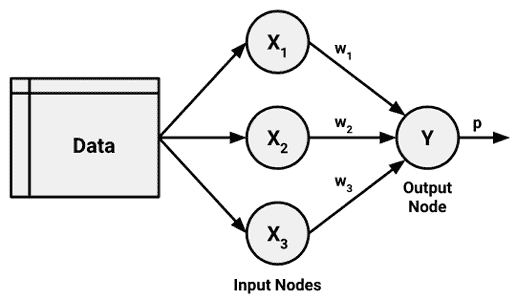

图 7.6：具有三个输入节点的简单单层 ANN

如您所预期的那样，创建更复杂网络的一个明显方法是通过添加额外的层。如图*图 7.7*所示，一个**多层网络**添加一个或多个**隐藏层**，这些隐藏层在信号到达输出节点之前处理来自输入节点的信号。隐藏节点之所以得名，是因为它们在网络中心被遮挡，并且它们与数据和输出的关系更难以理解。隐藏层使得人工神经网络成为一个黑盒模型；了解这些层内部发生的事情实际上是不可能的，尤其是当拓扑变得更加复杂时。

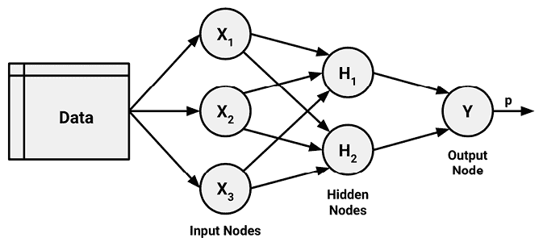

图 7.7：具有单个两个节点隐藏层的多层网络

更复杂拓扑的示例在*图 7.8*中展示。可以使用多个输出节点来表示具有多个类别的结果。可以使用多个隐藏层来允许黑盒内部有更多的复杂性，从而模拟更复杂的问题。

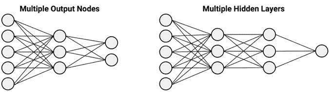

图 7.8：复杂的 ANN 可以具有多个输出节点或多个隐藏层

具有多个隐藏层的神经网络被称为**深度神经网络**（**DNN**），训练此类网络的实践被称为**深度学习**。在大数据集上训练的 DNN 在复杂任务如图像识别和文本处理上能够达到类似人类的性能。因此，深度学习被炒作成为机器学习中的下一个重大飞跃，但深度学习更适合某些任务而不是其他任务。

尽管深度学习在传统模型难以应对的复杂学习任务上表现相当出色，但它需要比大多数项目中找到的更大的数据集和更丰富的特征集。典型的学习任务包括对图像、音频或文本等非结构化数据进行建模，以及随时间重复测量的结果，如股票市场价格或能源消耗。在这些类型的数据上构建深度神经网络（DNN）需要专门的计算软件（有时还需要硬件），其使用难度比简单的 R 包要大。第十五章“利用大数据”提供了如何使用这些工具在 R 中执行深度学习和图像识别的详细信息。

### 信息传递的方向

简单的多层网络通常是**全连接**的，这意味着一个层中的每个节点都与下一层的每个节点相连，但这并非必需。更大的深度学习模型，例如将在第十五章“利用大数据”中介绍的用于图像识别的**卷积神经网络**（**CNN**），只是部分连接。移除一些连接有助于限制在众多隐藏层中可能发生的过度拟合的数量。然而，这并非我们操纵拓扑的唯一方式。除了节点是否连接之外，我们还可以指定信息流在整个连接中的方向，并产生适合不同类型学习任务的神经网络。

你可能已经注意到，在前面的例子中，箭头被用来指示只在一个方向上传递的信号。从输入层到输出层连续单向输入输入信号的神经网络被称为**前馈网络**。尽管对信息流有限制，但前馈网络提供了令人惊讶的灵活性。

例如，可以改变每个级别的级别和节点数量，可以同时建模多个结果，或者应用多个隐藏层。

与前馈网络不同，**循环神经网络**（**RNN**）（或**反馈网络**）允许信号通过循环向后传递。这种特性更接近于生物神经网络的工作方式，使得学习极其复杂的模式成为可能。加入短期记忆，或**延迟**，极大地增强了循环网络的能力。值得注意的是，这包括理解随时间推移的事件序列的能力。这可以用于股市预测、语音理解或天气预报。一个简单的循环网络如下所示：

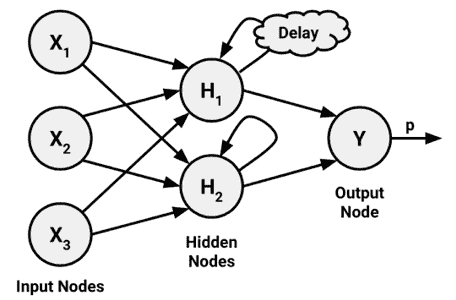

图 7.9：允许信息在网络中向后传递可以模拟时间延迟

由于 RNN 的短期记忆在定义上显然是短的，因此一种名为**长短期记忆**（**LSTM**）的 RNN 形式调整了模型，使其具有显著更长的回忆能力——就像既有短期又有长期记忆的活物一样。虽然这似乎是一种明显的改进，但计算机具有完美的记忆，因此需要明确告知何时忘记和何时记住。挑战在于在过早忘记和过长记住之间找到平衡，这比说起来要难得多，因为用于训练模型的数学函数自然地被拉向这两个极端，原因将在本章继续阅读时变得更加清晰。

更多关于 LSTM 神经网络的信息，请参阅*理解 LSTM——关于长短期记忆循环神经网络教程，Staudemeyer RC 和 Morris ER，2019*。[`arxiv.org/abs/1909.09586`](https://arxiv.org/abs/1909.09586)。

LSTM 神经网络的发展导致了人工智能的进步，例如使机器人能够模仿控制机械、驾驶和玩电子游戏所需的人类行为序列。LSTM 模型也显示出在语音和文本识别、理解语言语义以及在不同语言之间翻译和学习复杂策略方面的能力。DNN 和循环网络越来越多地被用于各种高调应用，因此自本书第一版出版以来，它们变得更加流行。然而，构建这样的网络需要超出本书范围的技术和软件，并且通常需要访问专门的计算硬件或云服务器。

另一方面，简单的前馈网络也非常擅长模拟许多现实世界的任务，尽管这些任务可能不如自动驾驶汽车和玩电子游戏的计算机那样令人兴奋。虽然深度学习正在迅速成为主流，但多层前馈网络，也称为**多层感知器**（**MLP**），可能仍然是传统学习任务的默认标准人工神经网络拓扑。此外，理解 MLP 拓扑为以后构建更复杂的深度学习模型提供了强大的理论基础。

### 每层的节点数量

除了层数和信息传递方向的变化之外，神经网络还可以通过每层的节点数量来变化其复杂性。输入节点的数量由输入数据中的特征数量预先确定。同样，输出节点的数量由要模拟的结果数量或结果中的类别级别数量预先确定。然而，隐藏节点的数量留给用户在训练模型之前决定。

不幸的是，没有可靠的规则来确定隐藏层中神经元的数量。合适的数量取决于输入节点的数量、训练数据量、噪声数据量以及学习任务的复杂性等因素。

通常，具有更多网络连接的更复杂网络拓扑允许学习更复杂的问题。更多的神经元将导致一个模型更接近训练数据，但这也存在过拟合的风险；它可能对未来数据的泛化能力较差。大型神经网络也可能计算成本高昂且训练缓慢。最佳实践是使用最少节点，这些节点在验证数据集上能够实现足够的性能。在大多数情况下，即使只有少量隐藏节点——通常只有几个——神经网络也能展现出惊人的学习能力。

已被证明，具有至少一个具有足够多神经元和非线性激活函数的隐藏层的神经网络是一个**通用函数逼近器**。这意味着神经网络可以用来逼近任何连续函数，在有限区间内达到任意精度的近似。这就是神经网络获得在章节引言中描述的那种“魔法”能力的地方；将一组输入放入神经网络的黑盒中，它可以学会产生任何一组输出，无论输入和输出之间的关系有多么复杂。当然，这假设“足够多的神经元”以及足够的数据来合理训练网络——同时避免对噪声过拟合，以便近似可以泛化到训练示例之外。我们将在下一节进一步探讨允许这种魔法发生的黑盒。

要查看网络拓扑变化如何使神经网络成为通用函数逼近器的实时可视化，请访问[`playground.tensorflow.org/`](http://playground.tensorflow.org/)的深度学习游乐场。游乐场允许你实验预测模型，其中特征与目标之间的关系复杂且非线性。虽然回归和决策树等方法在解决这些问题上会遇到困难，但你将发现，添加更多的隐藏节点和层可以使网络在足够的训练时间内为每个示例提供一个合理的近似。请注意，特别是选择线性激活函数而不是 Sigmoid 或双曲正切（tanh）函数，可以防止网络无论网络拓扑的复杂性如何都能学习到一个合理的解决方案。

## 通过调整连接权重来训练神经网络

网络拓扑是一个白板，它本身并没有学习到任何东西。就像一个新生儿一样，它必须通过经验来训练。随着神经网络处理输入数据，神经元之间的连接会加强或减弱，这类似于婴儿的大脑在经历环境时的发展。网络的连接权重会调整以反映随时间观察到的模式。

通过调整连接权重来训练神经网络是非常计算密集的。因此，尽管它们在几十年前就已经被研究，但直到 20 世纪 80 年代中后期，当发现了一种有效的训练 ANN 的方法之前，ANNs 很少应用于实际的学习任务。这个使用反向传播错误策略的算法现在简单地被称为**反向传播**。

意外的是，几个研究团队几乎在同一时间独立发现了并发表了反向传播算法。其中，最常被引用的工作可能是*Rumelhart, DE, Hinton, GE, Williams, RJ, Nature, 1986, Vol. 323, pp. 533-566，通过反向传播错误学习表示*。

尽管与许多其他机器学习算法相比，反向传播方法在计算上仍然有些昂贵，但它导致了人工神经网络（ANNs）兴趣的复苏。因此，使用反向传播算法的多层前馈网络现在在数据挖掘领域很常见。这些模型具有以下优点和缺点：

| **优点** | **缺点** |
| --- | --- |

|

+   可以适应分类或数值预测问题

+   一种“通用逼近器”，能够模拟比几乎所有算法更复杂的模式

+   对数据的潜在关系假设很少

|

+   极其计算密集且训练缓慢，尤其是如果网络拓扑复杂

+   极易过拟合训练数据，导致泛化能力差

+   导致了一个复杂的黑盒模型，难以解释，如果不是不可能的话

|

在其最一般的形式中，反向传播算法通过许多两个过程的循环迭代。每个循环被称为一个**时代**。因为网络不包含**先验**（现有）知识，所以起始权重通常设置为随机。然后，算法通过这些过程迭代，直到达到停止标准。反向传播算法中的每个时代包括：

+   一个**前向阶段**，在这个阶段，神经元按顺序从输入层到输出层被激活，沿途应用每个神经元的权重和激活函数。当达到最后一层时，产生一个输出信号。

+   一个**反向阶段**，在这个阶段，网络的前向阶段产生的输出信号与训练数据中的真实目标值进行比较。网络输出信号与真实值之间的差异导致一个错误，该错误在网络中向后传播以修改神经元之间的连接权重并减少未来的错误。

随着时间的推移，算法使用向后发送的信息来减少网络犯下的总错误。然而，一个问题仍然存在：由于每个神经元的输入和输出之间的关系复杂，算法如何确定权重应该改变多少？

这个问题的答案涉及一种称为**梯度下降**的技术。从概念上讲，这类似于一个被困在丛林中的探险者如何找到通往水源的道路。通过检查地形并持续向最大下坡方向行走，探险者最终会到达最低的谷地，这很可能是河床。

在一个类似的过程中，反向传播算法使用每个神经元的激活函数的导数来识别每个输入权重的方向梯度——因此具有可微分的激活函数的重要性。梯度表明误差将如何随着权重的变化而减少或增加。算法将尝试通过称为**学习率**的量来改变权重，以实现误差的最大减少。学习率越大，算法尝试沿着梯度下降的速度就越快，这可能会减少训练时间，但也可能超过谷地。

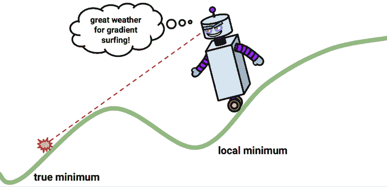

图 7.10：梯度下降算法寻求最小误差，但也可能找到一个局部最小值

尽管使用梯度下降法找到最小误差率所需的数学知识复杂，因此超出了本书的范围，但在实践中通过其在 R 中神经网络算法的实现应用起来却很容易。让我们将我们对多层前馈网络的理解应用于一个实际问题。

# 示例 - 使用人工神经网络建模混凝土强度

在工程领域，拥有建筑材料的准确性能估计至关重要。这些估计是制定用于建筑、桥梁和道路建设中所用材料的安全生产指南所必需的。

估计混凝土的强度是一个特别有趣的问题。尽管它在几乎每个建设项目中都被使用，但由于各种成分以复杂的方式相互作用，混凝土的性能差异很大。因此，准确预测最终产品的强度是困难的。一个能够根据输入材料的成分列表可靠地预测混凝土强度的模型，可能导致更安全的施工实践。

## 第 1 步 – 收集数据

对于这次分析，我们将利用 I-Cheng Yeh 捐赠给 UCI 机器学习仓库（[`archive.ics.uci.edu/ml`](http://archive.ics.uci.edu/ml)）的混凝土抗压强度数据。由于他发现使用神经网络来模拟这些数据是成功的，我们将尝试使用 R 中的简单神经网络模型来复制 Yeh 的工作。

关于 Yeh 对这一学习任务的方法的更多信息，请参阅*使用人工神经网络建模高性能混凝土强度，Yeh, IC，水泥与混凝土研究，1998，第 28 卷，第 1797-1808 页*。

根据网站信息，该数据集包含 1,030 个混凝土示例，其中包含 8 个特征，描述了混合物中使用的成分。这些特征被认为与最终的抗压强度相关，包括产品中使用的水泥、矿渣、灰、水、超塑化剂、粗骨料和细骨料的量（以每立方米千克计），以及老化时间（以天为单位）。

要跟随这个示例，请从 Packt Publishing 网站下载`concrete.csv`文件，并将其保存到您的 R 工作目录中。

## 第 2 步 – 探索和准备数据

如同往常，我们将通过使用`read.csv()`函数将数据加载到 R 对象中，并确认它符合预期的结构来开始我们的分析：

```py
> concrete <- read.csv("concrete.csv")
> str(concrete) 
```

```py
'data.frame': 1030 obs. of  9 variables:
 $ cement      : num  141 169 250 266 155 ...
 $ slag        : num  212 42.2 0 114 183.4 ...
 $ ash         : num  0 124.3 95.7 0 0 ...
 $ water       : num  204 158 187 228 193 ...
 $ superplastic: num  0 10.8 5.5 0 9.1 0 0 6.4 0 9 ...
 $ coarseagg   : num  972 1081 957 932 1047 ...
 $ fineagg     : num  748 796 861 670 697 ...
 $ age         : int  28 14 28 28 28 90 7 56 28 28 ...
 $ strength    : num  29.9 23.5 29.2 45.9 18.3 ... 
```

数据框中的九个变量对应于八个特征和一个预期的结果，尽管已经出现了一个问题。神经网络在输入数据缩放到零附近的狭窄范围内表现最佳，而在这里我们看到值从零到超过一千。

通常，解决这个问题的方法是使用归一化或标准化函数对数据进行缩放。如果数据遵循钟形曲线（如*第二章*中描述的*管理和理解数据*的正常分布），那么使用 R 内置的`scale()`函数进行标准化可能是有意义的。另一方面，如果数据遵循均匀分布或严重非正态分布，那么将数据归一化到零到一的范围可能更合适。在这种情况下，我们将使用后者。

在 *第三章*，*懒惰学习 – 使用最近邻进行分类* 中，我们定义了自己的 `normalize()` 函数如下：

```py
> normalize <- function(x) {
    return((x - min(x)) / (max(x) - min(x)))
} 
```

执行此代码后，我们可以使用 `lapply()` 函数将 `normalize()` 函数应用于混凝土数据框中的每一列，如下所示：

```py
> concrete_norm <- as.data.frame(lapply(concrete, normalize)) 
```

为了确认归一化工作正常，我们可以看到现在最小和最大的强度分别为零和一：

```py
> summary(concrete_norm$strength) 
```

```py
 Min. 1st Qu.  Median    Mean 3rd Qu.    Max. 
 0.0000  0.2664  0.4001  0.4172  0.5457  1.0000 
```

与此相比，原始的最小值和最大值分别为 2.33 和 82.60：

```py
> summary(concrete$strength) 
```

```py
 Min.  1st Qu.  Median    Mean   3rd Qu.    Max. 
   2.33   23.71    34.45   35.82    46.13     82.60 
```

在训练模型之前应用于数据的任何转换都必须反向应用，以便将其转换回原始的单位。为了便于缩放，保存原始数据或至少原始数据的摘要统计信息是明智的。

沿用原始出版物中 Yeh 的先例，我们将数据分为包含 75% 示例的训练集和包含 25% 的测试集。我们使用的 CSV 文件已经随机排序，所以我们只需将其分为两部分：

```py
> concrete_train <- concrete_norm[1:773, ]
> concrete_test <- concrete_norm[774:1030, ] 
```

我们将使用训练数据集来构建神经网络，并使用测试数据集来评估模型对未来结果的泛化能力。由于神经网络很容易过拟合，这一步非常重要。

## 第 3 步 – 在数据上训练模型

为了模拟混凝土中使用的成分与最终产品强度之间的关系，我们将使用多层前馈神经网络。Stefan Fritsch 和 Frauke Guenther 的 `neuralnet` 包提供了一个标准且易于使用的此类网络实现。它还提供了一个用于绘制网络拓扑的功能。因此，`neuralnet` 实现是学习更多关于神经网络的一个很好的选择，尽管这并不意味着它不能用于完成实际工作——它是一个非常强大的工具，你很快就会看到。

在 R 中训练简单的 ANN 模型有几个其他常用的包，每个包都有其独特的优点和缺点。由于它作为标准 R 安装的一部分提供，`nnet` 包可能是引用最多的 ANN 实现。它使用比标准反向传播稍微复杂一点的算法。另一个选择是 `RSNNS` 包，它提供了一个完整的神经网络功能套件，缺点是它更难学习。构建或使用深度学习神经网络的专用软件在第十五章 *利用大数据* 中介绍。

由于 `neuralnet` 不包含在基础 R 中，您需要通过输入 `install.packages("neuralnet")` 来安装它，并使用 `library(neuralnet)` 命令加载它。包含的 `neuralnet()` 函数可以用于使用以下语法训练用于数值预测的神经网络：

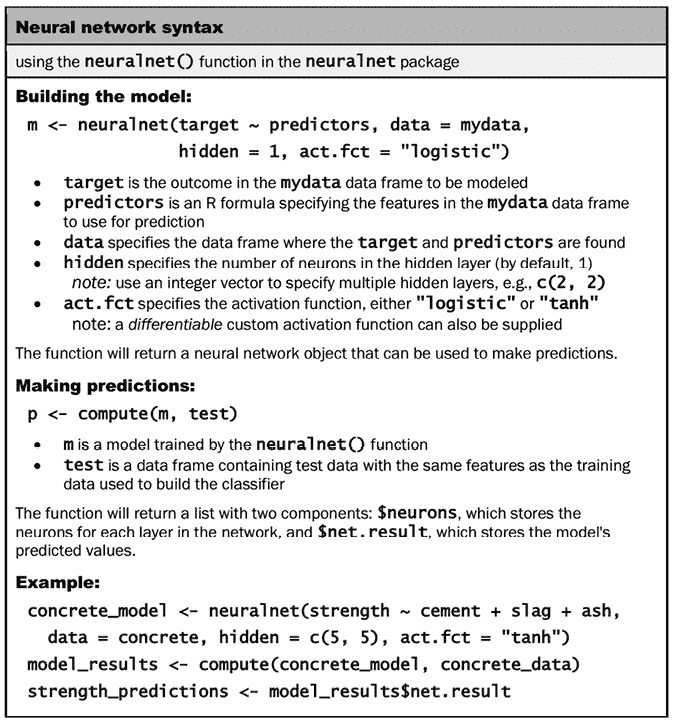

图 7.11：神经网络语法

我们将开始使用默认设置训练最简单的多层前馈网络，仅使用单个隐藏节点。由于训练人工神经网络的过程涉及随机化，这里使用的 `set.seed()` 函数将确保在运行 `neuralnet()` 函数时产生相同的结果：

```py
> set.seed(12345)
> concrete_model <- neuralnet(strength ~ cement + slag +
  ash + water + superplastic + coarseagg + fineagg + age,
  data = concrete_train) 
```

然后，我们可以使用结果模型对象的 `plot()` 函数来可视化网络拓扑：

```py
> plot(concrete_model) 
```

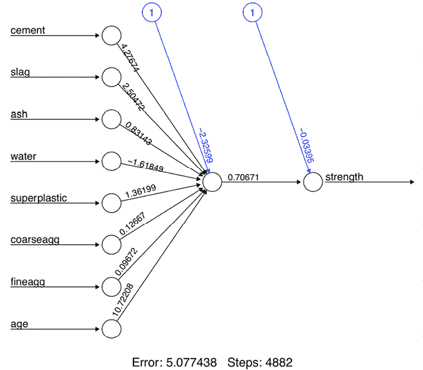

图 7.12：简单多层前馈网络的拓扑可视化

在这个简单模型中，每个特征都有一个输入节点，接着是一个单一的隐藏节点和一个单一的输出节点，该输出节点预测混凝土强度。每个连接的权重也被描绘出来，以及由标记为数字 `1` 的节点表示的**偏差项**。偏差项是数值常数，允许指示节点的值向上或向下移动，就像线性方程中的截距一样。在形式为 *y = ax + b* 的线性方程中，截距 *b* 允许当 *x = 0* 时，*y* 有一个非零的值。同样，神经网络中的偏差项允许当输入为零时，节点传递一个非零的值。这为学习数据中找到的真实模式提供了更多的灵活性，从而有助于模型更好地拟合。在具体到我们的混凝土模型的情况下，尽管在现实世界中不可能所有输入到混凝土中的因素（如水泥、年龄和水）都为零，但我们不一定会期望强度在接近零的这些因素值时，强度会精确地穿过原点。我们可能期望体重与年龄的关系模型具有一个大于零的偏差项，因为出生时的体重（*年龄 = 0*）是大于零的。

一个具有单个隐藏节点的神经网络可以被视为我们在 *第六章* 中研究的线性回归模型的远亲，即 *预测数值数据 – 回归方法*。每个输入节点与隐藏节点之间的权重类似于 beta 系数，而偏差项的权重类似于截距。如果使用线性激活函数，神经网络几乎就是线性回归。然而，一个关键的区别是，人工神经网络使用梯度下降进行训练，而线性回归通常使用最小二乘法。

在图的下部，R 报告了训练步骤的数量和一个称为**平方误差和**（**SSE**）的错误度量，正如你可能预期的，它是预测值和实际值之间平方差的和。SSE 越低，模型与训练数据的符合度越高，这告诉我们关于训练数据的表现，但很少告诉我们它在未见数据上的表现。

## 第 4 步 – 评估模型性能

网络拓扑图让我们窥视了人工神经网络（ANN）的黑箱，但它并没有提供太多关于模型如何适应未来数据的信息。为了在测试数据集上生成预测，我们可以使用`compute()`函数如下：

```py
> model_results <- compute(concrete_model, concrete_test[1:8]) 
```

`compute()` 函数与我们迄今为止使用的 `predict()` 函数工作方式略有不同。它返回一个包含两个组件的列表：`$neurons`，它存储网络中每一层的神经元，以及`$net.result`，它存储预测值。我们想要后者：

```py
> predicted_strength <- model_results$net.result 
```

由于这是一个数值预测问题而不是分类问题，我们不能使用混淆矩阵来检查模型精度。相反，我们将测量我们预测的混凝土强度与真实值之间的相关性。如果预测值和实际值高度相关，则该模型很可能是混凝土强度的有用衡量标准。

记住，`cor()` 函数用于获取两个数值向量之间的相关性：

```py
> cor(predicted_strength, concrete_test$strength) 
```

```py
 [,1]
[1,] 0.8064656 
```

接近 1 的相关性表明两个变量之间存在强烈的线性关系。因此，这里大约 0.806 的相关性表明存在相当强的关系。这表明我们的模型做得相当不错，即使只有一个隐藏节点。然而，鉴于我们只使用了一个隐藏节点，我们很可能会提高我们模型的表现。让我们尝试做得更好。

## 第 5 步 - 提高模型性能

由于具有更复杂拓扑结构的网络能够学习更复杂的概念，让我们看看当我们把隐藏节点的数量增加到五个时会发生什么。我们像以前一样使用`neuralnet()`函数，但添加参数`hidden = 5`。请注意，由于这个神经网络复杂性的增加，根据您计算机的能力，新的模型可能需要 30 到 60 秒来训练：

```py
> set.seed(12345)
> concrete_model2 <- neuralnet(strength ~ cement + slag +
                               ash + water + superplastic +
                               coarseagg + fineagg + age,
                               data = concrete_train, hidden = 5) 
```

再次绘制网络图，我们发现连接数量急剧增加。这对性能有何影响？

```py
> plot(concrete_model2) 
```

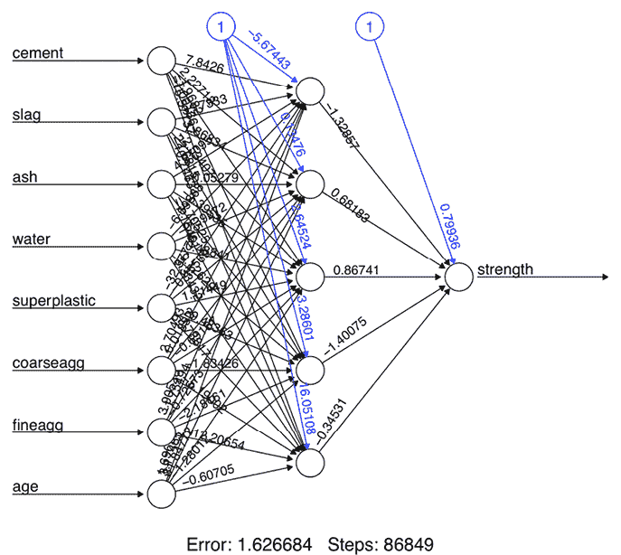

图 7.13：具有额外隐藏节点的神经网络的拓扑可视化

注意，报告的误差（再次通过 SSE 测量）已从先前模型的 5.08 降低到这里的 1.63。此外，训练步骤的数量从 4,882 增加到 86,849，考虑到模型变得更加复杂，这一点并不令人惊讶。更复杂的网络需要更多的迭代来找到最优权重。

将相同的步骤应用于将预测值与真实值进行比较，我们现在获得大约 0.92 的相关性，这比之前单个隐藏节点时的 0.80 结果有相当大的改进：

```py
> model_results2 <- compute(concrete_model2, concrete_test[1:8])
> predicted_strength2 <- model_results2$net.result
> cor(predicted_strength2, concrete_test$strength) 
```

```py
 [,1]
[1,] 0.9244533426 
```

尽管有这些显著的改进，我们仍然可以做一些更多的事情来尝试提高模型的表现。特别是，我们有能力添加额外的隐藏层并更改网络的激活函数。在做出这些更改时，我们为一个非常简单的深度神经网络（DNN）奠定了基础。

激活函数的选择通常对深度学习非常重要。对于特定的学习任务，最佳函数通常是通过实验确定的，然后在机器学习研究社区中更广泛地共享。随着深度学习研究的深入，一种称为**rectifier**的激活函数因其成功应用于图像识别等复杂任务而变得极为流行。使用 rectifier 激活函数的神经网络中的节点被称为**rectified linear unit**（**ReLU**）。如图所示，ReLU 激活函数的定义是，当*x*至少为零时返回*x*，否则返回零。这种函数在深度学习中的流行是因为它非线性，但具有简单的数学性质，这使得它在计算上既便宜又高效，非常适合梯度下降。不幸的是，其导数在*x = 0*时未定义，因此不能与`neuralnet()`函数一起使用。

相反，我们可以使用 ReLU 的平滑近似，称为**softplus**或**SmoothReLU**，这是一个定义为*log*(*1 + e*^x)的激活函数。如图所示，当*x*小于零时，softplus 函数几乎为零，而当*x*大于零时，大约等于*x*：

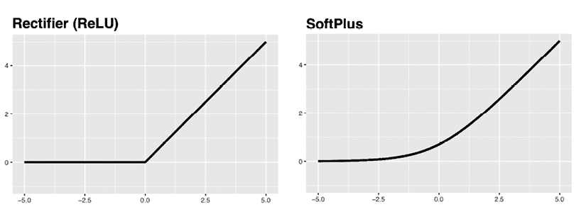

图 7.14：softplus 激活函数提供了 ReLU 的平滑、可微近似的描述

要在 R 中定义`softplus()`函数，请使用以下代码：

```py
> softplus <- function(x) { log(1 + exp(x)) } 
```

可以通过`act.fct`参数将此激活函数提供给`neuralnet()`。此外，我们还将通过将`hidden`参数设置为整数向量`c(5, 5)`来添加一个包含五个节点的第二隐藏层。这创建了一个两层网络，每层都有五个节点，都使用 softplus 激活函数。和之前一样，这可能需要一分钟或更长时间来运行：

```py
> set.seed(12345)
> concrete_model3 <- neuralnet(strength ~ cement + slag +
                               ash + water + superplastic +
                               coarseagg + fineagg + age,
                               data = concrete_train,
                               hidden = c(5, 5),
                               act.fct = softplus) 
```

网络可视化现在显示了一个由每个包含五个节点的两层隐藏层组成的拓扑结构：

```py
> plot(concrete_model3) 
```

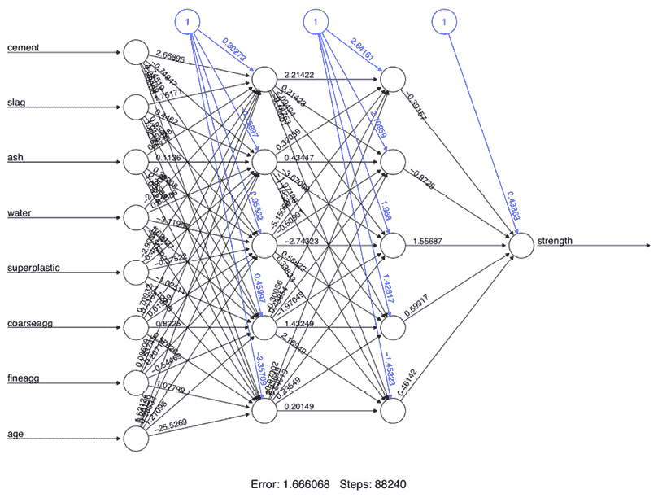

图 7.15：使用软 plus 激活函数，用两层隐藏节点可视化我们的网络

再次，让我们计算预测值和实际混凝土强度之间的相关性：

```py
> model_results3 <- compute(concrete_model3, concrete_test[1:8])
> predicted_strength3 <- model_results3$net.result
> cor(predicted_strength3, concrete_test$strength) 
```

```py
 [,1]
[1,] 0.9348395359 
```

预测值和实际强度之间的相关性为 0.935，这是我们迄今为止的最佳性能。有趣的是，在原始出版物中，Yeh 报告的相关性为 0.885。这意味着我们只需付出相对较小的努力，就能匹配甚至超过领域专家的性能。当然，Yeh 的结果是在 1998 年发表的，这使我们能够受益于 25 年额外的神经网络研究！

有一个重要的事情需要注意，因为我们训练模型之前已经对数据进行归一化处理，所以预测也是在从零到一的归一化尺度上。例如，以下代码显示了一个数据框，它将原始数据集的混凝土强度值与其对应的预测值并排比较：

```py
> strengths <- data.frame(
    actual = concrete$strength[774:1030],
    pred = predicted_strength3
  ) 
```

```py
> head(strengths, n = 3)
    actual         pred
774  30.14 0.2860639091
775  44.40 0.4777304648
776  24.50 0.2840964250 
```

使用相关性作为性能指标，归一化或未归一化数据的选择不会影响结果。例如，无论预测强度与原始、未归一化的混凝土强度值（`strengths$actual`）还是与归一化值（`concrete_test$strength`）进行比较，相关性为 0.935 都是相同的：

```py
> cor(strengths$pred, strengths$actual) 
```

```py
[1] 0.9348395 
```

```py
> cor(strengths$pred, concrete_test$strength) 
```

```py
[1] 0.9348395 
```

然而，如果我们计算不同的性能指标，例如预测值和实际值之间的百分比差异，那么选择的比例就会相当重要。

在这个前提下，我们可以创建一个`unnormalize()`函数，它反转了 min-max 归一化过程，并允许我们将归一化的预测值转换为原始尺度：

```py
> unnormalize <- function(x) {
    return(x * (max(concrete$strength) -
            min(concrete$strength)) + min(concrete$strength))
} 
```

在将自定义的`unnormalize()`函数应用于预测之后，我们可以看到新的预测值（`pred_new`）与原始混凝土强度值处于相似的尺度上。这使我们能够计算一个有意义的百分比误差值。得到的`error_pct`是真实值和预测值之间的百分比差异：

```py
> strengths$pred_new <- unnormalize(strengths$pred)
> strengths$error_pct <- (strengths$pred_new - strengths$actual) / 
                            strengths$actual 
```

```py
> head(strengths, n = 3)
    actual      pred pred_new  error_pct
774  30.14 0.2860639 25.29235 -0.16083776
775  44.40 0.4777305 40.67742 -0.08384179
776  24.50 0.2840964 25.13442 -0.02589470 
```

出乎意料的是，尽管反转了归一化，相关性仍然保持不变：

```py
> cor(strengths$pred_new, strengths$actual) 
```

```py
[1] 0.9348395 
```

当将神经网络应用于自己的项目时，你需要执行一系列类似的步骤，以将数据返回到其原始尺度。

你可能会发现，随着神经网络应用于更具挑战性的学习任务，它们会迅速变得更加复杂。例如，你可能会遇到所谓的**消失梯度问题**和与之密切相关的**爆炸梯度问题**，在这些问题中，由于无法在合理的时间内收敛，反向传播算法无法找到有用的解决方案。

作为这些问题的补救措施，人们可能会尝试改变隐藏节点的数量，应用不同的激活函数，如 ReLU，调整学习率等等。`?neuralnet`帮助页面提供了更多关于可以调整的各种参数的信息。然而，这又导致另一个问题，即测试许多参数成为构建高性能模型的一个瓶颈。这是人工神经网络（ANNs）和，尤其是深度神经网络（DNNs）的权衡：利用它们的巨大潜力需要巨大的时间和计算资源投入。

正如生活中更普遍的情况一样，在机器学习中，我们可以权衡时间和金钱。使用付费的云计算资源，如**亚马逊网络服务**（**AWS**）和微软 Azure，可以更快地构建更复杂的模型或测试许多模型。

# 理解支持向量机

可以将**支持向量机**（**SVM**）想象为在多维空间中绘制数据点所形成的表面，该空间代表示例及其特征值。SVM 的目标是创建一个称为**超平面**的平坦边界，将空间分割成两侧相对均匀的分区。通过这种方式，SVM 学习结合了第三章中介绍的基于实例的最近邻学习（*Lazy Learning – Classification Using Nearest Neighbors*）和第六章中描述的线性回归建模（*Forecasting Numeric Data – Regression Methods*）的方面。这种组合非常强大，使得 SVM 能够模拟高度复杂的关系。

尽管驱动 SVM 的基本数学原理已经存在了几十年，但自从机器学习社区采用它们之后，对它们的兴趣大大增加。在关于困难学习问题的知名成功故事以及获奖的 SVM 算法在许多编程语言（包括 R）中得到实现之后，它们的受欢迎程度爆炸式增长。因此，SVM 被广泛采用，这可能会让那些否则无法应用实现 SVM 所需的相对复杂数学的受众。好消息是，尽管数学可能很难，但基本概念是可理解的。

支持向量机（SVMs）可以适应用于几乎任何类型的机器学习任务，包括分类和数值预测。该算法的关键成功之一在于模式识别。值得注意的应用包括：

+   在生物信息学领域对微阵列基因表达数据进行分类，以识别癌症或其他遗传疾病

+   文本分类，例如识别文档中使用的语言或根据主题内容对文档进行分类

+   检测罕见但重要的事件，如发动机故障、安全漏洞或地震

当用于二元分类时，SVM 最容易理解，这也是该方法传统上应用的方式。因此，在接下来的部分中，我们将仅关注 SVM 分类器。这里提出的原则也适用于将 SVM 适应于数值预测。

## 使用超平面进行分类

如前所述，SVM 使用称为**超平面**的边界将数据分组为具有相似类值的组。例如，以下图展示了在二维和三维空间中分离圆形和正方形组的超平面。因为圆形和正方形可以通过一条直线或平坦的表面完美地分开，所以它们被称为**线性可分**。最初，我们将考虑这种情况是简单的情况，但 SVM 也可以扩展到点不是线性可分的问题。

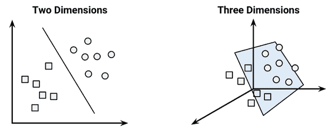

图 7.16：在二维和三维空间中，正方形和圆形都是线性可分的

为了方便起见，超平面在二维空间中被传统地描绘为一条线，但这仅仅是因为在超过 2 维的空间中很难描绘空间。实际上，超平面是高维空间中的一个平面——这是一个可能难以理解的概念。

在二维空间中，SVM 算法的任务是识别一条将两个类别分开的线。如图所示，在圆和正方形的组之间有不止一条分割线。三种这样的可能性被标记为*a*，*b*和*c*。算法是如何选择的？

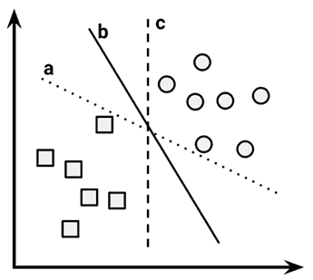

图 7.17：许多可能的分割正方形和圆的线中的三条

那个问题的答案涉及到寻找**最大间隔超平面**（**MMH**）以在两个类别之间创建最大的分离。尽管任何三条分割圆和正方形的线都可以正确分类所有数据点，但预期导致最大分离的线将最好地推广到未来的数据。最大间隔将提高即使添加随机噪声，每个类别仍然保持在边界一侧的机会。

**支持向量**（如图中箭头所示）是每个类别中最接近 MMH 的点。每个类别至少必须有一个支持向量，但可能有多个。支持向量本身定义了 MMH。这是 SVM 的一个关键特性；支持向量提供了一种非常紧凑的方式来存储分类模型，即使特征数量非常大。

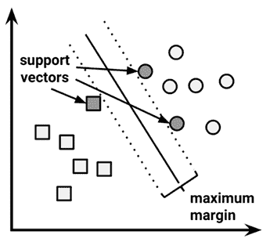

图 7.18：MMH 由支持向量定义

识别支持向量的算法依赖于向量几何，并涉及到一些超出本书范围的复杂数学。然而，这个过程的基本原理是直接的。

更多关于 SVM 数学的信息可以在经典论文《支持向量机，Cortes, C 和 Vapnik, V，机器学习，1995，第 20 卷，第 273-297 页》中找到。入门级别的讨论可以在《支持向量机：炒作还是赞美？，Bennett, KP 和 Campbell, C，SIGKDD Explorations，2000，第 2 卷，第 1-13 页》中找到。更深入的探讨可以在《支持向量机，Steinwart, I 和 Christmann, A，纽约：Springer，2008》中找到。

### 线性可分数据的案例

在假设类别是线性可分的情况下，找到最大间隔是最容易的。在这种情况下，最大间隔距离两组数据点的外部边界尽可能远。这些外部边界被称为**凸包**。最大间隔是两个凸包之间最短路径的垂直平分线。使用称为**二次优化**的技术的高级计算机算法可以通过这种方式找到最大间隔。

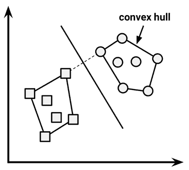

图 7.19：最大间隔超平面是凸包之间最短路径的垂直平分线

另一种（但等效）的方法是通过搜索每个可能超平面的空间来找到一组平行平面，这些平面将点分成同质组，同时它们彼此尽可能远。用比喻来说，可以想象这个过程就像尝试找到可以塞进你卧室楼梯井的最厚的床垫。

要理解这个搜索过程，我们需要精确地定义我们所说的超平面。在 *n*-维空间中，以下方程被使用：

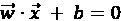

如果你对这个符号不熟悉，字母上方的箭头表示它们是向量而不是单个数字。特别是，*w* 是一个包含 *n* 个权重的向量，即 {*w*[1]*, w*[2]*, ..., w*[n]}，而 *b* 是一个称为偏置的单个数字。偏置在概念上等同于在第六章“预测数值数据 - 回归方法”中讨论的斜截式中的截距项。

如果你难以想象多维空间中的平面，不必担心细节。只需将方程视为指定一个表面的方式，就像斜截式（*y = mx + b*）在二维空间中用于指定直线一样。

使用这个公式，该过程的目的是找到一组权重，以指定两个超平面，如下所示：

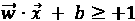

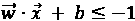

我们还要求这些超平面被指定得使得一个类别的所有点都位于第一个超平面上方，而另一个类别的所有点都位于第二个超平面下方。这两个平面应该产生一个间隙，使得两个平面之间的空间中没有来自任一类的点。只要数据是线性可分的，这是可能的。向量几何定义了这两个平面之间的距离——我们希望尽可能大的距离——如下：

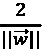

这里，||*w*|| 表示 **欧几里得范数**（从原点到向量 *w* 的距离）。因为 ||*w*|| 是分母，为了最大化距离，我们需要最小化 ||*w*||。这个任务通常被重新表述为以下一组约束条件：

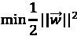

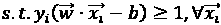

虽然这看起来很混乱，但从概念上理解其实并不复杂。基本上，第一行意味着我们需要最小化欧几里得范数（平方并除以二以简化计算）。第二行指出，这受制于（*s.t.*）每个 *y*[i] 数据点被正确分类的条件。请注意，*y* 表示类别值（转换为+1 或-1），倒置的“A”是“对于所有”的简称。

与寻找最大边缘的其他方法一样，找到这个问题的解决方案最好是留给二次优化软件的任务。尽管它可能需要大量的处理器资源，但专门的算法甚至可以在大型数据集上快速解决这个问题。

### 非线性可分数据的情况

随着我们研究 SVM 背后的理论，你可能想知道房间里的大象：当数据不是线性可分时会发生什么？这个问题的解决方案是使用**松弛变量**，它创建了一个软边缘，允许一些点落在边缘的错误一侧。下面的图示说明了两个点落在错误一侧的线，以及相应的松弛项（用希腊字母 Xi 表示）：

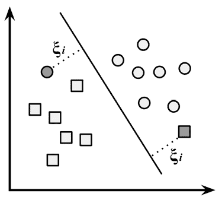

图 7.20：落在边界错误一侧的点会带来成本惩罚

对所有违反约束的点应用一个成本值（表示为 *C*），而不是寻找最大边缘，算法试图最小化总成本。因此，我们可以将优化问题修改为：

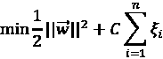

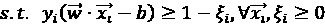

如果你现在感到困惑，不要担心，你不是一个人。幸运的是，SVM 软件包会乐意为你优化，而无需你理解技术细节。重要的是要理解成本参数 *C* 的添加。修改这个值将调整落在超平面错误一侧的点的惩罚。成本参数越大，优化尝试达到 100%分离的努力就越大。另一方面，较低的成本参数将强调更宽的整体边缘。为了创建一个对未来数据泛化良好的模型，重要的是在这两者之间取得平衡。

## 用于非线性空间的核函数

在许多现实世界的数据集中，变量之间的关系是非线性的。正如我们刚刚发现的，通过添加松弛变量，SVM 仍然可以在这种数据上训练，这允许一些示例被错误分类。然而，这并不是解决非线性问题的唯一方法。SVM 的一个关键特性是它们能够使用称为**核技巧**的过程将问题映射到更高维的空间。在这个过程中，非线性关系可能突然显得非常线性。

虽然这听起来可能有些荒谬，但实际上用例子来说明非常简单。在下面的图中，左边的散点图描绘了天气类别（晴朗或雪）与两个特征：纬度和经度之间的非线性关系。图中中心的点是雪类别成员，而边缘的点都是晴朗的。这样的数据可能来自一组天气预报，其中一些是从山顶附近的站点获得的，而另一些是从山脉底部附近的站点获得的。

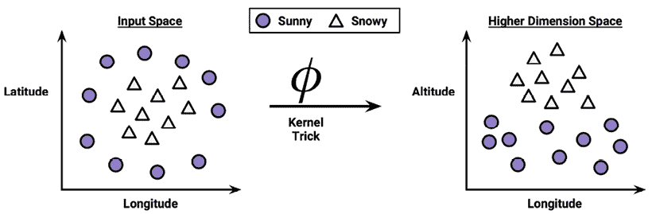

图 7.21：核技巧可以帮助将非线性问题转化为线性问题

在图右侧，在应用核技巧之后，我们通过新维度来观察数据：高度。通过添加这个特征，类别现在可以完美地线性分离。这是可能的，因为我们获得了对数据的新视角。在左侧的图中，我们是从鸟瞰的角度观察山脉，而在右侧，我们是从地面水平距离观察山脉。在这里，趋势很明显：在较高的海拔处发现了雪天气候。

以这种方式，具有非线性核的 SVM 通过向数据添加额外维度来创建分离。本质上，核技巧涉及构建新特征的过程，这些特征表达了测量特征之间的数学关系。例如，高度特征可以数学上表示为纬度和经度之间的相互作用——点越接近每个尺度中心，高度就越大。这使得 SVM 能够学习原始数据中未明确测量的概念。

具有非线性核的 SVM 是极其强大的分类器，尽管它们也有一些缺点，如下表所示：

| **优点** | **缺点** |
| --- | --- |

|

+   可用于分类或数值预测问题

+   不太受噪声数据的影响，并且不太容易过拟合

+   可能比神经网络更容易使用，尤其是由于存在几个得到良好支持的 SVM 算法

+   由于其在数据挖掘竞赛中的高准确率和显眼的胜利而受到欢迎

|

+   寻找最佳模型需要测试各种核和模型参数的组合

+   训练可能较慢，尤其是如果输入数据集具有大量特征或示例

+   导致产生复杂的黑盒模型，难以解释，甚至可能无法解释

|

核函数通常具有以下形式。由希腊字母 phi 表示的函数，即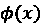，是将数据映射到另一个空间的映射。因此，一般的核函数会对特征向量 *x*[i] 和 *x*[j] 进行一些变换，并使用**点积**将它们结合起来，点积将两个向量作为输入并返回一个单一数值：

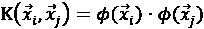

使用这种形式，已经为许多不同的领域开发了核函数。以下列出了最常用的几个核函数。几乎所有的 SVM 软件包都将包括这些核函数以及其他许多核函数。

**线性核**根本不转换数据。因此，它可以简单地表示为特征的点积：

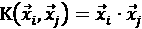

**多项式核**将数据添加一个简单的非线性变换：

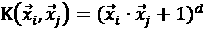

**Sigmoid 核**导致 SVM 模型类似于使用 sigmoid 激活函数的神经网络。希腊字母 kappa 和 delta 用作核参数：

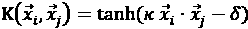

**高斯径向基函数核**类似于径向基神经网络。径向基函数核在许多类型的数据上表现良好，并被认为是为许多学习任务提供一个合理的起点：

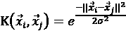

没有可靠的规则来匹配核函数与特定的学习任务。拟合程度很大程度上取决于要学习的概念、训练数据量以及特征之间的关系。通常，需要在验证数据集上训练和评估几个 SVM 来尝试和错误地找到合适的核函数。尽管如此，在许多情况下，核函数的选择是任意的，因为性能可能只有细微的差异。为了了解这在实践中是如何工作的，让我们将我们对 SVM 分类的理解应用到现实世界的问题中。

# 示例 - 使用 SVM 进行 OCR

对于许多机器学习算法来说，图像处理是一个困难的任务。将像素模式与更高层次概念联系起来的关系极其复杂且难以定义。例如，人类很容易识别人脸、猫或字母“A”，但在严格的规则中定义这些模式是困难的。此外，图像数据通常很嘈杂。根据光线、方向和主题的位置，图像的捕获可能会有许多细微的变化。

SVM 非常适合解决图像数据的挑战。它们能够学习复杂的模式，同时对噪声不太敏感，可以以高精度识别视觉模式。此外，SVM 的关键弱点——黑盒模型表示——对于图像处理来说不那么关键。如果一个 SVM 能够区分猫和狗，那么它如何做到这一点并不重要。

在本节中，我们将开发一个模型，类似于通常与桌面文档扫描仪或智能手机应用程序捆绑的光学字符识别（**OCR**）软件的核心。此类软件的目的是通过将打印或手写文本转换为电子形式以保存到数据库中来处理基于纸张的文档。

当然，这是一个困难的问题，因为手写风格和印刷字体有很多变体。尽管如此，软件用户期望完美无缺，因为错误或打字错误可能导致在商业环境中尴尬或昂贵的错误。让我们看看我们的 SVM 是否能够胜任这项任务。

## 第一步 – 收集数据

当 OCR 软件首次处理文档时，它会将纸张划分为一个矩阵，使得网格中的每个单元格都包含一个单个**符号**，这是一个指代字母、符号或数字的术语。接下来，对于每个单元格，软件将尝试将符号与它所识别的所有字符集合进行匹配。最后，单个字符可以组合成单词，这些单词可以选择性地与文档语言的词典进行拼写检查。

在这个练习中，我们假设我们已经开发出了将文档划分为矩形区域的算法，每个区域只包含一个符号。我们还将假设文档只包含英语字母。因此，我们将模拟一个将符号与 26 个字母之一（从 A 到 Z）匹配的过程。

为了达到这个目的，我们将使用 W. Frey 和 D. J. Slate 捐赠给 UCI 机器学习仓库([`archive.ics.uci.edu/ml`](http://archive.ics.uci.edu/ml))的数据集。该数据集包含 20,000 个示例，展示了使用 20 种不同随机变形和扭曲的黑白字体打印的 26 个英文字母大写字母。

关于这些数据的更多信息，请参阅*使用荷兰风格自适应分类器的字母识别，Slate, DJ 和 Frey, PW，机器学习，1991，第 6 卷，第 161-182 页*。

下图由 Frey 和 Slate 发布，提供了一些打印符号的示例。以这种方式扭曲后，字母对计算机来说具有挑战性，但对人类来说很容易识别：

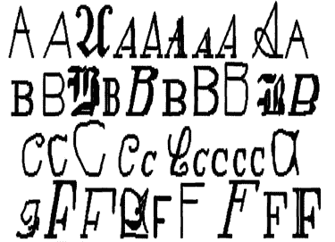

图 7.22：SVM 算法将尝试识别的符号示例

## 第二步 – 探索和准备数据

根据 Frey 和 Slate 提供的文档，当符号被扫描到计算机中时，它们被转换为像素，并记录了 16 个统计属性。

属性衡量诸如符号的水平尺寸和垂直尺寸、黑色（相对于白色）像素的比例以及像素的平均水平和垂直位置等特征。据推测，盒子不同区域黑色像素浓度的差异应该提供一种区分 26 个字母的方法。

要跟随这个示例，请从 Packt Publishing 网站下载`letterdata.csv`文件，并将其保存到您的 R 工作目录中。

将数据读入 R 中，我们确认我们已经收到了定义字母类每个示例的 16 个特征的完整数据。正如预期的那样，它有 26 个级别：

```py
> letters <- read.csv("letterdata.csv", stringsAsFactors = TRUE)
> str(letters) 
```

```py
'data.frame':	20000 obs. of  17 variables:
 $ letter: Factor w/ 26 levels "A","B","C","D",..: 20 9 4 14 ...
 $ xbox  : int  2 5 4 7 2 4 4 1 2 11 ...
 $ ybox  : int  8 12 11 11 1 11 2 1 2 15 ...
 $ width : int  3 3 6 6 3 5 5 3 4 13 ...
 $ height: int  5 7 8 6 1 8 4 2 4 9 ...
 $ onpix : int  1 2 6 3 1 3 4 1 2 7 ...
 $ xbar  : int  8 10 10 5 8 8 8 8 10 13 ...
 $ ybar  : int  13 5 6 9 6 8 7 2 6 2 ...
 $ x2bar : int  0 5 2 4 6 6 6 2 2 6 ...
 $ y2bar : int  6 4 6 6 6 9 6 2 6 2 ...
 $ xybar : int  6 13 10 4 6 5 7 8 12 12 ...
 $ x2ybar: int  10 3 3 4 5 6 6 2 4 1 ...
 $ xy2bar: int  8 9 7 10 9 6 6 8 8 9 ...
 $ xedge : int  0 2 3 6 1 0 2 1 1 8 ...
 $ xedgey: int  8 8 7 10 7 8 8 6 6 1 ...
 $ yedge : int  0 4 3 2 5 9 7 2 1 1 ...
 $ yedgex: int  8 10 9 8 10 7 10 7 7 8 ... 
```

SVM 学习器需要所有特征都是数值的，并且每个特征都缩放到一个相当小的区间。在这种情况下，每个特征都是整数，因此我们不需要将任何因素转换为数字。另一方面，这些整数变量的范围似乎很宽。这表明我们需要对数据进行归一化或标准化。然而，我们现在可以跳过这一步，因为我们将要使用的 R 包将自动执行缩放。

由于没有剩余的数据准备要执行，我们可以直接进入机器学习过程的训练和测试阶段。在先前的分析中，我们随机地将数据分配到训练集和测试集中。虽然我们也可以这样做，但 Frey 和 Slate 已经随机化了数据，因此建议使用前 16,000 条记录（80%）来构建模型，以及接下来的 4,000 条记录（20%）用于测试。遵循他们的建议，我们可以创建以下训练和测试数据框：

```py
> letters_train <- letters[1:16000, ]
> letters_test  <- letters[16001:20000, ] 
```

我们的准备工作已经就绪，现在让我们开始构建我们的分类器。

## 第 3 步 – 在数据上训练模型

当涉及到在 R 中拟合 SVM 模型时，有多个出色的包可供选择。维也纳科技大学（**TU Wien**）统计学系的`e1071`包提供了一个 R 接口到获奖的 LIBSVM 库，这是一个广泛使用的开源 SVM 程序，用 C++编写。如果您已经熟悉 LIBSVM，您可能想从这里开始。

关于 LIBSVM 的更多信息，请参考作者网站[`www.csie.ntu.edu.tw/~cjlin/libsvm/`](http://www.csie.ntu.edu.tw/~cjlin/libsvm/)。

同样，如果您已经投资于 SVMlight 算法，杜伊斯堡-埃森科技大学（**TU Dortmund**）统计学系的`klaR`包提供了直接从 R 使用此 SVM 实现的功能。

关于 SVMlight 的信息，请参阅[`www.cs.cornell.edu/people/tj/svm_light/`](https://www.cs.cornell.edu/people/tj/svm_light/)。

最后，如果您是从零开始，那么最好从`kernlab`包中的 SVM 函数开始。这个包的一个有趣的优势是它是在 R 中本地开发的，而不是在 C 或 C++中，这使得它可以很容易地进行定制；内部没有任何东西隐藏在幕后。也许更重要的是，与其他选项不同，`kernlab`可以与`caret`包一起使用，这使得可以使用各种自动化方法（在第十四章*构建更好的学习者*中介绍）来训练和评估 SVM 模型。

要更全面地了解`kernlab`，请参阅作者在[`www.jstatsoft.org/v11/i09/`](http://www.jstatsoft.org/v11/i09/)上的论文。

使用`kernlab`训练 SVM 分类器的语法如下。如果您确实在使用其他包，命令在很大程度上是相似的。默认情况下，`ksvm()`函数使用高斯 RBF 核，但还提供了许多其他选项：

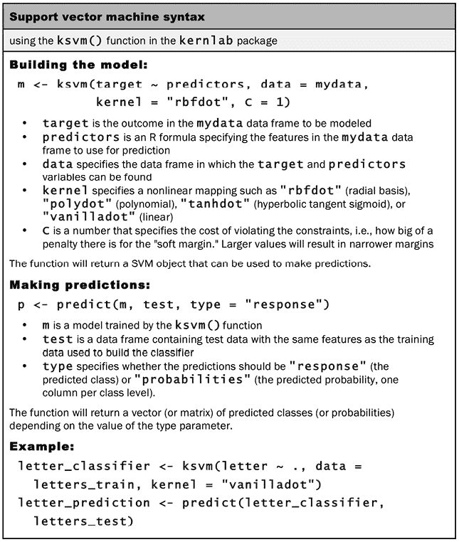

图 7.23：SVM 语法

为了提供一个 SVM 性能的基线度量，让我们首先训练一个简单的线性 SVM 分类器。如果您还没有安装，请使用`install.packages("kernlab")`命令将`kernlab`包安装到您的库中。然后，我们可以在训练数据上调用`ksvm()`函数，并使用`vanilladot`选项指定线性（即“纯”）核，如下所示：

```py
> library(kernlab)
> letter_classifier <- ksvm(letter ~ ., data = letters_train,
                            kernel = "vanilladot") 
```

根据您计算机的性能，此操作可能需要一些时间才能完成。完成后，输入存储模型的名称，以查看有关训练参数和模型拟合的一些基本信息：

```py
> letter_classifier 
```

```py
Support Vector Machine object of class "ksvm"
SV type: C-svc  (classification)
 parameter : cost C = 1
Linear (vanilla) kernel function.
Number of Support Vectors : 7037
Objective Function Value : -14.1746 -20.0072 -23.5628 -6.2009 -7.5524
-32.7694 -49.9786 -18.1824 -62.1111 -32.7284 -16.2209...
Training error : 0.130062 
```

这些信息对我们了解模型在现实世界中的表现帮助甚微。我们需要检查它在测试数据集中的表现，才能知道它是否很好地泛化到未见过的数据。

## 第 4 步 – 评估模型性能

`predict()`函数允许我们使用字母分类模型对测试数据集进行预测：

```py
> letter_predictions <- predict(letter_classifier, letters_test) 
```

由于我们没有指定`type`参数，因此使用了默认的`type = "response"`。这返回一个包含测试数据中每行值预测字母的向量。使用`head()`函数，我们可以看到前六个预测字母分别是`U`、`N`、`V`、`X`、`N`和`H`：

```py
> head(letter_predictions) 
```

```py
[1] U N V X N H
Levels: A B C D E F G H I J K L M N O P Q R S T U V W X Y Z 
```

为了检查我们的分类器表现如何，我们需要将预测字母与测试数据集中的真实字母进行比较。我们将使用`table()`函数来完成此操作（此处仅显示部分完整表格）：

```py
> table(letter_predictions, letters_test$letter) 
```

```py
letter_predictions   A   B   C   D   E
                 A 144   0   0   0   0
                 B   0 121   0   5   2
                 C   0   0 120   0   4
                 D   2   2   0 156   0
                 E   0   0   5   0 127 
```

对角线上的`144`、`121`、`120`、`156`和`127`值表示预测字母与真实值匹配的记录总数。同样，错误数量也被列出。例如，行`B`和列`D`中的`5`表示有 5 个案例，其中字母`D`被错误地识别为`B`。

单独查看每种类型的错误可能会揭示模型在特定字母类型上遇到困难的一些有趣模式，但这很耗时。我们可以通过计算整体准确率来简化评估。这仅考虑预测是否正确或错误，而忽略错误类型。

以下命令返回一个包含`TRUE`或`FALSE`值的向量，指示模型预测的字母是否与测试数据集中的实际字母相符（即匹配）：

```py
> agreement <- letter_predictions == letters_test$letter 
```

使用`table()`函数，我们看到分类器在 4000 个测试记录中的 3357 个中正确识别了字母：

```py
> table(agreement) 
```

```py
agreement
FALSE  TRUE
643 3357 
```

从百分比的角度来看，准确率大约是 84%：

```py
> prop.table(table(agreement)) 
```

```py
agreement
  FALSE    TRUE
0.16075 0.83925 
```

注意，当 Frey 和 Slate 在 1991 年发布数据集时，他们报告的识别准确率约为 80%。仅用几行 R 代码，我们就能够超越他们的结果，尽管我们也受益于数十年的额外机器学习研究。考虑到这一点，我们很可能会做得更好。

## 第 5 步 - 提高模型性能

让我们花点时间来了解一下我们训练的 SVM 模型在从图像数据中识别字母时的性能。通过一行 R 代码，该模型能够达到近 84%的准确率，略高于 1991 年学术研究人员发布的基准百分比。尽管 84%的准确率远远不足以用于 OCR 软件，但相对简单的模型能够达到这个水平本身就是一项了不起的成就。请记住，模型预测与实际值仅靠运气匹配的概率相当小，不到四%。这表明我们的模型的表现比随机机会高出 20 倍以上。尽管如此出色，也许通过调整 SVM 函数参数来训练一个稍微复杂一些的模型，我们还可以发现该模型在现实世界中是有用的。

为了计算 SVM 模型预测与实际值偶然匹配的概率，应用*第四章*中涵盖的独立事件的联合概率规则，即*朴素贝叶斯分类的概率学习*。因为测试集中有 26 个字母，每个字母出现的频率大约相同，所以任何单个字母被正确预测的概率是*(1 / 26) * (1 / 26)*。由于有 26 个不同的字母，总的一致性概率是*26 * (1 / 26) * (1 / 26) = 0.0384*，或 3.84%。

### 改变 SVM 核函数

我们之前的 SVM 模型使用了简单的线性核函数。通过使用更复杂的核函数，我们可以将数据映射到更高维的空间，并可能获得更好的模型拟合。

然而，从众多不同的核函数中选择可能具有挑战性。一个流行的惯例是从高斯 RBF 核开始，它已被证明对许多类型的数据表现良好。

我们可以使用`ksvm()`函数训练基于 RBF 的 SVM，如下所示。请注意，与之前使用的方法类似，我们需要设置随机种子以确保结果可重复：

```py
> set.seed(12345)
> letter_classifier_rbf <- ksvm(letter ~ ., data = letters_train,
                                kernel = "rbfdot") 
```

接下来，我们像之前一样进行预测：

```py
> letter_predictions_rbf <- predict(letter_classifier_rbf,
                                    letters_test) 
```

最后，我们将比较其准确性与我们的线性 SVM：

```py
> agreement_rbf <- letter_predictions_rbf == letters_test$letter
> table(agreement_rbf) 
```

```py
agreement_rbf
FALSE  TRUE
  278  3722 
```

```py
> prop.table(table(agreement_rbf)) 
```

```py
agreement_rbf
  FALSE    TRUE
0.0695 0.9305 
```

仅通过改变核函数，我们就能够将我们的字符识别模型的准确率从 84%提高到 93%。

### 确定最佳的 SVM 成本参数

如果这个性能水平对于 OCR 程序来说仍然不满意，当然可以测试额外的核函数。然而，另一种富有成效的方法是改变成本参数，这会修改 SVM 决策边界的宽度。这决定了模型在过拟合和欠拟合训练数据之间的平衡——成本值越大，学习器将越努力地尝试完美地分类每个训练实例，因为每个错误都有更高的惩罚。一方面，高成本可能导致学习器过拟合训练数据。另一方面，设置得太小的成本参数可能导致学习器错过训练数据中的重要、微妙的模式，并欠拟合真实模式。

没有先验的规则可以知道理想值，因此，我们将检查模型在`C`（成本参数）的各种值下的表现。而不是反复重复训练和评估过程，我们可以使用`sapply()`函数将自定义函数应用于潜在成本值的向量。我们首先使用`seq()`函数生成这个向量，它是一个从 5 开始计数到 40 的序列，每次增加 5。然后，如以下代码所示，自定义函数像以前一样训练模型，每次使用成本值并在测试数据集上进行预测。每个模型的准确率是匹配实际值的预测数量除以总预测数量。结果使用`plot()`函数进行可视化。请注意，根据您计算机的能力，这可能需要几分钟才能完成：

```py
> cost_values <- c(1, seq(from = 5, to = 40, by = 5))
> accuracy_values <- sapply(cost_values, function(x) {
    set.seed(12345)
    m <- ksvm(letter ~ ., data = letters_train,
              kernel = "rbfdot", C = x)
    pred <- predict(m, letters_test)
    agree <- ifelse(pred == letters_test$letter, 1, 0)
    accuracy <- sum(agree) / nrow(letters_test)
    return (accuracy)
  })
> plot(cost_values, accuracy_values, type = "b") 
```

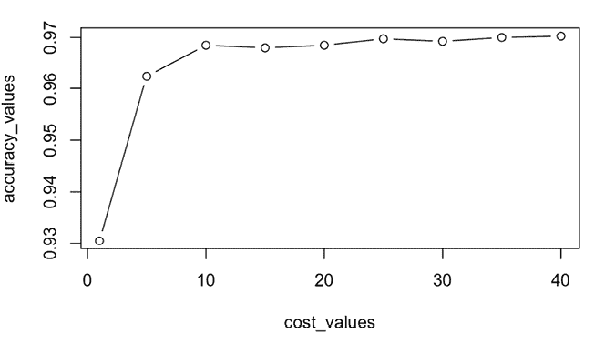

图 7.24：映射准确率与 RBF 核的 SVM 成本

如可视化所示，在 93%的准确率下，默认的 SVM 成本参数`C = 1`在评估的 9 个模型中产生了最不准确的模式。相反，将`C`设置为 10 或更高的值，准确率可达到约 97%，这在性能上是一个相当大的提升！也许这已经足够接近完美，以至于可以在实际环境中部署该模型，尽管仍然值得进一步实验，以查看是否有可能达到 100%的准确率。每次准确率的提升都将减少 OCR 软件的错误，并为最终用户提供更好的整体体验。

# 摘要

在本章中，我们探讨了两种具有巨大潜力但常因复杂性而被忽视的机器学习方法。希望你现在能看出这种声誉至少在一定程度上是不应得的。驱动人工神经网络（ANNs）和支持向量机（SVMs）的基本概念并不难理解。

另一方面，由于人工神经网络（ANNs）和支持向量机（SVMs）已经存在了几十年，它们各自都有许多变体。本章只是对这些方法可能实现的内容进行了初步探讨。通过利用在这里学到的术语，你应该能够捕捉到每天正在开发的许多进步的细微差别，包括不断发展的深度学习领域。我们将在第十五章“利用大数据”中重新探讨深度学习，看看它如何解决机器学习中最具挑战性的问题。

在过去的几章中，我们学习了多种不同类型的预测模型，从基于简单启发式算法如最近邻算法的模型到复杂的黑盒模型以及其他许多模型。在下一章中，我们将开始考虑另一种学习任务的方法。这些无监督学习技术将在帮助我们找到“大海捞针”的过程中，揭示数据中的迷人模式。

# 加入我们书籍的 Discord 空间

加入我们的 Discord 社区，与志同道合的人相聚，并在以下地点与超过 4000 人一起学习：

[`packt.link/r`](https://packt.link/r)


