# 寻找模式 - 使用关联规则进行篮子分析

想想你上一次的冲动购买。也许在杂货店的结账通道，你买了一包口香糖或一块巧克力棒。也许在深夜为尿布和配方奶粉的购物之旅中，你买了一瓶含咖啡因的饮料或一箱啤酒。你甚至可能是在书店推荐下买了这本书。这些冲动购买并非巧合，因为零售商使用复杂的数据分析技术来识别用于营销促销和通过产品定位推动交叉销售的有用模式。

在过去，这样的推荐基于市场营销专业人士和库存管理人员的直观直觉。现在，条形码扫描仪、库存数据库和在线购物车都生成交易数据，机器学习可以使用这些数据来学习购买模式。这种做法通常被称为篮子分析，因为它已经被频繁应用于超市数据。

尽管这项技术起源于购物数据，但它也适用于其他环境。在你完成这一章的时候，你将知道如何将篮子分析技术应用于你自己的任务，无论它们是什么。通常，这项工作涉及：

+   理解交易数据的特殊性

+   使用简单的性能指标在大数据库中寻找关联

+   知道如何识别有用和可操作的规律

由于篮子分析能够发现许多类型的大型数据集中的洞察力，当我们应用这项技术时，你可能会发现你的工作中也有应用，即使你没有与零售行业有联系。

# 理解关联规则

篮子分析的基础是可能出现在任何给定交易中的项目。一组或多个项目被括号包围，以表示它们形成一个集合，或者更具体地说，是一个在数据中出现频率较高的**项目集**。交易是以项目集来指定的，如下面在典型杂货店可能找到的交易：

`{面包, 花生酱, 果酱}`

篮子分析的结果是一系列**关联规则**，这些规则指定了在项目集项目之间的关系中发现的模式。关联规则总是由项目集的子集组成，并通过将规则的一侧的**左侧（LHS**）与另一侧的**右侧（RHS**）关联来表示。LHS 是触发规则需要满足的条件，而 RHS 是满足该条件后的预期结果。从前面的示例交易中识别出的规则可能以以下形式表示：

`{花生酱, 果酱} → {面包}`

用简单的话来说，这个关联规则表明，如果花生酱和果酱一起购买，那么面包也很可能被购买。换句话说，“花生酱和果酱意味着面包。”

在零售交易数据库的背景下开发，关联规则不用于预测，而是用于在大数据库中进行无监督的知识发现。这与前几章中介绍的分类和数值预测算法不同。即便如此，你会发现关联规则学习的结果与第五章中介绍的分类规则学习的结果密切相关，并共享许多特征，即*“分而治之 – 使用决策树和规则进行分类”*。

由于关联规则学习器是无监督的，因此不需要对算法进行训练，数据也不需要在事先进行标记。程序只是简单地应用于数据集，希望找到有趣的相关性。当然，缺点是没有简单的方法可以客观地衡量规则学习器的性能，除了评估其定性有用性——通常，是一种某种形式的目视检查。

尽管关联规则最常用于篮子分析，但它们对于在许多不同类型的数据中寻找模式很有帮助。其他潜在的应用包括：

+   在癌症数据中寻找有趣的 DNA 和蛋白质序列模式

+   寻找与欺诈性信用卡或保险使用相结合的购买或医疗索赔模式

+   识别出导致客户放弃手机服务或升级有线电视套餐的行为组合

关联规则分析用于在大量元素中寻找有趣的相关性。人类能够相当直观地做到这一点，但通常需要专家级知识或大量的经验才能在几分钟或几秒钟内完成规则学习算法所能做到的事情。此外，有些数据集太大、太复杂，以至于人类难以在“大海捞针”中找到所需的信息。

## 关联规则学习的 Apriori 算法

正如大型交易数据集给人类带来挑战一样，这些数据集也给机器带来了挑战。交易数据集在交易数量以及记录的项目或特征数量上都可以很大。搜索有趣的项目集的基本问题在于，潜在的项目集数量随着项目数量的指数增长。给定可以出现在集合中或不出现在集合中的*k*个项目，有*2*^k 种可能的项目集，这些项目集可能是潜在的规则。一个只销售 100 种不同商品的零售商可能需要评估大约*2¹⁰⁰ = 1.27e+30*个项目集——这看起来是一项看似不可能的任务。

而不是逐个评估这些项集，一个更智能的规则学习算法利用了这样一个事实：在实际情况中，许多潜在的项目组合很少甚至从未被发现。例如，即使一家商店同时销售汽车用品和食品产品，集合*{机油，香蕉}*可能非常罕见。通过忽略这些罕见（也许不那么重要）的组合，可以将搜索规则的范围限制在更易于管理的规模。

已做了大量工作来识别用于减少搜索项集数量的启发式算法。也许最广为人知的用于高效搜索大型数据库规则的算法被称为**Apriori**。该算法由 Rakesh Agrawal 和 Ramakrishnan Srikant 于 1994 年提出，尽管后来发明了更新、更快的算法，但 Apriori 算法仍然与关联规则学习有些同义。该名称来源于算法利用关于频繁项集属性的一种简单先验（即*先验*）信念。

在我们更深入地讨论这一点之前，值得注意的是，这个算法，像所有学习算法一样，并非没有其优点和缺点。以下列出了一些：

| **优点** | **缺点** |
| --- | --- |

|

+   能够处理大量交易数据

+   生成易于理解的规则

+   适用于数据挖掘和发现数据库中的意外知识

|

+   对于相对较小的数据集不太有帮助

+   需要努力区分真正的洞察力和常识

+   容易从随机模式中得出错误的结论

|

如前所述，Apriori 算法采用一种简单的*先验*信念作为减少关联规则搜索空间的指导原则：频繁项集的所有子集也必须是频繁的。这种启发式方法被称为**Apriori 属性**。利用这一精明的观察，可以显著减少需要搜索的规则数量。例如，集合*{机油，香蕉}*只有在*{机油}*和*{香蕉}*都频繁出现的情况下才能是频繁的。因此，如果*{机油}*或*{香蕉}*不频繁，那么包含这些项目的任何集合都可以从搜索中排除。

关于 Apriori 算法的更多详细信息，请参阅*Agrawal, R., Srikant, R.，《快速挖掘关联规则算法》，第 20 届国际非常大型数据库会议论文集，1994 年，第 487-499 页*。

为了看到这一原则如何在更现实的设置中应用，让我们考虑一个简单的交易数据库。以下表格显示了在一个虚构医院礼品店中完成的五个交易：

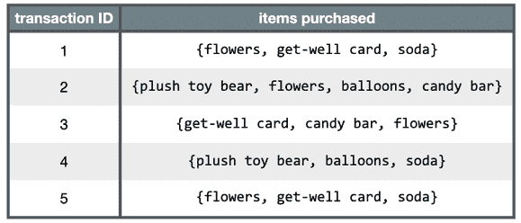

图 8.1：表示假设医院礼品店中五个交易的项集

通过观察购买集合，我们可以推断出存在几种典型的购买模式。一个人去看望生病的亲朋好友时，往往会购买一张祝福卡和鲜花，而看望新妈妈的访客则倾向于购买毛绒玩具熊和气球。这些模式值得关注，因为它们出现的频率足够高，足以引起我们的兴趣；我们只需运用一点逻辑和专业知识来解释这些规则。

类似地，Apriori 算法使用项集“有趣性”的统计指标在更大的交易数据库中定位关联规则。在接下来的章节中，我们将发现 Apriori 如何计算这些兴趣度量，以及它们如何与 Apriori 属性结合以减少要学习的规则数量。

## 测量规则兴趣——支持度和置信度

一个关联规则是否被认为是有趣的，由两个统计指标决定：支持度和置信度。通过为这些指标提供最小阈值并应用 Apriori 原则，可以很容易地大幅减少报告的规则数量。如果这个限制过于严格，可能会导致只有最明显或常识性的规则被识别。因此，了解在这些标准下被排除的规则类型非常重要，以便获得正确的平衡。

项集或规则的**支持度**衡量它在数据中出现的频率。例如，项集*{祝福卡，鲜花}*在医院的礼品店数据中的支持度为*3/5 = 0.6*。同样，项集*{祝福卡} 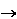 {鲜花}*的支持度也是*0.6*。支持度可以计算任何项集或单个项；例如，项集*{巧克力棒}*的支持度为*2/5 = 0.4*，因为巧克力棒出现在 40%的购买中。可以定义一个函数来定义项集*X*的支持度：

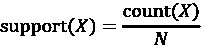

这里，*N*是数据库中的交易数量，而*count(X)*是包含项集*X*的交易数量。

规则的**置信度**是对其预测能力或准确性的衡量。它定义为包含*X*和*Y*的项集的支持度除以只包含*X*的项集的支持度：

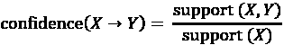

实质上，置信度告诉我们交易中存在项或项集*X*导致存在项或项集*Y*的比例。记住，*X*导致*Y*的置信度与*Y*导致*X*的置信度不同。

例如，*{flowers}  {get-well card}*的置信度为*0.6 / 0.8 = 0.75*。相比之下，*{get-well card}  {flowers}*的置信度为*0.6 / 0.6 = 1.0*。这意味着购买鲜花 75%的时间也包括购买祝福卡，而购买祝福卡 100%的时间也包括鲜花。这些信息对礼品店的管理可能非常有用。

您可能已经注意到了支持度、置信度和在第四章“概率学习 - 使用朴素贝叶斯进行分类”中介绍的贝叶斯概率规则之间的相似性。事实上，*support(A, B)*与*P(A  B)*相同，而*confidence(A* ** *B)*与*P(B | A)*相同。只是上下文不同。

类似于*{get-well card}  {flowers}*的规则被称为**强规则**，因为它们既有高的支持度又有高的置信度。找到更多强规则的一种方法就是检查礼品店中所有可能的商品组合，测量支持度和置信度，并仅报告那些达到一定兴趣水平的规则。然而，正如之前所述，这种策略通常只适用于数据集非常小的情况。

在下一节中，您将看到 Apriori 算法如何使用 Apriori 原则和最小支持度、置信度水平，通过减少规则数量到更易管理的水平来快速找到强规则。

## 使用 Apriori 原则构建一组规则

记住，Apriori 原则指出，频繁项集的所有子集也必须是频繁的。换句话说，如果*{A, B}*是频繁的，那么*{A}*和*{B}*都必须是频繁的。还要记住，根据定义，支持度指标表示项集在数据中出现的频率。因此，如果我们知道*{A}*没有达到期望的支持度阈值，就没有理由考虑*{A, B}*或任何包含*{A}*的其他项集；这些不可能频繁出现。

Apriori 算法使用这种逻辑在评估之前排除潜在的关联规则。创建规则的过程分为两个阶段：

1.  识别所有满足最小支持度阈值的项集

1.  使用满足最小置信度阈值的项集创建规则

第一阶段发生在多次迭代中。每一次连续的迭代都涉及评估一组越来越大项集的支持度。例如，第一次迭代涉及评估 1 项项集（1 项集），第二次迭代评估 2 项集，依此类推。每一次迭代*i*的结果是所有满足最小支持度阈值的*i*项集的集合。

所有来自迭代 *i* 的项集都被组合起来，以生成在迭代 *i + 1* 中评估的候选项集。但 Apriori 原则可以在下一轮开始之前消除其中的一些。如果在一轮迭代中 *{A}*, *{B}*, 和 *{C}* 是频繁的，而 *{D}* 不是频繁的，那么第二轮迭代将只考虑 *{A, B}*, *{A, C}*, 和 *{B, C}*。因此，算法只需要评估三个项集，而不是如果包含 *D* 的集合没有被提前消除，将需要评估的六个 2 项项集。

继续这个想法，假设在第二次迭代中发现 *{A, B}* 和 *{B, C}* 是频繁的，但 *{A, C}* 不是。尽管第三次迭代通常从评估 3 项项集 *{A, B, C}* 的支持度开始，但这一步不是必要的。为什么不是？Apriori 原则指出，由于子集 *{A, C}* 不是频繁的，因此 *{A, B, C}* 不可能是频繁的。因此，在第三次迭代中没有生成新的项集，算法可能停止。

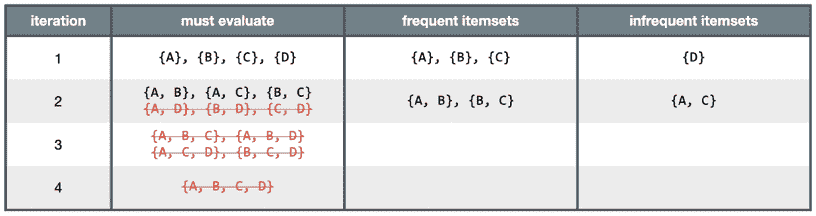

图 8.2：在这个例子中，Apriori 算法只评估了 15 个潜在项集（对于四个项目，0 项项集未显示）中的 7 个，这些项集可能出现在事务数据中

在这一点上，Apriori 算法的第二阶段可能开始。给定频繁项集的集合，从所有可能的子集中生成关联规则。例如，*{A, B}* 将导致为 *{A}  {B}* 和 *{B}  {A}* 生成候选规则。这些规则将根据最小置信度阈值进行评估，任何不符合所需置信度水平的规则都将被淘汰。

# 示例 - 使用关联规则识别经常购买的杂货

如本章引言所述，市场篮子分析在许多实体店和在线零售商使用的推荐系统背后被使用。学习到的关联规则表明了经常一起购买的商品。了解这些模式可以为杂货连锁店优化库存、宣传促销或组织商店的物理布局提供新的见解。例如，如果购物者经常在早餐糕点时购买咖啡或橙汁，那么通过将糕点移至咖啡和果汁附近，可能有可能增加利润。

同样，在线零售商可以使用这些信息为动态推荐引擎提供支持，这些引擎建议与您已经查看的商品相关的商品，或者在网站访问或在线购买后通过电子邮件建议附加商品，这种做法被称为**主动营销**。

在本教程中，我们将对一家杂货店的交易数据进行市场篮子分析。这样做，我们将看到 Apriori 算法如何高效地评估潜在的庞大关联规则集。同样的技术也可以应用于许多其他商业任务，从电影推荐到交友网站，再到寻找药物之间的危险相互作用。

## 第 1 步 – 收集数据

我们的市场篮子分析将利用一家真实杂货店一个月运营的购买数据。数据包含 9,835 笔交易，或大约每天 327 笔交易（在 12 小时营业日中，每小时大约 30 笔交易），这表明零售商既不是特别大，也不是特别小。

这里使用的数据集是从`arules` R 包中的`Groceries`数据集改编的。更多信息，请参阅*概率数据建模对挖掘关联规则的影响，Hahsler, M.，Hornik, K.，Reutterer, T.，2005*。在*从数据和信息分析到知识工程，Gaul, W.，Vichi, M.，Weihs, C.，分类、数据分析和知识组织研究，2006，第 598-605 页*。

一个典型的杂货店提供大量商品。可能有五种牛奶品牌，一打洗衣剂类型，以及三种咖啡品牌。鉴于本例中零售商的适度规模，我们假设它并不特别关注仅适用于特定品牌牛奶或洗衣剂的规则，因此所有品牌名称都从购买中去除。这减少了杂货商品的种类，使其更易于管理，共有 169 种类型，使用广泛的类别，如鸡肉、冷冻食品、人造黄油和汽水。

如果你希望识别高度具体的关联规则——例如，客户是否更喜欢葡萄或草莓果酱与花生酱搭配——你需要大量的交易数据。大型连锁零售商使用数百万笔交易的数据库，以找到特定品牌、颜色或口味之间的关联。

你对哪些类型的商品可能一起购买有什么猜测吗？葡萄酒和奶酪会是常见的搭配吗？面包和黄油？茶和蜂蜜？让我们深入挖掘这些数据，看看这些猜测是否可以得到证实。

## 第 2 步 – 探索和准备数据

事务数据存储的格式与我们之前使用的略有不同。我们之前的大多数分析都使用了矩阵格式，其中行表示示例实例，列表示特征。如*第一章*，*介绍机器学习*中所述，在矩阵格式中，所有示例必须具有完全相同的特征集。

相比之下，交易数据更为自由形式。通常，数据中的每一行指定一个单独的例子——在本例中，是一个交易。然而，与具有固定数量的特征不同，每条记录包含一个由逗号分隔的项目列表，数量从一到多个。本质上，特征可能因例子而异。

要跟随这个分析，请从本章的 Packt Publishing GitHub 仓库下载 `groceries.csv` 文件，并将其保存在您的 R 工作目录中。

原始 `groceries.csv` 文件的头五行如下：

```py
 citrus fruit,semi-finished bread,margarine,ready soups
   tropical fruit,yogurt,coffee
   whole milk
   pip fruit,yogurt,cream cheese,meat spreads
   other vegetables,whole milk,condensed milk,long life bakery product 
```

这些行表示五个不同的杂货店交易。第一个交易包含四个项目：`柑橘水果`、`半成品面包`、`黄油`和`即食汤品`。相比之下，第三个交易只包含一个项目：`全脂牛奶`。

假设我们尝试使用与先前分析中相同的 `read.csv()` 函数加载数据。R 会欣然同意，并将数据以矩阵格式读入数据框，如下所示：

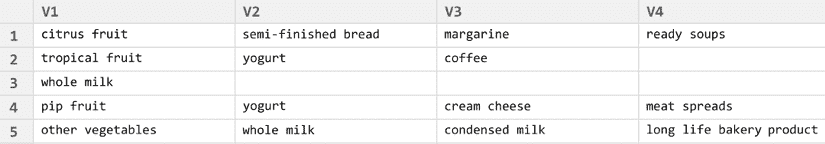

图 8.3：将交易数据作为数据框读入 R 将会在以后造成问题

您会注意到 R 创建了四个列来存储交易数据中的项目：`V1`、`V2`、`V3` 和 `V4`。虽然这看起来似乎是合理的，但如果我们以这种形式使用数据，我们以后会遇到问题。R 选择创建四个变量，因为第一行恰好有四个由逗号分隔的值。然而，我们知道杂货购买可能包含超过四个项目；在四列设计中，这样的交易将在矩阵的多个行中拆分。我们可以尝试通过将项目数量最多的交易放在文件顶部来纠正这个问题，但这忽略了另一个更成问题的问题。

通过这种方式结构化数据，R 构建了一套特征，不仅记录了交易中的项目，还记录了它们出现的顺序。如果我们把我们的学习算法想象成试图在 `V1`、`V2`、`V3` 和 `V4` 之间找到关系，那么 `V1` 中的 `whole milk` 项目可能与 `V2` 中出现的 `whole milk` 项目被不同对待。相反，我们需要一个数据集，它不将交易视为需要（或不需）用特定项目填充（或不填充）的位置集合，而将其视为一个包含或不包含每个项目的市场篮子。

### 数据准备 – 为交易数据创建稀疏矩阵

这个问题的解决方案使用了一种称为稀疏矩阵的数据结构。你可能记得我们在*第四章*，*概率学习 - 使用朴素贝叶斯进行分类*中使用了稀疏矩阵来处理文本数据。就像先前的数据集一样，稀疏矩阵中的每一行都表示一个事务。然而，稀疏矩阵为可能出现在某人购物袋中的每个商品都有一个列（即特征）。由于我们的杂货店数据中有 169 种不同的商品，我们的稀疏矩阵将包含 169 列。

为什么不就像我们之前的大多数分析那样将其存储为数据框呢？原因是随着更多的事务和商品的添加，传统的数据结构很快就会变得太大，无法适应可用的内存。即使使用这里相对较小的交易数据集，矩阵也包含近 170 万个单元格，其中大多数包含零（因此得名“稀疏”矩阵——非零值非常少）。

由于存储所有这些零没有好处，稀疏矩阵实际上并不在内存中存储完整的矩阵；它只存储被商品占用的单元格。这使得结构比同等大小的矩阵或数据框更节省内存。

为了从事务数据中创建稀疏矩阵数据结构，我们可以使用`arules`（关联规则）包提供的功能。使用`install.packages("arules")`和`library(arules)`命令安装并加载该包。

关于`arules`包的更多信息，请参阅*arules - A Computational Environment for Mining Association Rules and Frequent Item Sets, Hahsler, M., Gruen, B., Hornik, K., Journal of Statistical Software, 2005, Vol. 14*。

由于我们正在加载事务数据，我们不能简单地使用之前使用的`read.csv()`函数。相反，`arules`提供了一个`read.transactions()`函数，它类似于`read.csv()`，但区别在于它生成一个适合事务数据的稀疏矩阵。参数`sep = ","`指定输入文件中的项由逗号分隔。要将`groceries.csv`数据读取到名为`groceries`的稀疏矩阵中，请输入以下行：

```py
> groceries <- read.transactions("groceries.csv", sep = ",") 
```

要查看我们刚刚创建的`groceries`矩阵的一些基本信息，请在对象上使用`summary()`函数：

```py
> summary(groceries) 
```

```py
transactions as itemMatrix in sparse format with
 9835 rows (elements/itemsets/transactions) and
 169 columns (items) and a density of 0.02609146 
```

输出的第一块信息提供了我们创建的稀疏矩阵的摘要。输出`9835 rows`指的是事务数量，`169 columns`表示可能出现在某人购物篮中的 169 种不同商品。矩阵中的每个单元格如果是为相应事务购买的商品，则为`1`，否则为`0`。

密度值 `0.02609146`（2.6%）指的是非零矩阵单元格的比例。由于矩阵中有 *9,835 * 169 = 1,662,115* 个位置，我们可以计算出在商店运营的 30 天内总共购买了 *1,662,115 * 0.02609146 = 43,367* 件商品（不考虑可能购买相同商品的重复）。通过额外的步骤，我们可以确定平均交易包含 *43,367 / 9,835 = 4.409* 种不同的杂货商品。当然，如果我们进一步查看输出，我们会看到每笔交易的商品数量的平均值已经提供。

下一个 `summary()` 输出块列出了在交易数据中最常出现的商品。由于 *2,513 / 9,835 = 0.2555*，我们可以确定`全脂牛奶`出现在 25.6%的交易中。

`其他蔬菜`、`面包卷/面包`、`汽水`和`酸奶`构成了其他常见商品的列表，如下所示：

```py
most frequent items:
      whole milk   other vegetables       rolls/buns
            2513               1903             1809
            soda             yogurt          (Other)
            1715               1372            34055 
```

我们还提供了一组关于交易大小的统计数据。共有 2,159 笔交易只包含一个商品，而有一笔交易包含 32 个商品。第一四分位数和中位数购买量分别是两个和三个商品，这意味着 25%的交易包含两个或更少的商品，大约一半的交易包含三个或更少的商品。每笔交易 4.409 个商品的均值与我们手工计算出的值相匹配：

```py
element (itemset/transaction) length distribution:
sizes
   1    2    3    4    5    6    7    8    9   10   11   12 
2159 1643 1299 1005  855  645  545  438  350  246  182  117 
  13   14   15   16   17   18   19   20   21   22   23   24 
  78   77   55   46   29   14   14    9   11    4    6    1 
  26   27   28   29   32 
   1    1    1    3    1
   Min. 1st Qu.  Median    Mean 3rd Qu.    Max. 
  1.000   2.000   3.000   4.409   6.000  32.000 
```

最后，输出底部包括与商品矩阵可能关联的任何元数据的附加信息，例如商品层次结构或标签。我们没有使用这些高级功能，但输出仍然表明数据有标签。`read.transactions()` 函数在加载时自动使用原始 CSV 文件中的商品名称添加了这些标签，前三个标签（按字母顺序排列）如下所示：

```py
includes extended item information – examples:
            labels
1 abrasive cleaner
2 artif. Sweetener
3   baby cosmetics 
```

注意，`arules` 包内部使用没有与真实世界中的商品关联的数字项 ID 来表示商品。默认情况下，大多数 `arules` 函数将使用商品标签解码这些数字。然而，为了说明数字 ID，我们可以使用所谓的“长”格式来检查前两个交易，而不进行解码。在长格式交易数据中，每一行代表单个交易中的一个单独商品，而不是每一行代表一个包含多个商品的单独交易。例如，因为第一个和第二个交易分别有四个和三个商品，所以长格式用七行来表示这些交易：

```py
> head(toLongFormat(groceries, decode = FALSE), n = 7) 
```

```py
 TID item
1   1   30
2   1   89
3   1  119
4   1  133
5   2   34
6   2  158
7   2  168 
```

在这种交易数据的表示中，名为 `TID` 的列指的是交易 ID——即第一个或第二个购物篮，而名为 `item` 的列指的是分配给商品的内部 ID 号。由于第一个交易包含 *{柑橘类水果、黄油、即食汤和半成品面包}*，我们可以假设商品 ID 30 指的是 *柑橘类水果*，而 89 指的是 *黄油*。

当然，`arules`包包括用于以更直观的格式检查交易数据的特性。要查看稀疏矩阵的内容，请使用`inspect()`函数与 R 的向量运算符结合。以下是如何查看前五笔交易的示例：

```py
> inspect(groceries[1:5]) 
```

```py
 items                      
[1] {citrus fruit,             
     margarine,                
     ready soups,              
     semi-finished bread}      
[2] {coffee,                   
     tropical fruit,           
     yogurt}                   
[3] {whole milk}               
[4] {cream cheese,             
     meat spreads,             
     pip fruit,                
     yogurt}                   
[5] {condensed milk,           
     long life bakery product, 
     other vegetables,         
     whole milk} 
```

当使用`inspect()`函数格式化时，数据看起来与我们之前在原始 CSV 文件中看到的数据没有太大区别。

由于`groceries`对象存储为稀疏项矩阵，可以使用`[行，列]`表示法来检查所需的项以及所需的交易。使用此功能与`itemFrequency()`函数结合，我们可以看到包含指定项的所有交易的比例。例如，要查看所有行中前三个项的支持水平，请使用以下命令：

```py
> itemFrequency(groceries[, 1:3]) 
```

```py
abrasive cleaner artif. sweetener   baby cosmetics
    0.0035587189     0.0032536858     0.0006100661 
```

注意到稀疏矩阵中的项按字母顺序排列在列中。磨料清洁剂和人造甜味剂在约 0.3%的交易中找到，而婴儿化妆品在约 0.06%的交易中找到。

### 可视化项支持 - 项频率图

要将这些统计数据可视化，请使用`itemFrequencyPlot()`函数。这会创建一个条形图，表示包含指定项的交易比例。由于交易数据包含大量项，你通常需要限制图表中出现的项，以便生成可读的图表。

如果你希望显示出现在交易中比例最小的项，请使用带有`support`参数的`itemFrequencyPlot()`函数：

```py
> itemFrequencyPlot(groceries, support = 0.1) 
```

如以下图表所示，这会产生一个直方图，显示了`groceries`数据中至少有 10%支持的八个项：

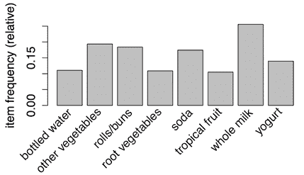

图 8.4：至少在 10%的交易中所有杂货项的支持水平

如果你希望将图表限制在特定数量的项上，请使用带有`topN`参数的函数：

```py
> itemFrequencyPlot(groceries, topN = 20) 
```

然后直方图按支持度递减排序，如下图中`groceries`数据的前 20 项所示：

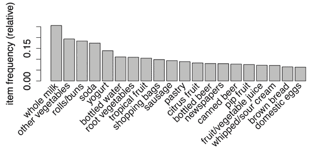

图 8.5：前 20 个杂货项的支持水平

### 可视化交易数据 - 绘制稀疏矩阵

除了查看特定项之外，还可以使用`image()`函数从整体上获得稀疏矩阵的鸟瞰图。当然，由于矩阵本身非常大，通常最好请求整个矩阵的一个子集。显示前五笔交易的稀疏矩阵的命令如下：

```py
> image(groceries[1:5]) 
```

生成的图表显示了一个 5 行 169 列的矩阵，表示我们请求的 5 笔交易和 169 个可能的项。矩阵中的单元格在交易（行）中购买项（列）时填充为黑色。

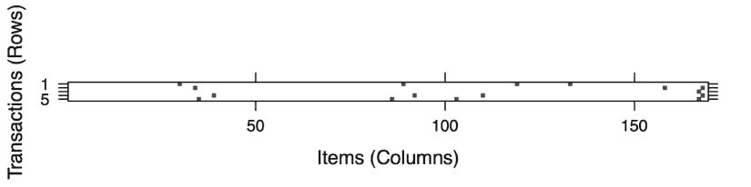

图 8.6：前五笔交易的稀疏矩阵可视化

虽然图 8.6 很小，可能稍微难以阅读，但您可以看到第一、第四和第五笔交易各包含四个项目，因为它们的行有四个单元格被填充。在图表的右侧，您还可以看到第三行和第五行，以及第二行和第四行共享一个共同的项目。

这种可视化可以是一个有用的工具来探索交易数据。首先，它可能有助于识别潜在的数据问题。完全填满的列可能表明在每次交易中都购买的项目——这可能是由于零售商的名称或识别号码意外包含在交易数据集中而引起的问题。

此外，图中的模式可能有助于揭示有趣的交易和项目段，尤其是如果数据以有趣的方式排序。例如，如果交易按日期排序，黑色点的模式可能揭示购买数量或类型的季节性影响。也许在圣诞节或光明节期间，玩具更为常见；在万圣节期间，糖果可能变得流行。如果项目也被分类排序，这种类型的可视化可能特别强大。然而，在大多数情况下，图表看起来相当随机，就像电视屏幕上的静电一样。

请记住，这种可视化对于非常大的交易数据库可能不太有用，因为单元格太小，无法辨别。不过，通过结合`sample()`函数，您可以查看随机采样交易集的稀疏矩阵。创建 100 笔随机交易的选择命令如下：

```py
> image(sample(groceries, 100)) 
```

这创建了一个 100 行 169 列的矩阵图：

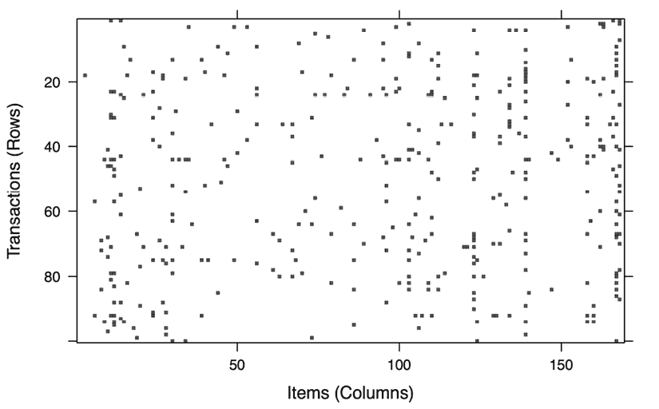

图 8.7：100 笔随机选择交易的稀疏矩阵可视化

几列似乎相当密集，表明商店中一些非常受欢迎的商品。然而，点的分布总体上似乎相当随机。如果没有其他值得注意的事项，让我们继续我们的分析。

## 第 3 步 – 在数据上训练模型

数据准备完成后，我们现在可以着手寻找购物车项目之间的关联。我们将使用我们一直在使用的`arules`包中的 Apriori 算法实现来探索和准备`groceries`数据。如果您还没有安装和加载此包，您需要这样做。

下表显示了使用`apriori()`函数创建规则集的语法：

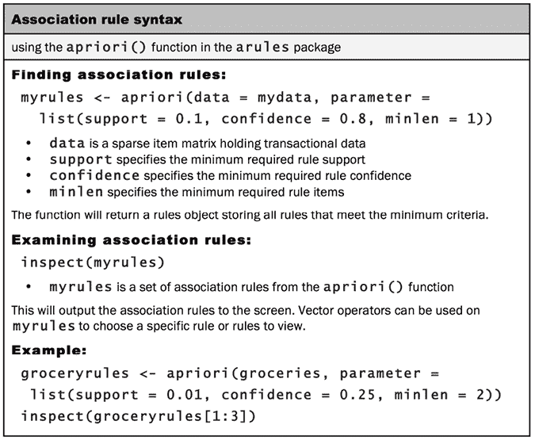

图 8.8：Apriori 关联规则学习语法

虽然运行`apriori()`函数很简单，但有时为了找到产生合理数量关联规则的`支持`和`置信度`参数，可能需要进行相当多的试错。如果你将这些级别设置得太高，那么你可能会找不到任何规则，或者可能会找到过于通用的规则，不太有用。另一方面，如果阈值设置得太低，可能会导致规则数量过多。更糟糕的是，操作可能会花费很长时间，或者在学习阶段耗尽内存。

在`groceries`数据上，使用默认的`support = 0.1`和`confidence = 0.8`设置导致令人失望的结果。虽然为了简洁省略了完整的输出，但最终结果是零规则集：

```py
> apriori(groceries) 
```

```py
...
set of 0 rules 
```

显然，我们需要稍微扩大搜索范围。

如果你仔细想想，这个结果不应该令人特别惊讶。因为默认的`support = 0.1`，为了生成一个规则，一个商品必须至少出现在*0.1 * 9,385 = 938.5*次交易中。由于在我们的数据中只有八个商品这么频繁地出现，难怪我们没有找到任何规则。

解决设置最小支持度问题的一种方法是想一下在利益相关者认为一个模式有趣之前需要的最小交易数量。例如，可以争论如果一项商品每天被购买两次（在一个月的数据中大约是 60 次），那么它可能很重要。从那里，可以计算出找到至少那么多交易的规则所需的支持水平。由于 60 除以 9,835 大约等于 0.006，我们将首先尝试将支持度设置为那里。

设置最低置信度需要微妙的平衡。一方面，如果置信度太低，我们可能会被许多不可靠的规则淹没——例如，几十条规则表明面包和电池等商品偶然经常一起购买。那么我们如何知道在哪里投放我们的广告预算呢？另一方面，如果我们设置置信度太高，那么我们将局限于明显或不可避免的规则——比如烟雾探测器总是与电池一起购买的事实。在这种情况下，将烟雾探测器移近电池不太可能产生额外的收入，因为这两个商品几乎总是一起购买。

适当的最低置信度水平在很大程度上取决于你分析的目标。如果你从一个保守的值开始，如果你没有找到可操作的信息，你可以总是将其降低以扩大搜索范围。

我们将从一个置信度阈值为 0.25 开始，这意味着为了被包含在结果中，规则至少必须有 25%的时间是正确的。这将消除最不可靠的规则，同时为我们留出一些空间，通过有针对性的促销来修改行为。

现在我们准备生成一些规则。除了最小`支持`和`置信度`参数外，设置`minlen = 2`以消除包含少于两个项目的规则是有帮助的。这可以防止仅因为项目经常被购买而创建无趣的规则，例如，`{} => whole milk`。此规则满足最小支持和置信度，因为全脂牛奶在超过 25%的交易中被购买，但这并不是一个非常有用的洞察。

使用 Apriori 算法查找关联规则的全命令如下：

```py
> groceryrules <- apriori(groceries, parameter = list(support =
                            0.006, confidence = 0.25, minlen = 2)) 
```

输出的前几行描述了我们指定的参数设置，以及一些保持默认设置的参数；有关这些参数的定义，请使用`?APparameter`帮助命令。第二组行显示了幕后算法控制参数，这些参数对于处理更大的数据集可能很有帮助，因为它们控制着计算权衡，如优化速度或内存使用。有关这些参数的信息，请使用`?APcontrol`帮助命令：

```py
Apriori
Parameter specification:
 confidence minval smax arem  aval originalSupport maxtime support
       0.25    0.1    1 none FALSE            TRUE       5   0.006
 minlen maxlen target  ext
      2     10  rules TRUE
Algorithmic control:
 filter tree heap memopt load sort verbose
    0.1 TRUE TRUE  FALSE TRUE    2    TRUE 
```

接下来，输出包括关于 Apriori 算法执行步骤的信息：

```py
Absolute minimum support count: 59 
set item appearances ...[0 item(s)] done [0.00s].
set transactions ...[169 item(s), 9835 transaction(s)] done [0.00s].
sorting and recoding items ... [109 item(s)] done [0.00s].
creating transaction tree ... done [0.00s].
checking subsets of size 1 2 3 4 done [0.00s].
writing ... [463 rule(s)] done [0.00s].
creating S4 object  ... done [0.00s]. 
```

由于事务数据集规模较小，大多数行显示的步骤几乎不需要时间运行——在此输出中用`[0.00s]`表示，但你的输出可能因计算机性能而略有不同。

`绝对最小支持计数`指的是满足我们指定的支持阈值 0.006 所需的最小交易计数。由于`0.006 * 9,835 = 59.01`，算法要求项目至少出现在 59 个交易中。`检查大小为 1 2 3 4 的子集`输出表明算法在停止迭代过程并写入最终的 463 条规则之前测试了 1、2、3 和 4 个项目的-i 项集。

`apriori()`函数的最终结果是规则对象，我们可以通过输入其名称来查看：

```py
> groceryrules 
```

```py
set of 463 rules 
```

我们的`groceryrules`对象包含大量关联规则！为了确定其中是否有任何有用的规则，我们还需要深入研究。

## 步骤 4 – 评估模型性能

为了获得关联规则的高级概述，我们可以使用`summary()`如下。规则长度分布告诉我们有多少规则具有每个项目计数。在我们的规则集中，150 条规则只有两个项目，而 297 条规则有三个，16 条规则有四个。与此分布相关的摘要统计信息也提供在输出的前几行：

```py
> summary(groceryrules) 
```

```py
set of 463 rules
rule length distribution (lhs + rhs):sizes
  2   3   4 
150 297  16 
   Min. 1st Qu.  Median    Mean 3rd Qu.    Max. 
  2.000   2.000   3.000   2.711   3.000   4.000 
```

如前一个输出所示，规则的尺寸是规则左侧（`lhs`）和右侧（`rhs`）的总和。这意味着像`{bread} => {butter}`这样的规则包含两个项目，而`{peanut butter, jelly} => {bread}`则包含三个。

接下来，我们看到规则质量度量指标的摘要统计信息，包括`支持`和`置信度`，以及`覆盖率`、`提升度`和`计数`：

```py
summary of quality measures:
    support           confidence        coverage       
 Min.   :0.006101   Min.   :0.2500   Min.   :0.009964  
 1st Qu.:0.007117   1st Qu.:0.2971   1st Qu.:0.018709  
 Median :0.008744   Median :0.3554   Median :0.024809  
 Mean   :0.011539   Mean   :0.3786   Mean   :0.032608  
 3rd Qu.:0.012303   3rd Qu.:0.4495   3rd Qu.:0.035892  
 Max.   :0.074835   Max.   :0.6600   Max.   :0.255516  
      lift            count      
 Min.   :0.9932   Min.   : 60.0  
 1st Qu.:1.6229   1st Qu.: 70.0  
 Median :1.9332   Median : 86.0  
 Mean   :2.0351   Mean   :113.5  
 3rd Qu.:2.3565   3rd Qu.:121.0  
 Max.   :3.9565   Max.   :736.0 
```

`支持`和`置信度`度量不应该非常令人惊讶，因为我们已经将这些作为规则选择标准。如果我们发现大多数或所有规则的支持和置信度都非常接近最小阈值，我们可能会感到惊讶，因为这意味着我们可能把门槛设得太高。但这里并非如此，因为有许多规则的支持值和置信度都远高于这个值。

`计数`和`覆盖度`度量与`支持度`和`置信度`密切相关。在这里定义的**计数**是支持度度量的分子，或者是包含该商品的交易数量（而不是比例）。由于绝对最小支持度计数为 59，因此观察到的最小计数为 60，这与参数设置非常接近并不令人惊讶。最大计数为 736 表明，该商品出现在 9,835 笔交易中的 736 笔；这与观察到的最大支持度相关，即*736 / 9,835 = 0.074835*。

关联规则的**覆盖度**简单地是规则左侧的支持度，但它有一个有用的现实世界解释：它可以理解为规则在数据集中随机选择的任何给定交易中应用的概率。因此，最小的`覆盖度`为 0.009964 表明，最不适用规则的覆盖范围仅占交易的大约 1%；最大的`覆盖度`为 0.255516 表明，至少有一个规则覆盖了超过 25%的交易。当然，这个规则涉及到`全脂牛奶`，因为它是唯一出现在如此多交易中的商品。

最后一列是我们尚未考虑的度量。规则的**提升度**衡量的是，在已知另一个商品或商品集已被购买的情况下，一个商品或商品集相对于其典型购买率的购买可能性。这由以下方程定义：

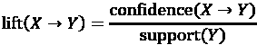

与置信度不同，其中项目顺序很重要，*提升(X* ** *Y)*与*提升(Y* ** *X)*相同。

例如，假设在一家杂货店，大多数人会购买牛奶和面包。仅凭运气，我们预计会发现许多同时购买牛奶和面包的交易。然而，如果*提升(milk* ** *bread)*大于 1，这表明这两个商品比仅凭运气更频繁地一起出现。换句话说，购买其中一个商品的人更有可能购买另一个商品。因此，一个大的提升值是规则重要的强烈指标，反映了商品之间的真实联系，并且该规则对商业用途是有用的。然而，请注意，这仅适用于足够大的交易数据集；对于支持度低的商品，提升值可能会被夸大。

`apriori`包的一对作者提出了新的度量标准，称为**超提升**和**超置信度**，以解决这些度量标准在稀疏数据中的不足。更多信息，请参阅*M. Hahsler 和 K. Hornik，关联规则的新概率兴趣度量（2018）.* [`arxiv.org/pdf/0803.0966.pdf`](https://arxiv.org/pdf/0803.0966.pdf)。

在`summary()`输出的最后部分，我们收到挖掘信息，告诉我们规则是如何被选择的。在这里，我们看到`groceries`数据，其中包含 9,835 笔交易，被用来构建最小支持度为 0.006 和最小置信度为 0.25 的规则：

```py
mining info:
      data  transactions support confidence
 groceries          9835   0.006       0.25 
```

我们可以使用`inspect()`函数查看具体的规则。例如，`groceryrules`对象中的前三条规则可以如下查看：

```py
> inspect(groceryrules[1:3]) 
```

```py
 lhs                rhs               support    
[1] {potted plants} => {whole milk}      0.006914082
[2] {pasta}         => {whole milk}      0.006100661
[3] {herbs}         => {root vegetables} 0.007015760
    confidence coverage   lift     count
[1] 0.4000000  0.01728521 1.565460 68   
[2] 0.4054054  0.01504830 1.586614 60   
[3] 0.4312500  0.01626843 3.956477 69 
```

第一条规则可以用普通语言读作：“如果一个顾客购买了盆栽植物，他们也会购买全脂牛奶。”支持度约为 0.007，置信度为 0.400，我们可以确定这条规则覆盖了大约 0.7%的交易，并且在涉及盆栽植物的 40%的购买中是正确的。提升值告诉我们，在顾客购买了盆栽植物的情况下，他们购买全脂牛奶的可能性相对于平均顾客要高多少。由于我们知道大约 25.6%的顾客购买了全脂牛奶（`support`），而 40%购买盆栽植物的顾客购买了全脂牛奶（`confidence`），我们可以计算出提升值为*0.40 / 0.256 = 1.56*，这与显示的值相匹配。

注意，标有`support`的列表示规则的支撑度，而不是`lhs`或`rhs`单独的支撑度。标有`coverage`的列是左侧的支撑度。

尽管置信度和提升度都很高，但*{盆栽植物}  {全脂牛奶}*看起来像一条非常有用的规则吗？可能不是，因为没有明显的逻辑原因说明为什么有人会更有可能和盆栽植物一起购买牛奶。然而，我们的数据表明情况并非如此。我们如何理解这一事实？

一种常见的方法是将关联规则分为以下三个类别：

+   可执行

+   琐碎

+   无法解释

显然，市场篮子分析的目标是找到**可执行**的规则，这些规则提供了清晰且有趣的见解。有些规则是清晰的，有些是有趣的；同时具备这两个因素的规则较为罕见。

所说的**琐碎**规则包括任何如此明显以至于不值得提及的规则——它们是清晰的，但并不有趣。假设你是一名营销顾问，被支付大笔金钱来识别跨推广商品的新机会。如果你报告的发现是*{纸尿布}  {配方}*，你可能不会被邀请回来进行另一项咨询工作。

简单的规则也可能伪装成更有趣的结果。例如，如果你发现某种儿童谷物品牌与一部流行的动画片之间存在关联。如果这部电影的主要角色出现在谷物盒的正面，这个发现就不是很具有洞察力。

如果项目之间的联系如此不清楚，以至于无法或几乎无法弄清楚如何使用这些信息，则规则是**无法解释的**。该规则可能仅仅是数据中的随机模式，例如，一条声称*{腌黄瓜}*与*{巧克力冰淇淋}*之间有关系的规则可能仅是由于一位孕妇妻子对奇怪食物组合有定期渴望的单一客户。

最好的规则是隐藏的宝石——一旦被发现，似乎就显而易见的未发现见解。如果时间足够，可以评估每一条规则以找到这些宝石。然而，从事分析的数据科学家可能不是判断规则是否具有可操作性、平凡或无法解释的最佳评判者。因此，更好的规则很可能是通过与负责管理零售连锁店的领域专家合作而产生的，他们可以帮助解释这些发现。在下一节中，我们将通过采用排序和导出学习规则的方法来促进这种共享，以便最有趣的结果浮出水面。

## 第 5 步 – 提高模型性能

主题专家可能能够非常快速地识别出有用的规则，但要求他们评估数百或数千条规则则是对他们时间的低效利用。因此，能够根据不同的标准对规则进行排序，并以可以与营销团队共享并深入审查的形式从 R 中提取它们，是非常有用的。这样，我们可以通过使结果更具可操作性来提高我们规则的表现力。

如果你遇到内存限制问题，或者 Apriori 运行时间过长，也可以通过使用更近期的算法来提高关联规则挖掘过程的计算性能。

### 对关联规则集进行排序

根据市场篮子分析的目标，最有用的规则可能是那些具有最高支持度、置信度或提升度的规则。`arules`包与 R 的`sort()`函数一起工作，允许重新排序规则列表，使得具有最高或最低质量度量值的规则排在最前面。

为了重新排序`groceryrules`对象，我们可以使用`sort()`函数，同时指定`by`参数的值为`"support"`、`"confidence"`或`"lift"`。通过将排序与向量运算符结合使用，我们可以获得特定数量的有趣规则。例如，可以使用以下命令检查根据`lift`统计量得出的最佳五条规则：

```py
> inspect(sort(groceryrules, by = "lift")[1:5]) 
```

输出如下：

```py
 lhs                    rhs                      support
[1] {herbs}             => {root vegetables}    0.007015760
[2] {berries}           => {whipped/sour cream} 0.009049314
[3] {other vegetables,                                     
     tropical fruit,                                       
     whole milk}        => {root vegetables}    0.007015760
[4] {beef,                                                 
     other vegetables}  => {root vegetables}    0.007930859
[5] {other vegetables,                                     
     tropical fruit}    => {pip fruit}          0.009456024
    confidence coverage   lift     count
[1] 0.4312500  0.01626843 3.956477 69
[2] 0.2721713  0.03324860 3.796886 89
[3] 0.4107143  0.01708185 3.768074 69
[4] 0.4020619  0.01972547 3.688692 78
[5] 0.2634561  0.03589222 3.482649 93 
```

这些规则似乎比我们之前看到的规则更有趣。第一条规则，其 `lift` 值约为 3.96，意味着购买香草的人比典型客户更有可能购买根类蔬菜，可能是为了某种炖菜。第二条规则也很有趣。与其他购物车相比，奶油在装有浆果的购物车中出现的可能性超过三倍，这可能表明是一种甜点搭配。

默认情况下，排序顺序是降序，这意味着最大的值排在前面。要反转此顺序，添加一个额外的参数，`decreasing = FALSE`。

### 考虑关联规则的子集

假设，根据前面的规则，营销团队对创建广告推广浆果的可能性感到兴奋，因为浆果现在正值季节。然而，在最终确定活动之前，他们要求你调查浆果是否经常与其他商品一起购买。为了回答这个问题，我们需要找到所有包含浆果的规则。

`subset()` 函数提供了一种搜索事务、项目或规则子集的方法。要使用它来查找规则中包含浆果的任何规则，请使用以下命令。这将把规则存储在一个名为 `berryrules` 的新对象中：

```py
> berryrules <- subset(groceryrules, items %in% "berries") 
```

我们可以像之前处理较大集合那样检查规则：

```py
> inspect(berryrules) 
```

结果是以下规则集：

```py
 lhs          rhs                  support    
[1] {berries} => {whipped/sour cream} 0.009049314
[2] {berries} => {yogurt}             0.010574479
[3] {berries} => {other vegetables}   0.010269446
[4] {berries} => {whole milk}         0.011794611
    confidence coverage  lift     count
[1] 0.2721713  0.0332486 3.796886  89  
[2] 0.3180428  0.0332486 2.279848 104  
[3] 0.3088685  0.0332486 1.596280 101  
[4] 0.3547401  0.0332486 1.388328 116 
```

有四个涉及浆果的规则，其中两个似乎足够有趣，可以被称为可执行的。除了奶油，浆果也经常与酸奶一起购买——这种搭配可以作为早餐或午餐，以及甜点。

`subset()` 函数非常强大。选择子集的标准可以用几个关键词和操作符来定义：

+   关键词 `items`，如前所述，匹配规则中出现的任何项目。要限制子集只匹配左侧或右侧，请使用 `lhs` 或 `rhs`。

+   操作符 `%in%` 表示至少有一个项目必须出现在你定义的列表中。如果你想找到匹配“浆果”或“酸奶”的任何规则，你可以写 `items %in% c("berries", "yogurt")`。

+   可用其他操作符进行部分匹配 (`%pin%`) 和完全匹配 (`%ain%`)。部分匹配允许你使用一个搜索找到柑橘类水果和热带水果：`items %pin% "fruit"`。完全匹配要求所有列出的项目都必须存在。例如，`items %ain% c("berries", "yogurt")` 仅找到包含 `berries` 和 `yogurt` 的规则。

+   子集也可以通过 `support`、`confidence` 或 `lift` 来限制。例如，`confidence > 0.50` 将规则限制在置信度大于 50%的规则。

+   匹配标准可以与标准的 R 逻辑操作符（如 AND (`&`), OR (`|`), 和 NOT (`!`)) 结合使用。

使用这些选项，你可以将规则的选取限制得尽可能具体或一般。

### 将关联规则保存到文件或数据框

要分享您的购物篮分析结果，您可以使用`write()`函数将规则保存到 CSV 文件。这将生成一个 CSV 文件，可以在大多数电子表格程序中使用，包括 Microsoft Excel：

```py
> write(groceryrules, file = "groceryrules.csv",
          sep = ",", quote = TRUE, row.names = FALSE) 
```

有时，将规则转换为 R 数据框也很方便。这可以通过使用`as()`函数实现，如下所示：

```py
> groceryrules_df <- as(groceryrules, "data.frame") 
```

这将创建一个包含规则字符格式和数据框的规则，以及支持度、置信度、覆盖度、提升度和计数等数值向量：

```py
> str(groceryrules_df) 
```

```py
'data.frame':	463 obs. of  6 variables:
 $ rules     : chr  "{potted plants} => {whole milk}"   "{pasta} => {whole milk}" "{herbs} => {root vegetables}"   "{herbs} => {other vegetables}" ...
 $ support   : num  0.00691 0.0061 0.00702 0.00773 0.00773 ...
 $ confidence: num  0.4 0.405 0.431 0.475 0.475 ...
 $ coverage  : num  0.0173 0.015 0.0163 0.0163 0.0163 ...
 $ lift      : num  1.57 1.59 3.96 2.45 1.86 ...
 $ count     : int  68 60 69 76 76 69 70 67 63 88 ... 
```

将规则保存到数据框中可能很有用，如果您想对规则进行额外的处理或需要将它们导出到另一个数据库。

### 使用 Eclat 算法提高效率

**Eclat 算法**，该算法以“等价类项集聚类和自底向上的格遍历”方法命名，是一种稍微现代且实质上更快的关联规则学习算法。虽然实现细节超出了本书的范围，但它可以理解为 Apriori 的近亲；它也假设所有频繁项集的子集也是频繁的。然而，Eclat 通过利用提供识别潜在最大频繁项集的快捷方式的巧妙技巧，能够搜索更少的子集。由于 Apriori 在深入搜索之前先进行广泛搜索，因此它是一种广度优先算法，而 Eclat 被认为是一种深度优先算法，因为它深入到底端并只搜索所需的宽度。对于某些用例，这可能导致性能提升一个数量级并减少内存消耗。

关于 Eclat 的更多信息，请参阅*快速发现关联规则的新算法，Zaki, M. J., Parthasarathy, S., Ogihara, M., Li, W., KDD-97 会议论文集，1997*。

与 Eclat 的快速搜索相比，一个关键的权衡是它跳过了 Apriori 中计算置信度的阶段。它假设一旦获得了具有高支持度的项集，就可以在以后识别最有用的关联——无论是通过主观的目测，还是通过另一轮处理来计算置信度和提升度等指标。尽管如此，`arules`包使得应用 Eclat 与 Apriori 一样简单，尽管在处理过程中增加了额外的一步。

我们从`eclat()`函数开始，并将`support`参数设置为之前相同的 0.006；然而，请注意，在这个阶段并未设置置信度：

```py
> groceryitemsets_eclat <- eclat(groceries, support = 0.006) 
```

这里省略了一些输出，但最后几行与我们从`apriori()`函数获得的输出类似，关键区别在于写入了 747 个项集而不是 463 条规则：

```py
Absolute minimum support count: 59 
create itemset … 
set transactions …[169 item(s), 9835 transaction(s)] done [0.00s].
sorting and recoding items … [109 item(s)] done [0.00s].
creating sparse bit matrix … [109 row(s), 9835 column(s)] done [0.00s].
writing  … [747 set(s)] done [0.02s].
Creating S4 object  … done [0.00s]. 
```

生成的 Eclat 项集对象可以使用`inspect()`函数，就像我们使用 Apriori 规则对象一样。以下命令显示了前五个项集：

```py
> inspect(groceryitemsets_eclat[1:5]) 
```

```py
 items                       support     count
[1] {potted plants, whole milk} 0.006914082 68   
[2] {pasta, whole milk}         0.006100661 60   
[3] {herbs, whole milk}         0.007727504 76   
[4] {herbs, other vegetables}   0.007727504 76   
[5] {herbs, root vegetables}    0.007015760 69 
```

要从项集中生成规则，请使用 `ruleInduction()` 函数，并设置所需的 `confidence` 参数值，如下所示：

```py
> groceryrules_eclat <- ruleInduction(groceryitemsets_eclat,
    confidence = 0.25) 
```

将 `support` 和 `confidence` 设置为之前的值 0.006 和 0.25，Eclat 算法产生了与 Apriori 相同的 463 条规则，这并不令人惊讶：

```py
> groceryrules_eclat 
```

```py
set of 463 rules 
```

结果的规则对象可以像之前一样进行检查：

```py
> inspect(groceryrules_eclat[1:5]) 
```

```py
 lhs                rhs                support    
[1] {potted plants} => {whole milk}       0.006914082
[2] {pasta}         => {whole milk}       0.006100661
[3] {herbs}         => {whole milk}       0.007727504
[4] {herbs}         => {other vegetables} 0.007727504
[5] {herbs}         => {root vegetables}  0.007015760
    confidence lift    
[1] 0.4000000  1.565460
[2] 0.4054054  1.586614
[3] 0.4750000  1.858983
[4] 0.4750000  2.454874
[5] 0.4312500  3.956477 
```

由于两种方法都易于使用，如果你有一个非常大的交易数据集，那么在较小的随机交易样本上测试 Eclat 和 Apriori 算法可能值得，以查看哪一个表现更好。

# 摘要

关联规则用于发现大型零售商的大量交易数据库中的洞察。作为一个无监督学习过程，关联规则学习器能够从大型数据库中提取知识，而无需任何关于要寻找的模式的先验知识。难点在于需要付出一些努力，将丰富的信息减少到更小、更易于管理的结果集。我们在本章研究的 Apriori 算法通过设置最小有趣性阈值，并仅报告满足这些标准的关联来实现这一点。

我们在为一家规模适中的超市进行一个月的交易市场篮子分析时使用了 Apriori 算法。即使在这样一个小例子中，也发现了大量的关联。在这些关联中，我们注意到了一些可能对未来的营销活动有用的模式。我们应用的方法在规模大得多的零售商处使用，其数据库规模是这个大小的多倍，也可以应用于零售环境之外的项目。

在下一章中，我们将检查另一个无监督学习算法。就像关联规则一样，它的目的是在数据中找到模式。但与寻求相关项目或特征的关联规则不同，下一章中的方法关注于在示例之间找到联系和关系。

# 加入我们书籍的 Discord 空间

加入我们的 Discord 社区，与志同道合的人见面，并在以下地方与超过 4000 人一起学习：

[`packt.link/r`](https://packt.link/r)


