# 11

# 机器学习的成功之道

在机器学习领域，一个过于常见的问题发生在学生从学习方法中获得新鲜兴奋之后，却难以将所学应用于现实世界项目。就像森林小径在夜幕下的黑暗中显得邪恶一样，最初看似简单的代码和方法在没有一步一步的路线图的情况下显得令人畏惧。没有这样的指南，学习曲线显得更加陡峭，陷阱看起来更深。

想到由于机器学习理论与实践之间的鸿沟，无数学生被拒之门外，这令人沮丧。在机器学习领域工作超过十年，并培训、面试、雇佣和监督了许多新从业者后，我亲眼目睹了这种“鸡生蛋，蛋生鸡”的挑战。这似乎是一个悖论：在没有首先获得机器学习经验的情况下，获得机器学习的实际经验似乎是不可能的！

本章的目的，以及随后的章节，是作为先前章节中简单教学示例和现实世界不可抗拒的复杂性之间的桥梁。在本章中，你将学习：

+   影响机器学习模型成功与失败的因素

+   设计可能表现良好的项目的策略

+   如何进行数据探索以提前发现潜在问题

+   为什么数据科学和竞赛与机器学习相关

无论你的成功定义是在该领域找到工作、构建更好的机器学习模型，还是仅仅深化你对该领域工具和技术的了解，你将在接下来的页面中找到一些可以学习的东西。你甚至可能会发现自己突然有了加入许多在线机器学习竞赛的新愿望，这些竞赛可以拓展你的技能并检验你的知识。

# 什么使机器学习从业者成功？

为了明确，现实世界机器学习的挑战并非源于更多高级或复杂方法的添加；毕竟，本书的前九章涵盖了各种各样、具有挑战性的实际问题，如识别癌细胞、过滤垃圾邮件和预测风险银行贷款。相反，现实世界机器学习的挑战与该领域难以在脚本设置中传达的方面有很大关系，如教科书或讲座。机器学习既是艺术也是科学，就像在没有现实世界实践的情况下学习绘画、跳舞或说一门外语一样具有挑战性，同样难以将机器学习方法应用于新的、未知的领域。

就像探索遥远土地的先驱者一样，你将遇到前所未有的挑战，这些挑战需要软技能，包括坚持和创造力。你将遇到大量、混乱和复杂的数据集，需要深入探索和记录；图表和可视化是这个领域的先驱者图表和地图的等价物。你的分析和编程技能将受到考验，当你失败时，正如常常发生的那样，尤其是在早期，你需要迭代并改进你的错误。使用科学方法创建可重复的实验将成为防止你绕圈子走的面包屑。要成为机器学习领域的坚韧个体主义者，需要既灵活又适应性强，同时还要像狗咬住骨头一样有着无法满足的好奇心——也就是说，一旦咬住，就不会放手。

虽然坚韧个体主义者的概念是机器学习独立元素的绝佳隐喻，但这项工作在很大程度上也是一种团队运动。探索南极洲的苔原或攀登珠穆朗玛峰是一项艰巨的努力，大多数现实世界的机器学习项目也是如此。独自承担这样的任务是不明智的或危险的，如果风险很高，甚至可能非常危险。然而，即使在团队中，由于计划不周或沟通不畅，也可能发生失败。数据科学家开发模型和数据工程师提供数据之间的交接尤其危险。如果一个团队走到了这一步，那么在模型必须实施到业务实践和 IT 系统中的时候，还会发生一个更具挑战性的交接。因此，在许多其他原因中，大多数机器学习模型从未被部署。

如果感觉现实世界的机器学习需要超人的技能集，那么如果查看最近的在线招聘信息，这可能并不离真相太远。一个非常具体的职位要求有构建推荐系统和设计图像识别工具的经验，以及熟悉图表示学习和自然语言处理。另一个要求有在非常大数据集上构建“高性能推理管道”的经验。许多人希望有深度神经网络的经验，而有些人则更通用，需要“对机器学习基础有扎实的理解”以及“能够分析各种结构化和非结构化数据的能力”。这些多样的技能组合可能会让初入职场的从业者感到有些害怕，并使他们想知道从哪里开始。

*图 11.1*列出了该领域常用的所谓“硬”技术技能以及一些有益的“软”特质。到本书结束时，你将接触到图中左侧的大部分工具和技能，通过完成练习，你将培养出右侧的特性。请记住，找到一个对这些技能中的每一个都有深入了解的人是非常罕见的。这些是传说中的“独角兽”。尽管如此，他们可能会承认还有很多东西要学。总是有可能更深入地学习特定主题。鉴于有限的时间和精力，大多数人必须在广泛涉猎多个领域或深入少数几个领域之间做出妥协。

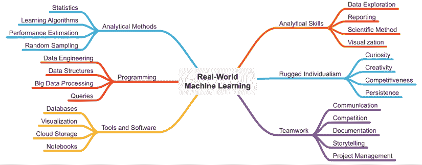

图 11.1：现实世界的机器学习需要众多技术技能（左侧）和软技能（右侧）

提高机器学习技能，尤其是软技能的最好方法之一是通过竞赛。如图 11.1 所示，竞赛以多种方式提高了机器学习的结果；它是个人创新和提升自身表现动力的关键组成部分，同时它也促进了团队为实现共同目标而进行的强大合作。出于这些原因，竞赛长期以来一直是机器学习培训的一部分。

例如，学术计算机科学家已经参加了超过 25 年的名为**知识发现与数据挖掘**(**KDD**)杯的竞赛([`www.kdd.org/kdd-cup`](https://www.kdd.org/kdd-cup))，该竞赛根据参赛者在每年变化的机器学习任务中的表现来选择获胜者。类似的竞赛存在于图像、文本和音频数据等专门主题，以及许多其他领域。

在盈利空间中最早广泛知名的机器学习竞赛之一，2006 年，Netflix 视频流媒体服务开始提供 100 万美元的奖金，以使其电影推荐准确率提高 10%。这一事件带来的宣传促使了一系列由企业赞助的挑战活动，包括在 Kaggle([`www.kaggle.com`](https://www.kaggle.com))上列出的那些，该网站举办竞赛，为在各个领域推进复杂机器学习任务的先进状态提供现金奖励。Kaggle 很快变得非常受欢迎，激发了一代机器学习实践者的灵感，其中一些人利用他们的胜利作为未来在咨询和科技公司工作的跳板。在*第十二章*，*高级数据准备*中，你将学习一些这些 Kaggle 冠军的经验。

并非每个人都喜欢面对面的竞争，但你仍然可以与自己竞争，或者想象你的公司在与其他企业竞争。一些从业者满足于挑战自己，在模型性能统计上超越自己的“高分”。其他人则受到“适者生存”和这样一个想法的激励，即商业市场奖励那些超越他人的公司——其中一些最终会灭绝。无论如何，竞争的目标不是提升个人的自尊，而是激励创新和持续的质量改进，确保你的技能保持最新。

持续学习和不断应用所学知识可能是机器学习爱好者最重要的特征。正如在*第一章*，*介绍机器学习*中所描述的，该领域是在数据量、复杂性以及处理这些数据所需的计算能力和统计方法共同增长的环境中演化的。这种演变并没有放缓的迹象。数据、工具和方法会发生变化，但总会有需要人们去应用它们的需求。因此，将每个项目视为学习新知识的机会。构建更好模型的迭代过程，有时甚至具有上瘾性，是开始这段旅程的一个合适起点。

# 什么因素使机器学习模型成功？

到目前为止，我们主要从*定量*的角度来理解一个成功的机器学习模型意味着什么。监督学习者在最初被认为如果准确率高就会表现良好。

在*第十章*，*评估模型性能*中，我们将这个定义扩展到包括其他更复杂的性能度量，如马修斯相关系数和 ROC 曲线下的面积，以解释准确性对于不平衡数据集来说是误导性的，并考虑潜在用例的性能权衡。

到目前为止，我们将模型性能的*定性*度量限制在无监督学习的领域，尽管在预测建模领域也存在一些无法量化的考虑因素。例如，考虑一个计算成本如此之高以至于无法在实时应用中实施，或者算法如此复杂以至于无法向申请人提供其决策解释的信用评分模型。考虑到这一点，如果选择没有模型，我们可能会倾向于选择一个更简单、不那么精确的模型。毕竟，即使是简单的预测模型通常也比没有好——这里的“通常”是一个关键限定词，考虑到我们很快将要探讨的模型在现实世界中失败得非常严重的情况！

可能存在难以融入模型本身的业务成本、资源限制或人力资源因素，这些因素会影响建模项目的成功。为了说明这一点，想象你创建了一个客户流失预测算法，该算法可以以高精度识别最有可能停止购买产品的客户。不幸的是，在部署模型后，你收到了销售代表的投诉，他们试图保留这些客户：

+   “我已经知道这些人会流失。你告诉我什么新东西？”

+   “那个客户两个月前就停止购买了。他们已经流失了。”

+   “我们实际上希望这些人流失，因为他们是低价值客户。”

+   “我已经和那个客户谈过了，我们无能为力。”

+   “你的模型预测没有意义。我不信任它。”

+   “你怎么知道这个客户会流失？他们看起来对我很满意。”

+   “我们试图保留那个客户会亏损。”

+   “预测似乎没有以前好。发生了什么？”

这类评论在现实世界的机器学习中很常见，代表了项目整体成功中的常见障碍，即使按照传统的统计性能指标，该模型被认为准确或有效。这些障碍的问题在于，没有深入了解模型将用于其中的业务，它们就不容易被克服。另一方面，这类问题往往遵循相似的模式，通过实践可以预见。

以下表格将问题分为四组，以及典型的症状和可能的解决方案：

| **陷阱** | **症状** | **可能的解决方案** |
| --- | --- | --- |
| 预测显而易见的事情 |

+   一个更简单的模型（或一个众所周知的经验法则）几乎表现得一样好

+   模型的性能统计数据看起来“太好了，以至于不真实”

+   模型在训练集和测试集上表现良好，但在部署时没有产生影响

+   结果似乎不可避免；拥有预测结果并没有提供可采取的行动来干预

|

+   重新表述问题，使其对学习算法更具挑战性

+   注意避免死记硬背、循环逻辑或目标泄露（拥有一个本质上是对目标的代理的预测器）

+   重新编码目标变量，或限制对与目标高度相关的某些预测器的访问，这样模型就能找到新的联系而不是显而易见的联系

+   检查预测概率的中值，或过滤掉最明显或不可避免预测

|

| 进行不公平的评估 |
| --- |

+   模型在实际世界中的表现远不如在测试中

+   确定使用的“最佳”模型需要大量的迭代或调整

+   正确或错误的预测似乎是可以预测的；模型在某些数据段上的表现可能比预期好或差

|

+   确保使用适当的评估数据集

+   正确使用交叉验证并了解其局限性

+   警惕内部相关数据的常见形式，并了解在这些情况下如何构建公平的测试集

|

| 忽视现实世界的影响 |
| --- |

+   结果很有趣，但影响不大

+   实施模型的不明确业务案例

+   模型忽略了重要的示例子集

+   过度依赖简单的定量性能指标

+   忽略预测概率，对所有预测给予同等权重

|

+   使用模拟和实验预测项目在各种可能情景下的影响

+   在输出上设置反映现实世界约束的过滤器

+   创建 ROC 曲线和其他成本感知的性能指标

+   关注高影响的结果，而不是“低垂的果实”

|

| 缺乏信任 |
| --- |

+   利益相关者拒绝根据数据采取行动，而依赖直觉

+   倾向于用“老”方法做事

+   对系统地处理预测缺乏兴趣

+   利益相关者挑选他们同意/不同意的结果

+   反复要求证明预测的合理性

|

+   确定将有助于推广项目的“冠军”

+   将利益相关者纳入建模过程（特别是数据准备）并迭代他们的反馈

+   制定“电梯演讲”和“路演”幻灯片，以预先解决常见问题

+   记录模型产生影响的案例，并反复讲述这些故事

+   以可操作的形式输出预测，例如“交通灯”方法

+   使用模型可解释性工具

|

很可能需要花费许多页面来描述每个这些陷阱类别的职业生涯经验，但遗憾的是，这并不能替代自己艰难学习的过程。话虽如此，有一些广泛的指导方针可能有助于你避开道路上的某些颠簸。

## 避免明显的预测

当涉及到*预测显而易见的事情*时，可能根本不明显的是它最初是如何或为什么发生的！这个问题的简短答案是，往往比人们想象的更容易意外构建一个“作弊”的模型，通过找到一种简化问题的方法，或者“短路”问题，而不做真正理解问题的必要深入工作。

这对于跟踪特征和结果随时间变化的项目尤其正确，例如预测未来将发生的事件。这类项目通常从**时间序列数据**开始，这些数据反复测量随时间变化的示例的相同属性。

我们将在第十二章“高级数据准备”中从数据准备的角度考虑时间序列数据，但就目前而言，只需说具有时间维度的数据必须仔细编码，以避免使用未来的值来预测过去。这个问题属于更广泛的**泄露**类别，或者更具体地说，是**目标泄露**，它描述了学习算法对要预测的目标有所了解的情况，而在现实世界的部署环境中，它不会拥有这种了解。当存在明显的顺序问题时，例如使用当前的信用评分来预测过去的贷款违约，目标泄露在事后看来非常明显。它仍然令人惊讶地经常发生，尤其是在分析师简单地将所有潜在的预测变量放入模型中，而没有考虑它们的意义时。在其他时候，目标泄露非常微妙且难以检测，只有在利益相关者拒绝结果为“太好了，以至于不可能是真的”时，才会通过更深入的分析揭示出来。

当目标变量以这种方式定义，从而产生同义反复或定义性预测时，目标变量与预测变量之间的关系在这种情况下不必总是完全确定性的，但可能是过度相关的，或者以某种不清楚的方式相互关联。例如，假设我们使用一个业务定义，该定义使用销售中的 3 个月滚动平均来定义这个月的流失状态。然后，使用上个月和两个月前的数据作为当前月份流失的预测变量，算法就能得到正确答案的三分之二——那些月份销售量低的客户，按照定义，很可能流失。当使用复杂的调查数据时，这种错误很容易发生，其中个人调查响应被用作预测变量，从调查响应集中计算出的分数被用作要预测的目标。一般来说，为了避免目标泄露，最好使用由完全独立的过程生成的目标，并且收集时间晚于用于预测的数据。

小心使用未来预测过去！对于一个将在现实世界中部署的模型，这几乎总是目标泄露存在的明显迹象。

当目标变量以某种隐藏方式通过业务实践与预测变量相关联时，也可能发生泄露。例如，想象一个场景，一个制造商试图通过建立一个模型来预测哪些客户最有可能购买他们品牌的汽车，以此来提高客户获取率。

创建一个预测人员是否打开或点击营销电子邮件的预测器似乎是合理的，但如果营销电子邮件只发送给以前的客户，那么模型很可能会做出常识性的预测，即忠诚的客户往往会保持忠诚，销售人员不太可能印象深刻。由于目标和预测器之间的强烈联系，模型基本上忽略了之前从未购买过该品牌的人群，这是最有可能影响公司利润的人群！从模型中排除这个预测器，或者仅基于首次购车者构建模型，将使算法专注于最具影响力的预测，或者那些不太不可避免的预测。

导致明显预测的另一个因素与**自相关**有关，它描述了类似惯性的现象，即时间上接近的测量值往往在数值上也接近。基于这一观察，可以得出结论，今天某物的最佳预测通常是昨天该物的价值。这几乎是普遍适用的：今天的能源消耗、支出、卡路里摄入、幸福感以及几乎所有可以想象的东西都与前一天这些事物的状态紧密相关。换句话说，自相关意味着在人们或其他分析单位（如家庭、企业、股票价值等）之间的长期变化往往大于这些单位在较短时间内内的变化。

机器学习算法可以快速识别自相关实例，并且乐于构建一个使用昨天数据来预测今天情况的模型。它甚至会在测试集上拥有很高的准确率，这导致许多缺乏经验的分析师忽略了潜在的问题。具体来说，这仅仅是一种过度复杂的列表排序方法！如果一家企业想要预测明天最有可能大量消费的客户，他们可以直接查询数据库中今天花费最高的客户，并在简单的电子表格应用程序中对列表进行排序。实际上，这种排序方法在名为**最近性、频率、货币价值**（**RFM**）分析下已经行之有效多年，该分析在*第六章*，*预测数值数据 – 回归方法*中介绍，与基于机器学习的方法形成对比。RFM 方法基本上表明，购买频率更高、购买金额更大的客户更有可能继续这些趋势。不幸的是，这几乎对预测哪些新客户最有可能在未来成为顶级消费者毫无帮助。

强迫学习算法处理这个更具操作性的问题，需要围绕“行动”重新定义目标变量。目标需要非常具体，并指明模型将产生影响的精确情况。在先前的例子中，与其建模总支出，不如建模随时间变化的支出增加或减少。

这被称为**delta**，预测销售 delta 将允许销售代表在预测的增加或减少发生之前进行干预。或者，也可以建模干预本身的影响；例如，与其预测最有可能流失的客户，不如建模最有可能对流失干预措施做出积极反应的客户。当然，这需要记录先前反流失干预措施属性的历史数据。通常，这种类型的数据在大多数企业中是缺乏的。

## 进行公平的评价

在机器学习项目中，在纸上表现良好但在现实世界中表现不佳的情况并不少见。这有时与*进行不公平的评价*的问题有关，无论是因为疏忽还是故意欺骗，这种错误都不应该存在。鉴于前几章案例研究的成果，我们知道不应假设训练性能是未来性能的无偏估计。因此，我们始终构建一个保留测试集来模拟未来的未见数据，并提供这个公平的估计。在第十章“评估模型性能”中，我们了解到为了比较和选择多个候选模型，我们应该使用验证数据集，这样测试集就可以“存放在保险库中”，并保持对未来性能的无偏估计。根本问题是，通过选择在测试集上表现最佳的模型，本质上是对测试集进行了过拟合，性能被夸大，就像对训练集进行过拟合时一样。违反“保险库”规则，不出所料，会导致现实世界中性能模型出人意料地差。

也许更令人惊讶的是，正如可能对训练和测试数据进行过拟合一样，也可能对验证集进行过拟合。这尤其适用于在迭代过程中构建了众多模型，或者模型被广泛“调整”以识别最佳参数值的情况，正如将在第十四章“构建更好的学习者”中讨论的那样。问题是，通过反复使用相同的数据，关于数据的一些信息不可避免地“泄露”到学习算法中，最终可能导致对验证集的过拟合。

将模型构建、模型选择和模型评估的过程可视化为一系列步骤可能会有所帮助，如下面的图所示。在训练步骤中，算法确定数据的最佳拟合；在此过程中，它优化了内部值，称为**参数**，这是模型抽象的基础。在某些情况下，例如回归模型、神经网络和支持向量机，参数对最终用户来说是可见的，如系数、权重或支持向量。在其他情况下，例如 k-NN、决策树和规则学习器，参数则更具有概念性；将参数视为算法为了拟合数据而做出的内部选择。

在任何情况下，由于模型已经选择了一组“最佳”参数来拟合训练数据，任何性能估计都可能过于乐观，并且它在推广到测试集时可能会至少稍微表现得更差。

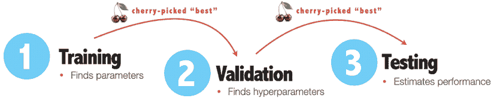

图 11.2：由于在训练和验证过程中选择了“最佳”模型，性能估计往往过于乐观

验证数据集用于在多种类型的模型之间进行选择，测试单一类型模型的多个迭代，或者同时进行这两者。这可以理解为识别学习器最优**超参数**的过程，或者任何设置在学习器外部且不由算法本身估计的参数。在阅读了前面的章节后，你将已经熟悉了几个超参数，例如 k-NN 算法中*k*的值、SVM 算法的成本参数*C*和核函数，以及神经网络的学习率和隐藏节点的数量，等等。广义而言，超参数的概念不仅指直接影响特定算法的选择，还包括算法的整体选择，以及算法如何与其他算法结合，正如你将在第十四章“构建更好的学习器”中学习到的那样。由于即将成为明显的原因，将“超参数”视为任何在学习过程之外做出的决策，并且可能影响模型拟合，可能是有帮助的。

现在，假设你有一个验证数据集，并且你在这个数据集上系统地评估了多种方法。你可能测试各种算法，比如神经网络与决策树和 SVMs，然后使用不同的超参数值测试这些模型的各个迭代版本。在所有这些数十或数百种可能性中选择“最佳”表现者，基于验证集的性能，当应用于测试数据集时，这个模型的性能很可能会因为对验证集的潜在过拟合而下降，就像它在训练和验证之间所做的那样。我们留下的问题是，我们是否真正选择了最佳模型，以及性能的稳健性如何。

在第十章“评估模型性能”中介绍的 10 折交叉验证方法，乍一看似乎可以解决这两个问题。确实，计算 10 个折叠的平均值和标准差的做法确实提供了模型性能稳健性的度量，因为底层训练数据发生变化。这提供了关于模型将如何泛化到未来未见数据的感觉。因此，一个常见的做法是在同一数据集上重复运行 10 折交叉验证，以比较各种超参数并选择胜者。

然而，如图 11.3 所示，标准形式的 10 折交叉验证（左侧）并不提供验证数据集，因此只能估计模型内部搜索最优参数时产生的泛化误差。例如，假设我们比较 10 折交叉验证的性能统计信息，以帮助决定神经网络是否比决策树表现更好，或者我们使用 10 折交叉验证来确定对于 SVM 方法来说，25 个潜在值中的哪一个*C*是最好的。在这两种情况下，请注意我们再次在赢家中进行挑选，这会导致我们的性能估计被夸大。最终，如果使用交叉验证进行广泛的超参数调整，我们可能会对模型的真实未来性能过于乐观。

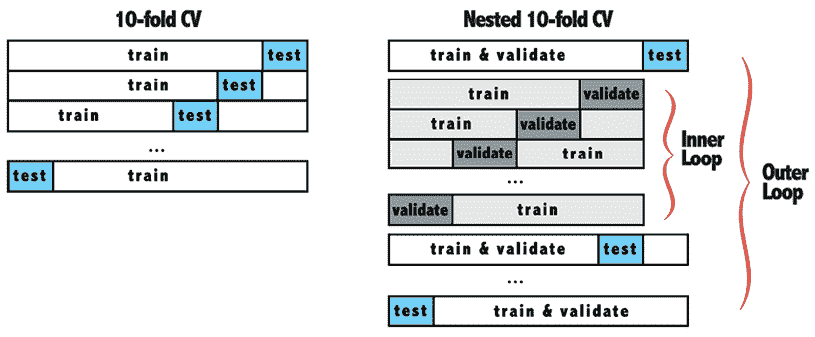

图 11.3：嵌套 10 折交叉验证为在验证集上学习最优超参数添加了一个“内部循环”的 10 折交叉验证

最好将交叉验证视为不仅仅是估计模型拟合训练数据的能力（学习最佳参数），还包括在选择最终模型过程中做出的所有决策的整个流程（学习最佳超参数）。假设我们可以编写一个 R 函数来自动化这些决策；它接受几个候选方法，并从中选择表现最好的一个。

由于缺乏一个更正式的术语，让我们称这个为“评估”函数。在这种情况下，我们可能会考虑通过将每个 10 折中的每个折分为训练集和验证集，而不是训练集和测试集，来修改我们的标准 10 折交叉验证方法。每个模型将由评估函数评估其在验证数据集上的性能，获胜的模型将由评估函数选择，作为在 10 个折上平均性能最佳的模型。此时，我们仍然试图弄清楚性能在未来对新、未见过的数据集的泛化程度如何。

如*图 11.3*所示，**嵌套交叉验证**（通常是嵌套的 10 折交叉验证）的目的是将交叉验证作为一个内部循环，在其中每个内部折上学习参数，最佳超参数由外部循环（通常也是 10 折交叉验证）的每个折上的评估函数确定。在内部循环的每个折中，评估函数可以在验证数据集上评估任意数量的模型。也许我们正在评估三种不同类型的模型，如决策树、k-NN 和 SVMs，或者我们可能正在评估单个神经网络的 25 个不同的学习率。最后，无论我们评估的是 3 个还是 25 个模型，评估函数只提名一个最佳模型进入外部循环进行评估，在外部循环中，10 个最佳内部循环模型的性能值在相应的测试集上平均。这意味着嵌套交叉验证不仅测量单个模型的性能，还测量选择模型、学习最佳参数和超参数的整个过程。

如同在第十章“评估模型性能”中所述，鉴于嵌套交叉验证的复杂性——无论是实现还是解释——标准的 10 折交叉验证对于大多数机器学习的实际应用通常已经足够。一方面，由于验证过程中发生的信息泄露相对较小，数据集越大，对分析的影响就越小。另一方面，如果两个模型之间的性能差异很小，那么过拟合的程度可能足以导致错误的选择。这一点在调整、迭代和超参数化的数量增加时尤其正确。

总体而言，嵌套交叉验证是否必要或过度，很大程度上取决于结果将如何被使用。对于一个行业基准或学术出版物，更复杂的嵌套技术可能是合理的。对于风险较低的工作，选择更简单的标准 10 折交叉验证可能更明智，并用节省下来的时间来考虑模型如何部署。正如下一节将清楚说明的，一个在理论上表现良好的模型在现实世界中失败并不罕见。因此，能够更快地达到失败点的简单方法将为你提供更多时间进行纠正。

## 考虑现实世界的影响

创建一个机器学习项目，从所有客观指标来看，似乎将在其预期任务中表现良好，这种肾上腺素激增往往会导致另一个常见的陷阱：*不考虑现实世界的影响*。现实世界的机器学习项目通常不是为了娱乐而进行的练习；它们通常是成本高昂、耗时的工作。委托机器学习项目的利益相关者通常期望**投资回报率**（**ROI**），而不仅仅是生产模型所需的时间和金钱，还包括将用于采取行动的资源。一个完全不工作的模型是一次性的沉没成本，但一个提供糟糕建议或浪费或误导公司未来时间和资源的模型，则是将好钱扔到坏钱里。对一个好主意不断投入，而它根本就没有按预期工作，这是**沉没成本谬误**的根源，其中一个人相信可以通过更多的投资来挽救一个失败的项目。以这种方式使用的机器学习项目比什么都没有还要糟糕。

除了浪费实施团队的资源外，一个项目还可能造成意外的伤害。即使机器学习算法在其训练的基础上做的是合理的事情，这也是正确的。为了提供一个幽默的个人例子，请看以下图片，它展示了我在短短几个月内从同一家信用卡公司收到的数十封信件。更糟糕的是，这甚至不是全部，因为我直到意识到发生了什么才开始收集它们！甚至有些时候我每天都会收到一封信。

既然知道银行通常不会在没有充分理由的情况下浪费邮资，我的怀疑是，一个客户获取机器学习模型判定我将成为一个值得获取的宝贵客户，即使这意味着花费大量资金。


图 11.4：一个算法看起来合理的解决方案可能对现实世界产生负面影响，例如“垃圾邮件”式地向最终用户发送请求

尽管我应该为算法认为我足够有价值而感到荣幸，不断给我发送邮件，但最终可能损害了我对信用卡公司的印象。虽然我不能确定这不是由某种故障引起的，但在发生时，我不禁回想起我在雷伊德·加尼（Rayid Ghani）的演讲中听到的话。具体来说，该竞选活动对其电子邮件征集进行了数千次实验，并在此过程中发现，他们发送的电子邮件越多，赚的钱就越多。这种情况几乎没有上限。

在任何时候，从其邮件列表中取消订阅的人数都没有超过他们通过不断占据电子邮件收件箱而收到的额外捐款。也许这样的发现可以解释我收到信用卡公司的大量纸质邮件；这当然可以解释消费者现在在他们的收件箱中看到的电子邮件营销的巨大增加。只有时间才能告诉我们这种方法的长期后果是什么。

想了解更多关于奥巴马竞选活动分析电子邮件行为数据时发现的有趣发现，请访问[`www.wired.com/2013/06/dont-dismiss-email-a-case-study-from-the-obama-campaign/`](https://www.wired.com/2013/06/dont-dismiss-email-a-case-study-from-the-obama-campaign/)

而不是将其留给运气，对现实世界影响表示关心的最佳方式是将机器学习项目设计成与最终部署场景的紧密近似。模拟、实验以及小规模的**概念验证**（**POC**）试验运行是这一目标的特别有用的工具。在项目甚至被考虑部署之前，机器学习实践者应该能够回答典型的利益相关者问题，例如：

+   使用这个模型可以节省多少美元、生命、小工具等等？

+   对于每一次成功的预测，会有多少“失误”发生？

+   投资回报率（ROI）是否依赖于高风险、高回报的事件，还是它积累的是较小的、缓慢而稳定的胜利？

+   模型的性能在某些类型的示例上是否明显更好，或者它在整个集合中表现均匀？

+   模型是否系统地偏向或忽略感兴趣的类别，例如受保护的年龄、种族或民族群体、地理区域或客户细分？

+   可能会有哪些意想不到的后果？算法是否可能造成伤害，或者被不良行为者利用来造成伤害？

设计巧妙的项目，包括模拟部署和估计投资回报率（ROI）的计算，将有助于提供数据来回答这些问题。在这些项目中，重要的是不仅要计算准确性，还要更进一步，计算一个数字，描述一旦模型部署后这种准确性如何转化为现实世界的影响。

进行公平的比较需要足够的商业知识来构建或识别一个合适的**对照组**——现有的现状或作为基准或基线参照框架的情况。

对于一个癌症识别模型，例如，人们可能会估计使用该模型的预测结果所挽救的生命数量，然后将其与使用传统人工诊断所挽救的生命数量进行比较。在机器学习模型的干预没有明显参照框架的情况下，基线可能是一个完全不使用模型的情况，其结果基本上是随机决定的，或者使用一个“愚蠢”的模型，该模型总是选择多数类或预测平均值。你也可以使用像第五章中讨论的 OneR 规则学习算法这样的简单模型来模拟一个简单的经验法则。

自然地，现实世界极其复杂且不断变化，因此，不仅要估计模型的影响，还要检查其在各种约束下的影响稳健性。这些约束中的一些可能是伦理方面的，例如确保它在感兴趣的子群体中表现均匀。在商业环境中，这些重要的子群体可能包括年龄、种族、民族、性别和经济状况等类别；在医疗环境中，这些可能还包括基于健康特征，如体重指数和受试者是否吸烟。分析员需要确定哪些现实世界情境对于评估性能最为重要。一旦这些情境确定，分析员就可以对每个子群体进行预测，并比较模型在不同群体中的性能，检查是否存在系统性过度表现或表现不佳的群体所反映的偏差。

除了子群体之间的差异外，由于用于训练或评估的数据随时间变化，模型在现实世界中的影响也可能发生变化。在实践中，10 折交叉验证甚至更复杂的嵌套交叉验证变体过于简化了机器学习模型在现实世界中构建和部署的许多方面。它们没有反映许多潜在的外部因素，而不仅仅是训练数据的变异，这些因素可能会影响模型未来的性能。

为了帮助理解这些其他因素，*图 11.5* 提供了在大多数现实世界环境中模型通常是如何构建和评估的简化视图。它想象了一个由模型需要预测其预测的实体组成的数据流；你可以想象这是一行潜在癌症患者、客户、贷款申请人等等的单文件。为了预测他们的未来结果，我们通常会在今天的历史时间点对这一数据流进行快照，或者记录一段时间内的观察结果，然后将这些数据分成用于训练、验证和测试的单独集合——可能使用 10 折交叉验证或类似方法。从这个快照上构建和评估的模型性能估计被认为是未来性能的合理估计，但我们不能确定，除非未来最终发生。

当然，在一个理想场景中，我们只需在今天的数据（或过去的数据）上构建我们的模型，然后等待一段时间“未来”发生并执行评估，但在实践中这非常罕见。如果你所在的企业有远见卓识，能够收集足够的历史数据，或者有耐心等待数据收集，那么你就很幸运了；在许多情况下，商业发展得太快，资源又太稀缺，以至于这种情况不成立。

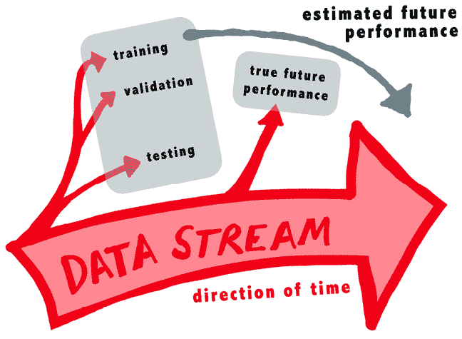

图 11.5：用于训练和评估模型的通常是早于部署时间的数据快照

即使模型可以在真正从未见过的未来数据上进行评估，时间的无情和数据流的持续往往会在部署后造成难以预见的问题。具体来说，由于现实世界不断变化，部署的机器学习项目往往会受到**模型退化**的影响，这是一个描述在实施后随着时间的推移其性能逐渐下降的常见现象的术语。

有时，这可能是由于输入数据随时间发生的系统性变化，称为**数据漂移**，这可能是由于购买行为或疾病传播等周期性模式，这些模式随季节变化，以及数据本身的意义或幅度的变化。数据漂移发生在改变测量某物的尺度之后，例如从 1 到 5 的尺度切换到 1 到 10，以及整体膨胀，如货币通货膨胀。即使属性值本身没有变化，也可能发生微妙的变化，例如，如果调查问题的措辞发生了变化。

也许调查使用了三个值来表示“既不同意也不反对”，但后来被翻译成另一种语言为“没有意见”。这种随时间推移的意义漂移可能会随着时间的推移导致性能下降，但可以通过严格维护代码和定义来在一定程度上缓解——说起来容易做起来难！

模型退化另一个贡献者是**模型漂移**，这发生在目标变量与预测变量之间的关系随时间变化时，即使底层数据的含义保持不变。这通常反映了模型外部的变化，或者是一个难以预见的外部力量。例如，经济或客户行为和偏好的广泛变化，疾病行为的进化变化，或其他会从根本上破坏学习算法在训练期间发现的模式的因素。幸运的是，模型漂移可以通过更频繁的训练来纠正——模型只是学习新的模式——但这会导致困惑和进一步的复杂性，因为它并不清楚应该多频繁或多久重新训练模型。

尽管人们可能会认为频繁或近乎实时的训练总是最好的，但这实际上大大增加了部署的复杂性，并且可能导致模型预测随时间增加的变异性，从而可能导致对模型输出的不信任——这是下一节中描述的问题。或许最好的方法是进行实验，确定一个最适合特定用例的模型刷新计划，比如每年、季节性或是在怀疑数据漂移时。然后，密切监控结果并根据需要调整。像往常一样，没有免费的午餐！

## 建立对模型的信任

导致数据科学项目失败的陷阱的最后一类与模型实现的细节或模型本身的性能关系不大；相反，它源于关键利益相关者对项目的基本**不信任**。这个陷阱特别容易导致燃尽，因为它发生在工作流程的后期。在投入无数小时的项目中，却看到它未能获得请求它的利益相关者或最有可能从其实施中受益的最终用户的认可，这是令人沮丧的。尽管听起来很令人沮丧，但听到关于问题严重性的原始统计数据更是令人不安；快速的网络搜索揭示了关于机器学习项目进入生产的比例的各种估计——没有一个是好的。一些公司估计失败的机器学习项目数量超过 60%，而其他估计高达惊人的 85%。

怎么可能只有大约 15%的项目能够成功启动？即使使用更乐观的估计，也少于一半的项目会被实施！这可能是真的吗？不幸的是，如果这个数字看起来不可思议地低，你很可能在机器学习领域工作的时间不长，或者你是那些幸运的少数之一，在一家已经找到解决这个失败项目流行病的方法的公司工作。相反，大多数从业者遵循类似的模式，他们的努力在组织中不断受挫，因此他们寻找另一个可以产生更大影响的工作场所。由于大多数组织都存在同样的问题，不满的循环不可避免地很快就会再次开始。

导致这次失败启动的原因多种多样，很容易将责任归咎于那些常常对机器学习的潜在收益抱有不切实际的期望、对完成项目所需的成本和资源缺乏了解的利益相关者。也许他们被围绕人工智能的炒作所吸引，并期望它能够以最小的投资实现即插即用。毕竟，资源不足的信息技术团队并非最近才出现。然而，机器学习从业者可以采取许多措施来积极建立利益相关者对项目的信任，并大大增加项目成功扎根的可能性。在建立对建模项目的信任方面，一个关键部分是认识到机器学习既是艺术也是科学。随着经验的积累，人们会理解虽然软技能并非执行工作的根本，但它们对于工作的最终成功几乎是必不可少的。

机器学习从业者可以从对魔术师或幻术师的研究中学习到很多，特别是在表演技巧方面。当然，这并不是说他们的工作本身应该是虚假的——你不想成为一个卖假药的人——相反，考虑这样一个事实：对于最终用户来说，机器学习和人工智能可能就像魔法一样是一个黑盒子。如果它按预期工作，无疑会激发一种神奇的感觉。由于对构建工具投入了大量精力，从业者可能甚至没有意识到这一点。

正如世界历史上最成功的商业魔术师大卫·科波菲尔所说，“*魔术师失去了体验惊奇感的机会*。”精明的从业者将利用机器学习的神奇吸引力，并确定早期采用“倡导者”，他们将推广这项工作并帮助它在组织中扎根。这些利益相关者将更多地了解业务运营，在构建模型的过程中包括这样的利益相关者，尤其是在收集数据和将模型转化为行动的阶段，将提供最终用户视角，并有助于确保项目最终是有用的而不是仅仅有趣的。

大多数成功的魔术师都会将他们的表演带到世界各地的观众面前。在机器学习中，这不仅有利于向不断增长的利益相关者受众推销项目，而且还有助于收集关于哪些做法可行、哪些不可行的反馈。在这个巡回演出期间，制作一个电梯演讲稿，或者一个简短的两到三句话的项目描述，这在简短的电梯之旅中可以提供，是明智的。通过在一对一的场合反复练习，与潜在最终用户进行练习，不仅可以提高你提供演讲稿的能力，还可以帮助识别项目的其他支持者，并收集成功故事。这些成功故事可以后来穿插到未来的对话中，以在项目周围营造更大的轰动。当然，确保为受众提供适当的细节水平。借用著名的手法魔术师杰里·安德鲁斯的名言，我们的工作是让受众眼花缭乱，让他们“上当”，但不是让他们觉得自己是傻瓜。

问题、批评，甚至直接的负面评论都可能是有益的；这些可以促进项目的改进，也可以添加到 FAQ 文档或演示文稿中，以便向更广泛的受众展示。在最初的几次面向大型受众的演示中，引入已知出席的观众的成功故事，或者甚至在观众中培养一个支持者来提出预定义的问题，可以增强项目在受众中的信任度，就像魔术师经常在观众中培养一个“志愿者”来“自愿”参与魔术一样。随着时间的推移，你将开始识别类似的问题和批评，并提前解决它们，或者更好的是，提供足够的信息，让受众自己发现答案。将项目的一些缺陷公之于众，并似乎意外地向观众展示，对于已知的批评者来说，这种方法可能特别有效。这尤其强大，因为根据长期在拉斯维加斯表演的搭档彭斯和泰勒的说法，“*当魔术师让你自己注意到某件事时，他的谎言就变得无法穿透*。”

有时，建立信任的道路不是通过华丽和表演，而是使用统计工具和方法提供一种更直观的方式来采取基于模型的预测的行动。例如，假设已经建立了一个模型来预测某人是否会患上肺癌。由于肺癌在总体人群中相对罕见（大约每 16 个美国人中就有 1 个会在其一生中患上肺癌），许多模型将倾向于预测癌症的低概率，即使在最有可能患上肺癌的人群中也是如此。对于一个比普通人有 8 倍可能性患上肺癌的人来说，他们是否会在一生中患上肺癌仍然是一个硬币的两面，因此对于这个人来说，合理的预测可能仍然是“无癌症”。鉴于这个人的高相对风险，早期干预可能是有影响力的，但仅仅声明“无癌症”的预测对于区分这个人与风险较低的其他人没有帮助；同样，如果没有了解基线癌症概率为 6.25%，那么 49.999%的预测概率几乎没有用处。

由于许多机器学习项目专注于罕见事件，将原始预测概率转换为相对风险类别可以帮助建立信任并驱动行动。对于之前描述的肺癌模型，这可能意味着创建一个红灯、黄灯和绿灯的“交通灯”系统，其中红灯表示最高风险，黄灯表示中等风险，绿灯表示低风险。这些红、黄、绿标签可以直接在报告或仪表板上展示，并能够被需要采取行动的代理人员直观理解。

对于旨在其他用例的模型，其他格式可能更合适以驱动行动。一家企业可能会使用小学的 A、B、C、D 或 E 等级制度来评估贷款申请人，另一家企业可能会将原始预测的流失概率转换为基于百分比的系统，按客户流失的可能性对客户进行排名，而一些模型可能甚至需要更复杂的展示方式，不仅包括预测，还包括置信度评级。路演的一部分好处是，在用模型的预测能力眩惑观众的同时，你也许已经获得了关于哪种输出格式能驱动他们使用它的感觉。

即使最终用户的使用率很高，或者也许*尤其是*最终用户的使用率很高，也可能会出现一些令人费解或看似无意义的预测。有时，最终用户只是好奇为什么做出了特定的预测。这些问题只能通过深入模型本身来回答，这对于像神经网络这样的黑盒模型几乎是不可能的，即使是对于回归和决策树等更简单的方法来说也是一项挑战，尤其是当这些模型被应用于大型和复杂的数据集时。这些差异触及了**模型可解释性**的概念，即人类理解模型工作方式的能力。如果一个模型简单且透明，它将很容易被理解，利益相关者也倾向于信任它。

与可解释性密切相关，可解释性通常描述了一个模型是如何做出预测的，了解为什么做出特定的预测也同样重要。随着深度学习模型在金融和医学等对模型可解释性有严格要求的领域的广泛应用，模型可解释性这一领域正在迅速发展。模型可解释性涉及开发可以用来探测模型、发展对预测所依据因素简化或直观理解的方法。由于深度学习模型因其难以解释而臭名昭著，但它们在金融和医学等领域被广泛使用，因此模型可解释性可能是机器学习和人工智能中发展最快的子领域之一。模型可解释性工具允许使用即使对于需要证明决策合理性的应用，也可以使用强大但难以解释的模型。

模型可解释性是一个快速发展的研究领域，新的方法和最佳实践正在不断被发现。一种有希望的技巧，称为**Shapley 加性解释**（**SHAP**），利用博弈论原理将预测的信用分配给对预测值最有责任的个别特征。这比最初看起来更具挑战性，因为对于复杂模型，一个给定的特征可能不会对结果有简单、线性的影响。相反，该特征的影响还可能取决于其他特征的价值，而这些特征本身可能根据它们的组合方式有不同的影响。由于计算所有可能的排列组合都是计算上昂贵的，大多数 SHAP 实现都使用启发式方法来简化这种计算，并测量每个特征的平均影响。

R 语言的 SHAP 实现可以在`shapr`和`shapper`包中找到，但最活跃的开发工作是在 Python 的`shap`包中。即使你计划在 R 中工作，这个包的文档也是学习 SHAP 基础知识的杰出资源。它可以在[`shap.readthedocs.io`](https://shap.readthedocs.io)上找到。

因为机器学习在本质上是将数据转化为行动，可解释性工具有助于建立对模型的信任，这导致更广泛的应用和更大的影响。例如，一个识别医院患者有高死亡风险的模型，除非我们知道导致风险升高的因素是什么，否则它带来的伤害将大于好处。没有解释，患者将无端地感到恐惧。另一方面，知道风险是由于可预防的因素导致的，将导致挽救生命的干预措施。将这些模型与真实世界之间的联系留给从业者去做。因此，与可解释性技术可以导致更有效的模型一样，你自己的实践和讲故事技巧可以有助于项目的成功，正如接下来的章节中所展示的那样。

# 数据科学中的“科学”元素

自从《使用 R 进行机器学习》第一版出版以来，一个新的短语在机器学习领域变得相当普遍。当然，这个热门词汇就是**数据科学**——一个被许多人定义但普遍认为描述了一个涵盖统计学、数据准备和可视化、专业知识以及机器学习方面的研究或工作领域的术语。

关于数据科学是否等同于过去所说的数据挖掘，这是一个有争议的问题，但可以肯定的是，两者之间有很大的重叠。一个合理的局外人可能会观察到，数据科学仅仅是数据挖掘的一个更正式的版本。数据挖掘中的方法和技巧通常是在工作中非正式地学习，或者在行业活动中由从业者之间传递。这与数据科学领域形成鲜明对比，该领域提供了无数通过在线培训课程和面对面学位项目获得正式证书和经验的机会。

如*图 11.6*所示，根据 Google Trends 数据搜索，该术语真正开始流行起来，恰逢本书第一版出版之时。虽然我很乐意为此流行语申领功劳，但不幸的是，我无法做到，因为在第一版中它几乎根本没出现过！在文本中该短语的两次出现中，最引人注目的是它实际上出现在书的最后一页，我在那里简要地提到了“蓬勃发展的”数据科学社区。如果我知道这会是多么的真实就好了！至少我并不孤单；甚至在 2012 年，当本书第一版的最早几页正在撰写时，数据科学的维基百科页面也还处于起步阶段。

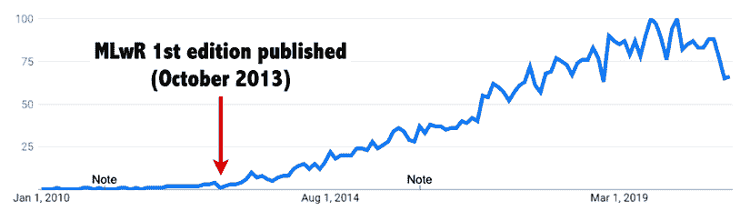

图 11.6：Google Trends 搜索显示“数据科学”在过去十年中的快速增长

从那时起，我在劳动力中的机器学习实践者的角色，就像当时世界上许多其他人的角色一样，从数据分析师的职位转变为数据科学家。尽管标题和观念发生了快速变化，但似乎工作本身变化很小。应用机器学习在历史上本质上只是数据挖掘，今天的数据科学家被期望使用统计学和机器学习，以及强大的黑客或修补者的职业道德，在数据中寻找有用的洞察力——就像古代的数据挖掘者一样。是什么让这个新的数据科学领域与我们之前所做的工作不同？

许多博客和新闻出版物试图回答这个问题，在理解炒作的原因以及为什么数据科学突然成为 21 世纪“最热门的新职业领域”之一的过程中，这个问题被频繁提及。

在这个趋势的早期，一个常见的主题是使用维恩图来展示所需的技能。如图所示的 Bing 图片搜索所示，这种对数据科学的描述一直存在，并且继续普遍存在，维恩图可视化几乎达到了迷因般的地位。虽然存在细微的差别，但大多数都共享相同的基本结构：数据科学位于计算机科学、统计学和领域专业知识交汇处。

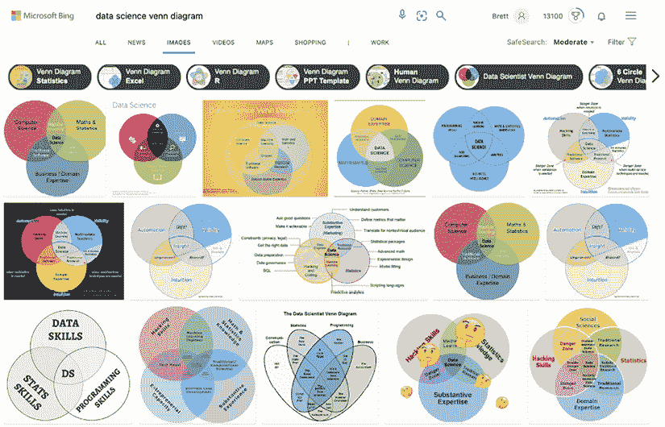

图 11.7：数据科学维恩图已经达到了迷因般的地位；大多数人将数据科学定位在编程、统计学和领域专业知识交汇处

这种还原论观点的问题在于，虽然它捕捉到了数据科学的大致轮廓，但它忽略了灵魂和关键的区别：科学思维。一个人可以拥有统计学、编程和领域知识的必要技能，但如果工作没有科学严谨性，那么它与多年前进行的数据挖掘并无不同。明确地说，这并不是说之前进行的数据挖掘在当时是无用的，但确实值得怀疑，任何了解在战场上如何执行这项工作的人都会认为它是科学的。

那么，我们如何将“科学”融入数据科学中？回答这个问题需要认识到为什么科学现在很重要，尽管它可能之前并不重要。特别是，随着各种规模的组织和许多领域的组织开始迅速组建和资源化商业智能团队，以在所谓的“宝藏”大数据中寻找洞察力，数据科学的实现发生了。

这些不断增长的复杂性层级需要更高级的工具和流程来协调努力，并将组织的各个部分的研究成果联系起来。当一两个人在商业的阴暗角落进行数据挖掘时，并不需要非常科学，但随着团队和工具的增长，需要更系统的方法来避免工作陷入混乱。

既然数据科学本质上是一项团队运动，那么将科学方法的要素融入个人机器学习项目也同样重要。即使是相对简单的任务，小型机器学习项目也会迅速增加复杂性，这得益于试错和迭代，这些是科学方法的基本要素。*图 11.8*旨在说明在一个严格的机器学习项目中，人们可能会探索的一些死胡同和歧途。在数据探索过程中，会生成和检验假设，其中只有一部分被证明是有效的。这些见解指导了特征工程，而特征工程本身也可能有多个失败尝试。测试了多个模型；一些失败了，而另一些则可以用来作为更复杂模型的跳板。最终，最有希望的模型将被评估，并在部署前与额外的特征工程一起调整以获得更好的性能。从开始到结束，整个序列可能需要几天、几周，甚至对于复杂、现实世界项目来说，需要几个月甚至几年。将这个过程的不稳定和波动视为科学方法中的自然步骤，有助于让利益相关者知道，进步并不总是直线前进，与投入的时间成比例。

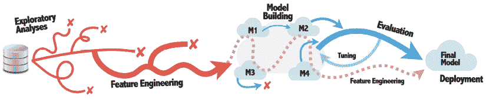

图 11.8：机器学习项目很少从开始到结束都是直线进行的

同样，对于你，作为数据科学实践者，认识到你的工作不会以线性方式进行也很重要。与书籍和网络上机器学习教程不同，现实世界项目的混乱复杂性需要更加细致的注意，以避免迷失在代码中或重新发明轮子。不再仅仅创建一个 R 代码文件，手动逐行执行。相反，我们将代码和输出组织在一个单一、有序的地方，我们希望这也能作为我们调查的成果，供未来的读者或我们未来的健忘的自我参考。幸运的是，R 和 RStudio 使这项工作变得无缝。

## 使用 R Notebooks 和 R Markdown

在完成一个大型机器学习项目后，在松了一口气之后，你可能会发现自己回顾过去，想知道时间都去哪儿了。对这个问题的过度思考可能会导致不安全感，因为不可避免地，你可能会开始质疑自己是否可能避免了某些更明显的错误，或者是否可能做出了不同的设计选择。“如果只有！”你可能会反复说。为什么一个在事后看似如此简单的项目会消耗如此多的时间和精力？

这个问题源于在艰难的数据分析项目顶峰上获得的新视角，对结果有清晰的看法。回想一下前一部分中*图 11.8*所描述的典型机器学习项目的蜿蜒路径。在项目完成后，我们往往会忘记那些耗时耗力的死胡同和错误开始，并将旅程简化为从开始到结束的直线，而不是回忆它实际走过的复杂路径。

在数据科学职业生涯的早期，人们往往会假设有一种方法可以避免这些绕路，直接跳到结论，而不会“浪费”太多时间去追逐无意义的线索。实际上并没有。这项工作并非徒劳，而是机器学习过程中的一个必要部分。这项工作根本就没有浪费；随着你对数据的了解越来越深入，机器也会变得越来越聪明。

在数据科学职业生涯的后期，你可能会意识到这些初步的探索性尝试是所有项目中必要的一步。然而，你可能会有一种怀疑，认为这项工作的影响力并不像它本可以的那样大。虽然数据探索可能会为单一的分析提供信息，但它似乎并没有留下持久的印象，同样的错误经常被重复。这部分可能与其事实有关，即回忆起什么有效比回忆什么无效要容易得多。成功的事情会留在人们的脑海中，而失败的事情则被遗忘，在许多情况下，甚至被从 R 代码文件中删除。因此，探索性工作似乎并没有以其他经验相同的方式积累。失败、被排除的假设和未走的路径不容易被记住，也不容易转移到他人那里，以构建关于项目根源的历史知识。这对你的未来自己，或者在你退休后可能接管你代码的人都有害。与其删除除最终干净解决方案之外的所有内容，不如有一种方式来展示完整的调查——包括死胡同、错误等一切。

RStudio 开发环境以**R 笔记本**的形式提供了解决方案，这是一种特殊的 R 代码文件，它结合了 R 代码和解释性的自由格式文本。这些笔记本可以轻松地编译成 HTML、PDF 或 Microsoft Word 格式，或者通过更多的努力甚至可以制作成幻灯片和书籍。生成的输出文档将代码嵌入到报告的文本中，或者根据你的视角，文本嵌入到代码中。

这提供了一个可以用来记录从开始到结束整个机器学习过程的工件，但由于代码在开发过程中仍然可以逐行或逐块交互式运行，所以它并不觉得繁琐。通过花一点额外的时间在 R 代码文件中添加解释性或上下文文档，结果是一个可以与他人分享或由未来的自己回顾以刷新记忆的报告。

R 笔记本仅仅是纯文本文件，就像标准的 R 代码文件一样，但保存为`.Rmd`文件扩展名。这些笔记本允许在笔记本中交互式地执行代码，输出将显示在周围文本中。在 RStudio 中，可以通过使用**文件**菜单，选择**新建文件**，然后选择**R 笔记本**选项来创建一个新文件。这将创建一个新的 R 笔记本，使用默认模板，如下面的图像所示：

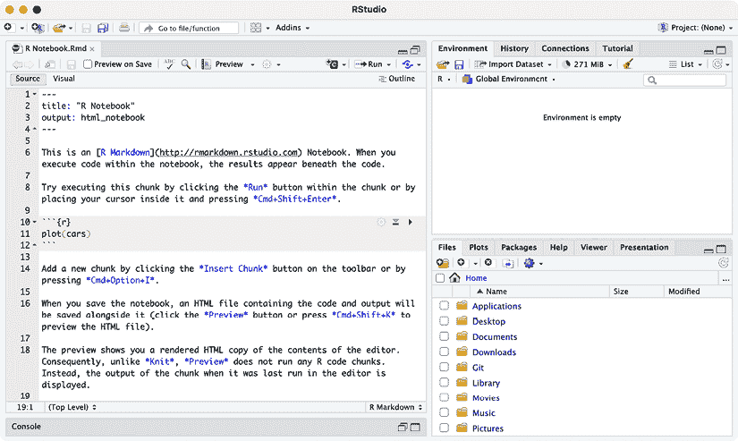

图 11.9：在 RStudio 中打开的 R 笔记本文件允许代码和输出在报告中集成

文件顶部在`---`破折号之间包括笔记本的元数据，如标题和预期输出格式。在 RStudio 中，**预览**按钮右侧的“齿轮”图标提供了设置，用于在默认 HTML 笔记本格式和 PDF 或 Microsoft Word 文档之间切换，如果您不想手动编辑此设置。这些设置控制了在项目完成后编译 R 笔记本时的输出格式。

在标题元数据下方，我们可以找到一个关键的区别，即 R 笔记本与传统 R 代码文件之间的区别。特别是，本节不是 R 代码，而是**R Markdown**，它是在纯文本文件中格式化报告的简单规范。由于 R 和 RStudio 并非设计为文字处理器，因此样式不是通过图形用户界面控制，而是通过简单的格式化代码控制，例如`*斜体*`和`**粗体**`，它们分别被转换为*斜体*和**粗体**，在最终的输出文件中显示。

笔记本模板提供了几种基本格式化选项的示例，但并未开始描述完整的 R Markdown 格式化功能。其他格式，如标题、列表，甚至嵌入的数学方程式，也是可能的。更多信息，包括一页速查表，可在 R Markdown 网站上找到：[`rmarkdown.rstudio.com`](https://rmarkdown.rstudio.com)

由于 R 笔记本格式默认为 R Markdown，任何 R 代码都必须使用特殊指示符嵌入到文件中，以标明代码的开始和结束位置。这些指示符是三个反引号字符，后跟代码语言，并包围在大括号内。例如，一段 R 代码的开始可以使用 ````py` ```{r} ```py` statement. The end of this section is denoted by three backtick characters as in a ```` ````py ```` 语句。或者，这些部分可以通过编辑窗口上方和“预览”及“齿轮”按钮右侧的 **插入** 图标添加到笔记本中。**插入** 按钮提供了一个下拉菜单，可以选择在笔记本中使用的编程语言，但请注意，这些其他语言可能无法利用 R 环境中的对象——至少不是不经过一些额外步骤。

通过在代码块内点击 **运行**（绿色三角形）按钮或按环境的关键组合键来执行代码块，将命令的输出直接显示在 R Markdown 文本中。可以通过在块右上角的“齿轮”图标中找到的选项来管理每个代码块的输出格式。在这里，可以控制代码或结果是否在最终文档中隐藏，以及是否应该执行代码。这些功能可能有助于抑制报告中的无关输出或防止不必要的长时间运行代码。

点击笔记本文件顶部的 **预览** 按钮将生成最终输出报告的预览版本，使用已经交互式运行的任何 R 代码输出。对于 HTML 笔记本，此文件将在简单查看器中打开，如随后的屏幕截图所示，或者可以在网页浏览器中打开。

由于文件仅使用实时生成的输出，RStudio 每次保存笔记本时都会自动重新生成预览文件。将其在查看器窗口中保持打开状态将允许您看到项目结束时最终报告的大致外观。

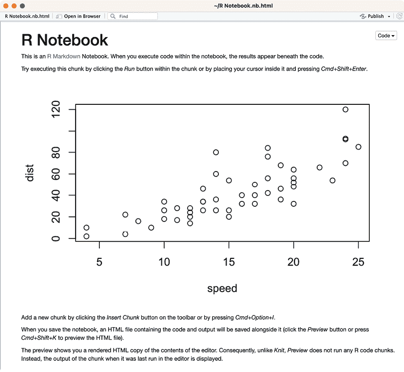

图 11.10：HTML 笔记本的预览文件将输出嵌入到文本文档中

**预览** 按钮右侧的下拉菜单按钮提供了一个将文档编译或“编织”成最终输出格式的手段。这会从开始到结束运行完整的 R 代码块集合，并使用 `knitr` 包将代码和文本合并成一个单一的报告。将文档编织成 HTML 通常很简单，但将文档编织成 PDF 或 Microsoft Word 可能需要安装额外的包。

生成的文件包含代码、文本和图像，且没有依赖项，因此可以通过电子邮件轻松共享。即使是最终的 HTML 笔记本格式也是如此，它以 `.nb.html` 文件扩展名保存，并在网页浏览器中查看时提供一些简单的交互性。此格式还嵌入原始的 `.Rmd` R Markdown 文件，以便接收者可以在需要时打开文件并重新创建分析。

## 执行高级数据探索

数据探索完全属于“艺术”这一面，在学术教科书中，这个主题很少得到充分的讨论。教程可能只是口头上提到实践，向学习者展示如何创建图表和可视化，但很少解释这些工具的用途或为什么可能需要它们。即使是这本书，也犯了这个错误；尽管前几章进行了简单的数据探索，但这些探索性分析很少超出第二章中描述的五个数字摘要统计量，即*《管理和理解数据》*。基于对这个主题的有限覆盖，人们可能会得到这样的印象，即它在实践中并不重要，但这与事实相去甚远；实际上，数据探索是现实世界数据科学的关键组成部分，对于大型、复杂和陌生的数据集尤其重要。

尽管我们已经进行了简单的探索性分析，但我们还没有正式定义这样做意味着什么。开创性的数学家和统计学家 John W. Tukey，他 1977 年的关于这个主题的书籍使这个术语广为人知，指出**探索性数据分析**（**EDA**）涉及让数据集提出假设并揭示有用的见解，而不是简单地回答预先设定的问题。它通常由图表和图表辅助，在 Tukey 看来，这些图表和图表强迫我们“*注意到我们从未期望看到的东西*。”可以想象 Tukey 的观点是，以清晰而令人惊讶的方式呈现数据，并仔细倾听这些分析告诉我们什么，不仅是为了理解数据本身，而且是为了更好地理解我们如何提出关于数据的问题。简而言之，严格的初步探索性分析很可能导致更准确的主要分析。

考虑到他对该领域的广泛贡献，John Tukey 可以合理地被认为是探索性数据分析（EDA）的祖师爷。你已经熟悉他最著名的发明之一：箱线图。他还真正地撰写了关于 EDA 技术的原始教科书，*《探索性数据分析》，Tukey, JW，Addison-Wesley；1977*。

由于机器学习的目标不仅仅是回答预定的疑问，因此与机器学习项目一起进行的探索性数据分析的形式非常符合图基的思路。高级数据探索，如果做得好，可以让数据提出可以用来提高机器学习任务性能的见解。鉴于提高机器学习模型的目标，系统化和迭代式地进行数据探索是最好的，但没有先前的经验这并不容易。没有方向，人们可能会探索无数的死胡同。为了应对这种情况，接下来的几节提供了一些关于如何以及从哪里开始这段旅程的想法。

### 构建数据探索路线图

如果我们要遵循图基的数据探索观念，我们应该相信数据探索更像是一场对话，或者甚至可能是一个单方面的倾听会，其中数据分享其智慧的精华。不幸的是，当这种印象与许多情况下对探索性数据分析的表面描述相结合时，许多新的数据探索者陷入了所谓的“分析瘫痪”状态，无法确定从哪里开始。就像数据科学家被引导进入一个黑暗的房间，被告知进行降神会，并等待数据的启发性回应。这并不奇怪，这有点令人畏惧！

没有探索性分析是完全相同的，每位数据科学家都应该培养自信，以自己的方式完成这项工作。然而，在构建自己的经验和自己的数据探索路线图时，通过学习示例可能会有所帮助。考虑到这一点，本节提供了一些可能有助于指导一般探索性分析的忠告。它不能涵盖所有的方法，也不打算暗示数据探索有唯一最佳方法。再次强调，最佳方法是系统化、迭代式，甚至可能是与数据集亲密的对话，就像没有教科书能完全为你准备与人类的对话一样，也没有单一的公式可以用来与数据对话。

话虽如此，尽管每一次口头交谈可能都是独特的，但它们通常都以问候和交换名字及寒暄开始。同样，你的数据探索路线图也可能从你简单地熟悉数据开始。获取数据字典，或者在文本文件或电子表格中创建一个，描述每个可用的特征。你还可以记录额外的元数据，例如行数、数据源、收集的时间和地点，以及数据是否存在已知问题。这些细节可能在分析过程中引发问题，或者它们可能在遇到意外结果时提供启示。

你可能会发现打印数据字典的纸质副本并系统地逐行工作，一次探索一个特征，是有益的。尽管这项工作当然可以在电子文档中完成，但对于具有数百个或更多预测变量的大数据集来说，使用笔、纸和荧光笔进行操作似乎不那么令人畏惧——更不用说勾选和记笔记以及从列表中划掉项目的满足感了！以下图展示了这样一个真实世界数据探索过程的成果；行表示可用的特征，它们已被星号、突出显示和注释标注，以突出显示每个潜在预测变量的感知重要性，以及探索过程中发现的任何潜在问题。

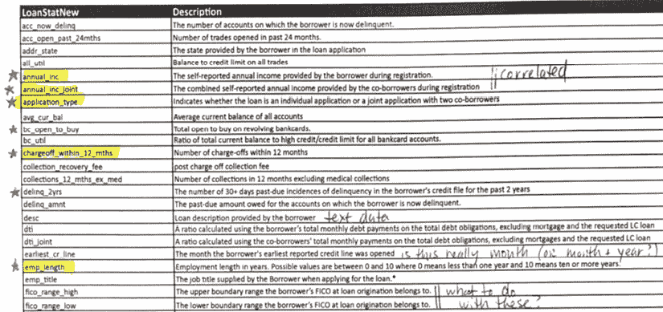

图 11.11：在进行数据探索时，打印数据字典（或可用属性的列表）并在纸上直接手写笔记可能会有所帮助

系统地检查特征列表，你可能会首先寻找任何潜在的陷阱。一个最初看起来非常有用的属性，最终可能因为新发现的缺陷或问题而被证明是无用的。对于每个变量，你可能需要考虑以下潜在问题是否存在：

+   缺失或意外的值

+   异常值或极端或异常值

+   高偏度的数值特征

+   具有多个模式的数值特征

+   变化范围非常广或非常低的数值特征

+   水平非常多分类特征（称为高**基数**）

+   水平非常少观察值的分类特征（称为“稀疏”数据）

+   与目标或彼此强烈或弱相关特征

请记住，即使遇到这些潜在问题，它们并不总是表明存在问题。其中许多问题可以解决，实际上，我们将在本书中探索（或已经探索）所有这些问题的解决方案。目前，通过只关注探索而不是解决方案，你很可能已经熟悉了可能有助于识别所列问题案例的分析方法。

简单的单向表格或直方图等可视化可以提供对单个特征的深入了解，并识别出有问题的值，但可能需要更复杂的可视化来深入调查数据。重要的是不仅要进行单变量分析，这些分析将特征孤立考虑，还要考虑每个特征与其他特征和目标的关系。这需要双变量分析，如交叉表或可视化，如堆叠条形图、热图和散点图。鉴于大量预测变量的大数据集的双变量分析数量很大，本章后面将描述的 R 的复杂可视化能力使得数据探索比其他方式更为轻松。

数据探索的力量不仅仅是探测数据中的任何负面价值，还包括识别具有正面价值的方面。通过逐个检查列表，你应该问自己每个潜在特征是否能够提供关于结果的任何有用信息。相反，你可能会问这个特征是否完全无用，或者它是否可能为模型的目标提供哪怕是一点点帮助。这就是人类智慧和专业知识在与人进行有洞察力的数据对话中有所帮助的地方。

由于真正无用的数据极为罕见，你可能会将其变成一种游戏，在其中你扮演侦探的角色，试图发现隐藏在所谓“无用”属性中的信息。俗话说，“垃圾是放错位置的金子。”那些非常擅长将垃圾变成宝藏的数据科学家将在竞争中拥有强大的优势，因为他们将开发出使用更多和更好数据的模型。

对于所谓的“大数据集”，数据探索可能会有所不同，这些数据集有数百万行或特征数量众多且混乱，以至于手动探索不可行。与其手动探索这些数据集，一种典型的做法是编写程序来系统地确定哪些特征是有用的，或者，否则，降低数据的复杂性。我们将在后面的章节中探讨一些这些方法。

### 遭遇异常值：现实世界的陷阱

正如数据探索的过程，曾经看起来很古老，但在现实世界的复杂性面前变得更为复杂一样，数据探索的许多看似简单的概念在现实中实际上比它们最初看起来要复杂得多。当我们在这本书剩余的章节中处理更复杂的现实世界例子时，我们将亲身体验这种现象多次；然而，异常值的本质可能是这一现象的极致。

到目前为止，我们一直理所当然地接受我们对异常值的定义；在*第二章*，*管理和理解数据*中，我们只是简单地说，异常值是“相对于大多数数据而言，异常地高或低。”我们在箱线图中很容易观察到这样的异常值，这些异常值用圆圈表示，位于中位数之上或之下 1.5 倍于**四分位数范围**（**IQR**）。实际上，这些不仅仅是异常值，而是具体来说，是**Tukey 异常值**，以——如果你还没有猜到——约翰·W·Tukey 的名字命名，他是我们之前提到的探索性数据分析的先驱。这种异常值的定义绝对不是错误的，但它可能稍微有些狭隘。很可能 Tukey 本人会同意，他的定义只是构想“异常值”的许多方式之一。

让我们稍微扩展一下这个术语的定义，将**异常值**定义为与数据集中其他值相比不寻常的值；它不一定很高或很低，只是“不寻常”。虽然这看起来只略有不同，但从技术上来说，与先前的定义相比，单词“不寻常”已经被精确地选择来传达一个非常具体的意思。特别是，单词“不寻常”并不暗示一种特定的数据修复方式，而像“高”和“低”这样的术语则暗示数据点以一种特定的方式是错误的。你通常不能轻易地将“不寻常”更正为“寻常”，除非首先对“寻常”的含义有一个牢固的理解。不寻常的事物只是奇怪或好奇；我们应该进一步调查它们。

以这种心态，研究以下假设数据集，该数据集包含从简单的必应图片搜索中获取的道路标志图像。其中哪些是异常值？大多数停车标志是红色的，所以黄色（中间）和蓝色（左下角）的停车标志，以及“前方停车”标志，显然是异常值，但也有一些其他奇怪之处。有一个带有手的停车标志，一些带有附加文本，以及许多标志的字体和边框有轻微的变化。此外，关于纯白色背景上的停车标志与自然景观上的停车标志呢？或者，如果你来自另一个国家，实际上所有这些都会显得不寻常，因此都会被认为是异常值。如果你来自夏威夷，那里蓝色停车标志的图片显然是拍摄的，那么即使是蓝色停车标志也可能完全在普通范围内！

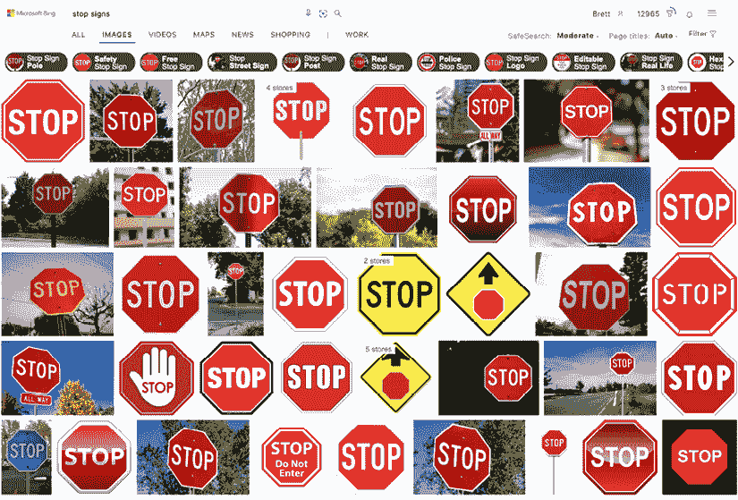

图 11.12：在这个假设的停车标志数据集中，哪些图像是异常值？

当然，从这个练习中得到的启示是，异常值几乎总是视角问题，因此检测和修正异常值变得更加复杂。一方面，如果异常值明显是数据错误的结果，例如在记录数值时犯的“错误”，那么辨别异常值会变得容易一些。例如，假设一个数据录入错误将某人的财富记录为 1 万亿美元而不是 100 亿美元。这个值相对于其他富有的人来说极端性，使得这个值很容易被发现，而且它显然是错误的，这使得修正变得简单：只需输入正确的值即可。另一方面，对于“真实”的异常值，例如撰写本文时，埃隆·马斯克的价值接近 2000 亿美元，处理起来就不再那么直接。这种“真实”和“错误”异常值之间的区别旨在说明是否可以解释异常值。通常但并非总是最好尝试对可解释的异常值进行建模；这使得模型更加鲁棒。另一方面，对“错误”异常值进行建模，这些异常值基本上是随机变化，通常只会增加噪声并使模型变得更弱。

在数据探索过程中遇到异常值时，需要考虑的最重要问题是，将异常值包含在训练数据中是否会最终提高或降低学习算法执行所需任务的能力。这涉及到模型的**泛化能力**，即其在新数据上表现良好的能力。在进行彻底的数据探索时，要牢记部署场景以及模型是否需要在未来对类似的异常值具有鲁棒性。例如，如果之前使用的停车标志图像是用来训练自动驾驶车辆算法的，那么可能会移除那些在公共道路上不太可能遇到的异常值。然而，现实中的自动驾驶车辆可能会遇到被涂鸦、被黑暗遮蔽或被植物和天气条件遮挡的标志，因此，也有人可能会认为这个数据集**异常值太少**！

正如现实世界机器学习的主题一直如此，处理这个问题没有一种万能的解决方案。删除异常值可能是最常见的方法，并且在入门统计学课程中经常被教授，但它可能是最糟糕的方法之一。这确实很容易，但这种便利性伴随着一个阴暗面：删除异常值可能会丢弃关于学习任务的重要细节。这种做法阻止了数据科学家与数据集进行更深入的对话，以确定信息是有用还是无用。

其他方法可能需要更多的努力，但更有可能提高模型的泛化能力。在事件表现为异常值（由于它们的罕见性）的情况下，可能可以收集更多关于这些罕见事件的资料。或者，可能可以通过分箱或分桶罕见值，或将值限制在最大水平，将异常值组合成一个更频繁的单一类别。理想情况下，这些组将基于对学习算法如何使用数据的直观理解，但在缺乏专业知识的情况下，通常足够将它们组合成对目标变量有相似影响的最高十分之一或创建具有相似影响的值组。

回到成为异类意味着什么的问题，我们已经观察到上下文是关键。在某个上下文中看似不寻常的事物，例如蓝色的停车标志，在另一个上下文中可能很普通。同样，在某个上下文中看似普通的事物，在另一个上下文中可能非常不规则。简而言之，不仅合理的值可能错误地看起来像是异类，实际的异类也可能隐藏在明显的地方。真正理解这一事实是严谨数据探索的核心。例如，考虑一个具有典型人口分布的数据集。我们预计会看到相当数量的老年妇女和怀孕妇女，但观察到怀孕的老年妇女将是非常不寻常的！良好的探索性数据分析有助于识别这些类型的异常，并最终导致性能更好的模型。

### 示例 - 使用 ggplot2 进行可视化数据探索

如前所述，数据探索在图表和图表的帮助下达到最佳状态，正如 John Tukey（他自己也是创新数据可视化技术的先驱）所说，这些图表和图表帮助我们“注意到我们从未期望看到的东西。”我们在前几章中探索了各种数据集，但直到现在，我们只使用了 R 的内置绘图功能来创建简单的可视化，如箱线图、直方图和散点图。

为了进行更深入、更彻底的数据探索，我们需要构建更复杂的视觉元素，尽管我们可以使用基础 R 来完成，但有一个更好的选择。这个选择以`ggplot2`包的形式出现，它提供了一种“图形语法”，描述了图表元素之间的关系以及可视化本身。该包已经广泛使用超过十年，并且非常受欢迎。它可以创建专业、可发表的图像，其输出可以在许多学术期刊和许多常见网站上看到。即使当时你不知道，你也很可能之前已经见过它的输出。

已经有整本书专门介绍`ggplot2`包和“图形语法”。本节仅涵盖开始使用此包所必需的精华。有关此主题的许多免费资源，请访问[`ggplot2.tidyverse.org`](https://ggplot2.tidyverse.org)网站，您甚至可以下载一张包含最常用命令的单页速查表。

要展示`ggplot2`包的功能，需要写满整本书，但基本原理可以通过几个基本食谱来展示。为此，我们将用它来探索一个历时 100 多年的数据集。该数据集描述了泰坦尼克号船上的乘客，该船于 1912 年沉没。机器学习应用被用来预测在这次灾难中哪些 1309 名乘客不幸遇难，尽管预测模型在当今社会用处不大，但由于数据集中有许多隐藏的模式，可视化可以帮助揭示这些模式。

泰坦尼克号数据集是一个广受欢迎的教学数据集，可以从多个在线来源获取。原始文件和文档可通过位于网页[`hbiostat.org/data/`](https://hbiostat.org/data/)的范德比尔特大学生物统计学系获取。本书使用的是泰坦尼克号数据集的一个变体，旨在向学习者介绍 Kaggle 竞赛格式。要了解更多信息或参加竞赛，请访问[`www.kaggle.com/c/titanic`](https://www.kaggle.com/c/titanic)

我们将首先加载泰坦尼克号模型训练数据集并检查其特征：

```py
> titanic_train <- read.csv("titanic_train.csv")
> str(titanic_train) 
```

```py
'data.frame':    891 obs. of  12 variables:
 $ PassengerId: int  1 2 3 4 5 6 7 8 9 10 ...
 $ Survived   : int  0 1 1 1 0 0 0 0 1 1 ...
 $ Pclass     : int  3 1 3 1 3 3 1 3 3 2 ...
 $ Name       : chr  "Braund, Mr. Owen Harris" ...
 $ Sex        : chr  "male" "female" "female" "female" ...
 $ Age        : num  22 38 26 35 35 NA 54 2 27 14 ...
 $ SibSp      : int  1 1 0 1 0 0 0 3 0 1 ...
 $ Parch      : int  0 0 0 0 0 0 0 1 2 0 ...
 $ Ticket     : chr  "A/5 21171" "PC 17599" "STON/O2\. 3101282" ...
 $ Fare       : num  7.25 71.28 7.92 53.1 8.05 ...
 $ Cabin      : chr  "" "C85" "" "C123" ...
 $ Embarked   : chr  "S" "C" "S" "S" ... 
```

输出显示，数据集包括泰坦尼克号 1309 名乘客中的 891 名乘客的 12 个特征；其余 418 名乘客可以在`titanic_test.csv`文件中找到，代表大约 70/30 的训练和测试分割。二元目标特征`Survived`表示乘客是否在沉船中幸存，其中`1`表示幸存，`0`表示不幸的结局。请注意，在测试集中，`Survived`留空以模拟未知的未来数据进行预测。

在构建数据探索路线图的精神下，我们可以开始思考每个特征对预测的潜在价值。`Pclass`列表示乘客等级，如一等、二等或三等票的状态。此外，`Sex`和`Age`属性似乎是有用的生存预测指标。我们将使用`ggplot2`包来更深入地探索这些潜在关系。如果您尚未安装此包，请在继续之前使用`install.packages("ggplot2")`进行安装。

每个 ggplot2 可视化都是由图层组成的，这些图层将图形放置在空白画布上。单独执行`ggplot()`函数会创建一个没有数据点的空灰色绘图区域：

```py
> library(ggplot2)
> p <- ggplot(data = titanic_train)
> p 
```

要创建比空白灰色坐标系更有趣的东西，我们需要向存储在`p`对象中的绘图对象添加额外的图层。额外的图层由一个**geom**函数指定，该函数确定要添加的图层类型。许多`geom`函数中的每一个都需要一个`mapping`参数，该参数调用包的美学函数`aes()`，将数据集的特征与其视觉表示联系起来。这一系列步骤可能会有些令人困惑，所以最好的学习方法是举例说明。

让我们从创建一个简单的`Age`特征的箱线图开始。你可能会记得，在*第二章*，*管理和理解数据*中，我们使用了 R 的内置`boxplot()`功能来构建如下这样的可视化：

```py
> boxplot(titanic_train$Age) 
```

要在 ggplot2 环境中实现相同的功能，我们只需将`geom_boxplot()`添加到空白坐标系中，使用`aes()`美学映射函数指示我们希望将`Age`特征映射到`y`坐标，如下所示：

```py
> p + geom_boxplot(mapping = aes(y = Age)) 
```

得到的图形在很大程度上是相似的，只是在数据呈现的风格上存在一些细微的差异。甚至两个图表中 Tukey 异常值的使用也是相同的：

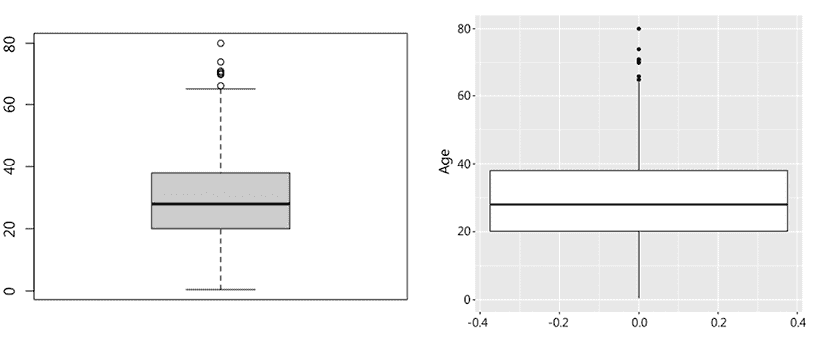

图 11.13：R 的内置箱线图函数（左）与 ggplot2 版本的相同（右）。两者都描绘了泰坦尼克号乘客的年龄分布。

虽然当更简单的函数足以满足需求时，使用更复杂的`ggplot()`可视化可能看似没有意义，但该框架的优势在于它只需对代码进行少量修改就能可视化双变量关系。例如，假设我们想检查年龄与生存状态之间的关系。我们可以通过简单修改之前的代码来实现这一点。请注意，`Age`已被映射到`x`维度，以创建一个水平箱线图，而不是之前使用的垂直箱线图。将因子转换后的`Survived`作为`y`维度创建了一个针对因子两个级别的箱线图。使用这个图表，看起来幸存者通常比非幸存者年轻一些：

```py
> p + geom_boxplot(aes(x = Age, y = as.factor(Survived))) 
```

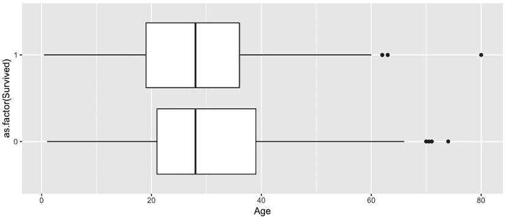

图 11.14：并排箱线图有助于比较泰坦尼克号幸存者和非幸存者的年龄分布

有时，略微不同的可视化可以更好地讲述一个故事。考虑到这一点，回忆一下在*第二章*，*管理和理解数据*中，我们也使用了 R 的`hist()`函数来检查数值特征的分布。我们将首先在 ggplot 中复制这个操作，以便并排比较。内置函数相当简单：

```py
> hist(titanic_train$Age) 
```

`ggplot`版本使用`geom_histogram()`：

```py
> p + geom_histogram(aes(x = Age)) 
```

得到的图形在很大程度上是相同的，除了风格上的差异和关于箱数默认设置的不同：

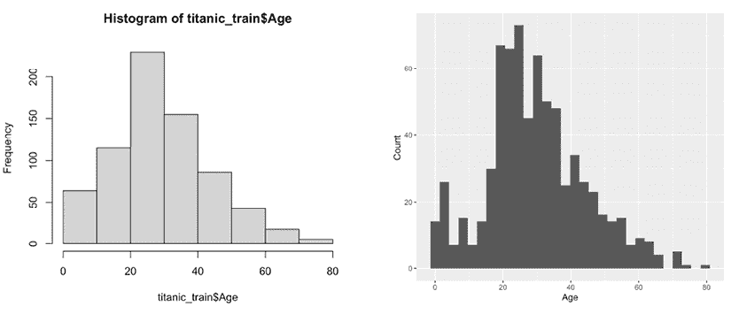

图 11.15：R 内置的直方图（左）与 ggplot2 版本的相同直方图（右）比较泰坦尼克号乘客年龄的分布

再次强调，ggplot2 框架的亮点在于能够通过一些小的调整揭示数据中的有趣关系。在这里，让我们检查年龄和生存的相同比较的三个变体。

首先，我们可以通过向`aes()`函数添加`fill`参数来构建重叠的直方图。这将根据提供的因子的水平对条形进行着色。我们还将使用`ggtitle()`函数为图形添加一个信息性标题：

```py
> p + geom_histogram(aes(x = Age, fill = as.factor(Survived))) +
      ggtitle("Distribution of Age by Titanic Survival Status") 
```

第二，我们不是创建重叠的直方图，而是可以使用`facet_grid()`函数创建并排的网格图。这个函数使用`rows`和`cols`参数来定义网格中的单元格。在我们的情况下，为了创建并排图，我们需要使用`Survived`变量定义幸存者和非幸存者的列。这必须被`vars()`函数包裹，以表示它是伴随数据集的特征：

```py
> p + geom_histogram(aes(x = Age)) +
      facet_grid(cols = vars(Survived)) +
      ggtitle("Distribution of Age by Titanic Survival Status") 
```

第三，我们不是使用直方图`geom`，而是可以使用`geom_density()`创建密度图。这种可视化类型类似于直方图，但使用平滑曲线而不是单独的条形来表示`x`维度的每个值所记录的比例。我们将根据`Survived`的水平设置线条颜色，并用相同的颜色填充曲线下方的区域。由于区域重叠，`alpha`参数允许我们控制透明度级别，以便同时看到两者。请注意，这是一个`geom`函数的参数，而不是`aes()`函数的参数。完整的命令如下：

```py
> p + geom_density(aes(x = Age,
                       color = as.factor(Survived),
                       fill = as.factor(Survived)),
                   alpha = 0.25) +
      ggtitle("Density of Age by Titanic Survival Status") 
```

生成的三个图以不同的方式可视化相同的数据：

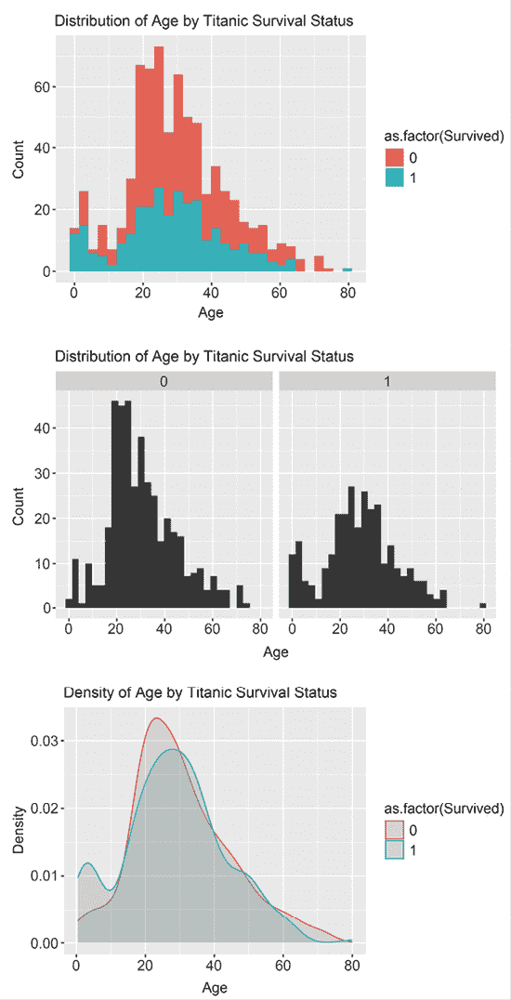

图 11.16：ggplot()函数调用中的微小变化可以产生截然不同的输出

这三个可视化展示了相同数据的不同可视化可以帮助讲述不同的故事。例如，顶部图中的重叠直方图似乎强调了相对较少的人幸存的事实。相比之下，底部图清楚地描绘了 10 岁以下旅客的生存率激增；这为“妇女和儿童优先”的生命艇政策提供了证据——至少就儿童而言。

让我们再考察几个图表，看看我们是否能揭示泰坦尼克号疏散政策的更多细节。我们将首先通过创建一个简单的条形图来确认假设的性别生存差异。为此，我们将使用`geom_bar()`层创建一个条形图。默认情况下，这仅仅计算提供的维度的发生次数。以下命令创建了一个条形图，说明了在泰坦尼克号上男性人数几乎是女性的两倍：

```py
> p + geom_bar(aes(x = Sex)) +
    ggtitle("Titanic Passenger Counts by Gender") 
```

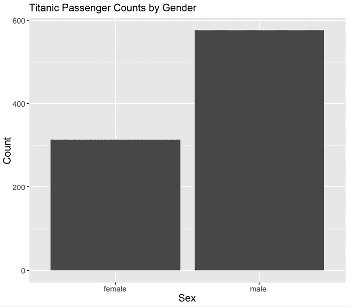

图 11.17：单个特征的简单条形图有助于将计数数据置于适当的视角

一个更有趣的可视化是比较按性别的生存率。为此，我们不仅需要将`Survived`结果作为`y`参数提供给`aes()`函数，还要告诉`geom_bar()`函数使用`stat`和`fun`参数计算数据的汇总统计量——特别是使用`mean`函数，如下所示：

```py
> p + geom_bar(aes(x = Sex, y = Survived),
               stat = "summary", fun = "mean") +
      ggtitle("Titanic Survival Rate by Gender") 
```

结果图证实了“妇女和儿童优先”的生命艇政策的假设。尽管船上有几乎两倍的男人，但女性的生存可能性是男性的三倍：

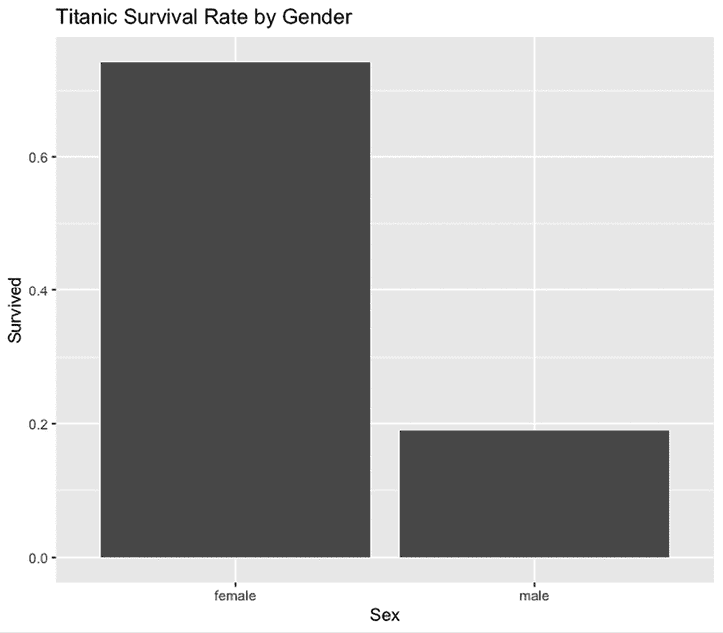

图 11.18：更复杂的条形图可以说明性别在生存率上的差异

为了再次展示 ggplot 能够通过相对较小的代码更改创建大量可视化并讲述关于数据的不同故事的能力，我们将以几种不同的方式检查乘客等级（`Pclass`）特征。首先，我们将创建一个简单的条形图，使用`stat`和`fun`参数来表示生存率，就像我们之前按性别表示生存率一样：

```py
> p + geom_bar(aes(x = Pclass, y = Survived),
               stat = "summary", fun = "mean") +
      ggtitle("Titanic Survival Rate by Passenger Class") 
```

结果图描绘了二等和三等舱乘客生存可能性的大幅下降：

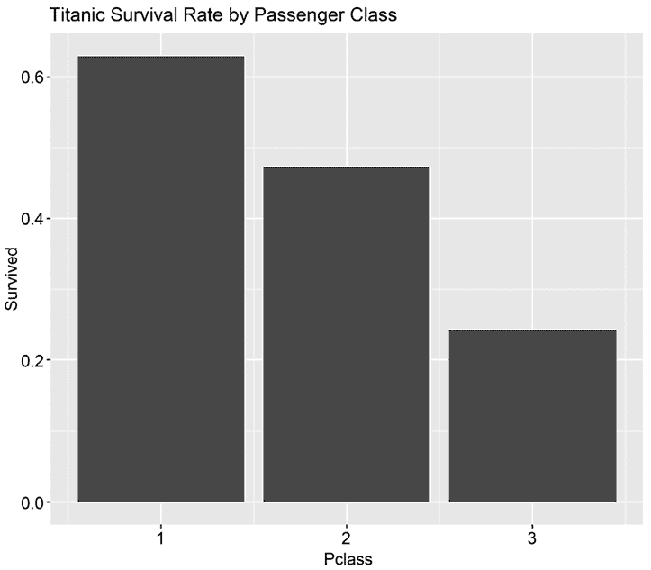

图 11.19：条形图显示了泰坦尼克号下层乘客等级在生存结果上的明显差异

颜色可以是一个有效的工具来传达额外的维度。使用`fill`参数，我们将创建一个简单的乘客计数条形图，条形用颜色填充，颜色根据生存状态，即转换为因子：

```py
> p + geom_bar(aes(x = Pclass,
                   fill = factor(Survived,
                                 labels = c("No", "Yes")))) +
      labs(fill = "Survived") +
      ylab("Number of Passengers") +
      ggtitle("Titanic Survival Counts by Passenger Class") 
```

结果突出了这样一个事实：绝大多数死者来自船上的三等舱：

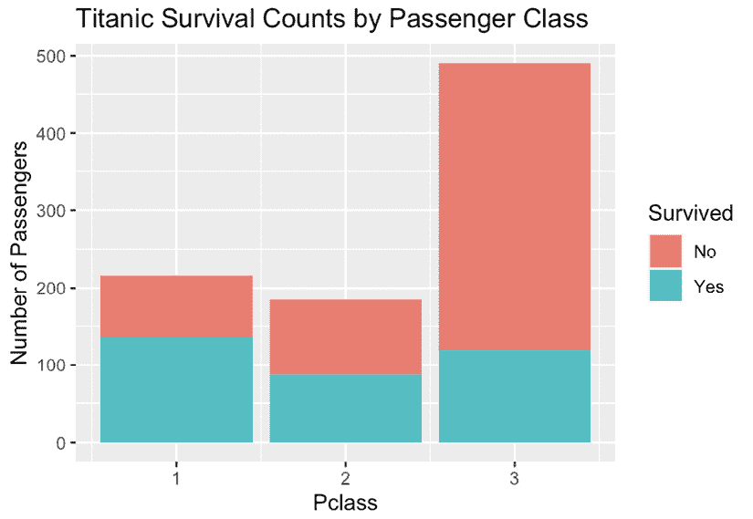

图 11.20：强调泰坦尼克号上三等舱乘客死亡数量的条形图

接下来，我们将使用`position`参数修改这个图表，该参数告诉`ggplot()`如何排列着色条形。在这种情况下，我们将设置`position = "fill"`，这将创建一个堆叠条形图，填充垂直空间——基本上给堆叠中的每个颜色分配 100%的相对比例：

```py
> p + geom_bar(aes(x = Pclass,
                   fill = factor(Survived,
                                 labels = c("No", "Yes"))),
               position = "fill") +
    labs(fill = "Survived") +
    ylab("Proportion of Passengers") +
    ggtitle("Titanic Survival by Passenger Class") 
```

结果图强调了低等级生存机会的降低：

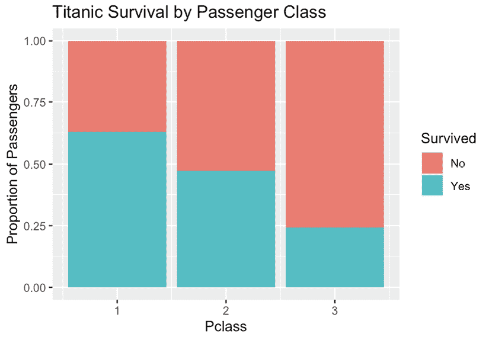

图 11.21：按乘客等级对比的生存率条形图

最后，我们将尝试可视化三个维度之间的关系：乘客等级、性别和生存。`Pclass`和`Survived`特征定义了`x`和`y`维度，而`Sex`通过`fill`参数定义了条形图的色彩。设置`position = "dodge"`告诉`ggplot()`将彩色条形并排放置而不是堆叠，而`stat`和`fun`参数计算生存率。完整的命令如下：

```py
> p + geom_bar(aes(x = Pclass, y = Survived, fill = Sex),
             position = "dodge", stat = "summary", fun = "mean") +
    ylab("Survival Proportion") +
    ggtitle("Titanic Survival Rate by Class and Sex") 
```

此图揭示了这样一个事实：几乎所有一等和二等舱的女性乘客都幸存了下来，而所有阶级的男性乘客更有可能丧生：

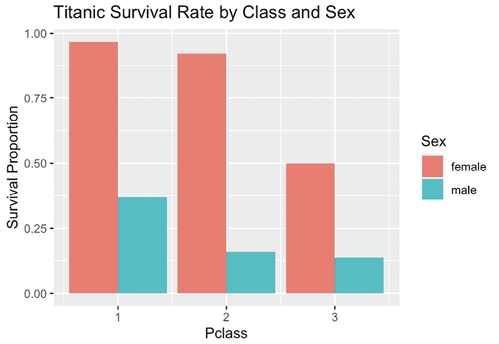

图 11.22：一个条形图，说明了无论乘客等级如何，男性的生存率都很低

检查泰坦尼克号数据的更多方面最好留给读者去练习。毕竟，数据探索最好被看作是数据与数据科学家之间的一次个人对话。同样，如前所述，本书的范围并不包括`ggplot2`包的每个方面。然而，本节应该已经展示了数据可视化如何帮助识别特征之间的联系，这对于深入理解数据是有用的。通过探索对你个人感兴趣的数据库集，更深入地了解`ggplot()`函数的能力，将大大提高你的模型构建和讲故事技巧——这两者都是机器学习成功的重要因素。

Winston Chang 的《*R Graphics Cookbook*》([`r-graphics.org`](https://r-graphics.org))可在网上免费获取，提供了大量的食谱，涵盖了几乎所有的`ggplot2`可视化类型。

# 摘要

在本章中，你学习了成为一名成功的机器学习实践者的基本要素以及构建成功机器学习模型所需的技能。这需要不仅是一套广泛的知识和经验，还需要对学习算法、训练数据集、现实世界的部署场景以及工作可能出错的各种方式有深入的了解——无论是意外还是有意为之。

数据科学的热门词汇暗示了数据、机器以及引导学习过程的人之间的关系。这是一个团队努力，数据科学作为之前数据挖掘领域的一个独立分支，其日益增长的关注度，以及众多的学位课程和在线认证，反映了它作为一个研究领域的实现，不仅关注统计学、数据和计算机算法，还关注使应用机器学习成功的科技和官僚基础设施。

应用机器学习和数据科学要求从业者成为引人入胜的探险家和讲故事的人。对数据的勇敢使用必须与从数据中真正可以学到的东西、以及可以合理地用所学知识做的事情进行仔细平衡。这无疑是一门艺术和科学，因此，很少有人能够完全掌握这个领域。相反，不断努力改进、迭代和竞争将导致自我提升，这不可避免地会导致在预期的实际应用中表现更好的模型。这有助于所谓的“良性循环”，其中类似飞轮的效果迅速提高了采用数据科学方法的组织的生产力。

正如本章回顾了熟悉的话题，并揭示了机器学习在现实世界实践中的新发现复杂性一样，下一章将回顾数据准备，以考虑解决大型和杂乱数据集中发现的常见问题。我们将通过学习一种全新的 R 语言编程方式回到前线，这种方式不仅能够更好地处理这些挑战，而且一旦克服了初始的学习曲线，也许甚至更加有趣和直观易用。

# 加入我们书籍的 Discord 空间

加入我们的 Discord 社区，与志同道合的人相聚，并和超过 4000 人一起学习：

[`packt.link/r`](https://packt.link/r)


