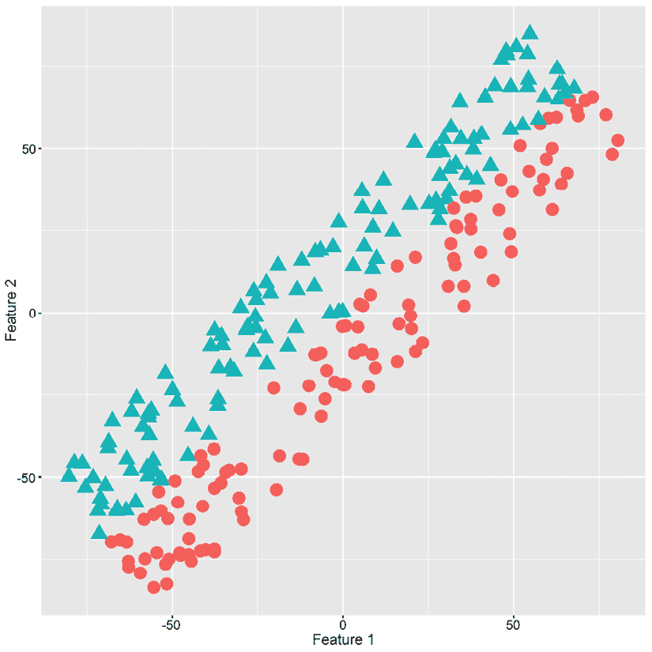
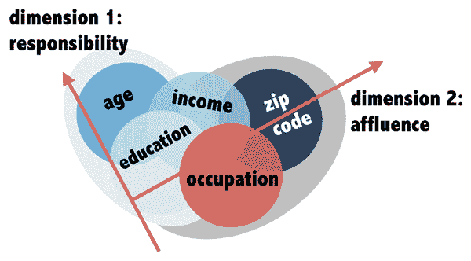
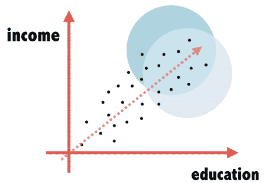
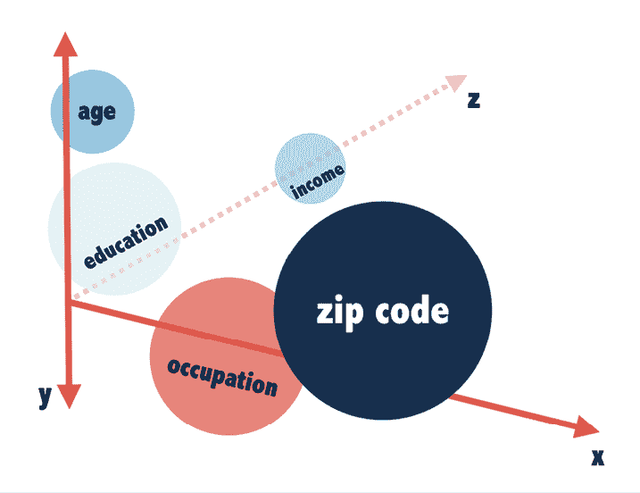
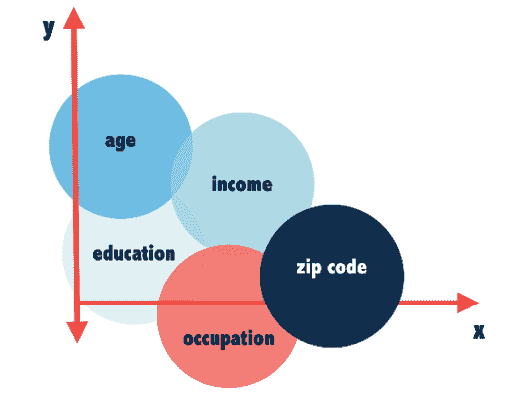
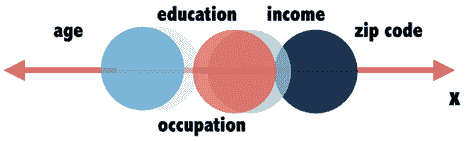
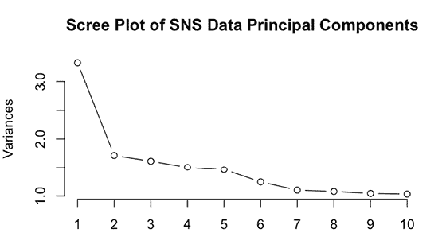
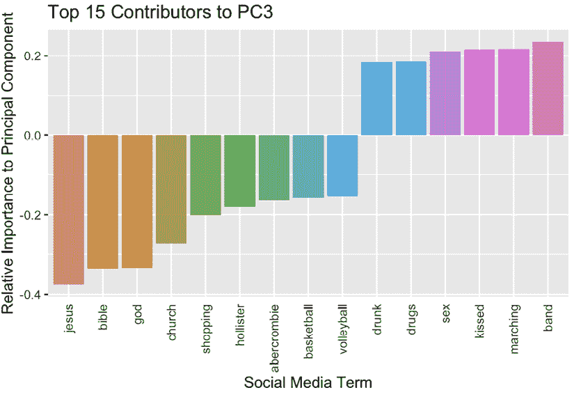
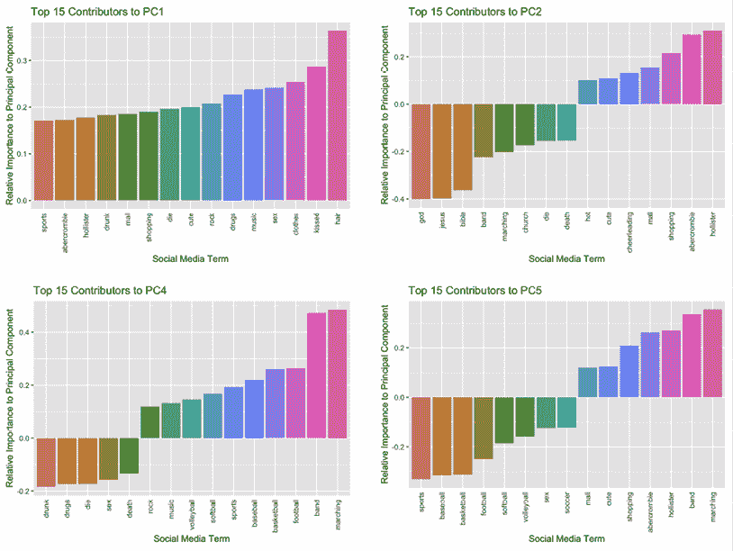
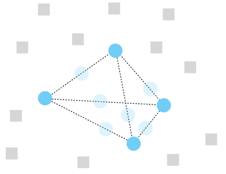

# 第十三章：具挑战性的数据 – 过多、过少、过于复杂

在机器学习项目的整个过程中，具有挑战性的数据呈现出多种形式，每个新项目的旅程都代表着一次需要开拓精神的冒险。从必须探索的未知数据开始，然后必须整理数据，才能使用学习算法。即便如此，可能仍然存在需要驯服的数据的狂野方面，以使项目成功。必须剔除无关信息，培养重要但微小的细节，并清除学习者道路上的复杂网络。

在大数据时代，传统智慧认为数据是宝藏，但正如俗话所说，好事可能过多。大多数机器学习算法都会欣然接受它们所得到的数据，这导致了一系列类似过度饮食的问题。过多的数据可能会用不必要的信息淹没学习者，掩盖重要的模式，并将学习者的注意力从重要的细节转移到显而易见的地方。因此，可能更好的是避免“越多越好”的心态，而是找到数量和质量之间的平衡。

本章的目的是考虑可以用来适应数据集的信噪比的技术。你将学习：

+   如何处理具有大量特征的庞大数据集

+   利用缺失或出现频率非常低的特征值的技巧

+   模型罕见目标结果的途径

你会发现，一些学习算法在独立执行这些技术方面更有优势，而另一些则可能需要你在过程中进行更广泛的干预。在任何情况下，由于这些数据问题的普遍性和它们作为机器学习中最具挑战性的问题之一的地位，了解它们可以如何得到解决是很重要的。

# 高维数据的挑战

如果有人说他们在处理数据集的大小方面有困难，很容易假设他们在谈论有太多的行，或者数据使用了太多的内存或存储空间。确实，这些是常见的问题，会给新的机器学习从业者带来麻烦。在这种情况下，解决方案往往是技术性的而不是方法性的；通常会选择一个更有效的算法，或者使用能够处理大数据集的硬件或云计算平台。在最坏的情况下，可以进行随机抽样，简单地丢弃一些过多的行。

数据过多的挑战也可能适用于数据集的列，使得数据集过于宽而不是过于长。可能需要一些创造性思维来想象为什么会发生这种情况，或者为什么这是一个问题，因为在整洁的教学示例中很少遇到这种情况。即使在现实世界的实践中，也可能需要相当长的时间才会有人遇到这个问题，因为有用的预测因子可能很少，数据集通常是零散收集的。对于这样的项目，拥有过多的预测因子可能是一个好问题！

然而，考虑这样一种情况：一个数据驱动的组织，对大数据的竞争优势有深刻的认识，已经从各种来源积累了大量的信息储备。也许他们通过日常业务直接收集了一些数据，从供应商那里购买了补充数据，并通过额外的传感器或通过互联网的间接、被动的交互收集了一些数据。所有这些来源都被合并到一个单一的表格中，该表格提供了一个丰富但高度复杂且多样化的特征集。这个结果表格并不是通过仔细构建的，而是通过数据元素的杂乱组合，其中一些可能比其他的有用。如今，这种类型的数据宝藏主要存在于规模很大或数据非常敏锐的组织中，但未来可能会有越来越多的组织能够访问类似的数据库。数据库随着时间的推移越来越广泛，甚至在考虑固有的特征丰富的来源，如文本、音频、图像或遗传数据之前。

这些高维数据集的挑战，简而言之，与收集的数据点比真正需要表示潜在模式的数据点要多的事实有很大关系。

这些额外的数据点可能会在示例之间增加噪声或细微的变化，可能会使学习算法偏离重要趋势。这描述了**维度诅咒**，即随着特征数量的增加，学习者会失败。如果我们想象每个额外的特征都是示例的一个新维度——在这里，“维度”一词既用于字面意义，也用于比喻意义——那么随着维度的增加，我们对任何给定示例的理解的丰富性增加，但示例的相对独特性也增加。在一个足够高的维度空间中，每个示例都是独特的，因为它由其独特的特征值组合组成。

考虑一个类比。指纹可以唯一地识别个人，但并不需要存储指纹的所有细节来做出准确的匹配。事实上，在每一个指纹中发现的无限细节中，法医调查员可能只使用 12 到 20 个不同的点来确认匹配；即使是计算机化的指纹扫描仪也只使用 60 到 80 个点。任何额外的细节都可能是不必要的，并会降低匹配质量，甚至可能因为指纹来自同一个人而造成匹配失败！例如，包括过多的细节可能会导致学习算法因为指纹的朝向或图像质量而分心，从而导致假阴性；而细节过少可能会导致假阳性，因为算法没有足够多的特征来区分相似候选人。显然，找到过多和过少细节之间的平衡是非常重要的。这本质上就是**降维**的目标，它通过识别重要细节来纠正维度诅咒。


图 13.1：降维有助于忽略噪声并强调有助于学习潜在模式的关键细节

与非常长的数据集问题相比，从宽数据集中学习所需的解决方案完全不同，它们在概念上和实际应用上同样重要。不能像处理行那样简单地随机丢弃列，因为有些列比其他列更有用。相反，采取了一种系统性的方法，通常与学习算法本身合作，以在过多和过少细节之间找到平衡。正如你将在接下来的章节中了解到的那样，其中一些方法被集成到学习过程中，而其他方法则需要更实际的方法。

## 应用特征选择

在监督机器学习的背景下，特征选择的目标是通过仅选择最重要的预测因子来减轻维度诅咒。即使在无监督学习的情况下，特征选择也可能是有益的，因为它能够通过消除冗余或无用的信息来简化数据集。除了特征选择的主要目标是帮助学习算法尝试将信号与噪声分离之外，该实践的额外好处还包括：

+   缩小数据集的大小并减少存储需求

+   减少模型训练所需的时间或计算成本

+   使数据科学家能够专注于更少的功能进行数据探索和可视化

而不是试图找到单个最优化完整的预测因子集，这可能会非常耗费计算资源，特征选择往往侧重于识别有用的单个特征或特征子集。为此，特征选择通常依赖于减少搜索子集数量的启发式方法。这降低了计算成本，但可能会导致错过最佳可能的解决方案。

搜索有用特征的子集意味着假设某些预测因子是无用的，或者至少不如其他预测因子有用。尽管这个前提是有效的，但并不总是清楚是什么使某些特征有用而其他特征无用。当然，可能存在显然不相关的特征，它们没有任何预测价值，但也可能存在有用的特征，它们是冗余的，因此对于学习算法来说是不必要的。关键是认识到，在一种情况下看似冗余的东西，实际上在另一种情况下可能是有用的。

下图说明了有用特征伪装成看似无用且冗余的预测因子的能力。散点图描绘了两个假设特征之间的关系，每个特征具有大约-50 到 50 的值，并用于预测二元结果，即三角形与圆形。



图 13.2：特征 1 和 2 看似无用且冗余，但一起使用时具有预测价值

仅知道特征 1 或 2 的值几乎对预测目标的结果没有价值，因为圆圈和三角形在任一特征的任何值上几乎完全均匀分布。从定量角度来看，这体现在特征与结果之间非常弱的相关性。因此，一个仅检查一个特征与结果之间关系的简单特征选择算法可能会确定这两个特征对预测都没有用。此外，由于两个特征之间的相关性约为 0.90，一个同时考虑这对的更复杂的特征选择算法可能会由于看似冗余而意外地排除其中一个。

尽管这两个特征看似无用且冗余，但当它们一起使用时，散点图清晰地描绘了它们的预测能力：如果特征 2 大于特征 1，则预测三角形；否则，预测圆形。一个有用的特征选择方法应该能够识别这些类型的模式；否则，它可能会使学习算法排除重要的预测因子。然而，特征选择技术还需要考虑计算效率，因为除了最小的数据集外，检查每个潜在的特征组合都是不可行的。

平衡寻找有用、非冗余特征与特征可能仅与其他特征结合使用之间的可能性，是为什么没有一种适合所有情况的特性选择方法的部分原因。根据用例和选择的学习算法，可以应用不同的技术，这些技术对特征的搜索要么不那么严格，要么更彻底。

想要深入了解特性选择，请参阅*《变量与特征选择导论》，2003 年，Guyon, I. 和 Elisseeff, A.，机器学习研究杂志，第 3 卷，第 1157-1182 页*。

### 过滤方法

可能最易于理解的特性选择形式是**过滤方法**这一类别，它使用相对简单的评分函数来衡量每个特征的重要性。这些得分随后可以用来对特征进行排序并限制在预测模型中使用特征的数量。由于这种方法简单，过滤方法通常被用作数据探索、特征工程和模型构建迭代过程中的第一步。一开始可能应用一个粗略的过滤器来识别最有趣的候选特征进行深入探索和可视化，如果需要进一步减少特征数量，则稍后应用更严格的特征选择方法。

过滤方法的一个单一定义特征是使用特征重要性的代理度量。这种度量是代理的，因为它是我们真正关心的——特征预测能力——的替代品，但我们无法在没有首先构建预测模型的情况下知道这一点。相反，我们选择一个更简单的指标，我们希望它在稍后添加到模型中时能反映特征的效用。例如，在一个数值预测模型中，可能会计算每个特征与目标之间的双变量相关系数，并仅选择与目标高度相关的特征。对于二元或分类目标，类似的方法可能涉及构建单变量分类器，检查特征与目标之间强烈的双变量关系，或者使用信息增益等指标，这些在*第五章* *分而治之——使用决策树和规则进行分类*中已有描述。这些简单特征选择指标的优点是，它们不太可能导致过拟合，因为代理度量使用不同的方法，并对数据做出了与学习算法不同的假设。

过滤方法最大的好处可能是它们即使对于具有大量特征的数据库也是可扩展的。这种效率源于过滤方法只为每个特征计算一个重要性分数，然后按这些分数从最重要到最不重要对预测因子进行排序。因此，随着特征数量的增加，计算成本相对较慢，并且与预测因子的数量成直接比例。请注意，这种方法的产品是一个按顺序排列的特征列表，而不是一个最佳特征集；因此，需要主观判断来确定重要特征和非重要特征之间的最佳截止点。

尽管过滤方法在计算上效率很高，但它们缺乏考虑特征组的能力，这意味着如果某些特征只有与其他特征结合时才有用，那么重要的预测因子可能会被排除。此外，过滤方法不太可能导致过拟合的事实也伴随着潜在的缺点，即它们可能不会产生最适合与所需学习算法一起工作的特征集。下一节中描述的特征选择方法牺牲了计算效率来解决这些关注点。

### 包装方法和嵌入式方法

与使用变量重要性的代理度量相比，**包装方法**使用机器学习算法本身来识别变量或变量子集的重要性。包装方法基于这样一个简单想法：随着更多重要特征被提供给算法，其执行学习任务的能力应该提高。换句话说，随着重要预测因子的包含或正确组合的包含，其错误率应该降低。

因此，通过迭代构建由不同特征组合组成的模型，并检查模型性能的变化，可以识别出重要的预测因子和预测因子集。通过系统地测试所有可能的特征组合，甚至可以识别出整体最佳的预测因子集。

然而，正如人们可能预料的，测试所有可能特征组合的过程在计算上极其低效。对于一个有 *p* 个预测器的数据集，有 *2*^p 个潜在的预测器组合需要被测试，这导致随着额外特征的添加，这种技术的计算成本相对迅速增长。例如，只有一个预测器的数据集就需要评估 *2*¹⁰ *= 1,024* 个不同的模型，而增加五个更多预测器的数据集则需要 *2*¹⁵ *= 32,768* 个模型，这超过了 30 倍的计算成本！显然，这种方法除了对于最小的数据集和最简单的机器学习算法之外是不可行的。解决这个问题的一个可能方法可能是首先使用过滤方法减少特征的数量，但这不仅可能导致错过重要的特征组合，而且这种维度的减少可能会抵消许多包装方法的好处。

而不是让它的低效性阻止我们利用其优点，我们可以使用启发式方法来避免搜索每个特征的组合。特别是，第五章中描述的“贪婪”方法，即*分割与征服 – 使用决策树和规则进行分类*，它有助于有效地增长树，也可以在这里使用。你可能还记得，贪婪算法的想法是按照先来先服务的原则使用数据，首先使用最具预测性的特征。尽管这种技术不能保证找到最优解，但它极大地减少了必须测试的组合数量。

对于将包装方法应用于贪婪特征选择，有两种基本方法。两者都涉及通过一次改变一个变量来探测学习算法。**前向选择**技术从将每个特征逐个输入模型开始，以确定哪个特征会产生最佳的单一预测器模型。前向选择的下一次迭代保留模型中的第一个最佳预测器，并测试剩余的特征以确定哪个特征能构成最佳的二元预测器模型。正如预期的那样，这个过程可以继续选择最佳的三个预测器模型、四个预测器模型，等等，直到所有特征都被选择。然而，由于特征选择的具体目的并不是选择整个特征集，因此前向选择过程在添加额外特征不再能提高模型性能超过特定阈值时提前停止。

类似的**后向消除**技术以相同的方式工作，但方向相反。从一个包含所有特征的模型开始，模型反复迭代，每次消除预测性最差的特征，直到消除一个特征使模型性能下降超过期望的阈值时停止。

被称为**嵌入式方法**的学习算法具有类似于前向选择的内置包装形式。这些方法在模型训练过程中自动选择最佳特征。你已经熟悉其中一种方法，即决策树，它使用贪婪前向选择来确定最佳特征子集。大多数机器学习技术没有嵌入式特征选择；必须在之前减少维度。下一节将演示如何通过*第六章*中引入的机器学习算法的变体在 R 中应用这些方法。

### 示例 - 使用逐步回归进行特征选择

包装方法的一个广为人知的实现是**逐步回归**，它使用前向或后向选择来识别回归模型的一组特征。为了演示这项技术，我们将回顾前两章中使用的泰坦尼克号乘客数据集，并构建一个逻辑回归模型，预测每位乘客是否在不幸的航行中幸存。首先，我们将使用 tidyverse 读取数据并应用一些简单的数据准备步骤。以下命令序列创建了一个`Age`的缺失值指示器，为缺失的`Age`值填充平均年龄，为缺失的`Cabin`和`Embarked`值填充`X`，并将`Sex`转换为因子：

```py
> library(tidyverse)
> titanic_train <- read_csv("titanic_train.csv") |>
    mutate(
      Age_MVI = if_else(is.na(Age), 1, 0),
      Age = if_else(is.na(Age), mean(Age, na.rm = TRUE), Age),
      Cabin = if_else(is.na(Cabin), "X", Cabin),
      Embarked = factor(if_else(is.na(Embarked), "X", Embarked)),
      Sex = factor(Sex)
    ) 
```

逐步过程需要知道特征选择的起始和结束条件，或者可以包含的最小和最大变量集。在我们的案例中，我们将定义最简单的模型，即不包含任何变量——仅包含一个常数截距项的模型。

要在 R 中定义此模型，我们将使用`glm()`函数，通过`Survived ~ 1`公式将生存率建模为常数截距的函数。将`family`参数设置为`binomial`定义了一个逻辑回归模型：

```py
> simple_model <- glm(Survived ~ 1, family = binomial,
                       data = titanic_train) 
```

完整模型仍然使用逻辑回归，但包括更多的预测变量：

```py
> full_model <- glm(Survived ~ Age + Age_MVI + Embarked +
                               Sex + Pclass + SibSp + Fare,
                    family = binomial, data = titanic_train) 
```

前向选择将从简单模型开始，并确定完整模型中哪些特征值得包含在最终模型中。基础 R 的`stats`包中的`step()`函数提供了这一功能；然而，由于其他包也有`step()`函数，指定`stats::step()`确保使用正确的函数。第一个函数参数提供起始模型，`scope`参数需要完整模型的`formula()`，方向设置为`forward`逐步回归：

```py
> sw_forward <- stats::step(simple_model,
                            scope = formula(full_model),
                            direction = "forward") 
```

此命令为逐步过程的每个迭代生成一组输出，但为了简洁起见，这里只包括第一个和最后一个迭代。

如果你正在从大量变量中进行选择，请在`step()`函数中将`trace = 0`设置为关闭每个迭代的输出。

在逐步过程的开始，它从一个简单的模型开始，使用`Survived ~ 1`公式，该公式仅使用常数截距项来建模生存率。因此，第一块输出显示了模型在开始时的质量和在评估了七个其他候选模型（每个模型添加了一个额外的预测因子）之后的模型质量。《无》行指的是此迭代开始时模型的质量以及它与七个其他候选模型的排名比较：

```py
Start:  AIC=1188.66
Survived ~ 1
           Df Deviance    AIC
+ Sex       1    917.8  921.8
+ Pclass    1   1084.4 1088.4
+ Fare      1   1117.6 1121.6
+ Embarked  3   1157.0 1165.0
+ Age_MVI   1   1178.9 1182.9
+ Age       1   1182.3 1186.3
<none>          1186.7 1188.7
+ SibSp     1   1185.5 1189.5 
```

使用的质量度量，AIC，是模型相对于其他模型的相对质量度量。特别是，它指的是**赤池信息量准则**。虽然 AIC 的正式定义超出了本章的范围，但这个度量旨在平衡模型复杂度和模型拟合度。AIC 值越低越好。因此，包含`Sex`的模型在六个其他候选模型以及原始模型中都是最好的。在最终迭代中，基线模型使用`Sex`、`Pclass`、`Age`和`SibSp`，没有额外的特征可以进一步降低 AIC——《无》行被排在添加`Embarked`、`Fare`和`Age_MVI`特征的候选模型之上：

```py
Step:  AIC=800.84
Survived ~ Sex + Pclass + Age + SibSp
           Df Deviance    AIC
<none>          790.84 800.84
+ Embarked  3   785.27 801.27
+ Fare      1   789.65 801.65
+ Age_MVI   1   790.59 802.59 
```

在这一点上，前向选择过程停止。我们可以获得最终模型的公式：

```py
> formula(sw_forward) 
```

```py
Survived ~ Sex + Pclass + Age + SibSp 
```

我们还可以获得最终模型的估计回归系数：

```py
> sw_forward$coefficients 
```

```py
(Intercept)     Sexmale      Pclass         Age       SibSp 
 5.19197585 -2.73980616 -1.17239094 -0.03979317 -0.35778841 
```

向后消除法甚至更容易执行。通过向模型提供要测试的完整特征集并设置`direction = "backward"`，模型将迭代并系统地消除任何会导致更好的 AIC 的特征。例如，第一步从一组完整的预测因子开始，但消除`Fare`、`Age_MVI`或`Embarked`特征会导致 AIC 值降低：

```py
> sw_backward <- stats::step(full_model, direction = "backward") 
```

```py
Start:  AIC=803.49
Survived ~ Age + Age_MVI + Embarked + Sex + Pclass + SibSp + 
    Fare
           Df Deviance     AIC
- Fare      1   783.88  801.88
- Age_MVI   1   784.81  802.81
- Embarked  3   789.42  803.42
<none>          783.49  803.49
- SibSp     1   796.34  814.34
- Age       1   810.97  828.97
- Pclass    1   844.74  862.74
- Sex       1  1016.36 1034.36 
```

在每次迭代中，最差的特征被消除，但到最后一步，消除任何剩余的特征都会导致更高的 AIC 值，因此会导致比基线模型质量更低的模型。因此，过程在这里停止：

```py
Step:  AIC=800.84
Survived ~ Age + Sex + Pclass + SibSp
         Df Deviance     AIC
<none>        790.84  800.84
- SibSp   1   805.33  813.33
- Age     1   819.32  827.32
- Pclass  1   901.80  909.80
- Sex     1  1044.10 1052.10 
```

在这种情况下，前向选择和向后消除产生了相同的预测因子集，但这并不一定总是如此。如果某些特征在组内工作得更好，或者它们以某种方式相互关联，可能会出现差异。

如前所述，包装方法使用的启发式方法的缺点之一是它们不能保证找到单个最优化的一组预测因子；然而，正是这个缺点使得特征选择过程在计算上是可行的。

### 示例 - 使用 Boruta 进行特征选择

为了实现更稳健但计算量更大的特征选择方法，`Boruta`包在随机森林算法周围实现了一个包装器，这将在第十四章*构建更好的学习者*中介绍。现在，只需知道随机森林是决策树的一种变体，它提供变量重要性的度量。通过系统地测试变量的随机子集，并反复进行测试，可以使用统计假设检验技术确定一个特征是否比其他特征显著更重要或更不重要。

由于其高度依赖随机森林技术，这个技术与传说中的斯拉夫生物 Boruta 同名也就不足为奇了，Boruta 被认为居住在沼泽和森林中。要了解更多关于 Boruta 实现细节的信息，请参阅*Kursa, M. B. 和 Rudnicki, W. R.，2010，统计软件杂志，第 36 卷，第 11 期，使用 Boruta 包进行特征选择*。

`Boruta`技术使用所谓的“影子特征”这一巧妙技巧来确定变量是否重要。这些影子特征是数据集原始特征的副本，但它们的值被随机打乱，以至于任何特征与目标结果之间的关联都被打破。因此，这些影子特征按定义就是无意义的、无关紧要的，并且除了随机机会之外，不应为模型提供任何预测优势。它们作为其他特征判断的基准。

在将原始特征和影子特征通过随机森林建模过程处理后，每个原始特征的重要性与最重要的影子特征进行比较。那些显著优于影子特征的被认为是重要的；那些显著较差的被认为是无关紧要的，并永久移除。算法会反复迭代，直到所有特征都被认为是重要的或无关紧要的，或者达到预定的迭代次数限制。

为了看到这个方法在实际中的应用，让我们将`Boruta`算法应用于上一节中构建的同一泰坦尼克号训练数据集。为了证明算法可以检测到真正无用的特征，为了演示目的，我们可以在数据集中添加一个。首先，我们将随机种子设置为任意数`12345`，以确保你的结果与这里显示的结果相匹配。然后，我们将为 891 个训练示例中的每一个分配一个介于 1 到 100 之间的随机值。

由于数字是完全随机的，这个特征几乎肯定会被发现是无用的，除非是运气极好：

```py
> set.seed(12345)
> titanic_train$rand_vals <- runif(n = 891, min = 1, max = 100) 
```

接下来，我们将加载`Boruta`包并将其应用于泰坦尼克号数据集。语法与训练机器学习模型类似；在这里，我们使用公式接口指定模型，列出目标和预测变量：

```py
> library(Boruta)
> titanic_boruta <- Boruta(Survived ~ PassengerId + Age +
                            Sex + Pclass + SibSp + random_vals,
                           data = titanic_train, doTrace = 1) 
```

将 `doTrace` 参数设置为 `1` 以请求详细输出，这会在算法达到迭代过程中的关键点时产生状态更新。在这里，我们看到第 10 次迭代的输出，它显示 `rand_vals` 特征意外地被拒绝为不重要，同时确认了四个特征是重要的，一个特征仍然不确定：

```py
After 10 iterations, +0.51 secs: 
 confirmed 4 attributes: Age, Pclass, Sex, SibSp;
 rejected 1 attribute: rand_vals;
 still have 1 attribute left. 
```

算法完成后，键入对象的名称以查看结果：

```py
> titanic_boruta 
```

```py
Boruta performed 99 iterations in 4.555043 secs.
 4 attributes confirmed important: Age, Pclass, Sex, SibSp;
 1 attributes confirmed unimportant: rand_vals;
 1 tentative attributes left: PassengerId; 
```

默认情况下，`Boruta()` 函数设置为 100 次运行的限制，它在迭代了大约 4.5 秒后的第 99 次迭代时达到了这个限制。在停止之前，发现四个特征是重要的，一个是不重要的。被列为试验性的 `PassengerId` 特征无法被确认是重要或不重要。将 `maxRuns` 参数设置为高于 100 的值可以帮助得出结论——在这种情况下，将 `maxRuns = 500` 后，经过 486 次迭代将确认 `PassengerId` 是不重要的。

也可以绘制特征相对于彼此的重要性：

```py
> plot(titanic_boruta) 
```

结果可视化显示在 *图 13.3* 中。对于每个六个特征，以及最大、平均（平均值）和最小表现阴影特征，箱线图显示了该特征的重要性指标分布。使用这些结果，我们可以确认 `PassengerId` 的相对重要性略低于最大阴影特征，而 `rand_vals` 的相对重要性则更低：


图 13.3：绘制 Boruta 输出显示了特征相对于彼此以及阴影特征的相对重要性

根据我们在 *第十一章* 中进行的泰坦尼克号数据集探索，*在机器学习中取得成功*，`Sex` 和 `Pclass` 特征的重要性之高并不令人惊讶。同样，我们不会期望 `PassengerId` 是重要的，除非这些 ID 以某种方式与泰坦尼克号的生存有关，而不是随机分配。话虽如此，尽管这个特征选择过程的结果没有揭示新的见解，但这项技术对于不易手工探索的数据集或特征的真实世界含义未知的情况会非常有帮助。当然，这只是处理大量不确定重要性的特征的一种方法；下一节将描述一种可能表现更好的替代方法，特别是如果许多特征是相关的话。

`Boruta`技术可能非常计算密集，在现实世界的数据集中，它通常需要几分钟甚至几小时才能完成，而不是像泰坦尼克号数据那样只需要几秒钟。该软件包的作者估计，在现代计算机上，它需要大约每小时处理一百万个特征-示例组合。例如，具有 10,000 行和 50 个特征的数据库将需要大约半小时来完成。将此数据集的大小增加到 100,000 行将需要大约五小时的处理时间！

## 执行特征提取

特征选择不是唯一可用的方法来降低高维数据集的维度。另一种可能性是合成更少数量的组合预测指标。这是**特征提取**的目标，这是一种降维技术，它创建新的特征而不是选择现有特征的一个子集。提取的特征被构建成减少冗余信息的同时尽可能保留尽可能多的有用信息。当然，在过多和过少信息之间找到理想的平衡本身就是一项挑战。

### 理解主成分分析

要开始理解特征提取，首先想象一个具有非常大量特征的数据集。例如，为了预测可能违约的申请人，一个数据集可能包括数百个申请人属性。显然，一些特征将是预测目标结果的有力指标，但很可能许多特征也是相互预测的。例如，一个人的年龄、教育水平、收入、邮政编码和职业都是他们偿还贷款可能性的预测指标，但它们也在不同程度上相互预测。它们的相关性表明它们之间存在一定程度的重叠或联合依赖，这反映在它们的协方差和相关性中。

这些贷款申请人的五个属性之所以相关，可能是因为它们是更少数量的真正、潜在驱动贷款支付行为的属性组成部分。特别是，我们可能认为贷款支付的可能性基于申请人的责任感和富裕程度，但由于这些概念难以直接衡量，我们转而使用多个易于获取的代理指标。以下图示说明了这五个特征如何可能捕捉到两个隐藏维度的方面。请注意，没有任何一个特征完全捕捉到任何一个组成部分维度，相反，每个组成部分维度是几个特征的组合。

例如，一个人的责任感可能通过他们的年龄和教育水平来体现，而他们的富裕程度可能反映在他们的收入、职业和邮政编码上。



图 13.4：贷款申请人的五个假设属性可能更简单地用每个属性协方差组合而成的两个维度来表示

**主成分分析**（**PCA**）的目标是从更多的特征中提取出更少的潜在维度，通过将多个相关属性的协方差表示为一个单一向量来实现。简单来说，协方差指的是属性共同变化的程度。当一个属性上升或下降时，另一个属性往往也会上升或下降。这些结果向量被称为**主成分**，它们是原始属性的加权组合。当应用于具有许多相关特征的数据库时，更少的主成分可能能够表达高维数据集的大部分总方差。尽管这似乎有很多技术术语，并且实现 PCA 所需的数学知识超出了本书的范围，但我们仍将努力理解这个过程的概念。

主成分分析与另一种称为**因子分析**的技术密切相关，这是一种更正式的方法，用于探索观察到的和未观察到的（潜在）因素之间的关系，如图中所示。在实践中，两者可以类似地应用，但 PCA 更简单，避免了构建正式模型；它仅仅减少了维度数量，同时保留了最大变异。对于更深入的了解许多细微的区别，请参阅以下 Stack Exchange 线程：[`stats.stackexchange.com/questions/1576/what-are-the-differences-between-factor-analysis-and-principal-component-analysi/`](https://stats.stackexchange.com/questions/1576/what-are-the-differences-between-factor-analysis-and-principal-component-analysi/)。

回顾*图 13.4*，每个圆圈都旨在表示五个特征之间的关系。重叠程度更大的圆圈代表可能测量相似潜在概念的关联特征。请注意，这是一个高度简化的表示，它并没有描绘出用于计算特征之间相关性的个别数据点。实际上，这些个别数据点将代表个别贷款申请人，并将位于一个五维空间中，其坐标由每个申请人的五个特征值确定。当然，这在本书页面的二维空间中很难描绘，因此在这个简化表示中的圆圈应被视为具有高属性值的类似云状的人群。在这种情况下，如果两个特征高度相关，例如收入和教育，两个云团将重叠，因为具有一个属性高值的人往往也会具有另一个属性的高值。*图 13.5*展示了这种关系：



图 13.5：当两个特征高度相关时，一个特征值高的点往往另一个特征值也高

当检查*图 13.5*时，请注意，代表收入和教育之间关系的对角箭头反映了这两个特征之间的协方差。知道一个点是否更靠近箭头的起点或终点将提供对收入和教育的良好估计。高度相关的特征因此可能表达相似的潜在属性，因此可能是冗余的。通过这种方式，两个维度（收入和教育）所表达的信息可以在一个维度上更简单地表达，这将成为这两个特征的主成分。

将这种关系应用于三维图，我们可能会想象这个主成分如下图的*z*维度：



图 13.6：三个维度中具有不同协方差程度的五个属性

与二维情况一样，圆的位置旨在表示特征之间的协方差；圆的大小旨在表示深度，较大的或较小的圆更靠近空间的前部或后部。在这里的三维空间中，年龄和教育在一个维度上很接近，职业和邮编在另一个维度上很接近，而收入在第三个维度上变化。

如果我们希望捕捉大部分的方差，同时将维度从三维减少到二维，我们可能会如下将这个三维图投影到二维图上：



图 13.7：主成分分析将许多维度减少到更少的几个关键成分

通过这两个维度，我们已经构建了数据集的两个主成分，并且在这个过程中，我们将数据集的维度从具有现实意义的五个维度减少到没有内在现实联系的二维，*x*和*y*。相反，这两个生成的维度现在反映了潜在数据点的线性组合；它们是潜在数据的有用总结，但不易解释。

我们可以通过将数据集投影到一条线上来进一步降低维度，从而创建一个单一的主成分，如图*图 13.8*所示：



图 13.8：第一个主成分捕捉了具有最大方差的空间维度

在这个例子中，PCA 方法从数据集的五个原始维度中提取了一个混合特征。年龄和教育被视为有些冗余，职业和收入也是如此。

此外，年龄和教育对新特征的影响与邮编相反——它们在相反方向上拉扯*x*的值。如果这种一维表示丢失了原始五个特征中存储的太多信息，可以使用之前提到的两个或三个成分的方法。与机器学习中的许多技术一样，存在过度拟合和欠拟合数据之间的平衡。我们将在接下来的实际例子中看到这一点。

在应用 PCA 之前，重要的是要知道主成分是由确定性算法确定的，这意味着每次在给定数据集上完成该过程时，解决方案都是一致的。每个成分向量也始终与所有先前成分向量正交，或垂直。第一个主成分捕获最大方差维度，下一个捕获下一个最大的，依此类推，直到为原始数据集中的每个特征构建了主成分，或者当达到所需成分数量时，算法提前停止。

### 示例 - 使用 PCA 降低高度维度的社交媒体数据

如前所述，PCA 是一种特征提取技术，通过从完整特征集中合成一组较小的特征来降低数据集的维度。我们将首先将此技术应用于第九章中描述的社交媒体数据，即*寻找数据组 - 使用 k-means 进行聚类*。你可能还记得，这个数据集包括 36 个不同单词的计数，这些单词出现在美国 3 万名青少年的社交媒体页面上。这些单词反映了各种兴趣和活动，如体育、音乐、宗教和购物，尽管 36 对于大多数机器学习算法来说不是一个不合理的数字，如果我们有更多——可能是数百个特征——一些算法可能会开始受到维度诅咒的影响。

我们将使用 tidyverse 函数集来读取和准备数据。首先，我们将加载包，并使用其`read_csv()`函数将社交媒体数据读取为 tibble：

```py
> library(tidyverse)
> sns_data <- read_csv("snsdata.csv") 
```

接下来，我们将`select()`仅选择记录每个社交媒体个人资料中 36 个单词使用次数的特征列。这里的表示法从名为`basketball`的列选择到名为`drugs`的列，并将结果保存在一个新的 tibble 中，称为`sns_terms`：

```py
> sns_terms <- sns_data |> select(basketball:drugs) 
```

PCA 技术仅适用于数值数据的矩阵。然而，由于每个生成的 36 列都是一个计数，因此不需要更多的数据准备。如果数据集包含分类特征，在继续之前需要将这些特征转换为数值。

基础 R 包括一个名为`prcomp()`的内置 PCA 函数，随着数据集的增大，其运行速度会变慢。我们将使用 Bryan W. Lewis 提供的`irlba`包中的替代品，该替代品可以在早期停止以仅返回完整集合的潜在主成分子集。这种截断方法，加上使用通常更高效的算法，使得`irlba_prcomp()`函数在大型数据集上比`prcomp()`函数运行得更快，同时语法和兼容性几乎与基础函数相同，以防您正在跟随较旧的在线教程。

`irlba`包的奇特名称来源于它所使用的技巧：“隐式重启兰索斯双对角化算法”，由 Jim Baglama 和 Lothar Reichel 开发。有关此方法的更多信息，请参阅使用`vignette("irlba")`命令的包示例文档。

在开始之前，我们将随机种子设置为任意的`2023`，以确保您的结果与书中的一致。然后，在加载所需的包之后，我们将`sns_terms`数据集通过管道传递到 PCA 函数。这三个参数允许我们将结果限制在前 10 个主成分，同时通过将每个特征围绕零中心并缩放到方差为一来标准化数据。这通常与 k-最近邻方法中的原因相同：防止具有较大方差的特征主导主成分。结果保存为名为`sns_pca`的对象：

```py
> set.seed(2023)
> library(irlba)
> sns_pca <- sns_terms |> 
    prcomp_irlba(n = 10, center = TRUE, scale = TRUE) 
```

虽然 PCA 是一个确定性算法，但符号——正或负——是任意的，并且可能因运行而异，因此需要事先设置随机种子以保证可重复性。有关此现象的更多信息，请参阅 Stack Exchange 线程：[`stats.stackexchange.com/questions/88880/`](https://stats.stackexchange.com/questions/88880/)

请记住，PCA 中的每个成分都捕捉到数据集方差的一个递减部分，而我们请求了 36 个可能成分中的 10 个。**碎石图**，以悬崖底部形成的“碎石”滑坡模式命名，有助于可视化每个成分捕捉到的方差量，从而有助于确定使用最佳成分数量。R 的内置`screeplot()`函数可以应用于我们的结果以创建此类图表。这四个参数提供我们的 PCA 结果，表明我们想要绘制所有 10 个成分，使用线图而不是条形图，并应用图表标题：

```py
> screeplot(sns_pca, npcs = 10, type = "lines",
            main = "Scree Plot of SNS Data Principal Components") 
```

最终生成的图表如下所示：



图 13.9：展示社交媒体数据集前 10 个主成分方差的碎石图

前置图显示，第一和第二成分之间的方差捕获量有显著下降。第二到第五成分捕获了大约相同数量的方差，然后在第五和第六成分之间以及第六和第七成分之间有额外的显著下降。第七到第十成分捕获了大约相同数量的方差。基于这个结果，我们可能会决定使用一个、五个或六个主成分作为我们的降维数据集。我们可以通过将`summary()`函数应用于我们的 PCA 结果对象来数值化地看到这一点：

```py
> summary(sns_pca) 
```

```py
Importance of components:
                           PC1     PC2     PC3     PC4     PC5
Standard deviation     1.82375 1.30885 1.27008 1.22642 1.20854
Proportion of Variance 0.09239 0.04759 0.04481 0.04178 0.04057
Cumulative Proportion  0.09239 0.13998 0.18478 0.22657 0.26714
                           PC6     PC7     PC8     PC9    PC10
Standard deviation     1.11506 1.04948 1.03828 1.02163 1.01638
Proportion of Variance 0.03454 0.03059 0.02995 0.02899 0.02869
Cumulative Proportion  0.30167 0.33227 0.36221 0.39121 0.41990 
```

输出显示了每个 10 个成分（标记为`PC1`到`PC10`）的标准差、总方差的占比和累积方差占比。因为标准差是方差的平方根，所以标准差的平方产生的是散点图上显示的方差值；例如，*1.8237**5*² *= 3.326064*，这是散点图中第一个成分显示的值。一个成分的方差占比是其方差除以所有成分的总方差——不仅包括这里显示的 10 个，还包括我们可能创建的剩余 26 个。因此，累积方差占比达到 41.99%，而不是由所有 36 个成分解释的 100%。

使用 PCA 作为降维技术需要用户确定要保留多少个成分。在这种情况下，如果我们选择五个成分，我们将捕获 26.7%的方差，即原始数据中总信息的四分之一。这是否足够取决于剩余的 73.3%方差中有多少是信号或噪声——这只能通过尝试构建一个有用的学习算法来确定。使这个过程更容易的一个因素是，无论我们最终决定保留多少个成分，我们的 PCA 过程都是完整的；我们可以根据需要简单地使用 10 个成分中的任意数量。例如，没有必要重新运行算法来获得最佳三个与最佳七个成分；找到前七个成分自然会包括最佳三个，结果将是相同的。在 PCA 的实际应用中，测试几个不同的切割点可能是明智的。

为了简单起见，我们将原始的 36 维数据集减少到五个主成分。默认情况下，`irlba_prcomp()`函数会自动保存一个版本，该版本已将原始数据集转换到低维空间。这可以在结果`sns_pca`列表对象中的`x`名称下找到，我们可以使用`str()`命令来检查它：

```py
> str(sns_pca$x) 
```

```py
 num [1:30000, 1:10] 1.448 -3.492 0.646 1.041 -4.322 ...
 - attr(*, "dimnames")=List of 2
  ..$ : NULL
  ..$ : chr [1:10] "PC1" "PC2" "PC3" "PC4" ... 
```

转换后的数据集是一个具有 30,000 行与原始数据集相同的数值矩阵，但列数从 36 列减少到 10 列，列名从`PC1`到`PC10`。我们可以通过使用`head()`命令输出查看前几行来更清楚地看到这一点：

```py
> head(sns_pca$x) 
```

```py
 PC1         PC2       PC3        PC4         PC5
[1,] -1.4477620  0.07976310 0.3357330 -0.3636082  0.03833596
[2,]  3.4922144  0.36554520 0.7966735 -0.1871626  0.57126163
[3,] -0.6459385 -0.67798166 0.8000251  0.6243070  0.25122261
[4,] -1.0405145  0.08118501 0.4099638 -0.2555128 -0.02620989
[5,]  4.3216304 -1.01754361 3.4112730 -1.9209916 -0.43409869
[6,]  0.2131225 -0.65882053 1.6215828  0.9372545  1.47217369
             PC6          PC7          PC8         PC9        PC10
[1,] -0.01559079  0.007278589 -0.004582346  0.19226144  0.08086065
[2,]  3.02758235 -0.306304037 -1.142422251  0.72992534  0.11203923
[3,] -0.40751994  0.454614417  0.704544996 -0.43734980 -0.07735574
[4,]  0.27837411  0.462898314 -0.175251793 -0.08843005  0.26784326
[5,] -1.11734548 -2.122420077 -2.287638056  2.19992650 -0.26536161
[6,]  0.04614790 -0.654207687  0.285263646  0.69439745 -0.89649127 
```

回想一下，在原始数据集中，36 列中的每一列都表示特定单词在社交媒体个人资料文本中出现的次数。如果我们标准化数据，使其均值为零，就像我们在*第九章*中做的那样，在*寻找数据组 – 使用 k-means 进行聚类*中，以及在这里对主成分所做的，那么正负值分别表示高于或低于平均值的个人资料。技巧是，36 个原始列中的每一个都有一个明显的解释，而 PCA 的结果则没有明显的意义。

我们可以通过可视化 PCA **负载**来尝试理解这些成分，即转换原始数据为每个主成分的权重。较大的负载对特定成分更重要。这些负载可以在名为`rotation`的`sns_pca`列表对象中找到。

这是一个 36 行 10 列的数值矩阵，对应于数据集中原始的每个列，以及提供主成分负载的 10 列。为了构建我们的可视化，我们需要将此数据旋转，使得每个社交媒体术语和每个主成分对应一行；也就是说，在数据集的长版本中，我们将有*36 * 10 = 360*行。

以下命令使用两个步骤来创建所需的长数据集。第一步创建一个包含`SNS_Term`列的 tibble，每个术语一行，以及`sns_pca$rotation`矩阵，该矩阵通过`as_tibble()`转换为 tibble。合并后的 tibble，有 11 列和 36 行，被管道输入到`pivot_longer()`函数中，该函数将表格从宽格式转换为长格式。三个参数告诉函数将`PC1`到`PC10`的 10 列进行旋转，原来的列名现在成为名为`PC`的列的行，原来的列值现在成为名为`Contribution`的列的行值。完整的命令创建了一个有 3 列和 360 行的 tibble：

```py
> sns_pca_long <- tibble(SNS_Term = colnames(sns_terms),
                           as_tibble(sns_pca$rotation)) |> 
  pivot_longer(PC1:PC10, names_to = "PC", values_to = "Contribution") 
```

现在可以使用`ggplot()`函数来绘制给定主成分的最重要贡献术语。例如，要查看第三个主成分，我们将`filter()`行限制为仅`PC3`，选择最大的 15 个贡献值——使用`abs()`绝对值函数考虑正负值——并将`SNS_Term`修改为按贡献量重新排序。最终，这将通过一系列格式调整被管道输入到`ggplot()`中：

```py
> sns_pca_long |>
    filter(PC == "PC3") |>
    top_n(15, abs(Contribution)) |>
    mutate(SNS_Term = reorder(SNS_Term, Contribution)) |>
    ggplot(aes(SNS_Term, Contribution, fill = SNS_Term)) +
      geom_col(show.legend = FALSE, alpha = 0.8) +
      theme(axis.text.x = element_text(angle = 90, hjust = 1,
           vjust = 0.5),  axis.ticks.x = element_blank()) + 
      labs(x = "Social Media Term",
           y = "Relative Importance to Principal Component",
           title = "Top 15 Contributors to PC3") 
```

下面的图表显示了结果。因为具有正面和负面影响的术语似乎跨越了与性别、毒品和摇滚乐相关的主题，有人可能会认为这个主成分已经识别了青少年身份的典型维度：



图 13.10：对 PC3 贡献最大的前 15 个术语

通过重复上述`ggplot`代码来处理前五个主成分中的其他四个，我们观察到类似的区分，如下面的图所示：



图 13.11：对其他四个主成分贡献最大的前 15 个词汇

`PC1`特别有趣，因为每个项都有积极的影响；这可能是区分那些在社交媒体资料上有所作为与一无所有的人。`PC2`似乎偏好与购物相关的词汇，而`PC4`似乎结合了音乐和体育，没有性与毒品。最后，似乎`PC5`可能是在区分体育与非体育相关的词汇。以这种方式查看图表将有助于理解每个组成部分对预测模型的影响。

之前可视化方法是从 Julia Silge 的杰出教程中改编的，她是《使用 R 进行文本挖掘：整洁方法》（2017 年）的作者。要深入了解 PCA，请参阅[`juliasilge.com/blog/stack-overflow-pca/`](https://juliasilge.com/blog/stack-overflow-pca/)。

如果这项技术对构建机器学习模型没有帮助，那么对主成分分析的理解就几乎没有价值。在先前的例子中，我们将社交媒体数据集的维度从 36 降低到 10 个或更少的成分。通过将这些成分合并回原始数据集，我们可以使用它们来预测个人资料的性别或朋友数量。我们将首先使用`cbind()`函数将原始数据框的前四列与 PCA 结果中的转换后的个人资料数据相结合：

```py
> sns_data_pca <- cbind(sns_data[1:4], sns_pca$x) 
```

接下来，我们将构建一个线性回归模型，预测社交媒体朋友的数量作为前五个主成分的函数。这种建模方法在*第六章*，*预测数值数据 – 回归方法*中介绍。结果输出如下：

```py
> m <- lm(friends ~ PC1 + PC2 + PC3 + PC4 + PC5, data = sns_data_pca)
> m 
```

```py
Call:
lm(formula = friends ~ PC1 + PC2 + PC3 + PC4 + PC5, data = sns_data_pca)
Coefficients:
(Intercept)          PC1          PC2          PC3          PC4  
    30.1795       1.9857       0.9748      -2.5230       1.1160  
        PC5  
     0.8780 
```

由于截距的值大约为 30.18，因此在这个数据集中，平均每人有大约 30 个朋友。预期`PC1`、`PC2`、`PC4`和`PC5`的值较高的个人会有更多的朋友，而`PC3`的值较高则与较少的朋友相关，假设其他条件相同。例如，对于`PC2`每增加一个单位，我们预计平均会增加一个朋友。鉴于我们对这些成分的理解，这些发现是有意义的；`PC2`、`PC3`和`PC5`的正值与更多的社交活动相关。相比之下，`PC3`涉及性与毒品，摇滚乐，这可能有些反社会。

尽管这是一个非常简单的例子，但 PCA 可以以相同的方式应用于更大的数据集。除了减轻维度诅咒之外，它还有减少复杂性的好处。例如，具有大量预测器的数据集可能对 k-最近邻或人工神经网络来说计算成本过高，但通过选择更少的成分，这些技术可能变得可行。

随意尝试 PCA，并将此类特征提取与其他特征选择方法（如过滤器和方法包装器）进行对比；你可能发现其中一个方法比另一个方法更有效。即使你选择不使用降维，高度维度的数据也存在其他问题，你将在下一节中发现这些问题。

# 利用稀疏数据

随着数据集维度的增加，一些属性很可能是**稀疏的**，这意味着大多数观测值不共享属性的值。这是维度诅咒的自然结果，其中这种不断增长的细节将观测值转化为由其独特的属性组合所识别的异常值。稀疏数据具有任何特定值或甚至任何值的情况非常罕见——正如在*第四章*，*概率学习——使用朴素贝叶斯进行分类*中发现的文本数据的稀疏矩阵，以及*第八章*，*寻找模式——使用关联规则进行市场篮子分析*中的购物车数据的稀疏矩阵所示。

这与缺失数据不同，在缺失数据中，通常只有相对较小的一部分值是未知的。在稀疏数据中，大多数值是已知的，但有趣且有意义的值的数量被大量添加到学习任务中几乎没有价值的值所淹没。在缺失数据的情况下，机器学习算法难以从无中学习；在稀疏数据的情况下，机器学习算法难以在稻草堆中找到针。

## 识别稀疏数据

稀疏数据可以以几种相互关联的形式出现。最常遇到的形式是分类，其中单个特征具有非常多的级别或类别，其中一些相对于其他类别具有极小的计数。这样的特征被称为具有高**基数**，当输入到学习算法中时会导致稀疏数据问题。例如，邮政编码；在美国，有超过 40,000 个邮政编码，其中一些有超过 100,000 居民，而另一些则少于 100。因此，如果将稀疏的邮政编码特征包含在一个建模项目中，学习算法可能难以在忽略和过度强调居民数量较少的区域之间找到平衡。

具有多个级别的分类特征通常表示为一系列二进制特征，每个级别一个特征。我们在手动构建二元虚拟变量时多次使用过这样的特征，许多学习算法也会自动对分类数据进行同样的处理。这可能导致二进制特征变得稀疏，因为 1 值被 0 值所淹没。

例如，在一个针对美国人口的邮编数据集中，330 百万居民中的极小一部分会落入 40,000 个邮政编码中的每一个，这使得每个二进制邮编特征高度稀疏，难以被学习算法使用。

许多所谓的“大数据”形式本质上具有高度的多维性和稀疏性。稀疏性与维度灾难密切相关。就像不断扩张的宇宙在物体之间创造了更大的空隙一样，有人可能会认为，随着维度的增加，每个数据集都会变得稀疏。文本数据通常很稀疏，因为每个单词都可以被视为一个维度，而且有无数个单词可能出现，每个单词在特定文档中出现的概率都很低。其他大数据形式，如 DNA 数据、交易市场篮子数据和图像数据，也常常表现出稀疏性问题。除非增加数据集的密度，否则许多学习算法将难以充分利用丰富的、大数据集。

即使是简单的数值范围也可能很稀疏。这种情况发生在数值分布范围很广时，导致分布的一些范围具有非常低的密度。收入就是一个例子，因为数值通常随着收入的增加而变得越来越稀疏。这与异常值问题密切相关，但在这里我们明确希望对异常值进行建模。当数值以过度的精度存储时，也会发现稀疏的数值数据。例如，如果年龄值以小数而不是整数存储，例如 24.9167 和 36.4167 而不是简单的 24 和 36，这会在数值之间产生一些学习算法可能难以忽略的隐含空隙。例如，一个决策树可能会区分 24.92 岁和 24.90 岁的人——这可能与过度拟合比在现实世界中的有意义区分更有可能。

手动减少数据集的稀疏性可以帮助学习算法识别重要的信号并忽略噪声。所使用的方法取决于稀疏数据的类型和程度以及所使用的建模算法。某些算法在处理某些类型的稀疏数据方面比其他算法更好。例如，朴素贝叶斯在处理稀疏分类数据时表现相对较好，回归方法在处理稀疏数值数据时表现相对较好，而决策树由于偏好具有更多类别的特征，通常在处理稀疏数据时遇到困难。更复杂的方法，如深度神经网络和提升，可能会有所帮助，但一般来说，在学习过程之前使数据集变得更密集会更好。

## 示例 - 重新映射稀疏分类数据

正如我们在前面的章节中看到的，当将一个分类特征添加到数据集中时，它通常会被转换为一组与原始特征级别数量相等的二元变量，使用虚拟变量或独热编码。

例如，如果美国有 40,000 个邮政编码，机器学习算法将为此特征提供 40,000 个二元预测因子。这被称为**one-of-n 映射**，因为在这 40,000 个特征中只有一个会有值为 1，其余的都会是 0——这是一个维度和稀疏性极端增长的情况。

为了增加 one-of-n 映射的密度，可以使用**m-of-n 映射**，这会将*n*个二元变量减少到一组较小的*m*个变量。例如，对于邮政编码，而不是创建一个 40,000 级的特征，每个邮政编码一个级别，可以选择使用邮政编码的前两位数字（从 00 到 99）映射到 100 个级别。同样，如果包含世界上每个国家的二元特征会导致过多的稀疏性，可能可以将国家映射到一个更小的洲集合，如欧洲、北美洲和亚洲。

在创建一个 m-of-n 映射时，如果分组代表一个共享的潜在特征，那将是最理想的，但也可以使用其他方法。领域知识对于创建反映更细粒度单元共享特征的重新映射是有帮助的。在没有领域专业知识的情况下，以下方法可能适用：

+   保持较大的类别不变，仅对观察数量较少的类别进行分组。例如，密集城市地区的邮政编码可以直接包括在内，但稀疏的农村邮政编码可以组合成更大的地理区域。

+   通过创建一个双向交叉表或计算按级别和组级别平均结果来检查类别对目标变量的影响。例如，如果某些邮政编码更有可能违约，可以创建一个由这些邮政编码组成的新类别。

+   作为先前方法的更复杂变体，也可能构建一个简单的机器学习模型，使用高维特征来预测目标，然后根据特征级别与目标或其他预测器的相似关系进行分组。回归和决策树等简单方法非常适合这种方法。

一旦选择了重新映射策略，可以在`forcats`包中找到有用的重新编码分类变量的函数（[`forcats.tidyverse.org`](https://forcats.tidyverse.org)），它是 tidyverse 基础包集的一部分。该包包括自动重新编码具有稀疏级别的分类变量的选项，或者如果需要更引导的方法，则手动重新编码。有关该包的详细信息，请参阅*R for Data Science*章节，网址为[`r4ds.hadley.nz/factors.html`](https://r4ds.hadley.nz/factors.html)。

我们将使用泰坦尼克号数据集和在第十二章“高级数据准备”中创建的乘客头衔来检查几种重新映射的方法。由于`forcats`包包含在基础 tidyverse 中，因此可以使用整个套件或单独使用`library(forcats)`命令来加载。我们将首先加载 tidyverse，读取泰坦尼克号数据集，然后检查头衔特征的级别：

```py
> library(tidyverse)
> titanic_train <- read_csv("titanic_train.csv") |>
    mutate(Title = str_extract(Name, ", [A-z]+\\.")) |>
    mutate(Title = str_replace_all(Title, "[, \\.]", ""))
> table(titanic_train$Title, useNA = "ifany") 
```

```py
 Capt      Col      Don       Dr Jonkheer     Lady    Major 
       1        2        1        7        1        1        2

  Master     Miss     Mlle      Mme       Mr      Mrs       Ms 
      40      182        2        1      517      125        1 
     Rev      Sir     <NA>
       6        1        1 
```

在上一章中，我们使用了基础 R 的`recode()`函数将“Miss”的变体，如“Ms”、“Mlle”和“Mme”，合并到一个单独的组中。`forcats`包包括一个`fct_collapse()`函数，它对于具有大量级别的分类特征来说更方便使用。我们将在这里使用它来创建基于对头衔现实意义了解的 m-of-n 映射。请注意，新类别中的几个是先前类别的单一映射，但通过包含一个标签向量，我们可以将几个旧级别映射到单个新级别，如下所示：

```py
> titanic_train <- titanic_train |>
    mutate(TitleGroup = fct_collapse(Title, 
      Mr = "Mr",
      Mrs = "Mrs",
      Master = "Master",
      Miss = c("Miss", "Mlle", "Mme", "Ms"),
      Noble = c("Don", "Sir", "Jonkheer", "Lady"),
      Military = c("Capt", "Col", "Major"),
      Doctor = "Dr",
      Clergy = "Rev",
      other_level = "Other")
    ) |>
    mutate(TitleGroup = fct_na_value_to_level(TitleGroup,
                                              level = "Unknown")) 
```

检查新的分类，我们发现 17 个原始类别已减少到 9 个：

```py
> table(titanic_train$TitleGroup) 
```

```py
Military    Noble   Doctor   Master     Miss       Mr      Mrs 
       5        4        7       40      186      517      125 
  Clergy  Unknown 
       6        1 
```

如果我们有一个包含许多级别的更大集合，或者在没有关于类别应该如何分组的知识的情况下，我们可以保留大型类别不变，并将具有少量示例的级别分组。`forcats`包包括一个用于检查我们特征级别的简单函数。尽管这也可以使用基础 R 函数完成，但`fct_count()`函数提供了一个按特征级别及其在总体总数中的比例排序的列表：

```py
> fct_count(titanic_train$Title, sort = TRUE, prop = TRUE) 
```

```py
# A tibble: 17 × 3
   f            n       p
   <fct>    <int>   <dbl>
 1 Mr         517 0.580  
 2 Miss       182 0.204  
 3 Mrs        125 0.140  
 4 Master      40 0.0449 
 5 Dr           7 0.00786
 6 Rev          6 0.00673
 7 Col          2 0.00224
 8 Major        2 0.00224
 9 Mlle         2 0.00224
10 Capt         1 0.00112
11 Don          1 0.00112
12 Jonkheer     1 0.00112
13 Lady         1 0.00112
14 Mme          1 0.00112
15 Ms           1 0.00112
16 Sir          1 0.00112
17 NA           1 0.00112 
```

此输出可以基于最小观测数或最小比例来告知分组。`forcats`包有一组`fct_lump()`函数来帮助将因子级别“合并”到“其他”组的过程。例如，我们可能将前三个级别视为其他：

```py
> table(fct_lump_n(titanic_train$Title, n = 3)) 
```

```py
 Miss    Mr   Mrs Other 
  182   517   125    66 
```

或者，我们可以将所有观测数少于百分之一的级别合并在一起：

```py
> table(fct_lump_prop(titanic_train$Title, prop = 0.01)) 
```

```py
Master   Miss     Mr    Mrs  Other 
    40    182    517    125     26 
```

最后，我们可能选择将所有低于五个观察值的级别合并在一起：

```py
> table(fct_lump_min(titanic_train$Title, min = 5)) 
```

```py
 Dr Master   Miss     Mr    Mrs    Rev  Other 
     7     40    182    517    125      6     13 
```

选择使用这三个函数中的哪一个，以及适当的参数值，将取决于所使用的数据集和所需的 m-of-n 映射的级别数。

## 示例 - 分箱稀疏数值数据

虽然许多机器学习方法可以轻松处理数值数据，但一些方法（如决策树）更可能难以处理数值数据，尤其是在数据表现出稀疏性特征时。解决这个问题的常见方法被称为**离散化**，它将数值范围转换为更少的离散类别，称为箱。我们在*第四章*，*概率学习 - 使用朴素贝叶斯进行分类*中遇到了这种方法，当时我们离散化数值数据以使用朴素贝叶斯算法。在这里，我们将采用类似的方法，使用现代 tidyverse 方法，以降低数值范围的维度，帮助解决某些方法对稀疏数值数据过度拟合或欠拟合的倾向。

就像许多机器学习方法一样，理想情况下，人们会应用专业知识来确定将数值范围离散化的截断点。例如，在年龄值的范围内，可能有意义的中断点可能出现在已确立的儿童、成年和老年年龄组之间，以反映这些年龄值在现实世界中的影响。同样，可以创建用于薪资水平（如低收入、中收入和高收入）的箱。

在没有现实世界中重要类别的知识的情况下，通常建议使用反映数据自然百分位数或值直观增量截断点。这可能意味着使用以下策略之一来划分数值范围：

+   基于包含相等比例示例（33%、25%、20%、10%或 1%）的三分位数、四分位数、五分位数、十分位数或百分位数创建组。

+   使用底层数值范围的熟悉截断点，例如按小时、半小时或四分之一小时分组时间值；按五、十或二十五个分组 0-100 的刻度值；或将大数值范围（如收入）按 10 或 25 的较大倍数进行分桶。

+   将对数缩放的概念应用于偏斜数据，使得偏斜数据部分的箱按比例更宽，其中值更稀疏；例如，收入可能被分入 0-10,000、10,000-100,000、100,000-1,000,000 和 1,000,000 或以上的组。

为了说明这些方法，我们将对之前使用的泰坦尼克号数据集中的票价值应用离散化技术。`head()`和`summary()`函数表明，这些值在高端非常细粒度且非常稀疏，因为它们有严重的右偏斜：

```py
> head(titanic_train$Fare) 
```

```py
[1]  7.2500 71.2833  7.9250 53.1000  8.0500  8.4583
> summary(titanic_train$Fare)
   Min. 1st Qu.  Median    Mean 3rd Qu.    Max. 
   0.00    7.91   14.45   32.20   31.00  512.33 
```

假设我们最感兴趣的是头等舱乘客与其他乘客之间的差异，并且我们假设前 25% 的票价反映了头等舱票价。我们可以轻松地使用 tidyverse 的 `if_else()` 函数创建一个二元特征，如下所示。如果票价至少为 £31，即第三四分位数，则我们假设它是头等舱票价，并将 `1` 的值分配给二元编码的 `fare_firstclass` 特征；如果不是，它将获得 `0` 的值。`missing` 参数告诉函数，如果票价缺失，则假设头等舱票价几乎不可能未知，并将值分配为 `0`：

```py
> titanic_train <- titanic_train |> mutate(
    fare_firstclass = if_else(Fare >= 31, 1, 0, missing = 0)
  ) 
```

这将一个具有近 250 个不同值的特征减少到只有一个新特征：

```py
> table(titanic_train$fare_firstclass) 
```

```py
 0   1 
666 225 
```

虽然这是一个非常简单的例子，但它是我们向更复杂的分箱策略迈出的第一步。虽然在这里 `if_else()` 函数很简单，但用于创建具有两个以上级别的新的特征会变得难以管理。这需要将 `if_else()` 函数嵌套使用，这很快就会变得难以维护。相反，tidyverse 中的一个函数 `case_when()` 允许构建一个更复杂的检查系列来确定结果。

在下面的代码中，票价数据被分箱到三个级别，大致对应于头等、二等和三等舱票价水平。`case_when()` 语句被评估为一系列有序的 if-else 语句。第一条语句检查票价是否至少为 31，并将这些示例分配到头等舱类别。第二条可以读作 else-if 语句；也就是说，如果第一条语句不成立——“else”——我们检查“if”票价是否至少为 15，如果为真则分配二等舱级别。最后一条语句是最终的“else”，因为 `TRUE` 总是评估为真，因此所有未被前两条语句分类的记录都被分配到三等舱级别：

```py
> titanic_train <- titanic_train |>
    mutate(
      fare_class = case_when(
        Fare >= 31 ~ "1st Class",
        Fare >= 15 ~ "2nd Class",
        TRUE ~ "3rd Class"
      )
    ) 
```

生成的特征有三个级别，正如预期的那样：

```py
> table(titanic_train$fare_class) 
```

```py
1st Class 2nd Class 3rd Class 
      225       209       457 
```

在我们对于票价的真实世界含义一无所知的情况下，例如对头等、二等和三等舱票价的了解，我们可能反而会应用之前描述的离散化启发式方法，该方法使用自然百分位数或直观的值切分点，而不是有意义的组。

`cut()` 函数包含在基础 R 中，并提供了一种从数值向量创建因子的简单方法。`breaks` 参数指定了数值范围的切分点，以下是一个三级的因子示例，与之前的离散化相匹配。`right = FALSE` 参数表示级别不应包括最右侧或最高值，而 `Inf` 切分点表示最终类别可以跨越从 31 到无穷大的值范围。生成的类别与先前结果相同，但使用不同的标签：

```py
> table(cut(titanic_train$Fare, breaks = c(0, 15, 31, Inf),
            right = FALSE)) 
```

```py
 0,15)  [15,31) [31,Inf) 
     457      209      225 
```

默认情况下，`cut()`为每个水平中值落在的范围设置标签。方括号表示括号内的数字包含在该水平内，而圆括号表示不包含的数字。如果需要，可以将`labels`参数分配给结果的一个因子标签向量。

当与`seq()`函数生成的值序列结合使用时，`cut()`函数变得更加有趣。在这里，我们为从 0 到 550 的 11 个值范围创建水平，增量是 50：

```py
> table(cut(titanic_train$Fare, right = FALSE,
            breaks = seq(from = 0, to = 550, by = 50))) 
```

```py
 [0,50)  [50,100) [100,150) [150,200) [200,250) [250,300) 
      730       108        24         9        11         6 
[300,350) [350,400) [400,450) [450,500) [500,550) 
        0         0         0         0         3 
```

使用等宽区间可以减少维度，但并不能解决稀疏性问题。前两个水平包含大部分示例，但其余的示例数量很少，甚至在某些情况下为零。

作为等大小区间的一个替代方案，我们可以构建具有相等示例数量的箱。我们在前几章中使用了`quantile()`函数来识别五分位数和百分位数的分割点，但我们仍然需要使用这些值与`cut()`函数一起创建因子水平。以下代码为五分位数创建了五个箱，但可以调整用于四分位数、十分位数或百分位数：

```py
> table(cut(titanic_train$Fare, right = FALSE,
            breaks = quantile(titanic_train$Fare,
                              probs = seq(0, 1, 0.20)))) 
```

```py
 [0,7.85) [7.85,10.5) [10.5,21.7) [21.7,39.7)  [39.7,512) 
        166         173         196         174         179 
```

注意，由于存在重复值，箱中并不包含完全相同数量的示例。

tidyverse 还包括一个用于创建基于分位数组的函数，在某些情况下可能更容易使用。这个`ntile()`函数将数据分为`n`个大小相等的组。例如，它可以创建以下五个组：

```py
> table(ntile(titanic_train$Fare, n = 5)) 
```

```py
 1   2   3   4   5 
179 178 178 178 178 
```

由于函数分配了数字标签给组，因此将结果向量转换为因子很重要。这可以直接在`mutate()`语句中完成：

```py
> titanic_train <- titanic_train |>
    mutate(fare_level = factor(ntile(Fare, n = 11))) 
```

结果特征有 11 个等比例的水平：

```py
> table(titanic_train$fare_level) 
```

```py
1  2  3  4  5  6  7  8  9 10 11 
81 81 81 81 81 81 81 81 81 81 81 
```

尽管水平仍然有数字标签，但由于该特征已被编码为因子，它仍将被大多数 R 函数视为分类变量。当然，找到过少和过多水平之间的正确平衡仍然很重要。

# 处理缺失数据

在前几章的示例中使用的教学数据集很少出现缺失数据的问题，即应该存在的值却缺失了。R 语言使用特殊值`NA`来表示这些缺失值，这些值不能被大多数机器学习函数原生处理。在*第九章*，*寻找数据组 – 使用 k-means 聚类*中，我们能够通过基于数据集中其他可用信息的猜测来替换缺失值，这个过程称为插补。具体来说，高中学生的缺失年龄值被插补为具有相同毕业年份的学生平均年龄。这提供了一个对未知年龄值的合理估计。

与其罕见性相比，缺失数据在现实世界的机器学习项目中是一个更大的问题。这不仅是因为现实世界的项目比简单的教科书例子更混乱和复杂。此外，随着数据集规模的增加——包括更多的行或列——相对较小的缺失比例将导致更多的问题，因为任何给定的行或列至少包含一个缺失值的可能性变得更大。例如，即使缺失率仅为百分之一，在一个有 100 列的数据集中，我们预计平均行会有一个缺失值。在这种情况下，简单地排除所有包含缺失值的行将极大地减少数据集的大小，以至于变得微不足道！

在经济学、生物统计学和社会科学等领域，缺失数据的黄金标准方法是**多重插补**，它使用统计建模或机器学习技术，根据非缺失特征值来插补所有缺失的特征值。因为这种方法往往会降低数据的变异性，从而增加预测的确定性，所以现代多重插补软件往往会向插补值添加随机变异性，以避免对数据集得出的推断产生偏差。R 有许多用于执行多重插补的包，例如：

+   `mice`: 通过链式方程的多变量插补

+   `Amelia`: 缺失数据程序（以 1937 年试图成为第一位环球飞行的女性飞行员而失踪的著名飞行员阿米莉亚·埃尔哈特命名）

+   `Simputation`: 简单插补，它试图通过使用 tidyverse 兼容函数来简化缺失数据处理

+   `missForest`: 使用随机森林的非参数缺失值插补，这是一个使用最先进的机器学习方法来插补任何类型数据的包，即使特征之间存在复杂、非线性的关系

尽管有丰富的多重插补软件工具，但与传统的统计学和社会科学项目相比，机器学习项目在处理缺失数据时应用更简单的方法。这是因为目标和考虑因素不同。机器学习项目倾向于关注在非常大的数据集上工作的方法，并促进对未来未见测试集的预测，即使违反了某些统计假设。另一方面，社会科学中更正式的方法侧重于那些通常计算量更大但会导致推断和假设检验无偏估计的策略。在阅读以下部分时，请记住这个区别，这些部分涵盖了处理缺失数据的常见实用技术，但通常不适用于正式的科学分析。

## 理解缺失数据的类型

并非所有缺失数据都是同等重要的，有些类型比其他类型更成问题。因此，在准备包含缺失值的数据时，考虑特定值缺失的潜在原因是有用的。试着想象自己处于生成数据集的过程之中，并问自己为什么某些值被留空。这是否有合理的缺失原因？或者，它是纯粹由于错误或偶然而留空的？回答这些问题有助于以负责任的方式确定替换缺失值的解决方案。这些问题的答案还区分了三种不同类型的缺失数据，从最不严重到最严重：

1.  **完全随机缺失**（**MCAR**）的数据与其其他特征和自身值无关；换句话说，不可能预测任何特定值是否缺失。缺失可能是由于随机数据输入错误或其他随机跳过值的某些过程造成的。完全随机缺失可以想象为一个完全不可预测的过程，它选择数据的最终矩阵并随机选择单元格进行删除。

1.  **随机缺失**（**MAR**）的数据可能依赖于其他特征，但不依赖于基础值，这意味着某些可预测的行比其他行更有可能包含缺失值。例如，某些地理区域的家庭可能不太愿意报告他们的家庭收入，但假设他们确实披露了此类信息，他们也会诚实地披露。本质上，MAR 意味着在控制了导致缺失的基础因素或因素之后，缺失值是随机选择的。

1.  **非随机缺失**（**MNAR**）的数据是由于与缺失值本身相关的某种原因而缺失的。从本质上讲，这种数据由于某种无法从数据集的其他特征中辨别的原因而被从数据集中删除。例如，收入较低的个人可能不太愿意分享他们的收入，所以他们简单地将其留空。另一个例子可能是一个温度传感器，在极端高温或低温下报告缺失值。很可能大多数现实世界的缺失值都是 MNAR，因为通常存在一些未测量的、隐藏的机制导致数据缺失。在现实世界中，真正随机的情况非常少。

估计方法对前两种缺失数据类型效果良好。尽管人们可能会认为由于其独立性和不可预测性，MCAR 数据是估计中最具挑战性的，但实际上它是处理缺失数据的理想类型。尽管缺失是完全随机的，但考虑到其他可用特征，随机隐藏的值可能是可预测的。换句话说，*缺失性*本身是不可预测的，但潜在的缺失*值*可能是相当可预测的。同样，MAR 数据也可以通过给定的特征轻松预测。

不幸的是，NMAR 数据，可能是最常见的缺失数据类型，其预测能力最弱。因为缺失值被一个不可知的过程所屏蔽，基于此类数据构建的任何模型都将无法完整地展现缺失值和非缺失值之间的关系，结果很可能会偏向于非缺失数据。例如，假设我们正在尝试构建一个贷款违约模型，而收入较低的人更有可能在贷款申请中留空收入字段。如果我们对缺失的收入进行估算，估算的值往往会高于真实值，因为我们的估算仅基于可用的数据，而这些数据中低值缺失的比高值多。如果低收入家庭更有可能违约，那么使用带有偏差的估算收入值来预测贷款结果的模型将低估留空收入的家庭的违约概率。

由于存在这种偏差的可能性，严格来说，我们只应该估算 MCAR 和 MAR 数据。然而，估算可能是两个不完美选项中较不糟糕的一个，因为如果数据并非完全随机缺失，那么从训练数据集中排除带有缺失数据的行也会使模型产生偏差。因此，尽管违反了统计假设，机器学习从业者通常还是倾向于估算缺失值，而不是从数据集中移除缺失数据。以下章节将展示一些常见的策略，这些策略被用于实现这一目标。

## 执行缺失值估算

由于`NA`值不能被许多 R 函数或大多数机器学习算法直接处理，它们必须被替换为其他东西，并且理想情况下，以一种可以改善模型性能的方式。在机器学习中，这种缺失值估算是一种预测障碍，这意味着那些工作得相对合理的简单方法比更复杂的方法更受欢迎——即使复杂的方法可能在方法论和理论上更为合理。

缺失的字符型数据可能提供了一种最简单的缺失值处理方式，因为我们可以简单地将缺失值像其他任何值一样处理，只需将`NA`值重新编码为一个字面字符串，如`'Missing'`、`'Unknown'`或你选择的任何其他标签。字符串本身是任意的；它只需要在列中的每个缺失值中保持一致。例如，泰坦尼克号数据集包括两个具有缺失数据的分类特征：`Cabin`和`Embarked`。我们可以轻松地将`'X'`用于替代缺失的`Cabin`值，将`'Unknown'`用于替代缺失的`Embarked`值，如下所示：

```py
> titanic_train <- titanic_train |>
    mutate(
      Cabin = if_else(is.na(Cabin), "X", Cabin),
      Embarked = if_else(is.na(Embarked), "Unknown", Embarked)
    ) 
```

尽管这种方法通过用有效的字符字符串替换 `NA` 值来消除了这些值，但似乎更复杂的方法应该是可能的。毕竟，我们能否使用机器学习来预测数据集中剩余列的缺失值？确实，这是可能的，正如我们很快就会学到的那样。然而，如果这种高级方法实际上损害了模型的预测性能，那么使用这种方法可能是过度杀鸡用牛刀。

进行缺失值插补的原因在不同学科中有所不同。在传统统计学和社会科学中，模型通常用于推理和假设检验，而不是用于预测和预测。当用于推理时，尽可能仔细地保留数据集中特征之间的关系非常重要，因为统计学家寻求仔细估计和理解每个特征与感兴趣的结果之间的个体联系。将任意值插入缺失位置可能会扭曲这些关系——特别是在值不是完全随机缺失的情况下。

相反，更复杂的方法使用其他可用的信息来推断一个关于真实值的合理猜测，尽可能保留尽可能多的数据行，同时确保数据在特征之间的重要内部关系得到保留。最终，这增加了分析的**统计功效**，这与检测模式和测试假设的能力相关。

相比之下，机器学习从业者通常对数据集中特征的内部关系不太关心，而更关注特征与外部目标结果的关系。从这个角度来看，没有强烈的理由应用复杂的插补策略。这些方法不会提供新的信息，这些信息可以用来更好地预测目标，因为它们仅仅加强了内部模式。另一方面，根据数据不是随机缺失的假设，可能不太有助于关注缺失位置中要插补的具体值，而应将精力集中在尝试将缺失本身作为目标预测的预测因子。

### 带有缺失值指示符的简单插补

上一个章节中描述的实践，即用像 `'Missing'` 或 `'Unknown'` 这样的任意字符串替换缺失的分类值，是**简单插补**的一种形式，其中 `NA` 值被简单地替换为一个常数。对于数值特征，我们可以使用等效的方法。对于每个有缺失值的特征，选择一个值来替换 `NA` 值。这可以是一个汇总统计量，如均值、中位数或众数，或者它可能是一个任意数——具体值通常并不重要。

尽管确切值通常并不重要，但最常见的方法可能是**均值插补**，这可能是由于在传统统计学领域普遍存在这种做法。另一种方法是使用与实际数据中找到的值相同数量级的值，但不在实际值范围内。例如，对于 0 到 100 范围内的缺失年龄值，您可以选择插补值为-1 或 999。请注意，无论选择什么值，任何在特征上计算的汇总统计量都将被插补值扭曲。

除了在`NA`的位置输入一个值之外，创建一个**缺失值指示器**（**MVI**），这是一个二元变量，表示特征值是否被插补，这一点尤为重要。我们将使用以下代码为缺失的泰坦尼克号乘客年龄值进行插补：

```py
> titanic_train <- titanic_train |>
    mutate(
      Age_MVI = if_else(is.na(Age), 1, 0),
      Age = if_else(is.na(Age), mean(Age, na.rm = TRUE), Age)
    ) 
```

应将已插补的特征和 MVI 都包括在机器学习模型中预测因子中。一个值缺失的事实通常是目标的重要预测因子，而且令人惊讶的是，它往往是目标的最强预测因子之一。在简单的信念下，现实世界中很少有事情是随机发生的，如果值缺失，可能有一个解释。例如，在泰坦尼克号数据集中，缺失的年龄可能暗示了乘客的社会地位或家庭背景。同样，有人拒绝在贷款申请上报告他们的收入或职业，可能是在隐藏他们收入非常少的事实——这可能是贷款违约的强预测因子。这个发现，即缺失值是有趣的预测因子，也适用于大量缺失数据；更多的缺失可能导致更有趣的预测因子。

### 缺失值模式

在相信缺失值可能是一个非常有用的预测因子的基础上，每个额外的缺失值都可能有助于我们预测特定结果的能力。在贷款申请数据的情况下，一个在单个特征上缺失数据的个人可能是有意隐藏他们的答案，或者他们可能只是不小心在贷款申请表上跳过了这个问题。如果一个人在多个特征上缺失数据，后一个借口不再适用，或者这可能意味着他们在申请过程中匆忙或通常更不负责任。我们可能会假设拥有更多缺失数据的人更有可能违约，但当然，我们不会知道直到我们训练模型；也可能的情况是，拥有更多缺失数据的人实际上不太可能违约，可能是因为一些贷款申请问题不适用于他们的情况。

假设实际上在大量缺失数据的记录中存在某种模式，但这并不仅仅基于缺失值的数量，而是基于缺失的具体特征。例如，有些人因为收入太低而不敢报告，可能会跳过贷款申请中的相关问题，而小企业主可能会跳过就业历史中的不同问题部分，因为他们不适用于自雇人士。这两种情况可能有大致相等的缺失值数量，但它们的模式可能差异很大。

可以构建一个 **缺失值模式**（**MVP**）来捕捉这种行为，并将其用作机器学习的特征。缺失值模式本质上是由一系列 MVIs 组成的字符字符串，字符串中的每个字符代表一个具有缺失值的特征。*图 13.12* 展示了对于简化的贷款申请数据集，这个过程是如何工作的。对于每个八个特征，我们构建一个缺失值指示器，以指示相应的单元格是否缺失：

![表格描述自动生成

图 13.12：构建缺失值模式从为每个具有缺失数据的特征创建缺失值指示器开始

这些二进制 MVIs 然后连接成一个单一的字符串。例如，第一行将表示为字符串 `'11100000'`，这表明对于这位贷款申请人来说，前三个特征是缺失的。没有缺失数据的第二位申请人将被表示为 `'00000000'`，而第二和第三位申请人将分别表示为 `'00000111'` 和 `'01011101'`。生成的 `mvp` R 字符向量将被转换为因子，以便学习算法可以使用它进行预测。因子的每个级别代表一个特定的缺失模式；遵循相同模式的贷款申请人可能具有相似的结果。

尽管缺失值模式可以是非常强大的预测因子，但它们并非没有一些挑战。首先，在一个包含 *k* 个特征的数据集中，缺失值模式的潜在值有 *2*^k 种。仅包含 10 个特征的数据集可能有高达 1,024 个 MVP 预测器的级别，而包含 25 个特征的数据集将会有超过 3300 万个潜在级别。一个包含 50 个特征的相对较小的数据集将会有几乎无法计数的潜在 MVP 级别，这将使预测器对建模变得无用。

尽管存在这个问题，但 MVP 方法所抱的希望是，大量级别的潜在数量避免了由于缺失模式远非均匀或随机而产生的维度诅咒。换句话说，MVP 方法强烈依赖于非随机缺失的数据；我们希望存在一个强大的潜在模式驱动缺失值，缺失值模式将反映出来。总的来说，缺失中的异质性越少，某些缺失值模式在数据中出现的频率就越高。不幸的是，即使一个特征完全随机缺失，它也可能降低 MVP 方法的有效性，因为即使行在几乎所有的二元缺失值指示器上都很相似，如果有一个不同，它将被视为一个完全不同的缺失值模式。为了解决这个问题，一种替代方法是使用带有无监督聚类算法（如第九章中介绍的 k-means 算法）的 MVI 数据集，以创建具有相似缺失值模式的相似人群。

# 不平衡数据问题

最具挑战性的数据问题之一是**不平衡数据**，它发生在其中一个或多个类别级别比其他类别更常见的情况下。许多，如果不是大多数，机器学习算法在处理高度不平衡的数据集时都遇到了极大的困难，尽管没有特定的阈值来确定数据集何时过于不平衡，但随着问题的加剧，不平衡带来的问题变得越来越严重。

在类别不平衡的早期阶段，会发现一些小问题。例如，简单的性能指标如准确率开始失去相关性，需要更复杂的性能指标，如第十章中描述的*评估模型性能*。随着不平衡的加剧，会出现更大的问题。例如，在极端不平衡的数据集中，某些机器学习算法可能根本无法预测少数群体。考虑到这一点，当分割比例不如 80%对 20%时，可能开始担心不平衡数据，当分割比例不如 90%对 10%时，应更加担心，当分割比例比 99%对 1%更严重时，应假设最坏的情况。

如果一个或多个类别级别的实际分类成本显著高于或低于其他类别，也可能出现类别不平衡。

不平衡数据是一个普遍而重要的挑战，因为许多我们关心的现实世界结果之所以重要，主要是因为它们既罕见又昂贵。这包括识别以下结果的预测任务：

+   严重疾病或疾病

+   极端天气和自然灾害

+   欺诈活动

+   贷款违约

+   硬件或机械故障

+   财富或所谓的“鲸鱼”客户

如你很快就会学到的那样，不幸的是，处理这类不平衡分类问题并没有一种单一的最佳方法，即使是更高级的技术也存在缺点。可能最重要的方法就是意识到不平衡数据的问题，同时认识到所有解决方案都不完美。

## 数据重平衡的简单策略

如果数据集存在严重的不平衡，某些类别的示例过多或过少，解决这个问题的简单方法是从大多数类别中减去示例或添加少数类别的示例。前者策略称为**少样本**，在最简单的情况下涉及从大多数类别中随机丢弃记录。后者方法称为**过样本**。理想情况下，人们会简单地收集更多的数据行，但这通常是不可能的。相反，少数类别的示例会随机复制，直到达到所需的类别平衡。

少样本和过样本各自都有显著的缺点，但在某些情况下可能有效。少样本的主要危险是丢失表达数据中微小但重要模式的示例。因此，如果数据集足够大，可以减少移除大多数类别的较大部分而完全排除关键训练示例的风险，那么少样本工作得最好。此外，在大数据时代自愿放弃信息总是让人感到挫败。

过样本通过生成额外的少数类别示例来避免这种失望，但风险是过度拟合到少数案例中的不重要模式或噪声。少样本和过样本都包含在更高级的**聚焦采样**方法中，这些方法避免简单的随机采样，而是倾向于最大化组间决策边界的记录。

由于这些技术的计算效率低下和有限的实际效果，这些技术很少在实践中使用。

若想深入了解处理不平衡数据的策略，请参阅 *《不平衡数据集数据挖掘：概述》，Chawla, N.，2010，载于《数据挖掘与知识发现手册》第 2 版，Maimon, O. 和 Rokach, L.*。

为了说明重采样技术，我们将回到本章之前使用的青少年社交媒体数据集，并开始通过几个 tidyverse 命令加载和准备它。首先，使用`forcats`包中的`fct_`函数，将`gender`特征重新编码为带有`Male`和`Female`标签的因素，并将`NA`值重新编码为`Unknown`。然后，将低于 13 岁或高于 20 岁的异常年龄值替换为`NA`值。接下来，通过结合使用`group_by()`和`mutate()`，我们可以通过毕业年份用中位数年龄来填补缺失的年龄。最后，我们使用`ungroup()`取消数据分组，并使用`select()`重新排列列，使得我们感兴趣的特征在数据集中排在最前面。完整的命令如下：

```py
> snsdata <- read_csv("snsdata.csv") |>
    mutate(
      gender = fct_recode(gender, Female = "F", Male = "M"),
      gender = fct_na_value_to_level(gender, level = "Unknown"),
      age = ifelse(age < 13 | age > 20, NA, age) 
    ) |>
    group_by(gradyear) |>
    mutate(age_imp = if_else(is.na(age),
           median(age, na.rm = TRUE), age)) |>
    ungroup() |>
    select(gender, friends, gradyear, age_imp, basketball:drugs) 
```

在这个数据集中，男性和未知性别的人代表性不足，我们可以用 `fct_count()` 函数来确认：

```py
> fct_count(snsdata$gender, prop = TRUE) 
```

```py
# A tibble: 3 × 3
  f           n      p
  <fct>   <int>  <dbl>
1 Female  22054 0.735 
2 Male     5222 0.174 
3 Unknown  2724 0.0908 
```

一种方法是对女性和男性群体进行 undersampling，使得所有三个类别都有相同数量的记录。首次在 *第十章*，*评估模型性能* 中介绍的 `caret` 包包括一个 `downSample()` 函数，可以执行此技术。`y` 参数是要平衡的类别特征的水平，`x` 参数指定要包含在重采样数据框中的剩余列，而 `yname` 参数是目标列的名称：

```py
> library(caret)
> sns_undersample <- downSample(x = snsdata[2:40],
                                y = snsdata$gender,
                                yname = "gender") 
```

结果数据集包括每个三个类别水平各有 2,724 个示例：

```py
> fct_count(sns_undersample$gender, prop = TRUE) 
```

```py
# A tibble: 3 × 3
  f           n     p
  <fct>   <int> <dbl>
1 Female   2724 0.333
2 Male     2724 0.333
3 Unknown  2724 0.333 
```

`caret` 包的 `upSample()` 函数执行 oversampling，使得所有三个级别都有与多数类相同数量的示例：

```py
> library(caret)
> sns_oversample <- upSample(x = snsdata[2:40],
                             y = snsdata$gender,
                             yname = "gender") 
```

结果数据集包括三个性别类别中每种类别各有 22,054 个示例：

```py
> fct_count(sns_oversample$gender, prop = TRUE) 
```

```py
# A tibble: 3 × 3
  f           n     p
  <fct>   <int> <dbl>
1 Female  22054 0.333
2 Male    22054 0.333
3 Unknown 22054 0.333 
```

是否 oversampling 或 undersampling 方法更有效取决于数据集以及所使用的机器学习算法。明智的做法可能是构建基于这些重采样技术各自创建的数据集训练的模型，并查看哪个在测试中表现更好。然而，非常重要的一点是要记住，性能指标应该在未平衡的测试集上计算；评估应该反映原始类别不平衡，因为这是模型在实际部署中需要表现的方式。

## 使用 SMOTE 生成合成的平衡数据集

除了 undersampling 和 oversampling，还有一种称为 **合成生成** 的第三种平衡方法，其目的是通过创建新的少数类示例来减少 oversampling 过度拟合少数类示例的倾向。今天，有许多合成生成平衡方法，但最早获得广泛认可的是由 *Chawla* 等人在 2002 年提出的 **SMOTE** 算法，其名称指的是它使用合成少数类 oversampling 技术。简单来说，该算法使用一系列启发式方法来构建与先前观察到的记录相似但不完全相同的新的记录。为了构建相似的记录，SMOTE 使用了 *第三章* 中描述的相似性概念，即 *Lazy Learning – 使用最近邻进行分类*，并且实际上直接使用了 k-NN 方法的一些方面。

关于 SMOTE 算法的更多信息，请参阅 *SMOTE: Synthetic Minority Over-Sampling Technique, 2002, Chawla, N., Bowyer, K., Hall, L., and Kegelmeyer, W., Journal of Artificial Intelligence Research, Vol. 16, pp. 321-357*。

要了解 SMOTE 是如何工作的，假设我们想要对少数类进行过采样，使得结果数据集的这个类的示例数量是原来的两倍。在标准过采样的情况下，我们会简单地复制每个少数记录，使其出现两次。在像 SMOTE 这样的*合成*过采样技术中，我们不会复制每个记录，而是创建一个新的合成记录。如果需要更多或更少的过采样，我们只需为每个原始记录生成更多或更少的合成记录。

仍然有一个问题：合成记录是如何具体构建的？这正是 k-Nearest Neighbors 技术发挥作用的地方。算法找到少数类每个原始观察的*k*个最近邻。按照惯例，*k*通常设置为五，但如果需要，可以设置得更大或更小。对于要创建的每个合成记录，算法随机选择原始观察的*k*个最近邻中的一个。例如，为了加倍少数类，它将随机选择每个原始观察中的五个最近邻中的一个；为了将原始数据增加到三倍，每个观察将选择五个最近邻中的两个，依此类推。

由于随机选择最近邻只是复制原始数据，因此需要额外一步来生成合成观察。在这一步中，算法确定每个原始观察与其随机选择的最近邻之间的向量。选择一个介于 0 和 1 之间的随机数，以反映沿此线的距离比例，以放置合成数据点。此点的特征值将在 100%与原始观察的特征值相同和 100%与邻居的特征值相同之间，或者介于两者之间。这将在以下图中展示，该图说明了合成观察如何随机放置在连接四个原始数据点及其邻居的线路上。添加六个合成观察将大大改善圆圈和正方形类别的平衡，从而加强决策边界，并可能使模式更容易被学习算法发现。



图 13.13：SMOTE 可以从四个原始少数观察中创建六个合成观察，这加强了两个类别（圆圈和正方形）之间的决策边界

当然，SMOTE 算法对最近邻的依赖以及距离函数的使用意味着与 k-NN 相同的数据准备注意事项同样适用。首先，数据集需要完全为数值型。其次，尽管这不是严格必要的，但将数值特征值转换到相同的尺度可能是个好主意，这样大的范围就不会主导最近邻的选择。我们将在接下来的部分中看到这一点。

### 示例 - 在 R 中应用 SMOTE 算法

有几个 R 包包含了 SMOTE 算法的实现。`DMwR`包中的`SMOTE()`函数是许多教程的主题，但目前对 R 的较新版本不可用。

`smotefamily`包包含各种 SMOTE 函数，并且有很好的文档，但已经几年没有更新了。因此，我们将使用`themis`包中的`smote()`函数（[`themis.tidymodels.org`](https://themis.tidymodels.org)），这个包是以希腊女神忒弥斯的名字命名的，她经常被描绘为手持天平。这个包既易于使用，又很好地整合到了 tidyverse 中。

为了说明`smote()`函数的基本语法，我们将首先将`snsdata`数据集通过管道输入，并使用`gender`作为平衡的特征：

```py
> library(themis)
> sns_balanced <- snsdata |> smote("gender") 
```

检查结果时，我们使用`table()`函数对数据集进行操作，数据集从 30,000 行增长到 66,162 行，但现在在三个性别类别之间是平衡的：

```py
> table(sns_balanced$gender) 
```

```py
 Female    Male Unknown 
  22054   22054   22054 
```

虽然这创建了一个性别平衡，但由于 SMOTE 算法依赖于由距离计算确定的最近邻，因此在生成合成数据之前对数据进行归一化可能更好。例如，因为`friends`特征的范围是从 0 到 830，而`football`特征的范围仅从 0 到 15，所以最近的邻居可能会倾向于那些有相似朋友数量的人，而不是有相似兴趣的人。应用最小-最大归一化可以通过将所有特征重新缩放到 0 到 1 的范围内来帮助缓解这些担忧。

我们之前编写了自己的归一化函数，现在我们将再次在这里实现它：

```py
> normalize <- function(x) {
    return ((x - min(x)) / (max(x) - min(x)))
  } 
```

为了将数据恢复到其原始尺度，我们还需要一个`unnormalize()`函数。如这里定义的，该函数接受两个参数：第一个是一个向量，`norm_values`，它存储了已经归一化的值；第二个是一个字符串，包含已归一化的列名。我们需要这个列名，以便从`snsdata`数据集中的原始、未归一化的数据中获取该列的最小值和最大值。生成的`unnormalized_vals`向量使用这些最小值和最大值来反转归一化，然后值被四舍五入到整数，就像原始数据中的那样，除了`age_imp`特征，它最初是十进制。

完整的`unnormalize()`函数如下：

```py
> unnormalize <- function(norm_vals, col_name) {
    old_vals <- snsdata[col_name]
    unnormalized_vals <- norm_vals *
      (max(old_vals) - min(old_vals)) + min(old_vals)
    rounded_vals <- if(col_name != "age_imp")
      { round(unnormalized_vals) }
      else {unnormalized_vals}  
    return (rounded_vals)
  } 
```

使用一系列管道，我们可以在使用`smote()`函数之前应用归一化，之后进行反归一化。这通过 dplyr 的`across()`函数来归一化和反归一化数据类型为数值的列。在`unnormalize()`函数的情况下，语法稍微复杂一些，因为使用了 lambda 表达式，用波浪号(`~`)字符表示，它定义了一个要在数据类型为数值的列上使用的函数。`normalize()`函数不需要使用 lambda，因为它只使用一个参数，而`unnormalize()`使用两个。`.x`指的是列中的数据向量，并作为第一个参数传递，而`cur_column()`函数用于传递当前列的名称作为第二个参数。完整的命令序列如下：

```py
> snsdata_balanced <- snsdata |>
    mutate(across(where(is.numeric), normalize)) |>
    smote("gender") |>
    mutate(across(where(is.numeric), ~unnormalize(.x, cur_column()))) 
```

如前所述，比较 SMOTE 前后性别平衡的变化，我们看到现在类别是等效的：

```py
> table(snsdata$gender) 
```

```py
Female    Male Unknown 
  22054    5222    2724 
```

```py
> table(snsdata_balanced$gender) 
```

```py
Female    Male Unknown 
  22054   22054   22054 
```

注意，我们现在有超过四倍的男性记录和超过八倍的未知性别记录——或者说，大约为每个原始的男性或未知性别的记录分别添加了三个合成男性记录和七个合成未知性别记录。女性示例的数量保持不变。这个平衡后的数据集现在可以与机器学习算法一起使用，同时要注意模型将主要基于合成案例而不是少数类别的“真实”示例。这种结果是否会导致性能改进可能因项目而异，原因将在下一节讨论。

## 考虑平衡是否总是更好的

虽然严重不平衡的数据集对学习算法造成挑战是不容否认的，但处理不平衡的最佳方法尚不清楚。有些人甚至认为最佳方法是根本不采取任何行动！问题是人工平衡数据集是否可以改善学习算法的*整体*性能，或者它只是以降低特异性为代价来提高敏感性。因为在一个人工平衡的数据集上训练过的学习算法最终将部署在原始的不平衡数据集上，这似乎表明平衡的做法仅仅是调整学习者对一种错误类型相对于另一种错误类型的成本的感觉。因此，理解丢弃数据如何导致更智能的模型——即一个更能*真正*区分结果之间的模型——是不直观的。

在那些对人工平衡训练数据持怀疑态度的人中，多产的生物统计学家 Frank Harrell 就这个主题写了大量内容。在一篇深思熟虑的博客文章中，他写道：

> “机器分类器的用户都知道，关于二元结果变量 Y 的高度不平衡样本会导致一个奇怪的分类器……因此，为了平衡频率并得到一些能够产生合理分类器的变化，人们会采用一种奇怪的子采样控制的方法。然后，他们必须以某种不明确的方式构建分类器，以弥补样本偏差。”

显然，Harrell 并不认为平衡样本通常是一种明智的方法！

有关 Harrell 关于这个主题的更多写作，请参阅[`www.fharrell.com/post/classification/`](http://www.fharrell.com/post/classification/)以及[`www.fharrell.com/post/class-damage/`](http://www.fharrell.com/post/class-damage/)。

《实用数据科学 R 语言》一书的作者 Nina Zumel 进行了实验，以确定人工平衡数据集是否可以提高分类性能。在进行了实验后，她得出结论：

> “当类别几乎平衡时，分类往往更容易……但我一直怀疑，当模型要在具有天然类别普遍性的群体上运行时，人工平衡类别总是有帮助的说法。如果你的目标是应用类别标签，那么平衡类别或一般增强的价值有限……[它]对于逻辑回归模型来说不是一个好主意。”

与 Frank Harrell 一样，Nina Zumel 也对为分类模型人工平衡数据集的需求表示怀疑。然而，这两种观点都与大量实证和轶事证据相矛盾，这些证据表明，实际上，人工平衡数据集确实可以提高模型性能。

有关 Zumel 关于不平衡数据分类的实验的完整描述，请参阅[`win-vector.com/2015/02/27/does-balancing-classes-improve-classifier-performance/`](https://win-vector.com/2015/02/27/does-balancing-classes-improve-classifier-performance/)。

这矛盾的结果是什么解释的呢？这可能与工具的选择有关。统计学习算法，如回归，可能被很好地**校准**，这意味着它们在估计结果的真正潜在概率方面做得很好——即使是对于罕见的结果。许多机器学习算法，如决策树和朴素贝叶斯，明显没有被很好地校准，因此可能需要通过人工平衡来获得合理的概率。

无论是否采用平衡策略，使用一种反映模型在部署期间预期执行的天然不平衡的自然评估方法是很重要的。这意味着优先考虑成本感知措施，如 kappa、敏感度和特异性，或精确度和召回率，以及检查*第十章*中讨论的**接收者操作特征**（**ROC**）曲线。

虽然对人工平衡数据集持怀疑态度是个好主意，但对于最具挑战性的数据问题，尝试一下也可能值得一试。

# 摘要

本章旨在向您介绍几种新的具有挑战性的数据类型，尽管这些数据类型在简单的教学示例中很少出现，但在实际应用中却经常遇到。尽管有流行的谚语告诉我们“好事做到底，绝无坏处”或“越多越好”，但这并不总是适用于机器学习算法，因为它们可能会被无关数据所分散注意力，或者在细节过多的情况下难以找到“针尖上的麦芒”。所谓的大数据时代的一个看似矛盾的现象是，更多的数据既是使机器学习成为可能的原因，也是使其具有挑战性的原因；实际上，过多的数据甚至可能导致所谓的“维度诅咒”。

虽然丢弃大数据的一部分宝藏令人失望，但有时这是帮助学习算法按预期运行的必要手段。也许将其视为数据整理会更好，其中最相关的细节被置于最前沿。对于没有内置选择方法的算法，降维技术如特征选择和特征提取很重要，但它们也提供了诸如提高计算效率等好处，这可能是大型数据集的关键瓶颈。稀疏数据也需要帮助，以便将重要的细节带到学习算法的注意中，就像异常值和缺失数据的问题一样。

尽管缺失数据在本书中一直只是一个小问题，但在许多现实世界的数据集中，它却提出了一个重大的挑战。机器学习从业者通常选择最简单的方法来解决该问题——即，完成模型合理表现所需的最少工作量——然而，在传统统计学、生物统计学和社会科学领域，基于机器学习的方法，如多重插补，正被用来创建完整的数据集。

不平衡数据的问题可能是最难应对的挑战性数据问题。许多最重要的机器学习应用都涉及到对不平衡数据集的预测，但并没有简单的解决方案，只有妥协。像过采样和欠采样这样的技术虽然简单，但存在显著的缺点，而像 SMOTE 这样的更复杂技术虽然很有前景，但可能会引入新的问题，而且社区在最佳方法上存在分歧。无论如何，最重要的教训是确保评估策略反映了模型在部署期间将遇到的条件。

例如，即使模型是在人工平衡的数据集上训练的，也应该使用结果的天然平衡来对其进行测试和评估。

现在我们已经克服了这些数据挑战，下一章再次聚焦于模型构建，尽管数据准备是构建更好学习者的一个重要组成部分——毕竟，垃圾输入导致垃圾输出——但我们还可以做更多的事情来增强学习过程本身。然而，这样的技术将需要不仅仅是现成的算法；它们需要创造力和决心来最大化学习者的潜力。

# 加入我们书籍的 Discord 空间

加入我们的 Discord 社区，与志同道合的人交流，并在以下地点与超过 4000 人一起学习：

[`packt.link/r`](https://packt.link/r)


