# 14

# 构建更好的学习者

当一支运动队未能达到其目标时——无论是获得奥运金牌、联赛冠军还是世界纪录时间——它必须寻找可能的改进。想象一下你是这支球队的教练。你会在训练中如何安排？也许你会指导运动员更加努力或以不同的方式训练，以最大限度地发挥他们的潜力。你也可能会专注于团队合作，更明智地利用每位运动员的优势和劣势。

现在想象一下你正在训练一个冠军机器学习算法。也许你希望参加机器学习竞赛，或者你可能只是需要超越商业竞争对手。你从哪里开始？尽管背景不同，提高运动队表现的战略与提高统计学习器表现的战略相似。作为教练，你的任务是找到训练技巧和团队合作技能的组合，使机器学习项目能够达到你的性能目标。

本章基于本书所涵盖的内容，介绍了提高学习算法预测能力的技巧。你将学习：

+   通过系统地搜索最佳训练条件集来自动化模型性能调整的技术

+   将模型组合成团队，利用团队合作解决困难的学习任务的方法

+   如何使用并区分因表现卓越而流行的决策树的不同变体

这些方法并不适用于每个问题。然而，查看机器学习竞赛的获胜作品，你可能会发现至少其中之一已被采用。为了具有竞争力，你也需要将这些技能添加到你的技能库中。

# 调整股票模型以获得更好的性能

一些机器学习任务非常适合由前几章中介绍的股票模型来解决。对于这些任务，可能没有必要花费太多时间迭代和改进模型，因为它可能在没有额外努力的情况下表现良好。另一方面，许多现实世界的任务本质上是更困难的。对于这些任务，需要学习的基本概念往往非常复杂，需要理解许多微妙的关系，或者问题可能受到大量随机变异性的影响，这使得在噪声中找到信号变得困难。

开发在这些具有挑战性的问题上表现极好的模型，既是一门艺术，也是一门科学。有时，在尝试确定可以改进性能的领域时，一点直觉是有帮助的。在其他情况下，找到改进可能需要一种暴力搜索、尝试和错误的办法。当然，这是使用机器的一个优点，因为机器永远不会感到疲倦，也永远不会感到无聊；通过自动化程序可以更容易地搜索众多潜在改进。然而，我们将看到，人力和计算时间并不总是可以互换的，创建一个精心调整的学习算法可能会带来自己的成本。

我们在第五章*《分而治之 - 使用决策树和规则进行分类》*中尝试了一个困难的机器学习问题，我们试图预测可能进入违约的银行贷款。尽管我们能够实现 82%的可敬的分类准确率，但在第十章*《评估模型性能》*中更仔细地检查后，我们发现准确度统计指标有些误导。kappa 统计量——不平衡结果性能的更好衡量指标——通过 10 折**交叉验证**（**CV**）测量仅为 0.294，这表明尽管准确率很高，但模型的表现有些不佳。在本节中，我们将重新审视信用评分模型，看看我们是否可以改进结果。

要跟随示例进行操作，请从 Packt Publishing 网站下载`credit.csv`文件，并将其保存到你的 R 工作目录中。使用以下命令将文件加载到 R 中：`credit <- read.csv("credit.csv")`。

你可能还记得，我们最初使用了一个标准的 C5.0 决策树来构建信用数据的分类器，后来尝试通过调整`trials`选项来增加提升迭代的次数，以提高分类器的性能。

通过将迭代次数从默认值 1 增加到 10，我们能够提高模型的准确度。如第十一章*《用机器学习取得成功》*中定义的，这些被称为超参数的模型选项不是从数据中自动学习的，而是在训练之前设置的。因此，测试各种超参数设置以实现更好的模型拟合的过程被称为**超参数调整**，调整策略从简单的临时尝试和错误到更严格和系统的迭代。

超参数调整不仅限于决策树。例如，我们在寻找最佳 *k* 值时调整了 k-NN 模型。我们还调整了神经网络和支持向量机，当我们调整节点数和隐藏层数，或选择不同的核函数时。大多数机器学习算法至少允许调整一个超参数，而最复杂的模型提供了许多调整模型拟合的方法。虽然这允许模型紧密地适应学习任务，但众多选项的复杂性可能会令人望而却步。需要一种更系统的方法。

## 确定超参数调整的范围

在执行超参数调整时，重要的是要对范围设定界限，以防止搜索无休止地进行。计算机提供力量，但决定在哪里寻找以及寻找多长时间的责任在于人类。即使计算能力在增长，云计算成本在下降，但在筛选几乎无尽的值组合时，搜索很容易失控。一个狭窄或浅层次的调整范围可能足以让你喝上一杯咖啡，而一个广泛或深层次的调整范围可能会给你足够的时间好好睡一觉——或者更多！

时间和金钱往往是可互换的，因为你可能能够通过购买额外的计算资源或招募额外的团队成员来更快或并行地构建模型来购买时间。即便如此，这种假设可能导致预算超支或错过截止日期，因为如果没有计划，工作可能会迅速偏离无数的方向和死胡同。为了避免这样的陷阱，事先对调整过程的广度和深度进行战略规划是明智的。

你可能会首先将调整过程想象成玩经典的棋盘游戏 *Battleship*。在这个游戏中，你的对手在一个二维网格上放置了一支舰队，而你无法看到。你的目标是猜测他们所有舰船的坐标，并在他们对你做同样的事情之前摧毁他们的舰队。因为舰船的大小和形状是已知的，一个聪明的玩家会首先以棋盘格的图案广泛地探测搜索网格，但一旦被击中，就会迅速聚焦于一个特定的目标。

这比随机猜测坐标或系统地迭代每个坐标都要好，这两种方法在效率上都比较低。


图 14.1：寻找最优机器学习超参数的过程可以类似于玩经典的“战舰”棋盘游戏

类似地，有一些比在无限值和值组合上系统迭代更有效的调整方法。随着经验的积累，你会发展出如何进行的感觉，但最初的几次尝试，有意识地思考这个过程可能是有用的。以下列出的一系列一般策略，可以根据你的机器学习项目、计算和人力资源以及工作风格进行调整：

1.  **复制现实世界的评估标准**：为了找到最佳的模型超参数集，重要的是模型应该使用与部署时相同的标准进行评估。这可能意味着选择一个反映最终现实指标的评估指标，或者可能涉及编写一个模拟部署环境的函数。

1.  **考虑一次迭代的资源使用**：由于调整将在同一算法上迭代多次，你应该有一个关于单次迭代所需的时间和计算资源的估计。如果训练单个模型需要一小时，那么 100 次迭代将需要 100 小时或更多。如果计算机内存已经达到极限，那么在调整过程中很可能会超过这个限制。如果这是一个问题，你需要投资额外的计算能力，并行运行实验，或者通过随机抽样减少数据集的大小。

1.  **从浅层搜索开始以寻找模式**：初始调整过程应该是交互式的和浅层的。它的目的是发展你对自己认为哪些选项和值是重要的理解。在探测单个超参数时，应合理地增加或减少其设置，直到性能停止提高（或开始下降）。根据选项，这可能是 1 的增量，5 或 10 的倍数，或者增量很小的分数，如 0.1、0.01、0.001 等。当调整两个或更多超参数时，一次关注一个并保持其他值不变可能会有所帮助。这种方法比测试所有可能的设置组合更有效，但最终可能会错过如果测试了所有组合本可以发现的组合。

1.  **聚焦于最优的超参数值集**：一旦你对包含最优设置的值范围有了感觉，你可以减少测试值之间的增量，并使用更高的精度测试更窄的范围，或者测试更多值的组合。前一步应该已经产生了一组合理的超参数，所以这一步应该只会提高而不会降低模型的性能；它可以在任何时候停止。

1.  **确定一个合理的停止点**：决定何时停止调整过程比说起来容易——追求更好模型的冲动和可能出现的略微改进可以导致固执地继续下去！有时，停止点是一个项目截止日期，当时时间正在流逝。在其他情况下，只有在达到期望的性能水平后，工作才能停止。在任何情况下，因为保证找到最佳超参数值的唯一方法是在无限多的可能性中进行测试，而不是朝着燃尽努力，你需要定义性能“足够好”以停止过程的点。

*图 14.2*说明了针对单参数调整聚焦超参数值的过程。在初始遍历中，对五个潜在值（1、2、3、4 和 5）进行了评估，当超参数设置为 3 时，准确率最高。为了检查是否存在更好的超参数设置，在 2 到 4 的范围内测试了八个额外的值（从 2.2 到 3.8，以 0.2 的增量，由垂直刻度表示），当超参数设置为 3.2 时，发现了更高的准确率。如果时间允许，可以在围绕这个值更窄的范围内测试更多的值，以可能找到更好的设置。

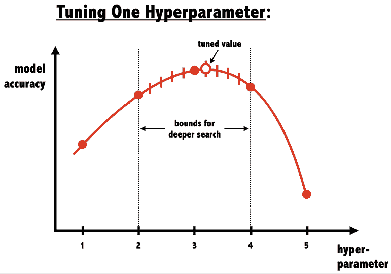

图 14.2：参数调整策略通过广泛搜索然后缩小搜索范围来聚焦于最佳值

调整两个或更多超参数更为复杂，因为一个参数的最佳值可能取决于其他参数的值。构建类似于*图 14.3*所示的可视化可以帮助理解如何找到最佳参数组合；在那些某些值组合导致模型性能更好的热点区域，可以在越来越窄的范围内测试更多的值：

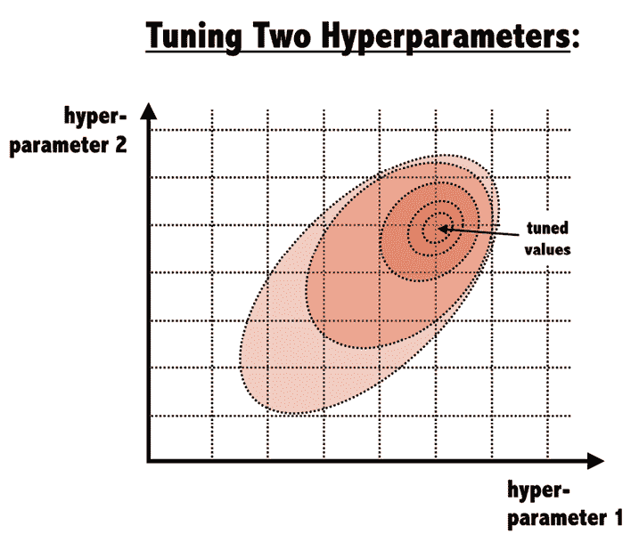

图 14.3：随着更多超参数的添加，调整策略变得更加具有挑战性，因为模型的最佳性能取决于值的组合

这种类似*战舰*风格的**网格搜索**，其中系统地测试超参数及其组合，虽然不是调整的唯一方法，但可能是最广泛使用的方法。一种更智能的方法称为**贝叶斯优化**，将调整过程视为一个可以通过建模解决的问题。这种方法包含在一些自动机器学习软件中，但超出了本书的范围。相反，在本节的剩余部分，我们将专注于将网格搜索的理念应用于我们的实际数据集。

## 示例 - 使用 caret 进行自动调整

幸运的是，我们可以使用 R 来通过许多可能的超参数值和值的组合进行迭代搜索，以找到最佳集。这种方法是一种相对简单但有时计算成本较高的暴力方法，用于优化学习算法的性能。

在第十章“评估模型性能”中使用的`caret`包提供了辅助工具，以帮助进行这种形式的自动化调整。核心调整功能由一个`train()`函数提供，该函数作为分类和数值预测任务中 200 多个不同机器学习模型的标准化接口。使用此函数，可以使用选择的评估方法和指标自动搜索最佳模型。

使用`caret`进行自动参数调整需要你考虑三个问题：

+   应该在数据上训练哪种机器学习算法（以及该算法的特定 R 实现）？

+   对于此算法，哪些超参数可以调整，以及应该调整到何种程度以找到最佳设置？

+   应该使用什么标准来评估候选模型，以确定最佳的整体调整值集？

回答第一个问题涉及在机器学习任务与`caret`包提供的许多模型之一之间找到匹配。这可能需要你对机器学习模型类型的一般理解，如果你按时间顺序阅读本书，你可能已经具备这种理解。消除过程也可能有所帮助。几乎一半的模型可以根据任务是分类还是数值预测来消除；其他模型可以根据训练数据的格式或避免黑盒模型的需求等因素排除，等等。在任何情况下，也没有理由你不能创建几个高度调整的模型并在整个集合中比较它们。

回答第二个问题在很大程度上取决于模型的选择，因为每个算法都使用自己的一组超参数。本书中涵盖的预测模型的可调选项列在以下表中。请注意，尽管一些模型有未显示的附加选项，但只有表中列出的选项由`caret`支持用于自动调整。

| **模型** | **学习任务** | **方法名称** | **超参数** |
| --- | --- | --- | --- |
| *k-最近邻* | *分类* | `knn` | `k` |
| *朴素贝叶斯* | *分类* | `nb` | `fL, usekernel` |
| *决策树* | *分类* | `C5.0` | `model, trials, winnow` |
| *OneR 规则学习器* | *分类* | `OneR` | `None` |
| *RIPPER 规则学习器* | *分类* | `JRip` | `NumOpt` |
| *线性回归* | *回归* | `lm` | `None` |
| *回归树* | *回归* | `rpart` | `cp` |
| *模型树* | *回归* | `M5` | `pruned, smoothed, rules` |
| *神经网络* | *双重用途* | `nnet` | `size, decay` |
| *支持向量机（线性核）* | *双重用途* | `svmLinear` | `C` |
| *支持向量机（径向基核）* | *双重用途* | `svmRadial` | `C, sigma` |
| *随机森林* | *双重用途* | `rf` | `mtry` |
| *梯度提升机（GBM）* | *双重用途* | `gbm` | `n.trees, interaction.depth, shrinkage, n.minobsinnode` |
| *XGBoost (XGB)* | *双重用途* | `xgboost` | `eta, max_depth, colsample_bytree, subsample, nrounds, gamma, min_child_weight` |

要获取`caret`支持的模型和相应调优选项的完整列表，请参阅包作者 Max Kuhn 提供的表格，链接为[`topepo.github.io/caret/available-models.html`](http://topepo.github.io/caret/available-models.html)。

如果你忘记了特定模型的调优参数，可以使用`modelLookup()`函数来查找它们。只需提供如 C5.0 模型所示的方法名：

```py
> modelLookup("C5.0") 
```

```py
 model parameter                 label forReg forClass probModel
1  C5.0    trials # Boosting Iterations  FALSE     TRUE      TRUE
2  C5.0     model            Model Type  FALSE     TRUE      TRUE
3  C5.0    winnow                Winnow  FALSE     TRUE      TRUE 
```

自动调优的目标是在由潜在参数组合的搜索网格组成的候选模型集合上进行迭代。由于搜索所有可能的组合是不切实际的，因此只使用可能性的子集来构建网格。默认情况下，`caret`为每个模型的*p*个超参数最多搜索三个值，这意味着最多将测试*3*^p 个候选模型。例如，默认情况下，k-近邻自动调优将比较*3*¹ *= 3*个候选模型，其中`k=5`、`k=7`和`k=9`。同样，调整决策树将导致最多 27 个不同候选模型的比较，包括`model`、`trials`和`winnow`设置的*3*³ *= 27*组合网格。然而，在实践中，只测试了 12 个模型。这是因为`model`和`winnow`只能取两个值（`tree`与`rules`以及`TRUE`与`FALSE`），这使得网格大小为*3*²*² = 12*。

由于默认的搜索网格可能不适合你的学习问题，`caret`允许你通过简单的命令提供自定义搜索网格，我们将在后面进行介绍。

自动模型调优的第三步和最后一步是确定候选模型中最好的模型。这使用了在第十章“评估模型性能”中讨论的方法，包括选择重采样策略来创建训练和测试数据集，以及使用模型性能统计来衡量预测准确性。我们学到的所有重采样策略和许多性能统计都由`caret`支持。这些包括如分类器的准确率和 kappa，以及数值模型的 R-squared 或**均方根误差**（**RMSE**）。如果需要，也可以使用成本敏感度指标，如灵敏度、特异性和 AUC。

默认情况下，`caret` 将选择具有所需性能度量最佳值的候选模型。由于这种做法有时会导致选择通过增加模型复杂度来实现微小性能改进的模型，因此提供了替代模型选择函数。这些替代方案允许我们选择更简单的模型，这些模型仍然与最佳模型相当接近，这在需要牺牲一点预测性能以换取计算效率提高的情况下可能是可取的。

由于 `caret` 调优过程中有各种各样的选项，许多函数的默认设置是合理的，这很有帮助。例如，不手动指定设置，`caret` 会使用在自助样本上的预测准确度或 RMSE 来选择分类和数值预测模型的最佳表现者。同样，它将自动定义一个有限的网格进行搜索。这些默认设置使我们能够从简单的调优过程开始，并学习如何调整 `train()` 函数来设计我们选择的广泛实验。

### 创建一个简单的调优模型

为了说明调优模型的过程，让我们首先观察当我们尝试使用 `caret` 包的默认设置来调优信用评分模型时会发生什么。调整学习者的最简单方法只需要你通过 `method` 参数指定一个模型类型。由于我们之前已经使用 C5.0 决策树与信用模型一起使用，我们将通过优化这个学习者继续我们的工作。使用默认设置调优 C5.0 决策树的基本 `train()` 命令如下：

```py
> library(caret)
> set.seed(300)
> m <- train(default ~ ., data = credit, method = "C5.0") 
```

首先，使用 `set.seed()` 函数初始化 R 的随机数生成器到一个固定的起始位置。你可能还记得我们在几个先前的章节中使用了这个函数。通过设置 `seed` 参数（在这种情况下，为任意数 300），随机数将遵循预定义的序列。这允许使用随机抽样的模拟能够重复产生相同的结果——如果你正在共享代码或尝试复制先前的结果，这是一个非常有帮助的特性。

接下来，我们使用 R 公式接口定义一棵树为 `default ~ .`。这使用 `credit` 数据集中的所有其他特征来模拟贷款违约状态（`是`或`否`）。参数 `method = "C5.0"` 告诉函数使用 C5.0 决策树算法。

在您输入上述命令后，根据您计算机的能力，在调整过程中可能会有显著的延迟。尽管这是一个小数据集，但必须进行大量的计算。R 必须反复生成数据的随机自助样本，构建决策树，计算性能统计信息，并评估结果。因为有 12 个候选模型具有不同的超参数值需要评估，每个候选模型有 25 个自助样本来计算平均性能指标，所以使用 C5.0 构建了 300 个决策树模型——而且这还不包括在设置提升试验时构建的额外决策树！

命名为 `m` 的列表存储了 `train()` 实验的结果，使用 `str(m)` 命令将显示相关结果，但内容可能相当多。相反，只需输入对象名称即可获得结果的简明摘要。例如，输入 `m` 将产生以下输出（注意，为了清晰起见，已添加编号标签）：

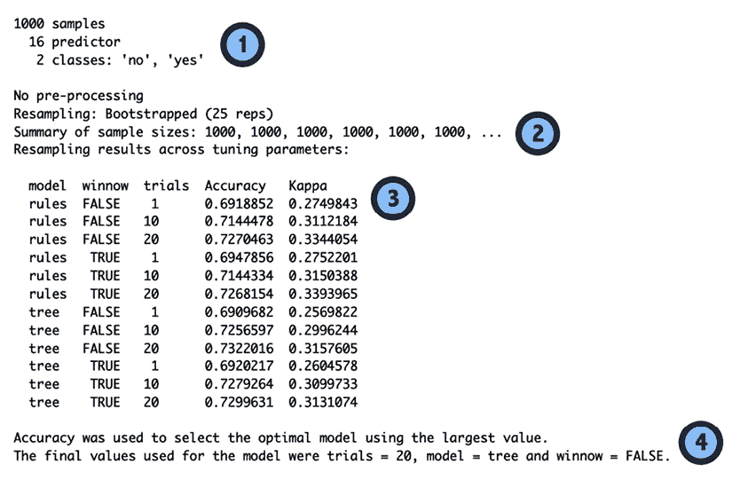

图 14.4：caret 实验的结果分为四个部分，如图中所示

标签突出了输出中的四个主要组成部分：

1.  **输入数据集的简要描述**：如果您熟悉您的数据并且正确应用了 `train()` 函数，这些信息不应令人惊讶。

1.  **应用的预处理和重采样方法的报告**：在这里，我们可以看到使用了 25 个包含 1,000 个示例的自助样本来训练模型。

1.  **评估的候选模型列表**：在本节中，我们可以确认基于三个 C5.0 超参数（`model`、`trials` 和 `winnow`）的组合测试了 12 个不同的模型。每个候选模型的平均准确率和 kappa 统计量也显示出来。

1.  **最佳模型的选择**：正如脚注所述，选择了具有最佳准确率（换句话说，“最大”）的模型。这是使用设置 `winnow = FALSE` 和 `trials = 20` 的决策树的 C5.0 模型。

在确定最佳模型后，`train()` 函数使用调整后的超参数在完整输入数据集上构建一个模型，该模型存储在 `m` 中作为 `m$finalModel`。在大多数情况下，您不需要直接与 `finalModel` 子对象一起工作。相反，只需使用 `predict()` 函数并带上 `m` 对象，如下所示：

```py
> p <- predict(m, credit) 
```

预测结果向量按预期工作，使我们能够创建一个混淆矩阵，该矩阵比较了预测值和实际值：

```py
> table(p, credit$default) 
```

```py
p      no yes
  no  700   2
  yes   0 298 
```

在用于训练最终模型的 1,000 个示例中，只有两个被错误分类，准确率达到 99.8%。然而，非常重要的一点是，由于模型是在训练数据和测试数据上构建的，因此这种准确率是乐观的，因此不应将其视为对未见数据的性能指标。在*图 14.4*的`train()`输出的第三部分的最后一行中可以找到的 72.996%的 bootstrap 准确率估计是一个更现实的未来准确率估计。

除了自动超参数调优之外，使用`caret`包的`train()`和`predict()`函数还提供了一对超越标准包中函数的好处。

首先，`train()`函数应用的所有数据准备步骤将同样应用于用于生成预测的数据。这包括中心化和缩放等转换，以及缺失值的填充。允许`caret`处理数据准备将确保在模型部署时，有助于最佳模型性能的步骤仍然保持不变。

其次，`predict()`函数为获取预测类别值和预测类别概率提供了一个标准化的接口，即使对于通常需要额外步骤才能获取这些信息的模型类型也是如此。对于分类模型，默认提供预测类别：

```py
> head(predict(m, credit)) 
```

```py
[1] no  yes no  no  yes no 
Levels: no yes 
```

要获取每个类别的估计概率，请使用`type = "prob"`参数：

```py
> head(predict(m, credit, type = "prob")) 
```

```py
 no        yes
1 0.9606970 0.03930299
2 0.1388444 0.86115560
3 1.0000000 0.00000000
4 0.7720279 0.22797207
5 0.2948061 0.70519387
6 0.8583715 0.14162853 
```

即使在底层模型使用不同的字符串（例如，对于`naiveBayes`模型使用`"raw"`）来引用预测概率的情况下，`predict()`函数也会自动将`type = "prob"`转换为适当的参数设置。

### 定制调优过程

我们之前创建的决策树展示了`caret`包产生优化模型的最小干预能力。默认设置允许轻松创建优化模型。然而，也可以根据需要更改默认设置，这可能会帮助解锁性能的上层水平。在调优过程开始之前，回答一系列问题将有助于指导`caret`实验的设置：

+   一个迭代需要多长时间？换句话说，训练正在调优的模型的一个实例需要多长时间？

+   考虑到训练单个实例所需的时间，使用所选的重新采样方法进行模型评估需要多长时间？例如，10 折交叉验证将比训练单个模型多花费 10 倍的时间。

+   你愿意在调优上花多少时间？根据这个数字，可以确定可以测试的超参数值的总数。例如，如果使用 10 折交叉验证评估模型需要一分钟，那么每小时可以测试 60 个超参数设置。

使用时间作为关键限制因素将有助于对调优过程进行限制，并防止你无休止地追求更好的性能。

一旦你决定了在试验上花费多少时间，就可以很容易地根据你的喜好定制这个过程。为了说明这种灵活性，让我们修改我们在 *第十章*，*评估模型性能* 中使用的信用决策树的工作，以反映我们在该章中使用的过程。在那个章节中，我们使用 10 折交叉验证来估计卡方统计量。我们在这里也将这样做，使用卡方来调整 C5.0 决策树算法的增强试验，并找到我们数据的最佳设置。请注意，决策树增强首先在第五章，*分而治之 – 使用决策树和规则进行分类* 中介绍，也将在本章的后面部分进行更详细的介绍。

`trainControl()` 函数用于创建一组称为 **控制对象** 的配置选项。此对象指导 `train()` 函数，并允许选择模型评估标准，如重抽样策略和用于选择最佳模型的度量。尽管此函数可以用来修改 `caret` 调优实验的几乎所有方面，但我们将关注两个重要参数：`method` 和 `selectionFunction`。

如果你渴望了解更多关于控制对象的信息，你可以使用 `?trainControl` 命令来查看所有参数的列表。

当使用 `trainControl()` 函数时，`method` 参数设置重抽样方法，例如保留样本法或 k 折交叉验证。下表列出了可能的 `method` 值，以及调整样本大小和迭代次数的任何附加参数。尽管这些重抽样方法的默认选项遵循了流行的惯例，但你可能需要根据你的数据集大小和模型复杂性进行调整。

| **重抽样方法** | **方法名称** | **附加选项和默认值** |
| --- | --- | --- |
| *保留样本法* | `LGOCV` | `p = 0.75` (训练数据比例) |
| *k 折交叉验证* | `cv` | `number = 10` (折数) |
| *重复 k 折交叉验证* | `repeatedcv` | `number = 10` (折数)`repeats = 10` (迭代次数) |
| *重抽样法* | `boot` | `number = 25` (重抽样迭代次数) |
| *0.632 重抽样* | `boot632` | `number = 25` (重抽样迭代次数) |
| *留一法交叉验证* | `LOOCV` | *无* |

`selectionFunction` 参数用于指定将选择候选模型中最佳模型的功能。包含三个这样的功能。`best` 函数简单地选择在指定性能度量上具有最佳值的候选者。这是默认使用的。其他两个函数用于选择最简约的，或最简单的模型，该模型在最佳模型性能的一定阈值内。`oneSE` 函数选择在最佳性能的一个标准误差内的最简单候选者，而 `tolerance` 使用用户指定的百分比内的最简单候选者。

在 `caret` 包按简单性对模型进行排名时，涉及一些主观性。有关模型排名的信息，请参阅选择函数的帮助页面，在 R 命令提示符中键入 `?best`。

要创建一个名为 `ctrl` 的控制对象，该对象使用 10 倍交叉验证（CV）和 `oneSE` 选择函数，请使用以下命令，注意 `number = 10` 仅用于清晰起见；由于这是 `method = "cv"` 的默认值，因此可以省略：

```py
> ctrl <- trainControl(method = "cv", number = 10,
                       selectionFunction = "oneSE") 
```

我们将很快使用这个函数的结果。

同时，设置实验的下一步是创建超参数调整的搜索网格。网格必须包括一个列名，对应于所需模型中的每个超参数，无论它是否将被调整。它还必须包括一个行名，对应于要测试的每个所需值组合。由于我们使用的是 C5.0 决策树，这意味着我们需要名为 `model`、`trials` 和 `winnow` 的列，对应于可以调整的三个选项。对于其他机器学习模型，请参阅本章前面提供的表格或使用 `modelLookup()` 函数查找超参数，如之前所述。

而不是逐个填充网格数据帧的单元格——如果有许多可能的值组合，这将是一项繁琐的任务——我们可以使用 `expand.grid()` 函数，该函数从提供的所有值的组合中创建数据帧。例如，假设我们希望在搜索时保持 `model = "tree"` 和 `winnow = FALSE` 不变，同时搜索 `trials` 的八个不同值。

这可以通过以下方式创建：

```py
> grid <- expand.grid(model = "tree",
                      trials = c(1, 5, 10, 15, 20, 25, 30, 35),
                      winnow = FALSE) 
```

结果 `grid` 数据帧包含 *1*8*1 = 8* 行：

```py
> grid 
```

```py
 model trials winnow
1  tree      1  FALSE
2  tree      5  FALSE
3  tree     10  FALSE
4  tree     15  FALSE
5  tree     20  FALSE
6  tree     25  FALSE
7  tree     30  FALSE
8  tree     35  FALSE 
```

`train()` 函数将使用每个 `grid` 行的模型参数组合构建一个候选模型以进行评估。

在给定搜索网格和之前创建的控制对象后，我们准备运行一个彻底定制的 `train()` 实验。和之前一样，我们将随机种子设置为任意数字 `300` 以确保可重复的结果。但这次，我们将传递我们的控制对象和调整网格，同时添加参数 `metric = "Kappa"`，指示模型评估函数将使用的统计量——在这种情况下，`"oneSE"`。完整的命令集如下：

```py
> set.seed(300)
> m <- train(default ~ ., data = credit, method = "C5.0",
             metric = "Kappa",
             trControl = ctrl,
             tuneGrid = grid) 
```

这将产生一个我们可以通过键入其名称来查看的对象：

```py
> m 
```

```py
C5.0 
1000 samples
  16 predictor
   2 classes: 'no', 'yes' 
No pre-processing
Resampling: Cross-Validated (10 fold) 
Summary of sample sizes: 900, 900, 900, 900, 900, 900, ... 
Resampling results across tuning parameters:
  trials  Accuracy  Kappa    
   1      0.710     0.2859380
   5      0.726     0.3256082
  10      0.725     0.3054657
  15      0.726     0.3204938
  20      0.733     0.3292403
  25      0.732     0.3308708
  30      0.733     0.3298968
  35      0.738     0.3449912
Tuning parameter 'model' was held constant at a value of tree
Tuning parameter 'winnow' was held constant at a value of FALSE
Kappa was used to select the optimal model using the one SE rule.
The final values used for the model were trials = 5, model = tree
 and winnow = FALSE. 
```

虽然输出与自动调整的模型相似，但有一些显著的不同之处。因为使用了 10 折交叉验证，构建每个候选模型的样本量减少到 900，而不是之前自举中使用的 1,000。此外，测试了 8 个候选模型，而不是之前实验中的 12 个。最后，由于`model`和`winnow`保持不变，它们的结果中不再显示其值；相反，它们被列在脚注中。

这里最好的模型与之前的实验差异很大。之前，最好的模型使用`trials = 20`，而在这里，它使用`trials = 1`。这种变化是因为我们使用了`oneSE`函数而不是`best`函数来选择最佳模型。尽管`trials = 35`的模型获得了最好的 kappa 值，但单次试验的模型提供了一个简单得多的算法，并且性能相当接近。

由于配置参数数量众多，`caret`在最初可能会让人感到不知所措。不要让这一点阻碍你——没有比使用 10 折交叉验证测试模型性能更简单的方法了。相反，将实验视为由两部分组成：一个`trainControl()`对象，它规定了测试标准；以及一个确定要评估的模型参数的调整网格。将这些提供给`train()`函数，并投入一点计算时间，你的实验就会完成！

当然，调整只是构建更好学习者的可能性之一。在下一节中，你将发现，除了增强单个学习者使其更强之外，还可以将几个较弱的模型结合起来形成一个更强大的团队。

# 使用集成方法提高模型性能

正如最好的运动队拥有互补而不是重叠技能的球员一样，一些最好的机器学习算法利用了互补模型的团队。由于模型为学习任务带来独特的偏差，它可能很容易学会一组示例，但可能在另一组上遇到困难。因此，通过智能地利用几个不同团队成员的才能，可以创建一个由多个弱学习者组成的强大团队。

这种结合和管理多个模型预测的技术属于更广泛的**元学习方法**范畴，这些方法是涉及学习如何学习的技术。这包括从简单的算法开始，通过迭代设计决策逐渐提高性能——例如，本章早期使用的自动化参数调整——到高度复杂的算法，这些算法借鉴了进化生物学和遗传学的概念来实现自我修改和适应学习任务。

假设你是一个电视智力游戏节目的参赛者，这个节目允许你选择一个由五位朋友组成的团队来帮助你回答价值百万美元的最终问题。大多数人会尝试让这个团队包含各种学科领域的专家。一个包含文学、科学、历史和艺术教授，以及一个当前流行文化专家的团队将是一个安全而全面的团队。鉴于他们的知识广度，一个难以回答的问题不太可能难倒这个团队。

利用创建一个多样化的专家团队类似原则的元学习方法是称为**集成**。在本章的剩余部分，我们将只关注与集成相关的元学习——即建模多个模型预测与期望结果之间关系的工作。这里介绍基于团队合作的方法非常强大，并且经常被用来构建更有效的分类器。

## 理解集成学习

所有集成方法都是基于这样一个想法：通过结合多个较弱的学习者，可以创建一个更强的学习者。集成包含两个或多个机器学习模型，这些模型可以是同一类型的，例如多个决策树，也可以是不同类型的，例如决策树和神经网络。尽管构建集成有许多方法，但它们往往可以分为几个一般类别，这些类别在很大程度上可以通过回答两个问题来区分：

+   集成模型的模型是如何选择和训练的？

+   模型的预测是如何组合起来以做出一个单一最终预测的？

当回答这些问题时，想象集成如下流程图可能会有所帮助，它几乎涵盖了所有集成方法：

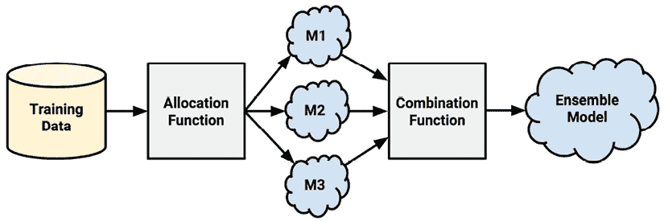

图 14.5：集成将多个较弱的模型组合成一个更强的模型

在这个设计模式中，输入训练数据被用来构建多个模型。**分配函数**决定了每个模型接收多少以及哪些训练数据子集。它们是否都接收完整的训练数据集，或者只是样本？它们是否都接收每个特征或特征子集？在这里做出的决定将塑造构成更强集成模型的较弱学习者的训练。

就像你在电视智力游戏节目中希望有一群各种专家来为你提供关于外表的建议一样，集成模型依赖于一组**多样化的**分类器，这意味着它们具有不相关的分类，但仍然比随机机会表现得更好。换句话说，每个分类器都必须做出独立的预测，但每个分类器也必须做的不只是猜测。

通过包括各种机器学习技术，如将决策树、神经网络和逻辑回归模型组合在一起的集成，可以增加集成的多样性。

或者，分配函数本身也可以通过充当**数据操作器**并人为地改变输入数据来偏置结果学习者，即使它们使用相同的学习算法，从而成为多样性的来源。正如我们稍后将在实践中看到的那样，分配和数据操作过程可能是自动化的，或者作为集成算法本身的一部分，或者它们可能是作为数据工程和模型构建过程的一部分手动执行的。总的来说，增加集成多样性的模式通常分为五类：

+   使用各种基础学习算法

+   通过随机抽取不同的样本来操纵训练样本，通常通过使用自助采样

+   通过使用不同的超参数设置来操纵单个学习算法

+   改变目标特征的表示方式，例如将结果表示为二元、分类或数值

+   将训练数据划分为代表不同学习模式的子组；例如，可以通过关键特征对示例进行分层，并让集成中的模型成为训练数据不同子集的专家

例如，在一个决策树集成中，分配函数可能使用自助采样为每棵树构建独特的训练数据集，或者它可能为每个算法传递不同的特征子集。另一方面，如果集成已经包含了一个多样化的算法集——例如神经网络、决策树和 k-NN 分类器——那么分配函数可能将训练数据相对不变地传递给每个算法。

在集成模型训练完成后，它们可以用来对未来数据进行预测，但必须以某种方式协调这组多个预测以生成一个单一的最终预测。**组合函数**是集成过程中的一个步骤，它将每个预测组合成一个权威的单一预测。当然，由于一些模型可能在预测值上存在分歧，该函数必须以某种方式混合或统一学习者的信息。组合函数也被称为**作曲家**，因为它的工作是综合最终预测。

合并或组合最终预测有两种主要策略。其中较简单的方法涉及**加权方法**，它为每个预测分配一个分数，该分数决定了它在最终预测中的重要性。这些方法从简单的多数投票（其中每个分类器被平等加权）到更复杂的基于性能的方法，后者如果某些模型在过去的证据上证明比其他模型更可靠，则赋予某些模型比其他模型更多的权威。

第二种方法使用更复杂的元学习技术，例如模型堆叠技术，这些内容将在本章后面进行深入探讨。这些方法使用弱学习器的初始预测集来训练一个二级机器学习算法以进行最终预测——这个过程类似于一个委员会向做出最终决策的领导者提供建议。

集成方法用于获得比仅使用单个学习算法更好的性能——集成的主要目标是把一群较弱的学习者转变为一个更强、更统一的团队。尽管如此，还有很多额外的优势，其中一些可能令人惊讶。这些表明了为什么人们可能会转向集成，即使在机器学习竞赛环境之外：

+   **独立集成的方法允许并行工作**：分别训练独立的分类器意味着工作可以分配给多个人。这允许更快的迭代，并可能增加创造力。每个团队成员构建他们最好的模型，最终的结果可以很容易地组合成一个集成。

+   **在大型或小型数据集上提高性能**：当使用大量特征或示例时，许多算法会遇到内存或复杂度限制。一个独立的模型集可以输入特征或示例的子集，这些子集比单个完整模型更容易训练，并且重要的是，通常可以使用分布式计算方法并行运行。在另一端，集成在最小数据集上也做得很好，因为重采样方法（如自助法）是许多集成设计分配函数的固有部分。

+   **能够综合来自不同领域的数据**：由于没有一种适合所有情况的算法，每个学习算法都有自己的偏见和启发式方法，因此集成能够结合来自多种类型学习者的证据，对于建模最具有挑战性的学习任务（依赖于来自不同领域的数据）变得越来越重要。

+   **对困难学习任务的更细致的理解**：现实世界现象通常非常复杂，有许多相互作用的复杂性。像集成这样的方法，将任务分解成更小的建模部分，更有可能捕捉到单个模型可能错过的微妙模式。集合中的某些学习者可以更窄、更深入地学习最具挑战性的案例的特定子集。

如果你不能轻松地在 R 中应用集成方法，那么这些好处将不会非常有帮助，而且有许多包可以做到这一点。让我们看看几种最流行的集成方法以及它们如何帮助我们提高一直在工作的信用模型的性能。

## 流行的基于集成的方法

幸运的是，使用机器学习团队来提高预测性能并不意味着你需要手动分别训练每个集成成员，尽管这个选项是存在的，正如你将在本章后面学到的那样。相反，有一些基于集成的算法可以操纵分配函数，以单步自动训练大量简单的模型。这样，包含一百个或更多学习者的集成可以在不比训练单个学习者更多的时间和输入的情况下进行训练。就像一个人可能构建一个单一的决策树模型一样，可以构建一个包含数百个此类树木的集成，并利用团队合作的力量。虽然这可能会让人联想到这是一个神奇的子弹，但这种力量当然也伴随着一些缺点，比如可解释性的损失和选择基础算法的多样性较少。这一点将在接下来的章节中变得明显，这些章节涵盖了二十年来流行的集成算法的演变——所有这些算法都不是巧合地基于决策树。

### Bagging

最早获得广泛认可的集成方法之一使用了一种称为 **自助聚合** 或简称为 **Bagging** 的技术。正如 Leo Breiman 在 1990 年代中期所描述的，Bagging 首先通过在原始训练数据上使用自助采样生成几个新的训练数据集。然后，使用单个学习算法使用这些数据集生成一组模型。模型的预测通过分类投票和数值预测的平均值进行组合。

关于 Bagging 的更多信息，请参阅 *Bagging predictors. Breiman L., Machine Learning, 1996, Vol. 24, pp. 123-140*。

虽然 Bagging 是一种相对简单的集成方法，但如果与相对**不稳定**的学习者一起使用，即那些在输入数据仅发生微小变化时模型倾向于发生实质性变化的学习者，它可以表现得相当好。不稳定的模型对于确保集成在自助训练数据集的微小变化中保持多样性是必不可少的。

因此，Bagging 最常与决策树一起使用，因为决策树倾向于在输入数据发生微小变化时发生显著变化。

`ipred` 包提供了一个经典的袋装决策树的实现。为了训练模型，`bagging()` 函数的工作方式与之前使用的许多模型类似。`nbagg` 参数用于控制参与集成的决策树数量，默认值为 `25`。根据学习任务的难度和训练数据量，增加这个数量可能会提高模型性能，但有一个上限。缺点是这会增加额外的计算开销，大量树木的训练可能需要一些时间。

安装 `ipred` 包后，我们可以创建集成如下。我们将坚持默认的 `25` 个决策树值：

```py
> library(ipred)
> credit <- read.csv("credit.csv", stringsAsFactors = TRUE)
> set.seed(123)
> mybag <- bagging(default ~ ., data = credit, nbagg = 25) 
```

结果的`mybag`模型与`predict()`函数协同工作，如预期：

```py
> credit_pred <- predict(mybag, credit)
> table(credit_pred, credit$default) 
```

```py
 credit_pred  no yes
        no  699   4
        yes   1 296 
```

根据前面的结果，模型似乎与数据拟合得非常好——*可能太好了*，因为结果仅基于训练数据，因此可能反映了过度拟合而不是对未来未见数据的真实性能。为了获得对未来性能的更好估计，我们可以使用`caret`包中的袋装决策树方法来获得 10 折交叉验证的准确性和 kappa 估计。请注意，`ipred`袋装函数的方法名称为`treebag`：

```py
> library(caret)
> credit <- read.csv("credit.csv")
> set.seed(300)
> ctrl <- trainControl(method = "cv", number = 10)
> train(default ~ ., data = credit, method = "treebag",
        trControl = ctrl) 
```

```py
Bagged CART 
1000 samples
  16 predictor
   2 classes: 'no', 'yes' 
No pre-processing
Resampling: Cross-Validated (10 fold) 
Summary of sample sizes: 900, 900, 900, 900, 900, 900, ... 
Resampling results:
  Accuracy  Kappa    
  0.732     0.3319334 
```

该模型的 kappa 统计量为 0.33，表明袋装树模型的表现大致与我们在本章早期调整的 C5.0 决策树相当，其 kappa 统计量在 0.32 到 0.34 之间变化，具体取决于调整参数。在阅读下一节时，请记住这一性能，并考虑简单袋装技术与在此基础上构建的更复杂方法之间的差异。

### 提升法

另一种常见的基于集合的方法被称为**提升法**，因为它提高了或“提升”了弱学习者的性能，以达到强学习者的性能。这种方法主要基于 Robert Schapire 和 Yoav Freund 的工作，自 1990 年代以来，他们在该主题上发表了大量论文。

如需有关提升法的更多信息，请参阅*《提升法：基础与算法》，Schapire RE，Freund Y，剑桥，MA：麻省理工学院出版社，2012*。

与袋装法类似，提升法使用在重采样数据上训练的模型集合，并通过投票来确定最终预测。有两个关键的区别。首先，提升法中的重采样数据集是专门构建的，以生成互补的学习者。这意味着工作不能并行进行，因为集合中的模型不再是相互独立的。其次，提升法并不是给每个学习者平等的投票，而是根据其过去的性能给每个学习者一个加权投票。表现更好的模型对集合的最终预测有更大的影响力。

提升法的结果通常略好，但绝对不差于集合中最好的模型。由于集合中的模型是故意构建为互补的，因此只需向该组添加额外的分类器，假设每个额外的分类器都比随机机会表现更好，就可以通过添加额外的分类器来提高集合的性能到一个任意阈值。鉴于这一发现的明显效用，提升法被认为是机器学习中最重大的发现之一。

尽管增强可以创建一个满足任意低错误率的模型，但在实践中这并不总是合理的。原因之一是，随着更多学习者的加入，性能增益逐渐减小，使得某些阈值实际上不可行。此外，追求纯粹的准确性可能导致模型过度拟合训练数据，无法推广到未见过的数据。

一种名为**AdaBoost**的增强算法，全称为**自适应增强**，由 Freund 和 Schapire 于 1997 年提出。该算法基于生成弱学习者的想法，通过迭代地学习训练数据中难以分类的样本的更大部分，通过对经常被错误分类的样本给予更多关注（即给予更多权重）来实现。

从一个无权重的数据集开始，第一个分类器试图模拟结果。分类器预测正确的示例不太可能出现在下一个分类器的训练数据集中，反之亦然，难以分类的示例将更频繁地出现。随着更多弱学习者的加入，它们将在具有越来越困难示例的数据上训练。这个过程一直持续到达到所需的总体错误率或性能不再提高。在此之后，每个分类器的投票将根据其在构建时的训练数据上的准确性进行加权。

虽然增强原理可以应用于几乎任何类型的模型，但这些原理最常与决策树一起使用。我们已经在本章前面以及*第五章*，*分而治之 - 使用决策树和规则进行分类*中应用了增强技术，作为一种提高 C5.0 决策树性能的方法。在 C5.0 中，只需将`trials`参数设置为大于一的整数值即可启用增强。

**AdaBoost.M1**算法为分类提供了 AdaBoost 的独立实现。该算法可在`adabag`包中找到。

关于`adabag`包的更多信息，请参阅*adabag：用于分类的增强和 Bagging 的 R 包，Alfaro, E, Gamez, M, Garcia, N, 统计软件杂志，2013，第 54 卷，第 1-35 页*。

让我们为信用数据创建一个`AdaBoost.M1`分类器。此算法的一般语法与其他建模技术类似：

```py
> library(adabag)
> credit <- read.csv("credit.csv", stringsAsFactors = TRUE)
> set.seed(300)
> m_adaboost <- boosting(default ~ ., data = credit) 
```

通常，将`predict()`函数应用于结果对象以进行预测：

```py
> p_adaboost <- predict(m_adaboost, credit) 
```

与常规不同，它返回一个包含模型信息的对象，而不是返回一个预测的向量。预测存储在名为`class`的子对象中：

```py
> head(p_adaboost$class) 
```

```py
[1] "no"  "yes" "no"  "no"  "yes" "no" 
```

可以在`confusion`子对象中找到混淆矩阵：

```py
> p_adaboost$confusion
               Observed Class 
```

```py
Predicted Class  no yes
            no  700   0
            yes   0 300 
```

在你对完美的准确率抱有希望之前，请注意，前面的混淆矩阵是基于模型在训练数据上的性能。由于提升允许错误率降低到任意低水平，学习器简单地继续直到不再犯错误。这可能导致在训练数据集上的过度拟合。

为了对未见数据上的性能进行更准确的评估，我们需要使用另一种评估方法。`adabag` 包提供了一个简单的函数来使用 10 折交叉验证：

```py
> set.seed(300)
> adaboost_cv <- boosting.cv(default ~ ., data = credit) 
```

根据您计算机的能力，这可能需要一些时间来运行，在此期间，它将记录每次迭代的日志到屏幕上——在最新的 MacBook Pro 计算机上，大约需要一分钟。完成后，我们可以查看一个更合理的混淆矩阵：

```py
> adaboost_cv$confusion
               Observed Class 
```

```py
Predicted Class  no yes
            no  598 160
            yes 102 140 
```

我们可以使用 `vcd` 包找到卡方统计量，如第十章中所示，*评估模型性能*：

```py
> library(vcd)
> Kappa(adaboost_cv$confusion) 
```

```py
 value     ASE     z  Pr(>|z|)
Unweighted 0.3397 0.03255 10.44 1.676e-25
Weighted   0.3397 0.03255 10.44 1.676e-25 
```

在卡方值为`0.3397`的情况下，提升模型略优于卡方值约为`0.3319`的装袋决策树。让我们看看提升与另一种集成方法相比如何。

注意，先前结果是在 Windows PC 上使用 R 版本 4.2.3 获得的，并在 Linux 上进行了验证。在撰写本文时，使用 R 4.2.3 在最新的 MacBook Pro 上的 Apple 硅上获得的结果略有不同。此外，请注意，AdaBoost.M1 算法可以通过指定`method = "AdaBoost.M1"`来使用`caret`进行调整。

### 随机森林

另一种基于树的集成方法，称为**随机森林**，建立在装袋原则的基础上，但通过每次只允许算法从随机选择的特征子集中选择来为决策树增加额外的多样性。从根节点开始，随机森林算法可能只能从从完整预测器集合中随机选择的少量特征中选择；在每次后续分割时，提供不同的随机子集。与装袋类似，一旦生成树集成（森林），算法就会进行简单的投票来做出最终预测。

关于随机森林如何构建的更多详细信息，请参阅*随机森林，Breiman L，机器学习，2001，第 45 卷，第 5-32 页*。请注意，“随机森林”一词是 Breiman 和 Cutler 的商标，但通常用来指任何类型的决策树集成。一个严谨的人会使用更一般的术语**决策树森林**，除非在提及它们的特定实现时。

每棵树都是基于不同且随机选择的特征集构建的，这有助于确保集成中的每棵树都是独特的。甚至可能森林中的两棵树是从完全不同的特征集构建的。随机特征选择限制了决策树在每次生长时选择相同低垂果实的贪婪启发式方法，这可能有助于算法发现标准树增长方法可能错过的微妙模式。另一方面，由于每棵树在森林中只有一票，因此过拟合的可能性有限。

考虑到这些优点，随机森林算法迅速成为最受欢迎的学习算法之一——最近，其炒作已被一种新的集成方法所超越，你将在稍后了解该方法。随机森林将多功能性和强大功能结合为单一机器学习方法，并且不太容易过拟合或欠拟合。由于树增长算法仅使用整个特征集的一小部分随机样本，随机森林可以处理极其庞大的数据集，而所谓的维度诅咒可能会使其他模型失败。同时，它在大多数学习任务上的预测性能与最复杂的方法相当，甚至更好。以下表格总结了随机森林模型的优缺点：

| **优点** | **缺点** |
| --- | --- |

|

+   一种适用于大多数问题的通用模型，在分类和数值预测方面都表现出色

+   可以处理噪声或缺失数据，以及分类或连续特征

+   只选择最重要的特征

+   可以用于具有极多特征或示例的数据

|

+   与决策树不同，该模型不易解释

+   可能难以处理具有非常大量级别的分类特征

+   如果需要更高的性能，则无法进行大量调整

|

它们的强大性能与易用性使得随机森林成为大多数现实世界机器学习项目的绝佳起点。该算法还为其他与高度调整的模型以及你稍后将要学习的其他更复杂方法进行了可靠的基准测试。

为了直观演示随机森林，我们将应用本章中使用的信用评分数据。尽管 R 中有几个包含随机森林实现的包，但名为`randomForest`的包可能是最简单的，而`ranger`包在大型数据集上提供了更好的性能。这两个包都由`caret`包支持，用于实验和自动参数调整。使用`randomForest`训练模型的语法如下：

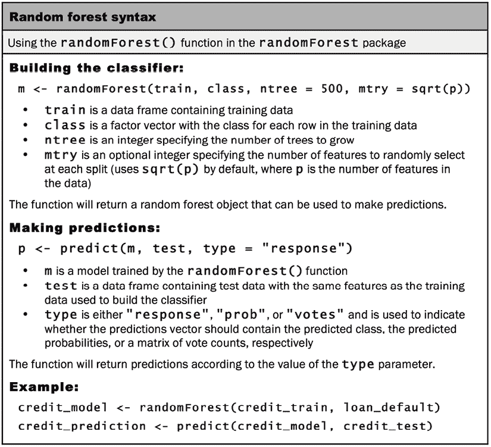

图 14.6：随机森林语法

默认情况下，`randomForest()`函数创建了一个包含 500 棵决策树的集成，每棵树在每个分割点考虑`sqrt(p)`个随机特征，其中`p`是训练数据集中的特征数量，`sqrt()`指的是 R 的平方根函数。例如，由于信用数据有 16 个特征，所以每棵 500 棵决策树在算法尝试分割时只能考虑*sqrt*(*16*) = *4*个预测因子。

这些默认的`ntree`和`mtry`参数是否合适取决于学习任务和训练数据的性质。一般来说，更复杂的学习问题和更大的数据集（包括更多的特征和更多的示例）需要更多的树，尽管这需要与训练更多树的计算成本相平衡。一旦将`ntree`参数设置为一个足够大的值，就可以调整`mtry`参数以确定最佳设置；然而，在实践中默认设置往往效果良好。假设树的数量足够大，在性能下降之前，随机选择特征的数量可以出奇地低——但尝试几个值仍然是好习惯。理想情况下，应该将树的数量设置得足够大，以便每个特征都有机会出现在几个模型中。

让我们看看默认的`randomForest()`参数如何与信用数据一起工作。我们将像对其他学习器所做的那样训练模型。像往常一样，`set.seed()`函数确保结果可以复制：

```py
> library(randomForest)
> set.seed(300)
> rf <- randomForest(default ~ ., data = credit) 
```

为了总结模型性能，我们可以简单地输入结果对象的名称：

```py
> rf 
```

```py
Call:
 randomForest(formula = default ~ ., data = credit) 
               Type of random forest: classification
                     Number of trees: 500
No. of variables tried at each split: 4
        OOB estimate of  error rate: 23.3%
Confusion matrix:
     no yes class.error
no  638  62  0.08857143
yes 171 129  0.57000000 
```

输出结果显示，随机森林包含 500 棵树，并在每个分割点尝试了四个变量，正如预期的那样。乍一看，根据混淆矩阵，你可能会对看似糟糕的性能感到惊讶——23.3%的错误率远高于迄今为止任何其他集成方法的重新替换错误。然而，这个混淆矩阵并没有显示重新替换错误。相反，它反映了**袋外误差率**（在输出中列为`OOB estimate of error rate`），与重新替换错误不同，它是对测试集误差的无偏估计。这意味着它应该是对未来性能的公平估计。

在随机森林构建过程中，使用一种巧妙的技术来计算袋外估计。本质上，任何未被选为单个树的自举样本的示例都可以用来测试模型在未见数据上的性能。在森林构建结束时，对于数据集中的每个 1,000 个示例，任何在训练中未使用该示例的树都可以进行预测。这些预测被汇总，并通过投票来确定该示例的单个最终预测。所有 1,000 个示例的这种预测的总错误率成为袋外错误率。因为每个预测只使用森林的子集，所以它不等同于真正的验证或测试集估计，但它是一个合理的替代品。

在第十章*评估模型性能*中提到，任何给定的示例有 63.2%的几率被包含在自举样本中。这意味着平均有 36.8%的随机森林中的 500 棵树在袋外估计中对每个 1,000 个示例进行了投票。

要在袋外预测上计算 kappa 统计量，我们可以使用`vcd`包中的函数如下。代码将`Kappa()`函数应用于`confusion`对象的前两行和两列，该对象存储了`rf`随机森林模型对象的袋外预测混淆矩阵：

```py
> library(vcd)
> Kappa(rf$confusion[1:2,1:2]) 
```

```py
 value     ASE     z  Pr(>|z|)
Unweighted 0.381 0.03215 11.85 2.197e-32
Weighted   0.381 0.03215 11.85 2.197e-32 
```

在 kappa 统计量为`0.381`的情况下，随机森林是我们迄今为止表现最好的模型。其性能优于具有约`0.332`的 kappa 值的袋装决策树集成，以及具有约`0.340`的 kappa 值的 AdaBoost.M1 模型。

如前所述，`ranger`包是一个随机森林算法的实质性快速实现。对于像信用数据集这样小的数据集，优化计算效率可能不如易用性重要，默认情况下，`ranger`牺牲了一些便利性以提高速度并减少内存占用。因此，尽管`ranger`函数在语法上几乎与`randomForest()`相同，但在实践中，你可能会发现它破坏了现有的代码或需要查阅帮助页面。

要使用`ranger`重新创建先前的模型，我们只需更改函数名：

```py
> library(ranger)
> set.seed(300)
> m_ranger <- ranger(default ~ ., data = credit) 
```

结果模型具有相当相似的袋外预测错误：

```py
> m_ranger 
```

```py
Ranger result
Call:
 ranger(default ~ ., data = credit) 
Type:                             Classification 
Number of trees:                  500 
Sample size:                      1000 
Number of independent variables:  16 
Mtry:                             4 
Target node size:                 1 
Variable importance mode:         none 
Splitrule:                        gini 
OOB prediction error:             23.10 % 
```

我们可以像以前一样计算 kappa 值，同时注意模型混淆矩阵子对象命名的细微差别：

```py
> Kappa(m_ranger$confusion.matrix)
           value    ASE     z  Pr(>|z|) 
```

```py
Unweighted 0.381 0.0321 11.87 1.676e-32
Weighted   0.381 0.0321 11.87 1.676e-32 
```

kappa 值为`0.381`，与早期随机森林模型的结果相同。请注意，这是巧合，因为这两个算法不保证产生相同的结果。

与 AdaBoost 一样，先前的结果是在 Windows PC 上的 R 版本 4.2.3 上获得的，并在 Linux 上进行了验证。在撰写本文时，使用 R 4.2.3 在最新的 MacBook Pro 上的 Apple 硅上获得的结果略有不同。

### 梯度提升

**梯度提升**是基于以下发现的提升算法的演变：可以将提升过程视为一个可以使用梯度下降技术解决的优化问题。我们首次在*第七章*，*黑盒方法——神经网络和支持向量机*中遇到梯度下降，它被介绍为优化神经网络权重的一种解决方案。您可能还记得，成本函数——本质上，预测误差——将输入值与目标相关联。然后，通过系统地分析权重变化如何影响成本，可以找到最小化成本的一组权重。梯度提升以类似的方式处理提升过程，将集成中的弱学习器视为需要优化的参数。使用这种技术的模型被称为**梯度提升机**或**广义提升模型**——两者都可以缩写为**GBMs**。

更多关于 GBMs 的信息，请参阅*Greedy Function Approximation: A Gradient Boosting Machine, Friedman JH, 2001, Annals of Statistics 29(5):1189-1232*。

以下表格总结了 GBMs 的优缺点。简而言之，梯度提升非常强大，可以产生一些最精确的模型，但可能需要调整以找到过拟合和欠拟合之间的平衡。

| **优点** | **缺点** |
| --- | --- |

|

+   一种通用的分类器，可以在分类和数值预测上表现出色。

+   可以实现比随机森林更好的性能。

+   在大型数据集上表现良好。

|

+   可能需要调整以匹配随机森林算法的性能，并且需要更广泛的调整才能超越其性能。

+   因为有多个超参数需要调整，找到最佳组合需要多次迭代和更多的计算能力。

|

我们将使用`gbm()`函数在`gbm`包中创建用于分类和数值预测的 GBMs。如果您还没有安装和加载此包到 R 会话中，您需要这样做。如下方框所示，语法类似于之前使用的机器学习函数，但它有几个可能需要调整的新参数。这些参数控制模型的复杂性和过拟合与欠拟合之间的平衡。未经调整，GBM 可能不如简单方法表现得好，但一旦参数值被优化，它通常可以超越大多数其他方法的性能。

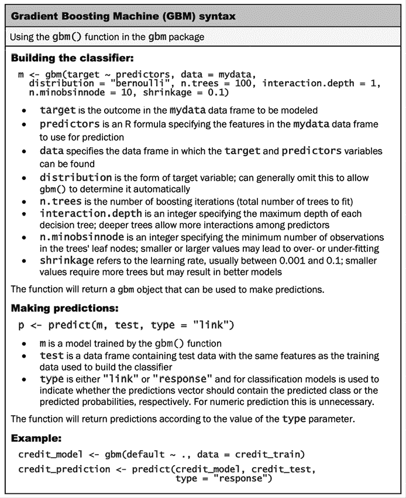

图 14.7：梯度提升机（GBM）语法

我们可以训练一个简单的 GBM 模型，在`credit`数据集上预测贷款违约，如下所示。为了简化，我们将`stringsAsFactors = TRUE`设置为避免重新编码预测变量，但随后必须将目标`default`特征转换回二进制结果，因为`gbm()`函数需要这个二进制分类。我们将创建一个用于训练和测试的随机样本，然后将`gbm()`函数应用于训练数据，参数设置为默认值：

```py
> credit <- read.csv("credit.csv", stringsAsFactors = TRUE)
> credit$default <- ifelse(credit$default == "yes", 1, 0)
> set.seed(123)
> train_sample <- sample(1000, 900)
> credit_train <- credit[train_sample, ]
> credit_test  <- credit[-train_sample, ]
> library(gbm)
> set.seed(300)
> m_gbm <- gbm(default ~ ., data = credit_train) 
```

输入模型的名称会提供一些关于 GBM 过程的基本信息：

```py
> m_gbm 
```

```py
gbm(formula = default ~ ., data = credit_train)
A gradient boosted model with 59 bernoulli loss function.
100 iterations were performed.
There were 16 predictors of which 14 had non-zero influence. 
```

更重要的是，我们可以在测试集上评估模型。请注意，我们需要将预测转换为二进制，因为它们是以概率给出的。如果贷款违约的概率大于 50%，我们将预测违约，否则，我们预测非违约。表格显示了预测值和实际值之间的协议：

```py
> p_gbm <- predict(m_gbm, credit_test, type = "response")
> p_gbm_c <- ifelse(p_gbm > 0.50, 1, 0)
> table(credit_test$default, p_gbm_c) 
```

```py
 p_gbm_c
1
  0 60  5
  1 21 14 
```

为了衡量性能，我们将`Kappa()`函数应用于此表：

```py
> library(vcd)
> Kappa(table(credit_test$default, p_gbm_c)) 
```

```py
 value     ASE    z  Pr(>|z|)
Unweighted 0.3612 0.09529 3.79 0.0001504
Weighted   0.3612 0.09529 3.79 0.0001504 
```

得到的 kappa 值约为`0.361`，比使用提升决策树得到的好，但比随机森林模型差。也许经过一点调整，我们可以将其提高。

我们将使用`caret`包来调整 GBM 模型，以获得更稳健的性能指标。回想一下，调整需要搜索网格，我们可以为 GBM 定义如下网格。这将测试`gbm()`函数三个参数的三个值以及剩余参数的一个值，从而得到*3 * 3 * 3 * 1 = 27*个模型进行评估：

```py
> grid_gbm <- expand.grid(
    n.trees = c(100, 150, 200),
    interaction.depth = c(1, 2, 3),
    shrinkage = c(0.01, 0.1, 0.3),
    n.minobsinnode = 10
  ) 
```

接下来，我们将`trainControl`对象设置为从 10 折交叉验证实验中选择最佳模型：

```py
> library(caret)
> ctrl <- trainControl(method = "cv", number = 10,
                       selectionFunction = "best") 
```

最后，我们读取`credit`数据集，并将所需的对象提供给`caret()`函数，同时指定`gbm`方法和`Kappa`性能指标。根据您计算机的能力，这可能需要几分钟才能运行：

```py
> credit <- read.csv("credit.csv", stringsAsFactors = TRUE)
> set.seed(300)
> m_gbm_c <- train(default ~ ., data = credit, method = "gbm",
                   trControl = ctrl, tuneGrid = grid_gbm,
                   metric = "Kappa",
                   verbose = FALSE) 
```

输入对象的名称会显示实验结果。请注意，为了简洁，省略了一些输出行，但完整的输出包含 27 行——每个评估的模型一行：

```py
> m_gbm_c 
```

```py
Stochastic Gradient Boosting 
1000 samples
  16 predictor
   2 classes: 'no', 'yes' 
No pre-processing
Resampling: Cross-Validated (10 fold) 
Summary of sample sizes: 900, 900, 900, 900, 900, 900, ... 
Resampling results across tuning parameters:
  shrinkage  interaction.depth  n.trees  Accuracy  Kappa      
  0.10       1                  100      0.737     0.269966697
  0.10       1                  150      0.738     0.295886773
  0.10       1                  200      0.742     0.320157816
  0.10       2                  100      0.747     0.327928587
  0.10       2                  150      0.750     0.347848347
  0.10       2                  200      0.759     0.380641164
  0.10       3                  100      0.747     0.342691964
  0.10       3                  150      0.748     0.356836684
  0.10       3                  200      0.764     0.394578005
Tuning parameter 'n.minobsinnode' was held constant at a value of 10
Kappa was used to select the optimal model using the largest value.
The final values used for the model were n.trees = 200,
interaction.depth = 3, shrinkage = 0.1 and n.minobsinnode = 10. 
```

从输出中，我们可以看到最佳 GBM 模型的 kappa 值为`0.394`，超过了之前训练的随机森林。通过进一步的调整，可能将 kappa 值进一步提高。或者，正如您将在下一节中看到的，可以采用更加强化的提升形式来追求更好的性能。

### 基于 XGBoost 的极端梯度提升

XGBoost 算法（`https://xgboost.ai`）是梯度提升技术的尖端实现，它通过提高算法的效率和性能将提升技术推向了“极致”。自 2014 年算法推出以来，XGBoost 已经在许多机器学习竞赛的排行榜上名列前茅。事实上，根据算法作者的统计，在 2015 年的 Kaggle 上，29 个获胜方案中，共有 17 个使用了 XGBoost 算法。同样，在 2015 年的 KDD Cup（在第十一章*用机器学习取得成功*中描述），前 10 名获胜者都使用了 XGBoost。如今，该算法仍然是传统机器学习问题（涉及分类和数值预测）的冠军，而其最接近的挑战者，深度神经网络，往往只在非结构化数据（如图像、音频和文本处理）上获胜。

关于 XGBoost 的更多信息，请参阅 *XGBoost: A Scalable Tree Boosting System, Chen T and Guestrin C, 2016*。[`arxiv.org/abs/1603.02754`](https://arxiv.org/abs/1603.02754).

XGBoost 算法的强大功能伴随着算法并不那么容易使用，并且比迄今为止考察的其他方法需要更多的调整。另一方面，其性能上限往往高于任何其他方法。XGBoost 的优点和缺点如下表所示：

| **优点** | **缺点** |
| --- | --- |

|

+   一个通用的分类器，能够在分类和数值预测上表现出色

+   在传统学习问题上的性能可能是无争议的冠军；在结构化数据上的几乎每个机器学习竞赛中都能获胜

+   高度可扩展，在大数据集上表现良好，可以在分布式计算平台上并行运行

|

+   比其他函数更难使用，因为它依赖于不使用原生 R 数据结构的外部框架

+   需要对大量超参数进行广泛的调整，这些超参数在没有强大数学背景的情况下可能难以理解

+   因为有很多调整参数，找到最佳组合需要多次迭代和更多的计算能力

+   导致一个“黑盒”模型，没有解释性工具几乎无法解释

|

为了应用算法，我们将使用`xgboost`包中的`xgboost()`函数，它为 XGBoost 框架提供了 R 接口。关于这个框架，可以写出整本书，因为它包括了许多类型机器学习任务的功能，并且具有高度的可扩展性和适应性强，适用于许多高性能计算环境。有关 XGBoost 框架的更多信息，请参阅网络上的优秀文档[`xgboost.readthedocs.io`](https://xgboost.readthedocs.io)。我们的工作将专注于其功能的一个狭窄部分，如下面的语法框所示，由于复杂性和可能调整的超参数的大量增加，它比其他算法的语法要密集得多：

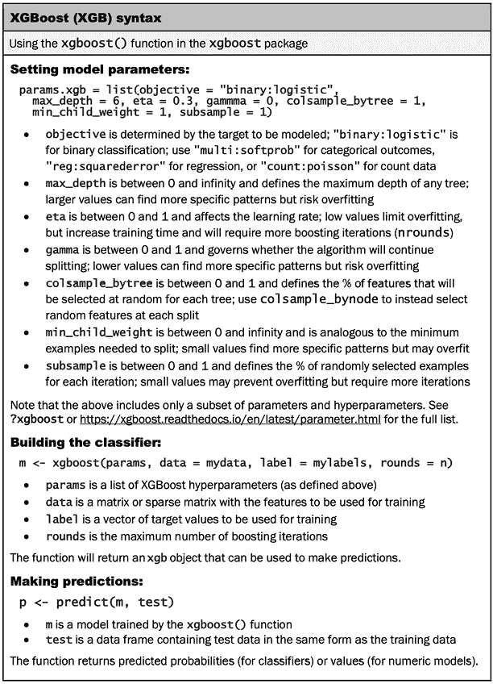

图 14.8：XGBoost（XGB）语法

使用 R 中的 XGBoost 的一个挑战是它需要使用矩阵格式而不是 R 首选的 tibbles 或数据框格式。因为 XGBoost 是为极大数据集设计的，它也可以使用稀疏矩阵，如前几章中讨论的。你可能记得，稀疏矩阵只存储非零值，当许多特征值为零时，这使得它比传统矩阵更节省内存。

矩阵形式的数据通常是稀疏的，因为因素通常在数据框和矩阵之间的转换过程中进行 one-hot 或虚拟编码。这些编码为因素级别的额外级别创建了额外的列，除了表示给定示例级别的“热”值之外，所有列都设置为 0。在虚拟编码的情况下，转换中省略了一个特征级别，因此它比 one-hot 少一个列；缺失的级别可以通过所有*n - 1*列中存在零来表示。

One-hot 编码和虚拟编码通常会产生相同的结果，但有一个例外，即基于统计的模型如回归需要虚拟编码，如果使用 one-hot 编码，则会显示错误或警告信息。

让我们从读取`credit.csv`文件并从`credit`数据框创建一个稀疏矩阵开始。`Matrix`包提供了一个执行此任务的功能，它使用 R 公式接口来确定矩阵中要包含的列。在这里，公式`~ . -default`告诉函数使用除了`default`之外的所有特征，因为我们不希望在矩阵中包含这个特征，因为这是我们预测的目标特征：

```py
> credit <- read.csv("credit.csv", stringsAsFactors = TRUE)
> library(Matrix)
> credit_matrix <- sparse.model.matrix(~ . -default, data = credit) 
```

为了确认我们的工作，让我们检查矩阵的维度：

```py
> dim(credit_matrix) 
```

```py
[1] 1000   36 
```

我们仍然有 1,000 行，但列数从原始数据框中的 16 个特征增加到稀疏矩阵中的 36 个。这是由于在转换为矩阵形式时自动应用的虚拟编码。我们可以使用`print()`函数检查稀疏矩阵的前五行和 15 列来看到这一点：

```py
> print(credit_matrix[1:5, 1:15]) 
```

```py
5 x 15 sparse Matrix of class "dgCMatrix"
   [[ suppressing 15 column names '(Intercept)', 'checking_balance> 200 DM', 'checking_balance1 - 200 DM' ... ]]

1 1 . . .  6 . . . . . . . 1 . 1169
2 1 . 1 . 48 1 . . . . . . 1 . 5951
3 1 . . 1 12 . . . . . . 1 . . 2096
4 1 . . . 42 1 . . . . . . 1 . 7882
5 1 . . . 24 . . 1 . 1 . . . . 4870 
```

矩阵用点(`.`)字符表示零值单元格。第一列(`1`, `2`, `3`, `4`, `5`)是行号，第二列(`1`, `1`, `1`, `1`, `1`)是截距项的列，这是由 R 公式接口自动添加的。两列有数字(`6`, `48`, …)和(`1169`, `5951`, …)，分别对应于`months_loan_duration`和`amount`特征的数值。所有其他列都是因子变量的虚拟编码版本。例如，第三、第四和第五列反映了`checking_balance`特征，第三列中的`1`表示`'> 200 DM'`的值，第四列中的`1`表示`'1 – 200 DM'`，第五列中的`1`表示`'unknown'`特征值。在第三、第四和第五列中显示序列`...`的行属于参考类别，这是`'< 0 DM'`特征级别。

由于我们不是构建回归模型，所以充满`1`值的截距列对于这次分析是无用的，可以从矩阵中移除：

```py
> credit_matrix <- credit_matrix[, -1] 
```

接下来，我们将矩阵随机分割成训练集和测试集，使用之前 90-10 的分割比例：

```py
> set.seed(12345)
> train_ids <- sample(1000, 900)
> credit_train <- credit_matrix[train_ids, ]
> credit_test <- credit_matrix[-train_ids, ] 
```

为了确认工作是否正确完成，我们将检查这些矩阵的维度：

```py
> dim(credit_train) 
```

```py
[1] 900  35 
```

```py
> dim(credit_test) 
```

```py
[1] 100  35 
```

如预期，训练集有 900 行和 35 列，测试集有 100 行和与之匹配的列数。

最后，我们将为`default`目标创建训练和测试标签向量。这些标签通过`ifelse()`函数从因子转换为二进制`1`或`0`值，以便可以分别用于训练和评估 XGBoost 模型：

```py
> credit_train_labels <-
    ifelse(credit[train_ids, c("default")] == "yes", 1, 0)
> credit_test_labels <-
    ifelse(credit[-train_ids, c("default")] == "yes", 1, 0) 
```

现在我们已经准备好开始构建模型。在安装了`xgboost`包之后，我们将加载库并开始定义训练的超参数。由于不知道从哪里开始，我们将值设置为默认值：

```py
> library(xgboost)
> params.xgb <- list(objective   = "binary:logistic",
                     max_depth   = 6,
                     eta         = 0.3,
                     gamma       = 0,
                     colsample_bytree = 1,
                     min_child_weight = 1,
                     subsample = 1) 
```

接下来，在设置随机种子之后，我们将训练模型，提供我们的参数对象以及训练数据矩阵和目标标签。`nrounds`参数决定了提升迭代的次数。由于没有更好的猜测，我们将此设置为`100`，这是一个常见的起点，因为经验证据表明结果在此值之后很少有所改善。最后，`verbose`和`print_every_n`选项用于开启诊断输出，并在每 10 次提升迭代后显示进度：

```py
> set.seed(555)
> xgb_credit <- xgboost(params  = params.xgb,
                        data    = credit_train,
                        label   = credit_train_labels, 
                        nrounds = 100,
                        verbose = 1,
                        print_every_n = 10) 
```

完成训练后，输出应该显示所有 100 次迭代都已发生，训练错误（标记为`train-logloss`）在额外的提升轮次中继续下降：

```py
[1] train-logloss:0.586271 
[11]	train-logloss:0.317767 
[21]	train-logloss:0.223844 
[31]	train-logloss:0.179252 
[41]	train-logloss:0.135629 
[51]	train-logloss:0.108353 
[61]	train-logloss:0.090580 
[71]	train-logloss:0.077314 
[81]	train-logloss:0.065995 
[91]	train-logloss:0.057018 
[100] train-logloss:0.050837 
```

了解额外的迭代是否有助于提高模型性能或导致过拟合是我们可以在调整后确定的事情。在这样做之前，让我们看看这个训练模型在之前保留的测试集上的表现。首先，`predict()` 函数获取测试数据每行的贷款违约预测概率：

```py
> prob_default <- predict(xgb_credit, credit_test) 
```

然后，我们使用 `ifelse()` 函数来预测违约（值为 `1`）的概率至少为 0.50，否则预测非违约（值为 `0`）：

```py
> pred_default <- ifelse(prob_default > 0.50, 1, 0) 
```

将预测值与实际值进行比较，我们发现准确率为 *(62 + 14) / 100 = 76* 百分比：

```py
> table(pred_default, credit_test_labels)
            credit_test_labels 
```

```py
pred_default  0  1
           0 62 13
           1 11 14 
```

另一方面，kappa 统计量表明仍有改进的空间：

```py
> library(vcd)
> Kappa(table(pred_default, credit_test_labels)) 
```

```py
 value    ASE     z  Pr(>|z|)
Unweighted 0.3766 0.1041 3.618 0.0002967
Weighted   0.3766 0.1041 3.618 0.0002967 
```

`0.3766` 的值略低于我们使用 GBM 模型获得的 `0.394`，因此可能需要一点超参数调整来帮助。为此，我们将使用 `caret`，从包含每个超参数各种选项的调整网格开始：

```py
> grid_xgb <- expand.grid(
    eta = c(0.3, 0.4),
    max_depth = c(1, 2, 3),
    colsample_bytree = c(0.6, 0.8),
    subsample = c(0.50, 0.75, 1.00),
    nrounds = c(50, 100, 150),
    gamma = c(0, 1),
    min_child_weight = 1
  ) 
```

生成的网格包含 *2 * 3 * 2 * 3 * 3 * 2 * 1 = 216* 种不同的 `xgboost` 超参数值组合。我们将像对其他模型所做的那样，在 `caret` 中使用 10 折交叉验证来评估这些潜在模型。请注意，`verbosity` 参数设置为零，以便抑制 `xgboost()` 函数输出的多次迭代：

```py
> library(caret)
>  ctrl <- trainControl(method = "cv", number = 10,
                       selectionFunction = "best")
> credit <- read.csv("credit.csv", stringsAsFactors = TRUE)
> set.seed(300)
> m_xgb <- train(default ~ ., data = credit, method = "xgbTree",
                      trControl = ctrl, tuneGrid = grid_xgb,
                      metric = "Kappa", verbosity = 0) 
```

根据你电脑的能力，实验可能需要几分钟才能完成，但一旦完成，输入 `m_xgb` 将提供所有 216 个测试模型的成果。我们也可以直接获得最佳模型，如下所示：

```py
> m_xgb$bestTune 
```

```py
 nrounds max_depth eta gamma colsample_bytree
        50         3  0.4     1              0.6
    min_child_weight subsample
1 
```

使用 `max()` 函数可以找到这个模型的最大值，从而找到该模型的 kappa 值如下：

```py
> max(m_xgb$results["Kappa"]) 
```

```py
[1] 0.4062946 
```

`0.406` 的 kappa 值是我们迄今为止表现最好的模型，超过了 GBM 模型的 `0.394` 和随机森林的 `0.381`。XGBoost 在经过一点微调后仍然需要如此少的努力就能超越其他强大的技术，这提供了为什么它似乎总是赢得机器学习竞赛的原因。然而，通过更多的调整，我们可能还能进一步提高！将这个作为留给读者你的练习，我们现在将注意力转向为什么所有这些流行的集成方法似乎都专注于基于决策树的方法。

### 为什么基于树的集成方法如此受欢迎？

在阅读了前面的章节之后，你不会是第一个想知道为什么集成算法似乎总是建立在决策树之上的。尽管构建集成算法不需要树，但有几个原因说明它们特别适合这个过程。你可能已经注意到了其中的一些：

+   集成方法与多样性结合得最好，因为决策树对数据中的微小变化不稳健，随机采样相同的训练数据可以轻松创建一组基于树的模型

+   由于基于贪婪的“分而治之”算法，决策树在计算上效率高，尽管如此，其表现相对较好

+   决策树可以根据需要有意地生长得很大或很小，以过度拟合和欠拟合

+   决策树可以自动忽略无关特征，从而减少“维度诅咒”的负面影响

+   决策树不仅可以用于数值预测，还可以用于分类

基于这些特性，不难看出我们为何拥有如此丰富的基于树的集成方法，如 bagging、boosting 和随机森林。它们之间的区别细微但很重要。

以下表格可能有助于对比本章所涵盖的基于树的集成算法：

| **集成算法** | **分配函数** | **组合函数** | **其他说明** |
| --- | --- | --- | --- |
| Bagging | 为每个学习者提供一个训练数据的自助样本 | 学习者通过投票进行分类或通过加权平均进行数值预测进行组合 | 使用独立的集成——学习者可以并行运行 |
| Boosting | 第一个学习者得到一个随机样本；后续样本被加权以包含更多难以预测的案例 | 学习者的预测按照上述方法组合，但根据它们在训练数据上的表现进行加权 | 使用依赖集成——序列中的每棵树都接收早期树发现具有挑战性的数据 |
| 随机森林 | 与 bagging 类似，每棵树都接收训练数据的自助样本；然而，对于每棵树的分裂，也会随机选择特征 | 类似于 bagging | 类似于 bagging，但通过随机特征选择增加的多样性为更大的集成提供了额外的优势 |
| 梯度提升机（GBM） | 概念上类似于 boosting | 类似于 boosting，但学习者更多，它们构成了一个复杂的数学函数 | 使用梯度下降来制作更高效的 boosting 算法；树通常不是很深（决策树“桩”），但数量更多；需要更多调整 |
| 极端梯度提升（XGB） | 类似于 GBM | 类似于 GBM | 类似于 GBM 但更极端；使用优化的数据结构、并行处理和启发式方法来创建非常高效的 boosting 算法；调整是必要的 |

能够区分这些方法，表明了对集成几个方面的深刻理解。此外，最新的技术，如随机森林和梯度提升，是性能最好的学习算法之一，并被用作现成的解决方案来解决一些最具挑战性的商业问题。这可能有助于解释为什么雇佣数据科学家和机器学习工程师的公司通常要求候选人在面试过程中描述或比较这些算法。因此，尽管基于树的集成算法不是机器学习的唯一方法，但了解它们的潜在用途是很重要的。然而，正如下一节所描述的，树并不是构建多样化集成的唯一方法。

# 为元学习堆叠模型

与使用诸如 bagging、boosting 或随机森林等现成的集成方法相比，在某些情况下，采用定制的集成方法是有必要的。尽管这些基于树的集成技术将数百甚至数千个学习器组合成一个单一、更强的学习器，但这个过程与传统机器学习算法的训练并没有太大的不同，并且存在一些相同的局限性，尽管程度较轻。基于弱训练和最小调优的决策树，在某些情况下，可能会对集成性能设置一个上限，相对于由更多样化的学习算法组成的集成，这些算法在人类智能的帮助下进行了广泛的调优。此外，尽管可以并行化基于树的集成，如随机森林和 XGB，但这只并行化了计算机的努力——而不是模型构建的人类努力。

事实上，通过不仅添加额外的学习算法，还将模型构建的工作分配给并行工作的额外人类团队，可以增加集成的多样性。实际上，世界上许多获奖的模型都是通过采用其他团队的最佳模型并将它们集成在一起来构建的。

这种集成在概念上非常简单，提供了在其他情况下无法获得的性能提升，但在实践中可能会变得复杂。正确实现实现细节至关重要，以避免灾难性的过拟合水平。如果正确执行，集成将至少与集成中最强的模型一样好，通常要好得多。

检查*接收者操作特征*（**ROC**）曲线，如第十章*评估模型性能*中所述，提供了一种简单的方法来确定两个或多个模型是否可以从集成中受益。如果两个模型的 ROC 曲线相交，它们的**凸包**——通过围绕曲线拉紧一个想象中的橡皮筋所获得的边界——代表了一个假设的模型，可以通过插值或组合这些模型的预测来获得。如图 14.9 所示，两个具有相同**曲线下面积**（**AUC**）值*0.70*的 ROC 曲线，当在集成中配对时，可能会创建一个具有 AUC 为*0.72*的新模型：

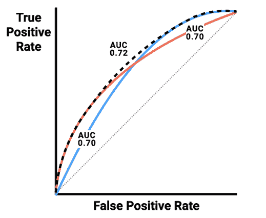

图 14.9：当两个或多个 ROC 曲线相交时，它们的凸包代表一个潜在的更好分类器，可以通过组合它们的预测在集成中生成

由于这种集成形式主要是由人工完成的，因此需要人类为集成中的模型提供分配和组合函数。在最简单的形式中，这些函数可以相当实用地实现。例如，假设相同的训练数据集被分配给了三个不同的团队。这就是分配函数。这些团队可以使用这个数据集，按照他们认为合适的方式构建最佳模型，并使用他们选择的评估标准。

接下来，每个团队都会收到测试集，并使用他们的模型进行预测，这些预测必须组合成一个单一的最终预测。组合函数可以采取多种不同的形式：组可以投票，预测可以平均，或者根据每个组过去的表现进行加权。甚至随机选择一个组的方法也是一个可行的策略，前提是每个组至少偶尔表现得比其他所有组都要好。当然，还有更多更智能的方法是可能的，你很快就会学到。

## 理解模型堆叠和混合

一些最复杂的自定义集成将机器学习应用于学习最终预测的组合函数。本质上，它试图学习哪些模型可以信赖，哪些模型则不可信。这个仲裁学习器可能会意识到集成中的一个模型表现不佳，不应被信赖，或者另一个模型在集成中应该得到更多的权重。仲裁函数也可能学习更复杂的模式。例如，假设当模型 *M1* 和 *M2* 在结果上达成一致时，预测几乎总是准确的，但否则 *M3* 通常比这两个模型中的任何一个都要准确。在这种情况下，一个额外的仲裁模型可以学会忽略 *M1* 和 *M2* 的投票，除非他们达成一致。这个过程被称为**堆叠**，即使用多个模型的预测来训练一个最终模型。


图 14.10：堆叠是一种复杂的集成，它使用仲裁学习算法来组合一组学习者的预测并做出最终预测

更广泛地说，堆叠属于一种称为**堆叠泛化**的方法。根据正式定义，堆叠是通过使用通过交叉验证训练的一级模型构建的，以及使用超出折叠样本的预测来训练的二级模型或**元模型**。

例如，假设堆叠中包含三个一级模型，并且每个模型都使用 10 折交叉验证进行训练。如果训练数据集包括 1,000 行，那么每个一级模型在 900 行上训练，并在 100 行上测试十次。当这些 100 行的测试集合并时，构成了整个训练数据集。

由于所有三个模型都对训练数据中的每一行进行了预测，可以构建一个包含四列和 1,000 行的新的表格：前三个列代表三个模型的预测，第四列代表目标的真实值。请注意，由于对这 100 行中的每一行所做的预测都是在其他 900 行上做出的，因此所有 1,000 行都是对未见数据的预测。这允许第二阶段的元模型，通常是一个回归或逻辑回归模型，通过使用预测值作为真实值的预测因子来训练，从而学习哪些一级模型表现更好。这个过程有时被称为**超级学习**，而得到的模型可能被称为**超级学习器**。这个过程通常由机器学习软件或包执行，它们并行训练多个学习算法并将它们自动堆叠在一起。

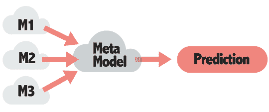

图 14.11：在堆叠集成中，第二阶段的元模型或“超级学习器”从第一级模型对超出折叠样本的预测中学习

为了更实际的方法，一种称为**混合**或**保留样本堆叠**的堆叠泛化特殊案例提供了一种简化堆叠实现的方法，通过用保留样本替换交叉验证。这可以通过将训练数据分为一级模型的训练集和使用保留集作为二级元学习器的集合，使工作更容易地在团队之间分配。这也可能不太容易受到第十一章中描述的交叉验证“信息泄露”的影响，即*在机器学习中取得成功*。因此，尽管这是一个简单的方法，但它可以非常有效；混合通常是赢得比赛的团队在将其他模型组合在一起以获得更好的结果时所做的事情。

关于堆叠、混合和超级学习的术语有些模糊，许多人可以互换使用这些术语。

## R 中混合和堆叠的实用方法

在 R 中执行混合操作需要一个详细的路线图，因为细节错误可能导致过度拟合，并且模型的表现不如随机猜测。以下图示说明了这个过程。首先，想象一下你被要求预测贷款违约，并且可以访问一百万行的历史数据。立即，你应该将数据集划分为训练集和测试集；当然，测试集应该被保存在保险库中，以便稍后评估集成。假设训练集有 75 万行，测试集有 25 万行。然后，必须再次将训练集划分为用于训练一级模型和二级元学习者的数据集。确切的比率有些任意，但通常使用较小的集来作为第二阶段模型——有时低至百分之十。如图 14.12 所示，我们可能使用 50 万行用于一级，25 万行用于二级：

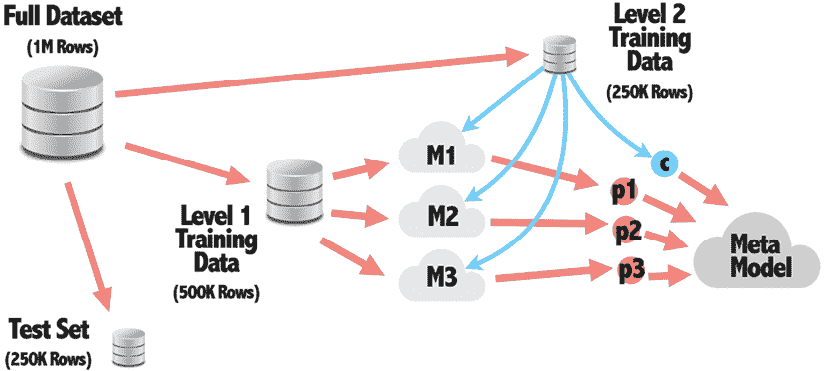

图 14.12：完整的训练数据集必须划分为不同的子集，用于训练一级和二级模型

50 万行的第一级训练数据集被用来训练一级模型，正如我们在本书中多次做的那样。*M1*、*M2*和*M3*模型可以使用任何学习算法，构建这些模型的工作甚至可以分布到独立工作的不同团队中。

假设每个团队的特征工程流程可以在集成部署时被复制或自动化，模型或团队不需要使用训练数据中的相同特征集或相同的特征工程形式。重要的是，*M1*、*M2*和*M3*应该能够接受具有相同特征的训练数据集，并为每一行产生一个预测。 

在经过它们各自的特征工程流程处理后，25 万行的二级训练数据集被输入到*M1*、*M2*和*M3*模型中，得到三个包含 25 万预测值的向量。这些向量在图中被标记为*p1*、*p2*和*p3*。当与从二级训练数据集中获得的 25 万真实目标值（图中标记为*c*）结合时，就生成了一个四列的数据框，如图 14.13 所示：

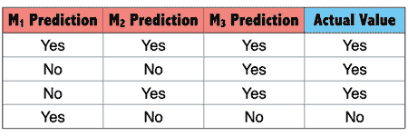

图 14.13：用于训练元模型的训练数据集由一级模型的预测值和二级训练数据的实际目标值组成

这种类型的数据框用于创建元模型，通常使用回归或逻辑回归，它使用*M1*、*M2*和*M3*的预测（*图 14.12*中的*p1*、*p2*和*p3*）作为预测因子来预测实际的目标值（*图 14.12*中的*c*）。在一个 R 公式中，这可能被指定为`c ~ p1 + p2 + p3`的形式，这会导致一个模型，它根据来自三个不同预测的输入来做出自己的最终预测。

为了估计这个最终元模型未来的性能，我们必须使用 250,000 行的测试集，正如之前在*图 14.12*中所示，这个测试集在训练过程中被保留出来。如图*图 14.14*所示，测试数据集随后被输入到*M1*、*M2*和*M3*模型及其相关的特征工程管道中，并且与之前的步骤类似，获得了三个包含 250,000 个预测的向量。然而，与*p1*、*p2*和*p3*用于训练元模型不同，现在它们被用作现有元模型的预测因子，以获得每个 250,000 个测试案例的最终预测（标记为*p4*）。这个向量可以与测试集中目标值的 250,000 个真实值进行比较，以执行性能评估并获得集成未来性能的无偏估计。

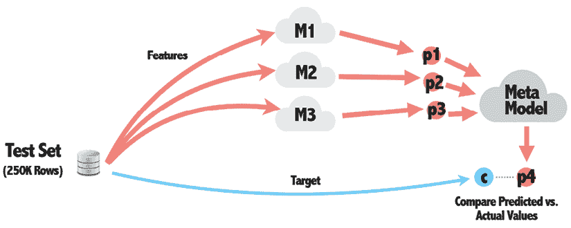

图 14.14：为了获得集成未来性能的无偏估计，测试集被用来为第一级模型生成预测，然后这些预测被用来获得元模型的最终预测

上述方法灵活，可以创建其他有趣类型的集成。*图 14.15*展示了结合了在不同特征子集上训练的模型的混合集成。具体来说，它设想了一个学习任务，其中使用 Twitter 个人资料数据来预测用户——可能是他们的性别或他们是否会对购买特定产品感兴趣：

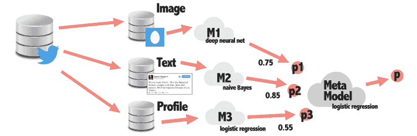

图 14.15：堆栈的第一级模型可以在训练集的不同特征上训练，而第二级模型则在其预测上训练

第一个模型接收个人资料的图片，并使用图像数据训练一个深度学习神经网络来预测结果。第二个模型接收用户的推文集合，并使用基于文本的模型如朴素贝叶斯来预测结果。最后，第三个模型是一个更传统的模型，使用传统的数据框，如位置、推文总数、最后登录日期等人口统计数据。

这三个模型被组合起来，元模型可以学习图像、文本或个人资料数据对于预测性别或购买行为最有帮助。或者，因为元模型是一个类似于*M3*的逻辑回归模型，可以直接将个人资料数据提供给第二阶段模型，从而完全跳过*M3*的构建。

除了像这里描述的那样手工构建混合集成之外，还有越来越多的 R 包可以帮助这个过程。`caretEnsemble`包可以帮助使用`caret`包训练的集成模型，并确保堆叠的采样正确处理。`SuperLearner`包提供了一种创建超级学习器简单的方法；它可以对同一数据集应用数十种基础算法，并自动将它们堆叠在一起。作为一种现成的算法，这可能有助于以最少的努力构建一个强大的集成。

# 摘要

在阅读本章之后，你现在应该知道用于赢得数据挖掘和机器学习竞赛的方法。自动化调整方法可以帮助从单个模型中榨取每一丝性能。另一方面，通过创建称为集成的一组机器学习模型，可以实现巨大的进步，这些模型协同工作，其性能优于单独工作的单个模型。包括随机森林和梯度提升在内的各种基于树的算法提供了集成的优势，但可以像单个模型一样轻松训练。另一方面，学习者可以通过手工堆叠或混合到集成中，这允许方法被仔细调整以适应学习问题。

在众多提高模型性能的选项中，我们应该从哪里开始呢？没有一种唯一最佳的方法，但从业者往往会落入三个阵营之一。首先，一些人会从更复杂的集成方法开始，例如随机森林或 XGBoost，并将大部分时间用于调整和特征工程，以实现该模型可能达到的最高性能。第二组人可能会尝试多种方法，然后将模型收集到一个单一的堆叠或混合集成中，以创建一个更强大的学习器。第三种方法可以描述为“把所有东西都扔给计算机，看看什么能粘住。”这种方法试图尽可能快地给学习算法提供尽可能多的数据，有时还会结合前几章中描述的自动化特征工程或降维技术。随着实践，你可能会对某些想法比对其他想法更感兴趣，所以请随意使用对你来说效果最好的方法。

尽管本章旨在帮助你准备竞赛所需的模型，请注意你的竞争对手也能接触到同样的技术。你不能仅仅依靠停滞不前；因此，继续将专有方法添加到你的技巧包中。也许你可以带来独特的专业知识，或者也许你的优势包括在数据准备中对细节的关注。无论如何，熟能生巧，所以利用竞赛来测试、评估和提升你的机器学习技能集。在本书的下一章——也是最后一章中，我们将探讨如何使用 R 将尖端“大数据”技术应用于一些高度专业化和困难的数据任务。

# 加入我们书籍的 Discord 空间

加入我们的 Discord 社区，与志同道合的人交流，并与其他 4000 多人一起学习：

[`packt.link/r`](https://packt.link/r)


