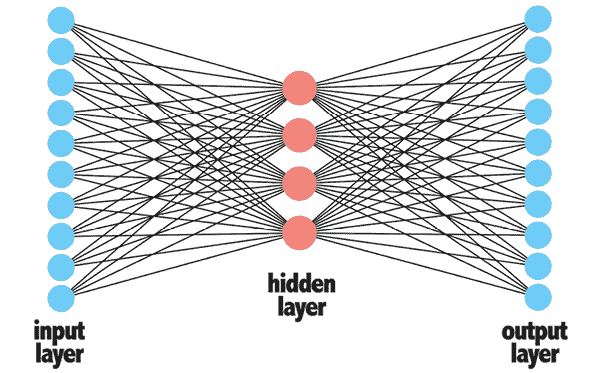

# 第十五章：利用大数据

尽管今天最令人激动的机器学习研究是在大数据领域——计算机视觉、自然语言处理、自动驾驶汽车等——但大多数商业应用规模较小，使用的数据最多只能称为“*中等*”数据。正如*第十二章*，*高级数据准备*中所述，真正的大数据工作需要访问数据集和计算设施，这些设施通常只有在非常大的科技公司或研究型大学才能找到。即便如此，使用这些资源的实际工作通常主要是数据工程的壮举，它在数据用于传统商业应用之前极大地简化了数据。

好消息是，大数据公司进行的引人注目的研究最终会逐渐渗透到更传统的机器学习任务中。本章涵盖了在 R 中使用这些大数据方法的多种方法。您将学习：

+   如何借鉴大数据公司开发的深度学习模型并将其应用于传统的建模任务

+   减少大型和非结构化大数据格式（如文本和图像）的复杂性的策略，以便它们可用于预测

+   访问和建模大数据集的尖端包和途径，这些数据集可能太大而无法装入内存

尽管 R 以其不适合大数据项目而闻名，但 R 社区的努力逐渐将其转变为一种能够处理大量高级任务的工具。本章的目标是展示 R 在深度学习和大数据时代保持相关性的能力。尽管 R 不太可能成为最大大数据项目的核心，并且尽管面临来自 Python 和基于云的工具的日益激烈的竞争，R 的优势仍然使其保持在许多实践数据科学家的桌面上。

# 深度学习的实际应用

深度学习最近因其成功解决传统方法难以解决的机器学习任务而受到广泛关注。使用复杂的神经网络教会计算机更像人类思考，使得机器在许多人类曾经占据压倒性优势的任务上能够赶上甚至超越人类的表现。也许更重要的是，即使人类在某些任务上仍然表现更好，机器学习的优势——工人从不疲倦、从不厌倦，且无需工资——甚至将不完美的自动机变成了许多任务的实用工具。

不幸的是，对于我们这些在大科技公司和研究机构外工作的人来说，利用深度学习方法并不总是那么容易。训练深度学习模型通常不仅需要最先进的计算硬件，还需要大量的训练数据。事实上，正如在第十二章 *《高级数据准备》* 中提到的，在商业环境中，大多数实际机器学习应用都是在所谓的少量或中等数据规模下进行的，而在这里，深度学习方法可能并不比传统的机器学习方法（如回归和决策树）表现得更好，甚至可能更差。因此，许多在深度学习上投入大量资金的组织，这样做更多的是因为炒作而非真正的需求。

尽管围绕深度学习的一些炒作无疑是基于其新颖性以及商业领袖对人工智能取代昂贵的人工工人的愿景所带来的兴奋，但实际上，这项技术有一些实际应用，可以与传统的机器学习方法结合使用，而不是作为替代品。因此，本章的目的不是提供一个从头到尾的构建深度神经网络的教程，而是展示如何将深度学习的成功融入传统的机器学习项目中，包括那些在大数据环境之外的项目。

Packt Publishing 提供了关于深度学习的众多资源，例如 M. Pawlus 和 R. Devine 所著的 *《使用 R 进行深度学习实战：设计、构建和改进神经网络模型的实际指南》（2020 年）*，B. Rai 所著的 *《使用 R 进行高级深度学习》（2019 年）*，以及 S. Gupta、R. A. Ansari 和 D. Sarkar 所著的 *《深度学习 R 烹饪书》（2020 年）*。

## 从深度学习开始

近年来，随着新一代在深度学习时代受过训练的数据科学实践者的出现，机器学习社区中形成了一种“代沟”。在深度学习发展之前，该领域主要由受过统计学或计算机科学培训的人士组成。特别是在最初几年，机器学习从业者带着他们先前领域的隐喻性负担，他们所使用的软件和算法沿着党派路线分成了阵营。统计学家通常更喜欢基于回归的技术和软件，如 R，而计算机科学家则更喜欢用 Python 和 Java 等语言编写的迭代和启发式算法，如决策树。深度学习模糊了这些阵营之间的界限，下一代数据科学家可能对前辈们显得有些陌生，就像他们说的是另一种语言。

虽然事后我们可以清楚地看到其起源，但这次分歧似乎是从无中来，正如著名作家欧内斯特·海明威曾经写的那样，“它逐渐发生，然后突然发生。” 正如机器学习本身只有在计算能力、统计方法和可用数据的同步演变下才成为可能一样，下一个大的进化飞跃从这三个相同组件的一系列较小进化中产生，这是有道理的。回忆一下*第一章*中提出的类似图像，*介绍机器学习*，一个修订后的进步周期图描绘了当今最先进的机器学习周期，它说明了深度学习发展的环境：


图 15.1：进步周期中的多种因素共同导致了深度学习的发展

深度学习起源于大数据时代，同时得到了必要的计算硬件——**图形处理单元**（**GPUs**）和基于云的并行处理工具——这些将在本章后面进行介绍，用于处理既长又宽的数据集，这并不令人惊讶。但更不明显的是，这种演变也离不开必要的学术和研究环境。如果没有一个强大的数据科学社区，其中研究人员在统计学和计算机科学方面都有专业知识，再加上那些致力于解决大型和复杂真实世界数据集上实际业务问题的应用数据科学家，深度学习可能就不会以这种方式出现。换句话说，数据科学现在作为一个专门的学术学科存在，无疑加速了进步周期。借用科幻小说中的类比，系统现在就像一个机器人，它学会了如何学习，因此现在它变得自我意识，并且学习得更快！

深度学习的快速发展导致了之前提到的代沟，但这并不是唯一因素。正如你很快就会学到的那样，深度学习不仅在大型数据任务上提供了令人印象深刻的性能，而且在较小任务上也能像传统学习方法一样执行。这导致一些人几乎完全专注于这项技术，就像早期机器学习实践者只专注于回归或决策树一样。深度学习还利用专门的软件工具和数学术语来执行这些任务，这意味着在某些情况下，其从业者实际上是在用另一种语言描述相同的步骤。正如以前多次说过的，“在机器学习领域没有免费的午餐”，因此在你继续机器学习之旅时，最好将其视为许多有用工具之一——而不是这项工作的*唯一*工具。

深度学习实践者使用的术语，即使是像线性回归这样的简单方法，也包括“代价函数”、“梯度下降”和“优化”等短语。这是一个很好的提醒，尽管深度学习可以近似回归和其他机器学习方法，但它找到解决方案的方式是完全不同的。

### 选择适合深度学习的任务

如同在*第七章*中提到的，*黑盒方法 – 神经网络和支持向量机*，至少包含一个隐藏层的神经网络可以作为通用函数逼近器。对此原理进行阐述，我们可能会说，在给定足够多的训练数据的情况下，一个设计巧妙的神经网络可以学会模仿任何其他函数的输出。

这意味着本书中涵盖的传统学习方法同样可以被设计良好的神经网络所近似。事实上，设计一个几乎完全匹配线性或逻辑回归的神经网络是非常简单的，通过更多的工作，也有可能近似 k-最近邻和朴素贝叶斯等技术。在数据足够的情况下，神经网络可以越来越接近甚至最好的基于树的算法，如随机森林或梯度提升机。

那为什么不将深度学习应用于每一个问题呢？确实，神经网络模仿所有其他学习方法的特性似乎违反了“没有免费午餐”定理，这个定理简单来说就是指出没有一种机器学习算法可以在所有潜在的建模任务中表现最佳。有几个关键原因使得这个定理在深度学习的魔力下依然安全。首先，神经网络逼近函数的能力与其拥有的训练数据量相关。在小数据规模下，传统技术可以表现得更好，尤其是在与仔细的特征工程相结合时。其次，为了减少神经网络训练所需的数据量，网络必须具有便于学习潜在函数的拓扑结构。当然，如果构建模型的人知道应该使用哪种拓扑结构，那么最初使用更简单的传统模型可能更可取。

使用深度学习进行传统学习任务的人们可能会倾向于选择黑盒方法，这种方法在大数据环境中效果显著。然而，大数据并不仅仅是数据行数的增加，还包括许多特征。大多数传统学习任务，包括那些拥有数百万行数据的情况，都处于中等数据规模，在这种规模下，传统学习算法仍然表现良好。在这种情况下，神经网络是否表现更好最终将取决于过拟合和欠拟合之间的平衡——这种平衡有时在神经网络中是难以找到的，因为该方法容易对训练数据进行过拟合。

可能正因为如此，深度学习不适合在机器学习竞赛中取得胜利。如果你问一个 Kaggle 大师，他们可能会告诉你神经网络在标准、现实生活中的问题以及传统监督学习任务上不起作用，梯度提升法才是赢家。人们也可以通过浏览排行榜并注意深度学习的缺席来证明这一点。也许一个聪明的团队会使用神经网络进行特征工程，并将深度学习模型与其他模型结合成集成模型以提高性能，但这种做法很少见。深度学习的优势在于其他方面。一般来说，基于树的集成方法在结构化、表格数据上获胜，而神经网络在图像、声音和文本等非结构化数据上获胜。

阅读关于研究突破和技术初创公司的最新新闻，可能会遇到利用该方法独特能力解决非常规任务的深度学习应用。一般来说，这些非常规学习任务可以分为三类：计算机视觉、自然语言处理或涉及时间重复测量或具有异常大量相互关联预测因子的不寻常数据格式。以下表格列出了每个类别的具体成功案例：

| **具有挑战性的机器学习任务** | **深度学习成功案例** |
| --- | --- |
| 涉及对静止图片或视频数据中图像进行分类的计算机视觉任务 |

+   在安全摄像头录像中识别人脸

+   对植物或动物进行分类以进行生态监测

+   诊断 X 射线、MRI 或 CT 扫描等医疗图像

+   测量运动员在运动场上的活动

+   自动驾驶

|

| 需要理解上下文中词语含义的自然语言应用 |
| --- |

+   处理社交媒体帖子以过滤掉假新闻或仇恨言论

+   监测 Twitter 或客户支持电子邮件以了解消费者情绪或其他市场洞察

+   检查处于不良结果风险中的患者或符合新治疗方案资格的患者的电子健康记录

|  |  |

| 涉及许多重复测量或大量预测因子的预测分析 |
| --- |

+   预测公开市场上商品或股票的价格

+   估算能源、资源或医疗保健利用

+   使用保险账单代码预测生存或其他医疗结果

|

尽管有些人确实使用深度学习来解决传统学习问题，但本章仅关注无法通过传统建模技术解决的问题。深度学习非常擅长挖掘大数据时代特征的数据类型，如图像和文本，这些数据类型用传统方法难以建模。

要解锁这些功能，需要使用专门的软件和专门的数据结构，这些内容你将在下一节中学习。

### TensorFlow 和 Keras 深度学习框架

或许没有哪个软件工具像 **TensorFlow** ([`www.tensorflow.org`](https://www.tensorflow.org)) 这样对深度学习的快速发展做出了如此大的贡献，TensorFlow 是一个开源的数学库，由谷歌开发，用于高级机器学习。TensorFlow 提供了一个使用有向图进行数据结构“流动”的数学运算序列的计算接口。

Packt Publishing 提供了许多关于 TensorFlow 的书籍。要搜索当前提供的书籍，请访问 [`subscription.packtpub.com/search?query=tensorflow`](https://subscription.packtpub.com/search?query=tensorflow)。

TensorFlow 的基本数据结构不出所料地被称为 **张量**，它是一个零个或多个维度的数组。在 0-D 和 1-D 张量（分别代表单个值和值序列）的基础上构建，增加额外的维度允许表示更复杂的数据结构。请注意，因为我们通常分析结构集，第一个维度通常保留以允许堆叠多个对象；第一个维度因此指的是每个结构的批次或样本编号。例如：

+   一组一维张量，收集一组人的特征值，是一个二维张量，类似于 R 中的数据框：`[person_id, feature_values]`

+   对于随时间重复测量的情况，二维张量可以堆叠成三维张量：`[person_id, time_sequence, feature values]`

+   2-D 图像由一个 4-D 张量表示，第四维存储 2-D 网格中每个像素的颜色值：`[image_id, row, column, color_values]`

+   视频或动画图像以 5 维表示，并增加一个时间维度：`[image_id, time_sequence, row, column, color_values]`

大多数张量是完全填充数字数据的矩形矩阵，但还有更复杂的结构，如稀疏张量和稀疏张量，可用于文本数据。

要深入了解 TensorFlow 的张量对象，文档可在 [`www.tensorflow.org/guide/tensor`](https://www.tensorflow.org/guide/tensor) 查找。

TensorFlow 的图，更具体地可以称为 **数据流图**，使用由称为边的方向箭头连接的节点来表示数据结构之间的依赖关系，这些数据结构上的数学运算以及输出。节点代表数学运算，边代表在运算之间流动的张量。该图有助于并行化工作，因为它清楚地表明哪些步骤必须按顺序完成，哪些步骤可以同时完成。

如果需要，可以可视化数据流图，它会产生类似于*图 15.2*中描述的理想化图。尽管这是一个高度简化的表示，现实世界的 TensorFlow 图通常要复杂得多，但此图表明，在完成第一个操作后，第二个和第四个操作可以并行开始：


图 15.2：TensorFlow 图的简化表示

当张量在图中流动时，它们会被节点表示的操作序列所转换。步骤由构建图表的人定义，每个步骤都使目标更接近完成某种数学任务。流程图中的某些步骤可能对数据进行简单的数学转换，如归一化、平滑或分桶；其他步骤可能通过迭代重复训练模型，同时监控一个**损失函数**，该函数衡量模型预测与真实值之间的拟合度。

R 接口的 TensorFlow 是由 RStudio 团队开发的。`tensorflow`包提供了对核心 API 的访问，而`tfestimators`包提供了对高级机器学习功能的访问。请注意，TensorFlow 的定向图方法可以用来实现许多不同的机器学习模型，包括本书中讨论的一些模型。然而，要这样做需要彻底理解定义每个模型的矩阵数学，因此超出了本文的范围。有关这些包和 RStudio 与 TensorFlow 接口能力的更多信息，请访问[`tensorflow.rstudio.com`](https://tensorflow.rstudio.com)。

由于 TensorFlow 严重依赖于必须由手编程的复杂数学运算，因此开发了**Keras**库([`keras.io`](https://keras.io))，以提供对 TensorFlow 的高级接口，并允许更轻松地构建深度神经网络。Keras 是用 Python 开发的，通常与 TensorFlow 配对作为后端计算引擎。使用 Keras，只需几行代码就可以进行深度学习——即使是像图像分类这样的挑战性应用，你将在本章后面的示例中看到。

Packt Publishing 提供了许多书籍和视频来学习 Keras。要搜索当前提供的内容，请访问[`subscription.packtpub.com/search?query=keras`](https://subscription.packtpub.com/search?query=keras)。

由 RStudio 创始人 J. J. Allaire 开发的`keras`包允许 R 与 Keras 接口。尽管使用此包所需的代码非常少，但要从头开始开发有用的深度学习模型，需要广泛了解神经网络以及熟悉 TensorFlow 和 Keras API。因此，教程超出了本书的范围。相反，请参阅 RStudio TensorFlow 文档或由 Keras 和`keras`包的创造者 Francois Chollet 和 J. J. Allaire 合著的书籍《深度学习与 R》（2018 年），这是开始学习这个工具的绝佳起点。

尽管 Keras 和 TensorFlow 的组合可能是最受欢迎的深度学习工具包，但这并不是唯一的工具。Facebook 开发的**PyTorch**框架迅速获得了人气，尤其是在学术研究社区中，作为一个易于使用的替代品。更多信息，请参阅[`pytorch.org`](https://pytorch.org)。

TensorFlow 使用简单的图抽象来表示复杂数学函数的创新理念，结合 Keras 框架使其更容易指定网络拓扑，这已经使得构建更深更复杂的神经网络成为可能，如下一节所述。Keras 甚至使得仅用几行代码就能轻松地将预构建的神经网络适应新任务。

## 理解卷积神经网络

神经网络已经被研究超过 60 年，尽管深度学习最近才变得普遍，但深度神经网络的概念已经存在了几十年。正如在*第七章*，*黑盒方法 – 神经网络和支持向量机*中首次介绍的那样，**深度神经网络**（**DNN**）只是一个具有多个隐藏层的神经网络。

这低估了深度学习在实践中是什么，因为典型的 DNN 比我们之前构建的神经网络类型要复杂得多。仅仅在新的隐藏层中添加几个额外的节点并称之为“深度学习”是不够的。相反，典型的 DNN 使用极其复杂但故意设计的拓扑结构来促进在大数据上的学习，并且在这个过程中能够在具有挑战性的学习任务上实现类似人类的性能。

深度学习的一个转折点出现在 2012 年，当时一个名为 SuperVision 的团队使用深度学习赢得了 ImageNet 大规模视觉识别挑战赛。这项年度竞赛测试了分类 100 万张手标注图像的能力，这些图像分布在 10,000 个物体类别中。在竞赛的早期年份，人类在视觉分类方面远远优于计算机，但 SuperVision 模型的性能显著缩小了差距。如今，计算机在视觉分类方面几乎与人类一样好，在某些特定情况下甚至更好。人类在识别小、细或变形物品方面往往更擅长，而计算机在区分特定类型的物品，如狗的品种方面具有更大的能力。不久的将来，计算机很可能在两种视觉任务类型上都优于人类。

一种专门为图像识别设计的创新网络拓扑结构，是性能激增的原因。**卷积神经网络**（**CNN**）是一种用于视觉任务的深度前馈网络，它独立地学习重要的区分图像特征，而不是在事先需要这样的特征工程。例如，为了对“停止”或“让行”等路标进行分类，传统的学习算法需要预先设计好的特征，如标志的形状和颜色。相比之下，CNN 只需要每个图像像素的原始数据，网络将自行学习如何区分形状和颜色等重要特征。

由于使用原始图像数据时维度的大幅增加，这些特征的提取成为可能。传统的学习算法会为每张图像使用一行，形式如（*停止标志*，*红色，八边形*），而 CNN 使用的数据形式为（*停止标志*，*x*，*y*，*颜色*），其中*x*和*y*是像素坐标，*颜色*是给定像素的颜色数据。这看起来只是维度增加了一个，但请注意，即使是非常小的图像也由许多(*x*，*y*)组合构成，颜色通常指定为 RGB（*红色*，*绿色*，*蓝色*）值的组合。这意味着单个训练数据行的更准确表示将是：

（*停止标志*，*x*[1]*y*[1]*r*，*x*[1]*x*[1]*g*，*x*[1]*y*[1]*b*，*x*[2]*y*[1]*r*，*x*[2]*y*[1]*g*，*x*[2]*y*[1]*b*，……，*x*[n]*y*[n]*r*，*x*[n]*x*[n]*g*，*x*[n]*y*[n]*b*）

每个预测因子都指的是在指定的(*x*，*y*)组合中红色、绿色或蓝色的程度，以及*r*、*g*或*b*值。因此，维度大大增加，随着图像变大，数据集也变得更大。

一个 100x100 像素的小图像将有*100x100x3 = 30,000*个预测因子。即使这样，与 2012 年赢得视觉识别挑战赛的 SuperVision 团队使用的超过 6000 万个参数相比，这仍然很小！

*第十二章*，*高级数据准备*指出，如果一个模型过度参数化，它将达到一个插值阈值，此时有足够的参数来记忆并完美地分类所有训练样本。包含 1000 万张图片的 ImageNet 挑战数据集比获胜团队使用的 6000 万个参数要小得多。直观上看，这是有道理的；假设数据库中没有完全相同的图片，至少每个图像的一个像素会有所不同。因此，算法可以简单地记忆每一张图片以实现训练数据的完美分类。问题是模型将在未见过的数据集上评估，因此对训练数据的严重过拟合将导致巨大的泛化误差。

CNN 的拓扑结构阻止了这种情况的发生。我们不会深入探讨 CNN 的黑盒，但我们将它理解为一组以下类别的层：

+   **卷积层**在网络中放置得较早，通常构成了网络中最计算密集的步骤，因为它们是唯一直接处理原始图像数据的层；我们可以将卷积理解为将原始数据通过一个过滤器，创建一组代表整个区域的小型重叠部分的瓦片

+   **池化层**，也称为**下采样**或**子采样**层，从一层中的一簇神经元中收集输出信号，并将它们总结为下一层的单个神经元，通常是通过取被总结的信号中的最大值或平均值来实现

+   **全连接层**与传统的多层感知器中的层非常相似，通常在 CNN 的末尾用于构建预测模型

网络中的卷积层和池化层服务于识别要学习的图像的重要特征以及在使用进行预测的全连接层之前降低数据集的维度的相关目的。换句话说，网络的早期阶段执行特征工程，而后期阶段使用构建的特征进行预测。

为了更好地理解 CNN 中的层，请参阅 Adam W. Harley 在[`adamharley.com/nn_vis/`](https://adamharley.com/nn_vis/)上发表的《卷积神经网络的交互式节点-链接可视化》*。该交互式工具让您从零到九画一个数字，然后使用神经网络对其进行分类。二维和三维卷积网络可视化清楚地显示了您所画的数字是如何通过卷积、下采样和全连接层，最终到达输出层进行预测的。用于通用图像分类的神经网络以类似的方式工作，但使用的是一个更大、更复杂的网络。

### 迁移学习和微调

从头开始构建 CNN 需要大量的数据、专业知识和计算能力。幸运的是，许多拥有数据和计算资源的大型组织已经构建了图像、文本和音频分类模型，并将它们与数据科学社区共享。通过**迁移学习**的过程，深度学习模型可以从一个上下文适应到另一个上下文。不仅可以将保存的模型应用于与训练时相似类型的问题，而且它也可能对原始领域之外的问题有用。例如，一个在卫星照片中训练以识别濒危象种的神经网络，也可能有助于识别在战区上空拍摄的红外无人机图像中坦克的位置。

如果知识不能直接迁移到新任务，可以通过**微调**过程使用额外的训练来磨练预训练的神经网络。从一个一般性的模型开始训练，例如一个可以识别 10,000 类对象的通用图像分类模型，并将其微调以擅长识别单一类型的对象，这不仅减少了所需的训练数据和计算能力，还可能比仅在单一类图像上训练的模型提供更好的泛化能力。

Keras 可以通过下载带有预训练权重的神经网络来进行迁移学习和微调。可用的预训练模型列表可在[`keras.io/api/applications/`](https://keras.io/api/applications/)找到，一个将图像处理模型微调以更好地预测猫和狗的示例可在[`tensorflow.rstudio.com/guides/keras/transfer_learning`](https://tensorflow.rstudio.com/guides/keras/transfer_learning)找到。在下一节中，我们将应用一个预训练的图像模型到现实世界的图像上。

### 示例 - 使用预训练的 CNN 在 R 中分类图像

R 可能不是处理最重深度学习任务的正确工具，但有了合适的包集，我们可以将预训练的 CNN 应用于执行图像识别等任务，这些任务传统机器学习算法难以解决。R 代码生成的预测可以直接用于图像识别任务，如过滤不雅的资料照片、确定图像是否描绘了猫或狗，甚至识别简单自动驾驶车辆内的停车标志。也许更常见的是，这些预测可以用作包含使用表格结构数据的传统机器学习模型以及消耗非结构化图像数据的深度学习神经网络的集成模型的预测因子。你可能还记得，*第十四章*，*构建更好的学习者*，描述了一种潜在的堆叠集成，它以这种方式结合了图像、文本和传统机器学习模型，以预测 Twitter 用户未来行为的元素。以下图片展示了假设的 Twitter 个人资料图片，我们将使用深度神经网络对其进行分类：


图 15.3：可以在 R 中使用预训练的神经网络识别这类图像

首先，在使用预训练模型之前，考虑用于训练神经网络的训练数据集非常重要。大多数公开可用的图像网络都是在包含各种日常物体和动物（如汽车、狗、房屋、各种工具等）的巨大图像数据库上训练的。如果目标是区分日常物体，这是合适的，但对于更具体的工作可能需要更具体的训练数据集。例如，面部识别工具或识别停车标志的算法可能需要在面部和道路标志的数据集上分别进行更有效的训练。通过迁移学习，可以将训练于各种图像的深度神经网络微调以更好地完成更具体的工作——例如，它可能非常擅长识别猫的图片——但很难想象一个在面部或道路标志上训练的网络，即使经过额外的调整，也能非常擅长识别猫！

在这个练习中，我们将使用名为**ResNet-50**的 CNN 对我们的小图像集进行分类，这是一个在大量和综合的标记图像上训练的 50 层深度网络。这个模型由一组研究人员在 2015 年作为最先进的、获奖的计算机视觉算法引入，尽管后来被更复杂的方法所超越，但由于其易用性和与 R 和 Keras 等工具的集成，它仍然非常受欢迎和有效。

关于 ResNet-50 的更多信息，请参阅*《深度残差学习用于图像识别》，He, K.，Zhang, X.，Ren, S.，和 Sun, J.，2015 年* [`arxiv.org/abs/1512.03385v1`](https://arxiv.org/abs/1512.03385v1)。

用于训练 ResNet-50 模型的 **ImageNet 数据库** ([`www.image-net.org`](https://www.image-net.org)) 与用于 ImageNet 视觉识别挑战的数据库相同，自 2010 年推出以来对计算机视觉做出了巨大贡献。它由超过 1400 万张手工标注的图像组成，消耗了数 GB 的存储空间（在完整、学术版本的情况下甚至达到 TB 级别），幸运的是，我们无需下载此资源从头开始训练模型。相反，我们只需下载研究人员在完整数据库上训练的 ResNet-50 模型的神经网络权重，从而节省了大量计算开销。

要开始这个过程，我们需要将 `tensorflow` 和 `keras` 包添加到 R 中，以及各种依赖项。大多数这些步骤只需执行一次。`devtools` 包为开发 R 包和使用处于开发中的包添加了工具，因此我们将像往常一样安装并加载这个包：

```py
> install.packages("devtools")
> library(devtools) 
```

接下来，我们将使用 `devtools` 包从 GitHub 获取 `tensorflow` 包的最新版本。通常，我们从 CRAN 安装包，但对于处于开发中的包，直接从最新源代码安装可能更好。从其 GitHub 路径安装 `tensorflow` 包的命令是：

```py
> devtools::install_github("rstudio/tensorflow") 
```

这将 R 指向 RStudio 的 GitHub 账户，该账户存储了包的源代码。要在线阅读文档并查看代码，请在网络浏览器中访问 [`github.com/rstudio/tensorflow`](https://github.com/rstudio/tensorflow)。

安装 `tensorflow` 包后，有几个依赖项是开始使用 TensorFlow 在 R 中所必需的。特别是，`tensorflow` 包仅仅是 R 和 TensorFlow 之间的接口，因此我们必须首先安装 TensorFlow 本身。也许有些讽刺，Python 及其一些包是完成此任务所必需的。因此，我们使用 R 的 `reticulate` 包 ([`rstudio.github.io/reticulate/`](https://rstudio.github.io/reticulate/)) 来管理 R 和 Python 之间的接口。尽管这听起来很令人困惑，但完整的安装过程是由 `tensorflow` 包的单个命令驱动的，如下所示：

```py
> library(tensorflow)
> install_tensorflow() 
```

当命令运行时，你应该看到 R 正在安装大量 Python 工具和包。如果一切顺利，你可以继续从 GitHub 安装 Keras 包：

```py
> devtools::install_github("rstudio/keras") 
```

如果出现问题，请记住，尽管此示例的代码已在多个平台和 R 版本上进行了测试，但在 R 与 Python 和 TensorFlow 交互所需的众多依赖项中，出现问题的可能性相当大。不要害怕在网络上搜索特定的错误消息，或者检查 Packt Publishing 的 GitHub 仓库以获取本章更新的 R 代码。

在安装了必要的包之后，Keras 可以帮助加载在 ImageNet 数据库上训练的 ResNet-50 模型：

```py
> library(keras)
> model <- application_resnet50(weights = 'imagenet') 
```

我们在数百万张日常图像上训练的 50 层深度图像分类模型现在可以开始做出预测了；然而，我们加载模型时的轻松程度掩盖了即将到来的工作。

使用预训练模型的一个更大挑战是将我们希望分类的无结构图像数据转换成它在训练期间看到的相同结构格式。ResNet-50 使用了 224x224 像素的方形图像，每个像素反映由三个通道组成的颜色，红色、绿色和蓝色，每个通道都有 255 个亮度级别。我们希望分类的所有图像都必须使用这种表示从其原始格式（如 PNG、GIF 或 JPEG）转换为 3-D 张量。我们将通过之前描述的`cat.jpg`、`ice_cream.jpg`和`pizza.jpg`文件来实际看到这一点，这些文件位于本章 R 代码文件夹中，但这个过程对任何图像都是类似的。

`keras`包中的`image_load()`函数将启动这个过程。只需提供文件名和所需的目标尺寸，如下所示：

```py
> img <- image_load("ice_cream.jpg", target_size = c(224,224)) 
```

这将创建一个图像对象，但我们还需要一个额外的命令将其转换为 3-D 张量：

```py
> x <- image_to_array(img) 
```

为了证明这一点，我们可以检查对象的大小和结构，如下所示。正如预期的那样，对象是一个数值矩阵，其维度为*224* x *224* x *3*：

```py
> dim(x) 
```

```py
[1] 224 224   3 
```

矩阵中的前几个值都是 255，这并没有什么意义：

```py
> str(x) 
```

```py
 num [1:224, 1:224, 1:3] 255 255 255 255 255 255 255 255 255 255 ... 
```

让我们进行一些调查，以便更好地理解这些数据结构。由于 R 的行列矩阵格式，矩阵坐标是(*y*, *x*)，其中(*1*, *1*)代表图像的左上角像素，(*1*, *224*)代表右上角像素。为了说明这一点，让我们获取冰淇淋图像中几个像素的三个颜色通道：

```py
> x[1, 224, 1:3] 
```

```py
[1] 253 253 255 
```

```py
> x[40, 145, 1:3] 
```

```py
[1] 149  23  34 
```

像素(*1*, *224*)的颜色为(*r*, *g*, *b*)，颜色值为(*253*, *253*, *255*)，这几乎是最亮的白色，而像素(*40*, *145*)的颜色值为(*149*, *23*, *34*)，翻译成深红色——冰淇淋中的一块草莓。这些坐标在以下图中进行了说明：


图 15.4：冰淇淋的图片已经从 1,000x1,000 像素的矩阵减少到 224x224；图像中的每个像素都有三个颜色通道

另一个额外的复杂性是，ResNet-50 模型期望一个四维张量，其中第四维代表批次。由于只有一个图像需要分类，我们不需要这个参数，因此我们将简单地将其分配一个常数值 1，以创建一个`1x224x224x3`的矩阵。命令`c(1, dim(x))`以这种格式定义新的矩阵，然后`array_reshape()`函数使用 TensorFlow 使用的 Python 风格行行顺序而不是 R 风格的列列填充，将`x`的内容填充到这个矩阵中。完整的命令如下：

```py
> x <- array_reshape(x, c(1, dim(x))) 
```

为了确认`x`具有正确的维度，我们可以使用`dim()`命令：

```py
> dim(x) 
```

```py
[1]   1 224 224   3 
```

最后，我们运行`imagenet_preprocess_input()`函数来将颜色值归一化，以匹配 ImageNet 数据库：

```py
> x <- imagenet_preprocess_input(x) 
```

这种转换的主要功能是将每个颜色相对于数据库进行零中心化，基本上是将每个颜色值视为大于或小于 ImageNet 图像中该颜色的平均值。例如，在冰淇淋中，位于(`40`, `145`)的红色像素在之前具有 149、23 和 34 的颜色值；现在，它具有非常不同的值：

```py
> x[1, 40, 145, 1:3] 
```

```py
[1] -69.939 -93.779  25.320 
```

负值表示该颜色的颜色级别低于 ImageNet 的平均值，而正值表示更高。预处理步骤还将红绿蓝格式反转为蓝绿红，因此只有红色通道高于 ImageNet 的平均水平，这并不令人特别惊讶，因为草莓非常红！

现在，让我们看看 ResNet-50 网络认为图像中描绘了什么。我们将首先在模型对象和图像矩阵上使用`predict()`函数，然后使用`keras`函数`imagenet_decode_predictions()`将网络的预测概率转换为基于文本的标签，这些标签将分类 ImageNet 中的每个图像。由于 ImageNet 数据库中有 1,000 种图像类别，`preds`对象包含 1,000 个预测概率——每个可能性一个。解码函数允许我们将输出限制为最可能的前*N*个可能性——在这个例子中是十个：

```py
> p_resnet50 <- predict(m_resnet50, x)
> c_resnet50 <- imagenet_decode_predictions(p_resnet50, top = 10) 
```

`c_resnet50`对象是一个列表，其中包含我们单个图像的前十个预测。要查看预测结果，我们只需输入列表的名称，就可以发现网络正确地将图像识别为冰淇淋，概率约为 99.6%：

```py
> c_resnet50 
```

```py
[[1]]
   class_name class_description         score
1   n07614500         ice_cream 0.99612110853
2   n07836838   chocolate_sauce 0.00257453066
3   n07613480            trifle 0.00017260048
4   n07932039            eggnog 0.00011857488
5   n07930864               cup 0.00011558698
6   n07745940        strawberry 0.00010969469
7   n15075141     toilet_tissue 0.00006556125
8   n03314780       face_powder 0.00005355201
9   n03482405            hamper 0.00004582879
10  n04423845           thimble 0.00004054611 
```

尽管其他潜在分类的预测概率并没有远大于零，但一些其他顶级预测还是有点道理；不难理解为什么它们被视为可能性。例如，蛋酒属于正确的食物类别，而冰淇淋锥可能看起来有点像杯子，或者像顶针。

模型甚至将草莓列为第六个最有可能的选项，这是正确的冰淇淋口味。

作为练习，我们将对另外两张图片执行相同的过程。以下步骤序列使用`lapply()`函数将图像处理步骤应用于图像对，每次创建一个新的列表以供后续函数使用。最后一步将包含两个准备好的图像数组的列表提供给`lapply()`函数，该函数对每个图像应用`predict()`命令：

```py
> img_list <- list("cat.jpg", "pizza.jpg")
> img_data <- lapply(img_list, image_load, target_size = c(224,224))
> img_arrs <- lapply(img_data, image_to_array)
> img_resh <- lapply(img_arrs, array_reshape, c(1, 224, 224, 3))
> img_prep <- lapply(img_resh, imagenet_preprocess_input)
> img_prob <- lapply(img_prep, predict, object = m_resnet50) 
```

最后，使用`sapply()`函数将解码函数应用于两个预测集的每个集合，同时简化结果。`lapply()`函数在这里也可以工作，但由于`imagenet_decode_predictions()`返回一个列表，结果是列表中的一个长度为 1 的子列表；`sapply()`识别出这是多余的，并且将消除额外的层次结构：

```py
> img_classes <- sapply(img_prob, imagenet_decode_predictions,
                        top = 3) 
```

输入结果的名称将显示两张图像各自的前三个预测：

```py
> img_classes 
```

```py
[[1]]
  class_name class_description      score
1  n02123045             tabby 0.63457680
2  n02124075      Egyptian_cat 0.08966244
3  n02123159         tiger_cat 0.06287414
[[2]]
  class_name class_description        score
1  n07873807             pizza 0.9890466332
2  n07684084       French_loaf 0.0083064679
3  n07747607            orange 0.0002433858 
```

ResNet-50 算法不仅正确地分类了图像；它还正确地将猫图片识别为虎斑猫。这证明了神经网络在某些任务上超越人类特定性的能力；许多人或大多数人可能只是将图像标记为猫，而计算机可以确定猫的具体类型。另一方面，人类在识别非最佳条件下的物体方面仍然更胜一筹。例如，在黑暗中或杂草中隐藏的猫对计算机来说可能比对人更具挑战性。尽管如此，计算机不知疲倦的能力使其在自动化人工智能任务方面具有巨大的优势。如前所述，应用于大型数据集，如 Twitter 个人资料图片，此类计算机视觉模型的预测可以用于预测无数不同用户行为的集成模型。

# 无监督学习和大数据

前一节说明了如何使用深度神经网络将无限供应的输入图像分类为日常生物或物体的实例。从另一个角度来看，这也可能被理解为一种机器学习任务，它将图像像素数据的高度维输入降低到一组低维度的图像标签。然而，值得注意的是，深度学习神经网络是一种监督学习技术，这意味着机器只能学习人类告诉它学习的内容——换句话说，它只能从已经被标记的内容中学习。

本节的目的在于介绍在大数据背景下无监督学习技术的有用应用。这些应用在很多方面与第九章中介绍的技术相似，即*寻找数据组 - 使用 k-means 进行聚类*。然而，在先前无监督学习技术中，人类在解释结果方面承担了很大的责任，而在大数据的背景下，机器可以比以前更进一步，提供对数据及其发现算法连接的更深、更丰富的理解。

用实际的话来说，想象一个深度神经网络，它可以学会识别猫，而从未被告知猫是什么。当然，如果没有事先给出标签，计算机可能不会明确地将它标记为“猫”本身，但它可能理解猫与图片中出现的其他事物之间存在某些一致的关系：人、猫砂盆、老鼠、一团毛线——但很少或从不包括狗！这样的关联有助于形成对猫的概念，认为它与人类、猫砂盆和毛线密切相关，但可能与另一种有四条腿和尾巴的东西相对立。如果有足够的图片，神经网络最终可能会通过识别猫粮袋附近的猫或互联网上无数的以猫为主题的梗，将对其印象与英语单词“猫”联系起来！

开发这样一个复杂的猫的模型需要比大多数机器学习从业者所能获取的数据和计算能力更多，但当然有可能开发更简单的模型，或者借鉴那些确实能获取这些资源的大数据公司。这些技术提供了另一种将非结构化数据源纳入更传统学习任务的方法，因为机器可以将大数据的复杂性降低到更易于消化的程度。

## 将高维概念表示为嵌入

我们在日常生活中遇到的事物可以用无数个属性来描述。此外，不仅存在无数可以用来描述每个对象的数据点，而且人类主观性的本质使得任何两个人都不太可能以相同的方式描述一个对象。例如，如果你问一些人描述典型的恐怖电影，一个人可能会想象血腥和血腥的砍杀电影，另一个人可能会想到僵尸或吸血鬼电影，还有一个人可能会想到阴森的鬼故事和闹鬼的房子。这些描述可以用以下陈述来表示：

+   *恐怖* = *杀手* + *血液* + *血腥*

+   *恐怖* = *诡异* + *僵尸* + *吸血鬼*

+   *恐怖* = *阴森* + *鬼魂* + *闹鬼*

如果我们将这些定义编程到计算机中，它就可以相互替换任何关于恐怖的表示，从而使用更广泛的“恐怖”概念，而不是像“血腥”、“诡异”或“阴森”这样的更具体特征来进行预测。例如，一个学习算法可能会发现，任何写有这些恐怖相关术语的社交媒体用户更有可能点击观看新片 *Scream* 的广告。

不幸的是，如果用户发布“我简直喜欢一部好恐怖的电影！”或“万圣节季节是我一年中最喜欢的时光！”这样的帖子，算法将无法将文本与先前的恐怖概念联系起来，因此将无法意识到应该显示恐怖电影的广告。这同样适用于计算机之前未曾直接看到的数百个与恐怖相关的关键词，包括许多对人类观察者来说显然的关键词，如女巫、恶魔、墓地、蜘蛛、骷髅等等。所需要的，是一种将恐怖概念推广到几乎无限的描述方式的方法。

**嵌入**是一个数学概念，指的是使用更少的维度来表示高维向量的能力；在机器学习中，嵌入是有意构建的，使得在高维空间中相关联的维度在低维空间中位置更接近。

如果嵌入构建得当，低维空间将保留高维的语义或意义，同时成为一个更紧凑的表示，可用于分类任务。创建嵌入的核心挑战是建模高度维度的非结构化或半结构化数据集中嵌入的语义意义，这是一个无监督学习任务。

人类在构建概念的低维表示方面非常擅长，因为我们总是在为粗略上相似但在细节上可能有所不同的对象或现象分配标签时直觉地这样做。当我们给电影贴上喜剧、科幻或恐怖的标签时；当我们谈论像嘻哈、流行或摇滚这样的音乐类别时；或者当我们创建食物、动物或疾病的分类法时，我们就是这样做的。在 *第九章*，*寻找数据组 - 使用 k-means 进行聚类* 中，我们看到了机器学习过程中的聚类如何通过“无监督分类”的过程模仿人类标签化过程，通过将不同但相似的项目分组。然而，尽管这种方法减少了数据集的维度，但在它能够将类似的项目关联起来之前，它需要一个具有每个示例相同特定特征的具有结构的数据集。对于像电影文本描述这样的非结构化事物，特征太多且稀疏，无法进行聚类。

反之，如果我们想模仿人类通过联想学习的能力呢？具体来说，人类可以观看一系列电影，并将类似的电影进行分类，而不需要为每部电影提供具体的可测量特征；我们可以将一组电影归类为恐怖片，而无需看到相同的陈词滥调的故事情节或计算每部电影引发的尖叫次数。诀窍在于人类不需要“恐怖”的明确定义，因为我们将其作为一个相对于集合中其他元素的概念来直观地理解。就像一只猫突然跳入画面可以在喜剧电影中用作滑稽幽默，或者与悬疑音乐搭配来引发惊吓一样，恐怖的语义含义总是由其上下文决定的。

同样地，学习算法可以通过上下文来构建嵌入。好莱坞制作的成千上万部电影都可以相对于其他电影来理解，而且无需研究电影《万圣节》和《活死人之夜》有哪些共同特征，算法可以观察到它们出现在相似上下文中，并且在不同的上下文中可以相互替代。这种可替代性的概念是大多数嵌入算法的基础，并且确实被用来构建用于电影推荐算法和其他领域的嵌入。在下一节中，我们将看到一种流行的语言嵌入算法是如何使用可替代性来发现词语的语义含义的。

### 理解词嵌入

如果英语中大约有一百万个单词，那么基于语言模型的特征空间在考虑短语和词序之前就已经有大约一百万维！这显然对于大多数传统学习算法来说太大且稀疏，以至于无法找到有意义的信号。正如在第四章“概率学习——使用朴素贝叶斯进行分类”中描述的，词袋方法在足够的计算能力下可能可行，但它也需要大量的训练数据来将单词与期望的结果关联起来。那么，如果我们能够使用在大数据上预训练的语言嵌入会怎样呢？

为了说明这种替代方法的优点，让我们设想一个机器学习任务：决定是否向在社交媒体网站上发帖的用户展示午餐咖啡馆的广告。考虑以下由假设用户发表的帖子：

+   我在早上吃了培根和鸡蛋，这是一天中最重要的餐食！

+   我下午要去健身房之前，打算快速吃个三明治。

+   谁能为我今晚的约会推荐一些餐厅？

对于朴素贝叶斯方法，我们首先需要许多这类句子，但由于该算法是一个监督学习器，我们还需要一个目标特征，用来指示撰写句子的用户是否对从咖啡馆购买午餐感兴趣。然后我们可以训练模型来识别哪些单词可以预测购买午餐。

与此相比，一个阅读这些句子的人类可以很容易地猜测出三位用户中哪一位最有可能对今天购买午餐感兴趣。人类的猜测并不是基于专门训练来预测午餐购买行为，而是基于对每个句子中单词嵌入意义的理解。换句话说，因为人类理解了用户单词的意义，所以我们不需要猜测他们的行为，我们只需倾听他们告诉我们他们计划做什么。

最有效的语言模型不仅仅是查看单词的意义；它们还会考虑单词与其他单词之间的关系。语法和句式的使用可以完全改变句子的含义。例如，“我今天跳过了早餐，所以午餐可以大吃一顿”这句话与“我今天早餐大吃一顿，所以今天需要跳过午餐”这句话虽然几乎包含完全相同的单词，但意义却大相径庭！

现在先不考虑这种结构是如何构建的，假设我们有一个非常简单的语言嵌入，它可以在两个维度上捕捉所有英语单词的意义：一个“午餐”维度，用来衡量一个术语与午餐的相关性，以及一个“食物”维度，用来表示一个术语是否与食物相关。在这个模型中，曾经由独特的、具体的术语如“汤”和“沙拉”传达的语义意义，现在由这些概念在二维空间中的位置来表示，如图 15.5 所示：


图 15.5：一个非常简单的嵌入将各种单词高度维度的意义简化为机器可以用来理解“食物”和“午餐”主观概念的二维空间

嵌入本身是将一个单词映射到低维空间中的坐标。因此，查找函数可以提供特定单词的值。例如，使用上述 2 维单词嵌入，我们可以获得可能出现在社交媒体帖子中的术语的坐标：

+   *f(三明治)* = *(0.97, 0.54)*

+   *f(培根)* = *(-0.88, 0.75)*

+   *f(苹果)* = *(0.63, 0.25)*

+   *f(橙子)* = *(-0.38, 0.13)*

第一维数值较高的术语与午餐（仅限于午餐）有更具体的关联性，而较低的数值表示与午餐具体不相关的术语。例如，“三明治”有较高的午餐值，而“培根”有较低的午餐值，因为它们分别与午餐和早餐有紧密的关联。同样，第二维数值较高或较低的术语更有可能或不太可能是食物。单词“橙子”和“苹果”都可以是食物，但前者还可以代表一种颜色，而后者可以代表计算机，所以它们在食物维度上接近中间位置。相比之下，单词“培根”和“三明治”在这个维度上较高，但低于“玉米卷”或“意大利面”，因为它们在烹饪语境之外的意义；有人可以“带回家培根”（即他们可以赚钱）或一个物品可以被“夹在”其他物品之间。

这种嵌入类型的一个有趣且有用的特性是，单词可以通过简单的数学和最近邻样式的距离计算相互关联。在二维图中，我们可以通过检查水平或垂直轴上的镜像词或邻近词来观察这一特性。这导致以下观察：

+   苹果是比橙子更与午餐相关的版本

+   牛肉像鸡肉，但与午餐的关联性不如鸡肉

+   皮塔饼和玉米卷在某种程度上是相似的，烤肉串和三明治也是如此

+   汤和沙拉密切相关，是鸡蛋和意面的午餐版本

+   在午餐方面，“重”和“轻”是相对的，下午和晚上也是如此

+   “棕色纸袋”像“苹果”一样有午餐的感觉，但食物感较弱

尽管这是一个简单、人为编造的例子，但使用大数据开发出的词嵌入具有类似的数学特性——尽管维度数量要高得多。正如你很快就会看到的，这些额外的维度允许对词义的其他方面进行建模，并极大地丰富了嵌入，远远超出了迄今为止所展示的“午餐”和“食物”维度。

### 示例——在 R 中使用 word2vec 理解文本

前几节介绍了将嵌入作为一种在低维空间中编码高度概念的方法。我们还了解到，从概念上讲，这个过程涉及训练计算机通过应用类似人类的学习联想过程来了解各种术语的可替换性。但到目前为止，我们还没有探讨执行这一壮举的算法。有几种这样的方法，这些方法是由大数据公司或研究大学开发的，并已与公众分享。

可能最广泛使用的词嵌入技术之一是**word2vec**，该技术于 2013 年由谷歌研究团队发布，正如其名所示，它将词汇直接转换为向量。根据作者的说法，它不是一个单一的算法，而是一系列可用于自然语言处理任务的方法集合。尽管自 word2vec 发布以来已经有许多新的方法被提出，但它仍然很受欢迎，并且至今仍被广泛研究。理解 word2vec 的全貌超出了本章的范围，但了解其一些关键组件将为理解许多其他自然语言处理技术提供一个基础。

要深入了解 word2vec 方法，请参阅 Mikolov, T.，Chen, K.，Corrado, G.和 Dean, J.于 2013 年发表的*《在向量空间中高效估计词表示》*，链接为[`arxiv.org/abs/1301.3781`](https://arxiv.org/abs/1301.3781)。另一个早期但广泛使用的词嵌入方法是**GloVe 算法**，该算法于 2014 年由斯坦福大学的研究团队发布，并使用了一套类似的方法。有关 GloVe 的更多信息，请参阅[`nlp.stanford.edu/projects/glove/`](https://nlp.stanford.edu/projects/glove/)。

考虑一台计算机试图通过阅读大量文本（如网页或教科书）来学习。为了开始学习哪些词汇是相互关联并可互相替换的，计算机需要一个关于“上下文”的正式定义，以将范围限制在比整个文本更合理的东西上，尤其是如果文本很大。为此，word2vec 技术定义了一个**窗口大小**参数，该参数决定了在尝试理解单个词汇时将使用多少上下文词汇。较小的窗口大小保证了上下文中词汇之间的紧密关联，但由于相关词汇可以出现在句子中的较后位置，窗口太小可能会导致错过词汇和思想之间的重要关系。需要平衡，因为窗口太大可能会在文本的较早或较晚位置引入无关的思想。通常，窗口被设置为大约句子的长度，即大约五到十个单词，不包括像“和”、“但是”和“the”这样的无意义停用词。

给定由大约句子长度的词汇集组成的上下文，word2vec 过程采用两种方法之一。**连续词袋模型**（**CBOW**）方法训练一个模型来预测上下文中的每个词汇；**跳字模型**则相反，当提供一个输入词汇时，尝试猜测周围的上下文词汇。尽管两种方法的基本过程几乎相同，但数学上的细微差别会导致使用不同方法时产生不同的结果。

因为我们仅仅是概念上理解这些方法，所以可以说 CBOW 方法倾向于创建偏好于彼此几乎相同替换或真正同义词的嵌入，例如“apple”（苹果）和“apples”（苹果），或者“burger”（汉堡）和“hamburger”（汉堡包），而 skip-gram 方法则偏好概念上相似的术语，如“apple”（苹果）和“fruit”（水果）或“burger”（汉堡）和“fries”（薯条）。

对于 CBOW 和 skip-gram，开发嵌入的过程是相似的，可以理解为以下。从一个句子如“an apple is a fruit I eat for lunch”（我午餐吃苹果是一种水果）开始，构建一个模型，试图将一个词如“apple”（苹果）与其上下文如“fruit”（水果）、“eat”（吃）和“lunch”（午餐）联系起来。通过迭代大量这样的句子——如“a banana is a fruit people eat for breakfast”（香蕉是一种人们早餐吃的水果）或“an orange is both a fruit and a color”（橙子既是水果也是颜色）等等——可以确定嵌入的值，使得嵌入最小化单词与其上下文之间的预测误差。因此，在相似上下文中一致出现的单词将具有相似的嵌入值，因此可以被视为相似、可互换的概念：


图 15.6：word2vec 过程创建了一个将每个术语与其上下文相关联的嵌入

从技术上来说，尽管 word2vec 方法在许多方面与深度学习类似，但它不被认为是“深度学习”。如图所示，嵌入本身可以想象成神经网络中的一个隐藏层，这里用四个节点表示。在 CBOW 方法中，输入层是输入项的一个 one-hot 编码，每个可能的词汇都有一个节点，但只有一个节点值为 1，其余节点设置为 0 值。输出层也有每个词汇中的一个节点，但可以有多个“1”值——每个值代表出现在输入项上下文中的单词。

注意，对于 skip-gram 方法，这种安排将会相反：



图 15.7：开发嵌入涉及训练一个模型，其过程类似于深度学习

调整隐藏层中节点的数量会影响网络的复杂性和模型对每个术语语义理解的深度。节点数量越多，对每个术语在其上下文中的理解就越丰富，但训练成本会大幅增加，并且需要更多的训练数据。每个额外的节点都为区分每个术语提供了一个额外的维度。节点过少时，模型将没有足够的维度来捕捉每个术语使用的许多细微差别——例如，“orange”作为颜色与“orange”作为食物之间的区别——但使用过多的维度可能会增加模型被噪声分散注意力的风险，或者更糟，使得模型对于嵌入的初始目的——降维——变得无用！正如你很快就会亲身体验到的，尽管到目前为止展示的嵌入仅使用了几个维度以保持简单和说明性，但实际中使用的词嵌入通常具有数百个维度，并且需要大量的训练数据和计算能力来训练。

在 R 中，通过 Jan Wijffels 安装的`word2vec`包将提供对 word2vec 算法 C++实现的封装。如果需要，该包可以在提供文本数据语料库的情况下训练词嵌入，但通常更倾向于使用可以从网络上下载的预训练嵌入。在这里，我们将使用一个使用包含 1000 亿个书面单词的 Google 新闻存档进行训练的嵌入。

结果嵌入包含 300 维向量，用于 300 万个单词和简单短语，可在以下 Google word2vec 项目页面下载：[`code.google.com/archive/p/word2vec/`](https://code.google.com/archive/p/word2vec/)。为了跟随示例，查找`GoogleNews-vectors-negative300.bin.gz`文件的链接，然后下载、解压并将文件保存到您的 R 项目文件夹中，然后再继续。

作为一句警告，Google 新闻嵌入相当大，大约为 1.5 GB 的压缩文件（解压后为 3.4 GB），并且不幸的是，不能与本章的代码一起分发。此外，该文件在项目网站上可能难以找到。如果需要，请在您的网络浏览器中使用查找命令（*Ctrl* + *F* 或 *Command* + *F*）搜索页面上的文件名。根据您的平台，您可能需要一个额外的程序来解压使用 Gzip 压缩算法（`.gz`文件扩展名）的文件。

如以下代码所示，要将 Google 新闻嵌入读取到 R 中，我们将加载`word2vec`包并使用`read.word2vec()`函数。在尝试此步骤之前，请确保您已下载并安装了`word2vec`包和 Google 新闻嵌入：

```py
> library(word2vec)
> m_w2v <- read.word2vec(file = "GoogleNews-vectors-negative300.bin",
                         normalize = TRUE) 
```

如果嵌入加载正确，`str()`命令将显示有关此预训练模型的相关细节：

```py
> str(m_w2v) 
```

```py
List of 4
 $ model     :<externalptr> 
 $ model_path: chr "GoogleNews-vectors-negative300.bin"
 $ dim       : int 300
 $ vocabulary: num 3e+06
 - attr(*, "class")= chr "word2vec" 
```

如预期的那样，嵌入向量对于每个 300 万个术语都有 300 个维度。我们可以使用`predict()`作为模型对象的查找函数来获取术语（或术语）的这些维度。`type = "embedding"`参数请求术语的嵌入向量，而不是最相似的术语，这将在稍后演示。

在这里，我们将请求与早餐、午餐和晚餐相关的一些术语的词向量：

```py
> foods <- predict(m_w2v, c("cereal", "bacon", "eggs",
                     "sandwich", "salad", "steak", "spaghetti"),
                      type = "embedding")
> meals <- predict(m_w2v, c("breakfast", "lunch", "dinner"),
                     type = "embedding") 
```

之前的命令创建了一个名为`foods`和`meals`的矩阵，行反映了术语，列表示嵌入的 300 个维度。我们可以如下检查单个词向量*cereal*的前几个值：

```py
> head(foods["cereal", ]) 
```

```py
[1] -1.1961552  0.7056815 -0.4154012  3.3832674  0.1438890 -0.2777683 
```

或者，我们可以检查所有食物的前几列：

```py
> foods[, 1:5] 
```

```py
 [,1]       [,2]       [,3]     [,4]       [,5]
cereal    -1.1961552  0.7056815 -0.4154012 3.383267  0.1438890
bacon     -0.4791541 -0.8049789  0.5749849 2.278036  1.2266345
eggs      -1.0626601  0.3271616  0.3689792 1.456238 -0.3345411
sandwich  -0.7829969 -0.3914984  0.7379323 2.996794 -0.2267311
salad     -0.6817439  0.9336928  0.6224619 2.647933  0.6866841
steak     -1.5433296  0.4492917  0.2944511 2.030697 -0.5102126
spaghetti -0.2083995 -0.6843739 -0.4476731 3.828377 -1.3121454 
```

尽管我们不知道这五个维度代表什么（也不了解未显示的其余 295 个维度），但我们预计相似、可替代性更强的食物和概念在 300 维空间中会更接近。我们可以利用这一点，使用`word2vec_similarity()`函数来测量食物与一天三餐的相关性，如下所示：

```py
> word2vec_similarity(foods, meals) 
```

```py
 breakfast     lunch    dinner
cereal    0.6042315 0.5326227 0.3473523
bacon     0.6586656 0.5594635 0.5982034
eggs      0.4939182 0.4477274 0.4690089
sandwich  0.6928092 0.7046211 0.5999536
salad     0.6797127 0.6867730 0.6821324
steak     0.6580227 0.6383550 0.7106042
spaghetti 0.6301417 0.6122567 0.6742931 
```

在这个输出中，更高的值表示食物与三个用餐时间之间的相似性更高，根据 300 维词嵌入。不出所料，像谷物、培根和鸡蛋这样的早餐食品比午餐或晚餐更接近单词*breakfast*。三明治和沙拉最接近午餐，而牛排和意大利面最接近晚餐。

虽然它在前面的例子中没有使用，但使用**余弦相似度**度量是一个流行的约定，它只考虑比较向量的方向，而不是默认的类似于欧几里得距离的度量，后者考虑方向和大小。可以通过在调用`word2vec_similarity()`函数时指定`type = "cosine"`来获得余弦相似度。在这里，它不太可能对结果产生重大影响，因为当 Google 新闻向量被加载到 R 中时，它们已经被归一化了。

为了更实际地应用 word2vec 概念，让我们回顾一下之前提出的假设社交媒体帖子，并尝试确定是否向用户展示早餐、午餐或晚餐广告。我们将首先创建一个`user_posts`字符向量，该向量存储每篇帖子的原始文本：

```py
> user_posts = c(
    "I eat bacon and eggs in the morning for the most important meal of the day!",
    "I am going to grab a quick sandwich this afternoon before hitting the gym.",
    "Can anyone provide restaurant recommendations for my date tonight?"
  ) 
```

重要的是，在将 word2vec 应用于每个用户帖子之前，我们必须克服一个重大的障碍；具体来说，每个帖子是由多个术语组成的句子，而 word2vec 仅设计用于返回单个单词的向量。不幸的是，这个问题没有完美的解决方案，选择正确的解决方案可能取决于预期的用例。例如，如果应用程序的目的是仅识别发布特定主题的人，那么遍历帖子中的每个单词并确定是否有任何单词达到相似度阈值可能就足够了。

存在更多复杂的替代方案来解决将 word2vec 应用于较长的文本字符串的问题。一个常见的但相对粗糙的解决方案是简单地平均句子中所有单词的 word2vec 向量，但这种方法往往会导致较差的结果，原因与混合过多的油漆颜色导致难看的棕色色调相似。随着句子的变长，对所有单词的平均处理会由于一些单词的向量不可避免地指向相反方向而造成混乱，导致平均结果毫无意义。此外，随着句子的复杂性增加，单词顺序和语法更有可能影响句子中单词的意义。

一种称为 doc2vec 的方法试图通过调整 word2vec 的训练以适应更长的文本块，称为文档，这些文档不必是完整的文档，但可能是段落或句子。doc2vec 的原理是基于文档中出现的单词为每个文档创建一个嵌入。然后，可以通过比较文档向量来确定两个文档的整体相似度。在我们的案例中，目标将是比较两个文档（即句子）是否传达了相似的想法——例如，用户的帖子是否与其他关于早餐、午餐或晚餐的句子相似？

不幸的是，我们无法访问 doc2vec 模型来使用这种更复杂的方法，但我们可以应用`word2vec`包的`doc2vec()`函数为每个用户帖子创建一个文档向量，并将文档向量视为一个单独的单词。正如之前所述，对于较长的句子，这可能会创建一个混乱的向量，但由于社交媒体帖子通常简短且直接，这个问题可能得到缓解。

我们将首先加载`tm`包，该包在*第四章*，*概率学习 - 使用朴素贝叶斯进行分类*中介绍，作为处理文本数据的一系列工具。该包提供了一个`stopwords()`函数，可以与它的`removeWords()`函数结合使用，从社交媒体帖子中删除无用的术语。然后，使用`txt_clean_word2vec()`函数为使用`doc2vec`做准备：

```py
> library(tm)
> user_posts_clean <- removeWords(user_posts, stopwords())
> user_posts_clean <- txt_clean_word2vec(user_posts_clean) 
```

要查看这种处理的成果，让我们看看第一个清理过的用户帖子：

```py
> user_posts_clean[1] # look at the first cleaned user post 
```

```py
[1] "i eat bacon eggs morning important meal day" 
```

如预期的那样，文本已经被标准化，并且所有无用的词汇都被移除了。然后我们可以将帖子提供给`doc2vec()`函数，并附带预训练的 Google News word2vec 模型，如下所示：

```py
> post_vectors <- doc2vec(m_w2v, user_posts_clean) 
```

这个操作的结果是包含三行（每行代表一个文档）和 300 列（每列代表嵌入中的每个维度）的矩阵。`str()`命令显示了该矩阵的前几个值：

```py
> str(post_vectors) 
```

```py
num [1:3, 1:300] -1.541 0.48 -0.825 -0.198 0.955 ... 
```

我们需要将这些伪文档向量与早餐、午餐和晚餐的词向量进行比较。这些向量之前使用`predict()`函数和 word2vec 模型创建，但在此处重复代码以保持清晰：

```py
> meals <- predict(m_w2v, c("breakfast", "lunch", "dinner"),
                   type = "embedding") 
```

最后，我们可以计算这两个向量之间的相似度。每一行代表一个用户的帖子，列值表示该帖子的文档向量与相应术语之间的相似度：

```py
> word2vec_similarity(post_vectors, meals) 
```

```py
 breakfast     lunch    dinner
[1,] 0.7811638 0.7695733 0.7151590
[2,] 0.6262028 0.6700359 0.5391957
[3,] 0.5475215 0.5308735 0.5646606 
```

出乎意料的是，关于培根和鸡蛋的用户帖子与早餐这个词最相似，而关于三明治的帖子与午餐最相似，而晚上的约会与晚餐最相关。我们可以使用每行的最大相似度来确定是否向每个用户显示早餐、午餐或晚餐广告。

文档向量也可以直接用作监督机器学习任务中的预测器。例如，*第十四章*，*构建更好的学习者*，描述了一个基于用户的基线数据、个人资料图片和社交媒体帖子文本预测 Twitter 用户性别或未来购买行为的理论模型。

该章节提出了将传统机器学习模型与用于图像数据的深度学习模型以及用于用户帖子的朴素贝叶斯文本模型进行集成。或者，也可以直接使用文档向量，将 300 个维度视为 300 个单独的预测器，监督学习算法可以使用这些预测器来确定哪些与预测用户的性别相关：


图 15.8：来自非结构化文本数据的文档向量的值可以与更传统的预测器并排用于预测模型

这种为无结构的文本块创建文档向量，并使用结果嵌入值作为监督学习预测器的策略，作为一种增强传统机器学习性能的方法，相当具有通用性。许多数据集包括未使用的非结构化文本字段，因为它们的复杂性或无法训练语言模型。然而，通过预训练的词嵌入实现的相对简单的转换使得文本数据可以在模型中与其他预测器一起使用。因此，没有理由不采用这种方法，并在下次遇到此类机器学习任务时为学习算法提供大数据的注入。

## 可视化高维数据

数据探索是任何机器学习项目中涉及的五个关键步骤之一，因此不会免受所谓的维度诅咒——随着特征数量的增加，项目变得越来越具有挑战性的趋势。在处理更简单数据集上的可视化技术可能随着维度的增加而变得无用；例如，散点图矩阵可能有助于识别十几个特征之间的关系，但当特征数量增加到几十或几百时，曾经有帮助的可视化可能迅速变成信息过载。

同样，我们可以没有太多困难地解释二维甚至三维的图表，但如果我们希望理解四个或更多维度之间的关系，则需要一种完全不同的方法。

虽然物理学表明宇宙有十个或十一个维度，但我们只体验到四个，并且只直接与其中三个互动。也许正因为如此，我们的大脑适应了最多在三个维度上理解视觉；此外，因为我们的大部分智力工作都是在黑板、白板、纸张或计算机屏幕这样的二维表面上进行的，所以我们习惯于看到最多在两个维度上表示的数据。有一天，随着虚拟或增强现实计算机界面的更加普及，我们可能会看到三维可视化创新的爆炸式增长，但直到那一天到来之前，我们需要工具来帮助在最多两个维度内展示高度维度的关系。

将高度维度的可视化降低到仅两个维度似乎是不可能的，但指导这一过程的原理却出奇地简单：在高度维度空间中位置接近的点需要在二维空间中保持接近的位置。如果你认为这个想法听起来有些熟悉，你并不会错；这正是本章前面描述的嵌入所指导的相同概念。关键的区别在于，虽然像 word2vec 这样的嵌入技术可以将高度维度的数据降低到几百维，但用于可视化的嵌入必须进一步降低维度，仅保留两个维度。

### 使用 PCA 进行大数据可视化的局限性

**主成分分析**（**PCA**），在第十三章“挑战性数据 – 过多、过少、过于复杂”中介绍，是一种能够将高度维度的数据集降低到二维的方法。你可能还记得，PCA 通过将多个相关属性的协方差表示为一个单一向量来工作。通过这种方式，从更大的特征集中，可以合成较少的新特征，称为成分。如果将成分的数量设置为两个，那么高度维度的数据集就可以通过简单的散点图进行可视化。

我们将首先将这种可视化技术应用于在第九章*寻找数据组 – 使用 k-means 进行聚类*中首次介绍过的 36 维社交媒体个人资料数据集。前几个步骤很简单；我们使用 tidyverse 读取数据并选择感兴趣的 36 列，设置随机种子为`123456`以确保你的结果与书中的一致，然后使用`irlba`包中的`prcomp_irlba()`函数找到数据集的两个主成分：

```py
> library(tidyverse)
> sns_terms <- read_csv("snsdata.csv") |> select(basketball:drugs)
> library(irlba)
> set.seed(123456)
> sns_pca <- sns_terms |>
    prcomp_irlba(n = 2, center = TRUE, scale = TRUE) 
```

`sns_pca$x` 对象包含原始数据集的转换版本，其中 36 个原始维度已减少到 2。由于这是以矩阵形式存储的，我们首先将其转换为数据框，然后再将其传递到`ggplot()`函数中创建散点图：

```py
> library(ggplot2)
> as.data.frame(sns_pca$x) |>
    ggplot(aes(PC1, PC2)) + geom_point(size = 1, shape = 1) 
```

结果可视化如下：


图 15.9：主成分分析（PCA）可以用于创建高维数据集的二维可视化，但结果并不总是特别有帮助

不幸的是，这个散点图揭示了使用 PCA 进行数据探索的一个局限性，即两个主成分通常在二维空间中在点之间产生很少的视觉分离。根据我们在*第九章*，*寻找数据组 – 使用 k-means 进行聚类*中的先前工作，我们知道存在使用社交媒体用户在社交媒体个人资料中使用相似关键词的集群。这些集群应该作为不同的分组在散点图中可见，但相反，我们看到一个大的点群和围绕边缘的明显异常值的散布。这里令人失望的结果并不仅限于这里使用的数据集，而且在这种方式使用 PCA 时是典型的。幸运的是，还有一种更适合数据探索的算法，将在下一节中介绍。

### 理解 t-SNE 算法

PCA 技术的底层数学利用协方差矩阵执行线性降维，并且得到的主成分旨在捕捉数据集的整体方差。这种效果就像是一种压缩算法，通过消除冗余信息来减少数据集的维度。虽然这显然是降维技术的一个重要且有用的属性，但对于数据可视化来说帮助不大。正如我们在上一节中观察到的，PCA“压缩”维度的这种趋势可能会掩盖数据中的重要关系——这正是我们在进行大数据探索时希望发现的关系的确切类型。

一种称为**t-Distributed Stochastic Neighbor Embedding**的技术，简称**t-SNE**，正是为了精确地作为高维数据集可视化的工具，因此解决了之前提到的 PCA 的不足。t-SNE 方法由 Laurens van der Maaten 于 2008 年发表，并迅速成为高维现实数据集大数据可视化的实际标准。Van der Maaten 及其他人发表了大量的案例研究，对比 PCA 和 t-SNE，并说明了后者的优势。然而，由于驱动 t-SNE 的数学非常复杂，我们将专注于从概念上理解它，并将其与其他之前介绍的相关方法进行比较。

要深入了解 t-SNE 算法的机制，请参阅原始出版物，《使用 t-SNE 可视化数据》，作者 van der Maaten, L.和 Hinton, G.，发表于《机器学习研究》第 9 卷，2008 年，第 2579-2606 页。

就像任何用于可视化高维数据集的技术一样，t-Distributed Stochastic Neighbor Embedding 的目标是确保在多维空间中靠近的点或“邻居”在低维（2-D 或 3-D）空间中也是紧密排列的。

t-SNE 名称中的单词*embedding*突出了其与更一般任务之间的紧密联系，即构建嵌入，如前几节所述。然而，正如很快就会显现的，t-SNE 使用的方法与用于创建词嵌入的深度学习类似物不同。首先，t-SNE 名称中的单词*stochastic*描述了算法的非确定性，这意味着输出中存在相当大的随机性。但还有更多根本性的差异。

要开始理解 t-SNE 算法，想象一下如果任务仅仅是把三维降低到二维。在这种情况下，如果数据点以某种方式在三维空间中描绘为悬挂在空中的小球，而在二维空间中放置相同数量的数据点作为平面的圆盘，那么人类可以通过观察三维空间中的每个球，识别其邻居集，然后仔细地将二维空间中的圆盘移动到使邻居更靠近的位置来完成降维。当然，这比听起来要困难得多，因为在平面上移动圆盘使其更靠近或更远可能会无意中在三维空间中创建或消除分组。例如，将点 A 移动到更靠近其邻居点 B 的位置时，也可能使 A 更靠近点 C，而根据高维空间，A 和 C 应该是遥远的。因此，迭代观察每个三维点的邻居并移动其二维邻居，直到整体二维表示相对稳定，这一点非常重要。

同样的基本过程可以通过一系列数学步骤在更多的维度上算法化执行。首先，计算高维空间中每个点的相似性——传统上，使用熟悉的欧几里得距离度量为标准，如前几章中的 k-means 和 k-最近邻。这个相似性度量用于定义一个条件概率分布，表明相似点在更高维空间中成为邻居的可能性成比例更高。同样，为低维空间定义了类似的距离度量和条件概率分布。定义了这两个度量后，算法必须优化整个系统，使得高维和低维概率分布的整体误差最小化。记住，这两个度量通过它们依赖于相同的一组示例而不可分割地联系在一起；高维空间的坐标是已知的，因此本质上是在寻找一种方法，将高维坐标转换到低维空间，同时尽可能保留相似性。

由于 t-SNE 算法与 PCA 如此不同，它们在性能上的许多差异也就不足为奇了。以下表格展示了这两种方法的总体比较：

| **PCA** | **t-SNE** |
| --- | --- |

|

+   倾向于压缩可视化

+   展示全局（总体）方差

+   确定性算法每次运行都会产生相同的结果

+   没有需要设置的超参数

+   相对较快（对于可以放入内存的数据集）

+   涉及线性变换

+   通过创建额外的主成分，可以作为通用的降维技术使用

|

+   倾向于将可视化聚类

+   局部方差更为明显

+   随机算法将随机性引入结果

+   结果可能对超参数敏感

+   相对较慢（但存在更快的近似方法）

+   涉及非线性变换

+   通常仅作为数据可视化技术（二维或三维）使用

|

按照惯例，t-SNE 通常是大数据可视化的更合适工具，但值得注意的是一些差异，这些差异在某些情况下可能是弱点或挑战。首先，我们观察到主成分分析（PCA）在描绘数据中的自然聚类方面可能做得不好，但 t-SNE 在呈现聚类方面非常擅长，有时甚至可以在没有这些自然划分的数据集中形成聚类。这种错误由于 t-SNE 是一个非确定性算法，通常对超参数的值非常敏感而加剧；设置这些参数不当更有可能创建虚假的聚类或掩盖真实的聚类。最后，t-SNE 算法涉及反复迭代一个相对较慢的过程，但过早停止通常会产生较差的结果或产生对数据集结构的错误感觉；不幸的是，过多的迭代也可能导致相同的问题！

列出这些挑战并不是为了暗示 t-SNE 的工作量大于其价值，而是为了鼓励在彻底探索之前对输出持一定程度的怀疑态度。这可能意味着测试各种超参数组合，或者可能涉及对可视化进行定性检查，例如通过手动调查已识别的聚类来确定邻域有哪些共同特征。我们将在下一节中看到一些这些潜在陷阱的实际应用，该节将 t-SNE 应用于熟悉的现实世界数据集。

### 示例 - 使用 t-SNE 可视化数据的自然聚类

为了说明 t-SNE 描绘数据集自然聚类的能力，我们将该方法应用于之前与 PCA 一起使用的相同的 36 维社交媒体配置文件数据集。像之前一样，我们将使用 tidyverse 将原始数据读入 R，但由于 t-SNE 在计算上有些昂贵，我们使用 `slice_sample()` 命令将数据集限制为 5,000 个用户的随机样本。这并非绝对必要，但可以加快执行时间并使可视化不那么密集，从而更容易阅读。别忘了使用 `set.seed(123)` 命令以确保你的结果与以下结果匹配：

```py
> library(tidyverse)
> set.seed(123)
> sns_sample <- read_csv("snsdata.csv") |>
    slice_sample(n = 5000) 
```

即使是相对较小的样本，标准的 t-SNE 实现也可能相当慢。相反，我们将使用一个名为**Barnes-Hut 实现**的更快版本。Barnes-Hut 算法最初是为了模拟所谓的“*n*-body”问题——一组*n*个天体之间出现的复杂引力关系系统。由于每个物体都对其他每个物体施加力，精确计算每个物体的总力需要*n* *× n = n*²次计算。由于宇宙的规模和其中几乎无限数量的物体，这在天文尺度上变得计算上不可行。Barnes-Hut 通过使用一种启发式方法简化了这个问题，该方法将更远的物体视为一个以其质心为标识的组，并且只对距离小于由希腊字母*theta*表示的阈值的物体进行精确计算。theta 值越大，所需的计算次数就越少，而将 theta 设置为零则执行精确计算。

因为 t-SNE 的作用可以想象为在空间中定位点的*n*-body 问题，其中每个点对其他点在 2-D 空间中的吸引力基于它与高维空间中相同点的相似程度，Barnes-Hut 简化可以应用于简化系统类似重力作用的计算。这提供了一个在大型数据集上运行更快且扩展性更好的 t-SNE 实现。

`Rtsne` 包，如果你还没有安装，应该安装它，它提供了一个对 C++实现的 Barnes-Hut t-SNE 的包装。它还包括用于处理高维数据集的其他优化。这些优化之一包括一个初始的 PCA 步骤，默认情况下将数据集减少到其前 50 个主成分。

虽然使用 PCA 作为 t-SNE 过程的一部分可能看起来有些奇怪，但这两个方法各有互补的优势和劣势。t-SNE 往往难以处理维度诅咒，而 PCA 在降维方面很强；同样，PCA 往往掩盖局部方差，而 t-SNE 突出了数据的天然结构。使用 PCA 来降低维度，然后跟随 t-SNE 过程应用了两种技术的优势。在我们的案例中，由于数据集只有 36 个维度，PCA 步骤对结果没有实质性影响。

我们将首先使用默认参数运行 t-SNE 过程。在设置随机种子后，5,000 行样本通过 `select()` 命令被导入，以仅选择每个用户资料中使用的各种术语计数的 36 列。然后，这些数据通过 `Rtsne()` 函数导入，其中 `check_duplicates = FALSE` 以防止当数据集存在重复行时出现的错误信息。在社交媒体数据集中发现重复行主要是因为许多用户对所有 36 个术语的计数为零。没有理由认为 t-SNE 方法不能处理这些重复项，但包括它们可能导致算法在尝试排列如此紧密的点集时出现意外或不美观的结果。对于社交媒体用户来说，看到这个簇将是有帮助的，因此我们将覆盖 `Rtsne()` 函数的默认设置如下：

```py
> library(Rtsne)
> set.seed(123)
> sns_tsne <- sns_sample |>
    select(basketball:drugs) |>
    Rtsne(check_duplicates = FALSE) 
```

将数据集导入 `distinct()` 函数将消除重复行，可以在 `Rtsne()` 命令之前使用。

36 维数据集的二维表示存储在 `sns_tsne` 列表对象中，名为 `Y` 的矩阵由 `Rtsne()` 函数创建。这个矩阵有 5,000 行，代表社交媒体用户，两列代表每个用户的 (*x*, *y*) 坐标。在将矩阵转换为数据框后，我们可以将这些值导入 `ggplot()` 函数，如下所示可视化 t-SNE 结果：

```py
> library(ggplot2)
> data.frame(sns_tsne$Y) |>
    ggplot(aes(X1, X2)) + geom_point(size = 2, shape = 1) 
```

与早期的 PCA 可视化并排显示，可以看到 t-SNE 技术提供的视觉清晰度的巨大改进。可以观察到不同的用户簇，反映了这些用户在 36 维空间中的相似性：


图 15.10：与 PCA 相比，t-SNE 技术倾向于创建更多有用的可视化，这些可视化描绘了数据的自然簇

当然，t-SNE 可视化像这样第一次就工作得如此之好是相当不寻常的。如果你的结果令人失望，可能只是设置一个不同的随机种子就会因为 t-SNE 的随机化而产生更好的结果。此外，`Rtsne()` 函数的 `perplexity` 和 `max_iter` 参数可以调整以影响结果的尺寸和密度。`perplexity` 控制在从高维到低维调整时考虑的最近邻的数量，上下调整最大迭代次数 (`max_iter`) 可能会导致算法得出完全不同的解决方案。

很遗憾，调整这些参数的经验法则非常少，因此通常需要一些尝试和错误才能得到恰到好处。t-SNE 的创造者 Laurens van der Maaten 提供了一些智慧的话语：

> …可以说，更大的/更密集的数据集需要更大的困惑度。困惑度的典型值介于 5 到 50 之间…[看到一个“球”中均匀分布的点]通常表明你设置的困惑度过高。 [如果你在调整后仍然看到不良结果]可能最初你的数据中并没有太多好的结构。
> 
> 来源：[`lvdmaaten.github.io/tsne/`](https://lvdmaaten.github.io/tsne/)

警告：`Rtsne()` 函数的参数，如 `perplexity` 和 `max_iter`，会极大地影响 t-SNE 算法收敛所需的时间。如果你不小心，你可能需要强制终止进程而不是无限期地等待。在 `Rtsne()` 函数调用中设置 `verbose = TRUE` 可能会提供关于工作进展的见解。

要了解 t-SNE 的参数和超参数的杰出处理，以及展示每个调整影响的交互式可视化，请参阅 *如何有效地使用 t-SNE，Wattenberg, M.，Viégas, F.，和 Johnson, I.，2016*，`https://distill.pub/2016/misread-tsne/`。

由于 t-SNE 是一种无监督方法，除了可视化右上角显著大且圆的簇——我们可以合理地假设它由没有社交媒体关键词的相同用户组成——我们不知道其他簇代表什么。尽管如此，我们可以通过根据其基础值用不同颜色或形状标记点来调查数据，以探究这些簇。

例如，我们可以通过创建每个用户页面上使用的关键词数量的分类度量来验证关于右上角簇的假设。以下 tidyverse 代码首先使用 `bind_cols()` 将 t-SNE 坐标附加到原始数据集上。接下来，它使用 `rowwise()` 函数改变 `dplyr` 的行为，使命令作用于行而不是列。因此，我们可以使用 `sum()` 函数计算每个用户在其个人资料中使用的术语数量，使用 `c_across()` 选择包含词频的列。在 `ungroup()` 移除行行为后，这个计数通过 `if_else()` 函数转换为一个两结果分类变量：

```py
> sns_sample_tsne <- sns_sample |>
    bind_cols(data.frame(sns_tsne$Y)) |> # add the t-SNE data
    rowwise() |>
    mutate(n_terms = sum(c_across(basketball:drugs))) |>
    ungroup() |>
    mutate(`Terms Used` = if_else(n_terms > 0, "1+", "0")) 
```

使用这一系列步骤的结果，我们将再次绘制 t-SNE 数据，但根据使用的术语数量改变点的形状和颜色：

```py
> sns_sample_tsne |>
    ggplot(aes(X1, X2, shape = `Terms Used`, color = `Terms Used`)) +
    geom_point(size = 2) +
    scale_shape(solid = FALSE) 
```

结果图证实了我们的假设，因为在其社交媒体个人资料中未使用任何术语的用户（用圆圈表示）构成了图右上角的密集簇，而使用一个或多个术语的用户（用三角形表示）散布在图的其余部分：


图 15.11：添加颜色或更改点样式可以帮助理解 t-SNE 可视化中描述的簇

t-SNE 技术不仅仅是一个制作精美图片的工具，尽管它在这方面也做得很好！首先，它可能有助于确定用于 k-means 聚类的*k*值。t-SNE 技术也可以在聚类完成后使用，根据点的聚类分配给它们上色，以展示聚类以便于展示。利益相关者更可能信任那些可以在 PowerPoint 演示中看到结果的模型。同样，t-SNE 可以用来定性评估嵌入（如 word2vec）的性能；如果嵌入是有意义的，将 300 维向量绘制在 2 维空间中将会揭示具有相关意义的单词簇。鉴于 t-SNE 有如此多的实用应用，它迅速成为数据科学工具箱中的流行工具也就不足为奇了。

对于一个有趣的应用，使用 word2vec 和 t-SNE，其中计算机学习了表情符号的意义，请参阅*emoji2vec: Learning Emoji Representations from their Description, Eisner, B., Rocktäschel, T., Augenstein, I., Bošnjak, M., and Riedel, S., 2016, in Proceedings of the 4th International Workshop on Natural Language Processing for Social Media at EMNLP 2016*。

尽管 word2vec 和 t-SNE 等工具提供了理解大数据的方法，但如果 R 无法处理工作负载，它们就没有用处。本章的剩余部分将为您提供额外的工具，用于加载、处理和建模如此大的数据源。

# 适应 R 以处理大型数据集

虽然短语“大数据”不仅仅意味着数据集的行数或数据集消耗的内存量，但有时处理大量数据本身就是一个挑战。当系统内存耗尽时，大型数据集可能导致计算机冻结或速度减慢到几乎不动，或者模型无法在合理的时间内构建。即使它们不是真正的“大”，许多现实世界的数据集也非常大，因此你可能在未来的项目中遇到这些问题。在这样做的时候，你可能会发现将数据转化为行动的任务比最初看起来更困难。

幸运的是，有一些包使得即使在 R 环境中也能更容易地处理大型数据集。我们将从查看允许 R 连接到数据库并处理可能超过可用系统内存的数据集的功能开始，以及允许 R 并行工作的包，还有一些利用云中现代机器学习框架的包。

## 在 SQL 数据库中查询数据

大型数据集通常存储在**数据库管理系统**（**DBMS**）中，如 Oracle、MySQL、PostgreSQL、Microsoft SQL 或 SQLite。这些系统允许使用**结构化查询语言**（**SQL**）访问数据集，这是一种旨在从数据库中提取数据的编程语言。

### 管理数据库连接的整洁方法

2017 年发布的 RStudio 版本 1.1 引入了一种连接到数据库的图形方法。界面右上角的 **连接** 选项卡提供了与系统上找到的数据库连接交互的能力。在此界面选项卡中单击 **新建连接** 按钮时，您将看到一个包含可用连接选项的窗口。以下截图显示了某些可能的连接类型，但您自己的系统可能具有与这里显示不同的选择：


图 15.12：RStudio v1.1 或更高版本中的“新建连接”按钮打开一个界面，该界面将帮助您连接到任何预定义的数据源

这些连接的创建通常由数据库管理员执行，并且特定于数据库类型以及操作系统。例如，在 Microsoft Windows 上，您可能需要安装适当的数据库驱动程序以及使用 ODBC 数据源管理员应用程序；在 macOS 和 Unix/Linux 上，您可能需要安装驱动程序并编辑 `odbc.ini` 文件。有关潜在连接类型和安装说明的完整文档可在 [`solutions.posit.co/connections/db/`](https://solutions.posit.co/connections/db/) 找到。

在幕后，图形界面使用各种 R 包来管理连接到这些数据源。此功能的核心是 `DBI` 包，它提供了一个符合 tidyverse 标准的前端界面到数据库。`DBI` 包还管理后端数据库驱动程序，这必须由另一个 R 包提供。这样的包让 R 可以连接到 Oracle (`ROracle`)、MySQL (`RMySQL`)、PostgreSQL (`RPostgreSQL`) 和 SQLite (`RSQLite`) 等多种数据库。

为了说明这一功能，我们将使用 `DBI` 和 `RSQLite` 包连接到一个包含之前使用的信用数据集的 SQLite 数据库。SQLite 是一个简单的数据库，不需要运行服务器。它只需连接到机器上的数据库文件，在这里命名为 `credit.sqlite3`。在开始之前，请确保您已安装了所需的两个包并将数据库文件保存到您的 R 工作目录中。完成此操作后，您可以使用以下命令连接到数据库：

```py
> con <- dbConnect(RSQLite::SQLite(), "credit.sqlite3") 
```

为了证明连接已成功建立，我们可以列出数据库表以确认预期的信用表存在：

```py
> dbListTables(con) 
```

```py
[1] "credit" 
```

从这里，我们可以向数据库发送 SQL 查询命令，并将记录作为 R 数据框返回。例如，为了返回年龄为 45 岁或以上的贷款申请人，我们将按以下方式查询数据库：

```py
> res <- dbSendQuery(con, "SELECT * FROM credit WHERE age >= 45") 
```

可以使用以下命令获取整个结果集作为数据框：

```py
> credit_age45 <- dbFetch(res) 
```

为了确认其工作正常，我们将检查摘要统计信息，这些信息确认年龄从 45 岁开始：

```py
> summary(credit_age45$age) 
```

```py
 Min. 1st Qu.  Median    Mean 3rd Qu.    Max.
  45.00   48.00   52.00   53.98   60.00   75.00 
```

当我们的工作完成时，建议清除查询结果集并关闭数据库连接以释放这些资源：

```py
> dbClearResult(res)
> dbDisconnect(con) 
```

除了 SQLite 和特定数据库的 R 包之外，`odbc` 包允许 R 使用称为 **开放数据库连接**（**ODBC**）标准的单一协议连接到许多不同类型的数据库。无论操作系统或 DBMS 如何，都可以使用 ODBC 标准。

如果你之前已经连接到 ODBC 数据库，你可能通过其 **数据源名称**（**DSN**）来引用它。你可以使用 DSN 通过一行 R 代码创建数据库连接：

```py
> con <- dbConnect(odbc:odbc(), "my_data_source_name") 
```

如果你有一个更复杂的设置，或者想要手动指定连接属性，你可以将完整的连接字符串作为 DBI 包 `dbConnect()` 函数的参数指定，如下所示：

```py
> library(DBI)
> con <- dbConnect(odbc::odbc(),
                   database = "my_database",
                   uid = "my_username",
                   pwd = "my_password",
                   host = "my.server.address",
                   port = 1234) 
```

建立连接后，可以将查询发送到 ODBC 数据库，并使用与之前 SQLite 示例中相同的函数将表作为数据框返回。

由于安全和防火墙设置，配置 ODBC 网络连接的说明非常具体，针对每种情况。如果你在设置连接时遇到困难，请咨询你的数据库管理员。Posit 团队（以前称为 RStudio）也在 [`solutions.posit.co/connections/db/best-practices/drivers/`](https://solutions.posit.co/connections/db/best-practices/drivers/) 提供了有用的信息。

### 使用 dbplyr 为 dplyr 提供数据库后端

使用 tidyverse 的 `dplyr` 函数与外部数据库相比，与传统的数据框使用并没有更难。`dbplyr` 包（简称“数据库 plyr”）允许使用 `DBI` 包支持的任何数据库作为 `dplyr` 的后端进行透明使用。这个连接允许从数据库中提取 tibble 对象。通常，你不需要做更多的事情，只需安装 `dbplyr` 包，然后 `dplyr` 就可以利用其功能。

例如，让我们连接到之前使用的 SQLite `credit.sqlite3` 数据库，然后使用 `tbl()` 函数将其 `credit` 表保存为 tibble 对象，如下所示：

```py
> library(DBI)
> library(dplyr)
> con <- dbConnect(RSQLite::SQLite(), "credit.sqlite3")
> credit_tbl <- con |> tbl("credit") 
```

因为 `dplyr` 已经通过数据库进行路由，所以这里的 `credit_tbl` 对象并不是以本地 R 对象的形式存储，而是一个数据库内的表。尽管如此，`credit_tbl` 将会像普通的 tibble 一样工作，并且会获得 `dplyr` 包的所有其他好处，唯一的例外是计算工作将在数据库内部而不是在 R 中进行。这意味着，如果将 SQLite 数据库替换为位于网络另一端的更传统的 SQL 服务器上的数据库，工作可以卸载到计算能力更强的机器上，而不是在本地机器上执行。

例如，为了查询数据库并显示至少 45 岁的信用申请人的年龄汇总统计信息，我们可以通过以下函数序列将 tibble 管道化：

```py
> library(dplyr)
> credit_tbl |>
    filter(age >= 45) |>
    select(age) |>
    collect() |>
    summary() 
```

结果如下：

```py
 age       
 Min.   :45.00  
 1st Qu.:48.00  
 Median :52.00  
 Mean   :53.98  
 3rd Qu.:60.00  
 Max.   :75.00 
```

注意，`dbplyr`函数是“惰性的”，这意味着在必要时才在数据库中执行工作。因此，`collect()`函数迫使`dplyr`从“服务器”（在这种情况下是一个 SQLite 实例，但更常见的是强大的数据库服务器）检索结果，以便计算汇总统计量。如果省略`collect()`语句，代码将失败，因为`summary()`函数不能直接与数据库连接对象一起工作。

给定一个数据库连接，大多数`dplyr`命令将无缝地在后端转换为 SQL。要了解这是如何工作的，我们可以要求`dbplyr`显示为一系列`dplyr`步骤生成的 SQL 代码。让我们构建一个稍微复杂一些的命令序列，以显示在过滤年龄为 45 岁及以上并按贷款违约状态分组后的平均贷款金额：

```py
> credit_tbl |>
    filter(age >= 45) |>
    group_by(default) |>
    summarize(mean_amount = avg(amount)) 
```

输出显示，那些违约的人平均倾向于要求更大的贷款金额：

```py
# Source:   SQL [2 x 2]
# Database: sqlite 3.41.2 [/MLwR/Chapter 15/credit.sqlite3]
  default mean_amount
  <chr>         <dbl>
1 no            2709.
2 yes           4956. 
```

注意，这与正常的`dplyr`输出不同，因为它包含了关于所使用数据库的信息，因为工作是在数据库中而不是在 R 中完成的。要查看执行此分析生成的 SQL 代码，只需将步骤通过`show_query()`函数管道传输即可：

```py
> credit_tbl |>
    filter(age >= 45) |>
    group_by(default) |>
    summarize(mean_amount = avg(amount)) |>
    show_query() 
```

输出显示了在 SQLite 数据库上运行的 SQL 查询：

```py
<SQL>
SELECT `default`, avg(`amount`) AS `mean_amount`
FROM `credit`
WHERE (`age` >= 45.0)
GROUP BY `default` 
```

使用`dbplyr`功能，在较小的数据框上使用的相同 R 代码也可以用来准备存储在 SQL 数据库中的大型数据集——繁重的工作是在远程服务器上完成的，而不是在您的本地笔记本电脑或台式机上。通过这种方式，学习 tidyverse 套件确保您的代码适用于从小型到大型任何类型的项目。当然，还有更多方法可以启用 R 与大型数据集一起工作，您将在接下来的章节中看到。

## 使用并行处理更快地完成工作

在计算机的早期阶段，计算机处理器总是**顺序**执行指令，这意味着它们一次只能执行一个任务。在顺序计算中，下一个指令不能开始，直到前一个指令完成：


图 15.13：在顺序计算中，任务不能开始，直到先前任务完成

尽管众所周知，许多任务可以通过同时完成步骤来更有效地完成，但这项技术当时并不存在。这个问题通过开发**并行计算**方法得到了解决，这些方法使用一组两个或更多的处理器或计算机来同时执行任务：


图 15.14：并行计算允许同时执行多个任务，这可以加快处理速度，但最终必须将结果合并

许多现代计算机都是为并行计算而设计的。即使在它们只有一个处理器的情况下，它们通常也有两个或更多个并行工作的核心。核心本质上是一个处理器内的处理器，它允许即使在其他核心忙于其他任务时也能进行计算。

由多台计算机组成的**集群**也可以用于并行计算。一个大型的集群可能包括各种硬件，并且分布在很大的距离上。在这种情况下，该集群被称为**网格**。如果将集群或网格扩展到数百或数千台运行通用硬件的计算机，这将是一个非常强大的系统。像 Amazon Web Services (AWS)和 Microsoft Azure 这样的云计算系统使得使用集群进行数据科学项目变得比以往任何时候都容易。

然而，并不是每个问题都可以并行化。某些问题比其他问题更适合并行执行。人们可能会预期增加 100 个处理器会在相同的时间内完成 100 倍的工作（也就是说，总执行时间将是 1/100），但通常并非如此。原因是管理工作者需要付出努力。工作必须分成相等且不重叠的任务，并且每个工作者的结果必须合并成一个最终答案。

所说的**令人尴尬的并行**问题是最理想的。这些任务很容易被简化为不重叠的工作块，并且结果很容易重新组合。一个令人尴尬的并行机器学习任务的例子是 10 折交叉验证；一旦将 10 个样本分开，每个工作块都是独立的，这意味着它们不会相互影响。正如你很快就会看到的，这个任务可以通过并行计算大大加快。

### 测量 R 的执行时间

如果无法系统地测量节省了多少时间，那么加快 R 的努力将是徒劳的。尽管秒表是一个选择，但一个更容易的解决方案是将有问题的代码包裹在`system.time()`函数中。

例如，在作者的笔记本电脑上，`system.time()`函数记录生成一百万个随机数大约需要 0.026 秒：

```py
> system.time(rnorm(1000000)) 
```

```py
 user  system elapsed 
  0.025   0.001   0.026 
```

可以使用相同的函数来评估使用刚刚描述的方法或任何 R 函数获得的性能改进。

就其价值而言，当这本书的第一版出版时，生成一百万个随机数需要 0.130 秒；第二版需要大约 0.093 秒，第三版需要 0.067 秒。在这里，只需要 0.026 秒。尽管我每次都使用了一台稍微更强大的计算机，但在这大约十年的过程中，处理时间减少了大约 80%，这仅仅说明了计算机硬件和软件的进步是多么迅速！

### 在 R 中启用并行处理

R 版本 2.14.0 及以后的版本中包含的`parallel`包，通过提供一个标准框架来设置可以同时完成任务的工作进程，降低了部署并行算法的入门门槛。它是通过包含`multicore`和`snow`包的组件来实现的，每个包都采用不同的多任务处理方法。

如果你的计算机相对较新，你很可能能够使用并行处理。要确定你的机器有多少核心，可以使用以下`detectCores()`函数。请注意，你的输出将取决于你的硬件规格：

```py
> library(parallel)
> detectCores() 
```

```py
[1] 10 
```

由 Simon Urbanek 开发的`multicore`包允许在具有多个处理器或处理器核心的单台机器上进行并行处理。它利用计算机操作系统的多任务处理能力来**fork**，或创建共享相同内存的额外 R 会话的副本，可能是开始使用 R 进行并行处理的最简单方法。

注意，由于 Microsoft Windows 操作系统不支持 fork，`multicore`示例只能在 macOS 或 Linux 机器上运行。对于 Windows 兼容的解决方案，请跳到下一节关于`foreach`和`doParallel`。

开始使用`multicore`功能的一个简单方法是使用`mclapply()`函数，它是`lapply()`的多核版本。例如，以下代码块说明了如何将生成 1000 万个随机数的任务分配到 1、2、4 和 8 个核心。在每台核心完成其工作块后，使用`unlist()`函数将并行结果（一个列表）组合成一个单一的向量：

```py
> system.time(l1 <- unlist(mclapply(1:10, function(x) {
    rnorm(10000000)}, mc.cores = 1)))
   user  system elapsed 
  2.840   0.183   3.027 
> system.time(l2 <- unlist(mclapply(1:10, function(x) {
    rnorm(10000000)}, mc.cores = 2)))
   user  system elapsed 
  2.876   0.840   2.361 
> system.time(l4 <- unlist(mclapply(1:10, function(x) {
    rnorm(10000000) }, mc.cores = 4)))
   user  system elapsed 
  2.901   0.824   1.459 
> system.time(l8 <- unlist(mclapply(1:10, function(x) {
    rnorm(10000000) }, mc.cores = 8)))
   user  system elapsed 
  2.975   1.146   1.481 
```

注意，随着核心数量的增加，经过的时间会减少，尽管这种好处会逐渐减弱，一旦添加了过多的核心，甚至可能产生负面影响。尽管这是一个简单的例子，但它可以很容易地适应许多其他任务。

由 Luke Tierney、A. J. Rossini、Na Li 和 H. Sevcikova 开发的`snow`包（简单工作站网络）允许在多核或多处理器机器以及多个机器的网络上进行并行计算。它使用起来稍微困难一些，但提供了更多的功能和灵活性。`snow`功能包含在`parallel`包中，因此要在单台机器上设置集群，请使用带有要使用核心数的`makeCluster()`函数：

```py
> cl1 <- makeCluster(4) 
```

由于`snow`通过网络流量进行通信，根据你的操作系统，你可能会收到一条消息，要求你批准通过防火墙的访问。

为了确认集群正在运行，我们可以要求每个节点报告其主机名。`clusterCall()`函数在集群中的每台机器上执行一个函数。在这种情况下，我们将定义一个简单的函数，该函数仅调用`Sys.info()`函数并返回`nodename`参数：

```py
> clusterCall(cl1, function() { Sys.info()["nodename"] } ) 
```

```py
[[1]]
                  nodename
"Bretts-Macbook-Pro.local"
[[2]]
nodename
"Bretts-Macbook-Pro.local"
[[3]]
nodename
"Bretts-Macbook-Pro.local"
[[4]]
nodename
"Bretts-Macbook-Pro.local" 
```

出乎意料的是，由于所有四个节点都在同一台机器上运行，它们报告的宿主名称相同。为了使四个节点运行不同的命令，可以通过`clusterApply()`函数为它们提供唯一的参数。在这里，我们将为每个节点提供不同的字母。然后，每个节点将并行地对它的字母执行一个简单函数：

```py
> clusterApply(cl1, c('A', 'B', 'C', 'D'),
               function(x) { paste("Cluster", x, "ready!") }) 
```

```py
[[1]]
[1] "Cluster A ready!"
[[2]]
[1] "Cluster B ready!"
[[3]]
[1] "Cluster C ready!"
[[4]]
[1] "Cluster D ready!" 
```

当我们完成集群操作后，终止它所启动的进程是很重要的。这将释放每个节点所使用的资源：

```py
> stopCluster(cl1) 
```

使用这些简单的命令，可以加速许多机器学习任务。对于最大的大数据问题，可能的`snow`配置更加复杂。例如，你可能尝试配置一个**Beowulf 集群**——一个由许多消费级机器组成的网络。在具有专用计算集群的学术和工业研究环境中，`snow`可以使用`Rmpi`包来访问这些高性能的**消息传递接口**（**MPI**）服务器。与这样的集群一起工作需要了解超出本书范围的网络配置和计算硬件知识。

对于`snow`的更详细介绍，包括如何在多台计算机上配置网络并行计算的一些信息，请参阅 Luke Tierney 的以下讲座：[`homepage.stat.uiowa.edu/~luke/classes/295-hpc/notes/snow.pdf`](http://homepage.stat.uiowa.edu/~luke/classes/295-hpc/notes/snow.pdf)。

### 利用 foreach 和 doParallel 进行并行计算

Rich Calaway 和 Steve Weston 的`foreach`包提供了开始并行计算的最简单方法，特别是如果你在 Windows 操作系统上运行 R，因为其他一些包是特定平台的。

该包的核心是一个`foreach`循环结构。如果你使用过其他编程语言，这可能会很熟悉。本质上，它允许遍历一组项目，而不需要显式地计数项目数量；换句话说，对集合中的每个项目，都执行某些操作。

如果你认为 R 已经提供了一套 apply 函数来遍历项目集（例如，`apply()`、`lapply()`、`sapply()`等），你是正确的。然而，`foreach`循环有一个额外的优点：循环的迭代可以使用非常简单的语法并行完成。让我们看看这是如何工作的。

回想一下我们用来生成数百万随机数的命令。为了使这个任务更具挑战性，让我们将计数增加到一亿，这将使进程大约需要 2.5 秒：

```py
> system.time(l1 <- rnorm(100000000)) 
```

```py
 user  system elapsed 
  2.466   0.080   2.546 
```

在安装了`foreach`包之后，可以使用一个循环来表示相同的任务，该循环结合了四组 2500 万个随机生成的数字。`.combine`参数是一个可选设置，它告诉`foreach`应该使用哪个函数来组合每个循环迭代的最终结果集。在这种情况下，由于每个迭代都生成一组随机数，我们只需使用`c()`连接函数来创建一个单一的、组合的向量：

```py
> system.time(l4 <- foreach(i = 1:4, .combine = 'c')
              %do% rnorm(25000000)) 
```

```py
 user  system elapsed 
  2.603   0.106   2.709 
```

如果您注意到这个函数没有导致速度提升，那是个很好的发现！实际上，这个过程更慢。原因是默认情况下，`foreach`包以串行方式运行每个循环迭代，并且该函数会给过程增加少量的计算开销。姐妹包`doParallel`为`foreach`提供了一个并行后端，它利用了 R 中包含的`parallel`包，这在本章前面已经描述过。

在并行化这项工作之前，明智的做法是确认您系统上可用的核心数，如下所示：

```py
> detectCores() 
```

```py
[1] 10 
```

您的结果将取决于您的系统能力。

接下来，在安装和加载`doParallel`包之后，只需注册所需的核心数，并将`%do%`命令与`%dopar%`运算符交换。在这里，我们最多只需要四个核心，因为只有四组随机数需要组合：

```py
> library(doParallel)
> registerDoParallel(cores = 4)
> system.time(l4p <- foreach(i = 1:4, .combine = 'c')
              %dopar% rnorm(25000000)) 
```

```py
 user  system elapsed 
  2.868   1.041   1.571 
```

如输出所示，这导致性能提升，将执行时间减少了大约 40%。

**警告**：如果将`cores`参数设置为大于您系统上可用核心数的数字，或者如果总工作量超过了您计算机上的空闲内存，R 可能会崩溃！在这种情况下，随机数向量几乎是一个 GB 的数据，因此具有低 RAM 的系统可能在这里特别容易崩溃。

要关闭`doParallel`集群，只需输入以下命令：

```py
> stopImplicitCluster() 
```

尽管集群将在 R 会话结束时自动关闭，但明确地这样做是更好的做法。

### 使用 caret 并行训练和评估模型

Max Kuhn 的`caret`包（在*第十章* *评估模型性能*和*第十四章* *构建更好的学习者*中已有介绍）如果使用前面描述的`foreach`包在 R 中注册了并行后端，将透明地利用并行后端。

让我们来看一个简单的例子，我们尝试在信用数据集上训练一个随机森林模型。在没有并行化的情况下，模型大约需要 65 秒来训练：

```py
> library(caret)
> credit <- read.csv("credit.csv")
> system.time(train(default ~ ., data = credit, method = "rf",
                    trControl = trainControl(allowParallel = FALSE))) 
```

```py
 user  system elapsed 
 64.009   0.870  64.855 
```

另一方面，如果我们使用`doParallel`包将八个核心注册为并行使用（如果您有少于八个核心可用，请确保降低此数字），模型大约需要 10 秒来构建——不到六分之一的时间——而且我们不需要更改剩余的`caret`代码：

```py
> library(doParallel)
> registerDoParallel(cores = 8)
> system.time(train(default ~ ., data = credit, method = "rf")) 
```

```py
 user  system elapsed 
 68.396   1.692  10.569 
```

在训练和评估模型的过程中涉及到的许多任务，例如创建随机样本和重复测试预测以进行 10 折交叉验证，都是可以并行处理的，非常适合性能提升。因此，在开始一个`caret`项目之前，始终注册多个核心是明智的。

在项目的网站上提供了配置说明和启用`caret`中并行处理性能提升的案例研究：[`topepo.github.io/caret/parallel-processing.html`](https://topepo.github.io/caret/parallel-processing.html)。

## 利用专用硬件和算法

基础 R 以其速度慢和内存效率低而闻名，这种声誉至少在一定程度上是应得的。对于包含数万条记录的数据集，这些错误在很大程度上是不被注意到的，但包含数百万条记录或更多记录的数据集可能会超过当前消费级硬件所能实现的极限。如果数据集包含许多特征或正在使用复杂的机器学习算法，问题会更加严重。

CRAN 有一个高性能计算任务视图，列出了在[`cran.r-project.org/web/views/HighPerformanceComputing.html`](http://cran.r-project.org/web/views/HighPerformanceComputing.html)上推动 R 可能性的边界包。

正在快速开发扩展 R 基础包功能的包。这些包允许 R 运行得更快，可能通过在额外的计算机或处理器上分散工作，利用专用计算机硬件，或者通过提供针对大数据问题优化的机器学习来实现。

### 通过 Apache Spark 实现具有 MapReduce 概念的并行计算

**MapReduce**编程模型是在谷歌开发的，用于在大型网络计算机集群上处理其数据。MapReduce 将并行编程概念化为一个两步过程：

+   **映射**步骤，其中将问题分解为更小的任务，这些任务分布在集群中的计算机上

+   **归约**步骤，其中将小块工作的结果收集并综合成解决原始问题的解决方案

作为专有 MapReduce 框架的流行开源替代品是**Apache Hadoop**。Hadoop 软件包括 MapReduce 概念以及一个能够存储大量数据并在计算机集群中分布的分布式文件系统。Hadoop 需要一定的专用编程技能来利用其功能，以及执行甚至基本的机器学习任务。此外，尽管 Hadoop 在处理极大量数据方面非常出色，但它可能不是最快的选项，因为它将所有数据都保存在磁盘上，而不是利用可用的内存。

**Apache Spark** 是一个用于大数据的集群计算框架，通过 Hadoop 解决这些问题。Spark 利用集群的可用内存，将数据处理速度提高约 100 倍于 Hadoop。此外，它还提供了易于使用的库，用于许多常见的数据处理、分析和建模任务。这些包括 SparkSQL 数据查询语言、MLlib 机器学习库、GraphX 用于图和网络分析，以及 Spark Streaming 库用于处理实时数据流。因此，Spark 可能是当前开源大数据处理的行业标准。

Packt Publishing 出版了许多关于 Spark 的书籍。要搜索他们的当前产品，请访问 [`subscription.packtpub.com/search?query=spark`](https://subscription.packtpub.com/search?query=spark)。

Apache Spark 通常在远程运行的云托管虚拟机集群上运行，但它的好处也可以在您自己的硬件上看到。在两种情况下，`sparklyr` 包连接到集群，并为使用 Spark 分析数据提供 `dplyr` 接口。

在 [`spark.rstudio.com`](https://spark.rstudio.com) 可以找到使用 Spark 与 R 的更详细说明，但启动和运行的基本说明很简单。

为了说明基础知识，让我们在信用数据集上构建一个随机森林模型来预测贷款违约。首先，您需要安装并加载 `sparklyr` 包。然后，您第一次使用 Spark 时，需要运行 `spark_install()` 函数，该函数将 Spark 下载到您的计算机上。请注意，这是一个大约 220 兆字节的较大下载，因为它包括了完整的 Spark 环境：

```py
> library(sparklyr)
> spark_install() 
```

此外，Spark 本身需要安装 Java，如果您还没有安装，可以从 `http://www.java.com` 下载。一旦 Spark 和 Java 安装完成，您可以使用以下命令在本地机器上实例化一个 Spark 集群：

```py
> spark_cluster <- spark_connect(master = "local") 
```

接下来，我们将从本地机器上的 `credit.csv` 文件加载贷款数据集到 Spark 实例中，然后使用 Spark 函数 `sdf_random_split()` 分别随机分配 75% 和 25% 的数据到训练集和测试集。`seed` 参数是随机种子，以确保每次运行此代码时结果都相同：

```py
> splits <- sdf_random_split(credit_spark,
                           train = 0.75, test = 0.25,
                           seed = 123) 
```

最后，我们将训练数据管道输入到随机森林模型函数中，进行预测，并使用分类评估器在测试集上计算 AUC：

```py
> credit_rf <- splits$train |>
    ml_random_forest(default ~ .)
> pred <- ml_predict(credit_rf, splits$test)
> ml_binary_classification_evaluator(pred,
    metric_name = "areaUnderROC") 
```

```py
[1] 0.7824574 
```

然后，我们将从集群断开连接：

```py
> spark_disconnect(spark_cluster) 
```

仅用几行 R 语言代码，我们就构建了一个使用 Spark 的随机森林模型，该模型可以扩展以处理数百万条记录。如果需要更多的计算能力，只需将 `spark_connect()` 函数指向正确的主机名，代码就可以在云中使用大规模并行 Spark 集群运行。代码也可以轻松地适应 Spark 机器学习库（MLlib）中列出的其他建模方法，这些方法包括在 [`spark.rstudio.com/mlib/`](https://spark.rstudio.com/mlib/) 中的监督学习函数。

可能开始使用 Spark 的最简单方式是通过 Databricks，这是一个由 Spark 的创造者开发的云平台，它通过基于网络的界面使管理集群和扩展集群变得容易。免费的“社区版”提供了一个小型集群，您可以尝试教程，甚至可以对自己的数据进行实验。请访问 [`databricks.com`](https://databricks.com) 了解详情。

### 使用 H2O 通过分布式和可扩展算法进行学习

**H2O 项目** ([`h2o.ai`](https://h2o.ai)) 是一个大数据框架，它提供了机器学习算法的快速内存实现，这些算法也可以在集群计算环境中运行。它包括本书中涵盖的许多方法，包括朴素贝叶斯、回归、深度神经网络、k-means 聚类、集成方法和随机森林等。

H2O 通过对数据的小块进行重复迭代来寻找机器学习问题的近似解。这使用户能够精确地确定学习者应该使用多少大规模数据集。对于某些问题，快速解决方案可能是可以接受的，但对于其他问题，可能需要完整的集合，这将需要额外的训练时间。

相比于 Spark 的机器学习函数，H2O 通常在处理非常大的数据集时速度更快，性能也更好，而 Spark 的机器学习函数已经比基础 R 语言快得多。然而，由于 Apache Spark 是一个常用的集群计算和大数据准备环境，H2O 可以通过 **Sparkling Water** 软件在 Apache Spark 上运行。使用 Sparkling Water，数据科学家可以同时享受到 Spark 在数据准备方面的优势和 H2O 在机器学习方面的优势。

`h2o` 包提供了在 R 环境中访问 H2O 实例的功能。关于 H2O 的完整教程超出了本书的范围，文档可在 `http://docs.h2o.ai` 查找，但基本概念是直接的。

要开始使用，请确保您的计算机上已安装 Java ([`www.java.com`](http://www.java.com))，并在 R 中安装 `h2o` 包。然后，使用以下代码初始化一个本地 H2O 实例：

```py
> library(h2o)
> h2o_instance <- h2o.init() 
```

这将在您的计算机上启动一个 H2O 服务器，您可以通过 H2O Flow 在`http://localhost:54321`查看它。H2O Flow 网络应用程序允许您管理并向 H2O 服务器发送命令，甚至可以使用简单的基于浏览器的界面构建和评估模型：


图 15.15：H2O Flow 是一个用于与 H2O 实例交互的 Web 应用程序

虽然您可以在该界面内完成分析，但让我们回到 R，并使用之前检查过的贷款违约数据应用 H2O。首先，我们需要使用以下命令将`credit.csv`数据集上传到此实例：

```py
> credit.hex <- h2o.uploadFile("credit.csv") 
```

注意，`.hex`扩展名用于指代 H2O 数据帧。

接下来，我们将使用以下命令将 H2O 的随机森林实现应用于此数据集：

```py
> h2o.randomForest(y = "default",
                   training_frame = credit.hex,
                   ntrees = 500,
                   seed = 123) 
```

此命令的输出包括模型性能的袋外估计信息：

```py
** Reported on training data. **
** Metrics reported on Out-Of-Bag training samples **
MSE:  0.1637001
RMSE:  0.4045987
LogLoss:  0.4956604
Mean Per-Class Error:  0.2835714
AUC:  0.7844833
AUCPR:  0.6195022
Gini:  0.5689667
R²:  0.2204758 
```

虽然这里使用的信用数据集并不大，但这里使用的 H2O 代码可以扩展到几乎任何大小的数据集。此外，如果要在云中运行，代码几乎不会改变——只需将`h2o.init()`函数指向远程主机即可。

### GPU 计算

并行处理的一个替代方案是使用计算机的**图形处理单元**（**GPU**）来提高数学计算的效率。GPU 是一种专门处理器，它针对快速在计算机屏幕上显示图像进行了优化。由于计算机通常需要显示复杂的 3D 图形（尤其是视频游戏），许多 GPU 使用了专为并行处理和极其高效的矩阵和向量计算设计的硬件。

一个附带的好处是，它们可以用来高效地解决某些类型的数学问题。如图所示，一个典型的笔记本电脑或台式计算机处理器可能有大约 16 个核心，而一个典型的 GPU 可能有数千甚至数万个：


图 15.16：一个图形处理单元（GPU）的核心数量比典型的中央处理器（CPU）多得多

GPU 计算的一个缺点是它需要特定的硬件，而这并不是许多计算机都包含的。在大多数情况下，需要 NVIDIA 制造商的 GPU，因为它提供了一个专有的框架，称为**完整统一设备架构**（**CUDA**），这使得 GPU 可以使用如 C++等通用语言进行编程。

有关 NVIDIA 在 GPU 计算中作用的更多信息，请访问[`www.nvidia.com/en-us/deep-learning-ai/solutions/machine-learning/`](https://www.nvidia.com/en-us/deep-learning-ai/solutions/machine-learning/)。

Josh Buckner、Mark Seligman 和 Justin Wilson 开发的`gputools`包实现了几个 R 函数，例如使用 NVIDIA CUDA 工具包进行矩阵运算、聚类和回归建模。该包需要 CUDA 1.3 或更高版本的 GPU 以及 NVIDIA CUDA 工具包的安装。这个包曾经是 R 中 GPU 计算的标准方法，但似乎自 2017 年以来没有更新，并且已经被从 CRAN 存储库中移除。

相反，GPU 工作似乎已经转向了 TensorFlow 数学库。RStudio 团队在以下页面提供了有关在本地或云上使用 GPU 的信息：

+   [`tensorflow.rstudio.com/install/local_gpu`](https://tensorflow.rstudio.com/install/local_gpu)

+   [`tensorflow.rstudio.com/install/cloud_server_gpu`](https://tensorflow.rstudio.com/install/cloud_server_gpu)

在出版时，用于深度学习的典型 GPU，入门级模型的价格为几百美元，而中等价格、性能更高的单元的价格在 1000-3000 美元之间。高端单元可能要花费数千美元。

而不是一开始就花费这么多，许多人选择在 AWS 和 Microsoft Azure 等云服务提供商按小时租用服务器时间，那里一个最小的 GPU 实例每小时大约花费 1 美元——只是别忘了当你的工作完成后关闭它，因为它可能会很快变得很昂贵！

# 摘要

研究机器学习无疑是激动人心的时刻。在相对未知的并行和分布式计算前沿领域的研究，为挖掘大数据洪流中的知识提供了巨大的潜力。而数据科学社区的蓬勃发展得益于免费开源的 R 编程语言，它为入门提供了非常低的门槛——你只需要愿意学习。

你在本章以及之前章节中学到的主题，为理解更高级的机器学习方法提供了基础。现在，你的责任是继续学习和添加工具到你的工具箱中。在这个过程中，务必牢记没有免费午餐定理——没有学习算法适用于所有情况，它们都有各自的优势和劣势。因此，机器学习中始终会有人类因素，这包括特定领域的知识以及将适当的算法匹配到当前任务的能力。

在未来几年里，将很有趣地看到随着机器学习和人类学习之间的界限变得模糊，人类方面将如何改变。像 Amazon 的 Mechanical Turk 这样的服务提供了众包智能，提供了一群随时准备执行简单任务的人类大脑。也许有一天，就像我们使用计算机来完成人类难以轻易完成的任务一样，计算机将利用人类来完成相反的任务。这真是一个有趣的思考！

# 加入我们书籍的 Discord 空间

加入我们的 Discord 社区，与志同道合的人相聚，并和超过 4000 人一起学习，详情请访问：

[`packt.link/r`](https://packt.link/r)


