# 第一章：使用 R 进行实用机器学习

在本章中，我们将涵盖以下主题：

+   下载和安装 R

+   下载和安装 RStudio

+   安装和加载包

+   读取和写入数据

+   使用 R 操作数据

+   应用基本统计

+   可视化数据

+   获取机器学习数据集

# 简介

机器学习的目的是从数据中揭示隐藏的模式、未知的相关性，并找到有用的信息。除此之外，通过结合数据分析，机器学习可以用于执行预测分析。使用机器学习，对商业运营和流程的分析不仅限于人类规模的思考；机器规模的分束能够使企业捕捉到大数据中的隐藏价值。

机器学习与人类推理过程有相似之处。与传统的分析不同，生成的模型不能随着数据的积累而进化。机器学习可以从处理和分析的数据中学习。换句话说，处理的数据越多，它就能学到的越多。

R，作为 GNU-S 方言的一种，是一种强大的统计语言，可以用来操作和分析数据。此外，R 提供了许多机器学习包和可视化函数，使用户能够即时分析数据。最重要的是，R 是开源的且免费的。

使用 R 极大地简化了机器学习。您需要知道的是每个算法如何解决您的问题，然后您只需简单地使用一个编写的包，通过几条命令行快速生成数据上的预测模型。例如，您可以对垃圾邮件过滤执行朴素贝叶斯，对客户细分执行 k-means 聚类，使用线性回归预测房价，或者实现一个隐马尔可夫模型来预测股市，如下面的截图所示：

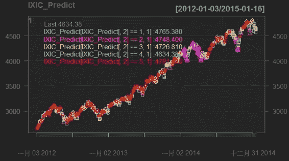

使用 R 进行股票市场预测

此外，您还可以执行非线性降维来计算图像数据的相似度，并可视化聚类图，如下面的截图所示。您需要做的只是遵循本书中提供的菜谱。

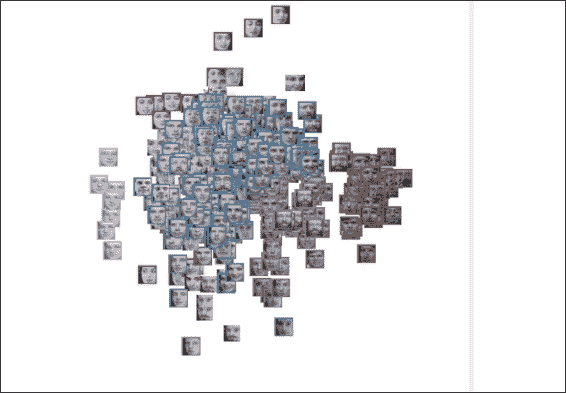

面部图像数据的聚类图

本章作为机器学习和 R 的整体介绍；前几道菜谱介绍了如何设置 R 环境和集成开发环境 RStudio。在设置环境之后，接下来的菜谱介绍了包的安装和加载。为了理解如何使用 R 进行数据分析，接下来的四个菜谱涵盖了使用 R 进行数据读取/写入、数据处理、基本统计和数据可视化。本章的最后一道菜谱列出了有用的数据来源和资源。

# 下载和安装 R

要使用 R，您必须首先在您的计算机上安装它。这道菜谱提供了如何下载和安装 R 的详细说明。

## 准备工作

如果您是 R 语言的初学者，您可以在官方网站上找到详细介绍、语言历史和功能（[`www.r-project.org`](http://www.r-project.org/)）。当您准备好下载和安装 R 时，请访问以下链接：[`cran.r-project.org/`](http://cran.r-project.org/)。

## 如何操作...

请按照以下步骤下载和安装适用于 Windows 和 Mac 用户版本的 R：

1.  前往 R CRAN 网站，[`www.r-project.org/`](http://www.r-project.org/)，并点击 **下载 R** 链接，即 [`cran.r-project.org/mirrors.html`](http://cran.r-project.org/mirrors.html)）：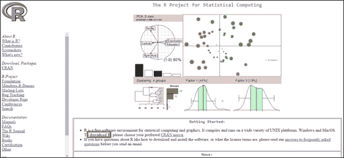

1.  您可以选择离您最近的镜像位置：

    CRAN 镜像

1.  根据您的操作系统选择正确的下载链接：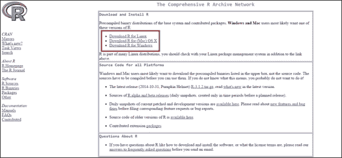

    根据您的操作系统点击下载链接

由于 Windows 和 Mac 安装 R 的步骤不同，因此为每个操作系统提供了安装 R 所需的步骤。

对于 Windows 用户：

1.  点击 **下载 R for Windows**，如图所示，然后点击 **基础版**：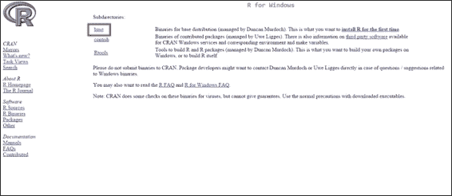

    前往“下载 Windows 版 R”并点击“基础版”

1.  点击 **下载 R 3.x.x for Windows**：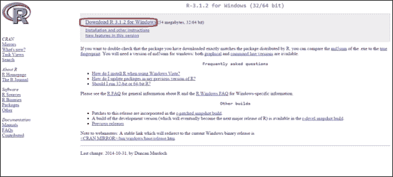

    点击“下载 R 3.x.x for Windows”

1.  安装文件应该已下载。下载完成后，您可以双击安装文件并开始安装 R：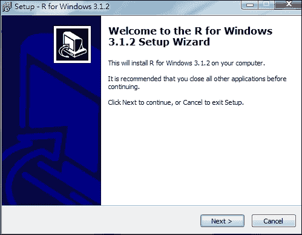

1.  Windows 版 R 的安装相当简单；安装 GUI 可能会逐步指导您如何安装程序（公共许可协议、目标位置、选择组件、启动选项、启动菜单文件夹以及选择附加任务）。如果您不想进行任何更改，请保留所有安装选项为默认设置。

1.  安装完成后，R 应用程序的快捷方式将出现在您的开始菜单中，这将打开 R 控制台：

    Windows R 控制台

对于 Mac OS X 用户：

1.  前往 **下载 (Mac) OS X 版 R**，如图所示。

1.  根据您的 Mac OS 版本点击最新版本（`.pkg` 文件扩展名）：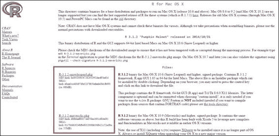

1.  双击下载的安装文件（`.pkg` 扩展名）并开始安装 R。如果您不想进行任何更改，请保留所有安装选项为默认设置：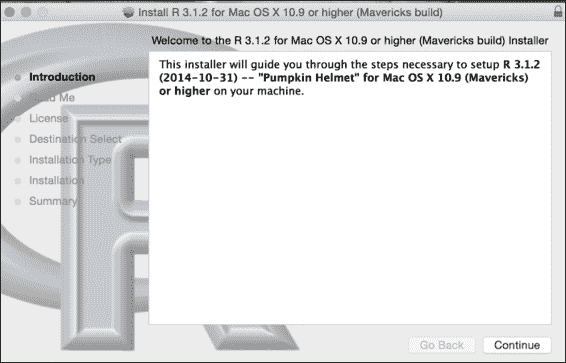

1.  按照屏幕上的说明，**简介**、**阅读我**、**许可协议**、**目标选择**、**安装类型**、**安装**、**摘要**，并点击 **继续** 以完成安装。

1.  文件安装完成后，您可以使用 **Spotlight 搜索** 或转到应用程序文件夹来查找 R：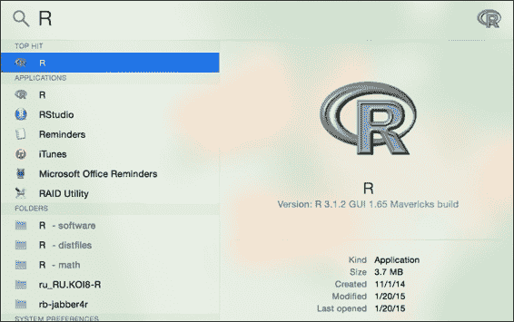

    使用“Spotlight 搜索”查找 R

1.  点击 R 打开 **R 控制台**：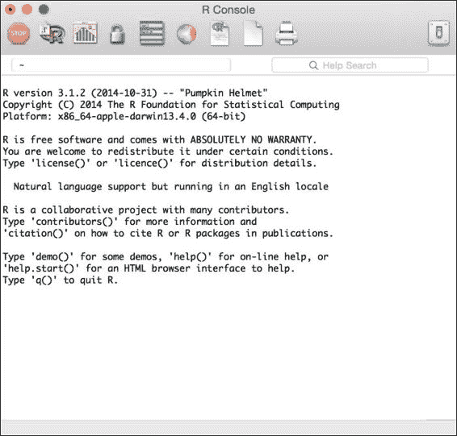

作为下载 Mac `.pkg` 文件安装 R 的替代方案，Mac 用户也可以使用 Homebrew 安装 R：

1.  从 [`xquartz.macosforge.org/landing/`](https://xquartz.macosforge.org/landing/) 下载 `XQuartz-2.X.X.dmg`。

1.  双击 `.dmg` 文件以挂载它。

1.  使用以下命令行更新 brew：

    ```py
    $ brew update

    ```

1.  克隆仓库并将所有公式链接到 `homebrew/science`：

    ```py
    $ brew tap homebrew/science

    ```

1.  安装 gfortran：

    ```py
    $ brew install gfortran

    ```

1.  安装 R：

    ```py
    $ brew install R

    ```

对于 Linux 用户，有预编译的二进制文件适用于 Debian、Red Hat、SUSE 和 Ubuntu。或者，您也可以从源代码安装 R。除了下载预编译的二进制文件外，您还可以通过包管理器安装 R。以下是 CentOS 和 Ubuntu 的安装步骤。

在 Ubuntu 上下载和安装 R：

1.  将条目添加到 `/etc/apt/sources.list` 文件中：

    ```py
    $ sudo sh -c "echo 'deb http:// cran.stat.ucla.edu/bin/linux/ubuntu precise/' >> /etc/apt/sources.list"

    ```

1.  然后，更新仓库：

    ```py
    $ sudo apt-get update

    ```

1.  使用以下命令安装 R：

    ```py
    $ sudo apt-get install r-base

    ```

1.  在命令行中启动 R：

    ```py
    $ R

    ```

在 CentOS 5 上下载和安装 R：

1.  获取 rpm CentOS5 RHEL EPEL 仓库的 CentOS5：

    ```py
    $ wget http://dl.fedoraproject.org/pub/epel/5/x86_64/epel-release-5-4.noarch.rpm

    ```

1.  安装 CentOS5 RHEL EPEL 仓库：

    ```py
    $ sudo rpm -Uvh epel-release-5-4.noarch.rpm

    ```

1.  更新已安装的软件包：

    ```py
    $ sudo yum update

    ```

1.  通过仓库安装 R：

    ```py
    $ sudo yum install R

    ```

1.  在命令行中启动 R：

    ```py
    $ R

    ```

在 CentOS 6 上下载和安装 R：

1.  获取 rpm CentOS5 RHEL EPEL 仓库的 CentOS6：

    ```py
    $ wget http://dl.fedoraproject.org/pub/epel/6/x86_64/epel-release-6-8.noarch.rpm

    ```

1.  安装 CentOS5 RHEL EPEL 仓库：

    ```py
    $ sudo rpm -Uvh epel-release-6-8.noarch.rpm

    ```

1.  更新已安装的软件包：

    ```py
    $ sudo yum update

    ```

1.  通过仓库安装 R：

    ```py
    $ sudo yum install R

    ```

1.  在命令行中启动 R：

    ```py
    $ R

    ```

## 它是如何工作的...

CRAN 为 Linux、Mac OS X 和 Windows 提供预编译的二进制文件。对于 Mac 和 Windows 用户，安装过程很简单。您通常可以遵循屏幕上的说明来完成安装。对于 Linux 用户，您可以使用每个平台提供的包管理器安装 R 或从源代码构建 R。

## 参见

+   对于计划从源代码构建 R 的用户，请参考**R 安装和管理**([`cran.r-project.org/doc/manuals/R-admin.html`](http://cran.r-project.org/doc/manuals/R-admin.html))，其中说明了如何在各种平台上安装 R。

# 下载和安装 RStudio

要编写 R 脚本，可以使用 R 控制台、R 命令行或任何文本编辑器（EMACS、VIM 或 sublime）。然而，使用 R 的集成开发环境（IDE）RStudio 的帮助可以使开发变得更加容易。

RStudio 提供了全面的软件开发工具。内置功能，如语法高亮、代码补全和智能缩进，有助于最大化生产力。为了使 R 编程更易于管理，RStudio 还将主界面集成到一个四面板布局中。它包括一个交互式 R 控制台、一个标签页式的源代码编辑器、一个用于当前活动对象/历史的面板，以及一个标签页式的面板用于文件浏览器/绘图窗口/包安装窗口/R 帮助窗口。此外，RStudio 是开源的，适用于许多平台，如 Windows、Mac OS X 和 Linux。本食谱展示了如何下载和安装 RStudio。

## 准备工作

RStudio 需要一个有效的 R 安装；当 RStudio 加载时，它必须能够定位到一个 R 版本。因此，您必须在安装 RStudio 之前完成之前步骤，确保您的操作系统上已安装 R。

## 如何操作...

对于 Windows 和 Mac 用户，请按照以下步骤下载和安装 RStudio：

1.  通过以下网址访问 RStudio 的官方网站：[`www.rstudio.com/products/RStudio/`](http://www.rstudio.com/products/RStudio/).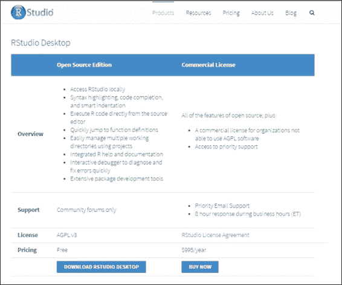

1.  对于桌面版本安装，点击 **下载 RStudio 桌面版** ([`www.rstudio.com/products/rstudio/download/`](http://www.rstudio.com/products/rstudio/download/)) 并选择适合您系统的 RStudio。下载相关包：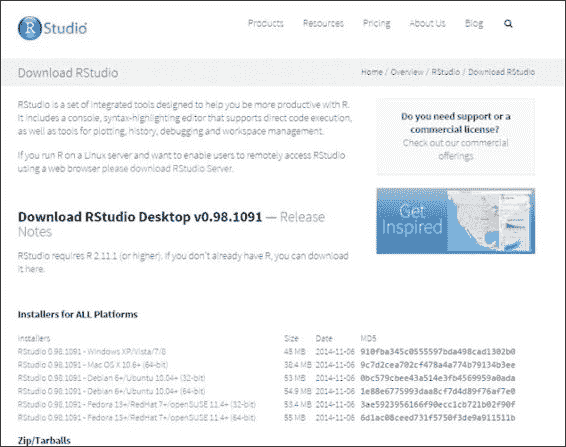

1.  双击下载的包来安装 RStudio。对于 Windows 用户，请按照屏幕上的说明安装应用程序：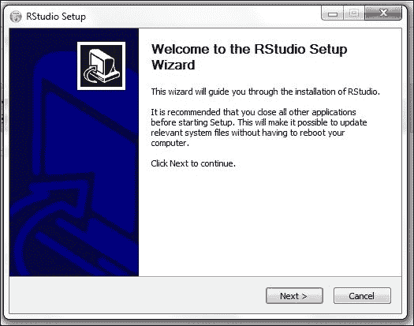

1.  对于 Mac 用户，只需将 RStudio 图标拖到 `应用程序` 文件夹：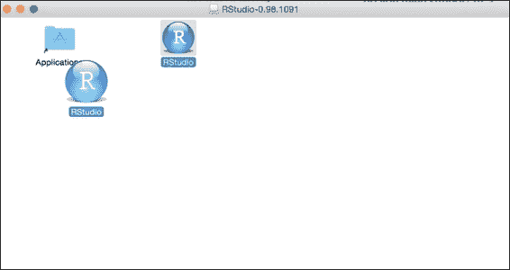

1.  启动 RStudio：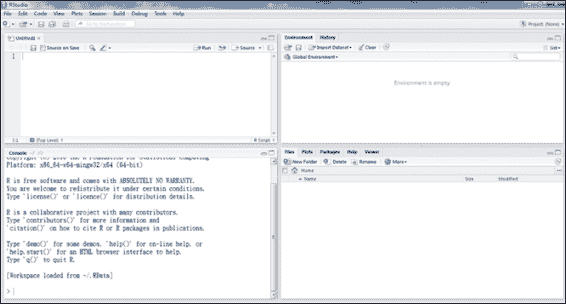

    RStudio 控制台

对于 Ubuntu/Debian 和 RedHat/Centos 用户，请按照以下步骤下载和安装 RStudio：

对于 Debian(6+)/Ubuntu(10.04+) 32 位系统：

```py
$ wget http://download1.rstudio.org/rstudio-0.98.1091-i386.deb
$ sudo gdebi rstudio-0.98\. 1091-i386.deb

```

对于 Debian(6+)/Ubuntu(10.04+) 64 位系统：

```py
$ wget http://download1.rstudio.org/rstudio-0.98\. 1091-amd64.deb
$ sudo gdebi rstudio-0.98\. 1091-amd64.deb

```

对于 RedHat/CentOS(5,4+) 32 位系统：

```py
$ wget http://download1.rstudio.org/rstudio-0.98\. 1091-i686.rpm
$ sudo yum install --nogpgcheck rstudio-0.98\. 1091-i686.rpm

```

对于 RedHat/CentOS(5,4+) 64 位系统：

```py
$ wget http://download1.rstudio.org/rstudio-0.98\. 1091-x86_64.rpm
$ sudo yum install --nogpgcheck rstudio-0.98\. 1091-x86_64.rpm

```

## 工作原理

RStudio 程序可以在桌面或通过网页浏览器运行。桌面版本适用于 Windows、Mac OS X 和 Linux 平台，所有平台上的操作类似。对于 Windows 和 Mac 用户，在下载 RStudio 的预编译包后，按照屏幕上的说明（如前所述步骤），完成安装。Linux 用户可以使用提供的包管理系统进行安装。

## 参见

+   除了桌面版本外，用户还可以安装服务器版本，以便为多个用户提供访问权限。服务器版本提供了一个用户可以访问以使用 RStudio 资源的 URL。要安装 RStudio，请参阅以下链接：[`www.rstudio.com/ide/download/server.html`](http://www.rstudio.com/ide/download/server.html)。此页面提供了以下 Linux 发行版的安装说明：Debian (6+)、Ubuntu (10.04+)、RedHat 和 CentOS (5.4+)。

+   对于其他 Linux 发行版，您可以从源代码构建 RStudio。

# 安装和加载包

在成功安装 R 之后，用户可以从存储库中下载、安装和更新包。由于 R 允许用户创建自己的包，因此提供了官方和非官方的存储库来管理这些用户创建的包。**CRAN**是官方的 R 包存储库。目前，CRAN 包存储库有 6,379 个可用的包（截至 2015 年 2 月 27 日）。通过使用 CRAN 上提供的包，用户可以扩展 R 的功能，用于机器学习、统计学和相关目的。CRAN 是一个全球范围内的 FTP 和 Web 服务器网络，存储着 R 的代码和文档的相同、最新版本。你可以选择离你位置最近的 CRAN 镜像来下载包。

## 准备工作

在你的主机计算机上启动一个 R 会话。

## 如何操作...

执行以下步骤来安装和加载 R 包：

1.  要加载已安装包的列表：

    ```py
    > library()

    ```

1.  设置默认 CRAN 镜像：

    ```py
    > chooseCRANmirror()

    ```

R 将返回 CRAN 镜像列表，然后询问用户是输入镜像 ID 来选择它，还是输入零来退出：

1.  从 CRAN 安装一个包；以包 e1071 为例：

    ```py
    > install.packages("e1071")

    ```

1.  从 CRAN 更新一个包；以包 e1071 为例：

    ```py
    > update.packages("e1071")

    ```

1.  加载包：

    ```py
    > library(e1071)

    ```

1.  如果你想要查看包的文档，你可以使用`help`函数：

    ```py
    > help(package ="e1071")

    ```

1.  如果你想要查看函数的文档，你可以使用`help`函数：

    ```py
    > help(svm, e1071)

    ```

1.  或者，你可以使用帮助快捷键`?`来查看该函数的帮助文档：

    ```py
    > ?e1071::svm

    ```

1.  如果函数没有提供任何文档，你可能需要搜索提供的文档中与给定关键字相关的文档。例如，如果你想要搜索与`svm`相关的文档：

    ```py
    > help.search("svm")

    ```

1.  或者，你可以使用`??`作为`help.search`的快捷键：

    ```py
    > ??svm

    ```

1.  要查看函数所接受的参数，只需使用`args`函数。例如，如果你想知道`lm`函数所接受的参数：

    ```py
    > args(lm)

    ```

1.  一些包会提供示例和演示；你可以使用`example`或`demo`来查看示例或演示。例如，可以通过输入以下命令来查看`lm`包的示例和`graphics`包的演示：

    ```py
    > example(lm)
    > demo(graphics)

    ```

1.  要查看所有可用的演示，你可以使用`demo`函数来列出它们：

    ```py
    > demo()

    ```

## 它是如何工作的

本食谱首先介绍了如何查看已加载的包、从 CRAN 安装包以及加载新包。在安装包之前，对 CRAN 包列表感兴趣的读者可以参考[`cran.r-project.org/web/packages/available_packages_by_name.html`](http://cran.r-project.org/web/packages/available_packages_by_name.html)。

当安装包时，也会提供与包相关的文档。因此，你可以查看已安装包和函数的文档或相关帮助页面。此外，一些包还提供了演示和示例，可以帮助用户了解已安装包的功能。

## 参见

+   除了从 CRAN 安装包外，还有其他 R 包仓库，包括 Crantastic，这是一个用于评分和评论 CRAN 包的社区网站，以及 R-Forge，这是一个 R 包协作开发的中心平台。此外，Bioconductor 提供用于基因组数据分析的 R 包。

+   如果您想查找相关的函数和包，请访问任务视图列表 [`cran.r-project.org/web/views/`](http://cran.r-project.org/web/views/)，或搜索关键词 [`rseek.org`](http://rseek.org)。

# 读写数据

在开始探索数据之前，您必须将数据加载到 R 会话中。本食谱将介绍从文件中加载数据到内存或使用 R 中的预定义数据的方法。

## 准备工作

首先，在您的机器上启动一个 R 会话。由于本食谱涉及文件 I/O 步骤，如果用户没有指定完整路径，读写活动将在当前工作目录中进行。

您可以直接在 R 会话中输入 `getwd()` 以获取当前工作目录位置。但是，如果您想更改当前工作目录，可以使用 `setwd("<path>")`，其中 `<path>` 可以替换为您希望指定的路径，以指定工作目录。

## 如何操作...

执行以下步骤以使用 R 读写数据：

1.  要查看 R 的内置数据集，请输入以下命令：

    ```py
    > data()

    ```

1.  R 将返回 `dataset` 包中的数据集列表，列表包括每个数据集的名称和描述。

1.  要将数据集 `iris` 加载到 R 会话中，请输入以下命令：

    ```py
    > data(iris)

    ```

1.  `iris` 数据集现在已加载到数据框格式中，这是 R 中存储数据表的常见数据结构。

1.  要查看 `iris` 的数据类型，只需使用 `class` 函数：

    ```py
    > class(iris)
    [1] "data.frame"

    ```

1.  `data.frame` 控制台打印显示，`iris` 数据集是以数据框的结构存在的。

1.  使用 `save` 函数将对象存储到文件中。例如，要将加载的 `iris` 数据保存到 `myData.RData`，请使用以下命令：

    ```py
    > save(iris, file="myData.RData")

    ```

1.  使用 `load` 函数将保存的对象读入 R 会话。例如，要从 `myData.RData` 加载 iris 数据，请使用以下命令：

    ```py
    > load("myData.RData")

    ```

1.  除了使用内置数据集外，R 还提供了一个函数，可以将文本数据导入到数据框中。例如，`read.table` 函数可以将给定的文本格式化为数据框：

    ```py
    > test.data = read.table(header = TRUE, text = "
    + a b
    + 1 2
    + 3 4
    + ")

    ```

1.  您还可以使用 `row.names` 和 `col.names` 来指定列和行的名称：

    ```py
    > test.data = read.table(text = "
    + 1 2
    + 3 4", 
    + col.names=c("a","b"),
    + row.names = c("first","second"))

    ```

1.  查看 `test.data` 变量的类：

    ```py
    > class(test.data)
    [1] "data.frame"

    ```

1.  `class` 函数显示 `test.data` 变量包含一个数据框。

1.  除了使用 `read.table` 函数导入数据外，您还可以使用 `write.table` 函数将数据导出到文本文件：

    ```py
    > write.table(test.data, file = "test.txt" , sep = " ")

    ```

1.  `write.table` 函数将 `test.data` 的内容写入 `test.txt`（写入路径可以通过输入 `getwd()` 查找），以空格作为分隔符。

1.  与 `write.table` 类似，`write.csv` 也可以将数据导出到文件。但是，`write.csv` 使用逗号作为默认分隔符：

    ```py
    > write.csv(test.data, file = "test.csv")

    ```

1.  使用 `read.csv` 函数，可以将 `csv` 文件导入为数据框。然而，最后一个示例将数据框的列名和行名写入 `test.csv` 文件。因此，在函数中指定 header 为 `TRUE` 并将行名作为第一列可以确保读取的数据框不会将标题和第一列视为值：

    ```py
    > csv.data = read.csv("test.csv", header = TRUE, row.names=1)
    > head(csv.data)
     a b
    1 1 2
    2 3 4

    ```

## 工作原理

通常，收集的数据可能存在于多个文件和不同的格式中。为了在文件和 RData 之间交换数据，R 提供了许多内置函数，例如 `save`、`load`、`read.csv`、`read.table`、`write.csv` 和 `write.table`。

此示例首先演示了如何将内置数据集 iris 载入 R 会话。iris 数据集是机器学习领域中最为著名和常用的数据集。在此，我们使用 iris 数据集作为示例。食谱展示了如何使用 `save` 和 `load` 函数保存 RData 并加载它。此外，示例解释了如何使用 `read.table`、`write.table`、`read.csv` 和 `write.csv` 从文件交换数据到数据框。使用 R IO 函数读取和写入数据非常重要，因为大多数数据源都是外部的。因此，你必须使用这些函数将数据加载到 R 会话中。

## 相关内容

对于 `load`、`read.table` 和 `read.csv` 函数，要读取的文件也可以是一个完整的 URL（对于支持的 URL，使用 `?url` 获取更多信息）。

在某些情况下，数据可能存在于 Excel 文件中而不是平面文本文件中。`WriteXLS` 包允许将对象写入 Excel 文件，其中第一个参数是给定的变量，第二个参数是要写入的文件：

1.  安装 `WriteXLS` 包：

    ```py
    > install.packages("WriteXLS")

    ```

1.  载入 `WriteXLS` 包：

    ```py
    > library("WriteXLS")

    ```

1.  使用 `WriteXLS` 函数将数据框 iris 写入名为 `iris.xls` 的文件：

    ```py
    > WriteXLS("iris", ExcelFileName="iris.xls")

    ```

# 使用 R 操作数据

本食谱将讨论如何使用内置的 R 函数来操作数据。由于数据操作是大多数分析过程中最耗时的部分，你应该了解如何应用这些函数于数据。

## 准备工作

确保你已经完成了之前的食谱，通过在你的操作系统上安装 R 来完成。

## 如何操作...

执行以下步骤以使用 R 操作数据。

使用花括号表示法对数据进行子集化：

1.  将数据集 iris 载入 R 会话：

    ```py
    > data(iris)

    ```

1.  要选择值，你可以使用括号表示法来指定数据集的索引。第一个索引用于行，第二个用于列：

    ```py
    > iris[1,"Sepal.Length"]
    [1] 5.1

    ```

1.  你也可以使用 c() 选择多个列：

    ```py
    > Sepal.iris = iris[, c("Sepal.Length", "Sepal.Width")]

    ```

1.  然后，你可以使用 `str()` 来总结并显示 `Sepal.iris` 的内部结构：

    ```py
    > str(Sepal.iris)
    'data.frame':  150 obs. of  2 variables:
     $ Sepal.Length: num  5.1 4.9 4.7 4.6 5 5.4 4.6 5 4.4 4.9 ...
     $ Sepal.Width : num  3.5 3 3.2 3.1 3.6 3.9 3.4 3.4 2.9 3.1 ..

    ```

1.  要使用给定索引的行来子集化数据，你可以在第一个索引处使用括号表示法指定索引。在这个例子中，我们向你展示如何使用`Sepal.Length`列和选定的`Sepal.Width`来子集化数据的前五条记录：

    ```py
    > Five.Sepal.iris = iris[1:5, c("Sepal.Length", "Sepal.Width")]
    > str(Five.Sepal.iris)
    'data.frame':	5 obs. of  2 variables:
     $ Sepal.Length: num  5.1 4.9 4.7 4.6 5
     $ Sepal.Width : num  3.5 3 3.2 3.1 3.6

    ```

1.  还可以设置条件来过滤数据。例如，要过滤返回包含所有五个变量的 setosa 数据，以下示例中，第一个索引指定返回标准，第二个索引指定返回变量的索引范围：

    ```py
    > setosa.data = iris[iris$Species=="setosa",1:5]
    > str(setosa.data)
    'data.frame':	50 obs. of  5 variables:
     $ Sepal.Length: num  5.1 4.9 4.7 4.6 5 5.4 4.6 5 4.4 4.9 ...
     $ Sepal.Width : num  3.5 3 3.2 3.1 3.6 3.9 3.4 3.4 2.9 3.1 ...
     $ Petal.Length: num  1.4 1.4 1.3 1.5 1.4 1.7 1.4 1.5 1.4 1.5 ...
     $ Petal.Width : num  0.2 0.2 0.2 0.2 0.2 0.4 0.3 0.2 0.2 0.1 ...
     $ Species     : Factor w/ 3 levels "setosa","versicolor",..: 1 1 1 1 1 1 1 1 1 1 ...

    ```

1.  或者，`which`函数返回满足条件的数据的索引。以下示例返回包含物种等于`setosa`的鸢尾花数据的索引：

    ```py
    > which(iris$Species=="setosa")
     [1]  1  2  3  4  5  6  7  8  9 10 11 12 13 14 15 16 17 18
    [19] 19 20 21 22 23 24 25 26 27 28 29 30 31 32 33 34 35 36
    [37] 37 38 39 40 41 42 43 44 45 46 47 48 49 50

    ```

1.  操作返回的索引可以应用于选择包含 setosa 物种的鸢尾花。以下示例返回包含所有五个变量的 setosa：

    ```py
    > setosa.data = iris[which(iris$Species=="setosa"),1:5]
    > str(setosa.data)
    'data.frame':	50 obs. of  5 variables:
     $ Sepal.Length: num  5.1 4.9 4.7 4.6 5 5.4 4.6 5 4.4 4.9 ...
     $ Sepal.Width : num  3.5 3 3.2 3.1 3.6 3.9 3.4 3.4 2.9 3.1 ...
     $ Petal.Length: num  1.4 1.4 1.3 1.5 1.4 1.7 1.4 1.5 1.4 1.5 ...
     $ Petal.Width : num  0.2 0.2 0.2 0.2 0.2 0.4 0.3 0.2 0.2 0.1 ...
     $ Species     : Factor w/ 3 levels "setosa","versicolor",..: 1 1 1 1 1 1 1 1 1 1 ...

    ```

使用`subset`函数进行数据子集化：

1.  除了使用括号表示法外，R 还提供了一个`subset`函数，允许用户通过逻辑语句对数据框进行子集化。

1.  首先，从鸢尾花数据中子集化物种、花瓣长度和花瓣宽度。要选择鸢尾花数据中的花瓣长度和宽度，应在`select`参数中指定要子集化的列：

    ```py
    > Sepal.data = subset(iris, select=c("Sepal.Length", "Sepal.Width"))
    > str(Sepal.data)
    'data.frame': 150 obs. of  2 variables:
     $ Sepal.Length: num  5.1 4.9 4.7 4.6 5 5.4 4.6 5 4.4 4.9 ...
     $ Sepal.Width : num  3.5 3 3.2 3.1 3.6 3.9 3.4 3.4 2.9 3.1 ...

    ```

这表明`Sepal.data`包含 150 个对象，具有`Sepal.Length`变量和`Sepal.Width`。

1.  另一方面，你可以使用子集参数来获取仅包含 setosa 的数据子集。在`subset`函数的第二参数中，你可以指定子集标准：

    ```py
    > setosa.data = subset(iris, Species =="setosa")
    > str(setosa.data)
    'data.frame': 50 obs. of  5 variables:
     $ Sepal.Length: num  5.1 4.9 4.7 4.6 5 5.4 4.6 5 4.4 4.9 ...
     $ Sepal.Width : num  3.5 3 3.2 3.1 3.6 3.9 3.4 3.4 2.9 3.1 ...
     $ Petal.Length: num  1.4 1.4 1.3 1.5 1.4 1.7 1.4 1.5 1.4 1.5 ...
     $ Petal.Width : num  0.2 0.2 0.2 0.2 0.2 0.4 0.3 0.2 0.2 0.1 ...
     $ Species     : Factor w/ 3 levels "setosa","versicolor",..: 1 1 1 1 1 1 1 1 1 1 ...

    ```

1.  大多数时候，在子集化数据时，你可能想要应用一个并集或交集条件。为此，可以进一步使用 OR 和 AND 操作。例如，如果你想检索`Petal.Width >=0.2 and Petal.Length <= 1.4`的数据：

    ```py
    > example.data= subset(iris, Petal.Length <=1.4 & Petal.Width >= 0.2, select=Species )
    > str(example.data)
    'data.frame': 21 obs. of  1 variable:
     $ Species: Factor w/ 3 levels "setosa","versicolor",..: 1 1 1 1 1 1 1 1 1 1 ...

    ```

**合并数据**：合并数据涉及通过公共列或行名将两个数据框合并到一个合并的数据框中。以下示例显示了如何通过`Species`列中的公共行名将`flower.type`数据框和鸢尾花的头三行合并：

```py
> flower.type = data.frame(Species = "setosa", Flower = "iris")
> merge(flower.type, iris[1:3,], by ="Species")
 Species Flower Sepal.Length Sepal.Width Petal.Length Petal.Width
1  setosa   iris          5.1         3.5          1.4         0.2
2  setosa   iris          4.9         3.0          1.4         0.2
3  setosa   iris          4.7         3.2          1.3         0.2

```

**排序数据**：`order`函数将返回一个按指定列排序的数据框的索引。以下示例显示了按花瓣长度排序（从大到小）的鸢尾花数据的前六条记录的结果

```py
> head(iris[order(iris$Sepal.Length, decreasing = TRUE),])
 Sepal.Length Sepal.Width Petal.Length Petal.Width   Species
132          7.9         3.8          6.4         2.0 virginica
118          7.7         3.8          6.7         2.2 virginica
119          7.7         2.6          6.9         2.3 virginica
123          7.7         2.8          6.7         2.0 virginica
136          7.7         3.0          6.1         2.3 virginica
106          7.6         3.0          6.6         2.1 virginica

```

## 工作原理

在进行数据分析之前，将收集到的数据组织成结构化格式非常重要。因此，我们可以简单地使用 R 数据框来子集化、合并和排序数据集。本食谱首先介绍了两种子集化数据的方法：一种使用括号表示法，另一种使用`subset`函数。你可以使用这两种方法通过选择列和根据给定标准过滤数据来生成子集数据。然后，本食谱介绍了`merge`函数来合并数据框。最后，本食谱介绍了如何使用`order`来排序数据。

## 还有更多...

`sub` 和 `gsub` 函数允许使用正则表达式来替换字符串。`sub` 和 `gsub` 函数分别执行第一次和所有其他匹配的替换：

```py
> sub("e", "q", names(iris))
[1] "Sqpal.Length" "Sqpal.Width"  "Pqtal.Length" "Pqtal.Width"  "Spqcies" 
> gsub("e", "q", names(iris))
[1] "Sqpal.Lqngth" "Sqpal.Width"  "Pqtal.Lqngth" "Pqtal.Width"  "Spqciqs"

```

# 应用基本统计

R 提供了广泛的统计函数，使用户能够获取数据的汇总统计信息，生成频率和列联表，生成相关系数，并进行统计推断。本食谱涵盖了可以应用于数据集的基本统计方法。

## 准备工作

确保您已经通过在操作系统上安装 R 完成了前面的食谱。

## 如何操作...

执行以下步骤以在数据集上应用统计：

1.  将 iris 数据加载到 R 会话中：

    ```py
    > data(iris)

    ```

1.  观察数据的格式：

    ```py
    > class(iris)
     [1] "data.frame"

    ```

1.  iris 数据集是一个包含四个数值属性的数据框：`花瓣长度`、`花瓣宽度`、`萼片宽度`和`萼片长度`。对于数值值，可以执行描述性统计，如 `mean`、`sd`、`var`、`min`、`max`、`median`、`range` 和 `quantile`。这些可以应用于数据集中的任意四个属性：

    ```py
    > mean(iris$Sepal.Length)
    [1] 5.843333
    > sd(iris$Sepal.Length)
    [1] 0.8280661
    > var(iris$Sepal.Length)
    [1] 0.6856935
    > min(iris$Sepal.Length)
    [1] 4.3
    > max(iris$Sepal.Length)
    [1] 7.9
    > median(iris$Sepal.Length)
    [1] 5.8
    > range(iris$Sepal.Length)
    [1] 4.3 7.9
    > quantile(iris$Sepal.Length)
     0%  25%  50%  75% 100% 
     4.3  5.1  5.8  6.4  7.9

    ```

1.  上述示例演示了如何对一个单一变量应用描述性统计。为了获取数据框中每个数值属性的汇总统计信息，可以使用 `sapply`。例如，为了在 iris 数据框的前四个属性上应用均值，通过将 `na.rm` 设置为 `TRUE` 来忽略 `na` 值：

    ```py
    > sapply(iris[1:4], mean, na.rm=TRUE)
    Sepal.Length  Sepal.Width Petal.Length  Petal.Width 
     5.843333     3.057333     3.758000     1.199333 

    ```

1.  作为使用 `sapply` 在给定属性上应用描述性统计的替代方法，R 提供了 summary 函数，该函数提供了全面的描述性统计。在以下示例中，summary 函数提供了每个 iris 数据集数值属性的均值、中位数、第 25 和第 75 分位数、最小值和最大值：

    ```py
    > summary(iris)
    Sepal.Length    Sepal.Width     Petal.Length    Petal.Width    Species 
     Min.   :4.300   Min.   :2.000   Min.   :1.000   Min.   :0.100   setosa    :50 
     1st Qu.:5.100   1st Qu.:2.800   1st Qu.:1.600   1st Qu.:0.300   versicolor:50 
     Median :5.800   Median :3.000   Median :4.350   Median :1.300   virginica :50 
     Mean   :5.843   Mean   :3.057   Mean   :3.758   Mean   :1.199 
     3rd Qu.:6.400   3rd Qu.:3.300   3rd Qu.:5.100   3rd Qu.:1.800 
     Max.   :7.900   Max.   :4.400   Max.   :6.900   Max.   :2.500

    ```

1.  上述示例展示了如何输出单一变量的描述性统计。R 还提供了相关系数，供用户研究变量之间的关系。以下示例通过计算 iris 数据集中每个属性对的相关性来生成一个 4x4 矩阵：

    ```py
    > cor(iris[,1:4])
     Sepal.Length Sepal.Width Petal.Length Petal.Width
    Sepal.Length    1.0000000  -0.1175698    0.8717538   0.8179411
    Sepal.Width    -0.1175698   1.0000000   -0.4284401  -0.3661259
    Petal.Length    0.8717538  -0.4284401    1.0000000   0.9628654
    Petal.Width     0.8179411  -0.3661259    0.9628654   1.0000000

    ```

1.  R 还提供了一个函数来计算 iris 数据集中每个属性对的协方差：

    ```py
    > cov(iris[,1:4])
     Sepal.Length Sepal.Width Petal.Length Petal.Width
    Sepal.Length    0.6856935  -0.0424340    1.2743154   0.5162707
    Sepal.Width    -0.0424340   0.1899794   -0.3296564  -0.1216394
    Petal.Length    1.2743154  -0.3296564    3.1162779   1.2956094
    Petal.Width     0.5162707  -0.1216394    1.2956094   0.5810063

    ```

1.  通过进行统计测试来评估结果的显著性；在此示例中，我们演示了如何使用 t-test 来确定两个样本之间的统计差异。在此示例中，我们对 setosa 或 versicolor 物种中 iris 的花瓣宽度进行了 t.test。如果我们获得小于 0.5 的 p 值，我们可以确信 setosa 和 versicolor 之间的花瓣宽度将会有显著差异：

    ```py
    > t.test(iris$Petal.Width[iris$Species=="setosa"], 
    +        iris$Petal.Width[iris$Species=="versicolor"])

     Welch Two Sample t-test

    data:  iris$Petal.Width[iris$Species == "setosa"] and iris$Petal.Width[iris$Species == "versicolor"]
    t = -34.0803, df = 74.755, p-value < 2.2e-16
    alternative hypothesis: true difference in means is not equal to 0
    95 percent confidence interval:
     -1.143133 -1.016867
    sample estimates:
    mean of x mean of y 
     0.246     1.326

    ```

1.  或者，您可以对 iris 的萼片长度与萼片宽度进行相关性测试，然后检索两个变量之间的相关性得分。正相关越强，值越接近 1。负相关越强，值越接近 -1：

    ```py
    > cor.test(iris$Sepal.Length, iris$Sepal.Width)

     Pearson's product-moment correlation

    data:  iris$Sepal.Length and iris$Sepal.Width
    t = -1.4403, df = 148, p-value = 0.1519
    alternative hypothesis: true correlation is not equal to 0
    95 percent confidence interval:
     -0.27269325  0.04351158
    sample estimates:
     cor 
    -0.1175698 

    ```

## 工作原理...

R 有一个内置的统计函数，使用户能够对单个变量执行描述性统计。本食谱首先介绍了如何将 `mean`、`sd`、`var`、`min`、`max`、`median`、`range` 和 `quantile` 应用于单个变量。此外，为了将统计应用于所有四个数值变量，可以使用 `sapply` 函数。为了确定多个变量之间的关系，可以进行相关性和协方差分析。最后，本食谱展示了如何通过执行统计测试来确定两个给定样本的统计差异。

## 更多...

如果你需要针对不同组的数据计算汇总统计量，你可以使用 `aggregate` 和 `reshape` 函数来计算数据子集的汇总统计量：

1.  使用 `aggregate` 计算每个鸢尾花属性组的平均值，按物种分组：

    ```py
    > aggregate(x=iris[,1:4],by=list(iris$Species),FUN=mean)

    ```

1.  使用 `reshape` 计算每个鸢尾花属性组的平均值，按物种分组：

    ```py
    >  library(reshape)
    >  iris.melt <- melt(iris,id='Species')
    >  cast(Species~variable,data=iris.melt,mean,
     subset=Species %in% c('setosa','versicolor'),
     margins='grand_row') 

    ```

关于 `reshape` 和 `aggregate` 的信息，请使用 `?reshape` 或 `?aggregate` 查看帮助文档。

# 数据可视化

可视化是通过图形手段传达信息的一种强大方式。视觉呈现使数据更容易理解。本食谱介绍了一些基本的绘图函数，并展示了可视化在数据探索中的帮助。

## 准备工作

确保你已经通过在操作系统上安装 R 完成了前面的食谱。

## 如何操作...

执行以下步骤以可视化数据集：

1.  将鸢尾花数据加载到 R 会话中：

    ```py
    > data(iris)

    ```

1.  使用 `table` 命令计算鸢尾花中物种的频率：

    ```py
    > table.iris = table(iris$Species)
    > table.iris

     setosa versicolor  virginica 
     50         50         50 

    ```

1.  如表中的频率所示，每个物种代表鸢尾花数据的 1/3。我们可以绘制一个简单的饼图来表示鸢尾花中物种的分布：

    ```py
    > pie(table.iris)

    ```

    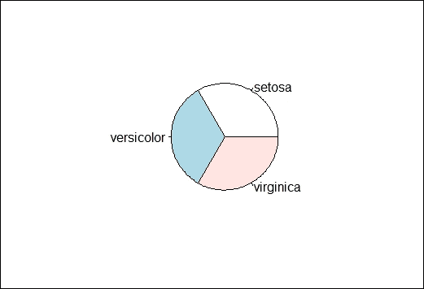

    物种分布的饼图

1.  直方图在 *x*-轴上创建一种频率图。以下示例生成花瓣长度的直方图：

    ```py
    > hist(iris$Sepal.Length)

    ```

    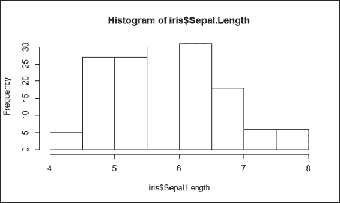

    花瓣长度的直方图

1.  在直方图中，*x*-轴表示花瓣长度，*y*-轴表示不同花瓣长度的计数。直方图显示，对于大多数鸢尾花，花瓣长度范围在 4 厘米到 8 厘米之间。

1.  箱线图，也称为箱线图，允许你在一张简单的图表中传达大量信息。在这种图表中，线代表样本的中位数。箱子本身显示上四分位数和下四分位数。胡须显示范围：

    ```py
    > boxplot(Petal.Width ~ Species, data = iris)

    ```

    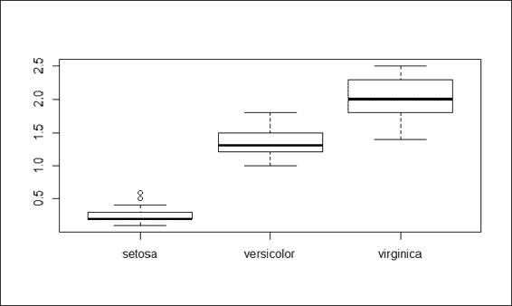

    花瓣宽度的箱线图

1.  前面的截图清楚地显示了 Setosa 的花瓣宽度中位数和上四分位数比 versicolor 和 virginica 短得多。因此，花瓣宽度可以用作区分鸢尾花物种的重要属性。

1.  当有两个变量需要相互绘制时，会使用散点图。此例将花瓣长度与花瓣宽度绘制，并用颜色点表示它所属的物种：

    ```py
    > plot(x=iris$Petal.Length, y=iris$Petal.Width, col=iris$Species)

    ```

    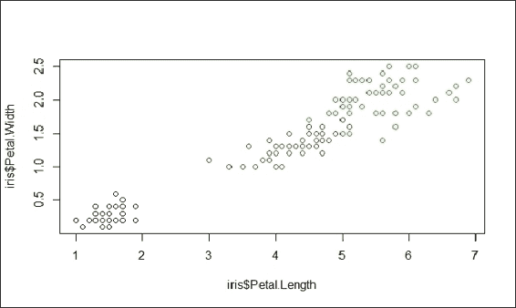

    萼片长度的散点图

1.  上一张截图是花瓣长度与花瓣宽度的散点图。由于 iris 数据集中有四个属性，因此需要六次操作才能绘制所有组合。然而，R 提供了一个名为`pairs`的函数，可以在一个图中生成每个子图：

    ```py
    > pairs(iris[1:4], main = "Edgar Anderson's Iris Data", pch = 21, bg = c("red", "green3", "blue")[unclass(iris$Species)])

    ```

    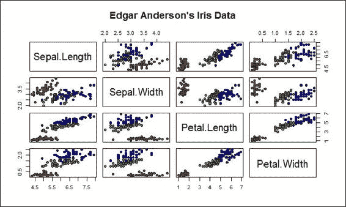

    鸢尾花数据的成对散点图

## 工作原理...

R 提供了许多内置的绘图函数，使用户能够使用不同类型的图表可视化数据。本食谱演示了使用饼图来展示类别分布。等大小的饼图表明每种物种的数量相等。直方图绘制不同萼片长度的频率。箱线图可以传达大量的描述性统计信息，并表明可以使用花瓣宽度来区分鸢尾花物种。最后，我们介绍了散点图，它在一个图中绘制变量。为了快速生成包含所有鸢尾花数据对的散点图，可以使用`pairs`命令。

## 参考以下内容

+   ggplot2 是 R 的另一个绘图系统，基于 Leland Wilkinson 的图形语法实现。它允许用户以更高的抽象级别在图中添加、删除或更改组件。然而，与 lattice 图形相比，抽象级别的结果较慢。对于对 ggplot 感兴趣的用户，可以参考此网站：[`ggplot2.org/`](http://ggplot2.org/)。

# 获取机器学习数据集

虽然 R 有内置的数据集，但样本大小和应用领域有限。除了在模拟中生成数据外，另一种方法是获取外部数据仓库的数据。一个著名的数据仓库是 UCI 机器学习仓库，它包含人工和真实数据集。本食谱介绍了如何从 UCI 机器学习仓库获取样本数据集。

## 准备工作

确保您已通过在操作系统上安装 R 完成了前面的食谱。

## 如何操作...

执行以下步骤以检索机器学习数据：

1.  访问 UCI 机器学习仓库：[`archive.ics.uci.edu/ml/`](http://archive.ics.uci.edu/ml/)。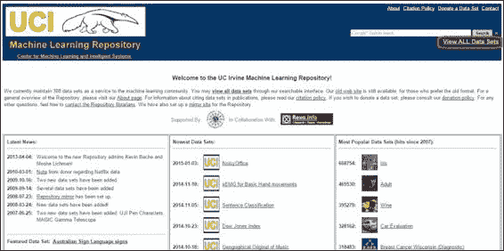

    UCI 数据仓库

1.  点击**查看所有数据集**。在这里，您将找到一个包含字段名称的数据集列表，例如**名称**、**数据类型**、**默认任务**、**属性类型**、**实例数**、**属性数**和**年份**：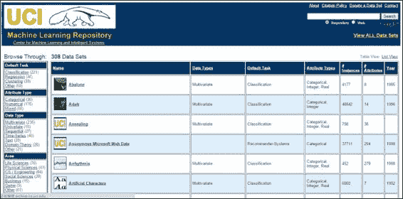

1.  使用*Ctrl* + *F*搜索**Iris**：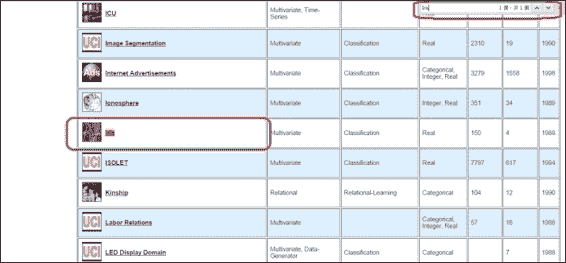

1.  点击**Iris**。这将显示数据文件夹和数据集描述：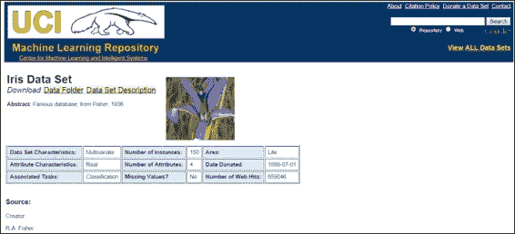

1.  点击**数据文件夹**，将显示包含鸢尾花数据集的目录：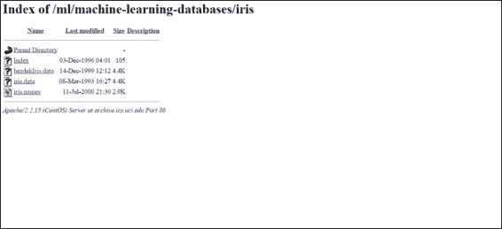

1.  然后，您可以选择下载`iris.data`或使用`read.csv`函数读取数据集：

    ```py
    > iris.data = read.csv(url("http://archive.ics.uci.edu/ml/machine-learning-databases/iris/iris.data"), header = FALSE,  col.names = c("Sepal.Length", "Sepal.Width", "Petal.Length", "Petal.Width", "Species"))
    > head(iris.data)
     Sepal.Length Sepal.Width Petal.Length Petal.Width   Species
    1         5.1         3.5          1.4         0.2 Iris-setosa
    2         4.9         3.0          1.4         0.2 Iris-setosa
    3         4.7         3.2          1.3         0.2 Iris-setosa
    4         4.6         3.1          1.5         0.2 Iris-setosa
    5         5.0         3.6          1.4         0.2 Iris-setosa
    6         5.4         3.9          1.7         0.4 Iris-setosa

    ```

## 它是如何工作的...

在进行数据分析之前，收集您的数据集非常重要。然而，收集一个适合进一步探索和分析的适当数据集并不容易。因此，我们可以使用 UCI 存储库中的准备好的数据集作为我们的数据源。在这里，我们首先访问 UCI 数据集存储库，然后以鸢尾花数据集为例。我们可以通过使用浏览器的查找功能（*Ctrl* + *F*）找到鸢尾花数据集，然后进入文件目录。最后，我们可以下载数据集，并使用 R 的 IO 函数`read.csv`将鸢尾花数据集加载到 R 会话中。

## 参见

+   KDnuggets ([`www.kdnuggets.com/datasets/index.html`](http://www.kdnuggets.com/datasets/index.html)) 提供了一个丰富的数据集列表，适用于数据挖掘和数据科学。您可以探索这个列表，以找到满足您要求的数据。
