# 第二章：使用 RMS Titanic 进行数据探索

在本章中，我们将涵盖以下食谱：

+   从 CSV 文件中读取 Titanic 数据集

+   在字符变量上转换类型

+   检测缺失值

+   填充缺失值

+   探索和可视化数据

+   使用决策树预测乘客生存率

+   使用混淆矩阵验证预测能力

+   使用 ROC 曲线评估性能

# 简介

数据探索帮助数据消费者专注于搜索信息，目的是从收集到的信息中形成真正的分析。此外，在完成数据清洗、分析、建模和评估的步骤后，用户可以从他们专注的数据中生成见解和有价值的信息。

在一个真实的数据探索项目中，探索过程中涉及六个步骤。它们如下所示：

1.  提出正确的问题。

1.  数据收集。

1.  数据清洗。

1.  基本的数据探索分析。

1.  高级数据探索分析。

1.  模型评估。

这里提供了这六个步骤的更详细解释：

1.  **提出正确的问题**：当用户提出问题，例如“探索完成后，我预期的发现是什么？”或“通过探索我可以提取哪些信息？”时，会得到不同的结果。因此，首先提出正确的问题是至关重要的，因为问题本身决定了探索的目标和对象。

1.  **数据收集**：一旦确定了探索的目标，用户就可以开始从数据源收集或提取与探索目标相关的相关数据。大多数情况下，从不同的系统中收集的数据看起来是不规则的和格式多样的。显然，原始数据可能来自不同的来源，如文件、数据库或互联网。从这些来源检索数据需要文件 IO 函数、JDBC/ODBC、网络爬虫等的帮助。这种提取的数据被称为**原始数据**，因为它尚未经过处理，或经过任何其他操作。大多数原始数据不易被大多数分析工具或可视化程序消费。

1.  **数据清洗**：下一个阶段是数据清洗（或整理），这是一个帮助将原始数据映射到更便于消费的格式的步骤。在这个阶段，有许多过程，如数据解析、排序、合并、过滤、缺失值补全以及其他转换和组织数据的过程，使其能够适应消费结构。随后，映射后的数据可以进一步用于数据聚合、分析或可视化。

1.  **基本探索性数据分析**：在数据清洗阶段之后，用户可以进一步进行数据处理分析。最基本的分析是执行探索性数据分析。探索性数据分析涉及通过总结其特征来分析数据集。执行基本的统计、聚合和可视化方法对于帮助用户理解数据特征也是至关重要的任务，这有助于用户通过图表轻松捕捉到大多数、趋势和异常值。

1.  **高级探索性数据分析**：到目前为止，描述性统计提供了数据特征的总体描述。然而，人们希望为用户提供一个基于输入参数预测数据特征的推理规则。因此，机器学习的应用使得用户能够生成一个推理模型，用户可以输入训练数据集以生成预测模型。之后，预测模型可以根据给定的参数预测输出值或标签。

1.  **模型评估**：最后，为了评估生成的模型在给定问题的数据估计中是否表现最佳，必须进行模型选择。选择方法涉及许多步骤，包括数据预处理、调整参数，甚至切换机器学习算法。然而，有一点需要记住的是，最简单的模型通常在预测或探索能力方面取得最佳结果；而复杂的模型往往会导致过拟合。

对于以下示例，我们希望基于泰坦尼克号沉船幸存者数据集进行一次样本数据探索。我们在这里展示的步骤包括如何从在线资源 Kaggle 收集数据，通过数据清洗进行数据整理；执行基本的探索性数据分析以发现可能预测生存率的属性；使用分类算法进行高级探索性数据分析以预测给定数据的生存率；最后，执行模型评估以生成预测模型。

# 从 CSV 文件读取泰坦尼克号数据集

要开始探索，我们需要从 Kaggle([`www.kaggle.com/`](https://www.kaggle.com/))检索一个数据集。我们曾在第一章中查看了一些样本，*实践机器学习与 R*。在这里，我们介绍了处理现实世界问题的方法。

## 准备中

要从 Kaggle 检索数据，您首先需要注册一个 Kaggle 账户([`www.kaggle.com/account/register`](https://www.kaggle.com/account/register))。然后，登录账户进行进一步探索：


Kaggle.com

## 如何操作...

执行以下步骤以从 CSV 文件读取泰坦尼克号数据集：

1.  前往 [`www.kaggle.com/c/titanic-gettingStarted/data`](http://www.kaggle.com/c/titanic-gettingStarted/data) 获取数据列表。

1.  您可以看到以下表格中列出的数据文件下载列表：

    | 文件名 | 可用格式 |
    | --- | --- |
    | `train` | `.csv` (59.76 kb) |
    | `genderclassmodel` | `.py` (4.68 kb) |
    | `myfirstforest` | `.csv` (3.18 kb) |
    | `myfirstforest` | `.py` (3.83 kb) |
    | `gendermodel` | `.csv` (3.18 kb) |
    | `genderclassmodel` | `.csv` (3.18 kb) |
    | `test` | `.csv` (27.96 kb) |
    | `gendermodel` | `.py` (3.58 kb) |

1.  将训练数据 ([`www.kaggle.com/c/titanic-gettingStarted/download/train.csv`](https://www.kaggle.com/c/titanic-gettingStarted/download/train.csv)) 下载到本地磁盘。

1.  然后，确保下载的文件放置在当前目录下。您可以使用 `getwd` 函数来检查当前工作目录。如果下载的文件不在工作目录中，请将文件移动到当前工作目录。或者，您可以使用 `setwd()` 将工作目录设置为下载文件所在的目录：

    ```py
    > getwd()
    [1] "C:/Users/guest"

    ```

1.  接下来，可以使用 `read.csv` 将数据加载到数据框中。在这里，可以使用 `read.csv` 函数读取 `train.csv` 并将数据框的变量名设置为 `train.data`。然而，为了将空白字符串视为 `NA`，可以指定 `na.strings` 等于 `"NA"` 或空字符串：

    ```py
    > train.data = read.csv("train.csv", na.strings=c("NA", ""))

    ```

1.  然后，使用 `str` 函数检查加载的数据：

    ```py
    > str(train.data)
    'data.frame': 891 obs. of  12 variables:
     $ PassengerId: int  1 2 3 4 5 6 7 8 9 10 ...
     $ Survived   : int  0 1 1 1 0 0 0 0 1 1 ...
     $ Pclass     : int  3 1 3 1 3 3 1 3 3 2 ...
     $ Name       : Factor w/ 891 levels "Abbing, Mr. Anthony",..: 109 191 358 277 16 559 520 629 417 581 ...
     $ Sex        : Factor w/ 2 levels "female","male": 2 1 1 1 2 2 2 2 1 1 ...
     $ Age        : num  22 38 26 35 35 NA 54 2 27 14 ...
     $ SibSp      : int  1 1 0 1 0 0 0 3 0 1 ...
     $ Parch      : int  0 0 0 0 0 0 0 1 2 0 ...
     $ Ticket     : Factor w/ 681 levels "110152","110413",..: 524 597 670 50 473 276 86 396 345 133 ...
     $ Fare       : num  7.25 71.28 7.92 53.1 8.05 ...
     $ Cabin      : Factor w/ 148 levels "","A10","A14",..: 1 83 1 57 1 1 131 1 1 1 ...
     $ Embarked   : Factor w/ 4 levels "","C","Q","S": 4 2 4 4 4 3 4 4 4 2 ...

    ```

## 它是如何工作的...

要开始数据探索，我们首先从 Kaggle 下载了泰坦尼克号数据集，Kaggle 是一个包含许多数据竞赛和数据集的网站。为了将数据加载到数据框中，本食谱演示了如何使用 `read.csv` 函数并应用 `na.strings` 参数来加载数据集，目的是将空白字符串和 `"NA"` 转换为 NA 值。为了查看数据集的结构，我们使用了 `str` 函数来紧凑地显示 `train.data`；您可以看到数据集包含乘客的人口统计信息和生存标签。这里收集的数据对于初学者来说足够练习如何处理和分析数据。

## 还有更多...

在 Kaggle 上，大部分科学数据都与竞赛相关，这些竞赛大多涉及设计机器学习方法来解决现实世界问题。

Kaggle 上的大多数竞赛都是由学术界或企业机构举办的，例如亚马逊或 Facebook。实际上，他们创建这些竞赛并提供奖励，如奖金或就业前景（见 [`www.kaggle.com/competitions`](https://www.kaggle.com/competitions)）。因此，许多数据科学家被吸引注册 Kaggle 账户以参加竞赛。一个在试点探索中的初学者可以参加这些竞赛之一，通过解决现实世界问题并运用他们的机器学习技能来获得经验。

为了创建一个更具挑战性的学习环境作为竞争对手，参与者需要提交他们的输出答案，并将收到评估分数，这样每个人都可以评估自己在排行榜上的排名。

# 在字符变量上转换类型

在 R 中，由于名义变量、有序变量、区间变量和比率变量在统计建模中被不同对待，我们必须将名义变量从字符类型转换为因子类型。

## 准备工作

您需要通过使用 `read.csv` 函数将泰坦尼克号训练数据加载到 R 会话中，并将 `na.strings` 参数设置为 NA 和空字符串 ("")，然后，将加载的 `train.csv` 数据分配给 `train.data` 变量。

## 如何操作...

执行以下步骤以转换字符变量的类型：

1.  使用 `str` 函数打印泰坦尼克号数据的概览：

    ```py
    > str(train.data)
    'data.frame':  891 obs. of  12 variables:
     $ PassengerId: int  1 2 3 4 5 6 7 8 9 10 ...
     $ Survived   : int  0 1 1 1 0 0 0 0 1 1 ...
     $ Pclass     : int  3 1 3 1 3 3 1 3 3 2 ...
     $ Name       : Factor w/ 891 levels "Abbing, Mr. Anthony",..: 109 191 358 277 16 559 520 629 417 581 ...
     $ Sex        : Factor w/ 2 levels "female","male": 2 1 1 1 2 2 2 2 1 1 ...
     $ Age        : num  22 38 26 35 35 NA 54 2 27 14 ...
     $ SibSp      : int  1 1 0 1 0 0 0 3 0 1 ...
     $ Parch      : int  0 0 0 0 0 0 0 1 2 0 ...
     $ Ticket     : Factor w/ 681 levels "110152","110413",..: 524 597 670 50 473 276 86 396 345 133 ...
     $ Fare       : num  7.25 71.28 7.92 53.1 8.05 ...
     $ Cabin      : Factor w/ 147 levels "A10","A14","A16",..: NA 82 NA 56 NA NA 130 NA NA NA ...
     $ Embarked   : Factor w/ 3 levels "C","Q","S": 3 1 3 3 3 2 3 3 3 1 ...

    ```

1.  要将变量从 `int` 数值类型转换为 `factor` 类别类型，你可以使用 `factor` 转换：

    ```py
    > train.data$Survived = factor(train.data$Survived)
    > train.data$Pclass = factor(train.data$Pclass)

    ```

1.  使用 `str` 函数打印变量，再次可以看到 `Pclass` 和 `Survived` 已经转换为以下因子类型：

    ```py
    > str(train.data)
    'data.frame':  891 obs. of  12 variables:
     $ PassengerId: int  1 2 3 4 5 6 7 8 9 10 ...
     $ Survived   : Factor w/ 2 levels "0","1": 1 2 2 2 1 1 1 1 2 2 ...
     $ Pclass     : Factor w/ 3 levels "1","2","3": 3 1 3 1 3 3 1 3 3 2 ...
     $ Name       : Factor w/ 891 levels "Abbing, Mr. Anthony",..: 109 191 358 277 16 559 520 629 417 581 ...
     $ Sex        : Factor w/ 2 levels "female","male": 2 1 1 1 2 2 2 2 1 1 ...
     $ Age        : num  22 38 26 35 35 NA 54 2 27 14 ...
     $ SibSp      : int  1 1 0 1 0 0 0 3 0 1 ...
     $ Parch      : int  0 0 0 0 0 0 0 1 2 0 ...
     $ Ticket     : Factor w/ 681 levels "110152","110413",..: 524 597 670 50 473 276 86 396 345 133 ...
     $ Fare       : num  7.25 71.28 7.92 53.1 8.05 ...
     $ Cabin      : Factor w/ 147 levels "A10","A14","A16",..: NA 82 NA 56 NA NA 130 NA NA NA ...
     $ Embarked   : Factor w/ 3 levels "C","Q","S": 3 1 3 3 3 2 3 3 3 1 ...

    ```

## 它是如何工作的...

谈论统计学，有四种度量：名义、有序、区间和比率。名义变量用于标记变量，例如性别和姓名；有序变量用于衡量非数值概念，例如满意度和幸福感。区间变量显示数值尺度，它不仅告诉我们顺序，还可以显示值之间的差异，例如摄氏度温度。比率变量显示连续量的量级与单位量级的比率。比率变量提供顺序、值之间的差异和真正的零值，例如体重和身高。在 R 中，不同的度量有不同的计算方式，因此在应用描述性或推理性分析之前，你应该先进行类型转换。

在这个菜谱中，我们首先使用 `str` 函数显示训练数据的结构。从数据结构中，您可以找到属性名称、数据类型以及每个属性中包含的前几个值。从 `Survived` 和 `Pclass` 属性中，您可以看到数据类型为 `int`。正如图表 1（*前言*）中列出的变量描述，您可以看到 `Survived`（0 = 否；1 = 是）和 `Pclass`（1 = 1 级；2 = 2 级；3 = 3 级）是分类变量。因此，我们通过 `factor` 函数将数据从字符类型转换为因子类型。

## 还有更多...

除了因子之外，还有更多类型转换函数。对于数值类型，有 `is.numeric()` 和 `as.numeric()`；对于字符类型，有：`is.character()` 和 `as.character()`。对于向量，有：`is.vector()` 和 `as.vector()`；对于矩阵，有 `is.matrix()` 和 `as.matrix()`。最后，对于数据框，有：`is.data.frame()` 和 `as.data.frame()`。

# 检测缺失值

缺失值会降低样本的代表性，并且还可能扭曲对总体的推断。本食谱将专注于检测泰坦尼克号数据集中的缺失值。

## 准备工作

您需要通过`Pclass`属性和`Survived`因子类型完成之前的食谱。

在 R 中，缺失值用**NA**（**不可用**）符号表示，不可能的值是**NaN**（**不是数字**）。

## 如何操作...

执行以下步骤来检测缺失值：

1.  使用`is.na`函数来表示哪个属性索引包含 NA 值。在这里，我们首先将其应用于`Age`属性：

    ```py
    > is.na(train.data$Age)

    ```

1.  `is.na`函数指示`Age`属性的缺失值。要得到一个大致的缺失值数量，您可以执行一个`sum`来计算这个值：

    ```py
    > sum(is.na(train.data$Age) == TRUE)
    [1] 177

    ```

1.  为了计算缺失值的百分比，采用的一种方法是计算缺失值与非缺失值的数量：

    ```py
    > sum(is.na(train.data$Age) == TRUE) /  length(train.data$Age)
    [1] 0.1986532

    ```

1.  要获取属性缺失值的百分比，您可以使用`sapply`来计算所有属性的百分比：

    ```py
    > sapply(train.data, function(df) {
    +               sum(is.na(df)==TRUE)/ length(df);
    +           }) 
    PassengerId    Survived      Pclass        Name         Sex         Age 
    0.000000000 0.000000000 0.000000000 0.000000000 0.000000000 0.198653199 
     SibSp       Parch      Ticket        Fare       Cabin    Embarked 
    0.000000000 0.000000000 0.000000000 0.000000000 0.771043771 0.002244669 

    ```

1.  除了简单地查看缺失数据的百分比之外，还可以使用`Amelia`包来可视化缺失值。在这里，我们使用`install.packages`和`require`来安装`Amelia`并加载包。然而，在安装和加载`Amelia`包之前，您需要先安装`Rcpp`：

    ```py
    > install.packages("Amelia")
    > require(Amelia)

    ```

1.  然后，使用`missmap`函数绘制缺失值地图：

    ```py
    > missmap(train.data, main="Missing Map")

    ```

    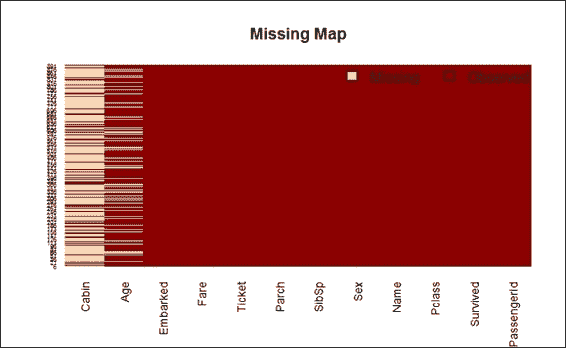

    泰坦尼克号数据集的缺失值地图

## 工作原理...

在 R 中，缺失值通常用`"NA"`符号表示，代表不可用。大多数函数（如`mean`或`sum`）在数据集中遇到 NA 值时可能会输出 NA。尽管您可以分配一个如`na.rm`的参数来消除 NA 的影响，但最好是在数据集中插补或删除缺失数据，以防止缺失值的影响传播。要找出泰坦尼克号数据集中的缺失值，我们首先将所有 NA 值加起来，然后除以每个属性中的值数，然后我们使用`sapply`对具有所有属性进行计算。

此外，为了使用表格显示计算结果，您可以使用`Amelia`包在一张图表上绘制每个属性的缺失值地图。缺失值的可视化使用户能够更好地理解每个数据集中的缺失百分比。从前面的屏幕截图，您可能已经观察到缺失值是米色的，其观测值是深红色。*x*轴显示不同的属性名称，*y*轴显示记录的索引。显然，大多数船舱都显示缺失数据，并且它还显示在计算`Age`属性时大约有 19.87%的数据是缺失的，`Embarked`属性中缺失两个值。

## 还有更多...

为了处理缺失值，我们引入了`Amelia`来可视化它们。除了输入控制台命令外，您还可以使用`Amelia`和`AmeliaView`的交互式 GUI，它允许用户从窗口环境中加载数据集、管理选项和运行`Amelia`。

要启动运行`AmeliaView`，只需在 R 控制台中输入`AmeliaView()`：

```py
> AmeliaView()

```

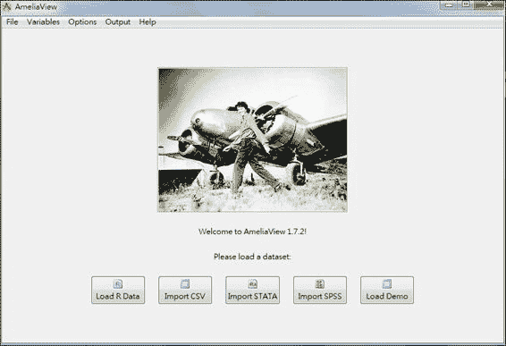

AmeliaView

# 缺失值插补

在检测到每个属性中的缺失值数量后，我们必须插补缺失值，因为它们可能会对从数据中得出的结论产生重大影响。

## 准备工作

此菜谱需要将`train.data`加载到 R 会话中，并且需要完成之前的菜谱，将`Pclass`和`Survived`转换为因子类型。

## 如何操作...

执行以下步骤以插补缺失值：

1.  首先，列出**登船港口**的分布情况。在这里，我们添加`useNA = "always"`参数以显示`train.data`中包含的 NA 值的数量：

    ```py
    > table(train.data$Embarked, useNA = "always")

     C    Q    S <NA> 
     168   77  644    2 

    ```

1.  将两个缺失值赋给一个更可能的港口（即计数最多的港口），在这种情况下是南安普顿：

    ```py
    > train.data$Embarked[which(is.na(train.data$Embarked))] = 'S';
    > table(train.data$Embarked, useNA = "always")

     C    Q    S <NA> 
     168   77  646    0 

    ```

1.  为了发现`train.data`名称中包含的标题类型，我们首先使用空白（正则表达式模式`"\\s+"`）对`train.data$Name`进行分词，然后使用`table`函数计算出现的频率。在此之后，由于名称标题通常以句点结尾，我们使用正则表达式 grep 包含句点的单词。最后，按降序`sort`表格：

    ```py
    > train.data$Name = as.character(train.data$Name)
    > table_words = table(unlist(strsplit(train.data$Name, "\\s+")))
    > sort(table_words [grep('\\.',names(table_words))], decreasing=TRUE)

     Mr.     Miss.      Mrs.   Master. 
     517       182       125        40 
     Dr.      Rev.      Col.    Major. 
     7         6         2            2 
     Mlle.     Capt. Countess.    Don. 
     2         1         1                1 
    Jonkheer.        L.     Lady .      Mme. 
     1         1         1         1 
     Ms.      Sir. 
     1         1 

    ```

1.  要获取包含缺失值的标题，您可以使用`stringr`包提供的`str_match`函数获取包含句点的子串，然后使用`cbind`函数将列绑定在一起。最后，通过使用表格函数获取缺失值的统计信息，您可以逐个标题进行计数：

    ```py
    > library(stringr) 
    > tb = cbind(train.data$Age, str_match(train.data$Name, " [a-zA-Z]+\\."))
    > table(tb[is.na(tb[,1]),2])

     Dr.  Master.    Miss.      Mr.     Mrs. 
     1        4            36       119       17 

    ```

1.  对于包含缺失值的标题，一种数据插补的方法是将每个标题（不包含缺失值）的平均值赋值：

    ```py
    > mean.mr = mean(train.data$Age[grepl(" Mr\\.", train.data$Name) & !is.na(train.data$Age)])
    > mean.mrs = mean(train.data$Age[grepl(" Mrs\\.", train.data$Name) & !is.na(train.data$Age)])
    > mean.dr = mean(train.data$Age[grepl(" Dr\\.", train.data$Name) & !is.na(train.data$Age)])
    > mean.miss = mean(train.data$Age[grepl(" Miss\\.", train.data$Name) & !is.na(train.data$Age)])
    > mean.master =  mean(train.data$Age[grepl(" Master\\.", train.data$Name) & !is.na(train.data$Age)])

    ```

1.  然后，将缺失值赋值为每个标题的平均值：

    ```py
    > train.data$Age[grepl(" Mr\\.", train.data$Name) & is.na(train.data$Age)] = mean.mr
    > train.data$Age[grepl(" Mrs\\.", train.data$Name) & is.na(train.data$Age)] = mean.mrs
    > train.data$Age[grepl(" Dr\\.", train.data$Name) & is.na(train.data$Age)] = mean.dr
    > train.data$Age[grepl(" Miss\\.", train.data$Name) & is.na(train.data$Age)] = mean.miss
    > train.data$Age[grepl(" Master\\.", train.data$Name) & is.na(train.data$Age)] = mean.master

    ```

## 它是如何工作的...

要插补`Embarked`属性的缺失值，我们首先使用`table`函数生成登船港口的统计信息。`table`函数在`train.data`中计算了两个 NA 值。从数据集描述中，我们识别出 C、Q 和 S（C = Cherbourg，Q = Queenstown，S = Southampton）。由于我们不知道这两个缺失值属于哪个类别，一种可能的方法是将缺失值赋给最可能的港口，即`Southampton`。

对于另一个属性，`年龄`，尽管大约 20%的值是缺失的，但用户仍然可以通过每位乘客的头衔来推断缺失值。为了发现数据集中名称中包含多少个头衔，我们建议使用`Name`属性中分段单词的计数方法，这有助于计算每个给定头衔的缺失值数量。结果词表显示了常见的头衔，如`Mr`、`Mrs`、`Miss`和`Master`。您可以参考维基百科上的英语敬语条目以获取每个头衔的描述。

考虑到缺失数据，我们将每个头衔的平均值重新分配给相应的缺失值。然而，对于`船舱`属性，缺失值太多，我们无法从任何引用属性中推断出值。因此，我们通过尝试使用此属性进行进一步分析，发现这种方法不起作用。

## 更多内容...

这里我们列出维基百科上的敬语条目供您参考。根据它（[`en.wikipedia.org/wiki/English_honorific`](http://en.wikipedia.org/wiki/English_honorific)）：

+   **先生**：此词用于男性，无论其婚姻状况如何

+   **先生**：用于拥有第一专业学位的美国人士

+   **小姐**：通常用于未婚女性，尽管已婚女性表演者也会使用

+   **夫人**：用于已婚女性

+   **博士**：用于拥有美国第一专业学位的人士

# 探索和可视化数据

在填充缺失值之后，应进行探索性分析，这包括使用可视化图表和聚合方法来总结数据特征。结果有助于用户更好地理解所使用的数据。以下食谱将介绍如何使用基本的绘图技术，以帮助用户进行探索性分析。

## 准备工作

本食谱需要先前的食谱通过填充`年龄`和`登船`属性中的缺失值来完成。

## 如何操作...

执行以下步骤以探索和可视化数据：

1.  首先，您可以使用条形图和直方图为每个属性生成描述性统计，从乘客生存开始：

    ```py
    > barplot(table(train.data$Survived), main="Passenger Survival",  names= c("Perished", "Survived"))

    ```

    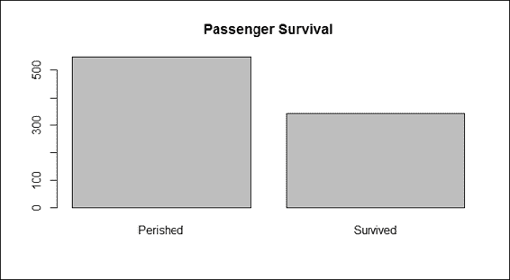

    乘客生存

1.  我们可以生成乘客等级的条形图：

    ```py
    > barplot(table(train.data$Pclass), main="Passenger Class",  names= c("first", "second", "third"))

    ```

    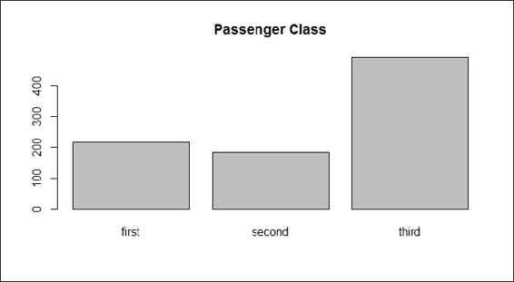

    乘客等级

1.  接下来，我们使用条形图概述性别数据：

    ```py
    > barplot(table(train.data$Sex), main="Passenger Gender")

    ```

    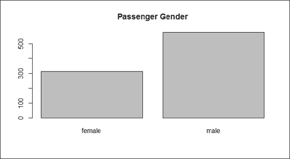

    乘客性别

1.  然后，我们使用`hist`函数绘制不同年龄的直方图：

    ```py
    > hist(train.data$Age, main="Passenger Age", xlab = "Age")

    ```

    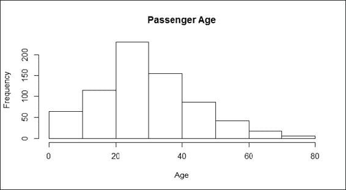

    乘客年龄

1.  我们可以绘制同辈乘客的条形图以获得以下结果：

    ```py
    > barplot(table(train.data$SibSp), main="Passenger Siblings")

    ```

    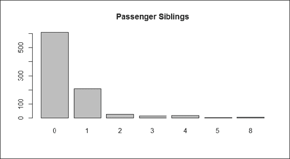

    乘客同辈

1.  接下来，我们可以获取乘客口渴度的分布：

    ```py
    > barplot(table(train.data$Parch), main="Passenger Parch")

    ```

    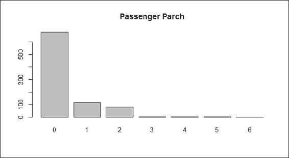

    乘客口渴度

1.  接下来，我们绘制乘客船票的直方图：

    ```py
    > hist(train.data$Fare, main="Passenger Fare", xlab = "Fare")

    ```

    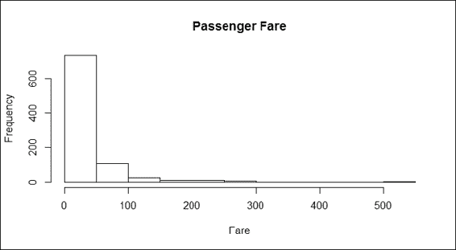

    乘客船票

1.  最后，可以查看登船港口：

    ```py
    > barplot(table(train.data$Embarked), main="Port of Embarkation")

    ```

    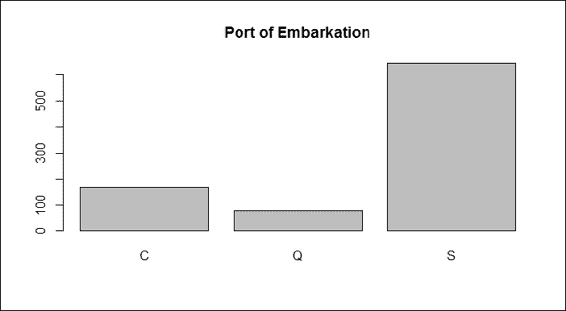

    上船港口

1.  使用 `barplot` 来找出在沉船事故中哪个性别更容易丧生：

    ```py
    > counts = table( train.data$Survived, train.data$Sex)
    > barplot(counts,  col=c("darkblue","red"), legend = c("Perished", "Survived"), main = "Passenger Survival by Sex")

    ```

    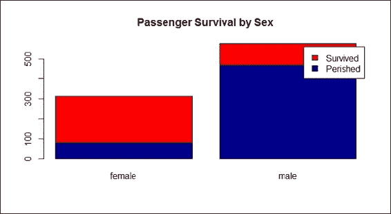

    按性别划分的乘客生存率

1.  接下来，我们应该检查每个乘客的 `Pclass` 因素是否可能影响生存率：

    ```py
    > counts = table( train.data$Survived, train.data$Pclass)
    > barplot(counts,  col=c("darkblue","red"), legend =c("Perished", "Survived"), main= "Titanic Class Bar Plot" )

    ```

    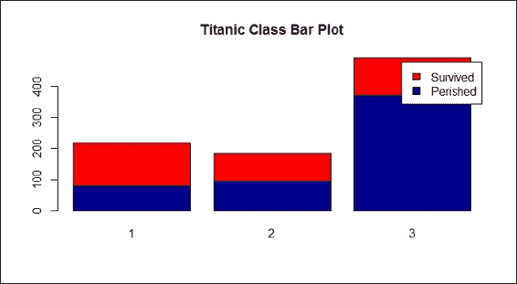

    按舱位划分的乘客生存率

1.  接下来，我们检查每个 `Pclass` 的性别构成：

    ```py
    > counts = table( train.data$Sex, train.data$Pclass)
    > barplot(counts,  col=c("darkblue","red"), legend = rownames(counts), main= "Passenger Gender by Class")

    ```

    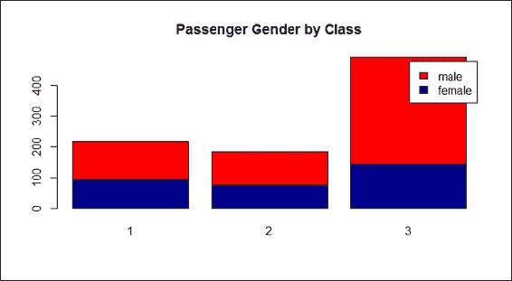

    按舱位划分的乘客性别

1.  此外，我们检查乘客年龄的直方图：

    ```py
    > hist(train.data$Age[which(train.data$Survived == "0")], main= "Passenger Age Histogram", xlab="Age", ylab="Count", col ="blue", breaks=seq(0,80,by=2))
    > hist(train.data$Age[which(train.data$Survived == "1")], col ="red", add = T, breaks=seq(0,80,by=2))

    ```

    

    乘客年龄直方图

1.  要检查年龄和生存率之间关系的更多细节，可以使用 `boxplot`：

    ```py
    > boxplot(train.data$Age ~ train.data$Survived, 
    +         main="Passenger Survival by Age",
    +         xlab="Survived", ylab="Age")

    ```

    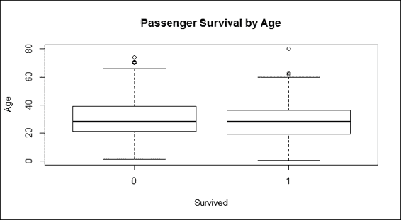

    按年龄划分的乘客生存率

1.  要将不同年龄的人分类到不同的组中，例如儿童（13 岁以下）、青少年（13 至 19 岁）、成年人（20 至 65 岁）和老年人（65 岁以上），请执行以下命令：

    ```py
    >train.child = train.data$Survived[train.data$Age < 13]
    > length(train.child[which(train.child == 1)] ) / length(train.child)
     [1] 0.5797101

    > train.youth = train.data$Survived[train.data$Age >= 15 & train.data$Age < 25]
    > length(train.youth[which(train.youth == 1)] ) / length(train.youth)
    [1] 0.4285714

    > train.adult  = train.data$Survived[train.data$Age >= 20 & train.data$Age < 65]
    > length(train.adult[which(train.adult == 1)] ) / length(train.adult)
     [1] 0.3659218

    > train.senior  = train.data$Survived[train.data$Age >= 65]
    > length(train.senior[which(train.senior == 1)] ) / length(train.senior)
    [1] 0.09090909

    ```

## 它是如何工作的...

在预测生存率之前，一个人应该首先使用聚合和可视化方法来检查每个属性如何影响乘客的命运。因此，我们开始通过生成每个属性的条形图和直方图来检查。

前面截图中的图表为泰坦尼克号数据集的每个属性提供了一个概述。根据第一张截图，在沉船事故中丧生的乘客比幸存的乘客多。在船上的三个舱位中，三等舱的乘客人数最多，这也反映了三等舱是泰坦尼克号上最经济的舱位（第 2 步）。至于性别分布，男性乘客比女性乘客多（第 3 步）。至于年龄分布，第 4 步的截图显示，大多数乘客的年龄在 20 至 40 岁之间。根据第 5 步的截图，大多数乘客有一个或一个以下的兄弟姐妹。第 6 步的截图显示，大多数乘客有 0 到 2 个孩子。

在第 7 步的截图显示，票价直方图显示了票价差异，这可能是由于泰坦尼克号上不同舱位的乘客造成的。最后，第 8 步的截图显示，这艘船停了三次来接乘客。

由于我们从 `sex` 属性开始探索，并且根据产生的条形图，它清楚地显示在沉船事故中女性乘客的生存率高于男性（第 9 步）。此外，维基百科上关于泰坦尼克号（[`en.wikipedia.org/wiki/RMS_Titanic`](http://en.wikipedia.org/wiki/RMS_Titanic)）的条目解释说，“由于一些官员在装载救生艇时遵循了‘妇女和儿童优先’的协议，因此有不成比例的男性被留在船上”。因此，女性幸存者人数超过男性幸存者人数是合理的。换句话说，仅使用 `sex` 就可以以高精度预测一个人是否会幸存。

然后，我们考察了乘客等级是否影响了生存率（步骤 10）。在这里，根据`Pclass`的定义，每个等级的票价都相应地与质量定价；一等舱票价高，三等舱票价低。由于每个乘客的等级似乎表明了他们的社会和财务状况，因此可以合理地假设富裕的乘客可能更有机会幸存。

不幸的是，等级与生存率之间没有相关性，因此结果并没有显示出我们假设的现象。然而，在我们检查了`pclass`组成中的`sex`（步骤 11）之后，结果揭示出大多数三等舱乘客是男性；富裕的人更有可能幸存的假设可能并不那么具体。

接下来，我们通过直方图和箱线图（步骤 12）考察了年龄与乘客命运之间的关系。条形图显示了年龄分布，其中水平柱状图表示乘客的年龄，红色柱状图代表幸存者，蓝色柱状图代表遇难者。很难从不同年龄组的年龄中看出生存率的差异。我们创建的条形图并没有证明不同年龄组的乘客更有可能幸存。另一方面，这些图显示船上大多数人的年龄在 20 至 40 岁之间，但并没有显示出这个群体与老年人或年幼儿童相比是否更有可能幸存（步骤 13）。在这里，我们引入了箱线图，这是一种标准化的绘图技术，可以显示数据的分布，包括最小值、第一四分位数、中位数、第三四分位数、最大值和异常值。

后来，我们进一步考察了年龄组与乘客命运之间是否存在任何关系，通过将乘客年龄分为四个组别。统计数据显示，儿童组（13 岁以下）比青少年（13 至 20 岁）、成年人（20 至 65 岁）和老年人（65 岁以上）更有可能幸存。结果显示，年轻年龄组的人更有可能从海难中幸存。然而，我们注意到这可能是由“妇女和儿童优先”的协议导致的。

## 还有更多...

除了使用条形图、直方图和箱线图来可视化数据外，还可以在`vcd`包中应用`mosaicplot`来检查多个分类变量之间的关系。例如，当我们检查`Survived`和`Pclass`变量之间的关系时，应用过程如下：

```py
> mosaicplot(train.data$Pclass ~ train.data$Survived, 
+           main="Passenger Survival Class", color=TRUE, 
+  xlab="Pclass", ylab="Survived")

```

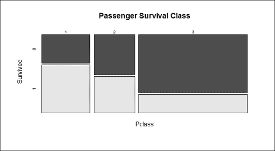

乘客按等级的生存情况

## 参见

+   关于海难的更多信息，可以阅读 RMS 泰坦尼克号的历史（请参阅维基百科中的条目*RMS 泰坦尼克号的沉没* [`en.wikipedia.org/wiki/Sinking_of_the_RMS_Titanic`](http://en.wikipedia.org/wiki/Sinking_of_the_RMS_Titanic)），因为当时实施的某些协议可能极大地影响了乘客的生存率。

# 使用决策树预测乘客生存情况

探索性分析有助于用户了解单个或多个变量可能如何影响生存率。然而，它并不能确定哪些组合可以生成预测模型，以便预测乘客的生存。另一方面，机器学习可以从训练数据集中生成预测模型，从而用户可以将模型应用于预测给定属性的可能的标签。在本菜谱中，我们将介绍如何使用决策树从给定变量中预测乘客的生存率。

## 准备工作

我们将使用我们在之前的菜谱中已经使用过的数据，`train.data`。

## 如何操作...

执行以下步骤来使用决策树预测乘客的生存情况：

1.  首先，我们构建一个具有三个输入参数的数据拆分函数`split.data`：`data`参数表示输入数据集，`p`参数表示从输入数据集中生成的子集的比例，`s`参数表示随机种子：

    ```py
    > split.data = function(data, p = 0.7, s = 666){
    +     set.seed(s)
    +     index = sample(1:dim(data)[1])
    +     train = data[index[1:floor(dim(data)[1] * p)], ]
    +     test = data[index[((ceiling(dim(data)[1] * p)) + 1):dim(data)[1]], ]
    +     return(list(train = train, test = test))
    + } 

    ```

1.  然后，我们将数据分为训练集和测试集，其中 70%分配给训练集，剩余的 30%用于测试集：

    ```py
    > allset= split.data(train.data, p = 0.7) 
    > trainset = allset$train 
    > testset = allset$test

    ```

1.  对于条件树，必须使用`party`包中的`ctree`函数；因此，我们需要安装并加载`party`包：

    ```py
    > install.packages('party')
    > require('party')

    ```

1.  然后，我们将`Survived`用作标签来生成正在使用的预测模型。之后，我们将分类树模型分配给`train.ctree`变量：

    ```py
    > train.ctree = ctree(Survived ~ Pclass + Sex + Age + SibSp + Fare + Parch + Embarked, data=trainset)
    > train.ctree

     Conditional inference tree with 7 terminal nodes

    Response:  Survived 
    Inputs:  Pclass, Sex, Age, SibSp, Fare, Parch, Embarked 
    Number of observations:  623 

    1) Sex == {male}; criterion = 1, statistic = 173.672
     2) Pclass == {2, 3}; criterion = 1, statistic = 30.951
     3) Age <= 9; criterion = 0.997, statistic = 12.173
     4) SibSp <= 1; criterion = 0.999, statistic = 15.432
     5)*  weights = 10 
     4) SibSp > 1
     6)*  weights = 11 
     3) Age > 9
     7)*  weights = 282 
     2) Pclass == {1}
     8)*  weights = 87 
    1) Sex == {female}
     9) Pclass == {1, 2}; criterion = 1, statistic = 59.504
     10)*  weights = 125 
     9) Pclass == {3}
     11) Fare <= 23.25; criterion = 0.997, statistic = 12.456
     12)*  weights = 85 
     11) Fare > 23.25
     13)*  weights = 23 

    ```

1.  我们使用一个`plot`函数来绘制树形图：

    ```py
    > plot(train.ctree, main="Conditional inference tree of Titanic Dataset")

    ```

    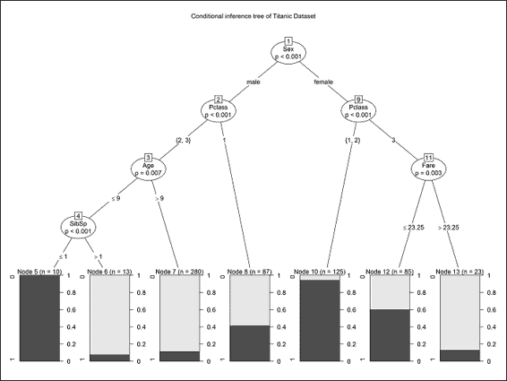

    泰坦尼克号数据集的条件推理树

## 工作原理...

本菜谱介绍了如何使用条件推理树`ctree`来预测乘客的生存情况。虽然条件推理树不是解决分类问题的唯一方法，但它是一种易于理解预测乘客生存决策路径的方法。

我们首先使用我们实现的函数`split.data`将数据分为训练集和测试集。这样，我们就可以使用训练集生成预测模型，然后在模型评估的菜谱中使用预测模型对测试集进行预测。然后，我们安装并加载`party`包，并使用`ctree`构建预测模型，其中`Survived`作为其标签。不考虑任何特定属性，我们将`Pclass`、`Sex`、`Age`、`SibSp`、`Parch`、`Embarked`和`Fare`等属性作为训练属性，除了`Cabin`，因为该属性的大部分值都是缺失的。

构建预测模型后，我们可以以文本模式打印决策路径和节点，或者使用绘图函数绘制决策树。从决策树中，用户可以看到哪些变量的组合可能有助于预测生存率。根据前面的截图，用户可以找到一个 `Pclass` 和 `Sex` 的组合，这作为一个好的决策边界（节点 9）来预测生存率。这表明大多数在头等舱和二等舱的女性乘客在船难中幸存。男性乘客，那些在二等舱和三等舱以及年龄超过九岁的乘客，在船难中几乎全部丧生。从树中，人们可能会发现属性如 `Embarked` 和 `Parch` 是缺失的。这是因为条件推断树在分类过程中将这些属性视为不太重要。

从决策树中，用户可以看到哪些变量的组合可能有助于预测生存率。此外，条件推断树在分类过程中选择重要属性时很有帮助；用户可以检查构建的树，以查看所选属性是否与假设相符。

## 还有更多...

本食谱涵盖了与分类算法和条件推断树相关的问题。由于我们不讨论适应算法的背景知识，因此用户最好在需要时使用 `help` 函数查看 `party` 包中与 `ctree` 相关的文档。

存在着一个类似的决策树包，名为 `rpart`。`party` 和 `rpart` 之间的区别在于，`party` 包中的 `ctree` 避免了 `rpart` 和 `party` 包中的 `ctree` 的以下变量选择偏差，倾向于选择具有许多可能分割或许多缺失值的变量。与其他方法不同，`ctree` 使用显著性检验程序来选择变量，而不是选择最大化信息量的变量。

除了 `ctree` 之外，还可以使用 `svm` 生成预测模型。要加载 `svm` 函数，首先加载 `e1071` 包，然后使用 `svm` 构建生成此预测：

```py
> install.packages('e1071')
> require('e1071')
> svm.model = svm(Survived ~ Pclass + Sex + Age + SibSp + Fare + Parch + Embarked, data = trainset, probability = TRUE)

```

在这里，我们使用 `svm` 来展示当使用 R 时，如何轻松地将不同的机器学习算法立即应用于同一数据集。有关如何使用 `svm` 的更多信息，请参阅第六章，*分类（II）——神经网络，SVM*。

# 使用混淆矩阵验证预测能力

构建预测模型后，验证模型在预测标签时的表现非常重要。在前面的食谱中，我们使用 `ctree` 构建了一个模型，并将数据预先分割为训练集和测试集。现在，用户将学习如何通过使用混淆矩阵来验证 `ctree` 在生存预测中的表现。

## 准备工作

在评估预测模型之前，首先确保生成的训练集和测试数据集在 R 会话中。

## 如何操作...

执行以下步骤以验证预测能力：

1.  我们开始使用构建的`train.ctree`模型来预测测试集的生存率：

    ```py
    > ctree.predict = predict(train.ctree, testset)

    ```

1.  首先，我们安装`caret`包，然后加载它：

    ```py
    > install.packages("caret")
    > require(caret)

    ```

1.  在加载`caret`之后，可以使用混淆矩阵生成输出矩阵的统计信息：

    ```py
    > confusionMatrix(ctree.predict, testset$Survived)
    Confusion Matrix and Statistics

     Reference
    Prediction   0   1
     0 160  25
     1  16  66

     Accuracy : 0.8464 
     95% CI : (0.7975, 0.8875)
     No Information Rate : 0.6592 
     P-Value [Acc > NIR] : 4.645e-12 

     Kappa : 0.6499 
     Mcnemar's Test P-Value : 0.2115 

     Sensitivity : 0.9091 
     Specificity : 0.7253 
     Pos Pred Value : 0.8649 
     Neg Pred Value : 0.8049 
     Prevalence : 0.6592 
     Detection Rate : 0.5993 
     Detection Prevalence : 0.6929 
     Balanced Accuracy : 0.8172 

     'Positive' Class : 0

    ```

## 它是如何工作的...

在前一个食谱中构建预测模型后，重要的是要衡量所构建模型的性能。性能可以通过预测结果是否与测试数据集中包含的原始标签匹配来评估。评估可以通过使用 caret 包提供的混淆矩阵来生成混淆矩阵来完成，这是衡量预测准确率的一种方法。

要生成混淆矩阵，用户首先需要安装并加载`caret`包。混淆矩阵显示，仅使用`ctree`可以达到高达 84%的准确率。可以通过调整使用的属性或替换分类算法为 SVM、`glm`或随机森林来生成更好的预测模型。

## 还有更多...

`caret`包（*分类和回归训练*）有助于使迭代和比较不同的预测模型变得非常方便。该包还包含几个函数，包括：

+   数据拆分

+   常见的预处理：创建虚拟变量、识别零和接近零方差预测变量、寻找相关预测变量、中心化、缩放等

+   训练（使用交叉验证）

+   常见的可视化（例如，`特征图`）

# 使用 ROC 曲线评估性能

另一种测量方法是使用 ROC 曲线（这需要`ROCR`包），它根据其真正率与假正率绘制曲线。本食谱将介绍我们如何使用 ROC 曲线来衡量预测模型的性能。

## 准备工作

在将 ROC 曲线应用于评估预测模型之前，首先确保生成的训练集、测试数据集和构建的预测模型`ctree.predict`都在 R 会话中。

## 如何操作...

执行以下步骤以评估预测性能：

1.  准备概率矩阵：

    ```py
    > train.ctree.pred = predict(train.ctree, testset)
    > train.ctree.prob =  1- unlist(treeresponse(train.ctree, testset), use.names=F)[seq(1,nrow(testset)*2,2)]

    ```

1.  安装并加载`ROCR`包：

    ```py
    > install.packages("ROCR")
    > require(ROCR)

    ```

1.  从概率创建`ROCR`预测对象：

    ```py
    > train.ctree.prob.rocr = prediction(train.ctree.prob, testset$Survived)

    ```

1.  准备 ROC 曲线（`tpr`为真正率，`fpr`为假正率）和曲线下面积（AUC）的 ROCR 性能对象：

    ```py
    > train.ctree.perf = performance(train.ctree.prob.rocr, "tpr","fpr")
    > train.ctree.auc.perf =  performance(train.ctree.prob.rocr, measure = "auc", x.measure = "cutoff")

    ```

1.  绘制 ROC 曲线，将颜色设置为`TRUE`，并将`AUC`作为标题：

    ```py
    > plot(train.ctree.perf, col=2,colorize=T, main=paste("AUC:", train.ctree.auc.perf@y.values))

    ```

    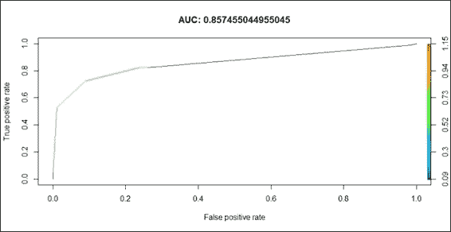

    预测模型的 ROC

## 它是如何工作的...

在这里，我们首先从概率矩阵中创建预测对象，然后准备 ROC 曲线（`tpr=true positive rate`，`fpr=false positive rate`）和 AUC 的 ROCR 性能对象。最后，我们使用绘图函数绘制 ROC 曲线。

前一截图中的结果可以这样解释：曲线下方的面积越大（完美的预测将使 AUC 等于 1），模型的预测精度就越好。我们的模型返回的值为 0.857，这表明简单的条件推理树模型足够强大，可以做出生存预测。

## 参考资料也

+   要获取更多关于 ROCR 的信息，您可以阅读以下论文：*Sing, T.*，*Sander, O.*，*Berenwinkel, N.*，和*Lengauer, T.*（2005）。*ROCR: 在 R 中可视化分类器性能*。《生物信息学》，21(20)，3940-3941。
