# 第三章 R 和统计学

在本章中，我们将涵盖以下主题：

+   理解 R 中的数据抽样

+   在 R 中操作概率分布

+   在 R 中使用单变量描述性统计

+   执行相关性和多元分析

+   操作线性回归和多元分析

+   执行精确二项检验

+   执行学生 t 检验

+   执行 Kolmogorov-Smirnov 测试

+   理解 Wilcoxon 秩和检验和符号秩检验

+   使用 Pearson 的卡方检验进行操作

+   执行单因素方差分析

+   执行双因素方差分析

# 简介

R 语言作为统计语言 S 的后代，已成为统计学领域的首选计算语言。此外，由于其在该领域的活跃贡献者地位，如果发现新的统计方法，它很可能首先在 R 语言中实现。因此，通过应用 R 语言可以满足大量的统计方法。

要在 R 中应用统计方法，用户可以将实现方法分为描述性统计和推断性统计：

+   **描述性统计**：这些用于总结数据的特征。用户可以使用平均值和标准差来描述数值数据，并使用频率和百分比来描述分类数据。

+   **推断性统计**：基于样本数据中的模式，用户可以推断总体的特征。与推断性统计相关的方法包括假设检验、数据估计、数据相关性和关系建模。推断还可以进一步扩展到预测、预测和估计与被研究总体相关或未观察到的值。

在以下食谱中，我们将讨论数据抽样、概率分布、单变量描述性统计、相关性和多元分析、线性回归和多元分析、精确二项检验、学生 t 检验、Kolmogorov-Smirnov 检验、Wilcoxon 秩和检验和符号秩检验、Pearson 的卡方检验、单因素方差分析（ANOVA）和双因素方差分析（ANOVA）的示例。

# 理解 R 中的数据抽样

抽样是从统计总体中选择数据子集的一种方法，可以利用总体的特征来估计整个总体。以下食谱将演示如何在 R 中生成样本。

## 准备工作

确保您为以下食谱有一个 R 工作环境。

## 如何做...

执行以下步骤以了解 R 中的数据抽样：

1.  为了生成给定总体的随机样本，用户可以简单地使用 `sample` 函数：

    ```py
    > sample(1:10)

    ```

1.  要指定返回的项目数，用户可以将分配的值设置为 `size` 参数：

    ```py
    > sample(1:10, size = 5)

    ```

1.  此外，通过指定 `replace = TRUE`（默认为 `FALSE`），样本还可以生成伯努利试验：

    ```py
    > sample(c(0,1), 10, replace = TRUE)

    ```

## 它是如何工作的...

如前所示，`sample` 函数可以从指定的总体中生成随机样本。用户可以通过指定 `size` 参数来指定记录返回的数字。将 `replace` 参数赋值为 `TRUE`，可以生成伯努利试验（只有 `0` 和 `1` 的总体）。

## 参见

+   在 R 中，默认包提供了一个另一个样本方法，`sample.int`，其中 n 和 size 都必须以整数形式提供：

    ```py
    > sample.int(20, 12)

    ```

# 在 R 中操作概率分布

概率分布和统计分析密切相关。对于统计分析，分析师基于某个总体进行预测，该总体通常位于概率分布下。因此，如果您发现用于预测的数据在实验设计中并不遵循假设的概率分布，则可以反驳即将到来的结果。换句话说，概率为统计学提供了依据。以下示例将演示如何在 R 中生成概率分布。

## 准备工作

由于大多数分布函数都源自 `stats` 包，请确保已加载 `stats` 库。

## 如何做...

执行以下步骤：

1.  对于正态分布，用户可以使用 `dnorm`，它将返回正态曲线在 `0` 处的高度：

    ```py
    > dnorm(0)
    [1] 0.3989423

    ```

1.  然后，用户可以在参数中更改均值和标准差：

    ```py
    > dnorm(0,mean=3,sd=5)
    [1] 0.06664492

    ```

1.  接下来，使用 `curve` 函数绘制正态分布的图形：

    ```py
    > curve(dnorm,-3,3)

    ```

    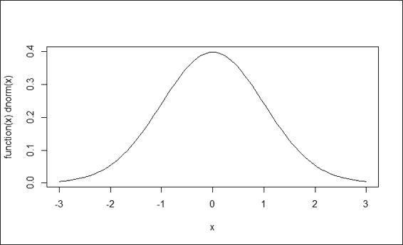

    标准正态分布

1.  与返回正态曲线高度的 `dnorm` 相比，`pnorm` 函数可以返回给定值下的面积：

    ```py
    > pnorm(1.5)
    [1] 0.9331928

    ```

1.  或者，要获取某个值以上的面积，可以将选项 `lower.tail` 指定为 `FALSE`：

    ```py
    > pnorm(1.5, lower.tail=FALSE)
    [1] 0.0668072

    ```

1.  要绘制 `pnorm` 的图形，用户可以使用 `curve` 函数：

    ```py
    > curve(pnorm(x), -3,3)

    ```

    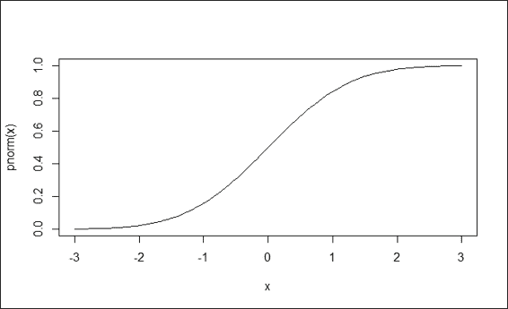

    累积密度函数（pnorm）

1.  要计算特定分布的分位数，可以使用 `qnorm`。函数 `qnorm` 可以被视为 `pnorm` 的逆函数，它返回给定概率的 Z 分数：

    ```py
    > qnorm(0.5)
    [1] 0
    > qnorm(pnorm(0))
    [1] 0

    ```

1.  要从正态分布生成随机数，可以使用 `rnorm` 函数并指定生成的数字数量。此外，还可以定义可选参数，例如均值和标准差：

    ```py
    > set.seed(50)
    > x = rnorm(100,mean=3,sd=5)
    > hist(x)

    ```

    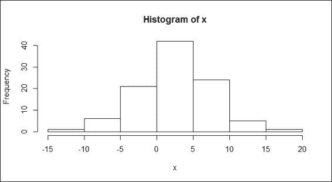

    正态分布的直方图

1.  要计算均匀分布，`runif` 函数会生成均匀分布的随机数。用户可以通过指定变量，如最小值和最大值，来指定生成的数字的范围。以下示例中，用户生成了从 `0` 到 `5` 的 100 个随机变量：

    ```py
    > set.seed(50)
    > y = runif(100,0,5)
    > hist(y)

    ```

    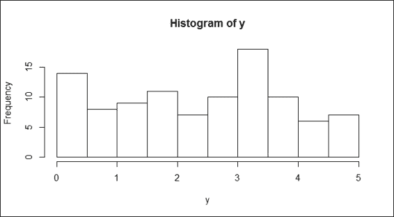

    均匀分布的直方图

1.  最后，如果您想测试数据的正态性，最常用的测试方法是 Shapiro-Wilks 测试。在这里，我们演示如何分别对正态分布和均匀分布的样本进行正态性测试：

    ```py
    > shapiro.test(x)

     Shapiro-Wilk normality test

    data:  x 
    W = 0.9938, p-value = 0.9319
    > shapiro.test(y)

     Shapiro-Wilk normality test

    data:  y 
    W = 0.9563, p-value = 0.002221

    ```

## 它是如何工作的...

在这个菜谱中，我们首先介绍 `dnorm`，这是一个概率密度函数，它返回正态曲线的高度。如果指定单个输入，则该输入值被称为标准分数或 z 分数。如果没有指定其他参数，则默认使用均值为零、标准差为一的正态分布。然后，我们介绍三种绘制标准正态分布的方法。

在此之后，我们介绍 `pnorm`，这是一个累积密度函数。该函数 `pnorm` 可以生成给定值下的面积。除此之外，`pnorm` 还可以用来从正态分布中计算 p 值。可以通过从数字中减去 1 或将 `lower.tail` 选项赋值为 True 来获取 p 值。同样，可以使用 `plot` 函数来绘制累积密度图。

与 `pnorm` 不同，`qnorm` 返回给定概率的 z 分数。因此，示例表明将 `qnorm` 函数应用于 `pnorm` 函数将产生确切的输入值。

接下来，我们向您展示如何使用 `rnorm` 函数从正态分布中生成随机样本，以及如何使用 `runif` 函数从均匀分布中生成随机样本。在 `rnorm` 函数中，必须指定生成的数字数量，我们还可以添加可选参数，如均值和标准差。然后，通过使用 `hist` 函数，应该能够在图 3 中找到一个钟形曲线。另一方面，对于 `runif` 函数，通过指定最小值和最大值，可以得到两个值之间的样本数字列表。然而，我们仍然可以使用 `hist` 函数来绘制样本。很明显，输出图（如前图所示）不是钟形，这表明样本不是来自正态分布。

最后，我们演示如何使用 Shapiro-Wilks 测试来测试数据正态性。在这里，我们对正态分布和均匀分布的样本分别进行正态性测试。在两个输出中，可以在每个测试结果中找到 p 值。p 值显示了变化，表明样本来自正态分布。如果 p 值高于 0.05，我们可以得出结论，样本来自正态分布。另一方面，如果值低于 0.05，我们得出结论，样本不是来自正态分布。

## 还有更多...

除了正态分布之外，您还可以通过使用 R 的内置函数来获得 t 分布、二项分布和卡方分布。您可以使用 `help` 函数来获取更多相关信息：

+   对于 t 分布：

    ```py
    > help(TDist)

    ```

+   对于二项分布：

    ```py
    >help(Binomial)

    ```

+   对于卡方分布：

    ```py
    >help(Chisquare)

    ```

要了解包中的分布，用户可以使用关键字`distributions`访问`help`函数，以找到所有相关文档：

```py
> help(distributions)

```

# 在 R 中使用单变量描述性统计

单变量描述性统计描述了用于单元分析的单个变量，这也是定量分析的最简单形式。在本菜谱中，我们介绍了一些用于描述单个变量的基本函数。

## 准备工作

我们需要对样本数据进行描述性统计分析。在这里，我们使用内置的`mtcars`数据作为示例。

## 如何操作...

执行以下步骤：

1.  首先，将`mtcars`数据加载到名为`mtcars`的数据框中：

    ```py
    > data(mtcars)

    ```

1.  要获取向量范围，`range`函数将返回向量的下界和上界：

    ```py
    > range(mtcars$mpg)
    [1] 10.4 33.9

    ```

1.  计算变量的长度：

    ```py
    > length(mtcars$mpg)
    [1] 32

    ```

1.  获取 mpg 的平均值：

    ```py
    > mean(mtcars$mpg)
    [1] 20.09062

    ```

1.  获取输入向量的中位数：

    ```py
    > median(mtcars$mpg)
    [1] 19.2

    ```

1.  要获取输入向量的标准差：

    ```py
    > sd(mtcars$mpg)
    [1] 6.026948

    ```

1.  要获取输入向量的方差：

    ```py
    > var(mtcars$mpg)
    [1] 36.3241

    ```

1.  方差也可以通过标准差的平方来计算：

    ```py
    > sd(mtcars$mpg) ^ 2
    [1] 36.3241

    ```

1.  要获取**四分位距**（**IQR**）：

    ```py
    > IQR(mtcars$mpg)
    [1] 7.375

    ```

1.  要获取分位数：

    ```py
    > quantile(mtcars$mpg,0.67)
     67% 
    21.4

    ```

1.  要获取输入向量的最大值：

    ```py
    > max(mtcars$mpg)
    [1] 33.9

    ```

1.  要获取输入向量的最小值：

    ```py
    > min(mtcars$mpg)
    [1] 10.4

    ```

1.  要获取包含累积最大值的向量：

    ```py
    > cummax(mtcars$mpg)
     [1] 21.0 21.0 22.8 22.8 22.8 22.8 22.8 24.4 24.4 24.4 24.4 24.4 24.4 24.4 24.4 24.4
    [17] 24.4 32.4 32.4 33.9 33.9 33.9 33.9 33.9 33.9 33.9 33.9 33.9 33.9 33.9 33.9 33.9

    ```

1.  要获取包含累积最小值的向量：

    ```py
    > cummin(mtcars$mpg)
     [1] 21.0 21.0 21.0 21.0 18.7 18.1 14.3 14.3 14.3 14.3 14.3 14.3 14.3 14.3 10.4 10.4
    [17] 10.4 10.4 10.4 10.4 10.4 10.4 10.4 10.4 10.4 10.4 10.4 10.4 10.4 10.4 10.4 10.4

    ```

1.  要总结数据集，你可以应用`summary`函数：

    ```py
    > summary(mtcars)

    ```

1.  要获取分类数据的频率计数，以`mtcars`中的`cyl`为例：

    ```py
    > table(mtcars$cyl)

     4  6  8
    11  7 14

    ```

1.  要获取数值数据的频率计数，你可以使用茎叶图来概述数据形状；`stem`生成给定值的茎叶图：

    ```py
    > stem(mtcars$mpg)

     The decimal point is at the |

     10 | 44
     12 | 3
     14 | 3702258
     16 | 438
     18 | 17227
     20 | 00445
     22 | 88
     24 | 4
     26 | 03
     28 | 
     30 | 44
     32 | 49

    ```

1.  你可以使用 ggplot 的直方图来绘制相同的茎叶图：

    ```py
    > library(ggplot2)
    > qplot(mtcars$mpg, binwidth=2)

    ```

    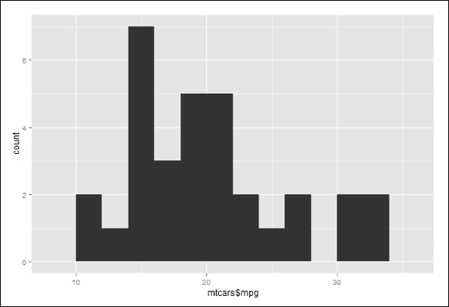

    mtcars 中 mpg 的直方图

## 它是如何工作的...

单变量描述性统计生成数据集的频率分布。此外，它们可以用来识别数据中的明显模式和变量的特征，从而从整体视角更好地理解数据。此外，它们还可以提供关于个别案例的中心趋势和偏度描述符的信息。因此，在数据探索过程的开始阶段进行单变量分析是很常见的。

要开始探索数据，我们首先将数据集`mtcars`加载到 R 会话中。从数据中，我们应用`range`、`length`、`mean`、`median`、`sd`、`var`、`IQR`、`quantile`、`min`、`max`、`cumin`和`cumax`来获取属性`mpg`的描述性统计量。然后，我们使用`summary`函数来获取关于`mtcars`的摘要信息。

接下来，我们获取分类数据（`cyl`）的频率计数。为了获取数值数据的频率计数，我们使用茎叶图来概述数据形状。最后，我们使用带有`binwidth`参数的直方图，在`2`中生成一个类似于茎叶图的图表。

## 更多内容...

在单变量描述性统计中，一个常见的场景是找到一个向量的众数。在 R 中，没有内置的函数来帮助用户获取数据的众数。然而，可以通过以下代码实现众数函数：

```py
> mode = function(x) {
+ temp = table(x)
+ names(temp)[temp == max(temp)]
+ }

```

通过对向量`mtcars$mpg`应用`mode`函数，您可以找到给定向量中最频繁出现的数值或类别：

```py
> x = c(1,2,3,3,3,4,4,5,5,5,6)
> mode(x)
[1] "3" "5"

```

# 执行相关性和多元分析

要分析两个以上变量的关系，您需要进行多元描述性统计，这允许比较因素。此外，它防止单个变量的影响扭曲分析。在本菜谱中，我们将讨论如何使用相关性和协方差矩阵进行多元描述性统计。

## 准备工作

确保在 R 会话中已经将`mtcars`加载到数据框中。

## 如何做...

执行以下步骤：

1.  在这里，您可以通过将`mtcars`中的前三个变量输入到`cov`函数中来获取协方差矩阵：

    ```py
    > cov(mtcars[1:3])
     mpg        cyl       disp
    mpg    36.324103  -9.172379  -633.0972
    cyl    -9.172379   3.189516   199.6603
    disp -633.097208 199.660282 15360.7998

    ```

1.  要获取数据集的相关矩阵，我们将`mtcars`的前三个变量输入到`cor`函数中：

    ```py
    > cor(mtcars[1:3])
     mpg        cyl       disp
    mpg   1.0000000 -0.8521620 -0.8475514
    cyl  -0.8521620  1.0000000  0.9020329
    disp -0.8475514  0.9020329  1.0000000

    ```

## 它是如何工作的...

在本菜谱中，我们已经展示了如何应用相关性和协方差来发现多个变量之间的关系。

首先，我们计算前三个`mtcars`变量的协方差矩阵。协方差可以衡量变量之间的线性关系。因此，正协方差（例如，`cyl`与`mpg`）表示两个变量呈正线性相关。另一方面，负协方差（例如，`mpg`与`disp`）表示两个变量呈负线性相关。然而，由于不同数据集的方差不同，这些数据集的协方差分数是不可比较的。因此，如果您想比较不同数据集中两个变量之间线性关系的强度，您应该使用归一化分数，即相关系数，而不是协方差。

接下来，我们应用`cor`函数来获取`mtcars`数据集中三个变量的相关系数矩阵。在相关系数矩阵中，矩阵的数值元素表示两个变量之间关系的强度。如果一个变量与其自身的相关系数得分为`1`，则该变量与其自身有正相关关系。`cyl`和`mpg`变量的相关系数为-0.85，这意味着它们有强烈的负相关关系。另一方面，`disp`和`cyl`变量的得分为 0.90，这可能表明它们有强烈的正相关关系。

## 另请参阅

+   您可以使用`ggplot`绘制相关系数矩阵的热图：

    ```py
    > library(reshape2)
    > qplot(x=Var1, y=Var2, data=melt(cor(mtcars[1:3])), fill=value, geom="tile")

    ```

    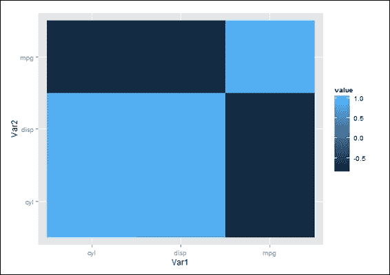

    相关系数矩阵热图

# 操作线性回归和多元分析

线性回归是一种评估因变量和自变量之间关联的方法。在本教程中，我们将介绍如何进行多元分析的线性回归。

## 准备工作

确保在 R 会话中已经将`mtcars`数据框加载到数据中。

## 如何操作...

执行以下步骤：

1.  要将变量拟合到线性模型中，您可以使用`lm`函数：

    ```py
    > lmfit = lm(mtcars$mpg ~ mtcars$cyl)
    > lmfit

    Call:
    lm(formula = mtcars$mpg ~ mtcars$cyl)

    Coefficients:
    (Intercept)   mtcars$cyl 
     37.885       -2.876 

    ```

1.  要获取拟合模型的详细信息，您可以使用`summary`函数：

    ```py
    > summary(lmfit)

    Call:
    lm(formula = mtcars$mpg ~ mtcars$cyl)

    Residuals:
     Min      1Q  Median      3Q     Max 
    -4.9814 -2.1185  0.2217  1.0717  7.5186 

    Coefficients:
     Estimate Std. Error t value Pr(>|t|) 
    (Intercept)  37.8846     2.0738   18.27  < 2e-16 ***
    mtcars$cyl   -2.8758     0.3224   -8.92 6.11e-10 ***
    ---
    Signif. codes:  0 '***' 0.001 '**' 0.01 '*' 0.05 '.' 0.1 ' ' 1

    Residual standard error: 3.206 on 30 degrees of freedom
    Multiple R-squared:  0.7262,  Adjusted R-squared:  0.7171 
    F-statistic: 79.56 on 1 and 30 DF,  p-value: 6.113e-10

    ```

1.  要创建一个方差分析表，可以使用`anova`函数：

    ```py
    > anova(lmfit)
    Analysis of Variance Table

    Response: mtcars$mpg
     Df Sum Sq Mean Sq F value    Pr(>F) 
    mtcars$cyl  1 817.71  817.71  79.561 6.113e-10 ***
    Residuals  30 308.33   10.28 
    ---
    Signif. codes:  0 '***' 0.001 '**' 0.01 '*' 0.05 '.' 0.1 ' ' 1

    ```

1.  要在两个变量的散点图上绘制回归线，您首先在图中绘制`cyl`对`mpg`，然后使用`abline`函数在图上添加回归线：

    ```py
    > lmfit = lm(mtcars$mpg ~ mtcars$cyl)
    > plot(mtcars$cyl, mtcars$mpg)
    > abline(lmfit)

    ```

    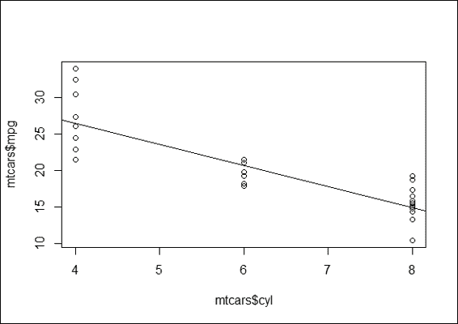

    cyl 与 mpg 的回归图

## 工作原理...

在本教程中，我们应用线性模型函数`lm`，它构建两个变量的线性拟合模型并返回公式和系数。接下来，我们应用`summary`函数来检索模型的详细信息（包括 F 统计量和 P 值）。F 统计量的目的是测试模型的统计显著性。它产生一个 F 值，即模型均方与误差均方的比率。因此，大的 F 值表明回归模型解释了更多的总变异性。然后，我们可以使用 F 值来支持或拒绝所有回归系数都等于零的零假设。换句话说，如果 F 值大且显示回归模型具有预测能力，则拒绝零假设。另一方面，每个属性的 P 值测试系数等于零的零假设（对响应变量没有影响）。换句话说，低 P 值可以拒绝零假设，并表明预测变量的值的变化与响应变量的值有关。

接下来，我们将 `anova` 函数应用于拟合的模型以确定方差。该函数输出平方和，代表模型预测值的变异性。此外，为了可视化两个变量之间的线性关系，`abline` 函数可以在 `mpg` 对 `cyl` 的散点图上添加回归线。从前面的图中可以看出，`mpg` 和 `cyl` 变量呈负相关。

## 参考内容

+   有关如何进行线性和非线性回归分析的更多信息，请参阅第四章理解回归分析，*理解回归分析*

# 进行精确的二项式检验

在做决策时，了解决策错误是否可以控制或衡量是很重要的。换句话说，我们希望证明形成的假设不太可能偶然发生，并且具有统计学意义。在假设检验中，有两种假设：零假设和备择假设（或研究假设）。假设检验的目的是验证实验结果是否具有显著性。然而，为了验证备择假设是否可接受，如果零假设被拒绝，则认为它是真实的。

在下面的食谱中，我们将讨论一些常见的统计检验方法。首先，我们将介绍如何在 R 中进行精确的二项式检验。

## 准备工作

由于 `binom.test` 函数来自 `stats` 包，请确保已加载 `stats` 库。

## 如何操作...

执行以下步骤：

1.  假设有一个游戏，赌徒可以通过掷出骰子的六点来赢得游戏。作为规则的一部分，赌徒可以携带自己的骰子。如果一个赌徒试图在游戏中作弊，他会使用一个加重的骰子来增加他赢得游戏的几率。因此，如果我们观察到赌徒在 315 场游戏中赢了 92 场，我们可以通过进行精确的二项式检验来确定骰子是否公平：

    ```py
    > binom.test(x=92, n=315, p=1/6)

     Exact binomial test

    data:  92 and 315
    number of successes = 92, number of trials = 315, p-value = 3.458e-08
    alternative hypothesis: true probability of success is not equal to 0.1666667
    95 percent confidence interval:
     0.2424273 0.3456598
    sample estimates:
    probability of success 
     0.2920635 

    ```

## 它是如何工作的...

二项式检验使用二项分布来确定在具有二元结果的 *n* 次试验中，真正的成功率是否可能是 *P*。概率 *P* 的公式可以定义为以下方程：

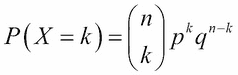

在这里，*X* 表示随机变量，计算感兴趣的结果的数量；*n* 表示试验次数；*k* 表示成功的次数；*p* 表示成功的概率；*q* 表示失败的概率。

在我们计算出概率 *P* 之后，我们可以进行符号检验，以确定成功概率是否与我们预期的相似。如果概率不等于我们预期的，我们可以拒绝零假设。

根据定义，零假设是对将要测试的总体参数的怀疑观点或陈述。零假设用 H0 表示。备择假设表示一系列不包含在零假设中的总体值。备择假设用 H1 表示。在这种情况下，零假设和备择假设分别表示如下：

+   **H0 (零假设)**: 成功的真实概率等于我们预期的

+   **H1 (备择假设)**: 成功的真实概率不等于我们预期的

在本例中，我们演示如何使用二项检验来确定骰子被掷出的次数、掷出六的频率以及从无偏骰子掷出六的概率。t 检验的结果显示 p 值=3.458e-08（低于 0.05）。在 5%的显著性水平下，由于掷出了过多的六（成功概率=0.2920635），零假设（骰子无偏）被拒绝。

## 参见

+   要了解更多关于精确二项检验的使用方法，请使用`help`函数查看相关文档：

    ```py
    > ?binom.test

    ```

# 执行学生 t 检验

单样本 t 检验使我们能够测试两个均值是否显著不同；双样本 t 检验使我们能够测试两个独立组的均值是否不同。在本配方中，我们将讨论如何使用 R 进行单样本 t 检验和双样本 t 检验。

## 准备工作

确保在 R 会话中已经将`mtcars`加载到数据框中。由于`t.test`函数来自`stats`包，请确保已加载库`stats`。

## 如何做...

执行以下步骤：

1.  首先，我们使用箱线图可视化属性`mpg`与`am`的关系：

    ```py
    > boxplot(mtcars$mpg, mtcars$mpg[mtcars$am==0], ylab = "mpg", names=c("overall","automobile"))
    > abline(h=mean(mtcars$mpg),lwd=2, col="red")
    > abline(h=mean(mtcars$mpg[mtcars$am==0]),lwd=2, col="blue")

    ```

    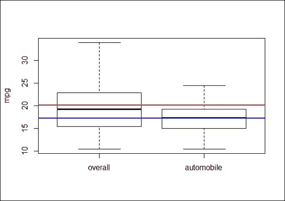

    总体和汽车 mpg 的箱线图

1.  我们随后执行一个统计程序来验证汽车的平均`mpg`是否低于总体`mpg`的平均值：

    ```py
    > mpg.mu = mean(mtcars$mpg)
    > mpg_am = mtcars$mpg[mtcars$am == 0]
    > t.test(mpg_am,mu = mpg.mu)

     One Sample t-test

    data:  mpg_am
    t = -3.3462, df = 18, p-value = 0.003595
    alternative hypothesis: true mean is not equal to 20.09062
    95 percent confidence interval:
     15.29946 18.99528
    sample estimates:
    mean of x 
     17.14737 

    ```

1.  我们开始通过绘制箱线图来可视化数据：

    ```py
    >boxplot(mtcars$mpg~mtcars$am,ylab='mpg',names=c('automatic','manual'))
    > abline(h=mean(mtcars$mpg[mtcars$am==0]),lwd=2, col="blue")
    > abline(h=mean(mtcars$mpg[mtcars$am==1]),lwd=2, col="red")

    ```

    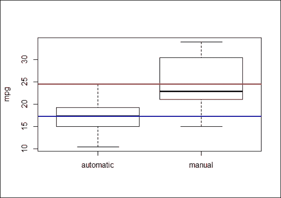

    自动和手动变速汽车的 mpg 箱线图

1.  前面的图显示，自动变速汽车的均值 mpg 低于手动变速车辆的均值 mpg：

    ```py
    > t.test(mtcars$mpg~mtcars$am)

     Welch Two Sample t-test

    data:  mtcars$mpg by mtcars$am
    t = -3.7671, df = 18.332, p-value = 0.001374
    alternative hypothesis: true difference in means is not equal to 0
    95 percent confidence interval:
     -11.280194  -3.209684
    sample estimates:
    mean in group 0 mean in group 1 
     17.14737        24.39231 

    ```

## 它是如何工作的...

学生 t 检验是在零假设为真时，检验统计量遵循正态分布（学生 t 分布）的情况。它可以用来确定两个独立数据集之间是否存在差异。学生 t 检验最适合用于基于小样本推断的问题。

在本例中，我们讨论单样本学生 t 检验和双样本学生 t 检验。在单样本学生 t 检验中，常被提出的研究问题是，“总体均值是否与零假设不同？”因此，为了测试汽车的平均油耗是否低于总体平均油耗，我们首先使用箱线图来观察总体之间的差异，而不做任何假设。从前面的图中可以看出，汽车的平均油耗（蓝色线）低于总体平均油耗（红色线）。然后，我们应用单样本 t 检验；低 p 值 0.003595（< 0.05）表明我们应该拒绝零假设，即汽车的平均油耗低于总体平均油耗。

由于单样本 t 检验使我们能够测试两个均值是否有显著差异，双样本 t 检验则允许我们测试两个独立组的均值是否不同。与单样本 t 检验类似，我们首先使用箱线图来观察总体之间的差异，然后应用双样本 t 检验。测试结果显示 p 值为 0.01374（p< 0.05）。换句话说，测试提供了拒绝零假设的证据，表明自动挡汽车的均值油耗与手动挡汽车的均值油耗不同。

## 相关内容

+   要了解更多关于学生 t 检验的使用方法，请使用 `help` 函数查看相关文档：

    ```py
    > ?t.test

    ```

# 执行 Kolmogorov-Smirnov 测试

单样本 Kolmogorov-Smirnov 测试用于比较一个样本与参考概率。双样本 Kolmogorov-Smirnov 测试比较两个数据集的累积分布。在本例中，我们将展示如何使用 R 执行 Kolmogorov-Smirnov 测试。

## 准备工作

确保在 R 会话中已经将 `mtcars` 数据集加载到一个数据框中。由于 `ks.test` 函数源自 `stats` 包，请确保已加载 `stats` 库。

## 如何操作...

执行以下步骤：

1.  使用单样本 Kolmogorov-Smirnov 测试验证数据集 x（使用 `rnorm` 函数生成）是否呈正态分布：

    ```py
    > x = rnorm(50)
    > ks.test(x,"pnorm")

     One-sample Kolmogorov-Smirnov test

    data:  x
    D = 0.1698, p-value = 0.0994
    alternative hypothesis: two-sided

    ```

1.  接下来，您可以生成均匀分布的样本数据：

    ```py
    > set.seed(3)
    > x = runif(n=20, min=0, max=20)

    > y = runif(n=20, min=0, max=20)

    ```

1.  我们首先绘制两个生成数据样本的 `ecdf`：

    ```py
    > plot(ecdf(x), do.points = FALSE, verticals=T, xlim=c(0, 20))
    > lines(ecdf(y), lty=3, do.points = FALSE, verticals=T)

    ```

    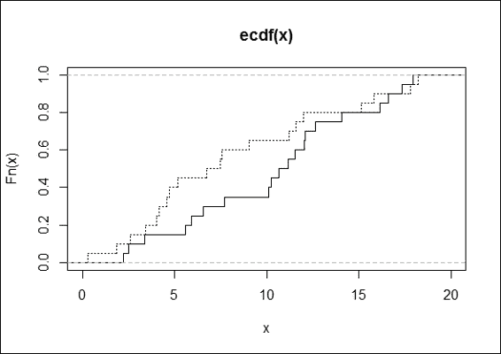

    两个生成数据样本的 ecdf 图

1.  最后，我们对两组数据应用双样本 Kolmogorov-Smirnov 测试：

    ```py
    > ks.test(x,y)

     Two-sample Kolmogorov-Smirnov test

    data:  x and y
    D = 0.3, p-value = 0.3356
    alternative hypothesis: two-sided

    ```

## 它是如何工作的...

**Kolmogorov-Smirnov 测试**（**K-S 测试**）是一种非参数统计测试，用于检验连续概率分布的相等性。它可以用来比较一个样本与参考概率分布（单样本 K-S 测试），或者直接比较两个样本（双样本 K-S 测试）。该测试基于经验分布函数（ECDF）。设 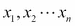 为大小为 n 的随机样本；经验分布函数 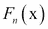，定义为：

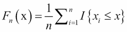

在这里，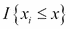 是指示函数。如果 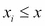，则函数等于 1。否则，函数等于 0。

Kolmogorov-Smirnov 统计量（D）基于 F(x) 和 Fn(x) 之间最大的（其中 supx 表示上确界）垂直差异。它定义为：

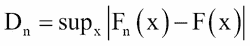

H[0] 是样本遵循指定的分布。H[1] 是样本不遵循指定的分布。

如果 Dn 大于从表中获得的临界值，则我们在显著性水平 α 上拒绝 H[0]。

我们首先测试从正态分布生成的随机数是否正态分布。在 5% 的显著性水平下，p 值为 0.0994 表明输入是正态分布的。

然后，我们绘制一个经验累积分布函数（`ecdf`）图来展示双样本测试如何计算最大距离 D（显示为 0.3），并应用双样本 Kolmogorov-Smirnov 测试来发现两个输入数据集是否可能来自同一分布。

p 值大于 0.05，不拒绝零假设。换句话说，这意味着两个数据集可能来自同一分布。

## 参见

+   想要了解更多关于 Kolmogorov-Smirnov 测试的用法，请使用 `help` 函数查看相关文档：

    ```py
    > ?ks.test

    ```

+   关于经验累积分布函数的定义，请参阅 `ecdf` 的帮助页面：

    ```py
    > ?ecdf

    ```

# 理解 Wilcoxon 秩和检验和符号秩检验

Wilcoxon 秩和检验和符号秩检验（或 Mann-Whitney-Wilcoxon）是一种非参数的零假设检验，表明两个不同群体的总体分布是相同的，而不假设两个群体是正态分布的。本食谱将展示如何在 R 中进行 Wilcoxon 秩和检验和符号秩检验。

## 准备工作

确保在 R 会话中已经将 `mtcars` 数据集加载到一个数据框中。由于 `wilcox.test` 函数源自 `stats` 包，请确保已加载 `stats` 库。

## 如何操作...

执行以下步骤：

1.  我们首先使用 `boxplot` 函数绘制 `mtcars` 的数据：

    ```py
    > boxplot(mtcars$mpg~mtcars$am,ylab='mpg',names=c('automatic','manual'))

    ```

    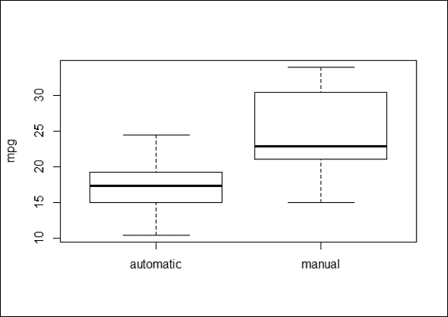

    自动挡汽车和手动挡汽车的 mpg 箱线图

1.  接下来，我们仍然执行 Wilcoxon 秩和检验，以验证自动变速汽车的分布是否与手动变速汽车相同：

    ```py
    > wilcox.test(mpg ~ am, data=mtcars)

     Wilcoxon rank sum test with continuity correction

    data:  mpg by am
    W = 42, p-value = 0.001871
    alternative hypothesis: true location shift is not equal to 0

    Warning message:
    In wilcox.test.default(x = c(21.4, 18.7, 18.1, 14.3, 24.4, 22.8,  :
     cannot compute exact p-value with ties

    ```

## 它是如何工作的...

在本教程中，我们讨论了一种非参数检验方法，即 Wilcoxon 秩和检验（也称为 Mann-Whitney U 检验）。对于学生 t 检验，假设两个样本之间的差异是正态分布的（当两个样本都是正态分布时，效果最好）。然而，当正态性假设不确定时，可以采用 Wilcoxon 秩和检验来检验假设。

在这里，我们使用 Wilcoxon 秩和检验来确定数据集`mtcars`中自动和手动变速汽车的 mpg 是否分布相同。从测试结果来看，p 值=0.001871（<0.05）拒绝零假设，同时也表明自动和手动变速汽车的 mpg 分布并不相同。在执行此测试时，您可能会收到警告信息“无法计算具有重复值的精确 p 值”，这表明数据集中存在重复值。一旦删除重复值，警告信息将清除。

## 参见

+   要了解更多关于 Wilcoxon 秩和检验和符号秩检验的使用方法，请使用`help`函数查看相关文档：

    ```py
    > ? wilcox.test

    ```

# 使用皮尔逊卡方检验

在本教程中，我们介绍了皮尔逊卡方检验，该检验用于检验两组分类变量的分布是否不同。我们将讨论如何在 R 中执行皮尔逊卡方检验。

## 准备工作

确保在 R 会话中已经将`mtcars`加载到数据框中。由于`chisq.test`函数源自`stats?`包，请确保已加载库`stats`。

## 如何操作

执行以下步骤：

1.  要制作计数表，我们首先使用包含变速类型和前进档位数的输入构建的列联表：

    ```py
    > ftable = table(mtcars$am, mtcars$gear)
    > ftable

     3  4  5
     0 15  4  0
     1  0  8  5

    ```

1.  我们接着绘制列联表的 mosaic 图：

    ```py
    > mosaicplot(ftable, main="Number of Forward Gears Within Automatic and Manual Cars", color = TRUE)

    ```

    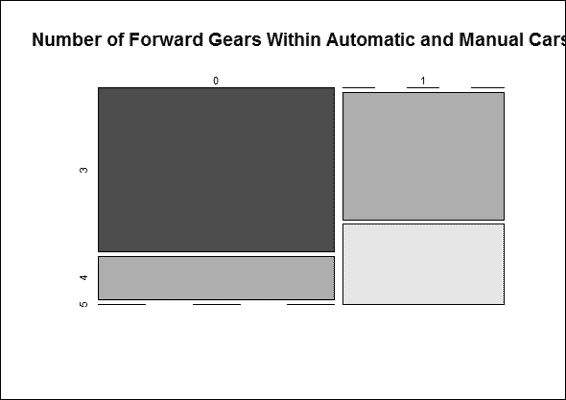

    自动和手动汽车前进档位数

1.  接下来，我们对列联表执行皮尔逊卡方检验，以检验自动和手动变速汽车的档位数是否相同：

    ```py
    > chisq.test(ftable)

     Pearson's Chi-squared test

    data:  ftable
    X-squared = 20.9447, df = 2, p-value = 2.831e-05

    Warning message:
    In chisq.test(ftable) : Chi-squared approximation may be incorrect

    ```

## 它是如何工作的...

皮尔逊卡方检验是一种统计检验，用于发现两个分类变量之间是否存在关系。它最适合用于来自大样本的非配对数据。如果您想进行皮尔逊卡方检验，需要确保输入样本满足两个假设：首先，两个输入变量应该是分类变量。其次，变量应包括两个或更多独立组。

在皮尔逊卡方检验中，假设我们有两个变量 A 和 B；我们可以在以下陈述中说明零假设和备择假设：

+   H[0]: 变量 A 和变量 B 是独立的

+   H[1]: 变量 A 和变量 B 不独立

为了测试零假设是否正确或错误，卡方检验采取以下步骤。

它计算卡方检验统计量，：

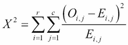

这里，r 是列联表的行数，c 是列联表的列数，O[i,j] 是观察到的频率计数，E[i,j] 是期望频率计数。

它确定该统计量的自由度，`df`。自由度等于：

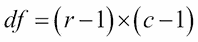

这里，r 是一个变量的水平数，c 是另一个变量的水平数。

它将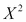与具有自由度的卡方分布的临界值进行比较。

在本菜谱中，我们使用列联表和镶嵌图来展示计数数的差异。很明显，自动变速汽车的档位数比手动变速汽车少。

然后，我们在列联表上执行皮尔逊卡方检验，以确定自动和手动变速汽车的齿轮是否相同。输出结果，p 值 = 2.831e-05（< 0.05），反驳了零假设，表明自动和手动变速汽车的档位数不同。然而，输出信息中包含一个警告信息，即卡方近似可能不正确，这是因为列联表中的样本数量少于五个。

## 更多...

要了解更多关于皮尔逊卡方检验的使用信息，请使用`help`函数查看相关文档：

```py
> ? chisq.test

```

除了之前示例中提到的常见假设检验方法外，R 还提供了其他假设检验方法：

+   比例检验（`prop.test`）：它用于测试不同组之间的比例是否相同

+   Z 检验（`UsingR`包中的`simple.z.test`）：它比较样本均值与总体均值和标准差

+   巴特利特检验（`bartlett.test`）：它用于测试不同组的方差是否相同

+   克鲁斯卡尔-沃利斯秩和检验（`kruskal.test`）：它用于测试不同组的分布是否相同，而不假设它们是正态分布的

+   夏皮罗-威尔克检验（`shapiro.test`）：它用于测试正态性

# 进行单因素方差分析

**方差分析**（**ANOVA**）研究分类自变量与连续因变量之间的关系。它可以用来测试几个组的均值是否相等。如果只有一个分类变量作为自变量，则可以执行单因素方差分析。另一方面，如果有超过两个分类变量，则应执行双因素方差分析。在本菜谱中，我们讨论如何使用 R 进行单因素方差分析。

## 准备工作

确保在 R 会话中已经将`mtcars`数据集加载到一个数据框中。由于`oneway.test`和`TukeyHSD`函数源自`stats`包，请确保已加载库`stats`。

## 如何操作...

执行以下步骤：

1.  我们开始通过使用箱线图可视化数据来探索：

    ```py
    > boxplot(mtcars$mpg~factor(mtcars$gear),xlab='gear',ylab='mpg')

    ```

    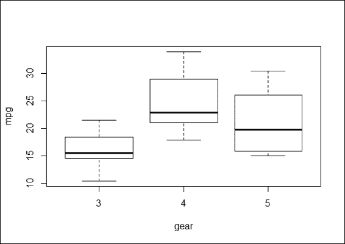

    不同档位数量汽车 mpg 的比较

1.  接下来，我们进行单因素 ANOVA 来检验`mpg`的平均值是否随着不同档位数量的变化而变化。我们使用函数`oneway.test`：

    ```py
    > oneway.test(mtcars$mpg~factor(mtcars$gear))

     One-way analysis of means (not assuming equal variances)

    data:  mtcars$mpg and factor(mtcars$gear)
    F = 11.2848, num df = 2.000, denom df = 9.508, p-value = 0.003085

    ```

1.  除了标准函数`oneway.test`外，还使用`aov`函数进行 ANOVA 分析：

    ```py
    > mtcars.aov = aov(mtcars$mpg ~ as.factor(mtcars$gear))
    > summary(mtcars.aov)
     Df Sum Sq Mean Sq F value   Pr(>F) 
    as.factor(mtcars$gear)  2  483.2  241.62    10.9 0.000295 ***
    Residuals              29  642.8   22.17 
    ---
    Signif. codes:  0 '***' 0.001 '**' 0.01 '*' 0.05 '.' 0.1 ' ' 1

    ```

1.  由`aov`函数生成的模型也可以生成一个拟合表格的摘要：

    ```py
    > model.tables(mtcars.aov, "means")
    Tables of means
    Grand mean

    20.09062 

     as.factor(mtcars$gear) 
     3     4     5
     16.11 24.53 21.38
    rep 15.00 12.00  5.00

    ```

1.  对于`aov`模型，可以使用`TukeyHSD`进行事后比较检验：

    ```py
    > mtcars_posthoc =TukeyHSD(mtcars.aov)
    > mtcars_posthoc
     Tukey multiple comparisons of means
     95% family-wise confidence level

    Fit: aov(formula = mtcars$mpg ~ as.factor(mtcars$gear))

    $`as.factor(mtcars$gear)`
     diff        lwr       upr     p adj
    4-3  8.426667  3.9234704 12.929863 0.0002088
    5-3  5.273333 -0.7309284 11.277595 0.0937176
    5-4 -3.153333 -9.3423846  3.035718 0.4295874

    ```

1.  此外，我们可以使用`plot`函数可视化平均水平的差异：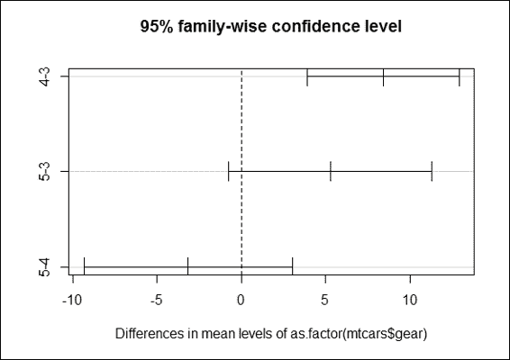

    不同档位数量组的 Tukey 均值差异图

## 它是如何工作的...

为了了解不同档位数量的汽车在 mpg（每加仑英里数）上是否有不同的平均值，我们首先绘制了以档位数量为依据的 mpg 箱线图。这提供了一个简单的指示，如果不同档位数量的汽车在 mpg 的平均值上有所不同。然后，我们执行最基本形式的方差分析（ANOVA），即单因素 ANOVA，以检验总体是否有不同的平均值。

在 R 中，有两个函数可以执行 ANOVA 测试：`oneway.test`和`aov`。`oneway.test`的优点是该函数应用 Welch 校正来解决方差的非齐性。然而，它提供的信息不如`aov`多，并且不提供事后检验。接下来，我们对自变量`gear`和因变量`mpg`执行`oneway.test`和`aov`。这两个测试的结果都显示了一个小的 p 值，这拒绝了不同档位数量的汽车在 mpg 均值之间没有差异的零假设。

由于 ANOVA 的结果仅表明总体均值之间存在显著差异，你可能不知道哪些总体在均值方面有所不同。因此，我们在 ANOVA 模型上应用`TukeyHSD`事后比较检验。结果显示，具有四个前进档位的汽车和具有三个档位的汽车之间的差异最大，因为它们的置信区间在图中最靠右。

## 更多内容...

ANOVA 依赖于 F 分布作为所有概率分布的基础。F 分数是通过将组间方差除以组内方差得到的。如果整体 F 检验是显著的，你可以进行事后检验（或多重比较检验）来衡量组之间的差异。最常用的事后检验方法是 Scheffé方法、Tukey-Kramer 方法和 Bonferroni 校正。

为了解释 ANOVA 的输出，您需要对某些术语有基本的了解，包括自由度、总平方和、组平方和、误差平方和、均方误差和 F 统计量。如果您需要更多关于这些术语的信息，您可以参考*使用多元统计*（Fidell, L. S. & Tabachnick, B. G. (2006) *Boston: Allyn & Bacon*），或者参考分析方差（[`en.wikipedia.org/wiki/Analysis_of_variance#cite_ref-31`](http://en.wikipedia.org/wiki/Analysis_of_variance#cite_ref-31)）的维基百科条目。

# 执行双向方差分析

双向方差分析可以看作是一元方差分析的扩展，因为分析覆盖了超过两个分类变量而不是一个。在本菜谱中，我们将讨论如何在 R 中执行双向方差分析。

## 准备工作

确保在 R 会话中已经将`mtcars`加载到数据框中。由于`twoway.test`、`TukeyHSD`和`interaction.plot`函数源自`stats`包，请确保已加载库`stats`。

## 如何做...

执行以下步骤：

1.  首先，我们绘制了关于 mpg 的因子齿轮的两个箱线图，并将图表与传动类型分开：

    ```py
    > par(mfrow=c(1,2))
    > boxplot(mtcars$mpg~mtcars$gear,subset=(mtcars$am==0),xlab='gear', ylab = "mpg",main='automatic')
    > boxplot(mtcars$mpg~mtcars$gear,subset=(mtcars$am==1),xlab='gear', ylab = "mpg", main='manual')

    ```

    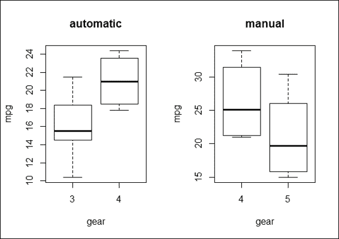

    根据齿轮组和传动类型绘制的 mpg 箱线图

1.  此外，您可以使用`boxplot`函数中的`*`操作来根据前进档数`*`传动类型生成 mpg 的箱线图：

    ```py
    > boxplot(mtcars$mpg~factor(mtcars$gear)* factor(mtcars$am),xlab='gear * transmission', ylab = "mpg",main='Boxplot of mpg by gear * transmission')

    ```

    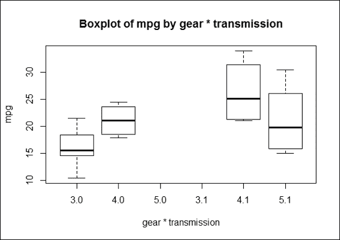

    根据齿轮和传动类型绘制 mpg 的箱线图

1.  接下来，我们使用交互图来描述变量之间的关系：

    ```py
    > interaction.plot(mtcars$gear, mtcars$am, mtcars$mpg, type="b", col=c(1:3),leg.bty="o", leg.bg="beige", lwd=2, pch=c(18,24,22), xlab="Number of Gears", ylab="Mean Miles Per Gallon", main="Interaction Plot")

    ```

    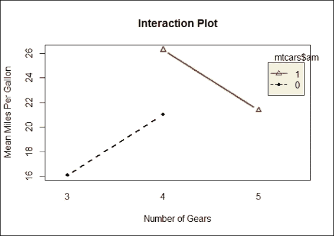

    传动类型和齿轮数之间的交互作用以及主要效应 mpg

1.  然后，我们对 mpg 执行双向方差分析，结合齿轮和传动类型因素：

    ```py
    > mpg_anova2 = aov(mtcars$mpg~factor(mtcars$gear)*factor(mtcars$am))
    > summary(mpg_anova2) 
     Df Sum Sq Mean Sq F value   Pr(>F) 
    factor(mtcars$gear)  2  483.2  241.62  11.869 0.000185 ***
    factor(mtcars$am)    1   72.8   72.80   3.576 0.069001 . 
    Residuals           28  570.0   20.36 
    ---
    Signif. codes:  0 '***' 0.001 '**' 0.01 '*' 0.05 '.' 0.1 ' ' 1

    ```

1.  与一元方差分析类似，我们可以执行事后比较测试来查看双向方差分析模型的结果：

    ```py
    > TukeyHSD(mpg_anova2)
     Tukey multiple comparisons of means
     95% family-wise confidence level

    Fit: aov(formula = mtcars$mpg ~ factor(mtcars$gear) * factor(mtcars$am))

    $`factor(mtcars$gear)`
     diff        lwr       upr     p adj
    4-3  8.426667  4.1028616 12.750472 0.0001301
    5-3  5.273333 -0.4917401 11.038407 0.0779791
    5-4 -3.153333 -9.0958350  2.789168 0.3999532

    $`factor(mtcars$am)`
     diff       lwr     upr     p adj
    1-0 1.805128 -1.521483 5.13174 0.2757926

    ```

1.  然后，我们使用`plot`函数可视化均值水平的差异：

    ```py
    > par(mfrow=c(1,2))
    > plot(TukeyHSD(mpg_anova2))

    ```

    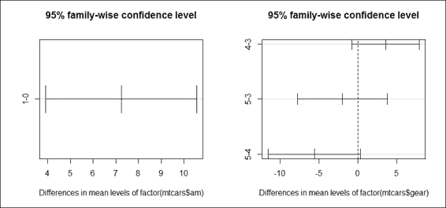

    通过传动类型和档位数比较均值水平的差异图

## 它是如何工作的...

在本菜谱中，我们执行双向方差分析来检验独立变量`gear`和`am`对因变量`mpg`的影响。在第一步中，我们使用箱线图来检查齿轮数和传动类型下的 mpg 均值。其次，我们应用交互图来可视化通过不同数量的齿轮和传动类型分离的 mpg 变化。

结果图显示，齿轮数量确实对平均 mpg 值有影响，但并未显示出正相关关系。第三，我们使用`aov`函数进行双向方差分析。输出结果显示，`gear`因子的 p 值拒绝了零假设，而`transmission type`因子没有拒绝零假设。换句话说，不同齿轮数量的汽车更有可能具有不同的平均 mpg 值。最后，为了检验哪两个群体之间的差异最大，我们进行了事后分析，结果显示，四档和三档汽车的均值 mpg 差异最大。

## 参见

+   对于多元方差分析，可以使用`manova`函数来检验多个自变量对多个因变量的影响。关于 MANOVA 的更多信息可以在 R 的`help`函数中找到：

    ```py
    > ?MANOVA

    ```
