# 第四章：理解回归分析

在本章中，我们将介绍以下食谱：

+   使用 lm 函数拟合线性回归模型

+   总结线性模型拟合结果

+   使用线性回归预测未知值

+   生成拟合模型的诊断图

+   使用 lm 函数拟合多项式回归模型

+   使用 rlm 函数拟合稳健线性回归模型

+   研究 SLID 数据上的线性回归案例

+   应用高斯模型进行广义线性回归

+   应用泊松模型进行广义线性回归

+   应用二项式模型进行广义线性回归

+   将广义加性模型拟合到数据中

+   可视化广义加性模型

+   诊断广义加性模型

# 简介

回归是一种监督学习方法，用于建模和分析一个因变量（响应变量）与一个或多个自变量（预测变量）之间的关系。可以使用回归来构建预测模型，首先用于找到具有最小拟合值平方误差的最佳拟合模型。然后可以将拟合模型进一步应用于数据进行连续值预测。

有许多种类的回归。如果只有一个预测变量，响应变量和独立变量之间的关系是线性的，我们可以应用线性模型。然而，如果有多个预测变量，应使用多重线性回归方法。当关系是非线性的，可以使用非线性模型来模拟预测变量和响应变量之间的关系。

在本章中，我们介绍如何使用`lm`函数将线性模型拟合到数据中。接下来，对于非正态高斯模型（例如泊松或二项式）的分布，我们使用带有适当对应数据分布的链接函数的`glm`函数。最后，我们介绍如何使用`gam`函数将广义加性模型拟合到数据中。

# 使用 lm 函数拟合线性回归模型

回归中最简单的模型是线性回归，当只有一个预测变量，响应变量和独立变量之间的关系是线性的时，最适合使用。在 R 中，我们可以使用`lm`函数将线性模型拟合到数据中。

## 准备工作

我们需要准备一个预测变量和一个响应变量，以及两个变量之间的线性关系的数据。

## 如何做...

执行以下步骤以使用`lm`进行线性回归：

1.  您应该安装`car`包并加载其库：

    ```py
    > install.packages("car")
    > library(car)

    ```

1.  从包中，您可以加载`Quartet`数据集：

    ```py
    > data(Quartet)

    ```

1.  您可以使用`str`函数来显示`Quartet`数据集的结构：

    ```py
    > str(Quartet)
    'data.frame':   11 obs. of  6 variables:
     $ x : int  10 8 13 9 11 14 6 4 12 7 ...
     $ y1: num  8.04 6.95 7.58 8.81 8.33 ...
     $ y2: num  9.14 8.14 8.74 8.77 9.26 8.1 6.13 3.1 9.13 7.26 ...
     $ y3: num  7.46 6.77 12.74 7.11 7.81 ...
     $ x4: int  8 8 8 8 8 8 8 19 8 8 ...
     $ y4: num  6.58 5.76 7.71 8.84 8.47 7.04 5.25 12.5 5.56 7.91 ...

    ```

1.  使用`plot`函数绘制 x 和 y 变量的散点图，并通过`lm`和`abline`函数添加拟合线：

    ```py
    > plot(Quartet$x, Quartet$y1)
    > lmfit = lm(y1~x, Quartet) 
    > abline(lmfit, col="red") 

    ```

    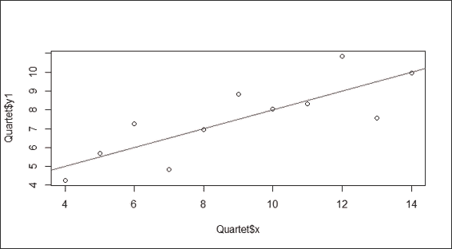

    使用 lm 拟合的简单回归图

1.  要查看拟合模型，执行以下操作：

    ```py
    > lmfit

    Call:
    lm(formula = y1 ~ x, data = Quartet)

    Coefficients:
    (Intercept)            x 
     3.0001       0.5001 

    ```

## 它是如何工作的...

回归模型具有`response ~ terms`形式，其中`response`是响应向量，`terms`是一系列指定预测器的项。我们可以用一个简单的回归模型公式*y=α+βx*来表示，其中*α*是截距，而斜率*β*描述了*x*变化时*y*的变化。通过使用最小二乘法，我们可以估计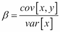和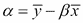（其中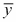表示*y*的平均值，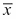表示*x*的平均值）。

要执行线性回归，我们首先准备具有预测变量和响应变量之间线性关系的资料。在这个例子中，我们从 car 包中加载了 Anscombe 的四重奏数据集。在数据集中，*x*和*y1*变量之间存在线性关系，我们为这些变量准备了一个散点图。为了生成回归线，我们使用 lm 函数生成两个变量的模型。进一步，我们使用`abline`在图上绘制回归线。根据前面的截图，回归线说明了*x*和*y1*变量的线性关系。我们可以看到，拟合模型的系数显示了截距等于 3.0001，系数等于 0.5001。因此，我们可以使用截距和系数来推断响应值。例如，我们可以推断当*x*等于 3 时的响应值等于 4.5103（3 * 0.5001 + 3.0001）。

## 还有更多...

除了`lm`函数外，您还可以使用`lsfit`函数执行简单线性回归。例如：

```py
> plot(Quartet$x, Quartet$y1)
> lmfit2 = lsfit(Quartet$x,Quartet$y1)
> abline(lmfit2, col="red")

```

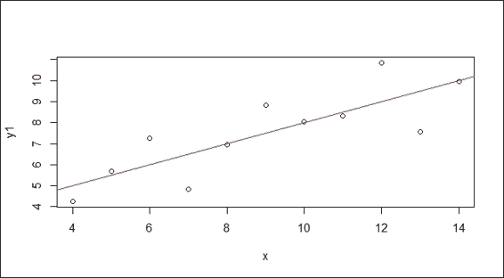

使用 lsfit 函数拟合的简单回归。

# 总结线性模型拟合

`summary`函数可以用来获取拟合模型的格式化系数、标准误差、自由度和其他总结信息。本食谱介绍了如何通过使用`summary`函数来获取模型的整体信息。

## 准备工作

您需要完成之前的食谱，通过从四重奏中计算*x*和*y1*变量的线性模型，并将拟合模型分配给`lmfit`变量。

## 如何做...

执行以下步骤以总结线性模型拟合：

1.  计算拟合模型的详细总结：

    ```py
    > summary(lmfit)

    Call:
    lm(formula = y1 ~ x)

    Residuals:
     Min       1Q   Median       3Q      Max 
    -1.92127 -0.45577 -0.04136  0.70941  1.83882 

    Coefficients:
     Estimate Std. Error t value Pr(>|t|) 
    (Intercept)   3.0001     1.1247   2.667  0.02573 * 
    Quartet$x     0.5001     0.1179   4.241  0.00217 **
    ---
    Signif. codes:  0 '***' 0.001 '**' 0.01 '*' 0.05 '.' 0.1 ' ' 1

    Residual standard error: 1.237 on 9 degrees of freedom
    Multiple R-squared:  0.6665,    Adjusted R-squared:  0.6295 
    F-statistic: 17.99 on 1 and 9 DF,  p-value: 0.00217

    ```

## 如何工作...

`summary`函数是一个通用函数，用于生成总结统计量。在这种情况下，它计算并返回拟合线性模型的总结统计量列表。这里，它将输出诸如残差、系数标准误差、R 平方、f 统计量和自由度等信息。在`Call`部分，显示了用于生成拟合模型的函数。在`Residuals`部分，它提供了分布的快速总结（最小值、1Q、中位数、3Q、最大值）。

在 `系数` 部分，每个系数都是一个高斯随机变量。在此部分中，`估计值` 代表变量的均值分布；`标准误差` 显示变量的标准误差；`t` 值是 `估计值` 除以 `标准误差`，而 `p` 值表示得到大于 `t` 值的概率。在此样本中，截距（0.002573）和 `x`（0.00217）的 `p` 值都有 95% 的置信水平。

残差标准误差输出残差的方差，而自由度表示训练样本中的观测值与模型中使用的数量之间的差异。多重判定系数是通过除以平方和得到的。一个人可以使用判定系数来衡量数据与回归线拟合的接近程度。通常，判定系数越高，模型与数据的拟合度越好。然而，这并不一定意味着回归模型是充分的。这意味着您可能得到一个低判定系数的好模型，或者您可能得到一个高判定系数的差模型。由于多重判定系数忽略了自由度，计算出的分数是有偏的。为了使计算公平，调整判定系数（0.6295）使用无偏估计，并将略低于多重判定系数（0.6665）。F 统计量是通过在模型上执行 f 检验得到的。一个等于 0.00217（< 0.05）的 `p` 值拒绝零假设（变量之间没有线性相关性）并表明观察到的 `F` 值大于临界 `F` 值。换句话说，结果表明变量之间存在显著的线性正相关。

## 相关阅读

+   要获取拟合模型参数的更多信息，您可以使用 `help` 函数或 `?` 来查看帮助页面：

    ```py
    > ?summary.lm

    ```

+   或者，您可以使用以下函数来显示模型的属性：

    ```py
    >  coefficients(lmfit) # Extract model coefficients
    >  confint(lmfit, level=0.95)  # Computes confidence intervals for model parameters.
    >  fitted(lmfit) # Extract model fitted values
    >  residuals(lmfit) # Extract model residuals 
    >  anova(lmfit) # Compute analysis of variance tables for fitted model object
    >  vcov(lmfit) # Calculate variance-covariance matrix for a fitted model object
    >  influence(lmfit) # Diagnose quality of regression fits

    ```

# 使用线性回归预测未知值

使用拟合的回归模型，我们可以将模型应用于预测未知值。对于回归模型，我们可以使用预测区间和置信区间来表示预测的精度。在下面的配方中，我们介绍如何在两种测量下预测未知值。

## 准备工作

您需要完成上一个配方，通过从 `quartet` 数据集中计算 `x` 和 `y1` 变量的线性模型来完成。

## 如何操作...

按以下步骤使用线性回归预测值：

1.  使用 `x` 和 `y1` 变量拟合线性模型：

    ```py
    > lmfit = lm(y1~x, Quartet)

    ```

1.  将要预测的值分配到 `newdata`：

    ```py
    > newdata = data.frame(x = c(3,6,15))

    ```

1.  使用置信水平设置为 `0.95` 的置信区间来计算预测结果：

    ```py
    > predict(lmfit, newdata, interval="confidence", level=0.95)
     fit      lwr       upr
    1  4.500364 2.691375  6.309352
    2  6.000636 4.838027  7.163245
    3 10.501455 8.692466 12.310443

    ```

1.  使用此预测区间来计算预测结果：

    ```py
    > predict(lmfit, newdata, interval="predict")
     fit      lwr       upr
    1  4.500364 1.169022  7.831705
    2  6.000636 2.971271  9.030002
    3 10.501455 7.170113 13.832796

    ```

## 工作原理...

我们首先使用 `x` 和 `y1` 变量构建一个线性拟合模型。接下来，我们将要预测的值分配到一个数据框 `newdata` 中。重要的是要注意，生成的模型形式为 `y1 ~ x`。

接下来，我们通过在`interval`参数中指定`confidence`来使用置信区间计算预测结果。从第 1 行的输出中，我们得到`x=3`输入的拟合`y1`等于`4.500364`，以及`x=3`的`y1`均值的 95%置信区间（在`level`参数中设置为 0.95）介于`2.691375`和`6.309352`之间。此外，第 2 行和第 3 行给出了`x=6`和`x=15`输入的`y1`预测结果。

接下来，我们通过在`interval`参数中指定`prediction`来使用预测区间计算预测结果。从第 1 行的输出中，我们可以看到`x=3`输入的拟合`y1`等于`4.500364`，以及`x=3`的`y1`的 95%预测区间介于`1.169022`和`7.831705`之间。第 2 行和第 3 行输出了`x=6`和`x=15`输入的`y1`预测结果。

## 参考以下内容

+   对于对预测区间和置信区间之间的差异感兴趣的人，您可以参考维基百科条目*与置信区间的对比*，网址为[`en.wikipedia.org/wiki/Prediction_interval#Contrast_with_confidence_intervals`](http://en.wikipedia.org/wiki/Prediction_interval#Contrast_with_confidence_intervals)。

# 生成拟合模型的诊断图

诊断是评估回归假设的方法，可用于确定拟合模型是否充分代表数据。在以下菜谱中，我们介绍如何通过使用诊断图来诊断回归模型。

## 准备工作

您需要通过从四元组中计算 x 和 y1 变量的线性模型来完成前面的菜谱，并将模型分配给`lmfit`变量。

## 如何操作...

执行以下步骤以生成拟合模型的诊断图：

1.  绘制回归模型的诊断图：

    ```py
    > par(mfrow=c(2,2))
    > plot(lmfit)

    ```

    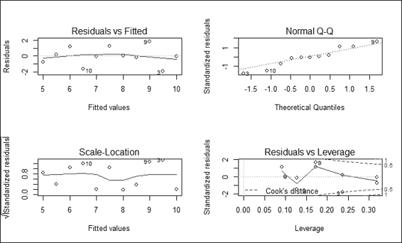

    回归模型的诊断图

## 工作原理...

绘图函数生成回归模型的四个诊断图：

+   左上角的图显示了残差与拟合值之间的关系。在图中，残差代表一个点到回归线的垂直距离。如果所有点都正好落在回归线上，所有残差都将正好落在虚线灰线上。图中的红色线是关于残差的光滑曲线，如果所有点都正好落在回归线上，红色线的位置应该正好与虚线灰线相匹配。

+   右上角显示了残差的正态分布。此图验证了残差正态分布的假设。因此，如果残差是正态分布的，它们应该正好位于灰色虚线上。

+   左下角的**尺度-位置**图用于测量标准化残差的平方根与拟合值之间的关系。因此，如果所有点都位于回归线上，则`y`的值应该接近零。由于假设残差的方差不会显著改变分布，如果假设正确，红色线应该相对平坦。

+   右下角的图显示了标准化残差与杠杆作用的关系。杠杆作用是衡量每个数据点如何影响回归的度量。它是回归质心距离和隔离程度的度量（通过是否有邻居来衡量）。此外，您还可以找到受高杠杆和大量残差影响的 Cook 距离的轮廓。您可以使用此方法来衡量如果删除一个点，回归将如何改变。红色线在标准化残差方面很平滑。对于完美的拟合回归，红色线应该接近虚线，Cook 距离没有超过 0.5 的点。

## 还有更多...

要查看更多的诊断图功能，可以使用`help`函数获取更多信息：

```py
> ?plot.lm

```

为了发现是否存在具有大 Cook 距离的点，可以使用`cooks.distance`函数计算每个点的 Cook 距离，并通过可视化分析距离的分布：

```py
> plot(cooks.distance(lmfit))

```

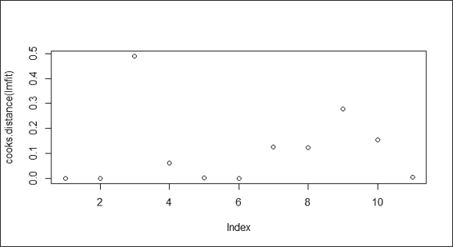

Cook 距离图

在这种情况下，如果索引为 3 的点显示的 Cook 距离大于其他点，可以调查这个点是否可能是异常值。

# 使用 lm 拟合多项式回归模型

一些预测变量和响应变量可能存在非线性关系，它们的关系可以建模为`n`次多项式。在这个菜谱中，我们将介绍如何使用`lm`和`poly`函数处理多项式回归。

## 准备工作

准备包含可以建模为`n`次多项式的预测变量和响应变量之间关系的数据库。在这个菜谱中，我们将继续使用`car`包中的`Quartet`数据库。

## 如何操作...

执行以下步骤以使用`lm`拟合多项式回归模型：

1.  首先，我们绘制`x`和`y2`变量的散点图：

    ```py
    > plot(Quartet$x, Quartet$y2)

    ```

    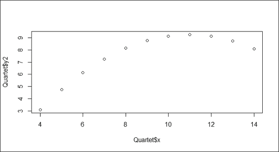

    变量 x 和 y2 的散点图

1.  您可以通过指定参数中的`2`来应用`poly`函数：

    ```py
    > lmfit = lm(Quartet$y2~poly(Quartet$x,2))
    > lines(sort(Quartet$x), lmfit$fit[order(Quartet$x)], col = "red")

    ```

    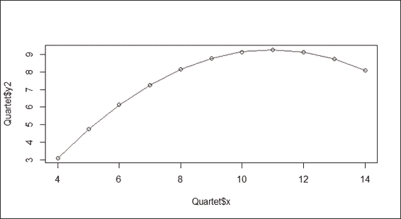

    变量 x 和 y2 的回归图的一个二次拟合示例

## 工作原理

我们可以在公式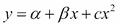中说明二次多项式回归模型，其中*α*是截距，而*β*表示回归系数。

在前面的截图（步骤 1）中，`x`和`y2`变量的散点图不呈线性关系，而是显示一个向下凹的曲线（或向上凸）的形状，转折点在 x=11。为了建模非线性关系，我们使用带有 2 作为参数的`poly`函数来拟合独立的`x`变量和依赖的`y2`变量。截图中的红线显示模型完美地拟合了数据。

## 更多...

您还可以使用一个独立变量等于一阶`x`变量和二阶`x`变量公式的二阶多项式模型：

```py
> plot(Quartet$x, Quartet$y2)
> lmfit = lm(Quartet$y2~ I(Quartet$x)+I(Quartet$x²))

```

# 使用 rlm 拟合稳健线性回归模型

数据集中的异常值会将回归线从主流移动开去。除了移除它之外，我们还可以对包含异常值的数据集应用稳健线性回归。在本配方中，我们介绍了如何将`rlm`应用于对包含异常值的数据集进行稳健线性回归。

## 准备工作

准备一个可能将回归线从主流移动开去的异常值数据集。在这里，我们使用从先前配方中加载的`Quartet`数据集。

## 如何操作...

按照以下步骤使用`rlm`拟合稳健线性回归模型：

1.  生成`x`变量对`y3`的散点图：

    ```py
    > plot(Quartet$x, Quartet$y3)

    ```

    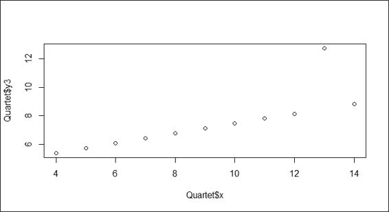

    变量 x 和 y3 的散点图

1.  接下来，您应该首先导入`MASS`库。然后，您可以使用`rlm`函数来拟合模型，并使用`abline`函数可视化拟合的线：

    ```py
    > library(MASS)
    > lmfit = rlm(Quartet$y3~Quartet$x)
    > abline(lmfit, col="red")

    ```

    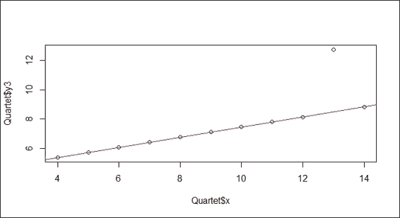

    对变量 x 和 y3 的稳健线性回归

## 工作原理

根据前面的截图（步骤 1），您可能会遇到包含远离主流的异常值的数据集。为了消除异常值的影响，我们展示了如何应用稳健线性回归（`rlm`）来拟合数据。在第二个截图（步骤 2）中，稳健回归线忽略了异常值并匹配了主流。

## 更多...

为了看到异常值如何将回归线从主流移动开去，您可以将此配方中使用的`rlm`函数替换为`lm`，并重新绘制图形：

```py
> plot(Quartet$x, Quartet$y3)
> lmfit = lm(Quartet$y3~Quartet$x)
> abline(lmfit, col="red")

```

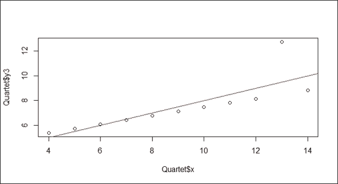

变量 x 和 y3 的线性回归

显然，异常值（x=13）将回归线从主流移动开去。

# 研究 SLID 数据上的线性回归案例

为了总结上一节的内容，我们使用线性回归探索更复杂的数据。在本配方中，我们展示了如何将线性回归应用于分析**劳动与收入动态调查**（**SLID**）数据集。

## 准备工作

检查是否已安装和加载`car`库，因为它需要访问 SLID 数据集。

## 如何操作...

按照以下步骤在 SLID 数据上执行线性回归：

1.  您可以使用`str`函数来获取数据的概览：

    ```py
    > str(SLID)
    'data.frame':  7425 obs. of  5 variables:
     $ wages    : num  10.6 11 NA 17.8 NA ...
     $ education: num  15 13.2 16 14 8 16 12 14.5 15 10 ...
     $ age      : int  40 19 49 46 71 50 70 42 31 56 ...
     $ sex      : Factor w/ 2 levels "Female","Male": 2 2 2 2 2 1 1 1 2 1 ...
     $ language : Factor w/ 3 levels "English","French",..: 1 1 3 3 1 1 1 1 1 1 ..

    ```

1.  首先，我们将变量工资与语言、年龄、教育和性别可视化：

    ```py
    > par(mfrow=c(2,2))
    > plot(SLID$wages ~ SLID$language)
    > plot(SLID$wages ~ SLID$age)
    > plot(SLID$wages ~ SLID$education)
    > plot(SLID$wages ~ SLID$sex)

    ```

    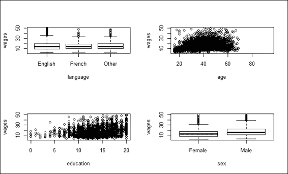

    工资与多种组合的绘图

1.  然后，我们可以使用`lm`来拟合模型：

    ```py
    > lmfit = lm(wages ~ ., data = SLID)

    ```

1.  您可以通过`summary`函数检查拟合模型的摘要：

    ```py
    > summary(lmfit)

    Call:
    lm(formula = wages ~ ., data = SLID)

    Residuals:
     Min      1Q  Median      3Q     Max 
    -26.062  -4.347  -0.797   3.237  35.908 

    Coefficients:
     Estimate Std. Error t value Pr(>|t|) 
    (Intercept)    -7.888779   0.612263 -12.885   <2e-16 ***
    education       0.916614   0.034762  26.368   <2e-16 ***
    age             0.255137   0.008714  29.278   <2e-16 ***
    sexMale         3.455411   0.209195  16.518   <2e-16 ***
    languageFrench -0.015223   0.426732  -0.036    0.972 
    languageOther   0.142605   0.325058   0.439    0.661 
    ---
    Signif. codes:  0 '***' 0.001 '**' 0.01 '*' 0.05 '.' 0.1 ' ' 1

    Residual standard error: 6.6 on 3981 degrees of freedom
     (3438 observations deleted due to missingness)
    Multiple R-squared:  0.2973,	Adjusted R-squared:  0.2964 
    F-statistic: 336.8 on 5 and 3981 DF,  p-value: < 2.2e-16

    ```

1.  删除`language`属性，并使用`lm`函数重新拟合模型：

    ```py
    > lmfit = lm(wages ~ age + sex + education, data = SLID)
    > summary(lmfit)

    Call:
    lm(formula = wages ~ age + sex + education, data = SLID)

    Residuals:
     Min      1Q  Median      3Q     Max 
    -26.111  -4.328  -0.792   3.243  35.892 

    Coefficients:
     Estimate Std. Error t value Pr(>|t|) 
    (Intercept) -7.905243   0.607771  -13.01   <2e-16 ***
    age          0.255101   0.008634   29.55   <2e-16 ***
    sexMale      3.465251   0.208494   16.62   <2e-16 ***
    education    0.918735   0.034514   26.62   <2e-16 ***
    ---
    Signif. codes:  0 '***' 0.001 '**' 0.01 '*' 0.05 '.' 0.1 ' ' 1

    Residual standard error: 6.602 on 4010 degrees of freedom
     (3411 observations deleted due to missingness)
    Multiple R-squared:  0.2972,	Adjusted R-squared:  0.2967 
    F-statistic: 565.3 on 3 and 4010 DF,  p-value: < 2.2e-16

    ```

1.  然后，我们可以绘制`lmfit`的诊断图：

    ```py
    > par(mfrow=c(2,2))
    > plot(lmfit)

    ```

    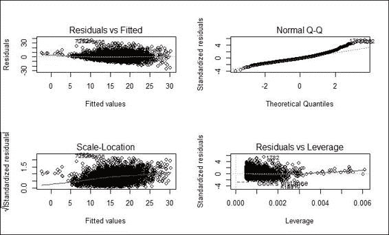

    拟合模型的诊断图

1.  接下来，我们对工资取对数并重新绘制诊断图：

    ```py
    > lmfit = lm(log(wages) ~ age + sex + education, data = SLID)
    > plot(lmfit)

    ```

    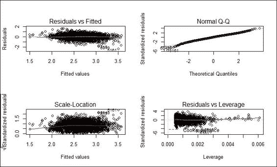

    调整后拟合模型的诊断图

1.  接下来，您可以使用`vif`函数诊断回归模型的多重共线性：

    ```py
    > vif(lmfit)
     age       sex education 
     1.011613  1.000834  1.012179 
    > sqrt(vif(lmfit)) > 2
     age       sex education 
     FALSE     FALSE     FALSE

    ```

1.  然后，您可以安装并加载`lmtest`包，并使用`bptest`函数诊断回归模型的异方差性：

    ```py
    > install.packages("lmtest")
    > library(lmtest)
    > bptest(lmfit)

     studentized Breusch-Pagan test

    data:  lmfit
    BP = 29.0311, df = 3, p-value = 2.206e-06

    ```

1.  最后，您可以安装并加载`rms`包。然后，您可以使用`robcov`来纠正标准误差：

    ```py
    > install.packages("rms")
    > library(rms)
    > olsfit = ols(log(wages) ~ age + sex + education, data= SLID, x= TRUE, y= TRUE)
    > robcov(olsfit)

    Linear Regression Model

    ols(formula = log(wages) ~ age + sex + education, data = SLID, 
     x = TRUE, y = TRUE)

    Frequencies of Missing Values Due to Each Variable
    log(wages)        age        sex  education 
     3278          0          0        249 

     Model Likelihood     Discrimination 
     Ratio Test           Indexes 
    Obs     4014    LR chi2   1486.08    R2       0.309 
    sigma 0.4187    d.f.            3    R2 adj   0.309 
    d.f.    4010    Pr(> chi2) 0.0000    g        0.315 

    Residuals

     Min       1Q   Median       3Q      Max 
    -2.36252 -0.27716  0.01428  0.28625  1.56588 

     Coef   S.E.   t     Pr(>|t|)
    Intercept 1.1169 0.0387 28.90 <0.0001 
    age       0.0176 0.0006 30.15 <0.0001 
    sex=Male  0.2244 0.0132 16.96 <0.0001 
    education 0.0552 0.0022 24.82 <0.0001

    ```

## 它是如何工作的...

本菜谱演示了如何在 SLID 数据集上执行线性回归分析。首先，我们加载 SLID 数据并通过使用`str`函数显示其结构。从数据结构中，我们知道有四个独立变量将影响因变量工资。

接下来，我们通过可视化探索每个独立变量与因变量`wages`之间的关系；可视化结果如图所示（步骤 2）。在此截图的左上角，您可以找到三种不同语言与工资的箱线图；语言与工资之间的相关性不明显。截图右上角显示，年龄似乎与因变量`wages`呈正相关。在截图的左下角，显示教育似乎也与工资呈正相关。最后，截图右下角的箱线图显示，男性的工资略高于女性。

接下来，我们将除了`wages`以外的所有属性拟合到模型中作为预测变量。通过总结模型，可以看出教育、年龄和性别具有显著性（*p-value < 0.05*）。因此，我们删除了不显著的`language`属性（其 p 值大于 0.05），并在线性模型中将三个独立变量（教育、性别和年龄）与因变量（`wages`）拟合。这相应地将 f 统计量从 336.8 提高到 565.3。

接下来，我们生成拟合模型的诊断图。在诊断图中，所有四个图都表明回归模型遵循回归假设。然而，从残差与拟合值和尺度-位置图中可以看出，较小拟合值的残差偏向回归模型。由于工资跨越几个数量级，为了诱导对称性，我们对工资应用对数变换，并将数据重新拟合到回归模型中。现在，残差与拟合值图和尺度-位置图的红线与灰色虚线更接近。

接下来，我们想测试模型中是否存在多重共线性。当预测变量与其他变量高度相关时，就会发生多重共线性。如果模型中存在多重共线性，你可能会看到一些变量具有高的 R-squared 值，但显示为不显著的变量。为了检测多重共线性，我们可以使用`vif`函数计算线性模型和广义线性模型的方差膨胀因子和广义方差膨胀因子。如果存在多重共线性，我们应该找到方差膨胀因子平方根大于 2 的预测变量。然后，我们可以移除冗余预测变量或使用主成分分析将预测变量转换为较小的一组不相关成分。

最后，我们想测试模型中是否存在**异方差性**。在讨论异方差性的定义之前，我们首先要知道，在经典假设中，普通回归模型假设误差的方差在观测值之间是恒定的或同质的。相反，异方差性意味着方差在观测值之间是不等的。因此，异方差性可能会偏向我们估计的标准误差，从而误导假设的检验。为了检测和测试异方差性，我们可以在`lmtest`包中的`bptest`函数执行异方差性的**Breusch-Pagan**检验。在这种情况下，p 值显示为 2.206e-06（<0.5），这拒绝了同方差性的零假设（没有异方差性）。在这里，它意味着参数估计的标准误差是不正确的。然而，我们可以使用`rms`包中的`robcov`来使用稳健标准误差纠正标准误差（不消除异方差性）并提高真正显著参数的显著性。然而，由于它只接受`rms`系列中的拟合模型作为输入，我们必须先拟合普通最小二乘模型。

## 参考信息

+   如需了解更多关于 SLID 数据集的信息，您可以使用`help`函数查看相关文档：

    ```py
    >  ?SLID

    ```

# 应用高斯模型进行广义线性回归

**广义线性模型**（**GLM**）是线性回归的推广，可以包括连接函数以进行线性预测。作为默认设置，`glm` 的家族对象是高斯，这使得 `glm` 函数的表现与 `lm` 完全相同。在本例中，我们首先演示如何使用 `glm` 函数将模型拟合到数据中，然后展示具有高斯模型的 `glm` 与 `lm` 的表现完全相同。

## 准备工作

检查 `car` 库是否已安装并加载，因为我们需要从该包中获取 SLID 数据集。

## 如何操作...

执行以下步骤以拟合具有高斯模型的广义线性回归模型：

1.  将独立变量 `age`、`sex` 和 `education` 以及因变量 `wages` 拟合到 `glm`：

    ```py
    > lmfit1 = glm(wages ~ age + sex + education, data = SLID, family=gaussian)
    > summary(lmfit1)

    Call:
    glm(formula = wages ~ age + sex + education, family = gaussian, 
     data = SLID)

    Deviance Residuals: 
     Min       1Q   Median       3Q      Max 
    -26.111   -4.328   -0.792    3.243   35.892 

    Coefficients:
     Estimate Std. Error t value Pr(>|t|) 
    (Intercept) -7.905243   0.607771  -13.01   <2e-16 ***
    age          0.255101   0.008634   29.55   <2e-16 ***
    sexMale      3.465251   0.208494   16.62   <2e-16 ***
    education    0.918735   0.034514   26.62   <2e-16 ***
    ---
    Signif. codes:  0 '***' 0.001 '**' 0.01 '*' 0.05 '.' 0.1 ' ' 1

    (Dispersion parameter for Gaussian family taken to be 43.58492)

     Null deviance: 248686  on 4013  degrees of freedom
    Residual deviance: 174776  on 4010  degrees of freedom
     (3411 observations deleted due to missingness)
    AIC: 26549

    Number of Fisher Scoring iterations: 2

    ```

1.  将独立变量 `age`、`sex` 和 `education` 以及因变量 `wages` 拟合到 `lm`：

    ```py
    > lmfit2 = lm(wages ~ age + sex + education, data = SLID)
    > summary(lmfit2)

    Call:
    lm(formula = wages ~ age + sex + education, data = SLID)

    Residuals:
     Min      1Q  Median      3Q     Max 
    -26.111  -4.328  -0.792   3.243  35.892 

    Coefficients:
     Estimate Std. Error t value Pr(>|t|) 
    (Intercept) -7.905243   0.607771  -13.01   <2e-16 ***
    age          0.255101   0.008634   29.55   <2e-16 ***
    sexMale      3.465251   0.208494   16.62   <2e-16 ***
    education    0.918735   0.034514   26.62   <2e-16 ***
    ---
    Signif. codes:  0 '***' 0.001 '**' 0.01 '*' 0.05 '.' 0.1 ' ' 1

    Residual standard error: 6.602 on 4010 degrees of freedom
     (3411 observations deleted due to missingness)
    Multiple R-squared:  0.2972,	Adjusted R-squared:  0.2967 
    F-statistic: 565.3 on 3 and 4010 DF,  p-value: < 2.2e-16

    ```

1.  使用 `anova` 比较两个拟合模型：

    ```py
    > anova(lmfit1, lmfit2)
    Analysis of Deviance Table

    Model: gaussian, link: identity

    Response: wages

    Terms added sequentially (first to last)

     Df Deviance Resid. Df Resid. Dev
    NULL                       4013     248686
    age        1    31953      4012     216733
    sex        1    11074      4011     205659
    education  1    30883      4010     174776

    ```

## 工作原理...

`glm` 函数以与 `lm` 函数类似的方式拟合数据模型。唯一的区别是您可以在参数 `family` 中指定不同的连接函数（您可以在控制台中使用 `?family` 来查找不同类型的连接函数）。在本例中，我们首先将独立变量 `age`、`sex` 和 `education` 以及因变量 `wages` 输入到 `glm` 函数中，并将构建的模型赋值给 `lmfit1`。您可以使用构建的模型进行进一步的预测。

接下来，为了确定具有高斯模型的 `glm` 是否与 `lm` 完全相同，我们将独立变量 `age`、`sex` 和 `education` 以及因变量 `wages` 拟合到 `lm` 模型中。通过将 `summary` 函数应用于两个不同的模型，它揭示了两个输出摘要的残差和系数完全相同。

最后，我们使用 `anova` 函数进一步比较两个拟合模型。`anova` 函数的结果显示，两个模型相似，具有相同的 **残差自由度**（**Res.DF**）和 **残差平方和**（**RSS Df**）。

## 参见

+   对于广义线性模型与线性模型的比较，您可以参考 *Venables, W. N., & Ripley, B. D. (2002). Modern applied statistics with S. Springer*。

# 应用泊松模型进行广义线性回归

广义线性模型允许响应变量具有除正态分布（高斯）之外的错误分布模型。在本例中，我们展示了如何将泊松作为 `glm` 中的家族对象应用于计数数据。

## 准备工作

本任务的先决条件是准备计数数据，所有输入数据值均为整数。

## 如何操作...

执行以下步骤以拟合具有泊松模型的广义线性回归模型：

1.  加载 `warpbreaks` 数据，并使用 `head` 查看前几行：

    ```py
    > data(warpbreaks)
    > head(warpbreaks)
     breaks wool tension
    1     26    A       L
    2     30    A       L
    3     54    A       L
    4     25    A       L
    5     70    A       L
    6     52    A       L

    ```

1.  我们将泊松作为家族对象应用于独立变量 `tension` 和因变量 `breaks`：

    ```py
    > rs1 = glm(breaks ~ tension, data=warpbreaks, family="poisson")
    > summary(rs1)

    Call:
    glm(formula = breaks ~ tension, family = "poisson", data = warpbreaks)

    Deviance Residuals: 
     Min       1Q   Median       3Q      Max 
    -4.2464  -1.6031  -0.5872   1.2813   4.9366 

    Coefficients:
     Estimate Std. Error z value Pr(>|z|) 
    (Intercept)  3.59426    0.03907  91.988  < 2e-16 ***
    tensionM    -0.32132    0.06027  -5.332 9.73e-08 ***
    tensionH    -0.51849    0.06396  -8.107 5.21e-16 ***
    ---
    Signif. codes:  0 '***' 0.001 '**' 0.01 '*' 0.05 '.' 0.1 ' ' 1

    (Dispersion parameter for Poisson family taken to be 1)

     Null deviance: 297.37  on 53  degrees of freedom
    Residual deviance: 226.43  on 51  degrees of freedom
    AIC: 507.09

    Number of Fisher Scoring iterations: 4

    ```

## 工作原理...

在泊松分布的假设下，计数数据可以拟合到对数线性模型。在这个例子中，我们首先从`warpbreaks`数据集中加载了一个样本计数数据，其中包含了每台织机的断裂次数。接下来，我们使用`glm`函数，将断裂次数作为因变量，`tension`作为自变量，泊松作为家族对象。最后，我们使用摘要函数查看拟合的对数线性模型。

## 参考以下内容

+   要了解更多关于泊松模型与计数数据的关系，您可以参考*Cameron, A. C., & Trivedi, P. K. (2013). Regression analysis of count data (No. 53). Cambridge university press.*

# 应用广义线性回归的二项模型

对于二元因变量，可以在`glm`函数中将二项模型作为家族对象应用。

## 准备工作

此任务的先决条件是准备一个二元因变量。在这里，我们使用`vs`变量（V 型发动机或直列发动机）作为因变量。

## 如何操作...

执行以下步骤以使用二项模型拟合广义线性回归模型：

1.  首先，我们检查`mtcars`数据集中`vs`的前六个元素：

    ```py
    > head(mtcars$vs)
    [1] 0 0 1 1 0 1

    ```

1.  我们使用`glm`函数，将`binomial`作为家族对象应用：

    ```py
    > lm1 = glm(vs ~ hp+mpg+gear,data=mtcars, family=binomial)
    > summary(lm1)

    Call:
    glm(formula = vs ~ hp + mpg + gear, family = binomial, data = mtcars)

    Deviance Residuals: 
     Min        1Q    Median        3Q       Max 
    -1.68166  -0.23743  -0.00945   0.30884   1.55688 

    Coefficients:
     Estimate Std. Error z value Pr(>|z|) 
    (Intercept) 11.95183    8.00322   1.493   0.1353 
    hp          -0.07322    0.03440  -2.129   0.0333 *
    mpg          0.16051    0.27538   0.583   0.5600 
    gear        -1.66526    1.76407  -0.944   0.3452 
    ---
    Signif. codes:  0 '***' 0.001 '**' 0.01 '*' 0.05 '.' 0.1 ' ' 1

    (Dispersion parameter for binomial family taken to be 1)

     Null deviance: 43.860  on 31  degrees of freedom
    Residual deviance: 15.651  on 28  degrees of freedom
    AIC: 23.651

    Number of Fisher Scoring iterations: 7

    ```

## 工作原理...

在二元数据中，每个响应值的观测值被编码为`0`或`1`。将二元数据拟合到回归模型需要二项分布函数。在这个例子中，我们首先从`mtcars`数据集中加载二元因变量`vs`。`vs`适合二项模型，因为它包含二元数据。接下来，我们使用`glm`函数通过指定`binomial`作为家族对象将模型拟合到二元数据。最后，通过查看摘要，我们可以获得拟合模型的描述。

## 参考以下内容

+   如果您仅在参数中指定家族对象，您将使用默认的链接来拟合模型。但是，要使用替代链接函数，您可以添加一个链接参数。例如：

    ```py
    > lm1 = glm(vs ~ hp+mpg+gear,data=mtcars, family=binomial(link="probit"))

    ```

+   如果您想知道可以使用多少个替代链接，请通过帮助功能参考家族文档：

    ```py
     > ?family

    ```

# 将广义加性模型拟合到数据中

**广义加性模型**（**GAM**），用于拟合广义加性模型，可以被视为 GLM 的半参数扩展。虽然 GLM 假设因变量和自变量之间存在线性关系，但 GAM 根据数据的局部行为拟合模型。因此，GAM 具有处理因变量和自变量之间高度非线性关系的能力。在下面的步骤中，我们介绍如何使用广义加性模型拟合回归。

## 准备工作

我们需要准备一个包含变量的数据框，其中一个变量是响应变量，其他变量可能是预测变量。

## 如何操作...

执行以下步骤以将广义加性模型拟合到数据中：

1.  首先，加载包含`gam`函数的`mgcv`包：

    ```py
    > install.packages("mgcv")
    > library(mgcv)

    ```

1.  然后，安装`MASS`包并加载`Boston`数据集：

    ```py
    > install.packages("MASS")
    > library(MASS)
    > attach(Boston)
    > str(Boston)

    ```

1.  使用`gam`拟合回归：

    ```py
    > fit = gam(dis ~ s(nox))

    ```

1.  获取拟合模型的摘要信息：

    ```py
    > summary(fit)
    Family: gaussian 
    Link function: identity 

    Formula:
    dis ~ s(nox)

    Parametric coefficients:
     Estimate Std. Error t value Pr(>|t|) 
    (Intercept)  3.79504    0.04507   84.21   <2e-16 ***
    ---
    Signif. codes:  0 '***' 0.001 '**' 0.01 '*' 0.05 '.' 0.1 ' ' 1

    Approximate significance of smooth terms:
     edf Ref.df   F p-value 
    s(nox) 8.434  8.893 189  <2e-16 ***
    ---
    Signif. codes:  0 '***' 0.001 '**' 0.01 '*' 0.05 '.' 0.1 ' ' 1

    R-sq.(adj) =  0.768   Deviance explained = 77.2%
    GCV = 1.0472  Scale est. = 1.0277    n = 506

    ```

## 工作原理

GAM 旨在通过估计与因变量`y`通过链接函数连接的预测者的非参数函数来最大化从各种分布中预测因变量`y`。GAM 的概念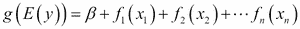，其中指定了指数族*E*用于*y*，以及`g`链接函数；`f`表示预测者的链接函数。

`gam`函数包含在`mgcv`包中，因此，首先安装此包并将其加载到 R 会话中。接下来，从`MASS`包中加载波士顿数据集（波士顿郊区的住房价值）。从数据集中，我们使用`dis`（到五个波士顿就业中心的加权平均距离）作为因变量，`nox`（氮氧化物浓度）作为自变量，然后将它们输入到`gam`函数中以生成拟合模型。

与`glm`类似，`gam`允许用户总结`gam`拟合。从总结中，可以找到参数参数、平滑项的显著性以及其他有用信息。

## 相关内容

+   除了`gam`之外，`mgcv`包还提供另一个用于大数据集的广义加性模型`bam`。`bam`包与`gam`非常相似，但使用更少的内存，效率相对更高。请使用`help`函数获取有关此模型的更多信息：

    ```py
     > ? bam

    ```

+   有关 R 中广义加性模型的更多信息，请参阅 *Wood, S. (2006). 广义加性模型：R 语言导论. CRC 出版社*。

# 可视化广义加性模型

在这个配方中，我们演示了如何将`gam`拟合回归线添加到散点图中。此外，我们使用`plot`函数可视化`gam`拟合。

## 准备工作

通过将`gam`拟合模型分配给`fit`变量来完成前面的配方。

## 如何做...

执行以下步骤以可视化广义加性模型：

1.  使用`nox`和`dis`变量生成散点图：

    ```py
    > plot(nox, dis)

    ```

    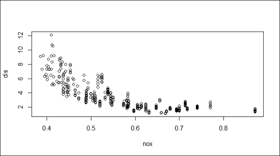

    变量 nox 对 dis 的散点图

1.  将回归添加到散点图：

    ```py
    > x = seq(0, 1, length = 500)
    > y = predict(fit, data.frame(nox = x))
    > lines(x, y, col = "red", lwd = 2)

    ```

    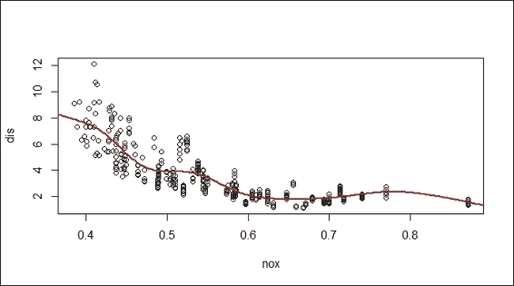

    散点图上的`gam`拟合回归

1.  或者，您可以使用`plot`函数绘制拟合模型：

    ```py
    > plot(fit)

    ```

    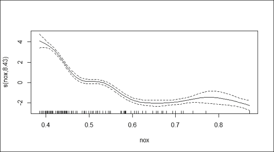

    拟合`gam`的图

## 工作原理...

要可视化拟合回归，我们首先使用`dis`和`nox`变量生成散点图。然后，我们生成*x*轴的序列，并通过在拟合模型`fit`上使用`predict`函数来响应*y*。最后，我们使用`lines`函数将回归线添加到散点图中。

除了在散点图上使用线条添加拟合回归线外，`gam`还有一个`plot`函数来可视化包含置信区域的拟合回归线。为了阴影置信区域，我们在函数中指定`shade = TRUE`。

## 更多...

`vis.gam`函数用于生成`gam`模型预测的透视或等高线图视图。这有助于观察响应变量如何与两个预测变量相互作用。以下是在`Boston`数据集上的等高线图示例：

```py
> fit2=gam(medv~crim+zn+crim:zn, data=Boston)
> vis.gam(fit2)

```

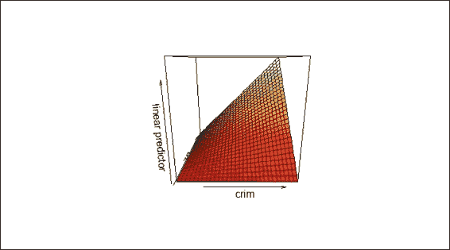

由 vis.gam 生成的样本等高线图

# 诊断广义加性模型

GAM 还提供了关于拟合过程和广义加性模型结果的诊断信息。在这个菜谱中，我们展示了如何通过`gam.check`函数绘制诊断图。

## 准备工作

确保之前的菜谱已完成，并将`gam`拟合模型分配给`fit`变量。

## 如何做...

执行以下步骤以诊断广义加性模型：

1.  使用`gam.check`在拟合模型上生成诊断图：

    ```py
    > gam.check(fit)

    Method: GCV   Optimizer: magic
    Smoothing parameter selection converged after 7 iterations.
    The RMS GCV score gradient at convergence was 8.79622e-06 .
    The Hessian was positive definite.
    The estimated model rank was 10 (maximum possible: 10)
    Model rank =  10 / 10 

    Basis dimension (k) checking results. Low p-value (k-index<1) may
    indicate that k is too low, especially if edf is close to k'.

     k'   edf k-index p-value
    s(nox) 9.000 8.434   0.397       0

    ```

    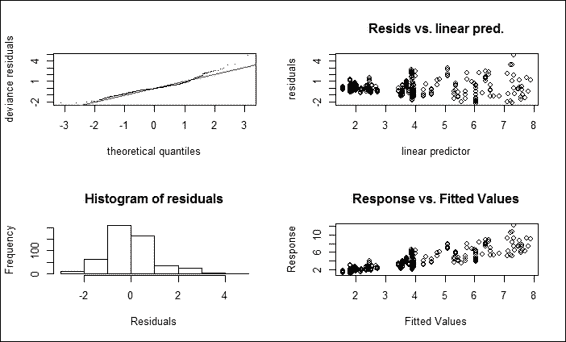

    拟合的 gam 诊断图

## 它是如何工作的...

`gam.check` 函数首先生成平滑参数估计收敛信息。在这个例子中，平滑参数，**GCV/UBRE**（**广义交叉验证/无偏风险估计器**）得分在七次迭代后收敛。GCV/UBRE 函数在最小值处的平均绝对梯度为 8.79622e-06，估计的秩为`10`。维度检查是为了测试平滑函数的基函数维度是否足够。从这个例子中可以看出，低 p 值表明 k 设置得太低。可以通过指定参数 k，通过拟合`gam`到数据中来调整平滑的维度选择。

除了提供有关平滑参数估计收敛的信息外，该函数还返回四个诊断图。截图中的图的上左部分显示了一个**分位数比较**图。此图有助于识别异常值和重尾。图的右上部分显示了残差与线性预测器的对比，这在寻找非恒定误差方差时很有用。图的左下部分显示了残差的直方图，有助于检测非正态性。图的右下部分显示了响应值与拟合值的关系。

## 更多...

您可以通过`help`函数获取有关`gam.check`的更多信息。特别是，这包括平滑参数估计收敛的详细说明和四个返回的图：

```py
> ?gam.check

```

此外，可以通过以下命令获取`choose.k`的更多信息：

```py
> ?choose.k

```
