# 第五章. 分类（I）- 树、懒惰和概率

在本章中，我们将介绍以下步骤：

+   准备训练和测试数据集

+   使用递归分区树构建分类模型

+   可视化递归分区树

+   测量递归分区树的预测性能

+   剪枝递归分区树

+   使用条件推断树构建分类模型

+   可视化条件推断树

+   测量条件推断树的预测性能

+   使用 k 近邻分类器对数据进行分类

+   使用逻辑回归对数据进行分类

+   使用朴素贝叶斯分类器对数据进行分类

# 简介

分类用于根据从训练数据集构建的分类模型识别新观察值的类别（测试数据集），其中类别已经已知。与回归类似，分类被归类为监督学习方法，因为它使用训练数据集的已知答案（标签）来预测测试数据集的答案（标签）。回归和分类之间的主要区别在于，回归用于预测连续值。

与此相反，分类用于识别给定观察值的类别。例如，一个人可能使用回归来根据历史价格预测给定股票的未来价格。然而，应该使用分类方法来预测股票价格是上涨还是下跌。

在本章中，我们将说明如何使用 R 进行分类。我们首先从客户流失数据集中构建训练数据集和测试数据集，然后应用不同的分类方法对客户流失数据集进行分类。在下面的步骤中，我们将介绍使用传统分类树和条件推断树、基于懒惰的算法以及使用基于概率的方法（使用训练数据集构建分类模型），然后使用该模型预测测试数据集的类别（类别标签）。我们还将使用混淆矩阵来衡量性能。

# 准备训练和测试数据集

构建分类模型需要训练数据集来训练分类模型，并且需要测试数据来验证预测性能。在下面的步骤中，我们将演示如何将电信客户流失数据集分割成训练数据集和测试数据集。

## 准备工作

在这个步骤中，我们将使用电信客户流失数据集作为输入数据源，并将数据分割成训练数据集和测试数据集。

## 如何做...

执行以下步骤将客户流失数据集分割成训练数据集和测试数据集：

1.  您可以从`C50`包中检索客户流失数据集：

    ```py
    > install.packages("C50")
    > library(C50)
    > data(churn)

    ```

1.  使用`str`读取数据集的结构：

    ```py
    > str(churnTrain)

    ```

1.  我们可以移除`state`、`area_code`和`account_length`属性，这些属性不适合作为分类特征：

    ```py
    > churnTrain = churnTrain[,! names(churnTrain) %in% c("state", "area_code", "account_length") ]

    ```

1.  然后，将 70%的数据分割为训练集，30%的数据分割为测试集：

    ```py
    > set.seed(2)
    > ind = sample(2, nrow(churnTrain), replace = TRUE, prob=c(0.7, 0.3))
    > trainset = churnTrain[ind == 1,]
    > testset = churnTrain[ind == 2,]

    ```

1.  最后，使用`dim`来探索训练集和测试集的维度：

    ```py
    > dim(trainset)
    [1] 2315   17
    > dim(testset)
    [1] 1018   17

    ```

## 工作原理...

在本食谱中，我们使用电信流失数据集作为示例数据源。该数据集包含 20 个变量和 3,333 个观测值。我们希望构建一个分类模型来预测客户是否会流失，这对电信公司来说非常重要，因为获取新客户的成本显著高于保留现有客户。

在构建分类模型之前，我们首先需要预处理数据。因此，我们使用变量名`churn`将流失数据从`C50`包加载到 R 会话中。由于我们确定属性如`state`、`area_code`和`account_length`对于构建分类模型不是有用的特征，我们移除了这些属性。

在预处理数据后，我们将数据分别分割为训练集和测试集。然后，我们使用一个样本函数随机生成一个包含 70%训练集和 30%测试集的序列，其大小等于观测值的数量。然后，我们使用生成的序列将流失数据集分割为训练集`trainset`和测试集`testset`。最后，通过使用`dim`函数，我们发现 3,333 个观测值中有 2,315 个被归类到训练集`trainset`，而其他 1,018 个被归类到测试集`testset`。

## 更多内容...

您可以将训练集和测试集的分割过程合并到`split.data`函数中。因此，您可以通过调用此函数并指定参数中的比例和种子来轻松地将数据分割成两个数据集：

```py
> split.data = function(data, p = 0.7, s = 666){
+   set.seed(s)
+   index = sample(1:dim(data)[1])
+   train = data[index[1:floor(dim(data)[1] * p)], ]
+   test = data[index[((ceiling(dim(data)[1] * p)) + 1):dim(data)[1]], ]
+   return(list(train = train, test = test))
+ } 

```

# 使用递归分割树构建分类模型

分类树使用分割条件根据一个或多个输入变量预测类标签。分类过程从树的根节点开始；在每个节点，过程将检查输入值是否应该根据分割条件递归地继续到右子分支或左子分支，并在遇到决策树的任何叶（终端）节点时停止。在本食谱中，我们将介绍如何将递归分割树应用于客户流失数据集。

## 准备工作

您需要完成之前的食谱，将流失数据集分割为训练集（`trainset`）和测试集（`testset`），并且每个数据集应恰好包含 17 个变量。

## 如何操作...

执行以下步骤将流失数据集分割为训练集和测试集：

1.  加载`rpart`包：

    ```py
    > library(rpart)

    ```

1.  使用`rpart`函数构建分类树模型：

    ```py
    > churn.rp = rpart(churn ~ ., data=trainset)

    ```

1.  输入`churn.rp`以检索分类树的节点细节：

    ```py
    > churn.rp 

    ```

1.  接下来，使用`printcp`函数来检查复杂度参数：

    ```py
    > printcp(churn.rp)

    Classification tree:
    rpart(formula = churn ~ ., data = trainset)

    Variables actually used in tree construction:
    [1] international_plan            number_customer_service_calls
    [3] total_day_minutes             total_eve_minutes 
    [5] total_intl_calls              total_intl_minutes 
    [7] voice_mail_plan 

    Root node error: 342/2315 = 0.14773

    n= 2315 

     CP nsplit rel error  xerror     xstd
    1 0.076023      0   1.00000 1.00000 0.049920
    2 0.074561      2   0.84795 0.99708 0.049860
    3 0.055556      4   0.69883 0.76023 0.044421
    4 0.026316      7   0.49415 0.52632 0.037673
    5 0.023392      8   0.46784 0.52047 0.037481
    6 0.020468     10   0.42105 0.50877 0.037092
    7 0.017544     11   0.40058 0.47076 0.035788
    8 0.010000     12   0.38304 0.47661 0.035993

    ```

1.  接下来，使用`plotcp`函数来绘制成本复杂度参数：

    ```py
    > plotcp(churn.rp)

    ```

    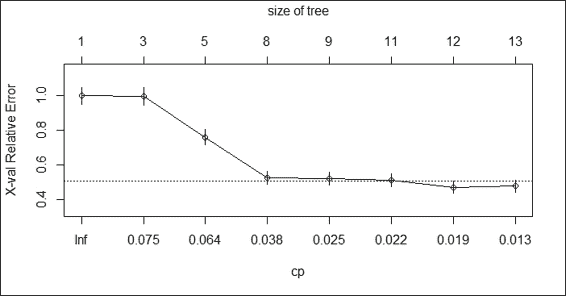

    图 1：成本复杂度参数图

1.  最后，使用`summary`函数来检查构建的模型：

    ```py
    > summary(churn.rp)

    ```

## 它是如何工作的...

在这个菜谱中，我们使用`rpart`包中的递归分割树来构建基于树的分类模型。递归分割树包括两个过程：递归和分割。在决策诱导的过程中，我们必须考虑一个统计评估问题（或者简单地说是一个是/否问题），根据评估结果将数据分割成不同的分区。然后，当我们确定了子节点后，我们可以重复执行分割，直到满足停止标准。

例如，根节点中的数据（如下所示）可以根据**f1**是否小于**X**的问题分为两组。如果是，数据被分割到左侧。否则，它被分割到右侧。然后，我们可以继续使用**f2**是否小于**Y**的问题来分割左侧数据：

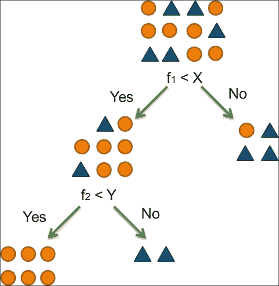

图 2：递归分割树

在第一步中，我们使用`library`函数加载`rpart`包。接下来，我们使用`churn`变量作为分类类别（类别标签）和剩余变量作为输入特征来构建分类模型。

模型构建完成后，你可以输入构建的模型变量名`churn.rp`来显示树节点细节。在打印的节点细节中，`n`表示样本大小，`loss`表示误分类成本，`yval`表示分类成员（在这种情况下为`no`或`yes`），而`yprob`表示两个类的概率（左值表示达到标签`no`的概率，右值表示达到标签`yes`的概率）。

然后，我们使用`printcp`函数来打印构建的树模型的复杂度参数。从`printcp`的输出中，应该找到一个复杂度参数 CP 的值，它作为惩罚来控制树的大小。简而言之，CP 值越大，分割的数量（`nsplit`）就越少。输出值（`rel`误差）表示当前树的平均偏差除以空树的平均偏差。`xerror`值表示由 10 折分类估计的相对误差。`xstd`表示相对误差的标准误差。

为了使**CP**（**成本复杂度参数**）表更易于阅读，我们使用`plotcp`生成 CP 表的信息图形。根据截图（步骤 5），底部 x 轴表示`cp`值，y 轴表示相对误差，上 x 轴显示树的大小。虚线表示标准差的上线。从截图可以确定，当树的大小为 12 时，最小交叉验证误差发生。

我们还可以使用`summary`函数显示函数调用、拟合树模型的复杂度参数表、变量重要性，这有助于识别对树分类最重要的变量（总和为 100），以及每个节点的详细信息。

使用决策树的优点在于它非常灵活且易于解释。它适用于分类和回归问题，以及更多；它是非参数的。因此，无需担心数据是否线性可分。至于使用决策树的缺点，它倾向于有偏差且过拟合。然而，你可以通过使用条件推断树来克服偏差问题，并通过随机森林方法或树剪枝来解决过拟合问题。

## 参见

+   关于`rpart`、`printcp`和`summary`函数的更多信息，请使用`help`函数：

    ```py
    > ?rpart
    > ?printcp
    > ?summary.rpart

    ```

+   `C50`是另一个提供决策树和基于规则的模型的包。如果你对这个包感兴趣，可以参考[`cran.r-project.org/web/packages/C50/C50.pdf`](http://cran.r-project.org/web/packages/C50/C50.pdf)文档。

# 可视化递归分割树

从最后一个配方中，我们学习了如何以文本格式打印分类树。为了使树更易于阅读，我们可以使用`plot`函数来获取已建分类树的图形显示。

## 准备工作

需要完成上一个配方，通过生成分类模型，并将模型分配给`churn.rp`变量。

## 如何做...

执行以下步骤以可视化分类树：

1.  使用`plot`函数和`text`函数绘制分类树：

    ```py
    > plot(churn.rp, margin= 0.1)
    > text(churn.rp, all=TRUE, use.n = TRUE)

    ```

    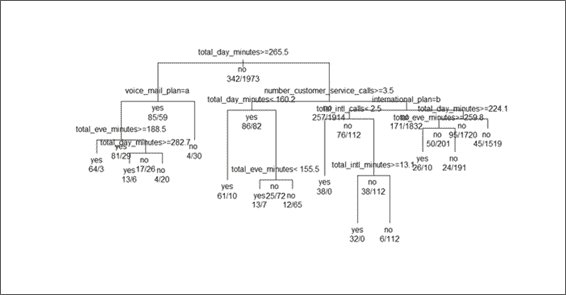

    图 3：分类树的图形显示

1.  你还可以指定`uniform`、`branch`和`margin`参数来调整布局：

    ```py
    > plot(churn.rp, uniform=TRUE, branch=0.6, margin=0.1)
    > text(churn.rp, all=TRUE, use.n = TRUE)

    ```

    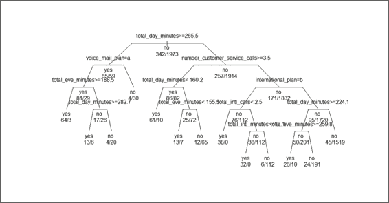

    图 4：调整分类树的布局

## 它是如何工作的...

在这里，我们演示如何使用`plot`函数图形化显示分类树。`plot`函数可以简单地可视化分类树，然后你可以使用`text`函数向图中添加文本。

在*图 3*中，我们将`margin`参数设置为 0.1，以在边界周围添加额外的空白，防止显示的文本被边界截断。它显示分支的长度表示偏差下降的相对幅度。然后我们使用文本函数为节点和分支添加标签。默认情况下，文本函数将在每个分割处添加一个分割条件，并在每个终端节点添加一个类别标签。为了在树图中添加更多信息，我们将参数设置为所有等于`TRUE`以添加所有节点的标签。此外，我们通过指定`use.n = TRUE`添加一个参数，以添加额外信息，这表明实际观测数分为两个不同的类别（是和否）。

在*图 4*中，我们将分支选项设置为 0.6，为每个绘制的分支添加一个肩部。此外，为了显示等长的分支而不是偏差下降的相对幅度，我们将选项`uniform`设置为`TRUE`。因此，*图 4*显示了一个具有短肩部和等长分支的分类树。

## 参见

+   您可以使用`?plot.rpart`来了解更多关于分类树绘制的相关信息。此文档还包括如何指定参数`uniform`、`branch`、`compress`、`nspace`、`margin`和`minbranch`以调整分类树布局的信息。

# 测量递归分割树的预测性能

由于我们在之前的配方中构建了一个分类树，我们可以用它来预测新观测的类别（类别标签）。在做出预测之前，我们首先验证分类树的预测能力，这可以通过在测试数据集上生成分类表来完成。在本配方中，我们将介绍如何使用`predict`函数和`table`函数生成预测标签与真实标签表，并解释如何生成混淆矩阵以衡量性能。

## 准备工作

您需要完成之前的配方，生成分类模型`churn.rp`。此外，您还需要准备训练数据集`trainset`和测试数据集`testset`，这些数据集是在本章第一节的第一个配方中生成的。

## 如何操作...

执行以下步骤以验证分类树的预测性能：

1.  您可以使用`predict`函数为测试数据集生成预测标签：

    ```py
    > predictions = predict(churn.rp, testset, type="class")

    ```

1.  使用`table`函数为测试数据集生成分类表：

    ```py
    > table(testset$churn, predictions)
     predictions
     yes  no
     yes 100  41
     no   18 859

    ```

1.  可以进一步使用`caret`包中提供的`confusionMatrix`函数生成混淆矩阵：

    ```py
    > library(caret)
    > confusionMatrix(table(predictions, testset$churn))
    Confusion Matrix and Statistics

    predictions yes  no
     yes 100  18
     no   41 859

     Accuracy : 0.942 
     95% CI : (0.9259, 0.9556)
     No Information Rate : 0.8615 
     P-Value [Acc > NIR] : < 2.2e-16 

     Kappa : 0.7393 
     Mcnemar's Test P-Value : 0.004181 

     Sensitivity : 0.70922 
     Specificity : 0.97948 
     Pos Pred Value : 0.84746 
     Neg Pred Value : 0.95444 
     Prevalence : 0.13851 
     Detection Rate : 0.09823 
     Detection Prevalence : 0.11591 
     Balanced Accuracy : 0.84435 

     'Positive' Class : yes 

    ```

## 工作原理...

在这个菜谱中，我们使用 `predict` 函数和构建的分类模型 `churn.rp` 来预测测试数据集 `testset` 的可能类别标签。预测的类别（类别标签）编码为是或否。然后，我们使用 `table` 函数在测试数据集上生成一个分类表。从表中，我们发现 859 个被正确预测为否，而 18 个被错误分类为是。100 个是的预测被正确预测，但有 41 个观测值被错误分类为否。进一步，我们使用来自 `caret` 包的 `confusionMatrix` 函数来产生分类模型的测量值。

## 相关内容

+   你可以使用 `?confusionMatrix` 了解更多关于使用混淆矩阵进行性能测量的信息

+   对于那些对混淆矩阵定义输出感兴趣的人，请参阅维基百科条目，**混淆矩阵** ([`en.wikipedia.org/wiki/Confusion_matrix`](http://en.wikipedia.org/wiki/Confusion_matrix))

# 修剪递归分割树

在之前的菜谱中，我们已经为 churn 数据集构建了一个复杂的决策树。然而，有时我们必须移除在分类实例中不起作用的部分，以避免过拟合，并提高预测精度。因此，在这个菜谱中，我们介绍了成本复杂度修剪方法来修剪分类树。

## 准备工作

你需要完成之前的菜谱，生成一个分类模型，并将模型分配给 `churn.rp` 变量。

## 如何做...

执行以下步骤来修剪分类树：

1.  找到分类树模型的最低交叉验证误差：

    ```py
    > min(churn.rp$cptable[,"xerror"])
    [1] 0.4707602

    ```

1.  定位具有最低交叉验证误差的记录：

    ```py
    > which.min(churn.rp$cptable[,"xerror"])
    7 

    ```

1.  获取具有最低交叉验证误差的记录的成本复杂度参数：

    ```py
    > churn.cp = churn.rp$cptable[7,"CP"]
    > churn.cp
    [1] 0.01754386

    ```

1.  通过将 `cp` 参数设置为具有最低交叉验证误差的记录的 CP 值来修剪树：

    ```py
    > prune.tree = prune(churn.rp, cp= churn.cp)

    ```

1.  使用 `plot` 和 `text` 函数可视化分类树：

    ```py
    > plot(prune.tree, margin= 0.1)
    > text(prune.tree, all=TRUE , use.n=TRUE)

    ```

    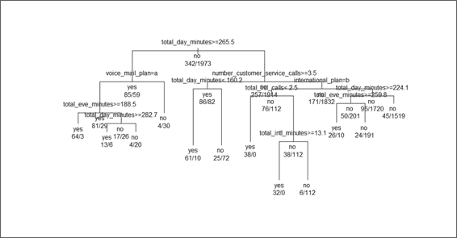

    图 5：修剪后的分类树

1.  接下来，你可以根据修剪后的分类树模型生成一个分类表：

    ```py
    > predictions = predict(prune.tree, testset, type="class")
    > table(testset$churn, predictions)
     predictions
     yes  no
     yes  95  46
     no   14 863

    ```

1.  最后，你可以根据分类表生成一个混淆矩阵：

    ```py
    > confusionMatrix(table(predictions, testset$churn))
    Confusion Matrix and Statistics

    predictions yes  no
     yes  95  14
     no   46 863

     Accuracy : 0.9411 
     95% CI : (0.9248, 0.9547)
     No Information Rate : 0.8615 
     P-Value [Acc > NIR] : 2.786e-16 

     Kappa : 0.727 
     Mcnemar's Test P-Value : 6.279e-05 

     Sensitivity : 0.67376 
     Specificity : 0.98404 
     Pos Pred Value : 0.87156 
     Neg Pred Value : 0.94939 
     Prevalence : 0.13851 
     Detection Rate : 0.09332 
     Detection Prevalence : 0.10707 
     Balanced Accuracy : 0.82890 

     'Positive' Class : yes 

    ```

## 它是如何工作的...

在本食谱中，我们讨论了剪枝分类树以避免过拟合并产生更健壮的分类模型。我们首先在`cptable`中找到具有最小交叉验证错误的记录，然后提取该记录的 CP 并将其值分配给`churn.cp`。接下来，我们使用`prune`函数以`churn.cp`作为参数剪枝分类树。然后，通过使用`plot`函数，我们图形化地显示了剪枝后的分类树。从*图 5*中可以看出，树的分割小于原始分类树（*图 3*）。最后，我们生成了一个分类表，并使用混淆矩阵来验证剪枝树的性能。结果显示，准确率（0.9411）略低于原始模型（0.942），同时也表明剪枝树可能不如原始分类树表现好，因为我们已经剪掉了一些分割条件（尽管如此，人们应该检查敏感性和特异性的变化）。然而，剪枝后的树模型更健壮，因为它去除了可能导致过拟合的一些分割条件。

## 相关内容

+   对于那些想了解更多关于成本复杂度剪枝的人来说，请参阅维基百科关于**剪枝（决策树**）的文章：[`en.wikipedia.org/wiki/Pruning_(decision_trees`](http://en.wikipedia.org/wiki/Pruning_(decision_trees)

# 使用条件推理树构建分类模型

除了传统的决策树（`rpart`）之外，条件推理树（`ctree`）是另一种流行的基于树的分类方法。与传统决策树类似，条件推理树也通过对因变量进行单变量分割来递归地分割数据。然而，使条件推理树与传统决策树不同的地方在于，条件推理树将显著性检验程序适应于选择变量，而不是通过最大化信息度量（`rpart`使用基尼系数）来选择变量。在本食谱中，我们将介绍如何适应条件推理树以构建分类模型。

## 准备工作

您需要完成第一个步骤，通过生成训练数据集`trainset`和测试数据集`testset`。

## 如何操作...

执行以下步骤以构建条件推理树：

1.  首先，我们使用`party`包中的`ctree`构建分类模型：

    ```py
    > library(party)
    > ctree.model = ctree(churn ~ . , data = trainset)

    ```

1.  然后，我们检查构建的树模型：

    ```py
    > ctree.model

    ```

## 它是如何工作的...

在这个菜谱中，我们使用条件推理树构建了一个分类树。`ctree`的使用与`rpart`类似。因此，在面临分类问题时，你可以轻松地使用传统的决策树或条件推理树来测试分类能力。接下来，我们通过检查构建的模型来获取分类树的节点细节。在模型中，我们发现`ctree`提供的信息类似于分割条件、标准（1 – p 值）、统计（测试统计量）和权重（与节点对应的案例权重）。然而，它提供的信息不如`rpart`通过使用`summary`函数提供的信息多。

## 参见

+   你可以使用`help`函数查阅**二叉树类**的定义，并了解更多关于二叉树属性的信息：

    ```py
     > help("BinaryTree-class")

    ```

# 可视化条件推理树

与`rpart`类似，`party`包也为用户提供了一种可视化条件推理树的方法。在下面的菜谱中，我们将介绍如何使用`plot`函数来可视化条件推理树。

## 准备工作

你需要完成第一个菜谱，生成条件推理树模型`ctree.model`。此外，你还需要在 R 会话中加载`trainset`和`testset`。

## 如何做...

执行以下步骤以可视化条件推理树：

1.  使用`plot`函数绘制在上一菜谱中构建的`ctree.model`：

    ```py
    > plot(ctree.model)

    ```

    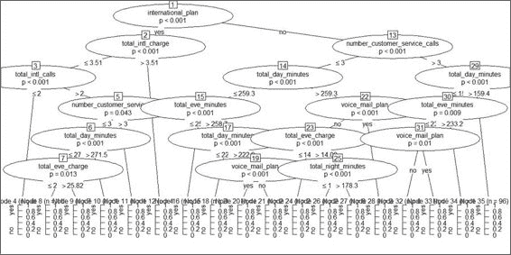

    图 6：客户流失数据的条件推理树

1.  要获得一个简单的条件推理树，可以通过减少输入特征来简化构建的模型，并重新绘制分类树：

    ```py
    > daycharge.model = ctree(churn ~ total_day_charge, data = trainset)
    > plot(daycharge.model)

    ```

    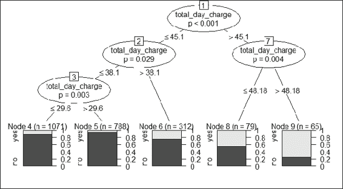

    图 7：使用 total_day_charge 变量作为唯一分割条件的条件推理树

## 工作原理...

要可视化条件推理树的节点细节，我们可以对构建的分类模型应用`plot`函数。输出图显示，每个中间节点都显示了因变量名称和 p 值。分割条件显示在左右分支上。终端节点显示了分类观察数的数量，*n*，以及类别标签为 0 或 1 的概率。

以*图 7*为例，我们首先使用`total_day_charge`作为唯一特征，`churn`作为类别标签构建一个分类模型。构建的分类树显示，当`total_day_charge`超过 48.18 时，节点 9 中较浅的灰色区域大于较深的灰色区域，这表明日收费超过 48.18 的客户更有可能流失（标签=是）。

## 参见

+   条件推理树的可视化来自`plot.BinaryTree`函数。如果你对调整分类树的布局感兴趣，可以使用`help`函数阅读以下文档：

    ```py
    > ?plot.BinaryTree

    ```

# 测量条件推理树的预测性能

在构建条件推理树作为分类模型之后，我们可以使用`treeresponse`和`predict`函数来预测测试数据集`testset`的类别，并进一步通过分类表和混淆矩阵验证预测能力。

## 准备工作

您需要完成上一个菜谱，生成条件推理树模型`ctree.model`。此外，您还需要在 R 会话中加载`trainset`和`testset`。

## 如何操作...

执行以下步骤以测量条件推理树的预测性能：

1.  您可以使用`predict`函数来预测测试数据集`testset`的类别：

    ```py
    > ctree.predict = predict(ctree.model ,testset)
    > table(ctree.predict, testset$churn)

    ctree.predict yes  no
     yes  99  15
     no   42 862

    ```

1.  此外，您可以使用来自 caret 包的`confusionMatrix`函数来生成预测结果的性能度量：

    ```py
    > confusionMatrix(table(ctree.predict, testset$churn))
    Confusion Matrix and Statistics

    ctree.predict yes  no
     yes  99  15
     no   42 862

     Accuracy : 0.944 
     95% CI : (0.9281, 0.9573)
     No Information Rate : 0.8615 
     P-Value [Acc > NIR] : < 2.2e-16 

     Kappa : 0.7449 
     Mcnemar's Test P-Value : 0.0005736 

     Sensitivity : 0.70213 
     Specificity : 0.98290 
     Pos Pred Value : 0.86842 
     Neg Pred Value : 0.95354 
     Prevalence : 0.13851 
     Detection Rate : 0.09725 
     Detection Prevalence : 0.11198 
     Balanced Accuracy : 0.84251 

     'Positive' Class : yes 

    ```

1.  您还可以使用`treeresponse`函数，它将告诉您类概率列表：

    ```py
    > tr = treeresponse(ctree.model, newdata = testset[1:5,])
    > tr
    [[1]]
    [1] 0.03497409 0.96502591

    [[2]]
    [1] 0.02586207 0.97413793

    [[3]]
    [1] 0.02586207 0.97413793

    [[4]]
    [1] 0.02586207 0.97413793

    [[5]]
    [1] 0.03497409 0.96502591

    ```

## 工作原理...

在本菜谱中，我们首先演示了如何使用`prediction`函数预测测试数据集`testset`的类别（类标签），然后使用`table`函数生成分类表。接下来，您可以使用内置在 caret 包中的`confusionMatrix`函数来确定性能度量。

除了`predict`函数外，`treeresponse`还可以估计类概率，这通常会将具有更高概率的标签分类。在本例中，我们演示了如何使用测试数据集`testset`的前五条记录来获取估计的类概率。`treeresponse`函数返回一个包含五个概率的列表。您可以使用该列表来确定实例的标签。

## 相关内容

+   对于`predict`函数，您可以指定类型为`response`、`prob`或`node`。如果您在调用`predict`函数时指定类型为`prob`（例如，`predict(… type="prob")`），您将得到与`treeresponse`返回的完全相同的结果。

# 使用 k 近邻分类器对数据进行分类

**K 近邻**（**knn**）是一种非参数的懒惰学习方法。从非参数的角度来看，它不对数据分布做出任何假设。在懒惰学习方面，它不需要一个显式的学习阶段来进行泛化。以下菜谱将介绍如何在流失数据集上应用 k 近邻算法。

## 准备工作

您需要完成上一个菜谱，生成训练和测试数据集。

## 如何操作...

执行以下步骤，使用 k 近邻算法对流失数据进行分类：

1.  首先，必须安装`class`包并在 R 会话中加载它：

    ```py
    > install.packages("class")
    > library(class)

    ```

1.  将训练数据集和测试数据集中`voice_mail_plan`和`international_plan`属性的`yes`和`no`替换为 1 和 0：

    ```py
    > levels(trainset$international_plan) = list("0"="no", "1"="yes")
    > levels(trainset$voice_mail_plan) = list("0"="no", "1"="yes")
    > levels(testset$international_plan) = list("0"="no", "1"="yes")
    > levels(testset$voice_mail_plan) = list("0"="no", "1"="yes")

    ```

1.  在训练数据集和测试数据集上使用 knn 分类方法：

    ```py
    > churn.knn  = knn(trainset[,! names(trainset) %in% c("churn")], testset[,! names(testset) %in% c("churn")], trainset$churn, k=3)

    ```

1.  然后，你可以使用 `summary` 函数检索预测标签的数量：

    ```py
    > summary(churn.knn)
    yes  no
     77 941

    ```

1.  接下来，你可以使用 `table` 函数生成分类矩阵：

    ```py
    > table(testset$churn, churn.knn)
     churn.knn
     yes  no
     yes  44  97
     no   33 844

    ```

1.  最后，你可以使用 `confusionMatrix` 函数生成混淆矩阵：

    ```py
    > confusionMatrix(table(testset$churn, churn.knn))
    Confusion Matrix and Statistics

     churn.knn
     yes  no
     yes  44  97
     no   33 844

     Accuracy : 0.8723 
     95% CI : (0.8502, 0.8922)
     No Information Rate : 0.9244 
     P-Value [Acc > NIR] : 1 

     Kappa : 0.339 
     Mcnemar's Test P-Value : 3.286e-08 

     Sensitivity : 0.57143 
     Specificity : 0.89692 
     Pos Pred Value : 0.31206 
     Neg Pred Value : 0.96237 
     Prevalence : 0.07564 
     Detection Rate : 0.04322 
     Detection Prevalence : 0.13851 
     Balanced Accuracy : 0.73417 

     'Positive' Class : yes 

    ```

## 如何工作...

**knn** 通过训练所有样本并根据相似性（距离）度量对新实例进行分类。例如，相似性度量可以表示如下：

+   **欧几里得距离**: 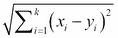

+   **曼哈顿距离**: 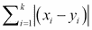

在 knn 中，一个新的实例被分类到一个标签（类别），这个标签在 k 个最近邻中是共同的。如果 *k = 1*，那么新的实例将被分配到其最近邻所属的类别。算法的唯一输入是 k。如果我们给出小的 k 输入，可能会导致过拟合。另一方面，如果我们给出大的 k 输入，可能会导致欠拟合。为了选择合适的 k 值，可以依靠交叉验证。

knn 的优点是：

+   学习过程没有成本

+   它是非参数的，这意味着你不需要对数据分布做出假设。

+   当你能找到给定实例的相似性度量时，你可以对任何数据进行分类

knn 的主要缺点是：

+   解释分类结果很困难。

+   对于大数据集来说，这是一个昂贵的计算。

+   性能依赖于维数的数量。因此，对于高维问题，你应该首先降低维度以提高处理性能。

knn 的使用与之前菜谱中提到的基于树的算法应用没有显著差异。然而，虽然基于树的算法可能会展示决策树模型，但 knn 生成的输出仅揭示分类类别因素。然而，在构建分类模型之前，应该将属性从字符串类型替换为整数，因为 k 近邻算法需要计算观测之间的距离。然后，我们通过指定 *k=3* 来构建分类模型，这意味着选择最近的三个邻居。在分类模型构建完成后，我们可以使用预测因素和测试数据集标签作为输入生成分类表。最后，我们可以从分类表中生成混淆矩阵。混淆矩阵的输出显示准确率为 (0.8723)，这表明之前菜谱中提到的基于树的算法在此情况下优于 k 近邻分类方法的准确率。尽管如此，我们无法仅根据准确率来确定哪个模型更好，还应该检查输出的特异性和敏感性。

## 参见

+   另有一个名为`kknn`的包，它提供了加权 k 最近邻分类、回归和聚类。您可以通过阅读此文档了解更多关于该包的信息：[`cran.r-project.org/web/packages/kknn/kknn.pdf`](http://cran.r-project.org/web/packages/kknn/kknn.pdf)。

# 使用逻辑回归进行数据分类

逻辑回归是一种概率统计分类模型，可以用来根据一个或多个特征预测类别标签。分类是通过使用`logit`函数来估计结果概率来完成的。可以通过指定家族为二项式并使用`glm`函数来使用逻辑回归。在本菜谱中，我们将介绍如何使用逻辑回归进行数据分类。

## 准备工作

您需要完成第一个菜谱，通过生成训练集和测试集。

## 如何操作...

执行以下步骤以使用逻辑回归对流失数据进行分类：

1.  在指定家族为二项式的情况下，我们通过使用`glm`函数对数据集`trainset`应用，以`churn`作为类别标签，其余变量作为输入特征：

    ```py
    > fit = glm(churn ~ ., data = trainset, family=binomial)

    ```

1.  使用`summary`函数来获取构建的逻辑回归模型的摘要信息：

    ```py
    > summary(fit)

    Call:
    glm(formula = churn ~ ., family = binomial, data = trainset)

    Deviance Residuals: 
     Min       1Q   Median       3Q      Max 
    -3.1519   0.1983   0.3460   0.5186   2.1284 

    Coefficients:
     Estimate Std. Error z value Pr(>|z|)
    (Intercept)                    8.3462866  0.8364914   9.978  < 2e-16
    international_planyes         -2.0534243  0.1726694 -11.892  < 2e-16
    voice_mail_planyes             1.3445887  0.6618905   2.031 0.042211
    number_vmail_messages         -0.0155101  0.0209220  -0.741 0.458496
    total_day_minutes              0.2398946  3.9168466   0.061 0.951163
    total_day_calls               -0.0014003  0.0032769  -0.427 0.669141
    total_day_charge              -1.4855284 23.0402950  -0.064 0.948592
    total_eve_minutes              0.3600678  1.9349825   0.186 0.852379
    total_eve_calls               -0.0028484  0.0033061  -0.862 0.388928
    total_eve_charge              -4.3204432 22.7644698  -0.190 0.849475
    total_night_minutes            0.4431210  1.0478105   0.423 0.672367
    total_night_calls              0.0003978  0.0033188   0.120 0.904588
    total_night_charge            -9.9162795 23.2836376  -0.426 0.670188
    total_intl_minutes             0.4587114  6.3524560   0.072 0.942435
    total_intl_calls               0.1065264  0.0304318   3.500 0.000464
    total_intl_charge             -2.0803428 23.5262100  -0.088 0.929538
    number_customer_service_calls -0.5109077  0.0476289 -10.727  < 2e-16

    (Intercept)                   ***
    international_planyes         ***
    voice_mail_planyes            * 
    number_vmail_messages 
    total_day_minutes 
    total_day_calls 
    total_day_charge 
    total_eve_minutes 
    total_eve_calls 
    total_eve_charge 
    total_night_minutes 
    total_night_calls 
    total_night_charge 
    total_intl_minutes 
    total_intl_calls              ***
    total_intl_charge 
    number_customer_service_calls ***
    ---
    Signif. codes:  0 '***' 0.001 '**' 0.01 '*' 0.05 '.' 0.1 ' ' 1

    (Dispersion parameter for binomial family taken to be 1)

     Null deviance: 1938.8  on 2314  degrees of freedom
    Residual deviance: 1515.3  on 2298  degrees of freedom
    AIC: 1549.3

    Number of Fisher Scoring iterations: 6

    ```

1.  然后，我们发现构建的模型包含不显著的变量，这可能导致误分类。因此，我们只使用显著变量来训练分类模型：

    ```py
    > fit = glm(churn ~ international_plan + voice_mail_plan+total_intl_calls+number_customer_service_calls, data = trainset, family=binomial)
    > summary(fit)

    Call:
    glm(formula = churn ~ international_plan + voice_mail_plan + 
     total_intl_calls + number_customer_service_calls, family = binomial, 
     data = trainset)

    Deviance Residuals: 
     Min       1Q   Median       3Q      Max 
    -2.7308   0.3103   0.4196   0.5381   1.6716 

    Coefficients:
     Estimate Std. Error z value
    (Intercept)                    2.32304    0.16770  13.852
    international_planyes         -2.00346    0.16096 -12.447
    voice_mail_planyes             0.79228    0.16380   4.837
    total_intl_calls               0.08414    0.02862   2.939
    number_customer_service_calls -0.44227    0.04451  -9.937
     Pr(>|z|) 
    (Intercept)                    < 2e-16 ***
    international_planyes          < 2e-16 ***
    voice_mail_planyes            1.32e-06 ***
    total_intl_calls               0.00329 ** 
    number_customer_service_calls  < 2e-16 ***
    ---
    Signif. codes: 
    0  es:    des:  **rvice_calls  < '.  es:    de

    (Dispersion parameter for binomial family taken to be 1)

     Null deviance: 1938.8  on 2314  degrees of freedom
    Residual deviance: 1669.4  on 2310  degrees of freedom
    AIC: 1679.4

    Number of Fisher Scoring iterations: 5

    ```

1.  然后，您可以使用拟合模型`fit`来预测`testset`的结果。您也可以通过判断概率是否高于 0.5 来确定类别：

    ```py
    > pred = predict(fit,testset, type="response")
    > Class = pred >.5

    ```

1.  接下来，使用`summary`函数将显示二元结果计数，并揭示概率是否高于 0.5：

    ```py
    > summary(Class)
     Mode   FALSE    TRUE    NA's 
    logical      29     989       0 

    ```

1.  您可以根据测试数据集的标签和预测结果生成计数统计信息：

    ```py
    > tb = table(testset$churn,Class)
    > tb
     Class
     FALSE TRUE
     yes    18  123
     no     11  866

    ```

1.  您可以将上一步的统计信息转换为分类表，然后生成混淆矩阵：

    ```py
    > churn.mod = ifelse(testset$churn == "yes", 1, 0)
    > pred_class = churn.mod
    > pred_class[pred<=.5] = 1- pred_class[pred<=.5]
    > ctb = table(churn.mod, pred_class)
    > ctb
     pred_class
    churn.mod   0   1
     0 866  11
     1  18 123
    > confusionMatrix(ctb)
    Confusion Matrix and Statistics

     pred_class
    churn.mod   0   1
     0 866  11
     1  18 123

     Accuracy : 0.9715 
     95% CI : (0.9593, 0.9808)
     No Information Rate : 0.8684 
     P-Value [Acc > NIR] : <2e-16 

     Kappa : 0.8781 
     Mcnemar's Test P-Value : 0.2652 

     Sensitivity : 0.9796 
     Specificity : 0.9179 
     Pos Pred Value : 0.9875 
     Neg Pred Value : 0.8723 
     Prevalence : 0.8684 
     Detection Rate : 0.8507 
     Detection Prevalence : 0.8615 
     Balanced Accuracy : 0.9488 

     'Positive' Class : 0 

    ```

## 它是如何工作的...

逻辑回归与线性回归非常相似；主要区别在于线性回归中的因变量是连续的，而逻辑回归中的因变量是二元的（或名义的）。逻辑回归的主要目标是使用 logit 来得出名义变量与测量变量相关的概率。我们可以用以下方程表示 logit：ln(P/(1-P))，其中 P 是某个事件发生的概率。

逻辑回归的优势在于它易于解释，它指导模型逻辑概率，并为结果提供置信区间。与难以更新模型的决策树不同，您可以在逻辑回归中快速更新分类模型以包含新数据。该算法的主要缺点是它受到多重共线性问题的影响，因此解释变量必须是线性独立的。`glm` 提供了一个广义线性回归模型，允许在选项中指定模型。如果将家族指定为二项逻辑，则可以将家族设置为二项以对分类因变量进行分类。

分类过程从使用训练数据集生成逻辑回归模型开始，指定 `Churn` 作为类标签，其他变量作为训练特征，并将家族设置为二项。然后我们使用 `summary` 函数生成模型的摘要信息。从摘要信息中，我们可能会发现一些不显著的变量（p 值 > 0.05），这可能导致误分类。因此，我们应该只考虑显著变量来构建模型。

接下来，我们使用 `fit` 函数来预测测试数据集 `testset` 的分类因变量。`fit` 函数输出一个类标签的概率，结果等于或低于 0.5 表示预测的标签与测试数据集的标签不匹配，而概率高于 0.5 则表示预测的标签与测试数据集的标签匹配。此外，我们可以使用 `summary` 函数来获取预测标签是否与测试数据集标签匹配的统计信息。最后，为了生成混淆矩阵，我们首先生成一个分类表，然后使用 `confusionMatrix` 生成性能度量。

## 参见

+   有关如何使用 `glm` 函数的更多信息，请参阅第四章，*理解回归分析*，其中涵盖了如何解释 `glm` 函数的输出。

# 使用 Naïve Bayes 分类器进行数据分类

Naïve Bayes 分类器也是一种基于概率的分类器，它基于应用贝叶斯定理并假设强独立性。在本食谱中，我们将介绍如何使用 Naïve Bayes 分类器对数据进行分类。

## 准备工作

您需要完成第一个食谱，生成训练和测试数据集。

## 如何操作...

使用 Naïve Bayes 分类器对流失数据进行分类的以下步骤：

1.  加载 `e1071` 库并使用 `naiveBayes` 函数构建分类器：

    ```py
    > library(e1071) 
    > classifier=naiveBayes(trainset[, !names(trainset) %in% c("churn")], trainset$churn)

    ```

1.  输入 `classifier` 以检查函数调用、先验概率和条件概率：

    ```py
    > classifier

    Naive Bayes Classifier for Discrete Predictors

    Call:
    naiveBayes.default(x = trainset[, !names(trainset) %in% c("churn")], 
     y = trainset$churn)

    A-priori probabilities:
    trainset$churn
     yes        no 
    0.1477322 0.8522678 

    Conditional probabilities:
     international_plan
    trainset$churn         no        yes
     yes 0.70467836 0.29532164
     no  0.93512418 0.06487582

    ```

1.  接下来，您可以生成测试数据集的分类表：

    ```py
    > bayes.table = table(predict(classifier, testset[, !names(testset) %in% c("churn")]), testset$churn)
    > bayes.table

     yes  no
     yes  68  45
     no   73 832

    ```

1.  最后，你可以从分类表中生成混淆矩阵：

    ```py
    > confusionMatrix(bayes.table)
    Confusion Matrix and Statistics

     yes  no
     yes  68  45
     no   73 832

     Accuracy : 0.8841 
     95% CI : (0.8628, 0.9031)
     No Information Rate : 0.8615 
     P-Value [Acc > NIR] : 0.01880 

     Kappa : 0.4701 
     Mcnemar's Test P-Value : 0.01294 

     Sensitivity : 0.4823 
     Specificity : 0.9487 
     Pos Pred Value : 0.6018 
     Neg Pred Value : 0.9193 
     Prevalence : 0.1385 
     Detection Rate : 0.0668 
     Detection Prevalence : 0.1110 
     Balanced Accuracy : 0.7155 

     'Positive' Class : yes 

    ```

## 如何工作...

朴素贝叶斯假设特征在条件上是独立的，即预测变量（x）对类别（c）的影响独立于其他预测变量对类别（c）的影响。它计算后验概率 *P(c|x)*，如下公式所示：

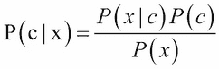

其中 *P(x|c)* 被称为似然，*p(x)* 被称为边缘似然，*p(c)* 被称为先验概率。如果有许多预测变量，我们可以将后验概率如下公式化：

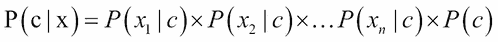

朴素贝叶斯的优势在于它相对简单且易于使用。当训练集相对较小，可能包含一些噪声和缺失数据时，它很适用。此外，你可以轻松地获得预测的概率。朴素贝叶斯的缺点在于它假设所有特征都是独立的且同等重要，这在现实世界中是非常不可能的。

在这个配方中，我们使用来自 `e1071` 包的朴素贝叶斯分类器来构建分类模型。首先，我们将所有变量（不包括 `churn` 类标签）指定为第一个输入参数，并将 `churn` 类标签指定为 `naiveBayes` 函数调用中的第二个参数。然后，我们将分类模型分配给变量分类器。接下来，我们打印变量分类器以获取信息，例如函数调用、先验概率和条件概率。我们还可以使用 `predict` 函数获取预测结果，以及使用 `table` 函数检索测试数据集的分类表。最后，我们使用混淆矩阵来计算分类模型的性能度量。

最后，我们列出本章中提到的所有算法的比较表：

| 算法 | 优点 | 缺点 |
| --- | --- | --- |
| 递归分割树 |

+   非常灵活且易于解释

+   适用于分类和回归问题

+   非参数

|

+   容易产生偏差和过拟合

|

| 条件推断树 |
| --- |

+   非常灵活且易于解释

+   适用于分类和回归问题

+   非参数

+   比递归分割树更不容易产生偏差

|

+   容易过拟合

|

| K 最近邻分类器 |
| --- |

+   学习过程成本为零

+   非参数方法

+   当你能找到任何给定实例的相似度度量时，你可以对任何数据进行分类

|

+   分类结果难以解释

+   对于大数据集，计算成本高昂

+   性能依赖于维度数量

|

| 逻辑回归 |
| --- |

+   易于解释

+   提供模型逻辑概率

+   提供置信区间

+   你可以快速更新分类模型以包含新数据

|

+   患有多重共线性

+   无法处理连续变量的缺失值

+   对连续变量的极端值敏感

|

| 朴素贝叶斯 |
| --- |

+   相对简单直观易用

+   当训练集相对较小时适用

+   可以处理一些噪声和缺失数据

+   可以轻松获得预测的概率

|

+   假设所有特征都是独立且同等重要的，这在现实世界中是非常不可能的

+   当训练集数量增加时，容易出现偏差

|

## 参见

+   想了解更多关于贝叶斯定理的信息，您可以参考以下维基百科文章：[`en.wikipedia.org/wiki/Bayes'_theorem`](http://en.wikipedia.org/wiki/Bayes'_theorem)
