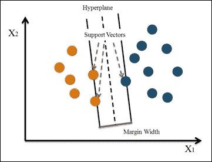
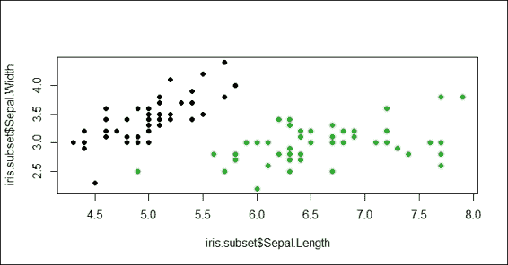
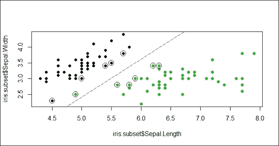
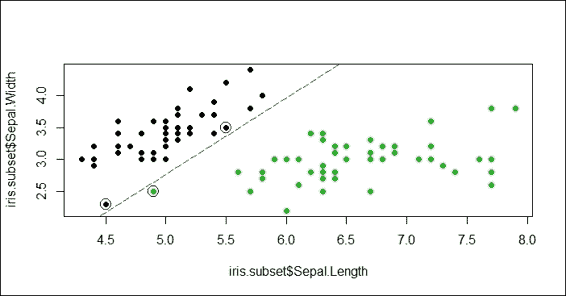
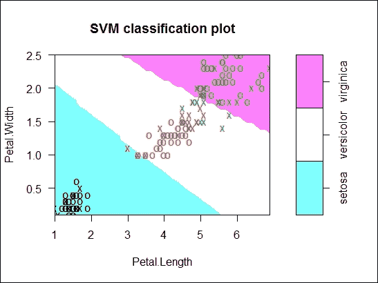
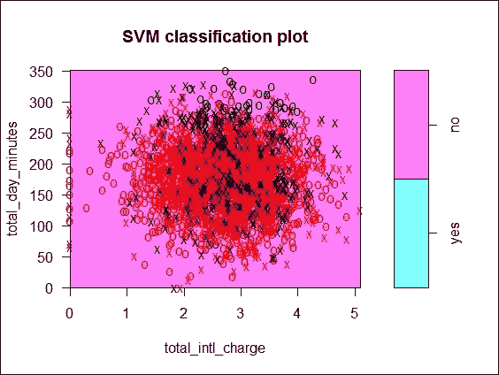
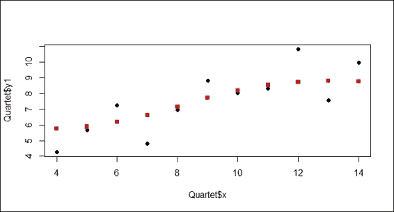
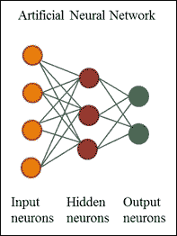
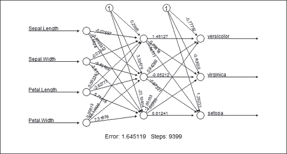

# 第六章. 分类（II）- 神经网络和 SVM

在本章中，我们将涵盖以下食谱：

+   使用支持向量机对数据进行分类

+   选择支持向量机的成本

+   可视化支持向量机拟合

+   基于由支持向量机训练的模型预测标签

+   调整支持向量机

+   使用 neuralnet 训练神经网络

+   可视化由 neuralnet 训练的神经网络

+   基于由 neuralnet 训练的模型预测标签

+   使用 nnet 训练神经网络

+   基于由 nnet 训练的模型预测标签

# 简介

大多数研究表明，**支持向量机**（**SVM**）和**神经网络**（**NN**）是强大的分类工具，可以应用于多个不同领域。与上一章中提到的基于树或基于概率的方法不同，支持向量机和神经网络从输入到输出的转换过程不太清晰，可能难以解释。因此，支持向量机和神经网络都被称为黑盒方法。

神经网络的发展灵感来源于人类大脑活动。因此，这类网络是一种模仿人类心智模式的计算模型。相比之下，支持向量机首先将输入数据映射到由核函数定义的高维特征空间，并找到通过最大间隔分离训练数据的最佳超平面。简而言之，我们可以将支持向量机视为高维空间中的线性算法。

这两种方法在解决分类问题时都有优点和缺点。例如，支持向量机解决方案是全局最优解，而神经网络可能会遭受多个局部最优解。因此，选择哪种方法取决于数据源的特征。在本章中，我们将说明以下内容：

+   如何训练支持向量机

+   观察成本选择如何影响支持向量机分类器

+   可视化支持向量机拟合

+   基于由 SVM 训练的模型预测测试数据集的标签

+   调整 SVM

在神经网络部分，我们将涵盖以下内容：

+   如何训练神经网络

+   如何可视化神经网络模型

+   基于由`neuralnet`训练的模型预测测试数据集的标签

+   最后，我们将展示如何使用`nnet`训练神经网络，以及如何使用它来预测测试数据集的标签

# 使用支持向量机对数据进行分类

最知名且最受欢迎的支持向量机工具是`libsvm`和`SVMLite`。对于 R 语言用户，你可以在`e1071`包中找到`libsvm`的实现，在`klaR`包中找到`SVMLite`。因此，你可以使用这两个包中实现的功能来训练支持向量机。在本例中，我们将重点关注使用来自`e1071`包的`svm`函数（`libsvm`实现版本）来训练基于电信客户流失数据训练数据集的支持向量机。

## 准备工作

在本例中，我们将继续使用电信客户流失数据集作为输入数据源来训练支持向量机。对于那些尚未准备数据集的用户，请参阅第五章，*分类（I）-树、懒惰和概率性*，以获取详细信息。

## 如何操作...

执行以下步骤来训练 SVM：

1.  加载`e1071`包：

    ```py
    > library(e1071)

    ```

1.  使用`svm`函数并通过`trainset`作为输入数据集来训练支持向量机，并使用`churn`作为分类类别：

    ```py
    > model  = svm(churn~., data = trainset, kernel="radial", cost=1, gamma = 1/ncol(trainset))

    ```

1.  最后，你可以使用`summary`函数获取关于构建的模型的整体信息：

    ```py
    > summary(model)

    Call:
    svm(formula = churn ~ ., data = trainset, kernel = "radial", cost = 1, gamma = 1/ncol(trainset))

    Parameters:
     SVM-Type:  C-classification 
     SVM-Kernel:  radial 
     cost:  1 
     gamma:  0.05882353 

    Number of Support Vectors:  691

     ( 394 297 )

    Number of Classes:  2 

    Levels: 
     yes no

    ```

## 它是如何工作的...

支持向量机构建一个超平面（或一组超平面），在多维空间中最大化两个类别之间的边缘宽度。在这些情况下，定义超平面的点是支持向量，如图所示：



图 1：支持向量机

支持向量机从构建一个最大化边缘宽度的超平面开始。然后，它将定义扩展到非线性可分问题。最后，它将数据映射到一个高维空间，在那里数据可以更容易地用线性边界分离。

使用 SVM 的优势在于它通过一个面向工程问题的核函数构建了一个高度准确模型。此外，它利用正则化项来避免过拟合。它也不受局部最优和多重共线性影响。SVM 的主要局限性在于其训练和测试过程中的速度和大小。因此，它不适合或效率不足以构建大型数据集的分类模型。此外，由于 SVM 难以解释，核函数的确定是如何进行的？正则化是我们需要解决的问题之一。

在本菜谱中，我们继续使用电信 `churn` 数据集作为我们的示例数据源。我们开始使用 `e1071` 软件包中提供的 `libsvm` 训练支持向量机。在训练函数 `svm` 中，可以指定 `kernel` 函数、成本和 `gamma` 函数。对于 `kernel` 参数，默认值是径向的，可以将核指定为线性、多项式、径向基和 sigmoid。至于 `gamma` 参数，默认值等于（1/数据维度），它控制分离超平面的形状。增加 `gamma` 参数通常会增加支持向量的数量。

关于成本，默认值设置为 1，这表示正则化项是常数，值越大，边界越小。我们将在下一菜谱中进一步讨论成本如何影响 SVM 分类器。一旦构建了支持向量机，可以使用 `summary` 函数获取信息，例如调用次数、参数、类别数量和标签类型。

## 参见

另一个流行的支持向量机工具是 `SVMLight`。与提供 `libsvm` 完整实现的 `e1071` 软件包不同，`klaR` 软件包仅提供对 `SVMLight` 的接口。要使用 `SVMLight`，可以执行以下步骤：

1.  安装 `klaR` 软件包：

    ```py
    > install.packages("klaR")
    > library(klaR)

    ```

1.  从 [`svmlight.joachims.org/`](http://svmlight.joachims.org/) 下载您平台上的 `SVMLight` 源代码和二进制文件。例如，如果您的虚拟操作系统是 Windows 64 位，您应该从 [`download.joachims.org/svm_light/current/svm_light_windows64.zip`](http://download.joachims.org/svm_light/current/svm_light_windows64.zip) 下载文件。

1.  然后，您应该解压文件并将可工作的二进制文件放入工作目录；您可以使用 `getwd` 函数检查您的工作目录：

    ```py
    > getwd()

    ```

1.  使用 `svmlight` 函数训练支持向量机：

    ```py
    > model.light  = svmlight(churn~., data = trainset, kernel="radial", cost=1, gamma = 1/ncol(trainset))

    ```

# 选择支持向量机的成本

支持向量机通过最大边界创建一个最优的超平面来分离训练数据。然而，有时我们希望在分离类别时允许一些误分类。SVM 模型有一个成本函数，它控制训练错误和边界。例如，小的成本创建大的边界（软边界）并允许更多的误分类。另一方面，大的成本创建窄的边界（硬边界）并允许较少的误分类。在本菜谱中，我们将说明大成本和小成本如何影响 SVM 分类器。

## 准备工作

在本菜谱中，我们将使用 `iris` 数据集作为我们的示例数据源。

## 如何操作...

执行以下步骤以生成两个具有不同成本的不同的分类示例：

1.  使用列名为 `Sepal.Length`、`Sepal.Width` 和 `Species` 的 `iris` 数据集子集，其中物种为 `setosa` 和 `virginica`：

    ```py
    > iris.subset = subset(iris, select=c("Sepal.Length", "Sepal.Width", "Species"), Species %in% c("setosa","virginica"))

    ```

1.  然后，你可以生成一个散点图，其中`Sepal.Length`作为 x 轴，`Sepal.Width`作为 y 轴：

    ```py
    > plot(x=iris.subset$Sepal.Length,y=iris.subset$Sepal.Width, col=iris.subset$Species, pch=19)

    ```

    

    图 2：鸢尾花数据集子集的`Sepal.Length`和`Sepal.Width`的散点图

1.  接下来，你可以使用`iris.subset`训练成本为 1 的 SVM：

    ```py
    > svm.model = svm(Species ~ ., data=iris.subset, kernel='linear', cost=1, scale=FALSE)

    ```

1.  然后，我们可以用蓝色圆圈圈出支持向量：

    ```py
    > points(iris.subset[svm.model$index,c(1,2)],col="blue",cex=2)

    ```

    

    图 3：用蓝色圆圈圈出支持向量

1.  最后，我们可以在图上添加分离线：

    ```py
    > w = t(svm.model$coefs) %*% svm.model$SV
    > b = -svm.model$rho
    > abline(a=-b/w[1,2], b=-w[1,1]/w[1,2], col="red", lty=5)

    ```

    

    图 4：在散点图上添加分离线

1.  此外，我们创建另一个成本为`10,000`的 SVM 分类器：

    ```py
    > plot(x=iris.subset$Sepal.Length,y=iris.subset$Sepal.Width, col=iris.subset$Species, pch=19)
    > svm.model = svm(Species ~ ., data=iris.subset, type='C-classification', kernel='linear', cost=10000, scale=FALSE)
    > points(iris.subset[svm.model$index,c(1,2)],col="blue",cex=2)
    > w = t(svm.model$coefs) %*% svm.model$SV
    > b = -svm.model$rho
    > abline(a=-b/w[1,2], b=-w[1,1]/w[1,2], col="red", lty=5)

    ```

    

    图 5：大成本分类示例

## 工作原理...

在这个菜谱中，我们展示了不同的成本如何影响 SVM 分类器。首先，我们创建了一个包含物种`setosa`和`virginica`的`Sepal.Length`、`Sepal.Width`和`Species`列的鸢尾花子集。然后，为了创建软边界并允许一些误分类，我们使用成本较小的 SVM（其中`cost = 1`）来训练支持向量机。接下来，我们用蓝色圆圈圈出支持向量并添加分离线。根据*图 5*，一个绿色点（`virginica`）由于成本选择较小而被误分类（被分类为`setosa`）到分离线的另一侧。

此外，我们还想确定大成本如何影响 SVM 分类器。因此，我们选择了一个大成本（其中`cost = 10,000`）。从图 5 中，我们可以看到创建的边界很窄（硬边界）且没有误分类案例。因此，这两个示例表明，不同成本的选择可能会影响创建的边界，并影响误分类的可能性。

## 参见

+   允许误分类的软边界概念是由 Corinna Cortes 和 Vladimir N. Vapnik 在 1995 年以下论文中提出的：Cortes, C.，and Vapnik, V. (1995). *支持向量机. 机器学习*，20(3)，273-297。

# 可视化 SVM 拟合

为了可视化构建的模型，可以使用绘图函数首先生成数据输入和 SVM 拟合的散点图。在这个图中，支持向量和类别通过颜色符号突出显示。此外，还可以绘制类区域的填充轮廓图，以便从图中轻松识别误分类样本。

## 准备工作

在这个菜谱中，我们将使用两个数据集：`iris`数据集和电信`churn`数据集。对于电信`churn`数据集，需要完成之前的菜谱，通过训练 SVM 来训练支持向量机，并保存 SVM 拟合模型。

## 如何操作...

执行以下步骤以可视化 SVM 拟合对象：

1.  使用基于鸢尾花数据集的 SVM 训练支持向量机，并使用`plot`函数可视化拟合的模型：

    ```py
    > data(iris)
    > model.iris  = svm(Species~., iris)
    > plot(model.iris, iris, Petal.Width ~ Petal.Length, slice = list(Sepal.Width = 3, Sepal.Length = 4))

    ```

    

    图 6：基于 iris 数据集训练的 SVM 分类图

1.  使用`plot`函数，以`total_day_minutes`和`total_intl_charge`的维度可视化 SVM 拟合对象`model`：

    ```py
    > plot(model, trainset, total_day_minutes ~ total_intl_charge)

    ```

    

    图 7：基于流失数据集训练的 SVM 分类图

## 工作原理...

在本配方中，我们展示了如何使用`plot`函数来可视化 SVM 拟合。在第一个图中，我们使用`iris`数据集训练了一个支持向量机。然后，我们使用`plot`函数来可视化拟合的 SVM。

在参数列表中，我们将拟合的模型指定为第一个参数，将数据集（这应该是用于构建模型的数据）作为第二个参数。第三个参数表示用于生成分类图的维度。默认情况下，`plot`函数只能根据两个维度（用于 x 轴和 y 轴）生成散点图。因此，我们选择变量`Petal.Length`和`Petal.Width`作为两个维度来生成散点图。

从*图 6*中，我们发现`Petal.Length`被分配到 x 轴，`Petal.Width`被分配到 y 轴，带有`X`和`O`符号的数据点散布在图上。在散点图中，`X`符号表示支持向量，`O`符号表示数据点。这两个符号可以通过配置`svSymbol`和`dataSymbol`选项来更改。支持向量和真实类别根据它们的标签（绿色代表 virginica，红色代表 versicolor，黑色代表 setosa）突出显示并着色。最后一个参数`slice`在存在多于两个变量时设置。因此，在这个例子中，我们使用额外的变量`Sepal.width`和`Sepal.length`，通过分配常数`3`和`4`。

接下来，我们采用相同的方法来绘制基于客户流失数据的 SVM 拟合。在这个例子中，我们使用`total_day_minutes`和`total_intl_charge`作为绘制散点图的两个维度。根据*图 7*，支持向量和红色、黑色数据点在图的中央区域紧密散布，没有简单的方法可以将它们分开。

## 参见

+   还有其他参数，如`fill`、`grid`、`symbolPalette`等，可以配置以改变图的布局。您可以使用`help`函数查看以下文档以获取更多信息：

    ```py
    > ?svm.plot

    ```

# 基于支持向量机训练的模型预测标签

在前面的配方中，我们基于训练数据集训练了一个 SVM。训练过程通过最大间隔找到将训练数据分开的最优超平面。然后，我们可以利用 SVM 拟合来预测新观察值的标签（类别）。在本配方中，我们将演示如何使用`predict`函数根据 SVM 训练的模型预测值。

## 准备工作

你需要完成之前的菜谱，通过生成拟合 SVM，并将拟合模型保存在 model 中。

## 如何操作...

执行以下步骤以预测测试数据集的标签：

1.  根据拟合的 SVM 和测试数据集的属性预测测试数据集的标签：

    ```py
    > svm.pred = predict(model, testset[, !names(testset) %in% c("churn")])

    ```

1.  然后，你可以使用`table`函数来生成一个包含测试数据集预测结果和标签的分类表：

    ```py
    > svm.table=table(svm.pred, testset$churn)
    > svm.table

    svm.pred yes  no
     yes  70  12
     no   71 865

    ```

1.  接下来，你可以使用`classAgreement`来计算与分类一致性相比的系数：

    ```py
    > classAgreement(svm.table)
    $diag
    [1] 0.9184676

    $kappa
    [1] 0.5855903

    $rand
    [1] 0.850083

    $crand
    [1] 0.5260472

    ```

1.  现在，你可以使用`confusionMatrix`来根据分类表衡量预测性能：

    ```py
    > library(caret)
    > confusionMatrix(svm.table)
    Confusion Matrix and Statistics

    svm.pred yes  no
     yes  70  12
     no   71 865

     Accuracy : 0.9185 
     95% CI : (0.8999, 0.9345)
     No Information Rate : 0.8615 
     P-Value [Acc > NIR] : 1.251e-08 

     Kappa : 0.5856 
     Mcnemar's Test P-Value : 1.936e-10 

     Sensitivity : 0.49645 
     Specificity : 0.98632 
     Pos Pred Value : 0.85366 
     Neg Pred Value : 0.92415 
     Prevalence : 0.13851 
     Detection Rate : 0.06876 
     Detection Prevalence : 0.08055 
     Balanced Accuracy : 0.74139 

     'Positive' Class : yes 

    ```

## 它是如何工作的...

在这个菜谱中，我们首先使用`predict`函数获取测试数据集的预测标签。然后，我们使用`table`函数根据测试数据集的预测标签生成分类表。到目前为止，评估过程与上一章中提到的评估过程非常相似。

我们随后引入了一个新的函数，`classAgreement`，它计算了二维列联表中行和列之间的一致性系数。这些系数包括 diag、kappa、rand 和 crand。`diag`系数表示分类表主对角线上数据点的百分比，`kappa`指的是`diag`，它通过一个变化（随机一致性的概率）进行了校正，`rand`代表 Rand 指数，它衡量两个数据簇之间的相似性，而`crand`表示调整了元素随机分组机会的 Rand 指数。

最后，我们使用了`caret`包中的`confusionMatrix`来衡量分类模型的表现。准确率 0.9185 表明训练好的支持向量机可以正确分类大多数观测值。然而，准确率本身并不能很好地衡量一个分类模型。还应参考敏感性和特异性。

## 更多内容...

除了使用 SVM 来预测新观测值的类别外，你还可以使用 SVM 来预测连续值。换句话说，可以使用 SVM 进行回归分析。

在以下示例中，我们将展示如何基于指定为`eps-regression`类型的拟合 SVM 执行简单的回归预测：

执行以下步骤以使用 SVM 训练回归模型：

1.  基于一个`Quartet`数据集训练支持向量机：

    ```py
    > library(car)
    > data(Quartet)
    > model.regression = svm(Quartet$y1~Quartet$x,type="eps-regression")

    ```

1.  使用`predict`函数获取预测结果：

    ```py
    > predict.y = predict(model.regression, Quartet$x) 
    > predict.y
     1        2        3        4        5        6        7        8 
    8.196894 7.152946 8.807471 7.713099 8.533578 8.774046 6.186349 5.763689 
     9       10       11 
    8.726925 6.621373 5.882946 

    ```

1.  在同一张图上绘制预测点为正方形，训练数据点为圆圈：

    ```py
    > plot(Quartet$x, Quartet$y1, pch=19)
    > points(Quartet$x, predict.y, pch=15, col="red")

    ```

    

    图 8：散点图包含预测数据点和训练数据点

# 调整支持向量机

除了使用不同的特征集和支持向量机中的`kernel`函数外，你可以调整配置在参数中的 gamma 和成本来调整其性能。测试不同 gamma 和成本组合值性能的一个可能方法是编写一个`for`循环来生成所有 gamma 和成本的组合，作为训练不同支持向量机的输入。幸运的是，SVM 提供了一个调整函数`tune.svm`，这使得调整变得容易得多。在这个配方中，我们将演示如何通过使用`tune.svm`来调整支持向量机。

## 准备工作

你需要完成之前的配方，准备一个训练数据集`trainset`。

## 如何操作...

执行以下步骤来调整支持向量机：

1.  首先，使用`tune.svm`调整支持向量机：

    ```py
    > tuned = tune.svm(churn~., data = trainset, gamma = 10^(-6:-1), cost = 10^(1:2))

    ```

1.  接下来，你可以使用`summary`函数获取调整结果：

    ```py
    > summary(tuned)

    Parameter tuning of 'svm':

    - sampling method: 10-fold cross validation 

    - best parameters:
     gamma cost
     0.01  100

    - best performance: 0.08077885 

    - Detailed performance results:
     gamma cost      error dispersion
    1  1e-06   10 0.14774780 0.02399512
    2  1e-05   10 0.14774780 0.02399512
    3  1e-04   10 0.14774780 0.02399512
    4  1e-03   10 0.14774780 0.02399512
    5  1e-02   10 0.09245223 0.02046032
    6  1e-01   10 0.09202306 0.01938475
    7  1e-06  100 0.14774780 0.02399512
    8  1e-05  100 0.14774780 0.02399512
    9  1e-04  100 0.14774780 0.02399512
    10 1e-03  100 0.11794484 0.02368343
    11 1e-02  100 0.08077885 0.01858195
    12 1e-01  100 0.12356135 0.01661508

    ```

1.  在调整结果中检索最佳性能参数后，你可以使用最佳性能参数重新训练支持向量机：

    ```py
    > model.tuned = svm(churn~., data = trainset, gamma = tuned$best.parameters$gamma, cost = tuned$best.parameters$cost)
    > summary(model.tuned)

    Call:
    svm(formula = churn ~ ., data = trainset, gamma = 10^-2, cost = 100)

    Parameters:
     SVM-Type:  C-classification 
     SVM-Kernel:  radial 
     cost:  100 
     gamma:  0.01 

    Number of Support Vectors:  547

     ( 304 243 )

    Number of Classes:  2 

    Levels: 
     yes no

    ```

1.  然后，你可以使用`predict`函数根据拟合的支持向量机预测标签：

    ```py
    > svm.tuned.pred = predict(model.tuned, testset[, !names(testset) %in% c("churn")])

    ```

1.  接下来，根据测试数据集的预测标签和原始标签生成一个分类表：

    ```py
    > svm.tuned.table=table(svm.tuned.pred, testset$churn)
    > svm.tuned.table

    svm.tuned.pred yes  no
     yes  95  24
     no   46 853

    ```

1.  此外，生成一个类一致性来衡量性能：

    ```py
    > classAgreement(svm.tuned.table)
    $diag
    [1] 0.9312377

    $kappa
    [1] 0.691678

    $rand
    [1] 0.871806

    $crand
    [1] 0.6303615

    ```

1.  最后，你可以使用混淆矩阵来衡量重新训练的模型性能：

    ```py
    > confusionMatrix(svm.tuned.table)
    Confusion Matrix and Statistics

    svm.tuned.pred yes  no
     yes  95  24
     no   46 853

     Accuracy : 0.9312 
     95% CI : (0.9139, 0.946)
     No Information Rate : 0.8615 
     P-Value [Acc > NIR] : 1.56e-12 

     Kappa : 0.6917 
     Mcnemar's Test P-Value : 0.01207 

     Sensitivity : 0.67376 
     Specificity : 0.97263 
     Pos Pred Value : 0.79832 
     Neg Pred Value : 0.94883 
     Prevalence : 0.13851 
     Detection Rate : 0.09332 
     Detection Prevalence : 0.11690 
     Balanced Accuracy : 0.82320 

     'Positive' Class : yes 

    ```

## 它是如何工作的...

为了调整支持向量机，你可以使用试错法来找到最佳的 gamma 和成本参数。换句话说，必须生成各种 gamma 和成本的组合，以训练不同的支持向量机。

在这个例子中，我们生成从*10^-6*到*10^-1*的不同 gamma 值，以及值为 10 或 100 的成本。因此，你可以使用调整函数`svm.tune`生成 12 组参数。该函数然后进行 10 次交叉验证，并输出每个组合的错误分散度。结果，错误分散度最低的组合被认为是最佳参数集。从摘要表中，我们发现 gamma 值为 0.01 且成本值为 100 是 SVM 拟合的最佳参数。

在获得最佳参数后，我们可以使用 gamma 等于 0.01 且成本等于 100 的新支持向量机进行训练。此外，我们还可以根据预测标签和测试数据集的标签获得一个分类表。我们还可以从分类表中获得一个混淆矩阵。从混淆矩阵的输出中，你可以确定新训练的模型与原始模型相比的准确性。

## 参考信息

+   关于如何使用`svm.tune`调整 SVM 的更多信息，你可以使用`help`函数访问此文档：

    ```py
    > ?svm.tune

    ```

# 使用 neuralnet 训练神经网络

神经网络是由相互连接的节点组构建的，涉及输入、连接权重、处理元素和输出。神经网络可以应用于许多领域，如分类、聚类和预测。要在 R 中训练神经网络，您可以使用 neuralnet，它是在回归分析背景下构建的，用于训练多层感知器，并包含许多灵活的函数来训练前向神经网络。在这个菜谱中，我们将介绍如何使用 neuralnet 来训练神经网络。

## 准备工作

在这个菜谱中，我们将使用`iris`数据集作为我们的示例数据集。我们首先将`iris`数据集分为训练集和测试集。

## 如何操作...

执行以下步骤以使用 neuralnet 训练神经网络：

1.  首先加载`iris`数据集并将数据分为训练集和测试集：

    ```py
    > data(iris)
    > ind = sample(2, nrow(iris), replace = TRUE, prob=c(0.7, 0.3))
    > trainset = iris[ind == 1,]
    > testset = iris[ind == 2,]

    ```

1.  然后，安装并加载`neuralnet`包：

    ```py
    > install.packages("neuralnet")
    > library(neuralnet)

    ```

1.  根据名称匹配值在`Species`列中添加 versicolor、setosa 和 virginica 列：

    ```py
    > trainset$setosa = trainset$Species == "setosa"
    > trainset$virginica = trainset$Species == "virginica"
    > trainset$versicolor = trainset$Species == "versicolor"

    ```

1.  接下来，使用具有每层三个隐藏神经元的`neuralnet`函数训练神经网络。请注意，每次训练的结果可能会有所不同，因此您可能不会得到相同的结果。然而，您可以在开始时使用 set.seed，这样您可以在每次训练过程中得到相同的结果。

    ```py
    > network = neuralnet(versicolor + virginica + setosa~ Sepal.Length + Sepal.Width + Petal.Length + Petal.Width, trainset, hidden=3)
    > network
    Call: neuralnet(formula = versicolor + virginica + setosa ~ Sepal.Length +     Sepal.Width + Petal.Length + Petal.Width, data = trainset,     hidden = 3)

    1 repetition was calculated.

     Error Reached Threshold Steps
    1 0.8156100175    0.009994274769 11063

    ```

1.  现在，您可以通过访问构建的神经网络模型的`result.matrix`属性来查看`summary`信息：

    ```py
    > network$result.matrix
     1
    error                        0.815610017474
    reached.threshold            0.009994274769
    steps                    11063.000000000000
    Intercept.to.1layhid1        1.686593311644
    Sepal.Length.to.1layhid1     0.947415215237
    Sepal.Width.to.1layhid1     -7.220058260187
    Petal.Length.to.1layhid1     1.790333443486
    Petal.Width.to.1layhid1      9.943109233330
    Intercept.to.1layhid2        1.411026063895
    Sepal.Length.to.1layhid2     0.240309549505
    Sepal.Width.to.1layhid2      0.480654059973
    Petal.Length.to.1layhid2     2.221435192437
    Petal.Width.to.1layhid2      0.154879347818
    Intercept.to.1layhid3       24.399329878242
    Sepal.Length.to.1layhid3     3.313958088512
    Sepal.Width.to.1layhid3      5.845670010464
    Petal.Length.to.1layhid3    -6.337082722485
    Petal.Width.to.1layhid3    -17.990352566695
    Intercept.to.versicolor     -1.959842102421
    1layhid.1.to.versicolor      1.010292389835
    1layhid.2.to.versicolor      0.936519720978
    1layhid.3.to.versicolor      1.023305801833
    Intercept.to.virginica      -0.908909982893
    1layhid.1.to.virginica      -0.009904635231
    1layhid.2.to.virginica       1.931747950462
    1layhid.3.to.virginica      -1.021438938226
    Intercept.to.setosa          1.500533827729
    1layhid.1.to.setosa         -1.001683936613
    1layhid.2.to.setosa         -0.498758815934
    1layhid.3.to.setosa         -0.001881935696

    ```

1.  最后，您可以通过在网络上访问它来查看广义权重：

    ```py
    > head(network$generalized.weights[[1]])

    ```

## 它是如何工作的...

神经网络是由人工神经元（或节点）组成的网络。网络中有三种类型的神经元：输入神经元、隐藏神经元和输出神经元。在网络中，神经元是相互连接的；神经元之间的连接强度称为权重。如果权重大于零，则处于兴奋状态。否则，处于抑制状态。输入神经元接收输入信息；输入值越高，激活度越大。然后，激活值根据图中的权重和传递函数在网络中传递。隐藏神经元（或输出神经元）随后将激活值相加，并使用传递函数修改总和值。激活值随后通过隐藏神经元流动，并在达到输出节点时停止。因此，可以使用输出神经元的输出值来分类数据。



图 9：人工神经网络

神经网络的优点是：首先，它可以检测因变量和自变量之间的非线性关系。其次，可以使用并行架构高效地训练大型数据集。第三，它是一个非参数模型，因此可以消除参数估计中的误差。神经网络的主要缺点是它往往收敛到局部最小值而不是全局最小值。此外，当训练过程过长时，可能会出现过拟合。

在这个菜谱中，我们展示了如何训练一个神经网络。首先，我们将`iris`数据集分为训练集和测试集，然后安装`neuralnet`包并将库加载到 R 会话中。接下来，我们根据`Species`列中匹配的名称分别添加`versicolor`、`setosa`和`virginica`列。然后，我们使用`neuralnet`函数来训练网络模型。在函数中指定标签（名称等于 versicolor、virginica 和 setosa 的列）和训练属性之外，我们还配置了每层的隐藏神经元（顶点）数量为三个。

然后，我们检查训练过程和保存在网络中的训练网络的基本信息。从输出信息中，可以看出训练过程需要 11,063 步才能使所有误差函数的绝对偏导数低于 0.01（指定在阈值中）。误差指的是计算**赤池信息量准则**（**AIC**）的可能性。要查看详细信息，您可以访问构建的神经网络的`result.matrix`以查看估计的权重。输出显示估计的权重范围从-18 到 24.40；第一隐藏层的截距为 1.69、1.41 和 24.40，连接到第一隐藏神经元的两个权重估计为 0.95（`Sepal.Length`）、-7.22（`Sepal.Width`）、1.79（`Petal.Length`）和 9.94（`Petal.Width`）。我们最后可以确定训练的神经网络信息包括广义权重，这些权重表示每个协变量的影响。在这个菜谱中，模型生成了 12 个广义权重，这是四个协变量（`Sepal.Length`、`Sepal.Width`、`Petal.Length`、`Petal.Width`）与三个响应（`setosa`、`virginica`、`versicolor`）的组合。

## 参见

+   对于神经网络的更详细介绍，可以参考以下论文：Günther, F. 和 Fritsch, S. (2010). *neuralnet: 神经网络的训练*. *R 期刊*, 2(1), 30-38。

# 可视化由 neuralnet 训练的神经网络

`neuralnet`包提供了`plot`函数来可视化构建的神经网络，以及`gwplot`函数来可视化广义权重。在接下来的菜谱中，我们将介绍如何使用这两个函数。

## 准备工作

您需要完成之前的菜谱，通过训练神经网络并保存所有基本信息到网络中。

## 如何操作...

执行以下步骤以可视化神经网络和广义权重：

1.  您可以使用`plot`函数可视化训练好的神经网络：

    ```py
    > plot(network)

    ```

    

    图 10：训练好的神经网络的图示

1.  此外，您还可以使用`gwplot`可视化广义权重：

    ```py
    > par(mfrow=c(2,2))
    > gwplot(network,selected.covariate="Petal.Width")
    > gwplot(network,selected.covariate="Sepal.Width")
    > gwplot(network,selected.covariate="Petal.Length")
    > gwplot(network,selected.covariate="Petal.Width")

    ```

    

    图 11：广义权重的图示

## 工作原理...

在本食谱中，我们展示了如何可视化训练好的神经网络以及每个训练属性的广义权重。根据*图 10*，该图显示了训练好的神经网络的网络拓扑结构。此外，该图还包括估计的权重、截距以及训练过程的基本信息。在图的下部，可以找到总体误差和收敛所需的步数。

*图 11*展示了与`network$generalized.weights`相关的广义权重图。*图 11*中的四个图显示了四个协变量：`Petal.Width`、`Sepal.Width`、`Petal.Length`和`Petal.Width`，相对于 versicolor 响应。如果图上的所有广义权重都接近于零，这意味着协变量几乎没有影响。然而，如果整体方差大于一，这意味着协变量有非线性影响。

## 参见

+   关于`gwplot`的更多信息，可以使用`help`函数访问以下文档：

    ```py
    > ?gwplot

    ```

# 基于 neuralnet 模型训练预测标签

与其他分类方法类似，我们可以根据训练好的神经网络预测新观察值的标签。此外，我们可以通过使用混淆矩阵来验证这些网络的表现。在接下来的食谱中，我们将介绍如何使用神经网络中的`compute`函数获取测试数据集标签的概率矩阵，并使用表格和混淆矩阵来衡量预测性能。

## 准备工作

您需要通过生成训练数据集`trainset`和测试数据集`testset`来完成前面的食谱。训练好的神经网络需要保存在网络中。

## 如何操作...

执行以下步骤以衡量训练好的神经网络的预测性能：

1.  首先，基于训练好的神经网络和测试数据集`testset`生成一个预测概率矩阵：

    ```py
    > net.predict = compute(network, testset[-5])$net.result

    ```

1.  然后，通过找到概率最大的列来获取其他可能的标签：

    ```py
    > net.prediction = c("versicolor", "virginica", "setosa")[apply(net.predict, 1, which.max)]

    ```

1.  根据预测标签和测试数据集的标签生成一个分类表：

    ```py
    > predict.table = table(testset$Species, net.prediction)
    > predict.table
     prediction
     setosa versicolor virginica
     setosa         20          0         0
     versicolor      0         19         1
     virginica       0          2        16

    ```

1.  接下来，从分类表中生成`classAgreement`：

    ```py
    > classAgreement(predict.table)
    $diag
    [1] 0.9444444444

    $kappa
    [1] 0.9154488518

    $rand
    [1] 0.9224318658

    $crand
    [1] 0.8248251737

    ```

1.  最后，使用`confusionMatrix`来衡量预测性能：

    ```py
    > confusionMatrix(predict.table)
    Confusion Matrix and Statistics

     prediction
     setosa versicolor virginica
     setosa         20          0         0
     versicolor      0         19         1
     virginica       0          2        16

    Overall Statistics

     Accuracy : 0.9482759 
     95% CI : (0.8561954, 0.9892035) 
     No Information Rate : 0.362069 
     P-Value [Acc > NIR] : < 0.00000000000000022204

     Kappa : 0.922252 
     Mcnemar's Test P-Value : NA 

    Statistics by Class:

     Class: setosa Class: versicolor Class: virginica
    Sensitivity              1.0000000         0.9047619        0.9411765
    Specificity              1.0000000         0.9729730        0.9512195
    Pos Pred Value           1.0000000         0.9500000        0.8888889
    Neg Pred Value           1.0000000         0.9473684        0.9750000
    Prevalence               0.3448276         0.3620690        0.2931034
    Detection Rate           0.3448276         0.3275862        0.2758621
    Detection Prevalence     0.3448276         0.3448276        0.3103448
    Balanced Accuracy        1.0000000         0.9388674        0.9461980

    ```

## 工作原理...

在本食谱中，我们展示了如何根据由 neuralnet 训练的模型预测标签。最初，我们使用`compute`函数根据训练好的神经网络和测试数据集创建输出概率矩阵。然后，为了将概率矩阵转换为类别标签，我们使用`which.max`函数通过选择行内概率最大的列来确定类别标签。接下来，我们使用一个表格根据测试数据集的标签和预测标签生成分类矩阵。由于我们已经创建了分类表，我们可以使用混淆矩阵来衡量构建的神经网络的预测性能。

## 参见

+   在本食谱中，我们使用`net.result`函数，这是神经网络的总体结果，用于预测测试数据集的标签。除了通过访问`net.result`来检查总体结果之外，`compute`函数还生成了每一层的神经元输出。你可以检查神经元的输出，以更好地理解`compute`是如何工作的：

    ```py
    > compute(network, testset[-5])

    ```

# 使用 nnet 训练神经网络

`nnet`包是另一个可以处理人工神经网络的包。此包提供了使用传统反向传播训练前馈神经网络的函数。正如你可以在`neuralnet`包中找到的大多数神经网络函数一样，在本食谱中，我们提供了一个简短的概述，说明如何使用`nnet`训练神经网络。

## 准备工作

在本食谱中，我们不使用从上一步生成的`trainset`和`trainset`；请重新加载`iris`数据集。

## 如何做...

执行以下步骤以使用`nnet`训练神经网络：

1.  首先，安装并加载`nnet`包：

    ```py
    > install.packages("nnet")
    > library(nnet)

    ```

1.  接下来，将数据集分为训练集和测试集：

    ```py
    > data(iris)
    > set.seed(2)
    > ind = sample(2, nrow(iris), replace = TRUE, prob=c(0.7, 0.3))
    > trainset = iris[ind == 1,]
    > testset = iris[ind == 2,]

    ```

1.  然后，使用`nnet`训练神经网络：

    ```py
    > iris.nn = nnet(Species ~ ., data = trainset, size = 2, rang = 0.1, decay = 5e-4, maxit = 200)
    # weights:  19
    initial  value 165.086674 
    iter  10 value 70.447976
    iter  20 value 69.667465
    iter  30 value 69.505739
    iter  40 value 21.588943
    iter  50 value 8.691760
    iter  60 value 8.521214
    iter  70 value 8.138961
    iter  80 value 7.291365
    iter  90 value 7.039209
    iter 100 value 6.570987
    iter 110 value 6.355346
    iter 120 value 6.345511
    iter 130 value 6.340208
    iter 140 value 6.337271
    iter 150 value 6.334285
    iter 160 value 6.333792
    iter 170 value 6.333578
    iter 180 value 6.333498
    final  value 6.333471 
    converged

    ```

1.  使用`summary`获取已训练神经网络的详细信息：

    ```py
    > summary(iris.nn)
    a 4-2-3 network with 19 weights
    options were - softmax modelling  decay=0.0005
     b->h1 i1->h1 i2->h1 i3->h1 i4->h1 
     -0.38  -0.63  -1.96   3.13   1.53 
     b->h2 i1->h2 i2->h2 i3->h2 i4->h2 
     8.95   0.52   1.42  -1.98  -3.85 
     b->o1 h1->o1 h2->o1 
     3.08 -10.78   4.99 
     b->o2 h1->o2 h2->o2 
     -7.41   6.37   7.18 
     b->o3 h1->o3 h2->o3 
     4.33   4.42 -12.16 

    ```

## 它是如何工作的...

在本食谱中，我们展示了使用`nnet`包训练神经网络模型的步骤。我们首先使用`nnet`来训练神经网络。通过这个函数，我们可以设置分类公式、数据源、`size`参数中的隐藏单元数量、`rang`参数中的初始随机权重、`decay`参数中的权重衰减参数以及`maxit`参数中的最大迭代次数。由于我们将`maxit`设置为 200，训练过程会反复运行，直到拟合准则值加上衰减项收敛。最后，我们使用`summary`函数获取构建的神经网络的详细信息，这表明模型使用 4-2-3 网络构建，共有 19 个权重。此外，模型在打印消息的底部显示了一个从节点到另一个节点的权重转换列表。

## 参见

对于对`nnet`的背景理论和其制作方式感兴趣的人，请参阅以下文章：

+   Ripley, B. D. (1996) *Pattern Recognition and Neural Networks*. Cambridge

+   Venables, W. N., and Ripley, B. D. (2002). *Modern applied statistics with S. Fourth edition*. Springer

# 基于 nnet 训练的模型进行标签预测

在前一个菜谱中，我们已经使用`nnet`训练了一个神经网络，现在我们可以根据训练好的神经网络预测测试数据集的标签。此外，我们可以使用来自`caret`包的混淆矩阵来评估模型。

## 准备工作

您需要完成上一个菜谱，通过从`iris`数据集中生成训练数据集`trainset`和测试数据集`testset`。训练好的神经网络也需要保存为`iris.nn`。

## 如何做...

执行以下步骤以基于训练好的神经网络进行标签预测：

1.  基于模型`iris.nn`生成测试数据集的预测：

    ```py
    > iris.predict = predict(iris.nn, testset, type="class")

    ```

1.  根据预测标签和测试数据集的标签生成分类表：

    ```py
    > nn.table = table(testset$Species, iris.predict)
     iris.predict
     setosa versicolor virginica
     setosa         17          0         0
     versicolor      0         14         0
     virginica       0          1        14

    ```

1.  最后，根据分类表生成混淆矩阵：

    ```py
    > confusionMatrix(nn.table)
    Confusion Matrix and Statistics

     iris.predict
     setosa versicolor virginica
     setosa         17          0         0
     versicolor      0         14         0
     virginica       0          1        14

    Overall Statistics

     Accuracy : 0.9782609 
     95% CI : (0.8847282, 0.9994498) 
     No Information Rate : 0.3695652 
     P-Value [Acc > NIR] : < 0.00000000000000022204

     Kappa : 0.9673063 
     Mcnemar's Test P-Value : NA 

    Statistics by Class:

     Class: setosa Class: versicolor
    Sensitivity              1.0000000         0.9333333
    Specificity              1.0000000         1.0000000
    Pos Pred Value           1.0000000         1.0000000
    Neg Pred Value           1.0000000         0.9687500
    Prevalence               0.3695652         0.3260870
    Detection Rate           0.3695652         0.3043478
    Detection Prevalence     0.3695652         0.3043478
    Balanced Accuracy        1.0000000         0.9666667
     Class: virginica
    Sensitivity                 1.0000000
    Specificity                 0.9687500
    Pos Pred Value              0.9333333
    Neg Pred Value              1.0000000
    Prevalence                  0.3043478
    Detection Rate              0.3043478
    Detection Prevalence        0.3260870
    Balanced Accuracy           0.9843750

    ```

## 它是如何工作的...

与其他分类方法类似，也可以基于由`nnet`训练的神经网络进行标签预测。首先，我们使用`predict`函数根据测试数据集`testset`生成预测标签。在`predict`函数中，我们指定类的`type`参数，以便输出将是类标签而不是概率矩阵。接下来，我们使用`table`函数根据预测标签和测试数据集中的标签生成分类表。最后，由于我们已经创建了分类表，我们可以使用`caret`包中的混淆矩阵来衡量训练好的神经网络的预测性能。

## 参见

+   对于`predict`函数，如果未指定`class`的`type`参数，默认情况下，它将生成一个概率矩阵作为预测结果，这与`neuralnet`包内`compute`函数生成的`net.result`非常相似：

    ```py
    > head(predict(iris.nn, testset))

    ```
