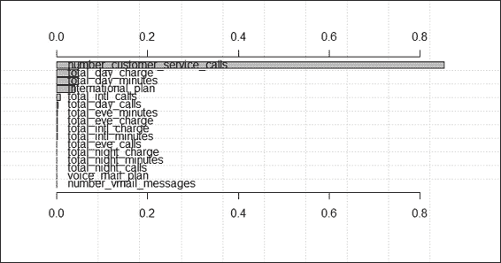

# 第七章 模型评估

在本章中，我们将涵盖以下主题：

+   使用 k 折交叉验证估计模型性能

+   使用 e1071 包进行交叉验证

+   使用`caret`包进行交叉验证

+   使用`caret`包对变量重要性进行排名

+   使用`rminer`包对变量重要性进行排名

+   使用`caret`包寻找高度相关的特征

+   使用`caret`包选择特征

+   测量回归模型的性能

+   使用混淆矩阵测量预测性能

+   使用 ROCR 测量预测性能

+   使用`caret`包比较 ROC 曲线

+   使用`caret`包测量模型之间的性能差异

# 简介

模型评估是为了确保拟合的模型能够准确预测未来或未知主体的响应。如果没有模型评估，我们可能会训练出在训练数据上过度拟合的模型。为了防止过度拟合，我们可以使用如`caret`、`rminer`和`rocr`等包来评估拟合模型的性能。此外，模型评估有助于选择最佳模型，该模型更稳健，并能准确预测未来主体的响应。

在下一章中，我们将讨论如何实现一个简单的 R 脚本或使用一个包（例如`caret`或`rminer`）来评估拟合模型的性能。

# 使用 k 折交叉验证估计模型性能

k 折交叉验证技术是一种常用的技术，用于估计分类器的性能，因为它克服了过度拟合的问题。对于 k 折交叉验证，该方法不使用整个数据集来构建模型，而是将数据分割成训练数据集和测试数据集。因此，使用训练数据集构建的模型可以用来评估模型在测试数据集上的性能。通过执行 n 次 k 折验证，我们可以使用 n 个准确率的平均值来真正评估构建的模型性能。在本菜谱中，我们将说明如何执行 k 折交叉验证。

## 准备工作

在这个菜谱中，我们将继续使用 telecom `churn`数据集作为输入数据源来训练支持向量机。对于那些尚未准备数据集的人，请参阅第五章，*分类（I）-树、懒惰和概率性*，以获取详细信息。

## 如何操作...

执行以下步骤以交叉验证 telecom `churn`数据集：

1.  使用`cut`函数将索引分割成 10 折：

    ```py
    > ind = cut(1:nrow(churnTrain), breaks=10, labels=F)

    ```

1.  接下来，使用`for`循环执行 10 折交叉验证，重复 10 次：

    ```py
    > accuracies = c()
    > for (i in 1:10) {
    +   fit = svm(churn ~., churnTrain[ind != i,])
    +   predictions = predict(fit, churnTrain[ind == i, ! names(churnTrain) %in% c("churn")])
    +   correct_count = sum(predictions == churnTrain[ind == i,c("churn")])
    +   accuracies = append(correct_count / nrow(churnTrain[ind == i,]), accuracies)
    + }

    ```

1.  你可以打印出准确率：

    ```py
    > accuracies
     [1] 0.9341317 0.8948949 0.8978979 0.9459459 0.9219219 0.9281437 0.9219219 0.9249249 0.9189189 0.9251497

    ```

1.  最后，你可以使用`mean`函数生成平均准确率：

    ```py
    > mean(accuracies)
    [1] 0.9213852

    ```

## 它是如何工作的...

在本例中，我们实现了一个简单的脚本，执行 10 折交叉验证。我们首先使用`cut`函数生成 10 个折的索引。然后，我们实现一个`for`循环，执行 10 次 10 折交叉验证。在循环中，我们首先将`svm`应用于`9`个数据折作为训练集。然后，我们使用拟合的模型预测剩余数据（测试数据集）的标签。接下来，我们使用正确预测的标签总和来生成准确率。因此，循环存储了 10 个生成的准确率。最后，我们使用`mean`函数检索准确率的平均值。

## 还有更多...

如果您希望使用其他模型执行 k 折交叉验证，只需替换生成变量 fit 的行，以您偏好的分类器为准。例如，如果您想使用 10 折交叉验证来评估朴素贝叶斯模型，只需将调用函数从`svm`替换为`naiveBayes`：

```py
> for (i in 1:10) {
+   fit = naiveBayes(churn ~., churnTrain[ind != i,])
+   predictions = predict(fit, churnTrain[ind == i, ! names(churnTrain) %in% c("churn")])
+   correct_count = sum(predictions == churnTrain[ind == i,c("churn")])
+   accuracies = append(correct_count / nrow(churnTrain[ind == i,]), accuracies)
+ }

```

# 使用 e1071 包进行交叉验证

除了实现一个`loop`函数来执行 k 折交叉验证外，您还可以在`e1071`包中使用`tuning`函数（例如，`tune.nnet`、`tune.randomForest`、`tune.rpart`、`tune.svm`和`tune.knn`）来获取最小误差值。在本例中，我们将说明如何使用`tune.svm`执行 10 折交叉验证并获得最佳分类模型。

## 准备工作

在本例中，我们继续使用电信`churn`数据集作为输入数据源执行 10 折交叉验证。

## 如何操作...

执行以下步骤以使用交叉验证检索最小估计误差：

1.  在训练数据集`trainset`上应用`tune.svm`，使用 10 折交叉验证作为调整控制。（如果您发现错误消息，例如`could not find function predict.func`，请清除工作区，重新启动 R 会话并重新加载`e1071`库）：

    ```py
    > tuned = tune.svm(churn~., data = trainset, gamma = 10^-2, cost = 10², tunecontrol=tune.control(cross=10))

    ```

1.  接下来，您可以获取模型的摘要信息，调整：

    ```py
    > summary(tuned)

    Error estimation of 'svm' using 10-fold cross validation: 0.08164651

    ```

1.  然后，您可以访问调整后模型的性能细节：

    ```py
    > tuned$performances
     gamma cost      error dispersion
    1  0.01  100 0.08164651 0.02437228

    ```

1.  最后，您可以使用最佳模型生成分类表：

    ```py
    > svmfit = tuned$best.model
    > table(trainset[,c("churn")], predict(svmfit))

     yes   no
     yes  234  108
     no    13 1960

    ```

## 工作原理...

`e1071`包提供了构建和评估模型的各种函数，因此，您无需重新发明轮子来评估拟合模型。在本例中，我们使用`tune.svm`函数使用给定的公式、数据集、gamma、成本和控制函数调整 svm 模型。在`tune.control`选项中，我们将选项配置为`cross=10`，在调整过程中执行 10 折交叉验证。调整过程最终将返回最小估计误差、性能细节以及调整过程中的最佳模型。因此，我们可以获得调整的性能指标，并进一步使用最佳模型生成分类表。

## 参考信息

+   在`e1071`包中，`tune`函数使用网格搜索来调整参数。对于那些对其他调整函数感兴趣的人，请使用帮助函数查看`tune`文档：

    ```py
    > ?e1071::tune

    ```

# 使用 caret 包进行交叉验证

`Caret`（分类和回归训练）包包含许多关于回归和分类问题训练过程的函数。类似于`e1071`包，它也包含一个执行 k 折交叉验证的函数。在本菜谱中，我们将演示如何使用`caret`包执行 k 折交叉验证。

## 准备工作

在本菜谱中，我们将继续使用电信`churn`数据集作为输入数据源来执行 k 折交叉验证。

## 如何操作...

执行以下步骤以使用`caret`包执行 k 折交叉验证：

1.  首先，设置控制参数以进行 10 折交叉验证，重复 3 次：

    ```py
    > control = trainControl(method="repeatedcv", number=10, repeats=3)

    ```

1.  然后，你可以使用`rpart`在电信客户流失数据上训练分类模型：

    ```py
    > model = train(churn~., data=trainset, method="rpart", preProcess="scale", trControl=control)

    ```

1.  最后，你可以检查生成的模型的输出：

    ```py
    > model
    CART 

    2315 samples
     16 predictor
     2 classes: 'yes', 'no' 

    Pre-processing: scaled 
    Resampling: Cross-Validated (10 fold, repeated 3 times) 

    Summary of sample sizes: 2084, 2083, 2082, 2084, 2083, 2084, ... 

    Resampling results across tuning parameters:

     cp      Accuracy  Kappa  Accuracy SD  Kappa SD
     0.0556  0.904     0.531  0.0236       0.155 
     0.0746  0.867     0.269  0.0153       0.153 
     0.0760  0.860     0.212  0.0107       0.141 

    Accuracy was used to select the optimal model using the largest value.
    The final value used for the model was cp = 0.05555556.

    ```

## 工作原理...

在本菜谱中，我们展示了使用`caret`包进行 k 折交叉验证是多么方便。在第一步中，我们设置了训练控制并选择了在三次重复中执行 10 折交叉验证的选项。重复 k 折验证的过程称为重复 k 折验证，用于测试模型的稳定性。如果模型稳定，应该得到相似的训练结果。然后，我们使用`rpart`在训练数据集上应用，并选择缩放数据以及使用之前步骤中配置的选项来训练模型。

训练过程完成后，模型输出三个重采样结果。在这些结果中，`cp=0.05555556`的模型具有最大的准确值（`0.904`），因此被选为分类的最佳模型。

## 参考以下内容

+   你可以在`trainControl`中配置`resampling`函数，其中你可以指定`boot`、`boot632`、`cv`、`repeatedcv`、`LOOCV`、`LGOCV`、`none`、`oob`、`adaptive_cv`、`adaptive_boot`或`adaptive_LGOCV`。要查看如何选择重采样方法的更详细信息，请查看`trainControl`文档：

    ```py
    > ?trainControl

    ```

# 使用 caret 包对变量重要性进行排名

在构建监督学习模型后，我们可以估计特征的重要性。这种估计采用敏感性分析来衡量当输入变化时对给定模型输出的影响。在本菜谱中，我们将向您展示如何使用`caret`包对变量重要性进行排名。

## 准备工作

你需要完成之前的菜谱，并将拟合的`rpart`对象存储在`model`变量中。

## 如何操作...

执行以下步骤以使用`caret`包对变量重要性进行排名：

1.  首先，你可以使用`varImp`函数估计变量重要性：

    ```py
    > importance = varImp(model, scale=FALSE)
    > importance
    rpart variable importance

     Overall
    number_customer_service_calls 116.015
    total_day_minutes             106.988
    total_day_charge              100.648
    international_planyes          86.789
    voice_mail_planyes             25.974
    total_eve_charge               23.097
    total_eve_minutes              23.097
    number_vmail_messages          19.885
    total_intl_minutes              6.347
    total_eve_calls                 0.000
    total_day_calls                 0.000
    total_night_charge              0.000
    total_intl_calls                0.000
    total_intl_charge               0.000
    total_night_minutes             0.000
    total_night_calls               0.000

    ```

1.  然后，您可以使用`plot`函数生成可变重要性图：

    ```py
    > plot(importance)

    ```

    

    图 1：使用 caret 包的可变重要性可视化

## 工作原理...

在本食谱中，我们首先使用`varImp`函数检索可变重要性并获取摘要。整体结果显示了每个属性的敏感性度量。接下来，我们按排名绘制可变重要性，这表明`number_customer_service_calls`属性在敏感性度量中是最重要的变量。

## 更多内容...

在某些分类包中，例如`rpart`，从训练模型生成的对象包含变量重要性。我们可以通过访问输出对象来检查变量重要性：

```py
> library(rpart)
> model.rp = rpart(churn~., data=trainset)
> model.rp$variable.importance
 total_day_minutes              total_day_charge 
 111.645286                    110.881583 
number_customer_service_calls            total_intl_minutes 
 58.486651                     48.283228 
 total_intl_charge              total_eve_charge 
 47.698379                     47.166646 
 total_eve_minutes            international_plan 
 47.166646                     42.194508 
 total_intl_calls         number_vmail_messages 
 36.730344                     19.884863 
 voice_mail_plan             total_night_calls 
 19.884863                      7.195828 
 total_eve_calls            total_night_charge 
 3.553423                      1.754547 
 total_night_minutes               total_day_calls 
 1.754547                      1.494986 

```

# 使用 rminer 包对可变重要性进行排名

除了使用`caret`包生成可变重要性外，您还可以使用`rminer`包生成分类模型的可变重要性。在下面的食谱中，我们将说明如何使用`rminer`获取拟合模型的可变重要性。

## 准备工作

在本食谱中，我们将继续使用电信`churn`数据集作为输入数据源来对可变重要性进行排序。

## 如何操作...

执行以下步骤以使用`rminer`对可变重要性进行排名：

1.  安装并加载包，`rminer`：

    ```py
    > install.packages("rminer")
    > library(rminer)

    ```

1.  使用训练集拟合 svm 模型：

    ```py
    > model=fit(churn~.,trainset,model="svm")

    ```

1.  使用`Importance`函数获取可变重要性：

    ```py
    > VariableImportance=Importance(model,trainset,method="sensv")

    ```

1.  按方差绘制可变重要性图

    ```py
    > L=list(runs=1,sen=t(VariableImportance$imp),sresponses=VariableImportance$sresponses)
    > mgraph(L,graph="IMP",leg=names(trainset),col="gray",Grid=10)

    ```

    

    图 2：使用`rminer`包的可变重要性可视化

## 工作原理...

与`caret`包类似，`rminer`包也可以生成分类模型的可变重要性。在本食谱中，我们首先使用`fit`函数在训练数据集`trainset`上训练 svm 模型。然后，我们使用`Importance`函数使用敏感性度量对可变重要性进行排名。最后，我们使用`mgraph`绘制可变重要性的排名。与使用`caret`包获得的结果相似，`number_customer_service_calls`是在敏感性度量中最重要的变量。

## 参见

+   `rminer`包提供许多分类模型供用户选择。如果您对使用 svm 以外的模型感兴趣，可以使用以下命令查看这些选项：

    ```py
    > ?rminer::fit

    ```

# 使用 caret 包寻找高度相关的特征

在执行回归或分类时，如果移除高度相关的属性，某些模型的表现会更好。`caret`包提供了`findCorrelation`函数，可以用来查找彼此高度相关的属性。在本食谱中，我们将演示如何使用`caret`包查找高度相关的特征。

## 准备工作

在本食谱中，我们将继续使用电信`churn`数据集作为输入数据源来寻找高度相关的特征。

## 如何操作...

执行以下步骤以找到高度相关的属性：

1.  移除未用数值字符编码的特征：

    ```py
    > new_train = trainset[,! names(churnTrain) %in% c("churn", "international_plan", "voice_mail_plan")]

    ```

1.  然后，你可以获得每个属性的关联性：

    ```py
    >cor_mat = cor(new_train)

    ```

1.  接下来，我们使用`findCorrelation`搜索截止值为 0.75 的高度相关属性：

    ```py
    > highlyCorrelated = findCorrelation(cor_mat, cutoff=0.75)

    ```

1.  然后，我们获得高度相关属性的名称：

    ```py
    > names(new_train)[highlyCorrelated]
    [1] "total_intl_minutes"  "total_day_charge"    "total_eve_minutes"   "total_night_minutes"

    ```

## 它是如何工作的...

在本菜谱中，我们使用`caret`包搜索高度相关的属性。为了检索每个属性的关联性，首先应移除非数值属性。然后，我们执行关联性分析以获得关联矩阵。接下来，我们使用`findCorrelation`找到高度相关的属性，截止值为 0.75。我们最终获得高度相关（相关系数超过 0.75）的属性名称，分别是`total_intl_minutes`、`total_day_charge`、`total_eve_minutes`和`total_night_minutes`。你可以考虑移除一些高度相关的属性，保留一个或两个属性以获得更好的准确性。

## 相关内容

+   除了`caret`包外，你还可以使用`subselect`包中的`leaps`、`genetic`和`anneal`函数达到相同的目的

# 使用 caret 包进行特征选择

特征选择方法搜索具有最小预测误差的特征子集。我们可以应用特征选择来识别构建准确模型所需的属性。`caret`包提供了一个递归特征消除函数`rfe`，可以帮助自动选择所需的特征。在下面的菜谱中，我们将演示如何使用`caret`包进行特征选择。

## 准备工作

在本菜谱中，我们将继续使用电信`churn`数据集作为特征选择的输入数据源。

## 如何操作...

执行以下步骤以选择特征：

1.  将训练数据集`trainset`中名为`international_plan`的特征转换为`intl_yes`和`intl_no`：

    ```py
    > intl_plan = model.matrix(~ trainset.international_plan - 1, data=data.frame(trainset$international_plan))
    > colnames(intl_plan) = c("trainset.international_planno"="intl_no", "trainset.international_planyes"= "intl_yes")

    ```

1.  将训练数据集`trainset`中名为`voice_mail_plan`的特征转换为`voice_yes`和`voice_no`：

    ```py
    > voice_plan = model.matrix(~ trainset.voice_mail_plan - 1, data=data.frame(trainset$voice_mail_plan))
    > colnames(voice_plan) = c("trainset.voice_mail_planno" ="voice_no", "trainset.voice_mail_planyes"="voidce_yes")

    ```

1.  移除`international_plan`和`voice_mail_plan`属性，并将训练数据集`trainset`与数据框`intl_plan`和`voice_plan`合并：

    ```py
    > trainset$international_plan = NULL
    > trainset$voice_mail_plan = NULL
    > trainset = cbind(intl_plan,voice_plan, trainset)

    ```

1.  将测试数据集`testset`中名为`international_plan`的特征转换为`intl_yes`和`intl_no`：

    ```py
    > intl_plan = model.matrix(~ testset.international_plan - 1, data=data.frame(testset$international_plan))
    > colnames(intl_plan) = c("testset.international_planno"="intl_no", "testset.international_planyes"= "intl_yes")

    ```

1.  将训练数据集`trainset`中名为`voice_mail_plan`的特征转换为`voice_yes`和`voice_no`：

    ```py
    > voice_plan = model.matrix(~ testset.voice_mail_plan - 1, data=data.frame(testset$voice_mail_plan))
    > colnames(voice_plan) = c("testset.voice_mail_planno" ="voice_no", "testset.voice_mail_planyes"="voidce_yes")

    ```

1.  移除`international_plan`和`voice_mail_plan`属性，并将测试数据集`testset`与数据框`intl_plan`和`voice_plan`合并：

    ```py
    > testset$international_plan = NULL
    > testset$voice_mail_plan = NULL
    > testset = cbind(intl_plan,voice_plan, testset)

    ```

1.  然后，我们使用线性判别分析创建一个特征选择算法：

    ```py
    > ldaControl = rfeControl(functions = ldaFuncs, method = "cv")

    ```

1.  接下来，我们在训练数据集`trainset`上使用从 1 到 18 的子集进行向后特征选择：

    ```py
    > ldaProfile = rfe(trainset[, !names(trainset) %in% c("churn")], trainset[,c("churn")],sizes = c(1:18), rfeControl = ldaControl)
    > ldaProfile

    Recursive feature selection

    Outer resampling method: Cross-Validated (10 fold) 

    Resampling performance over subset size:

     Variables Accuracy  Kappa AccuracySD KappaSD Selected
     1   0.8523 0.0000   0.001325 0.00000 
     2   0.8523 0.0000   0.001325 0.00000 
     3   0.8423 0.1877   0.015468 0.09787 
     4   0.8462 0.2285   0.016593 0.09610 
     5   0.8466 0.2384   0.020710 0.09970 
     6   0.8466 0.2364   0.019612 0.09387 
     7   0.8458 0.2315   0.017551 0.08670 
     8   0.8458 0.2284   0.016608 0.09536 
     9   0.8475 0.2430   0.016882 0.10147 
     10   0.8514 0.2577   0.014281 0.08076 
     11   0.8518 0.2587   0.014124 0.08075 
     12   0.8544 0.2702   0.015078 0.09208        *
     13   0.8544 0.2721   0.015352 0.09421 
     14   0.8531 0.2663   0.018428 0.11022 
     15   0.8527 0.2652   0.017958 0.10850 
     16   0.8531 0.2684   0.017897 0.10884 
     17   0.8531 0.2684   0.017897 0.10884 
     18   0.8531 0.2684   0.017897 0.10884 

    The top 5 variables (out of 12):
     total_day_charge, total_day_minutes, intl_no, number_customer_service_calls, total_eve_charge

    ```

1.  接下来，我们可以绘制选择结果：

    ```py
    > plot(ldaProfile, type = c("o", "g"))

    ```

    

    图 3：特征选择结果

1.  然后，我们可以检查变量的最佳子集：

    ```py
    > ldaProfile$optVariables
     [1] "total_day_charge" 
     [2] "total_day_minutes" 
     [3] "intl_no" 
     [4] "number_customer_service_calls"
     [5] "total_eve_charge" 
     [6] "total_eve_minutes" 
     [7] "voidce_yes" 
     [8] "total_intl_calls" 
     [9] "number_vmail_messages" 
    [10] "total_intl_charge" 
    [11] "total_intl_minutes" 
    [12] "total_night_minutes" 

    ```

1.  现在，我们可以检查拟合的模型：

    ```py
    > ldaProfile$fit
    Call:
    lda(x, y)

    Prior probabilities of groups:
     yes        no 
    0.1477322 0.8522678 

    Group means:
     total_day_charge total_day_minutes   intl_no
    yes         35.00143          205.8877 0.7046784
    no          29.62402          174.2555 0.9351242
     number_customer_service_calls total_eve_charge
    yes                      2.204678         18.16702
    no                       1.441460         16.96789
     total_eve_minutes voidce_yes total_intl_calls
    yes          213.7269  0.1666667         4.134503
    no           199.6197  0.2954891         4.514445
     number_vmail_messages total_intl_charge
    yes              5.099415          2.899386
    no               8.674607          2.741343
     total_intl_minutes total_night_minutes
    yes           10.73684            205.4640
    no            10.15119            201.4184

    Coefficients of linear discriminants:
     LD1
    total_day_charge               0.715025524
    total_day_minutes             -0.130486470
    intl_no                        2.259889324
    number_customer_service_calls -0.421997335
    total_eve_charge              -2.390372793
    total_eve_minutes              0.198406977
    voidce_yes                     0.660927935
    total_intl_calls               0.066240268
    number_vmail_messages         -0.003529233
    total_intl_charge              2.315069869
    total_intl_minutes            -0.693504606
    total_night_minutes           -0.002127471

    ```

1.  最后，我们可以计算跨样本的性能：

    ```py
    > postResample(predict(ldaProfile, testset[, !names(testset) %in% c("churn")]), testset[,c("churn")])
    Accuracy     Kappa
    0.8605108 0.2672027

    ```

## 工作原理...

在这个菜谱中，我们使用`caret`包进行特征选择。由于数据集中存在因子编码的属性，我们首先使用一个名为`model.matrix`的函数将因子编码的属性转换为多个二元属性。因此，我们将`international_plan`属性转换为`intl_yes`和`intl_no`。此外，我们将`voice_mail_plan`属性转换为`voice_yes`和`voice_no`。

接下来，我们使用交叉验证方法`cv`和线性判别函数`ldaFuncs`设置训练的控制参数。然后，我们使用`control`函数`ldaFuncs`进行特征选择，使用递归特征消除`rfe`。`rfe`函数生成特征选择摘要，其中包含对子集大小和顶级变量的重采样性能。

然后，我们可以使用获得模型信息来绘制变量数量与准确率的关系图。从图 3 中可以看出，使用 12 个特征可以获得最佳准确率。除此之外，我们还可以检索出拟合模型中最佳变量子集（总共有 12 个变量）。最后，我们可以计算跨样本的性能，得到准确率为 0.86 和 kappa 值为 0.27。

## 参见

+   为了指定用于控制特征选择的算法，可以在`rfeControl`中更改指定的控制函数。以下是一些你可以使用的选项：

    ```py
    caretFuncs      SVM (caret)
    lmFuncs     lm (base)
    rfFuncs         RF(randomForest)
    treebagFuncs     DT (ipred)
    ldaFuncs       lda(base)
    nbFuncs       NB(klaR)
    gamFuncs      gam(gam)

    ```

# 衡量回归模型的表现

为了衡量回归模型的表现，我们可以计算预测输出与实际输出之间的距离，作为模型性能的量化指标。在这里，我们通常使用**均方根误差**（**RMSE**）、**相对平方误差**（**RSE**）和 R-Square 作为常见的测量指标。在下面的菜谱中，我们将展示如何从一个构建的回归模型中计算这些测量值。

## 准备工作

在这个菜谱中，我们将使用包含四个回归数据集的`Quartet`数据集作为我们的输入数据源。

## 如何做...

执行以下步骤来衡量回归模型的表现：

1.  从`car`包中加载`Quartet`数据集：

    ```py
    > library(car)
    > data(Quartet)

    ```

1.  使用`lm`函数将属性`y3`与 x 绘制出来：

    ```py
    > plot(Quartet$x, Quartet$y3)
    > lmfit = lm(Quartet$y3~Quartet$x)
    > abline(lmfit, col="red")

    ```

    

    图 4：线性回归图

1.  你可以使用`predict`函数检索预测值：

    ```py
    > predicted= predict(lmfit, newdata=Quartet[c("x")])

    ```

1.  现在，你可以计算均方根误差：

    ```py
    > actual = Quartet$y3
    > rmse = (mean((predicted - actual)²))⁰.5
    > rmse
    [1] 1.118286

    ```

1.  你可以计算相对平方误差：

    ```py
    > mu = mean(actual)
    > rse = mean((predicted - actual)²) / mean((mu - actual)²) 
    > rse
    [1] 0.333676

    ```

1.  此外，你还可以使用 R-Square 作为测量指标：

    ```py
    > rsquare = 1 - rse
    > rsquare
    [1] 0.666324

    ```

1.  然后，你可以使用 MASS 包中的`rlm`函数将属性 y3 与 x 绘制出来：

    ```py
    > library(MASS)
    > plot(Quartet$x, Quartet$y3)
    > rlmfit = rlm(Quartet$y3~Quartet$x)
    > abline(rlmfit, col="red")

    ```

    

    图 5：Quartet 数据集上的稳健线性回归图

1.  然后，你可以使用`predict`函数检索预测值：

    ```py
    > predicted = predict(rlmfit, newdata=Quartet[c("x")])

    ```

1.  接下来，你可以使用预测值和实际值之间的距离来计算根均方误差：

    ```py
    > actual = Quartet$y3
    > rmse = (mean((predicted - actual)²))⁰.5
    > rmse
    [1] 1.279045

    ```

1.  计算预测标签和实际标签之间的相对平方误差：

    ```py
    > mu = mean(actual)
    > rse =mean((predicted - actual)²) / mean((mu - actual)²) 
    > rse
    [1] 0.4365067

    ```

1.  现在，你可以计算 R-Square 值：

    ```py
    > rsquare = 1 - rse
    > rsquare
    [1] 0.5634933

    ```

## 工作原理...

回归模型性能的测量使用预测值和实际值之间的距离。我们通常使用这三个度量，即均方根误差、相对平方误差和 R-Square，作为回归模型性能的量化指标。在这个菜谱中，我们首先从 `car` 包中加载 `Quartet` 数据。然后，我们使用 `lm` 函数拟合线性模型，并在 x 变量对 `y3` 变量的散点图上添加回归线。接下来，我们使用预测函数计算预测值，并开始计算构建模型的 **均方根误差**（**RMSE**）、**相对平方误差**（**RSE**）和 R-Square。

由于这个数据集在 `x=13` 处有一个异常值，我们希望量化异常值对性能测量的影响。为了实现这一点，我们首先使用 `MASS` 包中的 `rlm` 函数训练一个回归模型。类似于前面的步骤，然后我们生成根平方均方误差、相对误差和 R-Square 的性能测量。从输出测量来看，显然 `lm` 模型的均方误差和相对平方误差小于由 `rlm` 构建的模型，R-Square 的得分显示使用 `lm` 构建的模型具有更大的预测能力。然而，对于实际场景，我们应该移除 `x=13` 处的异常值。这个比较表明异常值可能偏向于性能测量，并可能导致我们选择错误的模型。

## 更多内容...

如果你想要对一个线性回归模型进行交叉验证，你可以在 `e1071` 包中使用 `tune` 函数：

```py
> tune(lm, y3~x, data = Quartet)
Error estimation of 'lm' using 10-fold cross validation: 2.33754

```

除了 `e1071` 包之外，你还可以使用 `caret` 包中的 `train` 函数来进行交叉验证。此外，你还可以使用 `DAAG` 包中的 `cv.lm` 来达到相同的目的。

# 使用混淆矩阵衡量预测性能

为了衡量分类模型的性能，我们首先可以根据我们的预测标签和实际标签生成一个分类表。然后，我们可以使用混淆矩阵来获得性能度量，如精确度、召回率、特异性和准确率。在这个菜谱中，我们将演示如何使用 `caret` 包检索混淆矩阵。

## 准备工作

在这个菜谱中，我们将继续使用电信 `churn` 数据集作为我们的示例数据集。

## 如何做...

执行以下步骤以生成分类测量：

1.  使用训练数据集训练 svm 模型：

    ```py
    > svm.model= train(churn ~ .,
    +                   data = trainset,
    +                   method = "svmRadial")

    ```

1.  然后，你可以使用拟合的模型 `svm.model` 来预测标签：

    ```py
    > svm.pred = predict(svm.model, testset[,! names(testset) %in% c("churn")])

    ```

1.  接下来，你可以生成一个分类表：

    ```py
    > table(svm.pred, testset[,c("churn")])

    svm.pred yes  no
     yes  73  16
     no   68 861

    ```

1.  最后，你可以使用预测结果和测试数据集中的实际标签生成一个混淆矩阵：

    ```py
    > confusionMatrix(svm.pred, testset[,c("churn")])
    Confusion Matrix and Statistics

     Reference
    Prediction yes  no
     yes  73  16
     no   68 861

     Accuracy : 0.9175 
     95% CI : (0.8989, 0.9337)
     No Information Rate : 0.8615 
     P-Value [Acc > NIR] : 2.273e-08 

     Kappa : 0.5909 
     Mcnemar's Test P-Value : 2.628e-08 

     Sensitivity : 0.51773 
     Specificity : 0.98176 
     Pos Pred Value : 0.82022 
     Neg Pred Value : 0.92680 
     Prevalence : 0.13851 
     Detection Rate : 0.07171 
     Detection Prevalence : 0.08743 
     Balanced Accuracy : 0.74974 

     'Positive' Class : yes 

    ```

## 工作原理...

在这个菜谱中，我们展示了如何获取混淆矩阵来衡量分类模型的性能。首先，我们使用`caret`包中的`train`函数来训练 svm 模型。接下来，我们使用`predict`函数使用测试数据集提取 svm 模型的预测标签。然后，我们执行`table`函数以根据预测和实际标签获取分类表。最后，我们使用`caret`包中的`confusionMatrix`函数生成一个混淆矩阵来衡量分类模型的性能。

## 相关内容

+   如果你感兴趣，可以在`train`函数中使用的方法，可以参考这个网站：[`topepo.github.io/caret/modelList.html`](http://topepo.github.io/caret/modelList.html)

# 使用 ROCR 测量预测性能

**接收者操作特征**（ROC）曲线是说明二元分类器系统性能的图表，它将不同截断点的真正例率和假正例率进行绘图。我们最常用这个图表来计算**曲线下面积**（AUC），以衡量分类模型的性能。在这个菜谱中，我们将展示如何绘制 ROC 曲线并计算 AUC 来衡量分类模型的性能。

## 准备工作

在这个菜谱中，我们将继续使用电信`churn`数据集作为我们的示例数据集。

## 如何操作...

执行以下步骤以生成具有不同成本的两种不同的分类示例：

1.  首先，你应该安装并加载`ROCR`包：

    ```py
    > install.packages("ROCR")
    > library(ROCR)

    ```

1.  使用训练数据集并设置概率等于`TRUE`来训练 svm 模型：

    ```py
    > svmfit=svm(churn~ ., data=trainset, prob=TRUE)

    ```

1.  在测试数据集上基于训练模型进行预测，并将概率设置为`TRUE`：

    ```py
    >pred=predict(svmfit,testset[, !names(testset) %in% c("churn")], probability=TRUE)

    ```

1.  使用`yes`标签获取概率：

    ```py
    > pred.prob = attr(pred, "probabilities") 
    > pred.to.roc = pred.prob[, 2] 

    ```

1.  使用`prediction`函数生成预测结果：

    ```py
    > pred.rocr = prediction(pred.to.roc, testset$churn)

    ```

1.  使用`performance`函数获取性能度量：

    ```py
    > perf.rocr = performance(pred.rocr, measure = "auc", x.measure = "cutoff") 
    > perf.tpr.rocr = performance(pred.rocr, "tpr","fpr") 

    ```

1.  使用`plot`函数可视化 ROC 曲线：

    ```py
    > plot(perf.tpr.rocr, colorize=T,main=paste("AUC:",(perf.rocr@y.values)))

    ```

    

    图 6：svm 分类器性能的 ROC 曲线

## 工作原理...

在本例中，我们展示了如何生成 ROC 曲线来展示二元分类器的性能。首先，我们应该安装并加载库，`ROCR`。然后，我们使用来自`e1071`包的 svm 来训练一个分类模型，并使用该模型对测试数据集进行预测。接下来，我们使用预测函数（来自`ROCR`包）生成预测结果。然后，我们将性能函数调整为获得真正例率对假正例率的性能测量。最后，我们使用`plot`函数可视化 ROC 图，并在标题上添加 AUC 值。在这个例子中，AUC 值是 0.92，这表明 svm 分类器在电信用户流失数据集的分类中表现良好。

## 参考内容

+   对于对 ROC 的概念和术语感兴趣的人，您可以参考[`en.wikipedia.org/wiki/Receiver_operating_characteristic`](http://en.wikipedia.org/wiki/Receiver_operating_characteristic)

# 使用 caret 包比较 ROC 曲线

在前面的章节中，我们介绍了许多分类方法；每种方法都有其自身的优缺点。然而，当涉及到如何选择最佳拟合模型的问题时，您需要比较来自不同预测模型生成的所有性能指标。为了使比较变得容易，`caret`包允许我们生成并比较模型的性能。在本例中，我们将使用`caret`包提供的函数来比较在同一数据集上训练的不同算法模型。

## 准备工作

在这里，我们将继续使用 telecom 数据集作为我们的输入数据源。

## 如何做...

执行以下步骤以生成每个拟合模型的 ROC 曲线：

1.  安装并加载库，`pROC`：

    ```py
    > install.packages("pROC")
    > library("pROC")

    ```

1.  设置训练控制，使用 3 次重复的 10 折交叉验证：

    ```py
    > control = trainControl(method = "repeatedcv",
    +                            number = 10,
    +                            repeats = 3,
    +                            classProbs = TRUE,
    +                            summaryFunction = twoClassSummary)

    ```

1.  然后，您可以使用`glm`在训练数据集上训练一个分类器：

    ```py
    > glm.model= train(churn ~ .,
    +                     data = trainset,
    +                     method = "glm",
    +                     metric = "ROC",
    +                     trControl = control)

    ```

1.  此外，您还可以使用`svm`在训练数据集上训练一个分类器：

    ```py
    > svm.model= train(churn ~ .,
    +                   data = trainset,
    +                   method = "svmRadial",
    +                   metric = "ROC",
    +                   trControl = control)

    ```

1.  为了查看`rpart`在训练数据上的表现，我们使用`rpart`函数：

    ```py
    > rpart.model= train(churn ~ .,
    +                   data = trainset,
    +                   method = "rpart",
    +                   metric = "ROC",
    +                   trControl = control)

    ```

1.  您可以根据不同的训练模型分别进行预测：

    ```py
    > glm.probs = predict(glm.model, testset[,! names(testset) %in% c("churn")], type = "prob")
    > svm.probs = predict(svm.model, testset[,! names(testset) %in% c("churn")], type = "prob")
    > rpart.probs = predict(rpart.model, testset[,! names(testset) %in% c("churn")], type = "prob")

    ```

1.  您可以为每个模型生成 ROC 曲线，并在同一图上绘制曲线：

    ```py
    > glm.ROC = roc(response = testset[,c("churn")],
    +                predictor =glm.probs$yes,
    +                levels = levels(testset[,c("churn")]))
    > plot(glm.ROC, type="S", col="red") 

    Call:
    roc.default(response = testset[, c("churn")], predictor = glm.probs$yes,     levels = levels(testset[, c("churn")]))

    Data: glm.probs$yes in 141 controls (testset[, c("churn")] yes) > 877 cases (testset[, c("churn")] no).
    Area under the curve: 0.82

    > svm.ROC = roc(response = testset[,c("churn")],
    +                predictor =svm.probs$yes,
    +                levels = levels(testset[,c("churn")]))
    > plot(svm.ROC, add=TRUE, col="green") 

    Call:
    roc.default(response = testset[, c("churn")], predictor = svm.probs$yes,     levels = levels(testset[, c("churn")]))

    Data: svm.probs$yes in 141 controls (testset[, c("churn")] yes) > 877 cases (testset[, c("churn")] no).
    Area under the curve: 0.9233

    > rpart.ROC = roc(response = testset[,c("churn")],
    +                predictor =rpart.probs$yes,
    +                levels = levels(testset[,c("churn")]))
    > plot(rpart.ROC, add=TRUE, col="blue")

    Call:
    roc.default(response = testset[, c("churn")], predictor = rpart.probs$yes,     levels = levels(testset[, c("churn")]))

    Data: rpart.probs$yes in 141 controls (testset[, c("churn")] yes) > 877 cases (testset[, c("churn")] no).
    Area under the curve: 0.7581

    ```

    

    图 7：三个分类器性能的 ROC 曲线

## 它是如何工作的...

在这里，我们通过展示如何在一张图上绘制它们的 ROC 曲线来说明我们如何比较拟合模型。首先，我们通过在`twoClassSummary`中进行性能评估，使用 10 折交叉验证和 3 次重复来设置训练过程的控制。在设置好训练过程的控制后，我们接着在训练数据集上应用`glm`、`svm`和`rpart`算法来拟合分类模型。接下来，我们可以基于每个生成的模型进行预测并分别绘制 ROC 曲线。在生成的图中，我们发现由 svm 训练的模型具有最大的曲线下面积，为 0.9233（用绿色绘制），`glm`模型的 AUC 为 0.82，`rpart`模型的 AUC 为 0.7581。从*图 7*中可以看出，`svm`在此训练数据集上（无需调整）的所有拟合模型中表现最佳。

## 参见

+   我们使用另一个 ROC 可视化包`pROC`，它可以用来显示和分析 ROC 曲线。如果您想了解更多关于这个包的信息，请使用`help`函数：

    ```py
    > help(package="pROC")

    ```

# 使用 caret 包测量模型之间的性能差异

在之前的步骤中，我们介绍了如何为每个生成的模型生成 ROC 曲线，并将曲线绘制在同一张图上。除了使用 ROC 曲线外，还可以使用重采样方法来生成每个拟合模型在 ROC、敏感性和特异性指标中的统计数据。因此，我们可以使用这些统计数据来比较每个模型之间的性能差异。在接下来的步骤中，我们将介绍如何使用`caret`包来测量拟合模型之间的性能差异。

## 准备工作

需要完成之前的步骤，将`glm`拟合模型、`svm`拟合模型和`rpart`拟合模型分别存储到`glm.model`、`svm.model`和`rpart.model`中。

## 如何做...

执行以下步骤来测量每个拟合模型之间的性能差异：

1.  重采样三个生成的模型：

    ```py
    > cv.values = resamples(list(glm = glm.model, svm=svm.model, rpart = rpart.model))

    ```

1.  然后，您可以获得重采样结果的摘要：

    ```py
    > summary(cv.values)

    Call:
    summary.resamples(object = cv.values)

    Models: glm, svm, rpart 
    Number of resamples: 30 

    ROC 
     Min. 1st Qu. Median   Mean 3rd Qu.   Max. NA's
    glm   0.7206  0.7847 0.8126 0.8116  0.8371 0.8877    0
    svm   0.8337  0.8673 0.8946 0.8929  0.9194 0.9458    0
    rpart 0.2802  0.7159 0.7413 0.6769  0.8105 0.8821    0

    Sens 
     Min. 1st Qu. Median   Mean 3rd Qu.   Max. NA's
    glm   0.08824  0.2000 0.2286 0.2194  0.2517 0.3529    0
    svm   0.44120  0.5368 0.5714 0.5866  0.6424 0.7143    0
    rpart 0.20590  0.3742 0.4706 0.4745  0.5929 0.6471    0

    Spec 
     Min. 1st Qu. Median   Mean 3rd Qu.   Max. NA's
    glm   0.9442  0.9608 0.9746 0.9701  0.9797 0.9949    0
    svm   0.9442  0.9646 0.9746 0.9740  0.9835 0.9949    0
    rpart 0.9492  0.9709 0.9797 0.9780  0.9848 0.9949    0

    ```

1.  使用`dotplot`在 ROC 指标中绘制重采样结果：

    ```py
    > dotplot(cv.values, metric = "ROC")

    ```

    

    图 8：ROC 指标中重采样结果的点图

1.  此外，您还可以使用箱线图来绘制重采样结果：

    ```py
    > bwplot(cv.values, layout = c(3, 1))

    ```

    

    图 9：重采样结果的箱线图

## 它是如何工作的...

在这个菜谱中，我们展示了如何使用重采样方法来衡量三个拟合模型之间的性能差异。首先，我们使用 `resample` 函数生成每个拟合模型（`svm.model`、`glm.model` 和 `rpart.model`）的统计数据。然后，我们可以使用 `summary` 函数获取这三个模型在 ROC、敏感性和特异性指标中的统计数据。接下来，我们可以在重采样结果上应用 `dotplot` 来查看 ROC 在不同模型之间的变化情况。最后，我们使用箱线图在重采样结果上展示不同模型在 ROC、敏感性和特异性指标上的箱线图。

## 参见

+   除了使用 `dotplot` 和 `bwplot` 来衡量性能差异外，还可以使用 `densityplot`、`splom` 和 `xyplot` 来可视化每个拟合模型在 ROC、敏感性和特异性指标中的性能差异。
