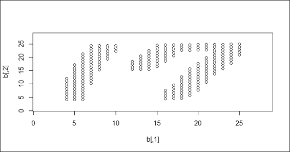

# 第九章。聚类

在本章中，我们将涵盖以下主题：

+   使用层次聚类聚类数据

+   将树木切割成簇

+   使用 k-means 方法聚类数据

+   绘制双变量簇图

+   比较聚类方法

+   从聚类中提取轮廓信息

+   获取 k-means 的最佳簇

+   使用基于密度的方法聚类数据

+   使用基于模型的方法聚类数据

+   可视化差异矩阵

+   外部验证簇

# 简介

聚类是一种用于将相似对象（在距离上接近）分组到同一组（簇）中的技术。与前面章节中涵盖的监督学习方法（例如，分类和回归）不同，聚类分析不使用任何标签信息，而是简单地使用数据特征之间的相似性将它们分组到簇中。

聚类可以广泛应用于商业分析。例如，营销部门可以使用聚类根据个人属性对客户进行细分。因此，可以设计针对不同类型客户的差异化营销活动。

最常见的四种聚类方法为层次聚类、k-means 聚类、基于模型聚类和基于密度的聚类：

+   **层次聚类**：它创建簇的层次结构，并以树状图的形式展示。这种方法在开始时不需要指定簇的数量。

+   **k-means 聚类**：也称为平面聚类。与层次聚类不同，它不创建簇的层次结构，并且需要一个输入的簇数量。然而，它的性能比层次聚类快。

+   **基于模型聚类**：层次聚类和 k-means 聚类都使用启发式方法构建簇，并且不依赖于正式模型。基于模型聚类假设数据模型，并应用 EM 算法来找到最可能的模型组件和簇的数量。

+   **基于密度的聚类**：它根据密度测量构建簇。这种方法中的簇比数据集的其余部分具有更高的密度。

在下面的菜谱中，我们将讨论如何使用这四种聚类技术来聚类数据。我们讨论了如何使用簇内平方和、平均轮廓宽度和外部真实情况来内部验证簇。

# 使用层次聚类聚类数据

层次聚类采用聚合或划分方法来构建簇的层次结构。无论采用哪种方法，两者首先都使用距离相似度度量来合并或分割簇。递归过程持续进行，直到只剩下一个簇或无法再分割簇。最终，我们可以使用树状图来表示簇的层次结构。在这个菜谱中，我们将演示如何使用层次聚类对客户进行聚类。

## 准备工作

在这个菜谱中，我们将对客户数据进行层次聚类，这涉及到将客户分割成不同的组。您可以从这个 GitHub 页面下载数据：[`github.com/ywchiu/ml_R_cookbook/tree/master/CH9`](https://github.com/ywchiu/ml_R_cookbook/tree/master/CH9)。

## 如何做...

执行以下步骤将客户数据聚类到簇的层次结构中：

1.  首先，您需要从`customer.csv`加载数据并将其保存到`customer`中：

    ```py
    > customer= read.csv('customer.csv', header=TRUE)
    > head(customer)
     ID Visit.Time Average.Expense Sex Age
    1  1          3             5.7   0  10
    2  2          5            14.5   0  27
    3  3         16            33.5   0  32
    4  4          5            15.9   0  30
    5  5         16            24.9   0  23
    6  6          3            12.0   0  15

    ```

1.  然后，您可以检查数据集的结构：

    ```py
    > str(customer)
    'data.frame':  60 obs. of  5 variables:
     $ ID             : int  1 2 3 4 5 6 7 8 9 10 ...
     $ Visit.Time     : int  3 5 16 5 16 3 12 14 6 3 ...
     $ Average.Expense: num  5.7 14.5 33.5 15.9 24.9 12 28.5 18.8 23.8 5.3 ...
     $ Sex            : int  0 0 0 0 0 0 0 0 0 0 ...
     $ Age            : int  10 27 32 30 23 15 33 27 16 11 ...

    ```

1.  接下来，您应该将客户数据归一化到相同的尺度：

    ```py
    > customer = scale(customer[,-1])

    ```

1.  您可以使用聚合层次聚类对客户数据进行聚类：

    ```py
    > hc = hclust(dist(customer, method="euclidean"), method="ward.D2")
    > hc

    Call:
    hclust(d = dist(customer, method = "euclidean"), method = "ward.D2")

    Cluster method   : ward.D2 
    Distance         : euclidean 
    Number of objects: 60

    ```

1.  最后，您可以使用`plot`函数绘制树状图：

    ```py
    > plot(hc, hang = -0.01, cex = 0.7)

    ```

    

    使用"ward.D2"的层次聚类树状图

1.  此外，您可以使用单方法进行层次聚类，并查看生成的树状图与之前的区别：

    ```py
    > hc2 = hclust(dist(customer), method="single")
    > plot(hc2, hang = -0.01, cex = 0.7)

    ```

    

    使用"single"的层次聚类树状图

## 如何工作...

层次聚类是一种聚类技术，它试图通过迭代构建簇的层次结构。通常，有两种方法来构建层次簇：

+   **聚合层次聚类**：这是一种自下而上的方法。每个观测值最初都在自己的簇中。然后我们可以计算每个簇之间的相似度（或距离），并在每次迭代中将两个最相似的簇合并，直到只剩下一个簇。

+   **划分层次聚类**：这是一种自上而下的方法。所有观测值最初都在一个簇中，然后我们递归地将簇分割成两个最不相似的簇，直到每个观测值对应一个簇：

    层次聚类的示意图

在执行层次聚类之前，我们需要确定两个簇之间的相似度。在这里，我们列出了一些常用的相似度测量距离函数：

+   **单连接**：这指的是每个簇中两点之间的最短距离：

+   **完全连接**：这指的是每个簇中两点之间的最长距离：

+   **平均链接**：这指的是每个簇中两点之间的平均距离（其中是簇的大小，而是簇的大小）：

+   **沃德方法**：这指的是每个点到合并簇均值的平方距离之和（其中是的均值向量）：

在本菜谱中，我们对客户数据进行层次聚类。首先，我们从`customer.csv`加载数据，然后将其加载到客户数据框中。在数据中，我们找到五个客户账户信息的变量，它们是 ID、访问次数、平均消费、性别和年龄。由于每个变量的尺度不同，我们使用尺度函数来归一化尺度。

在对所有属性的尺度进行归一化后，我们使用`hclust`函数执行层次聚类。我们使用欧几里得距离作为距离度量，并使用沃德的最小方差方法进行聚合聚类。

最后，我们使用`plot`函数绘制层次簇的树状图。我们指定`hang`以在树状图的底部显示标签，并使用`cex`将标签缩小到正常大小的 70%。为了比较使用`ward.D2`和`single`方法生成的簇层次结构，我们在前面的图中使用`single`绘制另一个树状图（步骤 6）。

## 还有更多...

在执行层次聚类时，您可以选择不同的距离度量和方法。有关更多详细信息，您可以参考`dist`和`hclust`的文档：

```py
> ? dist
> ? hclust

```

在本菜谱中，我们使用`hclust`执行聚合层次聚类；如果您想执行分裂层次聚类，可以使用`diana`函数：

1.  首先，您可以使用`diana`执行分裂层次聚类：

    ```py
    > dv = diana(customer, metric = "euclidean")

    ```

1.  然后，您可以使用`summary`获取摘要信息：

    ```py
    > summary(dv)

    ```

1.  最后，您可以使用`plot`函数绘制树状图和横幅：

    ```py
    > plot(dv)

    ```

如果您想绘制水平树状图，可以使用`dendextend`包。使用以下步骤生成水平树状图：

1.  首先，安装并加载`dendextend`和`magrittr`包（如果您的 R 版本是 3.1 及以上，您不需要安装和加载`magrittr`包）：

    ```py
    > install.packages("dendextend")
    > library(dendextend)
    > install.packages("margrittr")
    > library(magrittr)

    ```

1.  设置树状图：

    ```py
    > dend = customer %>% dist %>% hclust %>% as.dendrogram

    ```

1.  最后，绘制水平树状图：

    ```py
    dend %>% plot(horiz=TRUE, main = "Horizontal Dendrogram")

    ```

    

    水平树状图

# 将树切割成簇

在树状图中，我们可以看到簇的层次结构，但我们还没有将数据分组到不同的簇中。然而，我们可以确定树状图中有多少簇，并在某个树高切割树状图以将数据分离到不同的组中。在这个菜谱中，我们展示了如何使用`cutree`函数将数据分离成给定的簇数。

## 准备工作

为了执行`cutree`函数，你需要完成之前的步骤，通过生成 hclust 对象`hc`。

## 如何做...

执行以下步骤将簇的层次结构切割成给定的簇数：

1.  首先，将数据分类为四个组：

    ```py
    > fit = cutree(hc, k = 4)

    ```

1.  然后，你可以检查数据的簇标签：

    ```py
    > fit
     [1] 1 1 2 1 2 1 2 2 1 1 1 2 2 1 1 1 2 1 2 3 4 3 4 3 3 4 4 3 4
    [30] 4 4 3 3 3 4 4 3 4 4 4 4 4 4 4 3 3 4 4 4 3 4 3 3 4 4 4 3 4
    [59] 4 3

    ```

1.  计算每个簇内的数据数量：

    ```py
    > table(fit)
    fit
     1  2  3  4 
    11  8 16 25 

    ```

1.  最后，你可以使用红色矩形边框可视化数据的聚类情况：

    ```py
    > plot(hc)
    > rect.hclust(hc, k = 4 , border="red")

    ```

    

    使用红色矩形边框来区分树状图中不同的簇

## 它是如何工作的...

我们可以从前一个图中的树状图中确定簇的数量。在这个菜谱中，我们确定树中应该有四个簇。因此，我们在`cutree`函数中将簇数指定为`4`。除了使用簇数来切割树，你还可以指定`height`作为切割树的参数。

接下来，我们可以输出数据的簇标签，并使用`table`函数计算每个簇内的数据数量。从计数表中，我们发现大部分数据都在簇 4 中。最后，我们可以使用`rect.hclust`函数在簇周围绘制红色矩形，以显示数据如何被分类到四个簇中。

## 还有更多...

除了在所有层次簇周围绘制矩形，你还可以在某个簇周围放置红色矩形：

```py
> rect.hclust(hc, k = 4 , which =2, border="red")

```


在某个簇周围绘制红色矩形。

此外，你可以使用`dendextend`包通过在簇周围添加红色矩形以不同颜色着色簇。你必须完成前一个菜谱中*还有更多*部分中概述的说明，并执行以下步骤：

1.  根据所属的簇给分支上色：

    ```py
    > dend %>% color_branches(k=4) %>% plot(horiz=TRUE, main = "Horizontal Dendrogram")

    ```

1.  然后，你可以在簇周围添加红色矩形：

    ```py
    > dend %>% rect.dendrogram(k=4,horiz=TRUE)

    ```

    

    在水平树状图中绘制簇周围的红色矩形

1.  最后，你可以添加一条线来显示树木切割的位置：

    ```py
    > abline(v = heights_per_k.dendrogram(dend)["4"] + .1, lwd = 2, lty = 2, col = "blue")

    ```

    

    在水平树状图中绘制切割线

# 使用 k-means 方法聚类数据

k-means 聚类是一种平面聚类技术，它只产生一个包含 *k* 个聚类的分区。与不需要用户在开始时确定聚类数量的层次聚类不同，k-means 方法需要首先确定这一点。然而，由于构建层次树非常耗时，k-means 聚类比层次聚类快得多。在本食谱中，我们将演示如何在客户数据集上执行 k-means 聚类。

## 准备工作

在本食谱中，我们将继续使用客户数据集作为输入数据源来执行 k-means 聚类。

## 如何操作...

按以下步骤使用 k-means 方法对 `customer` 数据集进行聚类：

1.  首先，您可以使用 `kmeans` 对客户数据进行聚类：

    ```py
    > set.seed(22)
    > fit = kmeans(customer, 4)
    > fit
    K-means clustering with 4 clusters of sizes 8, 11, 16, 25

    Cluster means:
     Visit.Time Average.Expense        Sex        Age
    1  1.3302016       1.0155226 -1.4566845  0.5591307
    2 -0.7771737      -0.5178412 -1.4566845 -0.4774599
    3  0.8571173       0.9887331  0.6750489  1.0505015
    4 -0.6322632      -0.7299063  0.6750489 -0.6411604

    Clustering vector:
     [1] 2 2 1 2 1 2 1 1 2 2 2 1 1 2 2 2 1 2 1 3 4 3 4 3 3 4 4 3
    [29] 4 4 4 3 3 3 4 4 3 4 4 4 4 4 4 4 3 3 4 4 4 3 4 3 3 4 4 4
    [57] 3 4 4 3

    Within cluster sum of squares by cluster:
    [1]  5.90040 11.97454 22.58236 20.89159
     (between_SS / total_SS =  74.0 %)

    Available components:

    [1] "cluster"      "centers"      "totss" 
    [4] "withinss"     "tot.withinss" "betweenss" 
    [7] "size"         "iter"         "ifault

    ```

1.  您可以使用 `barplot` 检查每个聚类的中心：

    ```py
    > barplot(t(fit$centers), beside = TRUE,xlab="cluster", ylab="value")

    ```

    

    四个聚类中不同属性的中心的条形图

1.  最后，您可以在数据上绘制散点图，并根据聚类对点进行着色：

    ```py
    > plot(customer, col = fit$cluster)

    ```

    

    显示数据根据其聚类标签着色的散点图

## 工作原理...

k-means 聚类是一种分区聚类方法。算法的目标是将 n 个对象划分为 *k* 个聚类，其中每个对象属于最近的均值所在的聚类。算法的目标是最小化 **聚类内平方和**（**WCSS**）。假设 *x* 是给定的观察值集合，S =  表示 *k* 个分区，而  是  的均值，那么我们可以将 WCSS 函数表述如下：


k-means 聚类的过程可以通过以下五个步骤来表示：

1.  指定 *k* 个聚类的数量。

1.  随机创建 *k* 个分区。

1.  计算分区中心。

1.  将对象与聚类中心最接近的关联起来。

1.  重复步骤 2、3 和 4，直到 WCSS 变化很小（或是最小化）。

在本食谱中，我们展示了如何使用 k-means 聚类对客户数据进行聚类。与层次聚类不同，k-means 聚类需要用户输入 *K* 的数量。在本例中，我们使用 *K=4*。然后，拟合模型的输出显示了每个聚类的规模、四个生成聚类的聚类均值、每个数据点的聚类向量、聚类内的平方和以及其他可用组件。

此外，您可以在条形图中绘制每个聚类的中心，这将提供更多关于每个属性如何影响聚类的细节。最后，我们在散点图中绘制数据点，并使用拟合的聚类标签根据聚类标签分配颜色。

## 相关内容

+   在 k-means 聚类中，您可以指定用于执行聚类分析的算法。您可以指定 Hartigan-Wong、Lloyd、Forgy 或 MacQueen 作为聚类算法。有关更多详细信息，请使用`help`函数参考`kmeans`函数的文档：

    ```py
    >help(kmeans)

    ```

# 绘制双变量聚类图

在上一个配方中，我们使用了 k-means 方法将数据拟合到聚类中。然而，如果有超过两个变量，就无法在二维中显示数据的聚类方式。因此，您可以使用双变量聚类图首先将变量降低为两个成分，然后使用轴和圆等成分作为聚类来显示数据的聚类方式。在本配方中，我们将说明如何创建双变量聚类图。

## 准备工作

在本配方中，我们将继续使用`customer`数据集作为输入数据源来绘制双变量聚类图。

## 如何做...

执行以下步骤以绘制双变量聚类图：

1.  安装并加载聚类包：

    ```py
    > install.packages("cluster")
    > library(cluster)

    ```

1.  然后，您可以绘制双变量聚类图：

    ```py
    > clusplot(customer, fit$cluster, color=TRUE, shade=TRUE)

    ```

    

    客户数据集的双变量聚类图

1.  您还可以放大双变量聚类图：

    ```py
    > par(mfrow= c(1,2))
    > clusplot(customer, fit$cluster, color=TRUE, shade=TRUE)
    > rect(-0.7,-1.7, 2.2,-1.2, border = "orange", lwd=2)
    > clusplot(customer, fit$cluster, color = TRUE, xlim = c(-0.7,2.2), ylim = c(-1.7,-1.2))

    ```

    

    双变量聚类图的放大

## 它是如何工作的...

在本配方中，我们绘制双变量聚类图以显示数据的聚类方式。要绘制双变量聚类图，我们首先需要安装`cluster`包并将其加载到 R 中。然后，我们使用`clusplot`函数从客户数据集中绘制双变量聚类图。在`clustplot`函数中，我们可以将`shade`设置为`TRUE`，将`color`设置为`TRUE`以显示带有颜色和阴影的聚类。根据前面的图（步骤 2），我们发现双变量使用两个成分作为 x 轴和 y 轴，这两个成分解释了 85.01%的点变异性。然后，数据点根据成分 1 和成分 2 在图上散布。同一聚类内的数据以相同颜色和阴影的圆圈表示。

除了在单个图中绘制四个聚类外，您还可以使用`rect`在给定 x 轴和 y 轴范围内的特定区域内添加一个矩形。然后，您可以使用`clusplot`函数中的`xlim`和`ylim`来放大图表，以检查每个聚类内的数据。

## 更多内容

`clusplot`函数使用`princomp`和`cmdscale`将原始特征维度降低到主成分。因此，可以看到数据如何在这两个成分作为 x 轴和 y 轴的单个图中聚类。要了解更多关于`princomp`和`cmdscale`的信息，可以使用`help`函数查看相关文档：

```py
> help(cmdscale)
> help(princomp)

```

对于那些对如何使用`cmdscale`进行降维感兴趣的人，请执行以下步骤：

```py
> mds = cmdscale(dist(customer), k = 2)
> plot(mds, col = fit$cluster)

```


关于缩放维度的数据散点图

# 比较聚类方法

使用不同的聚类方法将数据拟合到簇中后，您可能希望测量聚类的准确性。在大多数情况下，您可以使用簇内或簇间指标作为测量标准。我们现在介绍如何使用`fpc`包中的`cluster.stat`比较不同的聚类方法。

## 准备工作

为了执行聚类方法比较，需要完成前面的配方，生成`customer`数据集。

## 如何操作...

执行以下步骤以比较聚类方法：

1.  首先，安装并加载`fpc`包：

    ```py
    > install.packages("fpc")
    > library(fpc)

    ```

1.  然后，您需要使用`single`方法进行层次聚类以聚类客户数据并生成对象`hc_single`：

    ```py
    > single_c =  hclust(dist(customer), method="single")
    > hc_single = cutree(single_c, k = 4)

    ```

1.  使用`complete`方法进行层次聚类以聚类客户数据并生成对象`hc_complete`：

    ```py
    > complete_c =  hclust(dist(customer), method="complete")
    > hc_complete =  cutree(complete_c, k = 4)

    ```

1.  然后，您可以使用 k-means 聚类将客户数据进行聚类并生成对象`km`：

    ```py
    > set.seed(22)
    > km = kmeans(customer, 4)

    ```

1.  接下来，检索任何聚类方法的聚类验证统计信息：

    ```py
    > cs = cluster.stats(dist(customer), km$cluster)

    ```

1.  通常，我们关注使用`within.cluster.ss`和`avg.silwidth`来验证聚类方法：

    ```py
    > cs[c("within.cluster.ss","avg.silwidth")]
    $within.cluster.ss
    [1] 61.3489

    $avg.silwidth
    [1] 0.4640587

    ```

1.  最后，我们可以生成每种聚类方法的聚类统计信息并将它们列在表中：

    ```py
    > sapply(list(kmeans = km$cluster, hc_single = hc_single, hc_complete = hc_complete), function(c) cluster.stats(dist(customer), c)[c("within.cluster.ss","avg.silwidth")])
     kmeans    hc_single hc_complete
    within.cluster.ss 61.3489   136.0092  65.94076
    avg.silwidth      0.4640587 0.2481926 0.4255961

    ```

## 如何工作...

在本配方中，我们展示了如何验证聚类。为了验证聚类方法，我们通常采用两种技术：簇间距离和簇内距离。在这些技术中，簇间距离越高，越好；簇内距离越低，越好。为了计算相关统计信息，我们可以将`fpc`包中的`cluster.stat`应用于拟合的聚类对象。

从输出中，`within.cluster.ss`测量表示簇内平方和，而`avg.silwidth`表示平均轮廓宽度。`within.cluster.ss`测量表示簇内对象的相关性；值越小，簇内相关对象越紧密。另一方面，轮廓是一个考虑簇内对象的相关性和簇之间分离程度的测量。数学上，我们可以定义每个点*x*的轮廓宽度如下：


在前面的公式中，*a(x)*是*x*与簇内所有其他点的平均距离，而*b(x)*是*x*与其他簇中点的平均距离的最小值。轮廓值通常在*0*到*1*之间；接近*1*的值表明数据聚类得更好。

最后一步生成的摘要表显示，完全层次聚类方法在`within.cluster.ss`和`avg.silwidth`方面优于单一层次聚类方法和 k-means 聚类。

## 相关内容

+   `kmeans`函数也输出统计信息（例如，`withinss`和`betweenss`），供用户验证聚类方法：

    ```py
    > set.seed(22)
    > km = kmeans(customer, 4)
    > km$withinss
    [1]  5.90040 11.97454 22.58236 20.89159
    > km$betweenss
    [1] 174.6511

    ```

# 从聚类中提取轮廓信息

轮廓信息是用于验证数据聚类的测量指标。在之前的步骤中，我们提到聚类的测量涉及计算数据在每个聚类内聚类的紧密程度，以及衡量不同聚类之间的距离。轮廓系数结合了簇内和簇间距离的测量。输出值通常在 *0* 到 *1* 之间；越接近 *1*，聚类越好。在本步骤中，我们将介绍如何计算轮廓信息。

## 准备工作

为了从聚类中提取轮廓信息，你需要完成之前的步骤，通过生成 `customer` 数据集。

## 如何操作...

执行以下步骤来计算轮廓信息：

1.  使用 `kmeans` 生成一个 k-means 对象，`km`：

    ```py
    > set.seed(22)
    > km = kmeans(customer, 4)

    ```

1.  然后，你可以计算轮廓信息：

    ```py
    > kms = silhouette(km$cluster,dist(customer))
    > summary(kms)
    Silhouette of 60 units in 4 clusters from silhouette.default(x = km$cluster, dist = dist(customer)) :
     Cluster sizes and average silhouette widths:
     8        11        16        25 
    0.5464597 0.4080823 0.3794910 0.5164434 
    Individual silhouette widths:
     Min. 1st Qu.  Median    Mean 3rd Qu.    Max. 
     0.1931  0.4030  0.4890  0.4641  0.5422  0.6333 

    ```

1.  接下来，你可以绘制轮廓信息图：

    ```py
    > plot(kms)

    ```

    

    k-means 聚类结果的轮廓图

## 它是如何工作的...

在本步骤中，我们展示了如何使用轮廓图来验证聚类。你可以首先检索轮廓信息，它显示了聚类大小、平均轮廓宽度和个体轮廓宽度。轮廓系数是一个介于 *0* 到 *1* 之间的值；越接近 *1*，聚类质量越好。

最后，我们使用 `plot` 函数绘制轮廓图。图的左侧显示了水平线的数量，代表聚类的数量。图的右侧列显示了其自身聚类图与下一个相似聚类图平均相似度的差值。平均轮廓宽度在图的底部显示。

## 相关内容

+   对于那些对如何计算轮廓感兴趣的人，请参考维基百科上的**轮廓值**条目：[`zh.wikipedia.org/wiki/轮廓 _%28 聚类%29`](http://zh.wikipedia.org/wiki/轮廓 _%28 聚类%29)

# 获取 k-means 的最佳聚类数量

虽然 k-means 聚类速度快且易于使用，但它需要在开始时输入 *k* 值。因此，我们可以使用平方和来确定哪个 *k* 值最适合找到 k-means 的最佳聚类数量。在下面的步骤中，我们将讨论如何找到 k-means 聚类方法的最佳聚类数量。

## 准备工作

为了找到最佳聚类数量，你需要完成之前的步骤，通过生成 `customer` 数据集。

## 如何操作...

执行以下步骤以找到 k-means 聚类最佳聚类数量：

1.  首先，计算不同数量聚类的内部平方和 (`withinss`)：

    ```py
    > nk = 2:10
    > set.seed(22)
    > WSS = sapply(nk, function(k) {
    +     kmeans(customer, centers=k)$tot.withinss
    + })
    > WSS
    [1] 123.49224  88.07028  61.34890  48.76431  47.20813
    [6]  45.48114  29.58014  28.87519  23.21331

    ```

1.  然后，你可以使用线图绘制不同 `k` 值的内部平方和：

    ```py
    > plot(nk, WSS, type="l", xlab= "number of k", ylab="within sum of squares")

    ```

    

    关于不同 k 值的内部平方和的线图

1.  接下来，你可以计算不同数量聚类的平均轮廓宽度（avg.silwidth）：

    ```py
    > SW = sapply(nk, function(k) {
    +   cluster.stats(dist(customer), kmeans(customer, centers=k)$cluster)$avg.silwidth
    + })
    > SW
    [1] 0.4203896 0.4278904 0.4640587 0.4308448 0.3481157
    [6] 0.3320245 0.4396910 0.3417403 0.4070539

    ```

1.  然后，你可以使用线图来绘制不同`k`值的平均轮廓宽度：

    ```py
    > plot(nk, SW, type="l", xlab="number of clusers", ylab="average silhouette width")

    ```

    

    与不同数量的 k 相关的平均轮廓宽度的线图

1.  获取最大聚类数量：

    ```py
    > nk[which.max(SW)]
    [1] 4

    ```

## 它是如何工作的...

在这个配方中，我们通过迭代地获取平方和与平均轮廓值之和来演示如何找到最佳聚类数量。对于平方和，较低的值表示质量更好的聚类。通过绘制不同数量`k`的平方和，我们发现图表的肘部在`k=4`。

另一方面，我们使用`cluster.stats`根据不同数量的聚类计算平均轮廓宽度。我们还可以使用线图来绘制不同数量聚类对应的平均轮廓宽度。前面的图（步骤 4）显示最大平均轮廓宽度出现在`k=4`。最后，我们使用`which.max`来获取 k 的值，以确定最大平均轮廓宽度的位置。

## 参考信息

+   对于那些对平方和如何计算感兴趣的人，请参阅维基百科上的**K-means 聚类**条目：[`en.wikipedia.org/wiki/K-means_clustering`](http://en.wikipedia.org/wiki/K-means_clustering)

# 使用基于密度的方法进行聚类

作为距离测量的替代，你可以使用基于密度的测量来聚类数据。这种方法找到一个比剩余区域密度更高的区域。最著名的方法之一是 DBSCAN。在下面的配方中，我们将演示如何使用 DBSCAN 进行基于密度的聚类。

## 准备工作

在这个配方中，我们将使用由`mlbench`包生成的模拟数据。

## 如何操作...

执行以下步骤以执行基于密度的聚类：

1.  首先，安装并加载`fpc`和`mlbench`包：

    ```py
    > install.packages("mlbench")
    > library(mlbench)
    > install.packages("fpc")
    > library(fpc)

    ```

1.  然后，你可以使用`mlbench`库绘制 Cassini 问题图：

    ```py
    > set.seed(2)
    > p = mlbench.cassini(500)
    > plot(p$x)

    ```

    

    Cassini 问题图

1.  接下来，你可以根据密度的测量来对数据进行聚类：

    ```py
    > ds = dbscan(dist(p$x),0.2, 2, countmode=NULL, method="dist")
    > ds
    dbscan Pts=500 MinPts=2 eps=0.2
     1   2   3
    seed  200 200 100
    total 200 200 100

    ```

1.  以不同的聚类标签作为颜色绘制散点图中的数据：

    ```py
    > plot(ds, p$x)

    ```

    

    根据聚类标签着色的数据散点图

1.  你还可以使用`dbscan`来预测数据点属于哪个聚类。在这个例子中，首先在矩阵`p`中输入三个输入：

    ```py
    > y = matrix(0,nrow=3,ncol=2)
    > y[1,] = c(0,0)
    > y[2,] = c(0,-1.5)
    > y[3,] = c(1,1)
    > y
     [,1] [,2]
    [1,]    0  0.0
    [2,]    0 -1.5
    [3,]    1  1.0

    ```

1.  然后，你可以预测数据属于哪个聚类：

    ```py
    > predict(ds, p$x, y)
    [1] 3 1 2

    ```

## 它是如何工作的...

基于密度的聚类利用密度可达性和密度连通性的概念，这使得它在发现非线性形状的聚类中非常有用。在讨论基于密度的聚类过程之前，必须解释一些重要的背景概念。基于密度的聚类考虑两个参数：`eps`和`MinPts`。`eps`代表邻域的最大半径；`MinPts`表示`eps`邻域内点的最小数量。有了这两个参数，我们可以定义核心点为在`eps`邻域内有超过`MinPts`个点的点。此外，我们还可以定义边界点为点数少于`MinPts`，但位于核心点邻域内的点。然后，我们可以定义核心对象为如果点`p`的`eps`邻域内的点数超过`MinPts`。

此外，我们必须定义两点之间的可达性。我们可以这样说，如果点`q`位于点`p`的`eps`邻域内，并且`p`是一个核心对象，那么点`p`是直接从点`q`密度可达的。然后，我们可以定义，如果存在一个点的链，p[1]，p[2]，...，p[n]，其中 p[1] = q，p[n] = p，并且对于 1 <= i <= n，p[i]+1 相对于 Eps 和`MinPts`直接从 pi 密度可达，那么点`p`是通用且从点`q`密度可达的：


点 p 和 q 是密度可达的

在对基于密度的聚类有一个初步概念之后，我们可以通过以下步骤来阐述最流行的基于密度的聚类算法 DBSCAN 的过程，如图所示：

1.  随机选择一个点，`p`。

1.  根据`Eps`和`MinPts`检索所有从`p`密度可达的点。

1.  如果`p`是一个核心点，那么就形成了一个簇。否则，如果它是边界点，并且没有点从`p`密度可达，则过程将标记该点为噪声，并继续访问下一个点。

1.  重复此过程，直到所有点都被访问。

在这个菜谱中，我们展示了如何使用基于密度的 DBSCAN 方法来聚类客户数据。首先，我们必须安装和加载`mlbench`和`fpc`库。`mlbench`包提供了许多方法来生成不同形状和大小的模拟数据。在这个例子中，我们生成一个 Cassini 问题图。

接下来，我们在 Cassini 数据集上执行`dbscan`以聚类数据。我们指定可达距离为 0.2，点的最小可达数为 2，进度报告为 null，并使用距离作为测量标准。聚类方法成功地将数据聚为三个大小分别为 200、200 和 100 的簇。通过在图上绘制点和簇标签，我们看到 Cassini 图的三部分被不同颜色分开。

`fpc`包还提供了一个`predict`函数，您可以使用此函数预测输入矩阵的聚类标签。点 c(0,0)被分类到聚类 3，点 c(0, -1.5)被分类到聚类 1，点 c(1,1)被分类到聚类 2。

## 参见

+   `fpc`包包含灵活的聚类过程，并具有有用的聚类分析函数。例如，您可以使用`plotcluster`函数生成判别投影图。有关更多信息，请参阅以下文档：

    ```py
    > help(plotcluster)

    ```

# 使用基于模型的方法进行聚类数据

与使用启发式方法且不依赖于正式模型的层次聚类和 k-means 聚类相比，基于模型聚类技术假设各种数据模型，并应用 EM 算法以获得最可能的模型，并进一步使用该模型推断最可能的聚类数量。在本配方中，我们将演示如何使用基于模型的方法来确定最可能的聚类数量。

## 准备工作

为了执行基于模型的方法对客户数据进行聚类，您需要完成之前的配方，生成客户数据集。

## 如何操作...

执行以下步骤以执行基于模型聚类：

1.  首先，请安装并加载库`mclust`：

    ```py
    > install.packages("mclust")
    > library(mclust)

    ```

1.  然后，您可以在`customer`数据集上执行基于模型聚类：

    ```py
    > mb = Mclust(customer)
    > plot(mb)

    ```

1.  然后，您可以按 1 键获取 BIC 与组件数量的关系：

    BIC 与组件数量的关系图

1.  然后，您可以按 2 键显示关于不同特征组合的分类：

    根据不同特征组合的分类图

1.  按 3 键显示关于不同特征组合的分类不确定性：

    根据不同特征组合的分类不确定性图

1.  接下来，按 4 键绘制密度估计：

    密度估计图

1.  然后，您可以按 0 键绘制密度并退出绘图菜单。

1.  最后，使用`summary`函数获取最可能的模型和聚类数量：

    ```py
    > summary(mb)
    ----------------------------------------------------
    Gaussian finite mixture model fitted by EM algorithm 
    ----------------------------------------------------

    Mclust VII (spherical, varying volume) model with 5 components:

     log.likelihood  n df       BIC       ICL
     -218.6891 60 29 -556.1142 -557.2812

    Clustering table:
     1  2  3  4  5
    11  8 17 14 10

    ```

## 如何工作...

与基于启发式方法构建聚类不同，基于模型聚类使用基于概率的方法。基于模型聚类假设数据是由潜在的概率分布生成的，并试图从数据中恢复分布。一种常见的基于模型的方法是使用有限混合模型，它为概率分布的分析提供了一个灵活的建模框架。有限混合模型是组件概率分布的线性加权总和。假设数据*y=(y[1],y[2]…y[n])*包含 n 个独立的多变量观测值；G 是组件数量；有限混合模型的似然可以表示为：


 和  是混合模型中第 *k* 个成分的密度和参数，而  (![如何工作...] 和 ) 是观察属于第 *k* 个成分的概率。

基于模型的聚类过程有几个步骤：首先，过程选择组件概率分布的数量和类型。然后，它拟合一个有限混合模型并计算组件成员的后验概率。最后，它将每个观察的成员分配给概率最大的组件。

在这个菜谱中，我们展示了如何使用基于模型的聚类方法对数据进行聚类。我们首先在 R 中安装并加载`Mclust`库。然后，我们使用`Mclust`函数将客户数据拟合到基于模型的方法中。

数据拟合到模型后，我们根据聚类结果绘制模型。有四种不同的图：BIC 图、分类图、不确定性和密度图。BIC 图显示了 BIC 值，人们可以使用这个值来选择簇的数量。分类图显示了数据如何根据不同的维度组合进行聚类。不确定图显示了根据不同维度组合的分类不确定性。密度图显示了轮廓中的密度估计。

你也可以使用`summary`函数来获取最可能的模型和最可能的簇数量。对于这个例子，最可能的簇数量是五个，BIC 值为-556.1142。

## 参见

+   对于那些对`Mclust`如何工作感兴趣的人，请参阅以下来源：C. Fraley, A. E. Raftery, T. B. Murphy 和 L. Scrucca (2012). *mclust Version 4 for R: Normal Mixture Modeling for Model-Based Clustering, Classification, and Density Estimation*. *技术报告第 597 号*，华盛顿大学统计学系。

# 可视化相似性矩阵

相似性矩阵可以用作衡量聚类质量的一个指标。为了可视化矩阵，我们可以在距离矩阵上使用热图。在图中，低相似性（或高相似性）的条目以较深的颜色绘制，这有助于识别数据中的隐藏结构。在这个菜谱中，我们将讨论一些可视化相似性矩阵的有用技术。

## 准备工作

为了可视化相似性矩阵，你需要完成之前的菜谱，生成客户数据集。此外，还需要生成并存储在变量`km`中的 k-means 对象。

## 如何操作...

执行以下步骤以可视化相似性矩阵：

1.  首先，安装并加载`seriation`包：

    ```py
    > install.packages("seriation")
    > library(seriation)

    ```

1.  然后，你可以使用`dissplot`在热图上可视化相似性矩阵：

    ```py
    > dissplot(dist(customer), labels=km$cluster, options=list(main="Kmeans Clustering With k=4"))

    ```

    

    k-means 聚类的相似性图

1.  接下来，在热图中应用`dissplot`于层次聚类：

    ```py
    > complete_c =  hclust(dist(customer), method="complete")
    > hc_complete =  cutree(complete_c, k = 4)
    > dissplot(dist(customer), labels=hc_complete, options=list(main="Hierarchical Clustering"))

    ```

    

    层次聚类的相似度图

## 它是如何工作的...

在这个菜谱中，我们使用不相似度图来可视化不相似度矩阵。我们首先安装并加载`seriation`包，然后对 k-means 聚类输出应用`dissplot`函数，生成前面的图（步骤 2）。

这显示，相似度高的聚类用较深的颜色表示，而不同组合的聚类用较浅的颜色表示。因此，我们可以看到对应聚类（如聚类 4 到聚类 4）是斜对角且颜色较深的。另一方面，彼此不相似的聚类用较浅的颜色表示，并且远离对角线。

同样，我们可以在层次聚类的输出上应用`dissplot`函数。图中的生成图（步骤 3）显示了每个聚类的相似性。

## 还有更多...

除了使用`dissplot`来可视化不相似度矩阵外，还可以使用`dist`和`image`函数来可视化距离矩阵。在生成的图中，密切相关项用红色表示。不太相关项则更接近白色：

```py
> image(as.matrix(dist(customer)))

```


客户数据集的距离矩阵图

为了绘制树状图和热图以显示数据的聚类方式，您可以使用`heatmap`函数：

```py
> cd=dist(customer)
> hc=hclust(cd)
> cdt=dist(t(customer))
> hcc=hclust(cdt)
> heatmap(customer, Rowv=as.dendrogram(hc), Colv=as.dendrogram(hcc))

```


列和行侧带有树状图的热图

# 外部验证聚类

除了生成统计信息来验证生成的聚类的质量外，您还可以使用已知的数据聚类作为基准来比较不同的聚类方法。在这个菜谱中，我们将演示聚类方法在已知聚类数据上的差异。

## 准备工作

在这个菜谱中，我们将继续使用手写数字作为聚类输入；您可以在作者的 GitHub 页面上找到该图：[`github.com/ywchiu/ml_R_cookbook/tree/master/CH9`](https://github.com/ywchiu/ml_R_cookbook/tree/master/CH9)。

## 如何做...

执行以下步骤以使用不同的聚类技术对数字进行聚类：

1.  首先，您需要安装并加载`png`包：

    ```py
    > install.packages("png")
    > library(png)

    ```

1.  然后，请从`handwriting.png`读取图像，并将读取的数据转换为散点图：

    ```py
    > img2 = readPNG("handwriting.png", TRUE)
    > img3 = img2[,nrow(img2):1]
    > b = cbind(as.integer(which(img3 < -1) %% 28), which(img3 < -1) / 28)
    > plot(b, xlim=c(1,28), ylim=c(1,28))

    ```

    

    手写数字的散点图

1.  对手写数字执行 k-means 聚类方法：

    ```py
    > set.seed(18)
    > fit = kmeans(b, 2)
    > plot(b, col=fit$cluster)
    > plot(b, col=fit$cluster,  xlim=c(1,28), ylim=c(1,28))

    ```

    

    手写数字的 k-means 聚类结果

1.  接下来，对手写数字执行`dbscan`聚类方法：

    ```py
    > ds = dbscan(b, 2)
    > ds
    dbscan Pts=212 MinPts=5 eps=2
     1   2
    seed  75 137
    total 75 137
    > plot(ds, b,  xlim=c(1,28), ylim=c(1,28))

    ```


手写数字的 DBSCAN 聚类结果

## 它是如何工作的...

在这个菜谱中，我们展示了不同的聚类方法在处理手写数据集时的效果。聚类的目的是将 1 和 7 分离到不同的簇中。我们执行不同的技术来观察数据在 k-means 和 DBSCAN 方法下的聚类情况。

为了生成数据，我们使用 Windows 应用程序 `paint.exe` 创建一个 28 x 28 像素的 PNG 文件。然后我们使用 `readPNG` 函数读取 PNG 数据，并将读取的 PNG 数据点转换为散点图，该图显示了 17 中的手写数字。

在数据读取之后，我们对手写数字进行聚类技术处理。首先，我们在数据集上执行 k-means 聚类，其中 `k=2`。由于 k-means 聚类使用距离度量，构建的簇覆盖了 1 和 7 数字区域。然后我们对数据集执行 DBSCAN。由于 DBSCAN 是一种基于密度的聚类技术，它成功地将数字 1 和数字 7 分离到不同的簇中。

## 参见

+   如果你对如何在 R 中读取各种图形格式感兴趣，你可以参考以下文档：

    ```py
    > help(package="png")

    ```
