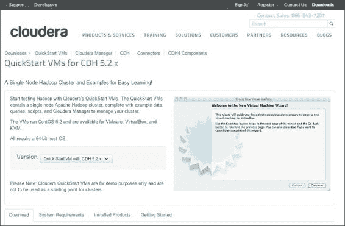
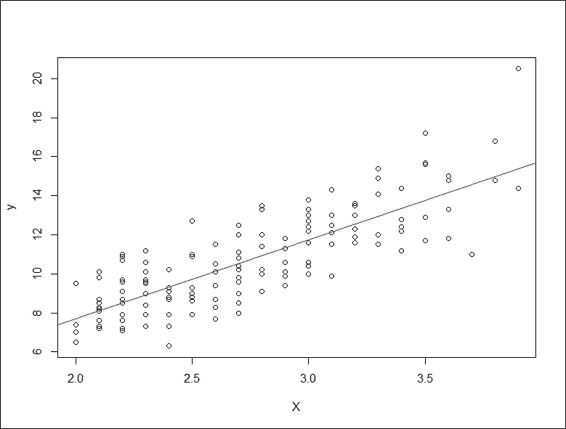
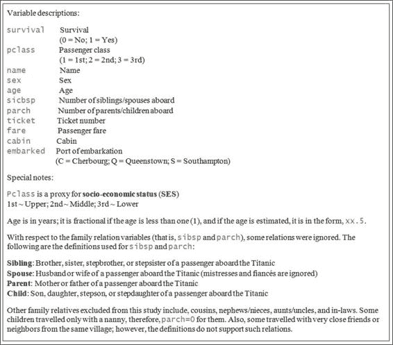

# 第十二章 大数据分析（R 和 Hadoop）

在本章中，我们将涵盖以下主题：

+   准备 RHadoop 环境

+   安装 rmr2

+   安装 rhdfs

+   使用 rhdfs 操作 HDFS

+   使用 RHadoop 实现词频统计问题

+   比较 R MapReduce 程序和标准 R 程序的性能

+   测试和调试 rmr2 程序

+   安装 plyrmr

+   使用 plyrmr 操作数据

+   使用 RHadoop 进行机器学习

+   在 Amazon EMR 上配置 RHadoop 集群

# 简介

RHadoop 是一组 R 包，使用户能够使用 Hadoop 处理和分析大数据。在了解如何设置 RHadoop 并将其付诸实践之前，我们必须知道为什么我们需要使用机器学习来处理大数据规模。

在前面的章节中，我们提到了 R 在进行数据分析和机器学习时的有用性。在传统的统计分析中，重点是分析历史样本（小数据），这可能会忽略很少发生但很有价值的事件和结果，导致不确定的结论。

云技术的出现使得客户与业务之间的实时互动变得更加频繁；因此，机器学习的重点现在已转向为各种客户开发准确的预测。例如，企业可以通过使用实时预测模型，根据个人行为提供实时个性化推荐或在线广告。

然而，如果数据（例如，所有在线用户的行为）太大，无法适应单台机器的内存，你就不得不使用超级计算机或其他可扩展的解决方案。最流行的可扩展大数据解决方案是 Hadoop，它是一个开源框架，能够在集群之间存储和执行并行计算。因此，你可以使用 RHadoop，它允许 R 利用 Hadoop 的可扩展性，帮助处理和分析大数据。在 RHadoop 中，有五个主要包，它们是：

+   `rmr`：这是 R 和 Hadoop MapReduce 之间的接口，通过调用 Hadoop 流式 MapReduce API 在 Hadoop 集群中执行 MapReduce 作业。要开发 R MapReduce 程序，你只需要关注 map 和 reduce 函数的设计，其余的可扩展性问题将由 Hadoop 本身处理。

+   `rhdfs`：这是 R 和 HDFS 之间的接口，通过调用 HDFS API 来访问存储在 HDFS 中的数据。使用`rhdfs`的方式与使用 Hadoop shell 非常相似，它允许用户从 R 控制台轻松地操作 HDFS。

+   `rhbase`：这是 R 和 HBase 之间的接口，通过 Thrift 服务器在集群中访问 HBase。你可以使用`rhbase`来读写数据并操作存储在 HBase 中的表。

+   `plyrmr`：这是 MapReduce 的高级抽象，允许用户以 plyr-like 语法执行常见的数据操作。这个包大大降低了大数据操作的学习曲线。

+   `ravro`：这允许用户在 R 中读取`avro`文件或写入`avro`文件。它允许 R 与 HDFS 交换数据。

在本章中，我们将首先准备 Hadoop 环境，以便你可以安装 RHadoop。然后，我们将介绍三个主要包的安装：`rmr`、`rhdfs`和`plyrmr`。接下来，我们将介绍如何使用`rmr`从 R 执行 MapReduce，通过`rhdfs`操作 HDFS 文件，并使用`plyrmr`执行常见的数据操作。进一步，我们将探讨如何使用 RHadoop 进行机器学习。最后，我们将介绍如何在 Amazon EC2 上部署多个 RHadoop 集群。

# 准备 RHadoop 环境

由于 RHadoop 需要一个 R 和 Hadoop 集成环境，我们必须首先准备一个安装了 R 和 Hadoop 的环境。我们不必构建一个新的 Hadoop 系统，可以使用**Cloudera QuickStart VM**（该 VM 免费），它包含一个节点 Apache Hadoop 集群和 R。在这个菜谱中，我们将演示如何下载 Cloudera QuickStart VM。

## 准备工作

要使用 Cloudera QuickStart VM，建议你准备一个 64 位虚拟机操作系统，安装 VMWare 或 VirtualBox，或者安装 KVM。

如果你选择使用 VMWare，你应该准备一个与 WorkStation 8.x 或更高版本兼容的播放器：4.x 或更高版本，ESXi 5.x 或更高版本，或者 Fusion 4.x 或更高版本。

注意，启动 VM 需要 4 GB 的 RAM，至少有 3 GB 的可用磁盘空间。

## 如何操作...

使用 Cloudera QuickStart VM 设置 Hadoop 环境的以下步骤：

1.  访问 Cloudera QuickStart VM 下载站点（你可能需要更新链接，因为 Cloudera 升级了其 VMs，当前 CDH 版本为 5.3），请参阅[`www.cloudera.com/content/cloudera/en/downloads/quickstart_vms/cdh-5-3-x.html`](http://www.cloudera.com/content/cloudera/en/downloads/quickstart_vms/cdh-5-3-x.html)。

    Cloudera QuickStart VM 下载站点的截图

1.  根据你操作系统上安装的虚拟机平台，选择适当的链接（你可能需要更新链接，因为 Cloudera 升级了其 VMs）以下载 VM 文件：

    +   **下载 VMWare**：你可以访问[`downloads.cloudera.com/demo_vm/vmware/cloudera-quickstart-vm-5.2.0-0-vmware.7z`](https://downloads.cloudera.com/demo_vm/vmware/cloudera-quickstart-vm-5.2.0-0-vmware.7z)

    +   **下载 KVM**：你可以访问[`downloads.cloudera.com/demo_vm/kvm/cloudera-quickstart-vm-5.2.0-0-kvm.7z`](https://downloads.cloudera.com/demo_vm/kvm/cloudera-quickstart-vm-5.2.0-0-kvm.7z)

    +   **下载 VirtualBox**：你可以访问[`downloads.cloudera.com/demo_vm/virtualbox/cloudera-quickstart-vm-5.2.0-0-virtualbox.7z`](https://downloads.cloudera.com/demo_vm/virtualbox/cloudera-quickstart-vm-5.2.0-0-virtualbox.7z)

1.  接下来，您可以使用安装在您的操作系统上的虚拟机平台启动 QuickStart 虚拟机。您应该在几分钟内看到 Centos 6.2 的桌面。如何操作...

    Cloudera QuickStart 虚拟机的截图。

1.  您可以打开一个终端并输入 `hadoop`，这将显示可以操作 Hadoop 集群的一组功能。如何操作...

    输入 `hadoop` 后的终端截图

1.  打开一个终端并输入 `R`。访问 R 会话并检查版本 3.1.1 是否已在 Cloudera QuickStart 虚拟机中安装。如果您在虚拟机中找不到已安装的 R，请使用以下命令安装 R：

    ```py
    $ yum install R R-core R-core-devel R-devel

    ```

## 它是如何工作的...

您不必自己构建 Hadoop 系统，可以使用 Cloudera 提供的 Hadoop VM 应用程序（虚拟机是免费的）。QuickStart 虚拟机在 CentOS 6.2 上运行，包含单个节点 Apache Hadoop 集群、Hadoop 生态系统模块和已安装的 R。这可以帮助您节省时间，而不是需要您学习如何安装和使用 Hadoop。

QuickStart 虚拟机要求您拥有一个具有 64 位客户操作系统的计算机，至少 4 GB 的 RAM、3 GB 的磁盘空间，并且已安装 VMWare、VirtualBox 或 KVM。因此，您可能无法在某些计算机上使用此版本的虚拟机。作为替代方案，您可以考虑使用 Amazon 的 Elastic MapReduce。我们将在本章的最后一个小节中说明如何在 EMR 中准备 RHadoop 环境。

设置 Cloudera QuickStart 虚拟机很简单。从下载站点下载虚拟机，然后使用 VMWare、VirtualBox 或 KVM 打开构建的镜像。一旦您可以看到 CentOS 的桌面，您就可以访问终端并输入 `hadoop` 来查看 Hadoop 是否正在运行；然后，输入 `R` 来查看 R 是否在 QuickStart 虚拟机中运行。

## 参见

+   除了使用 Cloudera QuickStart 虚拟机外，您还可以考虑使用由 Hontonworks 或 MapR 提供的沙盒虚拟机。您可以在 [`hortonworks.com/products/hortonworks-sandbox/#install`](http://hortonworks.com/products/hortonworks-sandbox/#install) 找到 Hontonworks 沙盒，在 [`www.mapr.com/products/mapr-sandbox-hadoop/download`](https://www.mapr.com/products/mapr-sandbox-hadoop/download) 找到 mapR 沙盒。

# 安装 rmr2

`rmr2` 包允许您通过 Hadoop 集群上的 MapReduce 执行大数据处理和分析。要在 Hadoop 集群上执行 MapReduce，您必须在每个任务节点上安装 R 和 `rmr2`。在本菜谱中，我们将说明如何在 Hadoop 集群的单个节点上安装 `rmr2`。

## 准备工作

确保您已完成了前面的菜谱，通过启动 Cloudera QuickStart 虚拟机并将其连接到互联网，以便您可以继续下载和安装 `rmr2` 包。

## 如何操作...

执行以下步骤在 QuickStart 虚拟机上安装 `rmr2`：

1.  首先，在 Cloudera QuickStart 虚拟机内部打开终端。

1.  使用 root 权限进入 R 会话：

    ```py
    $ sudo R

    ```

1.  您可以在安装 `rmr2` 之前安装依赖包：

    ```py
    > install.packages(c("codetools", "Rcpp", "RJSONIO", "bitops", "digest", "functional", "stringr", "plyr", "reshape2", "rJava", "caTools"))

    ```

1.  退出 R 会话：

    ```py
    > q()

    ```

1.  接下来，您可以将 `rmr-3.3.0` 下载到 QuickStart VM 上。如果 Revolution Analytics 升级了 `rmr2` 的版本，您可能需要更新链接：

    ```py
    $ wget --no-check-certificate https://raw.githubusercontent.com/RevolutionAnalytics/rmr2/3.3.0/build/rmr2_3.3.0.tar.gz

    ```

1.  然后，您可以将 `rmr-3.3.0` 安装到 QuickStart VM 上：

    ```py
    $ sudo R CMD INSTALL rmr2_3.3.0.tar.gz

    ```

1.  最后，您可以进入 R 会话并使用 `library` 函数来测试库是否已成功安装：

    ```py
    $ R
    > library(rmr2)

    ```

## 它是如何工作的...

为了在 Hadoop 集群上执行 MapReduce，您必须在每个任务节点上安装 R 和 RHadoop。在此，我们将说明如何在 Hadoop 集群的单个节点上安装 `rmr2`。首先，打开 Cloudera QuickStart VM 的终端。在安装 `rmr2` 之前，我们首先以 root 权限访问 R 会话并安装依赖的 R 包。

接下来，在所有依赖包安装完成后，退出 R 会话，并在 Linux shell 中使用 `wget` 命令从 GitHub 下载 `rmr-3.3.0` 到本地文件系统。然后，您可以开始安装 `rmr2`。最后，您可以通过 R 会话使用库函数来验证包是否已安装。

## 参考信息

+   要获取更多信息和阅读关于 RHadoop 的更新，您可以参考 GitHub 上托管的 RHadoop 维基页面：[`github.com/RevolutionAnalytics/RHadoop/wiki`](https://github.com/RevolutionAnalytics/RHadoop/wiki)

# 安装 rhdfs

`rhdfs` 包是 R 和 HDFS 之间的接口，它允许用户从 R 控制台访问 HDFS。类似于 `rmr2`，应该在每个任务节点上安装 `rhdfs`，以便可以通过 R 控制台访问 HDFS 资源。在本菜谱中，我们将介绍如何在 Cloudera QuickStart VM 上安装 `rhdfs`。

## 准备工作

确保您已通过启动 Cloudera QuickStart VM 并将其连接到互联网来完成前面的菜谱，这样您就可以继续下载和安装 `rhdfs` 包。

## 如何操作...

执行以下步骤来安装 `rhdfs`：

1.  首先，您可以从 GitHub 下载 `rhdfs 1.0.8`。如果 Revolution Analytics 升级了 `rhdfs` 的版本，您可能需要更新链接：

    ```py
    $wget --no-check-certificate https://raw.github.com/RevolutionAnalytics/rhdfs/master/build/rhdfs_1.0.8.tar.gz

    ```

1.  接下来，您可以在命令行模式下安装 `rhdfs`：

    ```py
    $ sudo HADOOP_CMD=/usr/bin/hadoop  R CMD INSTALL rhdfs_1.0.8.tar.gz

    ```

1.  然后，您可以设置 `JAVA_HOME`。`JAVA_HOME` 的配置取决于 VM 内安装的 Java 版本：

    ```py
    $ sudo JAVA_HOME=/usr/java/jdk1.7.0_67-cloudera R CMD javareconf

    ```

1.  最后，您可以设置系统环境和初始化 `rhdfs`。如果您使用的是不同版本的 QuickStart VM，可能需要更新环境设置：

    ```py
    $ R
    > Sys.setenv(HADOOP_CMD="/usr/bin/hadoop")
    > Sys.setenv(HADOOP_STREAMING="/usr/lib/hadoop-mapreduce/hadoop-
    streaming-2.5.0-cdh5.2.0.jar")
    > library(rhdfs)
    > hdfs.init()

    ```

## 它是如何工作的...

包 `rhdfs` 提供了函数，使用户可以使用 R 管理 HDFS。类似于 `rmr2`，您应该在每个任务节点上安装 `rhdfs`，以便可以通过 R 控制台访问 HDFS。

要安装 `rhdfs`，您首先应从 GitHub 下载 `rhdfs`。然后，您可以通过指定 `HADOOP_CMD` 的位置来在 R 中安装 `rhdfs`。您必须通过命令 `javareconf` 配置 R 以支持 Java。

接下来，您可以访问 R 并配置 `HADOOP_CMD` 和 `HADOOP_STREAMING` 的位置。最后，您可以通过 `rhdfs.init` 函数初始化 `rhdfs`，这允许您通过 `rhdfs` 开始操作 HDFS。

## 参见

+   要查找 `HADOOP_CMD` 的位置，您可以在 Linux shell 中使用 `which hadoop` 命令。在大多数 Hadoop 系统中，`HADOOP_CMD` 位于 `/usr/bin/hadoop`。

+   对于 `HADOOP_STREAMING` 的位置，流 JAR 文件通常位于 `/usr/lib/hadoop-mapreduce/`。但是，如果您在 Linux 系统中找不到 `/usr/lib/Hadoop-mapreduce` 目录，您可以使用 `locate` 命令搜索流 JAR。例如：

    ```py
    $ sudo updatedb
    $ locate streaming | grep jar | more

    ```

# 使用 rhdfs 操作 HDFS

`rhdfs` 包是 Hadoop 和 R 之间的接口，可以在后端调用 HDFS API 来操作 HDFS。因此，您可以通过使用 `rhdfs` 包轻松地从 R 控制台操作 HDFS。在下面的菜谱中，我们将演示如何使用 `rhdfs` 函数操作 HDFS。

## 准备工作

要继续本菜谱，您需要完成之前的菜谱，将 `rhdfs` 安装到 R 中，并验证您可以通过 `hdfs.init` 函数初始化 HDFS。

## 如何做...

执行以下步骤以操作存储在 HDFS 上的文件：

1.  初始化 `rhdfs` 包：

    ```py
    > Sys.setenv(HADOOP_CMD="/usr/bin/hadoop")
    > Sys.setenv(HADOOP_STREAMING="/usr/lib/hadoop-mapreduce/hadoop-streaming-2.5.0-cdh5.2.0.jar")
    > library(rhdfs)
    > hdfs.init ()

    ```

1.  然后，您可以按照以下方式操作存储在 HDFS 上的文件：

    +   `hdfs.put`: 从本地文件系统复制文件到 HDFS：

        ```py
        > hdfs.put('word.txt', './')

        ```

    +   `hdfs.ls`: 读取 HDFS 中的目录列表：

        ```py
        > hdfs.ls('./')

        ```

    +   `hdfs.copy`: 将文件从一个 HDFS 目录复制到另一个目录：

        ```py
        > hdfs.copy('word.txt', 'wordcnt.txt')

        ```

    +   `hdfs.move`：将文件从一个 HDFS 目录移动到另一个目录：

        ```py
        > hdfs.move('wordcnt.txt', './data/wordcnt.txt')

        ```

    +   `hdfs.delete`: 从 R 删除 HDFS 目录：

        ```py
        > hdfs.delete('./data/')

        ```

    +   `hdfs.rm`: 从 R 删除 HDFS 目录：

        ```py
        > hdfs.rm('./data/')

        ```

    +   `hdfs.get`: 从 HDFS 下载文件到本地文件系统：

        ```py
        > hdfs.get(word.txt', '/home/cloudera/word.txt')

        ```

    +   `hdfs.rename`: 重命名 HDFS 上存储的文件：

        ```py
        hdfs.rename('./test/q1.txt','./test/test.txt')

        ```

    +   `hdfs.chmod`: 更改文件或目录的权限：

        ```py
        > hdfs.chmod('test', permissions= '777')

        ```

    +   `hdfs.file.info`: 读取 HDFS 文件的元信息：

        ```py
        > hdfs.file.info('./')

        ```

1.  此外，您还可以将流写入 HDFS 文件：

    ```py
    > f = hdfs.file("iris.txt","w")
    > data(iris)
    > hdfs.write(iris,f)
    > hdfs.close(f)

    ```

1.  最后，您还可以从 HDFS 文件中读取流：

    ```py
    > f = hdfs.file("iris.txt", "r")
    > dfserialized = hdfs.read(f)
    > df = unserialize(dfserialized)
    > df
    > hdfs.close(f)

    ```

## 工作原理...

在本菜谱中，我们演示如何使用 `rhdfs` 包操作 HDFS。通常，您可以使用 Hadoop shell 操作 HDFS，但如果您想从 R 访问 HDFS，则可以使用 `rhdfs` 包。

在开始使用 `rhdfs` 之前，您必须使用 `hdfs.init()` 初始化 `rhdfs`。初始化后，您可以通过 `rhdfs` 包中提供的函数操作 HDFS。

除了操作 HDFS 文件外，您还可以通过 `hdfs.read` 和 `hdfs.write` 将流交换到 HDFS。因此，我们将演示如何使用 `hdfs.write` 将 R 中的数据框写入 HDFS 文件，`iris.txt`。最后，您可以使用 `hdfs.read` 函数和 `unserialize` 函数将写入的文件恢复到数据框。

## 参见

+   要初始化`rhdfs`，您必须在系统环境中设置`HADOOP_CMD`和`HADOOP_STREAMING`。您不必每次使用`rhdfs`时都设置配置，可以将配置放在`.rprofile`文件中。因此，每次您启动一个 R 会话时，配置将自动加载。

# 使用 RHadoop 实现单词计数问题

为了演示 MapReduce 是如何工作的，我们以单词计数为例，它计算给定输入集中每个单词的出现次数。在这个菜谱中，我们将演示如何使用`rmr2`实现单词计数问题。

## 准备工作

在这个菜谱中，我们需要一个输入文件作为我们的单词计数程序输入。您可以从[`github.com/ywchiu/ml_R_cookbook/tree/master/CH12`](https://github.com/ywchiu/ml_R_cookbook/tree/master/CH12)下载示例输入文件。

## 如何做...

执行以下步骤以实现单词计数程序：

1.  首先，您需要配置系统环境，然后将`rmr2`和`rhdfs`加载到一个 R 会话中。如果您使用的是不同版本的 QuickStart VM，可能需要更新 JAR 文件的使用：

    ```py
    > Sys.setenv(HADOOP_CMD="/usr/bin/hadoop")
    > Sys.setenv(HADOOP_STREAMING="/usr/lib/hadoop-mapreduce/hadoop-streaming-2.5.0-cdh5.2.0.jar ")
    > library(rmr2)
    > library(rhdfs)
    > hdfs.init()

    ```

1.  您可以在 HDFS 上创建一个目录并将输入文件放入新创建的目录中：

    ```py
    > hdfs.mkdir("/user/cloudera/wordcount/data")
    > hdfs.put("wc_input.txt", "/user/cloudera/wordcount/data")

    ```

1.  接下来，您可以创建一个`map`函数：

    ```py
    > map = function(.,lines) { keyval(
    +   unlist(
    +     strsplit(
    +       x = lines, 
    +       split = " +")),
    +   1)}

    ```

1.  创建一个`reduce`函数：

    ```py
    > reduce = function(word, counts) { 
    +   keyval(word, sum(counts)) 
    + }

    ```

1.  调用 MapReduce 程序来计数文档中的单词：

    ```py
    > hdfs.root = 'wordcount' > hdfs.data = file.path(hdfs.root, 'data')
    > hdfs.out = file.path(hdfs.root, 'out')
    > wordcount = function (input, output=NULL) { 
    +  mapreduce(input=input, output=output, input.format="text", map=map, 
    +  reduce=reduce) 
    + } 
    > out = wordcount(hdfs.data, hdfs.out)

    ```

1.  最后，您可以检索文档中出现的最频繁的 10 个单词：

    ```py
    > results = from.dfs(out) 
    > results$key[order(results$val, decreasing = TRUE)][1:10]

    ```

## 它是如何工作的...

在这个菜谱中，我们演示了如何使用`rmr2`包实现单词计数。首先，我们需要配置系统环境并将`rhdfs`和`rmr2`加载到 R 中。然后，我们通过`hdfs.put`函数将我们的单词计数程序的输入从本地文件系统指定到 HDFS 目录`/user/cloudera/wordcount/data`。

接下来，我们开始实现 MapReduce 程序。通常，我们可以将 MapReduce 程序分为`map`和`reduce`函数。在`map`函数中，我们首先使用`strsplit`函数将每一行拆分成单词。然后，由于`strsplit`函数返回一个单词列表，我们可以使用`unlist`函数将字符向量转换为列表。最后，我们可以返回键值对，其中每个单词作为键，值为一。由于`reduce`函数接收来自`map`函数生成的键值对，`reduce`函数将计数求和并返回每个单词（或键）的出现次数。

在我们实现了`map`和`reduce`函数之后，我们可以通过`mapreduce`函数提交我们的作业。通常，`mapreduce`函数需要四个输入，分别是 HDFS 输入路径、HDFS 输出路径、map 函数和 reduce 函数。在这种情况下，我们指定输入为`wordcount/data`，输出为`wordcount/out`，mapfunction 为`map`，reduce function 为`reduce`，并将`mapreduce`调用封装在`wordcount`函数中。最后，我们调用函数`wordcount`并将输出路径存储在变量`out`中。

我们可以使用`from.dfs`函数将 HDFS 数据加载到`results`变量中，该变量包含单词和出现次数的映射。然后我们可以从`results`变量中生成出现次数最多的前 10 个单词。

## 参见

+   在这个菜谱中，我们展示了如何编写一个 R MapReduce 程序来解决单词计数问题。然而，如果你对如何编写本地的 Java MapReduce 程序感兴趣，你可以参考[`hadoop.apache.org/docs/current/hadoop-mapreduce-client/hadoop-mapreduce-client-core/MapReduceTutorial.html`](http://hadoop.apache.org/docs/current/hadoop-mapreduce-client/hadoop-mapreduce-client-core/MapReduceTutorial.html)。

# 比较 R MapReduce 程序和标准 R 程序的性能

对于不熟悉 Hadoop 工作原理的人来说，他们可能会经常将 Hadoop 视为大数据处理的一种补救措施。有些人可能认为 Hadoop 可以在几毫秒内为任何大小的数据返回处理结果。在这个菜谱中，我们将比较 R MapReduce 程序和标准 R 程序的性能，以证明 Hadoop 的运行速度并不像一些人认为的那样快。

## 准备工作

在这个菜谱中，你应该通过将`rmr2`安装到 R 环境中来完成之前的菜谱。

## 如何做...

执行以下步骤来比较标准 R 程序和 R MapReduce 程序的性能：

1.  首先，你可以实现一个标准 R 程序来将所有数字平方：

    ```py
    > a.time = proc.time() 
    > small.ints2=1:100000 
    > result.normal = sapply(small.ints2, function(x) x²) 
    > proc.time() - a.time

    ```

1.  为了比较性能，你可以实现一个 R MapReduce 程序来将所有数字平方：

    ```py
    > b.time = proc.time() 
    > small.ints= to.dfs(1:100000) 
    > result = mapreduce(input = small.ints, map = function(k,v)       cbind(v,v²)) 
    > proc.time() - b.time

    ```

## 它是如何工作的...

在这个菜谱中，我们实现了两个程序来平方所有数字。在第一个程序中，我们使用标准的 R 函数``sapply`来平方从 1 到 100,000 的序列。为了记录程序执行时间，我们在执行前首先记录处理时间到`a.time`，然后从执行后的当前处理时间中减去`a.time`。通常，执行时间不超过 10 秒。在第二个程序中，我们使用`rmr2`包在 R MapReduce 版本中实现程序。在这个程序中，我们也记录了执行时间。通常，这个程序需要几分钟来完成一个任务。

性能比较显示，当处理少量数据时，标准 R 程序的性能优于 MapReduce 程序。这是因为 Hadoop 系统通常需要时间来启动守护进程，守护进程之间的作业协调，以及从数据节点获取数据。因此，MapReduce 程序通常需要几分钟到几个小时来完成执行。因此，如果你可以将你的数据放入内存中，你应该编写一个标准 R 程序来解决问题。否则，如果数据太大而无法放入内存，你可以实现一个 MapReduce 解决方案。

## 参见

+   为了检查一个作业在 Hadoop 中是否能够顺利高效地运行，你可以运行一个 MapReduce 基准测试，MRBench，来评估作业的性能：

    ```py
    $ hadoop jar /usr/lib/hadoop-0.20-mapreduce/hadoop-test.jar mrbench -numRuns 50

    ```

# 测试和调试 rmr2 程序

由于运行 MapReduce 程序将需要相当多的时间，从几分钟到几小时不等，因此测试和调试变得非常重要。在这个菜谱中，我们将展示您可以用来调试 R MapReduce 程序的一些技术。

## 准备工作

在这个菜谱中，您应该通过将 `rmr2` 安装到 R 环境中来完成前面的菜谱。

## 如何操作...

执行以下步骤以测试和调试 R MapReduce 程序：

1.  首先，您可以在 `rmr.options` 中将后端配置为本地：

    ```py
    > rmr.options(backend = 'local')

    ```

1.  再次，您可以执行前面菜谱中提到的数字平方 MapReduce 程序：

    ```py
    > b.time = proc.time() 
    > small.ints= to.dfs(1:100000) 
    > result = mapreduce(input = small.ints, map = function(k,v)       cbind(v,v²)) 
    > proc.time() - b.time

    ```

1.  此外，如果您想在 MapReduce 程序中打印任何变量的结构信息，您可以使用 `rmr.str` 函数：

    ```py
    > out = mapreduce(to.dfs(1), map = function(k, v) rmr.str(v))
    Dotted pair list of 14
     $ : language mapreduce(to.dfs(1), map = function(k, v) rmr.str(v))
     $ : language mr(map = map, reduce = reduce, combine = combine, vectorized.reduce, in.folder = if (is.list(input)) {     lapply(input, to.dfs.path) ...
     $ : language c.keyval(do.call(c, lapply(in.folder, function(fname) {     kv = get.data(fname) ...
     $ : language do.call(c, lapply(in.folder, function(fname) {     kv = get.data(fname) ...
     $ : language lapply(in.folder, function(fname) {     kv = get.data(fname) ...
     $ : language FUN("/tmp/Rtmp813BFJ/file25af6e85cfde"[[1L]], ...)
     $ : language unname(tapply(1:lkv, ceiling((1:lkv)/(lkv/(object.size(kv)/10⁶))), function(r) {     kvr = slice.keyval(kv, r) ...
     $ : language tapply(1:lkv, ceiling((1:lkv)/(lkv/(object.size(kv)/10⁶))), function(r) {     kvr = slice.keyval(kv, r) ...
     $ : language lapply(X = split(X, group), FUN = FUN, ...)
     $ : language FUN(X[[1L]], ...)
     $ : language as.keyval(map(keys(kvr), values(kvr)))
     $ : language is.keyval(x)
     $ : language map(keys(kvr), values(kvr))
     $ :length 2 rmr.str(v)
     ..- attr(*, "srcref")=Class 'srcref'  atomic [1:8] 1 34 1 58 34 58 1 1
     .. .. ..- attr(*, "srcfile")=Classes 'srcfilecopy', 'srcfile' <environment: 0x3f984f0> 
    v
     num 1

    ```

## 它是如何工作的...

在这个菜谱中，我们介绍了一些在实现 MapReduce 程序时可以使用的调试和测试技术。首先，我们介绍了在本地模式下测试 MapReduce 程序的技术。如果您想以伪分布式或完全分布式模式运行 MapReduce 程序，这将花费您几分钟到几小时的时间来完成，这将在调试您的 MapReduce 程序时造成大量时间的浪费。因此，您可以在 `rmr.options` 中将后端设置为本地模式，这样程序将以本地模式执行，执行时间更短。

另一种调试技术是在 `map` 或 `reduce` 函数中列出变量的内容。在 R 程序中，您可以使用 `str` 函数显示单个变量的紧凑结构。在 `rmr2` 中，该包还提供了一个名为 `rmr.str` 的函数，允许您将单个变量的内容打印到控制台。在这个例子中，我们使用 `rmr.str` 来打印 MapReduce 程序中变量的内容。

## 参考以下内容

+   对于那些对 `rmr2` 包的 `option` 设置感兴趣的人，您可以参考 `rmr.options` 的帮助文档：

    ```py
    > help(rmr.options)

    ```

# 安装 plyrmr

`plyrmr` 包为用户提供了一些常见操作（如在 `plyr` 或 `reshape2` 中找到的操作），以便用户能够通过 MapReduce 框架轻松进行数据处理。在这个菜谱中，我们将介绍如何在 Hadoop 系统上安装 `plyrmr`。

## 准备工作

通过启动 Cloudera QuickStart 虚拟机并将其连接到互联网，确保您已经完成了前面的菜谱。此外，您需要事先安装 `rmr2` 包。

## 如何操作...

执行以下步骤在 Hadoop 系统上安装 `plyrmr`：

1.  首先，您应该在 Linux 命令行中安装 `libxml2-devel` 和 `curl-devel`：

    ```py
    $ yum install libxml2-devel
    $ sudo yum install curl-devel

    ```

1.  然后，您可以访问 R 并安装依赖包：

    ```py
    $ sudo R
    > Install.packages(c(" Rcurl", "httr"),  dependencies = TRUE
    > Install.packages("devtools", dependencies = TRUE)
    > library(devtools)
    > install_github("pryr", "hadley")
    > install.packages(c(" R.methodsS3", "hydroPSO"),  dependencies = TRUE)
    > q()

    ```

1.  接下来，您可以在 Hadoop 虚拟机上下载 `plyrmr 0.5.0` 并安装它。如果 Revolution Analytics 升级了 `plyrmr` 的版本，您可能需要更新链接：

    ```py
    $ wget -no-check-certificate https://raw.github.com/RevolutionAnalytics/plyrmr/master/build/plyrmr_0.5.0.tar.gz
    $ sudo R CMD INSTALL plyrmr_0.5.0.tar.gz

    ```

1.  最后，验证安装：

    ```py
    $ R
    > library(plyrmr)

    ```

## 它是如何工作的...

除了使用`rmr2`包编写 R MapReduce 程序外，您还可以使用`plyrmr`来操作数据。`plyrmr`包类似于 Hadoop 生态系统中的 hive 和 pig，它是 MapReduce 程序的高级抽象。因此，我们可以以`plyr`风格实现 R MapReduce 程序，而不是实现`map`和`reduce`函数。

要安装`plyrmr`，首先使用`yum install`命令安装`libxml2-devel`和`curl-devel`包。然后，进入 R 并安装依赖包。最后，从 GitHub 下载文件并在 R 中安装`plyrmr`。

## 参考以下内容

+   要获取有关`plyrmr`的更多信息，您可以使用`help`函数参考以下文档：

    ```py
    > help(package=plyrmr) 

    ```

# 使用 plyrmr 操作数据

虽然使用`rmr2`编写 MapReduce 程序比编写原生 Java 版本要容易得多，但对于非开发者来说，编写 MapReduce 程序仍然很困难。因此，您可以使用`plyrmr`，它是 MapReduce 程序的高级抽象，这样您就可以使用类似于 plyr 的操作来操作大数据。在本菜谱中，我们将介绍一些您可以用来操作数据的操作。

## 准备工作

在本菜谱中，您应该已经通过在 R 中安装`plyrmr`和`rmr2`来完成之前的菜谱。

## 如何操作...

按照以下步骤使用`plyrmr`操作数据：

1.  首先，您需要将`plyrmr`和`rmr2`都加载到 R 中：

    ```py
    > library(rmr2)
    > library(plyrmr)

    ```

1.  然后，您可以将执行模式设置为本地模式：

    ```py
    > plyrmr.options(backend="local")

    ```

1.  接着，将泰坦尼克号数据集加载到 R 中：

    ```py
    > data(Titanic)
    > titanic = data.frame(Titanic)

    ```

1.  通过过滤数据开始操作：

    ```py
    > where(
    +    Titanic, 
    + Freq >=100)

    ```

1.  您还可以使用管道操作符过滤数据：

    ```py
    > titanic %|% where(Freq >=100)

    ```

1.  将泰坦尼克号数据放入 HDFS，并将数据路径加载到变量`tidata`中：

    ```py
    > tidata = to.dfs(data.frame(Titanic), output = '/tmp/titanic')
    > tidata

    ```

1.  接下来，您可以从泰坦尼克号数据中生成频率的汇总：

    ```py
    > input(tidata) %|% transmute(sum(Freq))

    ```

1.  您还可以按性别分组频率：

    ```py
    > input(tidata) %|% group(Sex) %|% transmute(sum(Freq))

    ```

1.  您可以从总体中抽取 10 条记录作为样本：

    ```py
    > sample(input(tidata), n=10)

    ```

1.  此外，您还可以使用 plyrmr 将两个数据集连接起来：

    ```py
    > convert_tb = data.frame(Label=c("No","Yes"), Symbol=c(0,1))
    ctb = to.dfs(convert_tb, output = 'convert')
    > as.data.frame(plyrmr::merge(input(tidata), input(ctb), by.x="Survived", by.y="Label"))
    > file.remove('convert')

    ```

## 工作原理...

在本菜谱中，我们介绍如何使用`plyrmr`操作数据。首先，我们需要将`plyrmr`包加载到 R 中。然后，类似于`rmr2`，您必须将`plyrmr`的后端选项设置为本地模式。否则，如果`plyrmr`在 Hadoop 模式下运行（默认设置），您可能需要等待几分钟到几个小时。

接下来，我们可以开始使用数据过滤进行数据操作。您可以选择在步骤 4 中调用嵌套在其他函数调用中的函数。另一方面，您可以使用管道操作符`%|%`来链式执行多个操作。因此，我们可以在步骤 5 中使用管道操作符执行类似于步骤 4 的数据过滤。

接下来，你可以使用`to.dfs`根据当前运行模式将数据集输入到 HDFS 或本地文件系统。该函数将生成数据集的路径并将其保存在变量`tidata`中。通过知道路径，你可以使用`input`函数访问数据。接下来，我们将展示如何使用`transmute`和`sum`函数从泰坦尼克号数据集中生成频率的总和。此外，`plyrmr`允许用户按性别汇总频率。

此外，为了从总体中采样数据，你也可以使用`sample`函数从泰坦尼克号数据集中选择 10 条记录。最后，我们演示了如何使用`plyrmr`的`merge`函数合并两个数据集。

## 参见

这里我们列出了一些可以使用`plyrmr`来操作数据的函数。你可以参考`help`函数以获取它们的使用和功能的更多详细信息：

+   数据操作：

    +   `bind.cols`: 这用于添加新列

    +   `select`: 这用于选择列

    +   `where`: 这用于选择行

    +   `transmute`: 这使用上述所有内容及其汇总

+   从`reshape2`：

    +   `melt`和`dcast`：它将长宽数据框进行转换

+   摘要：

    +   `count`

    +   `quantile`

    +   `sample`

+   提取：

    +   `top.k`

    +   `bottom.k`

# 使用 RHadoop 进行机器学习

在前面的章节中，我们已经展示了当使用 R 解决机器学习问题时，R 是多么强大。我们还展示了使用 Hadoop 可以使 R 并行处理大数据。此时，有些人可能认为使用 RHadoop 可以通过现有的许多机器学习包轻松解决大数据的机器学习问题。然而，你不能使用其中大多数来解决机器学习问题，因为它们不能在 MapReduce 模式下执行。在下面的菜谱中，我们将展示如何实现线性回归的 MapReduce 版本，并将其与使用`lm`函数的版本进行比较。

## 准备工作

在这个菜谱中，你应该通过将`rmr2`安装到 R 环境中来完成之前的菜谱。

## 如何操作...

执行以下步骤以在 MapReduce 中实现线性回归：

1.  首先，从`MASS`包中加载`cats`数据集：

    ```py
    > library(MASS)
    > data(cats)
    > X = matrix(cats$Bwt)
    > y = matrix(cats$Hwt)

    ```

1.  你可以通过调用`lm`函数来生成线性回归模型：

    ```py
    > model = lm(y~X)
    > summary(model)

    Call:
    lm(formula = y ~ X)

    Residuals:
     Min      1Q  Median      3Q     Max 
    -3.5694 -0.9634 -0.0921  1.0426  5.1238 

    Coefficients:
     Estimate Std. Error t value Pr(>|t|) 
    (Intercept)  -0.3567     0.6923  -0.515    0.607 
    X             4.0341     0.2503  16.119   <2e-16 ***
    ---
    Signif. codes: 
    0 '***' 0.001 '**' 0.01 '*' 0.05 '.' 0.1 ' ' 1

    Residual standard error: 1.452 on 142 degrees of freedom
    Multiple R-squared:  0.6466,  Adjusted R-squared:  0.6441 
    F-statistic: 259.8 on 1 and 142 DF,  p-value: < 2.2e-16

    ```

1.  你现在可以使用给定的数据点和模型制作回归图：

    ```py
    > plot(y~X)
    > abline(model, col="red")

    ```

    

    cats 数据集的线性回归图

1.  将`rmr2`加载到 R 中：

    ```py
    > Sys.setenv(HADOOP_CMD="/usr/bin/hadoop")
    > Sys.setenv(HADOOP_STREAMING="/usr/lib/hadoop-mapreduce/hadoop-> streaming-2.5.0-cdh5.2.0.jar")
    > library(rmr2)
    > rmr.options(backend="local")

    ```

1.  你可以设置`X`和`y`的值：

    ```py
    > X = matrix(cats$Bwt)
    > X.index = to.dfs(cbind(1:nrow(X), X))
    > y = as.matrix(cats$Hwt)

    ```

1.  创建一个`Sum`函数来汇总值：

    ```py
    > Sum = 
    +   function(., YY) 
    +     keyval(1, list(Reduce('+', YY)))

    ```

1.  在 MapReduce 的`Job1`中计算`Xtx`：

    ```py
    > XtX = 
    +    values(
    +      from.dfs(
    +        mapreduce(
    +          input = X.index,
    +          map = 
    +            function(., Xi) {
    +              Xi = Xi[,-1]
    +              keyval(1, list(t(Xi) %*% Xi))},
    +          reduce = Sum,
    +          combine = TRUE)))[[1]]

    ```

1.  你可以在 MapReduce 的`Job2`中计算`Xty`：

    ```py
    Xty = 
    +    values(
    +      from.dfs(
    +        mapreduce(
    +          input = X.index,
    +          map = function(., Xi) {
    +            yi = y[Xi[,1],]
    +            Xi = Xi[,-1]
    +            keyval(1, list(t(Xi) %*% yi))},
    +          reduce = Sum,
    +          combine = TRUE)))[[1]]

    ```

1.  最后，你可以从`XtX`和`Xty`中推导出系数：

    ```py
    > solve(XtX, Xty)
     [,1]
    [1,] 3.907113

    ```

## 它是如何工作的...

在这个菜谱中，我们展示了如何在 R 中用 MapReduce 风格实现线性逻辑回归。在我们开始实现之前，我们回顾了传统线性模型是如何工作的。我们首先从`MASS`包中检索`cats`数据集。然后我们将`X`作为体重（`Bwt`）和`y`作为心脏重量（`Hwt`）加载。

接下来，我们开始使用`lm`函数将数据拟合到线性回归模型中。然后我们可以计算拟合模型并获得模型的摘要。摘要显示系数为 4.0341，截距为-0.3567。此外，我们根据给定的数据点绘制散点图，然后在图上绘制回归线。

由于我们不能在 MapReduce 形式中使用`lm`函数进行线性回归，我们必须以 MapReduce 风格重写回归模型。在这里，我们希望分三步实现线性回归的 MapReduce 版本，这些步骤是：使用 MapReduce 计算`Xtx`值，任务 1，使用 MapReduce 计算`Xty`值，任务 2，然后推导出系数值：

+   在第一步中，我们将矩阵`X`作为输入传递给`map`函数。然后`map`函数计算转置矩阵`X`和`X`的叉积。然后`reduce`函数执行之前定义的求和操作。

+   在第二步中，计算`Xty`的过程与计算`XtX`的过程类似。这个过程计算了转置矩阵`X`和`y`的叉积。然后`reduce`函数执行之前定义的求和操作。

+   最后，我们使用`solve`函数推导出系数，其值为 3.907113。

如结果所示，`lm`和 MapReduce 计算出的系数略有差异。一般来说，`lm`模型计算出的系数比 MapReduce 计算出的更准确。然而，如果你的数据太大而无法适应内存，你不得不选择在 MapReduce 版本中实现线性回归。

## 参考信息

+   你可以在以下位置获取有关机器学习算法的更多信息：[`github.com/RevolutionAnalytics/rmr2/tree/master/pkg/tests`](https://github.com/RevolutionAnalytics/rmr2/tree/master/pkg/tests)

# 在 Amazon EMR 上配置 RHadoop 集群

到目前为止，我们只演示了如何在单个 Hadoop 节点上运行 RHadoop 程序。为了在多节点集群上测试我们的 RHadoop 程序，你需要做的唯一一件事是在 Hadoop 集群的所有任务节点（无论是 mapreduce 版本 1 的任务跟踪器还是 map reduce 版本 2 的节点管理器）上安装 RHadoop。然而，部署和安装是耗时的。另一方面，你可以选择在 Amazon EMR 上部署你的 RHadoop 程序，这样你就可以在几分钟内部署多节点集群和 RHadoop 到每个任务节点。在下面的菜谱中，我们将演示如何在 Amazon EMR 服务上配置 RHadoop 集群。

## 准备工作

在这个菜谱中，你必须注册并创建 AWS 账户，并且在使用 Amazon EMR 之前，你必须知道如何生成 EC2 密钥对。

对于那些寻求如何开始使用 AWS 的更多信息的人，请参阅亚马逊提供的教程[`docs.aws.amazon.com/AWSEC2/latest/UserGuide/EC2_GetStarted.html`](http://docs.aws.amazon.com/AWSEC2/latest/UserGuide/EC2_GetStarted.html)。

## 如何操作...

在 Amazon EMR 上配置 RHadoop 的以下步骤

1.  首先，你可以访问亚马逊网络服务的控制台（参考[`us-west-2.console.aws.amazon.com/console/`](https://us-west-2.console.aws.amazon.com/console/))，在分析部分找到 EMR。然后，点击**EMR**。如何操作...

    从 AWS 控制台访问 EMR 服务。

1.  你应该发现自己处于 EMR 仪表板的集群列表中（参考[`us-west-2.console.aws.amazon.com/elasticmapreduce/home?region=us-west-2#cluster-list::`](https://us-west-2.console.aws.amazon.com/elasticmapreduce/home?region=us-west-2#cluster-list::))；点击**创建集群**。如何操作...

    EMR 集群列表

1.  然后，你应该发现自己处于**创建集群**页面（参考[`us-west-2.console.aws.amazon.com/elasticmapreduce/home?region=us-west-2#create-cluster:`](https://us-west-2.console.aws.amazon.com/elasticmapreduce/home?region=us-west-2#create-cluster:)）。

1.  接下来，你应在集群配置中指定**集群名称**和**日志文件夹 S3 位置**。如何操作...

    创建集群页面中的集群配置

1.  然后，你可以在**软件配置**中配置 Hadoop 发行版。如何操作...

    配置软件和应用程序

1.  接下来，你可以在 Hadoop 集群内配置节点数量。如何操作...

    配置 Hadoop 集群内的硬件

1.  然后，你可以指定用于主节点登录的 EC2 密钥对。如何操作...

    EMR 集群主节点的安全和访问

1.  要设置 RHadoop，必须在每个任务节点上执行引导操作来安装 RHadoop。请创建一个名为 `bootstrapRHadoop.sh` 的文件，并在文件中插入以下行：

    ```py
    echo 'install.packages(c("codetools", "Rcpp", "RJSONIO", "bitops", "digest", "functional", "stringr", "plyr", "reshape2", "rJava", "caTools"), repos="http://cran.us.r-project.org")' > /home/hadoop/installPackage.R
    sudo Rscript /home/hadoop/installPackage.R
    wget --no-check-certificate https://raw.githubusercontent.com/RevolutionAnalytics/rmr2/master/build/rmr2_3.3.0.tar.gz
    sudo R CMD INSTALL rmr2_3.3.0.tar.gz
    wget --no-check-certificate https://raw.github.com/RevolutionAnalytics/rhdfs/master/build/rhdfs_1.0.8.tar.gz
    sudo HADOOP_CMD=/home/hadoop/bin/hadoop R CMD INSTALL rhdfs_1.0.8.tar.gz
    ```

1.  你应该将 `bootstrapRHadoop.sh` 上传到 `S3`。

1.  现在，你需要使用**自定义操作**添加引导操作，并在 S3 位置添加 `s3://<location>/bootstrapRHadoop.sh`。如何操作...

    设置引导操作

1.  接下来，你可以点击**创建集群**来启动 Hadoop 集群。如何操作...

    创建集群

1.  最后，当集群准备就绪时，你应该看到主节点的公共 DNS。现在，你可以使用你的 EC2 密钥对访问主节点的终端：如何操作...

    创建集群的截图

## 它是如何工作的...

在这个菜谱中，我们展示了如何在 Amazon EMR 上设置 RHadoop。这样做的好处是，您只需点击几下，在几分钟内就可以快速创建一个可扩展的、按需的 Hadoop。这有助于节省您构建和部署 Hadoop 应用程序的时间。然而，您必须为每个实例的运行时间付费。在使用 Amazon EMR 之前，您应该创建一个 AWS 账户，并了解如何设置 EC2 密钥对和 S3。然后，您可以在 Amazon EMR 上开始安装 RHadoop。

在第一步中，访问 EMR 集群列表并点击 **创建集群**。您可以在 **创建集群** 页面上看到配置列表。然后，您应该在集群配置中的 S3 位置设置集群名称和日志文件夹。

接下来，您可以设置软件配置并选择您想要安装的 Hadoop 发行版。亚马逊提供自己的发行版和 MapR 发行版。通常情况下，除非您对默认的 Hadoop 发行版有顾虑，否则您会跳过这一部分。

然后，通过指定主节点、核心节点和任务节点来配置硬件。默认情况下，只有一个主节点和两个核心节点。如果您愿意，可以添加更多核心节点和任务节点。然后，您应该设置密钥对以登录主节点。

接下来，创建一个包含所有启动脚本名为 `bootstrapRHadoop.sh` 的文件。文件创建后，您应该将其保存在 S3 存储中。然后，您可以在 **引导操作** 中指定 `custom action`，并将 `bootstrapRHadoop.sh` 作为引导脚本。最后，您可以点击 **创建集群** 并等待集群就绪。一旦集群就绪，您可以看到主节点的公共 DNS，并可以使用 EC2 密钥对访问主节点的终端。

警告！如果您不想继续使用 EMR 服务，请终止正在运行的实例。否则，您将按实例每小时收费。

## 参见

+   Google 也提供了自己的云解决方案，即 Google 计算引擎。如果您想了解更多信息，请参阅 [`cloud.google.com/compute/`](https://cloud.google.com/compute/)。

# 附录 A. R 和机器学习资源

以下表格列出了 R 和机器学习的所有资源：

| R 简介 |
| --- |
| **标题** | **链接** | **作者** |
| 《R 动作》 | [`www.amazon.com/R-Action-Robert-Kabacoff/dp/1935182390`](http://www.amazon.com/R-Action-Robert-Kabacoff/dp/1935182390) | Robert Kabacoff |
| 《R 编程艺术：统计软件设计之旅》 | [`www.amazon.com/The-Art-Programming-Statistical-Software/dp/1593273843`](http://www.amazon.com/The-Art-Programming-Statistical-Software/dp/1593273843) | Norman Matloff |
| 《R 简介》 | [`cran.r-project.org/doc/manuals/R-intro.pdf`](http://cran.r-project.org/doc/manuals/R-intro.pdf) | W. N. Venables, D. M. Smith, 和 R 核心团队 |
| Quick-R | [`www.statmethods.net/`](http://www.statmethods.net/) | 罗伯特·I·卡巴科夫，博士 |
| **在线课程** |
| **标题** | **链接** | **讲师** |
| 使用 R 进行数据分析（含 R） | [`www.coursera.org/course/compdata`](https://www.coursera.org/course/compdata) | 罗杰·D·彭，约翰霍普金斯大学 |
| 数据分析 | [`www.coursera.org/course/dataanalysis`](https://www.coursera.org/course/dataanalysis) | 杰夫·利克，约翰霍普金斯大学 |
| 数据分析与统计推断 | [`www.coursera.org/course/statistics`](https://www.coursera.org/course/statistics) | 矿·切廷卡亚-朗德尔，杜克大学 |
| **机器学习** |
| **标题** | **链接** | **作者** |
| 为黑客的机器学习 | [`www.amazon.com/dp/1449303714?tag=inspiredalgor-20`](http://www.amazon.com/dp/1449303714?tag=inspiredalgor-20) | 德鲁·康威和约翰·迈尔斯·怀特 |
| 使用 R 进行机器学习 | [`www.packtpub.com/machine-learning-with-r/book`](http://www.packtpub.com/machine-learning-with-r/book) | 布雷特·兰茨 |
| **在线博客** |
| **标题** | **链接** |
| R 博客 | [`www.r-bloggers.com/`](http://www.r-bloggers.com/) |
| R 杂志 | [`journal.r-project.org/`](http://journal.r-project.org/) |
| **CRAN 任务视图** |
| **标题** | **链接** |
| CRAN 任务视图：机器学习和统计学习 | [`cran.r-project.org/web/views/MachineLearning.html`](http://cran.r-project.org/web/views/MachineLearning.html) |

# 附录 B. 数据集 – 泰坦尼克号乘客的生存情况

在探索过程之前，我们想介绍这里采用的例子。它是关于 RMS 泰坦尼克号上乘客的人口统计信息，由 Kaggle 提供（[`www.kaggle.com/`](https://www.kaggle.com/)，一个数据预测竞赛的平台）。我们正在考察的结果是乘客是否能在船难中幸存。

应用这个数据集有两个原因：

+   RMS 泰坦尼克号被认为是历史上最臭名昭著的船难，死亡人数高达 1,502 人，占 2,224 名乘客和船员的近三分之二。然而，在船沉没后，乘客的生存机会并不仅仅取决于运气；实际上，舱位等级、性别、年龄和其他因素也可能影响了他们的生存机会。

+   该数据集相对简单；你不需要花大部分时间在数据处理上（除非处理一些缺失值），但你可以专注于探索性分析的应用。

下面的图表是目标数据集的变量描述：



从变量的描述来看，人们可能会有一些疑问，例如，“这个数据集中是否有缺失值？”、“泰坦尼克号乘客的平均年龄是多少？”、“有多少比例的乘客在灾难中幸存？”、“船上大多数乘客属于哪个社会阶层？”在这里提出的所有这些问题都将在 第二章 *《使用 RMS 泰坦尼克号进行数据探索》* 中得到解答。

除了与描述性统计相关的问题之外，第二章 *《使用 RMS 泰坦尼克号进行数据探索》* 的最终目标是生成一个模型，用以预测给定输入参数下的生存概率。除此之外，我们还将评估所生成模型的性能，以确定该模型是否适合该问题。
