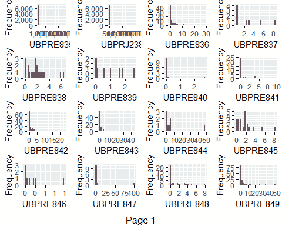
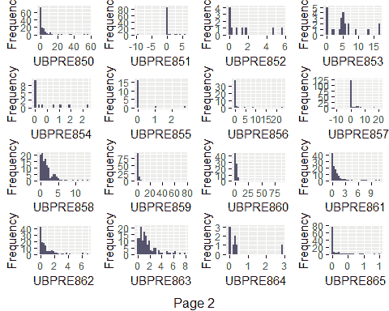
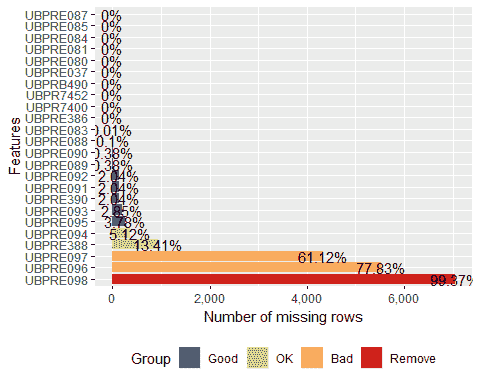
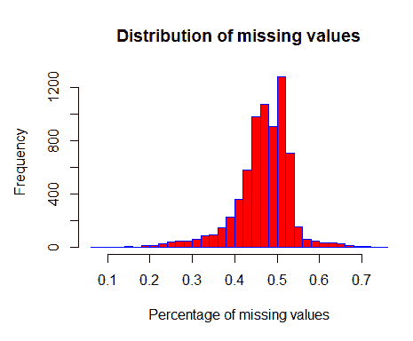
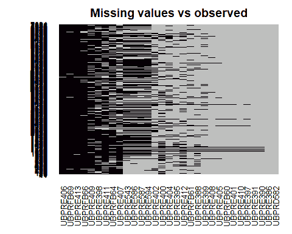
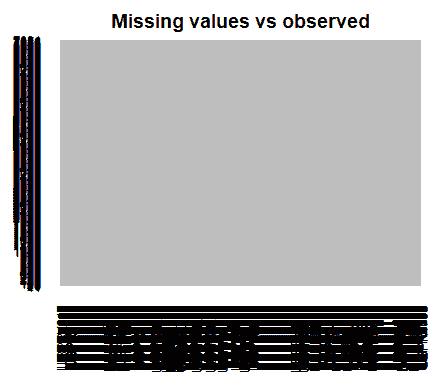
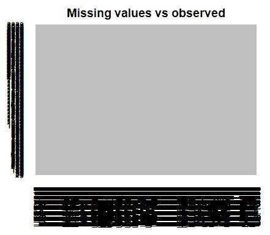

# 预测银行失败 - 描述性分析

在本章中，我们将学习如何理解并准备我们的银行数据集以进行模型开发。我们将回答有关我们有多少变量以及它们的质量的问题。描述性分析对于理解我们的数据和分析信息质量可能存在的问题至关重要。我们将看到如何处理缺失值，将变量转换为不同的格式，以及如何分割我们的数据以训练和验证我们的预测模型。

具体来说，我们将涵盖以下主题：

+   数据概览

+   格式转换

+   抽样

+   处理缺失值和异常值

+   实施描述性分析

# 数据概览

首先，我们将分析数据集中变量的类型。为此，我们可以使用 `class` 函数，它告诉我们一个变量是数字、字符还是矩阵。例如，银行识别号 `ID_RSSD` 的类别可以这样获得：

```py
class(Model_database$ID_RSSD)

 ## [1] "integer"
```

这个函数表明这个变量是一个没有小数的数字。

我们可以使用以下代码计算所有变量的相同信息并将其存储起来：

```py
 classes<-as.data.frame(sapply(Model_database, class))
 classes<-cbind(colnames(Model_database),classes)
 colnames(classes)<-c("variable","class")
```

使用 `sapply`，迭代地对数据集上的 `class` 函数进行计算。然后，将变量的名称与仅在一个数据框中的类别结合起来，最后重命名生成的数据集：

```py
head(classes)

 ##          variable   class
 ## ID_RSSD   ID_RSSD integer
 ## UBPR1795 UBPR1795 numeric
 ## UBPR4635 UBPR4635 numeric
 ## UBPRC233 UBPRC233 numeric
 ## UBPRD582 UBPRD582 numeric
 ## UBPRE386 UBPRE386 numeric
```

这个数据集包含四种不同类型的变量：

```py
table(classes$class)

 ## character      Date   integer   numeric
 ##       462         1         4      1027
```

根据之前的步骤，我们知道只有具有 `Date` 格式的变量收集财务报表的日期。

# 熟悉我们的变量

一些变量的字符类型尚不明确。我们的数据集属于金融领域，并且只有金融比率作为数据，所以我们预计变量类型应该是整数或数值。让我们找出我们是否正确。

过滤 `character` 变量：

```py
classes<-classes[classes$class=="character",]

head(classes)

 ##          variable     class
 ## UBPRE543 UBPRE543 character
 ## UBPRE586 UBPRE586 character
 ## UBPRE587 UBPRE587 character
 ## UBPRE594 UBPRE594 character
 ## UBPRFB64 UBPRFB64 character
 ## UBPRFB69 UBPRFB69 character
```

第一个变量，`UBPRE543`，衡量提供建筑贷款的银行的损失总额与授予的建筑贷款总额之比。正如我们所怀疑的，这个变量应该是数字、百分比或小数。

# 查找变量的缺失值

我们将使用以下代码计算这个变量，`UBPRE543`，随时间变化的缺失值数量，目的是了解这个变量的一些更多信息：

```py
aggregate(UBPRE543 ~ Date, data=Model_database, function(x) {sum(is.na(x))}, na.action = NULL)

 ##          Date UBPRE543
 ## 1  2002-12-31     1127
 ## 2  2003-12-31      954
 ## 3  2004-12-31      772
 ## 4  2005-12-31      732
 ## 5  2006-12-31      639
 ## 6  2007-12-31      309
 ## 7  2008-12-31      110
 ## 8  2009-12-31       98
 ## 9  2010-12-31       91
 ## 10 2011-12-31       76
 ## 11 2012-12-31      132
 ## 12 2013-12-31       98
 ## 13 2014-12-31       85
 ## 14 2015-12-31       89
 ## 15 2016-12-31       68
```

如我们所见，这个比率在 2002 年到 2006 年之间显示了一些缺失值。

另一方面，我们可以使用 `table` 函数计算数据集中按年份的观测数：

```py
table(Model_database$Date)

 ##
 ## 2002-12-31 2003-12-31 2004-12-31 2005-12-31 2006-12-31 2007-12-31
 ##       1127        954        772        732        639        652
 ## 2008-12-31 2009-12-31 2010-12-31 2011-12-31 2012-12-31 2013-12-31
 ##        686        671        587        533        664        615
 ## 2014-12-31 2015-12-31 2016-12-31
 ##        526        498        474
```

比较前两个表格，我们可以看到这个变量在最初几年没有提供信息。

在练习开始时，我们将 `.txt` 文件上传到 R 中时，由于这个变量在最初几年没有提供信息，R 自动将这个变量的格式分配为字符格式。

对于后来的年份，当变量有信息时，变量被读取为数值，但在将所有年份合并到数据框中时格式发生了变化，就在我们执行此代码时：

```py
#database<-rbind(year2002,year2003,year2004,year2005,year2006,year2007,year2008, year2009,year2010,year2011,year2012,year2013,year2014,year2015,year2016)
```

在`rbind`函数中使用的第一个表格中变量的格式，属于 2002 年，固定并决定了合并后的结果表格的格式。

# 转换变量的格式

我们现在需要将这些变量全部转换为数值格式。从第二个变量（第一个是标识符）到数据框中的其余变量，变量将被显式转换为数值。最后两个变量也将被排除在此过程之外（`Date`和目标变量）。让我们使用以下代码将变量转换为数值格式：

```py
for (k in 2:(ncol(Model_database)-2)) 
   {
    Model_database[,k]<-as.numeric(Model_database[,k])
   }
```

让我们看看这些更改是否已经应用：

```py
table(sapply(Model_database, class))

 ##
 ##    Date integer numeric
 ##       1       1    1492
```

在继续开发之前，一旦我们解决了数据格式的问题，在下一节中，我们将指定样本的哪一部分用于开发，哪一部分用于验证模型。

# 采样

所有后续步骤和描述性分析都只考虑训练或开发样本。因此，我们的数据将被分为两个样本：

+   **训练集**：通常代表数据的 70%，用于训练模型（选择更适合模型的参数）。

+   **验证集**：通常代表数据的 30%，用于衡量模型在做出预测时的表现。

# 样本分区

尽管有众多方法可以实现数据分区，但`caTools`包是最有用的之一。此包包含一个名为`sample.split`的函数，该函数生成随机数以分割样本，但同时也保持原始数据集中*不良*和*良好*的比例在分离的样本中。

由于`caTools`包使用随机数，固定一个`seed`可以方便地保证结果的复现性：

```py
set.seed(1234)
```

然后，使用`sample.split`函数：

```py
library(caTools)
 index = sample.split(Model_database$Default, SplitRatio = .70)
```

此函数接受两个参数，目标变量和分区大小，在我们的案例中，是 70%。

它生成一个`index`，包含两个值，`TRUE`和`FALSE`，可以用来将数据集分割成两个所需的样本：

```py
train<-subset(Model_database, index == TRUE)
test<-subset(Model_database, index == FALSE)
```

# 检查样本

让我们检查每个样本中观察值的数量以及失败银行的占比：

```py
print("The development sample contains the following number of observations:")

 ## [1] "The development sample contains the following number of observations:"

nrow(train)

 ## [1] 7091

print("The average number of failed banks in the sample is:")

 ## [1] "The average number of failed banks in the sample is:"

(sum(train$Default)/nrow(train))

 ## [1] 0.04696094

print("The validation sample contains the following number of observations:")

 ## [1] "The validation sample contains the following number of observations:"

nrow(test)

 ## [1] 3039

print("The average number of failed banks in the sample is:")

 ## [1] "The average number of failed banks in the sample is:"

(sum(test$Default)/nrow(test))

 ## [1] 0.04705495
```

如所示，训练样本和测试样本分别占总样本的 70%和 30%。这两个样本中失败银行的比率保持大致相同，即 4.7%。

# 实施描述性分析

描述性统计分析有助于您正确理解您的数据。尽管 R 默认提供了一些函数来执行基本统计，但我们将使用两个更好的替代方案，即`DataExplorer`和`fBasics`包。

按照以下简单步骤进行：

1.  由于数据集中变量的数量很高，我们将创建一个包含要用于描述性函数的变量名的列表：

```py
Class<-as.data.frame(sapply(train, class))
 colnames(Class)<-"variable_class"
 Class$variable_name<-colnames(train)

numeric_vars<-Class[Class$variable_class=="numeric","variable_name"]
```

1.  创建了一个包含 1,492 个变量的列表。将此列表传递给`fBasics`包中包含的`basicStats`函数：

```py
library(fBasics)
 descriptives_num<-             as.data.frame(t(basicStats(train[,numeric_vars])))
 head(descriptives_num)
```

我们可以计算以下描述性统计量：

+   +   观察值数量（`nobs`）

    +   缺失值的数量 (`NAs`)

    +   最小值 (`Minimum`)

    +   最大值 (`Maximum`)

    +   第一和第三四分位数 (`1. Quartile` 和 `3. Quartile`)

    +   中位数 (`Median`)

    +   变量中值的总和 (`Sum`)

    +   均值的标准误差 (`SE Mean`)

    +   均值下置信限 (`LCL Mean`)

    +   均值上置信限 (`UCL Mean`)

    +   方差 (`Variance`)

    +   标准差 (`Stdev`)

    +   偏度 (`Skewness`)

    +   峰度 (`Kurtosis`)

1.  在这一步，我们将检测具有大量缺失值的变量，变量的范围和离散度，即使变量只有一个唯一值。

当变量的数量很高，如我们的案例，这项任务并不容易，我们需要一些时间来分析变量。变量的图形分析也很重要，并且是补充性的。

`plot_histogram` 函数对于可视化变量非常有用。此函数在 `DataExplorer` 包中可用：

```py
library(DataExplorer)
plot_histogram(train[,1410:1441])
```

以下图表显示了前面代码的输出。这些图表显示了数据中一些变量的直方图。以下是输出结果的第一页：



这里是输出结果的第二页：



这种对变量分布的分析不仅需要理解变量的分布，还需要检测潜在的问题。

# 处理异常值

一个重要的问题是检测数据中的异常值。**异常值**是看起来与一组观察值不同的值。考虑一个正态分布的例子，其中分布尾部的值可以被认为是异常值。它们与样本中最近的值关系并不紧密。

有些算法对异常值非常敏感，因此其处理不是一个简单的问题。如果变量的数量较少，检测异常值会更容易。

# Winsorization 过程

当异常值的数量很高时，我们需要使用自动程序来帮助自动检测它们。避免异常值问题的最有效方法之一是**Winsorization** **过程**。

根据这种方法，异常值将被替换为固定值。如果一个变量的值小于特定的阈值，这个值将被替换为这个极限。对于变量中的高值，情况也是相同的。

理想情况下，这些极限或阈值基于百分位数。例如，在较低范围内选择 1、2.5 或 5 的百分位数，在较高范围内选择 95、97.5 和 99 的百分位数，可以用于 Winsorization 技术，尽管可以选择其他方法，例如使用四分位距。

# 实施 Winsorization

让我们将 Winsorization 方法付诸实践。首先，我们需要知道数据集中比率的位置：

```py
head(colnames(train))

 ## [1] "ID_RSSD"  "UBPR1795" "UBPR4635" "UBPRC233" "UBPRD582" "UBPRE386"

tail(colnames(train))

 ## [1] "UBPRE541" "UBPRE542" "UBPRJ248" "UBPRK447" "Date"     "Default"
```

因此，我们需要将技术应用于所有变量，除了第一个和最后两个变量。

在训练集中完成的全部转换都应该在测试数据集中后续应用。测试样本中的修改将使用训练数据的限制来完成。我们将对两个数据集都进行 winsorization：

```py
for (k in 2:(ncol(train)-2))
{
   variable<-as.character(colnames(train)[k])
   limits <- quantile(train[,k], probs=c(.01, .99), na.rm = TRUE)
   train[complete.cases(train[,k]) & train[,k] <         as.numeric(limits[1]),k] <-      as.numeric(limits[1])
   train[complete.cases(train[,k]) & train[,k] > as.numeric(limits[2]),k] <-      as.numeric(limits[2])
 test[complete.cases(test[,k]) & test[,k] < as.numeric(limits[1]),k]    <- as.numeric(limits[1])
 test[complete.cases(test[,k]) & test[,k] > as.numeric(limits[2]),k] <-as.numeric(limits[2])
 }
```

对于每个变量，这将计算训练集中的第一和第九十九百分位数。然后，替换超过第九十九百分位数值的异常值，或小于第一百分位数的值，用相应的百分位数值替换。这意味着它为第一和第九十九百分位数中固定的每个值建立了最大和最小值。这个程序对训练和测试样本都进行。

# 区分单值变量

现在，我们将计算一个变量所取的唯一值的数量。因此，如果一个变量只取一个单一值，它可以直接从数据集中删除。

`sapply`函数允许计算每个变量的`n_distinct`值。创建一个新的数据框，包含常量变量的名称：

```py
library(dplyr)

unique_values<-as.data.frame(sapply(train, n_distinct))
```

在这个数据框中重命名变量的名称：

```py
colnames(unique_values)<-"Unique_values"
```

在数据框中添加一个包含变量名称的列：

```py
unique_values$variable_name<-colnames(train)
```

然后创建一个包含常量变量名称的列表：

```py
variables_to_remove<-unique_values[unique_values$Unique_values==1,"variable_name"]
length(variables_to_remove)

 ## [1] 84
```

只有`84`个变量具有唯一的唯一值。这些变量将在`train`和`test`样本中删除：

```py
 train<-train[, !colnames(train) %in% variables_to_remove]
 test<-test[, !colnames(test) %in% variables_to_remove]
```

winsorization 的一个问题是，如果一个变量显示的不同值数量很少，它可以只用一个值来替换所有值。这是因为一个变量可能在几个百分位数级别上取相同的值。了解每个程序及其对发展的影响的优缺点非常重要。

记得保存你的工作空间：

```py
save.image("Data6.RData")
```

# 处理缺失信息

大多数算法在数据包含缺失值或自动处理这些值的预定动作时都会失败。在这种情况下，掌握控制权非常重要。

处理缺失信息的两种最常见的方法是：删除具有缺失值的观测值或用具体值（通常是中位数或平均值）替换它们。当进行值插补时，你可能会丢失重要信息。例如，变量的缺失值可能总是出现在目标变量的一个类别中。一个典型的例子是我们试图预测银行贷款的合格和不合格申请人的模型。

通常会有与过去某些支付问题相关的变量。有时，根据数据集的不同，这些变量显示缺失值仅仅是因为申请人没有先前的问题。这种情况通常发生在值插补可能导致我们丢失相关信息时。

当变量数量较低时，对缺失值的详细分析最为常见。如果变量数量较高，一些自动替代方法可能更有效。

在对缺失值采取行动之前，让我们通过分析列和行来找出缺失值的数量。然后您可以删除具有大量缺失值的变量和行（也称为观测值）。

在任何情况下，删除变量或观测值的阈值是主观的，并且取决于它们应用的特定案例。

使用`DataExplorer`包，我们可以找到我们数据中缺失值的百分比。让我们用少数几个变量试一试：

```py
plot_missing(train[,c(6:8,1000:1020)])
```

上一行代码将打印出类似此图的图表：



上述图表仅是使用`DataExplorer`包表示某些变量缺失值的一个示例。此包还根据缺失值的数量提供有关使用变量的有用性建议。

我们还有另一种确定具有缺失值的变量的方法。这是一个替代方案，如果您无法访问`DataExplorer`包，或者只是不想使用它。这更是一种手动方式。让我们编写代码：

```py
ncol=rep(nrow(train) ,each=ncol(train))
 missingdata=as.data.frame(cbind(colnames=names(train),ncol,nmsg=as.integer(as.character(as.vector(apply(train, 2, function(x) length(which(is.na(x)))))))))
missingdata$nmsg=as.numeric(levels(missingdata$nmsg))[missingdata$nmsg]
missingdata=cbind(missingdata,percmissing=(missingdata$nmsg/ncol*100))

head(missingdata)

 ##   colnames ncol nmsg percmissing
 ## 1  ID_RSSD 7091    0           0
 ## 2 UBPR1795 7091    0           0
 ## 3 UBPR4635 7091    0           0
 ## 4 UBPRC233 7091    0           0
 ## 5 UBPRD582 7091    0           0
 ## 6 UBPRE386 7091    0           0
```

例如，我们可以检查缺失值占总观测值超过 99%的变量（这里只显示了少数几行）：

```py
print(missingdata[missingdata$percmissing>=99,])

 ##      colnames ncol nmsg percmissing
 ## 19   UBPRE406 7091 7066    99.64744
 ## 26   UBPRE413 7091 7028    99.11155
 ## 35   UBPRFB69 7091 7038    99.25257
 ## 121  UBPRE137 7091 7048    99.39360
 ## 161  UBPRE184 7091 7046    99.36539
 ## 1347 UBPRE855 7091 7073    99.74616
 ## 1348 UBPRE856 7091 7047    99.37950
 ## 1356 UBPRE864 7091 7083    99.88718
 ## 1360 UBPRE868 7091 7056    99.50642
```

在这种情况下，我更倾向于不删除任何变量，考虑到其缺失值的数量。没有空变量：

```py
print(missingdata[missingdata$percmissing==100,])

 ## [1] colnames    ncol        nmsg        percmissing
 ## <0 rows> (or 0-length row.names)
```

让我们通过分析行来计算缺失值的数量：

```py
train$missingvalues<-rowSums(is.na(train[,2:1410]))/1409
```

现在绘制一个直方图来图形化描述缺失值的分布：

```py
hist(train$missingvalues,main="Distribution of missing values",xlab="Percentage of missing values",border="blue", col="red",breaks=25)
```

上一段代码生成了以下图表：



可以使用以下代码获取银行缺失值百分比的摘要：

```py
summary(train$missingvalues)

 ##    Min. 1st Qu.  Median    Mean 3rd Qu.    Max.
 ## 0.06671 0.44003 0.47480 0.46779 0.50958 0.74663
```

虽然某些银行的缺失值数量很高，但建议现在不要删除任何观测值，而只删除最近创建的缺失变量：

```py
train$missingvalues<-NULL
```

我们将使用一个有趣的包来可视化数据集中缺失值的数量，这个包是`Amelia`包。这是一个用于多重插补缺失数据的包，还包括一个图形界面。

让我们看看一些变量的例子：

```py
library(Amelia)

missmap(train[,5:35], main = "Missing values vs observed",col=c("black", "grey"),,legend = FALSE)
```

上一段代码生成了以下图表：



虽然表示方式不太美观，但这个图表显示了*x*轴上的某些变量和数据集中的*y*轴上的观测值。黑色点表示数据集中存在缺失变量。

如所示，一些变量显示有大量的缺失值。

# 分析缺失值

我们已经提到，了解缺失值的来源以及它们是否可以提供一些信息是很重要的。在下面的例子中，我们将分析`UBPRE628`变量中呈现的缺失值。这个变量衡量的是一家银行的长期债务总额除以总银行股本资本。银行的资本很重要，因为在运营中面临损失的情况下，银行将使用这部分资本来吸收损失并避免未来的破产。资本越高，银行面对经济问题的缓冲能力就越强。

通常，与银行资本相关的债务比例越高，银行在未来如果发生新危机的情况下可能遇到的问题就越多。在新的金融危机发生时，银行可能无法偿还其债务，即使通过出售其资产。

根据我们的分析，这个变量显示了高比例的缺失值，具体来说，这个比率对于我们数据中的 23.97%的银行没有信息：

```py
missingdata[missingdata$colnames=="UBPRE628",]

 ##     colnames ncol nmsg percmissing
 ## 281 UBPRE628 7091   17   0.2397405
```

# 理解结果

现在我们将创建一个辅助数据框来统计失败银行的数目并检查这个比率是否已告知：

```py
missing_analysis<-train[,c("UBPRE628","Default")]
```

现在我们将创建一个标志来检查变量是否存在缺失：

```py
missing_analysis$is_miss<-ifelse(is.na(missing_analysis$UBPRE628),"missing_ratio","complete_ratio")
```

最后，让我们总结一下数据集中两种情况下的现有违约数量：这个比率中缺失值的存在或缺失：

```py
aggregate(missing_analysis$Default, by = list(missing_analysis$is_miss), sum)

 ##          Group.1   x
 ## 1 complete_ratio 319
 ## 2  missing_ratio  14
```

根据这个表格，只有`14`家失败的银行在这个比率中显示了缺失值。显然，我们可以从这个结论中得出，一家银行可能会故意不报告特定的比率，因为计算出的比率可能会让其他人意识到这家银行的糟糕经济状况。在这种情况下，如果观察到缺失值，我们不会观察到高比例的坏银行。

缺失值将通过计算训练数据集中非缺失观测值的比率平均值来估计。这意味着，如果验证数据集中存在缺失值，它们也可能存在于训练数据集中。让我们看一个例子：

```py
train_nomiss<-train
test_nomiss<-test

 for(i in 2:(ncol(train_nomiss)-2))
   {
   train_nomiss[is.na(train_nomiss[,i]), i] <- mean(train_nomiss[,i],      na.rm =          TRUE)
   test_nomiss[is.na(test_nomiss[,i]), i] <- mean(train_nomiss[,i],      na.rm = TRUE) 
   }
```

我们可以使用`Amelia`包在训练和验证样本上检查这个过程是否成功（可能需要几分钟）。例如，你可以在过程执行后检查训练样本中是否存在缺失值：

```py
missmap(train_nomiss[,2:(ncol(train_nomiss)-2)], main = "Missing values vs observed",col=c("black", "grey"),,legend = FALSE)
```

这里是前面代码的输出：



对测试样本执行相同的检查：

```py
missmap(test_nomiss[,2:(ncol(train_nomiss)-2)], main = "Missing values vs observed",col=c("black", "grey"),,legend = FALSE)
```

再次，显示了新的输出：



两个地图以灰色绘制，表示没有缺失值。

现在我们将备份我们的工作空间并删除所有不必要的表格：

```py
rm(list=setdiff(ls(), c("Model_database","train","test","train_nomiss","test_nomiss")))
save.image("Data7.RData")
```

# 摘要

在本章中，我们了解了一些准备和了解数据的基本重要步骤。在我们的数据集中有多少个变量可用？我们有什么样的信息？数据中是否有缺失值？我该如何处理缺失值和异常值？我希望你现在可以回答这些问题。

此外，在本章中，我们还学习了如何将我们的数据分割成训练集和验证集，以训练和验证我们即将到来的预测模型。在下一章，我们将更进一步，对这份数据进行单变量分析，这意味着分析变量是否对预测银行破产有用。
