# 预测银行失败 - 单变量分析

近年来，大数据和机器学习在许多领域变得越来越受欢迎。人们普遍认为，变量越多，分类器就越准确。然而，这并不总是正确的。

在本章中，我们将通过分析每个变量的单独预测能力以及使用不同的替代方案来减少数据集中的变量数量。

在本章中，我们将涵盖以下主题：

+   特征选择算法

+   过滤方法

+   包装方法

+   内嵌方法

+   维度降低

# 特征选择算法

在预测银行失败的这一实际案例中，我们有许多变量或财务比率来训练分类器，因此我们预计会得到一个很好的预测模型。考虑到这一点，我们为什么要选择替代变量并减少它们的数量呢？

嗯，在某些情况下，通过添加新特征来增加问题的维度可能会降低我们模型的性能。这被称为**维度诅咒**问题。

根据这个问题，增加更多特征或增加特征空间的维度将需要收集更多数据。从这个意义上说，我们需要收集的新观察结果必须以指数速度快速增长，以维持学习过程并避免过拟合。

这个问题通常在变量数量与我们的数据中的观察数量之间的比率不是很高的情况下观察到。

特征选择对于从数据中识别和删除不必要的、不相关的和冗余变量，以及降低模型复杂性也是很有用的。

# 特征选择类别

在许多机器学习指南中可以找到三种特征选择算法的通用类别。这些包括以下内容：

+   **过滤方法**：在这个方法中，变量是根据与目标变量的相关性来选择的。因此，它是通过每个变量解释模型目标的能力来衡量的。这些方法在变量数量高时特别有用，并且有助于避免过拟合。作为缺点，值得提到的是，尽管这些变量在单独的情况下不是预测性的，并且以单变量的方式衡量，但当与其他变量结合时，它们可以成为预测性的。总之，这些方法不考虑变量之间的关系。

+   **包装方法**：包装方法通过评估变量的子集来检测变量之间的可能相互作用。在包装方法中，在预测模型中使用多个变量的组合，并根据模型的准确性为每个组合给出一个分数。因此，可以避免不相关的组合。然而，如果变量的数量很大，这些方法会非常耗时，并且始终存在过拟合的风险，尤其是在观察数量较低的情况下。

+   **嵌入式方法**：最后，通过嵌入式方法，在训练过程中学习并记住对提高模型准确性最有贡献的特征。**正则化**就是这样一种特征选择方法。它们也被称为**惩罚方法**，因为它们对优化参数施加约束，通常使模型变量数量减少。Lasso、弹性网络和岭回归是最常见的正则化方法。其他嵌入式特征选择算法的例子包括 Lasso、弹性网络和岭回归算法。我们将在稍后更详细地研究这些模型。

# 过滤方法

让我们从一种过滤方法开始，以减少第一步中的变量数量。为此，我们将测量一个变量的预测能力或其单独和正确分类目标变量的能力。

在这种情况下，我们试图找到能够正确区分清偿能力和非清偿能力银行的变量。为了衡量一个变量的预测能力，我们使用一个名为**信息值**（**IV**）的指标。

具体来说，给定一个分为*n*组的分组变量，每个组都有一定数量的良好银行和不良银行——或者在我们的案例中，清偿能力和非清偿能力银行——该预测器的信息值可以按以下方式计算：

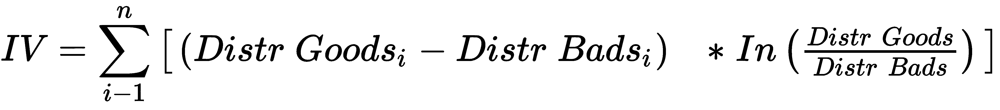

IV 统计量通常根据其值进行解释：

+   **< 0.02**：分析变量不能准确区分目标变量的类别

+   **0.02 到 0.1**：变量与目标变量有较弱的关系

+   **0.1 到 0.3**：变量显示出中等强度的关系

+   **> 0.3**：变量是目标的好预测器

根据这个值，这个变量本身具有很强的预测性。因此，这个变量可以用于我们的模型。让我们看看一个变量`IV`的计算示例：

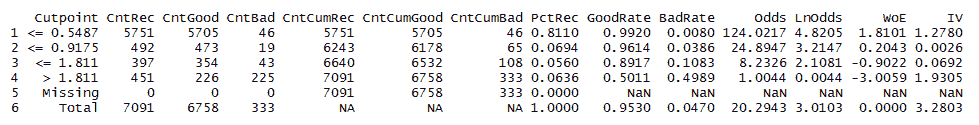

在先前的表中，我们可以看到`UBPRE006`变量的信息值计算，它代表贷款和损失预留总额除以银行的资产总额。

从广义上讲，当贷款发放时，其中一部分必须预留以备信用违约的情况；也就是说，银行在其损益表中做出两种类型的预留以覆盖所谓的信用风险：一种是贷款发放时做出的通用预留，另一种是针对未偿还信用的特定预留。

理论上，比率越高，银行破产的可能性就越大，因为如果预留水平高，这表明其贷款的信用质量将较低。

记住，在我们的样本中，失败银行的百分比为 4.70%。在这个例子中，`UBPRE006` 变量已被分为四个类别，以及一个额外的类别来衡量缺失值的水平。这可以在 `BadRate` 列中看到，作为失败银行的比率，其值低于 0.5487%。这非常低，仅代表该组中 0.80% 的银行。随着这个比率的增加，失败银行的比率也会更高。此外，在这个比率中没有银行有缺失值。

此表第一组中出现的值是根据此方程计算的：

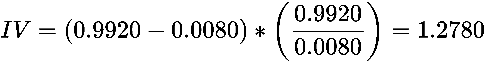

在此表格的 `IV` 列中所有值的总和可以在第 `6` 行的 `3.2803` 列中找到。

根据这个值，这个变量本身具有很强的预测性。因此，在模型中使用这个变量可能是有用的。

另一方面，**证据权重（WoE**）是一个与信息值非常密切相关的指标。此指标也包括在先前的表格中。WoE 的计算方法如下：


实际上，WoE 方程是 IV 指标的一部分。如果 *良好到不良* 比率的优势为 1，则 WoE 的值将为 0。

如果一个组中 *不良* 的百分比大于 *良好* 的百分比，则优势比将小于 1，WoE 将是负数；如果组中 *良好* 的数量大于 *不良*，则 WoE 值将是正数。

通常，WoE 的正值表示被放入该组的银行比样本中所有银行的平均状况更稳健。另一方面，负值越高，该组中的银行风险越大。

我们将计算训练集中每个变量的信息值。`smbinning` 包对此非常有用。

如已所见，一个重要步骤是分组变量，这个包会自动完成。

我们将进行两个不同的实验。因此，在缺失值插补前后，我们将计算训练集的信息值。我们将在本节后面讨论这些实验背后的原因。

此包假设如果一家银行稳健，则目标变量应取值为 1，否则为 0，这与我们在之前步骤中所做的正好相反。因此，第一步包括反转目标值：

```py
aux_original<-train
aux_original$Defaultf<-as.numeric(as.character(aux_original$Default))
aux_original$Defaultf<-ifelse(aux_original$Default==1,0,1)
aux_nomiss<-train_nomiss
aux_nomiss$Defaultf<-as.numeric(as.character(aux_nomiss$Default))
aux_nomiss$Defaultf<-ifelse(aux_nomiss$Default==1,0,1)
```

接下来，我们运行以下代码（这是一个非常耗时的过程）：

```py
library(smbinning)
table_iv<-matrix("NA",0,5)
table_iv<-data.frame(table_iv)
colnames(table_iv)<-c("Char","IV_original","Process_original","IV_nomiss","Process_nomiss")

 for (var in 1:length(aux_original[,2:1408]))
 {
 variable<-colnames(aux_original)[var+1]
 aux_original2<-aux_original[,c(variable,"Defaultf")]
 aux_nomiss2<-aux_nomiss[,c(variable,"Defaultf")]
 temp1<-smbinning.sumiv(aux_original2, "Defaultf")
 temp2<-smbinning.sumiv(aux_nomiss2, "Defaultf")
 colnames(temp1)<-c("Char","IV_original","Process_original")
 colnames(temp2)<-c("Char","IV_nomiss","Process_nomiss")
 temp2$Char<-NULL
 temp1<-cbind(temp1,temp2)
 table_iv<-rbind(table_iv,temp1)
 }
```

之前的代码创建了一个表格，其中将存储信息值（`table_iv`）。然后，对于 `train` 数据集中的每个变量，使用 `smbinning.sumiv` 函数计算信息值。

一旦过程完成，就会创建工作区备份：

```py
save.image("Data8.RData")
```

让我们看看结果：

```py
head(table_iv)
 ## Char IV_original      Process_original IV_nomiss
 ## 1 UBPR1795      2.6138    Numeric binning OK    2.6138
 ## 2 UBPR4635      2.5253    Numeric binning OK    2.5253
 ## 3 UBPRC233          NA No significant splits        NA
 ## 4 UBPRD582          NA    Uniques values < 5        NA
 ## 5 UBPRE386          NA No significant splits        NA
 ## 6 UBPRE388      0.5853    Numeric binning OK    0.5622
 ##          Process_nomiss
 ## 1    Numeric binning OK
 ## 2    Numeric binning OK
 ## 3 No significant splits
 ## 4    Uniques values < 5
 ## 5 No significant splits
 ## 6    Numeric binning OK
```

在这个表中，我们展示了在缺失值插补前后训练样本中每个变量的信息值。

在信息值之后，一列告诉我们计算状态。这里可能显示不同的消息如下：

+   `数值分箱正常`：信息值已正确计算，并且至少可以在变量中区分出两个不同的组，以区分*好*银行和*坏*银行。

+   `无显著分割`：由于变量无法区分银行的未来偿债能力，因此不计算信息值。未检测到银行的不同组。

+   `唯一值少于 5`：一个变量具有少于五个不同的值。在这种情况下，不计算信息值。

结果取决于缺失值之前是否已处理或是否包含在示例中：

```py
table(table_iv$Process_original)
 ##
 ##    Numeric binning OK No significant splits    Uniques values < 5
 ##                   522                   807                    78
table(table_iv$Process_nomiss)
 ##
 ##    Numeric binning OK No significant splits    Uniques values < 5
 ##                   539                   790                    78
```

`smbinning`包将缺失值视为一个新类别，在某些情况下，这可能包含相关信息或与我们的目标变量中的一个类别更相关。

重要的是要意识到缺失变量的插补意味着对您的数据的一种限制。

让我们检查这个简单决策对预测能力的影响。计算如下，存在或不存在缺失值的`IV`差异：

```py
diff_iv<-table_iv[complete.cases(table_iv) & table_iv$Process_original=="Numeric binning OK" &table_iv$Process_nomiss=="Numeric binning OK" ,]

diff_iv$diff<-(diff_iv$IV_nomiss - diff_iv$IV_original)
hist(diff_iv$diff, border=TRUE , col=rgb(0.8,0.2,0.8,0.7) , main="")
```

让我们看看输出结果：

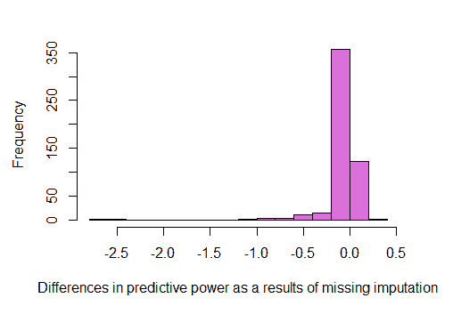

这里是总结统计信息：

```py
summary(diff_iv$diff)
 ##     Min.  1st Qu.   Median     Mean  3rd Qu.     Max.
 ## -2.64110 -0.03052  0.00000 -0.05247  0.00000  0.22570
```

根据总结统计信息，平均而言，缺失值插补会降低变量的预测能力或信息值 5.247%。在某些情况下，变量甚至会增加预测能力。

我们可以根据其信息值对变量的预测能力进行分类。我们将考虑之前解释的阈值来定义变量是否显示强大的、中等的或弱的预测能力：

```py
table_iv$IV_Category<-ifelse(table_iv$IV_nomiss >= 0.3, "1:Strong", ifelse(table_iv$IV_nomiss >= 0.1, "2:Medium","3:Weak"))

table(table_iv$IV_Category)
 ##
 ## 1:Strong 2:Medium   3:Weak
 ##      358      114       67
```

在这一步，我们可以移除预测能力低的变量。因此，从数据集中我们拥有的超过一千个变量中，我们只会选择被分类为`强`或`中`的变量：

```py
table_iv<-table_iv[complete.cases(table_iv) & table_iv$IV_Category != "3:Weak",]
```

尽管存在限制，我们仍将使用之前已处理缺失值的数据库：

```py
train<-train_nomiss
test<-test_nomiss
```

通常，对可能作为多元模型一部分的变量进行单变量转换可以提高其区分能力。

变量转换有助于减轻异常值对模型开发的影响，并捕捉变量与目标之间的非线性关系。

信用风险中最常见的做法之一是将变量转换为不同的类别，然后为每个类别分配其对应的 WoE 值。让我们看看这个例子。再次，使用`smbinning`包。

对于这一点，我们首先需要将目标值转换为由于包限制而具有的相反值：

```py
train$Defaultf<-as.numeric(as.character(train$Default))
train$Defaultf<-ifelse(train$Default==1,0,1)

test$Defaultf<-as.numeric(as.character(test$Default))
test$Defaultf<-ifelse(test$Default==1,0,1)
```

我们将`smbinning`函数应用于`UBPRD486`变量或“一级杠杆资本”。从监管者的角度来看，“一级”比率代表银行财务实力的核心指标。比率越高，银行的偿付能力和实力就越强。

首先，我们分析这个变量在失败和非失败银行中的分布情况：

```py
boxplot(train$UBPRD486~train$Default, horizontal=T, frame=F, col="lightgray",main="Tier One Leverage Ratio Distribution")
```

这是“一级”比率分布图：

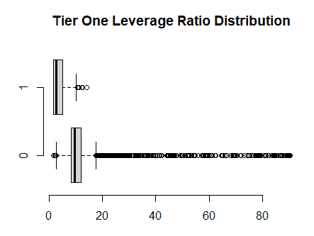

通常情况下，根据之前的截图，失败银行在这个比率中显示的值较低。应用`smbinning`函数，创建了一个对象，并进行了变量分类。

可以进行以下一些图形分析：

```py
smbinning.plot(result,option="dist")
```

以下截图很好地描述了分类情况：

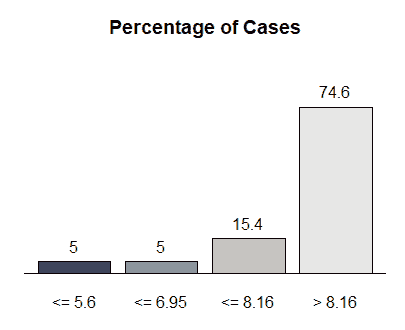

在这个变量中，74.6%的银行显示的值高于 8.16。让我们看看按组划分的失败银行百分比：

```py
smbinning.plot(result,option="badrate")
```

下面的结果图显示，在比率值低于或等于**5.6**的银行中观察到较高的不良率：

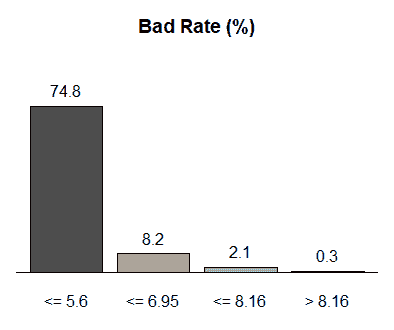

如注释所述，前面的截图显示，比率值越低，失败银行的数目就越高。这个变量非常有预测性，因为它很容易通过收集大量失败银行来找到组。因此，第一组中包含的 74.8%的银行破产了。也有可能通过运行以下代码来绘制每个组的`WoE`值：

```py
smbinning.plot(result,option="WoE")
```

前面的代码提供了以下截图，其中显示了证据值的权重：

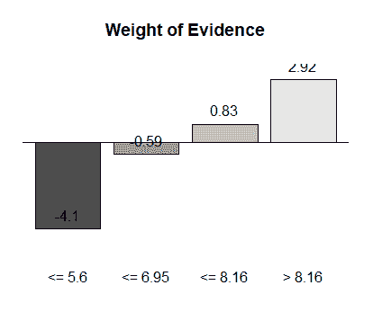

对于一些信用申请，随着评分模型的发展，将每个比率的原始值替换为对应证据值的权重，这是一种非常常见的做法，如图所示。例如，值低于或等于 5.6 的将被替换为-4.1。因此，WoE 变量随后用于训练模型，使用逻辑回归，这是最常见的方法。

`smbinning`包还帮助将原始变量转换为相应的组。根据我的经验，我没有发现很多证据表明 WoE 转换真的能提高模型的性能。因此，在这种情况下，我们不会转换我们的变量。

弱变量也被移除了：

```py
relevant_vars<-as.vector(table_iv$Char)
relevant_vars<-c("ID_RSSD","Default","Defaultf", relevant_vars)
train<-train[,relevant_vars]
test<-test[,relevant_vars]
```

以下是将工作区保存的步骤：

```py
save.image("Data9.RData")
```

我们可以继续过滤变量。到目前为止，我们数据集的维度如下：

```py
dim(train)
 ## [1] 7091  465
```

当面对回归或分类问题时，如果移除了高度相关的属性，一些模型的表现会更好。相关性可以通过以下方式获得：

```py
correlations <- cor(train[,4:ncol(train)])
```

属于 caret 包的 `findCorrelation` 函数在相关矩阵上执行搜索，并输出包含整数的向量。这些整数对应于如果删除，可以减少成对相关性的列。因此，此函数寻找具有更高相关性的属性。

它通过考虑成对相关列的绝对值来工作。它移除具有最大平均绝对值的变量，这是通过比较高度相关的变量来计算的：

```py
## Loading required package: lattice
highlyCorrelated <- data.frame("Char"=findCorrelation(correlations,      cutoff=0.75,names = TRUE))
```

截断选项是选择高度相关变量的阈值：

```py

correlated_vars<-as.vector(highlyCorrelated$Char)
non_correlated_vars<-!(colnames(train) %in% correlated_vars)

train<-train[,non_correlated_vars]
test<-test[,non_correlated_vars]
```

数据集中总共剩下 `262` 个变量：

```py
ncol(train)
 #262
```

# 包装方法

如本节开头所述，**包装方法**评估变量子集以检测变量之间可能的相互作用，这比过滤方法提前一步。

在包装方法中，在预测模型中使用多个变量的组合，并根据模型精度对每个组合给出分数。

在包装方法中，分类器通过作为黑盒的多变量组合进行迭代训练，其唯一输出是重要特征的排名。

# Boruta 包

R 中最知名的包装包之一称为 `Boruta`。此包主要基于 **随机森林** 算法。

虽然此算法将在本书的后续部分进行更详细的解释，但由 Breiman 于 2001 年提出的 Boruta 是一种挖掘数据和在样本上生成许多决策树并通过多数投票结合的工具。随机森林创建不同决策树的目的，是为了从不同类别的数据中获得最佳可能的分类。

随机森林的一个成功应用实例是在信用卡欺诈检测系统中。

在 `Boruta` 包中，使用数据集中其他变量的多个组合创建随机变量。

然后将新变量与原始变量结合，并训练不同的随机森林。通过比较随机变量与原始变量的重要性，获得不同特征的重要性。

只有比随机变量重要性更高的变量才被认为是重要的。如果变量数量很多，`Boruta` 包将非常耗时，尤其是因为算法会创建更多变量来对其特征进行排名。

让我们在 R 中启动 `Boruta` 算法。首先，建立一个 `seed` 以使练习可重复：

```py
set.seed(123)
```

然后从训练数据集创建一个辅助表，并且没有删除相关变量：

```py
aux<-train
aux$`ID_RSSD`<-NULL
aux$Defaultf<-NULL
```

最后，启动 `Boruta` 算法（这非常耗时，可能需要超过一小时）：

```py
library(Boruta)
wrapper <- Boruta(Default ~. , data = aux, doTrace = 2,maxRuns = 100)
```

当打印 `wrapper` 对象时，它提供了数据集中特征的重要性。

`Boruta` 算法对我们数据库中的任何变量得出结论：

```py
print(wrapper)
 ## Boruta performed 99 iterations in 1.15968 hours.
 ##  85 attributes confirmed important: UBPR2150, UBPR7402, UBPRA222,
 ## UBPRD488, UBPRD646 and 80 more;
 ##  139 attributes confirmed unimportant: UBPR0071, UBPR1590,
 ## UBPR1616, UBPR1658, UBPR1661 and 134 more;
 ##  35 tentative attributes left: UBPR2366, UBPR3816, UBPRE083,
 ## UBPRE085, UBPRE140 and 30 more;
```

许多变量被分类为重要或不重要，但在其他情况下，变量被分配到尝试性类别：

```py
table(wrapper$finalDecision)
 ##
 ## Tentative Confirmed  Rejected
 ##        35        85       139
```

尝试性特征的重要性几乎与它们最好的随机特征相同。在这种情况下，`Boruta`无法就默认的随机森林迭代次数做出自信的决定。

在继续之前，让我们先备份工作空间：

```py
save.image("Data10.RData")
```

通过`TentativeRoughFix`函数，可以对尝试性变量做出决定。为此，将中值特征 Z 分数与最重要的随机特征的中值 Z 分数进行比较，并做出决定：

```py
wrapper <- TentativeRoughFix(wrapper)
print(wrapper)
 ## Boruta performed 99 iterations in 1.15968 hours.
 ## Tentatives roughfixed over the last 99 iterations.
 ##  108 attributes confirmed important: UBPR2150, UBPR3816, UBPR7402,
 ## UBPRA222, UBPRD488 and 103 more;
 ##  151 attributes confirmed unimportant: UBPR0071, UBPR1590,
 ## UBPR1616, UBPR1658, UBPR1661 and 146 more;
```

因此，根据此包，我们的训练样本将减少到只有`99`个变量。

`Boruta`不是唯一的包装方法。`caret`包还包括一个包装过滤器。在这种情况下，该算法被称为**递归特征消除**（**RFE**）。

在此算法中，首先使用所有独立变量训练一个模型，并计算特征的重要性。将不那么重要的变量（*n*）从样本中移除，并再次训练模型。这一步骤重复多次，直到所有变量都被使用。在每个迭代中，评估模型的性能。在性能最佳的模型中确定最佳预测变量。

在此算法中，除了随机森林（`rfFuncs`）之外，还有许多可用于训练的模型，例如以下这些：

+   线性回归，`lmFuncs`函数

+   朴素贝叶斯函数，`nbFuncs`

+   带袋的树函数，`treebagFuncs`

让我们看看这个算法如何在 R 中使用：

1.  首先，固定一个`seed`以获得相同的结果：

```py
library(caret)
set.seed(1234)
```

1.  将目标变量转换为`factor`。因此，算法用于分类。如果不这样做，则假定是一个回归问题：

```py
aux$Default<-as.factor(aux$Default)
```

1.  最后，运行算法。随机森林被选为具有 10 折验证的分类器（此执行也很耗时）：

```py
rfe_control <- rfeControl(functions=rfFuncs, method='cv', number=10)
recursive <- rfe(aux[,2:260], aux[,1], rfeControl=rfe_control)
```

如果打印`recursive`对象，将显示最重要的变量：

```py
print(recursive, top=10)
 ##
 ## Recursive feature selection
 ##
 ## Outer resampling method: Cross-Validated (10 fold)
 ##
 ## Resampling performance over subset size:
 ##
 ##  Variables Accuracy  Kappa AccuracySD KappaSD Selected
 ##          4   0.9848 0.8224   0.005833 0.06490        
 ##          8   0.9866 0.8451   0.004475 0.04881        
 ##         16   0.9884 0.8685   0.005398 0.06002        
 ##        259   0.9886 0.8659   0.004019 0.04617        *
 ##
 ## The top 10 variables (out of 259):
 ##    UBPRD488, UBPRE626, UBPRE217, UBPRE170, UBPRE392, UBPRE636, UBPRE883, UBPRE394, UBPRE370, UBPRE074
plot(recursive, type=c("g", "o"), cex = 1.0)
```

将获得以下输出：

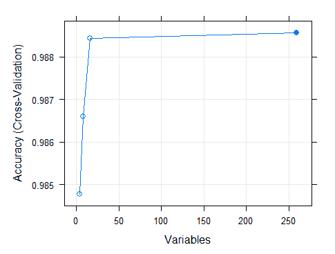

让我们获取所有变量的排名：

```py
head(predictors(recursive))
 ##   [1] "UBPRD488" "UBPRE626" "UBPRE217" "UBPRE170" "UBPRE392"           "UBPRE636
head(recursive$resample, 10)
 ##    Variables  Accuracy     Kappa .cell1 .cell2 .cell3 .cell4 Resample
 ## 4        259 0.9915374 0.8988203    675      1      5     28   Fold01
 ## 8        259 0.9915374 0.8988203    675      1      5     28   Fold02
 ## 12       259 0.9830748 0.7976887    672      3      9     25   Fold03
 ## 16       259 0.9887165 0.8690976    673      3      5     28   Fold04
 ## 20       259 0.9929577 0.9169746    676      0      5     29   Fold05
 ## 24       259 0.9901269 0.8801237    675      1      6     27   Fold06
 ## 28       259 0.9873061 0.8590115    671      5      4     29   Fold07
 ## 32       259 0.9859155 0.8314180    674      2      8     26   Fold08
 ## 36       259 0.9929478 0.9169536    675      1      4     29   Fold09
 ## 40       259 0.9816384 0.7903799    669      6      7     26   Fold10
```

如您所见，我们成功获得了变量的排名。尽管如此，用户必须具体选择最终模型中将包含多少最终变量。

在这种情况下，只考虑`Boruta`包执行后的结果变量：

```py
 predictors<-data.frame("decision"=wrapper$finalDecision)

 predictors<-cbind("variable"=row.names(predictors),predictors)

 predictors<-                    as.vector(predictors[predictors$decision=="Confirmed","variable"])

 train<-train[,c('ID_RSSD','Default',predictors)]

 test<-test[,c('ID_RSSD','Default',predictors)]
```

我们的样本已经减少：

```py
ncol(train)
 ## [1] 110
save.image("Data11.RData")
```

# 嵌入式方法

过滤器和包装方法之间的主要区别在于，在过滤器方法中，例如**嵌入式方法**，你不能将学习和特征选择部分分开。

正则化方法是嵌入式特征选择方法中最常见的类型。

在此类分类问题中，逻辑回归方法无法处理当变量高度相关时的多重共线性问题。当观测数数量不比协变量数量 *p* 多很多时，可能会有很多变异性。因此，这种变异性甚至可以通过简单地添加更多参数来增加似然，从而导致过拟合。

如果变量高度相关或存在多重共线性，我们预计模型参数和方差会被夸大。高方差是因为错误指定的模型包含了冗余的预测变量。

为了解决这些局限性，一些方法已经出现：岭回归、Lasso 和弹性网络是最常见的方法。

# 岭回归

在 **Ridge regression** 中，回归系数的大小基于 L2 范数进行惩罚：

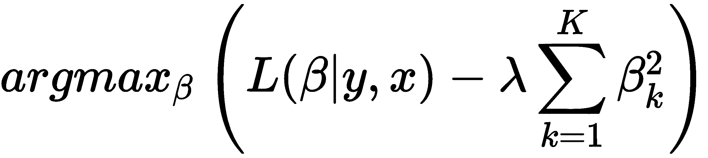

这里，*L(B|y,x)* 代表逻辑回归的似然函数，λ 是调整参数，用于控制这两个项对回归系数估计的相对影响。

# 岭回归的局限性

岭回归将所有预测变量包含在最终模型中。然而，当变量数量 *p* 很大时，它通常在模型解释上显示出问题。

# Lasso

**Lasso** 代表正则化的另一种选择，并且它克服了岭回归的缺点，减少了最终模型中的预测变量数量。这次，它使用 L1 惩罚来惩罚回归系数的大小：

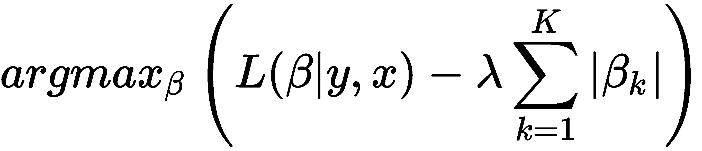

当 λ 足够大时，它迫使一些系数估计值恰好等于零，从而获得更简洁的模型。

# Lasso 的局限性

有时，Lasso 也显示出重要的弱点：如果协变量的数量 *p* 远远大于观测数的数量，选定的变量数量将受到观测数数量的限制。

# 弹性网络

**Elastic net** 尝试克服岭回归和 Lasso 模型的局限性，并在变量高度相关时表现良好。

弹性网络使用所有变量来训练模型，但它也试图结合两种先前使用的方法（岭回归和 Lasso 回归）的优点。因此，弹性网络根据 L1 范数和 L2 范数对回归系数的大小进行惩罚，如下所示：

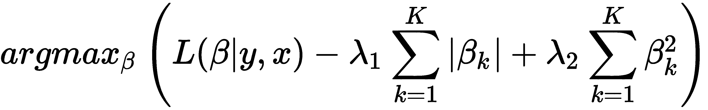

# 弹性网络的缺点

弹性网络（Elastic net）涉及选择 λ[1] 和 λ[2] 作为模型良好性能的关键值。这些参数通常通过交叉验证技术获得。从这些方法中，Lasso 和弹性网络通常用于特征选择。目前，我们的数据集中有 96 个变量；我们决定不减少变量的数量。

# 维度降低

**维度投影**，或特征投影，包括将高维空间中的数据转换为低维空间。

高维数大大增加了计算复杂度，甚至可能增加过拟合的风险。

**降维**技术对特征选择也很有用。在这种情况下，变量通过不同的组合转换为其他新变量。这些组合通过较少的变量从复杂的数据库中提取和总结相关信息。

存在着不同的算法，以下是最重要的：

+   **主成分分析**（**PCA**）

+   Sammon 映射

+   **奇异值分解**（**SVD**）

+   Isomap

+   **局部线性嵌入**（**LLE**）

+   拉普拉斯特征映射

+   **t 分布随机邻域嵌入**（**t-SNE**）

尽管在诸如故障预测模型或信用风险等情况下，降维并不常见，但我们将看到我们数据中的一个例子。

我们还将看到 PCA 和 t-SNE 的应用，它们是最常用的算法。

PCA 是一种通过变量的线性变换来提取数据集上重要变量的方法。因此，我们可以将主成分定义为原始变量的归一化线性组合。

第一主成分是变量的线性组合，它捕捉了数据集中最大的方差。第一成分中捕捉到的方差越大，该成分捕捉到的信息就越多。第一成分只用一行就能最好地总结我们数据中的最大信息。第二和后续的主成分也是原始变量的线性组合，它们捕捉了数据中剩余的方差。

当变量高度相关时，PCA 也被使用。这种方法的主要特性之一是不同组件之间的相关性为零。

让我们看看在 R 中的实现。为此，我们使用`rstat`包中包含的`prcomp`函数：

```py
pca <- prcomp(train[,3:ncol(train)], retx=TRUE, center=TRUE, scale=TRUE)
```

在实现 PCA 方法之前，变量应该被标准化。这意味着我们应该确保变量具有等于零的均值和等于 1 的标准差。

这可以通过使用同一函数中的`scale`和`center`选项作为参数来完成：

```py
names(pca)
## [1] "sdev"     "rotation" "center"   "scale"    "x"
```

`center`和`scale`向量包含我们所使用的变量的均值和标准差。

旋转测量返回主成分。我们获得与样本中变量相同数量的主成分。

让我们打印出这些组件的外观。例如，前四个组件的第一行如下所示：

```py
pca$rotation[1:10,1:4]
 ##                  PC1          PC2         PC3          PC4
 ## UBPRE395 -0.05140105  0.027212743  0.01091903 -0.029884263
 ## UBPRE543  0.13068409 -0.002667109  0.03250766 -0.010948699
 ## UBPRE586  0.13347952 -0.013729338  0.02583513 -0.030875234
 ## UBPRFB60  0.17390861 -0.042970061  0.02813868  0.016505787
 ## UBPRE389  0.07980840  0.069097429  0.08331793  0.064870471
 ## UBPRE393  0.08976446  0.115336263  0.02076018 -0.012963786
 ## UBPRE394  0.16230020  0.119853462  0.07177180  0.009503902
 ## UBPRE396  0.06572403  0.033857693  0.07952204 -0.005602078
 ## UBPRE417 -0.06109615 -0.060368186 -0.01204455 -0.155802734
 ## UBPRE419  0.08178735  0.074713474  0.11134947  0.069892907
```

每个组件解释了总方差的一部分。每个组件解释的方差比例可以按以下方式计算：

1.  让我们先计算每个组件的方差：

```py
pca_variances =pca$sdev²
```

1.  然后将每个方差除以成分方差的和：

```py
prop_var_explained <- pca_variances/sum(pca_variances)

head(prop_var_explained,10)

 ##  [1] 0.10254590 0.06510543 0.04688792 0.04055387 0.03637036          0.03576523
 ##  [7] 0.02628578 0.02409343 0.02305206 0.02091978
```

第一主成分解释了大约 10%的方差。第二成分解释了 6%的方差，以此类推。

我们可以使用此代码图形化地观察总方差及其贡献：

```py
plot(pca, type = "l",main = " Variance of Principal components")
```

上述代码生成了以下内容：

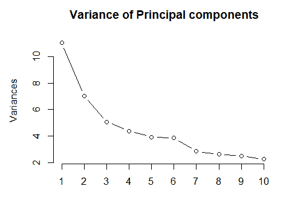

让我们运行代码来绘制方差图：

```py
plot(prop_var_explained, xlab = "Principal Component",
              ylab = "Proportion of Variance Explained",
              type = "b")
```

上述代码生成了以下图形：

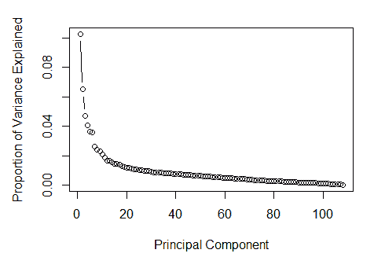

前面的截图有助于确定解释总方差重要部分的变量数量或主成分数量。

因此，这些成分可以用来建模，而不是使用完整的变量列表。绘制累积解释方差很有趣：

```py
plot(cumsum(prop_var_explained), xlab = "Principal Component",
 ylab = "Cumulative Proportion of Variance Explained",
 type = "b")
```

上述代码生成了以下图形：

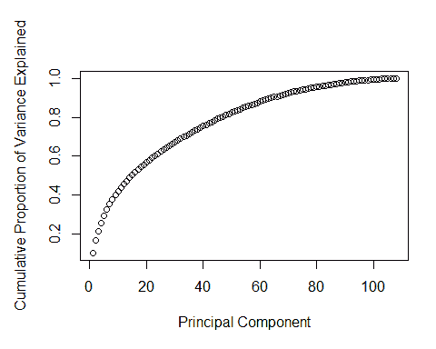

根据前面的截图，前 20 个成分解释了我们数据集中大约 60%的总方差。

我们可以选择使用这 20 个成分来创建我们的模型。这种方法在信用风险模型中并不常见，所以我们不会使用这些转换。

然而，评估我们的数据集的外观很重要。在下面的截图中，我们使用前两个成分展示了数据的图形表示。

此外，我们根据相应的目标变量在图中对每个银行进行分类。这次，我们使用`ggfortify`包：

```py
library(ggfortify)

train$Default<-as.factor(train$Default)
autoplot(pca, data = train, colour = 'Default'
```

此截图显示了失败和非失败银行的分类图：

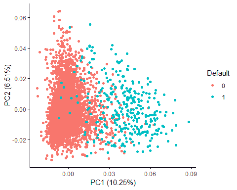

只看两个成分非常有趣。尽管这些成分只解释了大约 17%的总方差，但失败和非失败的银行在某种程度上是区分开的。

# 降维技术

您应该考虑，主成分假设变量的线性变换，但还有其他非线性降维技术。

对我来说，最有趣的技巧之一是 Laurens van der Maaten 开发的 t-SNE，他说：

“作为一个理智的检查，尝试对你的数据进行 PCA，将其降低到二维。如果这也给出糟糕的结果，那么可能你的数据一开始就没有太多好的结构。如果 PCA 运行良好但 t-SNE 不行，我相当确信你做错了什么。”

让我们看看 t-SNE 在我们数据集上的应用示例。通常，建议您设置一个`seed`：

```py
set.seed(1234)
```

我们需要使用`Rtsne`包。此包包含执行算法的`Rtsne`函数。最重要的参数如下：

+   `pca`：这确定在运行 t-SNE 之前是否执行主成分分析。

+   `perplexity`：这是信息的一个度量（定义为香农熵的 2 次方）。`perplexity`参数确定了每个观察中最近邻的数量。这个参数对算法很有用，因为它使它能够在你的数据观察中找到局部和全局关系之间的平衡。

运行算法的代码如下：

```py
library(Rtsne)

tsne= Rtsne(as.matrix(train[,3:ncol(train)]), check_duplicates=TRUE, pca=TRUE, perplexity=75, theta=0.5, dims=2,max_iter = 2000,verbose=TRUE)
```

这个过程需要几分钟才能完成。有关算法工作原理的更多信息也包含在包文档及其参考文献中。

通常，完整的数据集被简化为只有两个向量：

```py
tsne_vectors = as.data.frame(tsne$Y)

 head(tsne_vectors)
 ##           V1          V2
 ## 1  -4.300888 -14.9082526
 ## 2   4.618766  44.8443129
 ## 3  21.554283   3.2569812
 ## 4  45.518532   0.7150365
 ## 5  12.098218   4.9833460
 ## 6 -14.510530  31.7903585
```

让我们根据其向量绘制我们的训练数据集：

```py
ggplot(tsne_vectors, aes(x=V1, y=V2)) +
   geom_point(size=0.25) +
   guides(colour=guide_legend(override.aes=list(size=6))) +
   xlab("") + ylab("") +
   ggtitle("t-SNE") +
   theme_light(base_size=20) +
   theme(axis.text.x=element_blank(),
         axis.text.y=element_blank()) +
   scale_colour_brewer(palette = "Set2")
```

前面的代码生成了以下图表：

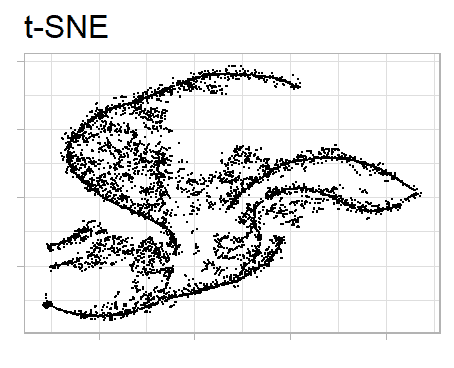

现在让我们再次绘制它，为每个目标值分配一个颜色，以及失败和未失败的银行：

```py
plot(tsne$Y, t='n', main="tsne",xlab="Vector X",ylab="Vector y")
 text(tsne$Y, labels=as.vector(train$Default), col=c('red', 'blue')[as.numeric(train$Default)])
```

前面的代码生成了以下图表：

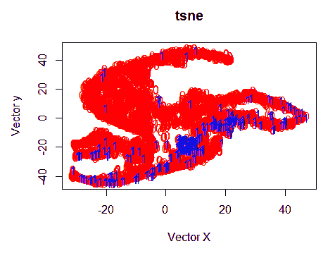

我们可以看到许多失败的银行被放置在结果的双变量地图的同一部分。然而，t-SNE 的一个主要弱点是算法的黑盒性质。基于结果无法对额外数据进行推断，这在使用 PCA 时是不会发生的。

t-SNE 主要用于探索性数据分析，它也被用作聚类算法的输入。

在这个实际案例中，我们试图在信用风险分析过程中保持准确，我们将忽略 PCA 和 t-SNE 的结果，并继续使用我们的原始维度。

一旦我们选定了最具有预测性的变量，我们将尝试使用不同的算法将它们结合起来。目标是开发一个具有最高准确性的模型来预测银行未来的破产。

在继续之前，让我们保存工作空间：

```py
rm(list=setdiff(ls(), c("Model_database","train","test","table_iv")))

save.image("~/Data12.RData")
```

# 摘要

在本章中，我们看到了如何通过单变量分析减少我们问题数据的空间样本，并分析了数据。因此，在下一章中，我们将看到这些变量如何结合以获得一个准确的模型，其中将测试多个算法。
