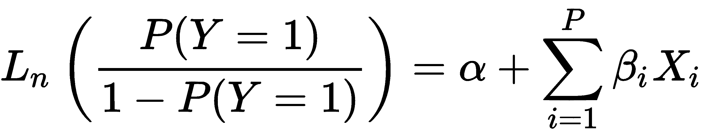
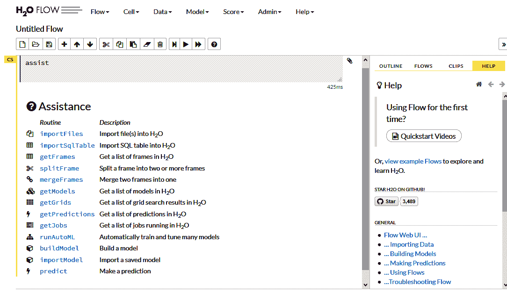
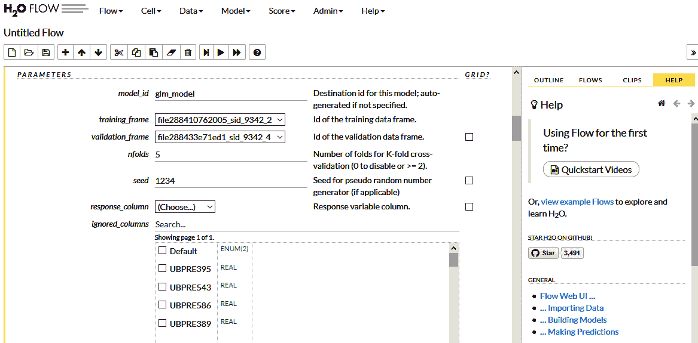
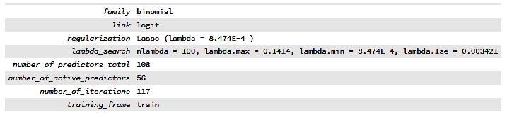
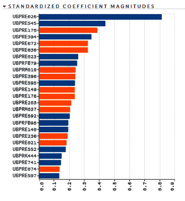
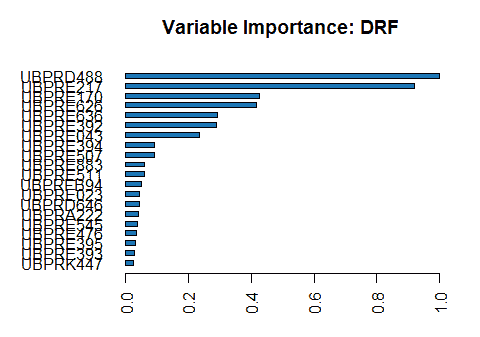
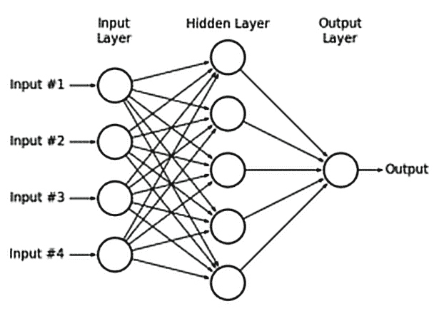
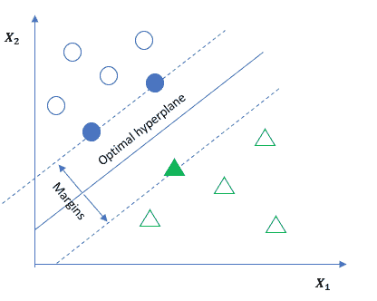
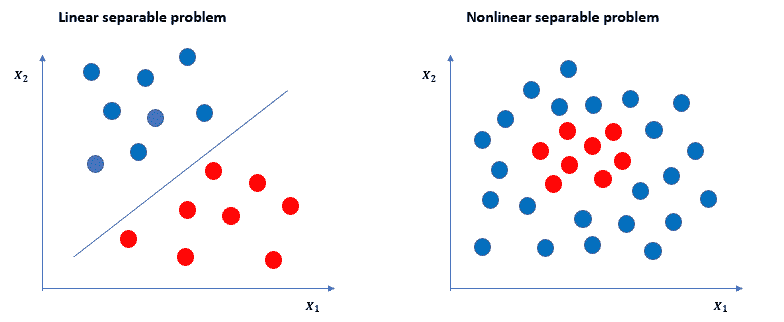
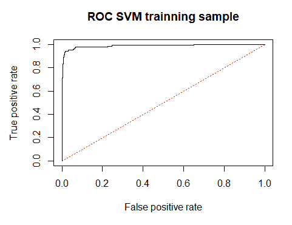

# 预测银行失败 - 多元分析

在本章中，我们将应用不同的算法，目的是通过我们的预测因子的组合来获得一个好的模型。在信用风险应用中，如信用评分和评级，最常用的算法是逻辑回归。在本章中，我们将看到其他算法如何应用于解决逻辑回归的一些弱点。

在本章中，我们将介绍以下主题：

+   逻辑回归

+   正则化方法

+   测试随机森林模型

+   梯度提升

+   神经网络中的深度学习

+   支持向量机

+   集成方法

+   自动机器学习

# 逻辑回归

从数学上讲，二元逻辑模型有一个具有两个分类值的因变量。在我们的例子中，这些值与银行是否有偿付能力相关。

在逻辑模型中，**对数几率**指的是一个类别的对数几率，它是一个或多个独立变量的线性组合，如下所示：



逻辑回归算法的系数（beta 值，*β*）必须使用最大似然估计来估计。最大似然估计涉及获取回归系数的值，以最小化模型预测的概率与实际观察案例之间的误差。

逻辑回归对异常值的存在非常敏感，因此应避免变量之间的高相关性。在 R 中应用逻辑回归的方法如下：

```py
set.seed(1234)
LogisticRegression=glm(train$Default~.,data=train[,2:ncol(train)],family=binomial())
 ## Warning: glm.fit: fitted probabilities numerically 0 or 1 occurred
```

代码运行没有问题，但出现了一个警告信息。如果变量高度相关或存在多重共线性，模型参数和方差膨胀是预期的。

高方差不是由于准确的或好的预测因子，而是由于一个未指定且有冗余预测因子的模型。因此，通过简单地添加更多参数来增加最大似然，这会导致过拟合。

我们可以使用`summary()`函数观察模型的参数：

```py
summary(LogisticRegression)
 ## 
 ## Call:
 ## glm(formula = train$Default ~ ., family = binomial(), data =         train[, 
 ##     2:ncol(train)])
 ## 
 ## Deviance Residuals: 
 ##     Min       1Q   Median       3Q      Max  
 ## -3.9330  -0.0210  -0.0066  -0.0013   4.8724  
 ## 
 ## Coefficients:
 ##                   Estimate     Std. Error z value Pr(>|z|)  
 ## (Intercept) -11.7599825009   6.9560247460  -1.691   0.0909 .
 ## UBPRE395     -0.0575725641   0.0561441397  -1.025   0.3052  
 ## UBPRE543      0.0014008963   0.0294470630   0.048   0.9621  
 ##         ....                             .....                           ....                            ....             ....
 ## UBPRE021     -0.0114148389   0.0057016025  -2.002   0.0453 *
 ## UBPRE023      0.4950212919   0.2459506994   2.013   0.0441 *
 ## UBPRK447     -0.0210028916   0.0192296299  -1.092   0.2747  
 ## ---
 ## Signif. codes:  0 '***' 0.001 '**' 0.01 '*' 0.05 '.' 0.1 ' ' 1
 ## 
 ## (Dispersion parameter for binomial family taken to be 1)
 ## 
 ##     Null deviance: 2687.03  on 7090  degrees of freedom
 ## Residual deviance:  284.23  on 6982  degrees of freedom
 ## AIC: 502.23
 ## 
 ## Number of Fisher Scoring iterations: 13
```

我们可以看到，前一个表的最后一列中的大多数变量都是不显著的。在这种情况下，应该减少回归中的变量数量，或者遵循另一种方法，例如惩罚或正则化方法。

# 正则化方法

使用正则化方法有三种常见的方法：

+   Lasso

+   岭回归

+   弹性网络

在本节中，我们将看到这些方法如何在 R 中实现。对于这些模型，我们将使用`h2o`包。这个包提供了一个开源的预测分析平台，用于机器学习，基于内存参数，分布式、快速且可扩展。它有助于创建基于大数据的模型，并且由于其提高了生产质量，因此最适合企业应用。

有关`h2o`软件包的更多信息，请访问其文档[`cran.r-project.org/web/packages/h2o/index.html`](https://cran.r-project.org/web/packages/h2o/index.html)。

此软件包非常有用，因为它在一个软件包中总结了几个常见的机器学习算法。此外，这些算法可以在我们的计算机上并行执行，因为它非常快。该软件包包括广义线性朴素贝叶斯、分布式随机森林、梯度提升和深度学习等。

不需要具备高级编程知识，因为该软件包自带用户界面。

让我们看看这个软件包是如何工作的。首先，应该加载软件包：

```py
library(h2o)
```

使用`h2o.init`方法初始化 H2O。此方法接受可在软件包文档中找到的其他选项：

```py
h2o.init()
```

建立我们的模型的第一步是将我们的数据放入 H2O 集群/Java 进程。在此步骤之前，我们将确保我们的目标是作为`factor`变量考虑：

```py
train$Default<-as.factor(train$Default)

test$Default<-as.factor(test$Default)
```

现在，让我们将我们的数据上传到`h2o`集群：

```py
as.h2o(train[,2:ncol(train)],destination_frame="train")

as.h2o(test[,2:ncol(test)],destination_frame="test")
```

如果您关闭 R 并在稍后重新启动它，您将需要再次上传数据集，如前面的代码所示。

我们可以使用以下命令检查数据是否已正确上传：

```py
h2o.ls()

 ##     key
 ## 1  test
 ## 2 train
```

该软件包包含一个易于使用的界面，允许我们在浏览器中运行时创建不同的模型。通常，可以通过在网页浏览器中写入以下地址来启动界面，`http://localhost:54321/flow/index.html`。您将面对一个类似于以下截图的页面。在模型选项卡中，我们可以看到该软件包中实现的所有可用模型的列表：



首先，我们将开发正则化模型。为此，必须选择广义线性建模…。本模块包括以下内容：

+   高斯回归

+   泊松回归

+   二项式回归（分类）

+   多项式分类

+   伽马回归

+   有序回归

如以下截图所示，我们应该填写必要的参数来训练我们的模型：



我们将填写以下字段：

+   model_id：在这里，我们可以指定模型可以引用的名称。

+   training_frame：我们希望用于构建和训练模型的数据库可以在这里提及，因为这将是我们的训练数据集。

+   validation_frame：在这里，提到的数据集将用于检查模型的准确性。

+   nfolds：为了验证，我们需要在此处提及一定数量的折数。在我们的案例中，nfolds 的值是`5`。

+   seed：这指定了算法将使用的种子。我们将使用**随机数生成器**（**RNG**）为算法中需要随机数的组件提供随机数。

+   response_column：这是用作因变量的列。在我们的案例中，该列命名为 Default。

+   ignored_columns：在本节中，可以在训练过程中忽略变量。在我们的情况下，所有变量都被认为是相关的。

+   ignore_const_cols：这是一个标志，表示包应避免常数变量。

+   family：这指定了模型类型。在我们的情况下，我们想要训练一个回归模型，因此 family 应该固定为二项式，因为我们的目标变量有两个可能的值。

+   solver：这指定了要使用的求解器。我们不会更改此值，因为无论选择哪个求解器，都没有观察到显著差异。因此，我们将保持默认值。

+   alpha：在这里，您必须从 L1 到 L2 选择正则化分布的值。如果您选择 1，它将是一个 Lasso 回归。如果您选择 0，它将是一个 Ridge 回归。如果您选择 0 和 1 之间的任何值，您将得到 Lasso 和 Ridge 的混合。在我们的情况下，我们将选择 1。Lasso 模型的主要优点之一是减少变量的数量，因为训练模型将非相关变量的系数设为零，从而产生简单但同时又准确的模型。

+   lambda_search：此参数启动对正则化强度的搜索。

+   标准化：如果此标志被标记，则表示数值列将被转换，以具有零均值和零单位方差。

最后，构建模型按钮训练模型。尽管可以选择其他选项，但前面的规格已经足够：


我们可以看到模型训练得很快。查看按钮为我们提供了有关模型的一些有趣细节：

+   模型参数

+   得分历史

+   训练和验证样本的**接收者操作特征**（ROC）曲线

+   标准化系数幅度

+   交叉验证、训练和验证样本的增益/提升表

+   交叉验证模型

+   指标

+   系数

让我们看看一些主要结果：



如我们所见，我们的 Lasso 模型是用 108 个不同的变量训练的，但只有 56 个变量导致系数大于零的模型。

该模型提供了几乎完美的分类。在训练样本中，**曲线下面积**（AUC）达到 99.51%。在验证样本中，此值略低，为 98.65%。标准化变量也相关：



如果一个变量以蓝色显示，这表示系数是正的。如果是负的，颜色是橙色。

如我们所见，UBPRE626 看起来是一个重要的变量。它显示总贷款和租赁融资应收账款超过实际股本总额的次数。这里的正号意味着更高的比率，这也意味着银行在其运营中失败的概率更高。

根据这个图，前五个相关变量如下：

1.  UBPRE626：净贷款和租赁融资应收账款超过总股本次数

1.  UBPRE545：应计和未实现贷款及租赁总额，除以贷款和租赁损失准备金

1.  UBPRE170：总股本

1.  UBPRE394：其他建筑和土地开发贷款，除以平均总贷款和租赁

1.  UBPRE672：证券年度化实现收益（或损失）的四分之一，除以平均资产

在评估信用风险时，了解哪些变量最为重要以及这些变量的经济相关性非常重要。例如，如果非正常贷款或有问题贷款越多，银行的偿债能力就越高，那就没有意义了。我们并不关心模型中变量的经济意义，但这对于金融机构开发的一些模型来说是一个关键问题。如果变量没有预期的符号，它们必须从模型中移除。

在某些情况下，有必要测试不同的参数组合，直到获得最佳模型。例如，在最近训练的正则化模型中，我们可以尝试不同的 alpha 参数值。要同时测试不同的参数，需要使用代码执行算法。让我们看看如何做。这次我们将再次训练正则化模型，但这次使用一些代码。首先，我们从 `h2o` 系统中删除所有对象，包括最近创建的模型：

```py
h2o.removeAll()
 ## [1] 0
```

然后，我们再次上传我们的训练和验证样本：

```py
as.h2o(train[,2:ncol(train)],destination_frame="train")
as.h2o(test[,2:ncol(test)],destination_frame="test")
```

让我们编写我们的模型。创建一个空参数网格如下：

```py
grid_id <- 'glm_grid'
```

然后，我们在网格中分配不同的参数进行测试：

```py
hyper_parameters <- list( alpha = c(0, .5, 1) )
stopping_metric <- 'auc'
glm_grid <- h2o.grid(
     algorithm = "glm",
     grid_id = grid_id,
     hyper_params = hyper_parameters,
     training_frame = training,
     nfolds=5,
     x=2:110,
     y=1,
     lambda_search = TRUE,
     family = "binomial", seed=1234)
```

如我们所见，参数与我们用来训练先前模型的参数完全相同。唯一的区别是我们现在同时使用不同的 alpha 值，这对应于岭回归、Lasso 和弹性网络。模型使用以下代码进行训练：

```py
results_glm <- h2o.getGrid(
     grid_id = grid_id,
     sort_by = stopping_metric,
     decreasing = TRUE)
```

根据之前的代码，网格中的不同模型应该按照 AUC 指标排序。因此，我们对第一个模型感兴趣：

```py
best_GLM <- h2o.getModel(results_glm@model_ids[[1]])
```

让我们来看看这个模型的一些细节：

```py
best_GLM@model$model_summary$regularization
 ## [1] "Ridge ( lambda = 0.006918 )"
```

表现最好的模型是一个岭回归模型。模型的性能可以通过以下方式获得：

```py
perf_train<-h2o.performance(model = best_GLM,newdata = training)
perf_train
 ## H2OBinomialMetrics: glm
 ##
 ## MSE:  0.006359316
 ## RMSE:  0.07974532
 ## LogLoss:  0.02561085
 ## Mean Per-Class Error:  0.06116986
 ## AUC:  0.9953735
 ## Gini:  0.990747
 ## R²:  0.8579102
 ## Residual Deviance:  363.213
 ## AIC:  581.213
 ##
 ## Confusion Matrix (vertical: actual; across: predicted) for F1-              optimal threshold:
 ##           0   1    Error      Rate
 ## 0      6743  15 0.002220  =15/6758
 ## 1        40 293 0.120120   =40/333
 ## Totals 6783 308 0.007756  =55/7091
 ##
 ## Maximum Metrics: Maximum metrics at their respective thresholds
 ##                         metric threshold    value idx
 ## 1                       max f1  0.540987 0.914197 144
 ## 2                       max f2  0.157131 0.931659 206
 ## 3                 max f0point5  0.617239 0.941021 132
 ## 4                 max accuracy  0.547359 0.992244 143
 ## 5                max precision  0.999897 1.000000   0
 ## 6                   max recall  0.001351 1.000000 383
 ## 7              max specificity  0.999897 1.000000   0
 ## 8             max absolute_mcc  0.540987 0.910901 144
 ## 9   max min_per_class_accuracy  0.056411 0.972973 265
 ## 10 max mean_per_class_accuracy  0.087402 0.977216 239
 ##

```

`AUC` 和 `Gini` 指数，作为性能的主要指标，仅略高于我们最初训练的 Lasso 模型——至少在训练样本中是这样。

模型在测试样本中的性能也很高：

```py
perf_test<-h2o.performance(model = best_GLM,newdata = as.h2o(test))
perf_test
 ## H2OBinomialMetrics: glm
 ##
 ## MSE:  0.01070733
 ## RMSE:  0.1034762
 ## LogLoss:  0.04052454
 ## Mean Per-Class Error:  0.0467923
 ## AUC:  0.9875425
 ## Gini:  0.975085
 ## R²:  0.7612146
 ## Residual Deviance:  246.3081
 ## AIC:  464.3081
 ##
 ## Confusion Matrix (vertical: actual; across: predicted) for F1-            optimal threshold:
 ##           0   1    Error      Rate
 ## 0      2868  28 0.009669  =28/2896
 ## 1        12 131 0.083916   =12/143
 ## Totals 2880 159 0.013162  =40/3039
 ##
 ## Maximum Metrics: Maximum metrics at their respective thresholds
 ##                         metric threshold    value idx
 ## 1                       max f1  0.174545 0.867550 125
 ## 2                       max f2  0.102341 0.904826 138
 ## 3                 max f0point5  0.586261 0.885167  89
 ## 4                 max accuracy  0.309187 0.987167 107
 ## 5                max precision  0.999961 1.000000   0
 ## 6                   max recall  0.000386 1.000000 388
 ## 7              max specificity  0.999961 1.000000   0
 ## 8             max absolute_mcc  0.174545 0.861985 125
 ## 9   max min_per_class_accuracy  0.027830 0.955456 210
 ## 10 max mean_per_class_accuracy  0.102341 0.965295 138

```

与 Lasso 模型相比，结果没有显著差异。尽管如此，Lasso 模型的系数数量较少，这使得它更容易解释且更简洁。

岭回归中的系数总数等于数据集中的变量数量和模型的截距：

```py
head(best_GLM@model$coefficients)
 ##    Intercept     UBPRE395     UBPRE543     UBPRE586     UBPRFB60
 ## -8.448270911 -0.004167366 -0.003376142 -0.001531582  0.027969152
 ##     UBPRE389
 ## -0.004031844
```

现在，我们将每个模型的预测结果存储在一个新的数据框中。我们可以将不同模型的成果结合起来，得到一个额外的模型。最初，我们的数据框将只包含每个银行的 ID 和目标变量：

```py
summary_models_train<-train[,c("ID_RSSD","Default")]
summary_models_test<-test[,c("ID_RSSD","Default")]
```

让我们计算模型预测并将它们存储在汇总数据框中：

```py
summary_models_train$GLM<-as.vector(h2o.predict(best_GLM,training)[3])
summary_models_test$GLM<-as.vector(h2o.predict(best_GLM,validation)[3])
```

当我们运行前面的代码来计算模型的性能时，我们还获得了一个混淆矩阵。例如，在测试样本中，我们得到以下结果：

```py
perf_test@metrics$cm$table
 ## Confusion Matrix: Row labels: Actual class; Column labels: Predicted class
 ##           0   1  Error         Rate
 ## 0      2868  28 0.0097 = 28 / 2,896
 ## 1        12 131 0.0839 =   12 / 143
 ## Totals 2880 159 0.0132 = 40 / 3,039
```

此软件包将违约概率高于 0.5 的银行分类为失败银行，否则为成功银行。

根据这个假设，`40`家银行被错误分类（`28`+`12`）。然而，0.5 的截止点实际上并不正确，因为在样本中失败银行与非失败银行的比率是不同的。

失败银行的比率实际上仅为 4.696%，如下代码所示：

```py
mean(as.numeric(as.character(train$Default)))
 ## [1] 0.04696094
```

因此，如果一个银行的违约概率高于这个比例，将其视为失败银行更为合适：

```py
aux<-summary_models_test
aux$pred<-ifelse(summary_models_test$GLM>0.04696094,1,0)
```

因此，测试样本的新混淆表如下：

```py
table(aux$Default,aux$pred)
 ##   
 ##        0    1
 ##   0 2818   78
 ##   1    8  135
```

根据这张表，模型错误分类了 86 家银行（`78`+`8`）。几乎所有失败银行都被正确分类。要获得比这个更好的算法将非常困难。

模型可以使用`h2o.saveModel`本地保存：

```py
h2o.saveModel(object= best_GLM, path=getwd(), force=TRUE)
```

我们从工作区中移除无关的对象，并按以下方式保存：

```py
rm(list=setdiff(ls(), c("Model_database","train","test","summary_models_train","summary_models_test","training","validation")))

save.image("Data13.RData")
```

记住，如果你关闭 R 并再次加载此工作区，你应该再次将你的训练和测试样本转换为`h2o`格式：

```py
training<-as.h2o(train[,2:ncol(train)],destination_frame=“train”)
validation<-as.h2o(test[,2:ncol(test)],destination_frame=“test”)
```

# 测试随机森林模型

随机森林是一组决策树。在决策树中，基于独立变量的训练样本将被分割成两个或更多同质集合。此算法处理分类变量和连续变量。使用递归选择方法选择最佳属性，并将其分割成叶节点。这会一直持续到满足停止循环的准则。通过叶节点的扩展创建的每个树都被视为一个弱学习器。这个弱学习器建立在子集的行和列之上。树的数量越多，方差越低。分类和回归随机森林都会计算所有树的平均预测，以做出最终预测。

当训练随机森林时，可以设置一些不同的参数。其中最常见的参数包括树的数量、最大变量数、终端节点的大小以及每棵树的深度。应该进行多次测试，以在性能和过拟合之间找到平衡。例如，树的数量和深度越高，训练集上的准确率越好，但这增加了过拟合的风险。为了获得这种平衡，应该在验证集上测试几个参数及其参数组合，然后在训练过程中进行交叉验证。

再次，这个算法在 `h2o` 包中很容易实现，可以使用浏览器中的可视化指南。参数网格应该通过编码实现。代码几乎与先前的模型相同。然而，这次过程更耗时：

```py
grid_space <- list()
 grid_space$ntrees <- c(25, 50, 75)
 grid_space$max_depth <- c(4, 10, 20)
 grid_space$mtries <- c(10, 14, 20)
 grid_space$seed <- c(1234)

 grid <- h2o.grid("randomForest", grid_id="RF_grid", x=2:110,y=1,training_frame=training, nfolds=5, hyper_params=grid_space)

results_grid <- h2o.getGrid(grid_id = "RF_grid",
                              sort_by = "auc",
                              decreasing = TRUE)

print(results_grid)

 ## H2O Grid Details
 ## ================
 ## 
 ## Grid ID: RF_grid 
 ## Used hyper parameters: 
 ##   -  max_depth 
 ##   -  mtries 
 ##   -  ntrees 
 ##   -  seed 
 ## Number of models: 27 
 ## Number of failed models: 0 
 ## 
 ## Hyper-Parameter Search Summary: ordered by decreasing auc
 ##   max_depth mtries ntrees seed        model_ids                auc
 ## 1        20     20     75 1234 RF_grid_model_26 0.9928546480780869
 ## 2        10     10     75 1234 RF_grid_model_19 0.9922021014799943
 ## 3        10     10     50 1234 RF_grid_model_10 0.9921534437663471
 ## 4        10     20     75 1234 RF_grid_model_25 0.9920343545676484
 ## 5        10     20     50 1234 RF_grid_model_16 0.9919039341205663
 ## 
 ## ---
 ##    max_depth mtries ntrees seed       model_ids                auc
 ## 22        20     20     25 1234 RF_grid_model_8 0.9879017816277361
 ## 23        20     10     25 1234 RF_grid_model_2 0.9876307203918924
 ## 24        10     20     25 1234 RF_grid_model_7 0.9873765449379537
 ## 25        10     14     25 1234 RF_grid_model_4  0.986949956763511
 ## 26         4     10     25 1234 RF_grid_model_0  0.984477522802471
 ## 27        20     14     25 1234 RF_grid_model_5  0.980687331308817
```

如我们所见，树的数量（`ntrees`）、深度（`max_depth`）和每棵树中要考虑的变量数量（`mtries`）的组合被测试。使用 AUC 指标对生成的模型进行排序。

根据 preceding 规范，已经训练了 `27` 个不同的模型。选择第一个模型，或者准确率最高的模型：

```py
best_RF <- h2o.getModel(results_grid@model_ids[[1]])
```

该模型在训练和测试样本上的性能如下：

```py
h2o.performance(model = best_RF,newdata = training)
 ## H2OBinomialMetrics: drf
 ## 
 ## MSE:  0.001317125
 ## RMSE:  0.03629222
 ## LogLoss:  0.009026859
 ## Mean Per-Class Error:  0
 ## AUC:  1
 ## Gini:  1
 ## 
 ## Confusion Matrix (vertical: actual; across: predicted) for F1-            optimal          threshold:
 ##           0   1    Error     Rate
 ## 0      6758   0 0.000000  =0/6758
 ## 1         0 333 0.000000   =0/333
 ## Totals 6758 333 0.000000  =0/7091
 ## 
 ## Maximum Metrics: Maximum metrics at their respective thresholds
 ##                         metric threshold    value idx
 ## 1                       max f1  0.586667 1.000000  29
 ## 2                       max f2  0.586667 1.000000  29
 ## 3                 max f0point5  0.586667 1.000000  29
 ## 4                 max accuracy  0.586667 1.000000  29
 ## 5                max precision  1.000000 1.000000   0
 ## 6                   max recall  0.586667 1.000000  29
 ## 7              max specificity  1.000000 1.000000   0
 ## 8             max absolute_mcc  0.586667 1.000000  29
 ## 9   max min_per_class_accuracy  0.586667 1.000000  29
 ## 10 max mean_per_class_accuracy  0.586667 1.000000  29

```

如您所见，代码与先前的模型完全相同。

现在，我们使用以下代码找到测试或验证样本的性能：

```py
h2o.performance(model = best_RF,newdata = validation)
 ## H2OBinomialMetrics: drf
 ## 
 ## MSE:  0.00940672
 ## RMSE:  0.09698825
 ## LogLoss:  0.05488315
 ## Mean Per-Class Error:  0.06220299
 ## AUC:  0.9882138
 ## Gini:  0.9764276
 ## 
 ## Confusion Matrix (vertical: actual; across: predicted) for F1-            optimal              threshold:
 ##           0   1    Error      Rate
 ## 0      2880  16 0.005525  =16/2896
 ## 1        17 126 0.118881   =17/143
 ## Totals 2897 142 0.010859  =33/3039
 ## 
 ## Maximum Metrics: Maximum metrics at their respective thresholds
 ##                         metric threshold    value idx
 ## 1                       max f1  0.346667 0.884211  44
 ## 2                       max f2  0.280000 0.897790  49
 ## 3                 max f0point5  0.760000 0.897196  18
 ## 4                 max accuracy  0.346667 0.989141  44
 ## 5                max precision  1.000000 1.000000   0
 ## 6                   max recall  0.000000 1.000000  70
 ## 7              max specificity  1.000000 1.000000   0
 ## 8             max absolute_mcc  0.346667 0.878520  44
 ## 9   max min_per_class_accuracy  0.106667 0.965035  62
 ## 10 max mean_per_class_accuracy  0.106667 0.968878  62

```

两个样本的结果几乎完美。可以获取变量的重要性：

```py
var_importance<-data.frame(best_RF@model$variable_importances)
 h2o.varimp_plot(best_RF,20)
```

上述代码生成以下输出：



就像岭回归一样，破产的概率将存储在训练和验证样本中：

```py
summary_models_train$RF<-as.vector(h2o.predict(best_RF,training)[3])
summary_models_test$RF<-as.vector(h2o.predict(best_RF,validation)[3])
```

最后，我们可以计算混淆矩阵。记住，根据观察到的坏银行在总样本中的比例，确定将银行分类为破产概率的截止值：

```py
aux<-summary_models_test
 aux$pred<-ifelse(summary_models_test$RF>0.04696094,1,0)
 table(aux$Default,aux$pred)
 ##        0    1
 ##   0 2753  143
 ##   1    5  138
```

如果将随机森林和岭回归模型进行比较，我们可以看到随机森林只错误分类了五家失败的银行，而岭回归中有 12 家银行被错误分类。尽管如此，随机森林将更多有偿付能力的银行错误分类为失败的银行，这意味着它有较高的假阳性率。

无关对象再次从工作区中移除。此外，我们备份了我们的工作区：

```py
rm(list=setdiff(ls(), c("Model_database","train","test","summary_models_train","summary_models_test","training","validation")))
save.image("Data14.RData")
```

# 梯度提升

**梯度提升**意味着将弱预测器和平均预测器结合以获得一个强预测器。这确保了鲁棒性。它与随机森林类似，主要基于决策树。区别在于样本在树之间没有修改；只有不同观察的权重被修改。

提升通过使用先前训练的树的信息按顺序训练树。为此，我们首先需要使用训练数据集创建决策树。然后，我们需要创建另一个模型，它除了纠正训练模型中发生的错误之外什么都不做。这个过程会按顺序重复，直到达到指定的树的数量或达到某个停止规则。

关于该算法的更具体细节可以在`h2o`包的文档中找到。在训练算法时，我们需要定义诸如我们将要组合的树的数量和每个节点中的最小观察值等参数，就像我们在随机森林中做的那样。

收缩参数，或者说提升学习的学习速率，可以改变模型的性能。我们需要考虑许多实验的结果，以确定最佳参数，确保高精度。

我们的参数网格收集了树的数量和`max_depth`参数的不同组合：

```py
grid_space <- list()
grid_space$ntrees <- c(25,75,100)
grid_space$max_depth = c(4,6,8,12,16,20)
```

通过执行以下代码将训练不同的模型：

```py
gbm_grid <- h2o.grid(hyper_params = grid_space,
   algorithm = "gbm",
   grid_id ="Grid1", 
   x=2:110,
   y=1,
   training_frame = training,seed=1234)
```

网格是按照`AUC`排序的。结果如下：

```py
results_gbm <- h2o.getGrid("Grid1", sort_by = "AUC", decreasing = TRUE)    
results_gbm
 ## H2O Grid Details
 ## ================
 ## 
 ## Grid ID: Grid1 
 ## Used hyper parameters: 
 ##   -  max_depth 
 ##   -  ntrees 
 ## Number of models: 18 
 ## Number of failed models: 0 
 ## 
 ## Hyper-Parameter Search Summary: ordered by decreasing AUC
 ##    max_depth ntrees      model_ids                auc
 ## 1         16    100 Grid1_model_16                1.0
 ## 2          4    100 Grid1_model_12                1.0
 ## 3         16     25  Grid1_model_4                1.0
 ## 4         20     75 Grid1_model_11                1.0
 ## 5          6     75  Grid1_model_7                1.0
 ## 6         20    100 Grid1_model_17                1.0
 ## 7          8     75  Grid1_model_8                1.0
 ## 8         20     25  Grid1_model_5                1.0
 ## 9         12     75  Grid1_model_9                1.0
 ## 10        16     75 Grid1_model_10                1.0
 ## 11         6    100 Grid1_model_13                1.0
 ## 12        12    100 Grid1_model_15                1.0
 ## 13         8    100 Grid1_model_14                1.0
 ## 14         4     75  Grid1_model_6 0.9999986669119549
 ## 15        12     25  Grid1_model_3 0.9999986669119549
 ## 16         8     25  Grid1_model_2 0.9999922236530701
 ## 17         6     25  Grid1_model_1 0.9998680242835318
 ## 18         4     25  Grid1_model_0 0.9977795196794901
```

大多数模型获得了完美的分类。这可能是一个过拟合的迹象。让我们看看第一个模型在验证样本上的性能：

```py
best_GBM <- h2o.getModel(results_gbm@model_ids[[1]])
h2o.performance(model = best_GBM,newdata = as.h2o(test))
 ## H2OBinomialMetrics: gbm
 ## 
 ## MSE:  0.01053012
 ## RMSE:  0.1026164
 ## LogLoss:  0.06001792
 ## Mean Per-Class Error:  0.05905179
 ## AUC:  0.9876222
 ## Gini:  0.9752444
 ## 
 ## Confusion Matrix (vertical: actual; across: predicted) for F1-            optimal          threshold:
 ##           0   1    Error      Rate
 ## 0      2878  18 0.006215  =18/2896
 ## 1        16 127 0.111888   =16/143
 ## Totals 2894 145 0.011188  =34/3039
 ## 
 ## Maximum Metrics: Maximum metrics at their respective thresholds
 ##                         metric threshold    value idx
 ## 1                       max f1  0.076792 0.881944 143
 ## 2                       max f2  0.010250 0.892857 154
 ## 3                 max f0point5  0.852630 0.906902 118
 ## 4                 max accuracy  0.076792 0.988812 143
 ## 5                max precision  0.999962 1.000000   0
 ## 6                   max recall  0.000006 1.000000 392
 ## 7              max specificity  0.999962 1.000000   0
 ## 8             max absolute_mcc  0.076792 0.876096 143
 ## 9   max min_per_class_accuracy  0.000181 0.958042 246
 ## 10 max mean_per_class_accuracy  0.000816 0.963611 203

```

结果非常好，甚至在测试样本中也是如此。选择了第一个模型，并将预测存储起来，就像之前的模型一样：

```py
summary_models_train$GBM<-as.vector(h2o.predict(best_GBM,training)[3])
summary_models_test$GBM<-as.vector(h2o.predict(best_GBM,validation)[3])
```

最后，测试样本中的混淆表被计算出来：

```py
aux<-summary_models_test
aux$pred<-ifelse(summary_models_test$GBM>0.04696094,1,0)
table(aux$Default,aux$pred)
 ##    
 ##        0    1
 ##   0 2876   20
 ##   1   15  128
```

总共有 14 家破产银行和 25 家非破产银行被错误分类。让我们保存结果：

```py
rm(list=setdiff(ls(), c("Model_database","train","test","summary_models_train","summary_models_test","training","validation")))
save.image("Data15.RData")
```

# 神经网络中的深度学习

对于机器学习，我们需要能够处理非线性且无关数据集的系统。这对于我们预测破产问题非常重要，因为违约变量和解释变量之间的关系很少是线性的。因此，使用神经网络是最佳解决方案。

**人工神经网络**（**ANNs**）长期以来一直被用来解决破产问题。ANN 是一个具有多个相互连接处理器的计算机系统。这些处理器通过处理信息和动态响应提供的输入来提供输出。ANN 的一个突出和基本示例是**多层感知器**（**MLP**）。MLP 可以表示如下：



除了输入节点外，每个节点都是一个使用非线性激活函数的神经元，该函数被发送进来。

从其图表中可以看出，多层感知器（MLP）不过是一个**前馈神经网络**。这意味着提供的输入信息将只向前移动。这种类型的网络通常由一个输入层、一个隐藏层和一个输出层组成。输入层代表模型的输入数据，或变量。在我们的案例中，这些是金融变量。在这个层中不进行任何计算。隐藏层是进行中间处理或计算的地方。它们执行计算，然后将权重（信号或信息）从输入层传递到下一层。最后，输出层从隐藏层接收输入并计算网络的输出。输入节点使用非线性激活函数将信息从一层传递到下一层。激活函数的目的是将输入信号转换为输出信号，以模拟复杂的非线性模式。

感知器网络通过在处理完每一组数据后修改权重来学习。这些权重指定了处理输入时发生的错误数量，这是通过比较期望的输出获得的。

深度学习与 MLP 有何不同？MLP 只是深度学习算法的一种。在许多情况下，深度学习与 MLP 网络不同，但这仅仅是因为计算复杂性和隐藏层数量的不同。深度学习可以被视为具有两个或更多隐藏层的 MLP。当包含两个或更多隐藏层时，学习过程也应该有所不同，因为 MLP 中使用的反向传播学习规则将失效。感知器更新规则容易产生消失和爆炸梯度，这使得训练多于一层或两层的网络变得困难。

# 设计神经网络

在设计多层网络时，确保你确定适当的层数以获得更好的准确性和精度。通常，对于许多模型来说，仅仅一个隐藏层就足以解决分类问题。然而，使用多个隐藏层已经在语音识别或物体检测等领域证明了其有用性。另一个需要考虑的是每个隐藏层中的神经元数量。这是一个非常重要的方面。估计这些值时的错误可能导致过度拟合（当添加太多神经元时）和欠拟合（当添加的神经元不足时）等问题。

# 训练神经网络

`h2o`包帮助我们训练神经网络。深度学习模型有许多输入参数。在这个练习中，以下参数将被测试：

```py
hyper_params <- list(
   hidden=list(c(5),c(80,80,80),c(75,75)),
   input_dropout_ratio=c(0.05,0.1,0.15,0.2,0.25),
   rate=c(0.01,0.02,0.10))
```

在这里，我们将测试三种结构：首先，一个只包含一个包含 25 个神经元的隐藏层的网络，然后是一个包含三个隐藏层，每个层有 32 个神经元的网络，最后是一个包含两个隐藏层，每个层有 64 个神经元的网络。

神经网络学习，神经元逐渐在特定变量的值上实现专业化。如果神经元在训练集中过于专业化，就有很高的过拟合风险。为了避免过拟合，包含了`input_dropout_ratio`命令。dropout 技术是神经网络模型的一种正则化方法，用于提高神经网络的泛化能力。

在训练过程中，dropout 方法会随机选择神经元并在训练中忽略它们。在实践中，在每一步训练中，都会创建一个不同的网络，因为一些随机单元被移除，并使用反向传播进行训练，就像通常一样。这迫使网络学习具有相同输入和输出的多个独立表示，从而提高泛化能力。

要获取有关 dropout 方法的更多信息，我建议阅读原始论文，*Dropout:* **一种简单防止神经网络过拟合的方法*，作者为 Nitish Srivastava 等人。该论文可在[`www.cs.toronto.edu/~hinton/absps/JMLRdropout.pdf`](https://www.cs.toronto.edu/~hinton/absps/JMLRdropout.pdf)找到。

建议的输入层 dropout 比值为 0.1 或 0.2。最后，使用`rate`命令，我们可以指定学习率。记住，如果学习率设置得太高，模型可能变得不稳定；如果设置得太低，则收敛将非常缓慢。

让我们编写一些训练代码：

```py
deep_grid <- h2o.grid(
   algorithm="deeplearning",
   grid_id="dl_grid", 
   training_frame=training,
   validation_frame=as.h2o(test),
   x=2:110,
   y=1,
   epochs=2,
   stopping_metric="AUC",
   stopping_tolerance=1e-2,
   stopping_rounds=2,
   score_duty_cycle=0.01,  
   l1=1e-5,
   l2=1e-5,
   activation=c("Rectifier"),
   nfolds=5,
   hyper_params=hyper_params,standardize=TRUE,seed=1234)
```

上述代码中的参数可以描述如下：

+   `epochs`：这里指定的值决定了在学习过程中数据集需要流式传输的次数。

+   `stopping_metric`：这指定了用于早期停止的指标，在我们的案例中是 AUC。

+   `stopping_tolerance`和`stopping_rounds`：这些参数分别确定在模型停止学习前的容忍值和停止值，当`stopping_metric`在指定轮次后没有改善时，防止模型继续学习。当指定交叉验证（如我们案例中所示）时，此选项将应用于所有交叉验证模型。在我们的案例中，我们设置了`stopping_tolerance=1e-2`和`stopping_rounds = 2`，这意味着模型将在 2 轮迭代后停止训练，或者如果没有至少 2%（`1e-2`）的改善。

+   `score_duty_cycle`：这表示在评分和训练之间花费多少时间。这些值是介于 0 到 1 之间的百分比。较低的值表示更多的训练。此选项的默认值为 0.1，表示应该花费 10%的时间进行评分，剩余的 90%用于训练。

+   `l1`和`l2`：这里添加的值是正则化指数，它确保了更好的泛化能力和稳定性。

+   `activation`：可以在此处提及如`tanh`、`tanh with dropout`、`Maxout`等激活函数。

+   `nfolds`：这表示交叉验证的折数。由于要测试多个配置，因此训练过程非常耗时。可以通过运行以下代码来获得不同配置的性能：

```py
results_deep <- h2o.getGrid("dl_grid",sort_by="auc",decreasing=TRUE)
results_deep
 ## H2O Grid Details
 ## ================
 ## 
 ## Grid ID: dl_grid 
 ## Used hyper parameters: 
 ##   -  hidden 
 ##   -  input_dropout_ratio 
 ##   -  rate 
 ## Number of models: 45 
 ## Number of failed models: 0 
 ## 
 ## Hyper-Parameter Search Summary: ordered by decreasing auc
 ##         hidden input_dropout_ratio rate        model_ids
 ## 1     [75, 75]                0.25 0.01 dl_grid_model_14
 ## 2     [75, 75]                0.25  0.1 dl_grid_model_44
 ## 3     [75, 75]                 0.2 0.01 dl_grid_model_11
 ## 4 [80, 80, 80]                0.25 0.02 dl_grid_model_28
 ## 5     [75, 75]                 0.1 0.01  dl_grid_model_5
 ##                  auc
 ## 1 0.9844357527103902
 ## 2 0.9841366966255987
 ## 3 0.9831344365969994
 ## 4 0.9830902225101693
 ## 5 0.9830724480029008
 ## 
 ## ---
 ##    hidden input_dropout_ratio rate        model_ids                auc
 ## 40    [5]                 0.1  0.1 dl_grid_model_33 0.9603608491593103
 ## 41    [5]                 0.1 0.01  dl_grid_model_3 0.9599749201702442
 ## 42    [5]                 0.2 0.01  dl_grid_model_9 0.9599749201702442
 ## 43    [5]                 0.2 0.02 dl_grid_model_24 0.9591890647676383
 ## 44    [5]                0.05 0.02 dl_grid_model_15 0.9587149297862527
 ## 45    [5]                0.15  0.1 dl_grid_model_36 0.9575646969846437
```

使用三个具有 32 个单位的隐藏层、`0.25`的 dropout 比率和`0.02`的学习率获得了最佳模型。

模型选择如下：

```py
best_deep <- h2o.getModel(results_deep@model_ids[[1]])
```

测试样本的性能如下：

```py
h2o.performance(model = best_deep,newdata = validation)
 ## H2OBinomialMetrics: deeplearning
 ## 
 ## MSE:  0.02464987
 ## RMSE:  0.1570028
 ## LogLoss:  0.1674725
 ## Mean Per-Class Error:  0.1162044
 ## AUC:  0.9794568
 ## Gini:  0.9589137
 ## 
 ## Confusion Matrix (vertical: actual; across: predicted) for F1-         optimal threshold:
 ##           0   1    Error      Rate
 ## 0      2871  25 0.008633  =25/2896
 ## 1        32 111 0.223776   =32/143
 ## Totals 2903 136 0.018756  =57/3039
 ## 
 ## Maximum Metrics: Maximum metrics at their respective thresholds
 ##                         metric threshold    value idx
 ## 1                       max f1  0.001538 0.795699 135
 ## 2                       max f2  0.000682 0.812672 153
 ## 3                 max f0point5  0.011028 0.831904 109
 ## 4                 max accuracy  0.001538 0.981244 135
 ## 5                max precision  0.999998 1.000000   0
 ## 6                   max recall  0.000000 1.000000 398
 ## 7              max specificity  0.999998 1.000000   0
 ## 8             max absolute_mcc  0.001538 0.786148 135
 ## 9   max min_per_class_accuracy  0.000017 0.937063 285
 ## 10 max mean_per_class_accuracy  0.000009 0.943153 314

```

与先前的模型一样，训练和验证样本的预测被存储：

```py
summary_models_train$deep<-as.vector(h2o.predict(best_deep,training)[3])
summary_models_test$deep<- as.vector(h2o.predict(best_deep,validation)[3])
```

验证样本的混淆矩阵也获得了：

```py
aux<-summary_models_test
 aux$pred<-ifelse(summary_models_test$deep>0.04696094,1,0)
 table(aux$Default,aux$pred)
 ##    
 ##        0    1
 ##   0 2886   10
 ##   1   61   82

rm(list=setdiff(ls(), c("Model_database","train","test","summary_models_train","summary_models_test","training","validation")))
save.image("Data16.RData")
```

# 支持向量机

**支持向量机**（**SVM**）算法是一种监督学习技术。为了理解这个算法，请查看以下图中关于最优超平面和最大边界的图示：



在这个分类问题中，我们只有两个类别，它们对应于许多可能的解决方案。如图所示，支持向量机通过计算最优超平面并最大化类别间的边界来对这些对象进行分类。这两者都将最大限度地区分类别。位于边界最近的样本被称为**支持向量**。然后，问题被处理为一个优化问题，可以通过优化技术来解决，其中最常见的是使用拉格朗日乘数法。

即使在可分线性问题中，如图所示，有时也不总是能够获得完美的分离。在这些情况下，支持向量机模型是最大化边界同时最小化误分类数量的模型。在现实世界中，问题之间的距离太远，无法进行线性分离，至少在没有先前的数据预处理或转换的情况下。以下图中显示了线性可分问题和非线性可分问题之间的区别：



为了处理非线性问题，核函数将数据映射到不同的空间。这意味着数据被转换到更高维的空间。这种技术被称为**核技巧**，因为有时可以在数据中执行类之间的线性分离，从而进行转换。

支持向量机算法的优点如下：

+   支持向量机很简单

+   支持向量机是统计和机器学习技术的结合

+   支持向量机可以用于解决像我们问题陈述中的金融问题

# 选择支持向量机参数

让我们讨论一些我们可能需要的参数，这样我们就可以使用支持向量机。

# 支持向量机核参数

支持向量机的主要困难之一是选择将数据转换的核函数。以下是最常用的转换：

+   线性

+   多项式

+   径向基

+   Sigmoid

# 成本参数

控制清算和训练误差与模型复杂度之间的交易将由成本参数（`C`）负责。如果你为`C`设置一个相对较小的数值，就会有更多的训练误差。如果`C`是一个较大的数值，你可能会得到一个过拟合的模型，这意味着你的训练模型已经学会了所有的训练数据，但这个模型可能无法在任何一个其他样本上正常工作。你可以将成本设置为 1.001 到 100 之间的任何值。

# Gamma 参数

在使用高斯核时需要 gamma 参数。此参数将计算每个训练样本可以产生的影响水平。在这里，你可能认为较低的值是*远的*，而较高的值是*近的*。

Gamma 实际上是与我们之前看到的支持向量相反。因此，在 SVM 中，应该测试所有三个参数的不同值。

# 训练 SVM 模型

`h2o`包中没有 SVM 算法。为了训练 SVM 分类器，我们将使用`caret`包。记住，我们的目标值有两个不同的值：

```py
levels(train$Default)
 ## [1] "0" "1"
```

尽管这个变量的不同值（`0`和`1`）在其他算法中不会显示问题，但在这种情况下，我们需要在这里进行一点转换。目标变量的类别只能取`X0`或`X1`这样的值，因此我们需要对它们进行转换。让我们为这个任务编写一些代码：

```py
levels(train$Default) <- make.names(levels(factor(train$Default)))
levels(train$Default)
 ## [1] "X0" "X1"
```

这些值也在测试样本中进行了转换：

```py
test$Default<-as.factor(test$Default)
levels(test$Default) <- make.names(levels(factor(test$Default)))
 levels(test$Default)
 ## [1] "X0" "X1"
```

我们将以与`h2o`包类似的方式创建一个网格，其中包含成本和 gamma 参数的不同值：

```py
svmGrid <- expand.grid(sigma= 2^c(-20, -15,-10, -5, 0), C= 2^c(2:5))
print(svmGrid)
 ##              sigma  C
 ## 1  0.0000009536743  4
 ## 2  0.0000305175781  4
 ## 3  0.0009765625000  4
 ## 4  0.0312500000000  4
 ## 5  1.0000000000000  4
 ## 6  0.0000009536743  8
 ## 7  0.0000305175781  8
 ## 8  0.0009765625000  8
 ## 9  0.0312500000000  8
 ## 10 1.0000000000000  8
 ## 11 0.0000009536743 16
 ## 12 0.0000305175781 16
 ## 13 0.0009765625000 16
 ## 14 0.0312500000000 16
 ## 15 1.0000000000000 16
 ## 16 0.0000009536743 32
 ## 17 0.0000305175781 32
 ## 18 0.0009765625000 32
 ## 19 0.0312500000000 32
 ## 20 1.0000000000000 32
```

然后，我们将运行以下代码来训练不同的模型：

```py
library(caret)
set.seed(1234)

SVM <- train(Default ~ ., data = train[,2:ncol(train)], 
 method = "svmRadial",
 standardize=TRUE,
 tuneGrid = svmGrid,
 metric = "ROC",
 allowParallel=TRUE,
 trControl = trainControl(method = "cv", 5, classProbs = TRUE, 
 summaryFunction=twoClassSummary))
```

为了训练一个`SVM`分类器，应该将`train()`方法与`method`参数作为`svmRadial`传递，这是我们选择的核。`TuneGrid`代表成本和 gamma 参数的不同组合。模型的准确性使用`ROC`指标来衡量。使用 5 折交叉验证。

模型训练完成后，我们可以如下查看结果：

```py
print(SVM)
 ## Support Vector Machines with Radial Basis Function Kernel 
 ## 
 ## 7091 samples
 ##  108 predictor
 ##    2 classes: 'X0', 'X1' 
 ## 
 ## No pre-processing
 ## Resampling: Cross-Validated (5 fold) 
 ## Summary of sample sizes: 5674, 5673, 5672, 5672, 5673 
 ## Resampling results across tuning parameters:
 ## 
 ##   sigma            C   ROC        Sens       Spec     
 ##   0.0000009536743   4  0.9879069  0.9899383  0.8710086
 ##   0.0000009536743   8  0.9879135  0.9903822  0.8710086
 ##   0.0000009536743  16  0.9879092  0.9900863  0.8710086
 ##   0.0000009536743  32  0.9880736  0.9909741  0.8679783
 ##   0.0000305175781   4  0.9894669  0.9943777  0.8380371
 ##   0.0000305175781   8  0.9903574  0.9957094  0.8439168
 ##   0.0000305175781  16  0.9903018  0.9958573  0.8499774
 ##   0.0000305175781  32  0.9903865  0.9958572  0.8619629
 ##   0.0009765625000   4  0.9917597  0.9960052  0.8739937
 ##   0.0009765625000   8  0.9913792  0.9963011  0.8590231
 ##   0.0009765625000  16  0.9900214  0.9960050  0.8379919
 ##   0.0009765625000  32  0.9883768  0.9961529  0.8410222
 ##   0.0312500000000   4  0.9824358  0.9789899  0.9159656
 ##   0.0312500000000   8  0.9824358  0.9767682  0.8735414
 ##   0.0312500000000  16  0.9824358  0.9783977  0.8622343
 ##   0.0312500000000  32  0.9824358  0.9755850  0.9189959
 ##   1.0000000000000   4  0.4348777  1.0000000  0.0000000
 ##   1.0000000000000   8  0.4336278  1.0000000  0.0000000
 ##   1.0000000000000  16  0.4273365  1.0000000  0.0000000
 ##   1.0000000000000  32  0.4325194  1.0000000  0.0000000
 ## 
 ## ROC was used to select the optimal model using the largest value.
 ## The final values used for the model were sigma = 0.0009765625 and C     = 4.
```

总结来说，最佳参数如下：

```py
SVM$bestTune
 ##          sigma C
 ## 9 0.0009765625 4
```

此外，我们可以通过以下方式访问具有最佳参数的模型：

```py
SVM$finalModel
 ## Support Vector Machine object of class "ksvm" 
 ## 
 ## SV type: C-svc  (classification) 
 ##  parameter : cost C = 4 
 ## 
 ## Gaussian Radial Basis kernel function. 
 ##  Hyperparameter : sigma =  0.0009765625 
 ## 
 ## Number of Support Vectors : 252 
 ## 
 ## Objective Function Value : -619.9088 
 ## Training error : 0.007333 
 ## Probability model included.
```

模型的性能不是直接获得的，就像在`h2o`包中一样。这并不难做，但我们需要使用`ROCR`包：

```py
library(ROCR)
SVM_pred<-as.numeric(unlist(predict(SVM, newdata =test, type = "prob")[2]))
pred2 <- prediction(SVM_pred,test$Default)
pred3 <- performance(pred2,"tpr","fpr")
plot(pred3, lwd=1, colorize=FALSE)
lines(x=c(0, 1), y=c(0, 1), col="red", lwd=1, lty=3);  
```

上述代码生成了以下图表：



Gini 指数可以计算为`2*ROC -1`。我们可以使用`Hmisc`包来计算 ROC，然后计算 Gini 指数，如下所示：

```py
library(Hmisc)
print("Gini indicator of SVM in the test sample is:")
 ## [1] "Gini indicator of SVM in the test sample is:"

print(abs(as.numeric(2*rcorr.cens(SVM_pred,test[,'Default'])[1]-1)))
 ## [1] 0.9766884
```

在测试样本中，Gini 指数达到 0.9766。与之前的模型一样，混淆矩阵是使用验证或测试样本计算的。为此，首先，存储训练和测试样本的概率：

```py
summary_models_train$SVM<-as.numeric(unlist(predict(SVM, newdata =train, type = "prob")[2]))
summary_models_test$SVM<- as.numeric(unlist(predict(SVM, newdata =test, type = "prob")[2]))
```

现在在测试样本上计算混淆表：

```py
aux<-summary_models_test
aux$pred<-ifelse(summary_models_test$SVM>0.04696094,1,0)
table(aux$Default,aux$pred)
 ##    
 ##        0    1
 ##   0 2828   68
 ##   1    8  135
```

SVM 在对银行进行分类方面做得很好。在测试样本中只有 76 家银行（`68`+`8`）被错误分类。现在，创建一个新的工作区备份：

```py
rm(list=setdiff(ls(), c("Model_database","train","test","summary_models_train","summary_models_test","train_woe","test_woe")))
save.image("~/Data17.RData")
```

# 集成

到目前为止，我们已经训练了五个不同的模型。预测结果存储在两个数据框中，一个用于训练样本，另一个用于验证样本：

```py
head(summary_models_train)
 ##    ID_RSSD Default          GLM RF            GBM              deep
 ## 4       37       0 0.0013554364  0 0.000005755001 0.000000018217172
 ## 21     242       0 0.0006967876  0 0.000005755001 0.000000002088871
 ## 38     279       0 0.0028306028  0 0.000005240935 0.000003555978680
 ## 52     354       0 0.0013898732  0 0.000005707480 0.000000782777042
 ## 78     457       0 0.0021731695  0 0.000005755001 0.000000012535539
 ## 81     505       0 0.0011344433  0 0.000005461855 0.000000012267744
 ##             SVM
 ## 4  0.0006227083
 ## 21 0.0002813123
 ## 38 0.0010763298
 ## 52 0.0009740568
 ## 78 0.0021555739
 ## 81 0.0005557417
```

让我们总结一下先前训练的模型的准确性。首先，将使用基尼指数计算每个分类器的预测能力。以下代码计算了训练样本和验证样本的基尼指数：

```py
gini_models<-as.data.frame(names(summary_models_train[,3:ncol(summary_models_train)]))
colnames(gini_models)<-"Char"

for (i in 3:ncol(summary_models_train))
{

   gini_models$Gini_train[i-2]<-(abs(as.numeric(2*rcorr.cens(summary_models_train[,i],summary_models_train$Default)[1]-1)))

   gini_models$Gini_test[i-2]<-(abs(as.numeric(2*rcorr.cens(summary_models_test[,i],summary_models_test$Default)[1]-1)))

}
```

结果存储在一个名为 `gini_models` 的数据框中。训练样本和测试样本之间预测能力的差异也被计算：

```py
gini_models$var_train_test<-(gini_models$Gini_train-gini_models$Gini_test)/gini_models$Gini_train
print(gini_models)

 ##   Char Gini_train Gini_test var_train_test
 ## 1  GLM  0.9906977 0.9748967     0.01594943
 ## 2   RF  1.0000000 0.9764276     0.02357242
 ## 3  GBM  1.0000000 0.9754665     0.02453348
 ## 4 deep  0.9855324 0.9589837     0.02693848
 ## 5  SVM  0.9920815 0.9766884     0.01551595
```

模型之间并没有太多显著的差异。在测试样本中，SVM 是预测能力最高的模型。另一方面，深度学习模型获得了最差的结果。

这些结果表明，从当前的财务报表中找到将在不到一年内失败的银行并不非常困难，这正是我们定义的目标变量。

我们还可以看到每个模型的预测能力，这取决于正确分类的银行数量：

```py
decisions_train <- summary_models_train

decisions_test <- summary_models_test
```

现在，让我们创建新的数据框，其中银行根据预测概率被分类为清偿能力银行或非清偿能力银行，就像我们对每个模型所做的那样：

```py
for (m in 3:ncol(decisions_train))
{

   decisions_train[,m]<-ifelse(decisions_train[,m]>0.04696094,1,0)

   decisions_test[,m]<-ifelse(decisions_test[,m]>0.04696094,1,0)

 }
```

现在，创建了一个函数，用于计算银行被正确和非正确分类的数量：

```py
accuracy_function <- function(dataframe, observed, predicted)
{
 bads<-sum(as.numeric(as.character(dataframe[,observed])))
  goods<-nrow(dataframe)-bads
   y <- as.vector(table(dataframe[,predicted], dataframe[,observed]))
   names(y) <- c("TN", "FP", "FN", "TP")
  return(y)
 }
```

通过运行前面的函数，我们将看到每个模型的性能摘要。首先，该函数应用于训练样本：

```py
print("Accuracy GLM model:")
 ## [1] "Accuracy GLM model:"
accuracy_function(decisions_train,"Default","GLM")
 ##   TN   FP   FN   TP 
 ## 6584  174    9  324

print("Accuracy RF model:")
 ## [1] "Accuracy RF model:"
accuracy_function(decisions_train,"Default","RF")
 ##   TN   FP   FN   TP 
 ## 6608  150    0  333

print("Accuracy GBM model:")
 ## [1] "Accuracy GBM model:"
accuracy_function(decisions_train,"Default","GBM")
 ##   TN   FP   FN   TP 
 ## 6758    0    0  333

print("Accuracy deep model:")
 ## [1] "Accuracy deep model:"
accuracy_function(decisions_train,"Default","deep")
 ##   TN   FP   FN   TP 
 ## 6747   11  104  229

print("Accuracy SVM model:")
 ## [1] "Accuracy SVM model:"
accuracy_function(decisions_train,"Default","SVM")
 ##   TN   FP   FN   TP 
 ## 6614  144    7  326
```

然后，我们可以看到测试样本中不同模型的结果：

```py
print("Accuracy GLM model:")
 ## [1] "Accuracy GLM model:"
accuracy_function(decisions_test,"Default","GLM")
 ##   TN   FP   FN   TP
 ## 2818   78    8  135

print("Accuracy RF model:")
 ## [1] "Accuracy RF model:"
accuracy_function(decisions_test,"Default","RF")
 ##   TN   FP   FN   TP
 ## 2753  143    5  138

print("Accuracy GBM model:")
 ## [1] "Accuracy GBM model:"
accuracy_function(decisions_test,"Default","GBM")
 ##   TN   FP   FN   TP
 ## 2876   20   15  128

print("Accuracy deep model:")
 ## [1] "Accuracy deep model:"
accuracy_function(decisions_test,"Default","deep")
 ##   TN   FP   FN   TP
 ## 2886   10   61   82

print("Accuracy SVM model:")
 ## [1] "Accuracy SVM model:"
accuracy_function(decisions_test,"Default","SVM")
 ##   TN   FP   FN   TP
 ## 2828   68    8  135
```

根据在测试样本上测量的表格，`RF` 是最准确的失败银行分类器，但它也将 `138` 家清偿能力银行错误分类为失败，提供了错误的警报。

不同模型的结果是相关的：

```py
correlations<-cor(summary_models_train[,3:ncol(summary_models_train)], use="pairwise", method="pearson")

print(correlations)
 ##            GLM        RF       GBM      deep       SVM
 ## GLM  1.0000000 0.9616688 0.9270350 0.8010252 0.9910695
 ## RF   0.9616688 1.0000000 0.9876728 0.7603979 0.9719735
 ## GBM  0.9270350 0.9876728 1.0000000 0.7283464 0.9457436
 ## deep 0.8010252 0.7603979 0.7283464 1.0000000 0.7879191
 ## SVM  0.9910695 0.9719735 0.9457436 0.7879191 1.0000000
```

将不同模型的结果结合起来以获得更好的模型可能很有趣。在这里，集成（Ensemble）的概念派上用场。**集成**是一种将不同的算法组合起来以创建更稳健模型的技巧。这个组合模型包含了所有基学习器的预测。结果模型将比单独运行模型时的准确性更高。实际上，我们之前开发的一些模型是集成模型，例如；随机森林或**梯度提升机**（**GBM**）。创建集成时有很多选项。在本节中，我们将探讨从最简单到更复杂的不同替代方案。

# 平均模型

这简单定义为取模型预测的平均值：

```py
summary_models_test$avg<-(summary_models_test$GLM + summary_models_test$RF + summary_models_test$GBM + summary_models_test$deep + summary_models_test$SVM)/5
```

因此，银行最终失败的概率将被计算为前五个模型失败概率的简单平均值。

这个简单集成模型的预测能力如下：

```py
abs(as.numeric(2*rcorr.cens(summary_models_test[,"avg"],summary_models_test$Default)[1]-1))
 ## [1] 0.9771665
```

我们可以创建以下混淆矩阵：

```py
aux<-summary_models_test
aux$pred<-ifelse(summary_models_test$avg>0.04696094,1,0)
table(aux$Default,aux$pred) 
 ##        0    1
 ##   0 2834   62
 ##   1    7  136
```

这个组合模型只错误地将`7`家破产银行和`62`家非破产银行分类。显然，这个平均模型比所有单个模型的表现都要好。

为了增加一些保守性，我们可能会认为更好的方法是从不同的模型中分配最高的失败概率。然而，这种方法不太可能成功，因为我们之前观察到随机森林对某些银行产生了误报。

# 多数投票

这定义为在预测分类问题的结果时，选择具有最大投票的预测。首先，我们需要为每个模型分配一个投票。这一步已经在`decisions_test`数据框中完成。如果五个模型中有三个将银行分类为非清偿，则该银行将被分类为非清偿。让我们看看这种方法的结果：

```py
decisions_test$votes<-rowSums(decisions_test[,3:7])
decisions_test$majority_vote<-ifelse(decisions_test$votes>2,1,0) 

table(decisions_test$Default,decisions_test$majority_vote)
 ##        0    1
 ##   0 2844   52
 ##   1    8  135
```

结果似乎不如单个模型或考虑平均概率的集成模型好：

```py
rm(list=setdiff(ls(), c("Model_database","train","test","summary_models_train","summary_models_test","train_woe","test_woe","decisions_train","decisions_test")))
save.image("~/Data18.RData")
rm(list=ls())
```

# 模型模型

这涉及到使用另一个机器学习模型（如 Lasso、GBM 或随机森林）结合模型的单个输出（如随机森林或 SVM）。集成模型的顶层可以是任何模型，即使底层使用了相同的技巧（如随机森林）。最复杂的算法（如随机森林、梯度提升、SVM 等）并不总是比简单的算法（如树或逻辑回归）表现更好。

在这种情况下，不会训练额外的示例和算法，因为之前的结果已经足够。

# 自动机器学习

现在我们已经学会了如何开发一个强大的模型来预测银行破产，我们将测试一个最终选项来开发不同的模型。具体来说，我们将尝试**自动机器学习**（**autoML**），它包含在`h2o`包中。我们执行的过程是自动完成的，无需任何先验知识，通过`autoML`函数构建许多模型并找到最佳模型。此函数通过尝试不同的参数网格来训练不同的模型。此外，堆叠集成或基于先前训练模型的模型也被训练，以找到更准确或更具预测性的模型。

在我看来，在启动任何模型之前使用这个函数强烈推荐，以获得一个参考起点的基本概念。使用自动方法，我们可以评估最可靠的算法、最重要的潜在变量或我们可能获得的准确度参考。

为了测试这个函数，我们将加载一个先前的工作空间：

```py
load("~/Data12.RData")
```

`Data12.RData` 包含在启动任何模型之前的训练和测试样本。

我们还需要加载`h2o`包。此外，在`h2o`空间中创建的所有对象都将被删除：

```py
library(h2o)
h2o.init()
h2o.removeAll()
```

# 标准化变量

在先前的模型中，我们固定了一个参数来标准化数据。然而，这个选项在`autoML`函数中不可用。因此，变量将首先进行标准化。列将具有零均值和单位方差。我们需要标准化变量，因为否则结果将会有主导变量，这些变量似乎比其他属性具有更高的方差，这是由于它们的规模造成的。

标准化使用`caret`包完成。首先，我们选择要标准化的数值列的名称：

```py
library(caret)
features <- setdiff(names(train), c("ID_RSSD","Default"))
```

变量使用`preProcess`函数进行转换：

```py
pre_process <- preProcess(x = train[, features], 
                method = c( "center", "scale"))
```

之前的功能存储了在任意数据集上进行标准化所需的参数。使用`predict`函数，我们可以实际应用这种转换。训练和测试样本都必须进行转换：

```py
# apply to both training & test
train <- cbind(train[,"Default"],predict(pre_process, train[, features]))
test <- cbind(test[,"Default"],predict(pre_process, test[, features]))

colnames(train)[1]<-"Default"
colnames(test)[1]<-"Default"
```

现在，我们准备创建不同的模型。训练和测试样本被转换为`h2o`表：

```py
train <- as.h2o(train)
test <- as.h2o(test)
```

我们需要目标和预测变量的名称：

```py
y <- "Default"
x <- setdiff(names(train), y)
```

在所有这些基本预处理步骤之后，是时候创建一个模型了。`h2o.automl`函数实现了 autoML 方法。以下参数是必需的：

+   `x`：预测变量的名称

+   `y`：目标列名称

+   `training_frame`：用于创建模型的训练数据集

+   `leaderboard_frame`：`h2o`用于确保模型不会过度拟合数据的验证数据集

有更多参数，但前面的列表包含了最小要求。也可以排除一些算法，例如。在我们的案例中，我们将固定要训练的模型的最大数量和 AUC 作为停止指标标准。

让我们训练一些模型：

```py
AML_models <- h2o.automl(y = y, x = x,
                   training_frame = train,
                   max_models = 10,stopping_metric ="AUC",
                   seed = 1234,sort_metric ="AUC")
```

我们可以如下访问训练模型的`Leaderboard`：

```py
Leaderboard <- AML_models@leaderboard
print(Leaderboard)
 ##                                                model_id       auc
 ## 1             GBM_grid_0_AutoML_20190105_000223_model_4 0.9945125
 ## 2 StackedEnsemble_BestOfFamily_0_AutoML_20190105_000223 0.9943324
 ## 3    StackedEnsemble_AllModels_0_AutoML_20190105_000223 0.9942727
 ## 4             GLM_grid_0_AutoML_20190105_000223_model_0 0.9941941
 ## 5             GBM_grid_0_AutoML_20190105_000223_model_1 0.9930208
 ## 6             GBM_grid_0_AutoML_20190105_000223_model_5 0.9926648
 ##      logloss mean_per_class_error       rmse         mse
 ## 1 0.03801166           0.04984862 0.09966934 0.009933978
 ## 2 0.03566530           0.03747844 0.09228175 0.008515921
 ## 3 0.03589846           0.03929486 0.09251204 0.008558478
 ## 4 0.03026294           0.05200978 0.08904775 0.007929502
 ## 5 0.03664414           0.06546054 0.09659713 0.009331005
 ## 6 0.13078645           0.08500441 0.18747430 0.035146615
 ## 
 ## [12 rows x 6 columns]
```

根据`Leaderboard`，如果考虑准确度，则梯度提升模型是最佳的。让我们获取这个提升模型的预测：

```py
leader_model <- AML_models@leaderpred_test <- as.data.frame(h2o.predict(object = leader_model, newdata = test))
```

可以使用以下代码打印出模型的完整细节（由于长度原因，这些结果没有打印在这本书中）：

```py
print(leader_model)
```

同样，也可以分析堆叠模型中单个模型的重要性。让我们看看最佳模型在测试样本上的准确度：

```py
head(pred_test)
 ##   predict        p0          p1
 ## 1       0 0.9977300 0.002270014
 ## 2       0 0.9977240 0.002275971
 ## 3       0 0.9819248 0.018075249
 ## 4       0 0.9975793 0.002420683
 ## 5       0 0.9977238 0.002276235
 ## 6       0 0.9977240 0.002276009
```

重要的是要记住，预测列是根据模型预测的类别，但我们需要考虑破产预测概率中的 50%作为阈值。

与先前的算法一样，我们应该在我们的样本中定义观察到的违约率：

```py
pred_test$predict<-ifelse(pred_test$p1>0.04696094,1,0)
```

现在，我们将添加观察到的类别，然后计算准确度表：

```py
pred_test<-cbind(as.data.frame(test[,"Default"]),pred_test)
table(pred_test$Default,pred_test$predict)
 ##        0    1
 ##   0 2810   86
 ##   1    6  137
```

自动模型获得了非常好的性能，但略逊于 SVM 模型。类似于`h2o`包中的先前模型，该模型可以保存以供将来使用：

```py
h2o.saveModel(leader_model, path = "AML_model")
```

# 摘要

在本章中，我们使用了不同的模型和算法来尝试优化我们的模型。所有算法都获得了良好的结果。在其他问题中可能不会是这样。你可以在你的问题中尝试使用不同的算法，并测试最佳参数组合以解决你的特定问题。结合不同的算法或集成也可能是一个不错的选择。

在下一章中，我们将继续探讨其他实际问题——特别是，欧洲国家经济失衡的数据可视化。
