# 第六章：可视化欧洲联盟的经济问题

现在，我们将继续探讨第二个问题，即在不同国家，尤其是在欧盟内部检测宏观经济失衡的问题。在我看来，这失败了，并加剧了金融危机的损害。

在本章中，我们将探讨我们的问题，并为那些被确定为遭受宏观经济失衡的国家创建聚类。我们将涵盖以下主题：

+   欧洲联盟经济问题的概述

+   根据宏观经济失衡对国家进行聚类

# 各国经济问题的概述

2008 年的全球金融危机始于银行层面的危机，关闭了资金流动并增加了金融不稳定。在前几个月，主要影响的是金融机构和中介机构。然而，之后它达到了宏观经济层面，威胁到整个国家的稳定。

欧洲联盟、**国际货币基金组织**（**IMF**）和**欧洲中央银行**（**ECB**）采取了紧急措施以避免某些国家的破产。因此，希腊在 2010 年获得了 1100 亿欧元来偿还其公共债务。这笔贷款是进一步支出的开始。爱尔兰在 2017 年 11 月获得了 870 亿欧元，目的相同。随后，2011 年在葡萄牙发现了问题，希腊又收到了一笔额外的贷款。西班牙和塞浦路斯分别在 2012 年和 2013 年获得了资金。

当发生金融危机或出现新问题时，人们常说这是必然会发生的事情，或者每个人都预测到了。在金融危机之前，宏观经济失衡一直在稳步增加，但可能因为从 2002 年开始的全球经济增长而被隐藏。信用评级机构也无法检测到这些宏观经济失衡。

# 理解信用评级

信用评级可以描述为一个类别或等级，它代表了一个政府偿还其债务的能力和意愿，并按时全额偿还。与信用评级相关联的是一个潜在的违约概率。

信用评级对国家来说非常重要，因为它们决定了资本市场的融资成本，并使他们能够获得衍生品和贷款合同。

近年来，评级数量及其重要性显著增加。在一个更加全球化和复杂的世界中，投资者需要标准指标来比较发行人之间的信用质量，即使他们属于非常不同的国家。尽管**信用评级机构**标准普尔认为这并不是一门精确的科学，但信用评级根据各国的偿债能力进行排名。它们被认为是投资者和国际组织的重要参考。在下表中，描述了不同的等级及其含义：

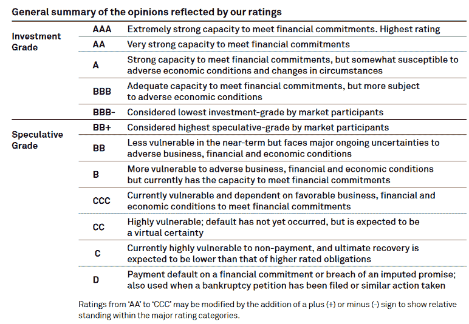

# 信用评级机构的作用

依赖信用评级赋予了信用评级机构高水平的影響力和政治权力。尽管有大量的信用评级机构，但只有其中三家收集了超过 90%的市场份额。这些是**穆迪**、**标准普尔**和**惠誉**。

信用评级机构因在 1990 年代末的亚洲和俄罗斯金融危机以及 2008 年爆发的近期全球金融危机等重要危机中的表现而受到批评。在这些事件中，信用评级机构加剧了不平衡，反应或预测违约事件的时间过长，然后过度反应，导致严重降级。

例如，在最近的金融危机中，欧洲经济体的评级平均下降了三个等级。希腊和意大利是受影响最严重的国家之一。

# 信用评级流程

评级过程中考虑了许多因素，包括政治、增长、外债、金融部门、公私部门结构、社会发展以及贸易。例如，标准普尔在六点量表上对国家的信用度进行五项关键因素的评分。然而，不同因素的权重以及这些因素的结合方式是未知的。此外，这些因素的重要性随时间变化。定性判断通常在评级分配过程中起着非常重要的作用。

对评级质量的担忧在过去二十年里激励了世界各地的研究人员。了解评级的决定因素对于减少对信用评级机构的依赖以及使信用评级的分配更加客观至关重要。

信用评级的复制主要基于不同的计量经济学模型，试图找到一组宏观经济变量来更好地解释外部评级。然而，信用评级研究广泛忽视了定性和更为主观的信息。这些附加信息可以补充当前的定量宏观经济信息，并提高信用评级模型的性能。

# 根据宏观经济不平衡对国家进行聚类

在本节中，我们将开发一个无监督模型来直观地检测国家的宏观经济问题，并更深入地了解信用评级的主要驱动因素。我们将首先创建一个具有宏观经济问题的国家集群。在下一章中，我们将继续基于这些集群预测信用评级。

在本章中，我试图重复前几章中的代码。

让我们开始吧！

# 数据收集

与之前的模型一样，我们需要收集尽可能多的数据。首先，我们需要国家的宏观经济指标来分析宏观经济不平衡并预测主权评级。

# 下载和查看数据

我们将使用`wbstats`包，它提供了对从世界银行 API 获取的所有信息的结构化访问，包括所有年度、季度和月度数据。在这个包中，`wb_cachelist`函数提供了一个可用国家、指标和其他相关信息的快照，如下所示：

```py
library(wbstats)
str(wb_cachelist, max.level = 1)
 ## List of 7
 ##  $ countries  :'data.frame': 304 obs. of  18 variables:
 ##  $ indicators :'data.frame': 16978 obs. of  7 variables:
 ##  $ sources    :'data.frame': 43 obs. of  8 variables:
 ##  $ datacatalog:'data.frame': 238 obs. of  29 variables:
 ##  $ topics     :'data.frame': 21 obs. of  3 variables:
 ##  $ income     :'data.frame': 7 obs. of  3 variables:
 ##  $ lending    :'data.frame': 4 obs. of  3 variables:
```

超过 16,000 个变量适用于 300 多个国家。默认语言是英语。

要搜索不同的指标，请使用`wbsearch`函数。例如，我们可以搜索包含**国内生产总值**（**GDP**）的所有指标，如下所示：

```py
new_cache <- wbcache()
gdp_vars <- wbsearch(pattern = "gdp")
print(gdp_vars[1:5,])
 ##                     indicatorID
 ## 2   XGDP.56.FSGOV.FDINSTADM.FFD
 ## 3   XGDP.23.FSGOV.FDINSTADM.FFD
 ## 758           TG.VAL.TOTL.GG.ZS
 ## 759           TG.VAL.TOTL.GD.ZS
 ## 760        TG.VAL.TOTL.GD.PP.ZS
 ## indicator
 ## Government expenditure in tertiary institutions as % of GDP (%)
 ## Government expenditure in secondary institutions education as % of     GDP (%)
 ## Trade in goods (% of goods GDP)
 ## Merchandise trade (% of GDP)
 ## Trade (% of GDP, PPP)
```

您也可以下载数据并指定指标、开始日期和结束日期，如下所示：

```py
stock_return <- wb(indicator = "GFDD.OM.02", startdate = 2000, enddate = 2017)
head(stock_return)
 ##     iso3c date    value indicatorID                                  indicator
 ## 110   ARG 2016  31.1342  GFDD.OM.02 Stock market return (%, year-      on-year)
 ## 111   ARG 2015  36.6400  GFDD.OM.02 Stock market return (%, year-     on-year)
 ## 112   ARG 2014 103.1500  GFDD.OM.02 Stock market return (%, year-     on-year)
 ## 113   ARG 2013  60.0070  GFDD.OM.02 Stock market return (%, year-     on-year)
 ## 114   ARG 2012 -19.8370  GFDD.OM.02 Stock market return (%, year-     on-year)
 ## 115   ARG 2011  22.1574  GFDD.OM.02 Stock market return (%, year-     on-year)
 ##     iso2c   country
 ## 110    AR Argentina
 ## 111    AR Argentina
 ## 112    AR Argentina
 ## 113    AR Argentina
 ## 114    AR Argentina
 ## 115    AR Argentina
```

我们现在已下载了所有国家的股市回报率。前几个值属于阿根廷。也可以只为特定国家获取信息。让我们获取 2015 年至 2017 年美国和西班牙的总人口，如下所示：

```py
population_stock <- wb(country = c("ES","US"),indicator = c("SP.POP.TOTL","GFDD.OM.02"), startdate = 2015, enddate = 2017)

head(population_stock)
 ##   iso3c date     value indicatorID         indicator iso2c            country
 ## 1   ESP 2017  46572028 SP.POP.TOTL Population, total    ES              Spain
 ## 2   ESP 2016  46484062 SP.POP.TOTL Population, total    ES              Spain
 ## 3   ESP 2015  46444832 SP.POP.TOTL Population, total    ES              Spain
 ## 4   USA 2017 325719178 SP.POP.TOTL Population, total    US United      States
 ## 5   USA 2016 323405935 SP.POP.TOTL Population, total    US United      States
 ## 6   USA 2015 321039839 SP.POP.TOTL Population, total    US United      States
```

变量总是按行获取，但这并不是展示信息的一种常见方式。使用`return_wide = TRUE`选项，如果获取了多个变量，它们将以列的形式展示。让我们看一下以下示例：

```py
population_stock <- wb(country = c("ES","US"),
indicator = c("SP.POP.TOTL","GFDD.OM.02"), startdate = 2015, enddate =2017,return_wide = TRUE)
head(population_stock)
 ##   iso3c date iso2c       country GFDD.OM.02 SP.POP.TOTL
 ## 1   ESP 2015    ES         Spain    1.96478    46444832
 ## 2   ESP 2016    ES         Spain  -18.17990    46484062
 ## 3   ESP 2017    ES         Spain         NA    46572028
 ## 4   USA 2015    US United States    6.71498   321039839
 ## 5   USA 2016    US United States    1.70065   323405935
 ## 6   USA 2017    US United States         NA   325719178
```

如果一个指标的最新可用日期未知，`mrv`参数代表最新值，并取一个整数，对应于所需的最新的值的数量。让我们显示美国股市回报率的 10 个最新值，如下所示：

```py
wb(country = c("US"),indicator = "GFDD.OM.02", mrv=10,return_wide = TRUE)
##    iso3c date iso2c       country GFDD.OM.02
 ## 1    USA 2007    US United States   12.72230
 ## 2    USA 2008    US United States  -17.40770
 ## 3    USA 2009    US United States  -22.29390
 ## 4    USA 2010    US United States   20.24370
 ## 5    USA 2011    US United States   11.19970
 ## 6    USA 2012    US United States    8.81282
 ## 7    USA 2013    US United States   19.17170
 ## 8    USA 2014    US United States   17.49470
 ## 9    USA 2015    US United States    6.71498
 ## 10   USA 2016    US United States    1.70065
```

默认日期格式对排序或绘图没有用。`POSIXct`参数添加了`date_ct`和`granularity`列，使这些任务变得容易得多。

让我们以查看美国军事费用随时间演变的例子为例，如下所示：

```py
library(ggplot2)
military_exp <- wb(country = c("US"),indicator = "MS.MIL.XPND.GD.ZS", POSIXct = TRUE)

 ggplot() + theme_bw() +
   geom_line(aes(y = value, x = date_ct), size=1.5, data = military_exp,
             stat="identity") +
   theme(legend.position="bottom", legend.direction="horizontal",
         legend.title = element_blank())  +
   labs(x="Year", y="Expenses as %GDP") +
   ggtitle("US Military expenses %GDP")
```

您将得到以下输出图：

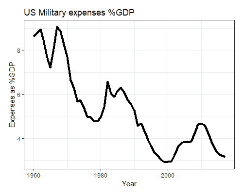

我们看到下载信息非常容易。然而，为了开发我们的模型，我们不会使用所有数据。现在，让我们定义我们需要多少变量、国家和历史数据。

# 数据简化

让我们使用以下代码查看世界银行数据库中的国家列表：

```py
countries<-wb_cachelist$countries
```

尽管列表很长，但一些国家属于几个国家的联盟，例如阿拉伯世界或欧盟。我们需要对这些国家进行选择。

让我们查看以下可用的指标列表：

```py
indicators<-wb_cachelist$indicators
```

指标列表甚至更大（有超过 16,000 个条目），但我们将选择其中最重要的，如下面的片段所示。这些指标是通过主要信用评级机构提供的评级方法指南获得的：

```py
relevant_indicators<-c('NYGDPMKTPKDZ','FB.BNK.CAPA.ZS','GFDD.OI.01','GFDD.EI.07','GFDD.SI.04','GFDD.OI.02','GFDD.EI.02','FD.RES.LIQU.AS.ZS','FB.AST.NPER.ZS','GFDD.SI.05','GFDD.EI.05','GFDD.EI.09','GFDD.EI.06','GFDD.EI.10','GFDD.SI.01','FM.LBL.BMNY.GD.ZS','FM.LBL.BMNY.ZG','FS.AST.CGOV.GD.ZS','CC.EST','GFDD.EI.08','BN.CAB.XOKA.GD.ZS','IC.CRD.INFO.XQ','FS.AST.DOMS.GD.ZS','NE.EXP.GNFS.KD.ZG','NE.RSB.GNFS.ZS','GFDD.DI.08','NY.GDP.MKTP.KD.ZG','NY.GDP.PCAP.CD','NY.GDP.PCAP.KD.ZG','NE.CON.GOVT.ZS','NE.CON.GOVT.KD.ZG','GE.EST','NY.GDS.TOTL.ZS','NE.GDI.FTOT.ZS','NE.GDI.FTOT.KD.ZG','NE.CON.PRVT.KD.ZG','NE.CON.PRVT.PC.KD.ZG','NE.IMP.GNFS.KD.ZG','NV.IND.TOTL.ZS','NV.IND.TOTL.KD.ZG','FP.CPI.TOTL.ZG','FR.INR.LNDP','CM.MKT.LCAP.GD.ZS','PV.EST','SP.POP.GROW','GFDD.SI.07','REER','RQ.EST','RL.EST','NV.SRV.TETC.ZS','NV.SRV.TETC.KD.ZG','DT.DOD.DSTC.ZS','DT.DOD.DSTC.IR.ZS','GFDD.OM.02','IC.LGL.CRED.XQ','TOTRESV','SL.UEM.TOTL.ZS','SL.UEM.1524.ZS','VA.EST','SP.POP.TOTL')

indicators<-indicators[indicators$indicatorID %in% relevant_indicators,]
head(indicators[,c("indicatorID","indicator")])
```

获得的指标列表如下：

```py
 ##      indicatorID
 ## 284       VA.EST
 ## 1793     TOTRESV
 ## 1986      PV.EST
 ## 2569      RQ.EST
 ## 2607      RL.EST
 ## 2636        REER
 ##                                                            indicator
 ## 284                               Voice and Accountability: Estimate
 ## 1793                                                  Total Reserves
 ## 1986 Political Stability and Absence of Violence/Terrorism: Estimate
 ## 2569                                    Regulatory Quality: Estimate
 ## 2607                                           Rule of Law: Estimate
 ## 2636                                    Real Effective Exchange Rate

```

让我们从 2000 年到 2018 年下载这些指标的历史数据。使用以下代码，这将花费大约五分钟：

```py
macroeconomic_data<-wb(indicator = relevant_indicators,startdate = 2000, enddate = 2018,return_wide = TRUE,POSIXct = TRUE)
```

让我们如下获取我们数据的结构：

```py
str(macroeconomic_data)
```

完整的输出如下：

```py

 ## 'data.frame':    5903 obs. of  66 variables:
 ##  $ iso3c               : chr  NA NA NA NA ...
 ##  $ date                : chr  "2018" "2017" "2016" "2015" ...
 ##  $ iso2c               : chr  "EA" "EA" "EA" "EA" ...
 ##  $ country             : chr  "Euro Area" "Euro Area" "Euro Area" "Euro Area" ...
 ##  $ date_ct             : Date, format: "2018-01-01" "2017-01-01"     ...
 ##  $ granularity         : chr  "annual" "annual" "annual" "annual"     ...
 ##  $ BN.CAB.XOKA.GD.ZS   : num  NA NA NA NA NA NA NA NA NA NA ...
 ##  $ CC.EST              : num  NA NA NA NA NA NA NA NA NA NA ...
 ##  $ CM.MKT.LCAP.GD.ZS   : num  NA NA NA NA NA NA NA NA NA NA ...
 ##  $ DT.DOD.DSTC.IR.ZS   : num  NA NA NA NA NA NA NA NA NA NA ...
 ##  $ DT.DOD.DSTC.ZS      : num  NA NA NA NA NA NA NA NA NA NA ...
 ##  $ FB.AST.NPER.ZS      : num  NA NA NA NA NA NA NA NA NA NA ...
 ##  $ FB.BNK.CAPA.ZS      : num  NA NA NA NA NA NA NA NA NA NA ...
 ##  $ FD.RES.LIQU.AS.ZS   : num  NA NA NA NA NA NA NA NA NA NA ...
 ##  $ FM.LBL.BMNY.GD.ZS   : num  NA NA NA NA NA NA NA NA NA NA ...
 ##  $ FM.LBL.BMNY.ZG      : num  NA NA NA NA NA NA NA NA NA NA ...
 ##  $ FP.CPI.TOTL.ZG      : num  NA NA NA NA NA NA NA NA NA NA ...
 ##  $ FR.INR.LNDP         : num  NA NA NA NA NA NA NA NA NA NA ...
 ##  $ FS.AST.CGOV.GD.ZS   : num  NA NA NA NA NA NA NA NA NA NA ...
 ##  $ FS.AST.DOMS.GD.ZS   : num  NA NA NA NA NA NA NA NA NA NA ...
 ##  $ GE.EST              : num  NA NA NA NA NA NA NA NA NA NA ...
 ##  $ GFDD.DI.08          : num  NA NA NA NA NA NA NA NA NA NA ...
 ##  $ GFDD.EI.02          : num  NA NA NA NA NA NA NA NA NA NA ...
 ##  $ GFDD.EI.05          : num  NA NA NA NA NA NA NA NA NA NA ...
 ##  $ GFDD.EI.06          : num  NA NA NA NA NA NA NA NA NA NA ...
 ##  $ GFDD.EI.07          : num  NA NA NA NA NA NA NA NA NA NA ...
 ##  $ GFDD.EI.08          : num  NA NA NA NA NA NA NA NA NA NA ...
 ##  $ GFDD.EI.09          : num  NA NA NA NA NA NA NA NA NA NA ...
 ##  $ GFDD.EI.10          : num  NA NA NA NA NA NA NA NA NA NA ...
 ##  $ GFDD.OI.01          : num  NA NA NA NA NA NA NA NA NA NA ...
 ##  $ GFDD.OI.02          : num  NA NA NA NA NA NA NA NA NA NA ...
 ##  $ GFDD.OM.02          : num  NA NA NA NA NA NA NA NA NA NA ...
 ##  $ GFDD.SI.01          : num  NA NA NA NA NA NA NA NA NA NA ...
 ##  $ GFDD.SI.04          : num  NA NA NA NA NA NA NA NA NA NA ...
 ##  $ GFDD.SI.05          : num  NA NA NA NA NA NA NA NA NA NA ...
 ##  $ GFDD.SI.07          : num  NA NA NA NA NA NA NA NA NA NA ...
 ##  $ IC.CRD.INFO.XQ      : num  NA NA NA NA NA NA NA NA NA NA ...
 ##  $ IC.LGL.CRED.XQ      : num  NA NA NA NA NA NA NA NA NA NA ...
 ##  $ NE.CON.GOVT.KD.ZG   : num  NA NA NA NA NA NA NA NA NA NA ...
 ##  $ NE.CON.GOVT.ZS      : num  NA NA NA NA NA NA NA NA NA NA ...
 ##  $ NE.CON.PRVT.KD.ZG   : num  NA NA NA NA NA NA NA NA NA NA ...
 ##  $ NE.CON.PRVT.PC.KD.ZG: num  NA NA NA NA NA NA NA NA NA NA ...
 ##  $ NE.EXP.GNFS.KD.ZG   : num  NA NA NA NA NA NA NA NA NA NA ...
 ##  $ NE.GDI.FTOT.KD.ZG   : num  NA NA NA NA NA NA NA NA NA NA ...
 ##  $ NE.GDI.FTOT.ZS      : num  NA NA NA NA NA NA NA NA NA NA ...
 ##  $ NE.IMP.GNFS.KD.ZG   : num  NA NA NA NA NA NA NA NA NA NA ...
 ##  $ NE.RSB.GNFS.ZS      : num  NA NA NA NA NA NA NA NA NA NA ...
 ##  $ NV.IND.TOTL.KD.ZG   : num  NA NA NA NA NA NA NA NA NA NA ...
 ##  $ NV.IND.TOTL.ZS      : num  NA NA NA NA NA NA NA NA NA NA ...
 ##  $ NV.SRV.TETC.KD.ZG   : num  NA NA NA NA NA NA NA NA NA NA ...
 ##  $ NV.SRV.TETC.ZS      : num  NA NA NA NA NA NA NA NA NA NA ...
 ##  $ NY.GDP.MKTP.KD.ZG   : num  NA NA NA NA NA NA NA NA NA NA ...
 ##  $ NY.GDP.PCAP.CD      : num  NA NA NA NA NA NA NA NA NA NA ...
 ##  $ NY.GDP.PCAP.KD.ZG   : num  NA NA NA NA NA NA NA NA NA NA ...
 ##  $ NY.GDS.TOTL.ZS      : num  NA NA NA NA NA NA NA NA NA NA ...
 ##  $ NYGDPMKTPKDZ        : num  2.1 2.39 1.8 2.07 2.21 ...
 ##  $ PV.EST              : num  NA NA NA NA NA NA NA NA NA NA ...
 ##  $ REER                : num  NA NA NA NA NA NA NA NA NA NA ...
 ##  $ RL.EST              : num  NA NA NA NA NA NA NA NA NA NA ...
 ##  $ RQ.EST              : num  NA NA NA NA NA NA NA NA NA NA ...
 ##  $ SL.UEM.1524.ZS      : num  NA NA NA NA NA NA NA NA NA NA ...
 ##  $ SL.UEM.TOTL.ZS      : num  NA NA NA NA NA NA NA NA NA NA ...
 ##  $ SP.POP.GROW         : num  NA NA NA NA NA NA NA NA NA NA ...
 ##  $ SP.POP.TOTL         : num  NA NA NA NA NA NA NA NA NA NA ...
 ##  $ TOTRESV             : num  NA NA NA NA NA NA NA NA NA NA ...
 ##  $ VA.EST              : num  NA NA NA NA NA NA NA NA NA NA ...
```

如您所见，大多数变量在前面几行显示缺失值。让我们获取一个国家在前面的列表中出现的次数列表：

```py
head(table(macroeconomic_data$country))
 ## 
 ## Advanced economies Advanced Economies        Afghanistan 
 ##                  4                 19                 19 
 ##             Africa            Albania            Algeria 
 ##                 12                 19                 19
```

该数据包含的国家总数如下：

```py
length(table(macroeconomic_data$country))
 ## [1] 330
```

我们可以如下探索我们的缺失值：

```py
library(DataExplorer)
plot_missing(macroeconomic_data) 
```

我们将获得以下输出：

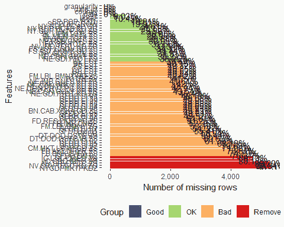

获得的图表不太美观，因为变量数量众多。虽然信息容易获取，但许多变量显示大量缺失值。这是因为信息未更新，且最近几年的数据不可用。

要查看结果，您应手动选择不同官方来源的相关变量并在 Excel 文件中合并它们，该文件将用于我们的模型开发。首先，按照如下操作删除工作区中的所有对象：

```py
rm(list=ls())
```

现在，将新的数据样本加载到 R 中，如下：

```py
macroeconomic_data <- read.csv("SovereignData.csv",sep=";",header=TRUE,stringsAsFactors = FALSE,dec=",")
```

该文件包含以下信息：

```py
str(macroeconomic_data)
 ## 'data.frame':    224 obs. of  14 variables:
 ##  $ Year                : int  2010 2011 2012 2013 2014 2015 2016                  2017 2010 2011 ...
 ##  $ CountryISO          : chr  "AT" "AT" "AT" "AT" ...
 ##  $ CountryName         : chr  "Austria" "Austria" "Austria"              "Austria" ...
 ##  $ CARA                : num  2.92 1.57 1.5 1.95 2.39 ...
 ##  $ DCPI                : num  1.69 3.54 2.57 2.12 1.47 ...
 ##  $ DGDP                : num  1.828 2.935 0.662 0.008 0.923 ...
 ##  $ ILMA                : num  22284 25161 27211 23290 24941 ...
 ##  $ PSBR                : num  -4.44 -2.55 -2.19 -1.95 -2.68 ...
 ##  $ PUDP                : num  82.4 82.2 81.7 81 83.7 ...
 ##  $ TDRA                : num  -0.469 -1.168 -0.992 -0.313 0.232 ...
 ##  $ YPCA                : num  0.0467 0.0511 0.0483 0.0506 0.0519         ...
 ##  $ MEANWGI             : num  1.55 1.48 1.52 1.54 1.52 ...
 ##  $ YearsFromLastDefault: int  21 22 23 24 25 26 27 28 21 22 ...
 ##  $ RatingMayT1         : int  6 5 5 5 5 5 5 5 5 5 ...
```

如`str`函数所示，数据样本包含`224`个观测值和以下`14`个变量：

+   `Year`: 年末的参考日期

+   `CountryISO`: 国际标准国家代码

+   `CountryName`: 国家的名称

+   `CARA`: 一个国家的经常账户余额

+   `DCPI`: 消费者价格增长率

+   `DGDP`: GDP 增长率

+   `ILMA`: 国际储备

+   `PSBR`: 预算平衡占 GDP 的百分比

+   `PUDP`: 公共债务占 GDP 的百分比

+   `TDRA`: 总进口减去总出口的商品和服务占 GDP 的百分比

+   `YPCA`: 人均 GDP

+   `MEANWGI`: 六个全球治理指标的平均值

+   `YearsFromLastDefault`: 自上次国家违约以来经过的时间

+   `RatingMayT1`: 宏观经济信息一年后国家的信用评级

您可以从以下来源获取更多数据：

+   [`www.worldbank.org/`](https://www.worldbank.org/)

+   [`www.oecd.org/`](https://www.oecd.org/)

+   [`ec.europa.eu/eurostat`](https://ec.europa.eu/eurostat)

+   [`info.worldbank.org/governance/wgi`](https://info.worldbank.org/governance/wgi)

+   [`www.cia.gov/library/publications/the-world-factbook`](https://www.cia.gov/library/publications/the-world-factbook)

+   [`www.imf.org/`](https://www.imf.org/)

+   [`www.oecd.org/`](https://www.oecd.org/)

所考虑的所有变量在先前的研究或由信用评级机构（CRAs）使用中已被广泛采用。在我们的变量列表中，我们使用了世界银行的多种治理指标，包括`MEANWGI`变量。该变量是通过世界银行提供的六个不同指标计算得出的简单平均值。这些指标衡量的话题包括政治稳定性、暴力水平和对腐败的控制。世界银行根据不同非政府组织、国际组织或私营部门公司的调查来计算这些综合指标。每个指标的价值越高，一个国家在该指标中的质量或评分就越高。

本章剩余部分将使用的数据集收集了多年来每个国家在五月底的信用评级。宏观经济信息代表了每个国家上一年年末的经济状况。各国在年初的第一季度或第二季度发布这些信息，因此每年五月份获取的最新宏观经济信息属于上一年。

# 研究数据

我们的首要目标将是根据各国的宏观经济状况检测国家集群，并预测这些国家的评级。然后，我们将评估欧洲委员会发布的国家报告中的定性信息是否有助于预测国家评级。这些报告通常在每年的前几个月发布，因此它们应该在五月的信用评级中也有影响力。

再次，我们必须从分析以下数据集开始：

```py
head(macroeconomic_data)
 ##   Year CountryISO CountryName  CARA  DCPI  DGDP  ILMA   PSBR   PUDP   TDRA
 ## 1 2010         AT     Austria 2.923 1.694 1.828 22284 -4.440 82.401 -0.469
 ## 2 2011         AT     Austria 1.575 3.542 2.935 25161 -2.554 82.193 -1.168
 ## 3 2012         AT     Austria 1.499 2.569 0.662 27211 -2.189 81.667 -0.992
 ## 4 2013         AT     Austria 1.947 2.118 0.008 23290 -1.950 81.016 -0.313
 ## 5 2014         AT     Austria 2.389 1.468 0.923 24941 -2.683 83.714  0.232
 ## 6 2015         AT     Austria 1.932 0.810 1.073 22236 -1.033 84.297  0.609
 ##        YPCA  MEANWGI YearsFromLastDefault RatingMayT1
 ## 1 0.0466532 1.552740                   21           6
 ## 2 0.0510888 1.477206                   22           5
 ## 3 0.0483316 1.515706                   23           5
 ## 4 0.0505913 1.540124                   24           5
 ## 5 0.0519292 1.521760                   25           5
 ## 6 0.0447088 1.471732                   26           5
```

该数据集中没有缺失值。让我们按以下方式探索我们的数据：

```py
library(funModeling)
library(DataExplorer)
info<-df_status(macroeconomic_data)
 ##variable              q_zeros p_zeros q_na p_na q_inf p_inf  type
 ## Year                 0           0    0    0     0     0   integer
 ## CountryISO           0           0    0    0     0     0   character
 ## CountryName          0           0    0    0     0     0   character
 ## CARA                 0           0    0    0     0     0   numeric
 ## DCPI                 0           0    0    0     0     0   numeric
 ## DGDP                 0           0    0    0     0     0   numeric
 ## ILMA                 0           0    0    0     0     0   numeric
 ## PSBR                 0           0    0    0     0     0   numeric
 ## PUDP                 0           0    0    0     0     0   numeric
 ## TDRA                 0           0    0    0     0     0   numeric
 ## YPCA                 0           0    0    0     0     0   numeric
 ## MEANWGI              0           0    0    0     0     0   numeric
 ## YearsFromLastDefault 0           0    0    0     0     0   integer
 ## RatingMayT1          0           0    0    0     0     0   integer
```

不同国家的宏观经济信息从 2010 年到 2017 年可用，如下所示：

```py
table(macroeconomic_data$Year)
 ## 2010 2011 2012 2013 2014 2015 2016 2017
 ##   28   28   28   28   28   28   28   28
```

以下是需要考虑的 28 个国家的列表：

```py
unique(macroeconomic_data$CountryName)
 ##  [1] "Austria"        "Belgium"        "Bulgaria"     "Croatia"      
 ##  [5] "Cyprus"         "Czech Republic" "Denmark"      "Estonia"      
 ##  [9] "Finland"        "France"         "Germany"      "Greece"       
 ## [13] "Hungary"        "Ireland"        "Italy"        "Latvia"       
 ## [17] "Lithuania"      "Luxembourg"     "Malta"        "Netherlands"  
 ## [21] "Poland"         "Portugal"       "Romania"      "Slovakia"     
 ## [25] "Slovenia"       "Spain"          "Sweden"       "United Kingdom"
```

# 获取目标变量

目标变量将是每个国家的信用评级。让我们用以下代码查看目标变量的不同值：

```py
unique(macroeconomic_data$RatingMayT1)
## [1] 6 5 3 2 4 1
```

如我们所见，该量表只包含六个不同的等级，它们是数字的，而不是字母的。以下代码创建了一个表格来显示每个评级类别的分配数字：

```py
RatingSP <- c('AAA','AA+','AA','AA-','A+','A','A-','BBB+','BBB','BBB-','BB+','BB','BB-','B+','B','B-','CCC+','CCC','CCC-','CC','C','D','DD','SD')

 Rating_num <- c('6','5','5','5','4','4','4','3','3','3','2','2','2','1','1','1','1','1','1','1','1','1','1','1')

 mapping<-data.frame(RatingSP, Rating_num)

 rm(RatingSP,Rating_num)

 print(mapping)
```

以下映射表将被用于将所有可能的信用评级水平减少到仅六个类别：

```py
 ##    RatingSP Rating_num
 ## 1       AAA          6
 ## 2       AA+          5
 ## 3        AA          5
 ## 4       AA-          5
 ## 5        A+          4
 ## 6         A          4
 ## 7        A-          4
 ## 8      BBB+          3
 ## 9       BBB          3
 ## 10     BBB-          3
 ## 11      BB+          2
 ## 12       BB          2
 ## 13      BB-          2
 ## 14       B+          1
 ## 15        B          1
 ## 16       B-          1
 ## 17     CCC+          1
 ## 18      CCC          1
 ## 19     CCC-          1
 ## 20       CC          1
 ## 21        C          1
 ## 22        D          1
 ## 23       DD          1
 ## 24       SD          1
```

因此，`6`的值与最高评级等级（`AAA`）相关联，而`1`则对应最低评级等级。这种映射是为了减少不同标签的数量，并获得一个更细粒度的目标变量。

让我们用以下代码查看目标变量的分布情况：

```py
tab<-table(macroeconomic_data$RatingMayT1)
 barplot(tab,xlab="Rating",ylab="Count",border="blue",col="blue")
```

你将看到一个如下所示的图表：

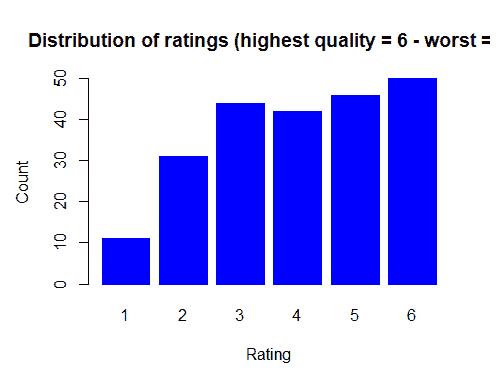

# 获取信用质量

2018 年 5 月，每个欧洲国家的信用评级如下：

```py
with(macroeconomic_data[macroeconomic_data$Year==2017,], table(CountryName,RatingMayT1))
```

每个国家的信用质量表如下：

```py
 ##                 RatingMayT1
 ## CountryName      1 2 3 4 5 6
 ##   Austria        0 0 0 0 1 0
 ##   Belgium        0 0 0 0 1 0
 ##   Bulgaria       0 1 0 0 0 0
 ##   Croatia        0 1 0 0 0 0
 ##   Cyprus         0 1 0 0 0 0
 ##   Czech Republic 0 0 0 0 1 0
 ##   Denmark        0 0 0 0 0 1
 ##   Estonia        0 0 0 0 1 0
 ##   Finland        0 0 0 0 1 0
 ##   France         0 0 0 0 1 0
 ##   Germany        0 0 0 0 0 1
 ##   Greece         1 0 0 0 0 0
 ##   Hungary        0 0 1 0 0 0
 ##   Ireland        0 0 0 1 0 0
 ##   Italy          0 0 1 0 0 0
 ##   Latvia         0 0 0 1 0 0
 ##   Lithuania      0 0 0 1 0 0
 ##   Luxembourg     0 0 0 0 0 1
 ##   Malta          0 0 0 1 0 0
 ##   Netherlands    0 0 0 0 0 1
 ##   Poland         0 0 1 0 0 0
 ##   Portugal       0 1 0 0 0 0
 ##   Romania        0 0 1 0 0 0
 ##   Slovakia       0 0 0 1 0 0
 ##   Slovenia       0 0 0 1 0 0
 ##   Spain          0 0 1 0 0 0
 ##   Sweden         0 0 0 0 0 1
 ##   United Kingdom 0 0 0 0 1 0
```

丹麦、德国、卢森堡、荷兰和瑞典显示出最高的信用质量。另一方面，根据标准普尔的数据，希腊是欧盟中偿债能力最低的国家。

# 在地图上显示信用评级

使用`rworldmap`包，我们可以创建一个地图并按国家显示信用评级。让我们关注最后可用的信用评级（2018 年 5 月），如下所示：

```py
macro2017<-macroeconomic_data[macroeconomic_data$Year==2017,]
library(rworldmap)
Map <- joinCountryData2Map(macro2017, joinCode = "ISO2",
 nameJoinColumn = "CountryISO")
```

可以快速总结如下：

```py
 ## 28 codes from your data successfully matched countries in the map
 ## 0 codes from your data failed to match with a country code in the     map
 ## 215 codes from the map weren't represented in your data
```

指定轴的极限，如下所示：

```py
mapCountryData(Map, catMethod = "categorical", missingCountryCol = gray(.8), xlim = c(-20, 59),ylim = c(35, 71),asp = 1)
```

将会显示如下非常漂亮的输出：

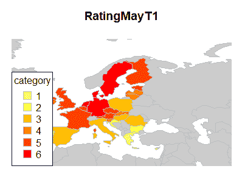

# 执行数据的描述性分析

我们现在应该进行描述性分析，就像我们在前面的章节中所做的那样，使用以下代码：

```py
library(fBasics)library(DataExplorer)
descriptives_num<-as.data.frame(t(basicStats(macroeconomic_data[,4:13])))
head(descriptives_num)
```

获得的输出如下：

```py
 ##      nobs NAs Minimum    Maximum 1\. Quartile 3\. Quartile         Mean
 ## CARA  224   0 -11.354     12.638    -1.44275     4.15000     1.004080
 ## DCPI  224   0  -2.097      6.113     0.27950     2.44350     1.418147
 ## DGDP  224   0  -9.168     25.492     0.87175     3.17450     1.946969
 ## ILMA  224   0 207.470 248856.000  3099.44000 59386.00000 45290.293839
 ## PSBR  224   0 -32.055      3.931    -4.32325    -0.94425    -3.110054
 ## PUDP  224   0   6.067    181.147    40.68500    86.39600    68.819321
 ##          Median          Sum     SE Mean     LCL Mean     UCL Mean
 ## CARA     0.6140      224.914    0.284204     0.444012     1.564149
 ## DCPI     1.3000      317.665    0.103081     1.215009     1.621285
 ## DGDP     1.8995      436.121    0.195218     1.562261     2.331676
 ## ILMA 23359.0000 10145025.820 3712.287504 37974.641205 52605.946474
 ## PSBR    -2.5980     -696.652    0.239382    -3.581794    -2.638313
 ## PUDP    65.0070    15415.528    2.417700    64.054860    73.583783
 ##          Variance        Stdev  Skewness  Kurtosis
 ## CARA 1.809288e+01     4.253572  0.057613  0.070869
 ## DCPI 2.380167e+00     1.542779  0.324855 -0.127702
 ## DGDP 8.536634e+00     2.921752  1.873828 18.872568
 ## ILMA 3.086962e+09 55560.431839  1.508513  1.483938
 ## PSBR 1.283607e+01     3.582746 -2.870375 18.134018
 ## PUDP 1.309341e+03    36.184813  0.792637  0.645762
```

按如下方式绘制这些变量：

```py
plot_histogram(macroeconomic_data[,4:13])
```

下面的图表如下所示：

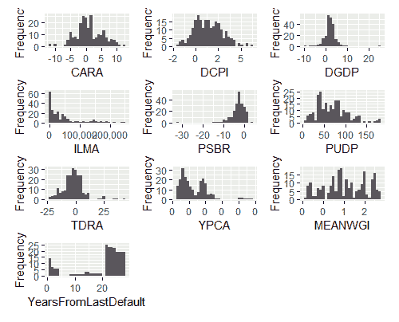

一旦我们研究过我们的数据集，我们就可以开始处理我们的数据了。保存工作区的一个备份。如果出了问题，总是可以加载备份并继续使用代码，如下所示：

```py
rm(list=setdiff(ls(), c("macroeconomic_data")))

 save.image("Backup1.RData")
```

# 检测宏观经济失衡

在本节中，我们将使用称为**自组织映射**（**SOM**）的技术，根据宏观经济变量对欧洲国家进行分类。

# 自组织映射技术

识别国家之间的相似性和差异性对于检测失衡并采取纠正措施以避免金融危机的传播至关重要。SOM 是一种非常适用于**探索性数据分析**（**EDA**）的无监督神经网络。SOM 的无监督性质是由于网络能够学习数据中的模式，而不使用目标变量。因此，网络中包含的不同神经元通过输入数据自我组织。以下图是 SOM 最常见的表示形式：

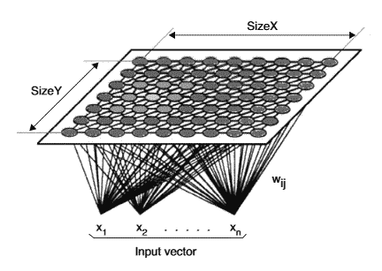

如前图所示，存在两个主要的神经元层：一个输入层和一个输出层。输入层是我们发送到网络的输入数据，即要分析的数据。输出层是一个二维地图，其中将放置所有我们的数据。输入层中的数据通过突触权重连接到输出层的所有神经元。这样，输入层每个神经元提供的信息就传递到了输出层的所有神经元。

网络试图找到输出层中与输入层神经元值最相似的突触权重神经元。最相似的权重在输入数据和输出层中创建的原型权重之间具有最低的距离。这些权重最初是随机创建的。一旦计算出距离，就会识别出获胜神经元。这个神经元是权重与输入集之间差异最小或欧几里得距离最短的神经元。

一旦识别出获胜神经元，其权重将使用学习规则进行调整，以将这些权重代理到使神经元获胜的输入模式。这样，权重最接近输入模式的神经元被更新，以变得更加接近。因此，输出层中的每个神经元都专门化于这个输入模式。

获胜神经元不是唯一更新其权重的神经元。还使用邻域函数来更新获胜神经元及其邻域神经元的权重，以定位相似的模式。随着模型迭代次数的增加，这个邻域半径会减小，以实现每个神经元的更好专业化。

# 训练 SOM

现在是时候使用 R 来训练 SOM 了。为此，我们将使用`kohonen`包。这个包的名字来源于 Teuvo Kohonen，他首先介绍了这个算法。

由于 SOM 主要基于欧几里得距离，建议对变量进行标准化。我们将使用`caret`包来完成这项工作，如下所示：

```py
library(kohonen)
library(caret)
preprocess <- preProcess(macroeconomic_data[,4:13], method=c("center", "scale"))
print(preprocess)
 ## Created from 224 samples and 10 variables
 ## 
 ## Pre-processing:
 ##   - centered (10)
 ##   - ignored (0)
 ##   - scaled (10)
```

这将创建一个包含转换变量的数据框。然后，我们将国家名称和评分添加到这个转换数据框中，如下所示：

```py
macroeconomic_data_trn <- cbind(macroeconomic_data[,c(1:3,14)],predict(preprocess,                      macroeconomic_data[,4:13]))
```

现在，是时候训练映射了。网络的第一层将有十个输入模式或十个宏观经济变量。我们的输出层将被固定为一个 6×5 大小的二维映射。这个大小是在多次测试后获得的，如下所示：

```py
set.seed(1234)

som_grid <- somgrid(xdim = 6, ydim=5, topo="hexagonal")  

som_model <- som(as.matrix(macroeconomic_data_trn[,5:14]),grid=som_grid,rlen=800,alpha=c(0.1,0.01), keep.data = TRUE )
```

经过 800 次迭代后，训练过程结束。可以从训练好的映射中获取不同的图表。

让我们使用以下代码显示训练过程中到最近码本向量的平均距离：

```py
plot(som_model, type = "changes")
```

这将绘制以下图表：

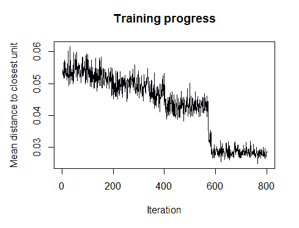

我们可以看到，训练过程中的误差，即测量到最近单元的平均距离，在迭代过程中是逐渐减少的。如果迭代次数足够高，算法就会收敛。

此外，还可以可视化映射并计算每个神经元中分类的国家数量：

```py
plot(som_model, type = "counts", main="Node Counts")
```

节点计数的图形表示可以在以下图表中看到：

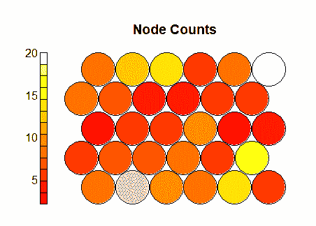

在图中，根据分类的国家数量，用不同颜色标记了 30 个单元格（大小为 6x5）。灰色单元格表示在这个单元格中没有国家被分类。单元格数量越多，每个神经元中的国家数量就越少，从而获得更细粒度的地图。

在下面的图中，显示了映射到地图中每个单元的国家之间的平均距离。距离越小，表示国家由代码簿向量表示得越好，如下所示：

```py
plot(som_model, type = "quality", main="Node Quality/Distance")
```

节点质量图如下：

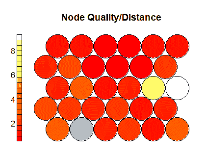

地图上的权重向量也可以被可视化。这有助于揭示不同国家分布中的模式。

节点权重向量或代码由用于生成 SOM 的原变量的归一化值组成：

```py
plot(som_model, type = "codes")
```

前面代码的输出显示在以下图表中：

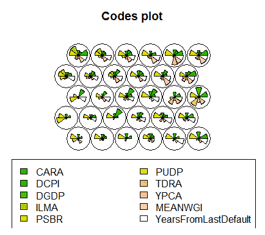

从前面的图表中，可以提取出被放置在每个单元格中的国家的特征。还可以可视化单个变量在地图上的分布情况。例如，让我们看一下`MEANWGI`变量的分布，如下所示：

```py
plot(som_model, type = "property", property = getCodes(som_model)[,'MEANWGI'], main="WorldBank Governance Indicators")
```

训练好的地图被绘制出来，并且根据这些地图上国家所在位置的变量值来着色单元格，如下所示：

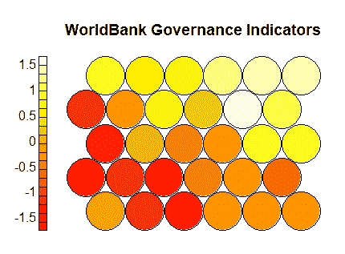

根据前面的地图，该变量值较高的国家将位于地图的右上角。

现在，让我们使用以下代码，利用 2017 年 12 月的宏观经济信息来查看这些国家的位置：

```py
Labels<-macroeconomic_data_trn[,c("CountryName","Year")]
 Labels$CountryName<-ifelse(Labels$Year!=2017,"",as.character(Labels$CountryName))

plot(som_model, type = "mapping",label=Labels$CountryName)
```

将根据经济变量将国家放置在地图上的地图将显示如下：

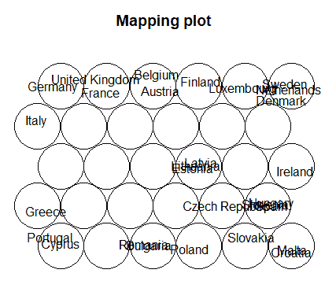

在宏观经济变量中值相似的国家更靠近。因此，希腊、葡萄牙和塞浦路斯在地图上非常接近。这些国家在过去几年中由于金融危机而遇到了重要问题。德国、法国和英国等国家根据宏观经济信息也相似。最后，我们可以通过考虑训练地图的代码簿向量来在这个地图上创建不同的聚类或组。可以使用层次聚类来选择组数。以下代码将获得五个不同的国家组：

```py
clusters <- cutree(hclust(dist(getCodes(som_model))), 5)
```

通过运行以下代码，可以在地图上可视化最近创建的组：

```py
plot(som_model, type="codes", bgcol = clusters, main = "Clusters")
add.cluster.boundaries(som_model, clusters)
```

下面的地图被绘制出来：

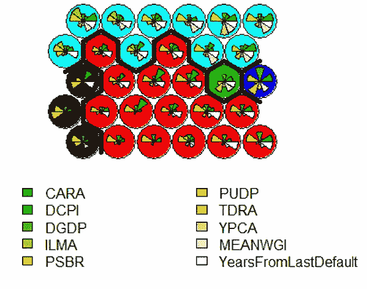

前面的图表给出了以下信息：

+   **组 1**：葡萄牙、希腊和塞浦路斯等国家。

+   **第二组**：包括波兰、马耳他、保加利亚和西班牙等国家。总的来说，这是一个由西欧和其他经济状况较弱的国家组成的集群。这个组比之前的组状况更好。

+   **第三组**：欧盟中更富裕的国家，如英国、德国和法国。

+   **第四组**和**第五组**：这些组各有一个单元格，其中一个包含爱尔兰。爱尔兰几年前经历了严重的经济危机，但现在的情况非常不同。这种差异如此之大，以至于它不能被包含在任何其他国家的组中。

如往常一样，您现在可以使用以下代码备份您的 工作空间：

```py
save.image("Backup2.RData")
```

使用这种简单的聚类方法，可以可视化欧盟每个国家的不同情况。

# 摘要

在本章中，我们介绍了不同欧洲国家经历的经济危机。我们获得了数据并对其进行了分析。然后，我们开发了一个可视化工具，同时使用不同的变量来比较各国。

在下一章中，我们将尝试创建一个评级模型。我们将根据各国的经济状况分配不同的分数。让我们看看我们是否能够预测不同国家的评级！
