# 主权危机 - 自然语言处理和主题建模

继续探讨欧洲国家的经济问题检测，在本章中，我们将尝试使用定量和定性信息复制标准普尔提供的国家评级。

本章是一个有趣的实际案例应用，因为我们将使用一些基本的文本挖掘技术来复制标准普尔的信用评级。为此，我们将使用欧洲委员会为欧洲成员国发布的国家报告。

我们将执行文本挖掘过程，提取单词组合或有用的术语来预测主权评级。

本章将涵盖以下主题：

+   使用宏观经济信息预测国家评级

+   实现决策树

+   使用欧洲国家报告预测主权评级

# 使用宏观经济信息预测国家评级

在我们的聚类模型中，如第六章所述，使用自组织图可视化欧盟的经济问题，我们使用了所有可用数据。现在，为了训练一个能够预测主权评级的模型，我们需要将数据分为两个样本：训练样本和测试样本。

这对我们来说并不新鲜。当我们试图开发不同的模型来预测银行的失败时，我们使用了`caTools`包来分割数据，同时考虑我们的目标变量。

这里再次使用相同的程序：

```py
library(caTools)

index = sample.split(macroeconomic_data$RatingMayT1, SplitRatio = .75)

train_macro<-subset(macroeconomic_data, index == TRUE)
test_macro<-subset(macroeconomic_data, index == FALSE)
```

现在，你可以打印以下语句：

```py
print(paste("The number of observations in the train sample is: ",nrow(train_macro),sep=""))
## [1] "The number of observations in the train sample is: 168"
print(paste("The number of observations in the test sample is: ",nrow(test_macro),sep=""))
## [1] "The number of observations in the test sample is: 56"
```

因此，测试样本代表了总数据的 25%。此外，不同信用评级的相对比例在训练样本和测试样本中都得到了保留。

这两个样本都将进行标准化。再次使用`caret`包：

```py
library(caret)
```

变换应仅考虑训练样本，然后应用于测试样本：

```py
preprocess <- preProcess(train_macro[,4:13], method=c("center", "scale"))

print(preprocess)
 ## Created from 168 samples and 10 variables
 ## 
 ## Pre-processing:
 ##   - centered (10)
 ##   - ignored (0)
 ##   - scaled (10)
```

这里是两个额外的训练和测试样本，将原始变量替换为转换后的变量：

```py
train_macro_trn <- cbind(train_macro[,c(1:3,14)],predict(preprocess, train_macro[,4:13]))
test_macro_trn <- cbind(test_macro[,c(1:3,14)],predict(preprocess, test_macro[,4:13]))
```

让我们看看变量是如何与目标变量（评级）相关的。为此，我们首先将目标变量转换为`因子`变量，然后我们将根据每个变量的类别创建不同的箱线图：

```py
library(ggplot2)
variables<-colnames(train_macro_trn[,5:14])
 train_macro_trn$RatingMayT1<-as.factor(train_macro_trn$RatingMayT1)

 for (i in 5:14)
{

 library(ggplot2)
 theme_set(theme_classic())

 var<-colnames(train_macro_trn)[i]

 data_aux<-train_macro_trn[,c(var,"RatingMayT1")]
 colnames(data_aux)<-c("variable","RatingMayT1")

 g <- ggplot(data_aux, aes(RatingMayT1,variable))
 plot(g + geom_boxplot(varwidth=T, fill="plum") + 
     labs(title="Box plot", 
          subtitle=var,
          x="Rating Number",
          y=var))

 }
```

以下是以一个国家的经常账户余额（**CARA**）变量为输出的结果：

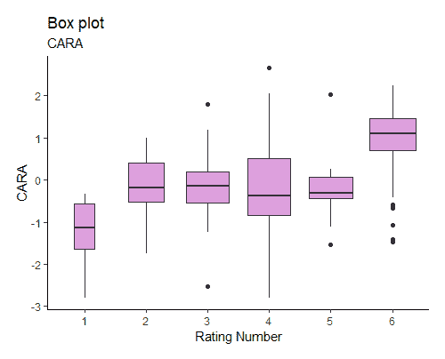

以下是以消费者价格增长率（**DCPI**）变量为输出的结果：

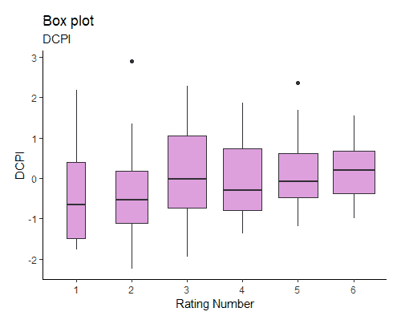

以下是以 GDP 增长（**DGPD**）变量为输出的结果：

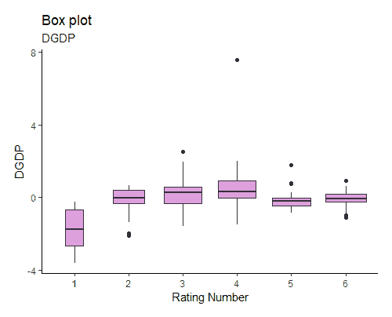

以下是以国际储备（**ILMA**）变量为输出的结果：

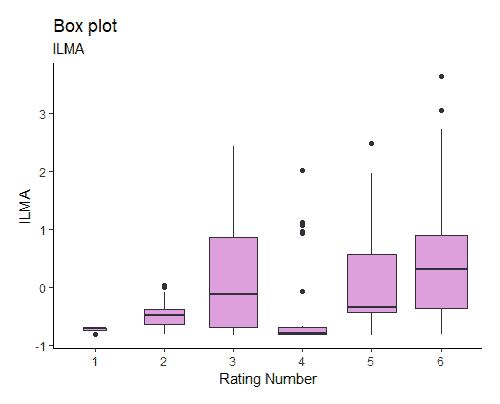

以下是以六个全球治理指标平均值（**MEANWGI**）变量为输出的结果：

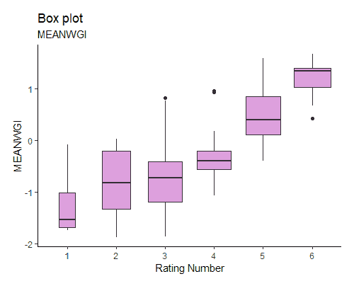

以下是以 GDP（国内生产总值）百分比表示的预算平衡（**PSBR**）变量的输出：

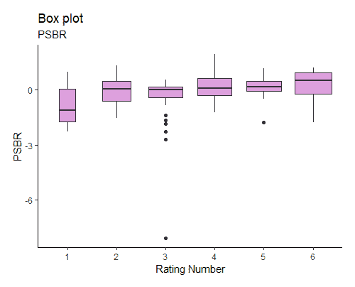

以下是对公共债务比率（**PUDP**）变量的输出：

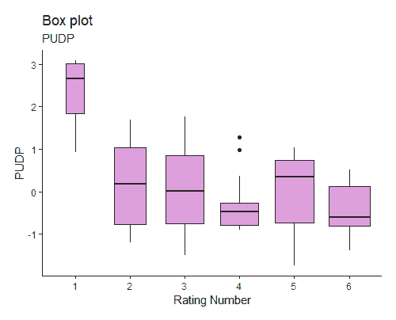

以下是对商品和服务总进口减去总出口占 GDP 百分比（**TDRA**）变量的输出：

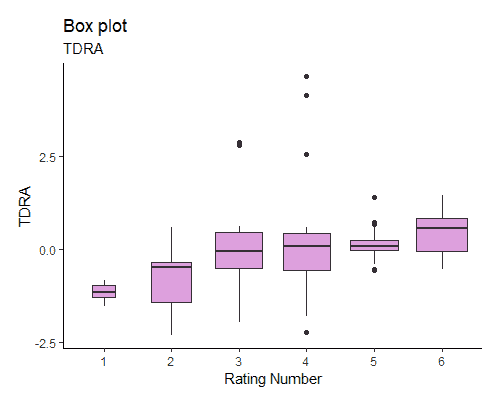

以下是对 GDP 人均值（**YPCA**）变量的输出：

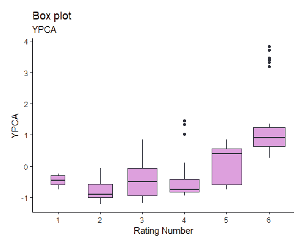

这些图表有助于观察数据中的某些模式以及变量如何帮助预测信用评级。

例如，对于公共债务（GDP 百分比）的箱形图，或`PUDP`，显示评级最低的国家在这个变量上的平均值较高。

在以下代码中，让我们使用上一个图表，但这次提供更多关于每个评级类别中包含的国家细节：

```py
library(dplyr)
means_YPCA <- train_macro_trn %>% group_by(RatingMayT1) %>%
         summarise(YPCA = mean(YPCA))

ggplot(train_macro_trn, aes(x = RatingMayT1, y = YPCA, color = RatingMayT1,          fill = RatingMayT1)) +
geom_bar(data = means_YPCA, stat = "identity", alpha = .3) + ggrepel::geom_text_repel(aes(label = CountryName), color = "black", size =      2.5, segment.color = "grey") + geom_point() + guides(color = "none", fill = "none") + theme_bw() +  labs(  x = "Rating", y = "GDP per capita")
```

以下是对 YPCA 的更详细图表：

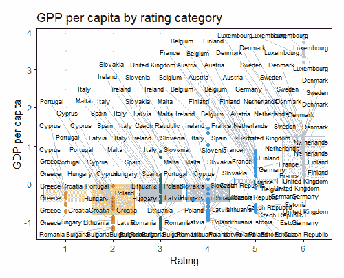

让我们看看另一个替代方案：

```py
library(ggplot2)
 theme_set(theme_classic())
ggplot(train_macro_trn, aes((MEANWGI))) + geom_density(aes(fill=factor(RatingMayT1)),alpha=0.8) + 
     labs(title="Density plot", 
          subtitle="Mean of the Worldwide Governance Indicators",
          x=paste("MeanWGI",sep=''),
          fill="RatingNum")
```

这是 MeanWGI 的密度图：

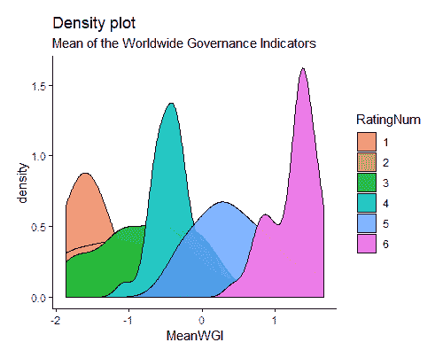

让我们为`CARA`实现一个`Density plot`：

```py
ggplot(train_macro_trn, aes((CARA))) + geom_density(aes(fill=factor(RatingMayT1)),alpha=0.8) +     labs(title="Density plot", 
          subtitle="Current account balance/GDP",
          x=paste("CARA",sep=''),
          fill="RatingNum")
```

CARA 上的密度图输出将如下所示：

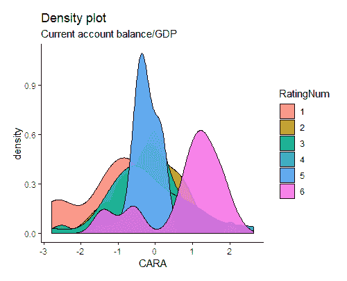

作为目标值，我们有一个取六个不同值的变量。在这个问题中，与上一个问题不同，我们预测的是失败的银行，无法计算六个。

为了评估每个变量预测信用评级的能力，我们可以计算每个变量与目标变量的相关性：

```py
colnames(train_macro_trn)
 ##  [1] "Year"                 "CountryISO"           "CountryName"        
 ##  [4] "RatingMayT1"          "CARA"                 "DCPI"               
 ##  [7] "DGDP"                 "ILMA"                 "PSBR"               
 ## [10] "PUDP"                 "TDRA"                 "YPCA"               
 ## [13] "MEANWGI"              "YearsFromLastDefault"
variables<-colnames(train_macro_trn[,c(4:14)])
```

使用以下代码，我们首先创建我们训练样本的副本，然后将目标变量转换为数值格式。这是因为无法用非数值变量计算相关性。

然后我们将使用`cor`函数计算相关性：

```py
aux<-train_macro_trn
aux$RatingMayT1<-as.numeric(as.character(aux$RatingMayT1)) 
 # Correlation matrix
correlations<-cor(aux[, variables], use="pairwise", method="pearson")
correlations_with_Rating<-as.matrix(correlations[1,])
```

接下来，打印这些相关性：

```py
print(correlations_with_Rating)
 ##                            [,1]
 ## RatingMayT1           1.0000000
 ## CARA                  0.3938594
 ## DCPI                  0.1517755
 ## DGDP                  0.1167254
 ## ILMA                  0.3130267
 ## PSBR                  0.2783237
 ## PUDP                 -0.4172153
 ## TDRA                  0.3854816
 ## YPCA                  0.6491449
 ## MEANWGI               0.8024756
 ## YearsFromLastDefault  0.5132374
```

与信用评级最相关的变量是治理指标的平均值（`MEANWGI`），其次是人均 GDP（`YPCA`）。在这两种情况下，变量的值越高，偿付能力或信用评级值就越高。

另一方面，相关性最弱的变量是消费者价格变化（`DCPI`）。所有变量都有正相关，除了`PUDP`。这意味着一个国家的债务越高，信用评级就越低。

根据文献和信用评级机构提供的方法论指南，所有变量都与信用评级有预期的符号。

在这一点上，我们应该保存我们的工作空间并删除任何不必要的对象：

```py
rm(list=setdiff(ls(), c("macroeconomic_data","train_macro","test_macro","correlations_with_Rating","train_macro_trn","test_macro_trn")))

save.image("Backup3.RData")
```

如所示，观察值和变量的数量与我们在第二章中获得的银行数据集大不相同，*预测银行失败 - 数据收集*。

让我们尝试一些算法来预测信用评级。具体来说，在下一节中，我们将训练一个决策树和一个有序逻辑回归。

# 实现决策树

在之前第五章的“测试随机森林模型”部分（*预测银行失败 - 多变量分析*）中，我们查看随机森林时，简要介绍了决策树。在决策树中，训练样本根据最显著的独立变量分成两个或更多同质集合。在决策树中，找到将数据分成不同类别的最佳变量。信息增益和基尼指数是找到这个变量的最常见方法。然后，数据递归分割，扩展树的叶节点，直到达到停止标准。

让我们看看如何在 R 中实现决策树以及这个算法如何预测信用评级。

决策树在`rpart`包中实现。此外，`rpart.plot`包将有助于稍后可视化我们的训练模型。通过以下步骤实现这些包：

```py
library(rpart)
library(rpart.plot)
```

要创建一个树，我们将使用`rpart`函数。必须指定四个参数：

+   **公式**：在格式目标：`~ predictor1+predictor2+…+predictorN`

+   **数据**：指定数据框

+   **方法**：`class`用于分类树或`anova`用于回归树

+   **控制**：控制树增长的可选参数

在我们的情况下，以下控制参数被指定：

+   `maxdepth`：指最终树中任何节点的最大深度。它定义了分割的数量，换句话说，树可以增长多少，考虑到根节点深度为 0。

+   **复杂度参数**（或`cp`）：此参数也用于控制决策树的大小。此参数可以被认为是增加决策树增长或复杂性的最小增益。如果添加新节点到树中不增加我们的拟合度，算法将停止增长。

让我们训练模型。首先创建一个包含我们变量的列表：

```py
variables<-names(train_macro_trn[,4:14])
print(variables)
 ##  [1] "RatingMayT1"          "CARA"                 "DCPI"                
 ##  [4] "DGDP"                 "ILMA"                 "PSBR"                
 ##  [7] "PUDP"                 "TDRA"                 "YPCA"                
 ## [10] "MEANWGI"              "YearsFromLastDefault"
```

现在，训练了一个决策树：

```py
set.seed(1234)

DT<-rpart(formula = RatingMayT1 ~ ., data = train_macro_trn[,c(variables)], control=rpart.control(maxdepth=5,cp=0.001))
```

模型训练完成后，可以使用`summary`函数打印模型给出的所有信息，尽管这次由于输出量较大而没有打印：

```py
#summary(DT)
```

现在让我们使用决策树预测信用评级，包括训练样本和测试样本：

```py
DT_pr_train <- data.frame(cbind(train_macro_trn$CountryName,train_macro_trn$Year,train_macro_trn$RatingMayT1,predict(DT, newdata=train_macro_trn, type="class")))
colnames(DT_pr_train)<-c("Country","year","Observed","Predicted")

DT_pr_test <- data.frame(cbind(test_macro_trn$CountryName,test_macro_trn$Year,test_macro_trn$RatingMayT1,predict(DT, newdata=test_macro_trn, type="class")))
colnames(DT_pr_test)<-c("Country","year","Observed","Predicted")
```

这是训练样本的混淆表：

```py
table(DT_pr_train$Observed,DT_pr_train$Predicted)
 ##      1  2  3  4  5  6
 ##   1  6  2  0  0  0  0
 ##   2  0 16  5  1  1  0
 ##   3  1  4 22  4  2  0
 ##   4  0  0  7 25  0  0
 ##   5  0  0  7  1 25  1
 ##   6  0  0  0  2  1 35
```

训练好的模型能够预测训练样本中几乎所有的信用评级。现在让我们打印其在测试样本中的准确率：

```py
table(DT_pr_test$Observed,DT_pr_test$Predicted)
 ##      1  2  3  4  5  6
 ##   1  2  0  0  1  0  0
 ##   2  0  3  5  0  0  0
 ##   3  0  1  8  2  0  0
 ##   4  0  0  1  8  1  0
 ##   5  0  0  2  2  7  1
 ##   6  0  0  0  1  1 10
```

为了评估决策树的准确性，我们可以计算不同的指标。具体来说，我们可以计算实际评级值与预测值之间的差异。通过计算这些差异，我们可以测量我们的模型在哪个等级上与实际评级水平不同。

为此，创建了一个函数：

```py
model_assessment<-function(data,model)
{
 data$Observed<-as.numeric(as.character(data$Observed))
 data$Predicted<-as.numeric(as.character(data$Predicted))
 data$df<-abs(as.numeric(data$Predicted)-as.numeric(data$Observed))
 comparison<-as.data.frame(table(data$df))
 comparison$perc<-comparison$Freq/nrow(data)
 colnames(comparison)<-c("notche","N",paste("perc_",model,sep=''))
 comparison$N<-NULL
 comparison$cumulative<-cumsum(comparison[,ncol(comparison)]) 
 return(comparison)
 }
```

这里是不同的结果：

```py
model_assessment(DT_pr_train,"DT")
 ##   notche     perc_DT cumulative
 ## 1      0 0.767857143  0.7678571
 ## 2      1 0.148809524  0.9166667
 ## 3      2 0.077380952  0.9940476
 ## 4      3 0.005952381  1.0000000
```

根据前面的表格，几乎 77%的国家被正确分类。另一方面，14.88%的国家的预测没有被正确分类，但与实际观察到的评级的差异只有一个等级。另一方面，7.74%的国家有一个错误的预测评级，并且这个预测与实际值相差两个等级，等等。

现在将相同的函数应用于测试样本：

```py
model_assessment(DT_pr_test,"DT")
 ##   notche    perc_DT cumulative
 ## 1      0 0.67857143  0.6785714
 ## 2      1 0.25000000  0.9285714
 ## 3      2 0.05357143  0.9821429
 ## 4      3 0.01785714  1.0000000
```

这些结果被认为足够好。外部评级机构提供的信用评级基于定量和定性信息，其中后者最为相关。在我们的案例中，我们仅使用定量公共信息就能预测 68%的评级。

最后，使用`rpart.plot`包绘制决策树：

```py
prp(DT)
```

**YPCA**决策树将如下所示：

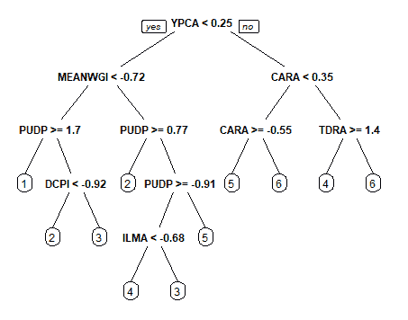

模型不是很容易解释吗？

在开始下一部分之前，让我们保存决策树：

```py
save.image("Backup4.RData")

```

在下一节中，我们将使用另一种有趣的方法，有序逻辑回归，这将能够改进决策树中获得的成果。

# 有序逻辑回归

正如我们所见，决策树在多分类问题中表现良好。我们还可以遵循其他方法。其中之一是逻辑回归，它对一个问题给出六个可能的结果。然而，这种方法有一些局限性。例如，我们假设目标变量中的类别没有顺序。这意味着目标变量中的不同类别或类是名义的。在评级的情况下，这个假设不一定成立，因为评级分配了一个排名。此外，信用评级之间的差异并不相同，这意味着 AAA 和 AA+评级之间的差异不一定等于 BBB 和 BBB-评级之间的差异。

因此，在这本书的这一部分，我们将实现有序逻辑回归，它假设目标变量中有顺序，并且评级之间的差异不是常数。

该模型可以使用`MASS`包中的`polr`函数部署。此函数只需要模型的公式、数据集，在我们的案例中，还需要`Hess=TRUE`选项。此选项将允许我们计算并可视化模型中变量的标准误差：

```py
library(MASS)
ordered_logistic <- polr(RatingMayT1 ~ ., data = train_macro_trn[,c(variables)], Hess=TRUE)
```

然后打印出模型的摘要：

```py
summary(ordered_logistic)
 ## Call:
 ## polr(formula = RatingMayT1 ~ ., data = train_macro_trn[, c(variables)],
 ##     Hess = TRUE)
 ##
 ## Coefficients:
 ##                        Value Std. Error t value
 ## CARA                 -0.3624     0.2520 -1.4381
 ## DCPI                  0.1432     0.1807  0.7924
 ## DGDP                 -0.2225     0.2129 -1.0452
 ## ILMA                  1.5587     0.2592  6.0126
 ## PSBR                  0.6929     0.2209  3.1371
 ## PUDP                 -2.8039     0.3886 -7.2145
 ## TDRA                  0.3070     0.2464  1.2461
 ## YPCA                  2.6988     0.7100  3.8011
 ## MEANWGI               2.2565     0.4707  4.7937
 ## YearsFromLastDefault  0.8091     0.2191  3.6919
 ##
 ## Intercepts:
 ##     Value    Std. Error t value
 ## 1|2 -10.0770   1.1157    -9.0321
 ## 2|3  -5.6306   0.6134    -9.1789
 ## 3|4  -2.4390   0.4011    -6.0810
 ## 4|5   0.4135   0.3615     1.1439
 ## 5|6   4.8940   0.5963     8.2070
 ##
 ## Residual Deviance: 236.9271
 ## AIC: 266.9271
```

前面的表格为我们提供了回归系数表。此外，它还显示了不同截距的估计值，有时被称为**截点**。截距表明预测结果应该在何处被切割，以使数据中观察到的不同信用评级。

此外，该模型为我们提供了残差偏差和`AIC`指标，这些是用于比较不同模型的有用指标。

在前面的结果中，我们看不到任何表示变量是否显著的`p_values`，因为在任何回归中通常都不会显示。因此，我们需要计算它们。

`p_values`可以通过比较`t 值`与标准正态分布来近似计算。首先，我们将使用以下代码存储我们的系数：

```py
coefs <- coef(summary(ordered_logistic))
 print(coefs)
 ##                            Value Std. Error    t value
 ## CARA                  -0.3623788  0.2519888 -1.4380749
 ## DCPI                   0.1432174  0.1807448  0.7923737
 ## DGDP                  -0.2225049  0.2128768 -1.0452282
 ## ILMA                   1.5586713  0.2592360  6.0125575
 ## PSBR                   0.6928689  0.2208629  3.1371002
 ## PUDP                  -2.8038553  0.3886409 -7.2145133
 ## TDRA                   0.3069968  0.2463570  1.2461463
 ## YPCA                   2.6988066  0.7100112  3.8010760
 ## MEANWGI                2.2564849  0.4707199  4.7936888
 ## YearsFromLastDefault   0.8090669  0.2191455  3.6919175
 ## 1|2                  -10.0770197  1.1156894 -9.0321014
 ## 2|3                   -5.6306456  0.6134365 -9.1788566
 ## 3|4                   -2.4389936  0.4010815 -6.0810418
 ## 4|5                    0.4134912  0.3614860  1.1438653
 ## 5|6                    4.8940176  0.5963226  8.2069960
```

如果我们观察系数的符号，有一些负值。显然，一些变量显示出非直观或意外的符号，但在本例中我们无需对此感到担忧。

模型的系数可能有些难以解释，因为它们是以对数形式缩放的。因此，将之前的原始系数转换为概率比是常见的做法。

概率比将按以下方式获得：

```py
exp(coef(ordered_logistic))
 ##                 CARA                 DCPI                 DGDP
 ##           0.69601870           1.15398065           0.80051110
 ##                 ILMA                 PSBR                 PUDP
 ##           4.75250240           1.99944358           0.06057607
 ##                 TDRA                 YPCA              MEANWGI
 ##           1.35933662          14.86198455           9.54946258
 ## YearsFromLastDefault
 ##           2.24581149

```

最后，不同变量的`p_values`被计算并合并到我们获得的系数中：

```py
p_values <- pnorm(abs(coefs[, "t value"]), lower.tail = FALSE) * 2
coefs <- cbind(coefs, "p value" = p_values)
print(coefs)
 ##                            Value Std. Error    t value     p value
 ## CARA                  -0.3623788  0.2519888 -1.4380749 1.504128e-01
 ## DCPI                   0.1432174  0.1807448  0.7923737 4.281428e-01
 ## DGDP                  -0.2225049  0.2128768 -1.0452282 2.959175e-01
 ## ILMA                   1.5586713  0.2592360  6.0125575 1.826190e-09
 ## PSBR                   0.6928689  0.2208629  3.1371002 1.706278e-03
 ## PUDP                  -2.8038553  0.3886409 -7.2145133 5.412723e-13
 ## TDRA                   0.3069968  0.2463570  1.2461463 2.127107e-01
 ## YPCA                   2.6988066  0.7100112  3.8010760 1.440691e-04
 ## MEANWGI                2.2564849  0.4707199  4.7936888 1.637422e-06
 ## YearsFromLastDefault   0.8090669  0.2191455  3.6919175 2.225697e-04
 ## 1|2                  -10.0770197  1.1156894 -9.0321014 1.684062e-19
 ## 2|3                   -5.6306456  0.6134365 -9.1788566 4.356928e-20
 ## 3|4                   -2.4389936  0.4010815 -6.0810418 1.194042e-09
 ## 4|5                    0.4134912  0.3614860  1.1438653 2.526795e-01
 ## 5|6                    4.8940176  0.5963226  8.2069960 2.267912e-16
```

一旦我们开发出我们的模型，我们将预测模型的结果：

```py
Ord_log_pr_train <- cbind(train_macro_trn[,c("CountryName","Year","RatingMayT1")], predict(ordered_logistic, train_macro_trn, type = "probs"))

colnames(Ord_log_pr_train)<-c("Country","year","Observed","X1","X2","X3","X4","X5","X6")
head(Ord_log_pr_train,1)
##Country year Observed      X1           X2          X3         X4
 1 Austria 2010   6      5.468638e-06 4.608843e-04 0.010757249 0.15316033

 ##      X5         X6
 ## 1 0.7811701 0.05444599
```

该模型为每个评级给出了不同的概率。预测评级是预测概率最高的评级。例如，对于 2010 年的奥地利，模型将最高的概率分配给了 5（`X5`）评级，因此预测评级是 5。

以下代码将预测评级分配给最高概率：

```py
for (j in 1:nrow(Ord_log_pr_train))
{
Ord_log_pr_train$maximaPD[j]<-max(Ord_log_pr_train$X1[j],Ord_log_pr_train$X2[j],Ord_log_pr_train$X3[j],Ord_log_pr_train$X4[j],Ord_log_pr_train$X5[j],Ord_log_pr_train$X6[j])
}

Ord_log_pr_train$Predicted<-ifelse(Ord_log_pr_train$X1==Ord_log_pr_train$maximaPD,1,ifelse(Ord_log_pr_train$X2==Ord_log_pr_train$maximaPD,2,ifelse(Ord_log_pr_train$X3==Ord_log_pr_train$maximaPD,3,ifelse(Ord_log_pr_train$X4==Ord_log_pr_train$maximaPD,4,ifelse(Ord_log_pr_train$X5==Ord_log_pr_train$maximaPD,5,6)))))
```

让我们看看模型在训练样本中的准确率：

```py
model_assessment(Ord_log_pr_train,"Ordered_logistic")
 ##   notche perc_Ordered_logistic cumulative
 ## 1      0            0.69047619  0.6904762
 ## 2      1            0.29761905  0.9880952
 ## 3      2            0.01190476  1.0000000
```

如我们所见，该模型能够使用训练样本正确预测 69.05%的信用评级。当使用决策树时，这些结果更好。

让我们看看模型在测试样本中的表现。以下代码给出了每个国家在每个评级水平上的预测概率。预测评级是由概率最高的类别给出的：

```py
Ord_log_pr_test <- cbind(test_macro_trn[,c("CountryName","Year","RatingMayT1")], predict(ordered_logistic, test_macro_trn, type = "probs"))
colnames(Ord_log_pr_test)<-c("Country","year","Observed","X1","X2","X3","X4","X5","X6")
```

以下代码找到概率最高的评级类别，并将其分配为预测评级：

```py
for (j in 1:nrow(Ord_log_pr_test))
{

 Ord_log_pr_test$maximaPD[j]<-max(Ord_log_pr_test$X1[j],Ord_log_pr_test$X2[j],Ord_log_pr_test$X3[j],Ord_log_pr_test$X4[j],Ord_log_pr_test$X5[j],Ord_log_pr_test$X6[j])

 }

Ord_log_pr_test$Predicted<-ifelse(Ord_log_pr_test$X1==Ord_log_pr_test$maximaPD,1,ifelse(Ord_log_pr_test$X2==Ord_log_pr_test$maximaPD,2,ifelse(Ord_log_pr_test$X3==Ord_log_pr_test$maximaPD,3,ifelse(Ord_log_pr_test$X4==Ord_log_pr_test$maximaPD,4,ifelse(Ord_log_pr_test$X5==Ord_log_pr_test$maximaPD,5,6)))))
```

在测试样本中，模型的准确率如下：

```py
model_assessment(Ord_log_pr_test,"Ordered_logistic")
 ##   notche perc_Ordered_logistic cumulative
 ## 1      0            0.57142857  0.5714286
 ## 2      1            0.39285714  0.9642857
 ## 3      2            0.01785714  0.9821429
 ## 4      3            0.01785714  1.0000000
```

结果也略逊于决策树模型。

在开始下一节之前，你现在可以保存工作空间：

```py
save.image("Backup5.RData")
```

在下一节中，我们将使用宏观经济数据来预测国家评级。我们使用的所有变量都是定量变量。在下一节中，我们将使用国家报告来达到相同的目的。

# 使用欧洲国家报告预测主权评级

根据在“使用宏观经济信息预测国家评级”部分描述的基于宏观经济信息的模型，决策树可以被认为是一种预测主权评级的良好替代方法。

然而，定性信息代表了评级分配中一个重要且低透明度的一部分。在本节中，我们提出了一种仅基于所谓的国家报告的模型，这些报告由欧洲委员会发布。

这些报告主要在二月底发布，包含对欧盟成员国经济和社会挑战的年度分析。

例如，在以下链接中，我们可以下载 2018 年发布的国家报告，[`ec.europa.eu/info/publications/2018-european-semester-country-reports_en`](https://ec.europa.eu/info/publications/2018-european-semester-country-reports_en)。对于所有 28 个欧盟国家，我们已经从 2011 年到 2018 年下载了它们的国别报告，并将它们转换为文本格式。我们按年份将它们存储在不同的文件夹中，每个文件夹对应一年：

```py
directories <- list.files(path = "../MachineLearning/CountryReports/", pattern = "201", full.names = TRUE)

print(directories)
 ## [1] "../MachineLearning/CountryReports/2011"
 ## [2] "../MachineLearning/CountryReports/2012"
 ## [3] "../MachineLearning/CountryReports/2013"
 ## [4] "../MachineLearning/CountryReports/2014"
 ## [5] "../MachineLearning/CountryReports/2015"
 ## [6] "../MachineLearning/CountryReports/2016"
 ## [7] "../MachineLearning/CountryReports/2017"
 ## [8] "../MachineLearning/CountryReports/2018"
```

让我们创建一个包含每个文件夹中不同报告名称的列表：

```py
txt_files2011<-list.files(path = directories[1], pattern = ".txt",  recursive=TRUE,full.names = TRUE)
txt_files2012<-list.files(path = directories[2], pattern = ".txt",  recursive=TRUE,full.names = TRUE)
txt_files2013<-list.files(path = directories[3], pattern = ".txt",  recursive=TRUE,full.names = TRUE)
txt_files2014<-list.files(path = directories[4], pattern = ".txt",  recursive=TRUE,full.names = TRUE)
txt_files2015<-list.files(path = directories[5], pattern = ".txt",  recursive=TRUE,full.names = TRUE)
txt_files2016<-list.files(path = directories[6], pattern = ".txt",  recursive=TRUE,full.names = TRUE)
txt_files2017<-list.files(path = directories[7], pattern = ".txt",  recursive=TRUE,full.names = TRUE)
txt_files2018<-list.files(path = directories[8], pattern = ".txt",  recursive=TRUE,full.names = TRUE)
```

这里，文本文件名存储在一个列表中：

```py
country_reports_list<-do.call(c,list(txt_files2011,txt_files2012,txt_files2013,txt_files2014,txt_files2015,txt_files2016,txt_files2017,txt_files2018))
head(country_reports_list)
 ## [1] "../MachineLearning/CountryReports/2011/swp_austria_en_0.txt"      
 ## [2] "../MachineLearning/CountryReports/2011/swp_belgium_en_0.txt"      
 ## [3] "../MachineLearning/CountryReports/2011/swp_bulgaria_en_0.txt"     
 ## [4] "../MachineLearning/CountryReports/2011/swp_cyprus_en_0.txt"       
 ## [5] "../MachineLearning/CountryReports/2011/swp_czechrepublic_en_0.txt"
 ## [6] "../MachineLearning/CountryReports/2011/swp_denmark_en_0.txt"
```

文件名包含根目录和文件名。让我们尝试将国家名称和报告年份分开：

```py
list<-data.frame(country_reports_list)
list<-data.frame(t(data.frame(strsplit(as.character(list$country_reports_list), "/"))))
list<-list[,(ncol(list)-1):ncol(list)]
row.names(list)<-NULL
list<-cbind(list,country_reports_list)
colnames(list)<-c("Year","file","root")
head(list)
 ##   Year                       file
 ## 1 2011       swp_austria_en_0.txt
 ## 2 2011       swp_belgium_en_0.txt
 ## 3 2011      swp_bulgaria_en_0.txt
 ## 4 2011        swp_cyprus_en_0.txt
 ## 5 2011 swp_czechrepublic_en_0.txt
 ## 6 2011       swp_denmark_en_0.txt
 ##                                                                root
 ## 1       ../MachineLearning/CountryReports/2011/swp_austria_en_0.txt
 ## 2       ../MachineLearning/CountryReports/2011/swp_belgium_en_0.txt
 ## 3      ../MachineLearning/CountryReports/2011/swp_bulgaria_en_0.txt
 ## 4        ../MachineLearning/CountryReports/2011/swp_cyprus_en_0.txt
 ## 5 ../MachineLearning/CountryReports/2011/swp_czechrepublic_en_0.txt
 ## 6       ../MachineLearning/CountryReports/2011/swp_denmark_en_0.txt
```

让我们尝试创建一个包含国家名称的列，考虑到每个文件名。例如，如果文件名中包含单词`czech`，将创建一个新列，其中包含`捷克共和国`：

```py
list$CountryMapping<-NA

 list[grep("austria",list$file),"CountryMapping"]<-"Austria"
 list[grep("belgium",list$file),"CountryMapping"]<-"Belgium"
 list[grep("bulgaria",list$file),"CountryMapping"]<-"Bulgaria"
 list[grep("croatia",list$file),"CountryMapping"]<-"Croatia"
 list[grep("cyprus",list$file),"CountryMapping"]<-"Cyprus"
 list[grep("czech",list$file),"CountryMapping"]<-"Czech Republic"
 list[grep("denmark",list$file),"CountryMapping"]<-"Denmark"
 list[grep("estonia",list$file),"CountryMapping"]<-"Estonia"
 list[grep("finland",list$file),"CountryMapping"]<-"Finland"
 list[grep("france",list$file),"CountryMapping"]<-"France"
 list[grep("germany",list$file),"CountryMapping"]<-"Germany"
 list[grep("greece",list$file),"CountryMapping"]<-"Greece"
 list[grep("hungary",list$file),"CountryMapping"]<-"Hungary"
 list[grep("ireland",list$file),"CountryMapping"]<-"Ireland"
 list[grep("italy",list$file),"CountryMapping"]<-"Italy"
 list[grep("latvia",list$file),"CountryMapping"]<-"Latvia"
 list[grep("lithuania",list$file),"CountryMapping"]<-"Lithuania"
 list[grep("luxembourg",list$file),"CountryMapping"]<-"Luxembourg"
 list[grep("malta",list$file),"CountryMapping"]<-"Malta"
 list[grep("netherlands",list$file),"CountryMapping"]<-"Netherlands"
 list[grep("poland",list$file),"CountryMapping"]<-"Poland"
 list[grep("portugal",list$file),"CountryMapping"]<-"Portugal"
 list[grep("romania",list$file),"CountryMapping"]<-"Romania"
 list[grep("slovakia",list$file),"CountryMapping"]<-"Slovakia"
 list[grep("slovenia",list$file),"CountryMapping"]<-"Slovenia"
 list[grep("spain",list$file),"CountryMapping"]<-"Spain"
 list[grep("sweden",list$file),"CountryMapping"]<-"Sweden"
 list[grep("uk",list$file),"CountryMapping"]<-"United Kingdom"
 list[grep("kingdom",list$file),"CountryMapping"]<-"United Kingdom"
 list[grep("netherland",list$file),"CountryMapping"]<-"Netherlands"
```

让我们看看欧盟每个国家有多少个报告：

```py
table(list$CountryMapping)
 ## 
 ## Austria         Belgium   Bulgaria   Croatia  Cyprus  
 ##    8               8         8         6         8 
 ## Czech Republic  Denmark   Estonia    Finland  France 
 ##    8               8         8         8         8 
 ## Germany         Greece    Hungary    Ireland  Italy 
 ##    8               4         8         8         8 
 ## Latvia          Lithuania Luxembourg Malta    Netherlands 
 ##    8               8         8         8         8 
 ## Poland          Portugal  Romania    Slovakia Slovenia 
 ##    8               8         8         8         8 
 ## Spain           Sweden    United Kingdom 
 ##    8               8            8
```

我们为欧盟的所有国家提供了八个不同的报告，除了克罗地亚（只有`6`个报告）和希腊（只有`4`个）。克罗地亚作为欧盟的正式成员国加入是在 2013 年 7 月 1 日。因此，没有 2011 年和 2012 年的报告。至于希腊，2014 年之后没有针对希腊的具体报告。

由于我们打算使用欧洲报告来训练预测信用评级的模型，我们需要选择一些报告来训练模型，其他报告来测试它。在第六章中使用的模型，即*在欧洲联盟中可视化经济问题*（*使用宏观经济信息预测国家评级*）部分中使用的相同国家将再次使用。首先，我们需要选择我们之前用于训练模型的那些国家。然后，我们将选定的国家与对应报告所在的位置名称和根目录合并：

```py
train_list<-train_macro[,c("CountryName","Year")]
train_list$year_report<-train_list$Year+1

train_list<-merge(train_list,list,by.x=c("CountryName","year_report"),by.y=c("CountryMapping","Year"),all.x=TRUE)

train_list<-train_list[complete.cases(train_list),]

files_train<-as.vector(train_list$root)
```

这里是我们将用于训练我们模型的报告示例：

```py
print(head(files_train))
 ## [1] "../MachineLearning/CountryReports/2011/swp_austria_en_0.txt"                       
 ## [2] "../MachineLearning/CountryReports/2012/swd2012_austria_en.txt"                                
 ## [3] "../MachineLearning/CountryReports/2013/swd2013_austria_en.txt"                                
 ## [4] "../MachineLearning/CountryReports/2014/swd2014_austria_en_0.txt"                              
 ## [5] "../MachineLearning/CountryReports/2016/cr2016_austria_en.txt"                                 
 ## [6] "../MachineLearning/CountryReports/2017/2017-european-semester-country-report-austria-en_1.txt"
```

同样的程序用于获取验证或测试样本：

```py
test_list<-test_macro[,c("CountryName","Year")]
test_list$year_report<-test_list$Year+1

test_list<-merge(test_list,list,by.x=c("CountryName","year_report"),by.y=c("CountryMapping","Year"),all.x=TRUE)

test_list<-test_list[complete.cases(test_list),]

files_test<-as.vector(test_list$root)
```

现在我们来看看输出结果：

```py
print(head(files_test))
 ## [1] "../MachineLearning/CountryReports/2015/cr2015_austria_en.txt"                               
 ## [2] "../MachineLearning/CountryReports/2018/2018-european-semester-country-     report-austria-en.txt"
 ## [3] "../MachineLearning/CountryReports/2013/swd2013_belgium_en.txt"                              
 ## [4] "../MachineLearning/CountryReports/2011/swp_bulgaria_en_0.txt"                               
 ## [5] "../MachineLearning/CountryReports/2013/swd2013_bulgaria_en.txt"                             
 ## [6] "../MachineLearning/CountryReports/2014/swd2014_croatia_en.txt"
```

由于一些国家没有报告，与先前模型中使用的样本大小存在一些差异。以下代码显示了这一点：

```py
print(paste("The number of countries used to train previous model was formed by",nrow(train_macro_trn), "countries",sep=" "))

 ## [1] "The number of countries used to train previous model was formed by 168      countries"
```

这是我们将用于训练新模型的国家的数量：

```py
print(paste("The number of countries which we will use to train this new model will be formed by",nrow(train_list), "countries",sep=" "))

 ## [1] "The number of countries which we will use to train this new model will      be formed by 165 countries"
```

这是用于验证先前模型的国家的数量：

```py
print(paste("The number of countries used to validate previous model was formed by",nrow(test_macro_trn), "countries",sep=" "))

 ## [1] "The number of countries used to validate previous model was formed by      56 countries"
```

这是用于训练新模型的国家的数量：

```py
print(paste("The number of countries which we will use to train this new model will be formed by",nrow(test_list), "countries",sep=" "))

 ## [1] "The number of countries which we will use to train this new model will be formed by 53 countries"
```

如您所见，差异并不显著。在将文件读入 R 之前，我们将创建一个读取文件的函数。

一旦运行以下函数，我们就可以迭代地读取不同的报告：

```py
Import_txt <- function(txt) 
{
 x<-as.data.frame(read.delim(txt, header=FALSE, comment.char="#", stringsAsFactors=FALSE))
 return(x)
}
```

将创建两个列表。在每个列表元素中，我们可以找到每个国家的报告：

```py
Reports_train <- lapply(files_train, 
                  function(x) 
                  read.delim(x, 
                             header = FALSE, comment.char="#",
                             stringsAsFactors = FALSE))
Reports_test <-  lapply(files_test, 
                  function(x) 
                  read.delim(x, 
                             header = FALSE, comment.char="#",
                             stringsAsFactors = FALSE))
```

在继续之前，可以删除一些不必要的对象，并保存工作区：

```py
rm(list=setdiff(ls(), c("macroeconomic_data","Reports_train","Reports_test","train_list","test_list")))
save.image("Backup6.RData")
```

报告需要预处理。在提取有用信息或特征以构建我们的模型之前，需要进行数据预处理。

数据清理，或数据预处理，涉及将数据转换为纯文本，然后删除格式、空白、数字、大写字母和停用词。

**停用词**是指在一种语言中如此常见，以至于它们的信息价值实际上为零的词。由于所有国家报告都可用英文，这些停用词的例子包括介词、限定词和连词。

为了进行这些预处理步骤，加载了`tm`包，并将报告转换为语料库格式：

```py
library(tm)
docs_train <- as.VCorpus(Reports_train)

docs_test <- as.VCorpus(Reports_test)
```

创建以下函数以逐个清理我们的报告：

```py
corpus_treatment<-function(corpus)
{

 toSpace <- content_transformer(function(x, pattern) {return (gsub(pattern, " ", x))})

 corpus <- tm_map(corpus,PlainTextDocument)
 corpus <- tm_map(corpus, toSpace, "-")
 corpus <- tm_map(corpus, toSpace, ":")
 corpus <- tm_map(corpus, removePunctuation)
 corpus <- tm_map(corpus, toSpace, "'")
 corpus <- tm_map(corpus, toSpace, "'")
 corpus <- tm_map(corpus, toSpace, " -")
 corpus <- tm_map(corpus,content_transformer(tolower))
 corpus <- tm_map(corpus, removeNumbers)
 corpus <- tm_map(corpus, removeWords, stopwords("english"))
 corpus <- tm_map(corpus, stripWhitespace)
 return(corpus)
}
```

这些报告通过应用以下函数进行转换：

```py
docs_train<-corpus_treatment(docs_train)
docs_test<-corpus_treatment(docs_test)
```

将进行一项额外的分析，称为**词干提取**。词干提取过程是指删除词尾以检索词的根（或词干），这在不显著损失信息的情况下减少了数据的复杂性。

因此，动词*argue*将被缩减为词干*argu*，无论文本中该词的形式或复杂性如何。因此，其他形式如*argued*、*argues*、*arguing*和*argus*也将缩减到相同的词干。词干提取过程减少了需要考虑的单词数量，并提供了更好的频率表示。

词干提取过程使用的是`SnowballC`包：

```py
library(SnowballC)
docs_train <- tm_map(docs_train,stemDocument)
docs_test <- tm_map(docs_test,stemDocument)
```

在预处理过程之后，考虑国家报告构建了一个矩阵（文档-词矩阵）。这个矩阵的每一行代表每个国家报告，每一列代表在它们上观察到的所有单词。

如果一个词出现在某个国家的报告中，则对应行和列的矩阵条目为 1，否则为 0。当记录文档内的多次出现时，即如果一个词在报告中出现两次，则在相关矩阵条目中记录为 2。

然而，一些提取的单个单词可能缺少原始文本中包含的重要信息，例如词与词之间的依赖关系和高频词周围的上下文。

例如，在报告中提取单词*unemployment*无法提供足够的信息来解释该术语是积极的还是消极的。因此，从报告中提取的是两个单词的组合，而不是单个单词。

以这种方式，可以在信用度较低的国家中找到一些可能更频繁出现的组合，例如*高失业率*。

我们将使用名为`Rweka`的包来提取单词组合：

```py
library(RWeka)
```

创建以下函数以获取报告中`1`和`2`个单词的组合：

```py
options(mc.cores=4)

BigramTokenizer <- function(x) NGramTokenizer(x, Weka_control(min = 1, max = 2))
```

现在获得了报告的训练和测试样本的文档-词矩阵。只有长度超过`3`个字符且小于`20`个字符的单词将被考虑：

```py
tdm2_train <- TermDocumentMatrix(docs_train, control = list(tokenize = BigramTokenizer,wordLengths = c(3,20)))
```

在验证样本的情况下，我们将考虑在训练样本中找到的单词字典来计算矩阵。测试样本中找到的新单词将不予考虑。请记住，我们不能使用测试样本中找到的单词来开发模型，这意味着，现在我们应该假装测试样本不存在来训练算法。

因此，当在报告的测试样本上计算文档-术语矩阵时，我们应该在我们的函数中添加一个新参数：`dictionary = Terms(tdm2_train)`。这在上面的代码中显示：

```py
tdm2_test <- TermDocumentMatrix(docs_test, control = list(dictionary = Terms(tdm2_train),tokenize = BigramTokenizer,wordLengths = c(3,20)))
```

让我们分析结果矩阵：

```py
tdm2_train
 ## <<TermDocumentMatrix (terms: 609929, documents: 165)>>
 ## Non-/sparse entries: 2034690/98603595
 ## Sparsity           : 98%
 ## Maximal term length: 20
 ## Weighting          : term frequency (tf)
tdm2_test
 ## <<TermDocumentMatrix (terms: 609929, documents: 53)>>
 ## Non-/sparse entries: 504543/31821694
 ## Sparsity           : 98%
 ## Maximal term length: 20
 ## Weighting          : term frequency (tf)
```

第一行表示每个样本中不同术语的数量和报告的数量。每个矩阵的列数或术语数是相同的，属于我们在训练样本中找到的总单词列表。

总共有 609,929 个术语至少在国家报告的训练样本中出现过一次。

此外，在训练矩阵中，有 98,603,595 个单元格的频率为 0，而 2,034,690 个单元格具有非零值。因此，所有单元格中有 98%是零。这种情况在文本挖掘问题中非常常见。当一个矩阵包含许多零值单元格时，它被认为是稀疏矩阵。

`removeSparseTerms`函数将删除使用频率较低的单词，只留下语料库中最常用的单词。

在我们的情况下，我们将矩阵减少到最多保留 75%的空空间。这个过程必须只应用于我们稍后用于训练模型的那些数据：

```py
tdm2_train2 <- removeSparseTerms(tdm2_train, 0.75)
tdm2_train2
 ## <<TermDocumentMatrix (terms: 6480, documents: 165)>>
 ## Non-/sparse entries: 589204/479996
 ## Sparsity           : 45%
 ## Maximal term length: 20
 ## Weighting          : term frequency (tf)
```

我们现在用于训练模型的矩阵有 6,480 个术语。

让我们观察我们的矩阵看起来是什么样子：

```py
print(as.matrix(tdm2_train2[1:10, 1:4]))
 ##             Docs
 ## Terms        character(0) character(0) character(0) character(0)
 ##   ­ gj                  0            0            0            0
 ##   ­ mwh                 0            0            0            0
 ##   ± ±                  0            0            0            0
 ##   à vis                1            1            1            5
 ##   abil                 0            1            1            2
 ##   abl                  0            1            1            0
 ##   abl afford           0            0            0            0
 ##   abolish              1            1            3            1
 ##   abroad               2            4            3            0
 ##   absenc               0            0            0            0
```

例如，单词`abroad`在第一份报告中出现了`2`次，在第二份报告中出现了`4`次。只需记住，在之前的步骤中已经进行了词干提取，所以只显示单词的根。矩阵中也包含单个单词和两个单词的组合。

在前面代码中显示的报告名称是按照我们最初用来导入报告的列表顺序排列的。具体来说，前四个文档属于以下：

```py
print(head(as.character(train_list$root),4))
## [1] "../MachineLearning/CountryReports/2011/swp_austria_en_0.txt"   
## [2] "../MachineLearning/CountryReports/2012/swd2012_austria_en.txt" 
## [3] "../MachineLearning/CountryReports/2013/swd2013_austria_en.txt" 
## [4] "../MachineLearning/CountryReports/2014/swd2014_austria_en_0.txt"
```

也可能获得术语及其频率的完整列表：

```py
freq <- rowSums(as.matrix(tdm2_train2))
ord <- order(freq,decreasing=TRUE)
```

这是出现频率最高的术语列表：

```py
freq[head(ord,20)]

 ##    gdp    rate increas  market  labour  sector     tax  growth  public
 ##  20566   16965   15795   15759   15751   15381   14582   14545   14515
 ##   year  employ  energi  invest  measur  govern    debt    bank    term
 ##  13118   12481   12330   12027   11341   10903   10854   10668   10470
 ##  averag  social
 ##  10059   10051
```

为了可视化，我们可以创建一个包含我们文档中最频繁单词的词云图。为此，我们可以使用`wordcloud`包：

```py
library(wordcloud)
set.seed(1234)
wordcloud(row.names(tdm2_train2), freq = freq, max.words=200,min.freq=4000,scale=c(2,.4),
random.order = FALSE,rot.per=.5,vfont=c("sans serif","plain"),colors=palette())
```

结果看起来就是这样：


看起来很漂亮，对吧？

现在，我们需要将之前的矩阵转换为以国家为行、术语为列。简而言之，我们需要转置训练和测试矩阵：

```py
tdm2_train2 <- as.matrix(tdm2_train2)
dim(tdm2_train2)
## [1] 6480  165
tdm2_train2 <- t(tdm2_train2)
tdm2_test2<-as.matrix(tdm2_test)
tdm2_test2 <- t(tdm2_test2)

rm(tdm2_test)
```

再次，一些无关的对象被移除了：

```py
rm(list=setdiff(ls(), c("macroeconomic_data","train_list","test_list","tdm2_test2","tdm2_train2")))
```

并且工作区再次保存为备份：

```py
save.image("Backup7.RData")
```

到目前为止，我们已经处理了我们的报告，并从中提取了一些特征、术语和单词组合。尽管如此，目标变量，即国家评级，并不在我们新的数据集中。信用评级仅在`macroeconomic_data`样本中存在。

在下面的代码中，我们将为最近创建的训练和验证矩阵添加信用评级：

```py
train_list<-merge(train_list[,c("Year","CountryName","year_report")],macroeconomic_data[,c("CountryName","Year","RatingMayT1")],by=c("CountryName","Year"),all.x=TRUE)

test_list<-merge(test_list[,c("Year","CountryName","year_report")],macroeconomic_data[,c("CountryName","Year","RatingMayT1")],by=c("CountryName","Year"),all.x=TRUE)
training <- cbind(train_list,tdm2_train2)

validation <- cbind(test_list,tdm2_test2)
```

由于我们模型中要训练的特征数量相当高（超过 6,000 个），我们将评估我们的特征与信用评级的相关性，以帮助排除其中的一些。

首先，我们将创建一个包含我们的术语列表和与信用评级相关性的数据框。前三个变量必须排除。以下代码显示了这一点：

```py
head(colnames(training),7)

## [1] "CountryName" "Year"        "year_report" "RatingMayT1" "­ gj"       
## [6] "­ mwh"       "± ±"
```

现在我们有了相关性，让我们按降序排列它们：

```py
correlations<-data.frame(correlations)
colnames(correlations)<-c("word","correlation")
correlations$abs_corr<-abs(as.numeric(as.character(correlations$correlation)))
correlations<-correlations[order(correlations$abs_corr,decreasing = TRUE),]
correlations = matrix("NA",nrow=(ncol(training)-4),2) 
ncolumns<-ncol(training)

 for (i in 5:ncolumns)
{
   correlations[i-4,1]<-colnames(training[i])
   correlations[i-4,2]<-  as.numeric(cor(training[,i],as.numeric(as.character(training[,"RatingMayT1"]))))
}
```

这里是信用评级相关性最高的前 10 个变量：

```py
head(correlations,10)
 ##               word        correlation  abs_corr
 ## 3245        judici -0.495216233392176 0.4952162
 ## 1175         court   -0.4939081009835 0.4939081
 ## 132      administr -0.470760214895828 0.4707602
 ## 3710       migrant  0.460837714113155 0.4608377
 ## 1343         delay  -0.46038844705712 0.4603884
 ## 468     background  0.455839970556903 0.4558400
 ## 116          adequ -0.445062248908142 0.4450622
 ## 2811        immigr  0.428818668867468 0.4288187
 ## 3246 judici system  -0.42745138771952 0.4274514
 ## 6106      undeclar -0.419206156830568 0.4192062
```

显然，来自诸如*司法*等单词的`judici`词根与信用评级高度相关。负号表示在报告中出现频率非常高的特定单词的国家信用质量较低。

我们将只使用前 1,000 个单词来训练我们的模型。这里创建了一个包含前 1,000 个术语的列表：

```py
list_vars<-dput(as.vector(correlations$word[1:1000]))
```

在训练模型之前，让我们再次保存工作空间：

```py
save.image("Backup8.RData")
```

是时候训练模型了。选定的模型是一个纯 Lasso 模型，因为已经证明这种模型在列数或特征数较多的情况下效果良好，它作为一种变量选择的方法。

这种方法已经在*第五章：预测银行失败 - 多变量分析*中使用过，使用了`h2o`包。这次，我们仅为了学术目的使用`glmnet`包，目的是让读者可以应用不同的解决方案：

```py
library(glmnet)
```

`glmnet` 包需要一个包含变量的矩阵和一个包含类别标签或目标值的向量。

让我们确保我们的目标变量是一个`factor`：

```py
training$RatingMayT1<-as.factor(training$RatingMayT1)
validation$RatingMayT1<-as.factor(validation$RatingMayT1)
```

依赖变量和独立变量存储在不同的对象中，如下面的代码所示，以训练模型：

```py
xtrain<-training[,list_vars]
ytrain<-training$RatingMayT1
```

与前面的代码一样，相同的步骤在验证样本中执行：

```py
validation$RatingMayT1<-as.factor(validation$RatingMayT1)
xtest<-validation[,list_vars]
ytest<-validation$RatingMayT1
```

我们还将使用`cv.glmnet`函数在训练过程中，该函数自动执行网格搜索以找到 Lasso 算法中所需的λ的最佳值。

此函数中最重要的参数如下：

+   `y`：我们的目标变量，在本例中，是信用评级。

+   `x`：一个包含我们特征所有独立变量的矩阵。

+   `alpha`：在我们的情况下，值为`1`表示模型是 Lasso。

+   `family`：我们的响应变量的类型。如果目标变量只有两个水平，则应将`family`定义为`binomial`。在我们的情况下，由于我们的目标变量显示超过两个水平，因此应将`family`指定为`multinomial`。

+   `type.multinomial`：如果`grouped`，则对变量的`multinomial`系数使用分组 Lasso 惩罚。默认为`ungrouped`。

+   `parallel`：如果`TRUE`，算法将以并行方式处理。这意味着算法将不同的任务分割并同时执行，显著减少训练时间。

下面是使用当前数据的此函数的应用：

```py
set.seed(1234)

ModelLasso <- cv.glmnet(y =  ytrain, x=data.matrix(xtrain[,list_vars]), alpha=1,family='multinomial',type.multinomial = "grouped",parallel=TRUE)
```

在执行此代码的过程中，出现了一个警告信息：`one multinomial or binomial class has fewer than 8 observations; dangerous ground`。

问题在于我们对于目标变量中的所有类别都没有足够的观测数据。我们可以通过运行以下代码来检查目标变量中不同类别的数量：

```py
table(ytrain)
 ## ytrain
 ##  1  2  3  4  5  6 
 ##  5 23 33 32 34 38
```

对于评级`1`，只有`5`个观测值。因此，对于这个类别，可能不会期望有任何稳定的估计。

一种可能的解决方案是将评级`1`和`2`合并到同一个评级类别中：

```py
ytrain<-gsub("1","2",ytrain)
ytest<-gsub("1","2",ytest)
```

现在，问题应该不会出现了：

```py
table(ytrain)
 ## ytrain
 ##  2  3  4  5  6 
 ## 28 33 32 34 38
set.seed(1234)

ModelLasso <- cv.glmnet(y =  ytrain, x=data.matrix(xtrain[,list_vars]), alpha=1,family='multinomial',type.multinomial = "grouped")
```

模型训练完成后，以下图表有助于找到减少模型误差的`lambda`参数：

```py
plot(ModelLasso)
```

根据以下图表，最优对数值大约为`-3`：

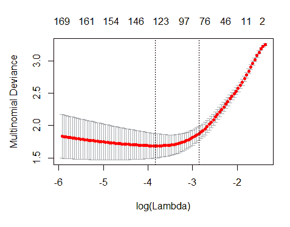

可以通过检查代码中的`lambda_min`变量来查看确切值：

```py
log(ModelLasso$lambda.min)
## [1] -3.836699
```

正则化方法的目标是在准确性和简单性之间找到一个平衡点，这意味着要获得一个具有最小系数数量且也能给出良好准确率的模型。在这方面，`cv.glmnet`函数也有助于找到误差在最小误差一倍标准差内的模型。

这个`lambda`值可以在`lambda.1se`变量中找到。这个值将被选为我们模型的最终`lambda`值：

```py
best_lambda <- ModelLasso$lambda.1se
print(best_lambda)
## [1] 0.05727767
```

现在，是时候评估我们模型的准确率了。首先，让我们看看训练样本：

```py
predictLASSO_train <- predict(ModelLasso, newx = data.matrix(xtrain[,list_vars]), 
type = "class", s = ModelLasso$lambda.1se)

predictLASSO_train<-as.data.frame(cbind(training[,1:2],ytrain ,predictLASSO_train))
colnames(predictLASSO_train)<-c("Country","Year","Rating","Prediction")
```

以下表格是训练样本的结果表：

```py
table(predictLASSO_train$Rating,predictLASSO_train$Prediction)
 ##      2  3  4  5  6
 ##   2 27  0  0  0  1
 ##   3  1 32  0  0  0
 ##   4  0  1 30  0  1
 ##   5  0  0  0 33  1
 ##   6  0  0  0  1 37
```

现在，让我们看看验证样本的准确率：

```py
predictLASSO_test <- predict(ModelLasso, newx = data.matrix(xtest), 
type = "class", s = ModelLasso$lambda.1se)

predictLASSO_test<-as.data.frame(cbind(validation[,1:2],ytest ,predictLASSO_test))
colnames(predictLASSO_test)<-c("Country","Year","Rating","Prediction")
```

以下表格是验证样本的结果表：

```py

table(predictLASSO_test$Rating,predictLASSO_test$Prediction)
 ##      2  3  4  5  6
 ##   2  5  3  1  0  1
 ##   3  1  7  1  0  0
 ##   4  0  0  7  0  3
 ##   5  0  1  1  8  2
 ##   6  0  0  0  2 10
```

考虑到我们使用了国家报告，结果似乎已经足够好。正如我们使用宏观经济数据训练模型时做的那样，我们将使用以下函数计算正确分类国家的百分比：

```py
model_assessment<-function(data,model)
 {
 data$Observed<-as.numeric(as.character(data$Rating))
 data$Predicted<-as.numeric(as.character(data$Prediction))
 data$df<-abs(as.numeric(data$Predicted)-as.numeric(data$Observed))
 comparison<-as.data.frame(table(data$df))
 comparison$perc<-comparison$Freq/nrow(data)
 colnames(comparison)<-c("notch","N",paste("perc_",model,sep=''))
 comparison$N<-NULL
 return(comparison)
 }
```

让我们运行这个模型的评估：

```py
model_assessment(predictLASSO_train,"Train_LASSO")
 ##   notch perc_Train_LASSO
 ## 1     0      0.963636364
 ## 2     1      0.024242424
 ## 3     2      0.006060606
 ## 4     4      0.006060606
model_assessment(predictLASSO_test,"Test_LASSO")
 ##   notch perc_Test_LASSO
 ## 1     0      0.69811321
 ## 2     1      0.18867925
 ## 3     2      0.09433962
 ## 4     4      0.01886792
```

Lasso 模型在验证样本中能够正确预测 69.81%的国家。由此得到的模型在仅使用宏观经济数据获得的结果上略有改进，达到了 67.86%的准确率。

最后，评估国家报告中出现并决定国家信用评级的最重要的术语是非常有趣的。

以下函数用于提取模型的系数：

```py
coefs<-coef(ModelLasso, s = "lambda.1se")
```

结果是一个列表，列出了每个评级级别的不同系数。例如，信用评级 1 和 2（这些类别在此部分之前已合并）的系数被获得。这将在以下代码中显示：

```py
coefs2<-coefs$`2`
 list_coefs2<-as.data.frame(coefs2@Dimnames)
 colnames(list_coefs2)<-c("variable","id")
 list_coefs2$id<-as.numeric(row.names(list_coefs2))-1
 aux_coefs2<-cbind(as.data.frame(coefs2@i),as.data.frame(coefs2@x))
 colnames(aux_coefs2)<-c("id","coefficient")
 list_coefs2<-merge(list_coefs2,aux_coefs2,by.x="id")
 rm(coefs2,aux_coefs2)
```

这里显示了一些最相关的术语：

```py
head(list_coefs2[order(list_coefs2$coefficient,decreasing = TRUE),],10)
 ##     id         variable coefficient
 ## 18  69      financ need  0.24991828
 ## 37 192        personnel  0.13635379
 ## 44 305          outflow  0.11243899
 ## 15  51    energi sector  0.06854058
 ## 24  97    minimum incom  0.05821313
 ## 39 216     gross extern  0.05237113
 ## 10  37          resolut  0.04807981
 ## 72 700           analyt  0.03036531
 ## 75 774 healthcar sector  0.02997181
 ## 26 102   social benefit  0.02572995
```

正面的迹象表明，一个术语在国别报告中出现的频率越高，该国的信用质量就越低。

让我们检查这是否被正确观察到。例如，模型检查了 2018 年塞浦路斯国别报告中包含`financ need`的一些句子。以下是报告的三个部分：

+   塞浦路斯似乎不面临立即的财政压力风险，这主要得益于其有利的财政地位。这主要归功于一般政府财政平衡和初级平衡的改善、低融资需求以及相对较低短期一般政府债务。这些因素超过了仍然相当大的公共债务。然而，宏观金融方面的短期风险仍然显著。

+   融资渠道有限和降低债务的需求仍然抑制了私营部门的投资。

+   公共债务显著下降，但仍然很高，2017 年约为 GDP 的 99%。高公共债务使塞浦路斯容易受到金融或经济冲击。然而，在经济调整计划期间，外部债权人提供的长期低息债务的大比例、当前低主权债券收益率以及相对较低的中期融资需求减轻了再融资风险。

在这三个部分中，去除了停用词，这也是找到`financ need`的原因。

对于最佳的评级类别，也可以得到不同的系数。这可以通过以下代码实现：

```py
coefs6<-coefs$`6`
 list_coefs6<-as.data.frame(coefs6@Dimnames)
 colnames(list_coefs6)<-c("variable","id")
 list_coefs6$id<-as.numeric(row.names(list_coefs6))-1
 aux_coefs6<-cbind(as.data.frame(coefs6@i),as.data.frame(coefs6@x))
 colnames(aux_coefs6)<-c("id","coefficient")
 list_coefs6<-merge(list_coefs6,aux_coefs6,by.x="id")
 rm(coefs6,aux_coefs6)
```

这里是我们找到的一些最相关的术语：

```py
head(list_coefs6[order(list_coefs6$coefficient,decreasing = TRUE),],10)
 ##     id         variable coefficient
 ## 45 309          remaind  0.22800169
 ## 1    0      (Intercept)  0.20122381
 ## 7   20    govern balanc  0.15410796
 ## 81 899         stimulus  0.11734883
 ## 82 918   europ strategi  0.06968609
 ## 17  57 interest payment  0.05516403
 ## 49 367     fiscal posit  0.04272709
 ## 65 568   contribut rate  0.03101503
 ## 38 207            decad  0.03063200
 ## 2    6       background  0.03029957
```

还获得了一些示例报告的句子。例如，对于 2018 年的德国，以下句子包含`govern balanc`的组合：

+   德国一直改善其政府平衡，从 2014 年开始转变为盈余。

+   积极的政府平衡也反映在政府债务的下降上，2015 年达到 70.9%，进一步下降到 2016 年的 68.1%。

最后，为了以防万一你想以后使用，请备份所有你的模型：

```py
save.image("Backup9.RData")
```

# 摘要

在本章中，你学习了文本挖掘和主题提取的一些基本概念。你现在应该知道如何读取文本文件并处理原始文本以获取有用的常用词。此外，你现在能够在自己的问题中使用以文本格式收集的信息。

根据您想要解决的数据量和问题类型，您现在可以应用本书中先前使用过的各种技术，无论是简单的还是复杂的。

最后，考虑到本章内容，你已经准备好深入探索其他更近和更有前景的技术，例如 `word2vec` 和 `doc2vec`，这两种都是高级技术，允许你在文本和文档中发现相关信息或主题。如果你对此感兴趣，可以进一步研究这些主题。

我希望你对机器学习有了深入的了解，并且这本书帮助你开始了使用机器学习解决问题的旅程。感谢阅读，祝您一切顺利！
