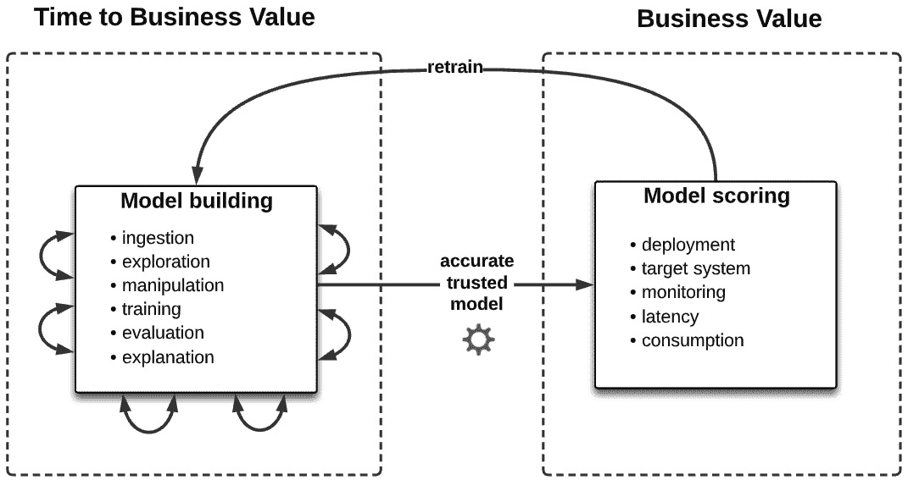
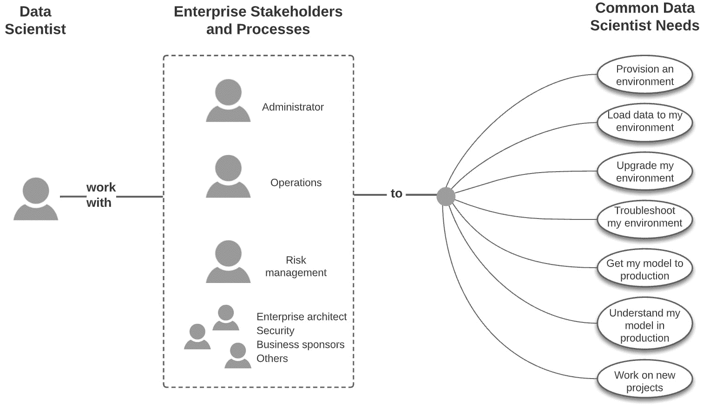
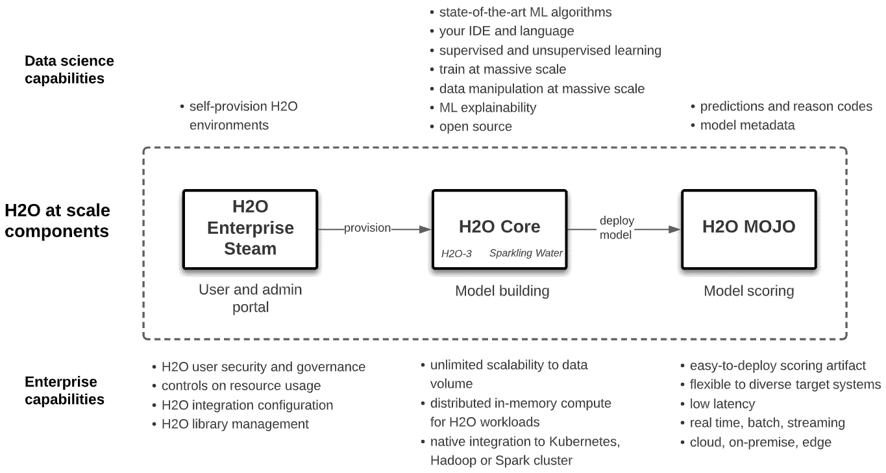

# 第一章：机遇与挑战

**机器学习**（**ML**）和数据科学正在赢得一场某种程度的受欢迎竞赛，正如其在流行和专业媒体中的头条报道以及技术领域不断扩大的职位空缺所见证的那样。学生通常使用自己的电脑在相对较小的数据集上学习 ML 技术。那些进入这个领域的人通常会发现自己处于一个完全不同的环境中，即一个大型公司，那里有工人执行专业的工作角色，同时与其他分散在全国或世界各地的人合作。数据科学学生和数据科学工作者有一些共同的关键点——他们在一个令人兴奋且不断发展的领域中，这个领域对企业未来的重要性被认为越来越关键，而他们所依赖的数据正以指数级增长和多样化。

企业中 ML 有着巨大的机遇，因为 ML 对商业、客户、患者等产生的变革性影响是多样化的、广泛的、有利可图的，甚至是改变生活的。同时，也存在紧迫的背景，因为所有竞争对手都在尝试同样的事情。因此，企业有动力投资于重大的 ML 转型，并提供必要的数据、工具、生产系统和人员，以实现 ML 成功。但挑战也同样巨大，而且这些挑战通常围绕着规模展开。规模的挑战以许多企业级 ML 固有的形式出现。

在本章中，我们将通过涵盖以下主要主题来定义和探讨扩规模的 ML 挑战：

+   扩规模的 ML

+   ML 生命周期和扩规模的 ML 三个挑战领域

+   H2O.ai 对这些挑战的回应

# 扩规模的 ML

本书是关于实施扩规模的 ML 以及如何使用 H2O.ai 技术取得成功的。我们具体指的是什么叫做扩规模的 ML？在 ML 生命周期中，我们可以看到三个扩规模的环境和挑战——从大型数据集中构建模型，在企业生产环境中部署这些模型，以及在企业流程和利益相关者的复杂性中执行 ML 活动的全部范围。这总结在以下图中：

![图 1.1 – 扩规模的 ML 的挑战]

![img/B16721_01_01.jpg]

图 1.1 – 扩规模的 ML 的挑战

让我们进一步深入探讨这些挑战。在这样做之前，我们将概述机器学习（ML）的生命周期的一般概念，这将在整本书中作为参考。

# ML 生命周期和扩规模的 ML 三个挑战领域

ML 生命周期是一个数据科学家和企业利益相关者遵循的过程，用于构建 ML 模型并将它们投入生产环境，在那里它们做出预测并实现价值。在本节中，我们将定义一个简化的 ML 生命周期，并详细阐述两个对扩规模的 ML 带来特殊挑战的广泛领域。

## 简化的 ML 生命周期

我们将使用以下机器学习生命周期表示。目标是实现一个简化的描述，我们都能认识到它是机器学习的核心，同时避免试图给出一个权威的定义。让我们将其作为讨论的工作框架：

![图 1.2 – 简化的机器学习生命周期

![img/B16721_01_02.jpg]

图 1.2 – 简化的机器学习生命周期

以下是一个简要的阐述。

### 模型构建

模型构建是一个高度迭代的流程，在构建一个值得在商业环境中部署的预测模型的过程中，会有频繁且不可预测的反馈循环。步骤可以总结如下：

+   **数据摄取**：从数据源或模型构建环境中的存储层中提取数据。通常，在此之后会有大量工作，用于寻找和访问可能有用的数据源，并将数据转换为可用的形式。通常，这作为更大数据管道和架构的一部分来完成。

+   **数据探索**：探索数据以了解其特性（例如，数据概览、相关性分析、异常检测和数据可视化）。

+   **数据处理**：数据被清理（例如，缺失数据的插补、分类特征的降维和归一化）并生成新的特征。

+   **模型训练**：选择一个机器学习算法、评分指标和验证方法，并在一系列超参数范围内调整模型，然后使用测试数据集对其进行测试。

+   **模型评估和可解释性**：对模型的拟合进行诊断，以评估性能指标、过拟合和其他诊断；使用模型可解释性来验证领域知识，解释模型在个体和全局层面的决策，并防范如对人口群体不公平偏见等机构风险。

+   **模型部署**：将模型作为评分工件部署到软件系统中，并进行实时评分。

+   **模型监控**：监控模型以检测输入数据随时间变化是否与训练数据分布不同。这被称为数据漂移，通常会导致模型预测能力的下降。这通常触发需要使用更当前的数据集重新训练模型，然后重新部署更新后的模型。模型也可能被监控以检测其他模式，例如是否对特定人口群体做出偏见决策，以及是否正在尝试通过恶意攻击导致模型故障。

如前所述，工作流程中的一个关键属性是在模型部署之前或项目被认为未能达到该阶段之前，在这些步骤之间采取的未知数量和顺序的迭代路径。

## 模型构建挑战 – 规模化的最先进模型

现在，让我们定义大数据集为任何超出您在笔记本电脑或本地工作站上构建机器学习模型能力的数据集。这可能是因为您的库直接崩溃，或者因为它们需要不合理的时间来完成。这种情况可能发生在模型训练期间，也可能发生在数据摄入、探索和操作期间。

我们可以看到从大数据量构建机器学习模型时存在的四个单独的挑战，每个挑战都导致了一个更大的问题，我们称之为*迭代的摩擦*。这在上面的图中表示：

![Figure 1.3 – 大数据量建模的挑战

![img/B16721_01_03.jpg]

图 1.3 – 大数据量建模的挑战

让我们详细说明这一点。

### 第一大挑战 – 数据大小和位置

企业收集和存储了大量的多样化数据，这对希望构建准确模型的数据科学家来说是一大福音。这些数据集要么存储在许多系统中，要么集中在一个共同的存储层（数据湖）中，例如**Hadoop 分布式文件系统**（**HDFS**）或**AWS S3**。为内部消费者架构和提供数据是一项重大的努力和挑战。然而，数据科学家在开始使用大数据集的机器学习生命周期时，由于安全原因或数据量过大，一旦数据变得可访问，通常无法将其移动到本地环境。结果是，数据科学家必须做以下之一：

+   将数据操作（换句话说，将计算）移动到数据本身。

+   将数据移动到他们有权使用的计算密集型环境。

### 第二大挑战 – 数据大小和数据操作

操作数据可能非常计算密集，如果尝试在资源不足的情况下进行，可能会导致计算失败（例如，脚本、库或工具会崩溃）或花费不合理的长时间。谁愿意等待 10 小时来连接和过滤表数据，而实际上可以在 10 分钟内完成？您可能认为不合理的时间显然与数据集大小有关；处理数以兆字节计的数据总是比处理几兆字节的数据需要更长的时间。无论如何，您数据处理的速度对于减少迭代总时间至关重要。

### 第三大挑战 – 数据大小和数据探索

数据探索期间的数据大小挑战与数据操作期间的数据大小挑战相同。数据可能如此之大，以至于在探索模型时，您的处理会崩溃或花费不合理的时间来完成。

### 第四大挑战 – 数据大小和模型训练

机器学习算法极其**计算密集型**，因为它们会遍历数据集的每一条记录，并在每次遍历中进行复杂的计算，然后反复对这些计算进行迭代，以优化训练指标，从而在噪声中学习预测数学模式。我们的计算环境在模型训练期间尤其紧张。

迄今为止，我们一直在相对意义上讨论数据集的大小；也就是说，大量数据量是那些在给定计算环境中导致操作失败或需要很长时间才能完成的数据量。

从绝对意义上讲，数据科学家通常会探索尽可能大的数据集来理解它，然后**抽样**用于模型训练。其他人总是试图使用最大的数据集进行模型训练。然而，从 10 GB 或更少的数据中，无论是抽样还是未抽样，都可以构建出准确模型。

正确使用抽样的关键是，你已经遵循了适当的统计和理论实践，而不是因为你被迫这样做，因为你的机器学习处理会因为大量数据而崩溃或需要很长时间才能完成。后者是一种不良实践，会产生劣质模型，而 H2O.ai 通过允许使用大量数据进行模型构建来克服这一点。

也有这样的情况，数据抽样可能不会导致一个可接受的模型。换句话说，数据科学家可能需要数百 GB 或更多数据来构建一个有价值的模型。在这些情况下，以下适用：

+   数据科学家不相信抽样能产生最佳模型，并认为每次提升的微小收益都值得使用完整的数据集。

+   数据科学家不想将数据分割成单独的数据集，从而进行单独的模型构建练习，或者更大的利益相关者群体希望有一个单一的模型在生产中预测所有细分市场，而不是每个细分市场都预测一个单一的市场。

+   数据具有高度维度、稀疏性，或者两者兼而有之。在这种情况下，需要大量记录来减少训练数据集的方差和过拟合。这种类型的数据库在异常检测、推荐引擎、预测性维护、安全威胁检测、个性化医疗等领域很典型。值得注意的是，未来将带给我们越来越多的数据，因此高度维度和稀疏的数据库将变得更加普遍。

+   数据极度不平衡。目标变量在数据集中非常罕见，需要大量数据集来避免欠拟合、过拟合或从这些不频繁的记录中加权目标变量。

+   数据非常波动。收集到的每个数据子集都不代表其他数据，因此采样或交叉验证折可能不具有代表性。时间序列预测可能特别容易受到这个问题的影响，尤其是在预测类别对单个验证数据集非常细粒度（例如，按年、月、日和小时）时。

### 迭代的摩擦

模型构建是一个高度迭代的过程，任何减慢其速度的因素我们称之为迭代的摩擦。这些原因可能是由于之前讨论过的处理大量数据时的挑战。它们也可能源于简单的流程模式，例如在每次迭代之间在系统之间切换或在迭代上工作的新环境中启动。

在单个迭代过程中出现的任何缓慢可能看起来是可以接受的，但当从项目开始到失败或成功看似无尽的迭代中乘以时，这种摩擦造成的时间成本变得显著，减少摩擦可能是有价值的。正如我们将在下一节中看到的，缓慢的模型构建延迟了企业在机器学习中的主要目标 – 实现业务价值。

## 商业挑战 – 将你的模型引入企业生产系统

机器学习项目的裸真相是，直到它们被部署到实际评分环境中，它们实际上并没有实现价值。模型必须满足评估标准并投入生产才能被认为是成功的。直到那时，从商业角度来看，所取得的成就很少。这听起来可能有些苛刻，但在数据科学项目中，成功通常就是这样定义的。以下图表将这种思考映射到机器学习生命周期：

图 1.4 – 机器学习生命周期价值链

从这个角度来看，迭代的摩擦因此是一种成本。用于模型构建的迭代所需的时间是从获得业务结果中抽取的时间。换句话说，较低的摩擦意味着构建和部署模型以实现业务价值所需的时间更少，而有更多的时间来处理其他问题，从而在每季度或每年产生更多的模型。

从同样的角度来看，**部署模型的时间**被视为一种成本，原因类似。模型部署步骤可能看起来像是一个简单的将模型过渡到 DevOps 的单步序列，但通常并非如此。任何使模型更容易部署、文档化和管理的因素都有助于企业更快地实现价值。

让我们现在继续扩大企业利益相关者的范围，数据科学家必须与他们合作，以构建最终实现业务价值的模型。

## 导航挑战 – 导航企业利益相关者景观

任何企业中的数据科学家都不是孤立工作的。有多个利益相关者直接参与机器学习生命周期，或者更广泛地说，参与启动和消费机器学习项目的商业周期。这些利益相关者可能包括谁？至少包括资助机器学习项目的商业利益相关者、向数据科学家提供权限和能力的管理员、负责模型部署及其基础设施的 DevOps 或工程团队成员、其职能直接受模型影响的营销或销售合作伙伴，以及模型内部或外部消费者的任何其他代表。在银行、保险或制药等高度监管的行业中，这些可能包括各种审计和风险职能的代表或办公室——数据风险、代码风险、模型风险、法律风险、声誉风险、合规性、外部监管机构等。以下图表展示了一个一般视图：

图 1.5 – 数据科学家与企业利益相关者和流程合作

利益相关者之间的互动因此变得复杂。是什么导致了这种复杂性？显然，职业功能的专门化和隔离使得事情变得复杂，而企业的规模进一步放大了这一点。创建可重复的过程和最小化风险的更大动态也起到了作用。解释这种复杂性是另一本书的任务，但在企业中的现实是无法避免的。对于数据科学家来说，能够识别、影响、协商、交付并最终与这些不同的利益相关者建立信任，对于成功实施规模化的机器学习解决方案至关重要。

现在我们已经了解了机器学习生命周期及其在规模化成功执行中固有的挑战，是时候简要介绍 H2O.ai 如何解决这些挑战了。

# H2O.ai 对这些挑战的回应

H2O.ai 提供软件以规模化构建机器学习模型，并克服构建过程中的挑战——规模化模型构建、规模化模型部署，以及在整个过程中处理企业利益相关者的关注点和固有的摩擦。以下图表简要描述了这些组件：

图 1.6 – H2O ML 规模化

本书后续章节详细阐述了如何使用这些组件在企业环境的复杂性中构建和部署最先进的模型。

让我们先尝试对这些组件进行初步了解：

+   **H2O 核心**：这是开源软件，在 Kubernetes、Hadoop 或 Spark 环境中指定数量的服务器上分发最先进的机器学习算法和数据操作。数据在指定的服务器数量之间在内存中分区，并使用它并行运行机器学习算法计算。

这种架构创建了模型构建的水平可扩展性，可以处理数百 GB 或 TB 的数据，并且在数据量较低时通常具有较快的处理时间。数据科学家使用熟悉的 IDE、语言和算法，并且从底层架构中抽象出来。因此，例如，数据科学家可以从 Jupyter 笔记本中在 Python 中运行 XGBoost 模型，针对 Hadoop 中的 500GB 数据，类似于将数据加载到他们的笔记本电脑中。

H2O 核心通常被称为**H2O 开源**，有两种形式，**H2O-3**和**Sparkling Water**，我们将在后续章节中详细说明。H2O 核心可以作为缩小的沙盒在单个服务器或笔记本电脑上运行。

+   **H2O 企业版蒸汽**：这是一个数据科学家可以自助配置和管理他们各自的 H2O 核心环境的 Web UI 或 API。自助配置包括根据用户描述数据的输入自动计算水平扩展。企业版蒸汽也被管理员用来管理用户，包括定义他们资源消耗的边界，以及配置 H2O 核心与 Hadoop、Spark 或 Kubernetes 的集成。

+   **H2O 魔豆**：这是一个易于部署的评分工件，可以从 H2O 核心构建的模型中导出。MOJOs 是低延迟（通常小于 100 毫秒或更快）的 Java 二进制文件，可以在任何**Java 虚拟机（JVM）**上运行，因此可以在各种软件系统上提供预测，例如 REST 服务器、数据库客户端、Amazon SageMaker、Kafka 队列、Spark 管道、Hive **用户定义函数（UDFs）**和**物联网（IoT）**设备。

+   **APIs**：每个组件都有一套丰富的 API，这样您就可以自动化工作流程，包括**持续集成和持续部署（CI/CD）**和重新训练管道。

本书重点介绍使用 H2O 核心在帮助企业环境中部署最先进的模型，并使用企业版蒸汽帮助构建这些模型，将这些模型作为 MOJOs 部署。

H2O 大规模和 H2O AI 云

在本书中，我们将**大规模的 H2O**称为 H2O 企业版蒸汽、H2O 核心和 H2O 魔豆，因为它解决了本章前面描述的大规模机器学习挑战，特别是通过 H2O 核心为模型构建提供的分布式机器学习可扩展性。

注意，H2O.ai 提供了一个更大的端到端 ML 平台，称为**H2O AI Cloud**。H2O AI Cloud 集成了超先进的 AutoML 工具（称为**H2O Driverless AI**）和其他模型构建引擎，一个 MLOps 评分、监控和治理环境（称为**H2O MLOps**），以及一个低代码软件开发工具包（SDK），称为**H2O Wave**，它具有 H2O API 钩子，用于构建发布到**App Store**的 AI 应用程序。它还集成了本书中定义的 H2O 大规模。

H2O 大规模可以部署为独立系统或作为 H2O AI Cloud 的一部分。作为一个独立实现，企业蒸汽实际上不是必需的，但正如本书后面详细阐述的原因，企业蒸汽被认为对企业实施是必不可少的。

本书的大部分内容都集中在 H2O 大规模上。本书的最后部分将扩展我们的理解，以涵盖 H2O AI Cloud 以及 H2O 大规模组件如何利用这个更大的集成平台，反之亦然。

# 摘要

在本章中，我们为使用 H2O.ai 技术理解和实施大规模机器学习（ML）奠定了基础。我们定义了企业环境中多种形式的规模，并从模型构建、模型部署和企业利益相关者的角度阐述了 ML 面临的挑战。我们最终将这些挑战锚定到 ML 的最终目标——提供商业价值。最后，我们简要介绍了企业用于克服这些挑战并实现商业价值的 H2O 大规模组件。

在下一章中，我们将更深入地了解这些组件的技术细节，以便我们可以开始编写代码和进行数据科学。
