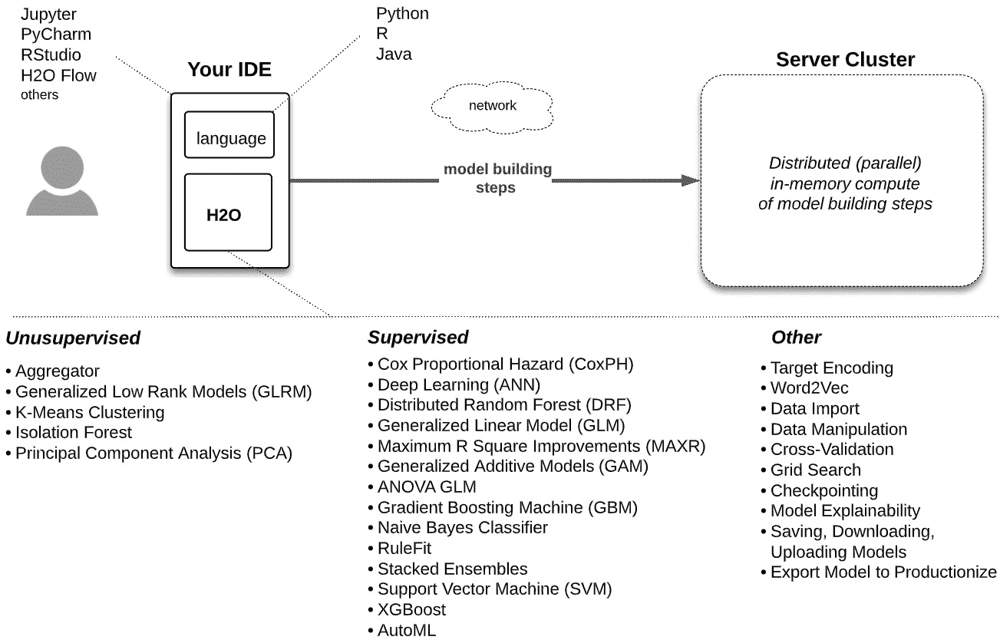
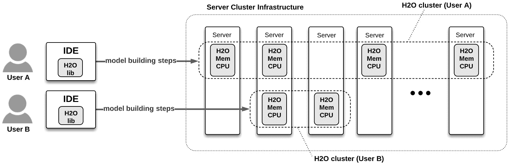
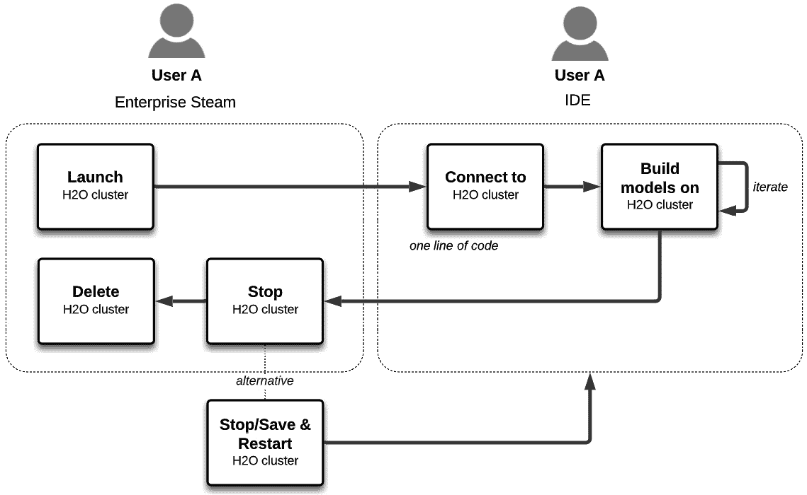
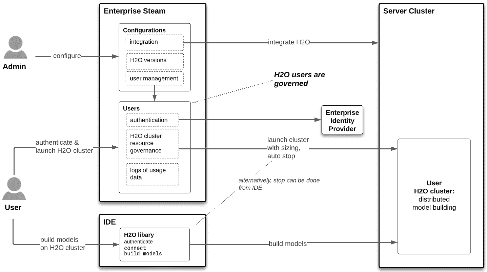
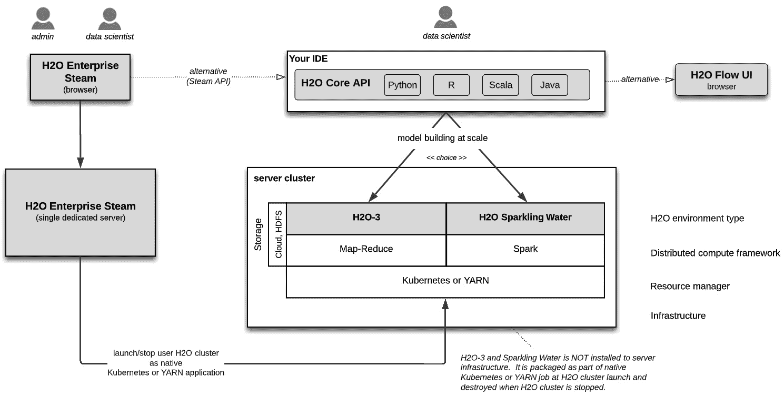

# *第二章*：平台组件和关键概念

在本章中，我们将对 H2O 大规模机器学习技术的组件有一个基本理解。我们将查看 H2O 机器学习的简单代码示例，了解它做什么，并确定示例在企业管理规模机器学习方面可能存在的问题。这个*Hello World*代码示例将作为一个简单的表示，以便进一步构建我们的理解。

我们将概述 H2O 机器学习大规模的每个组件，确定每个组件如何实现规模，以及每个组件如何与我们的简单代码片段相关联。然后，我们将使用这些组件将这些组件组合成一个参考机器学习工作流程。最后，我们将关注从这些组件中产生的底层关键概念。在本章中获得的理解将是本书其余部分的基础，其中我们将实现 H2O 技术，在企业环境中构建和部署大规模的先进机器学习模型。

在本章中，我们将涵盖以下主要主题：

+   Hello World – H2O 机器学习代码

+   H2O 机器学习大规模的组成部分

+   使用这些 H2O 组件的机器学习工作流程

+   H2O 关键概念

# 技术要求

对于本章，您需要在本地安装 H2O-3 以运行一个基本的*Hello World*工作流程。要实现它，请遵循*附录*中的说明。请注意，我们将全书使用 Python API，因此请按照说明在 Python 中安装它。

# Hello World – H2O 机器学习代码

H2O 核心是为大规模机器学习设计的；然而，它也可以用于用户笔记本电脑上的小数据集。在下一节中，我们将使用 H2O-3 的最小代码示例构建一个机器学习模型，并将其导出为可部署的工件。我们将使用这个示例作为理解 H2O 机器学习代码的最基本单元，就像通过查看人类棍状图开始学习人类生物学一样。

## 代码示例

查看下面的代码示例。在这里，我们使用 Python 编写，这可能是来自 Jupyter、PyCharm 或其他 Python 客户端。我们将了解到 R 和 Java/Scala 是编写 H2O 代码的替代语言。

让我们先导入 H2O 库：

```py
import h2o
```

从文档中回忆，这已经从 H2O 下载并安装到客户端或 IDE 环境中。这个`h2o`包允许我们使用 Python 编写的 H2O API 在 IDE 中运行内存分布式机器学习。

接下来，我们创建一个 H2O 集群：

```py
h2o.init(ip="localhost", port=54323)
```

上一行代码创建了一个所谓的 **H2O 集群**。这是 H2O 模型构建技术背后的一个关键概念。它是一个分布式内存架构。在 *Hello World* 案例中，H2O 集群将在笔记本电脑上作为 localhost 创建，并且不会分布式。我们将在本章的 *H2O 关键概念* 部分学习更多关于 H2O 集群的内容。

用于启动 H2O 集群的 `ip` 和 `port` 配置应提供足够的线索，表明 H2O 代码将通过 API 发送到计算环境，这可能是在数据中心或企业环境中，也可能是云端。然而，在这里，它是在我们的本地主机上。

然后，我们导入一个数据集：

```py
loans = h2o.import_file("https://raw.githubusercontent.com/PacktPublishing/Machine-Learning-at-Scale-with-H2O/main/chapt2/loans-lite.csv")
```

现在我们来探索数据集：

```py
loans.describe()
```

这是最小限度的数据探索。它只是简单地返回行数和列数。

好的，现在让我们为我们的模型准备数据：

```py
train, validation = loans.split_frame(ratios=[0.75])
```

```py
label = "bad_loan"
```

```py
predictors = loans.col_names
```

```py
predictors.remove(label)
```

我们已经将数据分为训练集和验证集，其中训练集的比例为 `0.75`。我们将预测一笔贷款是否会坏账（即是否会违约）并已将该列标识为标签。最后，我们使用数据集中的所有列（除了坏账列）来定义用于预测坏账的列。

现在，我们构建模型：

```py
from h2o.estimators import H2OXGBoostEstimator
```

```py
param = {"ntrees" : 25, "nfolds" : 10}
```

```py
xgboost_model = H2OXGBoostEstimator(**param)
```

```py
xgboost_model.train(x = predictors,
```

```py
                    y = label,
```

```py
                    training_frame = train,
```

```py
                    validation_frame = validation)
```

我们已经导入了 H2O 的 **XGBoost** 模块，并为其配置了两个超参数。然后，我们通过输入参考到预测列、标签列、训练数据和测试数据中，开始模型训练。

XGBoost 是 `h2o` 模块中包装的许多广泛认可和广泛使用的机器学习算法之一。该模块暴露的 H2O API 将在 H2O 的架构上运行 XGBoost 模型，在企业基础设施上，正如我们稍后将要学习的。关于超参数，我们将发现 H2O 为每个模型提供了一套广泛的可配置超参数。

当模型完成时，我们可以使用一行代码导出模型：

```py
xgboost_model.download_mojo(path="~/loans-model", get_genmodel_jar=True)
```

导出的评分工件现在可以传递给 DevOps 进行部署。`get_genmodel_jar=True` 参数触发下载以包括 `h2o-genmodel.jar`。这是一个模型在 H2O 集群之外评分时使用的库，即在生产环境中。我们将在 *第三部分 – 将您的模型部署到生产环境* 中学习更多关于生产化 H2O 模型的内容。

目前我们已经完成了模型构建。因此，我们将关闭集群：

```py
h2o.cluster().shutdown()
```

这将释放 H2O 集群所使用的资源。

请记住，这是一个简单的 *Hello World* H2O 模型构建示例。它的目的是做以下两件事：

+   对 H2O 模型构建提供一个最基本介绍。

+   作为讨论企业中规模问题的基础，我们将在下一节中进行讨论。

在 *第二部分 - 使用 H2O 在大量数据上构建最先进的模型* 中，我们将探讨构建高度预测性和可解释模型的多种技术。让我们从讨论 *Hello World* 示例暴露的规模化问题开始我们的旅程。

## 规模化的一些问题

这段 *Hello World* 代码在企业环境中扩展性不佳。让我们重新审视代码，以更好地理解这些扩展限制。

我们在我们的 IDE 代码中导入库：

```py
import h2o
```

大多数企业希望对所使用的库版本有所控制。此外，他们通常希望提供一个中央平台来托管和验证一项技术的所有用户，并让管理员管理该平台。我们将发现，企业 Steam 在集中管理用户和 H2O 环境方面发挥着关键作用。

我们初始化 H2O 集群：

```py
h2o.init(ip="localhost", port=54323)
```

规模化机器学习需要将计算资源分布在服务器集群中，以实现横向扩展（即在许多服务器之间划分和征服计算资源）。因此，IP 地址和端口应该指向服务器集群的成员，而不是单个计算机，如本例所示。我们将看到 H2O Core 会创建自己的自组织集群，该集群负责分配和横向扩展模型构建。

由于扩展是在企业服务器集群上进行的，通常情况下，许多个人和团体都会使用这个集群，因此企业希望控制用户对这个环境的访问以及用户消耗的资源数量。但是，这又如何阻止用户启动多个 H2O 集群，在每个集群上尽可能多地使用资源，从而阻止其他用户获取资源呢？企业 Steam 管理企业服务器集群上的 H2O 用户和 H2O 资源消耗。

我们导入数据集：

```py
loans = h2o.import_file("https://raw.githubusercontent.com/PacktPublishing/Machine-Learning-at-Scale-with-H2O/main/chapt2/loans-lite.csv")
```

大量数据在网络上的移动需要极长的时间，可能需要数小时或数天才能完成传输，或者可能在传输之前就超时了。在规模化的模型构建过程中，计算应该发生在数据所在的位置，以防止数据移动的瓶颈。我们将发现，在企业系统中启动的 H2O 集群会直接从存储层将数据摄入到服务器内存中。因为数据分布在构成 H2O 集群的各个服务器上，数据摄入与这些分区并行进行。

我们将看到企业 Steam 如何集中用户身份验证，以及用户的身份信息如何传递到企业系统，在那里其原生授权机制得到尊重。

我们训练模型：

```py
xgboost_model.train(x = predictors,
```

```py
                    y = label,
```

```py
                    training_frame = train,
```

```py
                    validation_frame = validation)
```

当然，这是模型构建过程的核心，也是本书许多内容的焦点：如何使用 H2O 的广泛机器学习算法和模型构建能力，在大量数据上构建世界级的机器学习模型。

我们下载可部署的模型：

```py
xgboost_model.download_mojo(path="~/loans-model", get_genmodel_jar=True)
```

请记住，从商业角度来看，直到模型导出并部署到生产中，才能实现价值。这样做涉及到多个企业利益相关者的复杂性。我们将学习如何设计导出的**MOJO**（**模型对象，优化**）的功能，以简化涉及这些利益相关者的各种软件系统的部署。

我们关闭了 H2O 集群：

```py
h2o.cluster().shutdown()
```

H2O 集群使用资源，当不使用时应关闭。如果不这样做，其他用户或企业系统上的作业可能会竞争这些资源，从而受到影响。此外，在必须扩展基础设施之前，系统中可以添加的新用户数量会减少。我们将看到企业蒸汽如何管理 H2O 用户在企业系统上消耗资源。这种资源效率的提高使得 H2O 用户及其工作在给定的基础设施分配上能够更有效地扩展。

现在我们已经运行了我们的*Hello World*示例并探讨了其关于扩展的一些问题，让我们继续了解 H2O 组件，以便在大规模机器学习模型构建和部署中取得理解。

# H2O 机器学习大规模组件

如前一章所述，并在整本书中强调，H2O 机器学习克服了扩展问题。以下是对 H2O 大规模机器学习每个组件的简要介绍以及每个组件如何克服这些挑战。

## H2O Core – 内存分布式模型构建

H2O Core 允许数据科学家编写代码，使用知名的机器学习算法构建模型。编码体验是通过 Python、R 或 Java/Scala 语言表达的 H2O API 实现的，并在他们喜欢的客户端或 IDE 中编写，例如在 Jupyter 笔记本中的 Python。然而，模型构建的实际计算是在企业服务器集群（而不是 IDE 环境）上进行的，并利用服务器集群的大量内存和 CPU 资源来运行针对大量数据的机器学习算法。

那么，它是如何工作的呢？首先，用于模型构建的数据由 H2O 在服务器集群上分区和内存中分布式。IDE 将 H2O 指令发送到服务器集群。集群中的服务器接收这些指令并将它们分发到集群中的其他服务器。指令在分区内存数据上并行运行。接收指令的服务器收集和合并结果，并将它们发送回 IDE。随着代码通过 IDE 的序列执行，这个过程会重复进行。

这种*分而治之*的方法是 H2O 大规模模型构建的基础。H2O 分而治之架构的一个单元被称为 H2O 集群，在章节的后面将详细阐述为*关键概念*。结果是快速在大数据量上构建模型。

### H2O Core 的关键特性

H2O Core 的一些关键特性如下：

+   **水平扩展**：数据操作和机器学习算法在并行和内存中分布，并具有额外的优化，如分布式键/值存储，以在模型构建期间快速访问数据和对象。

+   **熟悉的经验**：数据科学家使用熟悉的语言和 IDE 编写 H2O API 代码，正如我们刚刚所做的那样。

+   **开源**：H2O Core 是开源的。

+   **广泛的文件格式**：H2O 支持广泛的源数据格式。

+   **数据处理**：H2O API 包含了广泛的数据处理任务，这些任务通常用于准备机器学习所需的数据。Sparkling Water（下一节将介绍）将数据工程技术扩展到 Spark。

+   **公认的机器学习算法**：H2O 使用了广泛公认的监督和无监督机器学习算法。

+   **训练、测试和评估**：使用交叉验证、网格搜索、变量重要性和性能指标等广泛的技术来训练、测试和评估模型；这还包括模型检查点功能。

+   **自动机器学习 (AutoML)**: H2O Core 自动机器学习 API 提供了一个简单的包装函数，可以简洁地自动化多个模型的训练和调优，包括堆叠集成，并以排行榜的形式展示结果。

+   **模型可解释性**：它提供了广泛的局部和全局可解释性方法和可视化，适用于单个模型或参与 AutoML 的模型，所有这些都可以通过单个包装函数实现。

+   **AutoDoc**：它能够自动生成标准化的 Word 文档，详细描述模型构建和可解释性；请注意，AutoDoc 不是一个免费的开源平台。

+   **可导出的评分工件 (MOJO)**：它使用一行代码将模型导出为可部署的评分工件（模型部署将在第三部分“将您的模型部署到生产环境”中更详细地讨论）。

+   **H2O 流 Web UI**：这是一个可选的基于 Web 的交互式 UI，可以引导用户通过模型构建工作流程，提供简单而丰富的点选体验，这对于 H2O 模型的快速实验和原型设计非常有用。

### H2O-3 和 H2O Sparkling Water

H2O Core 有两种版本：**H2O-3** 和 **H2O Sparkling Water**。

H2O-3 是 H2O Core，如前所述。H2O Sparkling Water 是 H2O-3 通过 Spark 集成包装的。它与 H2O-3 相同，并具有以下附加功能：

+   **Spark 和 H2O API 代码的无缝集成**：用户在同一个 IDE 中编写 Spark 和 H2O 代码；例如，使用 SparkSQL 代码进行数据处理，使用 H2O 代码构建世界级的模型。

+   **H2O 和 Spark DataFrame 之间的转换**：H2O 和 Spark DataFrame 作为无缝集成的一部分进行相互转换；因此，SparkSQL 数据处理的结果可以用作 H2O 模型构建的输入。

+   **火花引擎**：Sparkling Water 作为原生 Spark 应用程序在 Spark 框架上运行。

H2O-3 和 Sparkling Water 是更通用的 H2O Core 的模型构建替代方案。在较大的企业服务器集群上启动的 H2O 集群的概念对两种 H2O Core 版本都是相似的，尽管一些实现细节不同，但这些对数据科学家来说是基本不可见的。如前所述，Sparkling Water 特别适用于集成 Spark 数据工程和 H2O 模型构建工作流程。

## H2O Enterprise Steam – 一个可管理的、自助配置的门户

企业蒸汽为数据科学家提供了一个集中的 Web UI 和 API，用于初始化和终止他们的 H2O 环境（称为 H2O 集群），以及管理员管理 H2O 用户和 H2O 与企业服务器集群的集成。

### 企业蒸汽的关键特性

企业蒸汽的关键特性如下：

+   **数据科学自助配置**：这是一种简单、基于 UI 的方式，让数据科学家管理他们的 H2O 环境。

+   **所有 H2O 用户的集中访问点**：这简化了 H2O 用户管理，并为 H2O 访问企业服务器集群提供了一个单一的入口点。

+   **管理用户资源消耗**：管理员为用户或用户组建立资源使用边界配置文件。这限制了用户在企业服务器集群上可以分配的资源数量。

+   **无缝安全**：用户对企业蒸汽的认证流程会传递到企业服务器集群上的资源授权。企业蒸汽使用与企业服务器集群相同的身份提供者（例如，LDAP）进行认证。

+   **配置集成**：管理员配置 H2O 与企业服务器集群和身份提供者的集成。

+   **管理 H2O Core 版本**：管理员管理一个或多个数据科学家用于创建模型构建 H2O 集群的 H2O Core 版本。

## H2O MOJO – 一种灵活、低延迟的评分工件

从 H2O Core 构建的模型被导出为可部署的评分工件，称为 H2O MOJOs。MOJOs 可以在任何 JVM 环境中运行（可能，除了非常小的边缘设备之外）。

在*第三部分 – 将您的模型部署到生产环境*中，我们将了解到 MOJOs 可以直接部署到 H2O 软件以及许多第三方评分解决方案，无需编写代码。然而，如果您希望直接将 MOJOs 嵌入到自己的软件中，有一个 MOJO Java API 来构建 Java 辅助类以公开 MOJO 功能（例如，输出原因代码以及预测）并提供与评分输入和输出的灵活集成。

与所有模型相比，无论用于构建模型的机器学习算法如何，MOJOs 的结构都是相同的。因此，从 DevOps 的角度来看，部署是可重复和可自动化的。

### MOJOs 的关键特性

MOJO 的关键特性如下：

+   **低延迟**：通常，每个评分的延迟小于 100 毫秒。

+   **灵活的数据速度**：Mojos 可以对批量、实时和流数据（例如，对整个数据库表、作为 REST 端点和 Kafka 主题等）进行预测。

+   **灵活的目标系统**：这适用于 JVM 运行时，包括 JDBC 客户端、**REST 服务器**、**AWS Lambda**、**AWS SageMaker**、**Kafka 队列**、**Flink 流**、包括流处理的 Spark 管道、Hive UDF、Snowflake 的外部函数等。目标系统可以是专门的 H2O 评分软件、第三方评分软件或您自己的软件。一个常见的模式是将 MOJO 部署到 REST 服务器，并通过客户端应用程序（例如 Excel 电子表格）的 REST 调用来消费其预测。

+   **可解释性功能**：除了预测之外，您还可以在实时评分期间从 MOJO 接收 K-Lime 或 Shapley 原因代码，并且可以将 MOJO 加载到 H2O Core 中进行评分和检查 MOJO 属性。

+   **可重复部署**：MOJO 很容易集成到组织用于软件部署的现有部署自动化（CI/CD）管道中。

注意，H2O MOJO 有一个替代方案，称为 **POJO**，用于不常见的边缘情况。这将在 *第八章*，*整合一切* 中进一步探讨。

# 使用 H2O 组件的工作流程

现在我们已经了解了 H2O 的机器学习大规模组件的角色和关键特性，让我们将它们整合成一个高级工作流程，如下面的图所示：

![Figure 2.1 – 使用 H2O 的高级机器学习大规模工作流程

![img/B16721_Figure_2.1.jpg]

图 2.1 – 使用 H2O 的高级机器学习大规模工作流程

工作流程按以下顺序进行：

1.  管理员配置 **H2O Enterprise Steam**。

1.  数据科学家登录到 **H2O Enterprise Steam** 并启动 **H2O Core** 集群（选择 **H2O-3** 或 **H2O Sparkling Water**）。

1.  数据科学家使用他们喜欢的客户端，通过 H2O 模型构建 API 的 Python、R 或 Java/Scala 语言版本来构建模型。数据科学家使用 UI 或 IDE 认证到 **H2O Enterprise Steam** 并连接到在 H2O Enterprise Steam 上启动的 **H2O 集群**。

1.  数据科学家使用 IDE 通过 H2O 迭代模型构建步骤。

1.  数据科学家确定要部署的模型后，**H2O** **AutoDoc** 生成，并且 **H2O MOJO** 从 IDE 导出。

1.  数据科学家在空闲或绝对运行时间超过后，要么终止**H2O 集群**，要么等待**H2O Enterprise Steam**这样做。这些持续时间已由管理员分配给用户的资源配置文件中配置。请注意，已终止的集群检查点仍然在工作，并且可以始终启动一个新的**H2O 集群**，从终止点继续工作。

1.  该模型以**H2O MOJO**格式导出，并部署到各种不同的托管目标。模型在业务环境中被使用，业务价值的实现由此开始。

# H2O 关键概念

在接下来的章节中，我们将识别和描述 H2O 的关键概念，这些概念是理解前述章节工作流程步骤所必需的。

## 数据科学家的经验

数据科学家在构建 H2O 模型时具有熟悉的经验，同时抽象出企业服务器集群上基础设施和架构的复杂性。以下图表将进一步详细说明这一点：



图 2.2 – 数据科学家使用 H2O Core 的经验细节

数据科学家使用在企业的分布式基础设施和架构中可扩展的知名无监督和监督机器学习技术。这些技术是用 H2O 模型构建 API 编写的，该 API 用熟悉的语言（如 Python、R 或 Java）编写，并使用熟悉的 IDE（例如 Jupyter 或 RStudio）。

H2O Flow – 一个方便的、可选的 UI

H2O 生成自己的 Web UI，称为 H2O Flow，在模型构建期间使用它是可选的。H2O Flow 的 UI 焦点和功能丰富性可用于完整的模型构建工作流程，或者像我们在*第五章*中将要展示的，利用它进行一些实用的技巧，*高级模型构建 – 第一部分*。

因此，数据科学家在一个熟悉的世界中工作，连接到一个复杂的架构，以扩展模型构建到大型或海量数据集。我们将在下一节中探讨这个架构。

## H2O 集群

H2O 集群可能是所有利益相关者需要理解的最核心概念。它是 H2O 在企业服务器集群上构建机器学习模型的架构单元。我们可以通过以下图表来理解这个概念：



图 2.3 – H2O 集群的架构

当数据科学家启动一个 H2O 集群时，他们指定要分配工作到多少个服务器（这也就是所谓的节点数），以及每个节点要使用的内存和 CPU 数量。我们将了解到这可以通过手动配置或允许 Enterprise Steam 根据训练数据量自动计算这些规格来实现。

当 H2O 集群启动时，IDE 会将 H2O 软件（一个单一的 JAR 文件）推送到企业服务器集群中指定的每个节点，每个节点分配指定的内存和 CPU。然后，H2O 软件组织成一个自我通信的集群，其中选出一个节点作为领导者，与 IDE 通信并协调 H2O 集群的其他部分。

数据科学家从 IDE 连接到启动的 H2O 集群。然后，数据科学家编写模型构建代码。代码的每一部分都由 IDE 中的 H2O 库翻译成对 H2O 集群的指令。每个指令按顺序发送到 H2O 集群的领导者节点，该节点将其分配给其他 H2O 集群成员，在那里指令并行执行。领导者节点收集和合并结果，并将它们发送回 IDE。

这里有一些重要的注意事项需要记住：

+   数据直接从数据源摄入到 H2O 节点的内存中。源数据在 H2O 节点之间分区，并且不会在它们之间重复。从存储层（例如，S3、HDFS 等）摄入的数据是并行进行的，因此速度快。来自外部源（例如，GitHub 存储库和 JDBC 数据库表）的数据不是并行进行的。在所有情况下，数据都不会通过 IDE 或客户端。

+   每个 H2O 集群都是独立的，并且与其他集群隔离，包括它们所摄入的数据。因此，两个启动集群并使用相同数据源的用户不会共享数据。

+   我们将看到，Enterprise Steam 的管理员为用户可以启动的并发集群数量以及用户在启动集群时可以指定的内存、CPU 和其他资源数量分配了上限。

+   H2O 集群是静态的。一旦启动，节点数和每个节点的资源数量不会改变，直到它们被终止，在这种情况下，H2O 集群将被拆解。如果一个节点宕机，H2O 集群必须重新启动，并且从 IDE 开始模型构建步骤。对于更长时间的工作，H2O 的检查点功能可以帮助您从恢复点继续。

让我们看看以下图中 H2O 集群的生命周期：



Figure 2.4 – H2O 集群的生命周期

让我们逐一查看生命周期的各个阶段，以了解它们是如何工作的：

1.  **启动**：数据科学家从企业蒸汽 UI 或 API 启动一个 H2O 集群。选择 H2O-3 或 Sparkling Water。H2O 集群的大小和资源（即节点数量、每个节点的内存以及其他配置）是手动输入的，或者由企业蒸汽根据用户输入的数据量自动生成。H2O 集群的形成如前所述。

1.  **连接到**：数据科学家切换到他们的 IDE，并通过指定其名称来连接到 H2O 集群。

1.  **构建模型于**：数据科学家使用 H2O 构建模型。在 IDE 中使用的 H2O 库将每个模型构建迭代的 H2O API 代码转换为指令。这些指令被发送到主节点并在 H2O 集群中分发。

1.  **停止**：H2O 集群被关闭。资源被释放，H2O 软件从 H2O 集群的每个节点中移除。这可以通过用户从 IDE 完成，也可以在空闲时间超过一定时长或当 H2O 集群的绝对运行时间超过（这些时长在 H2O 集群启动时在步骤 1 中指定）后自动发生。尽管没有运行，但用户仍然可以访问有关此集群的信息（例如，名称、H2O 版本和大小）。

**停止/保存数据 & 重新启动**：这是**停止**的替代方案，当企业蒸汽管理员为用户或用户组配置此选项时是可能的。在这种情况下，当 H2O 集群停止时，它会将模型构建步骤中的数据保存到存储层（即保存模型构建状态）。当集群重新启动（使用启动时的相同名称）时，集群启动并返回到其之前的状态。

1.  **删除**：这停止了集群（如果正在运行）并永久删除了所有关于 H2O 集群的引用。如果它已经停止并保存了模型构建状态，这些数据也将被永久删除。

## 企业蒸汽作为 H2O 网关

所有 H2O 管理活动都在企业蒸汽上发生，用户必须通过 Steam 启动 H2O 集群。这种“条条大路通企业蒸汽”的方法意味着在用户在企业系统中启动之前，Steam 管理用户及其 H2O 集群。这将在以下图中详细说明：



图 2.5 – 将企业蒸汽视为企业集群的 H2O 网关

管理员配置设置以管理 H2O 用户并集成企业蒸汽与企业服务器集群。此外，管理员存储将在启动 H2O 集群时推送到服务器集群的 H2O 软件版本，并在集群停止和资源释放时删除。管理员还可以访问用户使用数据。所有这些操作都通过仅管理员 UI 完成。

管理员配置用户和企业环境中用户如何启动 H2O 集群。这些配置定义了用户可以同时启动的并发集群数量、大小（即节点数）以及为每个启动的 H2O 集群分配的资源数量（例如，每个节点的内存）。配置还定义了如果用户没有从 IDE 中的 H2O 模型构建代码手动停止或删除集群，集群将在何时停止或删除。一组此类配置被定义为配置文件，一个或多个配置文件被分配给用户或用户组。因此，管理员可以将一些用户指定为高级用户，而将其他用户指定为普通用户。

用户通过与企业服务器集群环境（例如，S3 存储桶）授权访问资源时实施的相同身份提供者（例如，LDAP）对企业蒸汽进行身份验证。当用户启动集群时，企业蒸汽传递用户身份，并在企业系统上的授权挑战期间使用此身份。在他们的 IDE 中，用户必须对 Enterprise Steam API 进行身份验证，才能连接到他们启动的集群。

H2O 核心需要企业蒸汽吗？

注意，H2O 核心不需要企业蒸汽。企业管理员可以配置他们的企业服务器集群基础设施，以允许在上述基础设施上启动 H2O 集群。

然而，这种方法并不是一个可靠的企业实践。它引入了企业蒸汽作为集中式 H2O 网关所提供的控制和管理损失，如本节所述。此外，企业蒸汽通过在启动 H2O 集群时，使用户免于与 H2O 核心与企业集群集成相关的技术步骤（例如，Kerberos 安全要求）来为用户提供便利。企业蒸汽的好处将在*第十一章*，“管理员和操作视图”，以及*第十二章*，“企业架构和安全视图”中更详细地探讨。

此外，请记住，H2O 核心是免费和开源的，而企业蒸汽则不是。

## 企业蒸汽和 H2O 核心高级架构

既然我们已经了解了 H2O 集群是如何形成的，以及企业蒸汽在管理 H2O 用户和启动 H2O 集群中所起的作用，那么让我们从高级部署的角度来理解企业蒸汽和 H2O 核心架构。以下图表描述了这种部署架构：



图 2.6 – 企业蒸汽和 H2O 核心高级部署架构

Enterprise Steam 在其专用的服务器上运行，通过 HTTP(S) 与企业服务器集群通信。如前所述，Enterprise Steam 存储了推送到服务器集群的 H2O Core (H2O-3 或 Sparkling Water) JAR 文件，然后该文件在服务器集群中自我组织成一个协调但分布式的 H2O 集群。这个 H2O 集群可以是本地的 YARN 或 Kubernetes 作业，具体取决于实现了哪个后端。请注意，H2O-3 在 Map-Reduce 框架上运行，而 Sparkling Water 在 Spark 框架上运行。

安装了 H2O-3 或 Sparkling Water API 库到数据科学 IDE（例如，在 Jupyter 环境中执行 `pip install` H2O-3 包）。它必须与从 Enterprise Steam 启动集群所使用的版本相匹配。如前所述，数据科学家使用 IDE 认证到 Enterprise Steam，连接到 H2O 集群，并编写 H2O 模型构建代码。H2O 模型构建代码被 H2O 客户端库转换为发送到 H2O 集群首领节点的 REST 消息。然后，工作在 H2O 集群中分发，并将结果返回到 IDE。

注意，企业集群可以是本地、云基础设施即服务或托管服务实现。例如，可以是本地或云中的 Kubernetes 或 Cloudera CDH，或者云中的 Cloudera CDP 或 Amazon EMR。完整的部署可能性在 *第十二章*，*企业架构师和安全视角* 中有更详细的讨论。

H2O 平台选择

本书中的 H2O At Scale 技术被称为包括：H2O Enterprise Steam + H2O Core (H2O-3, H2O Sparkling Water) + H2O MOJO。H2O At Scale 与企业服务器集群集成以进行模型构建，与企业评分环境集成以进行模型部署。

H2O At Scale 可以仅使用前面提到的组件实现。或者，H2O At Scale 可以作为更大的 H2O 机器学习平台和功能集 H2O AI Cloud 的子集实现。H2O AI Cloud 平台在 *第五部分 – 扩展视野 – 使用 H2O AI Cloud 平台将数据转换为 AI 应用程序* 中有更详细的描述。

## Sparkling Water 允许用户在 H2O 和 Spark 中无缝编码

以下代码展示了使用 H2O Sparkling Water 在同一 H2O 代码中集成 Spark 的简单示例：

```py
# import data
```

```py
loans_spark = spark.read.load("loans.csv", format="csv", sep=",", inferSchema="true", header="true")
```

```py
# Spark data engineering code
```

```py
loans_spark = # any Spark SQL or Spark DataFrame code
```

```py
# Convert Spark DataFrame to H2O Frame
```

```py
loans = h2oContext.asH2OFrame(loans_spark)
```

```py
# Continue with H2O model building steps as in previous code example
```

```py
loans.describe()
```

代码展示了 Spark 导入数据，这些数据以 **Spark DataFrame** 的形式保存。使用 **Spark SQL** 或 **Spark DataFrame** API 将这些数据工程化为新的 DataFrame，然后将这个 Spark DataFrame 转换为 **H2OFrame**，从其中执行 H2O 模型构建。因此，用户可以在相同的 API 语言和 IDE 中无缝地从 Spark 迭代到 H2O 代码。

H2O 集群的概念在 Sparkling Water 中仍然根本正确。现在，它将在 Spark 框架内表达 H2O 集群架构。关于这个架构的详细信息在*第十二章*，“企业架构和安全视图”中进行了阐述。

## MOJOs 导出为 DevOps 友好的工件

数据科学家构建模型，但最终目标是将这些模型部署到生产环境中，在商业环境中进行预测。MOJOs 使得部署的最后一步变得简单。MOJOs 可以通过一行代码导出。例如，无论模型是使用 Python、R 还是使用广义线性模型、XGBoost 模型或堆叠集成构建的，从 DevOps 的角度来看，所有 MOJOs 都是相同的。这使得模型部署可重复，因此可以适应组织内部使用的现有自动化 CI/CD 管道。

# 摘要

在本章中，我们为理解 H2O 机器学习在规模上的应用奠定了基础。我们首先回顾了一个最基础的*Hello World*代码示例，并讨论了其周围的规模问题。然后，我们介绍了 H2O Core、企业版 Steam 和 MOJO 技术组件，以及这些组件如何克服规模问题。最后，我们从这些技术中提取了一系列关键概念，以加深我们对这些技术的理解。

在下一章中，我们将利用这些理解开始我们的学习之旅，学习如何以规模构建和部署世界级的模型。让我们开始编码吧！
