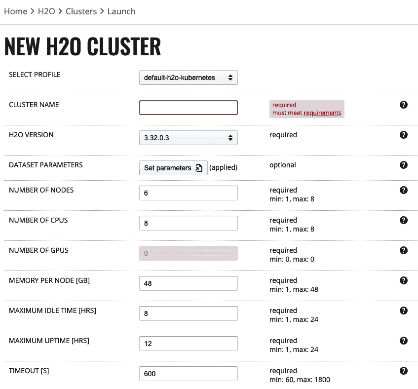

# 第三章：基本工作流程 - 数据到可部署模型

在本章中，我们将介绍 H2O 在大规模下的最小模型构建工作流程。我们将称之为“基本工作流程”，因为它省略了广泛的功能和用户选择，以构建准确、可信的模型，同时仍然涉及主要步骤。

基本工作流程将作为构建你对 H2O 技术和编码步骤理解的基础，以便在本书的下一部分，你可以深入探讨高级技术以构建最先进的模型。

为了开发基本工作流程，我们将在本章中涵盖以下主要主题：

+   用例和数据概述

+   基本工作流程

+   变异点 - 基本工作流程的替代方案和扩展

# 技术要求

对于本章，我们将专注于使用企业级蒸汽在企业服务器集群上启动 H2O 集群。从技术上讲，启动 H2O 集群并不需要企业级蒸汽，但企业利益相关者通常将企业级蒸汽视为在企业环境中实施 H2O 的安全、治理和管理要求。

企业级蒸汽需要从 H2O.ai 购买的许可证。如果你的组织没有安装企业级蒸汽的实例，你可以通过更大的 H2O 平台的临时试用许可证访问企业级蒸汽和企业服务器集群。或者，为了方便进行本书中的练习，你可能希望在本地环境中（例如，在你的笔记本电脑或台式工作站上）启动 H2O 集群作为沙盒，并绕过使用企业级蒸汽。

请参阅*附录* *– 为本书启动 H2O 集群的替代方法*，以帮助你决定你希望如何为本书的练习启动 H2O 集群，以及如何设置你的环境以实现这一点。

企业级蒸汽：企业环境与本书中的编码练习

企业利益相关者通常将企业级蒸汽视为在企业环境中实施 H2O 的安全、治理和管理要求。本章展示了数据科学家如何在这个企业环境中使用企业级蒸汽。然而，企业级蒸汽需要 H2O.ai 许可证才能实施，并且不会对所有本书的读者开放。

简单的沙盒（非企业）体验是在你的本地环境（笔记本电脑或工作站）上仅使用 H2O，这不需要企业级蒸汽。后续章节中的编码练习将利用本地沙盒环境，但也可以像本章中展示的那样使用企业级蒸汽进行。

注意，数据科学家工作流程（有或没有企业蒸汽）的区别仅限于工作流程的第一步（启动 H2O 集群），将在本章的后面部分变得更加清晰。另请参阅 *附录* *– 启动 H2O 集群的替代方法*。

# 用例和数据概述

为了演示基本工作流程，我们将实现一个二元分类问题，其中我们预测贷款是否会违约。本章中使用的数据集可以在 [`github.com/PacktPublishing/Machine-Learning-at-Scale-with-H2O/blob/main/chapt3/loans-lite.csv`](https://github.com/PacktPublishing/Machine-Learning-at-Scale-with-H2O/blob/main/chapt3/loans-lite.csv) 找到。（这是 Kaggle *Lending Club Loan* 数据集的简化版本：[`www.kaggle.com/imsparsh/lending-club-loan-dataset-2007-2011`](https://www.kaggle.com/imsparsh/lending-club-loan-dataset-2007-2011)。）

我们在本章中使用数据集的简化版本来简化工作流程。在 *第二部分，大规模构建最先进的模型* 中，我们将使用原始贷款数据集上的高级 H2O 模型构建功能来开发此用例。

# 基本工作流程

我们的基本工作流程将通过以下步骤进行：

1.  启动 H2O 集群（企业蒸汽 UI）

1.  连接到 H2O 集群（从现在起使用你的 IDE）

1.  构建模型

1.  评估和解释模型

1.  导出模型以进行生产部署

1.  关闭 H2O 集群

## 第 1 步 – 启动 H2O 集群

此步骤是在企业蒸汽 UI 中完成的。您将选择是否要使用 H2O-3 或汽水集群，然后您将配置 H2O 集群的行为，例如在超时并终止之前空闲时间的长度，以及您是否希望在终止时保存状态以便您可以重新启动集群并从上次离开的地方继续（这必须由管理员启用）。此外，企业蒸汽将根据您的数据大小自动调整 H2O 集群的大小（节点数量、每个节点的内存、CPU）。

### 登录 Steam

打开网页浏览器并访问 `https://steam-url:9555/login` 登录企业蒸汽，其中 `steam-url` 是您特定蒸汽实例的 URL。（您的管理员可能已更改端口号，但通常如 URL 所示为 `9555`。）

### 选择 H2O-3（与汽水）集群

在这里，我们将启动一个 H2O-3 集群（而不是我们在本书下一部分将执行的汽水，点击左侧面板中的 **H2O** 链接，然后点击 **启动新集群**）。

### 配置 H2O-3 集群

这将带我们到以下表单，您将进行配置：



图 3.1 – 在 Kubernetes 上启动 H2O-3 集群的 UI

目前，我们将忽略大多数配置。这些配置将在*第十一章*《管理员和操作视图》中更全面地介绍，其中详细概述了企业蒸汽。请注意，配置页面使用术语 *H2O 集群* 来特别表示 H2O-3 集群，而在这本书中，我们使用术语 H2O 集群来表示 H2O-3 或 Sparkling Water 集群。

关于“配置 H2O-3 集群”截图的说明

在 *图 3.1* 中显示的屏幕细节将根据 H2O 集群是在 Kubernetes 环境上启动还是在基于 YARN 的 Hadoop 或 Spark 环境上启动而有所不同。细节也会根据 H2O 集群是 H2O-3 集群还是 Sparkling Water 集群而有所不同。然而，在所有情况下，H2O 集群尺寸（节点数量、每个节点的 CPU/GPU 和每个节点的内存）以及最大空闲/运行时间的基本概念是通用的。

给您的集群起一个名字，对于 **DATASET PARAMETERS**（数据集参数），点击 **Set parameters**（设置参数）将出现以下弹出窗口：


图 3.2 – 自动调整 H2O-3 集群的弹出窗口

这里输入的参数将由企业蒸汽用于自动调整您的 H2O 集群（即确定 H2O 节点的数量以及每个节点的内存分配和每个节点的 CPU 分配）。回想一下前一章中介绍的 H2O 集群的**关键概念**。

### 稍等片刻，等待集群启动

UI 中的 **STATUS** 字段将显示 **Starting**，表示 H2O 集群正在企业服务器集群上启动。这需要一分钟左右。当状态变为 **Running** 时，您的 H2O 集群即可使用。

### 查看集群详细信息

让我们先通过点击 **Actions**（操作）然后 **Detail**（详情）来了解一些关于集群的信息。这将生成一个描述集群的弹出窗口。

注意在本例中，**节点数量**是 **6**，**每个节点的内存**是 **48 GB**，这是企业蒸汽为 50 GB 的数据集大小自动调整的结果，如 *图 3.1* 所示。回想一下前一章中 *H2O 关键概念* 部分的内容，我们的数据集被分割并分布在这企业服务器集群上的 H2O 集群节点内存中，计算在这些 H2O 节点上并行进行。

关于 H2O 集群尺寸的说明

通常，H2O 集群的尺寸是如此调整，即分配给集群的总内存（即 *N* 个 H2O 节点和每个节点 *X* GB 内存之积）大约是用于模型构建的未压缩数据集大小的 5 倍。这种计算方式最小化了节点数量（即，每个节点内存更多而节点更少是更好的）。

Enterprise Steam 将根据你对数据集的描述来计算这个大小，但你可以通过 Enterprise Steam UI 自行调整集群大小。当 H2O 集群终止时，分配给 H2O 集群的总内存将被释放。

注意，Enterprise Steam 管理员设置了用户在启动 H2O 集群时可能拥有的最小和最大配置值（见*图 3.1*），因此用户可能启动的最大 H2O 集群大小。管理员设置的这些边界可以为不同的用户配置不同。

## 第 2 步 – 连接到 H2O 集群

这些步骤以及所有后续步骤都是在你的 IDE 中进行的。我们将使用 Jupyter 笔记本，并用 Python 编写代码（尽管其他选项包括使用你喜欢的 IDE 编写 R、Java 或 Scala 版本的 H2O）。

打开笔记本，通过编写以下代码连接到你在 Enterprise Steam 中启动的 H2O 集群：

```py
import h2o
```

```py
import h2osteam
```

```py
from h2osteam.clients import H2oKubernetesClient
```

```py
conn = h2osteam.login(url="https://steam-url:9555",
```

```py
                      username="my-steam-username",
```

```py
                      password="my-steam-password")
```

```py
cluster = H2oKubernetesClient().get_cluster("cluster-name")
```

```py
cluster.connect()
```

现在，你已经连接到 H2O 集群，可以开始构建模型。请注意，连接后，你会看到与你在启动集群前在 Enterprise Steam UI 中查看的类似的 H2O 集群详细信息。

让我们了解代码正在做什么：

1.  你引用了从 H2O 下载并实现在你 IDE 环境中的`h2osteam`和`h2o` Python 库。（`h2o`库在此代码中未使用，但将在随后的模型构建步骤中使用。）

1.  接着，你通过`h2osteam` API（库）登录到 Enterprise Steam 服务器。你使用了与登录 Enterprise Steam UI 相同的 URL、用户名和密码。

1.  然后，你通过`h2osteam` API 从 Enterprise Steam 检索了你的 H2O 集群信息。

1.  注意，你在这里使用`H2oKubernetesClient`，因为你正在连接到在 Kubernetes 环境中启动的 H2O 集群。如果你所在的企业环境是 Hadoop 或 Spark，你将分别使用`H2oClient`或`SparklingClient`。

1.  你使用`cluster.connect()`连接到你的 H2O 集群，并将集群信息传递给`h2o` API。请注意，你不需要指定任何 H2O 集群的 URL，因为 Steam 在幕后通过`H2oKubernetesClient().get_cluster("cluster-name")`返回了它。

    创建 H2O 沙盒环境

    如果你想在本地机器上创建一个小的 H2O 沙盒环境，而不是使用 Enterprise Steam 和你的企业服务器集群，只需在你的 IDE 中实现以下两行代码：

    `import h2o`

    `h2o.init()`

    结果与使用 Enterprise Steam 执行*步骤 1-2*相同，只是它在你本地机器上启动了一个节点的 H2O 集群并连接到它。

    无论是在企业环境中连接到 H2O 集群还是在本地机器上，你现在都可以从你的 IDE 中针对相应的集群以相同的方式编写模型构建步骤。对于沙盒，由于它的集群大小只有一个节点且内存较低，你当然会受到数据量较小的限制。

## 第 3 步 – 构建模型

现在我们已经连接到我们的 H2O 集群，是时候构建模型了。从这一点开始，你将使用`h2o` API 与启动并连接到的 H2O 集群进行通信。

在我们的基本工作流程中，我们将采取最小化方法导入数据，清理它，从中提取特征，然后训练模型。

### 导入数据

从源数据加载到 H2O-3 集群内存中的贷款数据集使用`h2o.import_file`命令如下：

```py
input_csv = "https://raw.githubusercontent.com/PacktPublishing/Machine-Learning-at-Scale-with-H2O/main/chapt3/loans-lite.csv"
```

```py
loans = h2o.import_file(input_csv)
```

```py
loans.dim
```

```py
loans.head()
```

`loans.dim`行给出了行数和列数，`loans.head()`显示了前 10 行。目前来说，这是一个相当简单的数据探索。

注意，现在数据集已经分区并在 H2O 集群的内存中分布。从我们在 IDE 中的编码角度来看，它被视为一个称为**H2OFrame**的单个二维数据结构，由列和行组成。

### 清理数据

让我们执行一个简单的数据清理步骤。目标或响应列称为`bad_loan`，它包含 0 或 1 的值，分别代表良好和坏账。我们需要将此列中的整数转换为分类值，如下所示：

```py
loans["bad_loan"] = loans["bad_loan"].asfactor()
```

### 从原始数据中工程化新特征

特征工程通常被认为是构建优秀预测模型的*秘密配方*。就我们的目的而言，我们将通过从`issue_d`列中提取年份和月份作为单独的特征来进行基本的特征工程，该列包含作为单个值的日、月和年：

```py
loans["issue_d_year"] = loans["issue_d"].year().asfactor()
```

```py
loans["issue_d_month"] = loans["issue_d"].month().asfactor()
```

我们已经在`loans`数据集中创建了两个新的分类列：`issue_d_year`和`issue_d_month`。

### 模型训练

我们接下来将训练一个模型来预测坏账。我们首先将数据分为`train`和`test`：

```py
train, validate, test = loans.split_frame(seed=1, ratios=[0.7, 0.15])
```

我们现在需要确定我们将使用哪些列来预测贷款是否坏账。我们将通过从当前的贷款 H2OFrame 中移除两列来完成此操作，这些列包含已清理和工程化的数据：

```py
predictors = list(loans.col_names)
```

```py
predictors.remove("bad_loan)
```

```py
predictors.remove("issue_d")
```

注意，我们已从用作特征的列中移除了`bad_loan`，因为这正是我们正在预测的。我们还移除了`issue_d`，因为我们从这个列中工程化了新的特征，不希望它作为预测因子。

接下来，让我们创建一个 XGBoost 模型来预测贷款违约：

```py
from h2o.estimators import H2OXGBoostEstimator
```

```py
param = {
```

```py
         "ntrees" : 20,
```

```py
         "nfolds" : 5,
```

```py
         "seed": 12345
```

```py
}
```

```py
model = H2OXGBoostEstimator(**param)
```

```py
model.train(x = predictors,
```

```py
            y = "bad_loan",
```

```py
            training_frame = train,
```

```py
            validation_frame = validate)
```

## 第 4 步 – 评估和解释模型

让我们评估我们刚刚训练的模型性能：

```py
perf = model.model_performance(test)
```

```py
perf
```

`perf`的输出显示了模型性能的详细信息，包括模型度量，如 MSE、Logloss、AUC 等，以及混淆矩阵、最大度量阈值和收益/提升表。

现在，让我们通过从模型结果生成变量重要性来查看模型可解释性的一个简单视图：

```py
explain = model.explain(test,include_explanations="varimp")
```

```py
explain
```

`explain`的输出显示了针对测试数据集运行的训练模型的变量重要性。这是一个列出每个特征对模型贡献强度的表格。

H2O 的模型可解释性能力远不止变量重要性，正如我们将在本书后面看到的那样。

## 第 5 步 – 导出模型的评分工件

现在，让我们生成并导出模型作为评分工件，该工件可以由 DevOps 团队部署到生产环境：

```py
model.download_mojo("download-destination-path")
```

在现实世界中，当然，我们会训练许多模型，比较它们的性能和可解释性，以评估哪些（如果有的话）应该进入生产。

## 第 6 步 – 关闭集群

当你的工作完成时，关闭 H2O-3 集群以释放它所保留的资源：

```py
h2o.cluster().shutdown()
```

# 变异点 – 基本工作流程的替代方案和扩展

我们在这里开发的基本工作流程是一个简单的例子。对于我们所执行的每个步骤，都有多个替代方案和扩展，这些方案和扩展超出了所展示的内容。所有*第二部分：大规模构建最先进的模型*都是致力于理解这些替代方案和扩展，并将它们组合起来构建更高级的模型。

让我们先简要讨论一些关键变异点。

## 使用企业级 Steam API 与 UI 启动 H2O 集群（步骤 1）

在我们的示例中，我们利用企业级 Steam UI 的便利性来配置和启动一个 H2O 集群。或者，我们也可以使用 IDE 中的 Steam API 来完成这项工作。有关 Python API 的完整 H2O 企业级 Steam API 文档，请参阅[`docs.h2o.ai/enterprise-steam/latest-stable/docs/python-docs/index.html`](https://docs.h2o.ai/enterprise-steam/latest-stable/docs/python-docs/index.html)，有关 R API 的文档，请参阅[`docs.h2o.ai/enterprise-steam/latest-stable/docs/r-docs/index.html`](https://docs.h2o.ai/enterprise-steam/latest-stable/docs/r-docs/index.html)。

因此，通过从我们的 IDE 启动 H2O 集群，我们可以完全从 IDE 完成工作流程的所有*步骤 1-6*。

## 启动 H2O-3 集群与 Sparkling Water 集群（步骤 1）

在我们的示例中，我们启动了一个 H2O-3 集群。我们可以选择启动一个 H2O Sparkling Water 集群。正如我们将看到的，Sparkling Water 集群具有与 H2O-3 集群相同的性能集，但增加了与 H2O 代码和 H2O DataFrames 集成的 Spark 代码和 Spark DataFrames 的能力。这在利用 Spark 进行高级数据探索和数据预处理，然后在 H2O 中构建模型时尤其强大。

## 实施企业级 Steam 或否（步骤 1-2）

请注意，Enterprise Steam 不是启动和连接到企业服务器集群的必要条件：数据科学家可以在 IDE 中仅使用 `h2o`（而不是 `h2osteam`）API 来配置、启动和连接到企业服务器集群，但这是一种低级编码和配置，需要详细的集成信息。重要的是，这种方法缺乏健全的企业安全、治理和集成实践。

在企业环境中，Enterprise Steam 被视为集中管理、治理企业服务器集群环境中的 H2O 技术和 H2O 用户的关键。这些功能在第十一章*中进行了详细阐述，*管理员和操作视图*。

## 使用个人访问令牌登录到 Enterprise Steam（步骤 2）

在**步骤 2 – 连接到 H2O 集群**中，我们使用 Enterprise Steam API 从我们的 IDE 认证到 Enterprise Steam。在示例代码中，我们使用了明文密码（这是用于登录 Enterprise Steam UI 的相同密码）。如果你分享了笔记本，这就不安全了。

或者，更安全的方法是，你可以使用**个人访问令牌**（PAT）作为 API 登录密码连接到 Enterprise Steam。PAT 可以根据需要频繁生成，每个新生成的 PAT 都会吊销之前的令牌。因此，如果你使用 PAT 作为密码与登录凭证共享 Jupyter 笔记本，笔记本的接收者将不知道你的 Enterprise Steam UI 登录密码，并且无法使用你共享笔记本中的吊销密码通过 API 进行认证。你可以进一步将 PAT 实现为 IDE 外部的环境变量。

Enterprise Steam 允许你从 UI 生成一个 Personal Access Token（PAT）。要生成 PAT，请登录到 Enterprise Steam UI，点击**配置**，然后遵循简短的令牌工作流程。复制结果（一个长字符串）用于当前笔记本或脚本，或将其设置为环境变量。

## 构建模型（步骤 3）

H2O 提供的模型构建体验比我们基本工作流程中展示的要强大得多。这里简要介绍了这一更大的体验，并在**第二部分，大规模构建最先进的模型**中进行了全面探讨。

### 语言和 IDE

我们在 Jupyter 笔记本中使用 Python 编写 H2O 代码。你也可以选择 R 作为 Enterprise Steam API，并使用你选择的 Python 或 R IDE。此外，你可以使用 H2O 的 UI 丰富的 IDE，称为 **H2O Flow**，以执行完整的工作流程或快速了解从你自己的 IDE 中正在进行的 H2O 集群工作流程的各个方面。

### 导入数据

数据可以从许多来源导入到 H2O 集群中，包括云对象存储（例如，S3 或 Azure Delta Lake）、数据库表（通过 JDBC）、HDFS 等。此外，源文件可以有多种格式，包括 Parquet、ORC、ARFF 等。

### 清洗数据和特征工程

H2O-3 具有基本数据操作的能力（例如，更改列类型、合并或切片行或列、按组分组、插补等）。

回想一下，启动 Sparkling Water 集群为我们提供了完整的 H2O-3 功能，并增加了 Spark 更强大的数据探索和工程能力。

### 模型训练

在我们的基本工作流程中，我们只探索了一种类型的模型（XGBoost），同时只更改了几个默认参数。H2O-3（及其 Sparkling Water 扩展）拥有广泛的监督学习和无监督学习算法列表，以及一系列参数和超参数，可以设置为您的要求。此外，这些算法可以强大地组合到 AutoML 工作流程中，探索多个模型和超参数空间，并在排行榜上排列结果最佳模型。您还可以控制交叉验证技术、检查点、重新训练和可重复性。

## 评估和解释模型（步骤 4）

H2O 拥有针对局部（个体）和全局（模型级）可解释性的众多解释方法和可视化工具，包括残差分析、变量重要性热图、Shapley 摘要、**部分依赖图**（**PDPs**）和**个体条件期望**（**ICE**）。

## 导出模型的评分工件（步骤 5）

一旦导出模型的评分工件（称为 H2O MOJO），它就准备好在实时评分环境中由 DevOps 部署和监控。它很可能会进入组织的 CI/CD 流程。我们将在*第三部分，将您的模型部署到生产环境*中这一点上继续。

## 关闭集群（步骤 6）

您可以从您的 IDE 中按照我们的示例工作流程关闭您的集群。然而，如果您注意到，在企业级 Steam 中配置您的集群时，有两个配置可以自动化关闭过程：**最大空闲时间**和**最大运行时间**。第一个在配置的时间未使用后关闭集群。第二个在集群运行了配置的时间后关闭集群。关闭集群（手动或自动）可以为使用企业服务器集群的其他人节省资源。

管理员为这些自动终止的配置分配了最小和最大值。请注意，当管理员启用时，企业级 Steam 会在 H2O 集群自动终止时保存所有模型和数据框。您可以在稍后重新启动集群并从集群终止的地方继续。

# 摘要

在本章中，您学习了如何在您的 IDE 中启动 H2O 集群并在其上构建模型。这个基本工作流程是一个裸骨架，您将在本书的*第二部分，大规模构建最先进的模型*中，通过一系列高级 H2O 模型构建技术对其进行更全面的完善。

我们将在下一章开始这段高级旅程，在开始使用这些功能之前先概述它们。
