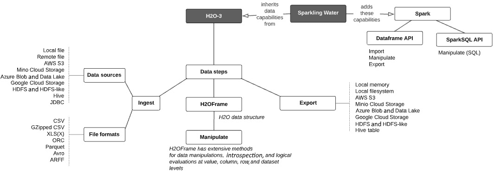
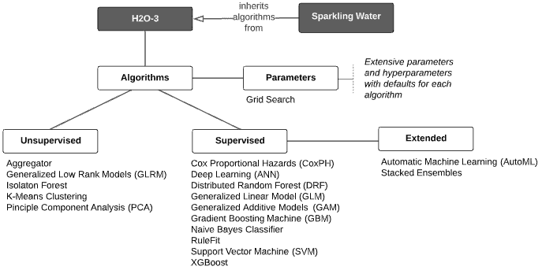
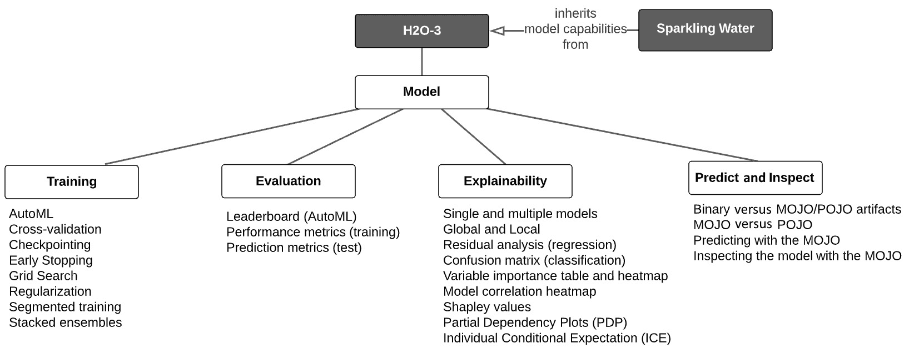

# *第四章*：大规模 H2O 模型构建 – 能力阐述

到目前为止，我们已经学习了如何在大规模上构建 H2O 模型的基本工作流程，但那是在 H2O 最基本的情况下完成的。在本章中，我们将调查 H2O 大规模模型构建的极其广泛的能能力集。然后，我们将利用本章的知识，继续到第二部分，*使用 H2O 在大数据量上构建最先进的模型*，我们将开始使用高级技术在大规模上构建和解释高度预测性的模型。

为了进行这项调查，我们将本章分为以下主要主题：

+   在模型构建过程中阐述 H2O 数据能力

+   概述 H2O 机器学习算法

+   理解 H2O 建模能力

# 模型构建期间的 H2O 数据能力

记住，大规模 H2O 模型构建是通过使用 H2O 3 或其扩展 Sparkling Water 来完成的，它将 Spark 能力包装在 H2O 3 中。H2O 3 API 在模型构建过程中使用了广泛的数据能力，Sparkling Water API 继承了这些能力，并从 Spark 中添加了额外的能力。这些能力被分为以下三个广泛类别：

+   **从源数据到 H2O 集群的数据摄取**

+   **在 H2O 集群上操作数据**

+   **从 H2O 集群导出到外部目的地**

如前几章所强调的，H2O 集群架构（H2O 3 或 Sparkling Water）允许无限规模地构建模型，但对使用 IDE 中的 H2O 代码构建模型的科学家来说是抽象的。

H2O 数据能力在以下图中概述，并随后进行详细阐述：

图 4.1 – H2O 数据能力

让我们从数据摄取开始。

## 从源数据到 H2O 集群的数据摄取

支持以下数据源：

+   **本地文件**

+   **远程文件**

+   **AWS S3**

+   **MinIO 云存储**

+   **Azure Blob 和 Data Lake**

+   **Google Cloud Storage**

+   **HDFS**

+   **类似 HDFS**：Alluxio FS 和 IBM HDFS

+   **Hive**（通过 Metastore/HDFS 或 JDBC）

+   **JDBC**

支持的源数据文件格式如下：

+   **CSV**（任何分隔符的文件，自动检测或指定）

+   **GZipped CSV**

+   **XLS**或**XLSX**

+   **ORC**

+   **Parquet**

+   **Avro**

+   **ARFF**

+   **SVMLight**

将数据摄取到 H2O 的一些重要特性如下：

+   数据直接从源摄取到 H2O 集群内存中，不通过 IDE 客户端。

+   在所有情况下，数据都在 H2O 集群内部分区存储。

+   除了本地文件、远程文件和 JDBC 源之外，数据是并行摄取到每个分区的。

+   H2O 集群上的数据以二维**H2OFrame**的形式呈现给用户。

现在让我们看看如何操作已经摄取到 H2O 并以 H2OFrame 形式表示的数据。

## 在 H2O 集群中操作数据

H2O 3 API 提供了广泛的数据操作功能。如前所述，内存中的数据集在 H2O 集群上分布，并在数据加载和后续数据操作后特别表示为 IDE 中的 H2OFrame。

H2OFrames 有一系列方法，可以在值、列、行和整个数据集级别执行数学、逻辑和内省操作。H2OFrame 在体验上类似于**pandas DataFrame**或**R 数据框**。

以下是一些在 H2Oframes 上可以进行的几种数据操作示例：

+   **数据列**上的操作：

    +   改变数据类型（例如，将 0 到 7 的整数作为分类值）。

    +   通过应用数学函数对列（按组）进行聚合。

    +   显示列名并将其用作模型中的特征。

+   **数据行**上的操作：

    +   将一个或多个数据集的行合并。

    +   通过指定行索引、行范围或逻辑条件来切片（过滤）数据集的行。

+   **数据集**上的操作：

    +   根据共享列名的公共值合并两个数据集。

    +   通过对列进行旋转来转换数据集。

    +   将数据集拆分为两个或更多数据集（例如，训练、验证和测试）。

+   **数据值**上的操作：

    +   使用相邻行或列的值向前或向后填充缺失值。

    +   通过使用聚合结果（例如，列的平均值）进行插补来填充缺失值。

    +   根据逻辑条件替换数值。

    +   剪切值、操作字符串、返回数值的符号，并测试值是否为 N/A。

+   **特征工程**操作：

    +   日期解析，例如，将一个日期列解析为单独的年、月、日列。

    +   从其他列（包括使用 lambda 表达式）数学和条件地派生出一个新列。

    +   执行目标编码（即，用一个目标变量的平均值替换一个分类值）。

    +   对于**自然语言处理（NLP）**问题，执行**字符串分词**、**词频-逆文档频率（TF-IDF）**计算，并将**Word2vec**模型转换为 H2OFrame 以进行数据操作。

有关 H2O 数据操作功能的详细信息，请参阅 H2O Python 文档([`docs.h2o.ai/h2o/latest-stable/h2o-py/docs/frame.html`](http://docs.h2o.ai/h2o/latest-stable/h2o-py/docs/frame.html))或 R 文档([`docs.h2o.ai/h2o/latest-stable/h2o-r/docs/reference/index.html`](http://docs.h2o.ai/h2o/latest-stable/h2o-r/docs/reference/index.html))。此外，请参阅《使用 Python 和 H2O 进行机器学习》的第四部分([`h2o-release.s3.amazonaws.com/h2o/rel-wheeler/2/docs-website/h2o-docs/booklets/PythonBooklet.pdf`](http://h2o-release.s3.amazonaws.com/h2o/rel-wheeler/2/docs-website/h2o-docs/booklets/PythonBooklet.pdf))，以获取数据操作的示例。

操作数据是将其作为模型构建输入准备的关键。我们可能还希望导出我们的操作数据以供将来使用。下一节列出了 H2O 数据导出功能。

## 将数据从 H2O 集群导出

内存中的 H2OFrames 可以导出到外部目标。这些目标系统如下：

+   **本地客户端内存**

+   **本地文件系统**

+   **AWS S3**

+   **MinIO 云存储**

+   **Azure Blob 和 Data Lake**

+   **Google Cloud Storage**

+   **HDFS**

+   **类似 HDFS 的**：Alluxio FS 和 IBM HDFS

+   **Hive 表**（通过 JDBC 的 CSV 或 Parquet）

当然，必须考虑导出数据的量。例如，大量数据将无法适应本地客户端内存或文件系统。

现在我们来看看 Sparkling Water 添加了哪些额外的数据功能。

## Sparkling Water 提供的附加数据功能

Sparkling Water 继承了 H2O 3 的所有数据功能。重要的是，Sparkling Water 通过利用 Spark DataFrame 和 Spark SQL API 添加了额外的数据功能，因此可以相应地导入、操作和导出数据。有关完整的 Spark DataFrame 和 Spark SQL 功能的参考，请参阅以下链接：[`spark.apache.org/docs/latest/sql-programming-guide.html`](https://spark.apache.org/docs/latest/sql-programming-guide.html)。

使用 Sparkling Water 的一个关键模式是利用 Spark 的高级数据处理功能，然后将生成的 Spark DataFrame 转换为 H2Oframe，然后使用 H2O 的机器学习算法构建最先进的模型，如下一节所述。这些算法可以在 H2O 3 或 Sparkling Water 中使用。

# H2O 机器学习算法

H2O 拥有广泛的**无监督**和**监督**学习算法，具有类似的可重用 API 结构 – 例如，设置超参数或调用可解释性功能的方式相似。从 H2O 3 或 Sparkling Water 的角度来看，这些算法是相同的，并在以下图中概述：

图 4.2 – H2O 算法

每个算法都有广泛的参数和超参数可以设置或利用作为默认值。算法接受 H2OFrames 作为数据输入。请记住，H2OFrame 只是 IDE 客户端对远程 H2O 集群中分布式内存数据的引用，其中算法对其进行处理。

让我们来看看 H2O 的分布式机器学习算法。

## H2O 无监督学习算法

无监督算法不进行预测，而是试图在数据中找到簇和异常，或者减少数据集的维度。H2O 有以下无监督学习算法，可以在大规模上运行：

+   **聚合器**

+   **广义低秩模型 (GLRM**)

+   **隔离森林**

+   **扩展隔离森林**

+   **K-Means 聚类**

+   **主成分分析 (PCA**)

## H2O 监督学习算法

监督学习算法通过从标记有这些结果的训练数据集中学习来预测结果。H2O 有以下监督学习算法，可以在大规模上运行：

+   **Cox 比例风险（CoxPH）**

+   **深度学习（人工神经网络，或 ANN）**

+   **分布式随机森林（DRF）**

+   **广义线性模型（GLM）**

+   **最大平方改进（MAXR）**

+   **广义加性模型（GAM）**

+   **方差分析广义线性模型（ANOVA GLM）**

+   **梯度提升机（GBM）**

+   **朴素贝叶斯分类器**

+   **规则拟合（RuleFit）**

+   **支持向量机（SVM）**

+   **XGBoost**

## 参数和超参数

每个算法都有深层次的参数和超参数用于配置和调整。指定大多数参数是可选的；如果没有指定，将使用默认值。参数包括交叉验证参数、学习率、树深度、权重列、忽略列、提前停止参数、响应列的分布（例如，伯努利）、分类编码方案以及许多其他指定。

您可以在 H2O 的文档中深入了解 H2O 的算法及其参数，文档地址为[`docs.h2o.ai/h2o/latest-stable/h2o-docs/data-science.html#algorithms`](http://docs.h2o.ai/h2o/latest-stable/h2o-docs/data-science.html#algorithms)。H2O 网站还列出了其算法的教程和手册，地址为[`docs.h2o.ai/#h2o`](http://docs.h2o.ai/#h2o)。算法参数的完整列表，每个参数都有描述、是否为超参数的状态以及映射到使用该参数的算法，可以在 H2O 的文档*附录*中找到，文档地址为[`docs.h2o.ai/h2o/latest-stable/h2o-docs/parameters.html`](http://docs.h2o.ai/h2o/latest-stable/h2o-docs/parameters.html)。

## H2O 的监督学习扩展

H2O 通过提供**自动机器学习（AutoML）**和**堆叠集成**功能来扩展其监督学习算法。我们将在下一节中更详细地探讨这些内容，其中我们将 H2O 算法置于模型能力的更广泛背景下。

## 杂项

H2O 提供了一些工具来增强其算法的工作。**目标编码**帮助您处理分类值，并具有许多可配置的参数以简化此过程。**TF-IDF**和**Word2vec**在 NLP 问题中常用，并且它们也具有良好的可配置性。最后，**排列变量重要性**是一种帮助理解您的特征对模型贡献强度的方法，并有助于评估在最终训练数据集中使用哪些特征。

# H2O 建模能力

H2O 的监督学习算法用于在训练数据上训练模型，在验证数据上调整它们，并在测试或实时生产数据上评分或预测。H2O 具有广泛的训练、评估、解释、评分和检查模型的能力。这些能力总结在下述图中：

图 4.3 – H2O 监督学习能力

让我们更详细地看看模型训练的能力。

## H2O 模型训练能力

算法是模型训练的核心，但除了算法本身之外，还有更广泛的考虑能力。H2O 提供了以下模型训练能力：

+   **AutoML**：一个易于使用的界面和参数集，可以自动化训练和调整许多不同模型的过程，使用多个算法在短时间内创建大量模型。

+   **交叉验证**：使用 K 折验证来生成针对验证分割的折叠的性能指标，可以在算法的训练参数中指定折数等参数。

+   **检查点**：新模型作为之前训练的、已检查点的模型的延续来构建，而不是从头开始构建模型；这在用新数据重新训练模型时非常有用。

+   **提前停止**：定义算法何时停止模型构建的参数，取决于指定的许多停止指标中的哪一个。

+   **网格搜索**：为指定的超参数范围的每个组合构建模型，并按性能指标对结果模型进行排序。

+   **正则化**：大多数算法都有参数设置，可以指定正则化技术以防止过拟合并提高可解释性。

+   **分段训练**：训练数据根据相同的列值分成段，并为每个段构建一个单独的模型。

+   **堆叠集成**：将使用相同或不同算法的多个基础模型的输出组合成一个性能更好的单一模型。

在训练好一个模型后，我们希望评估它，以确定其预测性能是否符合我们的需求。让我们看看 H2O 在这方面提供了什么。

## H2O 模型评估能力

H2O 公开了许多模型属性以评估模型性能。以下是对这些属性的总结：

+   **AutoML 的排行榜**：根据配置的性能指标或其他属性（如平均预测速度）对 AutoML 模型结果进行排名，并显示其他指标。

+   **分类问题的性能指标**：对于分类问题，H2O 计算**基尼系数**、**绝对马修相关系数（MCC）**、**F1**、**F0.5**、**F2**、**准确率**、**对数损失**、**ROC 曲线下面积（AUC）**、**精确率-召回率曲线下面积（AUCPR）**和**科尔莫哥洛夫-斯米尔诺夫（KS）**指标。

+   **回归问题的性能指标**：对于回归问题，H2O 计算**R 平方（R²）**、**均方误差（MSE）**、**均方根误差（RMSE）**、**均方根对数误差（RMSLE）**和**平均绝对误差（MAE）**指标。

+   **预测指标**：在构建模型后，H2O 允许你预测叶节点分配（基于树的模型）、特征贡献、每个阶段的类别概率（GBM 模型），以及预测路径上的特征频率（GBM 和 DRF）。

+   **学习曲线图**：这显示了随着学习的进展，模型性能指标的变化，有助于诊断过拟合或欠拟合。

现在我们来探讨解释 H2O 模型的方法。

## H2O 模型可解释性能力

H2O 提供了一个简单且统一的接口来解释单个模型或多个模型，这可以是单独构建的模型列表或是对 AutoML 生成的那些模型的引用。在此基础上，H2O 允许你生成全局（即模型级别）和局部（行或个体级别）的解释。H2O 的可解释性能力可以根据您的规格进行配置。输出可以是表格、图形或两者兼而有之，具体取决于解释。

我们将在*第六章*，*高级模型构建 – 第 II 部分*中，将所有内容都用于更详细地探讨这个重要主题，但就目前而言，这里是一个快速的功能列表：

+   **回归的残差分析**

+   **分类混淆矩阵**

+   **变量重要性表和热图**

+   **模型相关性热图**

+   **Shapley 值**

+   **部分依赖图（PDPs**）

+   **个体条件期望（ICE**）

现在我们通过查看模型训练、评估和解释后我们能做什么，来完成对 H2O 大规模建模能力的调查。

## H2O 训练模型工件

一旦模型训练完成，就可以将其导出并保存为评分工件。关于将工件部署到生产评分环境的大主题将在*第三部分：将模型部署到生产环境*中讨论。以下是导出评分工件的基本功能：

+   **使用 MOJO 进行预测**：模型可以保存为自包含的二进制 Java 对象，称为 MOJO，可以在不同的系统上灵活实现为低延迟的生产评分工件（例如，REST 服务器、批量数据库评分和 Hive UDFs）。MOJO 还可以重新导入到 H2O 集群中，用于下一项所述的目的。

+   **使用 MOJO 检查模型**：导出的 MOJO 可以重新导入到 H2O 集群中，并用于对数据集进行评分，检查用于训练原始模型的超参数，查看评分历史，并显示特征重要性。

+   **MOJO 与 POJO 的比较**：POJO 是 MOJO 的前身，正在被 H2O 弃用，但对于某些算法仍然是必需的。

# 摘要

在本章中，我们对 H2O 在规模构建模型方面的能力进行了广泛调查。我们了解了我们可以摄入到 H2O 集群中的数据源和受支持的文件格式。我们学习了这些数据如何从源头移动到 H2O 集群，以及 H2OFrame API 如何提供一个 IDE 中的单一处理程序来表示 H2O 集群上的分布式内存数据作为一个单一的两维数据结构。然后，我们学习了我们可以通过 H2OFrame API 进行数据操作的各种方式，以及如果需要的话，如何将其导出到外部系统。

然后，我们调查了大规模 H2O 模型构建的核心——H2O 的许多最先进的分布式无监督和监督学习算法。接着，我们通过调查围绕这些算法的模型能力，从训练、评估和解释模型，到使用模型工件重新训练、评分和检查模型，来将这些算法置于上下文中。

拿着这幅景观图，我们现在可以卷起袖子，开始大规模构建最先进的 H2O 模型。在下一章中，我们将逐一实现高级模型构建主题，然后再在完全开发的使用案例中将它们全部整合。
