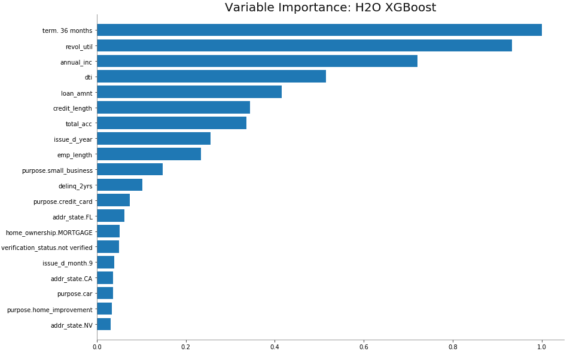
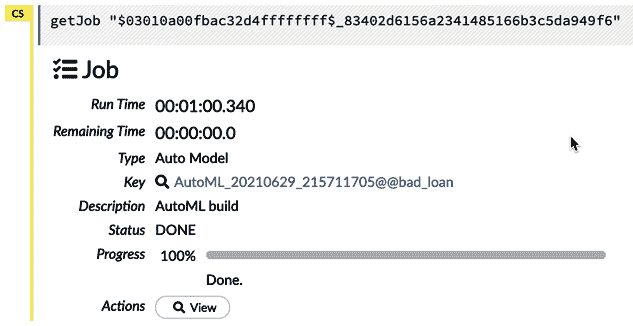
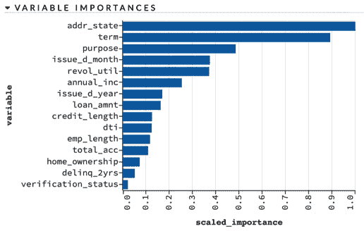

# *第五章*：高级模型构建 – 第一部分

在本章中，我们通过介绍数据科学家在构建企业级模型时考虑的细微问题和选择，开始从基本模型构建过渡到高级模型构建。我们将讨论数据分割选项，比较建模算法，提出超参数优化的两阶段网格搜索策略，介绍 H2O AutoML，以自动将多个算法拟合到数据中，并进一步研究特征工程策略，以尽可能从数据中提取信息。我们将介绍 H2O Flow，这是 H2O 附带的一个基于菜单的 UI，它有助于监控 H2O 集群的健康状况，并允许进行交互式数据和模型调查。

在整个过程中，我们将使用在*第三章*中引入的 Lending Club 问题来阐述这些高级模型构建概念，*基本工作流程 – 从数据到可部署模型*。到本章结束时，你将能够使用 H2O 中可用的一个或多个监督学习算法构建一个企业级、优化的预测模型。之后，剩下的就是审查模型并将其部署到生产环境中。

在本章中，我们将讨论以下主要主题：

+   将数据分割用于验证或交叉验证和测试

+   算法考虑因素

+   使用网格搜索进行模型优化

+   H2O AutoML

+   特征工程选项

+   利用 H2O Flow 增强你的 IDE 工作流程

+   将所有内容整合在一起 – 算法、特征工程、网格搜索和 AutoML

# 技术要求

我们在本章中首次介绍代码和数据集。到目前为止，如果你还没有设置你的 H2O 环境，请参阅*附录* *– 启动 H2O 集群的替代方法*，以进行设置。

# 将数据分割用于验证或交叉验证和测试

当数据量足够大时，将数据分割为训练集、验证集和测试集是模型构建的公认标准。验证背后的思想很简单：大多数算法在训练数据上自然会出现过度拟合。在这里，过度拟合意味着正在建模的一些内容是该特定数据集的实际独特性（例如，噪声），而不是整个群体的代表性。那么，如何纠正这一点呢？嗯，你可以通过创建一个保留样本，称为验证集，在模型构建过程中对其进行评分，以确定正在建模的是信号还是噪声。这使超参数调整、模型正则化、早期停止等功能成为可能。

测试数据集是在模型构建结束时使用的额外保留数据，用于确定模型的真正性能。对于任何模型构建来说，拥有保留测试数据都是至关重要的。事实上，它如此重要，以至于你不应该信任或部署没有与测试数据集进行比较的模型。

训练-验证-测试划分的替代方案是在训练数据上使用带有 k 折交叉验证的训练-测试划分。以下是它是如何工作的：

1.  将训练数据划分为 k 折，在我们的例子中，k 是 5。

1.  使用其中一个折作为验证数据，其他四个折合并为训练数据来拟合一个模型。

1.  重复此过程，以便每个折都作为验证数据使用一次。

这样可以得到五个模型，每个模型都在数据的不同子集上进行了验证。

下面的图表很好地说明了这个概念：

![图 5.1 – 5 折交叉验证的示意图

![img/Figure_5.1_B16721.jpg]

图 5.1 – 5 折交叉验证的示意图

k 折交叉验证方法最初是为小数据集开发的，以便模型在训练中看到更多的数据。这以更高的计算成本为代价。对于许多数据科学家来说，无论数据集的大小如何，都会使用 k 折交叉验证。

模型过拟合和数据划分

模型过拟合的概念至关重要。根据定义，过拟合的模型泛化能力较差。如果你使用的是训练-验证-测试方法，并在同一个验证集上构建了许多模型，那么领先的模型很可能会在验证数据上过拟合。随着模型数量的增加，这种可能性会增大。将领先模型与保留测试集进行比较是衡量部署后实际性能的最佳指标。

我们可以通过确保每个模型都是基于其自己的随机选择的训练-验证分区来最小化任何过拟合到验证的问题。在 k 折交叉验证中，如果每个模型都是基于数据的不同分区构建的，这可能会自然发生。

在数据科学竞赛中，如果有多个参赛作品（数百或数千）与盲法保留测试数据集进行测试，会发生一些有趣的事情。已经证明，领先的模型通常会在测试数据上过拟合。那么在这种情况下，你应该怎么做呢？显然的答案是拥有一个额外的保留集，比如元测试集，这样就可以公平地评估这些模型在部署后如何泛化。

在下一节中，我们将使用 Lending Club 数据集演示这两种方法。以下代码从 *第三章* 的 *模型训练* 部分 *Fundamental Workflow – 数据到可部署模型* 开始，具体在 *基本工作流程* 的 *步骤 3* 中。

## 训练、验证和测试集划分

将数据分为三个部分：60% 用于训练，20% 用于验证，20% 用于最终测试，如下面的代码块所示：

```py
train, valid, test = loans.split_frame(
```

```py
    seed = 25,
```

```py
    ratios = [0.6, 0.2],
```

```py
    destination_frames = ["train", "valid", "test"]
```

```py
) 
```

上述代码很简单。可选地，我们设置`seed`以确保数据拆分的可重复性。`ratios`参数只需要训练和验证的比例，测试拆分通过从 1 中减去获得。`destination_frames`选项允许我们命名结果数据对象，这不是必需的，但会使在 H2O Flow 中识别它们更容易。

## k 折交叉验证的训练和测试拆分

我们也可以将数据分成两部分：80%用于训练，20%用于测试。这可以通过 k 折交叉验证方法完成，如下面的代码所示：

```py
train_cv, test_cv = loans.split_frame(
```

```py
    seed = 25,
```

```py
    ratios = [0.8],
```

```py
    destination_frames = ["train_cv", "test_cv"]
```

```py
) 
```

如何设置种子

当前计算中的随机数根本不是随机的，而是确定的。**伪随机数生成器**（**PRNGs**）是复杂的数学函数，给定一个特定的种子会返回一个固定的值序列。如果省略了种子，计算机将自动设置种子——通常是从系统时钟中获取。这个种子值通常会在日志中报告。在代码中设置种子允许分析具有明确的可重复性。

接下来，我们将关注选择建模算法。

# 算法考虑

在本节中，我们将探讨数据科学家应该如何决定选择众多机器学习和统计算法中的哪一个来解决特定问题。我们假设读者对统计和机器学习模型如逻辑回归、决策树、随机森林和梯度提升模型有一定的了解。

如第四章中概述的，“H2O 大规模模型构建 – 能力阐述”H2O 提供了多种监督学习和无监督学习算法，可用于构建模型。例如，在二元分类问题的情况下，数据科学家可以选择参数化的 GLM 模型（逻辑回归）；半参数化的 GAM；非参数的基于树的算法，如**随机森林**、**GBM**、**XGBoost**或**RuleFit**；来自机器学习社区的模型，如**支持向量机**（**SVMs**）或**深度学习神经网络**；或者简单的**朴素贝叶斯分类器**。更复杂的是，这些算法的任何子集都可以通过**堆叠集成**（这是一种将多个高度预测模型组合成一个模型的方法；我们将在*H2O AutoML*部分讨论此方法）组合成一个预测模型。那么，数据科学家该怎么办呢？

关于 RuleFit 的说明

RuleFit 算法实际上是一个惩罚线性模型。在这里，我们将其与基于树的模型并列，因为规则是从大量随机创建的决策树中提取出来的。规则选择和模型正则化通过 LASSO 进行。目的是结合线性模型的可解释性和显式规则与基于树的方法的灵活性和预测能力。

如果模型选择的唯一标准是纯粹的预测能力，那么数据科学家可以简单地尝试所有方法，并选择在测试数据集上表现最好的模型。我们可以称之为*Kaggle 解决方案*，这个名字来源于流行的 Kaggle 数据科学竞赛。Kaggle 竞赛导致算法和建模方法在多个问题和数据集上进行了压力测试。在这些竞赛中发现的见解已经融入到现实世界的数据科学实践中。

然而，在企业环境中，预测能力通常是算法选择的唯一考虑因素的情况很少见。模型透明度可能是一个考虑因素。作为一个过度简化的例子，本质上可解释的参数模型（GLM）可能不如非参数模型具有预测性。随机森林、GBM、XGBoost 和深度学习神经网络等非参数模型是难以解释的黑盒，但通常会产生更优越的预测。（注意，GAM 和 RuleFit 算法结合了模型透明度和通常与黑盒方法相媲美的预测。）

除了纯粹的建模标准，在建模和部署决策中还有商业和实施方面的考虑。我们将在后面的章节中更详细地介绍这些内容。

在本节的剩余部分，我们将对决策树、随机森林和梯度提升模型进行高级概述。我们将以 Lending Club 数据为例，专注于两种特定的提升实现：H2O GBM 和 XGBoost。

行业中的算法流行度

我们与多个行业的大量客户合作的经验导致以下一般观察。首先，分类问题比回归问题更为普遍。其次，在选择算法时，可解释分类问题的黄金标准仍然是逻辑回归（GLM）。最常见的选择是非参数算法，通常是某种形式的梯度提升，目前是 GBM、XGBoost 或 LightGBM 实现。梯度提升的流行得益于它在 Kaggle 排行榜上频繁的出现（无论是单独出现还是作为集成的一部分）。

## 决策树的介绍

每个随机森林或 GBM 实现的核心是决策树的概念。决策树可以用于*分类*，其中观察被分配到离散的组中，或者用于*回归*，其中观察是数值结果。

通过*条件控制语句*进行观察分配，这些语句形成一个树状结构。一般的决策树算法可以描述如下：

1.  在所有候选预测变量中搜索，以确定产生最大预测能力的变量分割。

1.  对于每个新创建的分支，重复从*步骤 1*开始的变量分割过程。

1.  继续进行，直到满足停止标准。

用于分割的函数包括信息熵和基尼系数。让我们使用熵来阐述它们。在信息论中，随机变量的熵是该变量结果的平均不确定性水平。一个纯或同质的分类树节点将具有零熵。在每个候选分割点，我们计算熵并选择具有最低熵的分割。

从概念上讲，我们可以继续分割，直到所有节点都是纯的，但那样会产生一个过度拟合的树。相反，我们利用以下停止标准：

+   在每次分割后，每个节点所需的观察数的最小值

+   基于所选截止值的熵减少不足

+   树的最大深度

为了说明，让我们假设我们正在构建一个决策树来模拟 1912 年泰坦尼克号沉没的生存概率。我们的数据包括姓名、性别、年龄、预订舱位的等级、票价、船舱或卧铺的位置、乘客登船的城市、任何旅行伴侣等等。结果决策树可以在下面的图中找到。

第一次分割最大限度地增加了预测能力（通过最大限度地减少熵）：

+   主题是男性吗？如果是，则通过`年龄 < 18`规则创建下一个分割。

+   对于 18 岁以上的男性，此终端或*叶*节点的生存概率为 17%。

+   对于 18 岁以下的男性，还需要一个额外的分割：`3 级`。

+   对于 3 级且年龄低于 18 岁的男性，生存概率为 14%。

+   对于 1 级和 2 级且年龄低于 18 岁的男性，生存概率为 44%。

+   树在`Male=Yes`分支上的这些叶节点停止分割，因为这些节点满足了一个或多个停止标准。

对于`Male=No`分支也进行类似的过程。请注意，根据此模型，非`3 级`女性的生存概率为 95%。对于`3 级`女性乘客，生存概率取决于他们登船的位置，导致 38%或 70%的生存概率叶节点。决策树模型支持海难时的*妇女和儿童优先*的道德观：

![图 5.2 – 一个模拟泰坦尼克号生存概率的决策树

![图 5.2 – 一个模拟泰坦尼克号生存概率的决策树

图 5.2 – 一个模拟泰坦尼克号生存概率的决策树

决策树有一些明显的优势。它们的布局简单易懂，并且正如我们刚才所展示的，它们的解释是直接的。算法训练和评分速度快。决策树在处理非线性关系、特征分布、相关特征和缺失值时具有鲁棒性。另一方面，它们在建模线性关系方面效率不高。它们具有高方差，这意味着部分原因是树容易过拟合。也许它们最大的缺点是单个决策树的预测能力特别差，这是决策树方法论原始开发者首先提出的问题。

为了纠正决策树预测性能不佳的问题，已经开发出基于单个树集成的方法。一般来说，集成方法的目的是通过结合多个*弱学习器*（在我们的情况下，是决策树）的信息来创建一个*强学习器*。将 Bagging 和 Boosting 两种集成方法应用于树，分别产生了随机森林和梯度提升算法。接下来，我们将回顾这些集成方法及其在 H2O 中的实现。

## 随机森林

**Bagging**（即*自助聚合*）是一种集成方法，它将模型拟合到数据的自助样本，并对它们进行平均。**自助法**是一种重采样方法，它从数据行中进行有放回的抽样。这会在行（或观察）空间中产生随机性。随机森林是决策树的一种 Bagging 方法，它向列（或变量）空间添加随机性。

随机森林算法可以描述如下：

1.  基于随机选择的数据行构建一个深度树。

1.  在每次分割时，仅评估一个随机子集的变量进行分割。

1.  重复此操作多次，创建一个由所有树组成的*森林*。

1.  获取森林中所有树的平均值。

H2O 包括两种随机森林实现，**分布式随机森林**（**DRF**）和**极端随机树**（**XRT**）。在接下来的章节中，我们将总结这些算法。

### 分布式随机森林（DRF）

DRF 是 H2O 中的默认随机森林实现。该算法的亮点如下：

+   DRF 中的每一棵树都是并行构建的。

+   通过选择候选特征随机子集中最具判别性的阈值来创建分割规则。

### 极端随机树（XRT）

XRT 算法在分割规则过程中增加了额外的随机性。这以（略微）增加偏差为代价降低了模型方差。通过设置`histogram_type="Random"`来启用 XRT：

+   XRT 中的每一棵树都是并行构建的。

+   而不是寻找最具判别性的阈值，此算法将为每个候选变量随机创建阈值。从这个集合中选取最佳者作为分割规则。

两种随机森林实现的超参数是共享的。

### 随机森林超参数

H2O 中的随机森林方法需要以下超参数：

+   要构建的树的数量，`ntrees`（默认值为 50）。

+   最大树深度，`max_depth`（默认值为 20）。请注意，过大的值可能导致过拟合。

+   每个叶子节点所需的最小观测数，`min_rows`（默认值为 1）。

随机森林模型提供了额外的超参数以供调整。您可以在[`docs.h2o.ai/h2o/latest-stable/h2o-docs/data-science/drf.html`](https://docs.h2o.ai/h2o/latest-stable/h2o-docs/data-science/drf.html)找到它们。网格搜索可以协助超参数选择和模型优化过程。

## 梯度提升

提升是一种结合模型序列的集成方法，每个新模型都是基于前一个模型的残差构建的。提升树基于一系列相对浅的决策树。

提升树算法可以描述如下：

1.  首先构建一个浅决策树。

1.  将浅决策树拟合到前一棵树的残差。

1.  将残差树乘以收缩参数（或学习率）。

1.  重复 *步骤 2* 和 *步骤 3*，直到满足停止标准。

在残差上构建有助于算法专注于模型预测不佳的区域。这个过程在以下图中展示：


图 5.3 – H2O GBM 算法

GBM 方法导致高度预测性的模型，但必须小心避免过拟合。H2O 包含两种梯度提升版本：H2O GBM 和 XGBoost。在接下来的章节中，我们将总结这些算法。

### H2O GBM

H2O GBM 实现遵循书中描述的原算法，即由 *Jerome H. Friedman, Robert Tibshirani, 和 Trevor Hastie* 所著的 *《统计学习的要素*》，并对大型和复杂数据的性能进行了改进。我们可以这样总结：

+   GBM 中的每一棵树都是并行构建的。

+   分类别变量可以分成组，而不仅仅是使用布尔分割。

+   使用共享直方图来计算分割点。

+   H2O 使用贪婪搜索直方图区间，优化平方误差的改进。

此实现的一个重要优点是 H2O GBM 自然处理高基数类别变量（即具有很多类别的类别变量）。

### XGBoost

XGBoost 与经典 GBM 非常相似，主要区别在于包含变量数量的惩罚项。从数学上讲，这意味着它在成本函数中包含正则化项。树是在 *宽度* 而不是 *深度* 上生长的。

另一种流行的 GBM 方法是 LightGBM。LightGBM 算法通过重复分割提供最大增益的单个叶子节点来构建必要的深度。与 XGBoost 不同，树是在*深度*而不是*宽度*上生长的。理论上，LightGBM 针对稀疏数据进行了优化。虽然 H2O 没有直接实现 LightGBM，但它提供了一种使用 XGBoost（如设置`tree_method="hist"`和`grow_policy="lossguide"`）选项来模拟 LightGBM 方法的方法。更多详情请参阅[`docs.h2o.ai/h2o/latest-stable/h2o-docs/data-science/xgboost.html`](https://docs.h2o.ai/h2o/latest-stable/h2o-docs/data-science/xgboost.html)。

### 提升超参数

H2O 中的所有提升方法都需要以下超参数：

+   要构建的树的数量，`ntrees`（默认为 50）。

+   最大树深度，`max_depth`（默认为 6）。

+   收缩参数或学习率，`learn_rate`（默认为 0.3）。

简单地将树木添加到提升方法中而不进行进一步限制可能导致过拟合。网格搜索可以在超参数调整过程中提供帮助。在*使用网格搜索进行模型优化*部分将介绍用于提升的额外超参数。

## 基线模型训练

回到 Lending Club 数据，我们现在准备为考虑的每个算法构建基线模型。这里的基线是指使用合理或默认值设置拟合的模型。这将是模型优化的起点。

如*第三章*中所述，*基本工作流程 - 从数据到可部署模型*，我们以`bad_loan`响应和所有模型的相同预测集开始：

```py
response = "bad_loan"
```

```py
omit = ["issue_d", response]
```

```py
predictors = list(set(loans.columns) - set(omit)) 
```

在前面的代码中，我们从预测集中移除了`bad_loan`响应变量和`issue_d`原始日期变量。回想一下，`issue_d`被用来创建两个特征，`issue_d_month`和`issue_d_year`，这些特征包含在预测集中。

接下来，我们使用训练-验证-测试拆分拟合一个基线 H2O GBM 模型，然后使用 5 折交叉验证拟合一个基线 XGBoost 模型。

### 基线 GBM 训练-验证-测试模型

我们首先拟合的是默认的 H2O GBM 模型，它在 60%–20%的训练-验证拆分上训练，以下为默认设置：

```py
from h2o.estimators.gbm import H2OGradientBoostingEstimator
```

```py
gbm = H2OGradientBoostingEstimator(seed = 25)
```

```py
gbm.train(x = predictors,
```

```py
          y = response,
```

```py
          training_frame = train,
```

```py
          validation_frame = valid,
```

```py
          model_id = "gbm_baseline")
```

在这里，`gbm.train`命令中的`model_id`参数是可选的，用于在 H2O Flow 中标识模型对象。

我们将在*第七章*中更深入地研究模型诊断和可解释性，*理解机器学习模型*。在这里，我们只使用其中的一些命令来帮助比较梯度提升算法。首先，我们使用`model_performance`方法可视化基线 GBM 模型在所有拆分上的性能：

```py
%matplotlib inline
```

```py
gbm.model_performance(train).plot()
```

`%matplotlib` 命令允许在 Jupyter 笔记本中显示图形。这只需要执行一次，并且在不使用 Jupyter 的情况下不需要。


图 5.4 – GBM 训练分割的 ROC 曲线

验证分割的第二个 ROC 曲线使用类似的代码：

```py
gbm.model_performance(valid).plot()
```

这将产生以下输出：


图 5.5 – GBM 验证分割的 ROC 曲线

测试分割的 ROC 曲线使用类似的代码：

```py
gbm.model_performance(test).plot()
```

这将产生以下输出：


图 5.6 – GBM 测试分割的 ROC 曲线

要提取这些分割的 AUC，我们输入以下内容：

```py
print(gbm.model_performance(train).auc(),
```

```py
      gbm.model_performance(valid).auc(),
```

```py
      gbm.model_performance(test).auc())
```

代码块和结果，如 Jupyter 笔记本中产生的，在此处显示：


图 5.7 – 来自 Jupyter 笔记本的 GBM 模型性能结果

此外，训练和验证性能值存储在模型对象中：

```py
gbm.auc(train = True, valid = True)
```

这将返回一个字典，如下所示：


图 5.8 – 来自 Jupyter 笔记本的 GBM 模型对象的 AUC

这些结果表明，基线 GBM 模型在训练数据上过度拟合。这并不令人惊讶。

让我们快速看一下模型解释，我们将在*第七章*中更深入地探讨，*理解机器学习模型*。变量重要性图按相对重要性对变量进行排序，以预测不良贷款。一个变量的相对重要性是通过检查该变量是否用于分割，并计算所有树上的平方误差的减少来确定的。

以下代码用于生成变量重要性图：

```py
gbm.varimp_plot(20)
```

生成的图表如下：


图 5.9 – 基线 GBM 变量重要性图

如*图 5.9*所示的结果变量重要性图显示，地址州，这是一个具有 50 个级别的高基数分类变量，对应于美国的各州，是迄今为止最重要的变量。

### 基线 XGBoost 交叉验证模型

让我们使用 5 折交叉验证和训练-测试分割来构建我们的基线 XGBoost 模型：

```py
from h2o.estimators import H2OXGBoostEstimator
```

```py
xgb = H2OXGBoostEstimator(nfolds = 5, seed = 25)
```

```py
xgb.train(x = predictors,
```

```py
          y = response,
```

```py
          training_frame = train_cv,
```

```py
          model_id = "xgb")
```

在前面的代码中，`nfolds` 设置折叠数，`seed` 是可选的，这里包含它是为了教学目的，而 `model_id` 是 H2O Flow 中使用的可选标识符。

我们可以直接从模型对象中获取训练和交叉验证集的 AUC：

```py
xgb.auc(train = True, xval = True)
```

这会产生以下结果：


图 5.10 – XGBoost 模型训练和交叉验证性能结果

测试集 AUC 要求我们包括要评分的测试数据：

```py
xgb.model_performance(test_cv).auc()
```

这将产生以下输出：


图 5.11 – The XGBoost 模型测试性能结果来自 Jupyter 笔记本

我们可以很容易地使用一点 Python 代码将这些结果合并到一个字典中：

```py
perf = xgb.auc(train = True, xval = True)
```

```py
perf["test"] = xgb.model_performance(test_cv).auc()
```

```py
perf
```

这个 Python 代码块生成了以下结果：


图 5.12 – XGBoost 模型性能作为字典

再次，AUC 值证实了基线模型在训练数据上过拟合，并且过于乐观。交叉验证和测试 AUC 值处于同一水平，这令人欣慰，因为它意味着交叉验证过程更准确地反映了你可能在样本外测试数据中看到的情况。这是一个重要的检查，并不总是如此，尤其是在训练和测试分割覆盖不同的时间段时。接下来，让我们考虑基线 XGBoost 模型的变量重要性图：

```py
xgb.varimp_plot(20)
```

结果如下：



图 5.13 – 基线 XGBoost 变量重要性图

GBM 和 XGBoost 基线模型的变量重要性图比较展示了这两种提升算法之间的差异。此外，它还引出了在考虑多个选项时如何选择算法的更深入讨论。

注意，在 H2O GBM 模型中最重要的变量是`addr_state`，这是一个高基数分类变量（大约有 50 个级别，对应于美国的各个州）。XGBoost 默认将分类变量级别进行独热编码。独热编码将分类变量的每个级别用一个包含 1 的数值变量表示，该变量对应于该级别的行，否则为 0。例如，`addr_state`这样的 50 个级别的分类变量的独热编码会产生 50 个新的、相对稀疏的变量，对应于每个州。在 XGBoost 变量重要性图中，各州单独出现，重要性远低于其他变量，如前图中`addr_state_FL`、`addr_state_CA`和`addr_state_NV`所示。

数据科学家可以通过特征工程方法，如目标编码来解决这个问题。目标编码，我们将在稍后更详细地回顾，是一种用代表性的数值值替换分类变量级别的的方法。如果实现了目标编码，那么 XGBoost 和 H2O GBM 之间的选择可能就取决于纯性能。另一方面，如果目标编码不是一个选项，那么 H2O GBM 应该是提升算法的选择。

换句话说，XGBoost 需要目标编码，而 H2O GBM 则给数据科学家提供了直接对高基数分类变量建模或使用这些变量的目标编码版本的选项。这是算法、特征工程选择以及可能的其他因素（如业务、合规性或监管考虑）之间相互作用的良好示例。

接下来，我们将关注通过使用网格搜索来找到模型优化的超参数设置，以改进我们的基线模型。

# 使用网格搜索进行模型优化

选择一个算法来构建预测模型是不够的。许多算法都有超参数，其值对模型的预测能力有直接影响。那么，你该如何选择超参数的值呢？

暴力方法会创建一个包含所有可能值的网格，并对其进行搜索。这种方法计算成本高昂，耗时过长，最终得到的结果与我们通过其他方式所能达到的结果相差无几。我们已经概述了一种网格搜索策略，该策略在构建优化模型的同时，在合理的时间内运行。

一般策略包括首先使用笛卡尔网格搜索调整几个关键参数。这些关键参数是我们预期将对结果影响最大的参数。然后，我们使用随机网格搜索微调其他参数。这种两阶段方法使我们能够首先专注于计算成本较高的参数。

从我们在多个领域的大量数据集上使用梯度提升方法的经验来看，我们的策略遵循以下原则：

1.  最大允许树深度（`max_depth`）的最佳值高度依赖于数据和问题。深度更大的树，尤其是在深度大于 10 的情况下，训练时间会显著增加。为了节省时间，首先将大致深度缩小到一个小范围值是一个好主意。

1.  我们增加树的数量（`ntrees`），直到验证集错误开始增加。

1.  极低的学习率（`learn_rate`）普遍推荐。这通常会产生更好的精度，但需要更多的树和额外的计算时间。一个巧妙的替代方案是从相对较高的学习率（例如 0.05 或 0.02）开始，并通过使用`learn_rate_annealing`迭代地缩小它。例如，将`learn_rate=0.02`和`learn_rate_annealing=0.995`设置可以显著加快收敛速度，同时不会牺牲太多精度。这对于超参数搜索非常有用。为了更快地扫描，可以尝试 0.05 和 0.99 的值。

1.  使用 `sample_rate` 和 `col_sample_rate` 分别采样行和列，可以降低验证集和测试集的错误率，并提高泛化能力。对于大多数数据集来说，行和列的采样率（介于 0.7 和 0.8 之间）在 70% 到 80% 之间是一个好的起点。可选地，可以设置每个树的列采样率参数（`col_sample_rate_per_tree`）。它与 `col_sample_rate` 是乘法关系。例如，将这两个参数都设置为 0.9，则总共考虑 81% 的列进行分割。

1.  使用 `stopping_rounds`、`stopping_metric` 和 `stopping_tolerance` 进行早期停止可以使网格搜索更高效。针对我们的需求，可以使用 5、AUC 和 1e-4 作为良好的起点。这意味着如果在 5 次迭代后验证集 AUC 没有超过 0.0001 的提升，计算将结束。

1.  为了提高高度不平衡的分类数据集的预测准确性，可以设置 `sample_rate_per_class` 参数。这实现了基于特定响应类的分层行采样。参数值以字典序排列的比率数组形式输入，每个响应类一个。

1.  大多数其他选项对模型性能的影响相对较小。尽管如此，它们可能值得通过随机超参数搜索进行调整。

接下来，我们将为 Lending Club 数据构建一个优化的 H2O GBM 模型，并将结果与基线模型进行比较。

## 第 1 步 – 一个笛卡尔网格搜索来关注最佳树深度

最佳 `max_depth` 参数值非常具体于使用案例和建模的数据。此外，它对模型训练时间有深远的影响。换句话说，较大的树深度值需要比较小的值显著更多的计算。首先，我们将使用快速笛卡尔网格搜索来关注好的候选 `max_depth` 值。

在这里，我们结合使用早期停止和学习率退火来加速收敛并有效地调整 `max_depth` 参数：

1.  我们首先定义超参数：

    ```py
    from h2o.grid.grid_search import H2OGridSearch
    hyperparams = {
        "max_depth": list(range(2, 14, 2)) 
    }
    ```

1.  我们通过定义大量启用早期停止的树来遵循我们的策略。我们使用学习率退火，如以下代码块所示，来缩小 `learn_rate` 并采样 80% 的行和列。我们还每 10 棵树评分一次，以便使早期停止可重复。对于大量数据的模型构建，我们可能希望每 100 或 1,000 棵树评分一次：

    ```py
    gbm_grid = H2OGradientBoostingEstimator(
        ntrees = 10000,
        stopping_metric = "AUC",
        stopping_rounds = 5,
        stopping_tolerance = 1e-4,
        learn_rate = 0.05,
        learn_rate_annealing = 0.99,
        sample_rate = 0.8,
        col_sample_rate = 0.8,
        score_tree_interval = 10,
        seed = 25
    )
    ```

    设置 `score_tree_interval` 参数

    在模型网格搜索期间评分树基本上是浪费计算资源，因为它需要更多的时间才能达到最佳解决方案。然而，它是使早期停止过程可重复所必需的。我们希望设置一个足够高的值以确保可重复性，但又不浪费计算周期。这在很大程度上是数据和相关问题的特定。我们之前使用的 10 的值可能对这个问题来说过于激进；100 可能更合适。

1.  现在我们定义网格并设置搜索标准为笛卡尔：

    ```py
    grid = H2OGridSearch(
        gbm_grid,
        hyperparams,
        grid_id = "gbm_depth_grid",
        search_criteria = {"strategy": "Cartesian"}
    )
    ```

1.  然后，我们拟合网格，如下面的代码块所示：

    ```py
    grid.train(x = predictors,
               y = response,
               training_frame = train,
               validation_frame = valid)
    ```

1.  要根据 AUC 的降序值显示网格搜索结果，我们使用以下代码：

    ```py
    sorted_grid = grid.get_grid(
        sort_by = "auc", decreasing = True)
    print(sorted_grid)
    ```

这导致了以下结果：


图 5.14 – 调整最大树深度参数值

对于这个数据和 H2O GBM 算法，`max_depth`的值为 2 到 6 似乎给出了最佳结果。接下来，我们将在 2 到 6 的范围内进行搜索并调整任何其他参数。

## 第 2 步 – 随机网格搜索以调整其他参数

现在我们已经关注了最大树深度的良好范围，我们可以设置以下调整超参数：

```py
hyperparams_tune = {
```

```py
    "max_depth" : list(range(2, 6, 1)),
```

```py
    "sample_rate" : [x/100\. for x in range(20,101)],
```

```py
    "col_sample_rate" : [x/100\. for x in range(20,101)],
```

```py
    "min_split_improvement": [0, 1e-8, 1e-6, 1e-4]
```

```py
}
```

`min_split_improvement`参数试图通过要求每个分割不会导致更差的误差度量来减少 GBM 和 XGBoost 模型中的过拟合。我们将尝试该参数的四种不同设置。

在以下搜索标准中，我们为了说明目的将运行时间限制为 5 分钟。此外，我们将构建的模型数量限制为 10 个。根据您的用例，您可能希望显著增加运行时间或完全排除这些选项：

```py
search_criteria_tune = {
```

```py
    "strategy" : "RandomDiscrete",
```

```py
    "max_runtime_secs" : 300,
```

```py
    "max_models" : 10, 
```

```py
    "stopping_rounds" : 5,
```

```py
    "stopping_metric" : "AUC",
```

```py
    "stopping_tolerance" : 1e-3
```

```py
}
```

此外，我们设置了最终的网格参数：

```py
gbm_final_grid = H2OGradientBoostingEstimator(
```

```py
    ntrees = 10000,
```

```py
    learn_rate = 0.05,
```

```py
    learn_rate_annealing = 0.99,
```

```py
    score_tree_interval = 10,
```

```py
    seed = 12345
```

```py
)
```

然后我们拟合最终的网格，如下面的代码块所示：

```py
final_grid = H2OGridSearch(
```

```py
    gbm_final_grid,
```

```py
    hyper_params = hyperparams_tune,
```

```py
    grid_id = "gbm_final_grid",
```

```py
    search_criteria = search_criteria_tune)
```

更多文档

有几个额外的超参数可用，在 H2O 文档[`docs.h2o.ai/h2o/latest-stable/h2o-docs/parameters.html`](http://docs.h2o.ai/h2o/latest-stable/h2o-docs/parameters.html)中列出。

关于网格搜索的更多详细信息，请参阅[`docs.h2o.ai/h2o/latest-stable/h2o-docs/grid-search.html#grid-search-in-python`](http://docs.h2o.ai/h2o/latest-stable/h2o-docs/grid-search.html#grid-search-in-python)。

现在我们训练模型。请注意，以下`max_runtime_secs`设置覆盖了在`search_criteria_tune`中设置的值：

```py
final_grid.train(
```

```py
    x = predictors,
```

```py
    y = response,
```

```py
    max_runtime_secs = 180,
```

```py
    training_frame = train,
```

```py
    validation_frame = valid
```

```py
)
```

在 3 分钟或更短的时间内，我们查看按`AUC`排序的网格搜索结果：

```py
grid = final_grid.get_grid(sort_by = "auc", 
```

```py
                           decreasing = True)
```

```py
grid
```

输出如下：


图 5.15 – GBM 模型优化网格搜索结果

优化策略结果

这个练习展示了超参数调整的重要性。尽管我们通过仅搜索 3 分钟并生成 10 个模型来限制了这个优化，但其中 9 个模型的表现优于具有默认值的基线 GBM 模型。

我们可以很容易地根据之前的排行榜选择最佳模型，并提取其 AUC 性能值：

```py
best_gbm = grid.models[0]
```

```py
perf = best_gbm.auc(train = True, valid = True)
```

```py
perf["test"] = best_gbm.model_performance(test).auc()
```

```py
perf
```

以下 Python 代码块生成了以下结果：


图 5.16 – 网格搜索中最佳优化 GBM 模型的表现

我们的网格搜索策略是微调机器学习模型超参数的绝佳方式。接下来，我们将探讨 H2O 中的 AutoML。

# H2O AutoML

构建和调整模型的最有效方法是使用 H2O AutoML。AutoML 从多个算法中构建模型，同时根据模型类型实施适当的网格搜索和模型优化。用户可以指定约束条件，例如计算时间限制或创建模型数量的限制。

AutoML 的一些功能包括以下内容：

+   AutoML 使用精心选择的超参数空间训练 GLM、GBM 和 DNN 的随机网格。

+   使用验证集或交叉验证对单个模型进行调整。

+   默认训练两个堆叠集成模型：*所有模型*和轻量级的*家族最佳*集成。

+   AutoML 返回所有模型的排序排行榜。

+   任何模型都可以轻松推广到生产环境中。

**堆叠集成**是高度预测性的模型，通常出现在排行榜的顶部。类似于我们之前介绍的其他集成方法（如 bagging 和 boosting），堆叠通过将多个预测模型的信息组合在一起来工作。与依赖于弱学习者的组件模型不同，堆叠通过最优地组合一组多样化的强预测模型来工作。*所有模型*堆叠集成是通过结合 AutoML 运行中调查的整个模型列表创建的。*家族最佳*集成最多包含六个组件模型。其性能通常与所有模型集成相当，但由于其复杂性较低，通常更适合生产。（有关堆叠集成的更多信息，请参阅[`docs.h2o.ai/h2o/latest-stable/h2o-docs/data-science/stacked-ensembles.html`](https://docs.h2o.ai/h2o/latest-stable/h2o-docs/data-science/stacked-ensembles.html)）。

使用 AutoML 训练模型相对简单：

```py
from h2o.automl import H2OAutoML
```

```py
aml = H2OAutoML(max_models = 10,
```

```py
                max_runtime_secs_per_model = 60,
```

```py
                exclude_algos = ["DeepLearning"],
```

```py
                seed = 25)
```

```py
aml.train(x = predictors, 
```

```py
          y = response, 
```

```py
          training_frame = train_cv)
```

AutoML 运行时参数选择

我们为`max_runtime_secs_per_model`和`max_models`参数设定的值使我们能够快速筛选多种模型类型，同时限制总体运行时间。这既不是最优的，也不是推荐的，通常在教程或课堂设置中使用以演示 AutoML。相反，您可以将总体`max_runtime_secs`参数设置为显式值。默认值为 3,600（即 1 小时）。

H2O AutoML 按以下顺序训练以下算法：

+   三个 XGBoost GBM

+   一组 GLM 网格

+   一个 DRF

+   五个 H2O GBM

+   一个深度神经网络

+   一个极端随机森林

+   随机网格的 XGBoost GBM、H2O GBM 和深度神经网络

+   两个堆叠集成模型

如果没有足够的时间完成所有这些算法，一些算法可以从不包含在排行榜中。

## AutoML 排行榜

AutoML 对象包含一个包含模型及其交叉验证模型性能的排行榜。您可以通过指定`leaderboard_frame`参数为特定数据集创建排行榜。

模型是根据一个默认基于问题类型的指标进行排名的：

+   对于回归，这是偏差。

+   对于二元分类，AUC 是默认指标。

+   对于多类分类，我们使用每类的平均误差。

+   为了方便起见，还提供了额外的指标，如 Logloss。

接下来，我们打印出排行榜：

```py
print(aml.leaderboard)
```


图 5.17 – AutoML 排行榜

如预期的那样，堆叠集成模型在排行榜上的所有单个模型中表现最佳。这些模型中的任何一个都可以被选中进行进一步调查和潜在部署。接下来，我们将向您展示如何选择顶级模型。

### 检查顶级模型

`aml.leader`对象包含排行榜中的最佳模型，包括训练和交叉验证数据的详细信息。我们使用以下代码打印最佳模型的训练、交叉验证和测试数据的 AUC 值：

```py
best = aml.leader
```

```py
perf = best.auc(train = True, xval = True)
```

```py
perf["test"] = best.model_performance(test_cv).auc()
```

```py
perf
```

结果值如下：


图 5.18 – AutoML 排行榜中最佳模型的性能

### 检查所选模型

在实践中，领先的模型可能不是你最终投入生产的模型。如前所述，其他考虑因素，如建模类型、监管或合规要求、内部业务偏好以及模型批准的可能性，可能在确定使用哪个模型时发挥作用。

使用排行榜的其他原因

使用 AutoML 和探索其排行榜的最明显原因是为了找到顶级模型并将其投入生产。如前所述，这可能不被允许。让我们考虑一个场景，即我只能将 GLM 投入生产。那么，为什么还要使用 AutoML 拟合其他模型呢？一个答案是，最佳模型给了我一个我可以报告的实际上限。*GLM 的 AUC 为 0.69905，而最佳可能模型的 AUC 为 0.71336*。

在商业环境中，我应该始终能够将性能差异转化为成本降低或利润增加的术语。换句话说，将 AUC 差异转化为美元和美分是“业务成本”或“使用所选模型而不是最佳模型所留下的钱”。

在这里，我们演示如何从排行榜中选择任何模型。顶级单个（非集成）模型位于第三位。我们使用以下代码选择此模型，并检查其 AUC 性能：

```py
select = h2o.get_model(aml.leaderboard[2, "model_id"])
```

```py
perf = select.auc(train = True, xval = True)
```

```py
perf["test"] = select.model_performance(test_cv).auc()
```

```py
perf
```

这导致以下结果：


图 5.19 – AutoML 排行榜中选定模型的性能

一旦通过 AutoML 选择了模型对象，所有模型诊断和可解释性流程，我们将在*第七章*“理解机器学习模型”中介绍，都将可用。

# 特征工程选项

在本节中，我们将演示特征工程如何导致更好的预测模型。通常，特征工程仅次于数据清洗，是建模过程中所有任务中最耗时的。它也可以是使预测模型出色的“秘密配方”。

那么，特征工程是什么意思呢？简单来说，它是指如何从原始数据中提取信息，使其既能被建模算法使用，又能对当前问题进行解释。例如，日期或日期时间对象在数据中可能以字符串或数字（例如，Unix 时间是从 1970 年 1 月 1 日 00:00:00 UTC 以来的秒数）的形式表示。面对这样的特征，算法可能会将日期视为分类变量的级别或连续数值。这两种形式都不太有用。然而，这些原始数据中不仅包含了关于日、月、年的信息，还包括了星期几、周末或工作日、季节、节假日等等。如果对象包含时间，那么还可以产生一天中的小时数、一天中的时间（例如，上午、下午、傍晚或夜间）等等。

要创建哪些特征在很大程度上取决于用例。即使在最佳情况下，大多数工程特征也可能不会被模型算法选中。专业知识和对问题背景的理解在构建良好特征中起着重要作用。例如，在贷款中使用的债务收入比将客户每月欠款除以他们的月收入。这个工程特征在风险建模中已被证明具有很高的预测性，以至于它已经得到了自己的名称和缩写，DTI。

专业知识与特征工程

我们的一位同事，一位杰出的数据科学家、多次 Kaggle 大师，以及一位博士，曾评论说，他不喜欢参加 FinTech 数据科学竞赛，因为“其中 Fin 比 Tech 多。”通过这句话，他至少部分地意思是，那些问题高度重视他缺乏经验的领域专业知识。

另一个特征工程的好例子是在预测建模的上下文中进行自然语言处理（**NLP**）。NLP 试图将单词、单词含义和句子表示为可以自然地纳入机器学习算法的数值。TF-IDF 和词嵌入（word2vec）是两种这样的方法。我们将在*第六章*的*Sparkling Water 建模*部分、*高级模型构建 – 第二部分*和*第八章*的详细 Lending Club 分析中进行更详细的介绍，*整合一切*。

在本节的剩余部分，我们将深入探讨目标编码。目标编码是可用的最常见和最有影响力的特征工程选项之一。我们将通过在**Lending Club 模型**中展示其使用来阐述。在*第八章*的*整合一切*中，我们将实现额外的特征工程配方来提高预测模型。

## 目标编码

目标编码将分类级别替换为表示目标变量某些函数的数值，例如平均值。以下图表说明了平均目标编码：

![Figure 5.20 – 平均目标编码

![img/Figure_5.20_B16721.jpg]

图 5.20 – 平均目标编码

该方法很简单：将分类特征级别（**A**、**B**和**C**）替换为其相应的平均值（**0.75**、**0.66**和**1.00**）。

目标编码是一个巧妙的想法，在精神上与统计随机和混合效应模型中发现的随机效应类似。实际上，对于某些简单的情况，你可以证明平均目标编码实际上产生了随机效应的经验贝叶斯估计。这意味着目标编码背后的意图是基于正确的原则。

然而，目标编码使用目标的函数作为预测目标的输入。这正是数据泄露的定义。数据泄露会导致过度乐观的模型，这些模型泛化能力差，在实践中至多只是误导。H2O 通过精心构建的交叉验证程序实现目标编码。本质上，这是通过基于其他数据折叠计算每行的目标编码值来消除数据泄露。

随机效应

统计模型中随机效应估计的数学结构不会像目标编码那样受到数据泄露问题的困扰。这是因为目标变量中的信息被分割，用于估计随机效应的部分与用于估计其他模型参数的部分是分开的。

我们使用**H2O-3 目标编码估计器**将分类值替换为目标变量的平均值。我们通过以下方式调整目标编码：

+   将`data_leakage_handling`设置为`k-fold`可以控制数据泄露。

+   向目标平均值添加随机`noise`有助于防止过拟合。

+   我们通过`blending`调整小群体大小的类别。

任何观测值较少的分类层级将导致目标编码的平均值不可靠（高方差）。由组的目标值和全局目标值的加权平均值组成的混合平均可以改善这个估计。通过设置`blending=True`，目标平均值将根据分类层级的样本大小进行加权。

当启用混合时，`smoothing`参数控制层级后验概率与先验概率（默认值为 20）之间的过渡速率。`inflection_point`参数代表我们完全信任估计的样本大小的一半。默认值是 10。

### 对 Lending Club 数据进行目标编码

要确定一个分类变量是否可以从目标编码中受益，首先，为该变量创建一个从最频繁到最不频繁排序的表格。为此，我们将定义一个 Python 函数：

```py
import numpy as npdef sorted_table(colname, data = train_cv):
```

```py
    tbl = data[colname].table().as_data_frame()
```

```py
    tbl["Percent"] = np.round((100 * tbl["Count"]/data.nrows), 2)
```

```py
    tbl = tbl.sort_values(by = "Count", ascending = 0)
```

```py
    tbl = tbl.reset_index(drop = True)
```

```py
    return(tbl) 
```

注意，前面的代码需要 Python pandas 包可用，因为`as_data_frame`调用以 pandas 格式输出表格。

首先，考虑记录贷款目的的`purpose`变量：

```py
sorted_table("purpose")
```

这将返回以下内容：

![图 5.21 – purpose 变量的层级

![img/Figure_5.21_B16721.jpg]

图 5.21 – purpose 变量的层级

注意债务重组贷款（46%）的高度集中，以及信用卡（13%）和其他（11%）的相当数量，剩余的 30%分布在 11 个其他贷款用途中。对于这些数据的一个选项是将类别合并成更少的层级，并将`purpose`变量保留为分类变量。如果类别可以以连贯的方式合并，这可能是有意义的。更好的选项是使用平均目标编码来表示所有层级，而不会过度拟合尾部的小百分比。在这里也将启用混合，尽管它提供的平滑量可能不会产生重大影响。`renewable_energy`类别有 75 个观测值，在大多数情况下，即使百分比非常小，这也足以可靠地估计平均值。

考虑的第二个变量是`addr_state`：

```py
sorted_table("addr_state")
```

前几行如下所示：


图 5.22 – 按计数排名前十的州

最后几行如下所示：

![图 5.23 – 按计数排名最后七个州

![图 5.23 – 按计数排名最后七个州

图 5.23 – 按计数排名最后七个州

高基数分类变量，如`addr_state`，是目标编码的理想候选者。记录的分布也非常倾斜，前四个层级大约占 40%的数据。混合在这里特别重要，因为尾部州的原始计数非常小：

1.  首先导入目标编码估计器并指定要编码的列：

    ```py
    from h2o.estimators import H2OTargetEncoderEstimator
    encoded_columns = ["purpose", "addr_state"]
    ```

1.  `k_fold`策略需要一个折叠列，它如下创建：

    ```py
    train_cv["fold"] = train_cv.kfold_column(
        n_folds=5, seed=25)
    ```

1.  通过设置以下参数来训练目标编码模型：

    ```py
    te = H2OTargetEncoderEstimator(
        data_leakage_handling = "k_fold",
        fold_column = "fold",
        noise = 0.05,
        blending = True,
        inflection_point = 10,
        smoothing = 20
    )
    ```

这里是训练过程：

```py
te.train = (x = encoded_columns, y = response,
    training_frame = train_cv)
```

1.  现在，创建一个新的目标编码训练集和测试集，明确地将测试集的噪声水平设置为`0`：

    ```py
    train_te = te.transform(frame = train_cv)
    test_te = te.transform(frame = test_cv, noise = 0.0)
    ```

1.  接下来，通过查看目标编码变量的直方图来检查目标编码的结果：

    ```py
    train_te["purpose_te"].hist()
    ```

这产生了以下图表：


图 5.24 – 目标编码的贷款用途变量

以下代码为`addr_state_te`变量生成直方图：

```py
train_te["addr_state_te"].hist()
```

输出如下：


图 5.25 – 目标编码的地址状态变量

1.  将目标编码变量添加到预测器列表中：

    ```py
    predictors.extend(["addr_state_te", "purpose_te"])
    ```

1.  然后，使用列表推导式以提高效率来删除源列：

    ```py
    drop = ["addr_state", "purpose"]
    predictors = [x for x in predictors if x not in drop]
    ```

1.  在创建其他特征时，我们的预测器列表将发生变化。为了跟踪这些步骤，更新`predictors`列表的副本而不是原始列表是明智的：

    ```py
    transformed = predictors.copy()
    ```

1.  此外，为了方便，我们使用目标编码的值来重命名我们的数据集：

    ```py
    train = train_te
    test = test_te
    ```

    你应该调整目标编码模型多少？

    注意，我们使用了相同的目标编码参数来转换两个不同的变量。那么，为什么不为每个变量单独编码并使用自定义参数设置呢？在我们的情况下，我们并不需要这样做。唯一需要变化的参数值是那些确定混合量的值：`inflection_point`和`smoothing`。对于`purpose`变量，混合实际上并不需要，因为样本量足够大，可以产生准确的中值。另一方面，`addr_state`变量将极大地受益于混合。因此，我们将参数设置为对`addr_state`合理的值。这些值基本上会被`purpose`忽略。

    在一种模型输出是另一个模型输入的情况下，始终牢记，重要的是输入模型中参数设置变化对最终模型预测的影响。

1.  让我们使用 AutoML 用这些新特征重新拟合我们的模型并打印排行榜：

    ```py
    check = H2OAutoML(max_models = 10,
                      max_runtime_secs_per_model = 60,
                      exclude_algos = ["DeepLearning"],
                      seed = 25)
    check.train(x = transformed, 
                y = response, 
                training_frame = train)
    check.leaderboard
    ```

这导致了以下输出：


图 5.26 – 目标编码后的 AutoML 排行榜

最佳个体（非集成）模型是 GBM，其性能（**0.704491**）仅略优于目标编码前的最佳 GBM（**0.703838**）。人们经常问，这个微小的性能提升是否值得目标编码的努力？这个问题完全忽略了重点。回想一下，H2O GBM 自然能很好地处理高基数分类变量，所以性能相当的事实并不令人惊讶。

1.  应该问什么正确的问题？让我们看看变量重要性，并比较目标编码前后的变量：

    ```py
    check_gbm = h2o.get_model(check.leaderboard[2, "model_id"])
    check_gbm.varimp_plot(15)
    ```

在目标编码之前，高基数变量是最重要的：


图 5.27 – 目标编码前的 H2O GBM 模型变量重要性

在目标编码之后，这些分类变量的重要性发生了变化：


图 5.28 – 目标编码后的 H2O GBM 模型变量重要性

目标编码对 GBM 模型的影响与整体模型性能的关系不大，而与这些变量的影响和解释有关。目标编码`purpose`的重要性略有变化，从第三位上升到第五位。目标编码`addr_state`的影响大幅下降，从第一位下降到第七位。这种影响差异也导致了可解释性的差异。前一个模型主要按州进行分割，本质上意味着每个州都有一个不同的贷款违约模型（可能需要向监管机构解释的后果）。在后一个模型中，州的影响以非常类似于统计模型中随机效应的方式进行调整。

数据科学家可以选择对他们情况最有意义的场景。目标编码`addr_state`的另一个好处是混合功能，在生产中，它将更好地泛化低计数州的变量。

从排行榜中选择最佳的 XGBoost 目标编码模型：

```py
check_xgb = h2o.get_model(check.leaderboard[5, "model_id"])
```

```py
check_xgb.varimp_plot(15)
```

这产生了以下图表：


图 5.29 – 目标编码后的 XGBoost 模型变量重要性图

`purpose`和`address_state`几乎以与 GBM 模型相同的位置进入了前 10 名。在 XGBoost 模型中，对目标编码分类变量的重要性比在 GBM 模型中更重要。在其他条件相同的情况下，一些特征工程步骤可能会受到所选算法的影响。

## 其他特征工程选项

特征工程选项的分类方法有多种，根据问题的不同，你可以采取几乎无限的方法。对于一些高级分类，我们可以考虑以下大致层次结构：

+   代数转换器：

    1.  通过添加、减去、乘以或除以数值列来创建新的交互特征。

    1.  使用简单的数学函数，如对数、指数、幂、根和三角函数

+   基于聚类的转换器：使用 k-means 或其他无监督算法创建聚类。然后，执行以下操作：

    1.  测量数值观测值到指定聚类的距离。

    1.  将每个集群视为分类变量的一个级别，并对集群进行目标编码。

+   数值到分类变换：通常，将数据分箱到十分位或使用直方图，然后在每个箱内取平均值可以产生好的预测特征。

+   分类到数值变换：

    1.  单热或指示值编码。

    1.  目标编码。

    1.  数值摘要编码：这与目标编码类似，但你是在总结一个数值预测列而不是目标变量；例如，每个州的平均温度。

    1.  **证据权重**：这仅用于二元分类问题。证据权重是成功与失败（好与坏、一与零）比率的自然对数：


+   维度缩减变换：截断特征值或奇异值分解。

作为数据科学家，你可以将这些组件的多个组合用于特定问题的合理特征。我们将在对 Lending Club 数据的完整分析中重新审视一些这些配方，这些配方可以在*第八章*，“整合一切”中找到。

# 利用 H2O Flow 增强你的 IDE 工作流程

H2O Flow 是一个基于 Web 的 UI，在 H2O 集群运行的地方都可以使用。Flow 是交互式的，允许用户执行所有操作，包括导入数据、构建模型、调查模型以及将模型投入生产。虽然使用起来非常简单，但我们的经验是，大多数数据科学家（包括作者）更喜欢使用 Python 或 R 进行编码，而不是菜单驱动的交互式界面。本节是为这些数据科学家编写的：为什么我作为程序员还要使用 Flow？

有两个主要原因：

+   **监控**H2O 集群的状态和正在运行的作业

+   **交互式调查**数据、模型、模型诊断等，其中交互性是资产而非烦恼。

### 连接到 Flow

默认情况下，当集群启动时，Flow 在 H2O 服务器的 54321 端口启动（此端口在启动时可配置）。在浏览器中输入`Error! Hyperlink reference not valid.`以打开 Flow。Flow UI 简单直观，有有用的说明和视频：


图 5.30 – H2O Flow UI

首先，让我们考虑 Flow 的监控能力。

## 使用 Flow 进行监控

在 Flow 的**管理员**菜单下，前三项选项是**作业**、**集群状态**和**水表**。这些都是 Flow 监控能力的核心，我们将逐一回顾它们。

这里显示了 Flow 的**管理员**菜单：


图 5.31 – 使用 Flow 管理员菜单进行监控选项

我们首先从监控作业开始。

### 监控作业

Flow 命令行中的`getJobs`：


图 5.32 – 使用 Flow 管理菜单列出作业选项

我们继续监控健康状况。

### 监控 H2O 集群健康

`getCloud` 命令。此命令监控集群的健康状况，是检查 H2O 是否看起来工作不正确的第一个地方：


图 5.33 – 使用 Flow 管理菜单监控集群状态

接下来，我们将监控 CPU 使用情况。

### 实时监控 CPU 使用情况

**Water Meter** 工具是 CPU 使用情况的实用监控工具。它为每个 CPU 显示一个条形图，颜色对应于每个 CPU 的活动状态。与监视 Jupyter 笔记本单元格中的黑色进度条增长相比，Water Meter 提供了更多信息。它还实时展示了特定计算在可用计算资源中的分布情况：


图 5.34 – H2O Flow Water Meter

我们还可以监控网格搜索。

### 监控网格搜索

H2O Flow 允许您交互式地监控单个模型构建，但在执行网格搜索或 AutoML 创建等多个作业时特别有用。这些作业可以在启动时实时监控，并在运行期间和完成后进行审查。

我们网格搜索策略的第一步是评估模型深度。当模型运行时，我们可以打开 Flow 并列出作业。名为 `gbm_depth_grid` 的作业正在运行。点击名称会打开正在运行的作业，允许我们查看更多详细信息或取消作业。这些操作在 Python 中并不容易获得：


图 5.35 – 在 Flow 中监控网格搜索作业

在任何时候选择**查看**按钮都会打开网格：


图 5.36 – 在 Flow 中查看网格搜索结果

选择任何单个网格模型后，将打开一个交互式模型视图，我们将在下一节和 *第七章*，*理解机器学习模型*中更详细地讨论。

### 监控 AutoML

监控 AutoML 作业类似。首先，在作业列表中搜索 AutoML 构建作业并选择模型的名称链接：


图 5.37 – 选择 AutoML 构建作业

一旦 AutoML 构建过程开始，您可以实时监控进度或点击**查看**以观看排行榜，当模型构建时：



图 5.38 – 查看 AutoML 构建作业

注意：Flow 非常适合监控排行榜

交互式排行榜是实时监控 AutoML 作业的好方法。这对于那些不急于完成但计划运行数小时以构建模型的 AutoML 运行尤其如此。再次强调，Python 中可用的只是进度条，如果你看不到服务器上的实际工作，进度条可能会显得非常慢（图 5.39）。


图 5.39 – 流中的 AutoML 排行榜

选择任何单个 AutoML 模型将打开一个交互式模型视图。

## 流的交互式调查

如我们之前提到的，流中的交互性对于实时监控运行中的作业非常有用。此外，流使得在建模之前探索数据和在模型构建后评估候选模型比在 Python 中编码更方便。唯一可能的缺点是在可重复性和整个建模过程的文档化非常重要时，通过菜单驱动的探索。我们将在讨论 H2O AutoDoc 功能时更详细地探讨这个话题，见*第七章*，*理解机器学习模型*。

### 流中的交互式数据探索

执行以下步骤：

1.  在**数据**菜单中，选择**列出所有框架**：


图 5.40 – 流中列出数据框

1.  点击**LendingClubClean.hex**链接以拉起数据摘要：


图 5.41 – 流中的 Lending Club 数据

点击`目的`列的链接会生成一个摘要图：


图 5.42 – 流中贷款目的数据列

1.  接下来，点击`检查`然后`域`将生成一个类似于我们在 Python 中创建的摘要表：


图 5.43 – 流中贷款目的数据表

### 流中的模型探索

在流中选择任何模型，无论是通过**模型**菜单项中的**列出所有模型**选项，还是从网格搜索或 AutoML 排行榜，都会得到一个模型摘要：


图 5.44 – 流中 AutoML 的 GBM 模型摘要

模型摘要的布局使其非常容易探索。默认情况下显示训练集和验证集的 ROC 曲线和 AUC 值。变量重要性图也易于获取：



图 5.45 – 流中的 GBM 变量重要性

通常，通过模型摘要立即获取结果比从 Python 客户端执行等效操作更方便。

流的最佳实践

如果你使用 Python 进行编码，我们强烈建议仅将 Flow 用作监控平台和只读工具。这是我们自己的工作所采用的方法。代码应包含所有导入数据、创建特征、拟合模型、部署模型等步骤。这允许你重复任何分析，并且是可重复性的先决条件。代码在调查和交互式步骤中通常不太方便。将这些步骤留给 Flow。

# 将所有这些放在一起——算法、特征工程、网格搜索和 AutoML

H2O AutoML 实现简单而强大，那么我们为什么还需要网格搜索呢？实际上，对于许多现实世界的企业用例，AutoML 排行榜上的任何顶级候选模型都可以是投入生产的优秀模型。这尤其适用于 AutoML 产生的堆叠集成模型。

然而，我们对网格搜索的覆盖并不仅仅是为了满足知识上的好奇心。接下来我们将概述的一个更复杂的过程，它使用 AutoML，然后是定制的网格搜索来发现和微调模型性能。

## 增强的 AutoML 程序

下面是步骤：

1.  首先，在你的数据上运行 AutoML 以创建一个基准排行榜。你可以调查领先模型，了解拟合算法到你的数据所需的运行时间，等等，这些都可能为未来的 AutoML 参数选择和预期提供信息。

1.  第二阶段是特征工程。在开发新特征的同时，根据需要重复 AutoML 运行，以检查工程的影响，并查看从诊断中可能获得的其他见解。

1.  在完成特征工程阶段后，使用 AutoML 创建一个最终的排行榜。

1.  从排行榜中选择一个模型作为生产候选。如果你选择了一个集成模型，那么你就完成了。对于堆叠集成模型的表现，你几乎没有什么可以改进的。

1.  如果你选择一个单独的模型，比如 GBM 或 DRF，那么使用该模型的参数作为进一步网格搜索的指南，采用本章概述的一般策略。使用额外的网格搜索进一步微调候选模型是可能的。

这种增强的 AutoML 程序对于许多问题来说可能过于复杂。如果你所在的企业有快速构建和部署模型的实践，尤其是经常更新或替换模型的，那么这种方法可能实际上付出的努力超过了它的价值。基于最近数据的模型构建的优势往往超过了使用这些额外建模步骤所获得的收益。

然而，如果你所在的行业模型审查和尽职调查过程漫长且复杂，或者投入生产的模型往往长时间留在生产中，或者你正在处理一个风险很高的模型（例如，直接影响人们生活的模型，而不仅仅是网站上他们会看到的广告），那么这个更复杂的程序可能确实值得额外的努力。我们已经在多个实际案例中成功使用了它。

# 摘要

在本章中，我们考虑了不同的数据拆分选项，深入探讨了梯度提升和随机森林等强大且流行的算法，学习了如何使用两阶段网格搜索策略优化模型超参数，利用 AutoML 高效地拟合多个模型，并进一步研究了特征工程选项，包括对目标编码的深入研究。此外，我们还看到了如何使用 Flow 来监控 H2O 系统并交互式地调查数据和模型。你现在拥有了使用 H2O 平台构建有效企业级预测模型所需的大部分工具。

然而，我们还没有结束对高级建模主题的探讨。在*第六章*，“高级模型构建 – 第二部分”，我们将讨论数据获取的最佳实践，更深入地探讨模型检查点和重新拟合，并展示如何确保可重复性。此外，我们还将详细考虑两个更实用的示例：第一个展示了 Sparkling Water 管道如何高效地将 Spark 功能与 H2O 建模集成，第二个介绍了隔离森林，这是一种用于 H2O 中异常检测的无监督学习算法。
