# *第六章*：高级建模 – 第二部分

在上一章*第五章*，*高级建模 – 第一部分*中，我们详细介绍了在 H2O 平台上构建企业级**监督学习**模型的过程。在本章中，我们通过以下方式完成我们的高级建模主题：

+   展示如何在 Apache Spark 管道内构建 H2O 监督学习模型

+   介绍 H2O 的**无监督学习**方法

+   讨论更新 H2O 模型的最佳实践

+   记录需求以确保 H2O 模型的可重复性

我们在本章开始时介绍 Sparkling Water 管道，这是一种将 H2O 模型原生嵌入 Spark 管道的方法。在企业环境中，Spark 被广泛使用，我们发现这是一种构建和部署 H2O 模型的流行方法。我们通过构建一个用于**情感分析**的 Sparkling Water 管道来演示，该管道使用亚马逊食品产品的在线评论数据。

然后我们介绍 H2O 中可用的无监督学习方法。使用信用卡交易数据，我们使用隔离森林构建了一个异常检测模型。在这种情况下，无监督模型将被用于在金融欺诈预防工作中标记可疑的信用卡交易。

我们在本章结束时解决与本章以及*第五章**高级建模 – 第一部分*中构建的模型相关的问题。这些是更新 H2O 模型的最佳实践，以及确保 H2O 模型结果的可重复性。

本章将涵盖以下主题：

+   Sparkling Water 中的建模

+   H2O 中的 UL 方法

+   更新 H2O 模型的最佳实践

+   确保 H2O 模型的可重复性

# 技术要求

本章中介绍的代码和数据集可以在 GitHub 仓库[`github.com/PacktPublishing/Machine-Learning-at-Scale-with-H2O`](https://github.com/PacktPublishing/Machine-Learning-at-Scale-with-H2O)中找到。如果您在此阶段尚未设置 H2O 环境，请参阅*附录* *– 为本书启动 H2O 集群的替代方法*以进行设置。

# Sparkling Water 中的建模

在*第二章*，*平台组件和关键概念*中，我们了解到 Sparkling Water 在 Apache Spark 环境中仅仅是 H2O-3。从 Python 开发者的角度来看，H2O-3 代码与 Sparkling Water 代码几乎相同。如果代码相同，为什么 Sparkling Water 中还要有单独的建模部分？这里有两个重要的原因，如下所述：

+   Sparkling Water 使数据科学家能够利用 Spark 的广泛数据处理能力。

+   Sparkling Water 提供了对生产 Spark 管道的访问。我们将在下面进一步阐述这些原因。

Spark 因其数据操作能够随着数据量的增加而轻松扩展而闻名。由于 Spark 在企业环境中的存在现在几乎是一个既定的事实，数据科学家应该将 Spark 添加到他们的技能工具箱中。这并不像看起来那么困难，因为 Spark 可以通过 Python（使用 PySpark）操作，数据操作主要使用 Spark SQL 编写。对于经验丰富的 Python 和**结构化查询语言**（**SQL**）编码者来说，这确实是一个非常容易的过渡。

在*第五章*“高级模型构建 – 第一部分”中的 Lending Club 示例中，使用 H2O 集群上的原生 H2O 命令执行了数据整理和**特征工程**任务。这些 H2O 数据命令在 Sparkling Water 中同样适用。然而，在一个已经投资 Spark 数据基础设施的企业中，用 Spark 的等效命令替换 H2O 数据命令是非常有意义的。然后，将清洗后的数据集传递给 H2O 以处理后续的建模步骤。这是我们推荐在 Sparkling Water 中的工作流程。

此外，Spark 流水线在企业生产环境中经常用于**提取、转换和加载**（**ETL**）以及其他数据处理任务。Sparkling Water 将 H2O 算法集成到 Spark 流水线中，使得在 Spark 环境中无缝训练和部署 H2O 模型成为可能。在本节的剩余部分，我们将展示如何将 Spark 流水线与 H2O 建模相结合，创建一个 Sparkling Water 流水线。这个流水线可以轻松地推广到生产环境中，我们将在*第十章*“H2O 模型部署模式”中详细讨论这个话题。

## 介绍 Sparkling Water 流水线

*图 6.1*展示了 Sparkling Water 流水线的训练和部署过程。流水线从模型训练的输入数据源开始。数据清洗和特征工程步骤通过 Spark 转换器依次构建，一个转换器的输出成为后续转换器的输入。一旦数据集以建模准备好的格式存在，H2O 将接管以指定和构建模型。我们将所有转换器和模型步骤封装到一个流水线中，该流水线经过训练然后导出用于生产。

在生产环境中，我们导入流水线并向其中引入新的数据（在以下图中，我们假设这是通过数据流完成的，但数据也可以批量到达）。流水线输出 H2O 模型预测：

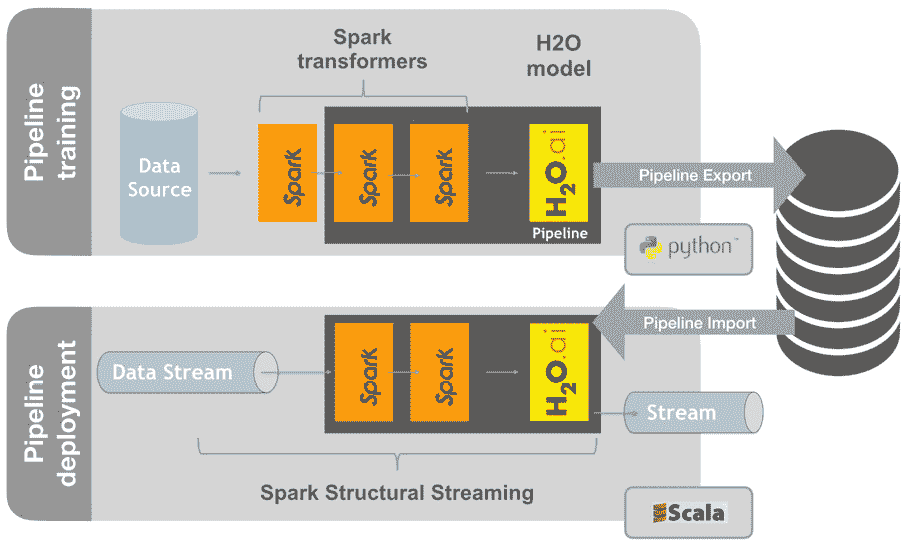

图 6.1 – Sparkling Water 流水线训练和部署示意图

接下来，让我们创建一个流水线来实现情感分析。

## 实现情感分析流水线

接下来，我们为情感分析分类问题创建一个 Sparkling Water 流水线。情感分析用于建模客户对产品或公司的正面或负面感受。它通常需要**自然语言处理**（**NLP**）从文本中创建预测器。在我们的例子中，我们使用**斯坦福网络分析平台**（**SNAP**）存储库中预处理的*亚马逊美食评论*数据集。有关原始数据，请参阅[`snap.stanford.edu/data/web-FineFoods.html`](https://snap.stanford.edu/data/web-FineFoods.html)。

让我们先验证 Spark 是否在我们的系统上可用。

```py
spark
```

以下屏幕截图显示了输出：

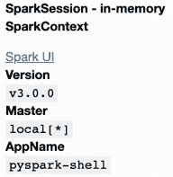

图 6.2 – 使用 PySparkling 内核在 Jupyter 笔记本中启动 Spark

你可以在 Spark 输出中看到**SparkSession**已经启动，并且**SparkContext**已经初始化。

PySpark 和 PySparkling

**PySpark**是 Apache 的 Spark 的 Python 接口。它提供了一个交互式 Spark 会话的 shell，并可以访问 Spark 组件，如 Spark SQL、DataFrames 和 Streaming。**PySparkling**是**PySpark**的 H2O 扩展，允许从 Python 在 Spark 集群上启动 H2O 服务。我们的 Jupyter 笔记本使用 PySpark shell。

在 Sparkling Water 的*内部后端*模式下，H2O 资源在其 Spark 对应物上运行，所有这些都在同一个**Java 虚拟机**（**JVM**）中。如图所示，在**SparkContext**之上启动了一个**H2OContext**，并在 Spark 集群的每个工作节点上初始化了 H2O：

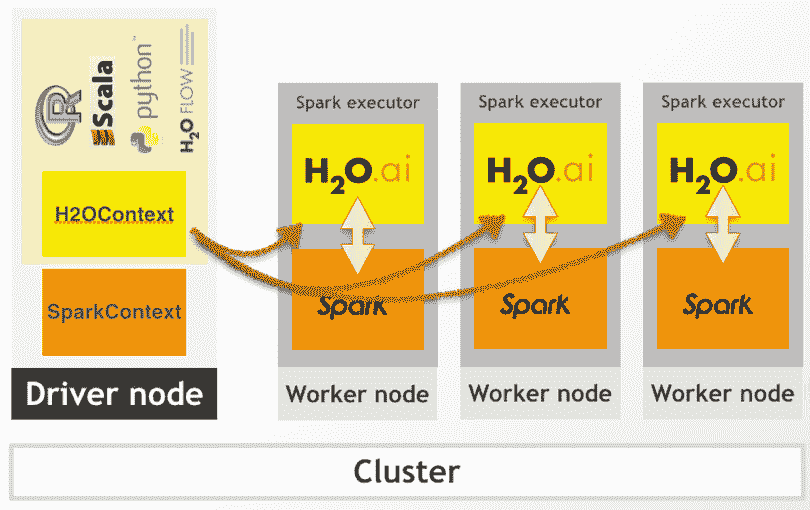

图 6.3 – Sparkling Water 内部后端模式

PySparkling 用于创建 H2OContext 并初始化工作节点，如下所示：

```py
from pysparkling import *
```

```py
hc = H2OContext.getOrCreate()
```

这会产生以下输出：

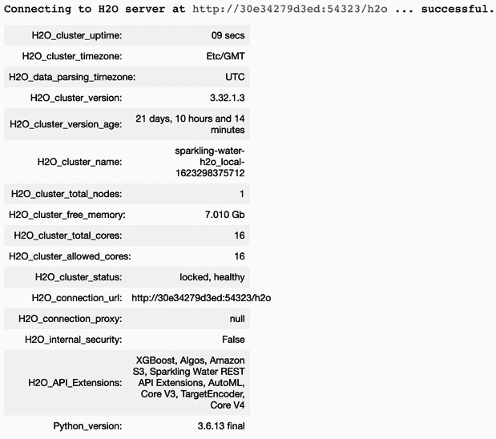

图 6.4 – Sparkling Water 集群启动后立即

在 H2O 服务器启动后，我们使用 Python 命令与之交互。我们首先导入原始数据。

## 导入原始的亚马逊数据

我们将亚马逊训练数据导入到`reviews_spark` Spark DataFrame 中，如下所示：

```py
datafile = "AmazonReviews_Train.csv"
```

```py
reviews_spark = spark.read.load(datafile, format="csv",
```

```py
    sep=",", inferSchema="true", header="true")
```

作为替代方案，我们本可以使用 H2O 导入数据，然后将`reviews_h2o` H2O 框架转换为`reviews_spark` Spark DataFrame，如下所示：

```py
import h2o
```

```py
reviews_h2o = h2o.upload_file(datafile)
```

```py
reviews_spark = hc.as_spark_frame(reviews_h2o)
```

这种方法的优势在于，它允许我们使用 H2O Flow 进行交互式数据探索，如*第五章*中所示，*高级模型构建 – 第一部分*，然后再将其转换为 Spark DataFrame。

接下来，我们打印数据模式以显示输入变量和变量类型。这是通过以下代码完成的：

```py
reviews_spark.printSchema()
```

结果数据模式在以下屏幕截图中显示：

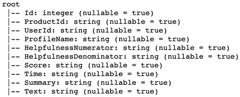

图 6.5 – 亚马逊美食原始数据的模式

为了简化，我们在这个分析中只使用了`Time`、`Summary`和整体的`Score`列。`Time`是一个日期时间字符串，`Score`是一个介于 1 到 5 之间的整数，从它可以导出情感，而`Summary`是产品评论的简短文本摘要。请注意，`Text`列包含实际的产品评论。更好的模型选择将包括`Text`，而不是或可能还包括`Summary`。

使用以下代码将输入数据模式保存到`schema.json`文件中：

```py
with open('schema.json','w') as f:
```

```py
    f.write(str(reviews_spark.schema.json()))
```

保存输入数据模式将使 Sparkling Water 管道的部署变得非常简单。

输入数据和生产数据结构

保存数据模式以供部署假定生产数据将使用相同的模式。作为构建 Sparkling Water 管道的数据科学家，我们强烈建议您的训练输入数据与生产数据模式完全一致。在模型构建之前追踪这些信息是值得的，而不是在部署阶段重新设计某些内容。

## 定义 Spark 管道阶段

Spark 管道是通过将单个数据操作或转换器连接在一起来创建的。每个转换器将其输入数据作为前一阶段的输出数据，这使得数据科学家的开发变得非常简单。一个大型作业可以被分解成一系列相互连接的单独任务。

Apache Spark 通过延迟评估来操作。这意味着计算不会立即执行；相反，操作被缓存，当触发某种操作的动作时才会执行。这种方法具有许多优点，包括允许 Spark 优化其计算。

在我们的示例中，所有数据清洗和特征工程步骤将通过 Spark 转换器创建。通过训练一个 H2O XGBoost 模型来最终确定管道。为了清晰起见，我们在构建管道的过程中将为每个转换器定义一个阶段编号。

### 第 1 阶段 – 创建一个转换器以选择所需的列

Spark 的`SQLTransformer`类允许我们使用 SQL 来处理数据。由于大多数数据科学家已经熟悉 SQL，这使得 Spark 在数据操作方面的采用变得顺利。`SQLTransformer`将在本管道中得到广泛使用。运行以下代码以导入该类：

```py
from pyspark.ml.feature import SQLTransformer
```

定义一个`colSelect`转换器，如下所示：

```py
colSelect = SQLTransformer(
```

```py
    statement="""
```

```py
    SELECT Score, 
```

```py
           from_unixtime(Time) as Time, 
```

```py
           Summary 
```

```py
    FROM __THIS__""")
```

在前面的代码中，我们选择了`Score`、`Time`和`Summary`列，将时间戳转换为可读的日期时间字符串。`FROM`语句中的`__THIS__`引用了前一转换器阶段的输出。由于这是第一个阶段，`__THIS__`指的是输入数据。

在开发过程中，通过直接调用转换器来检查每个阶段的结果是有帮助的。这使得调试转换器代码和理解下一阶段可用的输入变得容易。调用转换器将导致 Spark 执行它以及所有未评估的上游代码。以下代码片段说明了如何调用转换器：

```py
selected = colSelect.transform(reviews_spark)
```

```py
selected.show(n=10, truncate=False)
```

下面的屏幕截图显示了前几行：

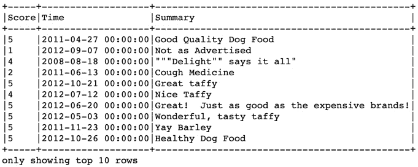

图 6.6 – colSelect 阶段 1 转换器的结果

这个第一个转换器已经将原始数据简化为三列。我们将分别对每一列进行操作，以创建我们的建模准备数据集。让我们从`时间`列开始。

### 阶段 2 – 定义一个转换器以创建多个时间特征

这个模型的目标是预测情感：评论是正面还是负面？日期和时间可能是影响情感的因素。也许人们在周五晚上给出更好的评论，因为周末即将到来。

`时间`列以时间戳的形式内部存储。为了在建模中变得有用，我们需要以预测算法可以理解的形式提取日期和时间信息。我们定义了一个`expandTime`转换器，使用 SparkSQL 数据方法（如`hour`、`month`和`year`）从原始时间戳信息中构建多个新特征，如下所示：

```py
expandTime = SQLTransformer(
```

```py
    statement="""
```

```py
    SELECT Score,
```

```py
           Summary, 
```

```py
           dayofmonth(Time) as Day, 
```

```py
           month(Time) as Month, 
```

```py
           year(Time) as Year, 
```

```py
           weekofyear(Time) as WeekNum, 
```

```py
           date_format(Time, 'EEE') as Weekday, 
```

```py
           hour(Time) as HourOfDay, 
```

```py
           IF(date_format(Time, 'EEE')='Sat' OR
```

```py
              date_format(Time, 'EEE')='Sun', 1, 0) as
```

```py
              Weekend, 
```

```py
        CASE 
```

```py
          WHEN month(TIME)=12 OR month(Time)<=2 THEN 'Winter' 
```

```py
          WHEN month(TIME)>=3 OR month(Time)<=5 THEN 'Spring' 
```

```py
          WHEN month(TIME)>=6 AND month(Time)<=9 THEN 'Summer' 
```

```py
          ELSE 'Fall' 
```

```py
        END as Season 
```

```py
    FROM __THIS__""")
```

注意，在`expandTime`代码中选择了`评分`和`摘要`，但我们没有对它们进行操作。这仅仅是将这些列传递给后续的转换器。我们从`时间`列中构建了几个特征：`日`、`月`、`年`、`周数`、`星期几`、`小时`、`周末`和`季节`。而且，`__THIS__`再次指的是`colSelect`阶段 1 转换器的输出。

为了检查我们的开发进度并可能调试我们的代码，我们检查第二阶段的输出，该阶段使用存储在`selected`中的第一阶段结果作为输入，如下面的代码片段所示：

```py
expanded = expandTime.transform(selected)
```

```py
expanded.show(n=10)
```

下面的屏幕截图显示了输出。

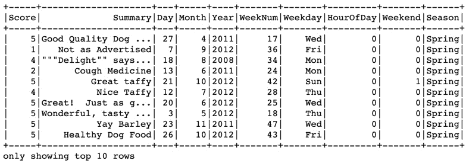

图 6.7 – expandTime 阶段 2 转换器的结果

输出确认我们已经成功将`时间`列替换为一系列新创建的特征。

### 阶段 3 – 从评分创建响应，同时移除中性评论

在这个阶段，我们使用`评分`列的值创建我们的`情感`响应变量。我们可以将`正面`与`非正面`建模为响应，但选择移除中性评论（`评分=3`），并将`正面`与`负面`进行比较。这是**净推荐者得分**（**NPS**）分析中的标准方法，并且在情感分析中也很常见。这样做是有道理的，因为我们假设具有中性响应的记录包含的信息很少，模型难以从中学习。

我们创建`createResponse`转换器的方式如下：

```py
createResponse = SQLTransformer(
```

```py
    statement="""
```

```py
    SELECT IF(Score < 3,'Negative', 'Positive') as Sentiment,
```

```py
           Day, Month, Year, WeekNum, Weekday, HourOfDay, 
```

```py
           Weekend, Season, Summary
```

```py
    FROM __THIS__ WHERE Score != 3""")
```

`IF`语句将 1 或 2 分给`Negative`情感，并将所有其他情感归为`Positive`，通过`WHERE`子句过滤掉中性的评论。现在，通过运行以下代码来检查这个中间步骤的结果：

```py
created = createResponse.transform(expanded)
```

```py
created.show(n=10)
```

这将产生以下输出：

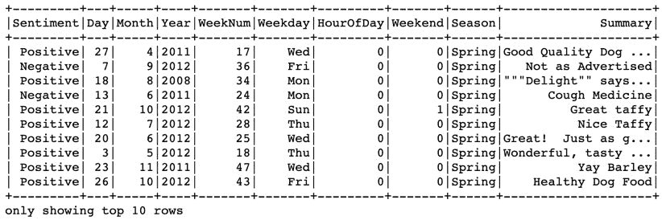


图 6.8 – createResponse 阶段 3 的输出结果

剩下的唯一特征工程步骤是将`Summary`列中的文本替换为适当的代表性数值。第 4 到第 8 阶段将利用 Spark 内置的 NLP 数据转换功能，根据`Summary`中的文本创建特征。虽然这不是一个正式的深度 NLP 研究，但我们将详细描述每个转换步骤，以便使我们的模型易于理解。

### 第 4 阶段 – 分词摘要

分词将文本序列分解成单个术语。Spark 提供了一个简单的`Tokenizer`类和一个更灵活的`RegexTokenizer`类，我们在这里使用后者。`pattern`参数指定了一个正则表达式中的转义引号`"[!,\" ]"`，并且我们指定`This`和`this`在后续处理中将被视为相同的术语。代码在下面的代码片段中展示：

```py
from pyspark.ml.feature import RegexTokenizer
```

```py
regexTokenizer = RegexTokenizer(inputCol = "Summary",
```

```py
                                outputCol = "Tokenized",
```

```py
                                pattern = "[!,\"]",
```

```py
                                toLowercase = True)
```

检查`Summary`中的分词值，如下所示：

```py
tokenized = regexTokenizer.transform(created)
```

```py
tokenized.select(["Tokenized"]).show(n = 10, 
```

```py
    truncate = False)
```

输出在下面的屏幕截图中显示：

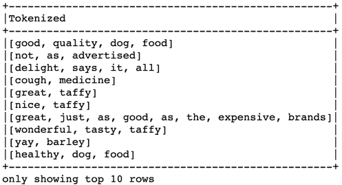


图 6.9 – regexTokenizer 阶段 4 的输出结果

现在短语已经被分解成单个术语或标记的列表。由于我们的目标是提取这些标记中的信息，我们接下来过滤掉那些信息量较小的单词。

### 第 5 阶段 – 去除停用词

有些单词在语言中出现的频率很高，它们几乎没有预测价值。这些被称为*停用词*，我们使用 Spark 的`StopWordsRemover`转换器来删除它们，如下面的截图所示：

```py
removeStopWords = StopWordsRemover(
```

```py
    inputCol = regexTokenizer.getOutputCol(),
```

```py
    outputCol = "CleanedSummary", 
```

```py
    caseSensitive = False)
```

让我们比较去除停用词前后的分词结果，如下所示：

```py
stopWordsRemoved = removeStopWords.transform(tokenized)
```

```py
stopWordsRemoved.select(["Tokenized", 
```

```py
                         "CleanedSummary"]).show(
```

```py
    n = 10, truncate = False)
```

结果在下面的屏幕截图中显示：

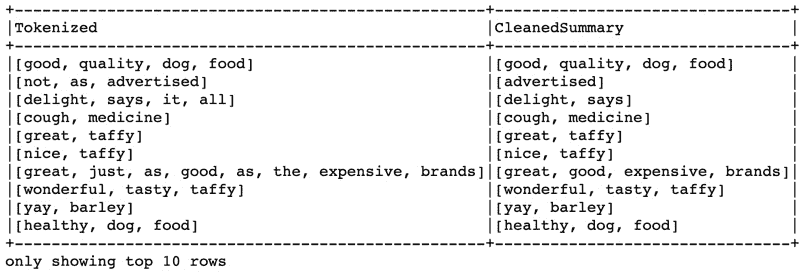


图 6.10 – removeStopWords 阶段 5 的输出结果

检查*图 6.10*的结果是很有说明性的。就大部分而言，移除诸如`as`、`it`或`the`之类的停用词对意义的影响很小：将*Great! Just as good as the expensive brands!*的陈述缩减为标记`[great, good, expensive, brands]`似乎是合理的。但*Not as advertised!*缩减为`[advertised]`呢？陈述中的`not`似乎承载着重要信息，而移除它会导致信息丢失。这是一个有效的问题，可以通过 NLP 概念如 n-gram（双词组、三词组等）来解决。为了演示 Sparkling Water 管道的例子，我们将承认这是一个潜在问题，但为了简单起见，我们将继续前进。

在预测建模中，自然语言处理（NLP）将文本信息表示为数字。一种流行的方法是**词频-逆文档频率**（**TF-IDF**）。TF 简单地是指一个词在文档中出现的次数除以文档中的单词数。在一个语料库（文档集合）中，IDF 衡量一个词在其构成文档中的稀有程度。例如，*线性*这样的词可能频率很高，但随着它在文档中出现的次数增加，其信息价值会降低。另一方面，像*摩托车*这样的词可能频率较低，但在语料库中出现的文档较少，使其信息含量更高。将 TF 乘以 IDF 得到一个经过缩放的 TF 值，这已被证明非常有用。当一个词频繁出现在一个文档中但只在一个文档中出现时，TF-IDF 值达到最大（*哪篇文章回顾了摩托车？*）。

TF-IDF 在信息检索、文本挖掘、推荐系统和搜索引擎以及预测建模中得到广泛应用。接下来的两个管道阶段将分别计算 TF 和 IDF 值。

### 第 6 阶段 – 为 TF 哈希单词

我们在 Spark 中计算 TF 的首选方法是`CountVectorizer`，它使用内部词汇表将索引映射回单词。也就是说，`countVectorizerModel.vocabulary[5]`查找存储在索引 5 中的单词。

构建更好的 TF-IDF 模型的一个技巧是通过将`minDF`参数设置为整数或比例来移除过于罕见的词，如下所示：

+   `minDF = 100`：省略在不到 100 个文档中出现的词

+   `minDF = 0.05`：省略在不到 5%的文档中出现的词

还有一个`maxDF`参数可以用来移除在语料库中过于频繁出现的词。例如，在 NLP 文档检索中设置`maxDF = 0.95`可能会提高模型性能。

我们创建一个`countVectorizer`转换器，如下所示：

```py
from pyspark.ml.feature import CountVectorizer 
```

```py
countVectorizer = CountVectorizer(
```

```py
    inputCol = removeStopWords.getOutputCol(),
```

```py
    outputCol = "frequencies",
```

```py
    minDF = 100 )
```

注意，我们的语料库是`removeStopWords`转换器的输出列，每行作为一个文档。我们输出频率并设置`minDF`为 100。因为`countVectorizer`是一个模型，所以在执行管道之前手动训练它是好主意。这对于任何作为管道组件的模型来说都是一种好习惯，因为它允许我们在管道执行开始之前确定其行为，并可能对其进行微调。以下代码片段展示了这一点：

```py
countVecModel = countVectorizer.fit(stopWordsRemoved)
```

我们可以通过检查其词汇表大小和单个术语，以及任何其他适当的尽职调查来探索这个模型。以下是完成此操作所需的代码：

```py
print("Vocabulary size is " +
```

```py
   str(len(countVecModel.vocabulary)))
```

```py
print(countVecModel.vocabulary[:7])
```

词汇表结果如下所示：

![图 6.11 – countVecModel 转换器的词汇表大小和词汇]

![图 B16721_06_11.jpg]

图 6.11 – countVecModel 转换器的词汇表大小和词汇

在*图 6.11*中显示的总词汇表大小是 1,431 个术语。使用以下代码检查数据：

```py
vectorized = countVecModel.transform(stopWordsRemoved)
```

```py
vectorized.select(["CleanedSummary", "frequencies"]).show(
```

```py
                  n = 10, truncate = False)
```

向量化结果如下截图所示：

![图 6.12 – countVecModel 转换器的中间结果]

![图 B16721_06_12.jpg]

图 6.12 – countVecModel 转换器的中间结果

*图 6.12* 展示了每行旁边带有 TF 向量的清洗后的摘要标记。为了描述第一行的输出，1431 的值是词汇表大小。接下来的值序列——`[1,10,11,38]`——指的是词汇向量中`[good, quality, dog, food]`术语的索引。最后的值序列——`[1.0,1.0,1.0,1.0]`——是它们各自术语的 TF 值。因此，`dog`通过索引`11`引用，并在`CleanedSummary`列中出现了 1 次。

### 第 7 阶段 – 创建 IDF 模型

我们使用 Spark 的`IDF`估计器从`countVectorizer`缩放频率，得到 TF-IDF 值。我们执行以下代码来完成此操作：

```py
from pyspark.ml.feature import IDF
```

```py
idf = IDF(inputCol = countVectorizer.getOutputCol(),
```

```py
          outputCol = "TFIDF",
```

```py
          minDocFreq = 1)
```

在我们执行管道之前，手动训练 IDF 模型以查看结果，如下所示：

```py
idfModel = idf.fit(vectorized)
```

再次检查数据，特别注意缩放的 TF-IDF 频率，如下所示：

```py
afterIdf = idfModel.transform(vectorized)
```

```py
afterIdf.select(["Sentiment", "CleanedSummary",
```

```py
    "TFIDF"]).show(n = 5, truncate = False, vertical = True)
```

以下截图显示了结果 TF-IDF 模型的头五行：

![图 6.13 – 来自 Spark 转换器的 TF-IDF 频率]

![图 B16721_06_13.jpg]

图 6.13 – 来自 Spark 转换器的 TF-IDF 频率

### 第 8 阶段 – 选择建模数据集列

除了`Sentiment`响应变量以及从`Time`变量中构建的所有特征之外，`idf`的输出还包括原始的`Summary`列以及`Tokenized`、`CleanedSummary`、`frequencies`和`TFIDF`。在这些中，我们只想保留`TFIDF`。以下代码选择了所需的列：

```py
finalSelect = SQLTransformer(
```

```py
    statement="""
```

```py
    SELECT Sentiment, Day, Month, Year, WeekNum, Weekday,
```

```py
           HourOfDay, Weekend, Season, TFIDF
```

```py
    FROM __THIS__ """)
```

现在我们已经完成了模型准备数据的构建，下一步是使用 H2O 的监督学习算法之一构建一个预测模型。

### 第 9 阶段 – 使用 H2O 创建 XGBoost 模型

到目前为止，我们所有的数据处理和特征工程工作都仅使用了 Spark 方法。现在，我们转向 H2O 在`Sentiment`列上训练 XGBoost 模型。为了简单起见，我们使用默认设置进行训练。代码如下所示：

```py
import h2o
```

```py
from pysparkling.ml import ColumnPruner, H2OXGBoost
```

```py
xgboost = H2OXGBoost(splitRatio = 0.8, labelCol = "Sentiment")
```

注意——在 Sparkling Water 中训练模型

在*第五章*《高级模型构建——第一部分》中，我们详细演示了构建和调整高质量 XGBoost 模型的过程。在这里，我们停留在简单的基线模型上，以强调整体管道的实用性。在实际应用中，应该在这条管道的建模组件上投入更多的努力。

## 创建 Sparkling Water 管道

现在我们已经定义了所有转换器，我们准备创建一个管道。这样做很简单——我们只需按照顺序在`Pipeline`的`stages`列表参数中命名每个转换器，如下所示：

```py
from pyspark.ml import Pipeline
```

```py
pipeline = Pipeline(stages = [
```

```py
    colSelect, expandTime, createResponse, regexTokenizer,
```

```py
    removeStopWords, countVectorizer, idf, finalSelect,
```

```py
    xgboost])
```

使用`fit`方法简化了管道模型的训练。我们传递一个包含原始数据的 Spark DataFrame 作为参数，如下所示：

```py
model = pipeline.fit(reviews_spark)
```

在`pipeline.fit`过程中，数据预处理和特征工程阶段按照在 XGBoost 模型拟合之前定义的顺序应用于原始数据。这些管道阶段在生产部署后与 XGBoost 阶段操作相同，生成预测。

## 展望未来——生产预览

将 Sparkling Water 管道投入生产只是简单地保存`pipeline`模型，将其加载到生产系统中，然后调用以下操作：

```py
predictions = model.transform(input_data)
```

在*第十章*《H2O 模型部署模式》中，我们展示了如何将此管道作为 Spark 流应用程序部署，该管道接收原始流数据并在实时输出预测。

# H2O 中的 UL 方法

H2O 包括几个无监督学习算法，包括**广义低秩模型**（**GLRM**）、**主成分分析**（**PCA**）以及用于降维的聚合器。聚类用例可以利用 k-means 聚类、H2O 聚合器、GLRM 或 PCA。无监督学习还基于一组在预测建模应用中使用的有用特征转换器——例如，一个观测点到由无监督方法识别的特定数据簇的距离。此外，H2O 还提供了一种用于异常检测的隔离森林算法。

## 什么是异常检测？

大多数**机器学习**（**ML**）算法以某种方式试图在数据中找到模式。这些模式被用于监督学习模型中的预测。许多无监督学习算法试图通过聚类相似数据或估计数据段之间的边界来揭示模式。无监督异常检测算法采取相反的方法：不遵循已知模式的数据点是我们要发现的。

在这个背景下，术语“异常”是中性的。它可能指的是一种不寻常的观察，因为它是最先出现的；更多的数据可能会产生更多类似的观察。异常可能表明意外事件，并可作为诊断工具。例如，在制造数据收集应用中，一个失败的传感器可能会产生不典型的测量值。异常也可能表明恶意行为者或行为：安全漏洞和欺诈是导致异常数据点的两个经典例子。

异常检测方法可能包括监督的、半监督的或无监督的方法。监督模型在欺诈检测中是金标准。然而，为每个观察结果获取标签可能成本高昂，并且通常不可行。当没有标签时，需要无监督方法。半监督方法指的是只有一些数据记录被标记的情况，通常是一小部分记录。

隔离森林是一种无监督学习算法，用于异常检测——我们将在下一节介绍。

## H2O 中的隔离森林

隔离森林算法基于决策树和一个巧妙的观察：异常值往往在决策树构建的早期就被分割出来。但是决策树是一种监督方法，那么如何实现无监督呢？诀窍是创建一个随机值的标签列，并在其上训练一个决策树。我们重复多次，并记录观察结果被分割到其自己的叶节点中的平均深度。观察结果越早被隔离，它就越可能是异常的。根据用例，这些异常点可能被过滤掉或升级以进行进一步调查。

你可以在下面的屏幕截图中看到隔离森林的表示：

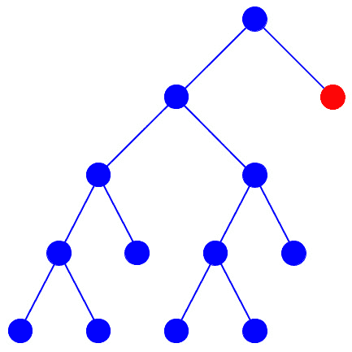


图 6.14 – 一个隔离森林

我们展示了如何在 H2O 中使用 Kaggle 信用卡交易数据（[`www.kaggle.com/mlg-ulb/creditcardfraud`](https://www.kaggle.com/mlg-ulb/creditcardfraud)）构建隔离森林。在这个数据集中有 492 起欺诈交易和 284,807 起非欺诈交易，这使得目标类高度不平衡。因为我们正在演示无监督异常检测方法，所以在模型构建过程中我们将丢弃标记的目标。

加载数据的 H2O 代码如下所示：

```py
df = h2o.import_file("creditcardfraud.csv")
```

我们使用`H2OIsolationForestEstimator`方法来拟合我们的隔离森林。我们将树的数量设置为`100`，并省略了最后一列，该列包含目标类标签，如下面的代码片段所示：

```py
iso = h2o.estimators.H2OIsolationForestEstimator(
```

```py
    ntrees = 100, seed = 12345)
```

```py
iso.train(x = df.col_names[0:31], training_frame = df)
```

一旦模型训练完成，预测就很简单，正如我们在这里可以看到的：

```py
predictions = iso.predict(df)
```

```py
predictions
```

输出如下所示：

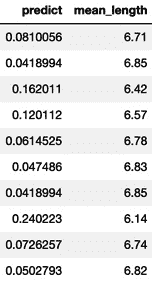


图 6.15 – 隔离森林预测

*图 6.15* 中的预测结果包含两列：归一化的异常分数和所有树中隔离观察的平均分割数。请注意，异常分数与平均长度完全相关，随着平均长度的减小而增加。

我们如何从异常分数或平均长度到一个实际的预测？最好的方法之一是通过基于分位数的阈值。如果我们对欺诈的普遍性有所了解，我们可以找到相应的分数分位数值并将其用作预测的阈值。假设我们知道我们 5% 的交易是欺诈的。然后，我们使用以下 H2O 代码估计正确的分位数：

```py
quantile = 0.95
```

```py
quantile_frame = predictions.quantile([quantile])
```

```py
quantile_frame
```

生成的分位数输出如下截图所示：

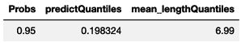

图 6.16 – 选择基于分位数阈值的阈值

我们现在可以使用以下代码使用阈值来预测异常类别：

```py
threshold = quantile_frame[0, "predictQuantiles"]
```

```py
predictions["predicted_class"] = \
```

```py
    predictions["predict"] > threshold
```

```py
predictions["class"] = df["class"]
```

```py
predictions
```

以下截图显示了 `predictions` 帧的前 10 个观察值：

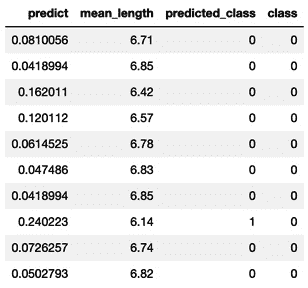

图 6.17 – 识别异常值

*图 6.17* 中的 `predict` 列只有一条观察值大于 0.198324，这是 *图 6.16* 中显示的 95 百分位数的阈值。`predicted_class` 列用 `1` 的值表示这一点。此外，请注意，该观察值的 `mean_length` 值为 `6.14`，小于其他九个观察值的平均长度值。

`class` 列包含我们在构建无监督隔离森林模型时省略的交易欺诈指示符。对于异常观察值，`0` 类值表示交易不是欺诈的。当我们像在这个例子中一样能够访问实际的目标值时，我们可以使用 `predicted_class` 和 `class` 列来研究异常检测算法在检测欺诈方面的有效性。我们应该注意，在这个上下文中，欺诈和异常的定义并不相同。换句话说，并非所有欺诈都是异常的，并非所有异常都会表明欺诈。这两个模型有各自的目的，尽管是互补的。

我们现在将注意力转向更新模型。

# 更新 H2O 模型的最佳实践

正如著名的英国统计学家乔治·博克斯所说，*所有模型都是错误的，但有些是有用的*。好的模型构建者了解他们模型的目的以及局限性。这对于那些构建投入生产的企业的模型的人来说尤其如此。

这样一种限制是，预测模型通常随着时间的推移而退化。这主要是因为在现实世界中，事物是不断变化的。也许我们所建模的——比如客户行为——本身也在变化，而我们收集的数据反映了这种变化。即使客户行为是静态的，但我们的业务组合发生了变化（比如更多的青少年和更少的退休人员），我们的模型预测很可能会退化。在这两种情况下，尽管原因不同，但用于创建我们的预测模型的样本人群现在与之前不同。

诊断模型退化并寻找其根本原因是诊断和模型监控的主题，这里我们不涉及。相反，一旦模型不再令人满意，数据科学家应该做什么？我们在以下章节中讨论了模型的重新训练和检查点。

## 重新训练模型

开发参数模型包括：

1.  找到正在建模的过程的正确结构形式，然后

1.  使用数据来估计该结构的参数。随着时间的推移，如果模型的架构保持不变但数据发生变化，那么我们可以*重新拟合*（或*重新训练*、*重新估计*或*更新*）模型的参数估计。这是一个简单且相对直接的程序。

然而，如果底层过程发生变化，以至于模型的架构形式不再有效，那么建模包括发现模型的正确形式和估计参数。这几乎，但并不完全，等同于从头开始。*重建*或*更新模型*（与*更新参数估计*相对）是描述这一更大活动的更好术语。

在机器学习或其他非参数模型的情况下，模型的架构形式由数据以及任何参数估计决定。这是非参数模型的一个卖点：它们非常数据驱动，几乎无假设。在这个背景下，重新拟合或重新训练与重建之间的差异几乎没有意义；这些术语实际上变成了同义词。

## 检查点模型

H2O 中的**检查点**选项允许您保存模型构建的状态，使得新的模型可以作为先前生成的模型的*延续*而不是从头开始构建。这可以用于使用额外的、更当前的数据更新生产中的模型。

检查点选项适用于**分布式随机森林**（**DRF**）、**梯度提升机**（**GBM**）、XGBoost 和**深度学习**（**DL**）算法。对于基于树的算法，指定的树的数量必须大于引用模型中的树的数量。也就是说，如果原始模型包含 20 棵树，而你指定了 30 棵树，那么将构建 10 棵新树。对于使用 epoch 而不是树的深度学习，这个概念同样适用。

只有在以下条件与检查点模型相同的情况下，这些算法的检查点才是可行的：

+   训练数据模型类型、响应类型、列、分类因素水平以及预测因子总数

+   如果在检查点模型中使用了，则使用相同的验证数据集（目前不支持检查点的交叉验证）。

您可以使用检查点指定的附加参数取决于用于模型训练的算法。

检查点注意事项

虽然在技术上可行，但我们不建议对 GBM 或 XGBoost 算法的新数据进行检查点。回想一下，提升是通过拟合先前模型的残差来工作的。因此，早期的分割是最重要的。在新数据被引入之前，模型的结构在很大程度上已经确定。

由于提升和袋装之间的差异，检查点**随机森林**模型不受这些问题的困扰。

# 确保 H2O 模型的可重复性

在实验室或实验环境中，在相同的协议和条件下重复一个过程应该导致类似的结果。当然，自然变异性可能发生，但这可以被测量并归因于适当的因素。这被称为*可重复性*。企业数据科学家应确保他们的模型构建具有良好的编码和充分的文档，以便使过程可重复。

在模型构建的上下文中，**可重复性**是一个更强的条件：重复一个过程时，结果必须相同。从监管或合规的角度来看，可能需要可重复性。

从高层次来看，可重复性需要相同的硬件、软件、数据和设置。让我们具体回顾 H2O 设置。我们开始于根据 H2O 集群类型的不同，考虑两个案例。

## 案例一 – 单节点集群中的可重复性

单节点集群是 H2O 硬件配置中最简单的配置。如果满足以下条件，可以实现可重复性：

+   **软件要求**：使用相同的 H2O-3 或 Sparkling Water 版本。

+   **数据要求**：使用相同的训练数据（请注意，H2O 需要单独导入文件而不是整个目录，以确保可重复性）。

+   `sample_rate`、`sample_rate_per_class`、`col_sample_rate`、`col_sample_rate_per_level`、`col_sample_rate_per_tree`。

+   如果启用了早期停止，只有当显式设置了`score_tree_interval`参数并且使用了相同的验证数据集时，才能保证可重复性。

## 案例二 – 多节点集群中的可重复性

向集群添加节点会创建额外的硬件条件，这些条件必须满足才能实现可重复性。软件、数据和设置的要求与之前在*案例 1*中详细说明的单节点集群相同。这些要求在此概述：

+   硬件集群必须配置相同。具体来说，集群必须具有相同数量的节点，每个节点具有相同数量的 CPU 核心，或者——作为替代方案——对线程数量的相同限制。

+   集群的领导者节点必须启动模型训练。在 Hadoop 中，领导者节点会自动返回给用户。在独立部署中，必须手动识别领导者节点。请参阅 H2O 文档以获取更多详细信息。

为了确保可重复性，你必须确保集群配置是相同的。并行化级别（节点数和每个节点的 CPU 核心/线程数）控制着数据集在内存中的分区方式。H2O 在这些分区上以可预测的顺序运行其任务。如果分区数不同，结果将不可重复。

在集群配置不相同的情况下，可能可以限制正在复制的计算资源。这个过程涉及在原始环境中复制数据分区。我们建议您查阅 H2O 文档以获取更多信息。

## 特定算法的可重复性

深度学习（DL）、梯度提升机（GBM）和**自动机器学习**（AutoML）算法的复杂性引入了额外的约束，这些约束必须满足以确保可重复性。我们将在本节中回顾这些要求。

### DL

由于性能原因，H2O DL 模型默认情况下不可重复。有一个可以启用的`reproducible`选项，但我们建议只在小型数据上这样做。由于仅使用一个线程进行计算，模型生成所需的时间会显著增加。

### GBM

当满足单节点或多节点集群的可重复性标准时，GBM 在浮点数舍入误差范围内是确定的。

### AutoML

为了确保 AutoML 中的可重复性，必须满足以下标准：

+   DL 必须排除。

+   应使用`max_models`约束而不是`max_runtime_secs`。

通常，基于时间的约束是资源受限的。这意味着如果运行之间的可用计算资源不同，AutoML 可能在一次运行中训练比另一次运行更多的模型。指定要构建的模型数量将确保可重复性。

## 可重复性的最佳实践

为了确保可重复性，考虑之前强调的四个要求类别：硬件、软件、数据和设置。这些类别在此处有更详细的解释：

+   **硬件**：你应该始终记录 H2O 集群运行的硬件资源——这包括节点数、CPU 核心和线程数。（此信息可以在日志文件中找到。）

+   **软件**：你应该记录使用的 H2O-3 或 Sparkling Water 的版本。（此信息可以在日志文件中找到。）

+   **数据**：显然，你必须使用相同的输入数据。你应该保存所有在模型训练之前用于处理数据的脚本。所有数据列的修改都应记录在案（例如，如果你将数值列转换为分类列）。

+   **设置**: 保存 H2O 的日志和二进制模型。日志包含大量信息。更重要的是，二进制模型包含了 H2O 版本（软件）以及用于训练模型（设置）的参数。

# 摘要

在本章中，我们通过展示如何在 Spark 管道中使用 H2O 模型以及一个实际的情感分析建模示例，完善了我们的高级建模主题。我们总结了 H2O 中可用的无监督学习方法，并展示了如何使用隔离森林算法构建一个用于信用卡欺诈交易用例的异常检测模型。我们还回顾了如何更新模型，包括重新拟合与检查点之间的区别，并展示了确保模型可复现性的要求。

在 *第七章*，“理解机器学习模型”，我们讨论了理解和审查我们机器学习模型的方法。
