# *第七章*: 理解机器学习模型

现在我们已经使用 H2O 软件构建了一些模型，下一步在生产之前是理解模型是如何做出决策的。这被称作机器学习可解释性（**MLI**）、可解释人工智能（**XAI**）、模型可解释性等等。所有这些术语的核心是，仅仅构建一个预测效果好的模型是不够的。在完全信任模型之前部署任何模型都存在固有的风险。在本章中，我们概述了 H2O 中用于解释机器学习模型的一组功能。

到本章结束时，你将能够做到以下几件事情：

+   选择一个合适的模型度量标准来评估你的模型。

+   解释 Shapley 值是什么以及如何使用它们。

+   描述全局和局部可解释性的区别。

+   使用多种诊断工具来建立对模型的了解和信任。

+   使用全局和局部解释以及模型性能指标来从一组候选模型中选择最佳模型。

+   评估单个候选模型在预测性能、评分速度和满足的假设之间的权衡。

在本章中，我们将涵盖以下主要主题：

+   选择模型性能指标

+   解释在 H2O 中构建的模型（全局和局部）

+   通过 H2O AutoDoc 进行自动化的模型文档

# 选择模型性能指标

任何模型最相关的问题是，*它的预测效果如何？* 无论模型可能拥有的其他积极属性如何，预测效果不佳的模型只是不太有用。如何最好地衡量预测性能既取决于要解决的问题的具体情况，也取决于数据科学家可用的选择。H2O 提供了多种测量模型性能的选项。

对于回归问题中的预测模型性能测量，H2O 提供了 R2、**均方误差**（**MSE**）、**均方根误差**（**RMSE**）、**均方根对数误差**（**RMSLE**）和**平均绝对误差**（**MAE**）作为指标。MSE 和 RMSE 是良好的默认选项，其中 RMSE 是我们的首选，因为该指标与预测的单位相同（而不是平方单位，如 MSE 的情况）。所有基于平方误差的指标通常对异常值敏感。如果需要鲁棒性以抵抗异常值，那么 MAE 是一个更好的选择。最后，RMSLE 在预测不足比预测过度更糟糕的特殊情况下是有用的。

对于分类模型，H2O 添加了基尼系数、绝对**马修斯相关系数**（**MCC**）、F1、F0.5、F2、准确率、Logloss、**ROC 曲线下面积**（**AUC**）、**精确率-召回率曲线下面积**（**AUCPR**）和**科尔莫哥洛夫-斯米尔诺夫**（**KS**）指标。根据我们的经验，AUC 是商业中最常用的指标。由于与商业伙伴和高级管理人员的沟通对数据科学家至关重要，我们建议在适用的情况下使用公认的指标。在 AUC 的情况下，当数据相对平衡时，它对二分类模型做得很好。对于不平衡数据，AUCPR 是更好的选择。

Logloss 指标基于信息理论，具有一些数学优势。特别是，如果你对类成员的预测概率本身感兴趣，而不仅仅是预测分类，那么 Logloss 是更好的指标选择。有关这些评分选项的更多文档可以在[`docs.h2o.ai/h2o/latest-stable/h2o-docs/performance-and-prediction.html`](https://docs.h2o.ai/h2o/latest-stable/h2o-docs/performance-and-prediction.html)找到。

为分类问题创建的 AutoML 排行榜包括 AUC、Logloss、AUCPR、每类平均误差、RMSE 和 MSE 作为性能指标。在*第五章*，*高级模型构建 – 第一部分*中创建的`check` AutoML 对象的排行榜如图 7.1 所示：

![Figure 7.1 – An AutoML leaderboard for the check object]

![img/B16721_07_01.jpg]

![Figure 7.1 – An AutoML leaderboard for the check object]

除了预测性能外，在企业环境中，模型性能的额外指标可能也很重要。在 AutoML 排行榜中默认包含的两个指标是拟合模型所需的时间（`training_time_ms`）和预测数据单行所需的时间（`predict_time_per_row_ms`）。

在*图 7.1*中，根据 AUC 和 Logloss 两个指标，最佳模型是所有模型的堆叠集成（顶部行中的模型）。这个模型在评分速度上比任何单个模型都要慢一个数量级。对于流式或实时应用来说，一个评分不够快的模型可能会自动被排除，无论其预测性能如何。

我们接下来讨论模型可解释性，以便理解和评估我们的机器学习模型。

# 解释 H2O 中构建的模型

在我们的测试数据上测量的模型性能指标可以告诉我们模型预测得有多好以及预测有多快。如章节引言中提到的，知道模型预测得很好并不是将其投入生产的充分理由。仅凭性能指标本身无法提供任何关于“为什么”模型会这样预测的见解。如果我们不理解模型预测得好的原因，我们几乎没有希望预测出会使模型表现不佳的条件。解释模型推理的能力是在将其推广到生产之前的一个关键步骤。这个过程可以描述为对模型建立信任。

可解释性通常分为全局和局部两个部分。全局可解释性描述了模型对整个种群的工作方式。对模型建立信任主要取决于确定其全局工作方式。局部解释则作用于单个行。它们解决的问题是，例如，一个个体预测是如何产生的。《h2o.explain》和《h2o.explain_row》方法分别捆绑了一组用于全局和局部解释的可解释性函数和可视化。

我们从沙普利值的简单介绍开始，这是模型可解释性中的基石方法之一，初次接触时可能会感到困惑。我们使用《h2o.explain》覆盖单个模型的全局解释，并使用《h2o.explain_row》进行局部可解释性。然后，我们使用《h2o.explain》处理 AutoML 的全局解释，我们用它来展示可解释性在模型选择中的作用。我们使用在*第五章*“高级模型构建 – 第一部分”中开发的两个模型来说明这些方法的输出，*Advanced Model Building – Part 1*。第一个，`gbm`，是一个使用默认值和 H2O `check`构建的个体基线模型。这些模型仅作为示例选择，承认原始基线模型通过多个特征工程和模型优化步骤得到了改进。

## 沙普利值的简单介绍

沙普利值已成为机器学习可解释性中的一个重要部分，作为将每个特征的贡献归因于整体或个体预测的手段。沙普利值在数学上优雅，非常适合归因任务。在本节中，我们提供了沙普利值的描述：它们的起源、计算以及如何用于解释。

洛伊德·沙普利（1923-2016），2012 年诺贝尔经济学奖获得者，于 1953 年推导出沙普利值，作为博弈论中特定问题的解决方案。假设一组玩家共同获得一项奖金。应该如何在玩家之间公平地分配这笔奖金？

Shapley 从定义公平性的数学公理开始：**对称性**（贡献相同数量的玩家获得相同的支付），**虚拟玩家**（没有贡献的玩家什么也得不到），和**可加性**（如果游戏可以分解为可加的部分，那么可以分解支付）。Shapley 值是满足这些公理的唯一数学解。简而言之，Shapley 值方法按玩家的边际贡献比例支付玩家。

我们接下来演示几个简单场景的 Shapley 值的计算。

### Shapley 计算示例 – 两位玩家

为了说明 Shapley 值的计算，考虑以下简单的例子。两位音乐家约翰和保罗，各自单独表演可以赚得£4 和£3，分别。约翰和保罗一起表演可以赚得£10。他们应该如何分配这£10？

要计算他们的边际贡献，考虑这些玩家可以按何种方式排序。对于两位玩家，只有两种独特的排序：约翰先演奏，然后保罗加入，或者保罗先演奏，然后约翰加入。这已在*图 7.2*中展示：

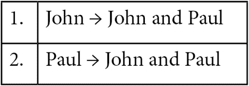

图 7.2 – 约翰和保罗的独特玩家序列

将其表示为独特玩家序列使我们能够计算每个玩家的 Shapley 值。我们在*图 7.3*中展示了约翰的 Shapley 值的计算：

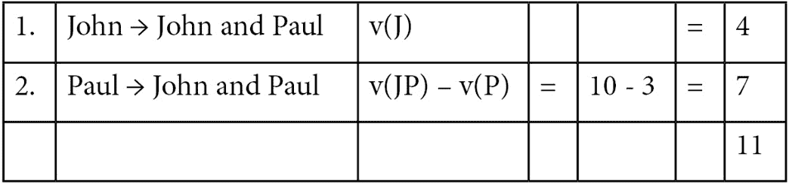

图 7.3 – 约翰的序列值

在序列 1 中，约翰是第一个出现的玩家，因此 Shapley 贡献只是边际价值*v(J) = 4*。在第二个序列中，约翰在保罗之后加入。约翰的边际价值是约翰和保罗的联合价值*v(JP)*减去保罗的边际价值*v(P)*。换句话说，*10 – 3 = 7*。约翰的 Shapley 值是每个序列值的平均值：*S(J) = 11/2 = 5.5*。因此，约翰应该从£10 的支付中获得£5.50。

保罗的 Shapley 值以类似的方式计算（显然，也可以通过减法计算）。序列计算在*图 7.4*中展示：

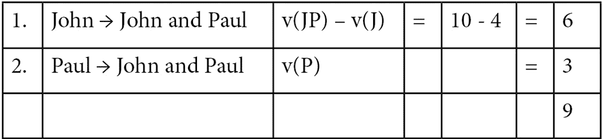

图 7.4 – 保罗的序列值

在*图 7.4*的第一个序列中，保罗在约翰之后加入，因此序列值是联合的*v(JP) = 10*减去约翰的边际价值*v(J) = 4*。第二个序列只是保罗的边际价值：*v(P)=3*。保罗的 Shapley 值是*S(P) = 9/2 = 4.5*。

这些计算简单且合理，适用于两位玩家。让我们看看当我们添加第三位玩家时会发生什么。

### Shapley 计算示例 – 三位玩家

假设第三位音乐家乔治加入约翰和保罗。乔治自己赚得£2，与约翰合作表演赚得£7，与保罗合作表演赚得£9，当三人一起表演时赚得£20。为了清晰起见，我们在*图 7.5*中总结了收入：

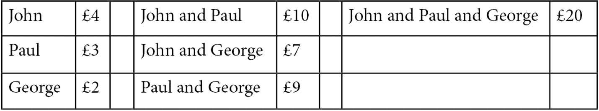

图 7.5 – 约翰、保罗和乔治的收益

因为有三个玩家，所以约翰、保罗和乔治可以到达的 6 个独特的序列中，有 3! = 6 个。在这个三玩家场景中，计算约翰 Shapley 值的计算总结在*图 7.6*中：

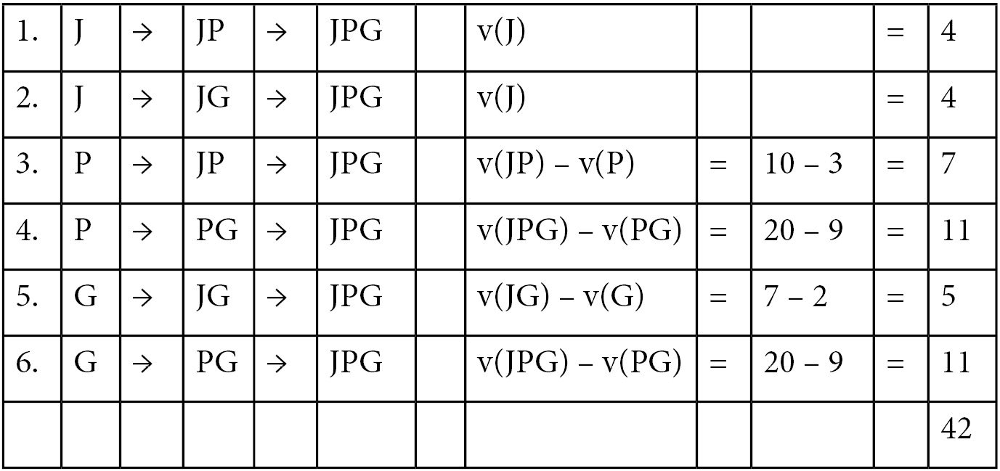

图 7.6 – 计算约翰 Shapley 值的到达序列和值

在*图 7.6*中，序列 1 和 2 很简单：约翰是第一个玩家，所以只需要*v(J)*值。在序列 3 和 5 中，约翰是第二个玩家。序列值是通过计算约翰和第一个玩家的联合值，然后减去该玩家的边际值来计算的。序列 4 和 6 是相同的：约翰是最后一个玩家。他的边际贡献是通过计算三方交互*v(JPG)*，然后减去保罗和乔治的联合值*v(PG)*来计算的。Shapley 值为*S(J) = 42/6 = 7*。

我们可以继续以同样的方式找到保罗和乔治的 Shapley 值。

### 计算 N 个玩家的 Shapley 值

如您所见，随着玩家数量 N 的增加，Shapley 值计算可以迅速变得令人难以承受。Shapley 序列计算依赖于知道主要效应和从双向到 N 向的所有交互的值，如图 7.5 所示。此外，还有*N!*个序列需要解决。随着玩家数量的增加，计算任务显著增加。

在预测模型的背景下，每个特征都是一个玩家，预测是共享的奖品。我们可以使用 Shapley 值来分配每个特征对最终预测的影响。一些模型可能有数十个、数百个甚至更多的特征，因此在现实世界中计算 Shapley 值并非易事。幸运的是，现代计算和计算某些模型族 Shapley 值的数学捷径的组合使得 Shapley 计算可行。

不论是我们在示例中展示的简单例子，还是大型复杂的机器学习模型，Shapley 值的解释都是相同的。

我们接下来关注单个模型的全球解释。

## 单个模型的全球解释

我们使用第五章中构建的基线 GBM 模型来说明单个模型解释，该模型在*第五章*（B16721_05_Final_SK_ePub.xhtml#_idTextAnchor082）中介绍，*高级模型构建 – 第一部分*。我们将其标记为`gbm`，并在*图 5.5*至*图 5.10*中记录了其性能。

全局解释的基本命令如下：

```py
model_object.explain(test)
```

在这里，`test` 是用于模型评估的保留测试数据集。其他可选参数包括以下内容：

+   `top_n_features`：一个整数，表示在基于列的方法（如`5`）中要使用多少列。

+   `columns`：一个列名向量，用于基于列的方法，作为 `top_n_features` 的替代。

+   `include_explanations` 或 `exclude_explanations`：分别表示包含或排除如 `confusion_matrix`、`varimp`、`shap_summary` 或 `pdp` 等方法。

对于单个分类模型如 `gbm`，此命令将显示混淆矩阵、变量重要性图、SHAP 概述图和部分依赖图，按重要性顺序显示前五个变量。

我们使用 `gbm` 模型和 `gbm.explain(test)` 命令来演示这一点，并依次讨论每个显示结果。

### 混淆矩阵

第一个输出结果是混淆矩阵，如图 7.7 所示：

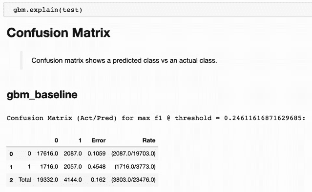

图 7.7 – GBM 基线模型的混淆矩阵

`explain` 方法的优点之一是每个显示都提供了简单的总结描述：`gbm` 显示真实负例（17,616），假阳性（2,087），假阴性（1,716），和真实正例（2,057），以及假阳性率（10.59%）和假阴性率（45.48%）。

### 变量重要性图

`explain` 方法的第二个可视化结果是变量重要性图，如图 7.8 所示：

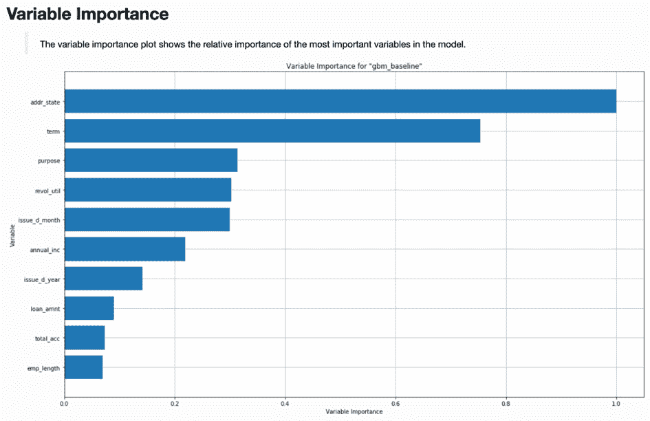

图 7.8 – GBM 基线模型的变量重要性图

注意，图 7.8 中的变量重要性图与我们在图 5.10 中手动使用 `varimp_plot` 命令创建的图表相同。它的包含是使用 `explain` 方法的一个好处。

### SHAP 概述图

`explain` 方法输出的第三个可视化结果是 SHAP 概述图。**SHAP**，基于 Shapley 值，为黑盒模型提供了一个信息丰富的视角。GBM 基线模型的 SHAP 概述图如图 7.9 所示：

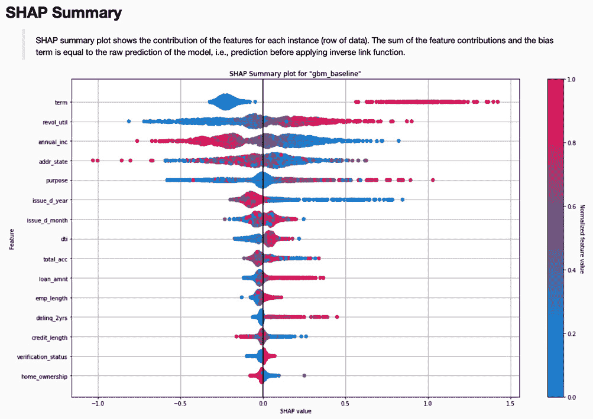

图 7.9 – GBM 基线模型的 SHAP 概述图

让我们更详细地解释图 7.9 中的 SHAP 概述图。在这个信息丰富的图表中有很多内容：

+   在左侧，我们按 Shapley 值递减的顺序列出了特征（数据列）。(注意，Shapley 特征重要性排名不一定与图 7.8 中的特征重要性相同。)

+   在右侧，我们有一个从 **0.0** 到 **1.0**（蓝色到红色，由 H2O 输出）的归一化特征值刻度。换句话说，对于每个特征，我们通过颜色编码原始数据值：低原始值用蓝色表示，过渡到紫色表示中等值，最后用红色表示高原始值（在本图中它们显示为不同灰度的阴影）。

+   每个观察值的水平位置由其 SHAP 值决定。SHAP 值衡量每个特征对预测的贡献。较低的 SHAP 值与较低的预测相关联，而较高的值与较高的预测相关联。

在有了这个初步理解之后，我们可以做出以下观察：

+   具有右侧红色值和左侧蓝色值的特征与响应呈正相关。由于我们正在建模不良贷款的概率，因此像较长期限（`term`）或较高循环利用率（`revol_util`）这样的特征与贷款违约呈正相关。（循环信用利用率基本上是客户每月信用卡余额的大小。）

+   左侧红色值和右侧蓝色值的特征与响应呈负相关。因此，例如，更高的年收入（`annual_inc`）与贷款违约呈负相关。

这些来自 SHAP 摘要图模型的观察结果具有直观的意义。你可能会预期，持有更大信用卡余额或年收入较低的人有更高的贷款违约概率。

注意，我们可以使用`gbm.shap_summary_plot(test)`命令得到相同的图。

### 部分依赖性图

`explain`输出的第四个可视化结果是部分依赖性图的一组。具体显示的图取决于`top_n_features`或`columns`可选参数。默认情况下，按变量重要性递减的顺序显示前五个特征。*图 7.10*显示了地址状态的部分依赖性图：

![图 7.10 – 地址状态的部分依赖性图]

![img/B16721_07_10.jpg]

图 7.10 – 地址状态的部分依赖性图

*图 7.11*显示了循环利用率变量的部分依赖性图：

![图 7.11 – 循环利用率的部分依赖性图]

![img/B16721_07_11.jpg]

图 7.11 – 循环利用率的部分依赖性图

`explain`生成的部分依赖性图包括样本大小（从图表底部开始的阴影区域）的表示，以及均值响应及其变异性（被阴影区域包围的线）。在分类变量的情况下，均值响应是一个带有表示变异性的条形图的点，如图*7.10*所示。在数值变量的情况下，均值响应是一条深色线，较浅的阴影表示变异性，如图*7.11*所示。

注意，我们可以使用以下方法为任何单个列创建部分依赖性图：

```py
gbm.pd_plot(test, column='revol_util')
```

### 全局个体条件期望（ICE）图

ICE 图将在“单个模型的局部解释”部分后面介绍。然而，为了完整性，我们在此包括一个全局版本的 ICE 图。请注意，此图不是由`explain`生成的。`gbm.ice_plot(test, column='revol_util')`命令返回一个全局 ICE 图，如图*7.12*所示：

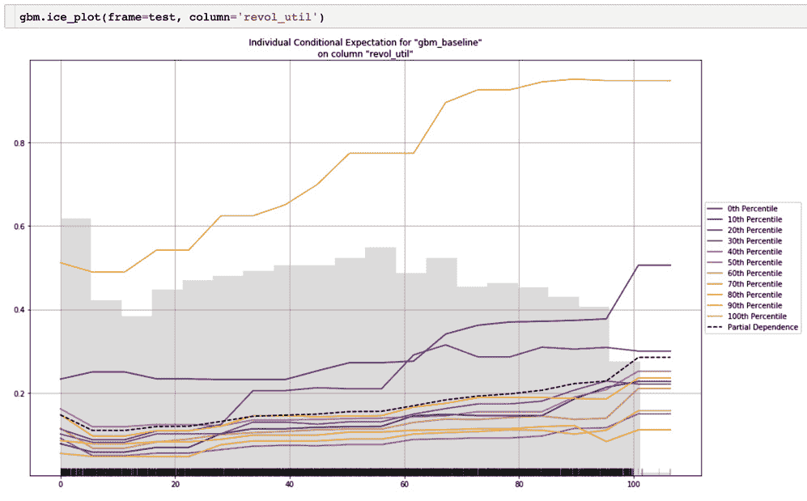

图 7.12 – 全球 ICE 利用率图

变量的全局 ICE 图是该变量的部分依赖图的扩展。部分依赖图显示均值响应与特定变量的值之间的关系。阴影，如 *图 7.11* 所示，表示部分依赖线的可变性。全局 ICE 图通过使用多条线来表示总体来放大这一点。（在分类变量的情况下，线被点替换，阴影被条形图替换。）

如 *图 7.12* 所示，全局 ICE 图包括最小值（0 百分位）、十分位数（10 百分位至 90 百分位，每 10 个百分位一个），最大值（100 百分位）以及部分依赖本身。这比单独的部分依赖图更准确地描绘了总体。与部分依赖线平行的百分位数对应于部分依赖是良好代表的总体部分。通常情况下，总体最小值和最大值的行为可能与部分依赖线描述的均值行为大不相同。在 *图 7.12* 中，有三条与其他不同的线：最小值、最大值和 10 百分位。

我们接下来关注单个模型的局部解释。

## 单个模型的局部解释

`h2o.explain_row` 方法允许数据科学家调查模型的局部解释。虽然全局解释用于理解模型如何代表总体，但局部解释使我们能够逐行询问模型。这在业务中尤为重要，因为行代表客户，正如我们在 Lending Club 分析中所做的那样。

当预测模型被用来做出直接影响客户决策（例如，不批准贷款申请或提高客户的保险费率）时，全局解释不足以满足业务、法律或监管要求。这正是局部解释至关重要的地方。

`explain_row` 方法返回指定 `row_index` 值的这些局部解释。`gbm.explain_row(test, row_index=10)` 命令提供了一个基于变量重要性的 SHAP 解释图和多个 ICE 图。与部分依赖图一样，可以提供可选的 `top_n_features` 或 `columns` 参数。

结果的 SHAP 解释图显示在 *图 7.13* 中：

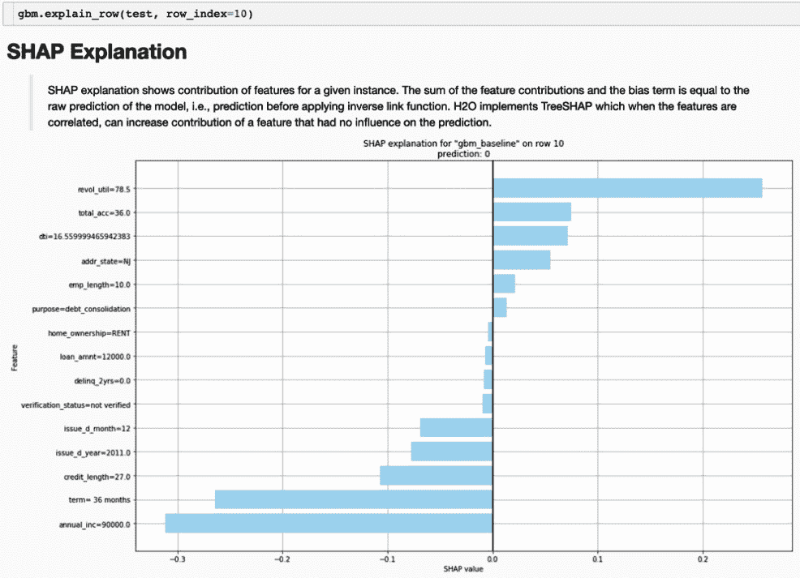

图 7.13 – 指数 = 10 的 SHAP 解释

SHAP 解释显示了每个变量对基于 Shapley 值的整体预测的贡献。对于 *图 7.13* 中显示的客户，正的 SHAP 值可以被认为是增加了贷款违约的概率，而负的 SHAP 值是那些降低违约概率的值。对于这位客户，78.5% 的循环利用率是预测概率的最大正贡献者。最大的负贡献者是年收入 90,000，它比其他任何变量都更能降低贷款违约的概率。SHAP 解释可以用来提供 **原因代码**，这有助于解释模型。原因代码还可以作为与客户直接分享信息的基础，例如，在适用于某些金融和保险相关监管模型的负面行动代码中。

我们接下来查看 `explain_row` 方法输出的某些 ICE 图。

### ICE 图的局部解释

ICE 图是部分依赖图的个体或每行对应图。就像特征的部分依赖图显示目标变量的平均响应，同时改变特征值一样，ICE 图在改变单行特征值的同时测量目标变量的响应。以 *图 7.14* 中显示的地址状态的 ICE 图为例，这是 `gbm.explain_row` 调用的结果：

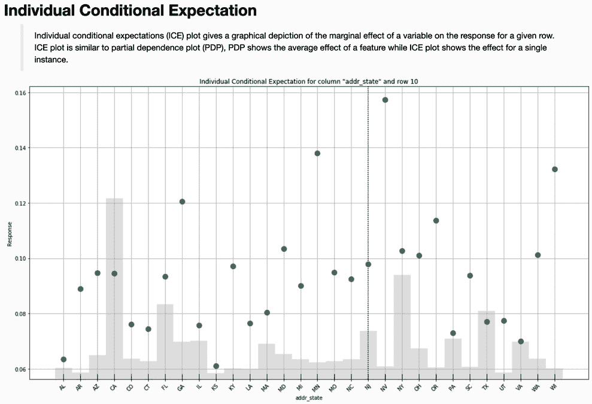

图 7.14 – 地址状态的 ICE 图

*图 7.14* 中的垂直暗虚线代表所讨论行的实际响应。在这种情况下，状态是 **NJ**（新泽西州）响应约为 0.10。如果这一行的状态是 **VA**（弗吉尼亚州），响应会较低（大约 0.07）。如果这一行的状态是 **NV**（内华达州），响应会更高，大约 0.16。

考虑下一个 *图 7.15*，贷款期限的 ICE 图：

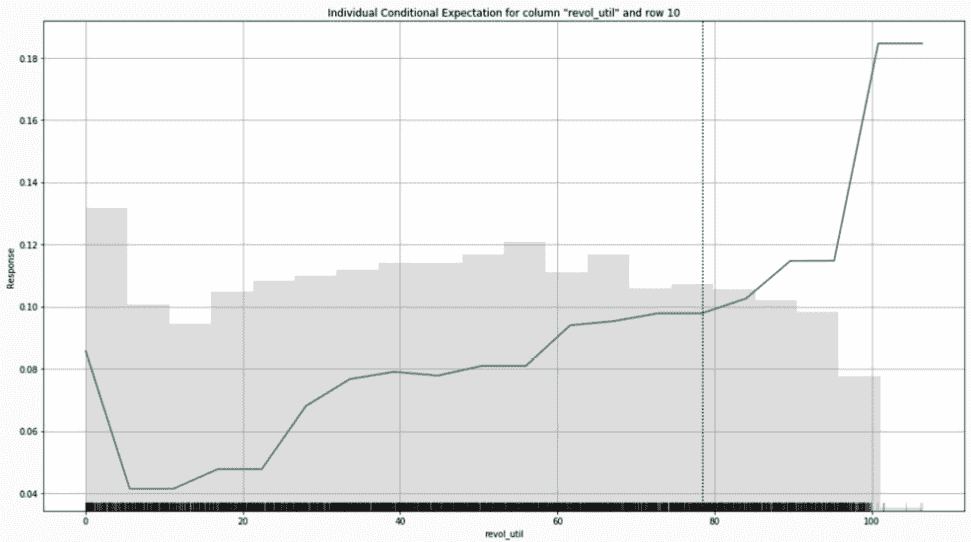

图 7.15 – 贷款期限的 ICE 图

*图 7.13* 中对于 36 个月期限的 SHAP 解释值是第二大负因素（它在年收入之后，年收入是最大的，它降低了贷款违约的概率）。根据 *图 7.15*，60 个月的贷款期限会导致略高于 0.35 的违约概率，这比 36 个月期限的大约 0.10 的违约概率显著更高。虽然 SHAP 解释和 ICE 图测量的是两件不同的事情，但它们的解释可以联合使用来理解特定预测的行为。

我们考虑的最后一张 ICE 图是关于旋转利用率的，这是一个数值特征而不是分类特征。这张图显示在 *图 7.16* 中：

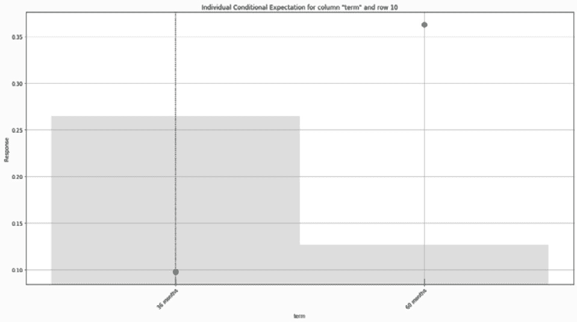

](img/B16721_07_14.jpg)

图 7.16 – 旋转利用率的 ICE 图

根据图 7.13 中的 SHAP 解释，循环利用率是影响最大的积极因素（增加贷款违约的概率）。图 7.16 中的 ICE 图显示了响应与循环利用率值之间的关系。如果`revol_util`为 50%，贷款违约的概率将降低到大约 0.08。如果为 20%，违约概率将约为 0.05。如果这位客户被拒绝贷款，循环利用率的高值将是一个可辩护的理由。相应的 ICE 图的结果可以用来告知客户他们可以采取哪些步骤来获得贷款资格。

## 多个模型的全球解释

在确定要将哪个模型推广到生产中时，例如从 AutoML 运行中，数据科学家可以完全依赖预测模型指标。这可能意味着简单地推广 AUC 值最好的模型。然而，有很多信息可以帮助做出这个决定，其中预测能力只是多个标准中的一个。

H2O 的全局和局部解释特征提供了额外的信息，这些信息对于与预测属性一起评估模型非常有用。我们使用来自*第五章*，“高级模型构建 – 第一部分”的`check` AutoML 对象来演示它。

启动多个模型的全球解释的代码非常简单，如下所示：

```py
check.explain(test)
```

这将产生变量重要性热图、模型相关性热图和多个模型的局部依赖性图。我们将依次回顾这些内容。

### 变量重要性热图

变量重要性热图通过添加颜色作为维度，将多个模型的变量重要性图进行视觉组合，以便与变量（作为行）和模型（作为列）一起查看。`check.explain`生成的变量重要性热图如图 7.17 所示：

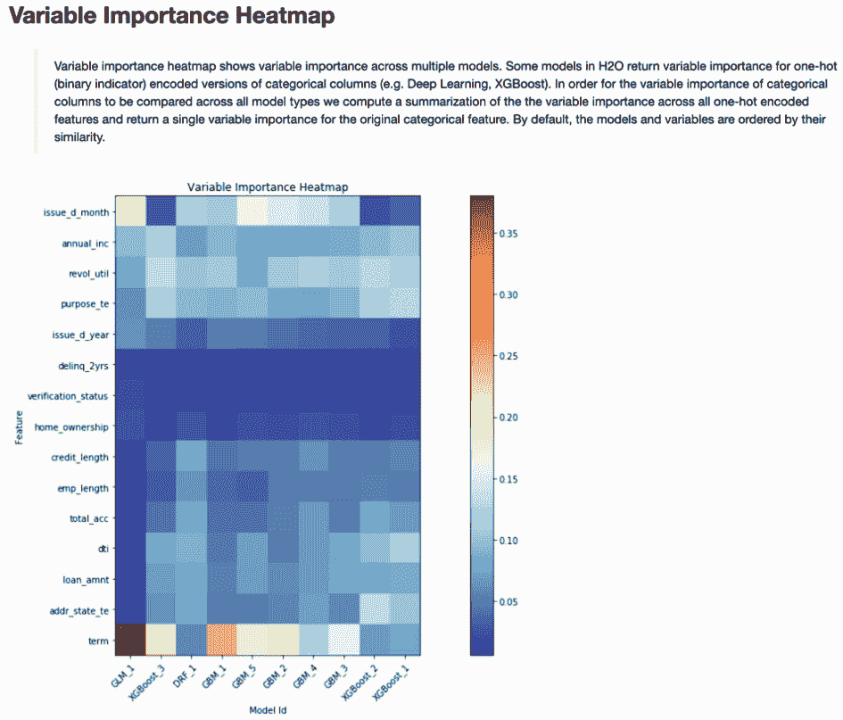

Figure 7.17 – AutoML 对象的变量重要性热图

变量重要性值被编码为从蓝色（冷色）到红色（暖色）的颜色连续体，代表低值到高值。生成的图形具有视觉意义。在图 7.17 中，垂直带对应于每个模型，水平带对应于单个特征。相似的垂直带表明模型使用其特征的方式之间存在高度相关性。例如，`XGBoost_1`和`XGBoost_2`模型（最后两列）显示出相似的图案。

你还可以看到类似颜色的水平带，例如`delinq_2yrs`、`verification_status`或在一定程度上，`annual_inc`。这表明所有候选模型都对这些变量给予了相当的重要性。最后一行的`term`变量在视觉上最为突出，因为其在不同模型中是异质的。这些模型对其绝对重要性的看法并不一致。然而，你必须小心不要过度解读这一点。注意，对于`term`，六个模型中的十个模型（除了蓝色方块：`DRF_1`、`GBM_4`、`XGBoost_2`和`XGBoost_1`）的相对重要性是相同的。对于这六个模型，`term`是最重要的特征，尽管其确切值变化很大。

创建此显示的直接代码如下：

```py
check.varimp_heatmap()
```

接下来，让我们考虑模型相关性热图。

### 模型相关性热图

变量重要性热图使我们能够比较多个模型在如何查看和使用其组件变量方面的差异。模型相关性热图则回答了不同的问题：*这些不同模型的预测结果之间有多少相关性？* 为了回答这个问题，我们转向*图 7.18*中的模型相关性热图：

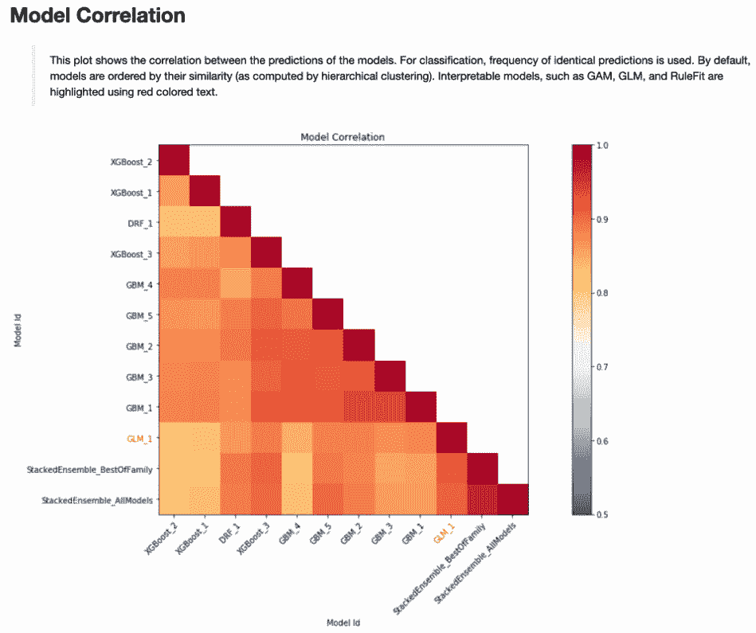

图 7.18 – AutoML 对象的模型相关性热图

*图 7.18*对角线上的最深色块显示了一个模型与其自身之间的完美相关性。依次变浅的阴影描述了模型之间的相关性逐渐降低。你如何使用这种显示来确定哪个模型可以提升到生产环境？

这就是商业或监管约束可能发挥作用的地方。在我们的例子中，`StackedEnsemble_AllModels`在 AUC 方面表现最佳。假设我们因任何原因不允许将集成模型提升到生产环境。与我们最佳模型高度相关的单个模型包括`XGBoost_3`、`GBM_5`和`GLM_1`。这些可以成为提升到生产环境的候选者，最终决定基于额外的标准（可能是测试集上的 AUC 值）。

如果这些额外标准之一是原生可解释性，那么对于这个 AutoML 对象，`GLM_1`是唯一的选择。请注意，在模型相关性热图中，可解释的模型用红色字体表示。

我们可以直接使用以下代码创建此显示：

```py
check.model_correlation_heatmap(test)
```

让我们继续介绍下一小节中多个模型的部分依赖图。

### 多模型部分依赖图

多模型`explain`方法的第三个输出是部分依赖图的扩展。对于分类变量，每个图上显示与不同模型对应的符号和颜色。*图 7.19*是使用`term`变量的一个示例：

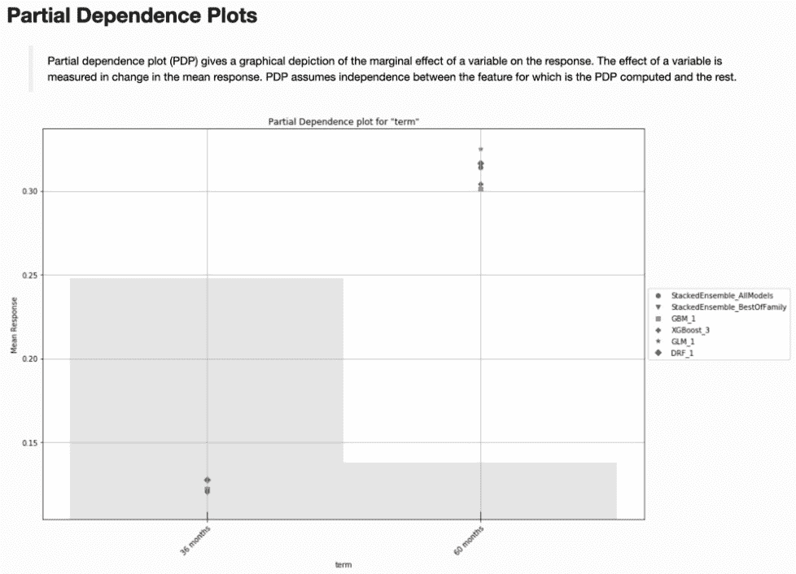

图 7.19 – 贷款期限的多模型部分依赖图

对于数值变量，多个模型在同一部分依赖图上用不同颜色的线条表示。*图 7.20*是使用`revol_util`变量示例：

![图 7.20 – 旋转利用率的多模型部分依赖图]

![img/B16721_07_20.jpg]

图 7.20 – 多模型旋转利用率的部分依赖图

在*图 7.19*和*图 7.20*中，竞争模型产生了非常相似的结果。这并不总是如此。例如，*图 7.21*显示了年收入的多模型部分依赖图：

![图 7.21 – 年收入的多模型部分依赖图]

![img/B16721_07_21.jpg]

图 7.21 – 多模型年收入的部分依赖图

尽管*图 7.21*中的大多数模型在低收入时相似，但随着收入的增加，它们差异很大。这部分是由于年收入分布尾部的样本量非常小。数据科学家也可能基于不切实际或不合理的尾部行为决定取消某些模型的资格。例如，根据我们的经验，随着年收入增加，贷款违约风险增加是没有意义的。最坏的情况是，我们预计收入和违约之间在某个点之后没有关系。我们更有可能预计随着收入的增加，贷款违约将单调递减。基于这个推理，我们会从考虑中移除顶部两条线（`DRF_1`和`GBM_1`）的模型。

与其他`explain`方法一样，我们可以直接使用以下命令创建此图：

```py
check.pd_multi_plot(test, column='annual_inc')
```

我们接下来访问模型文档。

# 自动化模型文档（H2O AutoDoc）

在企业环境中，数据科学团队的一个重要角色是记录投入生产的模型的历史、属性和性能。至少，模型文档应该是数据科学团队最佳实践的一部分。在企业环境中，通常需要详尽的模型文档或白皮书，以满足内部和外部控制以及监管或合规要求。

通常，模型文档应该足够全面，以便能够重新创建所记录的模型。这包括识别所有数据源，包括训练和测试数据特征，指定硬件系统组件，记录软件版本，建模代码，软件设置和种子，采用的建模假设，考虑的替代模型，性能指标和适当的诊断，以及基于业务或监管条件所需的其他任何内容。虽然这个过程至关重要，但耗时且可能繁琐。

**H2O AutoDoc** 是一款商业软件产品，可以自动为在 H2O-3 和 scikit-learn 中构建的模型创建全面的文档。在 H2O.ai 的**Driverless AI**中，也存在类似的功能，这是一款结合了自动特征工程和增强 AutoML 的商业产品，用于构建和部署监督学习模型。AutoDoc 已被成功用于记录现在投入生产的模型。在此，我们简要介绍了使用 AutoDoc 自动创建文档的方法：

1.  在创建模型对象之后，我们将`Config`和`render_autodoc`模块导入 Python：

    ```py
    from h2o_autodoc import Config
    from h2o_autodoc import render_autodoc
    ```

1.  接下来，我们将指定输出文件路径：

    ```py
    config = Config(output_path = "autodoc_report.docx")
    ```

1.  然后，我们将通过传递配置信息和模型对象来渲染报告：

    ```py
    doc_path = render_autodoc(h2o=h2o, config=config,
                              model=gbm)
    ```

1.  报告创建后，可以使用以下方式指示报告的位置：

    ```py
    print(doc_path)
    ```

*图 7.22* 展示了由 H2O AutoDoc 在 Microsoft Word 中创建的 44 页报告的目录：

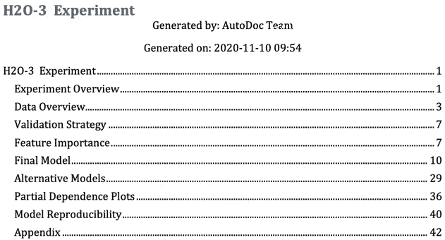

图 7.22 – 由 H2O AutoDoc 创建的模型文档目录

以最少的手动努力以一致的方式生成的详尽文档的优势是显而易见的。输出可以是 Microsoft Word 文档或 Markdown 格式，报告可以单独编辑和进一步定制。报告模板也易于编辑，允许数据科学团队根据不同的用途拥有不同的报告结构：例如，内部白皮书或用于监管审查的报告。AutoDoc 功能一直是 H2O 企业软件最受欢迎的功能之一。

# 摘要

在本章中，我们回顾了多个模型性能指标，并学习了如何选择一个用于评估模型预测性能的指标。我们通过一些简单的例子介绍了 Shapley 值，以进一步了解它们在预测模型评估中的目的和使用。在 H2O 中，我们使用了`explain`和`explain_row`命令为单个模型创建全局和局部解释。我们学习了如何解释生成的诊断和可视化结果，以增强对模型的信任。对于 AutoML 对象和其他模型列表，我们生成了全局和局部解释，并展示了如何将它们与模型性能指标一起使用，以筛选掉不合适的候选模型。综合以上内容，我们现在可以评估模型性能、评分速度和解释之间的权衡，以确定哪个模型可以投入生产。最后，我们讨论了模型文档的重要性，并展示了 H2O AutoDoc 如何自动为在 H2O（或 scikit-learn）中构建的任何模型生成详细的文档。

在下一章中，我们将把我们在 H2O 中构建和评估模型所学的所有内容结合起来，为 Lending Club 数据预测不良贷款创建一个部署就绪的模型。
