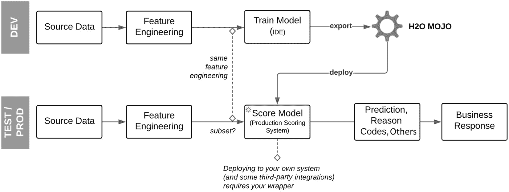
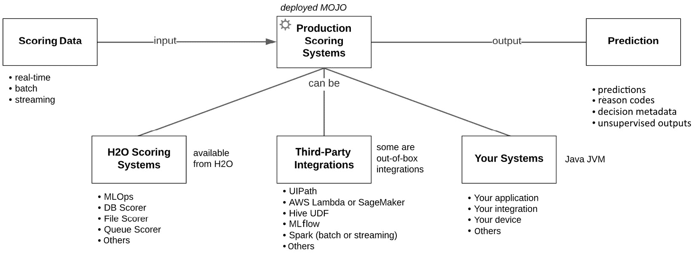
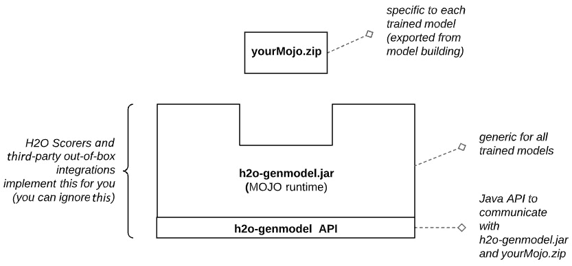
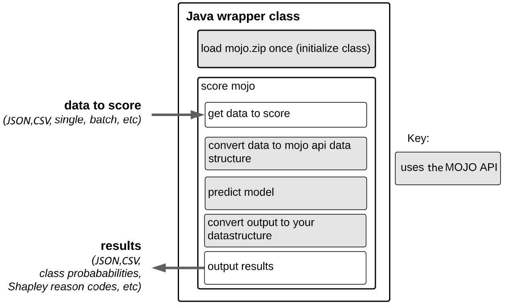
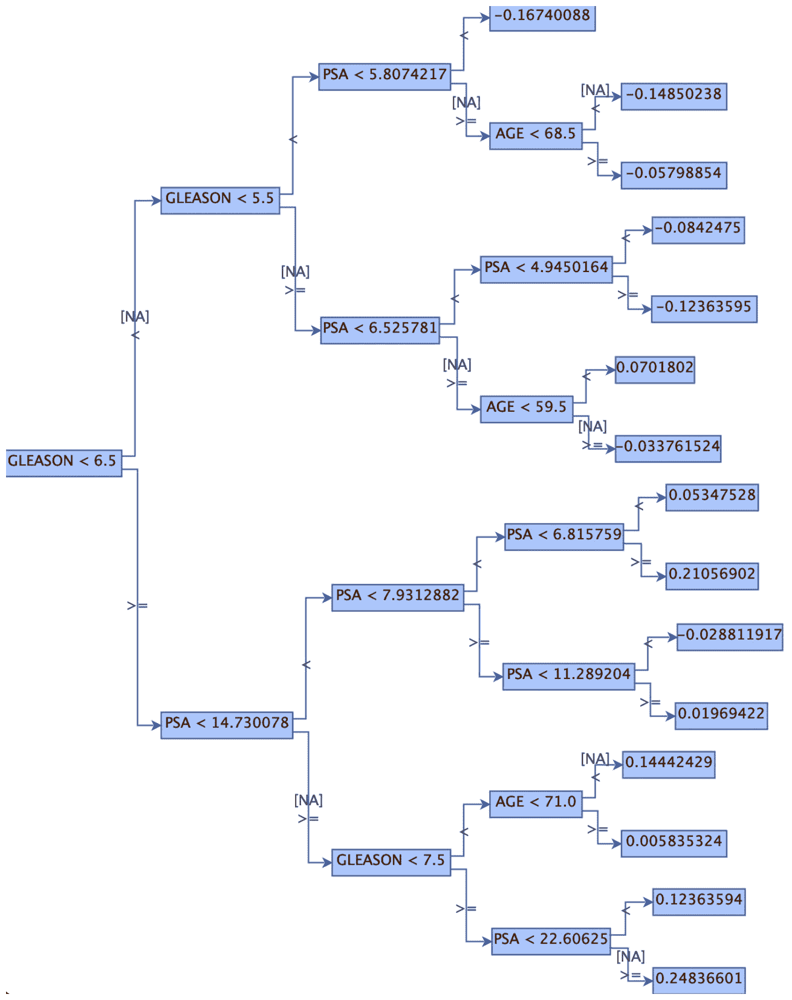

# *第九章*：生产评分和 H2O MOJO

我们在前一节中学习了如何使用 H2O 在规模数据上构建世界级模型。在本章中，我们将学习如何部署这些模型并从中进行预测。首先，我们将介绍将模型投入生产评分系统的背景。然后，我们将学习 H2O 如何使这一过程变得简单和灵活。这个故事的核心是 H2O **MOJO**（代表**Model Object, Optimized**），这是一个准备就绪的可部署评分工件，您可以从模型构建环境中导出它。我们将从技术上了解什么是 MOJO 以及如何部署它。然后我们将编写一个简单的批文件评分程序并在其中嵌入一个 MOJO。最后，我们将对 MOJO 进行一些总结。总之，在本章中，您将获得部署 H2O 模型的不同方式的知识，并开始从实时预测中获得价值。

这些是我们将在本章中涵盖的主要主题：

+   将 H2O 模型的建模上下文与评分上下文相关联

+   认识到 H2O 模型的目标生产系统的多样性

+   检查 H2O 可部署工件的技术设计，即 H2O MOJO

+   编写自己的 H2O MOJO 批文件评分器以展示如何在您的软件中嵌入 MOJOs

# 技术要求

在本章中，您需要一个 Java SE 8 或更高版本的环境。Java IDE，如 Eclipse，是可选的但很有用。您将在以下 GitHub 仓库中获取一个 MOJO、一个评分数据集以及批文件评分程序的 Java 代码：[`github.com/PacktPublishing/Machine-Learning-at-Scale-with-H2O/tree/main/chapt9`](https://github.com/PacktPublishing/Machine-Learning-at-Scale-with-H2O/tree/main/chapt9)。这些工件是从*第八章*中构建的模型生成的，*整合一切*。

注意，到目前为止我们已经完成了模型构建，因此您不需要一个指向运行中的 H2O 集群的模型构建环境。

# 模型构建和模型评分上下文

在*第二部分*，*使用 H2O 在大数据量上构建世界级模型*中，我们投入了大量精力使用 H2O 在规模上构建世界级模型。针对大规模数据集构建高度准确和可信的模型可能为一家企业带来数百万美元的收入，挽救生命，并定义新产品领域，但这只有在模型部署到生产系统，在那里进行预测并采取行动的情况下才可能。

最后这一步，在生产系统中部署和预测（或评分），通常可能耗时、有风险，原因将在下面简要讨论。H2O 使从构建（训练）模型到部署模型这一过渡变得简单。它还提供了广泛的灵活性，关于评分的位置（设备、Web 应用程序、数据库、微服务端点或 Kafka 队列）以及数据的速度（实时、批量、流式）。而且，无论生产环境如何，H2O 部署的模型评分都非常快。

在这个易于、灵活和低延迟的生产评分的中心是 H2O MOJO。H2O MOJO 是一个准备就绪的评分工件，它是在模型构建代码的末尾通过简单的导出命令生成的。无论生成它们的模型构建算法是什么，H2O MOJO 都是相似的。因此，所有 H2O 模型都是以相同的方式部署的。在深入探讨 MOJO 并学习如何部署它之前，让我们首先一般地看看从模型训练到模型评分的过程。

## 模型训练到生产模型评分

我们首先将一般地了解模型如何从模型训练过渡到生产评分，然后看看 H2O 是如何做到这一点的。

### 通用训练到评分流程

训练到部署模型的通用流程可以表示如下：

![Figure 9.1 – Generalized pipeline from model training to scoring

![img/Figure_9.1_B16721.jpg]

图 9.1 – 从模型训练到评分的通用流程

请注意，这个流程更正式地由称为**机器学习操作**（**MLOps**）的实践来表示和阐述，它涉及更广泛的关注领域，但就部署模型到生产而言，这里的表示应该对我们适用。

每个步骤总结如下：

1.  软件代码中的`if-else`逻辑。这是因为训练模型的逻辑必须由数据科学家准确传达给软件开发者，软件开发者必须正确实现逻辑，然后对其进行彻底测试以验证其准确性。这也很容易出错，因此具有风险，而且耗时。

最佳情况是转换工具将训练模型转换为可部署的工件。这可以是一个格式（例如，用于 PMML、PFA 或 ONNX 的 XML），它声明了准备就绪的生产系统的逻辑，该系统可以针对声明性结构进行计算，或者它可以是可运行的软件工件（例如，Python wheel 或 Java JAR 文件），它可以嵌入到软件程序或框架中。

1.  **可部署模型**：转换后的模型被部署到生产系统中。这段代码或转换后的工件被集成到软件应用程序或框架中，在某个时刻，将数据输入到它持有的评分逻辑中，并输出评分结果。例如，客户的数据输入，然后输出客户流失的概率。

模型部署应在**测试**和**生产**（**PROD**）环境中进行，通过使用**持续集成和持续部署**（**CI/CD**）管道进行正式的治理流程，就像一般软件的部署一样。在所有构建的模型（例如，不同的机器学习算法之间）中可识别和标准化的可部署工件，在部署过程中比不可识别的工件更容易自动化。

1.  **生产系统**：在生产环境中进行评分。评分需求可能多种多样。例如，可能需要批量对整个数据库表进行评分，对通过网络发送的每个实时 ATM 交易进行评分，在 Web 应用程序中对每个客户的网页点击进行评分，或者对从边缘设备发送的传感器数据流进行评分。评分可以在设备上进行，也可以在云中的大型服务器上进行。通常，评分越快越好（每评分少于 50 微秒或更快的需求并不罕见），评分器的大小和资源消耗越小，它就可以部署得越接近边缘。

1.  **预测**：评分输出。模型在评分过程中输出预测结果。请注意，预测需要业务背景和行动来实现目的或价值。例如，预测会流失的客户会接到电话或特别优惠，以确保他们继续成为客户。通常，评分输出不仅需要预测，还需要以原因代码形式提供对这些预测的解释。模型在为特定客户生成预测时是如何权衡评分器输入的？换句话说，哪些因素在特定预测中最为重要。这些决策权重以原因代码的形式表示，并有助于在流失案例中个性化电话或特别优惠。

让我们看看 H2O 是如何实现训练到评分流程的。

### H2O 流程及其优势

训练好的 H2O 模型参与与之前讨论的类似流程，但具有使它们易于部署到各种软件系统目标的重要属性，并且在评分时也非常快。H2O 的可部署工件称为 MOJO，它架起了模型训练和模型评分之间的桥梁，因此是故事中的核心角色。H2O 流程的属性总结如下：

![图 9.2 – H2O 的模型训练到评分流程

![img/Figure_9.2_B16721.jpg]

图 9.2 – H2O 的模型训练到评分流程

让我们详细说明 H2O 部署模型的优势：

1.  **H2O 训练模型**：从模型构建 IDE 导出的 H2O MOJOs，已准备好部署。数据科学家通过在 IDE 中编写一行代码，将训练好的模型转换为导出并准备就绪的 MOJO。

1.  **H2O MOJO**: H2O MOJOs 是标准化的低延迟评分工件，并已准备好部署。MOJO 构造是标准化的，并由所有模型类型共享，并且拥有自己的运行时，该运行时嵌入在任何 Java 运行时中。这意味着所有 MOJOS（模型）都相同地嵌入在任何 **Java 虚拟机**（**JVM**）中，独立于更大的软件和硬件环境。MOJOs 轻量级，可以部署到几乎所有基础设施（除了最小的边缘设备）。MOJOs 在评分方面非常快，可以处理任何数据速度（实时评分、批量评分和流式评分）。

1.  **生产系统**: H2O MOJOs 可以灵活地部署到各种生产系统中。MOJOs 可以部署到广泛的生产系统。这些系统的概述以及 MOJOS 如何部署到这些系统的详细信息将在本章稍后提供。

1.  **预测**: MOJOs 在评分时可以输出大量信息。输入到 MOJO 的数据返回分类的概率预测、回归的预测数值以及无监督问题的模型特定结果。此外，可选地，MOJOs 可以返回以 Shapley 或 K-LIME 值或其他属性（如预测的叶节点分配）形式的原因代码。

在下一节中，我们将更专注于 H2O 的生产评分。

# H2O 生产评分

当模型投入生产以进行预测（或为无监督问题类生成无监督结果）时，它们实现了其商业价值。在本节中，我们讨论了从模型构建到生产评分的 H2O 管道的更详细视图。

## 使用 H2O 的端到端生产评分管道

查看以下图表，展示从模型训练到模型部署和生产的 H2O 端到端管道：




图 9.3 – 使用 H2O 的完整评分管道的高级视图

通常，模型构建被认为是 **开发**（**DEV**）环境，而模型评分是一个 PROD 环境，其源数据来自各自的环境。

对于开发（DEV），我们在 *第二部分*，*使用 H2O 在大型数据量上构建最先进的模型* 中广泛讨论了特征工程和模型训练（以及许多相关步骤，如模型可解释性和评估）。我们也在本章早期简要讨论了可导出并准备好部署的 H2O MOJO 评分工件以及将其部署到 PROD 系统中。

让我们确定在管道中需要注意的一些关键点：

+   *您需要在开发和生产环境中保持特征工程的一致性*：这意味着为了创建训练数据集而进行的任何特征工程都必须在测试/生产中的评分输入中得到匹配。换句话说，训练数据集中的特征必须与输入到模型评分中的特征相同。如果在开发中在构建训练数据集之前有多个特征工程步骤（例如，从数据源中进行的**提取、转换和加载**（**ETL**）以及 H2O Sparkling Water 中的特征工程），则测试/生产中的评分输入必须具有相同的工程特征。

话虽如此，根据 MOJO 的部署方式（H2O Scorer、第三方集成或您自己的评分器），您可能只需要输入训练数据集中的一小部分特征到测试/生产中。这反映了训练模型通常只选择对最终模型有贡献的数据特征子集的事实。然而，这种子集化不是必需的；MOJO 可以根据您的设计接受完整的特征集或特征子集（与训练数据集相比）。这种灵活性将在本章稍后当我们更仔细地查看部署 MOJO 时变得更加清晰。

+   *您可能需要在您的 MOJO 周围添加一个包装器（但不是与 H2O Scorers 和大多数第三方集成一起使用）*：MOJO 已准备好部署到 Java 环境。这意味着 MOJO 可以准备好使用从模型训练中推导出的数学逻辑并将输入数据转换为预测输出，并且 MOJO 本身不需要以任何方式进行编译或修改。但是，您必须确保输入（例如，CSV、JSON、批处理等）以 MOJO 可以接受的方式输入。另一方面，您可能希望从 MOJO 评分结果中提取比仅预测更多的信息，并且您需要将 MOJO 输出转换为应用程序下游期望的格式。您可以通过编写一个简单的 Java 包装器类并使用名为`h2o-genmodel`的 MOJO API 与 MOJO 交互来完成此操作。这些包装器类并不复杂。我们将在本章稍后通过一个示例来学习如何包装 MOJO。

    重要提示

    H2O Scorers 和许多 MOJO 的第三方集成不需要包装器，因为它们内部处理这些操作。在这些情况下，您只需要导出的 MOJO。此外，许多集成是通过 REST API 与部署在 REST 服务器上的 MOJO 端点进行的。

+   *您可能希望与预测一起返回原因代码或其他信息*：MOJO 为监督模型返回预测，为无监督模型返回模型特定的输出（例如，对于使用`H2OIsolationForestEstimator`训练的模型，返回异常分数）。但是，从 MOJO 中还可以检索更多内容；您还可以返回原因代码作为 K-LIME 或 Shapley 值，通过基于树的模型所采取的决策路径，或者分类问题的预测中的类别标签。这些额外的输出是通过使用`h2o-genmodel` API 在构建评分器时实现的包装代码。这些可能或可能不会集成到 H2O 评分器的功能中，或者集成到现成的第三方集成中。您需要检查这些评分器的规范。

+   *您需要一个正式的过程来部署和治理您的模型*：将模型投入生产涉及风险：通常，部署过程中出现错误导致失败或延迟的风险，以及模型决策的不利后果对收入或声誉的风险。我们将在*第十四章*，*在大平台环境中的 H2O 扩展规模*中更详细地探讨这个主题。

+   *您需要 MLOps 来监控您的模型*：PROD 中的模型通常需要监控，以查看输入数据的值是否随时间变化，与训练数据中的值相比（这种结果称为数据漂移）。在这种情况下，模型可能需要重新训练，因为训练时对抗的信号已经改变，这可能导致模型的预测准确性下降。评分的偏差、预测分布和其他方面也可能被监控。

模型监控超出了 MOJO 的能力。MOJO 关注的是单个评分。监控本质上跟踪 MOJO 输入和输出的聚合趋势，这是一个独立的技术和关注领域，这里不会涉及。但是请注意，H2O 有一个执行模型监控和治理的 MLOps 平台。它在*第十六章*，*机器学习生命周期、AI 应用和 H2O AI 混合云*中概述。

我们刚刚概述了从 H2O 模型构建到生产评分的完整流程，并确定了关于此流程的关键点。此流程的一部分根据您的需求有很大差异：部署您的 MOJO 的目标系统。让我们更详细地探讨这一点。

## H2O MOJO 的目标生产系统

MOJO 的一个大优势是它们可以被部署到广泛的生产系统中。让我们使用以下图表来深入挖掘，以总结：



图 9.4 – MOJO 评分的生产系统分类

商业需求主要决定了评分是否需要实时、批量或流式处理，而 MOJO 可以处理这些数据速度的全范围。

对于 MOJO 部署，将生产目标系统划分为以下三个类别是有用的：

+   **H2O 评分系统**：这代表了从 H2O 提供的 H2O 评分软件。这些评分器包括一个带有 MLOps 和丰富的模型监控和管理能力的 REST 服务器（以及包括批量评分、冠军/挑战者测试、A/B 测试等在内的活跃路线图），一个用于批量数据库表评分的数据库评分器，它输出到表或文件，一个文件批量评分器，以及用于流式事件的 AMQ 和 Kafka 评分器。H2O 正在积极添加更多评分器，请访问他们的网站以保持最新。MLOps 评分器在*第十六章*，*机器学习生命周期、AI 应用和 H2O AI 混合云*中进行了更详细的讨论。

+   **第三方集成**：许多第三方将 MOJOs 直接集成到他们的框架或软件中进行评分。其他一些则需要构建一些粘合剂来创建自定义集成。

+   **您自己的 DIY 系统**：您可以将 MOJO 嵌入到运行 Java 环境的软件或框架集成中。集成将需要一个简单的 Java 包装类来将您的应用程序或框架与 MOJO 的数据输入和输出能力接口（例如，您的 REST 服务器需要将 JSON 转换为 MOJO 数据对象）。H2O 通过其**MOJO API**使这变得简单。本章后面将更详细地讨论使用 MOJO API 进行包装，并附有代码示例。

注意，本章提供了将 MOJO 部署到目标系统的简介。整个*第十章*，*H2O 模型部署模式*，将致力于展示多个 MOJO 部署到目标系统的示例。

现在我们已经了解了从模型构建到在多样化的生产系统上实时评分的端到端 H2O 管道，让我们更深入地了解一下其核心角色：MOJO。

# H2O MOJO 深度解析

从部署和评分的角度来看，所有 MOJOs 在本质上都是相似的。这一点无论从上游模型构建的角度来看 MOJO 的来源如何，也就是说，无论使用了 H2O 广泛多样的模型构建算法（例如，广义线性模型和 XGBoost）和技巧（例如，堆叠集成和 AutoML），以及训练数据集的大小（从 GB 到 TB），构建最终模型都是如此。

让我们更详细地了解 MOJO。

## 什么是 MOJO？

**MOJO**代表模型对象，优化。它是通过运行以下代码行从您的模型构建 IDE 导出的：

```py
model.download_mojo(path="path/for/my/mojo")
```

这将在您的 IDE 文件系统中下载一个具有唯一名称的`.zip`文件，到您指定的路径。这个`.zip`文件就是 MOJO，这就是部署的内容。您不需要解压缩它，但如果您好奇，它包含一个`model.ini`文件，该文件描述了 MOJO，以及多个`.bin`文件，所有这些文件都由**MOJO 运行时**使用。

什么是 MOJO 运行时？这是一个名为`h2o-genmodel.jar`的 Java `.jar`文件，是所有 H2O Core MOJOs 的通用运行时。换句话说，MOJO 是特定于它们从中派生的训练模型的，所有 MOJO 都以相同的方式加载到 MOJO 运行时中。MOJO 运行时与 Java 运行时（在 H2O 软件、第三方软件或你的软件中）集成。以下图表展示了 MOJO 与 MOJO 运行时的关系。



图 9.5 – MOJOs 和 MOJO 运行时

如前所述，MOJO 被部署到 Java 运行时，更正式地称为`h2o-genmodel.jar`，作为依赖库来执行。软件使用`h2o-genmodel` API 将特定模型的 MOJO 加载到通用的`h2o-genmodel.jar`运行时中。应用程序代码中的实际评分逻辑也使用`h2o-genmodel.jar`及其 API 来实现评分和从嵌入的 MOJO 中提取结果。

让我们在下一节深入探讨并详细阐述。

## 部署 MOJO

如果你将 MOJO 部署到 H2O 评分器或直接集成 MOJO 的第三方软件中，你只需要 MOJO。在这些情况下，你不需要考虑 MOJO 运行时和 API。这是因为这些软件系统已经在幕后实现了`h2o-genmodel.jar`（使用`h2o-genmodel` API），换句话说，在已部署和运行的 H2O 评分器或第三方软件中。

在其他情况下，你需要编写嵌入 MOJO 并提取其评分结果的代码。这种代码通常是使用`h2o-genmodel` API 的单个 Java 包装类。我们将在稍后通过代码示例来探讨这一点。

这种区别很重要，值得特别强调。

MOJO 部署中的关键区别

当部署到 H2O 评分软件或直接集成 MOJO 的第三方软件（基于配置）时，你只需要 MOJO。

当将 MOJO 集成到自己的软件或未直接集成 MOJO 的第三方软件中时，你需要编写一个简单的 Java 包装类，使用`h2o-genmodel` API。这个包装器需要`h2o-genmodel.jar`，这是`h2o-genmodel` API 所代表的库。

（如果你在第三方软件或自己的软件中从 REST 服务器消费 MOJO 预测，你当然不需要 MOJO 或 MOJO 运行时。你只需要遵守 MOJO 的 REST 端点 API。）

让我们看看你需要编写包装器的情况。

# 使用 H2O MOJO API 包装 MOJO

在学习如何在大型软件程序中包装 MOJO 之前，让我们先简要介绍一些先决条件。

## 获取 MOJO 运行时

在模型构建后从 IDE 下载 MOJO 时，你可以下载`h2o-genmodel.jar`。这仅仅是在你的下载语句中添加一个新参数的问题，如下所示：

```py
Model.download_mojo(path="path/for/my/mojo", 
```

```py
                    get_genmodel_jar=True)
```

获取 `h2o-genmodel.jar` 的这种方法通常不会在受控的生产部署中执行。这是因为 `h2o-genmodel.jar` 对所有 MOJO 都是通用的，并且是软件开发人员的问题，而不是数据科学家的问题。

软件开发人员可以从 Maven 仓库的 [`mvnrepository.com/artifact/ai.h2o/h2o-genmodel`](https://mvnrepository.com/artifact/ai.h2o/h2o-genmodel) 下载 MOJO 运行时。`h2o-genmodel.jar` 兼容向下；它应该适用于由 H2O-3（或 Sparkling Water）版本生成的 MOJO，该版本等于或低于 `h2o-genmodel.jar` 版本。

获取 MOJO 运行时（h2o-genmodel.jar）的技巧

数据科学家不必每次从他们的模型构建 IDE 下载 MOJO 时都下载 MOJO 运行时。这是因为 MOJO 运行时对所有 MOJO 都是通用的。最佳实践是让您的开发人员（而不是数据科学家）在需要时关注获取和使用 MOJO 运行时以进行生产部署。这可以通过前面提到的 Maven 仓库来完成。

## h2o-genmodel API

`h2o-genmodel` API 的 Javadocs 位于 [`docs.h2o.ai/h2o/latest-stable/h2o-genmodel/javadoc/index.html`](https://docs.h2o.ai/h2o/latest-stable/h2o-genmodel/javadoc/index.html)。请注意，这是针对最新的 H2O-3（或 Sparkling Water）。要获取不同版本，请访问 [`docs.h2o.ai/prior_h2o/index.html`](https://docs.h2o.ai/prior_h2o/index.html)。

总结来说，`h2o-genmodel` API 用于在 MOJO 周围构建包装器，以便您的应用程序可以将数据输入到 MOJO 中，从中提取预测和决策信息，并将这些结果转换为包装器中的代码。包装器通常是您更大应用程序的一部分，可以被视为您的应用程序和 MOJO 之间的粘合剂。

让我们深入探讨。

## 包装您的 MOJO 的一般方法

在编写代码之前首先查看您开发的 MOJO 包装器的应用程序代码的逻辑流程将是有用的。这可以在以下图中看到：




图 9.6 – MOJO 包装的逻辑视图

Java 包装器通常是它自己的类（或类的一部分）并导入 `h2o-genmodel.jar`，遵循以下一般逻辑步骤：

1.  将 `yourMOJO.zip` 加载到 MOJO 运行时中。回想一下，`h2o-genmodel.jar` 是包含用于在特定 MOJO 上工作的通用逻辑的运行时。现在这个运行时已经准备好对您的特定模型进行操作了。

1.  将数据输入到 MOJO 中。为此，使用 `h2o-genmodel` 代码将您的输入的 Java 数据结构转换为 MOJO 数据结构。

1.  对 MOJO 进行评分。这是一行 `h2o-genmodel` 代码。

1.  从 MOJO 评分结果中提取所需的信息子集。回想一下，预测结果（或无监督结果）表示预测的各个方面（标签和预测）以及评分决策的各个方面（理由代码、决策路径到叶节点结果和其他）。

1.  将提取的结果转换为应用程序下游所需的数据结构。

让我们编写一个包装器。

## 包装示例 – 使用 Java 构建批量文件评分器

我们编写的包装器的目标是批量评分来自文件的新数据。评分的输出将是输入记录、预测和格式化为 CSV 行格式的理由代码。理由代码将是一个单独的 CSV 字段，但理由代码将以管道分隔。

我们将编译这个包装器类为一个可运行的程序，该程序接受三个输入参数：

+   输入参数 1：`path/of/batch/file/to/score`

+   输入参数 2：`path/to/yourMOJO.zip`

+   输入参数 3（可选）：`—shap`标志以触发返回文件中每行的评分预测和 Shapley 理由代码

    Shapley 值增加延迟

    请记住，返回 Shapley 值会增加额外的计算，因此会增加每个评分的延迟。你可能想在结果中比较带有和不带有 Shapley 理由代码的延迟，以评估是否在评分中包含它们，如果延迟是关键的话。

我们将使用你在*第八章*，“整合一切”的模型构建练习结束时导出的 MOJO。

### 代码

我们的批量文件评分程序将涉及一个 Java 类，并且不会包括错误处理和其他生产质量软件设计。我们在这里的目的只是展示将 MOJO 集成到你的软件中的基础知识。

注意以下代码示例是逐步详细阐述的。要访问从开始到结束的完整 Java 代码，请访问 GitHub 仓库[`github.com/PacktPublishing/Machine-Learning-at-Scale-with-H2O/tree/main/chapt9`](https://github.com/PacktPublishing/Machine-Learning-at-Scale-with-H2O/tree/main/chapt9)。

让我们开始吧：

1.  `BatchFileScorer`。由于这也是一个可执行程序，我们将创建一个`main`方法来启动代码执行。注意`import`语句用于`h2o-genmodel`库包：

    ```py
    Import java.io.*;
    import hex.genmodel.easy.RowData;
    import hex.genmodel.easy.EasyPredictModelWrapper;
    import hex.genmodel.easy.prediction.*;
    import hex.genmodel.MojoModel; 
    public class BatchFileScorer {
      public static void main(String[] args) throws Exception{
      // we will fill with steps 2 to 4 that follows
      }
    }
    ```

现在，让我们按照以下步骤在`main`方法中填充代码。

1.  **检索输入参数**：我们从程序的参数中检索输入参数：

    ```py
    // get input parameters
    File fileToScore = new File(args[0]);
    String pathToMojo = args[1];
    boolean doShapley = args.length == 3
      && args[2].equals("--shap"); 
    ```

1.  **加载 MOJO 并配置它以可选地返回理由代码**：我们将 MOJO 加载到 MOJO 运行时中，并配置它返回 Shapley 值：

    ```py
    // Load the mojo (only once) and configure
    EasyPredictModelWrapper.Config config = 
      new EasyPredictModelWrapper.Config();
    config.setModel(MojoModel.load(pathToMojo);
    if (doShapley) config.setEnableContributions(true);
    EasyPredictModelWrapper model = 
      new EasyPredictModelWrapper(config);
    ```

MOJO 在这里只加载一次，然后在代码中稍后的所有评分之前。

重要设计点 – 只加载一次 MOJO

加载 MOJO 可能需要几秒钟，但只需要在你的程序中加载一次。

在进行所有评分请求之前，在你的包装类中（例如，当它初始化时）一次性加载 MOJO。你不想让每个评分（每个评分的子百或子十毫秒）都由多个秒的加载时间 precede。

现在进入魔法：生成预测。

1.  *步骤 1* 中显示的 `import` 语句：

    ```py
    // get each record from the file
    BufferedReader br = new BufferedReader(new
      FileReader(fileToScore));
    // we are skipping the first line (header line)
    br.readLine();
    String record = null;
    while ((record = br.readLine()) != null) {
      // Convert input record to type required by mojo api
      RowData mojoRow = convertInput(record);
      // make the prediction
      BinomialModelPrediction p = model.predictBinomial(mojoRow);
      // get results from p and format it to your needs
      // in this case, format is csv to write to file
      String outputString = formatOutput(record, p, doShapley);
      // can write this to file 
      // but printing to screen for ease of code explanation
      System.out.println(outputString);
      }
    ```

就这样！你已经加载了 MOJO 并配置了评分，并对文件的每一行进行了评分。为了评分，你将每条记录从其应用程序表示（CSV 字符串）转换为 `h2o-genmodel` 表示（`DataRow` 对象）。你只需写一行代码来评分记录。然后，你从评分结果中检索了预测结果，以及可选的 Shapley 原因代码。然后你将其格式化为应用程序使用的表示形式。

### 深入挖掘到代码中

让我们深入探讨之前代码中的方法。

#### 方法深入挖掘 – 将你的应用程序数据对象转换为 h2o-genmodel 数据对象

注意，`RowData mojoRow` 是程序代码转换为 `h2o-genmodel` API 数据对象的地方。在下面的例子中，这是通过 `convertInput(record)` 方法完成的，如下所示：

```py
private static RowData convertInput(String record) {
```

```py
  String[] featureValues = record.split(",");
```

```py
  RowData row = new RowData();
```

```py
  row.put("purpose_te", featureValues[0]);
```

```py
  row.put("addr_state_te", featureValues[1]);
```

```py
  row.put("loan_amnt", featureValues[2]);
```

```py
  row.put("term", featureValues[3]);
```

```py
  row.put("installment", featureValues[4]);
```

```py
  row.put("grade", featureValues[5]);
```

```py
  // omitting features 6 to 24, see code in github repo 
```

```py
  row.put("emp_length_missing", featureValues[25]);
```

```py
  return row;
```

```py
}
```

我们只是使用逗号作为分隔符将输入拆分，并将每个值分配给 H2O `RowData` 对象，这本质上是一个键值对的映射，键代表特征名称（即列标题）。使用 `RowData` 有其他替代方案。

设计决策 – 将你的数据对象转换为 MOJO API 数据对象的选择

使用 `h2o-genmodel` API 的 `RowData` 类，就像我们在这里做的那样，只是将你的应用程序数据对象转换为 `h2o-genmodel` 对象以供 MOJO 评分的一种方式。检查 API 以获取可能为你的实现提供更好代码设计的其他方法。

#### 方法深入挖掘 – 单行得分

评分 MOJO 并检索结果只需要一行代码：

```py
BinomialModelPrediction p = model.predictBinomial(mojoRow); 
```

注意，根据你构建的模型类型，你可能需要一个不同于 `BinomialModelPrediction` 的类。检查 `h2o-genmodel` Javadocs 以获取有关要使用哪个 Java 类以及返回哪些评分信息的详细信息。

#### 方法深入挖掘 – 收集结果并格式化为输出

我们最终使用 `formatOutput(record, p, doShapley)` 方法从评分结果中构建了一个字符串。下面是这个方法是如何实现的：

```py
private static String formatOutput(String record,
```

```py
  BinomialModelPrediction p, boolean doShapley) {
```

```py
  // start the ouput string with the record being scored
```

```py
  String outputString = record;
```

```py
  // add prediction to output string
```

```py
  outputString += "   PREDICTION (good=0, bad=1): " + p.label
```

```py
  + " " + p.classProbabilities[0];
```

```py
  // add Shapley values (bar-delimited) to output string
```

```py
  if(doShapley) {
```

```py
    outputString += "  SHAP VALUES > 0.01: ";
```

```py
    for (int i=0; i < p.contributions.length; i++) {
```

```py
        // retrieving only Shap values over 0.01
```

```py
        if (p.contributions[i] <  0.01) continue;
```

```py
        outputString += model.getContributionNames()[i] + ": "
```

```py
        + p.contributions[i] + "|" ;
```

```py
    }
```

```py
    return outputString;
```

```py
}
```

这里的主要点是预测结果存储在评分返回的 `h2o-genmodel` API 的 `BinomialModelPrediction p` 对象中。我们可以从这个对象中检索大量信息。在我们的例子中，我们检索了由 `p.label` 标识的预测类别及其概率 `p.classProbabilities[0]`。由于这是一个 `BinomialModelPrediction`，其他类别的概率可以通过 `p.classProbabilities[1]` 获取。

然后，我们遍历 Shapley 原因贡献名称数组（`model.getContributionNames()[i]`）和值（`p.contributions[i]`）。在我们的例子中，我们只检索值超过`0.01`的原因代码。例如，我们还可以按值排序原因并返回前五个。当返回所有原因时，偏差作为数组中的最后一个返回，所有特征和偏差的总和将等于模型的原始预测。

总体来说，我们使用了一堆代码将所有这些格式化为以原始记录开始的 CSV 字符串，然后附加预测类别及其概率，然后是一个以竖线分隔的原因代码列表。

### 运行代码

要运行应用程序，请使用`h2o-genmodel.jar`将`BatchFileScorer.java`编译成名为`BatchFileScorer.jar`的可执行 JAR 文件。然后，在`BatchFileScorer.jar`相同的目录下运行以下命令：

```py
java -jar BatchFileScorer.jar \  
path/to/file/to/score \
path/to/mojo
```

要检索 Shapley 原因代码，请在语句中添加`--shap`。

# 关于 MOJOs 的其他事项

您现在可以像前一个章节中阐述的那样部署 MOJOs，无论是否需要包装器。让我们通过解决以下次要主题来总结我们对 MOJOs 的了解。

## 检查 MOJO 决策逻辑

对于基于树的模型，您可以使用`h2o-genmodel.jar`中内置的实用工具生成 MOJO 中树逻辑的图形表示。以下是方法。

让我们使用之前在构建包装类编码示例中使用的相同的 MOJO。在您的`h2o-genmodel.jar`所在的命令行中，运行以下命令：

```py
java -cp h2o-genmodel.jar hex.genmodel.tools.PrintMojo \ 
-i "path/to/mojo" \
-o tree.png \
--format png \
--tree 0
```

这将创建一个看起来像这样的`.png`文件：



图 9.7 – PrintMojo 实用工具的输出

注意，如果您省略了`--tree 0`，您将生成一个包含所有树的森林的文件夹。我们指定只返回第一个。

您也可以使用`dot`作为`--format`。这将产生一种可以被第三方**Graphviz**实用工具消费的格式，使图形表示比*图 9.7*中显示的更美观。

或者，如果您希望将此输出用于程序性使用，对于`--format`，指定`.json`，这将输出 JSON 格式的文件。

有关更多详细信息和其他配置选项，请参阅 H2O 文档：[`docs.h2o.ai/h2o/latest-stable/h2o-docs/productionizing.html#viewing-a-mojo-model`](https://docs.h2o.ai/h2o/latest-stable/h2o-docs/productionizing.html#viewing-a-mojo-model)。

## MOJO 和 POJO

好吧，让我们明确地说：MOJOs 不是唯一的 H2O 可部署工件。在 MOJOs 之前，我们只有`h2o-genmodel` API 来构建包装类，正如我们之前讨论的那样。它们也有一些不同。让我们比较、对比并得出结论。

### MOJO 和 POJO 相似之处

以下为 MOJOs 和 POJOs 之间的相似之处：

+   它们在模型构建后（或从 H2O Flow UI）都从 IDE 导出。

+   它们的部署方式相同：它们都在 JVM 中运行，是否有封装器取决于目标评分系统（H2O 评分器、第三方或您自己的软件程序），并且它们都使用 MOJO 运行时（`h2o-genmodel.jar`）以及相同的 API 和 Javadoc。

### MOJO 和 POJO 的区别

这些是 MOJO 和 POJO 之间的区别：

+   POJO 以单个`.java`文件的形式导出，需要编译，而 MOJO 以单个`.zip`文件的形式导出，如前所述。

+   POJO 包含用于导航模型的整个树，而 MOJO 包含树元数据，并使用`h2o-genmodel.zip`中的通用树遍历代码来导航模型。树结构越大，POJO 就越大。

+   POJO 比 MOJO 大得多（通常是 20-25 倍）且在评分时比 MOJO 慢（慢 2-3 倍）。一般来说，POJO 越大，与从同一模型构建的任何 MOJO 相比，它就越慢。

+   大型 POJO 可能难以编译。H2O 不支持超过 1 GB 的 POJO。

### 何时使用 MOJO 或 POJO

您应将 POJO 视为已弃用但仍受支持（除> 1GB 外），并且在某些边缘情况下有时需要。了解 MOJO 并非在所有算法中都完全受支持，因此在这些情况下，您被迫使用 POJO。因此，在可能的情况下使用 MOJO，在无法使用时才偶尔使用 POJO。

部署决策 - MOJO 或 POJO？

将 MOJO 视为您当前的首选技术，将 POJO 视为类似部署但已弃用但仍受支持（除> 1 GB 外）。MOJO 的主要优势在于评分速度和大小占用。

一些算法不支持 MOJO。请查阅 H2O 文档了解当前对 MOJO 和 POJO 的支持考虑因素。

我们现在准备总结。

# 总结

我们以从模型构建到模型部署的过渡的高级视角开始本章。我们了解到，H2O 通过 MOJO 实现了这一过渡，MOJO 是训练模型的可部署表示，易于从模型构建生成，也易于部署以实现快速模型评分。

然后，我们更详细地研究了 MOJO 可以部署的目标系统范围，并看到这些系统必须在 Java 运行时中运行，但除此之外，它们相当多样化。MOJO 可以在实时、批处理和流系统中进行评分，这些系统被有用地分类为 H2O 评分器（由 H2O 提供和支持的评分软件）、第三方集成（由 H2O 以外的公司提供和支持的软件）以及您的软件集成（您构建和维护的软件）。

这种对目标系统的分类有助于我们确定您是否可以直接部署导出的 MOJO，或者是否需要使用`h2o-genmodel` API 将其封装在 Java 类中以便嵌入评分软件。H2O 评分器和一些第三方评分器只需要导出的 MOJO，无需实现封装器。

我们随后详细研究了 MOJO 及其运行时，以及这些如何与需要或不需包装器的部署相关联。我们描述了 MOJO 包装器的一般结构，并编写了一个包装器以批量从文件评分记录。我们的编码让我们对用于与应用程序中的 MOJO 交互的 MOJO API 有更深入的理解。这种理解包括如何使用 API 加载 MOJO、将数据结构化为 MOJO 可以使用的类型、使用 MOJO 进行评分，以及从评分结果中检索预测和原因代码。

我们随后学习了如何使用 MOJO API 中的一个实用工具来获取模型中 MOJO 决策逻辑的视觉、JSON 或点表示。

最后，我们介绍了 MOJO 的前身 POJO，并描述它类似于 MOJO 在部署和使用 MOJO API 方面，但已弃用但仍受支持，因此仅在 MOJO 无法使用的情况下使用少数情况。

现在，我们详细了解了 MOJO 及其如何灵活地部署到各种生产评分系统中。让我们进入下一章，我们将通过描述这些系统中的具体 MOJO 部署来展示这种灵活性和多样性。
