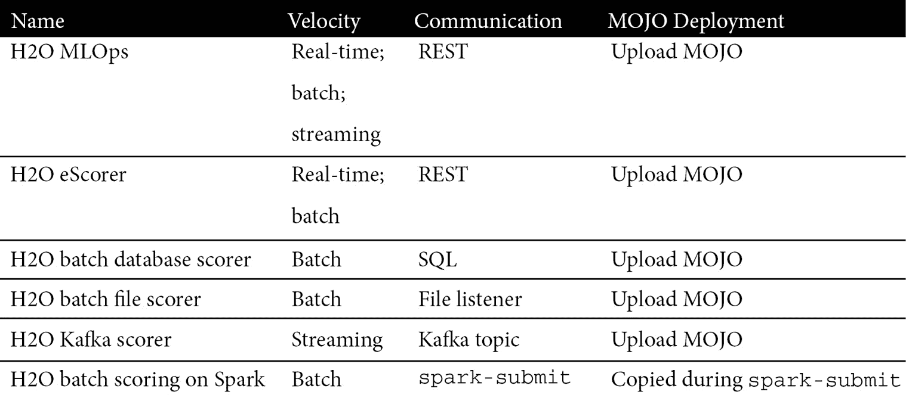

# *第十章*：H2O 模型部署模式

在上一章中，我们学习了如何轻松地从我们的模型构建步骤生成一个可用于部署的评分工件，以及这个称为 MOJO 的工件是如何设计成灵活地部署到广泛的生产系统的。

在本章中，我们通过调查广泛的 MOJO 部署模式并深入了解每个部署模式的细节来探索 MOJO 部署的这种灵活性。我们将看到 MOJO 是如何实现用于在 H2O 软件、第三方软件（包括商业智能 BI 工具）以及您自己的软件上进行评分的。这些实现将包括实时、批量和流数据的评分。

回顾 *第一章*，*机遇与挑战*，了解当机器学习（ML）模型部署到生产系统时如何实现商业价值。您在本章中获得的知识将使您能够为特定业务案例找到合适的 MOJO 部署模式。例如，它将允许分析师从 Microsoft Excel 电子表格中进行时间序列预测，技术人员对从制造过程数据流中做出的产品缺陷预测做出响应，或业务利益相关者对直接在 Snowflake 表上评分的欺诈预测做出响应。

本章的目标是让您实现自己的 H2O 模型评分，无论是从这些示例、您的网络搜索还是您的想象中，都受到这些示例的启发。

因此，在本章中，我们将涵盖以下主要主题：

+   调查 MOJO 部署模式的样本

+   探索在 H2O 软件上 MOJO 评分的示例

+   探索在第三方软件上 MOJO 评分的示例

+   探索在您的目标系统软件上 MOJO 评分的示例

+   探索基于 H2O Driverless AI 集成的加速器示例

# 技术要求

本章没有技术要求，尽管我们将突出展示实现和执行 MOJO 部署模式的技术步骤。

# 调查 MOJO 部署模式的样本

本章的目的是概述 MOJO 部署以进行预测的多种方式。提供了足够的细节，以便理解 MOJO 部署和评分的背景。提供了链接以查找低级细节。

首先，让我们以表格形式总结我们的 MOJO 评分模式样本，以了解您可以部署 MOJO 的多种不同方式。在概述这个样本之后，我们将更详细地阐述每个表格条目。

注意，我们的部署模式总结的表格列表示如下：

+   **数据速度**：这指的是评分数据的规模和速度，分为 **实时**（单条记录评分，通常在 100 毫秒以下）、**批量**（一次评分大量记录）和 **流式**（连续的记录流，这些记录被评分）。

+   **评分通信**：这指的是评分是如何被触发和通信的——例如，通过 **REpresentational State Transfer** (**REST**) 调用或 **Structured Query Language** (**SQL**) 语句。

+   **MOJO 部署**：这是关于 MOJO 在评分系统上部署的简要描述。

让我们来看看一些部署模式。我们将把这些模式分为四个类别。

## H2O 软件

这是您可以在 H2O.ai 提供和支持的软件上部署和评分 MOJO 的示例方法。以下表格提供了这一点的总结：



我们将看到部署到 H2O 软件非常简单，因为你只需上传 MOJO（手动或通过程序）即可。

## 第三方软件集成

这里有一些使用第三方软件进行 MOJO 评分的示例：


注意，一些第三方集成是通过从部署到 REST 服务器的 MOJO 中消费评分来完成的。这有一个优点，就是可以将您的部署集中在一个地方（REST 服务器），并从许多地方消费（例如，在员工个人电脑上部署的数十个 Tableau 或 MS Excel 实例）。

其他第三方集成是通过在第三方软件系统上直接部署 MOJO 来完成的。例如，Snowflake 集成是在 Snowflake 架构上实现的，允许以 Snowflake 规模进行批量评分（每秒可以评分数十万行）。

## 您的软件集成

我们将探讨以下将 MOJO 直接集成到您自己的软件中的模式：


将 MOJO 集成到您的软件中需要一个 MOJO 包装类。我们已经在 *第九章*，*生产评分和 H2O MOJO* 中学习了如何做这件事。当然，您也可以采取替代方法，将您的软件与从 REST 端点消费的 MOJO 评分集成。

## 基于 H2O Driverless AI 集成的加速器

本书专注于 H2O Core（H2O-3 和 Sparkling Water）模型构建技术，用于构建针对大量数据的模型。H2O 提供了一种名为 Driverless AI 的替代模型构建技术。Driverless AI 是一个专门的、**自动化机器学习**（**AutoML**）引擎，允许用户在极短的时间内找到高度准确和可信的模型。尽管 Driverless AI 无法在 H2O Core 可以处理的巨大数据集上进行训练。然而，Driverless AI 也会生成一个 MOJO，其 MOJO 风格的部署与 H2O Core MOJO 类似。这些相似性已在 *第九章* 中介绍，*生产评分和 H2O MOJO*。

在线有许多部署 Driverless AI MOJO 的示例。这些示例可以作为部署 H2O Core MOJO 的指南。因此，以下 Driverless AI 示例可以作为加速器，帮助你快速部署你的 H2O Core MOJO，但某些实现细节可能会有所不同：


这四个表格中显示的图案应该能给你一个很好的感觉，了解你可以以多种方式部署 MOJO。然而，它们并不代表所有可能性的全集。

关于可能性的说明

这里显示的图案仅仅是 H2O MOJO 分数评分模式的一个样本，这些模式存在或可能存在。其他 MOJO 分数模式可以通过网络搜索找到，并且你可以发挥想象力，以多种方式将 MOJO 分数集成到自己的软件中。此外，H2O.ai 正在快速扩展其第三方合作伙伴的评分集成，以及扩展其自身的 MOJO 部署、监控和管理能力。这是一个快速发展的领域。

现在我们已经调查了 MOJO 部署模式的格局，让我们深入探讨每个示例的细节。

# 探索使用 H2O 软件进行 MOJO 分数评分的示例

本节中的模式代表部署到 H2O 软件的 MOJO。部署到 H2O 软件有许多优点。首先，该软件由 H2O 和他们的机器学习专家团队支持。其次，由于所有你需要的只是提供 MOJO（通过用户界面（**UI**）、API 或远程复制等传输方式）进行简单上传，因此该部署工作流程对 H2O 软件进行了大幅简化。第三，H2O 评分软件具有额外的功能——例如，对预测和数据漂移进行监控——这对于部署到生产系统的模型非常重要。

让我们从查看 H2O 的旗舰模型评分平台开始。

## H2O MLOps

H2O MLOps 是一个功能齐全的平台，用于部署、监控、管理和治理机器学习模型。H2O MLOps 致力于大规模部署模型（许多模型和模型版本、企业级吞吐量和性能、**高可用性**等），并解决生产中模型周围的监控、管理和治理问题。

H2O MLOps 及其与 H2O 更大 **端到端** 机器学习平台的关系将在 *第十三章*，“介绍 H2O AI Cloud” 中进行回顾。有关 MLOps 用户指南，请参阅 [`docs.h2o.ai/mlops-release/latest-stable/docs/userguide/index.html`](https://docs.h2o.ai/mlops-release/latest-stable/docs/userguide/index.html) 以更好地了解 H2O MLOps。

### 模式概述

下图展示了 H2O MLOps 的评分模式：


图 10.1 – H2O MLOps 的模型评分模式

我们将在下一部分详细阐述。

### 评分上下文

这是 H2O.ai 的旗舰模型部署、模型监控和模型治理平台。它可以用来托管和评分 H2O 和第三方（非 H2O）模型。

H2O MLOps 实时和批量评分模型。预测可选地返回原因代码。模型以单个模型、冠军/挑战者和 A/B 的形式部署。有关其功能的完整描述，请参阅 *其他注意事项* 部分。

### 实现

H2O MLOps 是一个基于 Kubernetes 的现代实现，使用 Terraform 脚本和 Helm 图表进行部署。

### 评分示例

以下代码片段显示了使用 `curl` 命令发送的实时评分请求：

```py
curl -X POST -H "Content-Type: application/json" -d @- https://model.prod.xyz.com/9c5c3042-1f9a-42b5-ac1a-9dca19414fbb/model/score << EOF
{"fields":["loan_amnt","term","int_rate","emp_length","home_ownership","annual_inc","purpose","addr_state","dti","delinq_2yrs","revol_util","total_acc","longest_credit_length","verification_status"rows":[["5000","36months","10.65","10",24000.0","RENT","AZ","27.650","0","83.7","9","26","verified"]]}EOF
```

下面是结果：

```py
{"fields":["bad_loan.0","bad_loan.1"],"id":"45d0677a-9327-11ec-b656-2e37808d3384","score":[["0.7730158252427003","0.2269841747572997"]]} 
```

从这里，我们看到贷款违约的概率（`bad_loan` 值为 `1`）为 `0.2269841747572997`。`id` 字段用于标识 REST 端点，当模型以冠军/挑战者或 A/B 测试模式部署时，这很有用。

### 其他注意事项

这里是 H2O MLOps 关键功能的简要总结：

+   **多种部署模型**：独立；冠军/挑战者；A/B 模型

+   **多种模型问题**：表格；时间序列；图像；语言模型

+   **Shapley 值**：在部署时，指定是否与预测一起返回 Shapley 值（原因代码）

+   **第三方模型**：评分和监控非 H2O 模型——例如，scikit-learn 模型

+   **模型管理**：模型注册；版本控制；模型元数据；晋升和审批工作流程

+   **APIs**：API 和 **持续集成和持续交付**（**CI/CD**）集成

+   **分析**：可选地将评分数据推送到您的系统进行自己的分析

+   **血缘**：了解数据、实验和模型的血缘关系

+   **模型监控**：数据漂移和预测监控，带有警报管理（偏差和其他类型的监控在 MLOps 路线上）

    H2O MLOps 与其他 H2O 模型评分软件的比较

    MLOps 是 H2O 的旗舰全功能平台，用于部署、监控和管理评分模型。H2O 提供其他软件（将在下一部分概述），这些软件专门用于解决 MLOps 可能不适用的情况。

接下来，让我们看看 H2O REST 评分器。

## H2O eScorer

H2O 有一个轻量级但功能强大的 REST 服务器来评分 MOJOs，称为 H2O eScorer。这是一个很好的替代方案，用于作为 REST 端点提供服务 MOJOs，而不必承诺更大的 H2O MLOps 平台的基础设施要求，因此可以自由选择本地和轻量级部署。  回想一下，第三方软件通常通过 REST 端点集成与 MOJOs 集成，因此这是一种有效的方法。

### 模式概述

H2O REST 评分器的评分模式如下所示：


图 10.2 – H2O REST 评分器的 MOJO 评分模式

这里有一些详细说明。

### 评分上下文

H2O REST 评分器对 REST 端点进行实时和批量预测。预测可选地包括原因代码。

### 实现

H2O Rest 评分器是一个包含 Apache Tomcat 服务器的单个**Java ARchive**（**JAR**）文件，该服务器托管一个 Spring REST 服务框架。一个属性文件配置应用程序以托管多个 REST 评分端点。MOJOs 可以通过 REST 本身或其他方式将 MOJO 传输到服务器加载。

通过将多个 H2O REST 评分器放置在负载均衡器后面，可以实现高吞吐量。

### 评分示例

这里有一些实时评分的 REST 端点示例：

```py
http://192.1.1.1:8080/model?name=riskmodel.mojo &row=5000,36months,10.65,162.87,10,RENT,24000,VERIFIED-income,AZ,27.65,0,1,0,13648,83.7,0"
```

REST 评分器的 REST API 非常灵活。例如，它包括多种结构有效载荷的方式（例如，观测输入可以发送为**逗号分隔值**（**CSV**）、**JavaScript 对象表示法**（**JSON**）或其他结构，评分输出以相同格式返回，这对于与 BI 工具集成来说很方便）。

### 其他注意事项

这里是 H2O REST 评分器功能集的总结：

+   每个 H2O Rest 评分器可以评分多个模型（即 MOJOs），每个模型都有自己的 REST 端点。

+   通常，每个 H2O REST 评分器服务器上的每个 CPU 每秒可以完成 1,000 个评分。

+   安全、监控和日志设置可以在属性文件中配置。

+   **Java 监控 Bean**（**JMX**）可以配置，以便您的监控工具可以收集和分析运行时统计信息。监控包括评分错误、评分延迟和数据漂移。

+   安全功能包括**HTTPS**、管理员身份验证、经过身份验证的端点**URI**和来自 IP 前缀的有限访问。

+   有大量的日志记录。

+   通过 REST API 提供了广泛的功能，包括获取模型元数据、定义预测输出格式、定义日志详细程度以及管理服务器上的 MOJOs。

+   REST API 可以生成来自不同 BI 工具发送到 H2O REST 评分器评分模型的示例请求——例如，用于调用 Power BI 模型的 Python 代码示例。

接下来，我们将查看 H2O 批处理数据库评分器。

## H2O 批处理数据库评分器

H2O 批处理数据库评分器是一个客户端应用程序，它可以通过 **Java 数据库连接** (**JDBC**) 连接对表执行批量预测。

### 模式概述

H2O 批处理数据库评分器模式如图所示：


图 10.3 – H2O 批处理数据库评分器的 MOJO 评分模式

我们将在下面详细说明。

### 评分上下文

H2O 批处理数据库评分器对数据库表执行批量预测。预测可以包含原因代码。根据配置方式的不同，对表行的预测可以插入到新的表中，或者更新到正在评分的同一表中。或者，它可以生成预测结果的 CSV 文件。此 CSV 输出可用于手动更新表或其他下游处理。

H2O 批处理数据库评分处理的详细序列显示在 *图 10.3* 中。

### 实现

H2O 批处理数据库评分器是一个单独的 JAR 文件，可以从 H2O.ai 获取。该 JAR 文件使用属性文件来配置数据库工作流程的各个方面。

更具体地说，属性文件包含以下内容：

+   SQL 连接字符串

+   批量评分的 SQL `SELECT` 语句

+   写入预测结果的 SQL `INSERT` 或 `UPDATE` 语句

+   批量评分时的线程数

+   MOJO 路径

+   标志以写入 CSV 或不写入

+   安全设置

+   其他设置

### 评分示例

以下命令显示了如何从命令行运行批量作业：

```py
java -cp /PostgresData/postgresql-42.2.5.jar:H2OBatchDB.jar \ ai.h2o.H2OBatchDB
```

当然，这可以集成到调度器或脚本中，以安排和自动化批量评分。

注意，此命令不包含有关数据库或表的信息。从该命令启动的程序会找到属性文件，如前一个 *实现* 小节所述，并使用那里的信息来驱动批量评分。

### 其他注意事项

单个属性文件包含运行单个批量评分作业所需的所有信息（属性文件映射到将要评分的表的 SQL 语句）。

如果在评分的 Java 命令中没有指定属性文件（请参阅 *评分示例* 部分），则使用默认的属性文件。或者，可以在 Java 命令行中指定特定的属性文件以运行非默认评分作业。

接下来，让我们看看 H2O 批处理文件评分器。

## H2O 批处理文件评分器

H2O 批处理文件评分器是一个可以对文件中的记录执行批量预测的应用程序。

### 模式概述

H2O 批处理文件评分模式如图所示：


图 10.4 – H2O 批处理文件评分器的 MOJO 评分模式

这就是它的使用方法。

### 评分上下文

评分是对文件中的记录进行批处理，输出将是一个与输入文件相同的文件，但每个记录都附加了一个评分字段。输出文件保留在 H2O 批处理评分器系统中，直到由另一个系统（例如，复制到下游系统进行处理）处理。

### 实现

H2O 批处理文件评分器是一个单 JAR 文件，由 H2O.ai 提供。使用命令行参数指定模型的存储位置和输入文件，以及任何运行时参数，例如跳过文件中存在的列标题。

### 评分示例

以下命令显示了如何从命令行运行批处理文件作业：

```py
java -Xms10g -Xmx10g -Dskipheader=true -Dautocolumns=true -classpath mojo2-runtime.jar:DAIMojoRunner_TQ.jar daimojorunner_tq.DAIMojoRunner_TQ pipeline.mojo LoanStats4.csv
```

有几点值得注意。

### 其他注意事项

此评分器非常适合作为单个任务处理极大的文件（> GB），使其在传统批处理工作流程中易于使用。如果输入文件包含标题，则评分器将选择正确的列传递给模型；如果没有标题，则可以将列作为命令行参数传递。

现在让我们看看 H2O Kafka 评分器。

## H2O Kafka 评分器

H2O Kafka 评分器是一个与 Kafka 流评分集成的应用程序。

### 模式概述

H2O Kafka 评分器模式如图所示：


图 10.5 – H2O Kafka 评分器的 MOJO 评分模式

### 评分上下文

评分对流的展示如图*10.5*所示。具体来说，H2O Kafka 评分器从主题队列中拉取消息并将评分结果发布到另一个主题。

### 实现

H2O Kafka 评分器是一个在 Kafka 系统上实现的 JAR 文件。使用属性文件配置要消费的主题（因此要评分的消息）以及要发布到哪个主题（将结果发送到何处）。当 H2O Kafka 评分器 JAR 文件启动时，它加载 MOJO 并监听来自该主题的传入消息。

### 评分示例

当消息到达上游主题时进行评分。将预测附加到原始消息的最后一个字段。然后将这个新消息发送到另一个主题进行下游处理。

### 其他注意事项

通过使用其分布式并行化架构中固有的原生 Kafka 扩展技术来实现扩展吞吐量。

最后，让我们看看 Spark 上的 H2O 批处理评分。

## Spark 上的 H2O 批处理评分

H2O MOJO 可以作为原生 Spark 作业部署。

### 模式概述

Spark 上的 H2O 批处理评分模式如图所示：


图 10.6 – Spark 上 H2O 批处理评分的 MOJO 评分模式

### 评分上下文

评分是批处理并在 Spark 集群上进行的。因此，批处理评分是分布式的，因此可以很好地扩展到巨大的批处理大小。

### 实现

在 Spark 集群上评分 MOJO 所需的依赖项与以下部分中显示的 `spark-submit` 命令一起分发。

### 评分示例

首先，我们将创建一个 `myRiskScoring.py`。代码如下所示：

```py
from pysparkling.ml import *
```

```py
settings = H2OMOJOSettings(convertUnknownCategoricalLevelsToNa = True, convertInvalidNumbersToNa = True)
```

```py
model_location="hdfs:///models/risk/v2/riskmodel.zip"
```

```py
model = H2OMOJOModel.createFromMojo(model_location, settings")
```

```py
predictions = model.transform(dataset)
```

```py
// do something with predictions, e.g. write to hdfs
```

然后，使用 H2O 评分库提交您的 Spark 作业，如下所示：

```py
./bin/spark-submit \
    --py-files py/h2o_pysparkling_scoring.zip \
    myRiskScoring.py
```

注意，`h2o_pysparkling_scoring.zip` 依赖项将与作业一起分发到集群中。此库由 H2O.ai 提供。

### 补充说明

除了之前代码示例中显示的评分设置外，还有其他评分设置可用。以下链接将提供更多详细信息：[`docs.h2o.ai/sparkling-water/3.1/latest-stable/doc/deployment/load_mojo.html`](https://docs.h2o.ai/sparkling-water/3.1/latest-stable/doc/deployment/load_mojo.html)。

我们已经完成了对 H2O 软件上一些评分模式的审查。现在让我们过渡到第三方软件上的评分模式。

# 探索使用第三方软件的 MOJO 评分示例

现在我们来看一些涉及第三方软件的评分示例。

## Snowflake 集成

H2O.ai 与 Snowflake 合作，将 MOJO 评分集成到 Snowflake 表中。需要注意的是，在此集成中部署的 MOJO 是在 Snowflake 架构上，因此实现了 Snowflake 的原生可扩展性优势。结合 MOJO 评分的低延迟，可以在几秒钟内对大量 Snowflake 表进行批量评分，尽管对少量记录的实时评分也是可行的。

### 模式概述

Snowflake 集成模式在以下图中显示：


](img/B16721_10_007.jpg)

图 10.7 – Snowflake Java 用户自定义函数 (UDF) 集成的 MOJO 评分模式

让我们详细说明。

### 评分上下文

评分是针对 Snowflake 表的批量操作，并利用 Snowflake 平台的扩展性。因此，评分可以对任何 Snowflake 表进行，包括那些包含大量数据集的表。

评分是通过从 Snowflake 客户端运行 SQL 语句来完成的。这可以是本机 Snowflake 工作表、SnowSQL 或具有 Snowflake 连接器的 SQL 客户端。或者，评分可以通过使用 Snowflake 的 Snowpark API 编程来完成。

### 实现

要实现评分，创建一个临时表并对其授予权限。然后，将您的 MOJO 和 H2O JAR 文件依赖项复制到临时表中。

然后，您可以使用 SQL 创建一个 Java UDF，导入这些依赖项并将处理评分的 H2O 依赖项分配给处理器。然后，在创建 SQL 评分语句时引用此 UDF，如下所示。

你可以在这里找到 H2O 依赖项和说明：[`s3.amazonaws.com/artifacts.h2o.ai/releases/ai/h2o/dai-snowflake-integration/java-udf/download/index.html`](https://s3.amazonaws.com/artifacts.h2o.ai/releases/ai/h2o/dai-snowflake-integration/java-udf/download/index.html)。

使用 UDF 与 Snowflake 集成的集成体验也在线上提供，请访问 [`cloud.h2o.ai/v1/latestapp/wave-snowflake`](https://cloud.h2o.ai/v1/latestapp/wave-snowflake)。

### 评分示例

这是一个执行批量评分的 SQL 语句的示例：

```py
select ID, H2OScore_Java('Modelname=riskmodel.zip', ARRAY_CONSTRUCT(loan_amnt, term, int_rate, installment, emp_length, annual_inc, verification_status, addr_state, dti, inq_last_6mths, revol_bal, revol_util, total_acc)) as H2OPrediction from RiskTable;
```

注意，H2O 评分 UDF（如*实现*部分所示加载）正在运行，并且引用了模型名称（MOJO 名称）。

### 其他注意事项

为了更程序化的方法，你可以使用 Snowpark API 而不是 SQL 语句来进行批量评分。

### 替代实现 – 通过 Snowflake 外部函数进行评分

对于你不想直接将 MOJO 部署到 Snowflake 环境的情况，你可以在 Snowflake 上实现一个外部函数，然后将评分传递给 H2O eScorer 实现。请注意，评分本身是外部于 Snowflake 的，批处理吞吐量由 H2O eScorer 决定，而不是 Snowflake 架构。这在下图中显示：

![图 10.8 – MOJO 评分模式用于 Snowflake 外部函数集成

![图片 B16721_10_008.jpg]

图 10.8 – MOJO 评分模式用于 Snowflake 外部函数集成

为了实现这一点，我们将以 AWS 上的 Snowflake 为例。请按照以下步骤操作：

1.  首先，使用 Snowflake 客户端将 `api_integration` 创建为 `aws_api_gateway`。需要一个网关来在向 H2O eScorer（它将位于 Snowflake 之外）通信时保护外部函数。你需要有正确的角色来创建此网关。

1.  然后，使用 SQL 在 Snowflake 上创建一个外部函数，例如命名为 H2OPredict。外部函数将引用 `api_integration`。

1.  现在，你已经准备好通过外部函数传递到 H2O eScorer 来批量评分 Snowflake 表。以下是一个示例 SQL 语句：

    ```py
    select ID, H2OPredict('Modelname=riskmodel.zip', loan_amnt, term, int_rate, installment, emp_length, annual_inc, verification_status, addr_state, dti, inq_last_6mths, revol_bal, revol_util, total_acc) as H2OPrediction from RiskTable;
    ```

让我们看看 Teradata 集成。

## Teradata 集成

H2O.ai 与 Teradata 合作，直接针对 Teradata 表实现批量或实时评分。这如下所示：

![图 10.9 – MOJO 评分模式用于 Teradata 集成

![图片 B16721_10_009.jpg]

图 10.9 – 与 Teradata 集成的 MOJO 评分模式

### 评分上下文

评分是针对 Teradata 表进行批处理，并利用了 Teradata 平台的扩展性。因此，可以对任何 Teradata 表进行评分，包括那些包含大量数据集的表。在概念上与 Snowflake UDF 集成相似，但仅在概念上：底层架构和实现是根本不同的。

通过 Teradata 客户端运行 SQL 语句来对 Teradata 表进行评分。这可以是本机 Teradata Studio 客户端或具有 Teradata 连接器的 SQL 客户端。

### 实现

要实现，您首先必须安装 Teradata Vantage **Bring Your Own Model** (**BYOM**)。然后，您使用 SQL 创建一个 Vantage 表来存储 H2O MOJOs。然后，您使用 SQL 将 MOJOs 加载到 Vantage 表中。详细信息请参阅[`docs.teradata.com/r/CYNuZkahMT3u2Q~mX35YxA/WC6Ku8fmrVnx4cmPEqYoXA`](https://docs.teradata.com/r/CYNuZkahMT3u2Q~mX35YxA/WC6Ku8fmrVnx4cmPEqYoXA)。

### 评分示例

下面是一个用于批量评分 Teradata 表的 SQL 语句示例：

```py
select * from H2OPredict(
```

```py
on risk_table
```

```py
on (select * from mojo_models where model_id=riskmodel) dimension
```

```py
using Accumulate('id')
```

```py
) as td_alias;
```

在这种情况下，代码假设所有`risk_table`字段都作为输入传递给 MOJO。

### 其他注意事项

您的批量评分 SQL 语句可能包括返回原因代码、阶段概率和叶节点分配的选项。

## BI 工具集成

MOJO 评分的一个强大用途是集成到 BI 工具中。最常见的方法是在 REST 服务器或数据库上实现 MOJO 评分，如下面的图所示。请注意，在此模式中，MOJO 没有部署在 BI 工具本身上，而是工具与外部评分系统集成。MOJO 评分的低延迟特性允许用户通过此模式实时与 MOJO 预测进行交互：


图 10.10 – MOJO 评分模式用于 BI 工具集成

### 评分上下文

BI 工具集成了外部评分器的实时预测。

### 实现

实现外部 REST 或数据库 MOJO 评分系统。在 BI 工具中实现与外部评分器的集成。这些集成针对每个 BI 工具都是特定的，通常，单个 BI 工具有多种方法来实现这种集成。

### 评分示例 – Excel

下面的代码块显示了在 Excel 电子表格的单元格中创建的公式：

```py
=WEBSERVICE(CONCAT("http://192.1.1.1:8080/modeltext?name=riskmodel.mojo&row=",TEXTJOIN(","FALSE, $A4:$M4))))
```

当公式应用于目标单元格，或者公式中引用的任何单元格的值发生变化时，都会调用此网络服务。然后，用户可以将公式向下拖动到列中，让预测填充该列。

注意在先前的公式中，REST 调用将待评分的观察结果组成 CSV 而不是 JSON。此有效负载的结构特定于 REST API 及其端点。

我们可以使用类似的方式将 MOJO 评分集成到其他第三方软件中，尽管端点构造的语义不同。让我们看看如何在 Tableau 中实现它。

### 评分示例 – Tableau

Tableau 是企业内部常用的仪表板工具，用于向组织内的各种不同用户展示信息。

使用 Tableau 脚本语法，可以从仪表板调用模型。这非常强大，因为现在，业务用户可以直接在仪表板上按需获取当前的预测结果。您可以在以下示例脚本中看到示例：

```py
SCRIPT_STR(
```

```py
'name'='riskmodel.mojo',
```

```py
ATTR([./riskmodel.mojo]),
```

```py
ATTR([0a4bbd12-dcad-11ea-ab05-024200eg007]),
```

```py
ATTR([loan_amnt]),
```

```py
ATTR([term]),
```

```py
ATTR([int_rate]),
```

```py
ATTR([installment]),
```

```py
ATTR([emp_length]),
```

```py
ATTR([annual_inc]),
```

```py
ATTR([verification_status]),
```

```py
ATTR([addr_state]),
```

```py
ATTR([dti]),
```

```py
ATTR([inq_last_6mths]),
```

```py
ATTR([revol_bal]),
```

```py
ATTR([revol_util]),
```

```py
ATTR([total_acc]))
```

脚本将值作为属性（`ATTR` 关键字）读取，并在对模型进行 REST 调用时将它们传递到 Tableau 环境中的脚本。使用 REST 调用允许集中部署和管理模型，但不同的应用程序和消费者根据其特定需求调用模型。

现在，让我们看看如何在 Power BI 中构建 REST 端点。

### 评分示例 – Power BI

这里是一个 Power BI 的评分示例。在这种情况下，我们使用了一个 `Web.Contents` Power Query M 函数。此函数粘贴到您 Power BI 仪表板中的所需元素：

```py
Web.Contents(
```

```py
    "http://192.1.1.1:8080",
```

```py
    [
```

```py
        RelativePath="modeltext",
```

```py
        Query=
```

```py
        [
```

```py
            name="riskmodel.mojo",
```

```py
            loan_amnt=Loan_Ammt,
```

```py
            term=Term,
```

```py
            int_rate=Int_Rate,
```

```py
            installment=Installments,
```

```py
            emp_length=Emp_Length,
```

```py
            annual_inc=Annual_Inc,
```

```py
            verification_status=Verification_Status,
```

```py
            addr_state=Addr_State,
```

```py
            dti=DTI,
```

```py
            inq_last_6mths= Inq_Last_6mths,
```

```py
            revol_bal=Revol_Bal,
```

```py
            revol_util=Revol_Util,
```

```py
            total_acc=Total_Acc
```

```py
        ]
```

```py
    ]
```

```py
)
```

让我们从这些具体示例中概括一下。

### 其他注意事项

每个 BI 工具都以自己的方式与 REST 端点或数据库集成，并且通常提供多种集成方式。有关详细信息，请参阅您的 BI 工具文档。

## UiPath 集成

**UiPath** 是一个基于人类行为的自动化工作流的 RPA 平台。做出预测并对这些预测做出响应是这一自动化的重要组成部分，因此在这些工作流步骤中进行评分模型是一个完美的选择。您可以在以下图中看到这个示例：


图 10.11 – UiPath 集成 MOJO 评分模式

### 评分上下文

UiPath 与外部 MOJO 评分的集成方式与上一节中展示的 BI 工具类似。在 UiPath 的情况下，配置了一个工作流步骤来执行 REST 调用，接收预测，并对该预测做出响应。

### 实现

MOJO 评分在外部 REST 服务器上实现，并使用 UiPath Request Builder 向导配置 REST 端点以返回预测。详细信息请见此处：[`www.uipath.com/learning/video-tutorials/application-integration-rest-web-service-json`](https://www.uipath.com/learning/video-tutorials/application-integration-rest-web-service-json)。

### 评分示例

这段视频展示了如何使用 H2O MOJO 评分自动化工作流：[`www.youtube.com/watch?v=LRlGjphraTY`](https://www.youtube.com/watch?v=LRlGjphraTY)。

我们刚刚完成了一些第三方软件 MOJO 评分模式的调查。让我们看看一些您组织自行构建的软件的评分模式。

# 使用目标系统软件探索 MOJO 评分示例

除了在 H2O 和第三方软件上部署 MOJO 进行评分外，您还可以采取**DIY**（**DIY**）方法，在自己的软件中部署评分。让我们看看如何做这件事。

## 您的软件应用程序

从您的软件中评分有两种方式：集成外部评分系统或直接在软件系统中嵌入评分。

以下图显示了与外部评分系统集成模式的示例：


图 10.12 – 外部评分的 MOJO 应用评分模式

这种模式应该看起来很熟悉，因为它与我们之前在 BI 工具中看到的评分方式在本质上是一样的：您的软件作为客户端来消费另一个系统生成的 MOJO 预测。外部预测系统可以是部署在 REST 服务器上的 MOJO（例如，H2O REST 评分器）或批量数据库评分器（例如，Snowflake Java UDF 或 H2O 批量数据库评分器）或另一个外部系统，而您的应用程序需要实现连接到该系统的库。

与此相反，以下图表显示了将 MOJO 评分直接嵌入到您应用程序本身的模式：


图 10.13 – 嵌入式评分的 MOJO 应用评分模式

这样做需要您的应用程序实现一个使用 H2O MOJO API 加载 MOJO 并用其评分数据的 Java 包装类。这在*第九章*中详细展示，*生产评分和 H2O MOJO*。

您应该在何时使用外部评分模式与嵌入式评分模式？当然，每种模式都有其优点和缺点。

外部评分模式将评分与应用程序解耦，因此允许每个组件及其相关角色专注于其最擅长的事情。例如，应用程序开发者可以专注于开发应用程序，而不是部署和监控模型。此外，外部评分组件可以重用，以便许多应用程序和客户端可以连接到同一部署的模型。最后，尤其是在数据库端评分（例如，Java UDF 和 Teradata 集成）以及具有极端批量大小或吞吐量的流评分的情况下，尝试自行构建这将是困难的或愚蠢的。

嵌入式评分模式的优势在于消除了发送观察和预测到网络的时间成本。这取决于您的**服务级别协议**（**SLA**）是否重要。它确实简化了执行评分的基础设施需求，尤其是在网络基础设施不可用或不稳定的情况下。最后，出于监管原因，可能希望或有必要将模型部署和应用程序作为一个单一实体来管理，从而要求两者耦合。

## 设备端评分

MOJO 可以部署到设备上，无论是办公室扫描仪/打印机、医疗设备还是传感器。这些可以被视为小型应用程序，对于外部或嵌入式评分的决定，设备与应用程序一样，如前所述。然而，在设备的情况下，外部与嵌入式评分的优缺点可能会被放大很多。例如，**物联网**（**IoT**）传感器可能成千上万，在这些设备上部署和管理模型的开销可能超过由于网络通信到中央外部评分器的延迟增加所带来的成本。

重要提示

一个经验法则是可用设备内存需要超过 MOJO 大小的两倍。

# 探索基于 H2O Driverless AI 集成的加速器示例

到目前为止，本书主要关注使用 H2O 构建大规模模型。我们一直使用 H2O Core（通常称为 H2O 开源版），这是一个可以扩展到海量数据集的分布式机器学习框架。在第十三章*介绍 H2O AI Cloud*中，我们将看到 H2O 提供了一个更广泛的由端到端平台 H2O AI Cloud 表示的功能集。其中一项功能是一个高度专注的基于 AI 的 AutoML 组件，称为 Driverless AI，我们将在*第十三章**介绍 H2O AI Cloud*中区分这一点。

Driverless AI 与 H2O Core 类似，因为它也使用通用的 MOJO 运行时和 API 生成可部署的 MOJO，尽管对于 Driverless AI，MOJO 部署需要许可证文件，并且 MOJO 和运行时命名与 H2O Core 不同。

提及这一点的原因是，已经构建了几个 Driverless AI 的集成，并且有很好的文档记录，但并没有为 H2O Core 建立类似的集成。这些集成及其文档可以用作加速器，以对 H2O Core 执行相同的操作。请记住，部署 H2O Core MOJO 不需要许可证要求，并且 MOJO 和运行时命名不同。

描述加速器的方法

这里概述了加速器，并提供了链接，以便您了解其实施细节。正如所提到的，这些加速器代表了从 H2O Driverless AI AutoML 工具生成的 MOJO 的部署。请参阅*第九章**生产评分和 H2O MOJO*，了解从 H2O Core（H2O-3 或 Sparkling Water）生成的 MOJO 与从 Driverless AI 生成的 MOJO 基本相同，但在命名和 MOJO API 方面有所不同。这些知识将使您能够实现链接中显示的 H2O Core MOJO 的 Driverless AI MOJO 细节。

让我们看看一些示例。

## Apache NiFi

Apache NiFi 是一种 **开源软件**（**OSS**），旨在以 UI 和拖放方式编程数据的流动。它围绕通过不同可配置的处理器移动数据的概念构建，这些处理器以特殊的方式处理数据。结果数据流允许处理器序列的子流分支、合并和嵌套，通常类似于复杂的 **有向无环图**（**DAGs**）。项目主页可在此处找到：[`nifi.apache.org/index.html`](https://nifi.apache.org/index.html)。

NiFi 处理器可以用于与外部的 REST、JDBC 和 Kafka 系统进行通信，从而可以利用来自外部系统的评分 MOJOs 模式。

然而，您可以为处理器构建自己的处理器，将 MOJO 嵌入其中以进行实时或批量评分。此处理器只需要配置以指向 MOJO 及其依赖项。以下链接展示了如何为 Driverless AI 做这件事，并可作为使用 H2O Core 进行相同操作的加速器：[`github.com/h2oai/dai-deployment-examples/tree/master/mojo-nifi`](https://github.com/h2oai/dai-deployment-examples/tree/master/mojo-nifi)。

## Apache Flink

Apache Flink 是一个高吞吐量的分布式流和批量处理引擎，具有丰富的功能集，可以以容错的方式运行事件驱动、数据分析和数据管道应用程序。

以下链接展示了如何将 Driverless AI MOJOs 嵌入以直接对 Flink 数据流进行评分，并可作为使用 H2O Core 进行相同操作的加速器：[`github.com/h2oai/dai-deployment-examples/tree/master/mojo-flink`](https://github.com/h2oai/dai-deployment-examples/tree/master/mojo-flink)。

## AWS Lambda

AWS Lambda 是一种无服务器计算服务，允许您在不建立、管理和支付底层服务器基础设施的情况下运行代码。它可以执行任何短暂且无状态的计算任务，因此非常适合处理评分请求。以下加速器展示了如何实现 AWS Lambda 作为 REST 端点进行实时或批量 MOJO 评分：[`h2oai.github.io/dai-deployment-templates/aws_lambda_scorer/`](https://h2oai.github.io/dai-deployment-templates/aws_lambda_scorer/)。

## AWS SageMaker

AWS SageMaker 可以用于托管和监控模型评分。以下加速器展示了如何实现 REST 端点进行实时 MOJO 评分：[`h2oai.github.io/dai-deployment-templates/aws-sagemaker-hosted-scorer/`](https://h2oai.github.io/dai-deployment-templates/aws-sagemaker-hosted-scorer/)。

现在，我们已经完成了对 H2O MOJOs 评分和部署模式的调查。当您的 H2O-at-scale 模型部署到生产系统时，它们实现了业务价值。这里展示的例子只是几种可能性，但它们应该能给您一个关于 MOJO 部署和评分多样性的概念。

让我们总结一下本章所学的内容。

# 摘要

在本章中，我们探讨了多种部署 MOJOs 和消费预测的方法。这包括对实时、批量以及流式数据进行评分，以及使用 H2O 软件、第三方软件（例如 BI 工具和 Snowflake 表）以及您自己的软件和设备进行评分。从这些示例中可以明显看出，H2O 模型部署的可能性极为多样，因此能够满足您特定的评分需求。

现在我们已经学会了如何将 H2O 模型部署到生产评分环境中，让我们退后一步，以参与实现 H2O 在大规模机器学习成功所需的全部步骤的企业利益相关者的视角来看待问题。在下一节中，我们将从这些利益相关者的需求和关注点出发，来观察大规模的 H2O。
