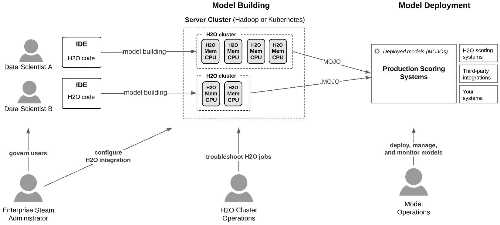
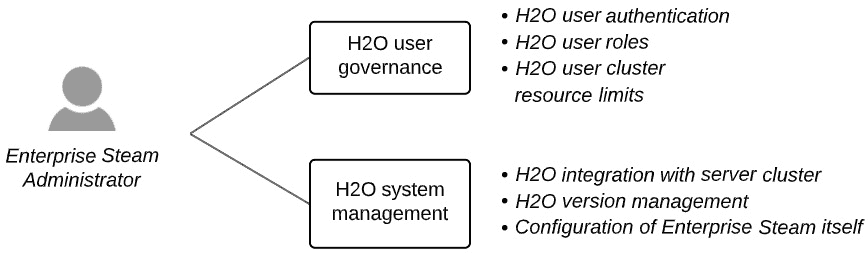
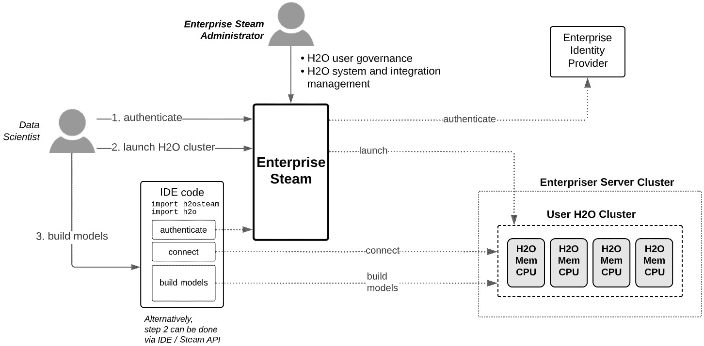
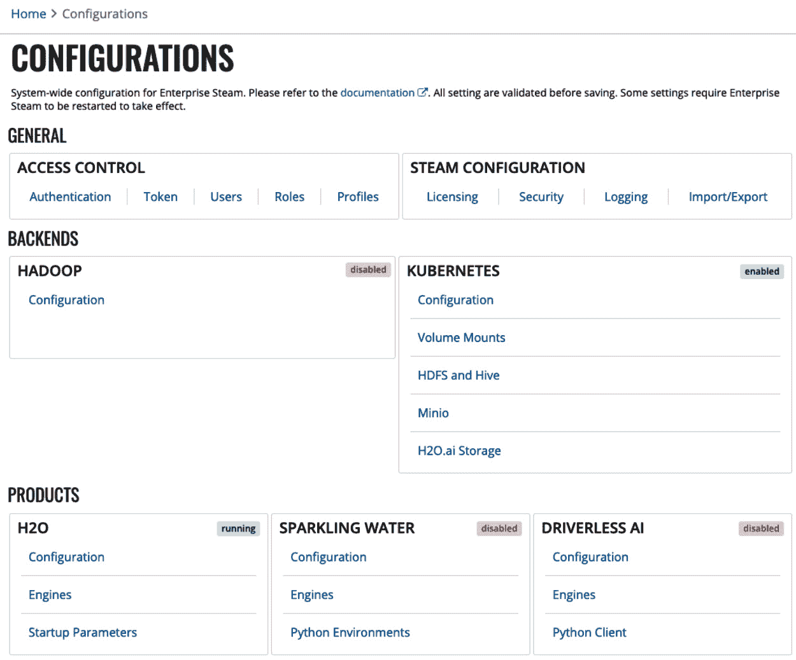
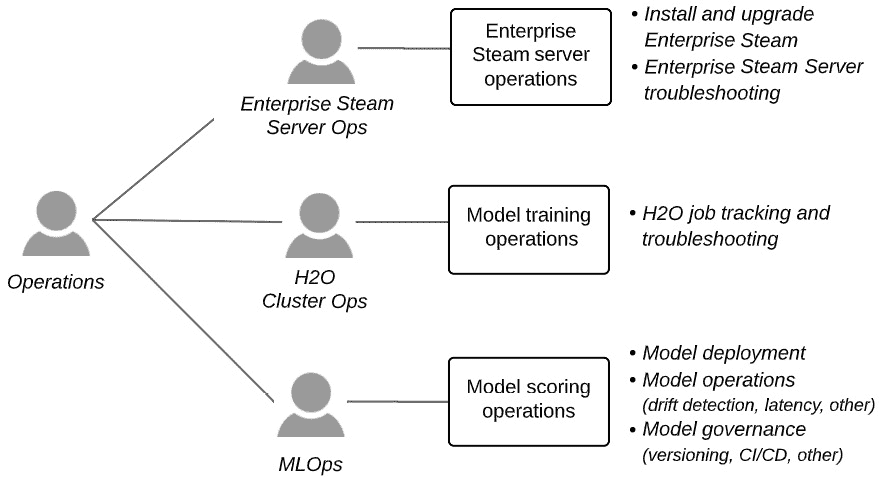
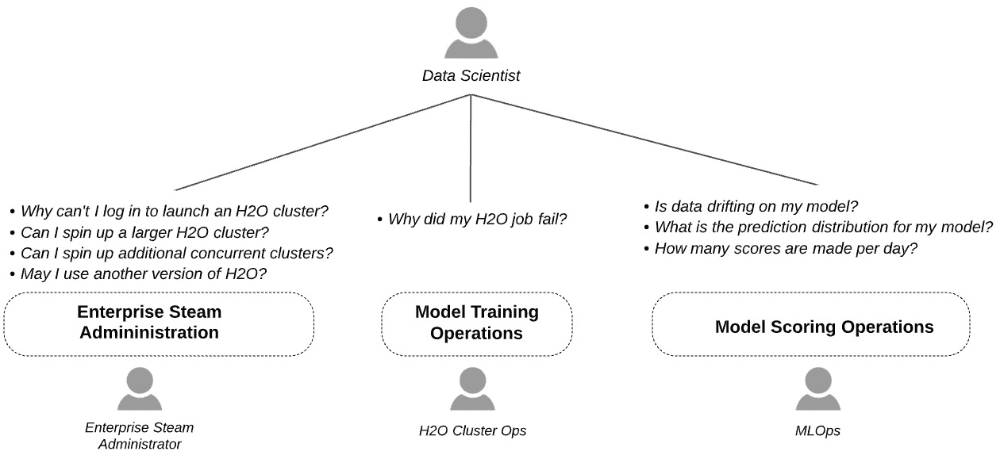

# *第十一章*：管理员和运维视图

到目前为止，我们在本书中花费了大量时间了解 H2O 大规模机器学习框架的组件，并深入挖掘以开发在企业系统中实施模型构建和模型部署框架的技能。

机器学习的成功需要代码和技术技能，但在企业中，还需要在人员和流程方面的成功。从另一个角度来看，那句“成功是团队运动”的谚语非常真实。现在，让我们开始查看参与将 H2O 大规模机器学习成功带到现实中的角色或利益相关者。

在本章中，我们将首先解决直接参与这一成功的人物：H2O 管理员、运维团队和数据科学家。我们将了解关键利益相关者如何在大规模模型构建和模型部署中与 H2O 互动。我们将查看 H2O 管理员在大规模 H2O 中的视图，并了解企业蒸汽如何成为这一视图的核心。我们还将查看运维团队在大规模模型构建和模型部署中的 H2O 视图。最后，我们将了解数据科学家如何受到 H2O 管理员和运维团队视图的影响。

在本章中，我们将涵盖以下主要主题：

+   模型构建和部署视图：地面角色

+   视图 1：企业蒸汽管理员

+   视图 2：运维团队

+   视图 3：数据科学家

# 模型构建和部署视图 – 地面角色

许多角色或利益相关者参与了机器学习生命周期。在大规模 H2O 模型构建和部署中涉及的关键角色是数据科学家、企业蒸汽管理员和运维团队。本章的重点是这些角色。让我们从以下图表中获得他们活动的概述：



图 11.1 – 在大规模构建和部署 H2O 模型中涉及的关键角色

这些利益相关者和他们的高级关注点的总结如下：

+   **企业蒸汽管理员**：管理谁在企业服务器集群上启动 H2O 集群以及他们被允许消耗多少资源，并在服务器集群上集中管理 H2O 集成

+   **H2O 集群操作**：在企业服务器集群（无论是 Kubernetes 还是 Hadoop 集群）上调试 H2O 作业

+   **模型运维**：部署、管理和监控部署到评分环境中的模型

+   **数据科学家**：在本章中，了解如何以及为什么与上述角色互动

本章的其余部分将致力于深入探讨这些角色在 H2O 大规模机器学习工作中的视图和活动。

让我们开始吧。

# 视图 1 – 企业蒸汽管理员

在了解他们的活动之前，让我们首先看看企业蒸汽管理员的关注点。

## 企业蒸汽管理员关注点

企业蒸汽管理员有两个主要关注点，如下所示图表所示：



图 11.2 – 企业蒸汽管理员关注点

**以下是对前述图表的总结：**

+   **H2O 用户治理**：这些关注点集中在治理数据科学家，他们在企业服务器集群上启动 H2O 模型构建作业。这包括将这些 H2O 用户与企业身份提供者进行身份验证、为 H2O 用户定义角色以及在企业服务器集群环境中治理 H2O 用户的资源消耗。

+   **H2O 系统管理**：这些关注点围绕着将 H2O 技术与企业服务器集群的集成进行集中，并管理 H2O 软件版本。这创造了一个角色分离，现在数据科学家不需要了解这种集成的复杂性（如果实施了企业蒸汽，他们就会了解）。

企业蒸汽可以被视为处理企业关注点的必需品。

企业蒸汽对企业的价值

企业在管理谁使用企业系统、用户如何与企业系统集成以及用户如何使用系统上的资源方面往往非常谨慎。管理员使用企业蒸汽来构建集中的安全措施来处理这些关注点，并创建 H2O 使用的统一性和可预测性。企业蒸汽还使数据科学家更容易，因为他们不需要了解将 H2O 与企业系统集成的技术复杂性。

要欣赏企业蒸汽的好处，看看它在数据科学家使用 H2O 构建大规模模型的工作流程中所扮演的角色是有用的。这总结在下述图表中：



图 11.3 – 通过企业蒸汽的数据科学和管理员工作流程

基本上，企业蒸汽位于所有数据科学家对企业服务器集群上 H2O 访问的前端。让我们一步一步地了解这种设计的优势：

1.  **数据科学家通过企业蒸汽进行身份验证**：所有使用 H2O 的数据科学家都通过企业身份提供者进行身份验证，例如 LDAP。我们将在本章后面看到，从身份提供者返回的组成员资格用于配置特定于组的用户能力。

1.  **启动 H2O 集群**：数据科学家必须通过企业蒸汽在企业管理服务器集群上启动 H2O 集群。在这个过程中，数据科学家将获得有关可以启动的 H2O 集群大小（服务器节点数量、每个节点的内存和 CPU）以及运行多长时间后关闭的限制。我们将在本章后面看到企业蒸汽管理员如何使用 **配置文件** 来定义这些限制。

注意，配置 H2O 以与企业服务器集群的具体细节集成涉及很多复杂性。这由企业蒸汽管理员通过企业蒸汽的配置工作流程来处理。数据科学家免于这项任务，只需使用企业蒸汽 UI（或从模型构建 IDE 的 API）快速启动 H2O 集群。

1.  **构建模型**：从模型构建 IDE，数据科学家必须使用企业蒸汽 API 进行身份验证，然后才能与已启动的 H2O 集群交互。通过企业蒸汽进行身份验证后，数据科学家将能够连接到他们的 H2O 集群并编写代码在其上构建模型。

注意，上述工作流程中的所有步骤都可以从数据科学家的 IDE 中以编程方式完成，无需与企业蒸汽 UI 交互。

企业蒸汽 UI 与 API 的比较

从企业蒸汽 UI 管理一个或多个 H2O 集群（启动、停止、重新启动、终止）非常方便。或者，您也可以通过使用相同的 Enterprise Steam API（当您从 IDE 连接到集群以构建模型时用于验证企业蒸汽）在您的 IDE 中完成此操作。因此，如果您愿意，您可以从 IDE 完成所有工作。

现在我们回到企业蒸汽管理员在管理 H2O 用户和管理 H2O 系统及集成中的角色。

## 企业蒸汽配置

让我们直接进入企业蒸汽的主配置屏幕。这将帮助我们在大致了解 H2O 用户治理和 H2O 系统管理之前，专注于这些内容。以下截图展示了这一点。请记住，只有企业蒸汽管理员才能查看和访问这些配置：




图 11.4 – 企业蒸汽配置主页（仅管理员可见）

让我们逻辑地组织这些内容：

+   **H2O 用户治理**：这是使用 **访问控制** 配置集来完成的。请注意，这些配置还包括用户资源消耗治理和其他安全措施。

+   **H2O 系统管理 – 集成**：使用 **BACKENDS** 和 **PRODUCTS** 配置集来完成与企业集群环境的集成配置。这还包括管理 H2O 版本。

+   **H2O 系统管理 – Steam**：配置企业 Steam 本身是通过使用 **STEAM CONFIGURATION** 配置集来完成的。

    无需人工干预的 AI 可以在 Enterprise Steam 中配置（等等，是什么意思？）

    本书重点关注使用 H2O 的规模机器学习。从模型构建的角度来看，这侧重于通过这些创建的水平扩展架构在大量数据集上训练的 H2O-3 或 Sparkling Water 集群。

    无需人工干预的 AI 是一个针对极端 AutoML（通常在小于 100-200 GB 的数据集上）专门设计的 H2O 产品，它利用广泛的自动化、遗传算法来寻找最佳模型以及高度自动化和详尽的特征工程。当我们在 *第十三章* 中介绍 H2O.ai 的端到端机器学习平台 *Introducing H2O AI Cloud* 时，我们将更详细地介绍无需人工干预的 AI。我们将看到在该章中，无需人工干预的 AI 如何增强 H2O-3 和 Sparkling Water 的规模使用。现在，请了解无需人工干预的 AI 也可以通过 Steam（在 Kubernetes 集群上）启动和管理。

让我们逐一详细说明前面的要点。

## 企业 Steam 从 H2O 用户治理

企业 Steam 管理员使用 **GENERAL** > **ACCESS CONTROL** 配置集来管理 H2O 集群的用户。以下是对这些配置的概述。

### 认证

可以配置以下企业身份提供者以对 Enterprise Steam 和因此启动的 H2O 集群进行用户认证：

+   **OpenID**

+   **LDAP**

+   **SAML**

+   **PAM**

根据所选提供者配置详细的熟悉设置。

### 令牌

在使用企业 Steam API 时，令牌是使用密码的替代方案。此处为已登录用户颁发令牌。每次生成令牌时，之前颁发的令牌将被撤销。在 OIDC 认证的情况下，用户必须获取令牌才能使用 API（不能使用**单点登录**（**SSO**）密码）。

### 用户

通过企业 Steam 认证的用户列在此页上。用户按用户名、角色和认证方法列出。用户可以从这里停用和重新激活。

可以在此处执行对单个用户角色的覆盖、认证方法和配置文件分配。请注意，用户的角色、认证方法和配置通常是通过映射到他们所属的组并由此身份提供者返回的组来分配的。另外请注意，当用户存在于多个启用的身份提供者系统中时，可以在此处覆盖启用的身份提供者的用户配置。

### 角色

企业 Steam 中有两种角色：

+   **管理员**：具有管理员角色的登录用户可以按照本章所述进行配置更改。

+   **标准用户**：登录并具有标准用户角色的用户是数据科学家，他们可以从企业 Steam 启动集群，如*图 11.3*所示。这种用户体验在*第三章*中描述得更为详细，*基本工作流程 - 数据到可部署模型*。

注意，可以通过组名（从身份提供者进行身份验证返回）分配角色。您还可以提供带有通配符字符 `*` 的组名，以将角色分配给所有经过身份验证的用户。

### 配置文件

这就是用户在他们的 H2O 集群资源消耗上被给予边界的地方。这些边界分配给一个具有名称的配置文件，并且配置文件映射到一个或多个用户组或单个用户。通配符字符 `*` 将配置文件映射到所有用户。

用户在启动 H2O 集群时受到这些边界的约束。例如，实习生可能只能被允许一个并发 H2O 集群，每个集群不超过 2 个节点，每个节点 1 GB 内存，而高级用户可能被允许 3 个并发集群，每个集群最多有 20 个节点，每个节点 50 GB 内存。

配置文件管理用户资源消耗

配置文件为每个用户在共享服务器集群上的资源消耗划定了边界。这是通过限制用户可以同时管理的 H2O 集群数量、每个集群的大小（总服务器节点数、每个节点的内存、每个节点的 CPU）以及集群可以运行的时间来实现的。

配置文件不应限制用户，但另一方面，它们应该为他们适当的大小。没有配置文件，用户倾向于消耗最大可能资源，而实际上需要的资源要少得多。乘以所有用户，这通常会导致对扩展服务器集群（成本高昂）或限制使用它的租户产生不必要的压力。

对于 H2O Core，有三种配置文件类型可以配置并分配给用户：

+   **H2O**：H2O-3 集群在 Hadoop 上。

+   **Sparkling Water – 内部后端**：Sparkling Water 集群在 Hadoop 上，其中 H2O 和 Spark DataFrames 占用相同的内存空间（即同一服务器节点上的内存）。

+   **Hadoop：Sparkling Water – 外部后端**：Sparkling Water 集群在 Hadoop 上，其中 H2O 和 Spark DataFrames 占用不同的内存空间（即不同服务器节点上的内存）。请注意，此配置文件使用频率不高，通常仅用于持续时间极长的 Sparkling Water 处理（通常超过 24 小时）。外部后端的优势在于隔离 H2O Sparkling Water 集群，以避免 Spark 节点终止或重新分配造成的干扰，但缺点是需要在网络（而非内存空间）之间传输数据。

+   **H2O – Kubernetes**：在 Kubernetes 集群框架上的 H2O-3 集群。

参见*第二章*，*平台组件和关键概念*，以重新审视 H2O-3 和 Sparkling Water 集群之间的区别。同时回忆，**H2O 集群**指的是**H2O-3 集群**或**Sparkling Water 集群**。

Hadoop Spark 与纯 Spark 集群

Hadoop 系统通常将 MapReduce 和 Spark 框架作为分布式计算系统实现，并且在这些框架上的作业通常由 YARN 资源管理器管理。Enterprise Steam 在 Hadoop/YARN 的 MapReduce 框架上管理 H2O-3 集群，在 Hadoop/YARN 的 Spark 框架上管理 Sparkling Water 集群。

注意，Spark 也可以在 Hadoop 和 YARN 之外独立运行。H2O Sparkling Water 集群可以运行在这种类型的 Spark 实现上，但当前，H2O 不将这些环境与企业 Steam 集成。

Kubernetes 是实现分布式计算的另一种框架。Enterprise Steam 也集成了 Kubernetes 以启动和运行 H2O-3 集群。目前，Enterprise Steam 和 Kubernetes 对 Sparkling Water 的支持正在进行中。

之前列出的四种配置文件类型的具体细节不同，但它们都共享以下关键配置：

+   **配置文件名称**: 分配给用户组。

+   **用户组**: 将配置文件分配给谁。

+   **每个用户的集群限制**: 用户可以同时运行的 H2O 集群数量。

+   **节点数量**: 组成分布式 H2O 集群的服务器节点数量。

+   **内存和 CPU**: 每个节点分配给 H2O 集群的内存和 CPU 数量。

+   **最大空闲时间（小时）**: 当 H2O 集群空闲时间超过这个时长时，H2O 集群将自动关闭。

+   **最大运行时间（小时）**: 当 H2O 集群运行时间超过这个时长时，无论是否空闲，H2O 集群将自动关闭。

+   **启用集群保存**: 当集群关闭时（无论是用户手动关闭还是超过最大空闲时间或运行时间）保存集群数据，以便集群可以重新启动并恢复到关闭时的相同状态。

注意，上述内容不是详尽的列表，而只是列出管理 H2O 集群上用户资源使用的关键配置。

## Enterprise Steam 配置

在**通用** > **Steam 配置**处制作管理 Enterprise Steam 服务器的配置。执行此操作的配置设置如下。

### 许可证

Enterprise Steam 需要从 H2O.ai 获取许可证。此配置页面标识了当前许可证剩余的天数，并提供管理许可证的方法。

### 安全性

此配置页面提供了设置以加强 Enterprise Steam 的安全性。Enterprise Steam 默认只运行在 HTTPS 上，并且 Steam 默认生成自签名证书。此页面允许您配置自己的 TLS 证书路径，以及其他安全设置。

### 日志

企业级 Steam 对用户身份验证和 H2O 集群使用进行了广泛的日志记录。此页面允许您配置日志级别和日志目录路径。这也是您可以下载日志的地方。

您还可以按用户级别粒度下载 H2O 集群的使用报告。

### 导入/导出

此页面通过允许将企业级 Steam 配置导出以及从另一个实例导入和加载配置，促进了配置的重用。

## 服务器集群（后端）集成

本书的一个主题是使用 H2O Core（H2O-3 和 Sparkling Water）在大量数据上构建模型。为此，用户启动 H2O 集群，这些集群在多个单独的服务器上并行分配数据和计算。这使得例如 XGBoost 或**广义线性模型**（**GLM**）算法能够针对 TB 级的数据进行训练。

企业级 Steam 允许管理员配置这些服务器集群环境中 H2O 集群的集成。这可以在配置页面的**后端**部分完成。

H2O 集群可以在两种类型的服务器集群后端上启动并由企业级 Steam 管理：

+   **Hadoop**：这些是基于 YARN 的分布式系统，例如 Cloudera CDH 或 CDP，或 Amazon EMR。

+   **Kubernetes**：这是一个围绕编排容器池而构建的分布式框架，它是供应商无关的，尽管有供应商特定的产品。

对于任一后端，配置项都详细且广泛，以便 H2O 集群可以安全地在这些企业环境中运行。有关完整详细信息，请参阅 H2O 文档中的[`docs.h2o.ai/enterprise-steam/latest-stable/docs/install-docs/backends.html`](https://docs.h2o.ai/enterprise-steam/latest-stable/docs/install-docs/backends.html)。

## H2O-3 和 Sparkling Water 管理

现在集群后端已经配置好了，管理员可以管理和配置**H2O-3**或**Sparkling Water**，用户在这些后端上运行这些应用。这可以在配置页面的**产品**部分完成。

H2O-3 和 Sparkling Water 都有以下页面：

+   **配置**：这部分展示了所有用户和配置文件中 H2O-3 或 Sparkling Water 集群的高级别配置，这些配置对于所有集群都是恒定的。例如，您可以将配置的 YARN 前缀追加到 Hadoop 系统上 YARN 资源管理器 UI 中列出的所有 H2O 集群的作业名称中。

+   在此配置页面上可以添加和删除库版本。

    关于升级 H2O 版本的说明

    升级 H2O 版本很简单：用户只需通过选择新的库版本（管理员已上传或如上所述复制到企业级 Steam）来启动新的 H2O 集群。这种简单的升级方法之所以有效，是因为（a）H2O 集群架构在启动 H2O 集群时将库从企业级 Steam 推送到服务器集群的节点，并在 H2O 集群终止时删除库，以及（b）每个 H2O 集群都是一个独立的实体。因此，*用户 A*可以使用一个 H2O 版本启动 H2O 集群，而*用户 B*可以使用另一个版本（或者*用户 A*可以启动多个具有不同版本的 H2O 集群）。

    所有情况下都需要满足的要求是，您 IDE 环境中安装的库版本与启动 H2O 集群时使用的版本相匹配。

请参阅 H2O.ai 文档以获取有关在 Hadoop 上使用 H2O-3 的更深入细节：[`docs.h2o.ai/h2o/latest-stable/h2o-docs/welcome.html#hadoop-users`](https://docs.h2o.ai/h2o/latest-stable/h2o-docs/welcome.html#hadoop-users)。请注意，此链接中列出的 Hadoop 启动参数可用于配置所有 H2O-3 集群的企业级 Steam。

## 重新启动企业级 Steam

对于某些配置更改，您将收到一条消息提示您需要重新启动企业级 Steam 以应用这些更改。

通过从企业级 Steam 服务器命令行运行以下命令来重新启动企业级 Steam：

```py
sudo systemctl restart steam
```

通过运行以下命令验证重启后企业级 Steam 是否正在运行：

```py
sudo systemctl status steam
```

企业级 Steam 服务器上用于故障排除的日志位于以下路径：`/opt/h2oai/steam/logs/steam.log`。

现在我们已经了解了企业级 Steam 管理员对 H2O 规模扩展中机器学习的看法，让我们看看这对运维团队意味着什么。

# 视图 2 – 运维团队

运维团队维护企业级系统并监控其上运行的工作负载。对于 H2O 规模扩展，这些运维工作集中在以下三个领域：

+   企业级 Steam 服务器

+   在企业集群上运行的 H2O 模型构建作业

+   部署到生产评分环境中的模型

这些领域的特定操作角色及其关注点总结在下述图中：



图 11.5 – H2O 规模扩展的运维和角色关注点

让我们更仔细地看看每个操作角色及其在 H2O 规模扩展方面的关注点。

## 企业级 Steam 服务器运维

企业级 Steam 服务器周围的运维工作集中在部署和维护服务器以及在其上运行的 Steam 服务。

企业级服务是一个轻量级服务，主要是一个带有嵌入式数据库的 Web 应用程序，用于维护状态。没有数据科学工作负载在 Enterprise Steam 上运行，也没有数据科学数据通过或驻留在其上。如前所述并在*图 11.3*中总结，Enterprise Steam 在后端 Hadoop 或 Kubernetes 基础设施上启动 H2O 集群形成，H2O 工作负载由数据科学家的 IDE 驱动。

## H2O 集群操作

H2O 集群操作通常由 Hadoop 或 Kubernetes 管理员执行。在 Hadoop 上，H2O 集群作为原生 YARN MapReduce（用于 H2O-3 集群）或 Spark（用于 Sparkling Water 集群）作业运行，并在 YARN 资源管理 UI 中可见。如第二章“平台组件和关键概念”中所述，每个 YARN 作业映射到单个 H2O 集群，并且集群运行多长时间，作业就运行多长时间。

## MLOps

MLOps 有时指的是整个机器学习生命周期的操作，但我们将专注于围绕在生产系统中部署和维护模型进行评分的操作。这些操作通常关注以下方面：

+   **模型部署**：这涉及将模型部署到其评分环境，通常通过自动化的**持续集成和持续交付**（**CI/CD**）管道执行。

+   **模型监控（软件重点）**：这是一个从运行软件的角度询问模型健康状况的传统关注点。通常，模型被监控以确保其运行无错误，并且其评分延迟符合**服务级别协议**（**SLA**）的期望。

+   **模型监控（机器学习重点）**：这是一个针对模型评分结果的具体关注点集合。它通常涉及是否发生了数据漂移（评分时间的数据分布是否已从训练数据中偏移），这用于确定模型是否需要重新训练。其他关注点可能包括监控预测衰减（评分的预测分布是否向更不具预测性的方向移动），监控偏差（模型是否以不公平或偏见的方式为特定子集或人口统计群体进行预测），以及监控对抗性攻击（使用人工数据欺骗模型以产生错误预测或恶意损害模型评分的尝试）。

+   **模型治理**：这是一个包括管理模型版本和将部署的模型追溯到模型构建细节（例如，用于构建模型的训练和测试数据集，训练模型的配置细节，训练模型的数据科学负责人等）的一系列关注点。它还包括回滚或重新生成模型以及其他可能特定于组织的问题的能力。请注意，在模型构建阶段生成的模型文档是模型治理中使用的宝贵资产。（有关生成 H2O AutoDoc 的详细信息，请参阅*第七章*，*理解机器学习模型*。）

注意，MLOps 是一套快速发展的实践和实施。自己构建 MLOps 框架可能会在跟上软件供应商提供的 MLOps 平台的功能和易用性方面遇到很大困难。我们将在*第十三章*，*介绍 H2O AI Cloud*中看到，H2O.ai 提供了一个完全具备功能的 MLOps 组件，作为其端到端平台的一部分。

现在我们已经了解了使用 H2O 进行大规模操作时企业级管理员和运营对机器学习的看法，让我们看看这对数据科学家意味着什么。

# 视图 3 – 数据科学家

使用 H2O 进行大规模操作的数据科学家与企业级管理员和运营团队互动的主要方式如下所示：



图 11.6 – 使用 H2O 进行大规模操作时，数据科学家与管理员和运营利益相关者的互动

让我们深入探讨数据科学家与企业级管理员和运营团队的关键互动。

## 与企业级管理员互动

回想一下，数据科学家通过企业级进行身份验证并启动企业级配置文件定义的 H2O 集群大小。数据科学家有时会与企业级管理员互动以解决身份验证问题或请求更符合他们需求的 H2O 集群配置文件。他们还可能请求访问他们配置文件中不允许的不同 YARN 队列，请求他们配置文件更长的配置空闲时间，或请求启动 H2O 集群的新版本 H2O。当然，还可能有其他 H2O 配置和配置文件请求。查看*视图 1 – 企业级管理员*部分将帮助数据科学家了解企业级配置如何影响他们，也许应该进行更改。

## 与 H2O 集群（Hadoop 或 Kubernetes）运营团队互动

数据科学家很少与 H2O 集群运维团队互动。这些团队通常是 Hadoop 或 Kubernetes 运维团队，具体取决于 H2O 集群在哪个服务器集群后端启动。

当数据科学家与这些团队互动时，通常是为了帮助调试失败的或表现不佳的 H2O 作业。这种互动可能涉及请求发送到**H2O 支持门户**的 Hadoop 或 Kubernetes 日志，以便在 H2O 方面进行故障排除。

## 与 MLOps 团队的互动

数据科学家通常与 MLOps 团队互动，以在模型部署过程的开始阶段进行参与。这通常涉及部署模型评分工件，即 H2O MOJO（从模型构建生成），以及可能部署其他资产以与模型一起存档，用于治理目的（例如，H2O AutoDoc）。

数据科学家还可能与 MLOps 团队互动，以确定是否发生数据漂移，从而决定是否使用更新的训练数据重新训练模型。根据 MLOps 系统，此过程可能被自动化，以便向数据科学家和其他利益相关者发送包含识别和描述漂移内容的警报。

# 摘要

在本章中，我们了解到 H2O 管理员（通过企业蒸汽工作）和运维团队（管理执行 H2O 模型构建的企业服务器集群环境，并在模型部署到评分环境后管理、监控和治理模型）是参与大规模 H2O 机器学习的关键角色。我们还学习了构建模型的科学家如何受到这些角色的影响，以及为什么他们可能需要与他们互动。

让我们继续探讨两个在 H2O 大规模机器学习中扮演角色并可能影响数据科学家的额外角色：企业架构师和安全利益相关者。
