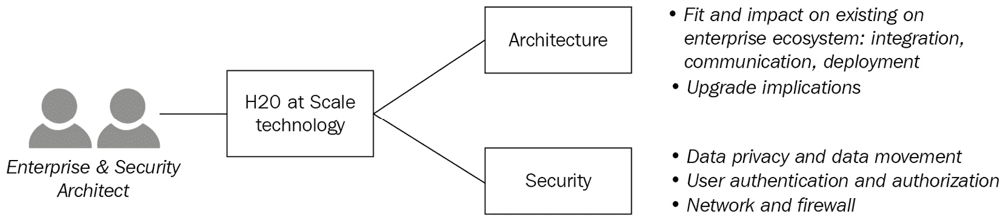
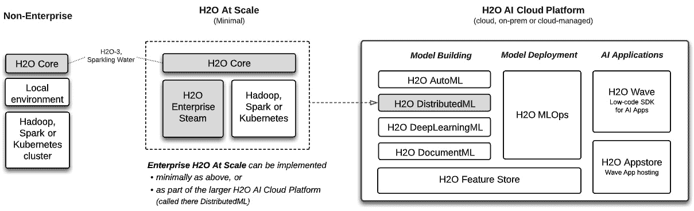
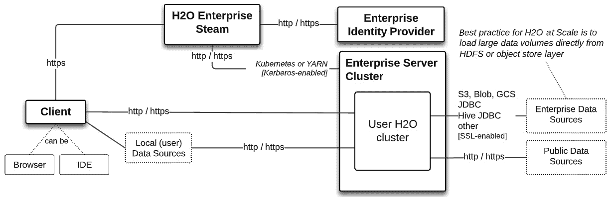
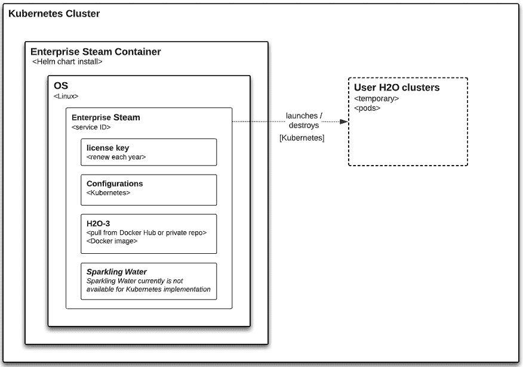
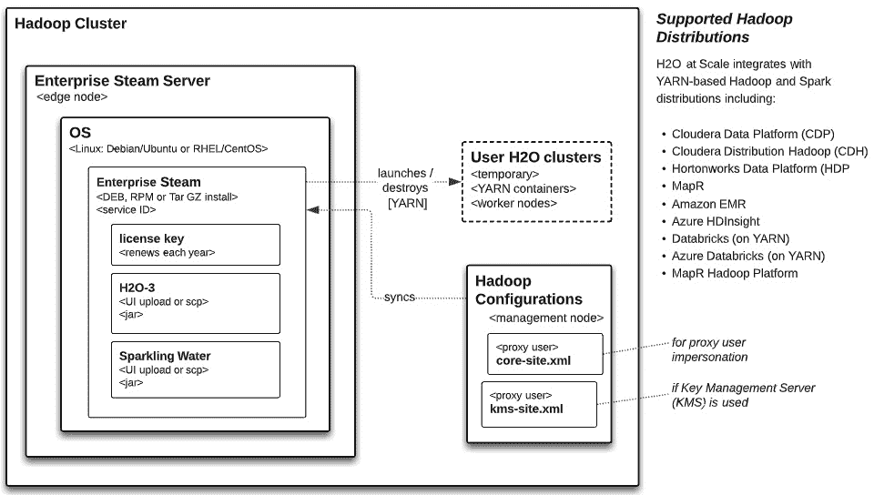

# 第十二章：企业架构师和安全视图

H2O at Scale 用于在企业系统中构建针对大量到巨量数据的尖端 **机器学习** （**ML**） 模型。企业系统是各种组件的复杂集成，这些组件在共同的架构和安全原则下协同工作。H2O at Scale 需要以预期、安全和一致的方式融入这个生态系统。在本章中，我们将详细检查 H2O at Scale 架构和安全属性，以了解 H2O 软件如何在企业中部署，如何与知名框架集成，如何实现广泛的安全功能，以及通常如何在企业系统中良好地运行。

在本章中，我们将涵盖以下主要主题：

+   企业和安全架构师视图

+   H2O at Scale 企业架构

+   H2O at Scale 安全性

+   数据科学家对企业和安全架构的看法

# 技术要求

本章没有技术要求。

# 企业和安全架构师视图

企业和安全架构师的角色很广泛，但在此处，我们将关注他们对软件架构如何集成到现有企业软件生态系统以及如何满足安全需求的关注。

以下图表展示了此视图的摘要。企业可能会有他们自己的特定需求和关注点，但我们的讨论将是一个共同的起点：

图 12.1 – H2O at Scale 的架构和安全视图

在我们深入了解详细视图之前，让我们先看看概述，如下所示：

+   **H2O 企业架构**：这里的需要和关注点与软件组件的部署、集成以及可能对整个技术生态系统产生的影响有关。在我们的案例中，架构主要在组件级别——即在大块独立的零件级别——而不是更低，例如类设计。

+   **H2O 安全性**：企业会采取极端措施来保护他们的系统免受内部和外部威胁。H2O at Scale 技术被众多 *《财富》100 强* 和 *《财富》500 强* 公司在各个行业垂直领域使用，并且已经经过并通过了广泛的安全审查。我们将触及最受审查的安全领域。

让我们先深入了解企业架构视图。

# H2O at Scale 企业架构

我们将通过多个视角来查看 H2O at Scale 模型构建架构，以便让架构利益相关者了解这项技术如何解决他们的常见需求和关注点。

H2O at Scale 组件在实现方式上具有灵活性，因此首先，我们需要了解这些替代方案及其影响，如下文所述。

## H2O at Scale 实现模式

H2O at Scale 的实现有三种模式，如下图中所示：

图 12.2 – H2O at Scale 的实现模式

这些模式的核心概念是我们将 H2O at Scale 组件定义为企业级蒸汽、H2O 核心（H2O-3 或 Sparkling Water 或两者兼而有之，带有可导出的 H2O **MOJO**（即**模型对象，优化**）），以及一个企业级服务器集群（H2O 可以利用但未安装）。这种组件定义的原因已在本书的许多地方阐述，此处将简要回顾如下：

+   **H2O at Scale（最小化）**：最小化地，H2O at Scale 组件包括企业级蒸汽、H2O 核心（H2O-3、Sparkling Water）以及基于 Kubernetes 或**另一个资源协调器**（**YARN**）的 Hadoop 或 Spark 服务器集群。H2O MOJO 是从 H2O 核心生成的。它在*第十章* *H2O 模型部署模式*中进行了详细说明。

+   **H2O AI 云平台**：H2O at Scale 可以作为更大 H2O AI 云平台的一个子集来实现。这个更大的平台将在*第十三章* *介绍 H2O AI 云*中概述。在这种情况下，H2O at Scale 保留了其功能和架构，并被视为更大集成 H2O 平台上的多个专业模型构建引擎之一。

+   **非企业级 H2O**：H2O 核心可以以两种其他模式实现，这两种模式通常不被视为企业级实现。H2O 核心可以在用户的本地机器上运行。这对于个人工作很有用，但在此情况下，H2O at Scale（内存中的数据和其在服务器集群中水平分布的计算）的真正力量是不可用的。因此，无法在大数据量上进行模型构建。

H2O 核心也可以直接针对 Hadoop、Spark 或 Kubernetes 集群运行，而无需实现企业级蒸汽。这给企业带来了重大的用户管理和治理风险，并迫使数据科学家掌握技术集成知识。这一主题已在*第十一章* *管理员和操作视图*中详细说明，并将在本章中简要提及。

哪个 H2O at Scale？

本章的架构和安全讨论重点在于最小化实现的 H2O at Scale 组件（*图 12.2*中的中间图）。对于作为更大 H2O AI 云平台子集的 H2O at Scale，架构类似但不相同。这些差异将在*第十三章* *介绍 H2O AI 云*中概述。

无论 H2O at Scale 是独立实施还是作为更大 H2O AI Cloud 的一部分实施，从模型构建到模型部署再到企业级 Steam 管理，所有关于 H2O at Scale 功能的讨论都是相同的。

让我们开始探讨用户客户端、Enterprise Steam 和 H2O Core 组件如何融入企业环境。

## 组件集成架构

以下组件涉及 H2O at Scale 模型构建：

+   一个网页浏览器

+   一个数据科学 **集成开发环境** (**IDE**)（例如，Jupyter Notebook），其中已安装 H2O 客户端库

+   H2O Enterprise Steam，加载了 H2O-3 和/或 Sparkling Water **Java ARchive** (**JAR**)文件，以便作为作业分发到企业服务器集群

+   一个企业 **身份提供者** (**IdP**)

+   一个企业服务器集群

这些组件集成在以下图中展示得更加详细：

![图 12.3 – H2O at Scale 的组件集成架构

![img/B16721_12_03.jpg]

图 12.3 – H2O at Scale 的组件集成架构

注意，唯一安装的 H2O 组件是在数据科学家 IDE 中的 H2O 和 Enterprise Steam 客户端库，以及安装在小型服务器上的 H2O Enterprise Steam。Enterprise Steam 管理一个 Java JAR 文件，将其推送到企业服务器集群以形成每个用户的自组装 H2O 集群。重要的是，当 H2O 集群停止时，此 JAR 文件将从企业服务器集群中删除。因此，不会在企业服务器集群上安装任何 H2O 组件。

H2O at Scale 在企业系统中具有较小的组件占用空间

尽管 H2O at Scale 能够针对大规模数据集构建模型，但从安装组件的角度来看，它在企业系统中的实际占用空间相当小。

企业级 Steam 是企业环境中唯一安装的组件，它只需要一个小型单服务器（在 Hadoop 上时为边缘节点）。创建 H2O 集群（分布式模型构建）的软件在 Enterprise Steam 上管理，并临时推送到企业服务器集群，而不是安装在那里。Enterprise Steam 利用 Kubernetes 或 YARN 以原生方式在这些框架上启动 H2O 集群（即，H2O 集群是原生的 Kubernetes 或 YARN 作业）。

除了这些，数据科学家在其 IDE 环境中安装 H2O 客户端库，以与企业 Steam 和用户的 H2O 集群进行通信。

还要注意，所有数据科学家和管理员与企业环境的交互都通过 Enterprise Steam 集中进行。这包括所有用户身份验证和 H2O 集群的创建（以及停止或终止）以及管理员配置，以将 H2O at Scale 活动与企业服务器环境集成和保障安全。

企业级 Steam 作为 H2O at Scale 的集中式组件

Enterprise Steam 作为企业系统中所有用户交互的中心网关，包括通过企业 IdP 进行用户身份验证、管理 H2O 集群的生命周期、管理 H2O 软件以及管理员配置以在企业服务器集群上集成和保障 H2O 的安全。

## 通信架构

H2O at Scale 组件之间的通信协议如下所示：

图 12.4 – H2O at Scale 的通信架构

注意，H2O 使用众所周知的通信协议。此外，请注意（除了用户客户端上的数据外），数据直接从数据源传输到用户的 H2O 集群（在那里它被分配到内存中）。

数据摄入直接从源（最好是存储层）到 H2O 集群

用于模型构建的数据被摄入到 H2O 集群中，不通过 Enterprise Steam 或用户的客户端（除非从客户端上传）：它直接从数据源传输到企业服务器集群上 H2O 的内存计算。在处理大规模数据集时，最好使用服务器集群存储层（例如，**简单存储服务**（**S3**）、Azure Blob 或**Hadoop 分布式文件系统**（**HDFS**））作为数据源，而不是其他数据源，如**Java 数据库连接**（**JDBC**）。H2O 集群将源数据在集群的节点之间分配到内存中。这种分区加载是从存储层并行化的，而不是从其他数据源（例如，JDBC 数据库或 Hive）。

## 部署架构

H2O at Scale 有两种部署模式：基于 Kubernetes 或 YARN 的服务器集群。在两种情况下（如前所述），仅在企业环境中安装 Enterprise Steam。这种基于 Kubernetes 与基于 YARN 的区别——以及随后的架构和基础设施细节——对数据科学家来说是隐藏的。正如本书所强调的，数据科学家使用熟悉的语言和 IDE 来构建大规模的 H2O 模型，对在服务器集群后台进行的扩展技术实现知之甚少或一无所知。

### 在 Kubernetes 集群上的部署

Kubernetes 是一个用于扩展和管理容器化应用的现代框架。H2O at Scale 可以部署以利用这个框架。如何实现的细节如下所示：

图 12.5 – H2O at Scale 在 Kubernetes 上的部署图

关键点如下：

+   Enterprise Steam 使用 **Helm 图表**在 Kubernetes 集群上安装和运行。Helm 是 Kubernetes 的包管理器，Helm 图表是用于定义、安装和升级 Kubernetes 框架上组件的模板化文件集合。Helm 图表使 Kubernetes 上的安装和升级变得简单且可重复。

+   Enterprise Steam 基本上是一个 Web 服务器应用程序，它将工作负载作为编排的 **Kubernetes Pod** 推送到企业集群。因此，Enterprise Steam 需要非常低的资源。

+   Enterprise Steam 以具有 **服务标识符**（**服务 ID**）的服务运行。

+   使用 Enterprise Steam 需要一个从 H2O.ai 获得的 **许可证密钥**。许可证密钥在 1 年后到期，需要在此时间之前更新。

+   Kubernetes 配置在 Enterprise Steam 中进行。这包括 **卷挂载**、**HDFS** 和 **Hive** 访问，以及 MinIO 访问（这打开了访问云对象存储——具体来说，是 **Amazon Web Services**（**AWS**） **S3**、**Azure Blob** 和 **Google Cloud Storage**（**GCS**））。

+   H2O-3 **Docker 镜像**按版本存储在任何公共（例如，**Docker Hub**）或私有（例如，**AWS Elastic Container Registry**（**ECR**）镜像仓库中，并在集群启动时由 Kubernetes 从此处拉取。

    注意

    H2O Sparkling Water 目前在 Kubernetes 上的 Enterprise Steam 中不可用。

+   有关安装企业级 Steam 的详细信息，请参阅 H2O 文档中的[`docs.h2o.ai/enterprise-steam/latest-stable/docs/install-docs/installation.html`](https://docs.h2o.ai/enterprise-steam/latest-stable/docs/install-docs/installation.html)。

    升级 H2O-3 很简单

    请记住，H2O-3 没有安装在企业服务器集群上：在这里，它作为 Kubernetes 集群上的 Pods 进行编排和分发，然后在用户完成使用生成的 H2O 集群后进行拆解。这使得升级变得简单：管理员只需在 Enterprise Steam 中配置新的 H2O 版本（并将其 Docker 镜像存储在配置的仓库中），然后用户使用较新版本启动他们的下一个 H2O 集群。（在 Enterprise Steam 上可以共存多个版本，因此用户在启动 H2O 集群时可以从它们中选择。）

对于 **高可用性**，Enterprise Steam 可以作为主动-被动设置安装，由 Kubernetes 处理自动故障转移。这已在 H2O 文档中描述，请参阅[`docs.h2o.ai/enterprise-steam/latest-stable/docs/install-docs/ha.html`](https://docs.h2o.ai/enterprise-steam/latest-stable/docs/install-docs/ha.html)。

让我们看看 H2O 在 YARN 基于的集群上的部署方式。基本上，忽略底层框架的具体细节时，这些模式是相似的。

### 基于 YARN 的服务器集群部署

YARN 是一个开源框架，用于在水平可扩展的架构中启动和管理分布式处理。它通常针对 Hadoop 或 Spark 集群（或 Spark 在 Hadoop 上）实现。以下图表和讨论与 Hadoop 上的部署相关：

![图 12.6 – H2O 在 Hadoop 上的大规模部署图]

图 12.6 – H2O 在 Hadoop 上的大规模部署图

关键点类似于基于 Kubernetes 的实现。以下列出 Hadoop 的差异：

+   Enterprise Steam 部署在 Hadoop 的**边缘节点**上。

+   Enterprise Steam 将工作负载作为原生**YARN**作业推送到企业集群。

+   Enterprise Steam 以软件包的形式安装在**Linux 操作系统**（无论是**Debian/Ubuntu**还是**Red Hat Enterprise Linux**（**RHEL**）/**CentOS**）上（**Debian**（**DEB**）或**RPM 软件包管理器**（**RPM**）或**GNU zip 磁带存档**（**TAR GZ**）安装）。

+   配置是在 Hadoop 的`core-site.xml`和`kms-site.xml`配置文件上进行的。这些 Hadoop 配置是为了将 Steam 与 YARN 集成并实现**用户伪装**。因为 Enterprise Steam 在边缘节点上，所以在管理节点上对 Hadoop 配置的更改会立即在 Enterprise Steam 上复制。

+   H2O-3 或 Sparkling Water JAR 文件由 Enterprise Steam 的**YARN 应用程序**打包，并作为每个启动 H2O 集群的用户的一个单独的 YARN 作业运行在 Hadoop 集群上。YARN 作业（或等价地，H2O 集群）运行直到用户停止 H2O 集群，或者 Enterprise Steam 在达到空闲或绝对时间阈值后自动停止集群。H2O-3 JAR 和 Sparkling Water JAR 文件从 H2O.ai 获取，并且针对 Hadoop 发行版特定。管理员通过 UI 上传 JAR 文件或执行**安全复制**（**SCP**）到 Enterprise Steam 文件系统。

+   关于安装 Enterprise Steam 的详细说明，包括对 Linux 操作系统、Java 和 Hadoop 发行版的要求，请参阅 H2O Enterprise Steam 文档，网址为[`docs.h2o.ai/enterprise-steam/latest-stable/docs/install-docs/installation.html`](https://docs.h2o.ai/enterprise-steam/latest-stable/docs/install-docs/installation.html)。

    升级 H2O-3 或 Sparkling Water 非常简单（再次）

    H2O-3 和 Sparkling Water 没有安装在 Hadoop 集群上：在这里，它们被封装成 YARN 作业，并在集群上分布式运行。这使得升级变得简单：管理员只需将 JAR 文件的新版本上传到 Enterprise Steam，用户就可以使用新版本启动下一个 H2O 集群。（可以共存多个版本，因此用户在启动 H2O 集群时可以选择它们。）

对于 Hadoop 的高可用性，企业 Steam 以手动故障转移的主动-被动设置安装。这在 H2O 文档的[`docs.h2o.ai/enterprise-steam/latest-stable/docs/install-docs/ha.html`](https://docs.h2o.ai/enterprise-steam/latest-stable/docs/install-docs/ha.html)中描述。

### 作为 H2O AI Cloud 部署的一部分

企业 Steam、H2O Core（H2O-3 和 Sparkling Water）可以作为更大的 H2O AI Cloud 平台的一部分进行部署（*见图 12.2*）。因此，它具有与前面显示的两个模型类似的架构，但现在作为更大 H2O AI Cloud 实施的一部分集成和安装。这将在*第十三章*中进一步讨论，*介绍 H2O AI Cloud*。

现在我们已经探讨了 H2O at Scale 的企业架构视图，让我们来看看安全性视图。

# H2O at Scale 安全性

H2O at Scale 已部署到金融服务、保险、医疗保健和其他行业的众多高度监管的企业。这通常涉及广泛的彻底的架构和安全审查，这些审查因组织而异。以下各节将讨论从架构角度的关键领域。

## 数据移动和隐私

这里记录了数据移动和隐私的主要安全要点：

+   数据直接从企业数据源移动到企业集群中用户 H2O 集群的内存中，不通过 H2O Enterprise Steam 或数据科学家的客户端。

+   在并发 H2O 集群中的数据与其他数据隔离：在模型构建期间，用户无法看到或访问彼此的数据。

+   当 H2O 集群停止时，用户 H2O 集群中的数据将被删除。请记住，数据在用户运行的 H2O 集群节点之间在内存中分区。

+   用户可以将数据下载到由管理员配置的企业存储层主目录中（例如，在 AWS S3 或 HDFS 中）。

+   用户无法从 H2O 集群下载数据到本地磁盘。

## 用户身份验证和访问控制

这里概述了需要注意的主要要点：

+   用户身份验证通过企业 Steam 中心完成，该服务与企业身份提供者（IdP）进行身份验证。企业 Steam 支持以下身份验证方式：**OpenID**、**轻量级目录访问协议**（**LDAP**）、**安全断言标记语言**（**SAML**）和**可插拔身份验证模块**（**PAM**）。

+   用户可以通过 H2O Steam **应用程序编程接口**（**API**）进行用户身份验证。用户可以生成**个人访问令牌**（**PATs**），并将它们用作程序中的环境变量（而不是硬编码它们）。生成新的 PAT 会撤销之前的 PAT。PAT 在用户登录后从企业 Steam UI 生成。

+   企业 Steam 支持在 Kerberos 保护的 Hadoop 集群上运行。

+   要访问 HDFS 或 Hive，可以配置 Hadoop 伪装。这允许企业级 Steam 在这些数据源中看起来像是已登录用户，而不是企业级 Steam 服务 ID。这反过来又允许 H2O 用户通过登录企业级 Steam（而不是明确传递授权凭证）来对这些资源进行身份验证。

+   对于 JDBC 和其他数据源访问，数据科学家将访问凭证（例如，JDBC 连接**统一资源定位符**（**URL**）、用户名和密码）作为参数传递给客户端 IDE 中 H2O API 的数据导入语句。

企业级 Steam 管理员配置的用户身份验证和访问控制已在*第十一章*，*管理员和操作视图*中介绍。

## 网络和防火墙

假设 H2O at Scale 在企业网络内部署安全，无论是在本地还是在云端。这里记录了 H2O 网络安全的一些方面：

+   用户对企业级 Steam 和在企业服务器集群上的 H2O 集群的访问是通过**超文本传输安全协议**（**HTTPS**）进行的。企业级 Steam 在安装时自动生成自签名的**传输层安全性**（**TLS**）证书，但在首次登录后，您将有机会安装自己的证书。此外，还可以为 LDAP、Kubernetes Ingress 以及 Kubernetes 连接到 MinIO 和 H2O.ai 存储层安装证书。

+   企业级 Steam 默认将用户暴露在端口`9555`上，但这可以更改。企业级 Steam 运行在反向代理后面，用户永远不会直接与 H2O 集群本身通信。

H2O Enterprise Steam 安全性的详细信息可以在 H2O 文档中找到，网址为[`docs.h2o.ai/enterprise-steam/latest-stable/docs/install-docs/index.html`](https://docs.h2o.ai/enterprise-steam/latest-stable/docs/install-docs/index.html)。

我们现在已经从各自的利益相关者的角度探讨了 H2O at Scale 的企业和安全管理架构。现在让我们看看这如何与数据科学家相关。

# 数据科学家对企业和管理架构的看法

尽管数据科学家通常不会直接或频繁地与企业和安全管理架构师互动，但他们可能会受到以下图中所示的利益相关者的影响：

图 12.7 – 企业和安全管理架构的数据科学视图

在企业中首次实施 H2O at Scale 通常需要对该技术的正式架构和安全审查。企业系统是由多种技术集成到一个统一整体的大型生态系统。架构和安全审查员将决定 H2O at Scale 是否可以在这个生态系统中实施，同时符合定义统一整体的原则。这些原则是由企业利益相关者定义的规则和指南，可能包括确保新技术与业务需求一致，确保技术满足广泛的网络安全要求，以及确保架构在发生中断后能够实现**业务连续性**（**BC**）。这只是几个例子。

H2O at Scale 技术已经通过了*财富 100 强*和*财富 500 强*企业的架构和安全审查，原因已在本章中概述。H2O at Scale 可以总结如下：

+   安装占用空间小，易于升级

+   本地集成到现有框架（Kubernetes；YARN）

+   通过 Enterprise Steam 集中管理 H2O 用户和 H2O 软件管理

+   为业务连续性提供高可用性

+   使用常见的通信协议

+   实施广泛且广为人知的网络安全机制

+   确保数据隐私

+   提供已知的服务级别协议（**SLAs**）支持

让我们总结一下本章所学的内容。

# 摘要

在本章中，我们检查了 H2O at Scale 模型构建技术的架构和安全基础。这种检查为架构和安全利益相关者提供了一个可靠的起点，以评估 H2O 是否符合企业系统定义的技术要求和架构原则。一般来说，H2O at Scale 在集成和运行时很好地融入企业生态系统，并且在此过程中具有较小的软件占用空间。H2O 还拥有广泛的安全功能，满足企业的高安全需求。

在下一章中，我们将把到目前为止所学的一切放入 H2O.ai 令人兴奋的新端到端机器学习平台 H2O AI Cloud 的更大背景中。
