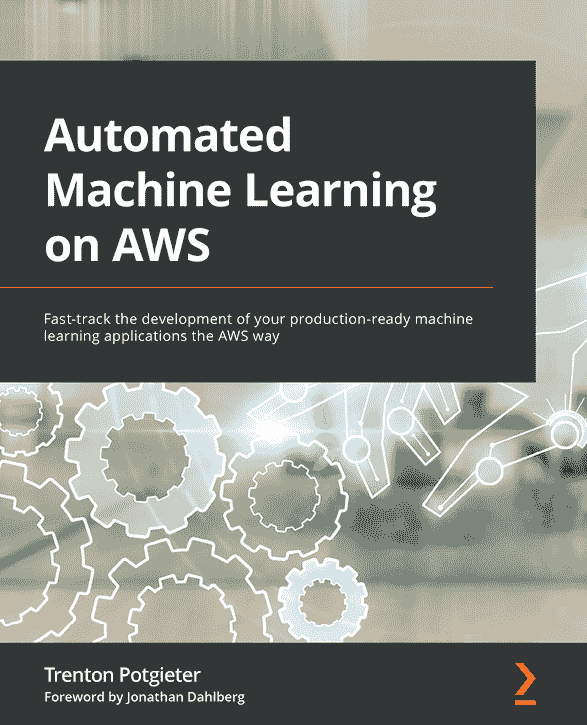

[Packt.com](http://Packt.com)

订阅我们的在线数字图书馆，全面访问超过 7,000 本书和视频，以及领先的行业工具，帮助您规划个人发展并推进您的职业生涯。有关更多信息，请访问我们的网站。

# 为什么订阅？

+   使用来自 4,000 多位行业专业人士的实用电子书和视频，节省学习时间，多花时间编码

+   通过为您量身定制的技能计划提高您的学习效果

+   每月免费获得一本电子书或视频

+   完全可搜索，便于轻松访问关键信息

+   复制粘贴、打印和收藏内容

您知道 Packt 为每本书都提供电子书版本，包括 PDF 和 ePub 文件吗？您可以在 [packt.com](http://packt.com) 升级到电子书版本，并且作为印刷书客户，您有权获得电子书副本的折扣。有关更多信息，请联系我们 `customercare@packtpub.com`。

在 [www.packt.com](http://www.packt.com)，您还可以阅读一系列免费的技术文章，注册各种免费通讯，并享受 Packt 书籍和电子书的独家折扣和优惠。

# 您可能还喜欢的其他书籍

如果您喜欢这本书，您可能对 Packt 的其他书籍也感兴趣：

](https://packt.link/9781801811828)

自动生成描述](img/9781801817950_Cover.png)](https://packt.link/9781801817950)

**学习 Amazon SageMaker，第二版**

Julien Simon

ISBN: 9781801817950

+   熟练掌握数据标注和准备技术

+   使用 AutoML 功能通过 AutoPilot 构建、训练机器学习模型

+   使用内置算法和框架以及您自己的代码创建模型

+   使用真实世界示例训练计算机视觉和自然语言处理 (NLP) 模型

+   涵盖扩展、模型优化、模型调试和成本优化的培训技术

+   使用 SDK 和多种自动化工具在多种配置中自动化部署任务

](https://packt.link/9781801811828)

自动生成描述](img/9781801811828_Cover.png)](https://packt.link/9781801811828)

**AWS 上的自动化机器学习**

Trenton Potgieter

ISBN: 9781801811828

+   使用 SageMaker Autopilot 和 Amazon SageMaker SDK 自动化机器学习过程

+   了解如何使用 AutoGluon 自动化复杂的模型构建任务

+   使用 AWS CDK 将机器学习过程编码化

+   在 AWS 上创建、部署和重建 CI/CD 管道

+   使用 AWS Step Functions 和数据科学 SDK 构建机器学习工作流程

+   利用 Amazon SageMaker Feature Store 自动化机器学习软件开发生命周期 (MLSDLC)

+   了解如何使用 Amazon MWAA 为以数据为中心的机器学习流程

# Packt 正在寻找像您这样的作者

如果你有兴趣成为 Packt 的作者，请访问[authors.packtpub.com](http://authors.packtpub.com)并今天申请。我们已与成千上万的开发者和技术专业人士合作，就像你一样，帮助他们将见解分享给全球技术社区。你可以提交一般申请，申请我们正在招募作者的特定热门话题，或者提交你自己的想法。

# 分享你的想法

现在你已经完成了《使用 H2O 进行大规模机器学习》，我们很乐意听听你的想法！如果你在亚马逊购买了这本书，请点击此处直接进入该书的亚马逊评论页面，分享你的反馈或在该购买网站上留下评论。

你的评论对我们和整个技术社区都很重要，并将帮助我们确保我们提供高质量的内容。

你可能还会喜欢的其他书籍

你可能还会喜欢的其他书籍
