# Scala 机器学习简介

在本章中，我们将解释一些将在所有后续章节中使用的机器学习（ML）的基本概念。我们将从对 ML 的简要介绍开始，包括基本学习工作流程、ML 的经验法则和不同的学习任务。然后我们将逐步介绍最重要的机器学习任务。

此外，我们将讨论如何开始使用 Scala 和基于 Scala 的机器学习库，以便为下一章快速入门。最后，我们将通过解决一个实际问题来开始使用 Scala 和 Spark ML 进行机器学习。本章将简要介绍以下主题：

+   机器学习概述

+   机器学习任务

+   Scala 简介

+   Scala 机器学习库

+   使用 Spark ML 开始机器学习

# 技术要求

您需要具备 Scala 和 Java 的基本知识。由于 Scala 也是一种基于 JVM 的语言，请确保您的机器上已安装并配置了 Java JRE 和 JDK。更具体地说，您需要安装 Scala 2.11.x 和 Java 1.8.x 版本。此外，您需要一个带有必要插件的 IDE，例如 Eclipse、IntelliJ IDEA 或 Scala IDE。但是，如果您使用 IntelliJ IDEA，Scala 已经集成。

本章的代码文件可以在 GitHub 上找到：

[`github.com/PacktPublishing/Machine-Learning-with-Scala-Quick-Start-Guide/tree/master/Chapter01`](https://github.com/PacktPublishing/Machine-Learning-with-Scala-Quick-Start-Guide/tree/master/Chapter01)

查看以下视频，了解代码的实际应用：

[`bit.ly/2V3Id08`](http://bit.ly/2V3Id08)

# 机器学习概述

机器学习方法基于一系列统计和数学算法，以执行分类、回归分析、概念学习、预测建模、聚类和有用模式的挖掘等任务。使用机器学习，我们旨在自动改进整个学习过程，这样我们可能不需要完整的人类交互，或者我们至少可以尽可能减少这种交互的水平。

# 学习算法的工作原理

托马斯·M·米切尔从计算机科学的角度解释了学习真正意味着什么：

“如果一个计算机程序在任务 T 中，根据性能度量 P，从经验 E 中学习，那么它的性能会随着经验 E 的提高而提高。”

根据这个定义，我们可以得出结论，计算机程序或机器可以执行以下操作：

+   从数据和历史中学习

+   随经验改进

+   逐步提升一个可以用来预测问题结果的模型

由于前述要点是预测分析的核心，我们使用的几乎所有机器学习算法都可以被视为一个优化问题。这涉及到寻找最小化目标函数的参数，例如，两个术语（如成本函数和正则化）的加权总和。通常，目标函数有两个组成部分：

+   正则化器，它控制着模型复杂性

+   损失，它衡量模型在训练数据上的误差

另一方面，正则化参数定义了最小化训练误差和模型复杂度之间的权衡，旨在避免过拟合问题。现在，如果这两个组件都是凸的，那么它们的和也是凸的。因此，在使用机器学习算法时，目标是获得一个函数的最佳超参数，该函数在做出预测时返回最小误差。因此，通过使用凸优化技术，我们可以最小化函数，直到它收敛到最小误差。

由于问题具有凸性，通常更容易分析算法的渐近行为，这显示了随着模型观察越来越多的训练数据，其收敛速度有多快。机器学习的任务是要训练一个模型，使其能够从给定的输入数据中识别复杂的模式，并且能够以自动化的方式做出决策。

因此，推理就是测试模型对新（即未观察到的）数据，并评估模型本身的性能。然而，在整个过程中，以及为了使预测模型成功，数据在所有机器学习任务中都是第一位的公民。实际上，我们提供给机器学习系统的数据必须由数学对象组成，例如向量，这样它们才能消费这样的数据。例如，在以下图中，原始图像被嵌入到称为特征向量的数值中，在输入到学习算法之前：

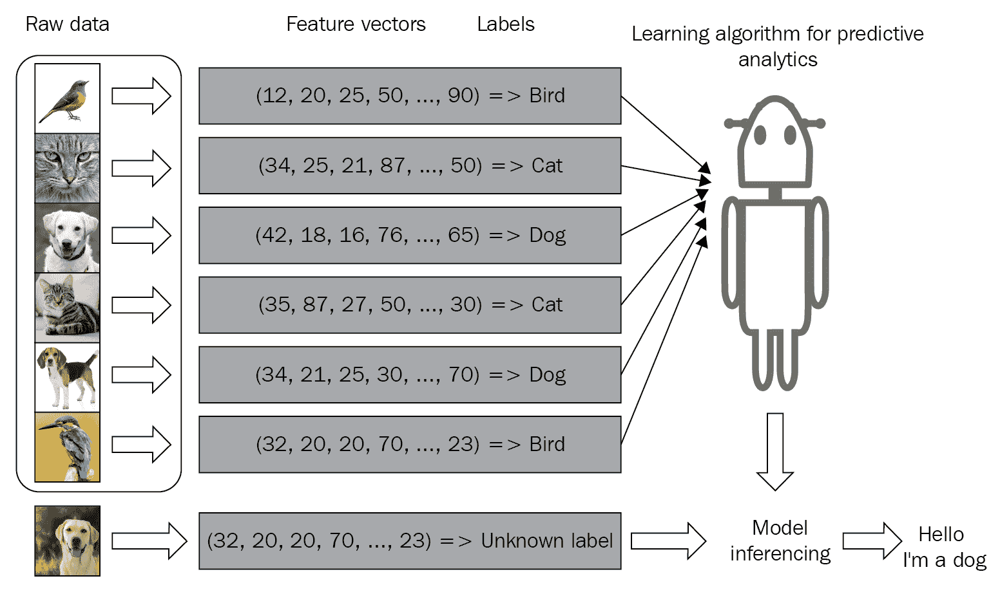

根据可用的数据和特征类型，你的预测模型的表现可能会发生剧烈波动。因此，在推理发生之前选择正确的特征是其中最重要的步骤之一。这被称为特征工程，其中使用关于数据的领域知识来创建仅选择性的或有用的特征，以帮助准备用于机器学习算法的特征向量。

例如，除非我们已经有在多个酒店住宿的个人经验，否则比较酒店相当困难。然而，借助已经从数千条评论和特征中训练出来的机器学习模型（例如，酒店有多少颗星，房间大小，位置，客房服务等等），现在这变得相当可行了。我们将在章节中看到几个例子。然而，在开发这样的机器学习模型之前，了解一些机器学习概念也很重要。

# 通用机器学习经验法则

通用机器学习经验法则是，数据越多，预测模型越好。然而，拥有更多的特征往往会导致混乱，以至于性能急剧下降，尤其是在数据集是高维的情况下。整个学习过程需要可以分成三种类型（或已经以这种形式提供）的输入数据集：

+   **训练集**是从历史数据或实时数据中获取的知识库，用于拟合机器学习算法的参数。在训练阶段，机器学习模型利用训练集来找到网络的最佳权重，并通过最小化训练误差来实现目标函数。在这里，使用反向传播规则或优化算法来训练模型，但在学习过程开始之前，所有超参数都需要设置好。

+   **验证集**是一组用于调整机器学习模型参数的示例。它确保模型训练良好，并泛化以避免过拟合。一些机器学习从业者也将其称为开发集或 dev 集。

+   **测试集**用于评估训练模型在未见数据上的性能。这一步骤也被称为模型推理。在测试集上评估最终模型（即当我们对模型性能完全满意时），我们不需要进一步调整模型，但训练好的模型可以部署到生产就绪环境中。

一种常见的做法是将输入数据（在必要的预处理和特征工程之后）分为 60%用于训练，10%用于验证，20%用于测试，但这实际上取决于具体用例。有时，我们还需要根据数据集的可用性和质量对数据进行上采样或下采样。

在下一节中，我们将讨论不同类型的训练集上的学习规则可能会有所不同。然而，在那之前，让我们快速看一下机器学习中的一些常见现象。

# 机器学习模型中的通用问题

当我们使用这些输入数据进行训练、验证和测试时，通常学习算法无法 100%准确地学习，这涉及到训练、验证和测试误差（或损失）。在机器学习模型中，可能会遇到两种类型的误差：

+   不可减少误差

+   可减少误差

即使是最稳健和复杂的模型也无法减少不可减少误差。然而，可减少误差，它有两个组成部分，称为偏差和方差，是可以减少的**。** 因此，为了理解模型（即预测误差），我们只需要关注偏差和方差：

+   偏差意味着预测值与实际值之间的距离。通常，如果平均预测值与实际值（标签）非常不同，那么偏差就更高。

+   一个机器学习模型会因为无法建模输入和输出变量之间的关系（无法很好地捕捉数据的复杂性）而具有很高的偏差，并变得非常简单。因此，一个过于简单的模型具有高方差，会导致数据欠拟合。

以下图表提供了一些高级见解，同时也展示了恰到好处的拟合模型应该是什么样子：

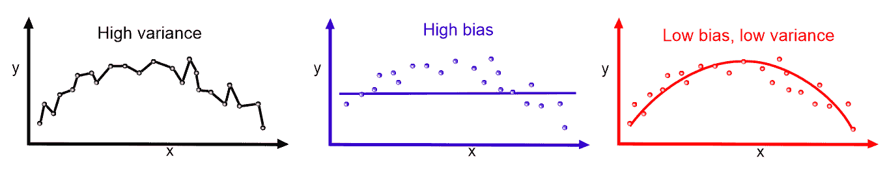

方差表示预测值和实际值之间的可变性（它们有多分散）。

**识别高偏差和高方差**：如果模型具有高训练误差以及验证误差或测试误差与训练误差相同，则模型具有高偏差。另一方面，如果模型具有低训练误差但具有高验证误差或高测试误差，则模型具有高方差。

机器学习模型通常在训练集上表现良好，但在测试集上表现不佳（因为误差率高）。最终，这会导致欠拟合模型。我们可以再次总结过拟合和欠拟合：

+   **欠拟合**：如果你的训练误差和验证误差都相对相等且非常高，那么你的模型很可能是欠拟合了训练数据。

+   **过拟合**：如果你的训练误差低而验证误差高，那么你的模型很可能是过拟合了训练数据。恰到好处的模型学习得很好，并且在未见过的数据上表现也更好。

**偏差-方差权衡**：高偏差和高方差问题通常被称为偏差-方差权衡，因为一个模型不能同时过于复杂或过于简单。理想情况下，我们应该努力寻找具有低偏差和低方差的最佳模型。

现在我们已经了解了机器学习算法的基本工作原理。然而，基于问题类型和解决问题的方法，机器学习任务可能会有所不同，例如，监督学习、无监督学习和强化学习。我们将在下一节中更详细地讨论这些学习任务。

# 机器学习任务

尽管每个机器学习问题或多或少都是一个优化问题，但解决它们的方式可能会有所不同。实际上，学习任务可以分为三种类型：监督学习、无监督学习和强化学习。

# 监督学习

监督学习是最简单且最著名的自动学习任务。它基于一系列预定义的示例，其中每个输入应属于哪个类别已经已知，如下面的图所示：

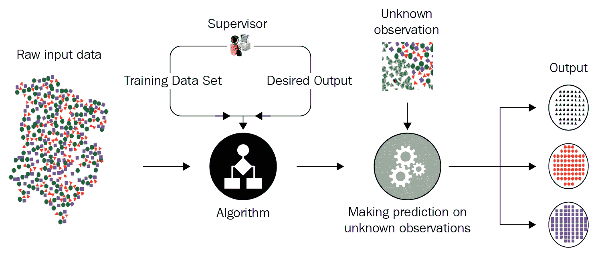

上述图显示了监督学习的典型工作流程。一个演员（例如，数据科学家或数据工程师）执行**提取、转换、加载**（**ETL**）和必要的特征工程（包括特征提取、选择等），以获取具有特征和标签的适当数据，以便它们可以被输入到模型中。然后他会将数据分为训练集、开发集和测试集。训练集用于训练机器学习模型，验证集用于验证训练以防止过拟合和正则化，然后演员会在测试集（即未见过的数据）上评估模型的表现。

然而，如果性能不满意，他可以通过额外的调整来根据超参数优化获得最佳模型。最后，他将在一个生产就绪的环境中部署最佳模型。以下图表简要总结了这些步骤：

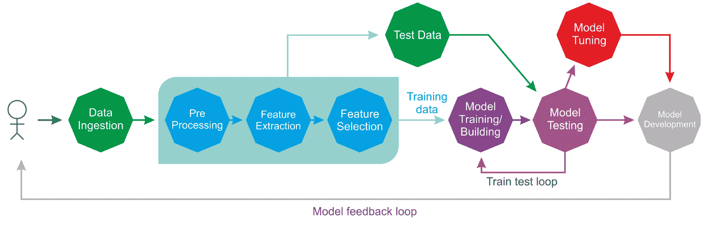

在整个生命周期中，可能会有许多参与者（例如，数据工程师、数据科学家或机器学习工程师）独立或协作地执行每个步骤。监督学习环境包括分类和回归任务；分类用于预测数据点属于哪个类别（离散值）。它也用于预测类属性的标签。另一方面，回归用于预测连续值并对类属性进行数值预测。

在监督学习的情况下，对输入数据集的学习过程被随机分为三个集合，例如，60%用于训练集，10%用于验证集，剩余的 30%用于测试集。

# 无监督学习

如果没有给出标签，你将如何总结和分组一个数据集？你可能试图通过寻找数据集的潜在结构并测量统计属性，如频率分布、均值、标准差等来回答这个问题。如果问题是“你将如何有效地以压缩格式表示数据？”你可能会回答说你会使用一些软件来进行压缩，尽管你可能不知道该软件是如何做到这一点的。以下图表显示了无监督学习任务的典型工作流程：

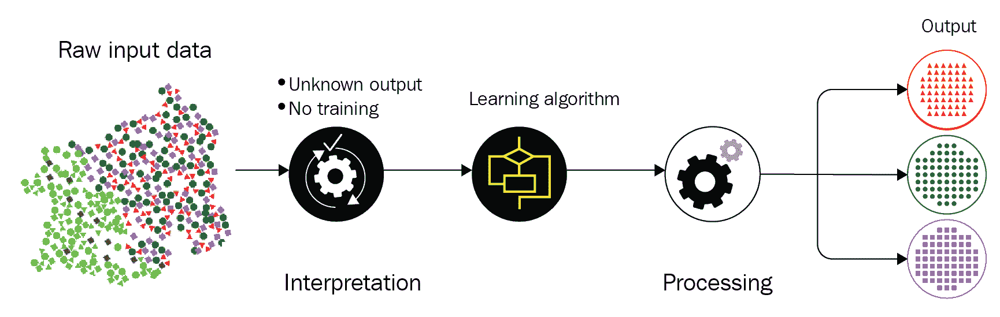

这些正是无监督学习的两个主要目标，它基本上是一个数据驱动的过程。我们称这种学习为“无监督”学习，因为您将不得不处理未标记的数据。以下引言来自 Yann LeCun，AI 研究总监（来源：预测学习，NIPS 2016，Yann LeCun，Facebook Research）：

“人类和动物的大多数学习都是无监督学习。如果智能是一块蛋糕，无监督学习就是蛋糕本身，监督学习就是蛋糕上的糖霜，强化学习就是蛋糕上的樱桃。我们知道如何制作糖霜和樱桃，但我们不知道如何制作蛋糕。在我们甚至考虑达到真正的 AI 之前，我们需要解决无监督学习问题。”

两个最广泛使用的无监督学习任务包括以下内容：

+   **聚类**：根据相似性（或统计属性）对数据点进行分组。例如，像 Airbnb 这样的公司经常将它的公寓和房屋分组到社区中，以便客户可以更容易地浏览列表。

+   **降维**：尽可能多地保留结构和统计属性地压缩数据。例如，通常需要减少数据集的维度以进行建模和可视化。

+   **异常检测**：在多个应用中很有用，例如在信用卡欺诈检测中识别，在工业工程过程中识别有缺陷的硬件，以及在大型数据集中识别异常值。

+   **关联规则挖掘**：常用于市场篮子分析，例如询问哪些商品经常一起购买。

# 强化学习

强化学习是一种人工智能方法，它侧重于通过系统与环境交互来学习。在强化学习中，系统的参数根据从环境中获得的反馈进行调整，反过来，环境又对系统的决策提供反馈。以下图表显示一个人在做出决策以到达目的地。让我们以从家到工作的路线为例：

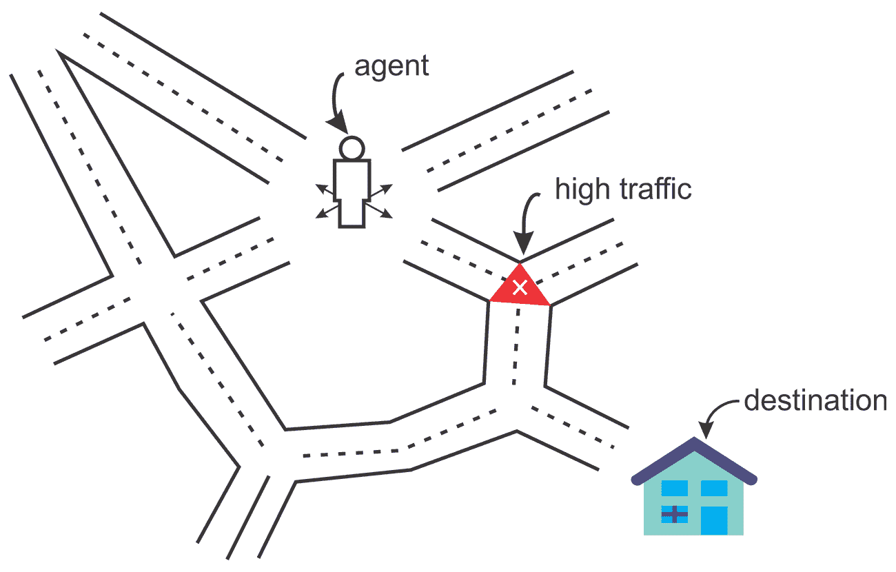

在这种情况下，你每天走相同的路线去上班。然而，有一天你突然好奇，决定尝试一条不同的路线，以寻找最短路径。同样，根据你的经验和不同路线所花费的时间，你会决定是否应该更频繁地选择特定的路线。我们可以再举一个系统模拟棋手的例子。为了提高其性能，系统利用其先前移动的结果；这样的系统被称为具有强化学习的系统。

到目前为止，我们已经学习了机器学习的基本工作原理和不同的学习任务。然而，对每个学习任务进行总结并给出一些示例用例是必要的，我们将在下一小节中看到这一点。

# 总结学习类型及其应用

我们已经看到了机器学习算法的基本工作原理。然后我们看到了基本机器学习任务是什么以及它们如何构建特定领域的问题。然而，每个学习任务都可以使用不同的算法来解决。以下图表提供了一个概览：

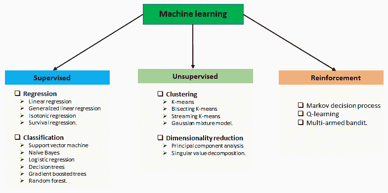

学习类型和相关问题

以下图表总结了之前提到的机器学习任务和一些应用：

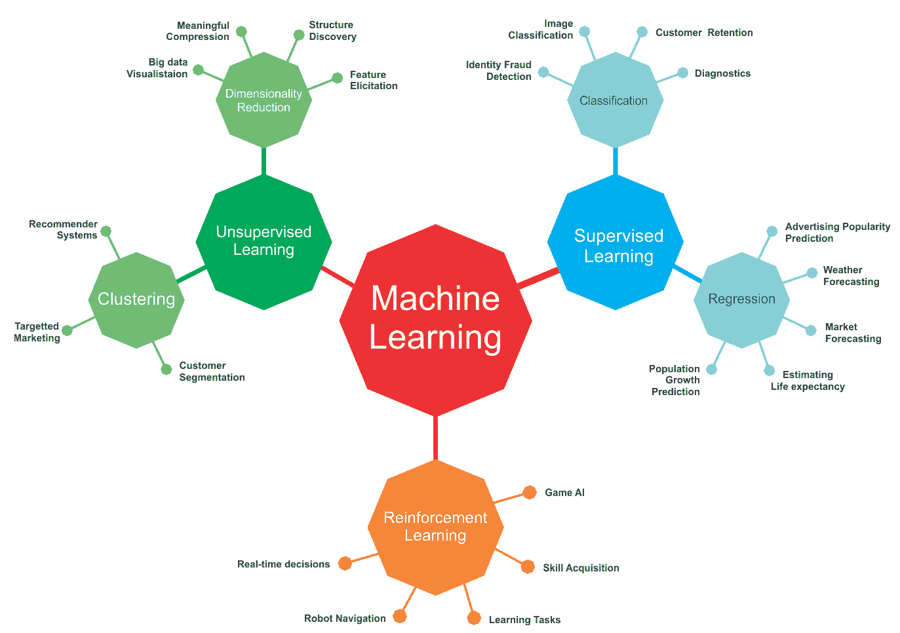

来自不同应用领域的机器学习任务和一些用例

然而，前面的图表只列出了几个使用不同机器学习任务的用例和应用。在实践中，机器学习被用于无数的用例和应用。我们将尝试在本书中涵盖其中的一些。

# Scala 概述

Scala 是一种可扩展的、函数式和面向对象的编程语言，与 Java 最为紧密相关。然而，Scala 被设计得更加简洁，并具有函数式编程语言的特征。例如，用 Scala 编写的 Apache Spark 是一个快速且通用的用于大规模数据处理的引擎。

Scala 的成功归因于许多因素：它有许多工具能够实现简洁的表达，它非常简洁，因为你需要输入更少的代码，因此需要阅读的也较少，并且它还提供了非常好的性能。这就是为什么 Spark 对 Scala 的支持更多，与 R、Python 和 Java 相比，有更多的 API 是用 Scala 编写的。Scala 的符号运算符易于阅读，与 Java 相比，大多数 Scala 代码相对简洁且易于阅读；Java 则过于冗长。模式匹配和高级函数等函数式编程概念也存在于 Scala 中。

开始使用 Scala 的最佳方式是使用 Scala 通过**Scala 构建工具**（**SBT**）或通过**集成开发环境**（**IDE**）使用 Scala。无论哪种方式，第一步都是下载、安装和配置 Scala。然而，由于 Scala 运行在**Java 虚拟机**（**JVM**）上，因此需要在您的机器上安装和配置 Java。因此，我不会介绍如何进行这一步骤。相反，我将提供一些有用的链接（[`en.wikipedia.org/wiki/Integrated_development_environment`](https://en.wikipedia.org/wiki/Integrated_development_environment)）。

请遵循如何在[`www.scala-lang.org/download/`](https://www.scala-lang.org/download/)上设置 Java 和 IDE（例如，IntelliJ IDEA）或构建工具（例如，SBT）的说明。如果您使用的是 Windows（例如，Windows 10）或 Linux（例如，Ubuntu），请访问[`www.journaldev.com/7456/download-install-scala-linux-unix-windows`](https://www.journaldev.com/7456/download-install-scala-linux-unix-windows)。最后，这里有一些 macOS 的说明：[`sourabhbajaj.com/mac-setup/Scala/README.html`](http://sourabhbajaj.com/mac-setup/Scala/README.html)。

Java 程序员通常在需要为代码添加一些函数式编程风格时更喜欢 Scala，因为 Scala 运行在 JVM 上。在编辑器方面，有各种其他选择。以下是一些可供选择的选择：

+   Scala IDE

+   Eclipse 的 Scala 插件

+   IntelliJ IDEA

+   Emacs

+   Vim

Eclipse 使用众多 beta 插件和本地、远程以及高级调试设施，具有语义高亮和代码补全功能，因此在 Scala 方面具有多个优势。

# Scala 中的 ML 库

虽然与 Java 和 Python 相比，Scala 是一种相对较新的编程语言，但当我们已经有 Python 和 R 时，为什么还需要考虑学习它的问题将会出现。嗯，Python 和 R 是两种领先的快速原型设计和数据分析编程语言，包括构建、探索和操作强大的模型。

但 Scala 也正在成为功能产品开发的关键语言，这些产品非常适合大数据分析。大数据应用通常需要稳定性、灵活性、高速、可扩展性和并发性。所有这些需求都可以通过 Scala 来实现，因为 Scala 不仅是一种通用语言，而且也是数据科学（例如，Spark MLlib/ML）的一个强大选择。我过去几年一直在使用 Scala，我发现越来越多的 Scala ML 库正在开发中。接下来，我们将讨论可用于开发 ML 应用的可用和广泛使用的 Scala 库。

感兴趣的读者可以快速查看这个列表，它列出了 15 个最受欢迎的 Scala ML 和数据科学库：

[`www.datasciencecentral.com/profiles/blogs/top-15-scala-libraries-for-data-science-in-2018-1`](https://www.datasciencecentral.com/profiles/blogs/top-15-scala-libraries-for-data-science-in-2018-1)

# Spark MLlib 和 ML

MLlib 是一个库，它提供了使用 Scala 实现的用户友好的 ML 算法。然后，相同的 API 被公开以提供对 Java、Python 和 R 等其他语言的支持。Spark MLlib 为存储在单台机器上的本地向量和矩阵数据类型以及由一个或多个**弹性分布式数据集**（**RDDs**）支持的分布式矩阵提供支持。

RDD 是 Apache Spark 的主要数据抽象，通常称为 Spark Core，它表示一个不可变、分区元素集合，可以在并行操作上操作。其容错性使得 RDD 具有容错性（基于 RDD 血缘图）。即使在 Spark 集群的多个节点上存储数据时，RDD 也可以帮助进行分布式计算。此外，RDD 可以转换为数据集，作为具有元组或其他对象等原始值的分区数据集合。

Spark ML 是一组新的 ML API，它允许用户在数据集之上快速组装和配置实用的机器学习管道，这使得将多个算法组合成一个单一管道变得更加容易。例如，一个 ML 算法（称为 estimator）和一组转换器（例如，一个`StringIndexer`，一个`StandardScalar`和一个`VectorAssembler`）可以连接在一起，作为阶段执行 ML 任务，而无需按顺序运行它们。

感兴趣的读者可以查看 Spark MLlib 和 ML 指南：[`spark.apache.org/docs/latest/ml-guide.html`](https://spark.apache.org/docs/latest/ml-guide.html)。

到目前为止，我必须告诉你一些非常有用的信息。由于我们将在接下来的章节中继续使用 Spark MLlib 和 ML API，因此提前解决一些问题将是有益的。如果你是 Windows 用户，那么让我告诉你一个你在使用 Spark 时可能会遇到的一个非常奇怪的问题。问题是 Spark 在 Windows、macOS 和 Linux 上都可以运行。当你在 Windows 上使用 Eclipse 或 IntelliJ IDEA 开发 Spark 应用程序时，你可能会遇到 I/O 异常错误，从而导致你的应用程序可能无法成功编译或可能中断。

Spark 在 Windows 上也需要 Hadoop 的运行环境。不幸的是，Spark 的二进制分发版（例如 v2.4.0）不包含 Windows 原生组件，如 `winutils.exe` 或 `hadoop.dll`。然而，如果你不能确保运行环境，那么在 Windows 上运行 Hadoop 是必需的（不是可选的），否则会出现以下 I/O 异常：

```py
03/02/2019 11:11:10 ERROR util.Shell: Failed to locate the winutils binary in the hadoop binary path
 java.io.IOException: Could not locate executable null\bin\winutils.exe in the Hadoop binaries.
```

在 Windows 和像 Eclipse 和 IntelliJ IDEA 这样的 IDE 中处理此问题的有两种方法：

1.  从 [`github.com/steveloughran/winutils/tree/master/hadoop-2.7.1/bin/`](https://github.com/steveloughran/winutils/tree/master/hadoop-2.7.1/bin/) 下载 `winutls.exe`。

1.  下载并将其复制到 Spark 分发版中的 `bin` 文件夹内——例如，`spark-2.2.0-bin-hadoop2.7/bin/`。

1.  选择“项目”|“运行配置...”|“环境”|“新建”|创建一个名为 `HADOOP_HOME` 的变量，然后将路径放入“值”字段。以下是一个示例：`c:/spark-2.2.0-bin-hadoop2.7/bin/` | 确定 | 应用 | 运行。

# ScalNet 和 DynaML

ScalNet 是围绕 Deeplearning4J 的包装器，旨在模拟 Keras 类型的 API 以开发深度学习应用程序。如果你已经熟悉神经网络架构并且来自 JVM 背景，那么探索基于 Scala 的 ScalNet 库将是有价值的：

+   GitHub ([`github.com/deeplearning4j/deeplearning4j/tree/master/scalnet`](https://github.com/deeplearning4j/deeplearning4j/tree/master/scalnet?fbclid=IwAR01enpe_dySCpU1aPkMorznm6k31cDmQ49wE52_jAGQzcr-3CZs9NNSVas))

+   示例 ([`github.com/deeplearning4j/ScalNet/tree/master/src/test/scala/org/deeplearning4j/scalnet/examples`](https://github.com/deeplearning4j/ScalNet/tree/master/src/test/scala/org/deeplearning4j/scalnet/examples?fbclid=IwAR2uMjTESm9KHAIZ_mZCHckZhRuZJByhmAbQDoUAn1vCVC1SoE0KmKDmQ9M))

DynaML 是一个用于研究、教育和行业的 Scala 和 JVM 机器学习工具箱。这个库提供了一种交互式、端到端且企业友好的方式来开发机器学习应用程序。如果你感兴趣，可以查看更多信息：[`transcendent-ai-labs.github.io/DynaML/`](https://transcendent-ai-labs.github.io/DynaML/)。

# ScalaNLP、Vegas 和 Breeze

Breeze 是 Scala 的主要科学计算库之一，它提供了一种快速高效的数据操作方法，例如矩阵和向量操作，用于创建、转置、填充数字、执行元素级操作和计算行列式。

Breeze 基于`netlib-java`库提供基本操作，该库能够实现极快的代数计算。此外，Breeze 提供了一种执行信号处理操作的方法，这对于处理数字信号是必要的。

以下为 GitHub 链接：

+   Breeze ([`github.com/scalanlp/breeze/`](https://github.com/scalanlp/breeze/))

+   Breeze 示例 ([`github.com/scalanlp/breeze-examples`](https://github.com/scalanlp/breeze-examples))

+   Breeze 快速入门 ([`github.com/scalanlp/breeze/wiki/Quickstart`](https://github.com/scalanlp/breeze/wiki/Quickstart))

另一方面，ScalaNLP 是一个科学计算、机器学习和自然语言处理套件，它还充当包括 Breeze 和 Epic 在内的几个库的母项目。Vegas 是另一个 Scala 数据可视化库，它允许绘制过滤、转换和聚合等规范。Vegas 比其他数值处理库 Breeze 更具有函数式。

更多信息和 Vegas 和 Breeze 的使用示例，请参阅 GitHub：

+   Vegas ([`github.com/vegas-viz/Vegas`](https://github.com/vegas-viz/Vegas))

+   Breeze ([`github.com/scalanlp/breeze`](https://github.com/scalanlp/breeze))

由于 Breeze 的可视化库由 Breeze 和 JFreeChart 支持，而 Vegas 可以被视为 Scala 和 Spark 的 Matplotlib 的缺失库，因为它提供了通过和交互式笔记本环境（如 Jupyter 和 Zeppelin）渲染图表的多种选项。

参考本书 GitHub 仓库中每个章节的 Zeppelin 笔记本解决方案。

# 开始学习

在本节中，我们将看到一个真实生活中的分类问题示例。想法是开发一个分类器，给定性别、年龄、时间、疣的数量、类型和面积等值，将预测患者是否需要进行冷冻疗法。

# 数据集描述

我们将使用来自 UCI 机器学习仓库最近添加的冷冻疗法数据集。数据集可以从[`archive.ics.uci.edu/ml/datasets/Cryotherapy+Dataset+#`](http://archive.ics.uci.edu/ml/datasets/Cryotherapy+Dataset+#)下载。

此数据集包含 90 名患者使用冷冻疗法治疗疣的结果信息。如果你不知道，疣是由人乳头瘤病毒感染引起的一种皮肤问题。疣通常是小而粗糙、质地坚硬的生长物，颜色与周围皮肤相似。

对于这个问题有两种可行的治疗方法：

+   **水杨酸**：一种含有水杨酸的凝胶，用于治疗性创可贴。

+   **冷冻疗法**：将一种冷冻液体（通常是氮气）喷洒在疣上。这将破坏受影响区域的细胞。冷冻疗法后，通常会出现水泡，最终形成硬痂，大约一周后脱落。

数据集中有 90 个样本或实例，这些样本或实例被建议进行冷冻疗法或无需冷冻疗法出院。数据集有七个属性：

+   `sex`：患者性别，由 `1`（男性）或 `0`（女性）表示。

+   `age`：患者年龄。

+   `Time`：观察和治疗时间（以小时计）。

+   `Number_of_Warts`：疣的数量。

+   `Type`：疣的类型。

+   `Area`：受影响区域的数量。

+   `Result_of_Treatment`：治疗建议的结果，由 `1`（是）或 `0`（否）表示。它也是目标列。

正如您所理解的，这是一个分类问题，因为我们将不得不预测离散标签。更具体地说，这是一个二元分类问题。由于这是一个只有六个特征的较小数据集，我们可以从一个非常基本的分类算法开始，称为逻辑回归，其中逻辑函数应用于回归以获得它属于任一类的概率。我们将在 第三章 中学习更多关于逻辑回归和其他分类算法的细节，*Scala for Learning Classification*。为此，我们使用 Scala 中基于 Spark ML 的逻辑回归实现。

# 配置编程环境

我假设 Java 已经安装到您的机器上，并且已经设置了 `JAVA_HOME`。此外，我假设您的 IDE 已经安装了 Maven 插件。如果是这样，那么只需创建一个 Maven 项目，并按以下方式添加项目属性：

```py
<properties>
     <project.build.sourceEncoding>UTF-8</project.build.sourceEncoding>
     <java.version>1.8</java.version>
     <jdk.version>1.8</jdk.version>
     <spark.version>2.3.0</spark.version>
 </properties>
```

在先前的 `properties` 标签中，我指定了 Spark 版本（即 `2.3.0`），但您可以进行调整。然后在 `pom.xml` 文件中添加以下依赖项：

```py
<dependencies>
     <dependency>
         <groupId>org.apache.spark</groupId>
         <artifactId>spark-core_2.11</artifactId>
         <version>${spark.version}</version>
     </dependency>
     <dependency>
         <groupId>org.apache.spark</groupId>
         <artifactId>spark-sql_2.11</artifactId>
         <version>${spark.version}</version>
         </dependency>
     <dependency>
         <groupId>org.apache.spark</groupId>
         <artifactId>spark-mllib_2.11</artifactId>
         <version>${spark.version}</version>
         </dependency>
     <dependency>
         <groupId>org.apache.spark</groupId>
         <artifactId>spark-graphx_2.11</artifactId>
         <version>${spark.version}</version>
     </dependency>
     <dependency>
         <groupId>org.apache.spark</groupId>
         <artifactId>spark-yarn_2.11</artifactId>
         <version>${spark.version}</version>
         </dependency>
     <dependency>
         <groupId>org.apache.spark</groupId>
         <artifactId>spark-network-shuffle_2.11</artifactId>
         <version>${spark.version}</version>
         </dependency>
    <dependency>
         <groupId>org.apache.spark</groupId>
         <artifactId>spark-streaming-flume_2.11</artifactId>
         <version>${spark.version}</version>
     </dependency>
     <dependency>
         <groupId>com.databricks</groupId>
         <artifactId>spark-csv_2.11</artifactId>
         <version>1.3.0</version>
         </dependency>
 </dependencies>
```

然后，如果一切顺利，所有 JAR 文件都将作为 Maven 依赖项下载到项目主目录中。好的！然后我们可以开始编写代码。

# Apache Spark 入门

由于您来到这里是为了学习如何在 Scala 中解决现实生活中的问题，因此探索可用的 Scala 库将是有价值的。不幸的是，我们除了 Spark MLlib 和 ML 以外没有太多选择，它们可以非常轻松和舒适地用于回归分析。重要的是，它实现了所有回归分析算法的高级接口。我假设 Scala、Java 以及您喜欢的 IDE，如 Eclipse 或 IntelliJ IDEA 已经配置在您的机器上。我们将介绍一些 Spark 的概念，但不会提供太多细节，我们将在接下来的章节中继续学习。

首先，我将介绍 `SparkSession`，这是从 Spark 2.0 引入的 Spark 应用程序的统一入口点。技术上，`SparkSession` 是通过一些结构（如 `SparkContext`、`HiveContext` 和 `SQLContext`）与 Spark 的一些功能交互的网关，这些结构都被封装在 `SparkSession` 中。之前，您可能已经看到了如何创建这样的会话，可能并不知道。嗯，`SparkSession` 可以像以下这样作为构建者模式创建：

```py
import org.apache.spark.sql.SparkSession
val spark = SparkSession
      .builder // the builder itself
      .master("local[4]") // number of cores (i.e. 4, use * for all cores) 
      .config("spark.sql.warehouse.dir", "/temp") // Spark SQL Hive Warehouse location
      .appName("SparkSessionExample") // name of the Spark application
      .getOrCreate() // get the existing session or create a new one
```

之前的构建器将尝试获取现有的 `SparkSession` 或创建一个新的，然后新创建的 `SparkSession` 将被分配为全局默认。

顺便说一句，当使用 `spark-shell` 时，你不需要显式创建 `SparkSession`，因为它已经创建并且可以通过 `spark` 变量访问。

创建 DataFrame 可能是每个数据分析任务中最重要的任务。Spark 提供了一个 `read()` 方法，可以用于从各种格式的多种来源读取数据，如 CSV、JSON、Avro 和 JDBC。例如，以下代码片段显示了如何读取 CSV 文件并创建 Spark DataFrame：

```py
val dataDF = spark.read
      .option("header", "true") // we read the header to know the column and structure
      .option("inferSchema", "true") // we infer the schema preserved in the CSV
      .format("com.databricks.spark.csv") // we're using the CSV reader from DataBricks
      .load("data/inputData.csv") // Path of the CSV file
      .cache // [Optional] cache if necessary 
```

一旦创建了一个 DataFrame，我们就可以通过调用 `show()` 方法查看一些样本（即行），以及使用 `printSchema()` 方法打印模式。调用 `describe().show()` 将显示 DataFrame 的统计信息：

```py
dataDF.show() // show first 10 rows 
dataDF.printSchema() // shows the schema (including column name and type)
dataDF.describe().show() // shows descriptive statistics
```

在许多情况下，我们必须使用 `spark.implicits._` 包*，这是最有用的导入之一。它很方便，提供了许多隐式方法，可以将 Scala 对象转换为数据集，反之亦然。一旦我们创建了一个 DataFrame，我们就可以创建一个视图（临时或全局），以便使用 `createOrReplaceTempView()` 方法或 `createGlobalTempView()` 方法执行 SQL：

```py
dataDF.createOrReplaceTempView("myTempDataFrame") // create or replace a local temporary view with dataDF
dataDF.createGlobalTempView("myGloDataFrame") // create a global temporary view with dataframe dataDF
```

现在可以发出一个 SQL 查询来查看表格格式的数据：

```py
spark.sql("SELECT * FROM myTempDataFrame")// will show all the records
```

要删除这些视图，分别可以调用 `spark.catalog.dropTempView("myTempDataFrame")` 或 `spark.catalog.dropGlobalTempView("myGloDataFrame")`。顺便说一句，一旦你调用了 `spark.stop()` 方法，它将销毁 `SparkSession` 以及 Spark 应用程序分配的所有资源。感兴趣的读者可以阅读详细的 API 文档，请访问 [https://](https://spark.apache.org/)[spark.apache.org/](https://spark.apache.org/) 获取更多信息。

# 读取训练数据集

有一个名为 `Cryotherapy.xlsx` 的 Excel 文件，其中包含数据以及数据使用协议文本。因此，我只是复制了数据并将其保存到一个名为 `Cryotherapy.csv` 的 CSV 文件中。让我们先创建 `SparkSession`——访问 Spark 的门户：

```py
val spark = SparkSession
      .builder
      .master("local[*]")
      .config("spark.sql.warehouse.dir", "/temp")
      .appName("CryotherapyPrediction")
      .getOrCreate()

import spark.implicits._
```

然后让我们读取训练集并看看它的一瞥：

```py
var CryotherapyDF = spark.read.option("header", "true")
              .option("inferSchema", "true")
              .csv("data/Cryotherapy.csv")
```

让我们看看之前的 CSV 读取器是否成功正确地读取了数据，包括标题和数据类型：

```py
CryotherapyDF.printSchema()
```

如以下截图所示，Spark DataFrame 的模式已被正确识别。此外，正如预期的那样，我的机器学习算法的所有特征都是数值的（换句话说，是整数或双精度格式）：

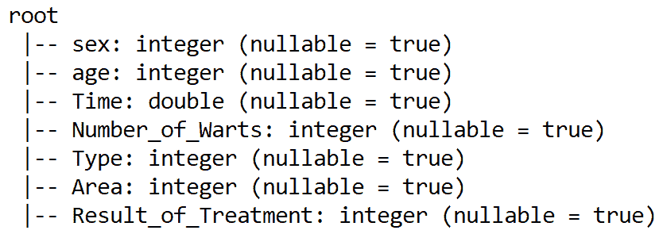

可以使用 `show()` 方法查看数据集的快照。我们可以限制行数；这里，让我们说 `5`：

```py
CryotherapyDF.show(5)
```

上一行代码的输出显示了 DataFrame 的前五个样本：

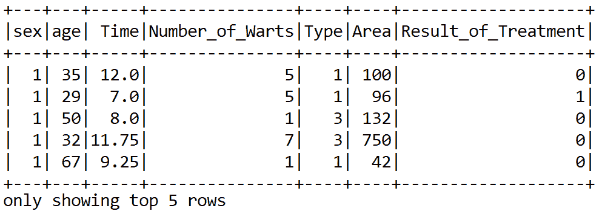

# 预处理和特征工程

根据 UCI 机器学习仓库中的数据集描述，没有空值。此外，基于 Spark ML 的分类器期望模型化时使用数值。好事是，如方案所示，所有必需的字段都是数值（即整数或浮点值）。此外，Spark ML 算法期望有一个`label`列，在我们的案例中是`Result_of_Treatment`。让我们使用 Spark 提供的`withColumnRenamed()`方法将其重命名为`label`：

```py
//Spark ML algorithm expect a 'label' column, which is in our case 'Survived". Let's rename it to 'label'
CryotherapyDF = CryotherapyDF.withColumnRenamed("Result_of_Treatment", "label")
CryotherapyDF.printSchema()
```

所有基于 Spark ML 的分类器都期望包含两个对象的训练数据，称为`label`（我们已经有）和`features`。我们已经看到我们有六个特征。然而，这些特征必须被组装成特征向量。这可以通过使用`VectorAssembler()`方法来完成。它是 Spark ML 库中的一种转换器。但首先我们需要选择除了`label`列之外的所有列：

```py
val selectedCols = Array("sex", "age", "Time", "Number_of_Warts", "Type", "Area")
```

然后我们实例化一个`VectorAssembler()`转换器，并按以下方式转换：

```py
val vectorAssembler = new VectorAssembler()
          .setInputCols(selectedCols)
          .setOutputCol("features")
val numericDF = vectorAssembler.transform(CryotherapyDF)
                    .select("label", "features")
numericDF.show()
```

如预期的那样，前面代码段的最后一行显示了组装好的 DataFrame，其中包含`label`和`features`，这是训练 ML 算法所需的：

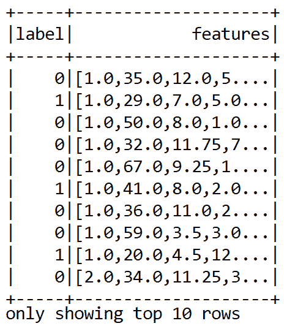

# 准备训练数据和训练分类器

接下来，我们将训练集和测试集分开。假设 80%的训练集将用于训练，其余的 20%将用于评估训练好的模型：

```py
val splits = numericDF.randomSplit(Array(0.8, 0.2))
val trainDF = splits(0)
val testDF = splits(1)
```

通过指定不纯度、最大分箱数和树的深度来实例化一个决策树分类器。此外，我们设置了`label`和`feature`列：

```py
val dt = new DecisionTreeClassifier()
      .setImpurity("gini")
      .setMaxBins(10)
      .setMaxDepth(30)
      .setLabelCol("label")
      .setFeaturesCol("features")
```

现在数据和分类器都准备好了，我们可以进行训练：

```py
val dtModel = dt.fit(trainDF)
```

# 评估模型

由于这是一个二元分类问题，我们需要`BinaryClassificationEvaluator()`估计器来评估模型在测试集上的性能：

```py
val evaluator = new BinaryClassificationEvaluator()
      .setLabelCol("label")
```

现在训练已完成，我们有一个训练好的决策树模型，我们可以在测试集上评估训练好的模型：

```py
val predictionDF = dtModel.transform(testDF)
```

最后，我们计算分类准确率：

```py
val accuracy = evaluator.evaluate(predictionDF)
println("Accuracy =  " + accuracy)    
```

您应该体验到大约 96%的分类准确率：

```py
Accuracy =  0.9675436785432
```

最后，我们通过调用`stop()`方法来停止`SparkSession`：

```py
spark.stop()
```

我们已经通过最少的努力实现了大约 96%的准确率。然而，还有其他性能指标，如精确度、召回率和 F1 度量。我们将在接下来的章节中讨论它们。此外，如果您是机器学习的新手，并且没有完全理解这个示例中的所有步骤，请不要担心。我们将在其他章节中通过各种其他示例回顾所有这些步骤。

# 摘要

在本章中，我们学习了一些机器学习（ML）的基本概念，这些概念用于解决现实生活中的问题。我们从一个对 ML 的简要介绍开始，包括基本的学习工作流程、ML 的经验法则以及不同的学习任务，然后我们逐步涵盖了重要的 ML 任务，如监督学习、无监督学习和强化学习。此外，我们还讨论了基于 Scala 的 ML 库。最后，我们看到了如何通过解决一个简单的分类问题来开始使用 Scala 和 Spark ML 进行机器学习。

现在我们已经了解了基本的 ML 和基于 Scala 的 ML 库，我们可以以更结构化的方式进行学习。在下一章中，我们将学习关于回归分析的技术。然后我们将开发一个预测分析应用程序，使用线性回归和广义线性回归算法来预测交通拥堵。
