# Scala 回归分析

在本章中，我们将详细学习回归分析。我们将从回归分析工作流程开始学习，然后是**线性回归**（**LR**）和**广义线性回归**（**GLR**）算法。然后我们将使用 LR 和 GLR 算法及其在 Scala 中基于 Spark ML 的实现来开发一个预测交通拥堵速度的回归模型。最后，我们将学习使用交叉验证和网格搜索技术进行超参数调整。简而言之，我们将在整个端到端项目中学习以下主题：

+   回归分析概述

+   回归分析算法

+   通过示例学习回归分析

+   线性回归

+   广义线性回归

+   超参数调整和交叉验证

# 技术要求

确保 Scala 2.11.x 和 Java 1.8.x 已安装并配置在您的机器上。

本章的代码文件可以在 GitHub 上找到：

[`github.com/PacktPublishing/Machine-Learning-with-Scala-Quick-Start-Guide/tree/master/Chapter02`](https://github.com/PacktPublishing/Machine-Learning-with-Scala-Quick-Start-Guide/tree/master/Chapter02)

查看以下视频以查看代码的实际应用：

[`bit.ly/2GLlQTl`](http://bit.ly/2GLlQTl)

# 回归分析概述

在上一章中，我们已经对**机器学习**（**ML**）过程有了基本的了解，因为我们已经看到了回归和分类之间的基本区别。回归分析是一组用于估计一组称为因变量的变量与一个或多个自变量之间关系的统计过程。因变量的值取决于自变量的值。

回归分析技术帮助我们理解这种依赖关系，即当任何一个自变量改变时，因变量的值如何变化，而其他自变量保持不变。例如，假设当人们变老时，他们的银行账户中的储蓄会更多。在这里，**储蓄**的金额（比如说以百万美元为单位）取决于年龄（即**年龄**，例如以年为单位）：

| **年龄（年）** | **储蓄（百万美元）** |
| --- | --- |
| 40 | 1.5 |
| 50 | 5.5 |
| 60 | 10.8 |
| 70 | 6.7 |

因此，我们可以在一个二维图中绘制这两个值，其中因变量（**储蓄**）绘制在 *y* 轴上，而自变量（**年龄**）应该绘制在 *x* 轴上。一旦这些数据点被绘制出来，我们就可以看到相关性。如果理论图表确实代表了随着年龄增长对储蓄的影响，那么我们就能说，一个人越老，他们的银行账户中的储蓄就会越多。

现在的问题是，我们如何判断年龄对某人银行账户中获取更多金钱的程度有多大？为了回答这个问题，可以在图表中所有数据点的中间画一条线。这条线被称为回归线，可以使用回归分析算法精确计算。回归分析算法接受离散或连续（或两者）输入特征，并产生连续值。

分类任务用于预测类属性的标签，而回归任务用于对类属性进行数值预测。

使用这样的回归模型对未见过的和新的观察进行预测，就像创建一个由多个组件协同工作的数据管道一样，我们观察到算法的性能分为两个阶段：学习和推理。在整个过程中，为了使预测模型成功，数据在所有机器学习任务中扮演着第一公民的角色。

# 学习

在学习阶段的一个重要任务是准备和转换数据，将其转换为特征向量（每个特征的数值向量）。以特征向量格式训练的数据可以输入到学习算法中，以训练模型，该模型可用于推理。通常，根据数据量的大小，运行算法可能需要数小时（甚至数天），以便特征收敛到一个有用的模型，如下面的图所示：

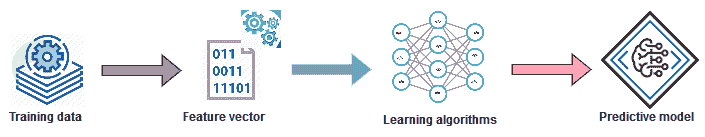

学习和训练预测模型——展示如何从训练数据生成特征向量以训练产生预测模型的算法

# 推理

在推理阶段，训练好的模型被用于智能地使用模型，例如从未见过的数据中进行预测、提供建议和推导未来规则。通常，与学习阶段相比，推理阶段所需时间更少，有时甚至可以实时进行。因此，推理主要是测试模型对新（即未观察到的）数据的性能，并评估模型本身的性能，如下面的图所示：

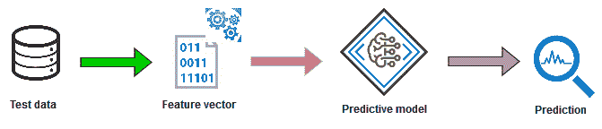

从现有模型进行推理以进行预测分析（从未知数据生成特征向量以进行预测）

总结来说，当使用回归分析时，目标是预测一个连续的目标变量。现在我们知道了如何构建一个监督学习任务的基本工作流程，了解一些可用的回归算法将提供更多具体信息，了解如何应用这些回归算法。

# 回归分析算法

提出了许多算法，可用于回归分析。例如，LR 尝试寻找变量之间的关系和依赖性。它使用线性函数来模型化一个连续的因变量 *y*（即标签或目标）与一个或多个自变量 *x* 之间的关系。回归算法的例子包括以下：

+   **线性回归**（**LR**）

+   **广义线性回归**（**GLR**）

+   **生存回归**（**SR**）

+   **等调回归**（**IR**）

+   **决策树回归器**（**DTR**）

+   **随机森林回归**（**RFR**）

+   **梯度提升树回归**（**GBTR**）

我们首先用最简单的 LR 算法来解释回归，该算法模型化了一个因变量 *y* 与相关变量 *x* 之间的关系，其中 *x* 涉及到相关变量的线性组合：

![img/11963a25-c48f-40da-a3e7-5f14b4f4ff65.png]

在前面的方程中，字母 *β[0]* 和 *β[1]* 分别是 *y*-轴截距和直线的斜率的两个常数。LR 是关于学习一个模型，这个模型是输入示例（数据点）特征的线性组合。

看看下面的图表，想象一下红线不存在。我们有一些蓝色的点（数据点）。我们能否合理地开发一个机器学习（回归）模型来分离大多数点？现在，如果我们在这两类数据之间画一条直线，那些数据几乎被分开了，不是吗？这样的线（在我们的例子中是红色）被称为决策边界，在回归分析的情况下也称为回归线（以下例子中了解更多）：

![img/ed09f3bd-c70c-461d-96d9-ceab36e4465d.png]

如果我们给定一组标记的示例，例如 ![img/4bbeb78b-a1d8-46cf-a394-d26d3489e864.png]，其中 *N* 是数据集中的样本数量，*x[i]* 是样本 *i = 1, 2… N* 的 *D*-维特征向量，而 *y[i]* 是一个实值 *y ∈ R*，其中 *R* 表示所有实数的集合，称为目标变量，每个特征 *x[i]* 是一个实数。然后结合这些，下一步是构建以下数学模型，*f*：

![img/000a67b5-7349-4298-8ca3-3c8e63c0d435.png]

在这里，*w* 是一个 *D*-维参数化向量，而 *b* 是一个实数。符号 *f[w,b]* 表示模型 *f* 由值 *w* 和 *b* 参数化。一旦我们有一个定义良好的模型，现在就可以用它来预测给定 *x* 的未知 *y*，即 *y ← fw,b*。然而，存在一个问题，因为模型由两个不同的值（*w*，*b*）参数化，这意味着当应用于相同的样本时，模型往往会产生两个不同的预测，即使它们来自相同的分布。

严格来说，它可以被称作一个优化问题——其目标是在满足参数最优值（即最小值，例如）的条件下找到最优值 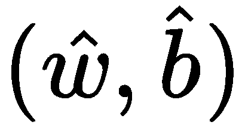 ，这样参数的最优值将意味着模型倾向于做出更准确的预测。简而言之，在 LR 模型中，我们旨在找到 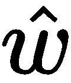 和 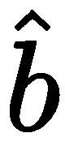 的最优值以最小化以下目标函数：

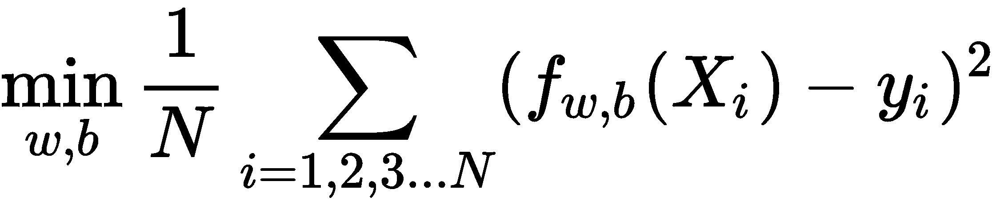

在前面的方程中，表达式 *(f [w,b] (X[i]) - y[i])²* 被称为**损失函数**，它是对于样本*i*给出错误预测的惩罚（即错误或损失）的度量。这个损失函数的形式是平方误差损失。然而，也可以使用其他损失函数，如下面的方程所示：

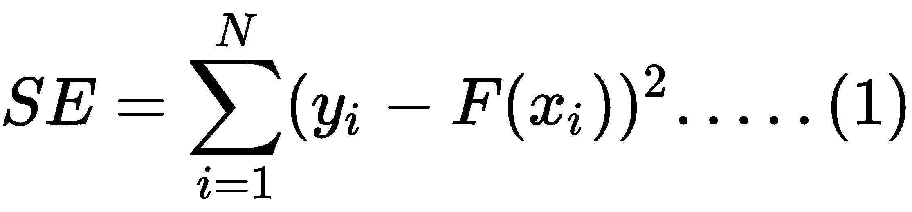 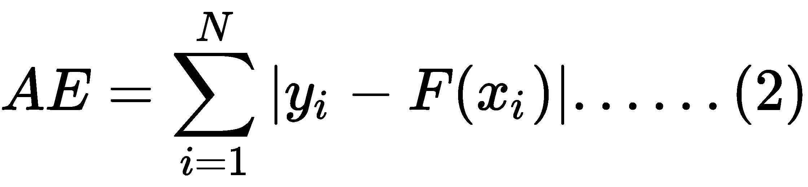

方程 1 中的**平方误差**（**SE**）被称为*L[2]*损失，它是回归分析任务的默认损失函数。另一方面，方程(*2)*中的**绝对误差**（**AE**）被称为*L[1]*损失。

在数据集有许多异常值的情况下，使用*L[1]*损失比*L[2]*更推荐，因为*L[1]*对异常值更鲁棒。

所有基于模型的机器学习算法都与一个损失函数相关联。然后我们尝试通过最小化成本函数来找到最佳模型。在我们的线性回归（LR）案例中，成本函数由平均损失（也称为经验风险）定义，它可以表示为将模型拟合到训练数据（可能包含许多样本）所获得的全部惩罚的平均值。

*图 4*展示了简单线性回归的一个例子。假设我们的想法是预测储蓄额与年龄的关系。因此，在这种情况下，我们有一个自变量*x*（即一组一维数据点和在我们的案例中，**年龄**）和一个因变量*y*（储蓄额，以百万美元计）。一旦我们有一个训练好的回归模型，我们可以使用这条线来预测新未标记输入示例的目标*y[l]*的值，即*x[l]*。然而，在*D*维特征向量（例如，*2D*或*3D*）的情况下，它将是一个平面（对于*2D*）或超平面（对于*>=3D*）：

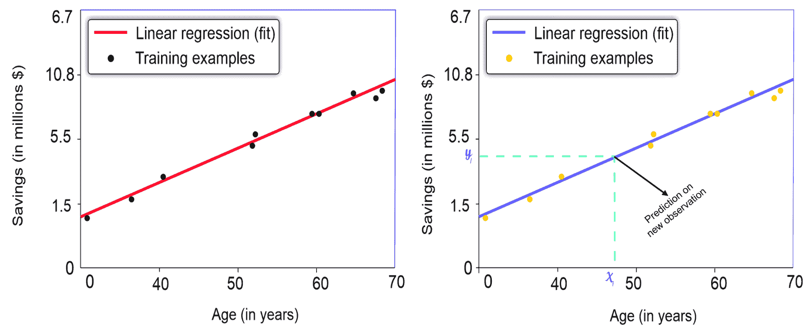

图 4：一条回归线将数据点分开以解决年龄与储蓄额的关系：i) 左侧模型基于训练数据分离数据点；ii) 右侧模型对未知观察值进行预测

现在您可以看到为什么要求回归超平面尽可能靠近训练样本是如此重要：如果 *图 4*（右侧的模型）中的蓝色线远离蓝色点，预测值 *y[l]* 就不太可能是正确的。最佳拟合线，预期将通过大多数数据点，是回归分析的结果。然而，在实践中，由于回归误差的存在，它并不通过所有数据点。

回归误差是任何数据点（实际）与线（预测）之间的距离。

由于解决回归问题本身就是一个优化问题，我们期望尽可能小的误差范围，因为较小的误差有助于提高预测准确性，同时预测未见过的观测值。尽管 LR 算法在许多情况下并不高效，但最好的一点是 LR 模型通常不会过拟合，这对于更复杂的模型来说是不太可能的。

在上一章中，我们讨论了过拟合（一个现象，即模型在训练期间预测得非常好，但在应用于测试集时却犯了更多错误）和欠拟合（如果您的训练误差低而验证误差高，那么您的模型很可能是过拟合了训练数据）。这两种现象通常是由于偏差和方差引起的。

# 性能指标

为了衡量回归模型的预测性能，提出了几个基于回归误差的指标，可以概括如下：

+   **均方误差 (MSE)**: 它是预测值和估计值之间差异的度量，即拟合线与数据点之间的接近程度。MSE 越小，拟合线与数据越接近。

+   **均方根误差 (RMSE)**: 它是 MSE 的平方根，但具有与垂直轴上绘制的数量相同的单位。

+   **R²**: 它是确定系数，用于评估数据与拟合回归线之间的接近程度，范围在 0 到 1 之间。R² 越高，模型与数据的拟合度越好。

+   **平均绝对误差 (MAE)**: 它是连续变量精度的度量，不考虑其方向。MAE 越小，模型与数据的拟合度越好。

现在我们已经了解了回归算法的工作原理以及如何使用几个指标来评估性能，下一个重要的任务是应用这些知识来解决现实生活中的问题。

# 通过示例学习回归分析

在上一节中，我们讨论了一个简单的现实生活中的问题（即**年龄**与**储蓄**）。然而，在实践中，存在许多涉及更多因素和参数（即数据属性）的现实生活问题，在这些问题中也可以应用回归。让我们首先介绍一个现实生活中的问题。想象一下，你住在巴西的圣保罗市，每天由于不可避免的诸如公交车停滞、损坏的卡车、车辆过多、事故受害者、超车、消防车辆、涉及危险货物的意外、电力短缺、火灾和洪水等原因，你宝贵的时间有几小时被浪费了。

现在，为了衡量浪费了多少人工小时，我们可以开发一种自动化的技术，该技术可以预测交通的缓慢程度，这样你就可以避免某些路线，或者至少得到一些粗略的估计，了解你到达城市某个地点需要多长时间。使用机器学习的预测分析应用程序可能是预测这种缓慢程度的首选解决方案。是的，为此我们将使用巴西圣保罗市城市交通行为数据集。在下一节中，我们将使用这个数据集。

# 数据集描述

该数据集从[`archive.ics.uci.edu/ml/datasets/Behavior+of+the+urban+traffic+of+the+city+of+Sao+Paulo+in+Brazil`](https://archive.ics.uci.edu/ml/datasets/Behavior+of+the+urban+traffic+of+the+city+of+Sao+Paulo+in+Brazil)下载。它包含 2009 年 12 月 14 日至 2009 年 12 月 18 日之间巴西圣保罗市城市交通行为记录。该数据集具有以下特征：

+   **小时**：在道路上花费的总小时数

+   **停滞的公交车**：停滞的公交车数量

+   **损坏的卡车**：损坏的卡车数量

+   **车辆过多**：多余的车辆数量

+   **事故受害者**：道路或道路旁的事故受害者数量

+   **碾压**：碾压或超车案例的数量

+   **消防车辆**：消防车和其他车辆的数量

+   **货运事故**：卡车大量运输的货物数量

+   **涉及危险货物的意外**：发生事故的运输散装卡车数量

+   **电力短缺**：受影响地区无电的小时数

+   **火灾**：火灾事件的数量

+   **洪水点**：洪水区域的点数量

+   **施工或危险标志的表现**：显示施工正在进行或存在危险标志的地方数量

+   **有轨电车网络故障**：有轨电车网络中的故障数量

+   **道路上的树木**：道路上或道路旁的树木数量，它们造成障碍

+   **信号灯关闭**：用作信号的机械装置，带有臂、灯光或旗帜的数量

+   **间歇性信号灯**：在一定时间内用作信号的机械装置，带有臂、灯光或旗帜

+   **交通缓慢**：由于上述原因，人们因交通堵塞而花费的平均小时数

最后一个特征是目标列，这是我们想要预测的。由于我使用了这个数据集，我想感谢以下出版物：

Ferreira, R. P., Affonso, C., & Sassi, R. J. (2011, November). Combination of Artificial Intelligence Techniques for Prediction the Behavior of Urban Vehicular Traffic in the City of Sao Paulo. In 10th Brazilian Congress on Computational Intelligence (CBIC) - Fortaleza, Brazil. (pp.1-7), 2011.

# 数据集的探索性分析

首先，我们读取用于**探索性数据分析**（**EDA**）的训练集。读者可以参考`EDA.scala`文件。一旦提取出来，将会有一个名为`Behavior of the urban traffic of the city of Sao Paulo in Brazil.csv`的 CSV 文件。让我们将文件重命名为`UrbanTraffic.csv`。此外，`Slowness in traffic (%)`，即最后一列，以一个不寻常的格式表示缓慢的百分比：它使用逗号（`,`）表示实数，例如`4,1`而不是`4.1`。因此，我将该列中所有逗号（`,`）替换为句号（`.`）。否则，Spark CSV 读取器将把该列视为`String`类型：

```py
val filePath= "data/UrbanTraffic.csv"
```

首先，让我们使用`read.csv()`方法加载、解析并创建一个 DataFrame，但使用 Databricks CSV 格式（也称为`com.databricks.spark.csv`），通过将其设置为读取 CSV 文件的标题，这直接应用于创建的 DataFrame 的列名；并且将`inferSchema`属性设置为`true`，因为如果你没有明确指定`inferSchema`配置，浮点值将被视为字符串*.* 这可能会导致`VectorAssembler`抛出异常，例如`java.lang.IllegalArgumentException: Data type StringType is not supported`：

```py
val rawTrafficDF = spark.read
      .option("header", "true")
      .option("inferSchema", "true")
      .option("delimiter", ";")
      .format("com.databricks.spark.csv")
      .load("data/UrbanTraffic.csv")
      .cache
```

现在让我们打印我们刚刚创建的 DataFrame 的模式，以确保结构得到保留：

```py
rawTrafficDF.printSchema()
```

如以下截图所示，Spark DataFrame 的模式已被正确识别。此外，正如预期的那样，我的机器学习算法的所有特征都是数值的（换句话说，以整数或双精度格式）。

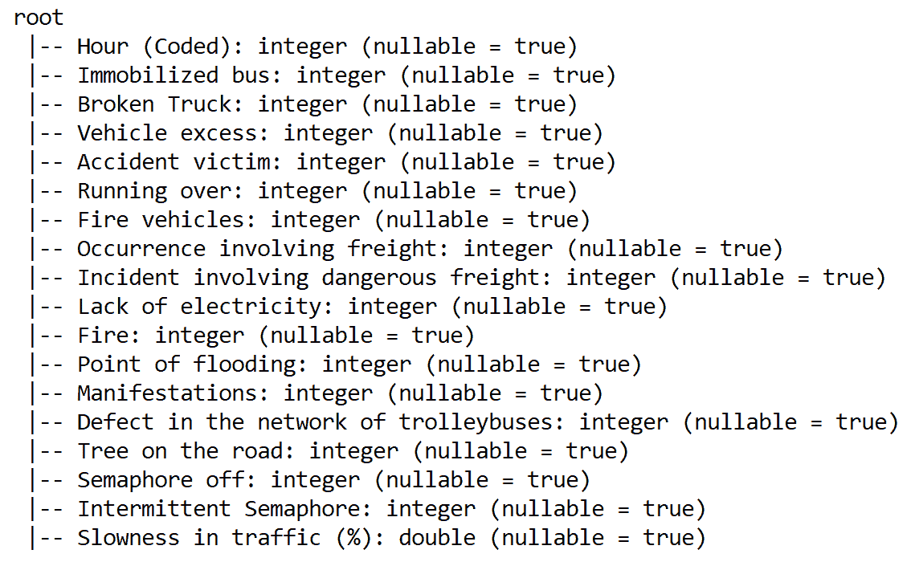

你可以看到，没有任何一列是分类特征。因此，我们不需要任何数值转换。现在让我们使用`count()`方法看看数据集中有多少行：

```py
println(rawTrafficDF.count())
```

这给出了 135 个样本计数**。**现在让我们使用`show()`方法查看数据集的快照，但只选择一些列，以便它更有意义，而不是显示所有列。但请随意使用`rawTrafficDF.show()`来查看所有列：

```py
rawTrafficDF.select("Hour (Coded)", "Immobilized bus", "Broken Truck", 
                    "Vehicle excess", "Fire", "Slowness in traffic (%)").show(5)
```

由于`Slowness in traffic (%)`列包含连续值，我们必须处理回归任务。现在我们已经看到了数据集的快照，查看一些其他统计数据可能也很有价值，例如平均索赔或损失、最小和最大损失，使用 Spark SQL 的`sql()`接口：

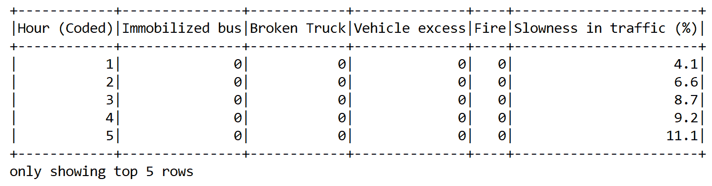

然而，在那之前，让我们将最后一列从`交通中的速度（%）`重命名为`label`，因为 ML 模型会对此提出异议。即使在回归模型上使用了`setLabelCol`之后，它仍然在寻找名为`label`的列。这引入了一个令人讨厌的错误，表示`org.apache.spark.sql.AnalysisException: cannot resolve 'label' given input columns`：

```py
var newTrafficDF = rawTrafficDF.withColumnRenamed("Slowness in traffic (%)", "label")
```

由于我们想要执行一些 SQL 查询，我们需要创建一个临时视图，以便在内存中执行操作：

```py
newTrafficDF.createOrReplaceTempView("slDF")
```

现在让我们以百分比的形式平均速度（与标准小时数的偏差）：

```py
spark.sql("SELECT avg(label) as avgSlowness FROM slDF").show()
```

上一行代码应该在每天的平均情况下在路线和基于其他因素上显示 10%的延迟：

```py

 +------------------+
 | avgSlowness      |
 +------------------+
 |10.051851851851858|
 +------------------+
```

此外，我们还可以看到城市中的洪水点数量。然而，为了做到这一点，我们可能需要一些额外的努力，将列名更改为单个字符串，因为它是一个包含空格的多字符串，所以 SQL 无法解析它：

```py
newTrafficDF = newTrafficDF.withColumnRenamed("Point of flooding", "NoOfFloodPoint")
spark.sql("SELECT max(NoOfFloodPoint) FROM slDF").show()
```

这应该显示多达七个可能非常危险的洪水点：

```py
+-------------------+
|max(NoOfFloodPoint)|
+-------------------+
|                  7|
+-------------------+
```

然而，`describe()`方法将更灵活地提供这些类型的统计信息。让我们为所选列执行此操作：

```py
rawTrafficDF.select("Hour (Coded)", "Immobilized bus", "Broken Truck", 
                    "Point of flooding", "Fire", "Slowness in traffic (%)")
                    .describe().show()
```

因此，我们可以看到速度在`3.4`和`23.4`之间变化，这相当高。这就是为什么我们需要高效的数据处理步骤，以便保留这种关系。现在让我们专注于数据预处理：

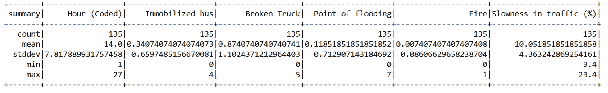

# 特征工程和数据准备

现在我们已经看到了数据集的一些属性，并且由于没有空值或分类特征，我们不需要任何其他预处理或中间转换。我们只需要在我们获得训练和测试集之前做一些特征工程。

在获取这些集合之前的第一步是准备 Spark 回归模型可消费的训练数据。为此，Spark 分类和回归算法期望有两个组件，称为`features`和`label`。幸运的是，我们已经有`label`列。接下来，`features`列必须包含除`label`列之外的所有列的数据，这可以通过使用`VectorAssembler()`转换器来实现。

由于所有列都是数值型的，我们可以直接从 Spark ML 库中使用`VectorAssembler()`将给定的列列表转换为一个单一的向量列。因此，让我们收集所需的列列表。正如你可能已经猜到的，我们将不得不排除`label`列，这可以通过使用标准 Scala 的`dropRight()`方法来完成：

```py
val colNames = newTrafficDF.columns.dropRight(1)    

val assembler = new VectorAssembler()
    .setInputCols(colNames)
    .setOutputCol("features")
```

现在我们有了`VectorAssembler()`估计器，我们现在调用`transform()`方法，该方法将所选列嵌入到单个向量列中：

```py
val assembleDF = assembler.transform(newTrafficDF).select("features", "label")  
assembleDF.show()
```

如预期的那样，上一代码段中的最后一行显示了包含`label`和`features`的组装 DataFrame，这些是训练 ML 算法所需的：

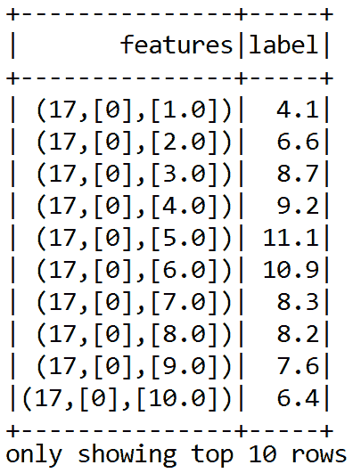

我们现在可以继续生成单独的训练集和测试集。此外，我们可以缓存这两个集合以实现更快的内存访问。我们使用 60%的数据来训练模型，其余的 40%将用于评估模型：

```py
val seed = 12345L
val splits = data.randomSplit(Array(0.60, 0.40), seed)
val (trainingData, validationData) = (splits(0), splits(1))

trainingData.cache // cache in memory for quicker access
validationData.cache // cache in memory for quicker access
```

在开始训练回归模型之前，我们需要做的一切都准备好了。首先，我们开始训练 LR 模型并评估其性能。

# 线性回归

在本节中，我们将开发一个预测分析模型，使用 LR 算法预测数据每一行的交通缓慢情况。首先，我们创建一个 LR 估计器，如下所示：

```py
val lr = new LinearRegression()
     .setFeaturesCol("features")
     .setLabelCol("label")
```

然后我们调用`fit()`方法在训练集上执行训练，如下所示：

```py
println("Building ML regression model")
val lrModel = lr.fit(trainingData)
```

现在我们有了拟合好的模型，这意味着它现在能够进行预测。所以，让我们开始在训练集和验证集上评估模型，并计算 RMSE、MSE、MAE、R 平方等：

```py
println("Evaluating the model on the test set and calculating the regression metrics")
// **********************************************************************
val trainPredictionsAndLabels = lrModel.transform(testData).select("label", "prediction")
                                            .map {case Row(label: Double, prediction: Double) 
                                            => (label, prediction)}.rdd

val testRegressionMetrics = new RegressionMetrics(trainPredictionsAndLabels)    
```

太棒了！我们已经成功计算了训练集和测试集的原始预测结果。现在我们有了训练集和验证集上的性能指标，让我们观察训练集和验证集的结果：

```py
val results = "\n=====================================================================\n" +
      s"TrainingData count: ${trainingData.count}\n" +
      s"TestData count: ${testData.count}\n" +
      "=====================================================================\n" +
      s"TestData MSE = ${testRegressionMetrics.meanSquaredError}\n" +
      s"TestData RMSE = ${testRegressionMetrics.rootMeanSquaredError}\n" +
      s"TestData R-squared = ${testRegressionMetrics.r2}\n" +
      s"TestData MAE = ${testRegressionMetrics.meanAbsoluteError}\n" +
      s"TestData explained variance = ${testRegressionMetrics.explainedVariance}\n" +
      "=====================================================================\n"
println(results)
```

前面的代码段应该显示类似的内容。尽管如此，由于随机性，你可能会得到略微不同的输出：

```py
=====================================================================
 TrainingData count: 80
 TestData count: 55
 =====================================================================
 TestData MSE = 7.904822843038552
 TestData RMSE = 2.8115516788845536
 TestData R-squared = 0.3699441827613118
 TestData MAE = 2.2173672546414536
 TestData explained variance = 20.293395978801147
 =====================================================================
```

然而，现在我们有了测试集上的预测结果，但我们不能直接说它是一个好或最优的回归模型。为了进一步降低 MAE，Spark 还提供了线性回归实现的广义版本，称为 GLR。

# 广义线性回归（GLR）

在线性回归（LR）中，输出被假定为遵循高斯分布。相比之下，在**广义线性模型**（**GLMs**）中，响应变量*Y[i]*遵循来自参数化概率分布集的某种随机分布，这些概率分布具有某种形式。正如我们在前面的例子中所看到的，跟随和创建 GLR 估计器不会很困难：

```py
val glr = new GeneralizedLinearRegression()
      .setFamily("gaussian")//continuous value prediction (or gamma)
      .setLink("identity")//continuous value prediction (or inverse)
      .setFeaturesCol("features")
      .setLabelCol("label")
```

对于基于 GLR 的预测，根据数据类型支持以下响应和身份链接函数（来源：[`spark.apache.org/docs/latest/ml-classification-regression.html#generalized-linear-regression`](https://spark.apache.org/docs/latest/ml-classification-regression.html#generalized-linear-regression)）：

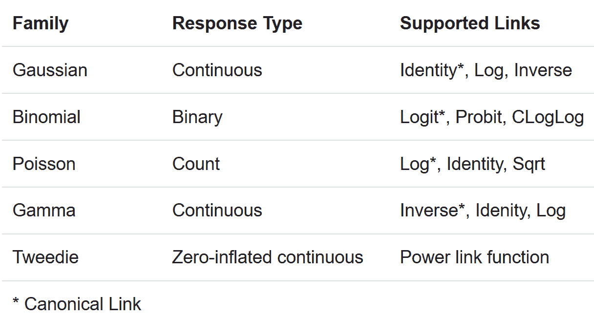

然后我们调用`fit()`方法在训练集上执行训练，如下所示：

```py
println("Building ML regression model")
val glrModel = glr.fit(trainingData)
```

当前通过 Spark 中的`GeneralizedLinearRegression`接口的实现仅支持最多 4,096 个特征。现在我们有了拟合好的模型（这意味着它现在能够进行预测），让我们开始在训练集和验证集上评估模型，并计算 RMSE、MSE、MAE、R 平方等：

```py
// **********************************************************************
println("Evaluating the model on the test set and calculating the regression metrics")
// **********************************************************************
val trainPredictionsAndLabels = glrModel.transform(testData).select("label", "prediction")
                                            .map { case Row(label: Double, prediction: Double) 
                                            => (label, prediction) }.rdd

val testRegressionMetrics = new RegressionMetrics(trainPredictionsAndLabels)
```

太棒了！我们已经成功计算了训练集和测试集的原始预测结果。现在我们有了训练集和测试集上的性能指标，让我们观察训练集和验证集的结果：

```py
val results = "\n=====================================================================\n" +
      s"TrainingData count: ${trainingData.count}\n" +
      s"TestData count: ${testData.count}\n" +
      "=====================================================================\n" +
      s"TestData MSE = ${testRegressionMetrics.meanSquaredError}\n" +
      s"TestData RMSE = ${testRegressionMetrics.rootMeanSquaredError}\n" +
      s"TestData R-squared = ${testRegressionMetrics.r2}\n" +
      s"TestData MAE = ${testRegressionMetrics.meanAbsoluteError}\n" +
      s"TestData explained variance = ${testRegressionMetrics.explainedVariance}\n" +
      "=====================================================================\n"
println(results)
```

前面的代码段应该显示类似的结果。尽管如此，由于随机性，你可能会遇到略微不同的输出：

```py

 =====================================================================
 TrainingData count: 63
 TestData count: 72
 =====================================================================
 TestData MSE = 9.799660597570348
 TestData RMSE = 3.130440958965741
 TestData R-squared = -0.1504361865072692
 TestData MAE = 2.5046175463628546
 TestData explained variance = 19.241059408685135
 =====================================================================
```

使用 GLR，我们可以看到略差的 MAE 值，同时 RMSE 也更高。如果你看到这两个例子，我们还没有调整超参数，而是简单地让模型训练并评估每个参数的单个值。我们甚至可以使用正则化参数来减少过拟合。然而，ML 管道的性能通常随着超参数调整而提高，这通常是通过网格搜索和交叉验证来完成的。在下一节中，我们将讨论如何通过交叉验证模型获得更好的性能。

# 超参数调整和交叉验证

在机器学习中，超参数一词指的是那些不能从常规训练过程中直接学习的参数。这些是你可以在机器学习算法上调整的各种旋钮。超参数通常通过用不同参数组合训练模型，并通过测试决定哪些参数效果最好来决定。最终，提供最佳模型组合的参数将是我们最终的超参数。设置超参数可以对训练模型的性能产生重大影响。

另一方面，交叉验证通常与超参数调整一起使用。交叉验证（也称为旋转估计）是一种模型验证技术，用于评估统计分析的质量和结果。交叉验证有助于描述数据集，在训练阶段使用验证集来测试模型。

# 超参数调整

不幸的是，没有快捷或直接的方法可以根据明确的配方选择正确的超参数组合——当然，经验有所帮助。例如，在训练随机森林、矩阵分解、k-means 或逻辑/LR 算法时，可能需要适当的超参数。以下是一些此类超参数的典型示例：

+   基于树的算法中树的数量、bins 或深度

+   迭代次数

+   正则化值

+   矩阵分解中的潜在因子数量

+   k-means 聚类中的聚类数量等等

从技术上讲，超参数形成一个称为参数网格的*n*-维空间，其中*n*是超参数的数量。这个空间中的每一个点代表一种特定的超参数配置，即超参数向量。

如第一章“使用 Scala 的机器学习入门”中所述，过拟合和欠拟合是机器学习中的两种问题现象。因此，有时不需要完全收敛到最佳模型参数集，甚至可能更倾向于这样做，因为几乎最佳拟合的模型往往在新数据或设置上表现更好。换句话说，如果你关心最佳拟合模型，你实际上并不需要最佳参数集。

实际上，我们无法探索这个空间中的每一个点，因此通常使用网格搜索来搜索该空间的一个子集。以下图表展示了某些高级概念：

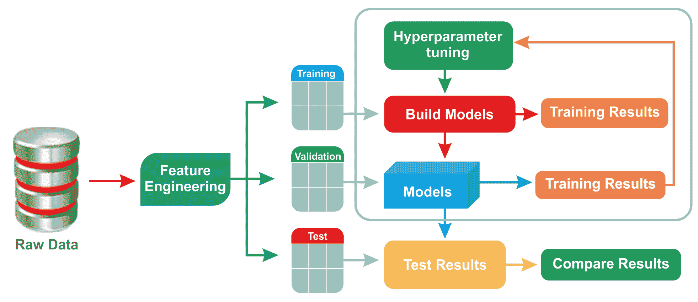

图 5：机器学习模型的超参数调整

虽然有几种这样的方案，但随机搜索或网格搜索可能是最著名的两种技术：

+   **网格搜索**：使用这种方法，在字典中定义了你想测试的不同超参数。然后在将它们输入 ML 模型之前构建一个参数网格，以便可以使用不同的组合进行训练。最后，算法会告诉你哪个超参数组合的准确率最高。

+   **随机搜索**：正如你可以理解的，使用所有可能的超参数组合来训练一个机器学习模型是一个既昂贵又耗时的操作。然而，我们通常没有那么多灵活性，但我们仍然想调整这些参数。在这种情况下，随机搜索可能是一个解决方案。随机搜索通过评估超参数空间中的*n*个均匀随机点来执行，并选择模型性能最佳的组合。

# 交叉验证

有两种交叉验证类型，称为穷举交叉验证，包括留出-p 个样本交叉验证和留出一个样本交叉验证，以及非穷举交叉验证，它基于 K 折交叉验证和重复随机子采样交叉验证，例如，5 折或 10 折交叉验证，非常常见。

在大多数情况下，使用 10 折交叉验证而不是在验证集上进行测试。此外，训练集应该尽可能大（因为具有高质量特征的数据对训练模型有利），不仅是为了训练模型，而且因为大约 5%到 10%的训练集可以用于交叉验证。

使用 K 折交叉验证技术，将完整训练数据分成 K 个子集。模型在 K-1 个子集上训练；保留最后一个用于验证。这个过程重复 K 次，这样每次都使用 K 个子集中的一个作为验证集，其他 K-1 个子集用于形成训练集。这样，每个子集（折）至少被用于训练和验证一次。

最后，通过袋装（或提升）方案将获得的不同的机器学习模型结合在一起，用于分类器或通过平均（即回归）。以下图表解释了 10 折交叉验证技术：

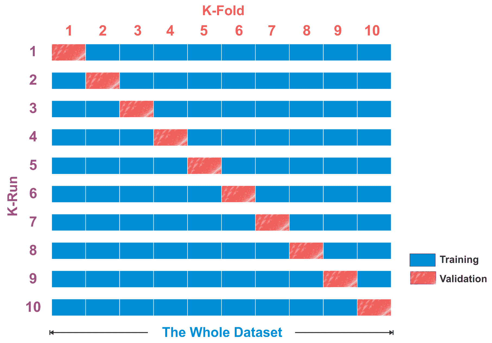

图 6：10 折交叉验证技术

# Spark ML 中的调整和交叉验证

在 Spark ML 中，在进行交叉验证之前，我们需要有一个`paramGrid`（即参数网格）。`ParamGridBuilder`接口用于定义`CrossValidator`必须搜索的超参数空间，最后，`CrossValidator()`函数接受我们的流水线、LR 回归器的超参数空间以及交叉验证的折数作为参数。

因此，让我们通过指定最大迭代次数、正则化参数的值、容忍度的值以及弹性网络参数来开始创建`paramGrid`，如下所示（因为我们观察到对于这个模型 MAE 较低）：

```py
// ***********************************************************
println("Preparing K-fold Cross Validation and Grid Search")
// ***********************************************************
val paramGrid = new ParamGridBuilder()
      .addGrid(lr.maxIter, Array(10, 20, 30, 50, 100, 500, 1000))
      .addGrid(lr.regParam, Array(0.001, 0.01, 0.1))
      .addGrid(lr.tol, Array(0.01, 0.1))
      .build()
```

正则化参数通过减少估计回归参数的方差来减少过拟合。现在，为了获得更好的更稳定的性能，我们可以进行 10 折交叉验证。由于我们的任务是预测连续值，我们需要定义`RegressionEvaluator`，即回归评估器，它期望两个输入列——`prediction`和`label`——并根据 MSE、RMSE、R-squared 和 MAE 评估训练：

```py
println("Preparing 10-fold Cross Validation")
val numFolds = 10 //10-fold cross-validation
val cv = new CrossValidator()
      .setEstimator(lr)
      .setEvaluator(new RegressionEvaluator())
      .setEstimatorParamMaps(paramGrid)
      .setNumFolds(numFolds)
```

太棒了，我们已经创建了交叉验证估计器。现在是时候训练 LR 模型了：

```py
println("Training model with the Linear Regression algorithm")
val cvModel = cv.fit(trainingData)
```

顺便说一句，Spark 提供了一个使用`save()`方法保存训练好的 ML 模型的方法：

```py
// Save the workflow
cvModel.write.overwrite().save("model/LR_model")  
```

然后，可以使用`load()`方法从磁盘恢复相同的模型：

```py
val sameCVModel = LinearRegressionModel.load("model/LR_model")
```

然后，我们像 LR 和 GLR 模型一样在测试集上计算模型的指标：

```py
println("Evaluating the cross validated model on the test set and calculating the regression metrics")
val trainPredictionsAndLabelsCV = cvModel.transform(testData).select("label", "prediction")
                                      .map { case Row(label: Double, prediction: Double)
                                      => (label, prediction) }.rdd

val testRegressionMetricsCV = new RegressionMetrics(trainPredictionsAndLabelsCV)
```

最后，我们收集指标并打印以获得一些见解：

```py
val cvResults = "\n=====================================================================\n" +
      s"TrainingData count: ${trainingData.count}\n" +
      s"TestData count: ${testData.count}\n" +
      "=====================================================================\n" +
      s"TestData MSE = ${testRegressionMetricsCV.meanSquaredError}\n" +
      s"TestData RMSE = ${testRegressionMetricsCV.rootMeanSquaredError}\n" +
      s"TestData R-squared = ${testRegressionMetricsCV.r2}\n" +
      s"TestData MAE = ${testRegressionMetricsCV.meanAbsoluteError}\n" +
      s"TestData explained variance = ${testRegressionMetricsCV.explainedVariance}\n" +
      "=====================================================================\n"
println(cvResults)
```

前面的代码段应该显示类似的内容。尽管如此，由于随机性的存在，你可能会得到略微不同的输出：

```py
 =====================================================================
 TrainingData count: 80
 TestData count: 55
 =====================================================================
 TestData MSE = 7.889401628365509
 TestData RMSE = 2.8088078660466453
 TestData R-squared = 0.3510269588724132
 TestData MAE = 2.2158433237623667
 TestData explained variance = 20.299135214455085
 =====================================================================
```

如我们所见，RMSE 和 MAE 都略低于未进行交叉验证的 LR 模型。理想情况下，我们应该体验到这些指标甚至更低的值。然而，由于训练集和测试集的规模较小，LR 和 GLR 模型可能都出现了过拟合。尽管如此，我们将在第四章，“基于树的集成技术 Scala”，尝试使用稳健的回归分析算法。更具体地说，我们将尝试使用决策树、随机森林和 GBTRs 来解决相同的问题。

# 摘要

在本章中，我们看到了如何使用 LR 和 GLR 算法开发用于分析保险严重索赔的回归模型。我们还看到了如何使用交叉验证和网格搜索技术来提高 GLR 模型的表现，这些技术提供了最佳的超参数组合。最后，我们看到了一些常见问题，以便可以将类似的回归技术应用于解决其他现实生活中的问题。

在下一章中，我们将通过一个名为通过客户流失预测分析流失客户的真实问题来了解另一种监督学习技术，即分类。在 Scala 中，我们将使用几种分类算法来进行预测。客户流失预测对商业至关重要，因为它可以帮助你检测可能取消订阅、产品或服务的客户，通过预测哪些客户可能取消对服务的订阅，还可以最小化客户流失。
