# 第三章：使用 Scala 学习分类

在上一章中，我们看到了如何将分析保险严重索赔的预测模型作为回归分析问题来开发。我们应用了非常简单的线性回归，以及**广义线性回归**（**GLR**）。

在本章中，我们将学习另一个监督学习任务，称为分类。我们将使用广泛使用的算法，如逻辑回归、**朴素贝叶斯**（**NB**）和**支持向量机**（**SVMs**），来分析和预测客户是否可能取消其电信合同的订阅。 

特别是，我们将涵盖以下主题：

+   分类简介

+   通过实际案例学习分类

+   用于流失预测的逻辑回归

+   用于流失预测的支持向量机（SVM）

+   用于预测的 NB

# 技术要求

确保 Scala 2.11.x 和 Java 1.8.x 已安装并配置在您的机器上。

本章的代码文件可以在 GitHub 上找到：

[`github.com/PacktPublishing/Machine-Learning-with-Scala-Quick-Start-Guide/tree/master/Chapter03`](https://github.com/PacktPublishing/Machine-Learning-with-Scala-Quick-Start-Guide/tree/master/Chapter03)

查看以下视频，了解代码的实际应用：

[`bit.ly/2ZKVrxH`](http://bit.ly/2ZKVrxH)

# 分类概述

作为监督学习任务，分类是根据一个或多个独立变量识别哪些观测集（样本）属于哪个集合的问题。这个过程基于包含关于类别或标签成员资格的观测（或实例）的训练集。通常，分类问题是我们训练模型来预测定量（但离散）目标的情况，例如垃圾邮件检测、流失预测、情感分析、癌症类型预测等。

假设我们想要开发一个预测模型，该模型将根据学生的托福和 GRE 能力预测其是否有足够的竞争力被录取到计算机科学专业。此外，假设我们有一些以下范围/格式的历史数据：

+   **托福成绩**：介于 0 到 100 之间

+   **GRE**：介于 0 到 100 之间

+   **录取**：如果录取则为 1，如果不录取则为 0

现在，为了了解我们是否可以使用如此简单的数据来做出预测，让我们创建一个散点图，将所有记录的**录取**和**拒绝**作为因变量，**托福**和**GRE**作为自变量，如下所示：

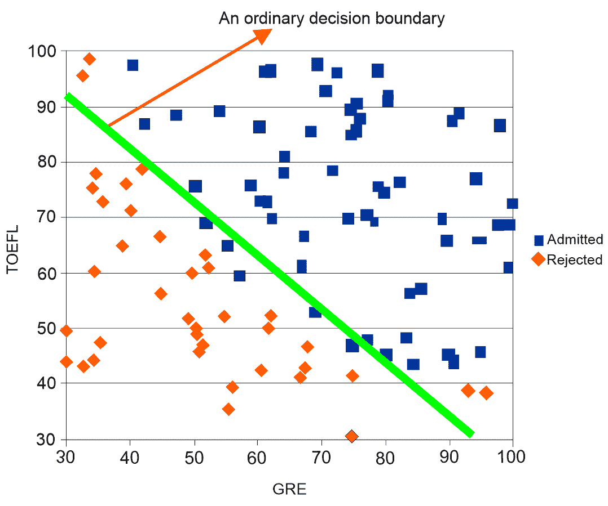

通过观察数据点（想象一下图中没有对角线），我们可以合理地开发一个线性模型来分离大部分数据点。现在，如果我们在这两类数据之间画一条直线，它们几乎就能被分开。这样的线（在我们的例子中是绿色）被称为决策边界。因此，如果决策边界合理地分离了最大数据点，它可以用于对未见数据做出预测，我们也可以说，我们预测的线上方的数据点是合格的，而线下方的学生则不够合格。

尽管这个例子是为了对回归分析有一个基本的入门，但分离数据点并不容易。因此，为了计算在哪里画线来分离如此大量的数据点，我们可以使用逻辑回归或其他分类算法，我们将在接下来的章节中讨论。我们还将看到，画一条普通的直线可能不是正确的选择，因此我们通常不得不画曲线。

如果我们仔细观察与录取相关的数据图，可能一条直线并不是分离每个数据点的最佳方式——曲线会更好，如下面的图表所示：


然而，要得到曲线的决策边界，我们必须不仅改变负责从线性到某些高阶多项式的函数（称为决策边界函数），还要将数据改为二次多项式。

这意味着我们必须将我们的问题建模为一个逻辑回归模型。也就是说，我们需要将数据从 *{GRE, TOEFL**}* 格式转换为二次函数格式， *{GRE, GRE², TOEFL, TOEFL², GRE∗TOEFL**}*. 然而，以手工方式这样做是繁琐的，并且对于大数据集来说将不可行。幸运的是，Spark MLlib 实现了许多用于建模此类问题以及解决其他分类问题的算法，包括以下内容：

+   **逻辑回归**（**LR**）

+   SVM

+   NB

+   **多层感知器**（**MLP**）

+   **决策树**（**DT**）

+   **随机森林**（**RF**）

+   **梯度提升树**（**GBT**）

对于一个分类问题，实际（即真实）标签（即类别）和预测标签（即类别）存在于用于训练或测试分类器的样本中；这可以分配到以下类别之一：

+   **真阳性（TP**）：真实标签为正，且分类器做出的预测也是正

+   **真阴性（TN**）：真实标签为负，且分类器做出的预测也是负

+   **假阳性（FP**）：真实标签为负，但分类器做出的预测为正

+   **假阴性（FN**）：真实标签为正，但分类器做出的预测为负

这些指标（TP、FP、TN 和 FN）是我们之前列出的大多数分类器评估指标的基础。然而，通常用于识别正确预测数量的纯准确率并不是一个好的指标，因此使用其他指标，如精度、召回率、F1 分数、AUC 和 **Matthew 的相关系数**（**MCC**）：

+   *准确率*是指分类器正确预测的样本数（包括正负样本）与总样本数的比例：

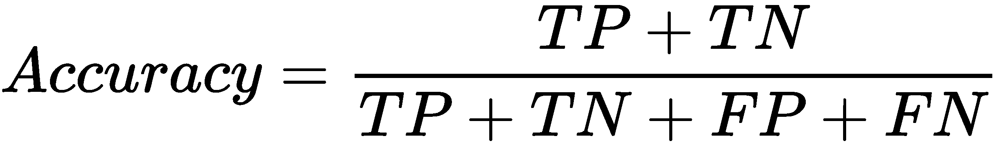

+   *精度*是指属于正类（真阳性）的正确预测样本数除以实际属于正类的总样本数：

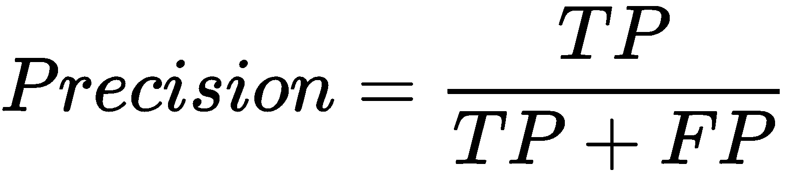

+   *召回率*是指正确预测属于负类的样本数除以实际属于负类的总元素数：

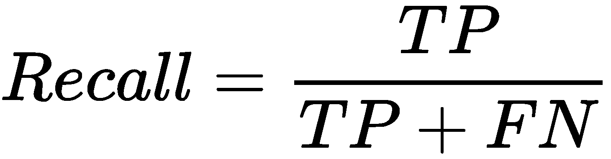

+   F1 分数是精度和召回率的调和平均数。由于 F1 分数是召回率和精度的平衡，它可以被认为是准确率的替代品：

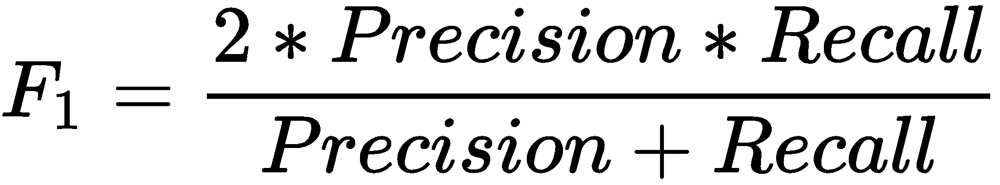

**接收者操作特征**（**ROC**）是通过绘制不同阈值值的 **FPR**（到 *x* 轴）和 **TPR**（到 *y* 轴）而得到的曲线。因此，对于分类器的不同阈值，我们计算 **TPR** 和 **FPR**，绘制 **ROC** 曲线，并计算 **ROC** 曲线下方的面积（也称为 **AUC**）。这可以如下可视化：

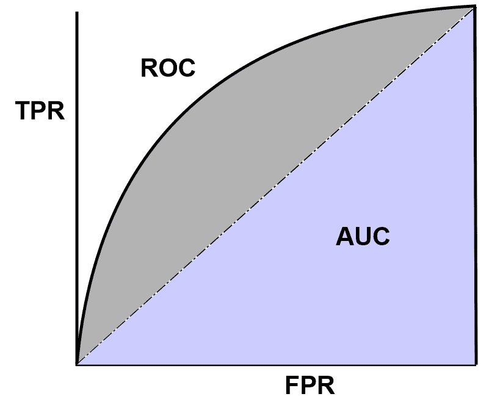

MCC 被视为二元分类器的平衡度量，即使对于具有非常不平衡类别的数据集也是如此：

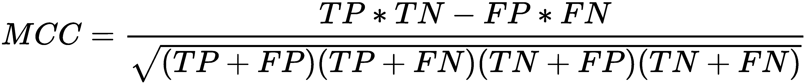

让我们讨论一个更贴近现实生活的分类问题示例，即客户流失分析。客户流失是指任何业务中客户或客户的流失，这正在成为商业不同领域的首要关注点，如银行、互联网服务提供商、保险公司等。客户不满和竞争对手的更好报价是这一现象背后的主要原因。在电信行业，当许多用户转而使用其他服务提供商时，公司不仅会失去那些客户和收入——这也会给其他，常规客户或计划开始使用他们服务的人留下坏印象。

最终，客户流失的全部成本包括失去的收入以及用新客户替换这些客户所涉及的电话营销成本。然而，这类损失可能对一家企业造成巨大损失。还记得诺基亚曾是手机市场的霸主吗？突然之间，苹果发布了 iPhone 3G，这在智能手机时代引发了一场革命。随后，大约有 10%到 12%的客户停止使用诺基亚，转而使用 iPhone。尽管诺基亚后来也尝试发布智能手机，但他们无法与苹果竞争。

简而言之，客户流失预测对商业至关重要，因为它可以帮助你检测那些可能取消订阅、产品或服务的不同类型的客户。简而言之，这个想法是预测现有客户是否会取消现有服务的订阅，即一个二元分类问题。

# 开发客户流失预测模型

如果您首先确定哪些客户可能取消现有服务的订阅，并提供特别优惠或计划给这些客户，那么准确识别流失的可能性可以最小化客户流失。当涉及到员工流失预测和开发预测模型时，这个过程高度依赖数据驱动，可以使用机器学习来理解客户的行为。这是通过分析以下内容来完成的：

+   人口统计数据，如年龄、婚姻状况和就业状况

+   基于社交媒体数据的情感分析

+   使用他们的浏览点击流日志进行行为分析

+   呼叫圈数据和客服中心统计数据

通过以下三个步骤可以开发一个自动化的客户流失分析流程：

1.  首先，确定分析客户流失的典型任务，这将取决于公司政策

1.  然后，收集和分析数据，并开发预测模型

1.  最后，将模型部署到生产就绪的环境中

最终，电信公司能够预测并提升客户体验，防止客户流失，并定制营销活动。在实践中，这种分析将有助于保留那些最有可能离开的客户。这意味着我们不需要担心那些可能留下的客户。

# 数据集描述

我们可以使用 Orange 电信的客户流失数据集来开发预测模型，该模型将预测哪些客户可能希望取消现有服务的订阅。该数据集经过充分研究，内容全面，用于开发小型原型。它包含 churn-80 和 churn-20 数据集，可以从以下链接下载：

+   churn-80: [`bml-data.s3.amazonaws.com/churn-bigml-80.csv`](https://bml-data.s3.amazonaws.com/churn-bigml-80.csv)

+   churn-20: [`bml-data.s3.amazonaws.com/churn-bigml-20.csv`](https://bml-data.s3.amazonaws.com/churn-bigml-20.csv)

由于这两个数据集都来自具有相同结构的同一分布，我们将使用 churn-80 数据集进行训练和 10 折交叉验证。然后，将使用 churn-20 评估训练好的模型。这两个数据集具有相似的结构，因此具有以下模式：

+   **州**: `字符串`

+   **账户长度**: `整数`

+   **区号**: `整数`

+   **国际计划**: `字符串`

+   **语音邮件计划**: `字符串`

+   **电子邮件消息数量**: `整数`

+   **总白天分钟数**: `双精度浮点数`

+   **总白天通话次数**: `整数`

+   **总白天费用**: `双精度浮点数`

+   **总晚上分钟数**: `双精度浮点数`

+   **总晚上通话次数**: `整数`

+   **总晚上费用**: `双精度浮点数`

+   **总夜间分钟数**: `双精度浮点数`

+   **总夜间通话次数**: `整数`

+   **总夜间费用**: `双精度浮点数`

+   **总国际分钟数**: `双精度浮点数`

+   **总国际通话次数**: `整数`

+   **总国际费用**: `双倍`

+   **客户服务电话次数**: `整数`

# 探索性分析和特征工程

首先，在将数据作为 Spark DataFrame 加载之前，我们指定完全相同的模式（即自定义模式），如下所示：

```py
val schema = StructType(Array(
    StructField("state_code", StringType, true),
    StructField("account_length", IntegerType, true),
    StructField("area_code", StringType, true),
    StructField("international_plan", StringType, true),
    StructField("voice_mail_plan", StringType, true),
    StructField("num_voice_mail", DoubleType, true),
    StructField("total_day_mins", DoubleType, true),
    StructField("total_day_calls", DoubleType, true),
    StructField("total_day_charge", DoubleType, true),
    StructField("total_evening_mins", DoubleType, true),
    StructField("total_evening_calls", DoubleType, true),
    StructField("total_evening_charge", DoubleType, true),
    StructField("total_night_mins", DoubleType, true),
    StructField("total_night_calls", DoubleType, true),
    StructField("total_night_charge", DoubleType, true),
    StructField("total_international_mins", DoubleType, true),
    StructField("total_international_calls", DoubleType, true),
    StructField("total_international_charge", DoubleType, true),
    StructField("total_international_num_calls", DoubleType, true),
    StructField("churn", StringType, true)))
```

然后，我们必须创建一个包含所有指定字段的 Scala case class，并使前面的模式（变量名称是自解释的）对齐：

```py
case class CustomerAccount(state_code: String, account_length: Integer, area_code: String, 
                 international_plan: String, voice_mail_plan: String, num_voice_mail: Double, 
                 total_day_mins: Double, total_day_calls: Double, total_day_charge: Double, 
                 total_evening_mins: Double, total_evening_calls: Double, total_evening_charge: Double, 
                 total_night_mins: Double, total_night_calls: Double, total_night_charge: Double,  
                 total_international_mins: Double, total_international_calls: Double, 
                 total_international_charge: Double, total_international_num_calls: Double, churn: String)
```

让我们创建一个 Spark 会话并导入`implicit._`包，它允许我们指定 DataFrame 操作，如下所示：

```py
import spark.implicits._
```

现在，让我们创建训练集。我们使用 Spark 推荐的格式`com.databricks.spark.csv`读取 CSV 文件。我们不需要任何显式的模式推断；因此，我们将`inferSchema`设置为`false`，但使用我们之前创建的自己的模式。然后，我们从我们希望的位置加载数据文件，并最终指定我们的数据源，以便我们的 DataFrame 看起来与我们指定的完全相同：

```py
val trainSet: Dataset[CustomerAccount] = spark.read.
    option("inferSchema", "false")
    .format("com.databricks.spark.csv")
    .schema(schema)
    .load("data/churn-bigml-80.csv")
    .as[CustomerAccount]
trainSet.printSchema()
```

如以下截图所示，Spark DataFrame 的模式已被正确识别。然而，一些特征是非数字的，而是分类的。然而，正如机器学习算法所期望的，所有特征都必须是数字的（即，`整数`或`双精度浮点数`格式）：

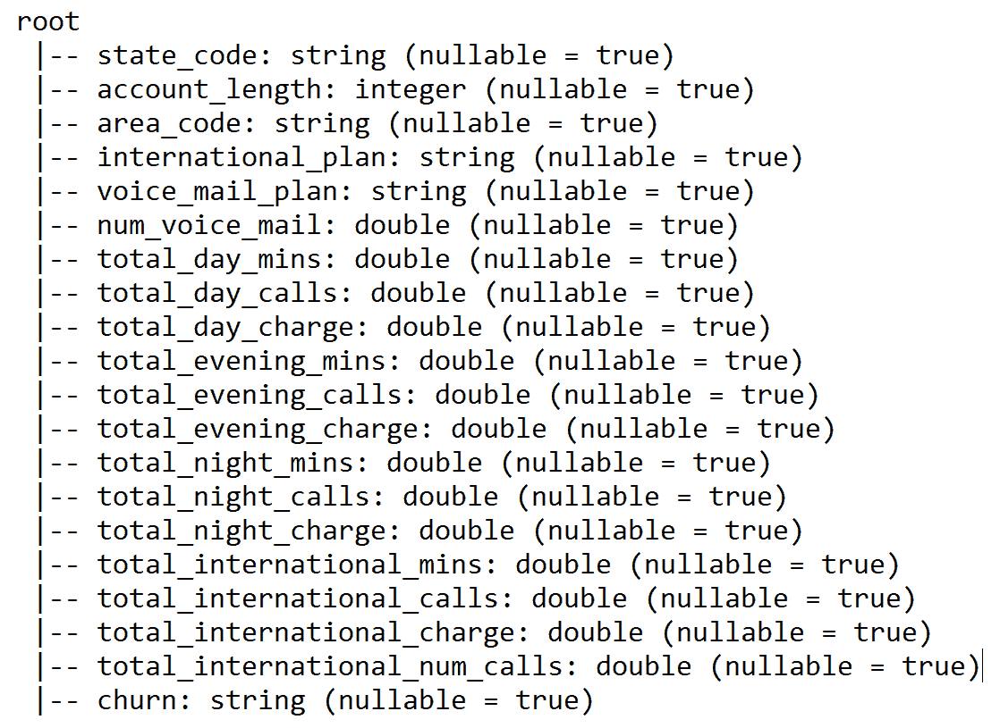

太棒了！它看起来与数据结构完全相同。现在，让我们使用`show()`方法查看一些样本数据，如下所示：

```py
trainSet.show()
```

前一行代码的输出显示了 DataFrame 的前 20 个样本：

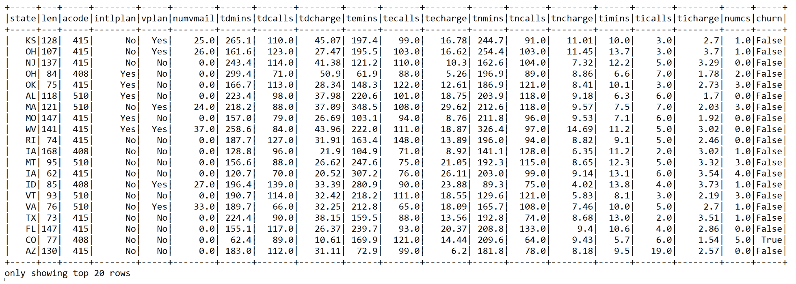

在前面的截图中，为了提高可见性，列名被缩短了。我们还可以通过使用`describe()`方法查看训练集的相关统计信息：

```py
val statsDF = trainSet.describe()  
statsDF.show()
```

以下摘要统计不仅让我们对数据的分布有了些了解，包括均值和标准差，还提供了一些描述性统计，如 DataFrame 中每个特征的样本数（即计数）、最小值和最大值：

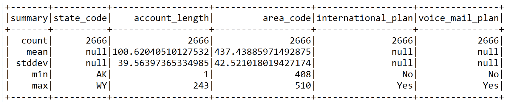

如果这个数据集可以适应 RAM，我们可以使用 Spark 的`cache()`方法将其缓存，以便快速和重复访问：

```py
trainSet.cache()
```

让我们看看一些有用的属性，例如变量与`churn`的相关性。例如，让我们看看`churn`与总国际通话次数之间的关系：

```py
trainSet.groupBy("churn").sum("total_international_num_calls").show()
```

如以下输出所示，通话更多国际电话的客户不太可能（即，`False`）更换运营商：

```py
+-----+----------------------------------+
 |churn|sum(total_international_num_calls)|
 +-----+----------------------------------+
 |False|                            3310.0|
 |True |                             856.0|
 +-----+----------------------------------+
```

让我们看看`churn`与总国际通话费用之间的关系：

```py
trainSet.groupBy("churn").sum("total_international_charge").show()
```

如以下输出所示，通话更多国际电话的客户（如前所述）被收取更多费用，但仍然不太可能（即，`False`）更换运营商：

```py
 +-----+-------------------------------+
 |churn|sum(total_international_charge)|
 +-----+-------------------------------+
 |False|              6236.499999999996|
 | True|                        1133.63|
 +-----+-------------------------------+
```

现在我们还需要准备测试集来评估模型，让我们准备与训练集相似的相同集，如下所示：

```py
val testSet: Dataset[CustomerAccount] = spark.read
      .option("inferSchema", "false")
      .format("com.databricks.spark.csv")
      .schema(schema)
      .load("data/churn-bigml-20.csv")
      .as[CustomerAccount]
```

现在，让我们将它们缓存起来，以便更快地进行进一步的操作：

```py
testSet.cache()
```

让我们看看一些与训练集相关的属性，以了解它是否适合我们的目的。首先，让我们为这个会话创建一个临时视图以进行持久化。尽管如此，我们可以创建一个目录作为接口，用于创建、删除、修改或查询底层数据库、表、函数等：

```py
trainSet.createOrReplaceTempView("UserAccount") 
spark.catalog.cacheTable("UserAccount")
```

我们现在可以按`churn`标签对数据进行分组，并计算每个组中的实例数量，如下所示：

```py
trainSet.groupBy("churn").count.show()
```

前一行应该显示只有`388`名客户可能更换到另一个运营商。然而，`2278`名客户仍然将当前运营商作为他们首选的运营商：

```py
 +-----+-----+
 |churn|count|
 +-----+-----+
 |False| 2278|
 | True| 388 |
 +-----+-----+
```

因此，我们有大约七倍的`False` churn 样本比`True` churn 样本。由于目标是保留最有可能离开的客户，我们将准备我们的训练集，以确保预测机器学习模型对`True` churn 样本敏感。

此外，由于训练集高度不平衡，我们应该将`False` churn 类别下采样到 388/2278 的分数，这给我们`0.1675`：

```py
val fractions = Map("False" -> 0.1675, "True" -> 1.0)
```

这样，我们也在映射仅包含`True` churn 样本。现在，让我们创建一个新的 DataFrame，用于训练集，只包含使用`sampleBy()`方法从下采样中提取的样本：

```py
val churnDF = trainSet.stat.sampleBy("churn", fractions, 12345L)
```

第三个参数是用于可重复性的种子。让我们看看这个：

```py
churnDF.groupBy("churn").count.show()
```

现在，我们可以看到类别几乎平衡：

```py
 +-----+-----+
 |churn|count|
 +-----+-----+
 |False|  390|
 | True|  388|
 +-----+-----+
```

现在，让我们看看这些变量是如何相互关联的。让我们看看白天、晚上、傍晚和国际语音通话是如何对`churn`类别做出贡献的：

```py
spark.sql()("SELECT churn, SUM(total_day_charge) as TDC, 
                                    SUM(total_evening_charge) as TEC, SUM(total_night_charge) as TNC, 
                                    SUM(total_international_charge) as TIC, 
                                    SUM(total_day_charge) + SUM(total_evening_charge) +  
                                    SUM(total_night_charge) + SUM(total_international_charge) 
                    as Total_charge FROM UserAccount GROUP BY churn 
                    ORDER BY Total_charge DESC").show()
```

然而，这并没有给出任何明显的相关性，因为可能留下的客户比想要离开的其他客户在白天、晚上、傍晚和国际语音通话上通话更多：

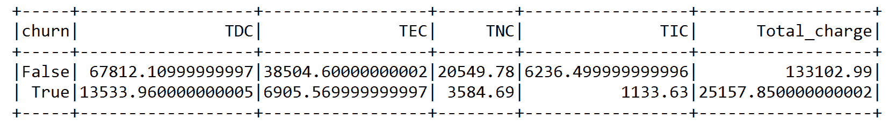

现在，让我们看看白天、晚上、傍晚和国际语音通话的通话分钟数是如何对`churn`类别的`Total_charge`做出贡献的：

```py
spark.sql()("SELECT churn, SUM(total_day_mins) + 
                    SUM(total_evening_mins) + 
                    SUM(total_night_mins) + 
                    SUM(total_international_mins) as Total_minutes 
                    FROM UserAccount GROUP BY churn")
                .show()
```

从前面的两个表中可以看出，总日分钟数和总日费用是这个训练集中高度相关的特征，这对我们的 ML 模型训练没有好处。因此，最好完全删除它们。让我们删除每对相关字段中的一列，以及`state_code`和`area_code`列，因为那些将不会被使用：

```py
val trainDF = churnDF
    .drop("state_code")
    .drop("area_code")
    .drop("voice_mail_plan")
    .drop("total_day_charge")
    .drop("total_evening_charge")
```

极好！最后，我们有了我们的训练 DataFrame，它可以用于更好的预测建模。让我们看看结果 DataFrame 的一些列：

```py
trainDF.select("account_length", "international_plan", "num_voice_mail", 
                "total_day_calls","total_international_num_calls", "churn")
             .show(10)
```

然而，我们还没有完成——当前的 DataFrame 不能直接输入到模型中。这被称为估算器。正如我们之前所描述的，我们的数据需要转换为 Spark DataFrame 格式，包括标签（在`Double`中）和特征（在`Vector`中）：

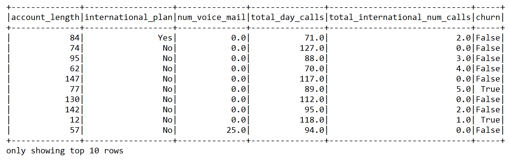

现在，我们需要创建一个管道，通过链式连接多个转换器和估算器来传递数据。然后，该管道作为一个特征提取器工作。更具体地说，我们已经准备了两个`StringIndexer`转换器和一个`VectorAssembler`。

第一个`StringIndexer`将`String`分类特征`international_plan`和标签转换为数字索引。第二个`StringIndexer`将分类标签（即`churn`）转换为数值格式。这样，通过索引分类特征，允许决策树和随机森林等分类器适当地处理分类特征，从而提高性能：

```py
val ipindexer = new StringIndexer()
      .setInputCol("international_plan")
      .setOutputCol("iplanIndex")

val labelindexer = new StringIndexer()
      .setInputCol("churn")
      .setOutputCol("label")
```

现在，我们需要提取对分类有贡献的最重要特征。由于我们已经删除了一些列，结果列集包括以下字段：

+   标签 → 活跃度：`True` 或 `False`

+   特征 → `{`账户时长`，`iplanIndex`，`num_voice_mail`，`total_day_mins`，`total_day_calls`，`total_evening_mins`，`total_evening_calls`，`total_night_mins`，`total_night_calls`，`total_international_mins`，`total_international_calls`，`total_international_num_calls`}`

由于我们已经在`StringIndexer`的帮助下将分类标签转换为数值，下一个任务是提取特征：

```py
val featureCols = Array("account_length", "iplanIndex", "num_voice_mail", 
                        "total_day_mins", "total_day_calls", "total_evening_mins", 
                        "total_evening_calls", "total_night_mins", "total_night_calls", 
                        "total_international_mins", "total_international_calls", 
                        "total_international_num_calls")
```

现在，让我们使用`VectorAssembler()`将特征转换为特征向量，它接受所有的`featureCols`并将它们组合/转换成一个名为`features`的单列：

```py
val assembler = new VectorAssembler()
      .setInputCols(featureCols)
      .setOutputCol("features")
```

现在我们已经有了真实的训练集，其中包含准备好的标签和特征向量，接下来的任务是创建一个估算器——管道的第三个元素。我们将从一个非常简单但强大的 LR 分类器开始。

# 活跃度预测的 LR

LR 是一种分类算法，它预测二元响应。它与我们在第二章中描述的线性回归类似，即*Scala for Regression Analysis*，但它不预测连续值——它预测离散类别。损失函数是 sigmoid 函数（或逻辑函数）：

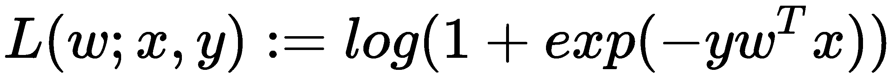

与线性回归类似，成本函数背后的直觉是惩罚那些实际响应与预测响应之间误差大的模型：

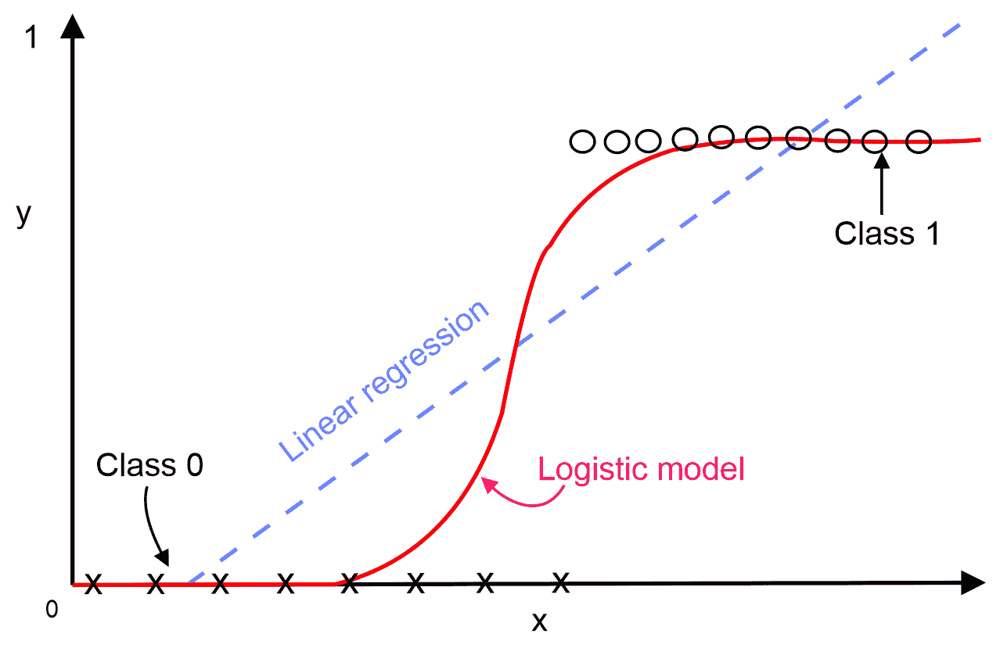

对于给定的新的数据点**x**，LR 模型使用以下方程进行预测：

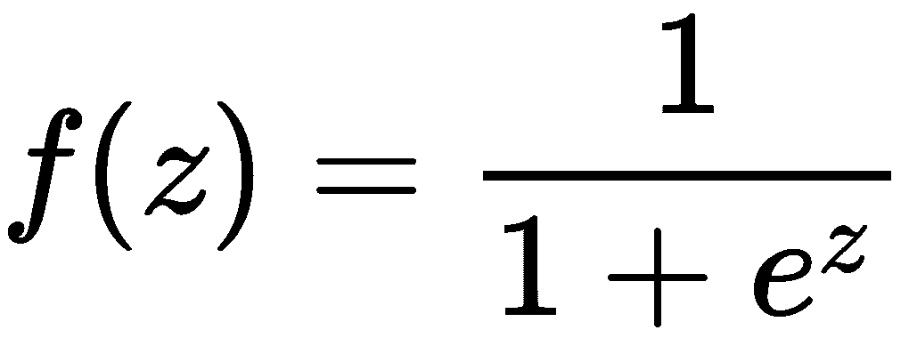

在前面的方程中，对回归应用了逻辑函数以得到它属于任一类的概率，其中*z = w^T x*，如果*f(w^T x) > 0.5*，结果为正；否则为负。这意味着分类线的阈值被假定为*0.5*。

现在我们知道了 LR 算法是如何工作的，让我们开始使用基于 Spark ML 的 LR 估计器开发，这将预测客户是否可能发生流失。首先，我们需要定义一些超参数来训练基于 LR 的流水线：

```py
val numFolds = 10
val MaxIter: Seq[Int] = Seq(100)
val RegParam: Seq[Double] = Seq(1.0) // L2 regularization param set 1.0 with L1 reg. to reduce overfitting
val Tol: Seq[Double] = Seq(1e-8)// for convergence tolerance for iterative algorithms
val ElasticNetParam: Seq[Double] = Seq(0.0001) //Combination of L1 & L2
```

`RegParam`是一个标量，帮助我们调整约束的强度：小值表示软边界，而大值表示硬边界。`Tol`参数用于迭代算法（如 LR 或线性 SVM）的收敛容差。一旦我们定义并初始化了超参数，我们的下一个任务就是实例化一个 LR 估计器，如下所示：

```py
val lr = new LogisticRegression()
         .setLabelCol("label")
         .setFeaturesCol("features")
```

现在，让我们使用`Pipeline()`方法构建一个流水线估计器，将三个转换器（`ipindexer`、`labelindexer`和`assembler`向量）和 LR 估计器（即`lr`）链接到一个单一的流水线中——即它们各自作为一个阶段：

```py
val pipeline = new Pipeline()
            .setStages(Array(PipelineConstruction.ipindexer,
                  PipelineConstruction.labelindexer,
                        PipelineConstruction.assembler, lr))
```

Spark ML 流水线可以包含以下组件：

+   **DataFrame**：用于存储原始数据和中间转换后的数据。

+   **Transformer**：用于通过添加额外的特征列将一个 DataFrame 转换为另一个 DataFrame。

+   **Estimator**：估计器是一个 ML 模型，例如线性回归。

+   **Pipeline**：用于将前面的组件、DataFrame、转换器和估计器链接在一起。

+   **Parameter**：ML 算法有许多可调整的旋钮。这些被称为超参数，而 ML 算法学习以适应数据的值被称为参数。

为了在超参数空间上执行此类网格搜索，我们首先需要定义它。在这里，Scala 的函数式编程特性非常有用，因为我们只需将函数指针和相应的参数添加到参数网格中。在这里，交叉验证评估器将搜索 LR 的最大迭代次数、正则化参数、容差和弹性网络以找到最佳模型：

```py
val paramGrid = new ParamGridBuilder()
      .addGrid(lr.maxIter, MaxIter)
      .addGrid(lr.regParam, RegParam)
      .addGrid(lr.tol, Tol)
      .addGrid(lr.elasticNetParam, ElasticNetParam)
      .build()
```

注意，超参数形成一个*n*-维空间，其中*n*是超参数的数量。这个空间中的每一个点代表一个特定的超参数配置，即一个超参数向量。当然，我们无法探索这个空间中的每一个点，所以我们基本上是在这个空间的一个（理想情况下均匀分布的）子集上进行网格搜索。然后我们需要定义一个`BinaryClassificationEvaluator`评估器，因为这是一个二元分类问题：

```py
val evaluator = new BinaryClassificationEvaluator()
                  .setLabelCol("label")
                  .setRawPredictionCol("prediction")
```

我们通过使用`ParamGridBuilder`来迭代 LR 的最大迭代次数、回归参数、容差和弹性网络参数，并通过 10 折交叉验证来使用`CrossValidator`：

```py
val crossval = new CrossValidator()
      .setEstimator(pipeline)
      .setEvaluator(evaluator)
      .setEstimatorParamMaps(paramGrid)
      .setNumFolds(numFolds)
```

前面的代码旨在执行交叉验证。验证器本身使用`BinaryClassificationEvaluator`估计器在每一折的渐进网格空间上评估训练，并确保不会发生过度拟合。

虽然幕后有很多事情在进行，但我们的`CrossValidator`对象接口仍然保持简洁且广为人知，因为`CrossValidator`也扩展了估计器并支持`fit`方法。这意味着在调用`fit`方法后，包括所有特征预处理和 LR 分类器在内的完整预定义管道将被多次执行——每次使用不同的超参数向量：

```py
val cvModel = crossval.fit(Preprocessing.trainDF)
```

现在，是时候使用测试数据集评估 LR 模型了。首先，我们需要转换测试集，类似于我们之前描述的训练集：

```py
val predDF= cvModel.transform(Preprocessing.testSet)
val result = predDF.select("label", "prediction", "probability")
val resutDF = result.withColumnRenamed("prediction", "Predicted_label")
resutDF.show(10)
```

前面的代码块显示了模型生成的`Predicted_label`和原始`probability`，此外还显示了实际标签。正如我们所见，对于某些实例，模型预测正确，但对于其他实例，它却感到困惑：

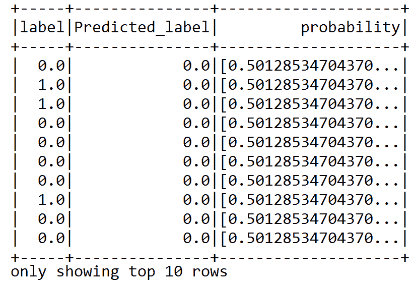

预测概率也可以非常有用，可以根据客户的不完美可能性对客户进行排名。这样，在电信业务中，可以有限地利用资源，专注于最有价值的客户。然而，通过查看前面的预测 DataFrame，很难猜测分类准确率。然而，在第二步中，评估器使用`BinaryClassificationEvaluator`进行自我评估，如下所示：

```py
val accuracy = evaluator.evaluate(predDF)
println("Classification accuracy: " + accuracy)
```

这应该显示我们的二元分类模型的约 77%分类准确率：

```py
Classification accuracy: 0.7679333824070667
```

我们计算另一个性能指标，称为精确率-召回率曲线下的面积和 ROC 曲线下的面积。为此，我们可以构建一个包含测试集上原始得分的 RDD：

```py
val predictionAndLabels = predDF
      .select("prediction", "label")
      .rdd.map(x => (x(0).asInstanceOf[Double], x(1)
      .asInstanceOf[Double]))
```

现在，前面的 RDD 可以用来计算上述性能指标：

```py
val metrics = new BinaryClassificationMetrics(predictionAndLabels)
println("Area under the precision-recall curve: " + metrics.areaUnderPR)
println("Area under the receiver operating characteristic (ROC) curve : " + metrics.areaUnderROC)
```

在这种情况下，评估结果显示 77%的准确率，但只有 58%的精确率：

```py
Area under the precision-recall curve: 0.5770932703444629
Area under the receiver operating characteristic (ROC) curve: 0.7679333824070667
```

在下面的代码中，我们正在计算更多的指标。假阳性和假阴性预测对于评估模型性能也是有用的。然后，我们将结果打印出来以查看指标，如下所示：

```py
val tVSpDF = predDF.select("label", "prediction") // True vs predicted labels
val TC = predDF.count() //Total count

val tp = tVSpDF.filter($"prediction" === 0.0)
            .filter($"label" === $"prediction")
            .count() / TC.toDouble

val tn = tVSpDF.filter($"prediction" === 1.0)
            .filter($"label" === $"prediction")
            .count() / TC.toDouble

val fp = tVSpDF.filter($"prediction" === 1.0)
            .filter(not($"label" === $"prediction"))
            .count() / TC.toDouble
val fn = tVSpDF.filter($"prediction" === 0.0)
            .filter(not($"label" === $"prediction"))
            .count() / TC.toDouble

println("True positive rate: " + tp *100 + "%")
println("False positive rate: " + fp * 100 + "%")
println("True negative rate: " + tn * 100 + "%")
println("False negative rate: " + fn * 100 + "%")
```

上述代码段显示了真正例、假正例、真负例和假负例的比率，我们将使用这些比率来计算后续的 MCC 分数：

```py
True positive rate: 66.71664167916042%
False positive rate: 19.04047976011994%
True negative rate: 10.944527736131935%
False negative rate: 3.2983508245877062%
```

最后，我们也计算了 MCC 分数，如下所示：

```py
val MCC = (tp * tn - fp * fn) / math.sqrt((tp + fp) * (tp + fn) * (fp + tn) * (tn + fn))
println("Matthews correlation coefficient: " + MCC)
```

上述行给出了马修斯相关系数为 `0.41676531680973805`。这是一个正值，表明我们的模型具有一定的鲁棒性。然而，我们还没有获得良好的准确率，所以让我们继续尝试其他分类器，例如 NB。这次，我们将使用 Apache Spark ML 包中的线性 NB 实现。

# NB 用于客户流失预测

NB 分类器基于贝叶斯定理，具有以下假设：

+   每对特征之间的独立性

+   特征值是非负的，例如计数

例如，如果癌症与年龄有关，这可以用来评估患者可能患有癌症的概率*.* 贝叶斯定理可以用以下数学公式表示：

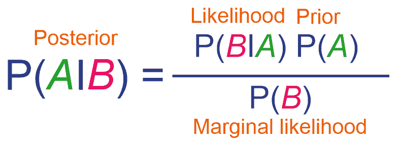

在此方程中，*A* 和 *B* 是具有 *P (B) ≠ 0* 的事件。其他项可以描述如下：

+   *P* (*A* | *B*) 被称为在 *B* 为真的条件下观察事件 *A* 的后验概率或条件概率

+   *P* (*B*| *A*) 是在 *A* 为真的条件下事件 *B* 发生的可能性

+   *P(A)* 是先验，*P(B)* 是先验概率，也称为边缘似然或边缘概率

高斯 NB 是 NB 的一个推广版本，用于分类，它基于数据的二项分布。例如，我们的客户流失预测问题可以表述如下：


以下列表可以用来解决我们的问题如下：

+   *P(class|data)* 是使用独立变量 (*data*) 建模预测 *class* 的后验概率

+   *P(data|class)* 是给定 *class* 的预测因子似然或概率

+   *P(class)* 是 *class* 的先验概率和预测因子的 *P(data)* 或边缘似然

众所周知的哈佛幸福研究显示，只有 10% 的快乐人是富人。虽然你可能认为这个统计数据非常有说服力，但你可能对真正快乐的人中富人的百分比也感兴趣。贝叶斯定理帮助你通过使用两个额外的线索来计算这个保留统计：

+   总体中快乐的人的百分比—that is, *P(A)*

+   总体中富有的人的百分比—that is, *P(B)*

贝叶斯定理背后的关键思想是通过考虑整体比率来反转统计。假设以下信息是可用的先验信息：

+   40% 的人感到快乐 => *P(A)*

+   5% 的人是富人 => *P(B)*

现在，让我们假设哈佛研究是正确的—that is, *P(B|A) = 10%*。既然我们知道快乐的人中富有的比例， *P(A|B)* 可以计算如下：

*P(A|B) = {P(A)* P(B|A)} / P(B) = (40%*10%)/5% = 80%*

因此，大多数人也是快乐的！太好了。为了使这一点更清晰，让我们假设整个世界的人口为 5,000，为了简单起见。根据我们的计算，存在两个事实：

+   **事实 1**：这告诉我们有 500 人感到快乐，哈佛的研究告诉我们其中 50 个快乐的人也是富有的

+   **事实 2**：总共有 60 个富人，因此其中快乐的人的比例是 50/60 ~ 83%

这证明了贝叶斯定理及其有效性。要使用 NB，我们需要实例化一个 NB 估计器，如下所示：

```py
val nb = new NaiveBayes()
      .setLabelCol("label")
      .setFeaturesCol("features")
```

现在我们有了转换器和估计器，下一个任务是链式连接一个单一的管道——也就是说，它们中的每一个都充当一个阶段：

```py
val pipeline = new Pipeline()
      .setStages(Array(PipelineConstruction.ipindexer,
        PipelineConstruction.labelindexer,
        PipelineConstruction.assembler,nb))
```

让我们定义`paramGrid`以在超参数空间中进行网格搜索。然后交叉验证器将通过 NB 的`smoothing`参数搜索最佳模型。与 LR 或 SVM 不同，NB 算法中没有超参数：

```py
 val paramGrid = new ParamGridBuilder()
      .addGrid(nb.smoothing, Array(1.0, 0.1, 1e-2, 1e-4))// default value is 1.0
      .build()
```

加权平滑，或拉普拉斯平滑，是一种用于平滑分类数据的技巧。

让我们定义一个`BinaryClassificationEvaluator`评估器来评估模型：

```py
val evaluator = new BinaryClassificationEvaluator()
                  .setLabelCol("label")
                  .setRawPredictionCol("prediction")
```

我们使用`CrossValidator`执行 10 折交叉验证以进行最佳模型选择：

```py
val crossval = new CrossValidator()
      .setEstimator(pipeline)
      .setEvaluator(evaluator)
      .setEstimatorParamMaps(paramGrid)
      .setNumFolds(numFolds)
```

让我们调用`fit()`方法，这样就可以执行完整的预定义`pipeline`，包括所有特征预处理和 LR 分类器，每次都使用不同的超参数向量：

```py
val cvModel = crossval.fit(Preprocessing.trainDF)
```

现在，是时候评估 SVM 模型在测试数据集上的预测能力了。首先，我们需要使用模型管道转换测试集，这将根据我们在前面的特征工程步骤中描述的相同机制映射特征：

```py
val predDF = cvModel.transform(Preprocessing.testSet)
```

然而，通过查看前面的预测 DataFrame，很难猜测分类精度。然而，在第二步中，评估器使用`BinaryClassificationEvaluator`评估自己，如下所示：

```py
val accuracy = evaluator.evaluate(predDF)
println("Classification accuracy: " + accuracy)
```

前面的代码行应该显示我们的二元分类模型的 75%分类准确率：

```py
Classification accuracy: 0.600772911299227
```

就像我们之前做的那样，我们构建了一个包含测试集上原始得分的 RDD：

```py
val predictionAndLabels = predDF.select("prediction", "label")
      .rdd.map(x => (x(0).asInstanceOf[Double], x(1)
        .asInstanceOf[Double]))
```

现在，前面提到的 RDD 可以用来计算上述性能指标：

```py
val metrics = new BinaryClassificationMetrics(predictionAndLabels)
println("Area under the precision-recall curve: " + metrics.areaUnderPR)
println("Area under the receiver operating characteristic (ROC) curve : " + metrics.areaUnderROC)
```

在这种情况下，评估返回了 75%的准确率，但只有 55%的精确率：

```py
Area under the precision-recall curve: 0.44398397740763046
Area under the receiver operating characteristic (ROC) curve: 0.600772911299227
```

在下面的代码中，我们再次计算了一些更多的指标。错误的和真正的正负预测对于评估模型性能也是有用的：

```py
val tVSpDF = predDF.select("label", "prediction") // True vs predicted labels
val TC = predDF.count() //Total count

val tp = tVSpDF.filter($"prediction" === 0.0)
            .filter($"label" === $"prediction")
            .count() / TC.toDouble

val tn = tVSpDF.filter($"prediction" === 1.0)
            .filter($"label" === $"prediction")
            .count() / TC.toDouble

val fp = tVSpDF.filter($"prediction" === 1.0)
            .filter(not($"label" === $"prediction"))
            .count() / TC.toDouble
val fn = tVSpDF.filter($"prediction" === 0.0)
            .filter(not($"label" === $"prediction"))
            .count() / TC.toDouble

println("True positive rate: " + tp *100 + "%")
println("False positive rate: " + fp * 100 + "%")
println("True negative rate: " + tn * 100 + "%")
println("False negative rate: " + fn * 100 + "%")
```

前面的代码段显示了真正例、假正例、真反例和假反例的比率，我们将使用这些比率来计算 MCC 评分：

```py
True positive rate: 66.71664167916042%
False positive rate: 19.04047976011994%
True negative rate: 10.944527736131935%
False negative rate: 3.2983508245877062%
```

最后，我们也计算了 MCC 评分，如下所示：

```py
val MCC = (tp * tn - fp * fn) / math.sqrt((tp + fp) * (tp + fn) * (fp + tn) * (tn + fn))
println("Matthews correlation coefficient: " + MCC)
```

前一行给出了马修斯相关系数为`0.14114315409796457`，这次我们在准确性和 MCC 评分方面表现得更差。因此，尝试使用另一个分类器，如 SVM 是值得的。我们将使用 Spark ML 包中的线性 SVM 实现。

# SVM 用于客户流失预测

SVM 也是分类的一种流行算法。SVM 基于决策平面的概念，它定义了我们本章开头讨论的决策边界。以下图表显示了 SVM 算法的工作原理：

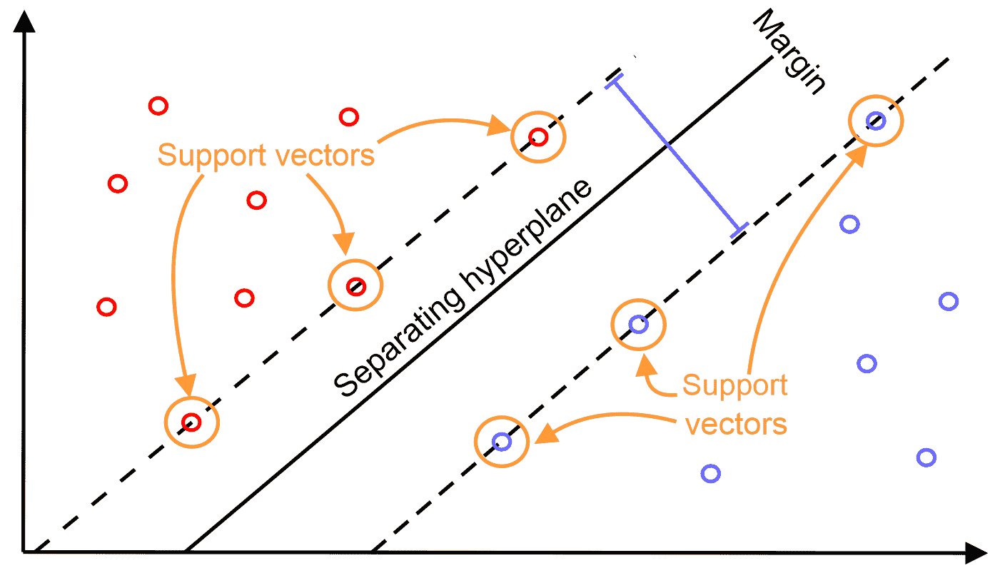

SVM 使用核函数，它找到具有最大边界的线性超平面来分离类别。以下图表显示了使用基于最大边界的决策边界如何将属于两个不同类别（红色与蓝色）的数据点（即支持向量）分开：

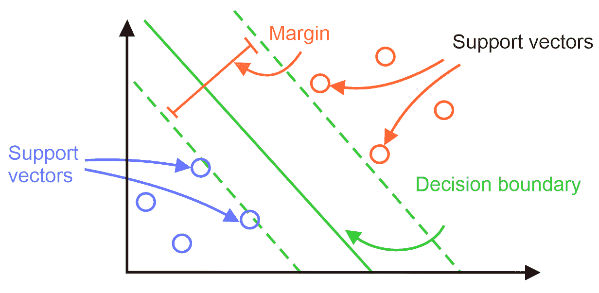

上述支持向量分类器可以用以下数学方式表示为点积：

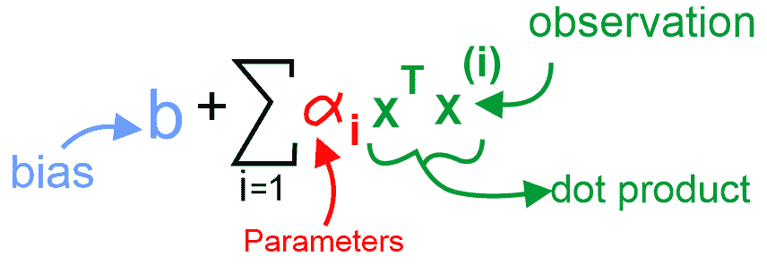

如果要分离的数据非常高维，核技巧使用核函数将数据转换到更高维的特征空间，以便它们可以用于分类的线性可分。从数学上讲，核技巧是用核替换点积，这将允许非线性决策边界和计算效率：

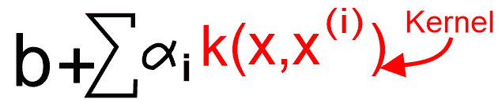

既然我们已经了解了 SVM，让我们开始使用基于 Spark 的 SVM 实现。首先，我们需要定义一些超参数来训练一个基于 LR 的 pipeline：

```py
val numFolds = 10
val MaxIter: Seq[Int] = Seq(100)
val RegParam: Seq[Double] = Seq(1.0) // L2 regularization param, set 0.10 with L1 regularization
val Tol: Seq[Double] = Seq(1e-8)
val ElasticNetParam: Seq[Double] = Seq(1.0) // Combination of L1 and L2
```

一旦我们定义并初始化了超参数，下一个任务就是实例化一个 SVM 估计器，如下所示：

```py
val svm = new LinearSVC()
```

现在我们有了转换器和估计器，下一个任务是链式连接一个单一的 pipeline——也就是说，它们中的每一个都充当一个阶段：

```py
val pipeline = new Pipeline()
      .setStages(Array(PipelineConstruction.ipindexer,
        PipelineConstruction.labelindexer,
        PipelineConstruction.assembler,svm))
```

让我们定义`paramGrid`以在超参数空间中进行网格搜索。这搜索 SVM 的最大迭代次数、正则化参数、容差和弹性网络以找到最佳模型：

```py
val paramGrid = new ParamGridBuilder()
      .addGrid(svm.maxIter, MaxIter)
      .addGrid(svm.regParam, RegParam)
      .addGrid(svm.tol, Tol)
      .addGrid(svm.elasticNetParam, ElasticNetParam)
      .build()
```

让我们定义一个`BinaryClassificationEvaluator`评估器来评估模型：

```py
val evaluator = new BinaryClassificationEvaluator()
                  .setLabelCol("label")
                  .setRawPredictionCol("prediction")
```

我们使用`CrossValidator`进行 10 折交叉验证以选择最佳模型：

```py
val crossval = new CrossValidator()
      .setEstimator(pipeline)
      .setEvaluator(evaluator)
      .setEstimatorParamMaps(paramGrid)
      .setNumFolds(numFolds)
```

现在，让我们调用 fit 方法，以便执行完整的预定义`pipeline`，包括所有特征预处理和 LR 分类器，多次执行——每次使用不同的超参数向量：

```py
val cvModel = crossval.fit(Preprocessing.trainDF)
```

现在，是时候评估 SVM 模型在测试数据集上的预测能力了：

```py
val predDF= cvModel.transform(Preprocessing.testSet)
predDF.show(10)
```

上述代码块显示了模型生成的预测标签和原始概率，以及实际标签。

如我们所见，对于某些实例，模型预测正确，但对于某些其他实例，它感到困惑：

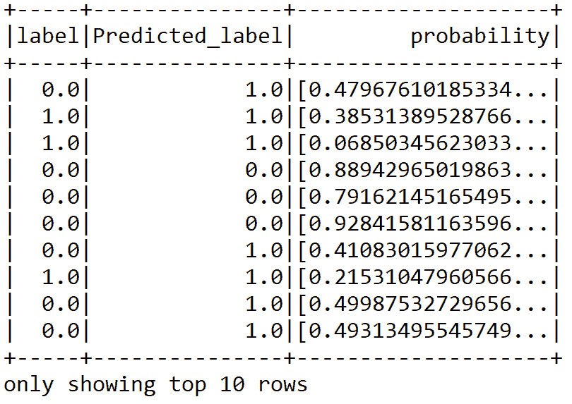

然而，通过查看前面的预测 DataFrame，很难猜测分类准确率。然而，在第二步中，评估器使用`BinaryClassificationEvaluator`评估自己，如下所示：

```py
val accuracy = evaluator.evaluate(predDF)
println("Classification accuracy: " + accuracy)
```

因此，我们从我们的二分类模型中获得了大约 75%的分类准确率：

```py
Classification accuracy: 0.7530180345969819
```

现在，我们构建一个包含测试集原始分数的 RDD，它将被用来计算性能指标，如精确度-召回率曲线下的面积（AUC）和接收机操作特征曲线下的面积（ROC）：

```py
val predictionAndLabels = predDF
      .select("prediction", "label")
      .rdd.map(x => (x(0).asInstanceOf[Double], x(1)
      .asInstanceOf[Double]))
```

现在，可以使用前面的 RDD 来计算上述性能指标：

```py
val metrics = new BinaryClassificationMetrics(predictionAndLabels) 
println("Area under the precision-recall curve: " + metrics.areaUnderPR)
println("Area under the receiver operating characteristic (ROC) curve : " + metrics.areaUnderROC)
```

在这种情况下，评估返回了 75%的准确率，但只有 55%的精确度：

```py
Area under the precision-recall curve: 0.5595712265324828
Area under the receiver operating characteristic (ROC) curve: 0.7530180345969819
```

我们还可以计算一些更多的指标；例如，错误和正确预测的正负样本也是评估模型性能的有用信息：

```py
val tVSpDF = predDF.select("label", "prediction") // True vs predicted labels
val TC = predDF.count() //Total count

val tp = tVSpDF.filter($"prediction" === 0.0)
            .filter($"label" === $"prediction")
            .count() / TC.toDouble

val tn = tVSpDF.filter($"prediction" === 1.0)
            .filter($"label" === $"prediction")
            .count() / TC.toDouble

val fp = tVSpDF.filter($"prediction" === 1.0)
            .filter(not($"label" === $"prediction"))
            .count() / TC.toDouble
val fn = tVSpDF.filter($"prediction" === 0.0)
            .filter(not($"label" === $"prediction"))
            .count() / TC.toDouble

println("True positive rate: " + tp *100 + "%")
println("False positive rate: " + fp * 100 + "%")
println("True negative rate: " + tn * 100 + "%")
println("False negative rate: " + fn * 100 + "%")
```

前面的代码段显示了真正例、假正例、真反例和假反例的比率，我们将使用这些比率来计算 MCC 分数：

```py
True positive rate: 66.71664167916042%
False positive rate: 19.04047976011994%
True negative rate: 10.944527736131935%
False negative rate: 3.2983508245877062%
```

最后，我们还计算了 MCC 分数，如下所示：

```py
val MCC = (tp * tn - fp * fn) / math.sqrt((tp + fp) * (tp + fn) * (fp + tn) * (tn + fn))
println("Matthews correlation coefficient: " + MCC)
```

这给了我一个马修斯相关系数为`0.3888239300421191`。尽管我们尝试使用尽可能多的三个分类算法，但我们仍然没有获得良好的准确率。考虑到 SVM 设法给我们带来了 76%的准确率，这仍然被认为是较低的。此外，没有最适合的特征选择选项，这有助于我们使用最合适的特征来训练模型。为了提高分类准确率，我们需要使用基于树的算法，如 DT、RF 和 GBT，这些算法预计将提供更强大的响应。我们将在下一章中这样做。

# 摘要

在本章中，我们学习了不同的经典分类算法，如 LR、SVM 和 NB。使用这些算法，我们预测客户是否可能取消他们的电信订阅。我们还讨论了构建成功的客户流失预测模型所需的数据类型。

基于树的分类器和树集成分类器非常实用且稳健，并且广泛应用于解决分类和回归任务。在下一章中，我们将探讨如何使用基于树和集成技术（如 DT、RF 和 GBT）来开发这样的分类器和回归器，用于分类和回归。
