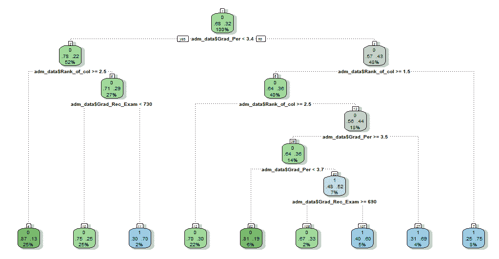
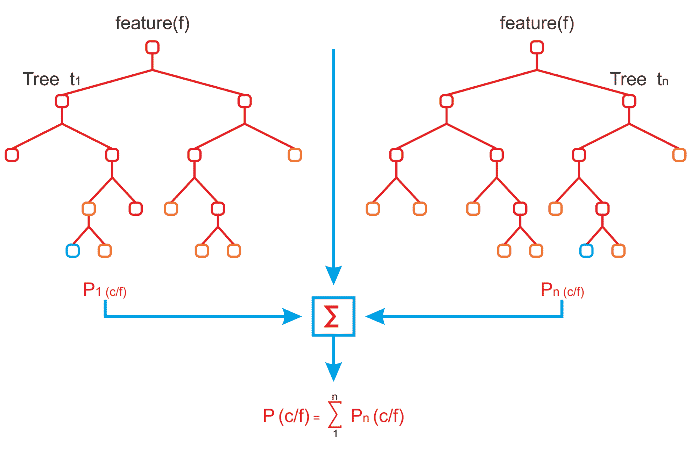
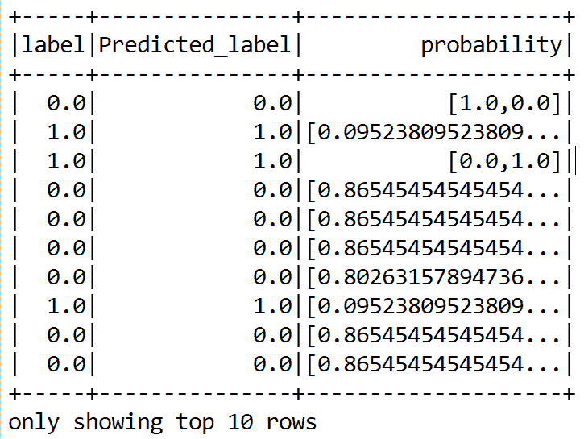
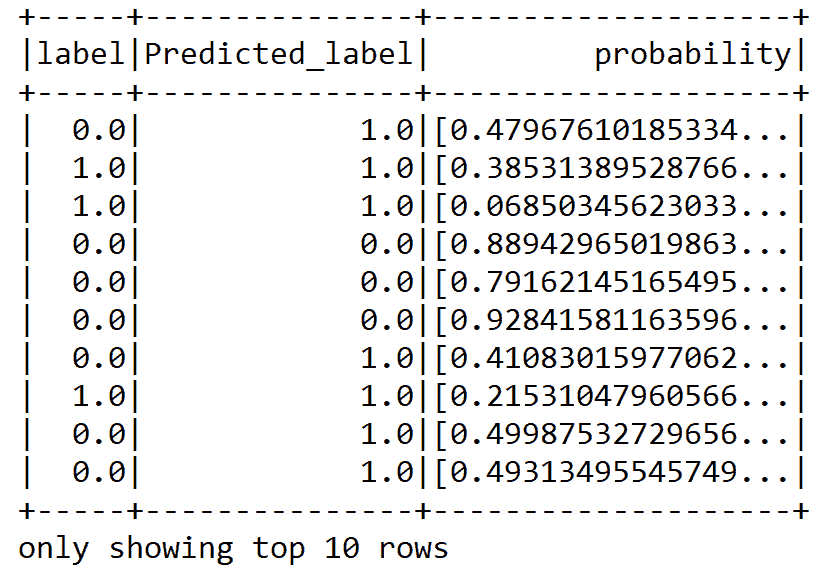
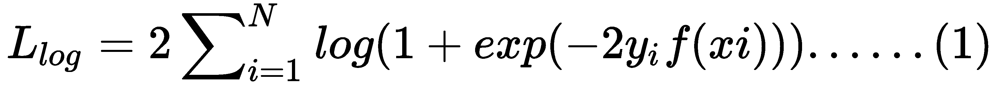
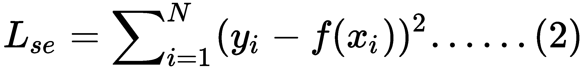
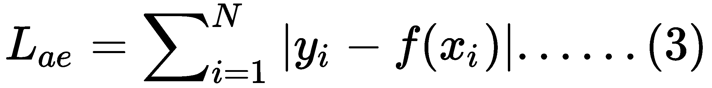
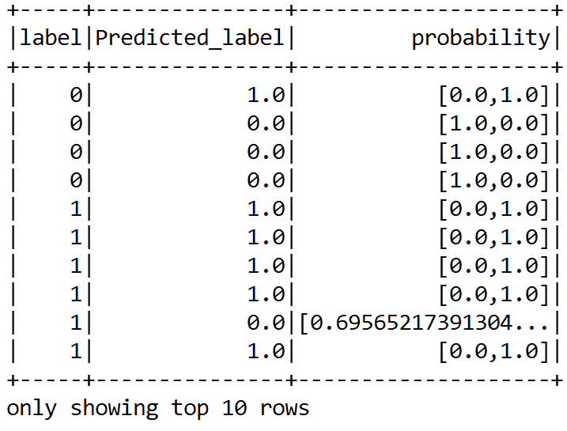

# 第四章：Scala 用于树集成技术

在上一章中，我们使用线性模型解决了分类和回归问题。我们还使用了逻辑回归、支持向量机和朴素贝叶斯。然而，在这两种情况下，我们没有获得很好的准确度，因为我们的模型表现出低置信度。

另一方面，基于树和树集成分类器对于分类和回归任务来说非常有用、稳健且广泛使用。本章将简要介绍使用基于树和集成技术（如**决策树**（**DTs**）、**随机森林**（**RF**）和**梯度提升树**（**GBT**））开发这些分类器和回归器的方法，用于分类和回归。更具体地说，我们将重新审视并解决之前讨论过的回归（来自第二章，*Scala 用于回归分析*）和分类（来自第三章，*Scala 用于分类学习*）问题。

本章将涵盖以下主题：

+   决策树和树集成

+   用于监督学习的决策树

+   用于监督学习的梯度提升树

+   用于监督学习的随机森林

+   接下来是什么？

# 技术要求

确保 Scala 2.11.x 和 Java 1.8.x 已安装并配置在您的机器上。

本章的代码文件可以在 GitHub 上找到：

[`github.com/PacktPublishing/Machine-Learning-with-Scala-Quick-Start-Guide/tree/master/Chapter04`](https://github.com/PacktPublishing/Machine-Learning-with-Scala-Quick-Start-Guide/tree/master/Chapter04)

查看以下播放列表，以查看本章的代码实战视频：

[`bit.ly/2WhQf2i`](http://bit.ly/2WhQf2i)

# 决策树和树集成

DTs 通常属于监督学习技术，用于识别和解决与分类和回归相关的问题。正如其名所示，DTs 有各种分支——每个分支表示基于统计概率的可能决策、外观或反应。就特征而言，DTs 分为两大类：训练集和测试集，这有助于对预测标签或类别的更新产生良好的效果。

DT 算法可以处理二元和多类分类问题，这也是它在各种问题中广泛应用的原因之一。例如，对于我们在第三章中介绍的招生示例，“Scala 用于分类学习”，DTs 通过一组`if...else`决策规则从招生数据中学习，以近似正弦曲线，如图所示：



基于大学招生数据使用 DTs 生成决策规则

通常，树越大，决策规则越复杂，模型拟合度越高。决策树（DT）的另一个令人兴奋的功能是它们可以用来解决分类和回归问题。现在让我们看看 DT 的一些优缺点。两种广泛使用的基于树的集成技术是 RF 和 GBT。这两种技术之间的主要区别在于训练树的方式和顺序：

+   RF 独立地训练每棵树，但基于数据的随机样本。这些随机样本有助于使模型比单个 DT 更稳健，因此它不太可能对训练数据产生过载。

+   GBT 一次训练一棵树。先前训练的树产生的错误将被每棵新训练的树纠正。随着树的增加，模型的表达能力更强。

随机森林（RF）从观测值和变量子集中选取一部分来构建，这是一个决策树的集成。这些树实际上是在同一训练集的不同部分上训练的，但单个树生长得很深，往往能从高度不可预测的模式中学习。

有时非常深的树是 DT 模型中过拟合问题的原因。此外，这些偏差可能会使分类器表现不佳，即使就数据集而言，表示的特征质量很好。

当构建决策树时，随机森林将它们整合在一起以获得更准确和稳定的预测。RF 通过计算成对案例之间的邻近度来平均多个决策树，目的是减少方差以确保一致性。这是对 RF 的直接后果。通过一组独立陪审团的多数投票，我们得到比最佳陪审团更好的最终预测。以下图显示了两个森林的决策如何集成以获得最终预测：



基于树的集成及其组装技术

最后，RF 和 GBT 都产生一个决策树的加权集合，随后从每个集成模型的单个树中进行预测组合结果。当使用这些方法（作为分类器或回归器）时，参数设置如下：

+   如果树木的数量为 1，则不应用自助法。如果树木的数量大于 1，则应用自助法，支持的值有`auto`、`all`、`sqrt`、`log2`和三分之一。

+   支持的数值范围是[0.0-1.0]和[1-n]。如果`numTrees`为`1`，则`featureSubsetStrategy`设置为`all`。如果`numTrees`大于 1（对于 RF），则`featureSubsetStrategy`设置为分类的`sqrt`。如果选择`auto`作为`featureSubsetStrategy`，则算法会自动推断最佳特征子集策略。

+   杂质标准仅用于信息增益的计算，分类时支持的值是基尼指数，回归时支持的值是方差。

+   `maxDepth`是树的最大深度（例如，深度 0 表示 1 个叶子节点，深度 1 表示 1 个内部节点和 2 个叶子节点，依此类推）。

+   `maxBins`表示用于分割特征的 bin 的最大数量，建议值为 100 以获得更好的结果。

既然我们已经处理了回归分析和分类问题，让我们看看如何更舒适地使用 DT、RF 和 GBT 来解决这些问题。让我们从 DT 开始。

# 用于监督学习的决策树

在本节中，我们将看到如何使用 DT 来解决回归和分类问题。在前面的两章中，第二章，“Scala for Regression Analysis”和第三章，“Scala for Learning Classification”，我们解决了客户流失和保险严重索赔问题。这些分别是分类和回归问题。在这两种方法中，我们都使用了其他经典模型。然而，我们将看到如何使用基于树和集成技术来解决它们。我们将使用 Scala 中的 Apache Spark ML 包中的 DT 实现。

# 用于分类的决策树

首先，我们在第三章中了解了客户流失预测问题，“Scala for Learning Classification”，我们也了解了相关数据。我们还知道了决策树（DT）的工作原理。因此，我们可以直接使用基于 Spark 的决策树实现来进入编码部分。首先，我们通过实例化`DecisionTreeClassifier`接口创建一个`DecisionTreeClassifier`估计器。此外，我们还需要指定标签和特征向量列：

```py
val dTree = new DecisionTreeClassifier()
        .setLabelCol("label")// Setting label column
        .setFeaturesCol("features") // Setting feature vector column
        .setSeed(1234567L)// for reproducibility
```

如前几章所述，我们有三个转换器（`ipindexer`、`labelindexer`和`assembler`）和一个估计器（`dTree`）。我们现在可以将它们链接在一起形成一个单一的管道，这样每个转换器都将作为一个阶段：

```py
val pipeline = new Pipeline()
          .setStages(Array(PipelineConstruction.ipindexer,
                            PipelineConstruction.labelindexer,
                                PipelineConstruction.assembler,dTree))
```

由于我们希望执行超参数调整和交叉验证，我们需要创建一个`paramGrid`变量，该变量将在 K 折交叉验证期间用于超参数空间的网格搜索：

```py
var paramGrid = new ParamGridBuilder()
  .addGrid(dTree.impurity, "gini" :: "entropy" :: Nil)
  .addGrid(dTree.maxBins, 2 :: 5 :: 10 :: 15 :: 20 :: 25 :: 30 :: Nil)
  .addGrid(dTree.maxDepth, 5 :: 10 :: 15 :: 20 :: 25 :: 30 :: 30 :: Nil)
  .build()
```

更具体地说，这将搜索 DT 的`impurity`、`maxBins`和`maxDepth`以找到最佳模型。最大 bin 数用于分离连续特征，并选择在每个节点上如何分割特征。算法结合搜索 DT 的`maxDepth`和`maxBins`参数以找到最佳模型。

在前面的代码段中，我们创建了一个渐进的`paramGrid`变量，其中我们指定组合为字符串或整数值的列表。这意味着我们正在创建具有不同超参数组合的网格空间。这将帮助我们提供最佳模型，包括最优超参数。然而，为了做到这一点，我们需要一个`BinaryClassificationEvaluator`评估器来评估每个模型，并在交叉验证期间选择最佳模型：

```py
val evaluator = new BinaryClassificationEvaluator()
                  .setLabelCol("label")
                  .setRawPredictionCol("prediction")
```

我们使用`CrossValidator`进行 10 折交叉验证以选择最佳模型：

```py
println("Preparing for 10-fold cross-validation")
val numFolds = 10

val crossval = new CrossValidator()
     .setEstimator(pipeline)
     .setEvaluator(evaluator)
     .setEstimatorParamMaps(paramGrid)
     .setNumFolds(numFolds)
```

现在我们调用`fit`方法，以便执行完整的预定义管道，包括所有特征预处理和 DT 分类器，多次执行——每次使用不同的超参数向量：

```py
val cvModel = crossval.fit(Preprocessing.trainDF)
```

现在是时候评估 DT 模型在测试数据集上的预测能力了：

```py
val predictions = cvModel.transform(Preprocessing.testSet)
prediction.show(10)
```

这将导致以下 DataFrame 显示预测标签与实际标签的对比。此外，它还显示了原始概率：



然而，根据前面的预测 DataFrame，很难猜测分类的准确率。但在第二步，评估是使用`BinaryClassificationEvaluator`进行的，如下所示：

```py
val accuracy = evaluator.evaluate(predictions)
println("Classification accuracy: " + accuracy)
```

这将提供一个包含准确率值的输出：

```py
Accuracy: 0.8441663599558337
```

因此，我们从我们的二元分类模型中获得了大约 84%的分类准确率。就像 SVM 和 LR 一样，我们将观察基于以下 RDD 的精确率-召回率曲线下面积和接收器操作特征（ROC）曲线下面积，该 RDD 包含测试集上的原始分数：

```py
val predictionAndLabels = predictions
      .select("prediction", "label")
      .rdd.map(x => (x(0).asInstanceOf[Double], x(1)
        .asInstanceOf[Double]))
```

之前提到的 RDD 可以用来计算前面提到的两个性能指标：

```py
val metrics = new BinaryClassificationMetrics(predictionAndLabels)
println("Area under the precision-recall curve: " + metrics.areaUnderPR)
println("Area under the receiver operating characteristic (ROC) curve: " + metrics.areaUnderROC)
```

在这种情况下，评估返回了 84%的准确率，但只有 67%的精确度，这比 SVM 和 LR 要好得多：

```py
Area under the precision-recall curve: 0.6665988000794282
Area under the receiver operating characteristic (ROC) curve: 0.8441663599558337
```

然后，我们计算一些更多的指标，例如，假阳性和真阳性，以及假阴性和真阴性，因为这些预测也有助于评估模型的表现：

```py
val TC = predDF.count() //Total count

val tp = tVSpDF.filter($"prediction" === 0.0).filter($"label" === $"prediction")
                    .count() / TC.toDouble // True positive rate
val tn = tVSpDF.filter($"prediction" === 1.0).filter($"label" === $"prediction")
                    .count() / TC.toDouble // True negative rate
val fp = tVSpDF.filter($"prediction" === 1.0).filter(not($"label" === $"prediction"))
                    .count() / TC.toDouble // False positive rate
val fn = tVSpDF.filter($"prediction" === 0.0).filter(not($"label" === $"prediction"))
                    .count() / TC.toDouble // False negative rate
```

此外，我们计算马修斯相关系数：

```py
val MCC = (tp * tn - fp * fn) / math.sqrt((tp + fp) * (tp + fn) * (fp + tn) * (tn + fn)) 
```

让我们观察模型置信度有多高：

```py
println("True positive rate: " + tp *100 + "%")
println("False positive rate: " + fp * 100 + "%")
println("True negative rate: " + tn * 100 + "%")
println("False negative rate: " + fn * 100 + "%")
println("Matthews correlation coefficient: " + MCC)
```

太棒了！我们只达到了 70%的准确率，这可能是我们树的数量较少的原因，但具体是哪些因素呢？

```py
True positive rate: 70.76461769115441%
False positive rate: 14.992503748125937%
True negative rate: 12.293853073463268%
False negative rate: 1.9490254872563717%
Matthews correlation coefficient: 0.5400720075807806
```

现在我们来看看交叉验证后我们达到了最佳模型的水平：

```py
val bestModel = cvModel.bestModel
println("The Best Model and Parameters:\n--------------------")
println(bestModel.asInstanceOf[org.apache.spark.ml.PipelineModel].stages(3))
```

根据以下输出，我们在`深度 5`和`53 个节点`达到了最佳的树模型：

```py
The Best Model and Parameters:
DecisionTreeClassificationModel of depth 5 with 53 nodes
```

让我们通过显示树来提取在树构建过程中采取的移动（即决策）。这棵树帮助我们找到数据集中最有价值的特征：

```py
bestModel.asInstanceOf[org.apache.spark.ml.PipelineModel]
      .stages(3)
      .extractParamMap
val treeModel = bestModel.asInstanceOf[org.apache.spark.ml.PipelineModel]
      .stages(3)
      .asInstanceOf[DecisionTreeClassificationModel]
println("Learned classification tree model:\n" + treeModel.toDebugString)
```

在以下输出中，`toDebugString()`方法打印了树的决策节点和最终预测结果在叶子节点：

```py
Learned classification tree model:
If (feature 3 <= 245.2)
 If (feature 11 <= 3.0)
 If (feature 1 in {1.0})
 If (feature 10 <= 2.0)
 Predict: 1.0
 Else (feature 10 > 2.0)
 If (feature 9 <= 12.9)
 Predict: 0.0
 Else (feature 9 > 12.9)
 Predict: 1.0
 …
 Else (feature 7 > 198.0)
 If (feature 2 <= 28.0)
 Predict: 1.0
 Else (feature 2 > 28.0)
 If (feature 0 <= 60.0)
 Predict: 0.0
 Else (feature 0 > 60.0)
 Predict: 1.0
```

我们还可以看到某些特征（在我们的例子中是`3`和`11`）被用于决策，即客户可能流失的两个最重要的原因。但这两个特征是什么？让我们看看：

```py
println("Feature 11:" + Preprocessing.trainDF.filter(PipelineConstruction.featureCols(11)))
println("Feature 3:" + Preprocessing.trainDF.filter(PipelineConstruction.featureCols(3)))
```

根据以下输出，特征 3 和 11 是最重要的预测因子：

```py
Feature 11: [total_international_num_calls: double]
Feature 3:  [total_day_mins: double]
```

客户服务电话和总日分钟数由 DTs 选择，因为它们提供了一个自动化的机制来确定最重要的特征。

# 回归决策树

在第三章，“用于学习的 Scala 分类”，我们学习了如何预测关于交通缓慢的问题。我们应用了**线性回归**（**LR**）和广义线性回归来解决此问题。我们也非常了解数据。

如前所述，决策树（DT）在回归问题中也能提供非常强大响应和性能。类似于`DecisionTreeClassifier`，可以使用`DecisionTreeRegressor()`方法实例化`DecisionTreeRegressor`估计器。此外，我们需要明确指定标签和特征列：

```py
// Estimator algorithm
val model = new DecisionTreeRegressor().setFeaturesCol("features").setLabelCol("label")
```

在实例化前面的估计器时，我们可以设置最大分箱数、树的数量、最大深度和纯度：

然而，由于我们将执行 k 折交叉验证，我们可以在创建`paramGrid`时设置这些参数：

```py
// Search through decision tree's parameter for the best model
var paramGrid = new ParamGridBuilder()
      .addGrid(rfModel.impurity, "variance" :: Nil)// variance for regression
      .addGrid(rfModel.maxBins, 25 :: 30 :: 35 :: Nil)
      .addGrid(rfModel.maxDepth, 5 :: 10 :: 15 :: Nil)
      .addGrid(rfModel.numTrees, 3 :: 5 :: 10 :: 15 :: Nil)
      .build()
```

为了获得更好和更稳定的性能，让我们准备 k 折交叉验证和网格搜索作为模型调优的一部分。正如你所猜到的，我将执行 10 折交叉验证。请根据你的设置和数据集自由调整折数：

```py
println("Preparing K-fold Cross Validation and Grid Search: Model tuning")
val numFolds = 10  // 10-fold cross-validation 
val cv = new CrossValidator()
      .setEstimator(rfModel)
      .setEvaluator(new RegressionEvaluator)
      .setEstimatorParamMaps(paramGrid)
      .setNumFolds(numFolds)
```

太棒了！我们已经创建了交叉验证估计器。现在是时候使用交叉验证训练 DT 回归模型了：

```py
println("Training model with decision tree algorithm")
val cvModel = cv.fit(trainingData)
```

现在我们有了拟合好的模型，我们可以进行预测。所以让我们开始评估模型在训练集和验证集上的表现，并计算 RMSE、MSE、MAE、R 平方等：

```py
println("Evaluating the model on the test set and calculating the regression metrics")
val trainPredictionsAndLabels = cvModel.transform(testData).select("label", "prediction")
                                            .map { case Row(label: Double, prediction: Double) 
                                            => (label, prediction) }.rdd

val testRegressionMetrics = new RegressionMetrics(trainPredictionsAndLabels)
```

一旦我们有了最佳拟合和交叉验证模型，我们可以期待良好的预测精度。让我们观察训练集和验证集上的结果：

```py
val results = "\n=====================================================================\n" +
      s"TrainingData count: ${trainingData.count}\n" +
      s"TestData count: ${testData.count}\n" +
      "=====================================================================\n" +
      s"TestData MSE = ${testRegressionMetrics.meanSquaredError}\n" +
      s"TestData RMSE = ${testRegressionMetrics.rootMeanSquaredError}\n" +
      s"TestData R-squared = ${testRegressionMetrics.r2}\n" +
      s"TestData MAE = ${testRegressionMetrics.meanAbsoluteError}\n" +
      s"TestData explained variance = ${testRegressionMetrics.explainedVariance}\n" +
      "=====================================================================\n"
println(results)
```

以下输出显示了测试集上的 MSE、RMSE、R 平方、MAE 和解释方差：

```py
=====================================================================
 TrainingData count: 80
 TestData count: 55
 =====================================================================
 TestData MSE = 7.871519100933004
 TestData RMSE = 2.8056227652578323
 TestData R-squared = 0.5363607928629964
 TestData MAE = 2.284866391184572
 TestData explained variance = 20.213067468774792
 =====================================================================
```

太好了！我们已经成功计算了训练集和测试集上的原始预测，并且我们可以看到与 LR 回归模型相比的改进。让我们寻找能帮助我们实现更好精度的模型：

```py
val bestModel = cvModel.bestModel.asInstanceOf[DecisionTreeRegressionModel]
```

此外，我们可以通过观察森林中的决策树来了解决策是如何做出的：

```py
println("Decision tree from best cross-validated model: " + bestModel.toDebugString)
```

以下为输出结果：

```py
Decision tree from best cross-validated model at depth 5 with 39 nodes
 If (feature 0 <= 19.0)
 If (feature 0 <= 3.0)
 If (feature 0 <= 1.0)
 If (feature 3 <= 0.0)
 If (feature 4 <= 0.0)
 Predict: 4.1
 Else (feature 4 > 0.0)
 Predict: 3.4000000000000004
 ....
 Predict: 15.30909090909091
 Else (feature 0 > 25.0)
 Predict: 12.800000000000002
 Else (feature 11 > 1.0)
 Predict: 22.100000000000023
 Else (feature 9 > 1.0)
 Predict: 23.399999999999977
```

使用决策树（DTs），我们可以测量特征重要性，这样在后续阶段我们可以决定使用哪些特征以及从 DataFrame 中删除哪些特征。让我们找出我们刚刚创建的最佳模型的所有特征的重要性，这些特征按以下升序排列：

```py
val featureImportances = bestModel.featureImportances.toArray

val FI_to_List_sorted = featureImportances.toList.sorted.toArray
println("Feature importance generated by the best model: ")
for(x <- FI_to_List_sorted) println(x)

```

以下是由模型生成的特征重要性：

```py
Feature importance generated by the best model:
 0.0
 0.0
 0.0
 0.0
 0.0
 0.0
 0.0
 0.0
 7.109215735617604E-5
 2.1327647206851872E-4
 0.001134987328520092
 0.00418143999334111
 0.025448271970345014
 0.03446268498009088
 0.057588305610674816
 0.07952108027588178
 0.7973788612117217

```

最后的结果对于理解特征重要性很重要。正如你所见，随机森林（RF）将一些特征排名为更重要。例如，最后几个特征是最重要的，而其中八个则相对不那么重要。我们可以删除这些不重要的列，并再次训练 DT 模型，以观察测试集上 MAE 的减少和 R 平方的增加是否有所改善。

# 监督学习的梯度提升树

在本节中，我们将看到如何使用 GBT 来解决回归和分类问题。在前两章中，第二章，*Scala 回归分析*，和第三章，*Scala 学习分类*，我们解决了客户流失和保险严重索赔问题，分别是分类和回归问题。在这两种方法中，我们使用了其他经典模型。然而，我们将看到如何使用基于树和集成技术来解决它们。我们将使用 Scala 中的 Spark ML 包中的 GBT 实现。

# 用于分类的梯度提升树

我们从第三章，*Scala 学习分类*中了解到客户流失预测问题，并且我们对数据很熟悉。我们已经知道 RF 的工作原理，所以让我们开始使用基于 Spark 的 RF 实现：

1.  通过调用`GBTClassifier()`接口实例化一个`GBTClassifier`估计器：

```py
val gbt = new GBTClassifier()
      .setLabelCol("label")
      .setFeaturesCol("features")
      .setSeed(1234567L)
```

1.  我们已经有了三个转换器和一个估计器就绪。将它们链式连接成一个单一管道，即它们各自作为一个阶段：

```py
// Chain indexers and tree in a Pipeline.
val pipeline = new Pipeline()
      .setStages(Array(ScalaClassification.PipelineConstruction.ipindexer,
        ScalaClassification.PipelineConstruction.labelindexer,
        ScalaClassification.PipelineConstruction.assembler,
        gbt))
```

1.  定义`paramGrid`变量以在超参数空间中进行网格搜索：

```py
// Search through decision tree's maxDepth parameter for best model
val paramGrid = new ParamGridBuilder()
      .addGrid(gbt.maxDepth, 3 :: 5 :: 10 :: Nil) // :: 15 :: 20 :: 25 :: 30 :: Nil)
      .addGrid(gbt.impurity, "gini" :: "entropy" :: Nil)
      .addGrid(gbt.maxBins, 5 :: 10 :: 20 :: Nil) //10 :: 15 :: 25 :: 35 :: 45 :: Nil)
      .build()
```

1.  定义一个`BinaryClassificationEvaluator`评估器来评估模型：

```py
val evaluator = new BinaryClassificationEvaluator()
                  .setLabelCol("label")
                  .setRawPredictionCol("prediction")
```

1.  我们使用`CrossValidator`进行 10 折交叉验证以选择最佳模型：

```py
// Set up 10-fold cross validation
val numFolds = 10
val crossval = new CrossValidator()
      .setEstimator(pipeline)
      .setEvaluator(evaluator)
      .setEstimatorParamMaps(paramGrid)
      .setNumFolds(numFolds)
```

1.  现在让我们调用`fit`方法，这样完整的预定义管道，包括所有特征预处理和 DT 分类器，就会执行多次——每次使用不同的超参数向量：

```py
val cvModel = crossval.fit(Preprocessing.trainDF)
```

现在是时候评估 DT 模型在测试数据集上的预测能力了：

1.  使用模型管道转换测试集，这将根据我们在前面的特征工程步骤中描述的相同机制更新特征：

```py
val predictions = cvModel.transform(Preprocessing.testSet)
prediction.show(10)
```

这将导致以下 DataFrame，显示预测标签与实际标签的对比。此外，它还显示了原始概率：



然而，在看到前面的预测 DataFrame 后，很难猜测分类准确率。

1.  但在第二步中，评估是使用`BinaryClassificationEvaluator`进行的，如下所示：

```py
val accuracy = evaluator.evaluate(predictions)
println("Classification accuracy: " + accuracy)
```

这将给我们提供分类准确率：

```py
Accuracy: 0.869460802355539
```

因此，我们从我们的二元分类模型中获得大约 87%的分类准确率。就像 SVM 和 LR 一样，我们将根据以下 RDD 观察精确率-召回率曲线下的面积和 ROC 曲线下的面积，该 RDD 包含测试集上的原始分数：

```py
val predictionAndLabels = predictions
      .select("prediction", "label")
      .rdd.map(x => (x(0).asInstanceOf[Double], x(1)
      .asInstanceOf[Double]))
```

前面的 RDD 可用于计算之前提到的性能指标：

```py
val metrics = new BinaryClassificationMetrics(predictionAndLabels)
println("Area under the precision-recall curve: " + metrics.areaUnderPR)
println("Area under the receiver operating characteristic (ROC) curve: " + metrics.areaUnderROC)
```

这将分享准确性和预测的价值：

```py
Area under the precision-recall curve: 0.7270259009251356
Area under the receiver operating characteristic (ROC) curve: 0.869460802355539
```

在这种情况下，评估返回 87% 的准确率，但只有 73% 的精确率，这比 SVM 和 LR 好得多。然后我们计算更多的错误和真实指标。正负预测也可以用来评估模型性能：

```py
val TC = predDF.count() //Total count

val tp = tVSpDF.filter($"prediction" === 0.0).filter($"label" === $"prediction")
                    .count() / TC.toDouble // True positive rate
val tn = tVSpDF.filter($"prediction" === 1.0).filter($"label" === $"prediction")
                    .count() / TC.toDouble // True negative rate
val fp = tVSpDF.filter($"prediction" === 1.0).filter(not($"label" === $"prediction"))
                    .count() / TC.toDouble // False positive rate
val fn = tVSpDF.filter($"prediction" === 0.0).filter(not($"label" === $"prediction"))
                    .count() / TC.toDouble // False negative rate
```

此外，我们计算马修斯相关系数：

```py
val MCC = (tp * tn - fp * fn) / math.sqrt((tp + fp) * (tp + fn) * (fp + tn) * (tn + fn)) 
```

让我们观察模型置信度有多高：

```py
println("True positive rate: " + tp *100 + "%")
println("False positive rate: " + fp * 100 + "%")
println("True negative rate: " + tn * 100 + "%")
println("False negative rate: " + fn * 100 + "%")
println("Matthews correlation coefficient: " + MCC)
```

现在让我们看看真正的阳性、假阳性、真正性和假阴性率。此外，我们看到了 MCC：

```py
True positive rate: 0.7781109445277361
False positive rate: 0.07946026986506746
True negative rate: 0.1184407796101949
False negative rate: 0.0239880059970015
Matthews correlation coefficient: 0.6481780577821629
```

这些比率看起来很有希望，因为我们经历了正 MCC，这表明大多数情况下有正相关，表明这是一个稳健的分类器。现在，类似于决策树，随机森林在分类过程中也可以进行调试。为了打印树并选择最重要的特征，请运行决策树中的最后几行代码。请注意，我们仍然通过将 `numTrees`、`maxBins` 和 `maxDepth` 限制为 `7` 来限制超参数空间。记住，更大的树更有可能表现更好。因此，请随意尝试这段代码，添加特征，并使用更大的超参数空间，例如更大的树。

# GBT 回归

为了减少损失函数的大小，GBT 将训练许多决策树。对于每个实例，算法将使用当前可用的集成来预测每个训练实例的标签。

与决策树类似，GBT 可以执行以下操作：

+   处理分类和数值特征

+   可用于二元分类和回归（多类分类尚不支持）

+   不需要特征缩放

+   从非常高维的数据集中捕获非线性特征和特征交互

假设我们拥有 *N* 个数据实例（其中 *x[i]* 表示实例 *i* 的特征）和 *y* 是标签（其中 *y[i]* 表示实例 *i* 的标签），那么 *f(x[i])* 是 GBT 模型对实例 *i* 的预测标签，它试图最小化以下损失之一：







第一个方程称为 *log* 损失，是二项式负 *log* 似然的两倍。第二个称为平方误差，通常被称为 *L2* 损失，是 GBT 基于回归任务的默认损失。最后，第三个称为绝对误差，通常称为 *L1* 损失，如果数据点有许多异常值，则比平方误差更稳健。

现在我们已经了解了 GBT 回归算法的最小工作原理，我们可以开始。让我们通过调用 `GBTRegressor()` 接口来实例化 `GBTRegressor` 估计器：

```py
val gbtModel = new GBTRegressor().setFeaturesCol("features").setLabelCol("label")
```

在实例化前面的估计器时，我们可以设置最大箱数、树的数量、最大深度和纯度。然而，由于我们将执行 k 折交叉验证，我们也可以在创建 `paramGrid` 变量时设置这些参数：

```py
// Search through GBT's parameter for the best model
var paramGrid = new ParamGridBuilder()
      .addGrid(gbtModel.impurity, "variance" :: Nil)// variance for regression
      .addGrid(gbtModel.maxBins, 25 :: 30 :: 35 :: Nil)
      .addGrid(gbtModel.maxDepth, 5 :: 10 :: 15 :: Nil)
      .addGrid(gbtModel.numTrees, 3 :: 5 :: 10 :: 15 :: Nil)
      .build()
```

**训练过程中的验证**：梯度提升可能会过拟合，尤其是在你用更多树训练模型时。为了防止这个问题，在训练过程中进行验证（例如，使用交叉验证）是有用的。

为了获得更好的性能和更稳定的性能，让我们准备 k 折交叉验证和网格搜索作为模型调优的一部分。正如你所猜到的，我将执行 10 折交叉验证。请根据你的设置和数据集自由调整折数：

```py
println("Preparing K-fold Cross Validation and Grid Search: Model tuning")
val numFolds = 10  // 10-fold cross-validation 
val cv = new CrossValidator()
      .setEstimator(gbtModel)
      .setEvaluator(new RegressionEvaluator)
      .setEstimatorParamMaps(paramGrid)
      .setNumFolds(numFolds)
```

太棒了！我们已经创建了交叉验证估计器。现在，是时候用交叉验证来训练`RandomForestRegression`模型了：

```py
println("Training model with RandomForestRegressor algorithm")
val cvModel = cv.fit(trainingData)
```

现在我们有了拟合的模型，我们可以进行预测。让我们开始评估模型在训练集和验证集上的表现，并计算 RMSE、MSE、MAE 和 R 平方误差：

```py
println("Evaluating the model on the test set and calculating the regression metrics")
val trainPredictionsAndLabels = cvModel.transform(testData).select("label", "prediction")
                                            .map { case Row(label: Double, prediction: Double) 
                                            => (label, prediction) }.rdd

val testRegressionMetrics = new RegressionMetrics(trainPredictionsAndLabels)
```

一旦我们有了最佳拟合和交叉验证的模型，我们可以期待高预测准确率。现在让我们观察训练集和验证集上的结果：

```py
val results = "\n=====================================================================\n" +
      s"TrainingData count: ${trainingData.count}\n" +
      s"TestData count: ${testData.count}\n" +
      "=====================================================================\n" +
      s"TestData MSE = ${testRegressionMetrics.meanSquaredError}\n" +
      s"TestData RMSE = ${testRegressionMetrics.rootMeanSquaredError}\n" +
      s"TestData R-squared = ${testRegressionMetrics.r2}\n" +
      s"TestData MAE = ${testRegressionMetrics.meanAbsoluteError}\n" +
      s"TestData explained variance = ${testRegressionMetrics.explainedVariance}\n" +
      "=====================================================================\n"
println(results)
```

以下输出显示了测试集上的均方误差（MSE）、均方根误差（RMSE）、R-squared、MAE 和解释方差：

```py
=====================================================================
 TrainingData count: 80
 TestData count: 55
 =====================================================================
 TestData MSE = 5.99847335425882
 TestData RMSE = 2.4491780977011084
 TestData R-squared = 0.4223425609926217
 TestData MAE = 2.0564380367107646
 TestData explained variance = 20.340666319995183
 =====================================================================
```

太好了！我们已经成功计算了训练集和测试集上的原始预测，并且我们可以看到与 LR、DT 和 GBT 回归模型相比的改进。让我们寻找帮助我们实现更高准确率的模型：

```py
val bestModel = cvModel.bestModel.asInstanceOf[GBTRegressionModel]
```

此外，我们可以通过观察森林中的决策树（DTs）来了解决策是如何做出的：

```py
println("Decision tree from best cross-validated model: " + bestModel.toDebugString)
```

在以下输出中，toDebugString()方法打印了树的决策节点和最终预测结果在最终叶子节点：

```py
Decision tree from best cross-validated model with 10 trees
 Tree 0 (weight 1.0):
 If (feature 0 <= 16.0)
 If (feature 2 <= 1.0)
 If (feature 15 <= 0.0)
 If (feature 13 <= 0.0)
 If (feature 16 <= 0.0)
 If (feature 0 <= 3.0)
 If (feature 3 <= 0.0)
 Predict: 6.128571428571427
 Else (feature 3 > 0.0)
 Predict: 3.3999999999999986
 ....
 Tree 9 (weight 1.0):
 If (feature 0 <= 22.0)
 If (feature 2 <= 1.0)
 If (feature 1 <= 1.0)
 If (feature 0 <= 1.0)
 Predict: 3.4
 ...
```

使用随机森林，我们可以测量特征重要性，这样在后续阶段，我们可以决定使用哪些特征以及从 DataFrame 中删除哪些特征。让我们找出我们刚刚创建的最佳模型中所有特征的排序，如下所示：

```py
val featureImportances = bestModel.featureImportances.toArray

val FI_to_List_sorted = featureImportances.toList.sorted.toArray
println("Feature importance generated by the best model: ")
for(x <- FI_to_List_sorted) println(x)

```

以下是模型生成的特征重要性：

```py
Feature importance generated by the best model:
 0.0
 0.0
 5.767724652714395E-4
 0.001616872851121874
 0.006381209526062637
 0.008867810069950395
 0.009420668763121653
 0.01802097742361489
 0.026755738338777407
 0.02761531441902482
 0.031208534172407782
 0.033620224027091
 0.03801721834820778
 0.05263475066123412
 0.05562565266841311
 0.13221209076999635
 0.5574261654957049
```

最后的结果对于理解特征重要性非常重要。正如你所见，随机森林（RF）将一些看起来更重要的特征进行了排名。例如，最后两个特征是最重要的，而前两个则不那么重要。我们可以删除一些不重要的列，并训练 RF 模型来观察测试集上的 R-squared 和 MAE 值是否有任何减少。

# 监督学习的随机森林

在本节中，我们将看到如何使用 RF 来解决回归和分类问题。我们将使用 Scala 中的 Spark ML 包中的 DT 实现。尽管 GBT 和 RF 都是树的集成，但它们的训练过程是不同的。例如，RF 使用 bagging 技术进行示例，而 GBT 使用 boosting。尽管如此，两者之间有几个实际的权衡，可能会造成选择的困境。然而，在大多数情况下，RF 将是赢家。以下是一些理由：

+   GBTs 一次训练一棵树，但 RF 可以并行训练多棵树。因此，RF 的训练时间更低。然而，在某些特殊情况下，使用 GBTs 训练和较少的树数量更快、更方便。

+   RFs 不太容易过拟合。换句话说，RFs 通过增加树的数量来减少方差，而 GBTs 通过增加树的数量来减少偏差。

+   RFs 更容易调整，因为性能随着树的数量单调增加，但 GBTs 随着树的数量增加表现不佳。

# 用于分类的随机森林

我们熟悉客户流失预测问题，来自第三章，《Scala 用于学习分类》，并且我们也对数据很了解。我们还了解随机森林的工作原理。因此，我们可以直接跳入使用基于 Spark 的 RF 实现进行编码。

我们通过调用`RandomForestClassifier()`接口来实例化一个`RandomForestClassifier`估计器：

```py
val rf = new RandomForestClassifier()
                    .setLabelCol("label")
                    .setFeaturesCol("features")
                    .setSeed(1234567L)  // for reproducibility
```

现在我们已经有了三个转换器和估计器，下一个任务是将它们链式连接成一个单一的管道，即每个都作为阶段：

```py
val pipeline = new Pipeline()
      .setStages(Array(PipelineConstruction.ipindexer,
                   PipelineConstruction.labelindexer,
                         PipelineConstruction.assembler,rf))
```

让我们定义`paramGrid`以在超参数空间中进行网格搜索：

```py
val paramGrid = new ParamGridBuilder()
       .addGrid(rf.maxDepth, 3 :: 5 :: 15 :: 20 :: 50 :: Nil)
       .addGrid(rf.featureSubsetStrategy, "auto" :: "all" :: Nil)
       .addGrid(rf.impurity, "gini" :: "entropy" :: Nil)
       .addGrid(rf.maxBins, 2 :: 5 :: 10 :: Nil)
       .addGrid(rf.numTrees, 10 :: 50 :: 100 :: Nil)
       .build()
```

让我们定义一个`BinaryClassificationEvaluator`评估器来评估模型：

```py
val evaluator = new BinaryClassificationEvaluator()
                  .setLabelCol("label")
                  .setRawPredictionCol("prediction")
```

我们使用`CrossValidator`进行 10 折交叉验证以选择最佳模型：

```py
val crossval = new CrossValidator()
      .setEstimator(pipeline)
      .setEvaluator(evaluator)
      .setEstimatorParamMaps(paramGrid)
      .setNumFolds(numFolds)
```

让我们称这个`fit`方法为执行完整预定义管道，包括所有特征预处理和 DT 分类器，多次执行——每次使用不同的超参数向量：

```py
val cvModel = crossval.fit(Preprocessing.trainDF)
```

现在是时候评估 DT 模型在测试数据集上的预测能力了。

作为第一步，我们需要使用模型管道转换测试集，这将根据我们在特征工程步骤中描述的相同机制映射特征：

```py
val predictions = cvModel.transform(Preprocessing.testSet)
prediction.show(10)
```

这将导致以下 DataFrame，显示预测标签与实际标签的对比。此外，它还显示了原始概率：



然而，基于先前的预测 DataFrame，很难猜测分类准确率。

但在第二步中，评估是使用`BinaryClassificationEvaluator`进行的，如下所示：

```py
val accuracy = evaluator.evaluate(predictions)
println("Classification accuracy: " + accuracy)
```

下面的输出是：

```py
Accuracy: 0.8800055207949945
```

因此，我们从我们的二分类模型中获得大约 87%的分类准确率。现在，类似于 SVM 和 LR，我们将观察基于以下 RDD 的精确度-召回曲线下的面积和 ROC 曲线下的面积，该 RDD 包含测试集上的原始分数：

```py
val predictionAndLabels = predictions
      .select("prediction", "label")
      .rdd.map(x => (x(0).asInstanceOf[Double], x(1)
        .asInstanceOf[Double]))
```

前面的 RDD 可以用来计算之前提到的性能指标：

```py
val metrics = new BinaryClassificationMetrics(predictionAndLabels)
println("Area under the precision-recall curve: " + metrics.areaUnderPR)
println("Area under the receiver operating characteristic (ROC) curve: " + metrics.areaUnderROC)
```

在这种情况下，评估返回了 88%的准确率，但只有 73%的精确度，这比 SVM 和 LR 要好得多：

```py
Area under the precision-recall curve: 0.7321042166486744
Area under the receiver operating characteristic (ROC) curve: 0.8800055207949945
```

然后我们计算一些更多的指标，例如，假正例和真正例以及真负例和假负例预测，这些将有助于评估模型性能：

```py
val TC = predDF.count() //Total count

val tp = tVSpDF.filter($"prediction" === 0.0).filter($"label" === $"prediction")
                    .count() / TC.toDouble // True positive rate
val tn = tVSpDF.filter($"prediction" === 1.0).filter($"label" === $"prediction")
                    .count() / TC.toDouble // True negative rate
val fp = tVSpDF.filter($"prediction" === 1.0).filter(not($"label" === $"prediction"))
                    .count() / TC.toDouble // False positive rate
val fn = tVSpDF.filter($"prediction" === 0.0).filter(not($"label" === $"prediction"))
                    .count() / TC.toDouble // False negative rate
```

此外，我们计算马修斯相关系数：

```py
val MCC = (tp * tn - fp * fn) / math.sqrt((tp + fp) * (tp + fn) * (fp + tn) * (tn + fn))
```

让我们观察模型置信度有多高：

```py
println("True positive rate: " + tp *100 + "%")
println("False positive rate: " + fp * 100 + "%")
println("True negative rate: " + tn * 100 + "%")
println("False negative rate: " + fn * 100 + "%")
println("Matthews correlation coefficient: " + MCC)
```

现在，让我们看一下真正例（true positive）、假正例（false positive）、真负例（true negative）和假负例（false negative）的比率。此外，我们还可以看到 MCC：

```py
True positive rate: 0.7691154422788605
False positive rate: 0.08845577211394302
True negative rate: 0.12293853073463268
False negative rate: 0.019490254872563718
Matthews correlation coefficient: 0.6505449208932913
```

就像 DT 和 GBT 一样，RF 不仅表现出稳健的性能，而且略有改进。并且像 DT 和 GBT 一样，RF 可以被调试以获取分类过程中构建的 DT。为了打印树和选择最重要的特征，尝试 DT 的最后几行代码，然后完成。

你能猜到训练了多少个不同的模型吗？嗯，我们在交叉验证中有 10 折，并且在 2 到 7 之间的 5 维超参数空间中。现在让我们做一些简单的数学计算：*10 * 7 * 5 * 2 * 3 * 6 = 12,600*个模型！

现在我们已经看到了如何在分类设置中使用 RF，让我们看看回归分析的另一个例子。

# 随机森林回归

由于 RF 足够快且可扩展，适用于大规模数据集，基于 Spark 的 RF 实现可以帮助你实现大规模可扩展性。幸运的是，我们已经知道了 RF 的工作原理。

如果在 RF 中计算邻近度，存储需求也会呈指数增长。

我们可以直接使用基于 Spark 的 RF 回归实现进行编码。我们通过调用`RandomForestClassifier()`接口来实例化`RandomForestClassifier`估计器：

```py
val rfModel = new RandomForestRegressor()
        .setFeaturesCol("features")
        .setLabelCol("label")
```

现在，让我们通过指定一些超参数，如最大箱数、树的最大深度、树的数量和纯度类型来创建一个网格空间：

```py
// Search through decision tree's maxDepth parameter for best model
var paramGrid = new ParamGridBuilder()
      .addGrid(rfModel.impurity, "variance" :: Nil)// variance for regression
      .addGrid(rfModel.maxBins, 25 :: 30 :: 35 :: Nil)
      .addGrid(rfModel.maxDepth, 5 :: 10 :: 15 :: Nil)
      .addGrid(rfModel.numTrees, 3 :: 5 :: 10 :: 15 :: Nil)
      .build()
```

为了获得更好、更稳定的性能，让我们准备 k 折交叉验证和网格搜索作为模型调优的一部分。正如你所猜到的，我将执行 10 折交叉验证。请根据你的设置和数据集自由调整折数：

```py
println("Preparing K-fold Cross Validation and Grid Search: Model tuning")
val numFolds = 10  // 10-fold cross-validation 
val cv = new CrossValidator()
      .setEstimator(rfModel)
      .setEvaluator(new RegressionEvaluator)
      .setEstimatorParamMaps(paramGrid)
      .setNumFolds(numFolds)
```

太棒了！我们已经创建了交叉验证估计器。现在是时候使用交叉验证来训练随机森林回归模型了：

```py
println("Training model with RandomForestRegressor algorithm")
val cvModel = cv.fit(trainingData)
```

现在我们有了拟合的模型，我们可以进行预测。让我们开始评估模型在训练集和验证集上的表现，并计算 RMSE、MSE、MAE 和 R 平方：

```py
println("Evaluating the model on the test set and calculating the regression metrics")
val trainPredictionsAndLabels = cvModel.transform(testData).select("label", "prediction")
                                            .map { case Row(label: Double, prediction: Double) 
                                            => (label, prediction) }.rdd

val testRegressionMetrics = new RegressionMetrics(trainPredictionsAndLabels)
```

一旦我们有了最佳拟合和交叉验证的模型，我们可以期待良好的预测准确率。现在让我们在训练集和验证集上观察结果：

```py
val results = "\n=====================================================================\n" +
      s"TrainingData count: ${trainingData.count}\n" +
      s"TestData count: ${testData.count}\n" +
      "=====================================================================\n" +
      s"TestData MSE = ${testRegressionMetrics.meanSquaredError}\n" +
      s"TestData RMSE = ${testRegressionMetrics.rootMeanSquaredError}\n" +
      s"TestData R-squared = ${testRegressionMetrics.r2}\n" +
      s"TestData MAE = ${testRegressionMetrics.meanAbsoluteError}\n" +
      s"TestData explained variance = ${testRegressionMetrics.explainedVariance}\n" +
      "=====================================================================\n"
println(results)
```

下面的输出显示了测试集上的均方误差（MSE）、均方根误差（RMSE）、决定系数（R-squared）、平均绝对误差（MAE）和解释方差：

```py
=====================================================================
 TrainingData count: 80
 TestData count: 55
 =====================================================================
 TestData MSE = 5.99847335425882
 TestData RMSE = 2.4491780977011084
 TestData R-squared = 0.4223425609926217
 TestData MAE = 2.0564380367107646
 TestData explained variance = 20.340666319995183
 =====================================================================
```

太好了！我们已经成功计算了训练集和测试集上的原始预测值，并且我们可以看到与 LR、DT 和 GBT 回归模型相比的改进。让我们寻找帮助我们实现更高准确率的模型：

```py
val bestModel = cvModel.bestModel.asInstanceOf[RandomForestRegressionModel]
```

此外，我们可以通过查看森林中的决策树来了解决策是如何做出的：

```py
println("Decision tree from best cross-validated model: " + bestModel.toDebugString)
```

在下面的输出中，`toDebugString()`方法打印了树的决策节点和最终预测结果在叶子节点：

```py
Decision tree from best cross-validated model with 10 trees
 Tree 0 (weight 1.0):
 If (feature 0 <= 16.0)
 If (feature 2 <= 1.0)
 If (feature 15 <= 0.0)
 If (feature 13 <= 0.0)
 If (feature 16 <= 0.0)
 If (feature 0 <= 3.0)
 If (feature 3 <= 0.0)
 Predict: 6.128571428571427
 Else (feature 3 > 0.0)
 Predict: 3.3999999999999986
 ....
 Tree 9 (weight 1.0):
 If (feature 0 <= 22.0)
 If (feature 2 <= 1.0)
 If (feature 1 <= 1.0)
 If (feature 0 <= 1.0)
 Predict: 3.4
 ...
```

使用 RF，我们可以测量特征重要性，这样在以后阶段，我们可以决定使用哪些特征以及从 DataFrame 中删除哪些特征。在我们将所有特征按升序排列之前，让我们先找出我们刚刚创建的最佳模型中的特征重要性：

```py
val featureImportances = bestModel.featureImportances.toArray

val FI_to_List_sorted = featureImportances.toList.sorted.toArray
println("Feature importance generated by the best model: ")
for(x <- FI_to_List_sorted) println(x)

```

以下是模型生成的特征重要性：

```py
Feature importance generated by the best model:
 0.0
 0.0
 5.767724652714395E-4
 0.001616872851121874
 0.006381209526062637
 0.008867810069950395
 0.009420668763121653
 0.01802097742361489
 0.026755738338777407
 0.02761531441902482
 0.031208534172407782
 0.033620224027091
 0.03801721834820778
 0.05263475066123412
 0.05562565266841311
 0.13221209076999635
 0.5574261654957049
```

最后的结果对于理解特征重要性非常重要。正如所见，一些特征的权重高于其他特征。甚至其中一些特征的权重为零。权重越高，特征的相对重要性就越高。例如，最后两个特征是最重要的，而前两个则相对不那么重要。我们可以删除一些不重要的列，并训练 RF 模型来观察测试集上的 R-squared 和 MAE 值是否有任何减少。

# 接下来是什么？

到目前为止，我们主要介绍了回归和分类的经典和基于树的算法。我们看到了与经典算法相比，集成技术表现出最佳性能。然而，还有其他算法，例如一对一算法，它适用于使用其他分类器（如逻辑回归）解决分类问题。

除了这些，基于神经网络的算法，如**多层感知器**（**MLP**）、**卷积神经网络**（**CNN**）和**循环神经网络**（**RNN**），也可以用来解决监督学习问题。然而，正如预期的那样，这些算法需要大量的训练样本和强大的计算基础设施。到目前为止，我们在示例中使用的数据集样本数量很少。此外，这些数据集的维度也不是很高。这并不意味着我们不能用它们来解决这两个问题；我们可以，但这会导致由于训练样本不足而导致的巨大过拟合。

我们如何解决这个问题？嗯，我们可以寻找其他数据集或随机生成训练数据。我们将讨论并展示如何训练基于神经网络的深度学习模型来解决其他问题。

# 摘要

在本章中，我们简要介绍了用于解决分类和回归任务的强大基于树的算法，如决策树（DTs）、梯度提升树（GBT）和随机森林（RF）。我们看到了如何使用基于树和集成技术来开发这些分类器和回归器。通过两个现实世界的分类和回归问题，我们看到了如何基于树的集成技术优于基于决策树的分类器或回归器。

我们已经涵盖了结构化和标记数据的监督学习，包括分类和回归。然而，随着云计算、物联网和社交媒体的兴起，非结构化数据正以前所未有的速度增长，超过 80%的数据，其中大部分是无标签的。

无监督学习技术，例如聚类分析和降维，是数据驱动研究和工业环境中从非结构化数据集中自动发现隐藏结构的关键应用。有许多聚类算法，如 k-means 和二分 k-means。然而，这些算法在高维输入数据集上表现不佳，并且经常遭受**维度灾难**的困扰。使用**主成分分析**（PCA）等算法降低维度并将潜在数据输入是有助于聚类数十亿数据点的。

在下一章中，我们将使用一种基因组数据来根据人群的主要祖先聚类，也称为地理种族。我们还将学习如何评估聚类分析结果，以及关于降维技术以避免维度灾难的内容。
