# Scala 用于降维和聚类

在前面的章节中，我们看到了几个监督学习的例子，包括分类和回归。我们在结构化和标记数据上执行了监督学习技术。然而，正如我们之前提到的，随着云计算、物联网和社交媒体的兴起，非结构化数据正在以前所未有的速度增加。总的来说，超过 80%的数据是非结构化的，其中大部分是无标签的。

无监督学习技术，如聚类分析和降维，是数据驱动研究和工业环境中寻找非结构化数据集中隐藏结构的关键应用。为此，提出了许多聚类算法，如 k-means、二分 k-means 和高斯混合模型。然而，这些算法不能在高维输入数据集上高效运行，并且经常遭受*维度灾难*。因此，使用主成分分析（**PCA**）等算法降低维度，并输入潜在数据，是聚类数十亿数据点的一种有用技术。

在本章中，我们将使用一种基因变体（一种基因组数据）根据他们的主要血统（也称为地理种族）对人群进行聚类。我们将评估聚类分析结果，然后进行降维技术，以避免维度灾难。

本章我们将涵盖以下主题：

+   无监督学习概述

+   学习聚类——聚类地理种族

+   使用 PCA 进行降维

+   使用降维数据进行聚类

# 技术要求

确保 Scala 2.11.x 和 Java 1.8.x 已安装并配置在您的机器上。

本章的代码文件可以在 GitHub 上找到：

[`github.com/PacktPublishing/Machine-Learning-with-Scala-Quick-Start-Guide/tree/master/Chapter05`](https://github.com/PacktPublishing/Machine-Learning-with-Scala-Quick-Start-Guide/tree/master/Chapter05)

查看以下视频，了解代码的实际应用：

[`bit.ly/2ISwb3o`](http://bit.ly/2ISwb3o)

# 无监督学习概述

在无监督学习中，在训练阶段向系统提供一个输入集。与监督学习相反，输入对象没有标记其类别。虽然在分类分析中训练数据集是标记的，但在现实世界中收集数据时，我们并不总是有这种优势，但我们仍然希望找到数据的重要值或隐藏结构。在 2016 年的 NeuralIPS 上，Facebook AI 首席科学家 Yann LeCun 介绍了*蛋糕类比*：

“如果智能是一块蛋糕，无监督学习就是蛋糕本身，监督学习就是蛋糕上的糖霜，强化学习就是蛋糕上的樱桃。我们知道如何制作糖霜和樱桃，但我们不知道如何制作蛋糕。”

为了创建这样的蛋糕，需要使用包括聚类、维度约简、异常检测和关联规则挖掘在内的几个无监督学习任务。如果无监督学习算法能够在不需要标签的情况下帮助在数据集中找到先前未知的模式，我们可以为这一章学习以下类比：

+   K-means 是一种流行的聚类分析算法，用于将相似数据点分组在一起

+   维度约简算法，如 PCA，有助于在数据集中找到最相关的特征

在本章中，我们将通过实际示例讨论这两种聚类分析技术。

# 聚类分析

聚类分析和维度约简是无监督学习的两个最流行的例子，我们将在本章中通过示例进行讨论。假设您在电脑或智能手机中有大量法律 MP3 文件。在这种情况下，如果没有直接访问它们的元数据，您如何将歌曲分组在一起？

一种可能的方法可能是混合各种机器学习技术，但聚类通常是最佳解决方案。这是因为我们可以开发一个聚类模型，以自动将相似的歌曲分组并组织到您最喜欢的类别中，例如乡村、说唱或摇滚。

尽管数据点没有标签，我们仍然可以进行必要的特征工程并将相似的对象分组在一起，这通常被称为聚类。

聚类是指根据某些相似性度量将数据点分组在一起的一组数据点。

然而，这对人类来说并不容易。相反，一种标准的方法是定义两个对象之间的相似性度量，然后寻找任何对象簇，这些对象簇之间的相似性比它们与其他簇中的对象之间的相似性更大。一旦我们对数据点（即 MP3 文件）进行了聚类（即验证完成），我们就知道了数据的模式（即哪种类型的 MP3 文件属于哪个组）。

左侧图显示了播放列表中所有的**MP3 曲目**，它们是分散的。右侧部分显示了基于流派如何对 MP3 进行聚类：

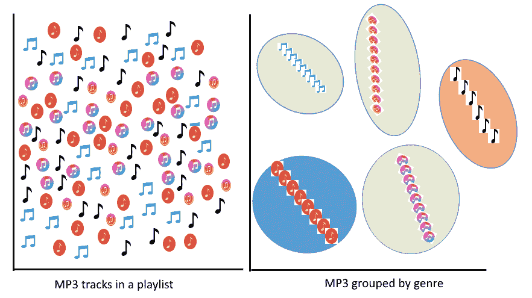

# 聚类分析算法

聚类算法的目标是将一组相似的无标签数据点分组在一起，以发现潜在的模式。以下是一些已经提出并用于聚类分析算法的算法：

+   K-means

+   二分 k-means

+   **高斯混合模型**（**GMM**）

+   **幂迭代聚类**（**PIC**）

+   **潜在狄利克雷分配**（**LDA**）

+   流式 k-means

K-means、二分 k-means 和 GMM 是最广泛使用的。我们将详细说明，以展示快速入门的聚类分析。然而，我们还将查看仅基于 k-means 的示例。

# K-means 聚类分析

K-means 寻找一个固定的簇数*k*（即质心的数量），将数据点划分为*k*个簇，并通过尽可能保持质心最小来将每个数据点分配到最近的簇。

质心是一个想象中的或实际的位置，代表簇的中心。

K-means 通过最小化成本函数，称为**簇内平方和**（**WCSS**），来计算数据点到**k**个簇中心的距离（通常是欧几里得距离）。k-means 算法通过交替进行以下两个步骤进行：

+   **簇分配步骤**：每个数据点被分配到具有最小平方欧几里得距离的簇，从而产生最低的 WCSS

+   **质心更新步骤**：计算新簇中观测值的新均值，并将其用作新的质心

前面的步骤可以用以下图表表示：

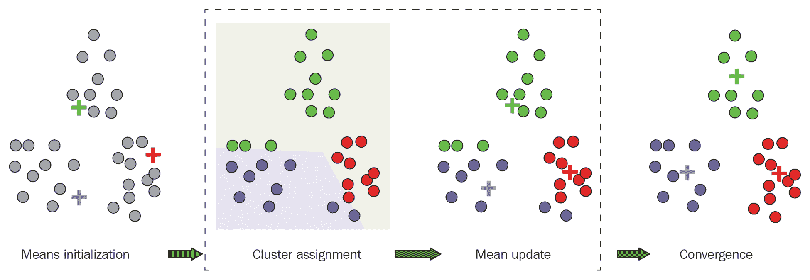

当质心稳定或达到预定义的迭代次数时，k-means 算法完成。尽管 k-means 使用欧几里得距离，但还有其他计算距离的方法，例如：

+   **切比雪夫距离**可以用来通过仅考虑最显著的维度来测量距离

+   **汉明距离**算法可以识别两个字符串之间的差异

+   为了使距离度量不受尺度影响，可以使用**马氏距离**来归一化协方差矩阵

+   **曼哈顿距离**通过仅考虑轴对齐方向来测量距离

+   **闵可夫斯基距离**算法用于生成欧几里得距离、曼哈顿距离和切比雪夫距离

+   **哈夫曼距离**用于测量球面上两点之间的球面距离，即经纬度

# 二分 k-means

二分 k-means 可以看作是 k-means 和层次聚类的组合，它从单个簇中的所有数据点开始。然后，它随机选择一个簇进行分割，使用基本的 k-means 返回两个子簇。这被称为**二分步骤**。

二分 k-means 算法基于一篇题为“*A Comparison of Document Clustering Techniques*”的论文，由 Michael Steinbach 等人撰写，发表于 2000 年的 KDD 文本挖掘研讨会，该论文已被扩展以适应 Spark MLlib。

然后，对二分步骤进行预定义的次数迭代（通常由用户/开发者设置），并收集产生具有最高相似度的所有分割。这些步骤一直持续到达到所需的簇数。尽管二分 k-means 比常规 k-means 更快，但它产生的聚类不同，因为二分 k-means 随机初始化簇。

# 高斯混合模型

GMM 是一种概率模型，它强假设所有数据点都是由有限数量的高斯分布的混合生成的，且参数未知。因此，它也是一种基于分布的聚类算法，该算法基于期望最大化方法。

GMM 也可以被视为一种广义的 k-means，其中模型参数通过迭代优化以更好地拟合训练数据集。整个过程可以用以下三步伪代码表示：

+   **目标函数**：使用**期望最大化**（**EM**）计算并最大化对数似然

+   **EM 步骤**：这个 EM 步骤包括两个子步骤，称为期望和最大化：

    +   **步骤 E**：计算最近数据点的后验概率

    +   **步骤 M**：更新和优化模型参数以拟合高斯混合模型

+   **分配**：在*步骤 E*期间进行软分配

前面的步骤可以非常直观地表示如下：

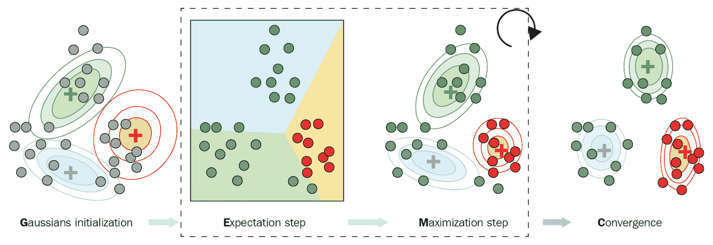

# 其他聚类分析算法

其他聚类算法包括 PIC，它用于根据给定的成对相似度（如边）对图中的节点进行聚类。LDA 在文本聚类用例中经常被使用，如主题建模。

另一方面，流式 k-means 与 k-means 类似，但适用于流数据。例如，当我们想要动态估计簇，以便在新的数据到达时更新聚类分配时，使用流式 k-means 是一个好的选择。对于更详细的讨论和示例，感兴趣的读者可以参考以下链接：

+   基于 Spark ML 的聚类算法 ([`spark.apache.org/docs/latest/ml-clustering.html`](https://spark.apache.org/docs/latest/ml-clustering.html))

+   基于 Spark MLlib 的聚类算法 ([`spark.apache.org/docs/latest/mllib-clustering.html`](https://spark.apache.org/docs/latest/mllib-clustering.html))

# 通过示例进行聚类分析

在聚类分析中，最重要的任务之一是对基因组图谱进行分析，以将个体归入特定的种族群体，或者对疾病易感性进行核苷酸单倍型分析。根据亚洲、欧洲、非洲和美洲的基因组数据，可以区分人类祖先。研究表明，Y 染色体谱系可以在地理上定位，这为将人类基因型的等位基因进行聚类提供了证据。根据国家癌症研究所（[`www.cancer.gov/publications/dictionaries/genetics-dictionary/def/genetic-variant`](https://www.cancer.gov/publications/dictionaries/genetics-dictionary/def/genetic-variant)）：

“遗传变异是 DNA 最常见核苷酸序列的改变。变异一词可以用来描述可能良性、致病或意义未知的改变。变异一词越来越多地被用来代替突变。”

更好地理解遗传变异有助于我们找到相关的种群群体，识别易患常见疾病的患者，以及解决罕见疾病。简而言之，想法是根据遗传变异将地理民族群体进行聚类。然而，在进一步探讨之前，让我们先了解数据。

# 数据集描述

1,000 基因组项目的数据是人类遗传变异的大型目录。该项目旨在确定在研究人群中频率超过 1%的遗传变异。1,000 基因组项目的第三阶段于 2014 年 9 月完成，涵盖了来自 26 个种群和 8,440,000,000 个遗传变异的 2,504 个个体。根据其主要的血统，种群样本被分为五个超级种群群体：

+   亚洲东部（CHB、JPT、CHS、CDX 和 KHV）

+   欧洲地区（CEU、TSI、FIN、GBR 和 IBS）

+   非洲地区（YRI、LWK、GWD、MSL、ESN、ASW 和 ACB）

+   美国地区（MXL、PUR、CLM 和 PEL）

+   南亚地区（GIH、PJL、BEB、STU 和 ITU）

每个基因型由 23 条染色体和一个包含样本和种群信息的单独的 PANEL 文件组成。**变异调用格式**（**VCF**）中的数据以及 PANEL 文件可以从 ftp://ftp.1000genomes.ebi.ac.uk/vol1/ftp/release/20130502/下载。

# 准备编程环境

由于 1,000 基因组项目的第三次发布贡献了大约 820 GB 的数据，因此需要使用可扩展的软件和硬件来处理它们。为此，我们将使用以下组件组成的软件栈：

+   **ADAM**：这可以用来实现支持 VCF 文件格式的可扩展基因组数据分析平台，从而将基于基因型的 RDD 转换为 Spark DataFrame。

+   **Sparkling Water**：H20 是一个机器学习 AI 平台，以及一个支持 Java、Python 和 R 等编程语言的基于 Web 的数据处理 UI。简而言之，Sparkling Water 等于 H2O 加上 Spark。

+   基于 Spark-ML 的 k-means 用于聚类分析。

对于这个例子，我们需要使用多个技术和软件栈，例如 Spark、H2O 和 Adam。在使用 H20 之前，请确保您的笔记本电脑至少有 16 GB 的 RAM 和足够的存储空间。我将把这个解决方案作为一个 Maven 项目来开发。

让我们在`pom.xml`文件上定义属性标签，以适应 Maven 友好的项目：

```py
<properties>
        <spark.version>2.4.0</spark.version>
        <scala.version>2.11.7</scala.version>
        <h2o.version>3.22.1.1</h2o.version>
        <sparklingwater.version>2.4.1</sparklingwater.version>
        <adam.version>0.23.0</adam.version>
</properties>
```

一旦你在 Eclipse 上创建了一个 Maven 项目（从一个 IDE 或使用`mvn install`命令），所有必需的依赖项都将被下载！

# 聚类地理民族

24 个 VCF 文件贡献了大约 820 GB 的数据，这将带来巨大的计算挑战。为了克服这一点，使用最小的染色体 Y 中的遗传变异。这个 VCF 文件的大小大约为 160 MB。让我们通过创建`SparkSession`开始：

```py
val spark:SparkSession = SparkSession
           .builder()
            .appName("PopStrat")
             .master("local[*]")
              .config("spark.sql.warehouse.dir", "temp/") 
               .getOrCreate()
```

现在，让我们向 Spark 展示 VCF 和 PANEL 文件的路由：

```py
val genotypeFile = "Downloads/ALL.chr22.phase3_shapeit2_mvncall_integrated_v5a.20130502.genotypes.vcf"
val panelFile = "Downloads/integrated_call_samples_v3.20130502.ALL.panel"
```

我们使用 Spark 处理 PANEL 文件，以访问目标人群数据并识别人群组。首先，我们创建一组我们想要形成聚类的 `populations`：

```py
val populations = Set("FIN", "GBR", "ASW", "CHB", "CLM")
```

然后，我们需要创建样本 ID 和给定人群之间的映射，以便我们可以过滤掉我们不感兴趣的样本：

```py
def extract(file: String, filter: (String, String) => Boolean): Map[String, String] = {
      Source
        .fromFile(file)
        .getLines()
        .map(line => {
          val tokens = line.split(Array('\t', ' ')).toList
          tokens(0) -> tokens(1)
        })
        .toMap
        .filter(tuple => filter(tuple._1, tuple._2))
    }

val panel: Map[String, String] = extract(
      panelFile,(sampleID: String, pop: String) => populations.contains(pop))
```

面板文件生成了所有个体的样本 ID、人群组、民族、超人群组和性别：

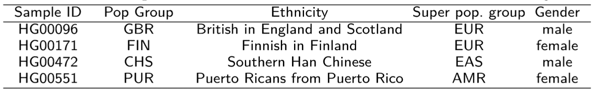

请查看面板文件的详细信息：ftp://ftp.1000genomes.ebi.ac.uk/vol1/ftp/release/20130502/integrated_call_samples_v3.20130502.ALL.panel。

然后，加载 ADAM 基因型并过滤基因型，以便我们只留下对我们感兴趣的人群中的那些：

```py
val allGenotypes: RDD[Genotype] = sc.loadGenotypes(genotypeFile).rdd
val genotypes: RDD[Genotype] = allGenotypes.filter(genotype => {
      panel.contains(genotype.getSampleId)
    })
```

接下来，将 `Genotype` 对象转换为我们的 `SampleVariant` 对象以节省内存。然后，将 `genotype` 对象转换为包含需要进一步处理的数据的 `SampleVariant` 对象：

+   **样本 ID**：用于唯一标识特定的样本

+   **变异 ID**：用于唯一标识特定的遗传变异

+   **替代等位基因计数**：当样本与参考基因组不同时需要

准备 `SampleVariant` 的签名如下，它接受 `sampleID`、`variationId` 和 `alternateCount` 对象：

```py
// Convert the Genotype objects to our own SampleVariant objects to try and conserve memory
case class SampleVariant(sampleId: String, variantId: Int, alternateCount: Int)
```

然后，我们必须从基因型文件中找到 `variantID`。`varitantId` 是一个由名称、染色体中的起始和结束位置组成的字符串类型：

```py
def variantId(genotype: Genotype): String = {
      val name = genotype.getVariant.getContigName
      val start = genotype.getVariant.getStart
      val end = genotype.getVariant.getEnd
      s"$name:$start:$end"
    }
```

一旦我们有了 `variantID`，我们就应该寻找 `alternateCount`。在基因型文件中，具有等位基因参考的对象将是遗传替代物：

```py
def alternateCount(genotype: Genotype): Int = {
        genotype.getAlleles.asScala.count(_ != GenotypeAllele.REF)
    }
```

最后，我们将构建一个 `SampleVariant` 对象。为此，我们需要将样本 ID 内部化，因为它们在 VCF 文件中会重复很多次：

```py
def toVariant(genotype: Genotype): SampleVariant = {
      new SampleVariant(genotype.getSampleId.intern(),
        variantId(genotype).hashCode(),
        alternateCount(genotype))
    }
```

现在，我们需要准备 `variantsRDD`。首先，我们必须按样本 ID 对变异进行分组，以便我们可以逐个处理变异。然后，我们可以获取用于查找某些样本缺失变异的总样本数。最后，我们必须按变异 ID 对变异进行分组，并过滤掉某些样本缺失的变异：

```py
val variantsRDD: RDD[SampleVariant] = genotypes.map(toVariant)
val variantsBySampleId: RDD[(String, Iterable[SampleVariant])] = variantsRDD.groupBy(_.sampleId)
val sampleCount: Long = variantsBySampleId.count()

println("Found " + sampleCount + " samples")
val variantsByVariantId: RDD[(Int, Iterable[SampleVariant])] =
      variantsRDD.groupBy(_.variantId).filter {
        case (_, sampleVariants) => sampleVariants.size == sampleCount
      }
```

现在，让我们将 `variantId` 与具有大于零的替代计数的样本数量进行映射。然后，我们过滤掉不在我们期望的频率范围内的变异。这里的目的是减少数据集的维度数量，使其更容易训练模型：

```py
val variantFrequencies: collection.Map[Int, Int] = variantsByVariantId
      .map {
        case (variantId, sampleVariants) =>
          (variantId, sampleVariants.count(_.alternateCount > 0))
      }
      .collectAsMap()
```

样本总数（或个体数）已经确定。现在，在根据变异 ID 对它们进行分组之前，我们可以过滤掉不太重要的变异。由于我们有超过 8400 万个遗传变异，过滤可以帮助我们处理维度诅咒。

指定的范围是任意的，因为它包括合理数量的变体，但不是太多。更具体地说，对于每个变体，已经计算了等位基因的频率，并且排除了具有少于 12 个等位基因的变体，从而在分析中留下了大约 3,000,000 个变体（对于 23 个染色体文件）：

```py
val permittedRange = inclusive(11, 11) // variants with less than 12 alternate alleles 
val filteredVariantsBySampleId: RDD[(String, Iterable[SampleVariant])] =
      variantsBySampleId.map {
        case (sampleId, sampleVariants) =>
          val filteredSampleVariants = sampleVariants.filter(
            variant =>
              permittedRange.contains(
                variantFrequencies.getOrElse(variant.variantId, -1)))
          (sampleId, filteredSampleVariants)
      }
```

一旦我们有了 `filteredVariantsBySampleId`，我们需要对每个样本 ID 的变体进行排序。每个样本现在应该具有相同数量的排序变体：

```py
val sortedVariantsBySampleId: RDD[(String, Array[SampleVariant])] =
      filteredVariantsBySampleId.map {
        case (sampleId, variants) =>
          (sampleId, variants.toArray.sortBy(_.variantId))
      }
    println(s"Sorted by Sample ID RDD: " + sortedVariantsBySampleId.first())
```

RDD 中的所有项现在都应该具有相同的变体，并且顺序相同。最终任务是使用 `sortedVariantsBySampleId` 来构建一个包含区域和等位基因计数的行 RDD：

```py
val rowRDD: RDD[Row] = sortedVariantsBySampleId.map {
      case (sampleId, sortedVariants) =>
        val region: Array[String] = Array(panel.getOrElse(sampleId, "Unknown"))
        val alternateCounts: Array[Int] = sortedVariants.map(_.alternateCount)
        Row.fromSeq(region ++ alternateCounts)
    }
```

因此，我们只需使用第一个来构建我们的训练 DataFrame 的标题：

```py
val header = StructType(
      Array(StructField("Region", StringType)) ++
        sortedVariantsBySampleId
        .first()
        ._2
        .map(variant => {
          StructField(variant.variantId.toString, IntegerType)
        }))
```

干得好！我们有了我们的 RDD 和 `StructType` 标题。现在，我们可以用最小的调整/转换来玩 Spark 机器学习算法。

# 训练 k-means 算法

一旦我们有了 `rowRDD` 和标题，我们需要使用标题和 `rowRDD` 从变体中构建我们的模式 DataFrame 的行：

```py
// Create the SchemaRDD from the header and rows and convert the SchemaRDD into a Spark DataFrame
val sqlContext = sparkSession.sqlContext
var schemaDF = sqlContext.createDataFrame(rowRDD, header)
schemaDF.show(10)
>>> 
```

前面的 `show()` 方法应该显示包含特征和 `label` 列（即 `Region`）的训练数据集快照：

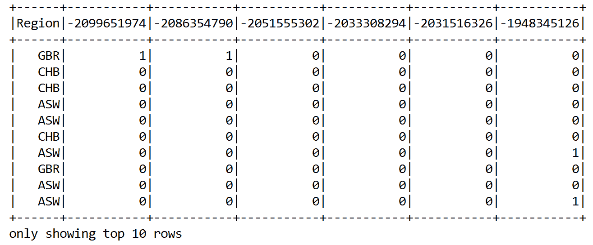

在前面的 DataFrame 中，只显示了少数 `feature` 列和 `label` 列，以便它适合页面。由于训练将是无监督的，我们需要删除 `label` 列（即 `Region`）：

```py
schemaDF = sqlContext.createDataFrame(rowRDD, header).drop("Region")
schemaDF.show(10)
>>> 
```

前面的 `show()` 方法显示了以下 k-means 的训练数据集快照。注意，没有 `label` 列（即 `Region`）：

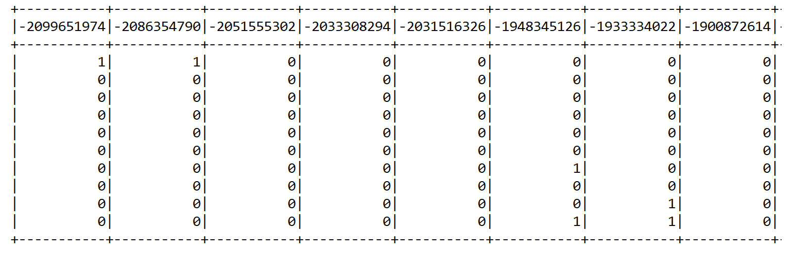

在第一章，《使用 Scala 的机器学习入门》，和第二章，《Scala 回归分析》，我们了解到 Spark 预期用于监督训练有两个列（`features` 和 `label`）。然而，对于无监督训练，只需要包含特征的单一列。由于我们删除了 `label` 列，我们现在需要将整个 `variable` 列合并为一个单一的 `features` 列。为此，我们将使用 `VectorAssembler()` 转换器。让我们选择要嵌入到向量空间中的列：

```py
val featureCols = schemaDF.columns
```

然后，我们将通过指定输入列和输出列来实例化 `VectorAssembler()` 转换器：

```py
// Using vector assembler to create feature vector 
val featureCols = schemaDF.columns
val assembler = new VectorAssembler()
    .setInputCols(featureCols)
    .setOutputCol("features")
 val assembleDF = assembler.transform(schemaDF).select("features")
```

现在，让我们看看 k-means 的特征向量是什么样的：

```py
assembleDF.show()
```

前面的行显示了组装的向量，这些向量可以用作 k-means 模型的特征向量：

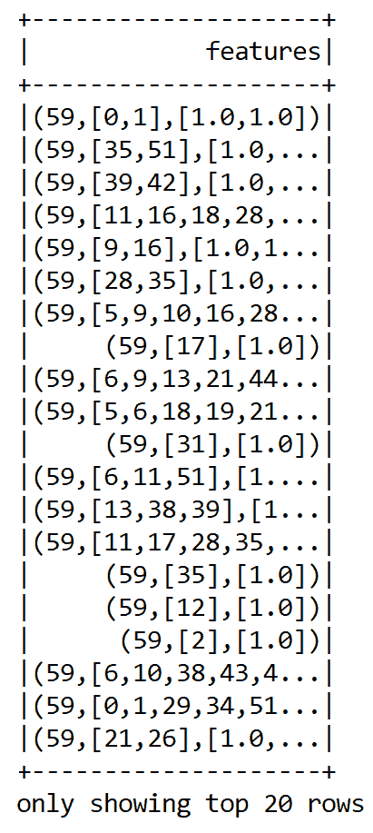

最后，我们准备好训练 k-means 算法并通过计算 **WCSS** 来评估聚类：

```py
val kmeans = new KMeans().setK(5).setSeed(12345L)
val model = kmeans.fit(assembleDF)
 val WCSS = model.computeCost(assembleDF)
println("Within Set Sum of Squared Errors for k = 5 is " + WCSS)
 }
```

下面的 **WCSS** 值为 `k = 5`：

```py
Within Set Sum of Squared Errors for k = 5 is 59.34564329865
```

我们成功地将 k-means 应用于聚类遗传变异。然而，我们注意到 WCSS 很高，因为 k-means 无法分离不同相关的高维特征之间的非线性。这是因为基因组测序数据集由于大量的遗传变异而具有非常高的维度。

在下一节中，我们将看到如何使用降维技术，如 PCA，在将数据输入到 k-means 之前降低输入数据的维度，以获得更好的聚类质量。

# 降维

由于人类是视觉生物，理解高维数据集（甚至超过三个维度）是不可能的。即使是对于机器（或者说，我们的机器学习算法），也很难从相关的高维特征中建模非线性。在这里，降维技术是一个救星。

从统计学的角度来看，降维是减少随机变量的数量，以找到数据的一个低维表示，同时尽可能保留尽可能多的信息**。**

PCA 的整体步骤可以在以下图表中直观地表示：

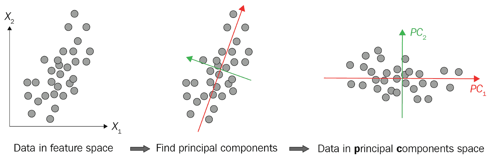

主成分分析（PCA）和**奇异值分解**（**SVD**）是降维中最受欢迎的算法。从技术上讲，PCA 是一种用于强调变异并从数据集中提取最显著模式（即特征）的统计技术，这不仅对聚类有用，对分类和可视化也有帮助。

# 基于 Spark ML 的主成分分析

基于 Spark-ML 的 PCA 可以用来将向量投影到低维空间，在将它们输入到 k-means 模型之前降低遗传变异特征的维度。以下示例展示了如何将以下特征向量投影到 4 维主成分：

```py
val data = Array(
      Vectors.dense(1.2, 3.57, 6.8, 4.5, 2.25, 3.4),
      Vectors.dense(4.60, 4.10, 9.0, 5.0, 1.67, 4.75),
      Vectors.dense(5.60, 6.75, 1.11, 4.5, 2.25, 6.80))

val df = spark.createDataFrame(data.map(Tuple1.apply)).toDF("features")
df.show(false)
```

现在我们有一个具有 6 维特征向量的特征 DataFrame，它可以被输入到 PCA 模型中：

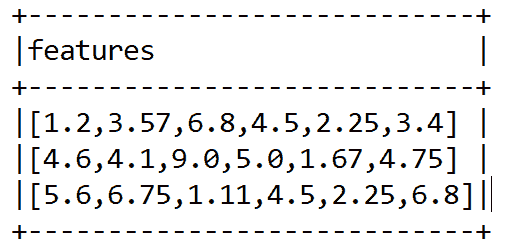

首先，我们必须通过设置必要的参数来实例化 PCA 模型，如下所示：

```py
val pca = new PCA()
      .setInputCol("features")
      .setOutputCol("pcaFeatures")
      .setK(4)
      .fit(df)
```

为了区分原始特征和基于主成分的特征，我们使用`setOutputCol()`方法将输出列名设置为`pcaFeatures`。然后，我们设置 PCA 的维度（即主成分的数量）。最后，我们将 DataFrame 拟合以进行转换。可以从旧数据中加载模型，但`explainedVariance`将会有一个空向量。现在，让我们展示生成的特征：

```py
val result = pca.transform(df).select("features", "pcaFeatures")
result.show(false)
```

上述代码使用 PCA 生成一个具有 4 维特征向量的特征 DataFrame，作为主成分：

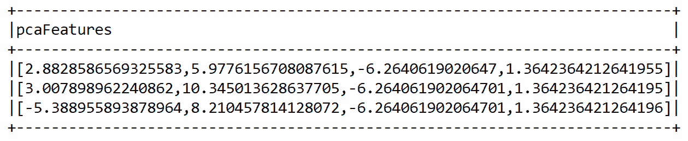

同样，我们可以将上一步组装的 DataFrame（即`assembleDF`）和前五个主成分进行转换。你可以调整主成分的数量。

最后，为了避免任何歧义，我们将 `pcaFeatures` 列重命名为 `features`：

```py
val pcaDF = pca.transform(assembleDF)
           .select("pcaFeatures")
           .withColumnRenamed("pcaFeatures", "features")
pcaDF.show()
```

上述代码行显示了嵌入的向量，这些向量可以用作 k-means 模型的特征向量：

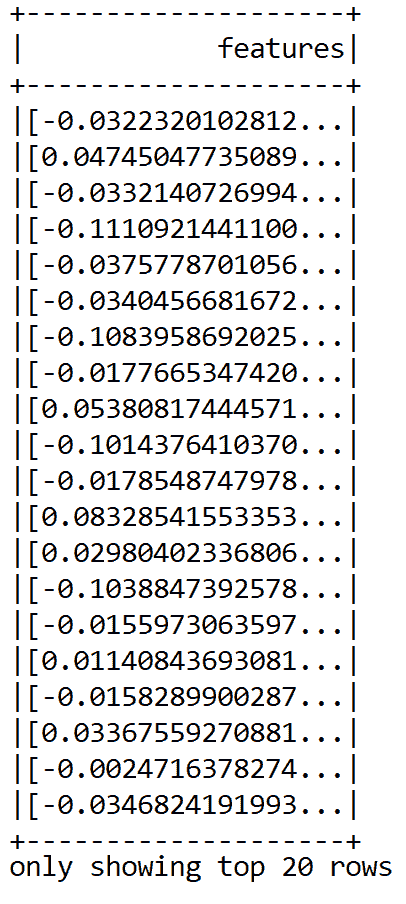

上述截图显示了前五个主成分作为最重要的特征。太好了——一切顺利。最后，我们准备训练 k-means 算法并通过计算 WCSS 来评估聚类：

```py
val kmeans = new KMeans().setK(5).setSeed(12345L)
val model = kmeans.fit(pcaDF)
 val WCSS = model.computeCost(pcaDF)
println("Within Set Sum of Squared Errors for k = 5 is " + WCSS)
    }
```

这次，WCSS 略微降低（与之前的值 `59.34564329865` 相比）：

```py
Within Set Sum of Squared Errors for k = 5 is 52.712937492025276
```

通常，我们随机设置 `k` 的数量（即 `5`）并计算 WCSS。然而，这种方法并不能总是设置最佳聚类数量。为了找到一个最佳值，研究人员提出了两种技术，称为肘部方法和轮廓分析，我们将在下一小节中探讨。

# 确定最佳聚类数量

有时候，在开始训练之前天真地假设聚类数量可能不是一个好主意。如果假设与最佳聚类数量相差太远，模型会因为引入的过拟合或欠拟合问题而表现不佳。因此，确定最佳聚类数量是一个独立的优化问题。有两种流行的技术来解决此问题：

+   被称为**肘部方法**的启发式方法

+   **轮廓分析**，用于观察预测聚类的分离距离

# 肘部方法

我们首先将 `k` 值设置为 `2`，并在相同的数据集上运行 k-means 算法，通过增加 `k` 并观察 WCSS 的值。正如预期的那样，成本函数（即 WCSS 值）在某一点应该会有一个急剧下降。然而，在急剧下降之后，随着 `k` 值的增加，WCSS 的值变得微不足道。正如肘部方法所建议的，我们可以在 WCSS 的最后一次大幅下降后选择 `k` 的最佳值：

```py
val iterations = 20
    for (k <- 2 to iterations) {
      // Trains a k-means model.
      val kmeans = new KMeans().setK(k).setSeed(12345L)
      val model = kmeans.fit(pcaDF)

// Evaluate clustering by computing Within Set Sum of Squared Errors.
val WCSS = model.computeCost(pcaDF)
println("Within Set Sum of Squared Errors for k = " + k + " is " + WCSS)
    }
```

现在，让我们看看不同数量聚类（例如 `2` 到 `20`）的 WCSS 值：

```py
Within Set Sum of Squared Errors for k = 2 is 135.0048361804504
Within Set Sum of Squared Errors for k = 3 is 90.95271589232344
...
Within Set Sum of Squared Errors for k = 19 is 11.505990055606803
Within Set Sum of Squared Errors for k = 20 is 12.26634441065655
```

如前述代码所示，我们计算了成本函数 WCSS 作为聚类数量的函数，并将其应用于所选种群组的 Y 染色体遗传变异。可以观察到，当 `k = 5` 时会出现一个大的下降（尽管不是急剧下降）。因此，我们选择聚类数量为 10。

# 轮廓分析

通过观察预测聚类的分离距离来分析轮廓。绘制轮廓图将显示数据点与其邻近聚类之间的距离，然后我们可以通过视觉检查多个聚类，以便相似的数据点得到良好的分离。

轮廓得分，用于衡量聚类质量，其范围为 [-1, 1]。通过计算轮廓得分来评估聚类质量：

```py
val evaluator = new ClusteringEvaluator()
for (k <- 2 to 20 by 1) {
      val kmeans = new KMeans().setK(k).setSeed(12345L)
      val model = kmeans.fit(pcaDF)
      val transformedDF = model.transform(pcaDF)
      val score = evaluator.evaluate(transformedDF)
      println("Silhouette with squared Euclidean distance for k = " + k + " is " + score)
    }
```

我们得到以下输出：

```py
Silhouette with squared Euclidean distance for k = 2 is 0.9175803927739566
Silhouette with squared Euclidean distance for k = 3 is 0.8288633816548874
....
Silhouette with squared Euclidean distance for k = 19 is 0.5327466913746908
Silhouette with squared Euclidean distance for k = 20 is 0.45336547054142284
```

如前述代码所示，轮廓的高度值是通过`k = 2`生成的，为`0.9175803927739566`。然而，这表明遗传变异应该分为两组。肘部方法建议`k = 5`作为最佳聚类数量。

让我们使用平方欧几里得距离来找出轮廓，如下面的代码块所示：

```py
val kmeansOptimal = new KMeans().setK(2).setSeed(12345L)
val modelOptimal = kmeansOptimal.fit(pcaDF)

// Making predictions
val predictionsOptimalDF = modelOptimal.transform(pcaDF)
predictionsOptimalDF.show()    

// Evaluate clustering by computing Silhouette score
val evaluatorOptimal = new ClusteringEvaluator()
val silhouette = evaluatorOptimal.evaluate(predictionsOptimalDF)
println(s"Silhouette with squared Euclidean distance = $silhouette")
```

`k = 2`的平方欧几里得距离轮廓值为`0.9175803927739566`。

已经发现，分割 k 均值算法可以对数据点的聚类分配产生更好的结果，收敛到全局最小值。另一方面，k 均值算法往往陷入局部最小值。请注意，根据您的机器硬件配置和数据集的随机性，您可能会观察到前面参数的不同值。

感兴趣的读者还应参考基于 Spark-MLlib 的聚类技术[`spark.apache.org/docs/latest/mllib-clustering.html`](https://spark.apache.org/docs/latest/mllib-clustering.html)，以获得更多见解。

# 摘要

在本章中，我们讨论了一些聚类分析方法，如 k 均值、分割 k 均值和 GMM。我们看到了如何根据遗传变异对族群进行聚类的逐步示例。特别是，我们使用了 PCA 进行降维，k 均值进行聚类，以及 H2O 和 ADAM 处理大规模基因组数据集。最后，我们学习了肘部和轮廓方法来寻找最佳聚类数量。

聚类是大多数数据驱动应用的关键。读者可以尝试在更高维度的数据集上应用聚类算法，例如基因表达或 miRNA 表达，以聚类相似和相关的基因。一个很好的资源是基因表达癌症 RNA-Seq 数据集，它是开源的。此数据集可以从 UCI 机器学习存储库下载，网址为[`archive.ics.uci.edu/ml/datasets/gene+expression+cancer+RNA-Seq`](https://archive.ics.uci.edu/ml/datasets/gene+expression+cancer+RNA-Seq)。

在下一章中，我们将讨论推荐系统中的基于物品的协同过滤方法。我们将学习如何开发一个图书推荐系统。技术上，它将是一个基于 Scala 和 Spark 的模型推荐引擎。我们将看到如何实现 ALS 和矩阵分解之间的互操作。
