# 1

# 评估您的算法、模型和 AI 环境的脆弱性

欢迎您加入 Azure 机器学习安全之旅！我们将一起探索所有方法和技巧来保护我们的 AI 项目，并为我们的服务设定安全基线。让我们从对**机器学习**（**ML**）生命周期和 Azure 机器学习组件以及与 Azure 中 ML 工作相关的流程的快速介绍开始。我们将涵盖您需要了解的基本知识，以便遵循本书中概述的概念和实施。

下一步将是通过一个示例场景，我们将在此书中将其作为应用数据、模型、工作区以及使用部署在 Azure 机器学习中的模型的应用程序的安全概念的依据。您可以按照说明在您的 Azure 机器学习环境中重新创建此场景，以便熟悉 Azure 机器学习组件。

我们将使用**零信任**模型来开发实施和评估策略。该模型是一种基于“永不信任，始终验证”原则的安全策略。此模型适用于所有实施级别，从身份、基础设施和网络到应用程序、端点和数据。当与多个服务和环境一起工作时，这是一种最佳方法，因为我们很容易将其适应现代云和混合环境的复杂性。由于制定策略在很大程度上取决于每个组织的个别场景和用例，因此在本书中，我们将探讨多个选项，并展示几个零信任方面的实施。

在本章中，我们将涵盖以下主要主题：

+   审查 Azure 机器学习生命周期

+   介绍一个机器学习项目

+   探索零信任模型

+   评估机器学习资产和应用程序的脆弱性

到本章结束时，您将熟悉零信任策略的基本原则和防御领域。您可以使用此策略对在 Azure 中托管的**人工智能**（**AI**）/ML 项目组件、应用程序和相关服务进行高级脆弱性评估。

# 技术要求

在本书中，我们将需要一些东西来应用所学知识和实施。如果需要，每一章都会概述更多细节，但我们需要的最小资源是一个**Azure 订阅**以及与其相关服务的 Azure 机器学习资源。

## Azure 订阅和资源

在整本书中，我们将参考本节中提出的场景以及 Azure 中的其他服务和实现。你需要一个有效的 Azure 订阅和一个 Azure 机器学习工作区来跟随或复制结果。

如果你没有 Azure 订阅，你可以通过以下链接激活免费试用：https://azure.microsoft.com/en-us/pricing/offers/ms-azr-0044p/。

如果你从头到尾运行本章中建议的项目，只要你在之后删除所有相关资源并使用所有服务最低定价层，它不应超过 150-200 美元。然而，这个估计可能会根据你选择的地区、你选择实现的功能、数据集的大小以及你计划部署资源的时间而变化。试用版将为你提供足够的余额来尝试它；然而，我强烈建议使用 Azure 定价计算器和在你的订阅中进行成本管理，以确保将成本保持在最低，并在不再使用或需要资源时删除或停止资源。

注意

Azure 免费试用版为你提供在 Azure 服务上花费的信用额度。用完之后，你可以保留账户并使用免费的 Azure 服务。你需要添加你的信用卡，但除非你明确更改你的订阅类型，否则服务不会对你的卡收费。Azure 使用按使用付费的定价模式。为了确保你的信用额度不会比预期更快用完，请访问 Azure 定价计算器：https://azure.microsoft.com/en-us/pricing/calculator/。

### Azure 机器学习

要使用 Azure 机器学习，你需要创建一个 Azure 机器学习资源。以下截图显示了创建一个资源的基本选项：

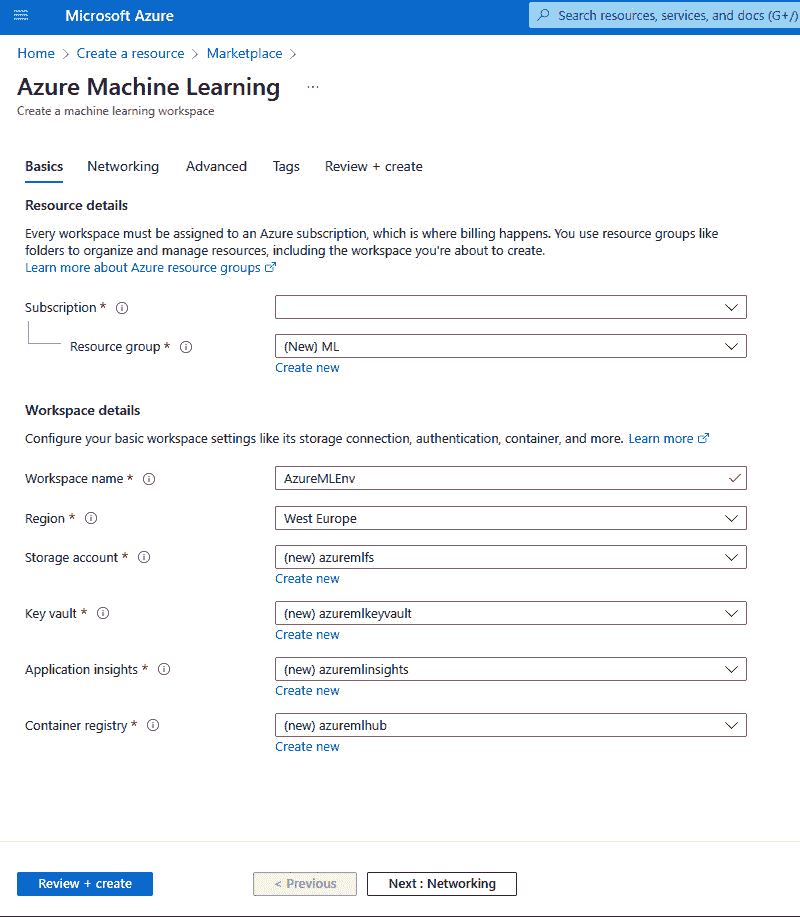

图 1.1 – Azure 机器学习资源创建表单

# 检查 Azure 机器学习生命周期

无论我们选择什么技术或框架来开发我们的机器学习项目，我们都会经历四个阶段。每个阶段都有一个或多个步骤，具体取决于个别场景。机器学习生命周期很重要，因为它清楚地概述了每个项目步骤。然后，它很容易将项目分解成任务并分配给负责人，因为通常在机器学习项目中涉及多个角色。

在我们将它们与 Azure 机器学习的组件连接之前，让我们回顾所有这些阶段。

## 机器学习生命周期

在机器学习中，我们识别出四个阶段：业务理解、数据操作、模型训练和模型部署。如图所示，这些阶段是迭代过程的一部分：

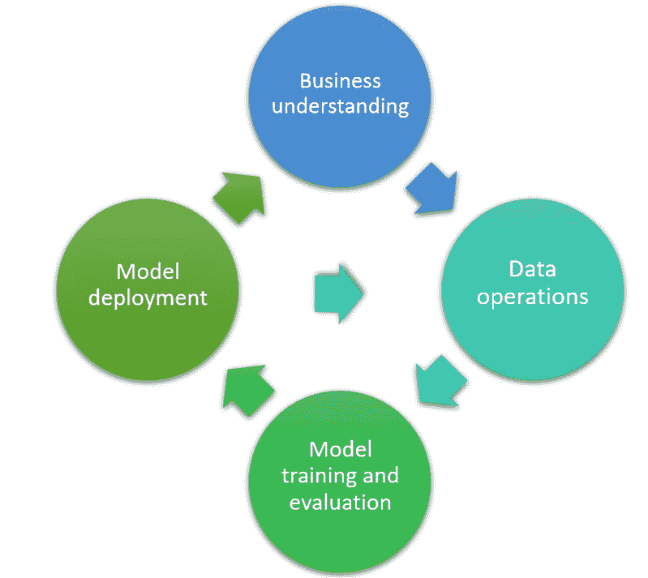

图 1.2 – 机器学习生命周期

让我们逐一了解这个迭代过程的每个步骤及其包含的内容，从业务理解阶段和收集初始需求开始。

### 业务理解

每个项目都是从需要解决的问题开始的。业务理解（或问题理解）是制定计划的第一步，该计划概述了需要完成的工作。理想情况下，我们希望需求能够被清晰地详细说明，但这很少是情况。首先，要理解项目的目标以及它能为业务带来哪些真正的价值。然后，通过将问题缩小到可执行的任务来评估哪些流程可以使用机器学习进行自动化。

例如，让我们考察以下场景。我们的客户是一家医院管理，希望通过提高医生的生产力和尽可能自动化他们的工作负载来降低成本。在对医生日常任务的分析中，他们发现医生花了很多时间查阅患者病史和分析血液检查。通过减少 5%的时间，医生可以在不加班的情况下看更多的病人。我们可以通过使用监督学习技术来解决这个问题，其中可以训练一个机器学习模型，通过结合患者的症状和血液检查结果来建议疾病。医生仍然需要验证结果。然而，缩短分析时间可以提高医生的生产力。

在缩小需求和明确问题之后，下一步是检查数据。

### 数据操作

机器学习基于数据。在这个阶段，我们处理与数据操作有关的所有事情，从数据收集到数据处理。**数据收集**或**数据搜集**是目标是为了收集与当前问题相关的数据。这些数据可能来自各种来源，如文件、数据库、API 或传感器。这是项目中最关键的步骤之一，因为我们要识别不同的数据来源，收集和整合数据。我们收集的数据的质量和数量将决定模型输出的效率和准确性。

收集到的数据可能很混乱，通常不适合被机器学习算法使用。数据问题包括无关数据、噪声、异常值和缺失数据。这就是**数据准备**或**数据整理**发挥作用的地方。任何与我们模型无关的数据都应该被适当过滤。当识别出异常值时，我们通常将它们从数据集中删除。对于缺失数据，处理过程要复杂一些。一旦识别出异常值，就应该对其进行评估，要么删除，要么用默认值或计算值填充。最后，数据可能需要以不同的方式编码，以便被机器学习算法使用。

### 模型训练和评估

在这个阶段，选择一个合适的机器学习算法，并在准备好的数据上进行训练。通过完成多次训练迭代来开发模型，并在每次迭代的结束时评估结果，直到达到令人满意的性能水平。在这个阶段，可能需要返回并再次处理数据，以确保数据的相关性，并且没有意外的相关性可能影响结果。

### 模型部署

一旦结果令人满意，下一步就是部署模型，以便软件工程师可以将其集成到他们的应用程序中并进行预测。尽管这可能看起来像是终点，但这还远未结束。部署的模型需要被监控以确保性能正常。模型可能会随着时间的推移而退化，这会影响其预测的准确性。在这种情况下，我们可以使用更新的数据集重新训练模型，以确保这种情况不会发生，并且循环重新开始。改变需求或引入新的业务需求也可能导致我们重新训练我们的模型。

现在我们对机器学习过程有了很好的理解，我们可以继续了解 Azure 机器学习服务组件，这些组件是机器学习生命周期每个阶段的组成部分。我们开发 Azure 机器学习项目所需的一切都是**Azure 机器学习工作室**或工作空间的一部分或以某种方式相关。

## Azure 机器学习

Azure 机器学习是一个加速机器学习项目生命周期的云服务。它利用 Azure 基础设施连接到数据，并训练、部署和监控模型。该服务包括从连接来自多个数据源的数据到开发代码、训练、评估和发布可供 Web 应用程序使用的模型的各个方面。

该服务是一个完整的开发端到端机器学习项目的环境。它允许多个角色之间的协作，从数据科学家到开发者、安全工程师或 IT（信息技术）管理员。在本节中，我们将回顾每个组件如何映射到机器学习项目生命周期的各个部分以及服务功能。

### Azure 机器学习工作室

Azure 机器学习服务创建了几个相关的 Azure 服务，以便正确使用该服务。首先，你需要一个有效的 Azure 订阅。当你创建 Azure 机器学习资源时，以下服务将与它一起创建：一个**Azure 存储**账户，一个**应用程序洞察**资源，以及**Azure** **容器注册表**。

Azure 存储账户充当文件系统。所有导入的文件、笔记本等都被保存在这里。应用程序洞察资源可用于监控已部署的模型，并在部署的模型不符合预期时提供日志和洞察。在创建工作区时，Azure 容器注册表是可选的，但如果您计划在 **Azure 容器实例**（**ACI**）服务中发布模型，您可能需要它。模型可以发布到不同的计算目标，包括容器，并作为 **API** 创建，以便任何应用程序都可以轻松使用模型进行预测。其他所有操作都通过 Azure Machine Learning Studio 处理。在这里，您可以处理您的数据，创建计算资源，训练和部署您的模型，管理用户访问，等等。

下面的屏幕截图显示了 Azure Machine Learning Studio 的主页。在左侧，您可以找到 Azure Machine Learning **创作**、**资产**、**计算**和其他资源管理选项：

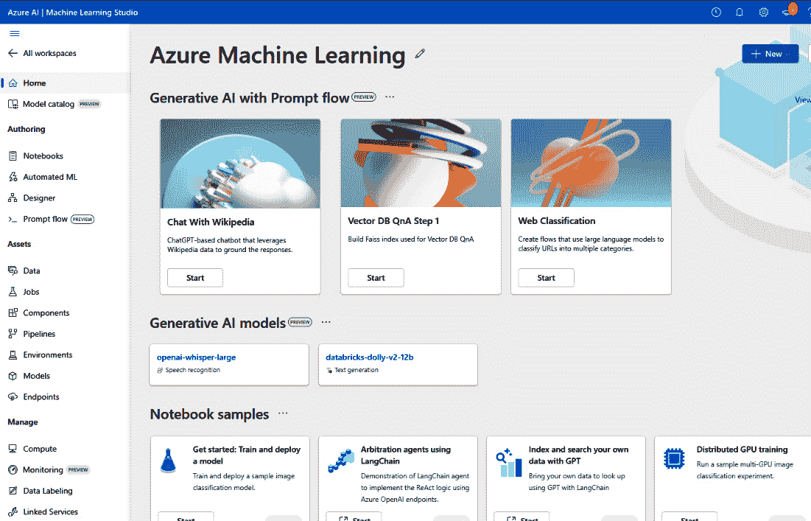

图 1.3 – Azure Machine Learning Studio

大部分工作将在工作区中进行，无论是数据准备和导入、代码开发，还是模型训练和推理。让我们看看我们有哪些功能和资产可以用来工作。

#### 数据处理

在 Azure Machine Learning Studio 中处理数据有几种方式。第一种是通过创建 **数据存储** 来处理存储在其他地方的数据。数据存储是对 Azure 上现有存储的引用。这可能包括 **Azure Blob 存储** 或 **Azure Data Lake**。如果您的数据不在 Azure 上，您仍然可以在 Azure Machine Learning 中处理它。您始终可以将文件作为数据资产上传到工作区或添加对外部数据库的引用。然后，您可以在项目中使用它们，与您的同事共享，并保持版本控制以跟踪更改和更新。

在下面的屏幕截图中，您可以查看您可以导入的一些数据资产类型：

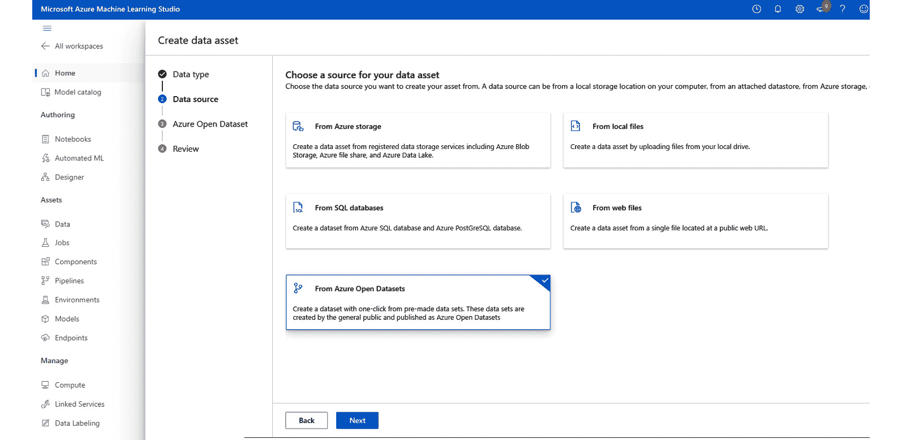

图 1.4 – 在 Azure Machine Learning Studio 中创建数据资产

#### Azure Machine Learning 设计器

您可以使用 **Python** 和 **R** 来开发您的 Azure Machine Learning 项目，但该服务也提供了一个可视化设计器。您可以使用设计器进行训练和推理（生产模型进行预测）。

参考以下屏幕截图：

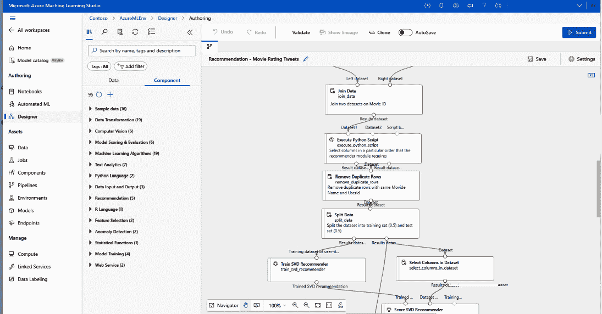

图 1.5 – Azure Machine Learning 设计器

设计师为多种操作提供了许多开箱即用的模块，您可以将它们拖放到画布上以创建训练管道。这包括导入数据、分割数据集、SQL 操作、算法和模型评估模块。如果您需要更多，您始终可以使用 Python 或 R 的自定义脚本模块并将您的代码作为管道的一部分添加。好处是您只需点击几下就可以快速转到推理管道并将其转换为 Web 服务。

#### 自动化机器学习

Azure Machine Learning 的 **自动化机器学习**（**自动化 ML**）功能是一套工具和技术，用于自动化构建机器学习模型的过程。它通过自动选择给定数据集的最佳算法和超参数，然后训练和验证模型，帮助初学者或经验丰富的数据科学家。这个过程通过将各种算法（如决策树、随机森林和深度神经网络）应用于数据并选择表现最佳的模型来完成。它还包括数据特征，如预处理、特征工程和模型选择。它允许用户将数据上传到 Azure Machine Learning 工作区，并让平台以最小配置处理剩余的机器学习过程。当从列表中选择最佳模型时，它可以部署到 **Web 服务**中，以便被消费，就像 Azure Machine Learning 工作区中的所有模型一样。请查看以下截图：

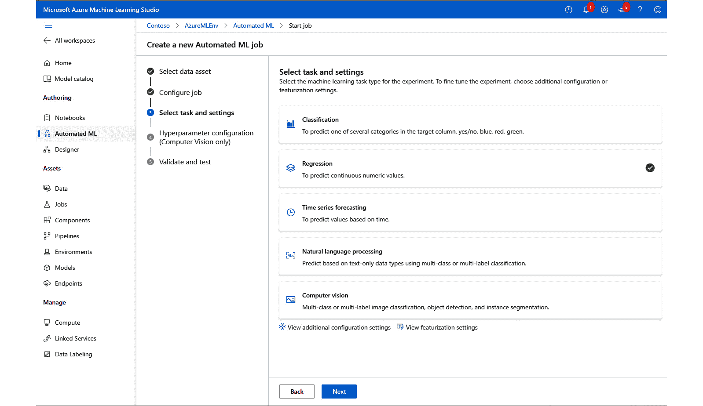

图 1.6 – 自动化机器学习支持的算法

#### 与计算资源协同工作

在训练或部署模型时，需要计算能力。Azure Machine Learning 提供基于 Azure 基础设施的扩展计算基础设施，用于训练和部署。要训练您的实验，您可以使用计算目标或计算集群。计算目标是一个运行您的训练作业的专用虚拟机。如果您需要更多功率，您可以创建一个由多个节点组成的集群以并行运行工作负载。您还可以从您未使用的虚拟机或其他 ML 服务（如 **Azure Databricks**）附加计算。您可以使用 ACI 或 **Azure Kubernetes 服务**（**AKS**）集群来部署模型。

#### 使用 Python 或 R 编码

除了可视化和自动化工具之外，Azure Machine Learning 还支持 **Jupyter Notebooks** 用于代码开发和协作。您可以使用嵌入的笔记本编辑器、带有 Azure Machine Learning 扩展的 **Visual Studio Code**，或者从训练期间的运行计算目标启动的 Jupyter Notebook 编辑器。以下截图展示了这一点：

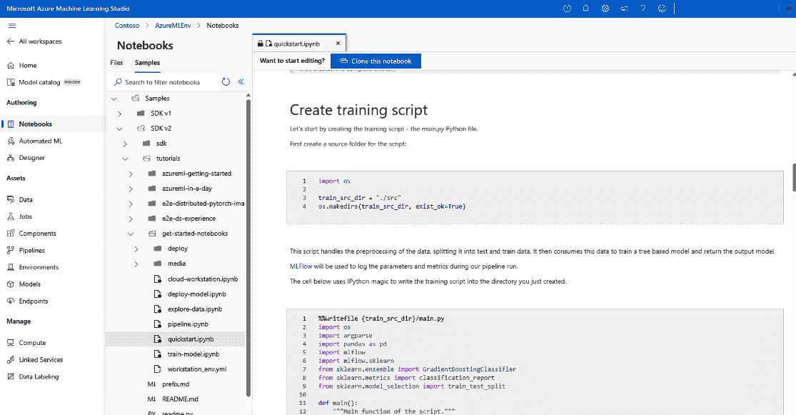

图 1.7 – Azure Machine Learning Studio 笔记本编辑器

在这里，我们可以看到 Azure 机器学习最基本的部分。工作区配备了多个功能和工具，可以促进机器学习生命周期的所有阶段，并将机器学习项目从开始到结束。在下一节中，我们将看到如何使用这里概述的功能和工具开发一个示例机器学习项目，从开发到生产。

# 介绍机器学习项目

如果你想要跟随这本书中的实现示例，这里有一个示例项目来帮助你开始。如果你已经是 Azure 机器学习的专家，请随意跳过这个介绍。本节将帮助服务的新手或处于其他角色的人了解机器学习生命周期的实际操作。我们将创建一个示例项目，展示如何将数据集导入 Azure 机器学习，如何使用自动机器学习功能使用多个参数训练多个模型，并将生成的模型作为端点部署以用于预测。选择自动机器学习功能是因为它不需要广泛的数据科学专业知识。

登录到**Azure 门户**([`portal.azure.com/`](https://portal.azure.com/))并查找**Azure 机器学习资源**。从**概览**中，点击**Studio web URL**或**启动工作室**按钮以访问你的工作区，如图所示：

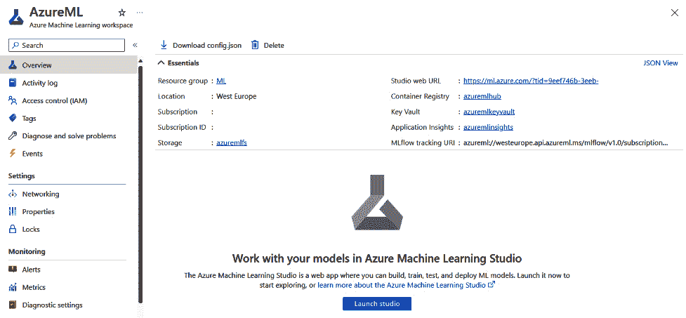

图 1.8 – 访问你的 Azure 机器学习工作区

现在，你将发现自己在工作区的首页。从现在开始，你将在以下各节中找到所有选项。

## 数据集

机器学习从数据开始，因此你需要找到一个数据集来训练模型进行预测。有许多开源数据集可供机器学习使用，你可以免费下载它们——例如，从大学存储库用于学习和研究目的。只需确保来源可靠，以免下载时包含恶意软件或类似的东西。在这个例子中，我们将使用带有自动机器学习的回归任务。如果你想跟随这些步骤，你可以使用任何数据集；只需确保你调整自动机器学习选项以匹配你选择的数据集。如果你没有太多经验，并且想要与这里使用的数据集相似的东西，当你寻找数据集时，请注意任务和数据。如果它可以用于回归并且包含一个包含数值数据的列，你的模型将训练来预测，任何数据集都适用。自动机器学习目前不支持所有类型的机器学习任务，所以这是一个很好的入门方式。

我正在使用一个包含患者症状和标记患者是否被诊断为糖尿病的类列的样本数据集。这将有助于训练一个新模型，该模型可以根据症状预测患者是否会成为糖尿病患者。

如果您的数据集已经准备好，我们只需在**资产**下的**数据**菜单中创建一个新的数据资产。以下是操作步骤：

1.  首先，我们提供**名称**、**描述**的详细信息，并将**数据类型**设置为**表格型**，如图所示：

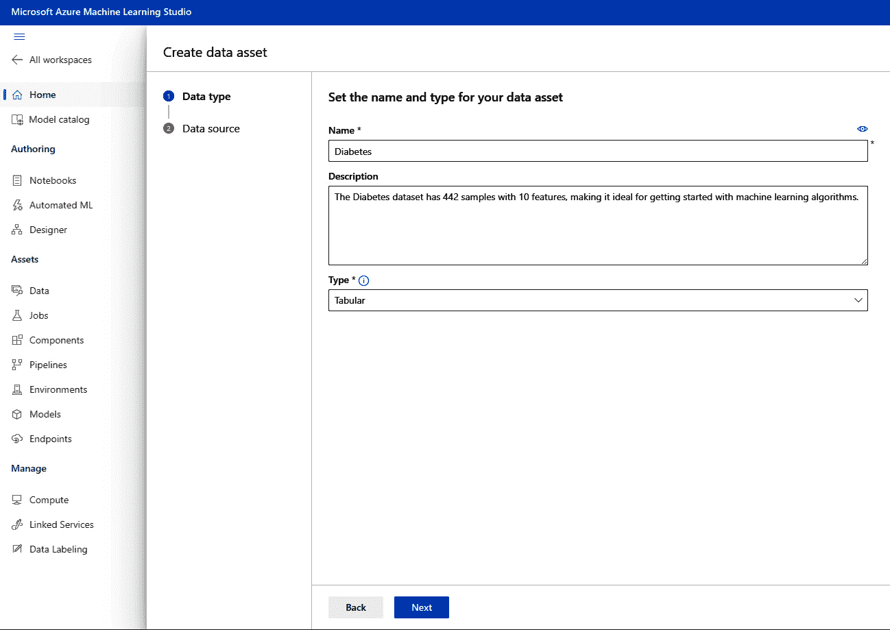

图 1.9 – 创建数据资产

1.  在向导的下一步中，选择**从本地****文件**选项：

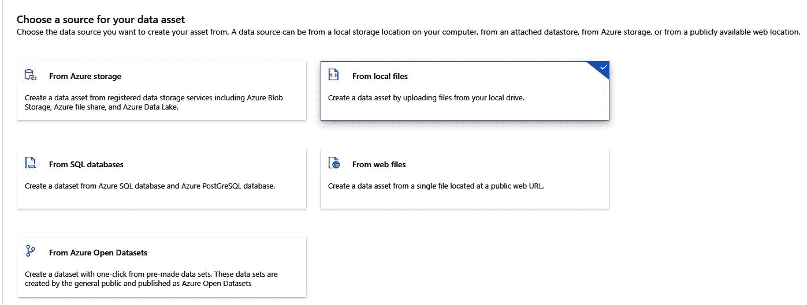

图 1.10 – 选择数据源

1.  在**存储类型**屏幕上保留默认选项，然后转到**文件或文件夹****选择**屏幕上传文件：

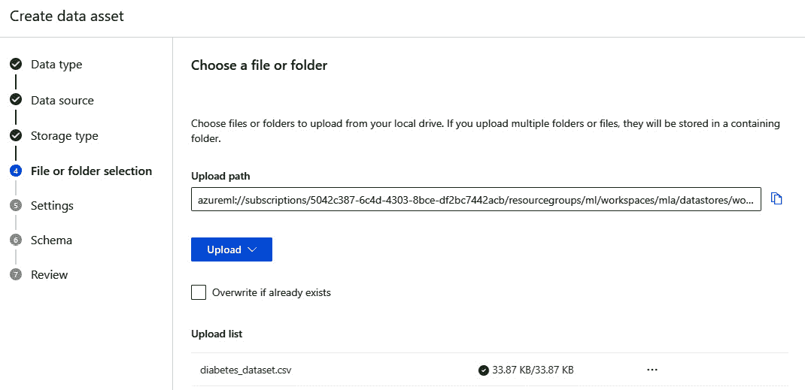

图 1.11 – 上传文件

1.  在**设置**下，选择如图所示的选项，直到**数据预览**显示正确的列和数据：

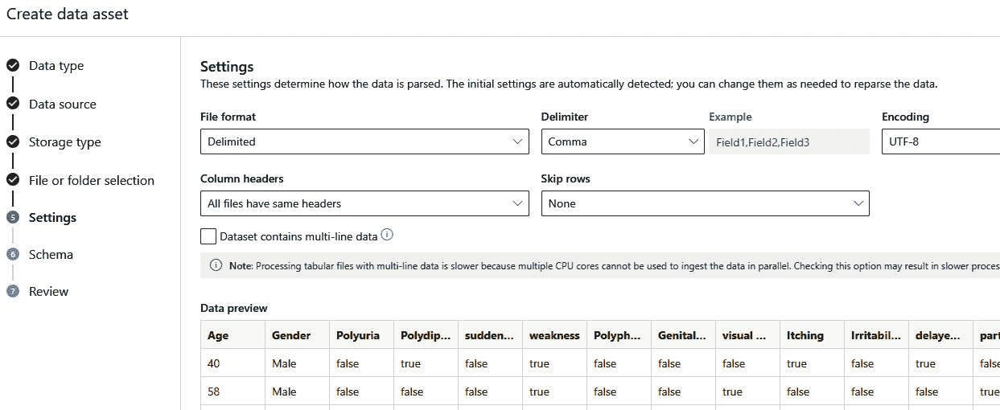

图 1.12 – 应用设置

1.  在**架构**下，确保排除**路径**列从数据集中。您还可以排除任何您认为与预测不相关的列，或者如果已识别错误，则更改**数据类型**：

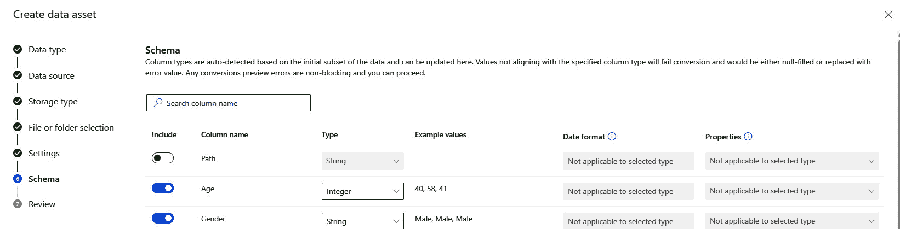

图 1.13 – 选择列和数据类型

转到**审查**屏幕并创建数据集。现在您有一个可用于您的机器学习项目的可用数据集！下一步是开始训练模型。

## 训练模型

训练我们的模型有许多方法。在这里，我们将使用 Azure 机器学习的自动化机器学习功能，通过多个算法和参数运行模型，让服务进行训练，并根据性能建议最佳模型。这是创建我们需要的所有组件以展示本书后面将要讨论的安全概念的最快方式。

让我们开始：

1.  要开始，请在**创作**下的**自动化机器学习**菜单中打开：

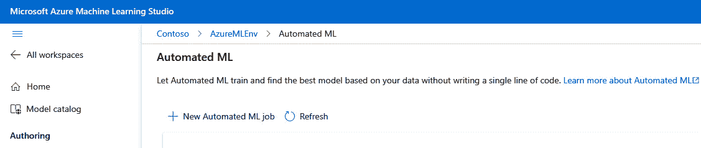

图 1.14 – 启动新的自动化机器学习作业

1.  选择您之前创建的数据集，然后转到下一屏幕：

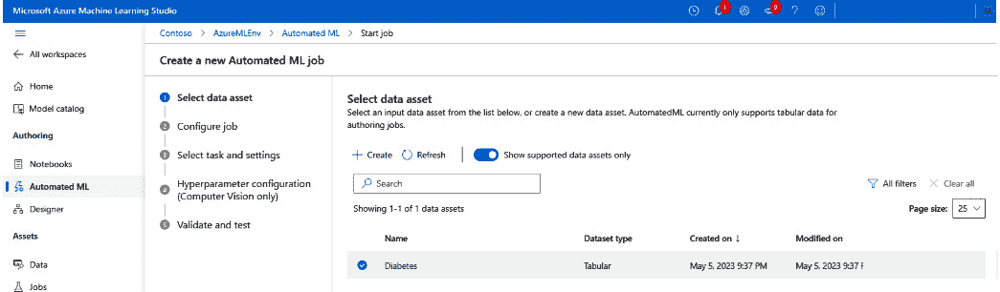

图 1.15 – 选择数据资产

1.  在**新实验名称**下给作业命名，并在数据集中填写**目标列**以预测。在这个数据集中，它是**Y**列：

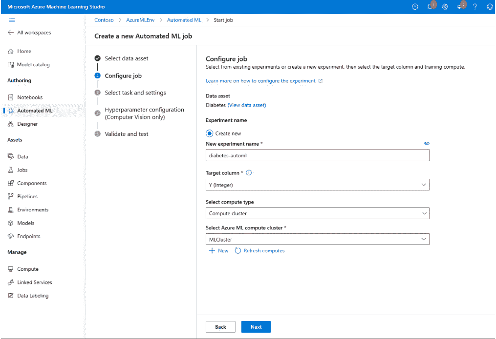

图 1.16 – 配置作业设置

1.  为训练计算选择**计算集群**选项，然后点击向导外的**新建**链接来创建一个新的集群：

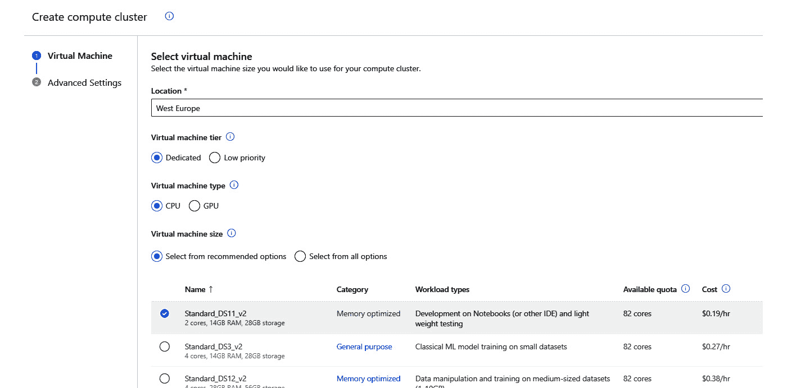

图 1.17 – 创建集群

1.  选择`0`和`2`应该就足够了：

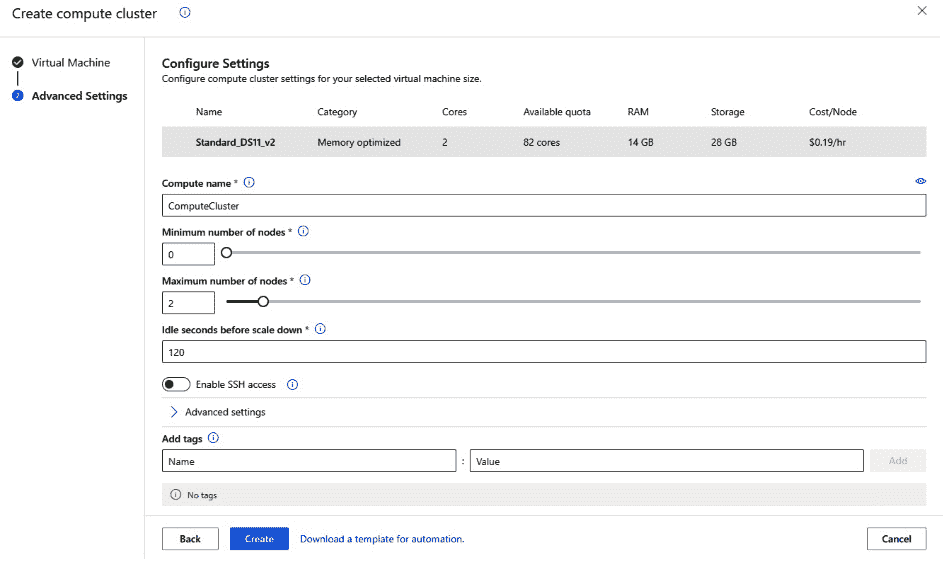

图 1.18 – 集群选项

1.  保留所有其他选项为默认值，创建集群，然后当您回到自动机器学习向导时，继续到**选择任务和****设置**屏幕。

1.  由于我们想要预测一个数值，所以我们选择算法的**回归**类别，如图所示。服务引擎将运行多个回归算法，认为它们适合数据配置文件以生成多个模型：

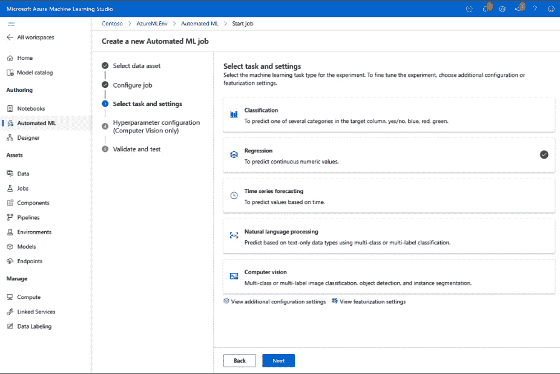

图 1.19 – 选择算法类别和设置

1.  在**退出标准**下的**1 小时**：

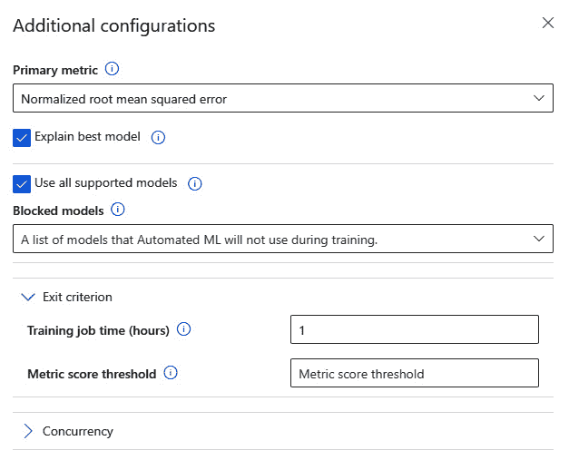

图 1.20 – 设置其他配置设置

在向导中保留所有其他选项为默认值，并启动自动机器学习作业。现在，您所能做的就是等待找到一个性能良好的模型，训练停止或达到最大训练时间，此时将自动选择最佳模型。您可以在**自动** **ML**菜单下监控模型训练的进度。

现在我们已经训练了模型，我们可以部署它。

## 部署模型

一旦作业完成，您就可以在**模型**菜单下找到表现最佳的模型。根据指标选择列表中表现最准确的模型，它将准备好作为网络服务部署到 ACI。

这里是尝试此操作的步骤：

1.  从列表中选择得分最高的模型。您将在**解释**列中识别出最佳得分，它还将包含特征解释。您还可以比较评分指标，它可能更高或更低，具体取决于指标类型：

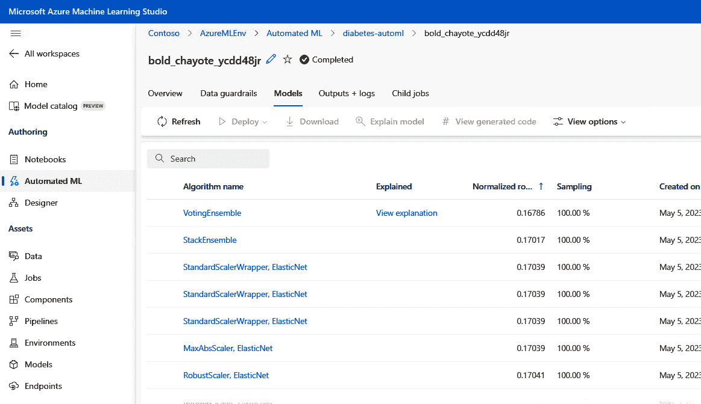

图 1.21 – 不同算法和参数的训练模型列表

1.  打开**模型**屏幕并单击**部署**按钮。在列表中，选择**网络服务**选项，如图所示：

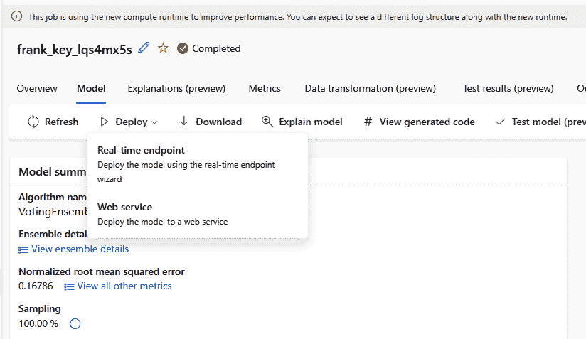

图 1.22 – 模型部署

1.  对于部署设置，添加**名称**，选择**Azure 容器实例**作为**计算类型**，并将**启用身份验证**切换按钮设置为开启。以下截图展示了这一过程：

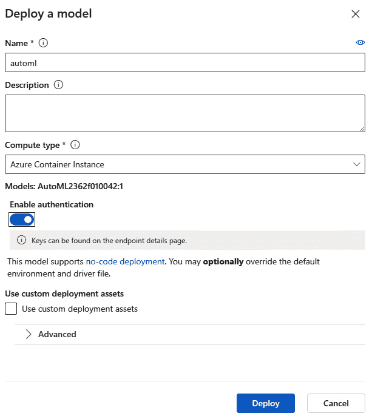

图 1.23 – 部署设置

等待部署完成，然后转到**端点**菜单，将您的模型与应用程序集成并进行预测。

## 使用部署的模型进行预测

要使用部署的模型进行预测，请转到**端点**菜单并找到端点部署。确保**部署状态**为**健康**，**操作状态**为**成功**。如果**部署状态**不是**健康**或**失败**，可能需要更多时间来部署。请参考以下截图中的模型：

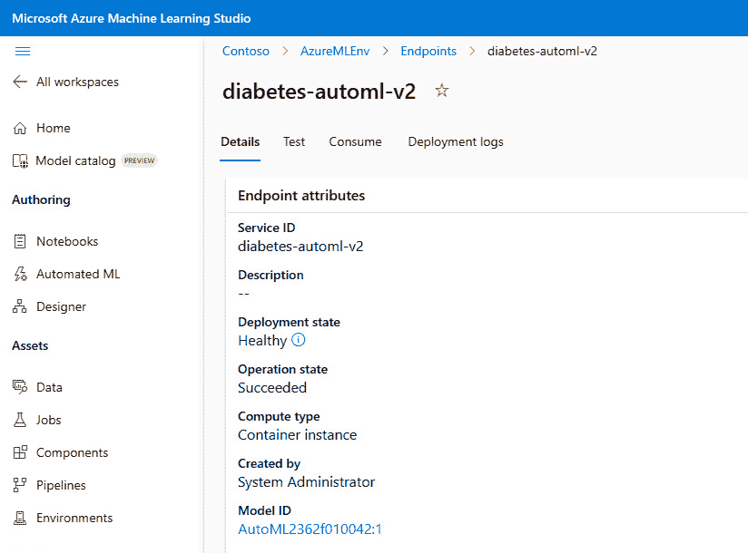

图 1.24 – Azure 机器学习模型预测端点

您可以使用**测试**选项卡快速测试该服务。使用**消费**选项卡查找端点和认证密钥，将网络服务集成到您的应用程序中进行预测。

如果您已经跟随了前面的步骤，恭喜您：您刚刚使用 Azure 机器学习训练并部署了一个模型。但这还没有结束；我们将在这个书中使用这个示例项目来展示如何实现保护您自己的解决方案。但在我们深入实现之前，让我们先了解我们将遵循的策略和技术，从零信任开始。

# 探索零信任模型

**零信任**模型是一种基于“永不信任，始终验证”原则的安全策略。因此，我们不会假设部署在防火墙后面的资源是安全的，零信任模型假设存在漏洞，并且每个请求都需要被验证，就像它来自一个开放网络一样。零信任模型适用于云、本地和混合环境。实施零信任安全模型可以帮助组织减少其整体攻击面，最小化数据泄露的风险，并通过从基于边界的安全方法转向更全面和自适应的安全策略来改善其安全态势。

虽然 Azure 机器学习是一个云服务，但零信任模型仍然适用，因为一个完整的机器学习项目跨越了数据、网络、基础设施和应用。我们将概述零信任模型。然后，我们将使用这些知识来评估我们工作负载中的漏洞，并使用 Azure 的工具和服务减少我们的攻击面。我们将从熟悉零信任原则和防御领域开始。

## 介绍零信任原则

零信任策略基于三个原则——明确验证、使用最小权限访问和假设存在漏洞。

让我们在以下章节中了解这些内容。

### 明确验证

**明确验证**原则要求所有尝试访问网络的用户、设备、应用程序和资源在获得访问权限之前必须进行彻底的认证和授权。

在传统的安全模型中，一旦用户或设备经过认证并获得访问权限，他们通常会在一定程度上受到信任，并被允许在网络中移动而无需额外的检查。然而，在零信任模型中，每个访问请求都被视为潜在的威胁。只有在经过多级验证过程之后，才会授予访问权限。

此验证过程包括多个认证层，例如验证用户凭据、设备身份和网络位置。用户认证可能涉及**多因素认证**（**MFA**）或其他高级认证方法来确认用户的身份。验证过程不是一个一次性事件，而是持续进行的。它包括检查异常或用户行为、设备健康或其他可能表明潜在威胁的因素的变化。如果检测到任何变化或异常，系统可以启动额外的验证检查，甚至在必要时撤销访问权限。

### 使用最小权限访问

**使用最小权限访问**原则是零信任安全模型的一个关键组件。它指出，用户、设备和应用程序应仅被授予执行其工作职能所需的最小资源访问权限。

用户通常被赋予广泛的网络资源和数据访问权限，假设他们只访问执行其工作职责所需的资源。然而，这种方法通过允许用户访问他们不需要的资源，增加了数据泄露和未经授权访问的风险，攻击者可以利用这一点。

相比之下，零信任模型通过基于最小权限原则来限制访问，采取了一种更细粒度的访问控制方法。例如，市场营销部门的一名用户可能只需要访问与市场营销相关的文件，而不需要访问财务部门的资料或系统。同样，承包商可能需要访问特定的文件或应用程序，但不需要访问整个网络。

### 假设漏洞

**假设漏洞**原则假定网络已经被入侵，攻击者已经存在于网络内部，或者将存在于网络内部。这一原则强调了早期检测和响应以减轻潜在漏洞造成的损害的重要性。我们需要通过尽快分析每个访问级别的异常来尽快识别攻击。

组织通常专注于保护其网络边界并防止攻击者获得访问权限。然而，随着网络攻击的日益复杂化，基于边界的网络安全已不足以保护现代威胁。零信任模型认识到这一点，并假定攻击者最终将通过钓鱼攻击、恶意软件或其他手段渗透网络。

假设发生安全漏洞意味着组织必须实施额外的安全控制措施来限制攻击造成的损害，例如微分段、加密和网络隔离。这些控制措施有助于防止攻击者横向移动穿越网络并访问关键资源，即使他们已经获得了网络的一部分访问权限。

## 解释零信任防御区域

零信任安全模型通过在多个防御区域或领域实施安全控制来保护网络资源和数据，例如以下图中所示：

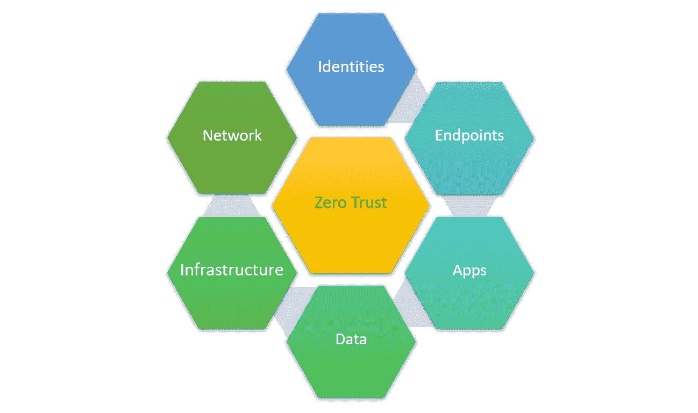

图 1.25 – 零信任防御区域

让我们在以下各节中了解这些领域的每一个。

### 身份

一个重要的防御区域是**身份**，它涉及保护用户身份并确保只有授权用户可以访问网络资源。身份验证、最小权限访问、基于风险的适应性访问和持续监控都是身份管理和安全的一部分。身份验证涉及在授予网络资源访问权限之前验证用户身份。它包括多因素认证、无密码认证和条件访问策略，以确保只有授权用户可以访问敏感资源。

让我们探索一些最佳实践：

+   **最小权限访问**涉及授予用户执行其工作职能所需的最小访问权限。它包括基于角色的访问控制、动态访问控制和特权访问管理，以限制用户访问到他们所需的内容。

+   **基于风险的适应性访问**涉及使用风险评估工具来评估用户行为并确定他们应获得的网络资源访问级别。它包括持续认证、实时风险评估和上下文访问策略，以确保用户访问适当且安全。

+   **持续监控**涉及监控用户活动并检测异常或可疑行为。它包括实时警报、行为分析和机器学习来识别潜在的安全威胁并采取主动措施预防它们。

### 终端节点

另一个关键的防御区域是**终端节点**，它涉及保护终端，如笔记本电脑、台式机、移动设备和服务器。在零信任模型中，微软保护终端的方法是确保在授予网络资源访问权限之前，终端是健康的并且符合安全策略。它包括设备管理工具、合规性策略和设备健康检查，以确保设备和终端安全且更新。

### 应用程序

另一个重要领域是**应用程序**，它涉及保护应用程序并确保只有授权用户和设备可以访问它们。应用程序必须有一个唯一的身份，并且在授予网络资源访问权限之前应包括身份验证。这包括使用证书、令牌和安全的通信协议来建立应用程序和网络资源之间的信任。

### 数据

**数据**是机器学习中的一个关键组件，涉及保护数据和确保只有授权用户和设备可以访问它。以下是一些保护数据的方法：

+   **数据分类**和**标记**涉及根据数据的敏感性级别对数据进行分类和标记，并根据分类实施访问控制。标记可以是自动化的或用户定义的，并且应包括监控数据使用以保护敏感数据。

+   **数据保护**涉及在传输和静止状态下保护数据。这包括加密、访问控制和监控数据使用以防止未授权访问或敏感数据泄露。

+   **治理**、**合规性**和**监管要求**意味着确保数据在适当的治理、合规性和监管要求下处理。这包括数据保留政策、数据泄露通知政策和合规性审计，以确保数据得到适当的处理。

### 基础设施

**基础设施**对于保护连接设备、主机应用程序和数据的计算至关重要。基础设施包括任何物理或虚拟设备。

**设备安全**是关于保护网络设备，如交换机、路由器和防火墙，以防止未授权访问并确保它们安全配置。它包括实施设备管理工具、固件和软件更新，并监控设备活动以检测潜在的安全威胁。

**虚拟化**安全涉及保护虚拟化环境，如虚拟机和容器，以防止未授权访问并确保它们安全配置。它包括实施虚拟化管理工具、打补丁和更新，并监控虚拟化活动以检测潜在的安全威胁。

还应考虑云环境的类型，例如**基础设施即服务**（**IaaS**）、**平台即服务**（**PaaS**）和**软件即服务**（**SaaS**）。

### 网络

最后，**网络**是一个防御领域，包括确保设备、应用程序和数据之间的网络连接安全。实现这一目标的方法包括网络微分段和访问控制。我们可以通过将网络划分为更小的部分并限制它们之间的访问来实现这一点。我们可以通过实施防火墙和监控网络活动来检测潜在的安全威胁，从而提高网络的安全性。这包括管理网络流量和日志分析以检测潜在的安全威胁并采取主动措施来预防它们。

让我们继续看看我们如何应用零信任策略来评估我们的机器学习工作负载的安全状态。

# 评估机器学习资产和应用程序的漏洞

评估 Azure 机器学习资产漏洞的一部分涉及识别潜在的安全风险，然后实施适当的措施来减轻它们。

在这里，我们将通过 Azure 机器学习组件及其可能的漏洞进行探讨。安全措施的实现将在本书的其余部分进行更详细的解释。评估基于零信任防御区域。

第一步是确定与 Azure 机器学习相关的所有资产，如数据、模型和算法。这并不意味着只有 Azure 机器学习工作室。还需要检查与 Azure 机器学习相关的几个服务。一旦确定了资产，你应该评估它们的潜在风险，包括未经授权的访问、数据泄露和滥用。

记住这一点很重要，即 Azure 中的所有内容都是在云基础设施之上运行的，因此熟悉与 Azure 机器学习一起工作的任何服务并确保它们的安全性是有帮助的。我们将在下一章中看到，对手如何利用其他系统来损害机器学习项目。你可能不需要使用所有这些系统，但如果你已经在使用其中一些，这将帮助你评估你需要保护的内容。

让我们通过零信任模型区域，并确定每个区域中与 Azure 机器学习相关的每个服务。

## 身份管理

Azure 使用**Microsoft Entra ID**（之前称为**Azure Active Directory**）进行用户身份验证、授权和**基于角色的访问控制**（**RBAC**）来管理 Azure 资源的权限。Microsoft Entra ID 服务是一种身份管理解决方案，它提供了所有控制功能来管理和保护访问，包括条件访问策略、身份保护和特权身份管理等功能。

首先，确定每个用户或组以及他们需要使用服务的访问权限。Azure 机器学习支持多个角色，如数据科学家、开发者、IT 管理员和安全工程师。注意每个用户或组所需的最小访问权限。然后，我们可以调查需要启用哪些 Microsoft Entra ID 功能来减轻访问风险...

## 数据和数据源

数据是任何机器学习项目最大的组成部分。在 Azure 机器学习中，你可以从许多来源添加数据。识别所有这些来源并启用它们的安全功能。假设你正在将数据导入 Azure 机器学习工作区。在这种情况下，它存储在你工作区连接的 Azure 存储账户中。你必须限制对工作区的访问并确保存储账户的安全。如果你在 Azure 中使用数据源，例如 Azure SQL 服务器或 CosmosDB，这些服务有多个安全措施来限制访问并保护免受数据泄露和数据丢失。确保所有数据在静态存储和传输过程中都进行了加密。Azure 提供了多种加密选项，例如**Azure 密钥保管库**和**Azure 存储服务加密**。**Azure SQL 数据库**也支持多级别加密。另一个需要考虑的方面是备份。确保你有多种恢复数据的选择，以防发生安全事件。

## 基础设施

Azure 机器学习建立在 Azure 基础设施之上。Azure 机器学习中有四种用于训练或推理的计算类型：计算目标、计算集群、AKS 和附加计算。对于模型的部署，你可以使用 Azure 容器注册库和 Azure 容器。对于附加计算，你可以利用虚拟机、Azure Databricks 服务以及更多。所有这些服务都有自己的安全功能。确保所有服务或基础设施都更新到最新版本。Azure 还提供了一些用于自动化更新和监控的服务。

## 网络和端点

虚拟网络是 Azure 基础设施服务的一部分。Azure 中的每个服务都是在 Microsoft 网络中部署的，有时也称为**Azure 骨干网络**。假设你的解决方案不一定需要从公共互联网中可用，但只需要从你的公司办公室到 Azure 服务，例如。在这种情况下，有多种方法可以通过加密和路由虚拟网络与本地基础设施之间的网络流量来保持 Azure 骨干网络上的流量。识别必要的端点，并在可能的情况下限制对工作区的网络访问。你可以使用从虚拟网络、私有链接到 VPN（如 Azure VPN 网关）甚至使用 ExpressRoute 的私有连接的任何东西。如果你已经有了防火墙，如 Azure 防火墙，或任何网络，你可以利用这些服务来保护你的机器学习项目。这也可能适用于其他与 Azure 机器学习一起工作的服务，如数据库。

## 监控和维护

评估的一部分也是制定监控和维护计划。现在你已经确定了所有服务和你需要启用的功能，你需要回答以下问题：

+   谁负责出现的每个安全问题？

+   应启用哪些通知以及针对哪些服务？

+   谁负责响应每个通知？

Azure 提供了多种视图和支持工具，用于监控和警报。

## AI/ML 应用程序

你可以利用两种类型的应用程序来与 Azure 机器学习一起工作。这些 AI 应用程序使用 Azure 机器学习端点进行预测，或者触发 Azure 机器学习管道进行模型训练或批量预测的应用程序。

对于这两种类型的应用程序，使用安全的编码实践将确保应用程序不会受到外部攻击。技术包括输入验证、错误处理和身份验证机制。使用安全的协议，如 HTTPS 或 SSL/TLS，加密传输中的数据。为了评估应用程序的漏洞，你可以使用安全测试工具和技术，如渗透测试和漏洞扫描，以识别和修复潜在的安全弱点。应用程序也不应暴露或硬编码敏感信息，如连接字符串或端点访问密钥。你可以使用另一个 Azure 服务，Azure 密钥保管库来减轻这一点。触发需要访问数据的管道的应用程序也应持续评估和监控，因为数据集的变化可能会影响模型的准确性。

如你所可能已经意识到的，安全不是一个明确的界限，而是一个迭代的过程。我们需要评估、实施、监控并重复，以确保我们的工作负载在 Azure 中是安全的。我们可能需要利用多个安全特性和建议，并根据我们的需求调整零信任策略。

# 摘要

在本章中，我们介绍了机器学习生命周期的基本知识以及它如何应用于 Azure 机器学习组件。这种知识不仅对数据科学家和开发者至关重要，而且对需要了解 ML 开发基础知识以确保他们能够保护并监控所有相关服务的 IT 管理员和安全工程师来说也是必不可少的。对于任何想要更熟悉 Azure 机器学习的人来说，你总是可以回来重新创建本书开头所展示的场景，作为跟随本书其余章节中展示的实现和方法的基础。

一起，我们学习了零信任策略是什么以及如何将其应用于 Azure 机器学习组件及其相关服务，以评估需要保护的内容。我们将需要零信任，因为本策略中概述的原则和防御领域与我们在下一章中用于安全实施的相同。现在，既然你已经知道了如何创建所需保护服务的初步评估，在下一章中，我们将了解更多关于对手用来破坏我们系统的方法和技巧。通过学习这些方法，你将更好地装备自己来保护你的机器学习工作负载及其相关系统。

# 进一步阅读

+   *Azure 机器学习简介*: https://learn.microsoft.com/en-us/training/modules/intro-to-azure-ml

+   *Azure 机器学习 SDK 简介*: [`learn.microsoft.com/en-us/training/modules/intro-to-azure-machine-learning-service/`](https://learn.microsoft.com/en-us/training/modules/intro-to-azure-machine-learning-service/ )

+   *使用 Azure 机器学习训练 ML 模型*: https://learn.microsoft.com/en-us/training/modules/train-local-model-with-azure-mls/

+   *零信任和最佳实践框架简介*: [`learn.microsoft.com/en-us/training/modules/introduction-zero-trust-best-practice-frameworks/`](https://learn.microsoft.com/en-us/training/modules/introduction-zero-trust-best-practice-frameworks/)
