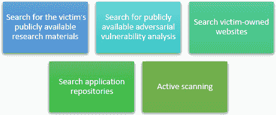
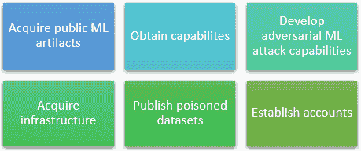
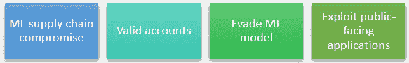
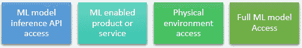
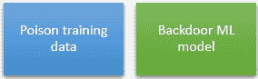
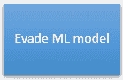
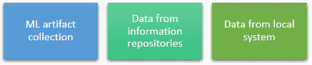
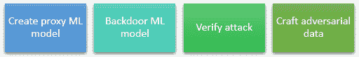
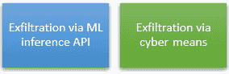
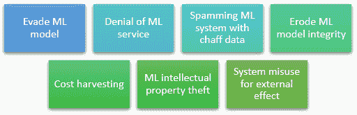

# 2

# 理解最常见的机器学习攻击

当开始为你的项目进行安全加固时，你可以使用许多工具来快速学习安全技巧。其中最好的是**MITRE ATT&CK 框架**。作为一个全球公认的知识库，它包含了关于各种攻击技术及其缓解措施的有价值信息，这些攻击技术是攻击者用来攻击系统的方式。在本章中，我们将探讨**MITRE ATLAS**框架。它是从 MITRE ATT&CK 框架中针对**机器学习**（**ML**）进行改编的。

本章的目标是让我们熟悉攻击的不同阶段以及对我们系统可能的攻击。这是至关重要的，因为有了这些知识，我们可以理解攻击者的思维方式以及如何保护我们的系统。由于攻击有多个阶段，你会明白为什么应用零信任策略（在上一章中介绍）是保护系统的最有效方法。我们必须永远记住，这是一个持续的过程，因为每天都有新的漏洞和利用被发布。

我们必须始终跟上所有新的信息，MITRE ATLAS 框架将帮助我们做到这一点。最后，在探索 MITRE ATLAS 矩阵之后，我们将涵盖与 Azure 机器学习相关的 Azure 服务以及那些最常受到攻击的服务。

在本章中，我们将涵盖以下主题：

+   介绍 MITRE ATLAS 矩阵

+   理解机器学习和人工智能攻击

+   探索涉及机器学习攻击的 Azure 服务

到本章结束时，你将更好地理解机器学习攻击及其对机器学习的可能缓解措施。

# 介绍 MITRE ATLAS 矩阵

MITRE ATT&CK 框架是一个全球公认的知识库和框架。安全专业人士使用它来理解和组织网络威胁环境中的攻击者行为。**ATT&CK**®（或 ATTACK）代表**对抗性策略、技术和常见知识**。它本质上是一个目录，列出了攻击者在网络攻击的不同阶段使用的**策略、技术和程序**（**TTPs**）。它涵盖了包括初始访问、执行、持久性、权限提升、防御规避、凭证访问、发现、横向移动、收集、数据泄露和影响在内的许多威胁向量。

MITRE ATT&CK 框架将这些技术组织成一个矩阵，根据攻击的各个阶段和它们适用的平台（例如，Windows、macOS 或 Linux）对它们进行分类。矩阵中的每种技术都在 MITRE 知识库中进行了详细描述，包括攻击者通常如何使用它以及我们可以采取的潜在防御措施来检测和预防它。

注意

如果你第一次听说 MITRE ATT&CK®框架，你可以探索 MITRE ATT&CK®知识库，网址为[`attack.mitre.org/`](https://attack.mitre.org/)。

（© 2023 MITRE 公司。本作品经 MITRE 公司许可复制和分发。）

该框架已成为广泛采用的行业标准。它被安全团队、安全解决方案供应商和组织使用，以增强他们的威胁情报、开发更有效的安全控制措施，并提高事件响应能力。它使组织能够将他们的防御与实际攻击者的行为对齐，帮助他们主动检测、响应和缓解网络威胁。

尽管非常全面，但 MITRE ATT&CK 框架可能并不涵盖所有已知的攻击方法，但它提供了一个很好的起点。我们将遵循 MITRE ATLAS™框架。**ATLAS**代表**人工智能系统对抗威胁景观**，它是一个基于 MITRE ATT&CK 框架的对手战术知识库，包含适用于机器学习（ML）和**人工智能**（**AI**）系统的技术。ATLAS 矩阵显示了攻击在各个阶段的进展以及与每个阶段相关的技术。阶段可以在以下图中看到：

图 2.1 – MITRE ATLAS 阶段

虽然阶段看起来是按顺序出现的，并且通常从侦察开始，以影响技术结束，但并非所有阶段和技术都会在攻击中使用。这取决于攻击者的目标和系统架构。

让我们在接下来的章节中理解每个阶段。

## 侦察

**侦察**指的是攻击的初始阶段，攻击者收集有关目标 ML 系统的信息。侦察的目标是收集可用于识别潜在漏洞、计划攻击并提高成功机会的情报。信息可以是 ML 技术、研究信息，这些信息可以帮助攻击者获取相关的 ML 工件，并在攻击的下一阶段针对受害者定制攻击。

## 资源开发

在初始侦察之后，攻击者试图发现他们可以利用的资源来支持他们的最终目标。这个阶段被称为**资源开发**，通常是在攻击者购买或窃取资源以针对 ML 工件、基础设施、账户或攻击后期可以使用的能力时。

## 初始访问

在**初始访问**阶段，攻击者试图访问 ML 系统。这可能包括网络、设备和平台等。如果攻击者在这一步成功，他们就可以在系统中获得一个初步的立足点。

## ML 模型访问

在攻击者获得对系统的某种形式的访问后，他们将通过获取对机器学习模型的访问来进一步行动。在**机器学习模型访问**阶段使用的技术因攻击者可以利用多个访问级别而有所不同。他们可以针对存储数据的数据库或技术，或者用于训练机器学习模型的端点。用于预测或任何其他作为其流程一部分利用机器学习的产品或服务也容易受到攻击。

## 执行

在**执行**阶段，攻击者设法在目标系统上运行或嵌入恶意代码或命令，以实现他们的目标。这种策略侧重于攻击者执行其有效载荷或探索网络以窃取更多数据或访问更多系统的行动。可以在此处运行远程访问工具来运行脚本并发现未修补的已知漏洞。

## 持久化

在**持久化**阶段，攻击者试图维持他们在前一步骤中获得的任何访问权限。技术包括但不限于提升凭证、切断其他用户的访问权限，以及留下修改后的数据或模型和后门，以便他们在被发现时能够更容易地恢复访问。

## 防御规避

当然，没有攻击者希望在完成目标之前被发现。攻击者使用**防御规避**技术来避免检测。规避检测是攻击者可以通过关闭安全功能或软件，如恶意软件检测器来实现的。

## 发现

**发现**阶段就像侦察，但来自内部。攻击者试图了解你的机器学习环境。他们试图获取有关系统和内部网络的知识，以便在发起攻击之前扩大目标或获取尽可能多的信息。在这个阶段，攻击者将根据他们的目标了解他们可以或不能控制什么，以及他们还需要做什么。在这里，通常使用本地操作系统工具来收集所需的信息。

## 收集

在**收集**阶段，所有调查和信息收集过程都已结束。攻击者试图积极收集数据或机器学习工件。假设他们的目标是简单地破坏服务，那么这个阶段的技术将帮助他们收集从系统中提取所需的一切，在使服务不可用之前。提取是外泄阶段的一部分。

## 机器学习攻击阶段

对于机器学习来说，数据提取或服务中断可能不是攻击者的唯一目标。在人工智能项目中，可以部署针对机器学习模型的攻击。**机器学习攻击阶段**技术包括训练代理模型、毒化目标模型以及制作对抗数据以供目标模型使用。其中一些甚至可以在离线状态下执行，因此在某些情况下可能难以缓解。

## 外泄

**提取**阶段将是数据或证据将被提取的地方。攻击者试图窃取（提取）机器学习证据或使用这些信息进行未来的操作。在这种情况下，最被针对的来源是软件仓库、容器注册表、模型仓库和对象存储。这是一个具有挑战性的过程，因为数据需要离开网络，从而产生可以被检测到的流量。

## 影响

**影响**阶段包括破坏或损害系统完整性的技术，以及可能操纵业务流程的技术。攻击者可以针对数据并对其进行篡改或破坏。更糟糕的是，数据可能略有变化；不足以在系统中引起怀疑，但足以以有助于攻击者的最终目标或为机密性泄露提供掩护的方式破坏服务。

如您所见，这些阶段形成了一个攻击者可能采取的逻辑路径来攻击您的系统。在现实中，情况可能并非如此，因为流程很大程度上取决于他们的目标。让我们看看每个阶段使用的技术以及它们可能对我们系统造成的影响的例子。

# 理解机器学习和人工智能攻击

前一节中提到的所有阶段都使用多种技术来实现每个目标。攻击者可以使用这些技术单独使用、顺序使用或组合使用。一些攻击可以重复使用，并在不同的阶段用于不同的目的。这完全取决于攻击者的目标，这就是为什么通过应用零信任原则并始终验证系统的所有级别，我们更有可能保护我们的服务，或者至少在攻击者有时间对系统造成任何重大损害之前检测到事件。

在这里，我们将描述每个阶段最常见的 AI 和机器学习攻击。我们还将讨论来自 MITRE ATT&CK 框架的攻击，尽管它们不是针对机器学习的，但可以用来访问包含机器学习功能等的系统。虽然我们将概述每种攻击的可能缓解措施，但我们将在以下章节中更详细地介绍实现方法。

让我们探索每个阶段的攻击技术。

## 侦察技术

有五种侦察技术旨在收集有关系统的信息，如下图所示：

图 2.2 – 侦察技术

让我们在以下章节中了解每种技术。

### 搜索受害者的公开信息

假设该组织在生产中使用基于额外专有数据的开源模型架构，或者这些架构处于研究阶段。在这种情况下，他们可能会在公告或新闻稿中发布系统细节。尽管这些内容不是技术性的，但它们可能包含有关其模型发展的详细信息，并有助于构建更现实的代理模型。为了减轻这种情况，在宣布交易或合作时，限制分享有关公司系统、软件栈或用于开发系统的框架的信息。

### 搜索受害者拥有的网站和应用存储库

公司网站可能公开了很多信息，包括部门/分部的名称、物理位置以及关于关键员工（如姓名、角色和联系方式）的数据。这些网站还可能包含显示业务运营细节和关系的资料。对于公司员工发布的论文或技术博客也是如此。员工也可能容易受到社会工程学攻击，攻击者冒充其他员工以获取公司信息。确保你指示员工不要分享他们正在工作的项目信息——即使他们不是项目成员——并在个人博客或社交媒体上匿名分享他们分享的信息。

最后，机器学习应用可能可在移动商店中找到，如 Google Play、iOS 应用商店、macOS 应用商店和 Microsoft Store。攻击者可能会尝试扫描和分析应用程序以查找与机器学习相关的组件或端点。尽可能混淆应用程序代码，并在信息被截获时确保保护端点。

### 搜索公开可用的对抗性漏洞分析

一旦确定了技术，攻击者将研究常见的系统、模型或算法漏洞，以查看他们是否可以使用现有研究来实施攻击。已识别的漏洞有公开可用的实现，这使得攻击者更容易获得系统的初始访问权限并有效规划攻击。

### 活动扫描

活动扫描不仅仅是简单的侦察或信息收集。攻击者正在积极探测系统以识别入口点或收集更多可操作的信息。他们也可能试图确定收集到的信息是否有效。

## 资源开发技术

在这个阶段，通常有六种技术利用侦察阶段收集到的信息：

图 2.3 – 资源开发技术

### 获取公开的机器学习工件

一旦攻击者确定了系统的某些细节，这可以帮助他们发起创建代理机器学习模型或直接制作对抗性数据的攻击，这些是我们将在本章后面讨论的攻击技术。这些工件包括用于训练模型的软件栈、算法、模型部署以及训练和测试数据集。这些工件也可以在开发或测试环境中。假设它们包含生产模型使用的某些逻辑、算法或技术，那么它们也可能危害生产环境。确保您同时保护开发环境和生产环境。访问这些工件可能需要访问密钥或经过身份验证的请求，您可能会认为这已经足够，但事实并非如此。您需要确保您为不同的环境区分访问方法，并定期更换访问密钥，这样攻击者就不能使用初始访问阶段的技术来获取对多个环境的访问权限。

### 获取能力

在这里，攻击者可能会搜索并获取支持其操作的软件工具。软件工具可以是恶意的，也可以被重新用于恶意目的。这里可以使用任何软件，并且这个工具或软件不需要是机器学习启用的。例如，攻击者可以使用虚拟摄像头为视频流添加逼真的效果，以拦截进入系统的实际摄像头流，并使用深度伪造技术获取访问权限。

深度伪造技术

深度伪造技术是一种利用深度学习技术操纵或生成人物视频、图像和音频的方法。该技术使用人物的现有音频、视频或图像来生成与该人物相似的新内容。这项技术非常强大，生成的内容与真实录制的视频或音频难以区分，因此可以用于各种恶意目的，如虚假新闻、未经授权访问使用生物识别技术的系统以及金融欺诈。

### 开发对抗性机器学习攻击能力

一旦攻击者获得了对系统的访问权限，或者至少获得了有关系统的信息，他们可能会选择开发自己的攻击或实施公开研究中的想法。以现有库作为起点的公开研究论文通常有很好的文档记录，并解释了它们利用哪些漏洞。您可以使用这些信息来保护您的系统，因此不公开分享信息至关重要，这样攻击者就难以针对您的系统定制攻击。

### 获取基础设施

对手可能会购买或租赁在整个操作过程中将使用的基础设施。这些基础设施可以包括物理服务器或云服务器的域名、设备或服务。根据实施情况，对手将使您难以在您的网络中发现他们的流量，并且他们将试图融入其中。他们可能会使用可以非常快速提供和关闭的基础设施。这意味着即使您发现了一个可疑的端点并将其阻止，这并不意味着您就安全了，因为对手可能会提供新的基础设施并再次尝试。这就是为什么始终遵循关于安全的最佳行业实践来准备应对任何攻击至关重要。

### 发布受毒化的数据集和毒化训练数据

在机器学习（ML）方面，一切都是基于数据的。毒化训练数据将改变算法的结果和训练模型。他们可以引入难以检测到的漏洞。对手可能会毒化训练数据并在公共位置发布。这可能是一份数据或开源数据集的不同版本。始终验证您用于训练或更新模型的任何开源机器学习（ML）工具的来源，以防止受毒化的数据集。远离公共数据不是您可以做的唯一事情，因为数据可以通过机器学习供应链攻击被引入您的系统，我们将在本章后面详细说明。始终验证数据源中的数据是否未发生变化；如果可能，不要加密数据或将数据源设置为只读或不可变。

### 建立账户

对手可能会创建许多账户，他们可以使用这些账户针对您的系统并获取他们需要的资源。他们还可能冒充您组织中的某个人，比如员工，并利用这一点来获取对您系统的访问权限。始终验证您在讨论项目时与谁交谈，并相应地培训您的员工。例如，如果您在 LinkedIn 上收到一条来自同事的消息，要求您与他们分享访问权限或帮他们重置密码，请始终验证他们的身份。即使他们使用公司电子邮件，如果这不是重置凭据或请求访问的正确流程，请直接指导他们遵循适当的流程，因为他们的账户可能已被入侵。您可能无意中将有关机器学习端点或训练数据的访问信息与第三方共享。

## 初始访问技术

对手可以使用以下技术来获取系统访问权限：

图 2.4 – 初始访问技术

让我们在以下各节中了解每种技术。

### 机器学习供应链攻击

使用机器学习供应链破坏技术，攻击者试图通过破坏机器学习供应链的独特部分来获取访问权限。这通常包括用于训练模型的硬件，如 GPU 硬件、数据、软件堆栈的部分或模型本身。当涉及到硬件时，始终要验证您拥有最新的更新和补丁。当使用开源库时，始终检查那些算法的实现。任何对库的更新都应该检查是否存在漏洞或恶意代码。数据可能会被毒化，尤其是公共数据，在标记阶段，私有数据集也可能受到破坏。如果您正在使用第三方服务来标记您的数据，请确保有防止数据毒化的流程。此外，保留数据集的版本以比较任何更改并尽可能识别问题。如果您正在使用 Azure 机器学习，一些功能可以帮助您做到这一点。最后，如果您正在使用开源模型并使用您自己的私有数据集对其进行微调，请始终验证模型或库的来源，尤其是在更新发布时。每次您整合新的模型或执行未知代码时，都存在其可能感染传统恶意软件的可能性。

### 有效账户

在这种情况下，攻击者可能从现有账户或 API 访问密钥中获取有效凭证。特别是在使用 Azure 机器学习时，泄露或被盗的凭证可能提供对工件访问权限，并允许攻击者对其进行破坏。我们应该担心两个级别的访问权限。第一个是访问训练模型或管道的用户凭证和用户账户，第二个是推理模型或管道的 API 密钥。

### 避免机器学习模型

并非所有攻击都是针对您的机器学习项目的。攻击者可以发起精心设计的对抗性数据攻击，以防止机器学习模型正确识别数据内容。这种技术会干扰任何依赖于机器学习的任务。这些任务或流程可以是，例如，基于机器学习的恶意软件检测软件、网络扫描软件或保护系统免受传统网络攻击的杀毒软件。对此技术的缓解措施包括对模型进行加固，使其对特定输入、行为或异常查询具有鲁棒性，或者使用模型集成进行推理以增加鲁棒性，因为攻击可能对一种模型类型有效，而对另一种模型类型无效。

### 利用面向公众的应用程序

虽然 Azure 为其服务提供了许多安全功能，并符合多个行业标准协议，但从机器学习到数据库、面向公众的应用程序和互联网可访问的端点（如 Web 服务器）的保护责任落在客户身上。因此，在保护您的机器学习资产时，您必须考虑使用您模型的所有相关服务。在这本书中，我们将讨论许多与机器学习无关的安全实践，仅仅是因为它们适用于使用机器学习环境的相关服务，例如网络和应用。

## 机器学习模型访问技术

有四种技术可以用来访问您的机器学习模型：

图 2.5 – 机器学习模型访问技术

让我们回顾一下每种机器学习模型访问技术。

### 机器学习模型推理 API 访问

机器学习模型推理 API 访问技术指的是对推理 API 的合法访问。创建模型的目标是进行预测。通常情况下，这些预测是从网络应用程序中利用的。实现这一目标的方法是将模型发布为 Web API，以便从服务中使用。这个 API 可以为攻击者提供有关模型类型或数据的详细信息。

通常，模型会重新训练以基于输入学习。这意味着如果您正在使用生产环境根据实际使用情况重新训练和改进您的模型，请确保有一个审批流程来检查来自公共端点的数据。否则，攻击者只需使用推理 API 就可以向系统中引入虚假数据。

### 机器学习产品或服务

即使您的 API 不是公开的，使用它的服务仍然包含有关模型及其数据的一些信息。一个可以访问推理端点的应用程序仍然需要向其发送一些数据，这可能会在日志或元数据中泄露机器学习模型的详细信息。劫持应用程序会打开机器学习服务，使其容易受到多种攻击。

### 物理环境访问

攻击不仅仅是数字上的。假设模型或与模型交互的应用程序以某种方式使用现实世界的数据。在这种情况下，攻击者可以通过访问数据收集的环境来影响模型。例如，如果您有一个通过访问相机流并对其进行投毒来从传感器或摄像头中流式传输数据的应用程序，攻击者可以影响模型。确保当您使用传感器时，它们在与任何形式的系统通信时都得到适当的保护，并且硬件中没有单点故障。

### 完整机器学习模型访问

有时，尽管将模型放在集中式系统中并在需要实时预测时查询它更为安全，但这并不总是可持续或高效的。你可能会有上传或重新打包模型移动版本并将其添加到边缘设备（如传感器或移动设备）的诱惑。虽然这可能会提高性能并提供更快的预测，但这会增加攻击面。如果可能的话，考虑将模型上传到云中，并使用单一访问点以减少攻击面。

## 执行技术

有两种执行技术可用，这两种技术都依赖于用户或工具执行的特定操作或脚本：

图 2.6 – 执行技术

让我们在接下来的部分中探讨这些技术的每一个。

### 用户执行

攻击者通常会依赖合法用户采取的特定操作来获取执行权限。系统用户可能无意中执行了由机器学习供应链妥协技术或社会工程学引入的不安全代码。为了减轻这种风险，应培训用户不要打开来自未知来源的可疑或恶意链接或文档。培训的一部分也应包括检查整个机器学习过程中使用的机器学习工件，因为这些也可能被毒化。始终检查文件的校验和或来源，并验证其安全性以及是否未发生变化。

### 命令和脚本解释器

攻击者可能使用命令和脚本解释器在目标系统中执行命令。这些接口提供了许多与系统交互的方式，并且是不同技术的标准功能。根据操作系统，包含了一些工具。例如，在 Windows 中，Windows 命令外壳和 PowerShell 可以被利用。还有 Python 等编程语言的解释器。命令和脚本可以嵌入到作为文档或从受毒化的来源下载的目标系统负载中。也可以使用远程服务。

## 持久化技术

有两种持久化技术可用，其中一种我们在*资源开发*部分已经讨论过。毒化训练数据技术可以用来嵌入漏洞或插入后门触发器。根据目标，这可以是资源开发或持久化技术：

图 2.7 – 持久化技术

### 后门机器学习模型

攻击者可以通过其他技术，如毒化训练数据技术，将后门引入基于机器学习（ML）的模型。包含后门的模型通常按预期工作，但在被与攻击者特定请求相关的输入触发时会产生不同的输出。这种技术为攻击者提供了系统上的持久性工件。后门可以是针对攻击者输入定制的模型响应，或者调用注入的有效载荷，绕过模型并返回不同的结果集。

## 防御规避技术

我们已经讨论过的唯一一种防御规避技术是规避机器学习技术。它也可以用作初始访问技术，一旦获得初始访问权限，攻击者就不会被任何可能使用机器学习的其他软件检测到，因为它会中断其进程。

图 2.8 – 防御规避技术

## 发现技术

有三种发现技术，它们都旨在获取更多关于模型、其本体、其家族或其工件的信息：

图 2.9 – 发现技术

让我们在接下来的章节中解释这些技术。

### 发现机器学习模型本体

要发现机器学习模型输出的本体，攻击者可以分析模型可以接受的输入对象类型。模型的本体也可以在文档或配置文件中找到。为了减轻这种影响，您可以尝试混淆模型的输出并限制用户对模型发出的请求数量。通常，攻击者必须创建大量请求，以便模型产生多个输出，并从一系列结果中获取有用的信息。

### 发现机器学习模型家族

攻击者可能使用响应和输出的示例来发现模型的通用家族。确保模型的家族不是公开信息，并且不能通过模型的输入和输出轻易猜测。被动机器学习输出混淆可以用来减轻这种情况，并限制用户或应用程序在特定时间内对模型发出的请求数量。您能做的任何限制模型知识的事情都会使攻击者更难针对您的特定技术或模型家族定制攻击。

### 发现机器学习工件

在任何时刻，攻击者都会试图发现你在模型中使用的是私有或公共工件。这个过程通常从资源开发阶段开始，但在这个阶段，我们更关注私有 ML 工件。为了减轻这种情况，收集并保护任何工件，例如软件栈、测试和训练数据、数据管理系统、容器注册表和软件存储库。尽可能对敏感信息和系统进行加密。Azure 不仅提供数据加密管理，还提供整个服务（如 Azure 存储账户）的加密管理。

## 收集技术

在收集阶段，我们有三种专注于数据收集的技术：

图 2.10 – 收集技术

### 机器学习工件收集

一旦识别出工件，攻击者可能会立即收集任何有用的数据或公司信息以进行泄露。假设攻击者的目标不是破坏服务，而是通过使用你的模型和数据集来收集信息，例如专有数据。在这种情况下，攻击者将尽可能多地获取 ML 工件。在静态和传输中的敏感信息加密可以在一定程度上减轻这种情况，因为即使攻击者收集了数据，他们也无法读取或使用它。

### 来自信息存储库的数据

机器学习数据并不总是存储在数据库中或用作数据集。机器学习项目通常需要协作和规划。信息也可以存储在多个信息存储库中，并可以挖掘以获取有价值的信息。信息存储库包括文档共享服务或项目管理系统，如 SharePoint、Confluence 和 Jira。为了减轻这种技术，确保用户接受过培训并被告知不要在项目管理软件上共享模型端点或项目信息。关于服务的文档也应得到保护，并且仅通过安全渠道与需要拥有该信息的人员共享。

### 来自本地系统的数据

任何存储在任何本地系统中的数据都必须得到保护。在获得网络访问权限后，攻击者可能会搜索文件系统配置文件和本地数据集以提取数据，特别是像 SSH 密钥、加密密钥和连接信息这样的敏感数据。

## 机器学习攻击阶段技术

在数据收集之后，对手会继续进行泄露，以便将数据从系统中提取出来。但对于机器学习来说，有一个不同的阶段。我们还需要考虑机器学习攻击阶段。根据对手的目的，他们可能会利用他们的知识，通过使用针对机器学习模型的技术来破坏服务，在他们尝试提取机器学习数据之前。在这里，我们可以识别出四种技术，其中之一是后门机器学习模型技术，它也可以用作持久技术。我们已经在*后门机器学习模型*部分讨论过它，所以在这里，我们将讨论其余部分：

图 2.11 – 机器学习攻击阶段技术

### 创建一个代理机器学习模型

对手可能会创建一个机器学习模型作为目标模型的代理。代理模型可以以多种方式使用。对手可能会从类似的数据集中训练模型，使用可用的预训练模型，或者从他们在前期阶段收集到的机器学习工件中训练一个代理模型。然后，代理模型可以用来复制受害者的推理 API 或复制访问组织内部另一个模型。

### 验证攻击

在攻击发起之前，对手可能需要验证他们开发的策略是否有效。这意味着获取一个离线或复制的模型，并尝试他们计划中的技术。这给了他们信心，认为攻击是有效的。然后，他们可以自由地将它部署在物理环境中，或者保留它并在以后使用。当对手收集了足够的信息，并且有能力在一个复制的系统中验证攻击，该系统反映了受害者组织系统时，就出现了一个新的问题。实际的攻击不会在受害者的系统中触发任何显著的流量，这使得使用这种技术可能无法检测到。

### 精心制作对抗数据

在*规避机器学习模型*部分已经提到的精心制作的对抗数据技术需要收集多个阶段的信息和工件。通常结果是数据中毒。根据对手的目标，输入已经被修改，这导致了诸如预测失误、误分类或最大化系统能耗等影响。这种攻击在很大程度上依赖于对手对系统的了解。你可以使用许多不同的算法来开发对抗数据攻击，例如白盒优化、黑盒优化、黑盒迁移或手动修改。

## 泄露技术

数据通常在泄露阶段提取，这涉及到适用于机器学习的两种技术：

图 2.12 – 泄露技术

### 通过机器学习推理 API 进行泄露

如果机器学习推理 API 存在漏洞，可能会导致训练、模型本身或私有知识产权的私人信息的泄露。如果模型推理 API 需要公开，请确保尽可能安全地保护它，并限制用户在生产环境中可以执行的查询数量，以防止他们找出获取该信息的不同方法。

### 通过网络手段的数据外泄

当然，机器学习项目并不是这里唯一容易受到攻击的东西。根据环境和系统的整体安全性，攻击者可能会选择传统的数据外泄技术从您的网络中窃取数据。数据外泄可以通过仅在网络中传输数据、通过物理介质（如可移动或云驱动器）传输数据，或者通过互联网传输到网络服务、代码仓库或直接传输到云存储来实现。

## 影响技术

有七种影响技术可供攻击者操纵或中断您的机器学习系统或数据的服务。我们已经讨论了逃避机器学习模型技术。让我们看看这个阶段的其余技术：

图 2.13 – 影响技术

### 拒绝机器学习服务

拒绝服务攻击针对机器学习系统进行多次请求以破坏服务。由于端点资源有限，通过拒绝服务攻击，攻击者可以创建瓶颈，这可能是昂贵的，并破坏服务，使其无法处理其他请求，从而使服务变得无用。您可以通过部署第三方 Azure 服务来采取一些措施来减轻这些攻击，但第一步可能是限制机器学习模型请求的数量。

### 使用干扰数据对垃圾邮件机器学习系统进行攻击

这种技术要求攻击者知道系统可能使用数据来进行预测以重新训练服务。向系统发送大量无意义的请求和数据会增加预测或错误预测的数量。这将导致分析师或数据科学家在改进系统时浪费大量时间审查和纠正那些错误的推断。我们将讨论 Azure 机器学习的一些功能来减轻这种情况。然而，这里明显的选择是限制机器学习模型查询的数量或阻止来自多次发送无关请求的可疑端点的流量。

### 侵蚀机器学习模型完整性

这种技术结合了使用数据和对抗性数据来降低模型性能的攻击。这不必是一次性事件。攻击可以持续相当长的时间，因此机器学习系统会被侵蚀，预测不准确。这种攻击可能更难检测，因为它没有破坏服务的目标；它想要在长时间内微妙地改变模型，使其不可检测。

### 收割成本

系统资源有限，通常，当有人发起多个请求，向系统发送大量数据时，会中断服务。使用云计算，基础设施不必是有限的资源。云系统可以扩展以适应增加的流量，但与此同时，自动扩展也会影响这些资源的成本。限制每个应用程序的查询次数或检测这类攻击可以减轻这种技术，它针对的是受害者组织的运营成本。

### 机器学习知识产权盗窃

有时目标是模型本身。假设您提供机器学习作为服务。现在，有人已经成功提取了该模型，他们可以免费无限使用您的服务。这可能会产生重大影响，因为知识产权不安全，可能会对您的组织造成经济损失。对此技术的缓解措施包括控制对您的模型和静态数据的访问、确保您的模型和传输中的数据安全，以及在可能的情况下加密服务和数据。

### 系统滥用以产生外部影响

如果攻击者无法提取模型，他们仍然可以攻击系统并用于自己的目的。劫持系统并使用自己的数据来获取结果或预测可能是例子之一。通过访问监控和保护财务数据的系统，攻击者可能能够通过那些否则会被标记为无效的发票。结果，这阻止了系统防止欺诈。

案例研究和示例

如需更多案例研究，您可以查看本章的*进一步阅读*部分，或访问完整的知识库[`atlas.mitre.org/`](https://atlas.mitre.org/)。

在了解了攻击中使用的通用技术类型之后，让我们探索在攻击情况下可能受到影响的具体服务。

# 探索涉及机器学习攻击的 Azure 服务

正如您所看到的，攻击是多层次的，并且主要基于攻击者的目标。由于我们不知道那是什么，我们可以部署多种缓解技术来减轻影响。由于 Azure 机器学习基于 Azure 平台，我们可以部署众多工具来检测事件，并通过自动化，平台将在我们甚至不知道发生任何事情之前就部署缓解步骤。尽管我们专注于机器学习攻击，但针对相关系统、虚拟机和数据库的攻击仍然是一个问题。让我们看看可以与**Azure** **机器学习**一起使用的相关服务。

## 访问

**Microsoft Entra ID**通常负责 Azure 中的访问。Microsoft Entra ID 是 Microsoft 的基于云的身份和访问管理服务。它提供了一系列功能和能力来管理用户身份并保护 Azure 云和其他 Microsoft 服务中的各种资源的安全访问。除了身份和访问管理之外，它还提供**联合**、**单点登录**（SSO）、开发者平台以及安全和治理的各种功能。不同的服务也可能提供不同的认证方式，例如通过服务凭证、访问密钥和共享访问签名。我们将在接下来的章节中专注于学习如何保护并减轻所有这些服务的风险。

## 数据

机器学习基于数据。Azure 机器学习支持多种数据源，具体包括**Azure Blob**和**文件存储**、**Azure Data Lake**、**Azure SQL 数据库**、**Azure PostgreSQL**数据库和**Azure MySQL**数据库，每个都具备独立的安全和监控功能。我们将在接下来的章节中探讨它们的安全和监控功能，包括静态加密和传输加密。

## 网络

尽管与 Azure 机器学习没有直接关联，但许多攻击是通过渗透本地或云网络发生的。在接下来的章节中，我们将讨论使用网络服务来保护服务。这些包括虚拟网络、网络安全组、**Azure 防火墙**以及混合解决方案，如**VPN 网关**和**ExpressRoute**。**服务端点**和**私有端点**功能也可以用于提高安全性和隔离性。

Azure **虚拟网络**（VNet）是 Microsoft Azure 网络架构的基本组件。它是一个逻辑上隔离的网络环境，允许您安全地连接和控制 Azure 资源，包括**虚拟机**（VMs）、**Azure App Service**和数据库。

Azure VNets 通常与**网络安全组**（NSGs）一起工作，这些组提供细粒度的网络安全，并充当基本防火墙，允许您定义入站和出站流量规则以过滤和控制网络流量。NSGs 不维护状态，但它是确保网络流量安全的第一步。

Azure 防火墙是 Microsoft Azure 提供的一种基于云的网络安全服务。它为 VNets 提供集中式、高级别的网络安全和保护。Azure 防火墙充当一个完全状态化的网络流量过滤和路由解决方案，允许您控制并监控 Azure 资源的入站和出站流量。

Azure VPN 网关是一个网络组件，它允许本地网络和 VNets 之间建立安全连接。它提供了一种在公共互联网上建立**虚拟专用网络**（VPN）隧道的方法，确保安全通信并将您的本地网络扩展到 Azure 云中。

如果 VPN 网关不足以满足需求，您可以使用 Azure ExpressRoute。这是一项 Microsoft Azure 服务，它允许您的本地网络与 Azure 之间建立私有和专用的网络连接。它提供可靠、高吞吐量、低延迟的连接，绕过公共互联网。

**服务端点**和**私有端点**是 Azure 中的两个功能，它们提供了安全且私有的连接到 Azure 服务。服务端点允许您将您的 VNet 扩展到 Azure 服务的后端，通过 Azure 骨干网络安全访问该服务。私有端点允许您使用私有 IP 地址从您的 VNet 私密访问 Azure 服务。

## 应用程序

应用程序可以托管在 Azure 内部和外部多个服务中。大多数机器学习服务旨在由应用程序使用，这是我们实施安全时需要考虑的另一个组件。在这本书中，我们将学习如何保护托管应用程序的服务，例如 Azure App Service、VM 或**容器**服务，但我们还将分析一些开发软件应用程序的最佳实践。当然，由于应用程序安全实施高度依赖于所使用的编程语言和库，我们将解释缓解技术（如 SQL 注入或跨站脚本）的高级实现。

## 计算

机器学习高度依赖于计算资源。您可以在工作区中创建多个计算目标用于训练或托管推理模型。目标可以是本地计算、**Azure 机器学习计算**、**Azure Databricks**、**HDInsight**、**Synapse Spark 池**、**Azure Kubernetes 服务**（**AKS**）和 Azure VM。这些计算目标提供了运行大规模机器学习工作负载所需资源和基础设施。它们必须得到适当的保护和监控，因为它们是机器学习的关键部分。

本地计算允许您使用您的本地机器或本地基础设施作为计算目标。当您不需要大规模资源时，这对于开发和实验非常有用。

Azure 机器学习计算是由 Azure 机器学习提供的一个托管计算集群。它根据您的工作负载需求动态配置和扩展计算资源。它支持 CPU 和 GPU 实例，并针对大规模运行训练作业进行了优化。

Azure Databricks 是一个基于 Apache Spark 的分析平台，它与 Azure 机器学习集成。您可以使用 Azure Databricks 集群作为训练和部署机器学习模型的计算目标，利用 Spark 的分布式计算能力。如果您仍然想使用 Spark 但不使用 Databricks，您可以使用 Azure Synapse Spark 池。

Azure HDInsight 也可以在 Azure 机器学习中设置为一个计算目标。利用其分布式处理能力，您可以在 HDInsight 集群上执行机器学习任务。

AKS 是 Azure 中的托管 Kubernetes 服务。您可以在 AKS 上部署您的机器学习工作负载作为容器化应用程序，并使用它们作为训练和部署模型的计算目标。AKS 为运行分布式训练和推理工作负载提供了可伸缩性和灵活性。

Azure VM 实例也可以作为计算目标。您可以使用所需的规格配置 VM，并使用它们进行训练和部署机器学习模型。

## Azure Machine Learning

所有之前提到的服务都与**Azure Machine Learning 工作区**相关或可以与其一起使用。工作区是 Azure Machine Learning 的主要管理点；然而，工作区本身可以用于安全或隔离，例如，如果需要为不同场景创建多个工作区。工作区提供了多个功能，用于监控和组织资产，如模型和数据集版本控制以及数据漂移。我们还将探讨算法、数据和模型中的安全功能，例如公平性、数据匿名化等。

现在，我们已经了解了需要保护的与 Azure Machine Learning 相关的服务。它们可能不是唯一的——这取决于您的系统架构——但它们是您安全之旅的一个很好的开始。

# 摘要

我们需要准备许多攻击，并且每天都会发现漏洞，因此我们必须遵循一个框架，帮助我们跟上当前漏洞及其缓解措施。MITRE ATLAS 框架是一个很好的起点，因为它适用于机器学习。我们需要了解 12 个阶段以及每个阶段的多项技术，以保护我们的机器学习资产。然而，由于机器学习资产与众多其他系统一起工作，接下来章节中我们将看到的实现将包括确保 Azure Machine Learning 及其所有相关服务的安全性。

但在深入这些实现之前，在下一章中，我们将学习必须遵守的安全行业合规标准以及如何与负责任的 AI 开发实践一起实施合规控制。

# 进一步阅读

+   DeepPayload：通过神经负载注入对深度学习模型的黑盒后门攻击：[`arxiv.org/abs/2101.06896`](https://arxiv.org/abs/2101.06896)

+   黑盒机器翻译系统的模仿攻击和防御：[`arxiv.org/abs/2004.15015`](https://arxiv.org/abs/2004.15015)

+   解释和利用对抗性示例：[`arxiv.org/abs/1412.6572`](https://arxiv.org/abs/1412.6572)
