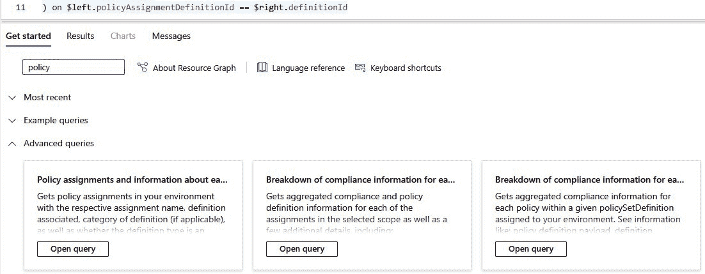

# 规划合规性

当与**人工智能**（**AI**）系统合作时，当我们谈论合规性时，有几个事情会浮现在脑海中。首先是遵守通常由政府、行业协会或其他监管机构设定的法律、法规和标准的过程，其次是伦理考量。

在本章中，我们将学习如何根据微软的六个负责任 AI 原则，以道德和负责任的方式开发**机器学习**（**ML**）模型，以及如何使用负责任 AI 工具将这些原则转化为负责任的开发策略。然后，我们将概述 Azure 机器学习行业公认的监管合规标准，以及如何通过使用 Azure 策略来执行这些标准。这些标准不仅是微软的基准，也是全球接受的框架，例如**国家标准与技术研究院风险管理框架**（**NIST RMF**）。

在本章中，我们将涵盖以下主要主题：

+   探索负责任 AI 开发

+   Azure 机器学习中的 Azure 策略合规性监管

+   合规审计和报告

+   Azure 中的合规自动化

到本章结束时，你不仅将熟悉监管和安全合规标准，还将学习如何处理审计、报告和自动化。

# 探索负责任 AI 开发

随着 AI 系统越来越受欢迎并被世界各地的人们使用，它引发了关于这些系统如何道德执行的问题。例如，OpenAI 的 ChatGPT 模型的公开发布就是一个明显的例子。到目前为止，每个人都几乎都使用过它，并且它产生了一些有趣的反应。许多人对此新产品印象深刻，兴奋，甚至爱上了它，因为它可以帮助他们在工作和日常生活中更加高效。其他人则对此强大模型的前景感到担忧，甚至害怕它如何非常容易地模仿人类行为。

技术的重点始终是解决问题。我们正处于一场新的技术革命之中，AI 有能力迅速改善人们的生活；然而，这并不意味着其中没有危险。每个使用和创建高级 AI 系统的个人组织都需要为道德和负责任 AI 开发创建一个治理体系。

在接下来的章节中，我们将探讨负责任 AI 原则，并学习如何将它们应用到我们的组织中。

## 负责任 AI 原则

在这本书中，我们将遵循微软的**负责任 AI**方法，该方法基于六个伦理原则——公平性、可靠性及安全性、隐私和安全、包容性、透明度和问责制。

我们将把这六个原则转化为更具体的治理政策，在接下来的章节中，我们将探讨我们可以使用的工具来维护我们的系统中的治理和合规性。以下是这些原则的描述：

图 3.1 – 负责任的 AI 原则

让我们在接下来的部分中讨论这些内容。

### 公平性

AI 赋能的系统和应用应该公平地对待所有人。任何处于开发或生产中的系统都应避免不公平的偏见，并促进所有使用该系统的人的平等待遇和机会。这包括无偏见的决策。我们需要确保 AI 系统不会基于种族、性别、年龄或残疾等属性歧视个人或群体。因此，在收集数据时，我们需要确保每个类别都有广泛的价值范围，并且敏感标签不会影响预测。例如，当我们需要将敏感数据包含在预测数据集中时，我们也应小心不要持续现有的不平等或数据中的意外相关性。

缓解措施包括 ML 流程的每个步骤的技术，但主要是在数据预处理阶段。例如，如果我们正在训练一个应用程序来批准贷款，我们应尽可能排除所有敏感特征，因为人口统计数据可能会持续偏见。有公平性库可用于识别和防止偏见，例如我们将在下一章中看到的 Fairlearn 库。

### 可靠性和安全性

AI 系统不仅应该对用户可靠和安全，而且在开发过程中也应该如此。这个原则侧重于确保 AI 系统是可靠的、按预期运行并减轻潜在风险。安全性和可靠性与系统的许多方面及其流程有关。

一个系统必须具有可靠的表现并交付可靠准确的预测。我们应该努力最小化错误、不一致性或意外行为。服务中断，无论大小，都可能影响其他系统。机器学习模型通常是其他流程的一部分，因此一个分析和预测以检测网络安全威胁的模型应该有安全措施，以确保其不会失败。

我们应该始终关注可能导致个人或社会产生负面后果的风险。我们确保系统安全性的程度在很大程度上取决于系统的目的。例如，对于使用自动化生成来产生质量不佳的图像而不造成任何伤害的娱乐应用来说，这是可以接受的，但同样的标准并不适用于自动驾驶汽车或手术机器人臂等关键系统。最后，为了使系统可靠和安全，它需要保持最新并持续监控，以确保它维持或提高其建立的标准。这意味着生产过程中应该有人工交互，或者如果系统从反馈中学习，应该有一个审批流程。

### 隐私和安全

任何 AI 系统或 ML 启用应用程序与其他基于数据的应用程序没有区别。由于存在攻击技术会使训练模型泄露用于训练它的数据，因此隐私和安全甚至更加重要。

在我们开始之前，我们需要考虑数据法规，以便我们可以决定在哪里存储数据。当与 Azure 合作时，你需要了解全球数据中心区域，以确保你的数据受到适当的法规保护，并遵守你拥有的任何合规要求。当你创建你的 Azure 机器学习环境时，你可以选择你偏好的区域。

第二部分是保护数据和系统。在这本书的整个过程中，我们将看到实施安全性和隐私的最佳实践，以确保我们托管在 Azure 上的工作负载的安全性和隐私。始终记住，在保护你的 ML 模型及其数据和算法时，你还必须确保相关的系统也是安全的，以防止对手使用横向访问技术来获取你的资源。

除了安全问题之外，最大的问题也是隐私问题，尤其是在金融或医疗保健等领域的。由于机器学习基于数据，我们需要在我们的模型中使用绝对最少的**个人可识别信息**（**PII**）。我们可以使用几种技术来匿名化我们的数据和库，以帮助最小化识别，甚至从下一章中我们将看到的 SmartNoise SDK 等汇总结果中也是如此。

### 包容性

一个 AI 系统应该具有包容性，并促进所有个人和社区平等地获得、参与和受益。在开发阶段，拥有多样化的观点和经验尤为重要。当你包括来自不同背景和人口统计的广泛利益相关者和专家时，你确保 AI 系统能够反映不同社区的需求和价值观。

可访问性也是一个重要的考虑因素，我不仅仅是在谈论残疾。当然，我们需要整合各种可访问性需求的功能，例如支持屏幕阅读器、键盘导航和其他辅助技术。此外，我们还需要考虑**用户体验**（**UX**）和可用性。如果你的目标受众包括整天都在移动的销售人员，添加语音功能对于包容性也很重要。

通过在人工智能开发中使用以用户为中心的方法，积极寻求反馈，并与一个专注于理解和解决需求的多元化团队合作，你可以确信你正在积极地为社会、经济和文化包容性做出贡献。

### 透明度

每个人工智能系统在各个方面都应该是可理解的。这并不意味着公开分享其创建的所有信息，因为，正如我们在上一章中看到的，这可能是危险的，对手可以利用这些信息来破坏系统。然而，用户应该清楚了解系统的工作原理、其局限性以及可能对个人和社会产生的影响。

**可解释性**是人工智能和机器学习的重要组成部分。机器学习模型，尤其是那些涉及复杂决策预测的模型，应该提供关于哪些特征影响预测以及影响程度的见解。有许多库可用，我们将在下一章中看到一些实现。

人工智能披露的使用同样至关重要。大多数时候，模型作为另一个系统或流程的一部分被部署。用户需要知道系统何时使用人工智能自动化，何时由人工处理，以避免任何混淆。明确沟通系统的能力和局限性有助于管理用户期望并避免潜在误解。

### 责任制

责任制补充了其他五个原则，并且是任何系统的一个基本方面。必须明确所有参与机器学习过程的人的角色和责任。这包括为机器模型和相关服务的开发、部署和持续监控分配责任。我们需要具备适应性，因为人工智能系统会持续从反馈中学习，并且我们需要准备好承认和解决由我们模型预测导致的任何事件。

遵守适用于 AI 开发和使用的相关法律、法规和伦理指南同样重要，因为开发该技术的组织通常对任何问题负有责任。遵守合规和法律要求将帮助我们最大限度地减少任何潜在的未来问题。这不是一次性的检查；我们需要对 AI 系统进行持续监控和评估，以评估其性能并确定改进领域。此外，目前关于 AI 和数据的法规非常少，因此我们需要跟上任何更新，这本身就是一个挑战，因为这些法规可能是特定于地区或行业的。我们将在本章后面更详细地讨论合规性以及如何使用 Azure 的工具来确保你的开发过程受到保护，并确保合规性得到保证。

注意

所有原则、指南和相关文档都可以在官方 Microsoft *负责任的 AI*门户网站上找到：[`www.microsoft.com/ai/responsible-ai`](https://www.microsoft.com/ai/responsible-ai)。

## 在你的组织中开始负责任的 AI

所有的前述点在理论上都很简单，但你是如何开始构建一个稳固的策略的呢？让我们回顾你需要采取的第一步，因为负责任的 AI 可以在多个阶段实施。

首先，你将开始进行评估。你在负责任的 AI 旅程中处于什么位置，你需要改进什么？第二部分是负责任的发展，这一阶段取决于你的系统目标。这里有不同的指南和工具，以确保在 ML 生命周期的所有阶段都能保持公平性和性能。我们的工作还没有结束；我们还需要确保负责任的部署。

在本节中，我们将简要概述可用的工具和指南。我们将在下一章中探讨每个工具的实施和最佳实践。

### 人类-人工智能体验工具包

**人类-人工智能体验（HAX）工具包**是一套资源和实践工具，旨在支持组织在负责任地开发和部署 AI 系统。它包含多个工具和指南，我们可以使用它们将 UX、AI、项目管理、工程团队聚集在一起，并在 ML 过程的各个阶段保持负责任和道德的 AI 开发。

使用 HAX Toolkit 的第一步是熟悉人机交互的指南。它们概述了 AI 系统应该如何表现并与用户互动。

HAX Toolkit

在这里找到 HAX Toolkit 的最新文档和指南：[`www.microsoft.com/en-us/haxtoolkit/`](https://www.microsoft.com/en-us/haxtoolkit/)。

然后，您可以使用 HAX 工作簿，这是一个包含多个问题的 Excel 表格，将帮助您优先处理工作项，并根据您的个人场景确定需要实施哪些指南。特别是如果您正在处理**自然语言处理**（**NLP**），您可以使用 HAX 演练手册。这将帮助您识别可能出现的系统故障以及如何防止或从中恢复。 

如果这一切听起来非常理论化，在下一节中，我们将看到一个如何使用 HAX 工作簿来制定我们策略的例子。

#### 探索 HAX 设计库

我们需要做的第一件事是熟悉 HAX 设计库。您可以在以下链接找到所有完整材料：[`www.microsoft.com/en-us/haxtoolkit/library/`](https://www.microsoft.com/en-us/haxtoolkit/library/)。在这里，您可以找到基于负责任 AI 原则的人机交互的 18 条指南。这些指南附带设计模式和行业案例。

这就是一眼就能看到的 18 条指南：

+   **G1: 清晰说明系统** **能做什么**。帮助用户了解系统的优势或局限性。

+   **G2: 清晰说明系统** **能做什么**。在本指南中，我们确保用户了解系统的错误频率。

+   **G3: 根据上下文** **安排服务**。这计划根据用户的任务何时采取行动。

+   **G4: 根据上下文** **显示相关信息**。根据用户的当前任务或场景向用户显示信息。

+   **G5: 与相关** **社会规范** **匹配**。在这里，体验应与用户的社会和文化环境相匹配。

+   **G6: 缓解** **社会偏见**。确保系统公平对待所有敏感群体。

+   **G7: 支持** **高效调用**。系统应在需要时易于访问。

+   **G8: 支持** **高效忽略**。确保有忽略系统服务的能力。

+   **G9: 支持** **高效纠正**。确保有从错误中恢复的能力。

+   **G10: 在怀疑时** **明确服务范围**。优雅地阐明模糊的命令。

+   **G11: 清晰说明系统为何** **这样做**。确保系统的结果可以解释。

+   **G12: 记住** **最近交互**。保持之前行动的简短历史记录。

+   **G13: 从** **用户行为** **中学习**。如有需要，调整用户行为。

+   **G14: 谨慎** **更新和适应**。在维护期间限制干扰。

+   **G15: 鼓励** **细粒度反馈**。允许用户提供反馈。

+   **G16: 传达用户行为** **的后果**。明确用户行为如何影响系统的功能。

+   **G17: 提供** **全局控制**。确保用户可以自定义系统的行为。

+   **G18: 通知用户** **关于变更**。让用户了解新功能。

在熟悉上述指南后，我们需要看看我们如何使用它们来制定负责任 AI 策略。

让我们看看如何优先级排序和跟踪每个指南的实施。

#### 使用 HAX Workbook 开发负责任的 AI 策略

要开始，请从[`www.microsoft.com/en-us/haxtoolkit/workbook`](https://www.microsoft.com/en-us/haxtoolkit/workbook)下载 HAX Workbook。我们将根据*第一章*中展示的场景，一起填写第一行，包括糖尿病预测模型。

在工作簿中，第一行展示了这个指南：*明确系统* *能做什么*。

说明

通常，您会在进入下一步之前填写一个步骤中的所有行。然而，仅作为一个例子，我们将只通过第一个指南。

让我们继续填写工作簿的第一行，如下面的步骤所示。您可以在每个步骤的截图上看到结果：

1.  **选择相关指南**：在我们的案例中，第一个指南，*明确系统能做什么*，是关键的，因为预测涉及医疗数据，可能会影响患者的诊断和治疗，因此医生应该清楚结果是一个估计，他们需要在向患者提供诊断和治疗之前验证其有效性。在下面的截图中，您可以看到指南的第一步以及如何填写其余单元格的**示例**列。由于对我们来说这个指南是关键的，我们在**步骤 1**下选择**是**：

图 3.2 – 步骤 1：选择相关指南

1.  **想象相关指南的影响**：在这个步骤中，您将遍历您已设置为相关的所有指南，并想象实施或不实施这个指南对您的用户的影响。在我们的案例中，这非常重要，因为我们的机器学习模型旨在加速，而不是取代诊断过程。医生应该意识到预测是一个估计，他们应该验证结果。如果医生不验证结果，他们可能会开出错误的治疗方案，这对患者的健康可能产生危险后果：

图 3.3 – 步骤 2：想象相关指南的影响

1.  **草拟实施要求**：在这个步骤中，我们概述了实施这个指南需要做什么。在这种情况下，我们确定了三个不需要太大承诺的任务；这些任务在下一张截图中可见：

图 3.4 – 步骤 3：草拟实施要求

1.  **优先级**：优先级由您决定。实施这个指南有多紧急？由于我们正在处理一个医疗保健系统，明确系统能做什么是至关重要的：

图 3.5 – 步骤 4：优先级

1.  **跟踪**：你可以使用这份文档或你自己的项目管理工具来评估你使用这份文档优先考虑的负责任开发特性：

图 3.6 – 步骤 5：跟踪

然后，这个过程（从*步骤 1*到*步骤 5*）需要为所有指南重复进行。

经过这次练习，你将很好地了解如何着手进行道德人工智能的开发。即使你不确定如何填写文档，在**示例**列中，你将找到每个指南如何在系统中实施的解释，这特别有帮助。

然而，应用程序需要经过测试以确保我们覆盖了所有基础。当涉及到人机交互时，有一些具体的事情我们需要注意。

那么，让我们看看 HAX Playbook 如何帮助我们。

#### 发现 HAX Playbook

如果你正在处理自然语言处理（NLP），那么你真的应该利用 HAX Playbook。这是一个基于你提供的场景的交互式工具，它为你提供常见的交互场景进行测试，以确保在你的应用程序中你已经考虑了最基本的问题，并制定了补救计划。

操练手册可以在以下链接找到：[`microsoft.github.io/HAXPlaybook/`](https://microsoft.github.io/HAXPlaybook/)，或者如果你想调整它创建的调查，你可以从这里构建源代码：[`github.com/microsoft/HAXPlaybook`](https://github.com/microsoft/HAXPlaybook)。

要使用操练手册，打开网站并选择页面左侧你的应用程序支持的 AI 功能。一旦你点击某个选项，操练手册就会显示右侧的常见用法以及可能出现的常见错误和问题，如下一张截图所示：

图 3.7 – HAX Playbook

例如，如果你在左侧选择**对话式人工智能**和**文本**输入，操练手册会建议一个常见错误是文本中的拼写错误。你选择的选项越多，展示的场景就越多。这些场景也可以以各种格式导出，供以后使用。

在我们完成了人机用户体验之后，让我们使用下一个方法确保我们的系统具有包容性。

### 包容性设计方法

如前所述，负责任人工智能的一个原则是包容性。如果你不知道从哪里开始，你可以使用微软的包容性设计原则，这是一种确保每个人在数字环境中都被包括并得到支持的方法。

包容性设计

你可以在以下链接找到包容性设计文档和指南：[`inclusive.microsoft.design/`](https://inclusive.microsoft.design/)。

包容性设计原则很简单。首先，我们需要认识到排斥和承认偏见。其次，我们需要通过引入新鲜和多样化的视角来通过多样性学习。最后，当您提供内容以适应有身体或精神障碍的人时，它创造了惠及每个人的体验。在您对如何进行负责任的设计有了良好的理解之后，您可以继续使用许多工具和库。在这本书中，我们将看到许多实现和工具，帮助我们将负责任的人工智能功能集成到我们的系统中。

在负责任的人工智能开发之后，我们需要学习如何确保监管合规。

# Azure 机器学习的 Azure 策略中的监管合规

监管合规是指遵守通常由政府、行业协会或其他监管机构设定的法律、法规和标准的过程。监管合规的一部分意味着一个组织在其行业和或其地理位置适用的特定法律或监管框架内运营。监管合规对于维护道德实践、保护组织和客户以及减轻风险至关重要。它包括法律和法规、政策和工作流程、风险评估和管理、报告和文件编制，最后是监控和审计。在组织内建立合规文化可能很困难，但这是必不可少的。这可能包括员工培训和确保合规是优先事项。然而，有时为了确保所有这些流程和实践得到执行，可能需要实施或配置安全控制措施。

如果您的组织需要证明符合法律或监管标准，微软和 Azure 平台完全符合多个全球、区域和行业标准。您可以在 Azure 合规文档中找到所有信息。然而，平台符合标准并不意味着您实施和使用服务的方式也符合标准。您可能需要正确实施或配置这些控制措施，以符合与服务无关但例如与数据相关的法规。在这里，我们将探讨适用于 Azure 机器学习的所有监管合规控制措施，我们将在接下来的章节中看到如何实施。

每个控制项都与一个或多个**Azure 策略**定义相关联。Azure 策略是 Azure 中的一项服务，您可以使用它来创建、分配和管理策略，以强制执行并管理您组织在 Azure 资源中的合规性和安全要求。这些策略可以用于强制执行对资源的各种配置和约束，例如资源类型、地区、标记、访问控制等。您可以使用 Azure 策略通过现有资源的修复和新资源的自动修复来使资源符合规范。您可以将多个业务规则组合在一起形成一个策略倡议。您还可以定义和实施一组规则，称为**策略定义**，这些定义了您的 Azure 资源所需的状态。策略定义或倡议可以分配给 Azure 支持的任何资源范围，例如管理组、订阅、资源组或单个资源。Azure 策略将资源与定义的策略进行比较，并提供合规性结果，使您能够在一个中心选项卡中监控和强制执行所需的配置。

策略分配相当简单。让我们看看它是如何工作的：

1.  打开 Azure 门户[`portal.azure.com/`](http://portal.azure.com/)，并在搜索框中键入`policy`，如下截图所示：

图 3.8 – 打开 Azure 策略

1.  您将进入**概览**选项卡。在这里，您可以看到您策略的摘要和您资源的一致性：

图 3.9 – Azure 策略概览选项卡

1.  要分配新策略，请转到左侧的**创作**菜单并点击**分配**。在此菜单中，您可以将策略分配给您的资源：

图 3.10 – 策略分配

1.  点击**分配策略**按钮，并填写下一张截图中所概述的信息：

图 3.11 – 分配策略基础

1.  **范围**是策略应用的空间。您可以将范围设置为资源所在的管理组、订阅或资源组。我选择了我的订阅。如果您想排除特定的资源，您可以在此处设置排除。然后，您可以选择一个策略定义。在门户中有 1000 多个；您可以在 GitHub 上找到更多，或者您可以创建自己的。我选择了一个简单的定义，要求所有资源都必须有一个标记。如果可用，您可以在**修复**选项卡上设置此操作。我选择的策略没有为之前创建的资源提供修复。

如果您不想设置超过所需设置，那就行了！分配可能需要 15 分钟才能启用，然后它将在您设置的范围内对所有新资源强制执行。

对于 Azure 机器学习，您可以实施几个策略以确保您的资源符合规范。我至少建议启用以下两个策略：*Azure 机器学习计算实例应重新创建以获取最新的软件更新*，这样您的计算实例始终更新并安全，使用最新的操作系统版本，并且应启用空闲关闭以防止使用策略 *Azure 机器学习计算实例应具有空闲关闭* 来防止不必要的成本。其他策略则更具体，您可以在以下链接中找到完整的列表。

Azure 机器学习的内置策略

您可以在以下表格中找到 Azure 机器学习的内置策略：[`learn.microsoft.com/en-us/azure/governance/policy/samples/built-in-policies#machine-learning`](https://learn.microsoft.com/en-us/azure/governance/policy/samples/built-in-policies#machine-learning)

上述策略专门适用于 Azure 机器学习并不意味着这些是我们唯一可以用来遵守合规框架的策略。由于 Azure 机器学习使用多个相关服务来工作，因此值得研究 Azure 容器注册表、Azure Kubernetes 服务、我们在 Azure 中使用的数据库等策略。如果策略没有涵盖我们想要做的事情，我们可以创建一个自定义策略或在 GitHub 上找到更多内容。

Azure 策略服务与 **Azure 资源管理器** (**ARM**)、**Azure 门户**、**Azure DevOps** 以及其他 Azure 服务集成，使您能够在资源创建、部署和持续管理过程中强制执行策略。此外，您还可以通过使用 **Azure Active Directory 条件访问** 功能根据条件利用 Azure 策略。在本节中，我们将探讨适用于 Azure ML 的特定行业标准和策略，并使用它们来创建安全基线。

Azure 合规性文档

您可以在此处找到所有 Azure 合规性产品提供的详细信息报告：[`learn.microsoft.com/azure/compliance/`](https://learn.microsoft.com/azure/compliance/)。

## Azure 安全基准

**Azure 安全基准** (**ASB**) 是一套基于行业标准的推荐方案，指导您如何在 Azure 上保护您的云解决方案。ASB 包含了所有 Azure 服务的策略和建议，包括安全和合规性标准。如果您想查看每个服务以及如何应用 ASB 建议，您可以在文档中找到 ASB 映射文件。对于 Azure ML，我们将考虑网络安全和数据保护控制。

## 联邦风险和授权管理计划

**联邦风险和授权管理计划**（**FedRAMP**）是美国政府提出的针对云服务提供的联邦政府方法。如果你的组织或客户位于美国，你应该真正考虑这些规定，以确保符合相关法律。这个方法是由美国政府提出的，并不意味着你不能用它来保护其他地区的 Azure 机器学习工作负载。

Azure 中的 FedRAMP 包括两个级别的保护：FedRAMP 高和 FedRAMP 中。高影响级别通常用于执法、紧急服务、医疗保健或金融等系统，这些系统的完整性、机密性和安全性对组织的运营将产生灾难性的影响。中等影响级别适用于大多数云系统，可能会产生严重影响，但它们不在数据和处理极其敏感的行业。对于 Azure 机器学习，我们将使用**访问控制**和**系统与通信保护**控制措施。尽管这些控制措施是由于这种方法而存在的，但它们是有效的，可以帮助你在任何位置或类型的任何地方保护你的工作负载。在这本书中，我们将包括来自多个行业标准的最优实践，包括 FedRAMP。

## 新西兰信息安全手册（受限）

**新西兰信息安全手册**（**NZISM**）是新西兰政府关于信息安全和管理系统安全指南。尽管 NZISM 旨在供新西兰政府机构和组织使用，但它包含多个控制措施，这些措施对于 Azure 机器学习特别重要，因为它们适用于 Azure 基础设施和加密。

## NIST SP 800-53 Rev. 5

NIST 提出了几个控制措施，特别是关于安全性的，从低影响、中等影响、高影响到隐私控制。*NIST SP 800-53*数据库包含信息系统和组织的安全和隐私控制措施评估程序和基线。你可以在 NIST RMF 下找到所有这些信息。通过这个合规标准，我们将获得在 Azure ML 中实施访问控制、系统保护和通信安全控制措施的知识。

## 印度储备银行 IT 框架（银行）v2016

在**印度储备银行 IT 框架（银行）**的 Azure 策略合规性下创建的一些控制措施也可以用来保护 Azure 机器学习工作负载。尽管这个标准是关于一个非常具体的领域，但它包含了关于指标、高级实时威胁防御和管理、补丁/漏洞和变更管理以及反钓鱼控制措施，这些措施对于 Azure 机器学习特别有用。

所有的先前合规性标准和它们的政策都内置在 Azure 平台中，因此我们可以轻松地利用它们来创建我们的安全基线，您会发现其中许多政策可以重叠，因为它们是许多不同方法和标准的一部分。当然，如果您愿意，您始终可以创建适用于您个人行业或组织程序的自定义政策，但在这本书中，我们将专注于为您构建一个坚实的基础。

# 合规性审计和报告

只需使用 Azure 策略服务，您就有权访问**合规性**和**修复**选项卡，您可以使用它们免费监控 Azure 资源的合规性状态。您只需要一个活跃的 Azure 订阅。请注意，如果您将 Azure 策略服务启用到 Arc 资源，可能会产生相关费用。在这种情况下，您可以访问 Azure 定价计算器以查看相关费用。

合规性审计是评估组织遵守相关法律、法规、政策和行业标准的过程。它通常涉及对组织的实践、程序和控制进行彻底检查，以确保它们符合既定要求。合规性审计可以由内部或外部审计员进行，他们必须独立于被审计的过程。内部审计和合规性审计似乎有类似的步骤；然而，它们非常不同，因为合规性审计关注的是组织是否遵守所有相关的法律、规则和法规，而不是财务或运营系统。

审计过程涉及许多步骤。首先是要确定范围。审计范围定义了需要评估的具体法规、法律、标准或政策，这些都与公司的地理位置或行业相关。然后是合规性评估，我们通过分析流程、控制和报告来确定组织是否遵循规定的程序。如果审计员发现了不符合规定和可能影响组织运营或声誉的风险区域，他们将评估这些风险的严重性和可能性，并根据评估结果优先推荐建议。这些建议可能包括实施新的控制措施、修订政策和程序、进行员工培训或增强监控流程。审计结束时，将创建一份包含所有结果的报告，并与适当的利益相关者共享。组织有责任解决和纠正问题，有时在审计期间内，并确保他们监控合规性，以便在未来修复问题。

合规审计在帮助组织保持法律和监管合规、降低风险以及向利益相关者展示问责制方面发挥着至关重要的作用。它有助于在这些问题导致法律违规、经济损失或声誉损害之前识别和解决不合规领域。

要在 Azure 和 Azure 策略的帮助下完成此操作，我们有几个可用的工具，我们可以使用这些工具来监控和提取报告，以证明我们服务的合规性。让我们看看其中一些工具以及如何使用它们进行报告。

## Azure 门户

您可以从在 Azure 门户中打开 Azure 策略服务开始。您不需要为此创建新的资源；它已经是您订阅的一部分。您需要做的就是打开门户，在顶部搜索框中搜索`策略`，正如我们在本章之前所看到的。一旦您打开**策略**菜单，您将看到类似于以下截图的内容：

图 3.12 – Azure 门户中的 Azure 策略概述选项卡

您可以从**概述**选项卡或**合规性**选项卡中查看您当前分配了哪些策略以及您的订阅中哪些资源是合规的或不合规的。这些都在表格形式中，您还可以看到几个图表，如前一个截图所示，以快速查看您资源的合规百分比。

这份报告非常出色，因为它能立即为您提供信息摘要。通过点击政策或倡议分配，您可以查看有关政策的更多信息，查看不合规的资源，并创建修复任务或例外情况，如下面的截图所示：

图 3.13 – 使用门户的 Azure 策略分配详情

注意顶部您有多少选项而无需离开报告页面。

## Azure 资源图探索器

**Azure 资源图探索器**是一个强大的服务，它使您能够快速高效地探索、查询和分析您的 Azure 资源及其属性。这是一种非常可扩展的方式来检索信息和获取洞察。您可以使用**Kusto 查询语言**（**KQL**）创建 Azure 资源图探索器查询，以获取您环境中策略的信息。

让我们看看如何运行一个简单的查询并提取报告：

1.  要开始，通过在顶部搜索栏中键入名称打开 Azure 资源图探索器，如下所示：

图 3.14 – 打开 Azure 资源图探索器

1.  在页面底部，在`策略`下，如以下截图所示：

图 3.15 – 搜索策略相关查询的查询模板

1.  运行最左边的查询。您将获得您的订阅的活跃策略任务：

图 3.16 – 在 Azure 资源图探索器中运行查询

现在，您可以使用 KQL 来定制结果和列，以获取您想要的信息，将数据导出为`.csv`文件，或将表格固定到 Azure 仪表板上。

KQL 参考

如果这是您第一次听说 KQL，您可以从这里开始使用 KQL 查询，因为我们将在接下来的章节中也需要它：[`learn.microsoft.com/en-us/azure/data-explorer/kql-quick-reference`](https://learn.microsoft.com/en-us/azure/data-explorer/kql-quick-reference)。

此外，还有其他方法可以访问由您的策略和倡议任务生成的合规性信息。我们可以使用命令行脚本、**Azure REST API**和**Azure Monitor Logs**。策略评估和执行报告是实时的。一旦在您的 Azure 订阅中启用每个策略，在允许流程继续之前，任何要创建的资源都将被评估。

您还可以将 Azure 策略任务与其他服务集成，例如 Event Grid，或创建警报，以便您在资源方面获得通知。Azure Policy 与 Azure Defender for Cloud 配合得很好，您可以根据我们在这里概述的行业合规性标准查看资源的合规状态。然而，我们将在本书的后面部分更多地讨论这些仪表板和工具，当我们处理 Azure 中的所有日志和监控技术时。

可以理解的是，手动处理所有内容可能会产生一些管理开销。在下一节中，我们将探讨如何自动化一些这些流程。

# Azure 中的合规性自动化

正如我们在上一节中看到的，遵循内置的合规性标准并在我们的资源中执行策略相对容易。然而，我们很少只有一个资源或一个订阅来应用这些策略。通常，我们将创建开发环境，然后再次将其部署为生产环境，有时我们甚至使用类似的政策和执行规则同时维护两者。

在 Azure 中重新创建开发环境很容易，因为有几种方法可以通过使用 ARM 模板和命令行脚本等在资源组或订阅之间复制资源。然而，ARM 模板仅用于描述一个或多个相关资源。基于**基于角色的访问控制**（**RBAC**）的角色分配和策略必须重新创建并重新分配给每个订阅、资源组或资源。在这种情况下，我们还有一个服务可以帮助我们在 Azure 中重新创建环境：**Azure Blueprints**和**基础设施即代码**（**IaC**）。

让我们在接下来的几节中讨论这两个方面。

## Azure Blueprints

虽然 Azure Policy 中的 **ARM 模板** 需要在每次需要实施某些内容时部署或分配，但 Azure 蓝图服务利用角色分配、策略分配、ARM 模板和资源组来复制或重新创建一个完整的环境，保留资源和治理。几乎你可以用 Azure 蓝图完成的所有事情，你都可以用 Azure ARM 模板完成。区别在于 ARM 模板部署一个或多个资源。Azure 蓝图保留了应部署的内容、模板和蓝图分配、策略等之间的关系。

这是如何工作的：通过创建蓝图定义。蓝图定义由工件组成——具体来说，是针对订阅或管理组的资源组、ARM 模板、策略分配和角色分配。工件也可以是参数化的。要创建蓝图，你只需要遵循两个步骤：

1.  首先，你需要分配**蓝图名称**和**定义位置**值，这将是你想要应用此蓝图的订阅。这在上面的截图中显示：

图 3.17 – 创建蓝图基本细节

1.  你需要声明工件及其参数。工件包括资源组、资源模板、RBAC 分配和政策。请参考以下截图：

图 3.18 – 添加工件

当你使用蓝图时，其模式设置为**草稿**。当你准备好应用它时，你需要发布蓝图，并将其设置为**已发布**。每个发布的蓝图都有一个版本号。我们使用版本号来区分对同一蓝图的未来更改。如果你想对蓝图进行更改，你需要做的只是创建一个新的版本，包含你想要的所有更改，然后将其应用到相同的订阅或管理组。

## IaC

门户和命令行工具并不是在 Azure 中部署服务的唯一方式。我们还可以利用基础设施即代码（IaC）以及**DevOps**实践来确保你的环境、角色和策略在订阅之间的一致性。

在 Azure 上通过 IaC 进行**治理**是指使用基于代码的声明性模板来管理和治理 Azure 资源和配置的实践。Azure 提供了工具和服务，使你能够实现 IaC，以实现其云基础设施的高效和一致管理。

你可以将 IaC 与版本控制和协作功能集成，你还可以通过将 IaC 与 CI/CD 管道集成来利用持续部署和自动化。通过集成 DevOps，你可以自动化任何基础设施更改的部署、测试和验证。

Azure 提供了可以与基础设施即代码（IaC）结合使用的监控和审计功能。您可以利用并分析日志和遥测数据，以便监控和审计对您基础设施所做的更改。这确保了 Azure 中的合规性和治理。我们将在本书的后面部分看到如何利用 IaC 和 DevOps 在机器学习（或我们称之为**MLOps**）中的应用。

# 摘要

在本章中，我们学习了如何负责任地开发 AI 系统，以及如何使用负责任 AI 工具开发道德方法。我们熟悉了行业标准，并学习了如何使用 Azure 策略服务来实施这些标准。由于有许多工具可以帮助我们查看和维护服务的合规状态，因此合规性和审计的汇报从未如此简单。对于汇报和审计，我们在 Azure 策略、Azure 资源图探索器和命令行工具中拥有**合规性**和**补救**选项卡。为了自动化环境创建，我们可以利用 Azure 蓝图服务和 IaC。

现在我们已经制定了一个策略，并了解了一些开箱即用的多个安全标准，让我们看看我们如何在 Azure 环境中实施所有这些控制和护栏。正如在机器学习方面一样，我们将从数据开始。

在下一章中，我们将解释数据治理以及如何在我们的机器学习项目中安全地存储、传输、备份和恢复数据。

# 第二部分：保护您的数据

机器学习基于数据，因此保护它们是我们的首要任务。在本部分中，您将学习如何开发数据治理计划，然后学习如何在存储和传输过程中保护数据。您还将学习如何与备份和恢复服务合作，以及如何识别和保护敏感信息以及解释机器学习模型。最后，您将探索使用联邦学习和安全多方计算的最佳实践。

本部分包含以下章节：

+   *第四章**，数据保护和治理*

+   *第五章**，数据隐私和负责任 AI 最佳实践*
