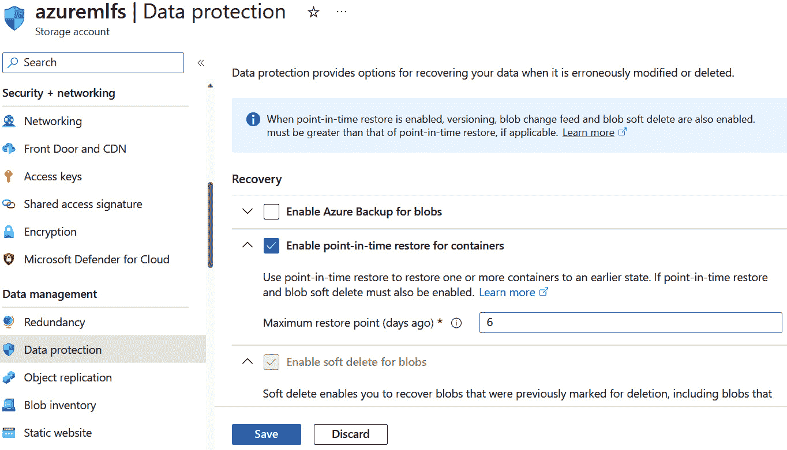

# 4

# 数据保护和治理

数据是机器学习的基础部分，因此在本章中，我们将关注数据治理、存储和安全的各个方面。我们将首先解释什么是数据治理以及了解我们拥有的数据的重要性。我们需要知道如何开发一个管理框架，以便我们可以改进从组织工作流程到商业决策的每一件事。数据治理还将帮助我们识别敏感数据以及我们如何更好地保护它，作为我们的数据治理计划或机器学习解决方案的一部分。

我们将首先学习在 Azure 机器学习中存储和检索数据的最佳实践。我们将了解许多可以用来保存我们的数据集的数据服务——例如，Azure Blob 存储和 Azure SQL 数据库及其基本的加密和安全功能。Azure 机器学习已经为我们提供了许多功能，如版本控制和日志记录，但由于数据通常与工作区相关联而不是保存在工作区中，因此熟悉来自不同服务的不同安全功能非常重要。最后，我们将探讨备份选项和恢复选项，因为尽管我们将尽最大努力保护我们的资产，但这并不意味着我们不应该为最坏的情况做好准备，即需要从人为错误或安全事件造成的数据丢失中恢复数据。

在本章中，我们将涵盖以下主要主题：

+   在 Azure 中处理数据治理

+   在 Azure 机器学习中存储和检索数据

+   加密和安全数据

+   探索备份和恢复

到本章结束时，您将更好地了解如何使用适当的工具和最佳实践为您的组织设置数据保护和治理框架，以在 Azure 机器学习中保护您的数据。

# 在 Azure 中处理数据治理

数据治理是指组织数据资产的整体管理和控制。它包括建立流程、政策和指南，以确保信息的可用性、完整性、安全性、隐私以及有效和高效地使用信息。这始终很重要，但当我们谈论机器学习时，它尤其关键，因为机器学习模型是基于数据的。无论我们是在谈论用于训练我们的模型的数据，还是我们的模型生成的数据，都不会改变这样一个事实：我们需要意识到我们处理的所有信息以及其生命周期。

为了有效地实施数据治理，组织通常需要建立一个数据治理框架或策略，该框架概述了数据管理的结构、流程和责任。这个框架应包括建立一个数据治理委员会或理事会，数据治理政策和程序，数据管理员角色，以及使用技术解决方案来支持数据治理活动。

数据治理不仅涉及技术方面，还涉及业务方面。在整个组织的不同部门之间交换了不同类型的信息，所有这些都需要成为公司数据治理政策的一部分，这可能会一开始就让人感到 daunting。记住，数据治理是一个涉及人员、流程和技术协作的努力。它需要所有利益相关者的持续承诺、沟通和参与，以推动成功的实施，确保数据治理策略的长期有效性。然而，由于存在关于安全和隐私的多个全球和地区性数据法规，如果您的组织没有数据治理策略，可能会导致经济损失并损害您的声誉。

制定这些政策和流程的复杂性给我们带来了许多挑战；然而，制定有效的策略也会带来许多好处。让我们从挑战开始。

## 识别挑战

挑战可以在每个步骤中识别为技术性、运营性或甚至以人为导向的。并非所有这些都会适用于所有组织，但了解可能的问题将帮助我们更好地为它们做准备。我们将一起探讨这些问题：

+   当我们制定新的策略时，无论是什么策略，最困难的部分往往是**公司范围内的接受度**。数据治理的实施通常需要组织内部的转变。员工需要改变他们的行为，采用新的流程，并接受不同的思维方式——一种以数据驱动的思维方式，这将打乱他们的日常常规。从一开始，如果缺乏意识和理解，接受新的策略将是一场斗争。不幸的是，由于数据治理需要跨不同部门和业务单元的协作和协调，任何缺乏参与、目标不一致和不一致之处都可能阻碍发展，导致数据管理实践碎片化，使组织面临许多风险。

+   另一个挑战是**吸引和协调合适的利益相关者**。我们需要涉及来自不同部门和组织的不同层级的利益相关者，以确保一致性和协作。这包括高管、IT 专业人士、数据所有者、数据用户以及法律和合规团队。理解他们的观点、需求和挑战与数据管理和治理直接相关，并将导致有效的数据治理框架。

+   然后，还有一致性和**标准化**的问题。我们真的需要在治理标准和灵活性之间找到正确的平衡。创建过于复杂的过程，虽然可以增加数据安全和隐私，但也会阻碍日常业务，这也不是一个受欢迎的结果。数据治理作为一种策略，旨在保护组织免受潜在的数据泄露和非合规的侵害。在某些情况下，可能需要做出一些让步或例外，以允许业务运营顺利进行。

+   如果我们设法或多或少地克服了上述挑战，那么接下来就是实际数据的问题。**责任对齐**是我们参与机器学习（ML）开发时需要更加关注的问题。决定谁应该和谁不应该访问特定数据段至关重要，但这只是第一步。这也可以进一步细分为哪些数据应该和不应该用于训练机器学习模型。

+   最后，启用正确的**数据治理工具和技术**同样至关重要。我们需要识别和实施适当的工具和技术来支持数据治理活动。这可能包括数据目录工具、元数据管理系统、数据质量工具和数据安全解决方案。这些工具有助于自动化和简化数据治理流程，提供对数据资产的可见性，并促进数据发现和协作。在本章和下一章中，我们将看到一些实践、工具和产品特性，它们将帮助我们做到这一点，特别是对于机器学习（ML）而言。

如果没有解决上述任何挑战，将导致数据管理不善。这意味着信息不安全、信息孤岛化以及流程不完整和不一致。结果使组织容易受到数据泄露的攻击，甚至可能对业务运营产生不利影响，因为决策可能会受到信息不足的影响。

如果我们成功克服了这些挑战，我们可以获得多重好处。让我们在下一节中回顾一下它们是什么。

## 探索益处

数据治理不仅可以保护组织，还可以改善业务运营。根据微软的说法，一个强大的数据治理策略有助于确保您的信息得到审计、评估、验证、管理和适当的安全保护，并保持可靠性。

第一个也是最为明显的益处是**数据质量提升**。数据治理确保数据准确、一致和可靠。通过建立数据标准、实施数据质量控制和分配责任，可以提高数据的整体质量。高质量的数据可以带来更多好处，例如更好的决策、提高运营效率以及改善业务流程。

数据治理可以改善**决策**。它提供了一个坚实的基础，并且当有可靠和可信的数据可用时，决策者可以基于准确洞察做出明智的选择，而这些洞察又基于当前的数据。数据治理有助于确保决策者能够及时、以正确的格式和适当的背景访问正确的数据。这也可以导致成本降低和**提高盈利能力**。

此外，由于数据治理侧重于保护敏感数据并确保遵守数据隐私法规，我们还需要**提高数据合规性、安全性和隐私性**。通过实施数据安全措施、建立访问控制和定义数据处理程序，我们可以大大降低数据泄露和未经授权访问的风险。在 Azure 机器学习中，通过适当的控制，你还可以创建符合数据法律和法规的合规性报告。

通过创建流程和最佳数据实践，你最终会得到**改进的数据管理**。任何需要、问题或问题都可以被找到并更有效地缓解。数据共享和协作在不同团队和部门之间进行得更加高效和安全。数据管理可以促进数据集成并确保系统和应用之间的数据互操作性。通过定义数据标准、数据格式和数据集成指南，组织可以实现更好的数据一致性和增强数据互操作性。

最后，数据管理可以建立信任。利益相关者和客户的信任可以导致**卓越的组织声誉**。当涉及到信任某人处理数据时，组织的声誉可能是他们选择的决定性因素，因为机器学习是通过旧数据和新技术数据进行训练和学习的。

既然我们已经了解了数据治理的重要性，让我们开始学习最佳实践，并探索一些可以应用于 Azure 机器学习和其相关服务的工具和资源。

## 开始使用云数据最佳实践

Azure 机器学习是一种云数据服务，正如你将在以下章节中看到的，与 Azure 机器学习一起工作的多数服务也是云服务或托管在 Azure 上。因此，我们将关注与云数据管理相关的最佳实践，而跟随由全球行业委员会——EDM 委员会——开发的**云数据管理能力**（CDMC）框架开始，无疑是一个更好的起点。

CDMC 框架概述了以下 14 项关键控制措施来管理数据风险：

+   **数据合规性**意味着包含敏感数据的任何事物都必须受到监控，一旦出现任何问题，应实施通知。

+   **数据所有权**必须在任何保存的信息中明确，并且具有报告的能力。

+   **权威数据源和供应点**应适用于所有敏感数据。

+   **数据主权和跨境流动**规定敏感数据必须根据政策进行控制和审计。

+   **数据编目**应在部门或环境中一致自动化，理想情况下在数据创建或摄取时进行。

+   **数据分类**应完成，并在可能的情况下自动化所有敏感数据。

+   **敏感数据的权限和访问**应由所有者管理并跟踪。

+   **数据消费目的**应提供所有数据，包括任何协议。

+   **安全控制**必须实施以强制执行数据合规性。

+   当出现问题时，**数据保护影响评估**应到位并实现自动化。

+   **数据保留**是指根据数据生命周期要保留的数据，最终这些数据将被删除。这应该明确定义，并可能实现自动化。

+   **数据质量**确保数据适合并根据其目的正确分类。

+   **存储和移动数据的成本指标**必须可用于报告。

+   **数据血缘**确保可以识别数据的来源和任何使用情况。

CDMC 框架对所有行业免费提供内部使用许可，包括 EDM 委员会成员和非成员。它还可以用于实施数据治理以及作为评估工具。你只需要接受他们的条款和条件。

数据管理能力（CDMC）

如果你想要了解更多关于 CDMC 框架和 EDM 委员会的信息，请访问[官方页面：https://edmcouncil.org/f](https://edmcouncil.org/frameworks/cdmc/)rameworks/cdmc/。

然而，无论你选择哪种框架或流程，一次性完成所有事情可能并不可能。相反，你需要从小处着手以确保成功的实施。指派某人或一个团队来执行和监控整个组织中的所有实施可能是个好主意。然后，确保你有明确的目标和清晰的商业案例。在整个过程中保持沟通畅通，并制定适当的指标来衡量进度也是至关重要的。关键在于认识到数据治理不仅仅是实施几个 IT 解决方案。

此外，虽然不存在一种适用于所有组织或行业的万能策略，但 Azure 提供了多种工具来实施控制和在你的数据中应用治理。让我们在下一节中探讨其中的一些。

## 探索 Azure 工具和资源

我们已经看到了一些工具帮助我们强制执行资源中的合规性，例如在第*3 章*中提到的 Azure 策略和 Azure 蓝图。让我们再回顾一些适用于数据治理的工具。

### 微软成本管理

在处理数据治理时，一个目标可能是优化您的云使用和支出。要监控并获得建议，您可以使用 Microsoft 成本管理。这对于 Azure 订阅是免费的，但它可以用于监控其他云。在后一种情况下，您可能需要检查管理成本是多少。

Azure 成本管理包括成本和使用的报告、多个分类选项、创建使用预算以及能够在预测成本上设置警报。

让我们看看如何使用此服务的示例：

+   在下一张图中，您可以看到**成本管理**的**成本分析**选项卡。一些功能在撰写本文时仍在预览中，但它为我们提供了关于订阅和每个资源成本的很好了解。

图 4.1 – 成本管理概述

+   在这里，我们可以通过资源、服务或甚至时间段创建报告。这些报告是可定制的，并提供每个计费期间实际和预测成本的图形表示，如下图所示：

图 4.2 – 成本分析

+   您可以在**成本警报**菜单中轻松创建警报以检测异常或基于建议。一旦您点击**添加**并填写字段，您的警报就准备好了。每当发生任何事情时，您都会收到电子邮件警报。

图 4.3 – 创建警报规则

+   如果您想基于预算创建警报，您需要通过**预算**菜单创建它。一旦您设置了预算，您就可以根据使用情况或预测使用情况创建警报，以确保您始终了解最新情况，确保您不会超出预算。此过程有两个步骤：

    1.  首先，您创建一个**预算金额**。您会得到一个包含您过去使用信息的图表，以帮助您决定如果尚未有预定义的金额，预算的大致金额应该是多少。

图 4.4 – 创建预算

1.  第二步是设置**警报条件**和**警报接收者**。警报可以是实际金额或预测金额，这有助于您在超过某个阈值之前收到通知并相应地计划。这在此处显示：

图 4.5 – 创建预算警报

您还可以使用 Azure 顾问的建议来查找您订阅的服务在使用和成本方面的最佳实践。通常，任何可以优化云使用的信 息都应成为您组织治理的一部分。

Azure 顾问成本建议[链接](https://learn.microsoft.com/en-us/azure/advisor/advisor-reference-cost-recommendations)

在[`learn.microsoft.com/en-us/azure/advisor/advisor-reference`](https://learn.microsoft.com/en-us/azure/advisor/advisor-reference-cost-recommendations)-cost-recommendations，您可以找到不同服务的成本建议。然而，如果您没有部署这些服务，它们将不会在**顾问推荐**选项卡中显示。

### Microsoft Purview

**Microsoft Purview**是一个数据治理、风险和合规性解决方案，旨在帮助组织管理和治理他们在各种来源和平台上的数据资产。其功能适用于 Azure 和**Microsoft 365**，您可以使用它来保护不同云、应用程序和设备之间的敏感数据，并识别和管理法规遵从性。

Microsoft Purview 提供了几个关键功能来支持数据治理。这种支持的基础是**数据地图**。Purview 提供了一个数据地图功能，帮助组织可视化和理解其数据资产的关系和特征。Purview 中的数据地图代表了组织内部数据景观的图形表示，包括数据源、连接和元数据。

在数据地图之上，您会发现许多用于不同目的的应用程序：

+   **数据目录**应用程序通过搜索您的数据并帮助对其进行分类来查找数据源

+   **数据资产洞察**应用程序帮助您了解您拥有哪些类型的数据以及它们在哪里

+   **数据共享**应用程序帮助您在合作伙伴和客户之间安全地保护数据

+   **数据策略**协助访问配置

Microsoft Purview 与各种 Azure 服务集成，例如 Azure Data Factory 和 Azure SQL 数据库，以提供端到端的数据治理能力。它利用 Azure 的安全和合规性功能来确保数据保护和法规遵从性，并发现的所有敏感数据都会与**Microsoft Defender for Cloud**共享。通过使用 Purview，您可以建立一个全面的数据治理框架，以改善数据可见性、控制和合规性。它通过提供一个集中平台来管理和治理数据资产，有效地解决与数据蔓延、数据隐私和法规要求相关的问题。

数据治理非常重要，因此在我们确定了敏感数据的位置之后，我们将看到如何使用 Azure 机器学习安全地与之合作。

让我们从数据的存储和检索开始。

# 在 Azure 机器学习中存储和检索数据

第一个任务是存储和检索 Azure 机器学习中的数据。您可以通过多种方式将数据带入机器学习。这包括从您的本地机器、互联网上的源，甚至是基于云的存储。在本节中，我们将探讨所有这些概念。

让我们看看如何与数据存储合作。

## 连接数据存储

如我们在*第一章*中介绍的 Azure 机器学习简介中提到的，**数据存储**作为对现有存储服务的引用，无论该服务是存储账户还是数据库。如果你已经有了对数据的引用或连接，这不是强制的，因为你也可以连接外部源，但连接数据存储有许多好处。首先，你有一个通用的方式将不同的数据源连接到你的工作区，而无需在脚本或代码的任何地方添加凭证信息，这在安全性方面是一种最佳实践。当你与团队一起工作时，拥有一个可以供每个人重用的相同数据源引用会更容易。当然，这也提供了一个使用可以与不同存储类型一起工作的 API 的通用直接方式。

当你创建数据存储时，你可以使用不同的身份验证方法。它可以是基于凭证的，也可以是基于身份的。基于凭证的身份验证意味着使用服务主体或共享访问签名（**SAS**）令牌进行身份验证，而在基于身份的身份验证中，你将使用你的 Microsoft Entra ID 身份或托管身份。在任何情况下，连接和身份验证信息都存储在工作区中。我们现在不会过多关注这一点，因为我们在下一章将分析你可以与机器学习一起使用的所有不同类型的身份验证选项。

每个工作区都有四个内置数据存储，这些数据存储被 Azure 机器学习用作系统存储。在“数据”菜单下的“数据存储”选项卡中，有两个 Azure Blob 存储数据存储和两个 Azure 文件数据存储。你可以从这里看到默认设置，或者设置另一个作为默认数据存储。

列表看起来会类似于以下截图：

图 4.6 – 内置数据存储

如果你想创建一个新的数据存储，当前可用的选项如以下截图所示：

图 4.7 – 创建数据存储选项

你可以从 Azure 门户、**命令行界面**（**CLI**）或 Python**软件开发工具包**（**SDK**）创建数据存储。目前，看起来你只能添加你具有访问权限的订阅中的数据存储。你可以随时添加或删除数据存储。记住，它们只是连接到拥有数据的服务的连接。因此，从工作区创建或删除数据存储实际上不会删除或创建任何服务，也不是强制的。此外，我们还需要确保所有连接的服务都使用它们自己的功能和最佳实践来确保安全。我们将在实验中使用数据资产。

让我们看看我们如何在工作区中创建数据资产，无论是从我们添加到工作区中的数据存储，还是从外部服务。

## 添加数据资产

在 Azure Machine Learning 中，数据资产指的是可以在机器学习工作流程中使用和管理的几种类型的数据。如果数据存储是数据源的联系，那么数据资产就是对实际数据的引用。您可以从数据存储、本地文件、公共 URL 或 Azure Open Datasets 创建数据资产。

如果可能，使用数据资产和数据存储一起使用，可以为我们提供几个安全和数据治理的好处。您可以使用相同的数据资产与您的团队协作，并通过您的训练代码无缝访问，而无需寻找不同的凭证或路径。数据资产支持版本控制，因此任何更新或数据处理都可以保存为新版本并重用。使用数据的管道或作业记录在工作区中，因此任何更改或更新都可以进行审计。

一旦创建数据资产版本，它就是**不可变的**，这意味着它不能被删除或编辑。因此，如果新版本的数据资产没有提供预期的结果，您始终可以回滚到之前的版本以进行工作。您可以使用来自旧 Azure Machine Learning API 的不同资产类型，但建议使用最新版本，即 Azure ML v2 API。

在 v2 中，您可以使用以下三种主要类型的数据资产：

+   **URI 文件**：URI 文件指向一个特定的文件

+   **URI 文件夹**：URI 文件夹指向一个文件夹

+   **MLTable**：MLTable 指向一个文件夹或文件，并包含一个用于读取为表格数据的模式

选择取决于您拥有的可用数据和您选择的 ML 项目和算法类型。

无论数据类型如何，您都有三个可用的来源，如下面的截图所示：

图 4.8 – 创建数据存储选项

如果您选择**从 URI**作为您的来源，请确保端点是公开的，并且不受任何凭证的保护。如果您想选择现有的数据存储，可以选择**从 Azure 存储**选项。然后，如果您想要的数据存储尚未预先创建，您可以通过向导直接创建它，并在列表中找到文件路径。您还可以通过选择**从本地** **文件**选项将您自己的文件上传到您选择的数据存储中。

最佳实践

在支持的情况下，请结合使用数据存储和数据资产。数据存储提供安全性，因为凭证存储在工作区而不是您的代码中。使用数据资产，您可以获得版本控制、可重复性、可审计性和血缘关系等能力，这些都是数据治理最佳实践的组成部分。

现在我们知道了如何将数据连接到工作区，让我们确保它在未使用和传输时都尽可能安全。

# 加密和保障数据

正如我们在上一节中看到的，Azure 机器学习依赖于外部服务来拉取数据作为数据资产。根据托管数据的服务，我们可以使用不同的安全和数据保护功能，例如加密、数据分类和数据掩码。

在本节中，我们将探讨与我们的数据相关的加密和分类功能。

## 静态加密

静态加密是指对存储在存储介质（如云存储）中的数据进行加密的实践，例如在存储介质中“静止”时。静态加密的目的是在存储介质被破坏、丢失或被盗的情况下，防止数据被未经授权访问。

当数据被静态加密时，它使用加密算法和加密密钥转换成不可读的形式。只有拥有适当解密密钥的授权用户或进程才能访问并解密数据，恢复到其原始的可读形式。没有解密密钥，加密数据对未经授权的个人来说仍然是不可理解的和无用的。

在 Azure 服务的背景下，Azure 为其许多存储服务提供了内置的静态加密，例如 Azure Blob 存储、Azure Data Lake Storage 以及 Azure 机器学习使用的数据库等。这些服务自动使用行业标准加密算法对静态数据进行加密。Azure 管理加密密钥并确保加密数据的安全性。

实施静态加密不仅提供安全性，而且构成了组织符合数据保护法规的一部分，加强了数据安全性，并减轻了数据泄露或未经授权访问敏感信息的风险。

让我们探索与 Azure 机器学习一起工作的数据服务中的那些功能。

### Azure 存储

当我们创建一个 Azure 机器学习工作区时，你也会创建一个 Azure 存储账户。该服务将快照、输出和日志存储在默认存储账户中，该账户与 Azure 机器学习工作区和你的订阅相关联，并用作工作区文件系统。它还用于托管训练计算目标使用的训练数据。在训练过程中，它作为远程文件系统挂载到这些计算目标上。最后，如果你选择上传文件，它们将存储在你选择的存储中，这通常是一个 Azure Blob 存储。因此，了解如何保护你的 Azure Blob 存储账户是必要的。同样适用于 Azure Data Lake Storage，因为它本质上是一个升级的 Blob 存储账户。

Azure 存储帐户使用 Microsoft 管理的密钥进行静态加密。在这种情况下，Microsoft 在线服务自动生成并安全存储加密密钥。如果您想控制和使用自己的加密密钥，请打开 **加密** 菜单，该菜单位于 **存储帐户** 选项卡中，并切换到带有 **客户管理的密钥** 的加密选项，如图下所示：

图 4.9 – 创建数据存储选项

输入您的密钥托管的位置的密钥 URI 并点击 **保存**。

最佳实践 – 客户管理的密钥和 Azure Key Vault

使用 Azure Key Vault 服务生成和存储加密密钥。有关该服务的更多信息，请点击此链接：[`learn.microsoft.com/en-us/azure/key-vault/general/overview`](https://learn.microsoft.com/en-us/azure/key-vault/general/overview)。

连接到 Azure Blob 存储的数据存储使用账户访问密钥进行访问。每个存储帐户有两个访问密钥。在您的 **存储** **帐户** 选项卡的 **访问密钥** 菜单中找到您的密钥：

图 4.10 – 存储帐户访问密钥

您可以使用任一密钥在 Azure 机器学习中进行认证。这些密钥必须频繁轮换以保障安全。以下是轮换访问密钥的过程可能的样子。此过程适用于任何使用 **访问密钥** 进行认证的服务。

图 4.11 – 密钥轮换过程

您还可以使用 SAS 令牌来认证存储帐户；但是，请注意，SAS 令牌会过期，在过期日期之后，您将无法访问该存储帐户以与 Azure 机器学习一起工作。

要创建一个账户级别的 SAS 令牌，请转到 **共享访问签名** 菜单，该菜单位于 **存储帐户** 选项卡中，并生成一个令牌，如图所示：

图 4.12 – 生成账户 SAS

请注意包括适当的权限和服务可见性。一旦您对选择满意，您就可以回到 Azure 机器学习工作室，打开数据存储，通过点击 **更新认证** 按钮，您可以使用新的凭据更新数据存储。

图 4.13 – 在工作区中更新认证凭据

然而，存储帐户并不是我们唯一的数据库。让我们讨论更多选项及其功能，从 Azure 数据库开始。

### Azure 数据库

Azure 中有很多数据库选项。大多数这些服务提供类似的安全选项，可以利用这些选项来保护符合加密和其他数据最佳实践的数据。

大多数关系数据库服务使用加密的方式类似于 Azure 存储账户 - 例如，Azure Database for PostgreSQL 和 Azure Cosmos DB，这是一个无 SQL 多模型数据库。这些服务默认启用加密，使用 Microsoft 管理的密钥，并且您始终可以选择通过启用 **客户管理的密钥** 选项并将密钥添加到 Azure Blob 存储账户来使用自己的密钥。Azure Database for MySQL 也提供了加密功能，使用 FIPS 140-2 认证的加密模块来加密静态存储中的数据。根据服务不同，您可能会发现更多安全功能，例如我们在 Azure SQL 数据库中拥有的那些。

让我们更深入地了解一下 Azure SQL 数据库的安全功能。

#### Azure SQL 数据库

Azure SQL 数据库提供了多种加密功能，以保护静态数据和传输中的数据。在加密方面，Azure SQL 数据库提供了多种选项。

+   **透明数据加密**（**TDE**）：透明数据加密是 Azure SQL 数据库中的一个内置功能，可以自动加密静态数据。TDE 使用对称的 **数据库加密密钥**（**DEK**）加密数据库文件（例如，数据、备份和日志文件）。TDE 有助于保护数据免受未经授权的访问。

最佳实践 - Azure SQL 数据库中的 TDE

通过使用 TDE 和 **自带密钥**（**BYOK**）选项，您可以使用 Azure Key Vault 服务和客户管理的密钥来控制 TDE。

+   **始终加密**：始终加密是一种功能，允许您在 Azure SQL 数据库中加密敏感数据，如信用卡信息，无论是在静态存储还是在传输过程中。使用始终加密，数据在数据库中保持加密状态，只有拥有必要加密密钥的授权应用程序和用户才能访问和解密数据。数据的加密和解密在客户端进行，确保敏感数据永远不会以明文形式暴露给数据库引擎或管理员。

Azure SQL 数据库还提供了数据治理和保护功能，包括数据掩码和分类，以帮助保护敏感数据并管理数据隐私。让我们回顾 Azure SQL 数据库中的这些功能：

+   **数据分类**：数据分类是 Azure SQL 数据库中的一个功能，可以帮助您在数据库中识别和标记敏感数据。它允许您根据预定义或自定义的分类标签对包含敏感信息的列进行分类。Azure SQL 数据库为常见的敏感数据类型提供了内置的分类标签，例如信用卡号、社会保险号或电子邮件地址。然后，您可以使用数据掩码功能来保护这些信息免受未经授权的访问。

+   **数据掩码**：数据掩码是一种功能，允许您在 Azure SQL 数据库中混淆敏感数据。它通过在查询结果中将原始值替换为掩码值来帮助保护敏感信息免受未经授权的访问。掩码规则包括部分掩码（例如，仅显示信用卡号的最后四位）或完全掩码（例如，用常数值或随机字符或星号替换原始值）。数据掩码在数据库级别运行，可以为包含敏感数据的特定列进行配置。这允许您控制对不同类型敏感数据应用的混淆程度。

最佳实践：Azure SQL 数据库数据分类和 Azure Purview

您可以使用 Azure SQL 数据库中的数据分类功能与 Azure Purview 一起发现、分类和管理组织内各种数据源中的数据。

### 数据集成服务

Azure 机器学习与许多数据集成服务一起工作，例如 Azure Data Factory、Azure Databricks 和 Azure Synapse Analytics。Azure Data Factory 允许您创建用于大规模数据集成和数据转换的数据驱动型工作流。它是一个无服务器且无需代码的平台，用于 **提取-转换-加载**（**ETL**）、**提取-加载-转换**（**ELT**）和数据集成。其管道可用于数据摄取，因此您可以使用它们与 Azure 机器学习一起使用。Azure Databricks 是一个基于 Apache Spark 运行数据科学工作负载的数据分析平台。在 Databricks 中创建的模型然后可以部署到 Azure 机器学习。这两个服务都提供内置加密，使用 Microsoft 管理的密钥或客户管理的密钥。

Azure Synapse Analytics 是一种无限制的分析服务，将大数据和数据仓库结合在一起。我们可以用它来摄取、准备、管理和为商业智能以及支持实现机器学习和与 Azure 机器学习集成的方式提供服务。根据您使用的池类型，有不同的加密选项。对于专用 SQL 池，您可以使用 TDE，而对于 Azure Synapse SQL 无服务器池或 Apache Spark 池，由于它们基于 **Azure Data Lake Gen2**（**ALDS Gen2**）或 Azure Blob Storage，您可以利用存储账户的安全选项。

我们看到了多个服务如何处理静态加密，但数据是需要在系统之间进行通信的，所以让我们来谈谈传输中的加密。

## 传输中的加密

传输中的加密是指在网络或通信通道中从一处传输到另一处时加密数据的行为。它确保数据保持安全并受到未经授权访问的保护。

当谈到 Azure 机器学习时，传输中的加密是保护数据以及平台不同组件之间通信的关键方面。

Azure Machine Learning 强制使用安全的通信协议，例如**HTTPS**（代表**安全超文本传输协议**）或**TLS**（代表**传输层安全性**），用于数据传输。这些协议在客户端应用程序、Azure Machine Learning 服务和其它组件之间建立加密连接，确保通过网络传输的数据被加密，并且不能轻易被拦截或篡改。

通过在 Azure Machine Learning 及其所有相关服务中实施静态和传输中的加密，以及其他安全功能，我们可以保护敏感数据并确保其在传输过程中的隐私和完整性。然后，我们可以防止未经授权的访问或干扰，增强机器学习项目的整体安全态势。然而，这仅仅是第一步。与任何安全问题一样，我们可以寄希望于最好的结果，但我们应该始终为最坏的情况做好准备。

让我们在下一节中探索如何部署护栏以确保在事件发生后可以恢复数据。

# 探索备份和恢复

备份和恢复是密切相关的概念，两者都是必要的，这样我们才能保护我们的数据。在本节中，我们将解释我们工作空间及其相关数据的备份和恢复选项。我们还将讨论如何处理备份选项不可用的情况。然而，在我们开始之前，让我们记住备份和恢复是什么。

**备份**指的是创建数据的副本或副本并将它们存储在单独的位置或介质中的过程。备份的目的是在数据丢失、意外删除、系统故障、灾难或其他不可预见的事件发生时提供恢复数据的方法。备份充当安全网，允许您将数据恢复到其先前的状态或特定的时间点。备份可以在不同的级别执行，例如完全备份（复制所有数据）、增量备份（仅复制自上次备份以来的更改）或差异备份（复制自上次完全备份以来的更改）。可以根据组织的需要和数据保护需求实施不同的备份策略和计划。

**恢复**，另一方面，指的是在数据丢失事件或任何导致数据不可用或损坏的其他事件之后，从备份中恢复数据的过程。恢复过程包括访问备份副本，并将数据恢复到数据丢失之前的状态，或一致的状态。恢复可以采取不同的形式，这取决于数据丢失的性质和实施的备份策略。这可能涉及恢复单个文件或目录，恢复整个系统或数据库，甚至将数据恢复到不同的位置或环境中。

让我们在下一节中探索我们的备份和恢复选项。

## 检查您的数据存储的备份选项

由于 Azure 存储作为工作空间的一个文件系统，因此我们需要确保和备份的最重要的事情。我们需要记住，工作空间不会对其数据存储提供任何保护，因此我们需要了解每个数据存储的基本功能。

在我们深入探讨每个服务的功能之前，我们可以再迈出一步，通过使用资源锁来防止意外删除我们的资源。

### Azure 资源锁

**Azure 资源锁**允许用户对 Azure 资源应用限制，以防止意外删除或修改，为关键资源提供额外的保护和管理层。有两种类型的锁来防止删除和只读实例。过程极其简单。您在资源、资源组或订阅上创建锁，除非他们有适当的权限临时移除锁以进行更改，否则没有人可以做出任何更改。

要创建资源锁，找到您所需资源的**锁**菜单，然后点击下面的**添加**按钮，如图所示：

图 4.14 – 添加资源锁

添加一个锁名称、锁类型，如果您想的话，还可以添加一些备注。一旦您点击**确定**，资源就不能被删除或更改，具体取决于锁类型。我们有只读锁和删除锁可用。

Azure 资源锁并不是一个备份解决方案，它们只保护资源，而不是数据，因此让我们来回顾我们的选项。

### Azure 存储

在我们用于机器学习的存储帐户中，有多个级别来保护数据。有 blob 容器、blob 本身和文件共享。

以下的一些功能适用于存储帐户的一个或多个级别。让我们探索每个功能：

+   **不可变策略**：在容器级别和 blob 级别，您可以启用不可变策略，这有助于您强制执行一个时间段，在此期间您的数据受到修改或删除的保护。不可变策略不仅用于数据保护，还提供审计和监控。它们应该是您治理过程的一部分，因为它们可以确保符合法律和合规要求以及数据保留。

    要在容器级别启用不可变策略，请在存储帐户中打开选定的容器刀片，然后点击**访问策略**。在**不可变 Blob 存储**部分，点击**+ 添加策略**。在**策略类型**下拉菜单中选择**基于时间的保留**，添加无法修改 blob 的天数，然后点击**保存**。

图 4.15 – 新的不可变存储策略

+   **软删除**：在容器和 Blob 级别，您也可以启用软删除。软删除通过允许您在指定的时间范围内恢复已删除的 Blob 或容器，提供额外的数据保护层，从而降低意外数据丢失的风险。它在需要保留和可恢复数据的情况下特别有用，例如合规性要求、意外删除或数据恢复需求。

    要启用软删除，请转到**存储帐户**选项卡中的**数据保护**部分，并通过勾选相应的复选框启用 Blob 和容器的软删除，如图下所示。填写每个选项的保留天数，并点击**保存**。

图 4.16 – 启用软删除

要恢复 Blob，请转到容器并启用**显示已删除**Blob 按钮。然后，选择已删除的 Blob，并从右侧的三点菜单中选择**恢复**。

图 4.17 – 恢复 Blob

+   **时间点恢复**：容器和 Blob 也支持时间点恢复，这意味着您可以将 Blob 或容器恢复到删除前的状态。这在应用程序或系统进行多次删除或意外更改，且难以找到每个单独的文件或容器进行恢复的情况下很有用。在这种情况下，备份是连续的。

    要启用时间点恢复，请转到**存储帐户**选项卡中的**数据保护**部分，并通过勾选相应的复选框启用容器的时点恢复，如图下所示。填写最大恢复点天数，并点击**保存**。

图 4.18 – 启用时间点恢复

要将容器恢复到之前的时间点，请选择容器并点击**恢复容器**按钮。然后，选择一个之前的时间点。此操作不可撤销，因此请确保您明智地选择。

图 4.19 – 恢复到之前的时间点

+   **分层备份（操作和分层）**：分层备份使用对象复制将 Blob 复制到外部备份库。此过程是异步的，需要外部 Azure 备份库资源。要恢复对象，我们可以启动恢复操作。备份可以是操作性的（连续的）或通过创建自定义策略进行定期备份。

    要启用分层备份，请转到**存储帐户**选项卡中的**数据保护**部分，并点击**启用 Azure 备份用于 Blob**复选框。如果您已经有一个备份库，您可以在下拉菜单中选择它；否则，选择创建并填写**库名称**、**资源组**和**备份存储冗余**选项，如图下所示。

图 4.20 – 启用 Azure 备份

然后，选择备份策略。如果您已经有了，您可以选择它；否则，点击**创建新**。

图 4.21 – 创建或选择备份保险库

为策略提供一个名称，并确保**数据源类型**选项为**Azure Blob**。然后，点击**下一步**。

图 4.22 – 创建策略

设置操作和保险库备份的调度和保留。

图 4.23 – 配置操作备份

对于此示例，我们使用的是每周备份计划，如图下所示。

图 4.24 – 配置保险库备份

最后，如有必要，我们可以通过点击**选择容器**链接，然后点击**保存**来过滤此备份中包含的容器。

图 4.25 – 选择策略和过滤容器

要恢复，请从备份保险库的**概览**选项卡启动**恢复**操作。

图 4.26 – 启动恢复操作

软删除和成本管理

软删除数据继续占用存储空间，并在保留期间相应计费。然而，与活动数据存储相比，存储成本通常较低。保留期过后，软删除数据将自动清除，您将不再为此承担任何存储费用。

+   **对象复制**：对象复制本质上是从容器或整个存储账户复制数据到同一区域或不同区域的另一个存储账户。这样，如果发生什么情况，您可以保留数据的两份副本。这是在不将数据下载到其他介质并重新上传的情况下备份数据的好方法。

    要设置它，请点击**存储账户**选项卡的**对象复制**部分，然后点击**创建复制规则**按钮。在您继续之前，您需要已经创建了一个第二个存储账户来复制数据和必要的目标容器。

图 4.27 – 添加对象复制

在**创建复制**规则屏幕上，选择存储账户的目标位置，创建源到目标容器的映射，以便对象被复制到相应的容器中，然后点击**保存**，如图下所示。

图 4.28 – 选择目标存储账户和容器映射

最佳实践

在上述选项中，对于 Azure 机器学习来说，最佳组合是在不同区域或存档备份的存储账户中的对象复制。这些选项可以保护我们免受区域灾难的影响。此外，使用带有删除资源锁的软删除功能，可以防止资源和意外数据删除。不可变规则可能会干扰 Azure 机器学习工作区的功能，因此我不建议使用，除非是法律保留。

前面的选项是可行的；然而，你也可以使用跨平台的命令行工具`AzCopy`或数据集成服务，如 Azure 数据工厂，来实现相同的目标。请记住，在这种情况下，你实际上是在另一个存储账户中复制你的数据，这会伴随着额外的成本。

AzCopy

`AzCopy`是由 Microsoft 提供的命令行工具，允许你将数据传输到和从 Azure 存储服务。它通常用于大规模数据迁移场景，以及在不同 Azure 存储账户或 Azure 区域之间传输数据。该工具适用于 Windows、Linux 和 macOS，可以从命令行或集成到脚本或自动化工作流中执行。要开始使用此工具，请访问此链接：https://learn.microsoft.com/en-us/azure/storage/common/storage-use-azcopy-v10。

如果你正在使用关系数据库或任何其他数据服务，它们也有各自独立的备份和恢复选项，所以请确保你审查一切。大多数服务默认都启用了默认设置，所以你不会完全没有保护，但其他服务为了安全需要比其他服务更多的配置。

让我们看看如何恢复你 ML 项目最重要的部分，即 Azure 机器学习工作区本身。

## 恢复工作区

外部服务可能不是你唯一需要能够恢复的东西。也许最重要的事情是 Azure 机器学习工作室工作区。工作区是一个中心点，你在这里管理从你的数据资产到正在运行的工作和发布供应用程序消费的模型的一切。

Azure 机器学习工作空间默认支持软删除。此功能允许你在意外删除后恢复工作空间数据。然而，在这种情况下，它的工作方式与 Azure 存储账户不同。当你创建并在此工作空间中工作时，有许多组件连接到工作空间。并非所有内容都可以进行软删除；其中一些项目将被永久删除，而且无法恢复。可恢复的项目包括运行历史记录、模型、数据、环境、组件、笔记本、管道、数据标注和数据存储。任何排队或正在运行的作业、角色分配、计算、推理端点和任何链接的 Databricks 工作空间都将被硬删除。这意味着即使你尝试恢复软删除的工作空间，这些项目也无法恢复。

软删除默认保留期为 14 天。在这 14 天后，任何剩余的数据将从系统中清除，并且工作空间将无法恢复。然而，即使在那些 14 天之间，也无法保证完全恢复。你可能能够恢复大量数据和笔记本，但你仍然可能需要重新创建任何正在运行的作业或其他内容。

恢复工作空间的过程很简单。你所需要做的就是转到 Azure 机器学习类别，从页面顶部，你会找到**最近删除**按钮来查看在保留期内的软删除工作空间。从那里，你可以选择恢复或永久删除工作空间，如下面的截图所示：

图 4.29 – 恢复或删除工作空间

你可以始终覆盖默认的软删除工作空间行为，并在首次尝试删除服务时选择永久删除，如下面的截图所示：

图 4.30 – 添加资源锁定

最佳实践 – Azure 机器学习工作空间恢复

使用资源锁定来保护你的资源免受意外删除或修改，而不是依赖软删除进行恢复。即使恢复成功，你仍然会丢失大量数据和配置。

尽管数据备份非常重要，但它只是我们需要采取的预防措施之一，以保护我们的资产。我们还需要了解如何恢复数据及其相关资源，这是我们安全基线的一部分，这个过程必须在特定间隔进行测试，以便在需要时做好准备。测试恢复过程还将帮助我们衡量完全恢复所需的时间以及它对日常运营的影响。例如，如果任何停机时间不可接受，我们可能需要利用其他措施。

# 摘要

一切都基于数据，所以如果你从事机器学习工作，拥有一个清晰的数据地图，了解你的数据在哪里存储、其敏感程度以及如何保护它，应该是你的首要任务。因此，尽管与模型和算法一起工作可能是机器学习中最激动人心的部分，但拥有一个数据治理和保护计划将帮助你避免与数据相关的问题。CDMC 框架是一个非常全面的策略，你可以特别用于云数据，但就像往常一样，它不是唯一的选择。构建你自己的数据策略政策最终是你的决定，并且结果将始终是有益的，这取决于你所属的行业和地区。

一旦你决定了一个策略，Azure 中就有许多可用于治理的工具，例如 Azure 策略、Azure 蓝图、成本管理和 Microsoft Purview，每个都有自己的优点和局限性。由于工具可能会出现和消失，而数据治理不是一个一次性过程，所以不要害怕从小处开始，然后随着不同需求的产生逐步添加或改进。

此外，尽管规划和策略听起来很令人兴奋，但启动一个新项目就是采取行动的时候了。在 Azure 机器学习中加密和保护数据是一个影响多个服务的过程，我们需要利用每个服务的优势和功能，以拥有一个完全安全和高效的系统。

在本章中，我们只是简要地了解了几个相关数据服务及其安全功能。备份和恢复选项以相同的方式工作，并且需要与 Azure 机器学习工作区的安全和备份选项相结合。但这还没有结束。我们仍然需要涵盖我们的网络、基础设施、DevOps 等方面的安全最佳实践。在我们能够做到这一点之前，让我们去看看我们如何将我们的数据保护扩展到与数据隐私和负责任的 AI 最佳实践一起工作，在下一章中。
