# 管理和保障访问

到目前为止，我们主要讨论了数据，这是机器学习的基础。但谈到安全，我们还需要探索其他方面。让我们深入了解身份，以及我们如何在 Azure 机器学习中管理访问。随着我们开始本章的旅程，我们首先将探索**最小权限原则**（PoLP）的本质及其重要性。虽然理论上很简单，但在开始实施 Azure 机器学习之前，我们需要考虑许多事情。

我们将接着探讨 Microsoft Entra 的所有身份功能。我们将看到可用的身份验证选项，以及如何通过实施**基于角色的访问控制**（RBAC）来处理权限。我们将了解如何使用托管身份进行应用程序和服务的身份验证，以及如何使用诸如密钥保管库等工具来保障访问。最后，我们将讨论如何通过使用条件访问和**特权身份管理**（PIM）来自动化流程。本章中的最佳实践不仅适用于 Azure 机器学习，也适用于 Azure 中的其他服务。

在本章中，我们将涵盖以下主要主题：

+   与 PoLP 合作

+   使用 Microsoft Entra ID 进行身份验证

+   实施 RBAC

+   使用应用程序身份进行身份验证

+   增强访问安全性

到本章结束时，你将学会如何通过在 Azure 机器学习中实施 PoLP 来有效地应用访问管理。

# 与 PoLP 合作

正如我们在*第一章*中提到的，当我们讨论零信任策略时，我们学习了 PoLP，它指出用户、设备和应用程序应该只被授予执行其工作职能所需的最小资源访问权限。通常，用户会被赋予更多的网络资源和数据访问权限，假设他们只访问执行日常任务所需的资源。然而，这种策略增加了未经授权访问的风险。当用户有权访问他们不需要的资源时，攻击者可以利用这一点。虽然只给应用程序或用户足够的权限来完成他们的任务听起来很简单，但实施过程中可能会遇到一些挑战。创建过度授权的应用程序从来不是目的，但通常是由于长期未计划的行为所导致的结果。

**过度授权的应用程序**是指那些被赋予了比实际完成任务所需更多的访问权限、权限或特权的软件应用程序。如果一个应用程序包含了未使用以及可减少的权限，那么它就被认为是过度授权的。让我们来看一些例子。

假设我们有一个包含用户资料的应用程序，用户在此登录后，应用程序会从身份管理系统拉取所有信息。该应用程序的使用与用户资料更新无关，只是使用用户的资料信息来获取经理或部门信息以完成其他业务任务，因此它不包括**编辑资料**的功能。然而，该应用程序具有编辑资料信息的权限。这是一个可减少权限的例子，其中应用程序需要读取数据但不需要在系统中写入。假设同一个应用程序还使用 API 端点从机器学习模型获取预测，并且还具有启动或停止 Azure 机器学习计算权限。这将是未使用权限的例子，因为该应用程序与模型训练和 Azure 机器学习计算无关。

当我们不愿意修改已部署的应用程序以避免影响其正常业务运营时，将权限包括到应用程序中以便应用于未来的版本是很诱人的。然而，我们必须始终考虑伴随此类决策的风险。应用 PoLP 更像是一个迭代过程，而不是一条规则。

在我们深入到 Azure 机器学习的实现之前，让我们回顾一些最佳实践：

+   **应用程序清单**：第一步是保持我们组织中所有应用程序的最新清单。这包括内部开发的应用程序和第三方应用程序及其所需的权限。这可以是我们的治理计划的一部分。

+   **基于角色的访问控制（RBAC）**：我们可以实施 RBAC 来定义和分配与特定应用程序功能相一致的角色。最佳做法是根据 PoLP 分配权限，以确保应用程序仅具有所需的访问权限，并在适当的时候重新评估这种访问权限。

+   **定期审查**：我们需要定期审查授予应用程序的权限，并移除任何可能被滥用的不必要或未使用的权限。

+   **自动化工具**：始终使用自动化工具来持续分析应用程序权限并识别过度授权的应用程序是更好的选择。这些工具可以提供有关哪些权限实际上正在使用以及哪些可以撤销的见解。对于 Azure，我们可以使用条件访问策略和 PIM 作为 Microsoft Entra ID 的一部分。

+   **零信任架构**：如*第一章*中所述，在可能的情况下应用零信任架构，即应用程序不是基于其位置或来源自动获得信任，这总是有益的。在授予访问权限之前，我们应该始终验证应用程序的身份和权限。

+   **持续监控**：在实施后，持续监控应用程序行为和访问模式。检测和调查任何异常或未经授权的活动应该是我们优先考虑的事项之一，以便尽快识别任何违规行为。

+   **培训和意识提升**：我们永远不应该忘记人为因素。从开发人员、IT 人员到数据科学家，每个人都应该了解防止过度授权应用程序的重要性。作为我们组织治理的一部分，我们应该提供实施安全访问控制的指南。

遵守 PoLP 具有挑战性，因为它需要彻底了解用户角色、责任和系统交互，并且是一个迭代和持续的过程。随着我们拥有更多应用程序和系统，它也可能变得更加复杂。然而，它通过最小化安全漏洞的潜在影响所提供的安全效益，使它成为任何组织信息安全策略中的基本实践。

让我们探讨如何在 Azure Machine Learning 中实施 PoLP。

# 使用 Microsoft Entra ID 进行身份验证

Azure Machine Learning 使用 **Microsoft Entra ID**（之前称为 **Azure Active Directory**（**Azure AD**））进行身份验证。Microsoft Entra ID 是微软基于云的 **身份和访问管理**（**IAM**）服务。它旨在帮助组织管理云和本地资源中的用户身份和访问权限。

当您登录到 Azure 门户时，相同的账户被用来直接验证您进入 Azure Machine Learning Studio 会话。因此，任何在您的 ML 项目上工作的人都需要成为 Microsoft Entra ID 工作空间的一部分。这并不意味着只有员工才能访问工作空间。Microsoft Entra ID 支持两种类型的用户：成员和访客。成员是在 Microsoft Entra ID 客户端内创建的用户，而访客可以是属于其他 Microsoft Entra 客户端或个人账户，如 Outlook、Gmail、Hotmail 等。但是，一旦您在 Microsoft Entra ID 客户端中创建或邀请用户，您就可以为他们分配角色，并将他们视为组织的一部分。

在 Azure Machine Learning 中使用 Microsoft Entra ID 进行身份验证的方法包括直接与您的账户进行交互式身份验证、Azure CLI、服务主体和管理身份，这些我们将在本章后面进行探讨。

Microsoft Entra ID 在各个行业中得到广泛应用，并且是微软云服务（包括 Azure、Microsoft 365 和 Dynamics 365）的重要组成部分。它是确保云资源安全和管理访问权限的关键组件，同时确保用户在保持高安全水平的情况下，拥有适当的访问级别。

这就是我们如何利用其安全功能来保护我们的 Azure Machine Learning 工作负载。

# 实施 RBAC

RBAC 是 Microsoft Entra ID 的内置功能，允许您使用角色管理对 Azure 资源的访问。这样，我们可以控制谁可以在 Azure 资源上执行特定操作。这有助于维护安全的环境，并确保用户只有执行任务所需的权限。

RBAC 中的每个角色本质上是一组在不同范围内操作的独立权限。我们可以将角色分配给管理组、订阅、资源组或资源。在较高范围内的角色分配会继承较低范围内资源的权限。例如，如果我们在一个订阅级别为用户分配角色，他们将拥有该订阅内所有资源的那些权限。Azure 中的每个角色分配都有三个不同的部分——角色、范围和服务主体，如下面的图所示：

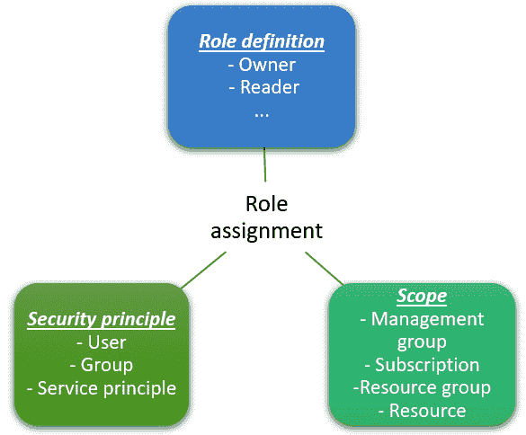

图 6.1 – 角色分配

原则可以是用户、一组用户或服务主体，例如应用程序或 Azure 资源。我们将在本章后面讨论应用程序标识和管理标识时，更深入地探讨服务主体。

有两种类型的角色：内置和自定义。内置角色由 Azure 创建，我们可以随时分配它们。如果它们不能满足您的需求，您可以组合不同的角色以获得您想要的结果，或者创建自己的自定义角色以用于服务。

让我们看看我们如何为 Azure 机器学习特别分配或创建 RBAC 角色。

## 使用内置角色

Azure 提供了超过 400 个内置角色，例如**虚拟机贡献者**、**存储账户贡献者**等。每个内置角色对应 Azure 中的特定范围、操作和服务。

有三个角色是必须了解并应用于所有 Azure 服务的，即**所有者**、**贡献者**和**读取者**角色。以下截图显示了它们的描述：

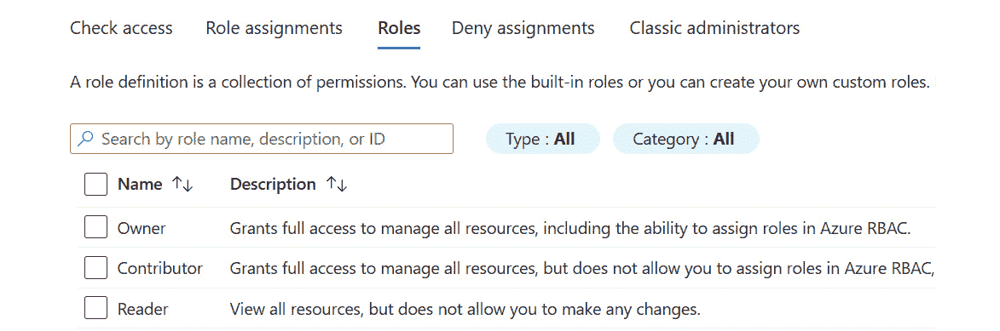

图 6.2 – Azure 资源的核心 RBAC 角色

然后，我们还有需要了解的 Azure 机器学习特定角色。以下是我们在与 Azure 机器学习一起工作时需要了解的最重要角色的描述：

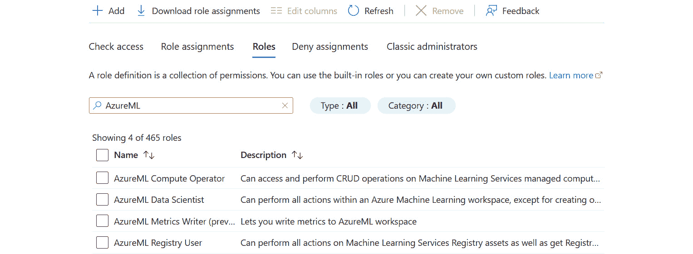

图 6.3 – Azure 机器学习的 RBAC 角色

如您所见，角色是围绕特定员工角色构建的，并包括围绕数据科学家或 ML 计算操作员的一定任务。当然，如果您在组织中有不同的结构，您可以给同一个人分配两个角色，让他们完成 Azure 中所有相关的任务。

让我们回顾一下如何处理角色分配。

### 添加角色分配

作为工作区所有者，我们可以随时使用 Azure 门户、命令行工具，甚至**Azure 资源管理器（ARM）**模板（如果我们有希望重复的复杂分配）为用户和工作区分配或移除角色。这个过程很简单。在左上角的每个资源页面上，我们可以看到有一个**访问控制（IAM）**菜单：

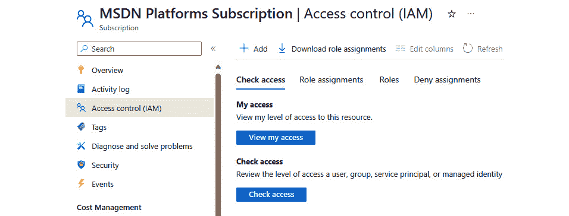

图 6.4 – Azure 访问控制（IAM）菜单

从这个页面上，您可以查看现有的角色分配和角色，并可以添加或移除对资源的访问权限。在这种情况下，我们打开了**订阅**页，这意味着我们更改的任何角色分配都将继承此订阅下的任何资源组及其资源。

要添加角色分配，请点击顶部的**添加**按钮。按照三个步骤向导添加您的角色分配：

1.  第一步是选择一个角色。在这个例子中，我将选择**读取者**：

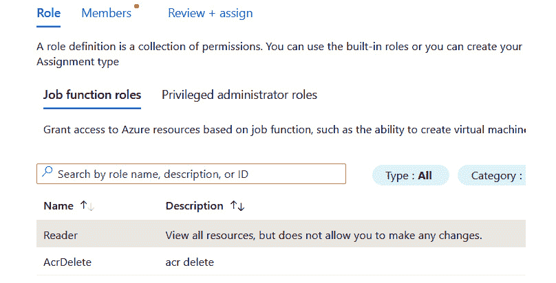

图 6.5 – 步骤 1：选择角色

1.  第二步是选择所选角色的成员。您可以通过点击**选择****成员**按钮添加多个成员：

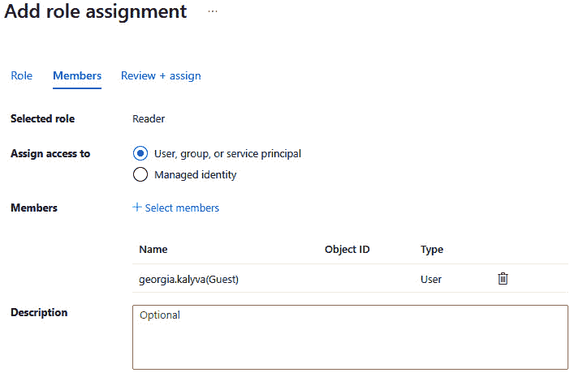

图 6.6 – 步骤 2：添加成员

1.  就这些了！最后一步是审查并完成分配。

    如果您想使用命令行工具，这里是一个 CLI 中的示例：

    ```py
    az role assignment create --role "Reader" --assignee "georg***@*****.com" --subscription "00000000-0000-0000-0000-000000000000"
    ```

角色分配文档

要查看使用 Azure 工具分配角色的更多选项，请点击您选择的工具的相应链接：

CLI: [`learn.microsoft.com/en-us/azure/role-based-access-control/role-assignments-cli`](https://learn.microsoft.com/en-us/azure/role-based-access-control/role-assignments-cli)

PowerShell: [`learn.microsoft.com/en-us/azure/role-based-access-control/role-assignments-powershell`](https://learn.microsoft.com/en-us/azure/role-based-access-control/role-assignments-powershell)

REST API: [`learn.microsoft.com/en-us/azure/role-based-access-control/role-assignments-rest`](https://learn.microsoft.com/en-us/azure/role-based-access-control/role-assignments-rest)

ARM 模板: [`learn.microsoft.com/en-us/azure/role-based-access-control/role-assignments-template`](https://learn.microsoft.com/en-us/azure/role-based-access-control/role-assignments-template)

添加角色分配只是故事的一部分。让我们看看如何审查现有的分配，并在必要时移除它们。

### 查看和移除角色分配

查看和移除角色分配的过程同样简单。第一步是访问您想要检查角色分配的资源，并打开**访问控制（IAM）**菜单。在那里，在**角色分配**选项卡上，您可以查看现有的角色分配，如下面的截图所示：

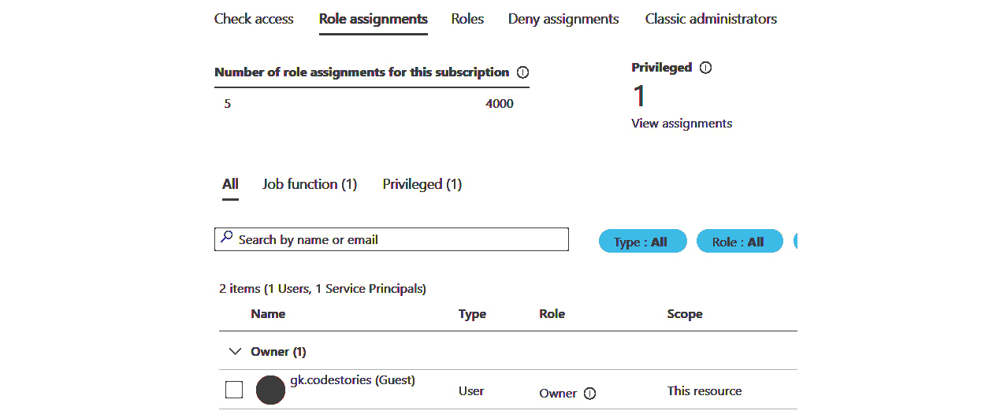

图 6.7 – 移除角色分配

通过点击用户列表中角色分配左侧的框，顶部将启用 **删除** 按钮。您可以点击 **删除** 并 **确认** 来删除分配。

与添加分配一样，您可以使用命令行工具。以下是一个使用 CLI 删除分配的示例：

```py
az role assignment delete --assignee "georg***@*****.com" \
--role "Reader" \
--subscription "00000000-0000-0000-0000-000000000000"
```

角色分配文档

要查看更多使用 Azure 工具删除角色分配的选项，请遵循此链接：[`learn.microsoft.com/en-us/azure/role-based-access-control/role-assignments-remove`](https://learn.microsoft.com/en-us/azure/role-based-access-control/role-assignments-remove)

内置角色并非唯一分配权限的方式。让我们来回顾一下自定义角色。

## 为 Azure 机器学习创建自定义角色

内置角色很棒，但有时它们并不提供我们正确限制用户权限所需的确切权限。在这种情况下，我们有创建自己的自定义角色的选项，这些角色具有我们完成任务所需的精确权限。角色本质上是一组权限。这组权限被描述为一个 JSON 文件。您可以在以下位置找到贡献者角色的 JSON 格式示例：[`learn.microsoft.com/en-us/azure/role-based-access-control/role-definitions-list`](https://learn.microsoft.com/en-us/azure/role-based-access-control/role-definitions-list).

自定义角色概述

如果您想了解更多关于 Azure 自定义角色属性的信息，请参阅此链接提供的信息：[`learn.microsoft.com/en-us/azure/role-based-access-control/custom-roles`](https://learn.microsoft.com/en-us/azure/role-based-access-control/custom-roles)

在本节中，我们不会深入探讨 RBAC，但我们将关注如何为 Azure 机器学习服务创建自定义角色。如果查看那个 JSON 文件看起来令人畏惧，您不必担心。我们可以使用 Azure 门户创建自己的自定义角色。像之前一样，我们进入我们想要分配新角色的资源选项卡，并找到 **添加** 按钮。点击添加按钮，然后遵循 **添加自定义** **角色** 菜单：

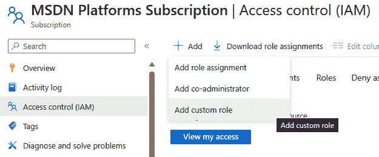

图 6.8 – 添加自定义角色

自定义角色向导将会弹出。第一步是为我们的角色创建一个名称。在这种情况下，我选择了名称 **AzureML 数据科学家扩展**，因为我的目标是克隆现有的角色并简单地添加更多权限。当然，您也可以从头开始或从保存的 JSON 文件开始。然后我们添加一个良好的描述，就可以继续进行，如下面的截图所示：

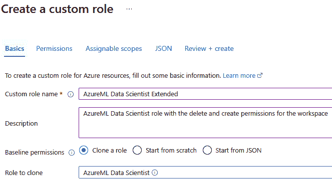

图 6.9 – 填写基本信息

在**权限**选项卡下，我看到这个角色在工拥有权限，但在**权限类型**列被分配为**NotAction**，因为我们可以看到在工区中禁止了*删除*和*写入*操作。角色的**操作**部分描述了角色可以做什么，然后**NotAction**描述了它不能做什么。所以，如果我从**NotAction**中移除那些权限，角色将能够创建和删除工作区，这正是我希望我的数据科学家能够做到的：

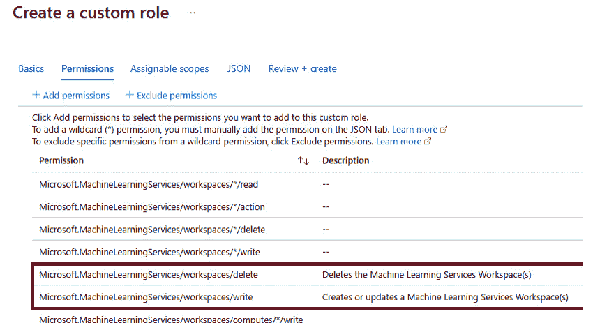

图 6.10 – 与权限一起工作

下面的屏幕截图显示了完整的权限列表：

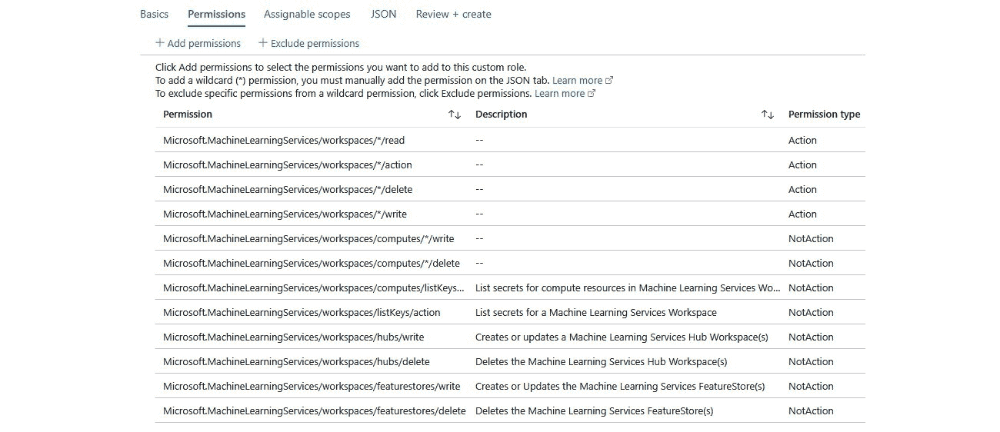

图 6.11 – 最终权限

在我们继续之前，你可能会有这样的疑问：如果我想要添加权限怎么办？我在哪里可以找到它们？在前面的屏幕截图中，我们可以看到**+ 添加权限**按钮。从这里，添加权限的过程非常直观。当你想要添加权限时，你不需要滚动浏览无尽的列表，也不需要每次都查阅文档。你可以简单地过滤到你想要的服务，并查看相关的权限。对于 Azure 机器学习，我们感兴趣的权限是**机器学习服务资源提供者**或**Microsoft 机器学习 Web 服务管理**，如下面的屏幕截图所示：

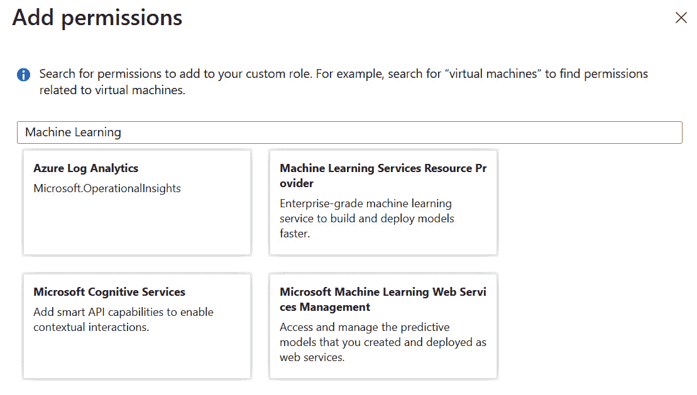

图 6.12 – 添加权限

通过点击相关类别，我们可以看到权限列表及其描述，正如我们可以在下一个屏幕截图中看到的那样：

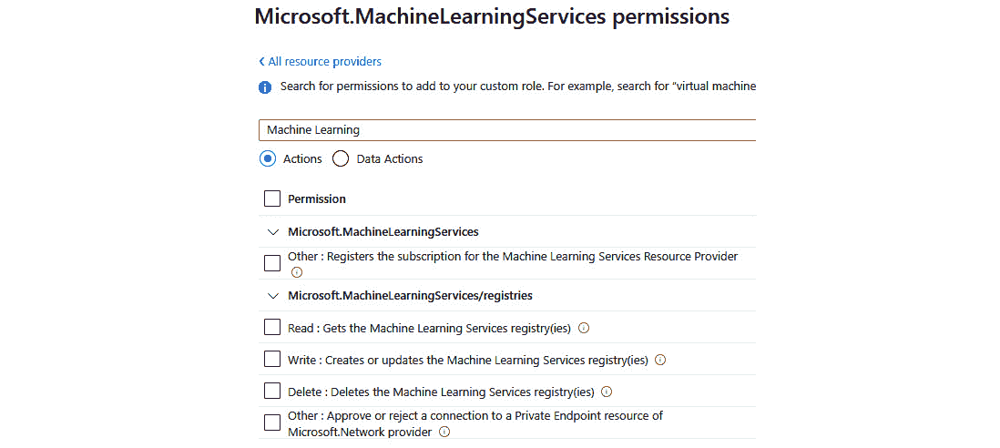

图 6.13 – 查看 Azure 机器学习权限

这使得创建自定义角色非常快捷。你只需确保你已经包含了所有需要的权限，然后你可以回到**权限**页面并查看列表。

下一步是设置可分配的范围。你可以更改**可分配范围**选项来设置此自定义角色的范围，在订阅级别、资源组级别或特定工作区级别：

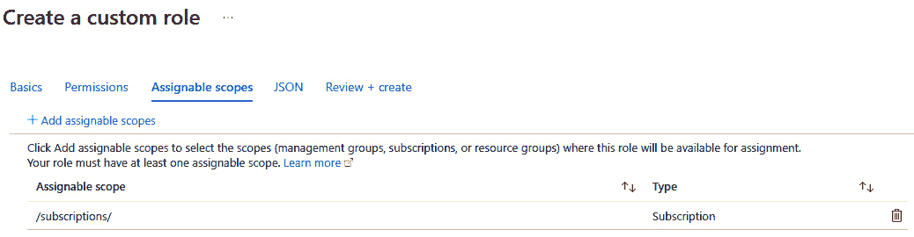

图 6.14 – 决定范围

然后，你可以查看并下载生成的 JSON 文件，或者继续到最后一步创建新的自定义角色：

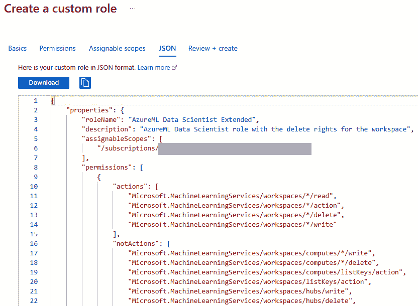

图 6.15 – 查看和创建/下载

在你创建了自定义角色之后，你可以像内置角色一样分配它。你将在**访问控制（IAM）**菜单的**角色**列表中找到它，类型为**CustomRole**：

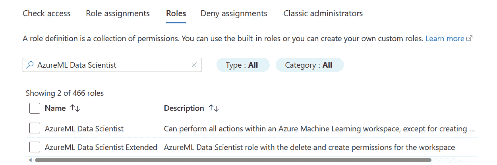

图 6.16 – 查找你的自定义角色

Azure RBAC

在此处了解有关 Azure RBAC 的更多信息：[`learn.microsoft.com/en-us/azure/role-based-access-control/overview`](https://learn.microsoft.com/en-us/azure/role-based-access-control/overview)

Azure RBAC 是保护 Azure 资源并确保只有授权用户和应用程序可以访问的关键组件。它在维护安全、合规且管理良好的 Azure 环境中发挥着至关重要的作用。结合 Azure Policy、Azure 管理组和 Azure Blueprints，我们拥有了构建完整治理框架所需的所有组件。

RBAC – 最佳实践

在分配角色时，以下是一些应遵循的 RBAC 最佳实践：

+   只授予用户所需的精确访问权限

+   限制订阅所有者的数量

+   使用 Microsoft Entra ID PIM

+   将角色分配给组而不是单个用户，以便权限可以继承

+   使用唯一的角色 ID 而不是角色名称来分配角色，以防角色被重命名

+   在使用自定义角色时避免使用通配符

RBAC 不仅关乎用户。Microsoft Entra ID 也用于验证用户和应用程序。让我们看看在下一节中我们如何与这些标识一起工作。

# 使用应用程序标识进行验证

应用程序标识是 Microsoft Entra ID IAM 的一个基本概念。它们代表应用程序或服务与 Azure 资源交互时的安全上下文。通常，底层对象是服务主体。服务主体类似于用户标识，但由应用程序、服务或脚本用于安全地验证和访问 Azure 资源。创建服务主体的过程取决于我们想要用于验证的内容，通常，我们可以识别两种类型——应用程序标识和 Azure 服务使用的托管标识。

当涉及到应用程序或托管标识的验证和授权时，过程是相同的。如果它在 Microsoft Entra ID 中存在，它可以被分配 RBAC，就像系统中的任何用户一样。服务主体有生命周期，就像用户标识一样。它们可以被创建、更新和删除。对于独立的 Azure AD 应用程序，服务主体可以使用客户端密钥/密码或证书进行身份验证。客户端密钥应安全存储，而证书提供额外的安全层。Microsoft Entra ID 应用程序可以配置为单租户（仅在单个 Microsoft Entra ID 租户中可访问）或多租户（由多个 Microsoft Entra ID 租户的用户和应用程序访问）。多租户应用程序通常需要额外的配置来处理标识联合。

让我们回顾一下我们如何创建和使用服务主体。

## 创建服务主体

为了在处理训练和测试模型的程序或脚本时进行身份验证，例如，您可以使用服务主体身份验证。为了实现这一点，我们需要在 Microsoft Entra ID 工作空间中创建一个服务主体。如果您正在创建服务主体，您需要创建一个应用程序注册。

让我们看看实现这一目标的两种方法。

### 使用 CLI

根据您运行命令的位置，您可能需要验证您的 Azure 订阅。通过 Cloud Shell 运行命令，这样就不需要了。创建服务主体的命令如下所示：

```py
az ad sp create-for-rbac --sdk-auth --name azuremldatascientist --role Contributor --scopes /subscriptions/<subscription id>
```

结果将包括几个值，我们必须保护它们，因为它们作为凭证使用，但我们必须确保保存它们，以便我们可以在代码中使用它们来检索身份验证令牌。这些是 `clientId`、`clientSecret` 和 `tenantId`：

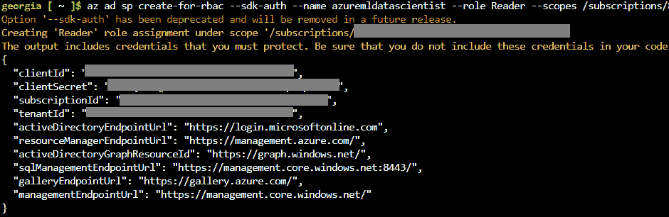

图 6.17 – 服务主体创建结果

您可以使用门户或以下命令获取有关服务主体的更多信息：

```py
az ad sp show --id <clientId from previous result>
```

现在我们已经创建了一个服务主体，我们可以在代码中使用它，并在必要时分配更多角色。

### 注册应用程序

CLI 不是创建服务主体的唯一方式。另一种方法是使用门户。打开 Microsoft Entra ID 工作空间，找到 **应用注册** 菜单。在下面的屏幕截图中，您可以查看现有服务主体的列表，包括我们在上一节中使用 CLI 创建的服务主体。您也可以从这里使用门户找到必要的 ID 和信息：

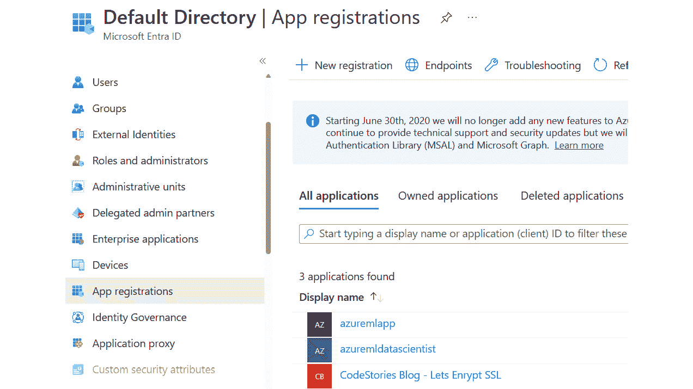

图 6.18 – 应用程序注册

要继续操作，请点击 **新注册** 按钮。填写详细信息，为应用程序命名，并指明哪些类型的账户可以使用它。在这个例子中，我们将保持默认设置并点击 **注册**，如下一个屏幕截图所示：

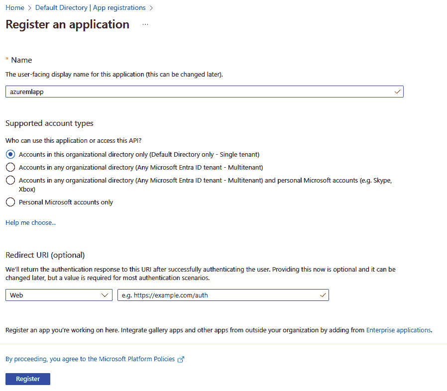

图 6.19 – 创建新的注册

您的注册已完成。一旦我们点击 **注册**，应用程序注册页面就会打开，我们可以配置多个选项，如下面的屏幕截图所示：

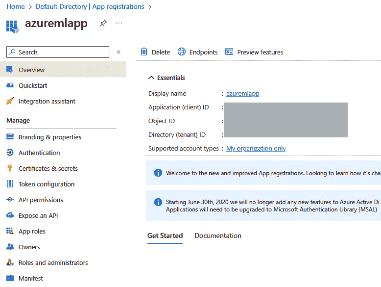

图 6.20 – 创建新的注册

通过打开应用程序注册，您可以配置客户端证书和密钥、角色和权限等选项。

但关于服务呢？工作空间是如何验证想要连接到工作空间的 **虚拟机 (VM**) 的？这就是托管标识发挥作用的地方。让我们看看托管标识是如何工作的，以及我们如何可以使用到目前为止所看到的一切在我们的代码中进行身份验证。

## 使用托管标识

Azure 中的管理身份是一种在 Azure 生态系统中安全地验证和授权应用程序和服务的方法。它们是 Azure IAM 功能的基本组成部分，并在与其他 Azure 服务和资源交互时用于授权自身。这消除了在代码或配置文件中存储敏感凭据或机密的需求，使应用程序更加安全。管理身份可以与广泛的 Azure 服务一起使用，包括 Azure 虚拟机、Azure 存储帐户、Azure Key Vault、Azure 机器学习等。它们可以在 Azure RBAC 中分配特定的角色和权限。这意味着您可以在 Azure 环境中控制身份可以访问哪些操作和资源。我们可以通过利用可用的 Azure 机器学习库和 SDK，轻松地在我们的应用程序或脚本中使用管理身份，正如我们将在下一节中看到的那样。

支持管理身份的每个 Azure 资源都有一种特定的启用和使用方式。有两种类型的管理身份。让我们回顾一下这两种身份之间的区别。

### 启用系统分配的管理身份

此类身份由 Azure 为特定的 Azure 资源（如 VM 或 Azure 函数）创建和管理。它与所关联资源的生命周期紧密绑定，这意味着当资源被删除时，管理身份也会随之删除，并且不能与多个资源关联。要使用系统分配的管理身份，您只需在资源上启用它们即可。

要启用系统分配的管理身份，我们只需找到**身份**菜单，如图下所示，在我们的选择资源选项卡中，将**状态**切换到**开启**，然后点击**保存**。在此示例中，我选择了一个 VM，但它支持多个 Azure 资源：

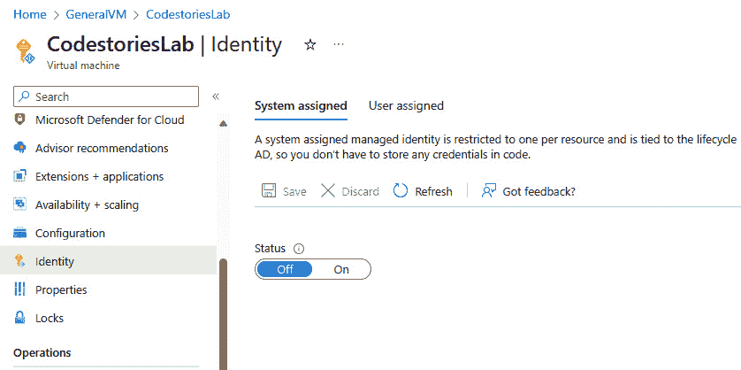

图 6.21 – 打开身份菜单

一旦我们启用了系统分配的管理身份，我们就可以使用 RBAC 分配角色或通过将**状态**切换到**关闭**来禁用它。您可以在下一张截图中看到已启用的系统分配的管理身份：

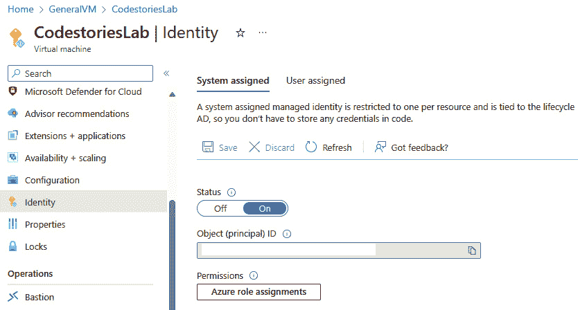

图 6.22 – 系统分配的管理身份已启用

### 创建用户分配的管理身份

此类身份作为独立的 Azure 资源创建和管理。然后，您可以将其与一个或多个 Azure 资源关联，允许多个资源使用相同的身份。当需要例如管理身份的生命周期独立于资源生命周期，或者多个资源需要共享相同的权限时，这非常有用。

创建管理身份是一个两步过程。首先，我们需要创建一个管理身份。

要这样做，请从顶部的搜索框中打开 **托管标识** 菜单，然后点击 **创建**。填写一些基本信息，如下面的截图所示：

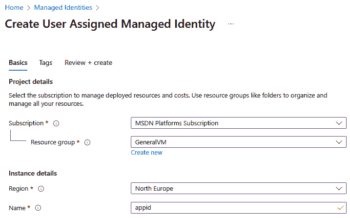

图 6.23 – 创建用户分配的托管标识

一旦创建标识，我们就可以将其与许多资源关联起来。正如之前一样，我们将在资源选项卡中找到 **标识** 菜单，但这次我们将切换到 **用户分配** 选项卡。然后，我们可以点击 **添加** 按钮，筛选我们的标识，一旦找到之前创建的标识，我们就可以将其与资源关联起来。您可以在以下截图中查看这些步骤：

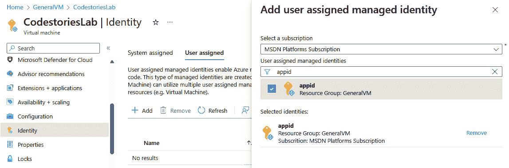

图 6.24 – 关联用户分配的托管标识

托管标识也可以使用其他 Azure 工具（如 CLI、PowerShell 或 REST API）创建或启用。然后，它们可以从脚本或其他我们想要连接的 Azure 服务中使用。我们可以在任何时候启用、禁用或从资源中取消关联它们。

总结来说，Microsoft Entra ID 托管标识是一种通过消除存储凭证的需要，并提供与 Azure 服务的无缝集成来提高 Azure 资源身份验证和授权安全性和管理性的方法。它们帮助开发人员和管理员确保其 Azure 工作负载的安全性和合规性。

这里是如何使用不同可用的标识来设置身份验证的。

### 设置身份验证

我们可以通过使用来自 Azure Identity 包的 `DefaultAzureCredential` 类来简化身份验证过程。这个类会根据其运行的环境自动选择合适的身份验证方法（如托管标识、服务主体或交互式登录）。以下是我们在托管标识和服务主体场景中使用它的方法。

当与服务主体连接时，我们需要提供三个环境变量并在身份验证时使用这些值。

这里是变量——它们都可以在我们创建服务主体时返回的对象中找到：

+   `AZURE_CLIENT_ID`: 客户端 ID

+   `AZURE_TENANT_ID`: Microsoft Entra ID 租户 ID

+   `AZURE_CLIENT_SECRET`: 凭证密钥

要设置这些变量，您可以使用 `python-dotenv` 包。

标识库

要了解更多关于库的信息，请参阅此处：

[`learn.microsoft.com/en-us/python/api/overview/azure/identity-readme?view=azure-python`](https://learn.microsoft.com/en-us/python/api/overview/azure/identity-readme?view=azure-python)

[`pypi.org/project/python-dotenv/`](https://pypi.org/project/python-dotenv/)

如果我们使用托管标识，类将自动检测凭证，并且不需要环境变量。以下是两个示例代码：

```py
from azure.identity import DefaultAzureCredential
identity= DefaultAzureCredential() identity.get_token("https://management.azure.com/.default")
```

在这段代码之后，你可以编写你想要的代码来与 Azure 机器学习一起工作并训练你的模型。

与应用程序标识符一起工作可以帮助我们极大地确保我们在角色之间的一致性，并保护我们的机器学习资产。现在我们已经审查了我们的身份验证和角色管理选项，让我们来审查一些其他服务，这些服务可以补充此功能并帮助我们进一步保护我们的工作负载。

# 增强访问安全性

现在我们对如何利用 Microsoft Entra ID 进行身份验证和角色管理有了更好的了解，我们可以看看一些其他我们可以用来补充并进一步保护我们用户身份的服务。

## 条件访问

Microsoft Entra ID 中的**条件访问**是一个强大的功能，允许组织为授予或拒绝对其基于云的资源访问设置特定的条件和策略。使用**条件访问**，您可以在允许或阻止访问之前考虑一系列因素，从而增强安全和合规性。

**条件访问**策略是您定义的规则，用于控制对受保护资源的访问。这些策略基于条件，可以根据特定用户、组、应用程序、IP 位置信息、用户或签名风险检测以及设备进行定制。基于这些信号的行动是**阻止/允许**。您可以根据适用于您组织和使用者的不同场景组合多个条件。

以下是一些常用策略的示例：

+   要求为具有高度特权角色的用户或来自未知位置的用户的**多因素身份验证**（**MFA**）启用

+   阻止系统标记为高风险的用户

+   允许或阻止来自特定 IP 或国家的访问

+   要求更改密码以允许访问

这是**概览**选项卡的**条件访问**，在这里你可以管理策略、位置、网络和其他功能：

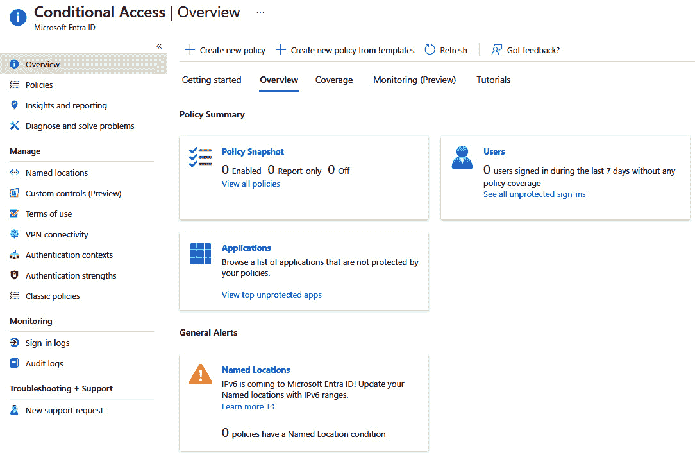

图 6.25 – 条件访问概览选项卡

Microsoft Entra ID 中的**条件访问**是一个动态且灵活的工具，帮助组织在安全性和用户生产力之间取得平衡。通过设置考虑不同因素的政策，我们可以实施适应不断变化的网络安全格局和您组织需求的访问控制。 

这不是我们用来增强安全的唯一工具。让我们看看我们如何将 PIM 与 RBAC 一起使用。

## PIM

Microsoft Entra ID PIM 是一种 Azure 服务，它帮助组织管理、控制和监控其 Azure AD 和其他 Microsoft 在线服务中的访问。它专注于具有访问关键资源和数据的特权的账户。PIM 提供功能和能力，以帮助组织保护这些特权账户并减轻安全风险。

PIM 可以与 RBAC 结合使用，以增强对特权账户和 Azure 资源访问的安全性和管理。当两者结合使用时，PIM 和 RBAC 提供了一种全面的方法来管理 Azure 资源的访问，特别是那些需要提升权限的资源。我们可以为分配到特定 RBAC 角色的用户启用**即时**（**JIT**）和时间限制的访问。例如，如果用户需要资源组的**贡献者**访问权限，Azure PIM 允许他们在必要时且在定义的时间内激活此角色。当用户需要激活 RBAC 角色时，他们通过 Azure PIM 界面发起请求，并提供有效的理由。此请求经过审批流程，确保激活由适当的管理员或角色所有者授权。用户指定持续时间，当指定的时间周期到期时，访问会自动撤销，从而降低了长期提升访问权限的风险。

Azure PIM 记录所有 RBAC 角色的激活和停用操作，为合规性和安全目的提供审计跟踪。组织可以定期审查和认证对特权访问的持续需求，通过访问审查来确保这一点。此过程有助于确保被分配 RBAC 角色的用户仍然需要它们，并且访问与业务需求保持一致。

通过结合 Azure PIM 和 RBAC，组织可以加强其 Azure 资源的 IAM 策略。这种方法最小化了与持久、过度授权账户相关的风险，并帮助组织在管理对关键 Azure 服务和数据的访问时保持控制、可见性和合规性。

## Azure 密钥保管库

Azure 密钥保管库是 Microsoft Azure 提供的一种云服务，帮助您安全地管理应用程序和服务使用的密钥、密钥和敏感信息。它旨在提供一个集中和安全的存储和管理加密密钥和其他密钥的位置，使其更容易遵守安全最佳实践和合规性要求。以下是关于其功能的一些信息：

+   **密钥管理**：Azure 密钥保管库允许我们生成、导入和管理用于加密、解密和身份验证的加密密钥。它支持各种密钥类型，包括**Rivest–Shamir–Adleman**（**RSA**）、**高级加密标准**（**AES**）和椭圆曲线密钥。

+   **密钥管理**：我们可以使用 Azure 密钥保管库来存储和管理密钥，例如连接字符串、API 密钥和密码。这些密钥被安全地存储，并且可以通过您的应用程序以编程方式访问。

+   **证书管理**：密钥保管库能够管理 X.509 证书并自动化诸如证书续订等任务。它还支持与 Azure 服务（如 Azure 应用程序网关和**Azure Kubernetes 服务**（**AKS**））的集成，以进行 SSL/TLS 证书管理。

要检索密钥或机密，我们不是硬编码机密，而是对 Key Vault 进行身份验证以检索它们。这增加了另一层安全性，我们可以在任何时间轻松撤销访问权限，并拥有额外的安全选项，如密钥版本控制、日志记录、备份、清除保护等。

最佳实践

将 Azure Key Vault 服务与托管标识结合使用以实现最大安全性。

对于 Azure 机器学习，我们可以将 Azure Key Vault 服务与托管标识结合使用，以在我们的脚本中检索机密。我们所需的一切就是 Python 的 Azure Key Vault Secrets 客户端库。

在我们开始之前，我们需要确保我们拥有以下先决条件以及我们的工作区：

+   我们想要检索机密值的 Azure Key Vault 资源

+   一个启用了托管标识并分配了适当的 RBAC 角色或访问策略的 Azure Key Vault 计算集群

+   在我们的 Azure 机器学习环境中安装了`azure-keyvault-secrets`和`azure-identity`包

如果您已经完成了所有先决条件，您可以使用以下代码示例来检索机密。只需确保将密钥保管库名称替换为您自己的，并将机密名称替换为您自己的：

```py
from azure.identity import DefaultAzureCredential
from azure.keyvault.secrets import SecretClient
identity= DefaultAzureCredential()
kv_client = SecretClient(vault_url="https://<key vault name>.vault.azure.net/", credential= identity)
secret = kv_client.get_secret("secret-name")
print(secret.value)
```

**条件访问**和 PIM 都是 Microsoft Entra ID 功能，当启用时，为我们的身份提供额外的安全保护，并确保我们的用户凭证安全且符合 PoLP。Azure Key Vault 是构建 Azure 云环境中安全且合规应用程序的关键组件，尤其是在与托管标识结合使用时。这些功能可能是可选的，但在努力保护我们的 ML 项目时需要考虑。

# 摘要

在本章中，我们关注了身份和遵守 PoLP 的所有方面。虽然理论上很简单，但 PoLP 是一个迭代和持续的过程，我们需要对其进行监控，以防止过度授权的应用程序。由于 Microsoft Entra ID 是 Azure 和扩展到 Azure 机器学习的身份管理工具，因此实施其核心功能，如 RBAC 和学会与应用程序标识一起工作，将帮助我们确保用户和应用程序的凭证不会轻易受到损害。此外，实施如**条件访问**和 PIM 等特性可以为我们的身份提供额外的安全层。但这些凭证并非唯一重要的。在我们的脚本中，我们可能会使用不同的连接字符串或机密。在可能的情况下，我们可以使用 Key Vault 服务与托管标识一起使用，以集中管理它们并确保我们的机密安全。

在下一章中，我们将探讨与我们的工作区安全和底层基础设施相关的一切。我们将学习如何保护我们的计算和端点，并利用任何现有的 Azure 基础设施，如网络，以增加安全性。
