# 管理和保护您的 Azure Machine Learning 工作空间

在数据和访问管理之后是基础设施。尽管 Azure Machine Learning 是一种云服务，但这并不意味着我们不能利用 Azure 或本地基础设施的服务来隔离我们的资源并保护它们免受公共访问。

在本章中，我们将学习如何实施有关工作空间的安全最佳实践。我们将更多地关注虚拟网络、端点安全和计算方面的实践和场景。Azure Machine Learning 中的计算既可以用于模型训练和部署，每个选项都有其自己的安全最佳实践。计算包括计算实例、计算集群和容器。工作空间使用 Azure 容器注册表来部署可以作为容器部署的模型，因此我们将回顾所有这些服务的安全选项。

在本章中，我们将涵盖以下主要主题：

+   探索网络安全

+   使用 Azure Machine Learning 计算资源

+   管理容器注册表和容器

在本章结束时，我们将了解如何通过在 Azure 中使用虚拟网络来实现最佳实践，并隔离我们的 Azure Machine Learning 工作空间及其相关资源。

# 技术要求

本章大量涉及 Azure 中的网络和基础设施。尽管教程可以相对容易地实现，但在 Azure 中正确实施和维护网络架构需要大量的知识。

如果你没有在 Azure 中使用网络的经验，我建议在继续本章之前先查看以下服务的概述：

+   **虚拟网络概述**：

    [`learn.microsoft.com/en-us/azure/virtual-network/virtual-networks-overview`](https://learn.microsoft.com/en-us/azure/virtual-network/virtual-networks-overview)

+   **网络架构设计**：

    [`learn.microsoft.com/en-us/azure/architecture/guide/networking/networking-start-here`](https://learn.microsoft.com/en-us/azure/architecture/guide/networking/networking-start-here)

# 探索网络安全

Azure Machine Learning 工作空间是主要的使用点。这是你完成所有机器学习任务的地方，默认情况下，所有端点和工作空间都可以访问公共互联网。然而，如果我们已经使用 Azure 基础设施服务用于不同的目的或想要限制对我们资源的访问，我们可以利用 **虚拟网络**（**VNet**）。在 Azure 中使用 VNet 为我们的 Azure Machine Learning 资源提供了额外的安全层和隔离，以及更好的入站和出站网络通信控制。在本节中，我们将探讨我们将如何将 VNet 集成到 Azure Machine Learning 中的几个选项。

让我们从工作空间开始。

## 创建 VNet

我们首先需要的是一个 VNet。如果你已经有了，你可以使用它。如果没有，你可以按照以下步骤创建一个：

1.  在 Azure 搜索栏中搜索**虚拟网络**并点击以创建一个新的。创建表单将弹出。选择**订阅**和**资源组**，并提供**虚拟网络名称**和**区域**，如以下截图所示。选择与你的工作空间相同的区域：

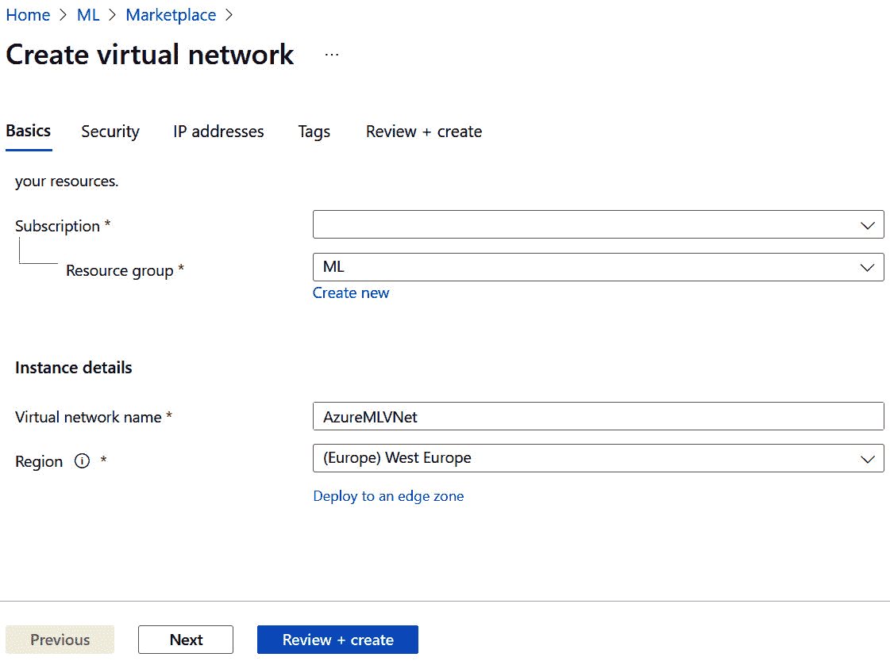

图 7.1 – 填写基本详情

1.  点击**下一步**，保留默认值，直到你到达**IP 地址**选项卡。确保地址空间足够，并且至少有一个子网可用。以下是一个示例截图：

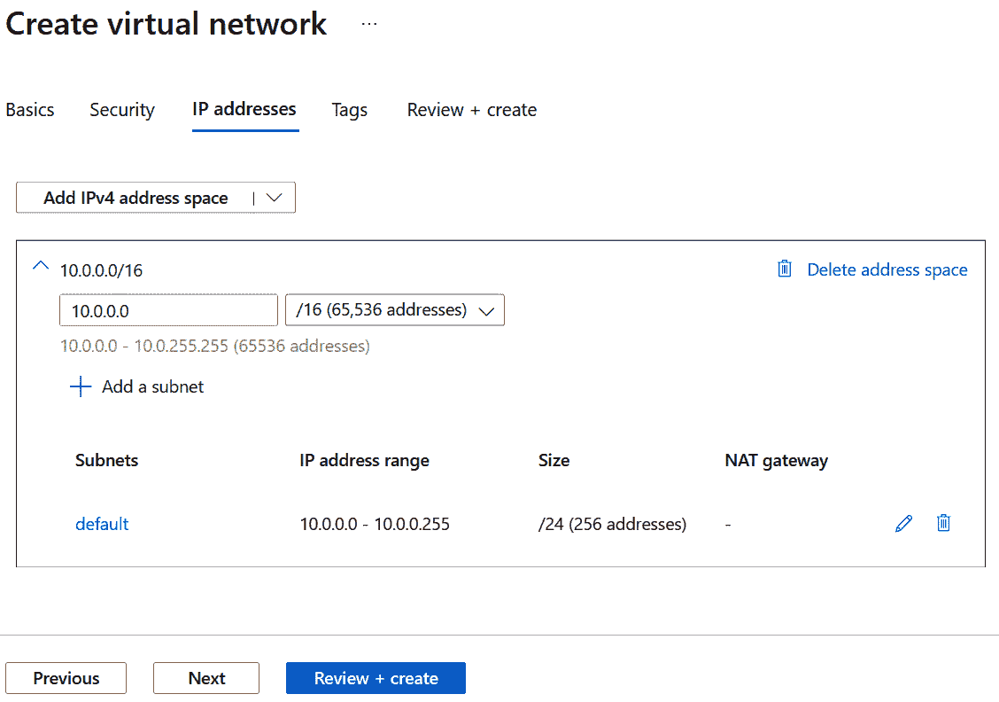

图 7.2 – 添加地址空间

VNet 最佳实践

确保地址空间和子网不要与你的订阅或其他本地系统中的其他网络重叠。如果你需要更多关于创建 VNet 架构的指导，请参阅更多信息[`learn.microsoft.com/en-us/azure/virtual-network/concepts-and-best-practices`](https://learn.microsoft.com/en-us/azure/virtual-network/concepts-and-best-practices)。

1.  点击**审查 + 创建**以创建 VNet。在继续进行其他任何操作之前，请等待过程完成。

现在我们已经准备好开始使用 VNet 限制对工作空间的访问。

## 保护工作空间

通过 Azure 门户配置限制工作空间的公共访问非常简单，可以限制所有入站和/或出站连接。当我们谈论入站流量时，我们指的是从公共互联网进入 Azure ML 工作空间或相关资源的连接。这可以是来自本地位置、其他云资源或外部应用程序和平台的数据被摄取到 Azure ML 工作空间中。当你从你的本地机器向 Azure Machine Learning 提交数据集、作业或其他请求时，这被认为是入站流量。出站流量是指离开工作空间或相关资源到其他地方的任何连接。这可以是机器学习模型的结果、处理后的数据、日志等被发送回你的本地机器、另一个云资源或外部应用程序或平台。

挑战在于确保所有与工作空间关联的服务也能通过那个虚拟网络而不是公共互联网进行访问和正确配置。在设计实施此解决方案时，我们还需要考虑的是，工作空间需要通过公共互联网访问特定的端点。如果我们想限制出站访问，我们需要确保这些端点保持其公共访问。

让我们看看我们如何配置这两个选项。

### 限制入站流量

要限制来自公共互联网的入站流量，我们需要使用 VNet，我们已经在上一节中学习了如何配置它。以下是禁用公共访问和使用工作空间中的 VNet 的过程。

首先，从 Azure 门户打开 Azure 机器学习资源，找到**网络**部分。在第一个选项卡，称为**公共访问**，将访问设置为**禁用**，然后点击**保存**，如图所示的下个截图：

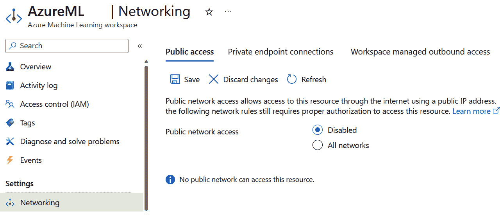

图 7.3 – 禁用公共访问

现在我们需要创建一个私有端点连接。Azure 私有链接是 Microsoft Azure 云平台中的一个服务，它允许你通过虚拟网络中的私有端点安全地访问 Azure 服务，从而避免将数据暴露给公共互联网。使用 Azure 私有链接，Azure 服务可以通过虚拟网络中的私有 IP 地址进行访问。这提供了几个好处。如果你的虚拟网络通过**虚拟专用网络**（VPN）或 ExpressRoute 连接到本地工作环境，资源可以使用 Azure 私有链接通过这些私有连接访问 Azure 服务。使用全局 VNet 对等连接，我们可以从任何区域连接到 Azure 服务。Azure 私有链接与 Azure 私有 DNS 区域集成，这意味着服务的私有端点可以注册到私有 DNS 区域，从而使名称解析更加简单。

在 Azure 门户中设置私有端点是一个简单的过程。一旦设置完成，服务提供者和服务消费者之间的所有网络流量都可以通过私有端点进行路由。因此，现在我们已经禁用了公共访问，我们需要创建一个私有链接来通过虚拟网络重新建立这次访问。

虚拟网络对等连接

要了解更多关于 Vnet 对等连接的信息，请访问以下网址：

[`learn.microsoft.com/en-us/azure/virtual-network/virtual-network-peering-overview`](https://learn.microsoft.com/en-us/azure/virtual-network/virtual-network-peering-overview)

这里是创建私有链接/端点的过程。转到下一个选项卡，**私有端点连接**，然后点击**私有端点**来创建一个：

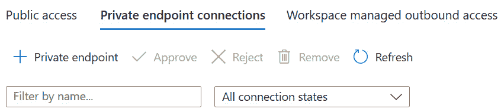

图 7.4 – 创建私有端点

在表单中填写一些基本详情，包括**订阅**、**资源组**、**网络接口名称**和**区域**，然后点击**下一步**，如图所示：

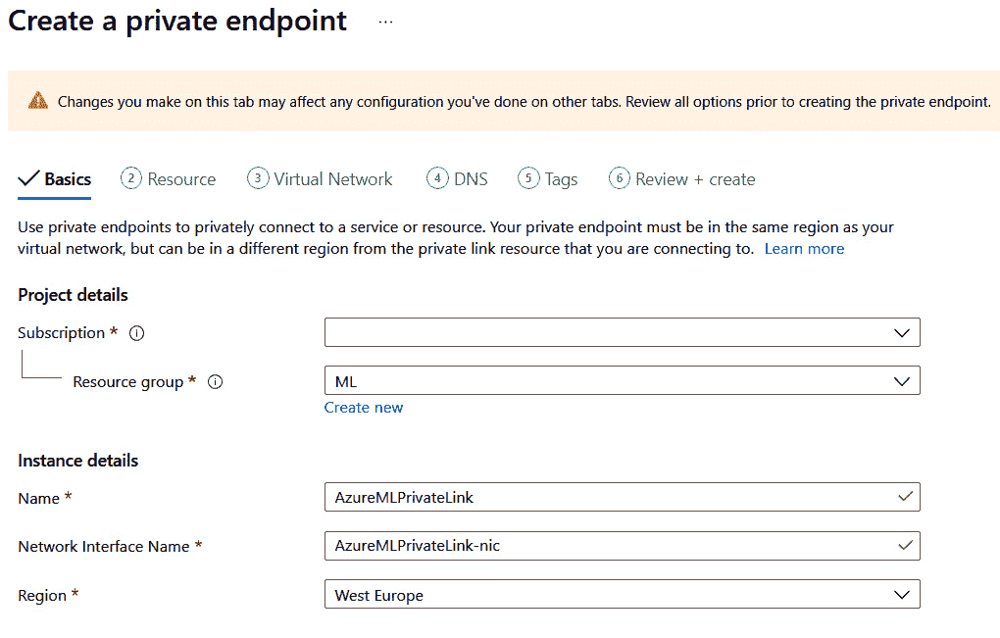

图 7.5 – 填写基本详情

在**资源**选项卡中，从下拉菜单中选择**amlworkspace**，然后点击**下一步**：

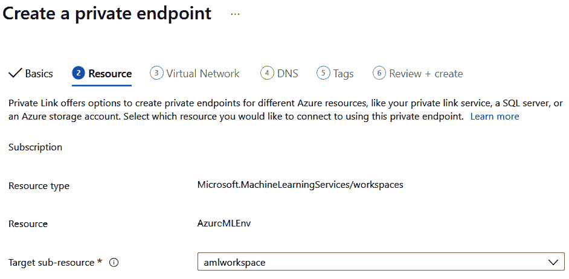

图 7.6 – 选择资源

在这里，我们将选择所需的虚拟网络。你必须选择一个现有的虚拟网络，所以请使用我们之前创建的那个。如果你的虚拟网络有多个子网，请确保选择正确的子网。其余选项保留为**默认**。

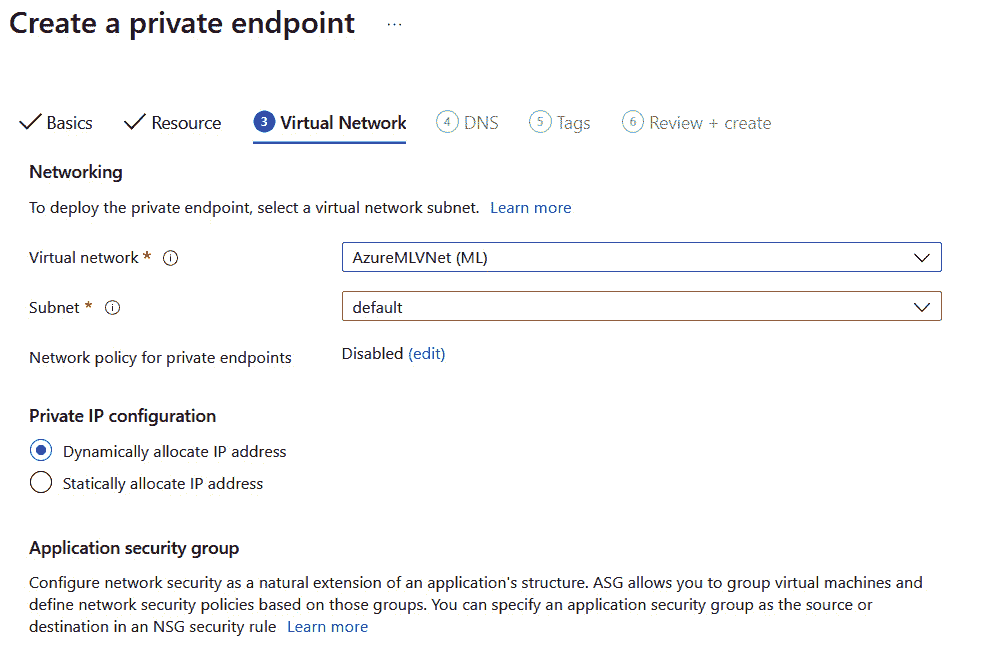

图 7.7 – 选择虚拟网络

与 DNS 区域集成是可选的但方便的，因为它使名称解析更容易。将**与私有 DNS 区域集成**选项设置为**是**，然后选择**订阅**和**资源组**。服务将填写其余字段。

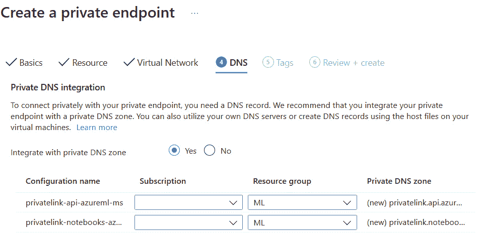

图 7.8 – 添加 DNS 集成

DNS 区域概述

要了解更多关于 DNS 区域的信息，请在此处查看概述：

[`learn.microsoft.com/en-us/azure/dns/dns-zones-records`](https://learn.microsoft.com/en-us/azure/dns/dns-zones-records)

现在转到**审查 + 创建**并开始部署资源。在继续进行任何其他步骤之前，等待此过程完成。

通过 CLI 创建私有链接

关于创建私有链接，您可以在此处了解更多信息：

[`learn.microsoft.com/en-us/azure/machine-learning/how-to-configure-private-link?view=azureml-api-2&tabs=cli`](https://learn.microsoft.com/en-us/azure/machine-learning/how-to-configure-private-link?view=azureml-api-2&tabs=cli)

如果您此时尝试访问工作区，您将收到以下错误，因为公共访问已被禁用。

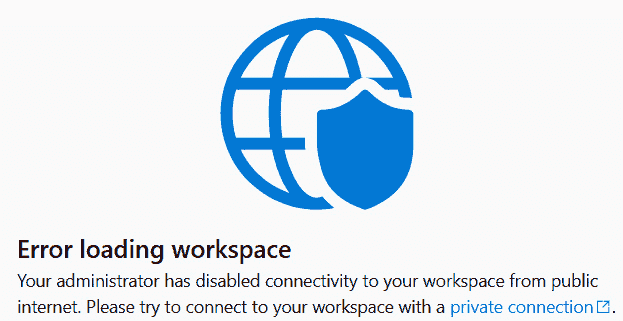

图 7.9 – 工作区公共访问已禁用

这是工作区入站访问的基本配置。在我们通过 VNet 验证访问之前，我们首先应该配置出站流量并限制对相关服务的访问。

让我们从出站流量开始。

### 限制出站流量

要限制出站流量，我们将再次在 Azure Machine Learning 中的**网络**选项卡中操作，但这次我们将点击**工作区管理出站****访问**选项卡：

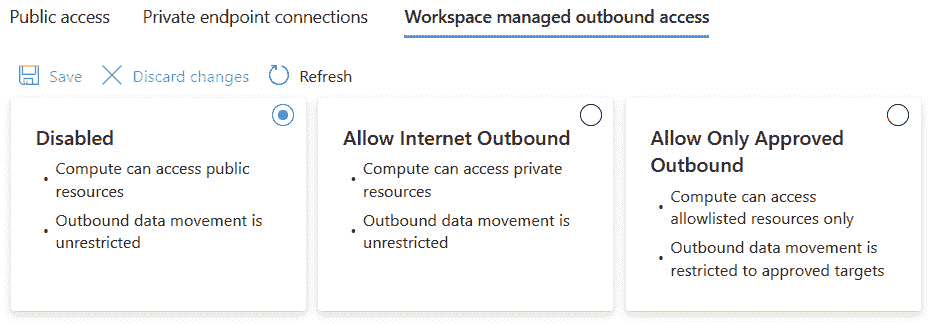

图 7.10 – 限制出站流量

要限制出站流量，我们有两种选择：**允许互联网出站**，其中只有计算受到限制，以及**仅允许批准的出站**，其中计算和所有出站数据移动都受到限制。

这两个选项都有一些连接例外，您可以在屏幕底部的选项启用时看到。您可以添加一些自己的规则，但默认规则不能被禁用。

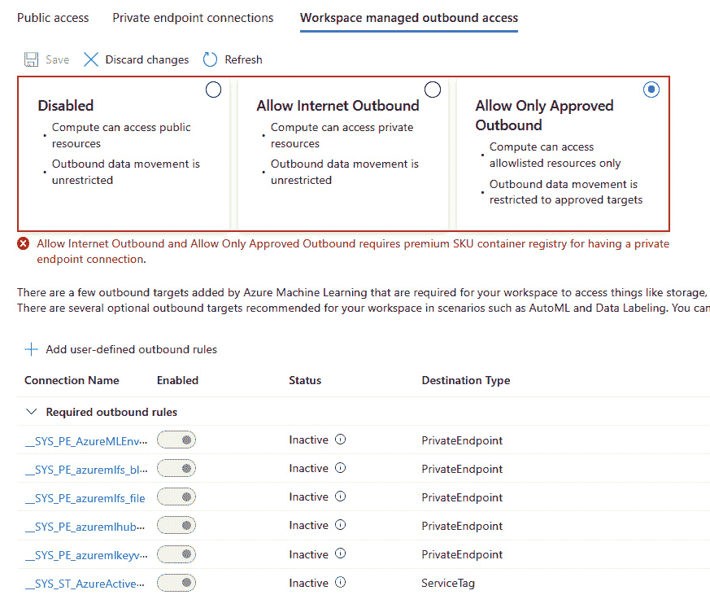

图 7.11 – 仅允许批准的出站选项

如果您同时使用防火墙和网络，请确保通过那里也启用了连接，因为限制对这些资源的访问将在工作区中导致连接问题，并且无法与这些服务一起工作。

保护工作区只是第一步。现在我们需要确保通过 VNet 也保护了相关资源。

## 保护相关资源

如*第一章*中所述，工作区与许多资源紧密合作，包括存储账户和密钥保管库，这些资源是为了支持工作区而创建的。如果我们真正想要确保它们通过 Microsoft 网络正确连接到工作区，同时仍然保持与公共互联网的隔离，我们需要配置相同的网络设置。首先，我们需要禁用这些服务的公共访问。

要禁用公共访问并限制账户访问特定网络，我们可以转到**存储** **账户**选项卡中的**网络**选项卡。

在**公共网络访问**选项中，点击**从所选虚拟网络和 ID 地址启用**。然后，在**虚拟网络**部分选择之前创建的 VNet，通过点击**添加现有虚拟网络**按钮，然后点击**保存**。

最终视图应如下所示截图：

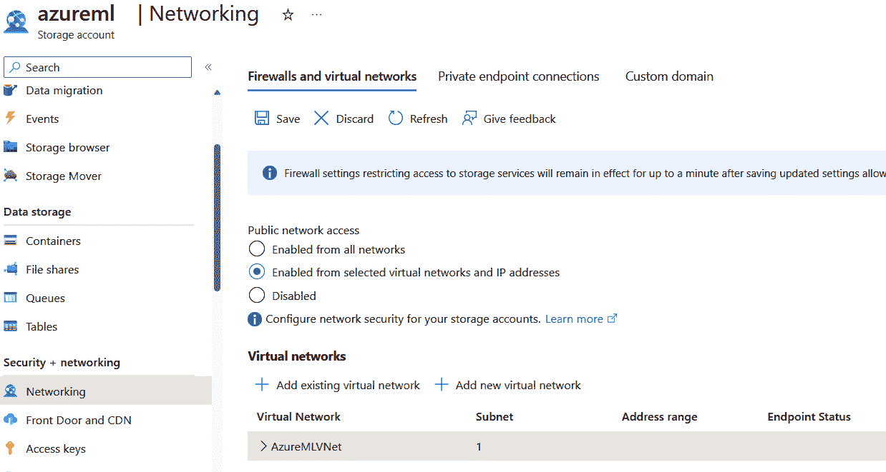

图 7.12 – 在存储账户中禁用公共访问

下一步是执行与工作区关联的密钥保管库的类似操作。步骤与之前完全相同。

要禁用公共访问并限制账户访问特定网络，我们可以转到**存储账户**选项卡中的**网络**选项卡。对于**公共网络访问**选项，点击**从所选虚拟网络和 ID 地址启用**。然后，在**虚拟网络**部分选择之前创建的 VNet，通过点击**添加现有虚拟网络**按钮，然后点击**保存**。

最终视图应如下所示：

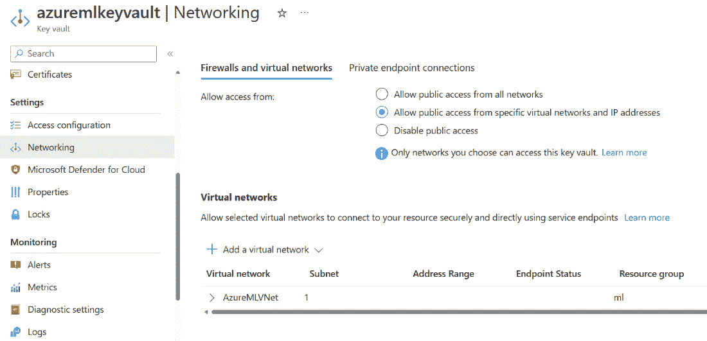

注意

我们仍然可以配置服务端点，而不限制对服务的网络访问。在这种情况下，来自工作区的流量将通过 VNet，而任何其他流量仍然将通过公共互联网访问服务。同时进行这两项操作可以确保更好的隔离。

现在我们已经禁用了公共访问，我们有两种配置选项：启用服务端点或为每个服务创建私有端点。

让我们从服务端点开始探索这两个选项。

### 选项 1：配置服务端点

这是最容易且最快的方法。Azure 中的服务端点通过扩展您的 VNet 的私有地址空间到 Azure 服务资源，为 VNets 提供增强的安全性和优化的路由。这允许您将 Azure 服务资源安全地连接到您的 VNet。

打开我们之前创建的 VNet，并转到**子网**部分。点击所需的子网，然后在右侧的弹出窗口中向下滚动。

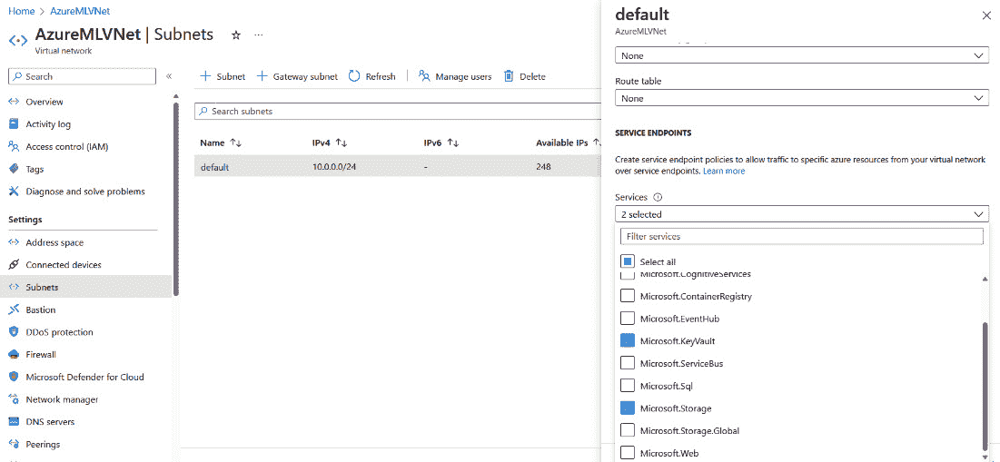

图 7.14 – 仅允许批准的出站流量

重要的是要注意，虽然服务端点在许多场景中很有用，但有些情况下您可能需要考虑使用 Azure Private Link 或私有端点，尤其是当您希望 Azure 服务通过您的 VNet 中的私有 IP 地址访问时。

因此，让我们看看如何实现这个选项。

### 选项 2：创建私有端点

创建私有端点的过程与我们用于创建工作区公共端点的过程类似。让我们看看每个服务的步骤。

#### Azure 存储账户

在 **存储账户** 资源的 **网络** 屏幕上，单击 **私有端点连接**。单击 **+ 私有端点** 按钮，并按照我们在工作区中之前所做的步骤进行操作。

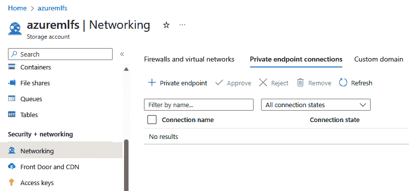

图 7.15 – 创建私有端点

根据以下截图，为端点填写一些基本信息：

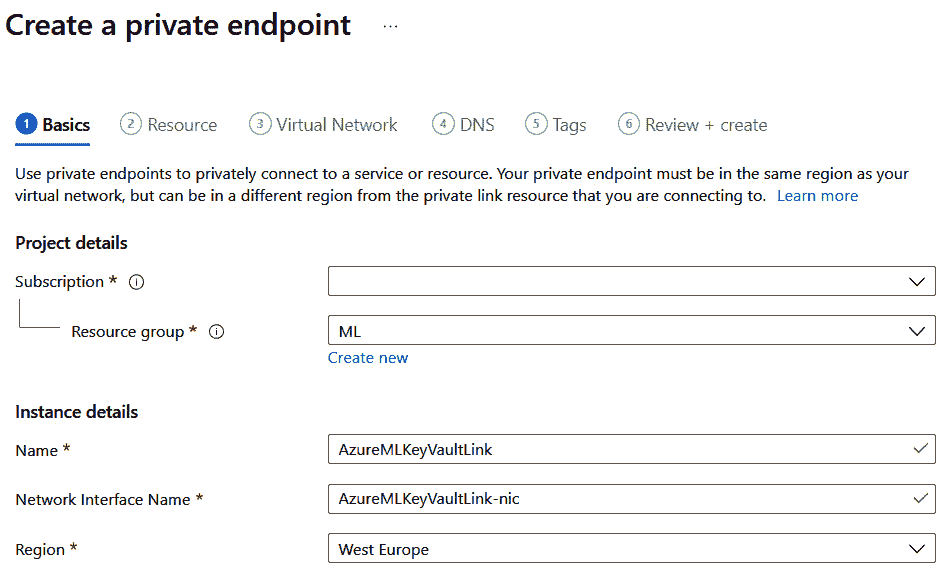

图 7.16 – 填写基本信息

然后，在 **目标子资源** 的 **资源** 选项卡中，从下拉菜单中选择 **blob**：

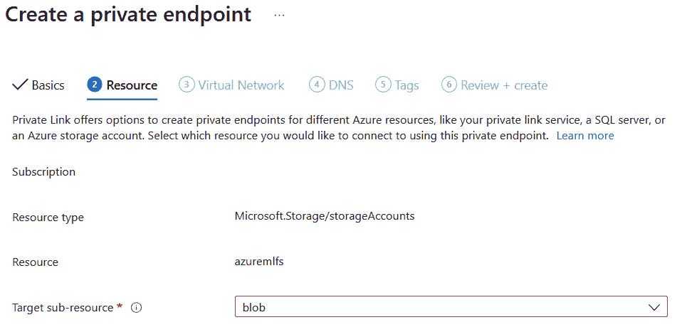

图 7.17 – 选择 blob 资源

按照工作区的步骤，填写 **虚拟网络**、**DNS**，然后转到 **审查 + 创建**。

完成此过程后，创建另一个私有端点，这次选择 **文件** 作为 **目标子资源**。

完成存储账户后，这里是进行密钥保管库相同操作的步骤。

#### Azure 密钥保管库

在密钥保管库资源的 **网络** 屏幕上，单击 **私有端点连接**。单击 **+ 私有端点** 按钮，并按照我们在本章中为存储账户所做的步骤进行操作：

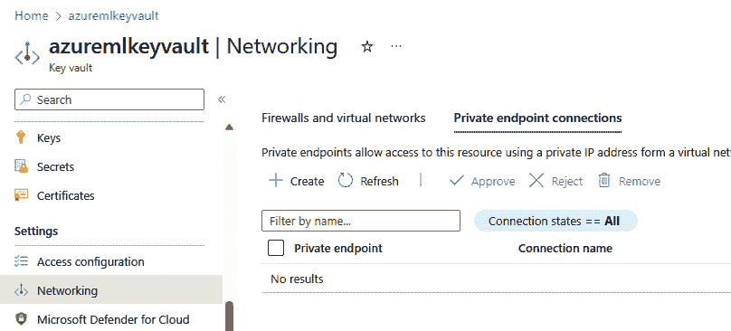

图 7.18 – 创建私有端点

根据以下截图，为端点填写一些基本信息：

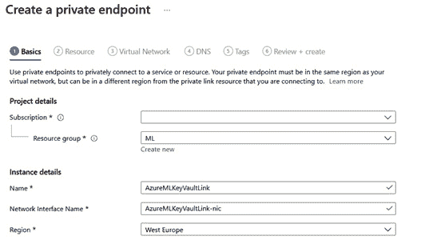

图 7.19 – 填写基本信息

然后，在 **目标子资源** 的资源选项卡中，选择 **vault**。

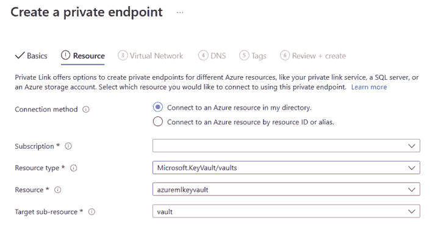

图 7.20 – 选择 vault 资源

再次，按照存储账户的步骤，填写 **虚拟网络** 和 **DNS**，然后转到 **审查 + 创建**。

我们已经完成了所需的最小配置。现在，是时候测试它了！让我们回顾一些测试连接性的选项。

## 验证连接性

为了连接到防火墙后面的工作区，我们有多种选择。这些选择主要取决于您的个人 Azure 基础设施和需求。

让我们回顾那些选项：

+   **从本地系统连接**：有一种选项可以在您的本地网络和 Azure 之间建立安全、加密的通信。这是通过公共互联网上的 VPN 网关完成的。Azure 提供两种类型的网关：**VPN 网关**和**ExpressRoute**。选择合适的 VPN 解决方案很重要，因为它们将有权访问您的互联网活动，并且并非所有 VPN 选项都提供相同级别的安全性、隐私和速度。

Azure 上的 VPN 解决方案

在这里，您可以找到有关 Azure 中 VPN 网关和 ExpressRoute 服务的更多信息。

对于 VPN 网关，请参阅[`learn.microsoft.com/en-us/azure/vpn-gateway/vpn-gateway-about-vpngateways`](https://learn.microsoft.com/en-us/azure/vpn-gateway/vpn-gateway-about-vpngateways)。

对于 ExpressRoute，请参阅[`learn.microsoft.com/en-us/azure/expressroute/expressroute-introduction`](https://learn.microsoft.com/en-us/azure/expressroute/expressroute-introduction)。

+   **从云基础设施连接**：我们始终可以创建一个虚拟机——有时也称为**跳转盒**——然后将其连接到。从那里，我们可以访问受网络限制的服务。此外，您可以在虚拟机中启用**Azure Bastion**，并通过浏览器访问该机器，而无需在虚拟机上配置公共 IP，这可以减少对安全漏洞的暴露。

    对于我们的示例，我们将使用部署在同一 VNet 中的 Azure 虚拟机。您需要做的就是创建一个在同一网络或对等网络中部署的虚拟机，并尝试访问该工作区。

快速入门：在门户中创建 VM

如果您需要开始使用虚拟机，请在此处查看快速入门指南：

[`learn.microsoft.com/en-us/azure/virtual-machines/windows/quick-create-portal`](https://learn.microsoft.com/en-us/azure/virtual-machines/windows/quick-create-portal)

结果符合预期。我们可以从网络内部的设备访问工作区，但网络之外的一切都被禁用。以下是同一 VNet 中工作区访问页面（左侧）和浏览器尝试通过公共互联网访问同一工作区（右侧）的截图：

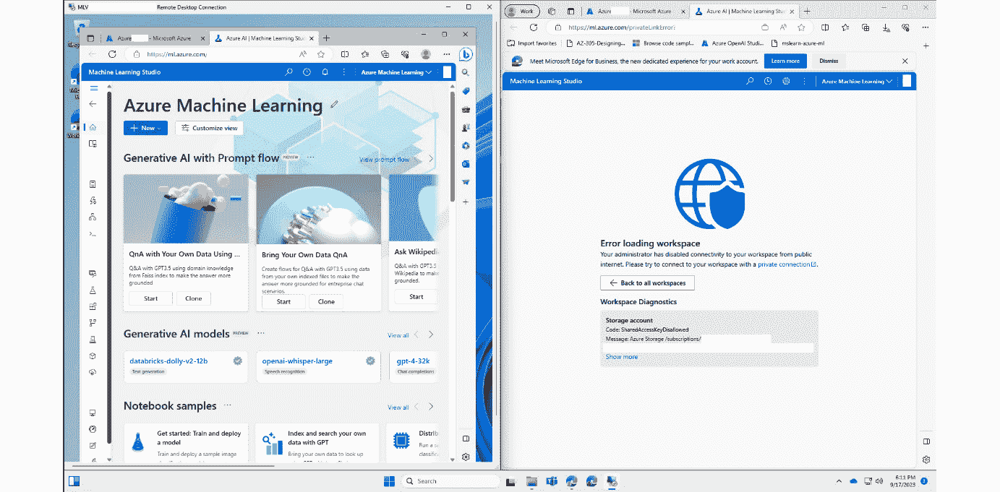

图 7.21 – 公共访问已禁用

虚拟机安全最佳实践

为了增加隔离性和安全性，有多种方法可以保护网络本身或属于该网络的虚拟机。例如，您可以查看以下服务：

+   **网络安全组**：[`learn.microsoft.com/en-us/azure/virtual-network/network-security-groups-overview`](https://learn.microsoft.com/en-us/azure/virtual-network/network-security-groups-overview)

+   **Azure 防火墙**：[`learn.microsoft.com/en-us/azure/firewall/overview`](https://learn.microsoft.com/en-us/azure/firewall/overview)

+   **Azure** **堡垒机**：[`learn.microsoft.com/en-us/azure/bastion/bastion-overview`](https://learn.microsoft.com/en-us/azure/bastion/bastion-overview)

我们可以用类似的方式保护相关的资源，例如在数据库和其他可用于 Azure 机器学习的类型的数据存储中。如果服务已经是其他 VNets 的一部分，只要我们的 VNets 没有重叠的地址，我们就可以通过网络对等连接不同的网络。我们可以通过在同一或不同的订阅中使用 VNet 对等连接网络，因此最终您在 Azure 中如何隔离网络的决定基于个别组织的需求。

Azure 中的网络架构

通过探索网络对等、集中辐射拓扑和 Azure 登录区域来了解更多关于网络架构的信息：

+   VNet 对等：[`learn.microsoft.com/en-us/azure/virtual-network/virtual-network-peering-overview`](https://learn.microsoft.com/en-us/azure/virtual-network/virtual-network-peering-overview)

+   集中辐射式：[`learn.microsoft.com/en-us/azure/architecture/reference-architectures/hybrid-networking/hub-spoke?tabs=cli`](https://learn.microsoft.com/en-us/azure/architecture/reference-architectures/hybrid-networking/hub-s)

+   Azure 登录区域：[`learn.microsoft.com/en-us/azure/cloud-adoption-framework/ready/landing-zone/`](https://learn.microsoft.com/en-us/azure/cloud-adoption-framework/ready/landing-zone/)

通过将 Azure 机器学习与 Azure VNets 集成，我们添加了一个重要的安全层，这将有助于保护我们的数据、模型和其他资源免受未经授权的访问和威胁。让我们不要忘记始终监控并定期审查安全措施，以适应不断发展的威胁环境。

让我们现在进一步探讨工作空间的安全实践，从 Azure 机器学习计算开始。

# 使用 Azure 机器学习计算

Azure 机器学习提供了一个可扩展的云环境，用于构建、训练和部署机器学习模型。它提供了不同的计算目标，用于运行实验、训练模型和提供预测。

总共有四个目标，其中两个由工作区内部管理：**计算实例** 和 **计算集群**。计算实例是一个用于开发、培训和推理需求的托管虚拟机。它本质上是在工作区中的专用个人工作站。它可以用于运行 Jupyter 笔记本和脚本。计算集群是一组可管理的可扩展虚拟机，用于大规模训练机器学习模型。计算集群会根据工作负载自动扩展或缩减（在您设置的范围内）。例如，您可以声明最小和最大节点数，机器将根据需求进行扩展，这有助于我们优化成本。还有外部计算，您可以使用它进行推理，特别是 Azure Kubernetes 服务。您还可以将外部服务（如 Ubuntu VM 或 Databricks 计算）用于训练并附加到工作区。

在本节中，我们将专注于确保内部资源的安全。对于外部服务，您必须找到确保每个服务最佳实践。以下是一些链接，为您提供有关确保推理和附加计算安全性的更多信息：

+   Azure Kubernetes 服务：[`learn.microsoft.com/en-us/azure/aks/concepts-security`](https://learn.microsoft.com/en-us/azure/aks/concepts-security)

+   虚拟机安全：[`learn.microsoft.com/en-us/azure/virtual-machines/security-recommendations`](https://learn.microsoft.com/en-us/azure/virtual-machines/security-recommendations)

+   Azure Databricks 安全指南：[`learn.microsoft.com/en-us/azure/databricks/security/`](https://learn.microsoft.com/en-us/azure/databricks/security/)

+   Azure Data Lake 安全基线：[`learn.microsoft.com/en-us/security/benchmark/azure/baselines/data-lake-analytics-security-baseline`](https://learn.microsoft.com/en-us/security/benchmark/azure/baselines/data-lake-analytics-security-baseline)

以下部分将帮助您了解如何确保计算实例和计算集群的安全。

## 确保计算实例安全

确保计算实例和计算集群的基础在于使用托管标识和网络隔离的组合。让我们跟随以下步骤来启用它们，从计算实例开始。

从 Azure Machine Learning 工作区中，在 **管理** 下的 **计算** 菜单中找到 **计算实例** 选项卡，点击 **+ 新建** 创建新的计算实例：

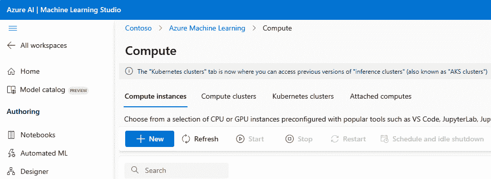

图 7.22 – 新计算实例

根据需要填写所有选项卡，直到到达**安全**选项卡。启用**分配托管标识**按钮，并将**标识**类型保留为**系统分配**。确保**SSH**按钮被禁用以防止公开访问，因为当使用 VNet 时，你仍然可以在该 VNet 内使用**安全外壳协议**（**SSH**）连接到机器。如果你之前已限制对工作区和相关资源的访问，**启用虚拟网络**将默认启用，这使得选择**虚拟网络**和**子网**成为强制性的。选择之前创建的：

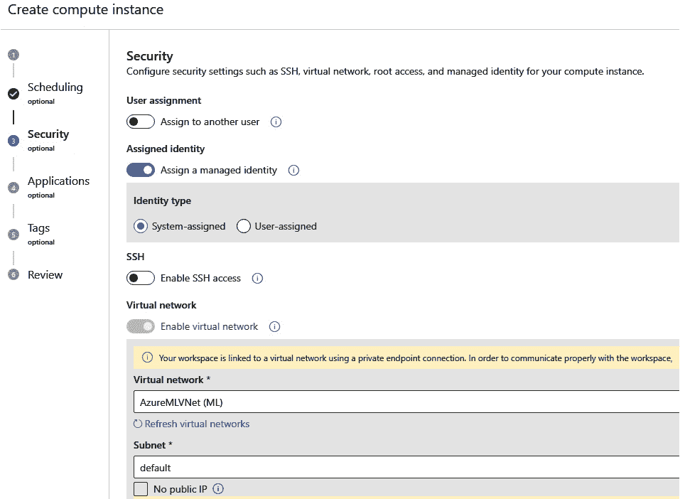

图 7.23 – 设置计算实例安全

根据需要填写其余选项卡，并创建计算实例。记住，当使用此计算实例进行训练时，在脚本中使用适当的凭据。

让我们继续学习如何确保计算集群的安全。

## 保护计算集群

保护计算集群的过程非常相似。要从**管理**下的**计算**菜单中启动过程，请选择**计算集群**选项卡，然后点击**+ 新建**以创建新的计算实例：

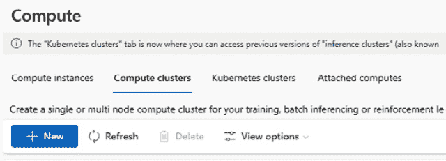

图 7.24 – 新计算集群

根据需要填写**虚拟机**选项卡，直到到达**高级设置**选项卡。向下滚动，直到到达**高级设置**下拉菜单，并确保**启用 SSH 访问**被禁用以防止公开访问，启用**分配托管标识**，并将**标识类型**保留为**系统分配**。

如果你之前已限制对工作区和相关资源的访问，再次，**启用虚拟网络**将默认启用，这使得选择**虚拟网络**和**子网**成为强制性的。选择之前创建的，如下面的截图所示：

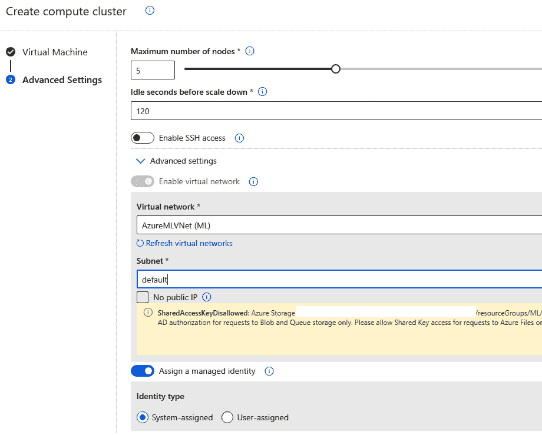

图 7.25 – 设置计算集群安全

该过程可能很简单，但足以将我们的计算资源从公共互联网隔离，防止进一步的漏洞。只需记住，当通过计算实例在笔记本上运行脚本时，确保在代码中传递适当的凭据。有关如何使用托管标识的示例，请参阅*第六章*中的*使用托管标识*部分。

让我们回顾与工作区相关联的最后一个资源及其安全功能：Azure 容器注册表。

# 管理容器注册表和容器

Azure Machine Learning 提供了一个集成、端到端的数据科学工作流程，使数据科学家和开发者能够准备数据、实验模型，然后在可扩展的环境中部署它们。部署过程中的一个关键方面涉及容器化，这使我们来到了**Azure 容器注册表**（**ACR**）。ACR 是基于开源 Docker Registry 2.0 的托管、私有 Docker 容器注册表服务。ACR 允许用户在 Azure 中以安全且可扩展的方式构建、存储和管理容器镜像和工件。ACR 与现有的容器开发和部署管道集成良好，并且对于存储和管理可在各种 Azure 服务中部署的自定义 Docker 镜像特别有用。

当使用 Azure Machine Learning 时，有一个底层过程用于打包模型以进行部署。这个打包过程包括创建一个包含模型、评分脚本以及运行模型所需的所有依赖项的 Docker 镜像。一旦创建了此 Docker 镜像，它就需要存储在一个可以检索和运行的地方。

这就是 ACR 发挥作用的地方。当您第一次使用 Azure Machine Learning 部署模型时，即使您没有明确设置 Azure 容器注册表，平台也会自动为您创建一个。这是一个无缝的体验；然而，我们需要意识到这对成本和安全性的影响。

在下一节中，我们将了解如何保护我们的 ACR 和在 **Azure 容器实例**（**ACI**）中部署的容器。让我们从 ACR 开始。

## 使用 Azure 容器注册表保护图像

保护 ACR 涉及网络安全、访问控制和图像安全方面的最佳实践的结合。同样，对于计算，ACR 的安全最佳实践涉及尽可能使用托管标识，并确保 ACR 位于与工作空间相同的虚拟网络后面。

要在 VNet 中隔离容器注册表，步骤与其他资源类似。然而，在我们能够使用网络功能之前，我们需要更新服务以使用**高级**定价层。

要更新定价层，请访问与您的工作空间关联的资源中的 ACR 刀片，并找到**属性**部分。按照下一张截图所示更新值，然后点击**保存**：

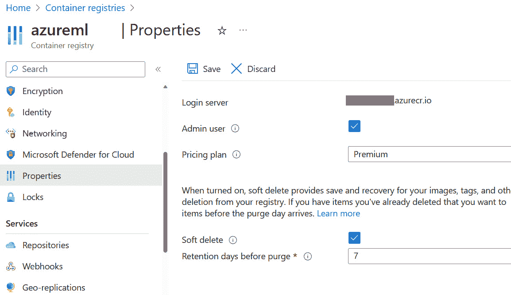

图 7.26 – 更新容器注册表属性

现在我们可以使用 ACR 的网络功能了。正如我们已多次看到的，转到**网络**部分，将**公共访问**设置为**禁用**，如下截图所示：

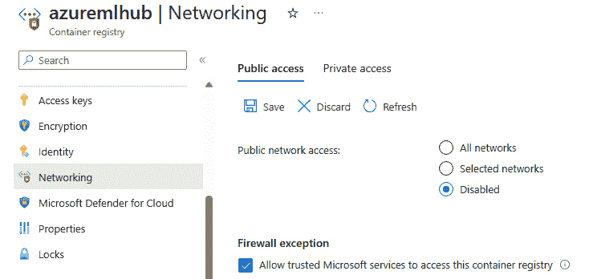

图 7.27 – 禁用公共访问

在**私有访问**选项卡上，点击**创建私有** **端点连接**：

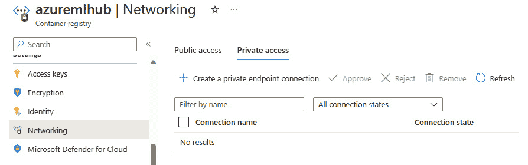

图 7.28 – 为注册表创建私有端点

按照常规步骤操作，确保在**资源**选项卡下的**私有端点**表单中，填写正确的**资源**和**资源类型**：

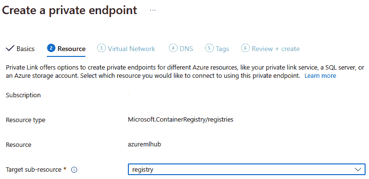

图 7.29 – 填写私有端点表单

保护 ACR 是一个多方面的过程。通过采取涵盖网络安全、访问控制和持续监控的全面方法，您可以确保您的容器镜像保持安全，并且只能由经过身份验证的用户或应用程序访问。

容器注册库只是模型的存储库。它们可以通过发布的端点公开，以便它们可供应用程序使用。让我们探索如何在使用 ACI 部署时确保这些端点的安全性。

## 与 ML 端点一起工作

当我们通过工作区部署模型时，可用的选项是 Azure Kubernetes 和 ACI。最快的选项是使用 ACI，因为它们可以通过工作区快速部署，并且无需进一步配置。如果您想回顾部署模型的过程，可以查看*第一章*中的*部署模型*部分。

在通过工作区部署端点后，没有选项可以禁用容器的公共访问。在这种情况下，您可以做的仍然是注册模型，但使用从存储库中保存的容器在新 ACI 部署中重新部署它。这提供了网络隔离的机会。

要做到这一点，我们需要在容器实例表单的**基本**选项卡中从与我们的工作区连接的 ACR 中选择已部署的镜像。开始填写表单，就像在下一个屏幕截图中所展示的那样：

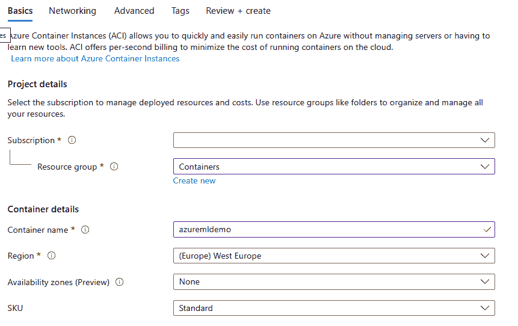

图 7.30 – 填写基本详情

当我们到达需要选择**图像源**的部分时，请选择连接到您工作区的 ACR。填写**注册表**、**镜像**和**镜像标签**以匹配您的模型，然后根据需要填写表单的其余部分：

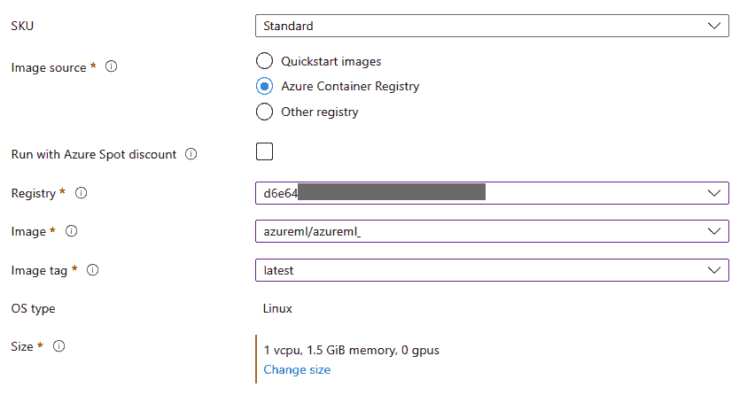

图 7.31 – 选择正确的 ACR

接下来，您将找到**网络**选项卡。从这里，您可以限制网络。

与 VNet 隔离的应用程序考虑因素

在这个阶段要小心。这完全取决于您的应用程序托管的位置，因为这个端点是打算由服务的外部应用程序使用的。如果它是在 Azure 上托管的应用程序，您可能可以轻松配置访问。如果它是在本地托管的内部应用程序，您可能需要之前提到的某些服务，例如 VPN 网关来访问隔离的端点。如果它是一个面向公众的应用程序，您可能需要进一步配置 VNet 附加的网络安全组或防火墙，以正确允许访问。由于这个过程的部分严重依赖于其他因素，在使用该 API 端点进行评分、训练等之前，请确保您已经探索了所有网络和身份验证选项。

要在 VNet 后面进行隔离，请选择**虚拟网络**和**子网**。子网必须与之前我们用来容纳端点而不是虚拟机的子网不同。请参考以下截图：

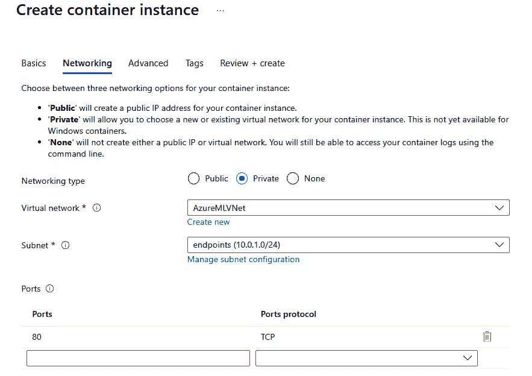

图 7.32 – 配置网络隔离

然后，您可以按照需要完成其余的设置并创建端点。如果需要，请注意环境变量。这些可以在**高级**选项卡中填写。然后，您可以**审查 + 创建**服务。您可以从同一 VNet 中部署的虚拟机测试服务，以测试连接性。这只是隔离端点的一种方法。另一种方法是使用工作空间管理的网络隔离，这是一个尚未完全可用的新功能。值得关注这个功能未来的发展。

工作空间管理的网络隔离

Azure 机器学习目前为 VNet 隔离提供了另一种集成管理选项：使用由工作空间管理的 VNet 自动化流程。在撰写本文时，此功能仍处于预览阶段，不应用于生产工作负载，因为服务不提供**服务级别协议**（**SLA**）。如果您想了解更多信息，您可以在 https://learn.microsoft.com/en-us/azure/machine-learning/how-to-managed-network?view=azureml-api-2&tabs=azure-cli 找到更多信息。

我们已经探讨了多种利用 Azure 基础设施来保护我们的 Azure 机器学习工作空间及其相关资源的方法。如果我们已经拥有可以用于组织其他目的的云基础设施，那么这会更容易。即使我们没有，也值得探索，因为它不仅可以帮助我们隔离资源并减少攻击面，还可以在发生安全事件的情况下防止数据泄露。

# 摘要

在本章中，我们讨论了利用网络保护我们的 Azure 机器学习工作负载的多个方面。

本章的主要目的是学习基本的网络实践，以隔离工作空间及其所有相关服务，特别是存储账户、密钥保管库和 Azure 容器注册库。尽管公共访问意味着来自公共互联网的访问，而不是未经授权的访问，但凭证可能会泄露，恶意行为者可能会获得访问权限。通过使用虚拟网络（VNets）隔离我们的资源，我们正在减少攻击面。

结合网络和关于身份的最佳实践，例如尽可能配置托管身份，并使用适当的基于角色的访问控制（RBAC）来管理我们的用户和服务，我们可以进一步确保在云服务和基础设施中保持基本的安全态势。

在下一章中，我们将了解如何通过**持续集成和持续交付**（**CI/CD**）自动化我们的机器学习任务的最佳实践。
