# 第八章：管理和安全保障 MLOps 生命周期

尽管数据和基础设施很重要，但它们的管理可能会产生额外的开销，并从实际的 ML 任务中分散注意力。当不同的角色在 ML 项目中协作时，需要自动化和标准化事物，以使日常任务更加高效。

在本章中，我们将探讨 MLOps 的最佳实践以及如何使用 Azure 和其他工具来实施它们。我们将深入了解如何利用**基础设施即代码**（**IaC**）和 Azure DevOps 中 DevOps 在 ML 生命周期中的应用，以实现**持续集成**/**持续交付**（**CI**/**CD**）。尽管这些不是实施 MLOps 的唯一方法，但 Azure 为我们提供了全面的监控和日志记录功能，我们可以利用事件网格等服务来启动事件驱动的流程。这意味着我们不仅限于工具，还可以实施我们自己的工作流程，并轻松地根据我们的流程进行定制。

在本章中，我们将涵盖以下主要主题：

+   在 Azure Machine Learning 中使用 MLOps

+   利用 IaC

+   实施 CI/CD

+   探索 Azure 中的事件驱动工作流程

到本章结束时，我们将了解 MLOps 是什么，Azure Machine Learning 中的 CI/CD 是什么样的，以及如何结合不同的服务并创建我们自己的工作流程。

# 技术要求

本章深入探讨了几个 DevOps 概念。对 Git、版本控制和 DevOps 有一定的了解将有助于理解本章中描述的概念。如果你缺乏先前的技术知识，以下的学习资源将帮助你理解一些基本概念和功能。请阅读它们以回顾理解本章内容所需的前提条件：

+   **Git 和版本控制**：[`learn.microsoft.com/en-us/training/modules/intro-to-git/`](https://learn.microsoft.com/en-us/training/modules/intro-to-git/)

+   **使用 Azure DevOps 构建应用程序**：[`learn.microsoft.com/en-us/training/paths/build-applications-with-azure-devops/`](https://learn.microsoft.com/en-us/training/paths/build-applications-with-azure-devops/)

+   **GitHub Actions**：[`learn.microsoft.com/en-us/training/paths/automate-workflow-github-actions/`](https://learn.microsoft.com/en-us/training/paths/automate-workflow-github-actions/)

# 在 Azure Machine Learning 中使用 MLOps

**MLOps**这个术语是**机器学习**和**运营**的结合，指的是在生产环境中管理 ML 模型生命周期的实践、工具和策略。正如 DevOps 旨在简化软件的开发和运营流程一样，MLOps 旨在为 ML 系统做同样的事情。实施 MLOps 可以提高 ML 项目的生产力、可重复性和敏捷性。MLOps 专注于一系列特定的实践。

让我们探索每个实践以及如何使用 Azure Machine Learning 功能来实现它们：

+   **协作**: 在机器学习项目中，促进数据科学家、机器学习工程师和运维团队等不同角色之间的有效协作是核心，因为项目的成功涉及多个角色。通过使用共享的平台和工具，数据科学家可以专注于模型原型设计，机器学习工程师确保其生产就绪，而运维专家则监控其实时性能。Azure 机器学习已经通过一个专用的工作空间实现，在这里每个人都可以协作，促进透明度和团队合作。此外，它基于 Azure，借助 Microsoft Entra ID 和 RBAC，我们可以轻松实现协作，同时遵守安全最佳实践。

+   **版本控制**: 在 MLOps 中的版本控制不仅限于代码，它还扩展到数据集、模型配置、参数和结果。目标是确保任何实验或模型训练都可以在任何时间确定性地重现。考虑一个场景，即模型的性能突然下降。使用版本控制，团队可以回滚到之前表现更好的模型配置，确定当时使用了哪些数据集和超参数。这涉及到维护模型版本、训练数据、决策和变更的系统记录。这对于合规性至关重要，尤其是在受监管的行业中，并确保模型决策透明且可追溯。Azure 机器学习允许我们通过将它们注册到工作空间来实现数据和模型的跟踪和版本控制。

+   **模型验证**: 这种做法确保模型在部署前符合质量标准。它包括对代码的单元测试、对保留数据集的验证，甚至是对现实世界场景的模拟。例如，在部署自动驾驶汽车模型之前，它在虚拟环境中进行测试，以确保它正确识别行人、遵守交通信号并应对各种天气条件。这可以作为 CI/CD 管道的一部分实现。

+   **CI/CD**: 机器学习的 CI/CD 自动化模型训练、验证和部署过程。当新数据到来或代码发生变化时，模型将被重新训练，如果它符合设定的标准，则自动部署。例如，在改进模型架构后，数据科学家将更改推送到存储库。CI/CD 管道重新训练模型，评估它，如果它超过预定义的准确度阈值，则无需人工干预即可在生产中更新模型。在下一节中，我们将看到一些使用 DevOps 的实现。

+   **监控和日志记录**：持续监控跟踪模型的健康状况、性能以及任何潜在的数据漂移。日志记录捕获预测、输入数据和异常，确保有可追溯的证据来记录模型在生产中的行为。一个生产中的图像识别模型开始错误地分类某些对象。监控工具检测到这种性能下降，通过检查日志，工程师可以识别问题。Azure 机器学习维护关于工作区多个方面的日志，无论是数据漂移还是端点未响应。

+   **可扩展性**：MLOps 专注于构建可以随着数据或需求的增加而扩展的机器学习系统，确保基础设施和流程可以处理增长而不会降低性能。假设一个初创公司的用户基础在一年内增长了十倍。他们的推荐系统在设计时就考虑了可扩展性，可以处理这种激增，而无需进行全面的重构或造成服务中断。由于 Azure 机器学习利用 Azure 基础设施，我们可以扩展端点和计算以适应这种类型的扩展场景。

+   **可重现性**：MLOps 的核心是能够重现实验、结果或模型部署。这确保了一致性，有助于调试，并促进了对系统的信任。假设团队成员发现了一个突破性的模型改进；使用 MLOps 实践，其他团队成员可以复制确切的条件、数据预处理步骤和训练配置，以验证并在此基础上进一步研究。模型注册在工作区内部处理这个问题。

+   **自动化**：机器学习生命周期的许多阶段，从数据摄取到模型重新训练，都是自动化的，以提高效率和减少人为错误。当月销售数据上传到云存储时，自动化的管道会预处理数据，重新训练预测模型，并使用新的预测更新仪表板——这一切都不需要人为干预。根据我们想要做什么，我们可以利用 DevOps、Azure Functions 或简单的 Webhooks 等服务来自动化管道和工作流程。

在 Azure 机器学习中结合 MLOps 实践，创建了一个全面高效的机器学习生命周期管理系统，确保模型可靠高效，并带来持续的价值。

让我们看看这些实践的实际应用，从 IaC 开始。

# 利用 IaC

IaC（基础设施即代码）是 DevOps 中的关键实践，它通过代码自动管理、提供和配置 IT 基础设施。在 Azure 中，有多种工具和服务可以促进 IaC 实践。我们之前已经提到了一些，但在这里我们将全面回顾。

让我们深入了解如何在 Azure 中实现 IaC 以及我们可以使用的服务：

+   **Azure 资源管理器**（**ARM**）**模板**：ARM 模板是 Azure 中的原生 IaC 解决方案。它们是定义您需要为解决方案部署的资源所需的 JSON 文件。通过使用 ARM 模板，您可以声明式地定义和部署您的基础设施。我们可以通过为模板定义参数来使它们更模块化，以创建可重用的部署脚本并实现资源部署的条件逻辑。

+   **Azure Bicep**：Bicep 是一种用于声明式部署 Azure 资源的编程语言。它本质上是对 ARM 模板的透明抽象，使得编写和管理 Azure 基础设施更加容易。与 ARM 的 JSON 相比，Bicep 提供了更简洁、易读的语法，并且有开发环境集成，提供自动完成、类型安全和其他有用功能。

+   **Azure CLI 和 PowerShell**：Azure CLI 和 Azure PowerShell 都是 Azure 提供的用于管理 Azure 资源的命令行工具。虽然它们在技术上属于命令式工具（您正在逐步告诉 Azure 要做什么），但它们通常用于脚本中，以自动化 IaC 方式的配置和部署任务。

+   **Azure 蓝图**：Azure Blueprints 允许组织定义一组符合组织标准和要求的可重复使用的 Azure 资源。与 ARM 模板相比，蓝图更全面，因为它们可以定义角色分配、策略分配和 ARM 模板部署。与代码一样，蓝图具有版本控制功能，因此可以在分配新订阅时使用旧版本。

+   **Azure 上的 Terraform**：Terraform 是 HashiCorp 开发的开源 IaC 工具。它使用一种称为 **HashiCorp 配置语言**（**HCL**）的语言来定义和配置基础设施。Azure 完全支持 Terraform，允许您将其用作 ARM 模板的替代方案。其他支持的第三方平台包括 Ansible、Chef 和 Pulumi，用于在 Azure 中进行基础设施自动化。

无论您使用哪种服务，使用 IaC 都有多种好处。通过消除环境漂移并确保每个环境以相同的方式部署，我们获得了一致性。由于我们可以在不同的环境或项目中使用相同的脚本或模板，因此具有可重用性。在支持它的服务中，例如 Azure Blueprints，我们可以拥有版本控制。对于不支持此功能的其他服务，我们仍然可以使用版本控制系统保存脚本，以跟踪更改并在必要时回滚。此外，我们还可以将 IaC 集成到 CI/CD 管道中，作为部署过程的一部分自动配置或更新基础设施。

让我们探索 IaC 如何与 Azure 机器学习集成。

## 将 IaC 与 Azure 机器学习结合

将 IaC 与 Azure Machine Learning 结合意味着我们将 ML 资源的自动化设置、管理和配置与它们所依赖的更广泛的云基础设施集成在一起。这种方法确保了 ML 运作的一致性、可重复性和效率。

以下是一些将 IaC 与 Azure Machine Learning 结合的示例：

+   **基础设施**：一切从设置所需资源开始，包括工作区本身、计算实例（例如，训练集群，例如 **Azure Kubernetes 服务**（**AKS**）或 AML 计算）、推理集群以及网络组件，如 VNets、子网和安全组。

+   **数据存储和数据集**：Azure Machine Learning 中的数据存储代表存储后端（例如，Azure Blob Storage）。在配置后，我们可以使用 Azure Machine Learning SDK 通过 IaC 程序化注册数据存储和数据集。

+   **模型部署**：与数据相同的原理适用于模型。一旦模型训练完成，它们可以被部署到端点进行实时或批量推理。我们可以使用 IaC 来配置部署目标，例如 AKS 或 **Azure 容器实例**（**ACI**）。然后，我们可以使用 Azure Machine Learning SDK 将模型部署到这些目标，并集成自动缩放、日志记录和监控等功能。

+   **自动化和编排**：我们可以将所有 IaC 脚本和 ML 代码存储在版本控制系统（如 Git）中。然后，我们可以使用 Azure DevOps、GitHub Actions 或其他 CI/CD 工具来自动化基础设施的部署和 ML 工作流的执行。这确保了基础设施更改或 ML 模型的更新将启动自动化流程。

通过将 IaC 与 Azure Machine Learning 集成，团队可以确保环境的一致性，简化 ML 工作流程，并促进数据科学家、ML 工程师和 DevOps 团队之间的协作。由于 IaC 是 MLOps 的一个组成部分，这种设置确保了每个更改——无论是基础设施相关的还是模型相关的——都是版本化的、可重复的，并且可以自动处理。这种简化的流程最小化了人工干预和潜在错误，优化了 ML 开发生命周期。

MLOps 的另一个核心部分是持续集成和持续交付。让我们探索如何使用 Azure DevOps 来实现它。

# 实施 CI/CD

CI/CD 是一种软件工程实践，它促进了频繁的代码集成和自动化部署。这种方法在 ML 项目中越来越受欢迎，以确保模型不断改进、验证和以简化的方式部署。在 Azure Machine Learning 中，有多个工具和服务可以帮助您在 ML 生命周期中实现 CI/CD。

以下是一个 CI/CD 的示例：

1.  通过使用带有 Azure Machine Learning 扩展的 VS Code 进行开发，我们可以编写我们的脚本。

1.  这些脚本可以使用 Git 仓库（例如 GitHub 或 Azure Repos）进行版本控制。

1.  如果我们有专业知识，我们可以设置自动测试来验证我们的模型。这可能包括单元测试、集成测试以及其他验证或数据检查。

1.  我们可以配置 Azure 管道，以便在代码库发生更改时自动触发。CI/CD 管道可能包括以下内容：

    +   训练模型

    +   记录指标

    +   检索已注册的模型

    +   打包和部署模型

让我们看看 Azure DevOps 和管道的示例。

## 使用 Azure DevOps 进行工作

Azure DevOps 是一套开发工具和服务，用于代码开发、构建和部署应用程序的工作和协作。

Azure DevOps 包含一系列服务，例如以下内容：

+   **Azure 板**：这提供了带有看板、待办事项、团队仪表板和自定义报告的工作跟踪。它允许团队在整个开发生命周期中规划、跟踪和讨论工作。

+   **Azure 代码库**：这是一个版本控制系统，提供 Git 代码库以进行源代码控制。它支持拉取请求、分支和搜索。

+   **Azure 管道**：这是一个 CI/CD 平台，用于部署和测试应用程序到不同的平台，包括云和本地提供的产品。

+   **Azure 测试计划**：这是一个包含多种测试工具的平台，适用于不同的场景，如探索性测试或持续测试。

+   **Azure 软件包**：这允许团队之间协作，将来自私有或公共存储库（如 NuGet 或 Maven）的软件包共享到他们的管道中。

注册 Azure DevOps

要开始使用 Azure DevOps，请遵循此快速入门指南：[`learn.microsoft.com/en-us/azure/devops/user-guide/sign-up-invite-teammates?view=azure-devops`](https://learn.microsoft.com/en-us/azure/devops/user-guide/sign-up-invite-teammates?view=azure-devops)。

对于 Azure 机器学习，我们可以利用管道来触发 ML 任务。让我们看看我们如何连接 Azure 机器学习工作区并通过 Azure DevOps 运行我们的 ML 管道。

### 创建与工作区的连接

在我们开始处理与 Azure 机器学习工作区相关的内容之前，我们需要使用 Azure DevOps 创建一个服务连接。为此，我们需要在 Azure DevOps 中创建一个新的项目。以下是步骤：

1.  打开您的 Azure DevOps 项目，在 **项目设置** 下查找 **服务连接**：

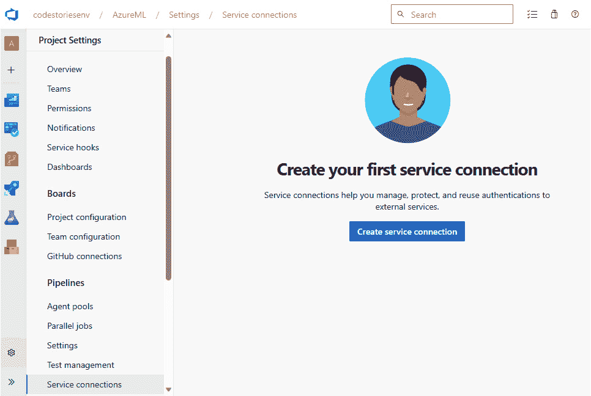

图 8.1 – 创建服务连接

1.  点击 **创建服务连接**，在随后的表单中，选择 **Azure 资源管理器**，如图所示：

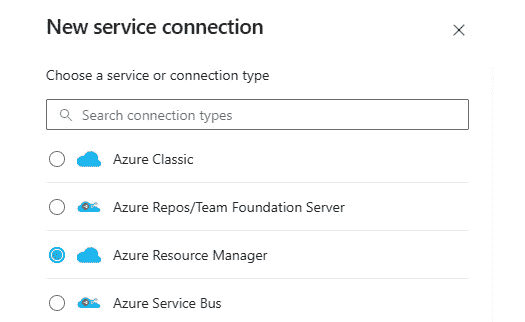

图 8.2 – 从 Azure 资源管理器选项开始

1.  点击页面底部的**下一步**，在**身份验证方法**选项中，最快的选项是选择**服务主体（自动）**，因为它不需要从 Azure 门户进行进一步配置。为了更好的安全性，如果您有一个已创建的**托管标识**，您可以考虑使用它，但如果您不确定，您可以直接使用**服务主体（自动）**选项。

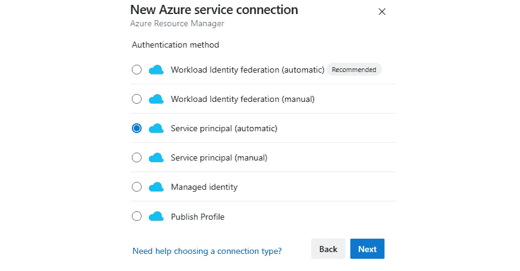

图 8.3 – 选择服务主体选项

1.  然后，通过填写以下截图所示的详细信息，在您的**订阅**级别选择工作区资源：

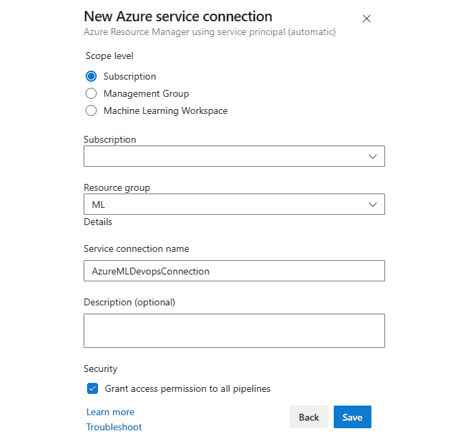

图 8.4 – 选择并连接到工作区资源

就这样！现在我们已经建立了与工作区的连接，我们可以用它来运行管道。您仍然可以通过从列表中选择您的连接来执行任何更新或查看使用数据。

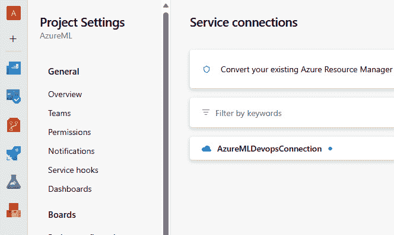

图 8.5 – 修改连接属性

现在我们已经建立了连接，我们可以自由地运行管道。让我们在下一节中看看如何操作。

### 创建新管道

创建新管道的步骤很简单。挑战在于做好必要的准备工作，以便从 Azure DevOps 调用 Azure 机器学习管道。

如果您没有任何示例，可以使用以下存储库，其中包含管道示例和代码。

Azure 机器学习示例存储库

如果您没有管道并想探索 Azure 中的某些 ML 示例，您可以从这个存储库中 fork 和运行代码：https://github.com/Azure/mlops-v2-ado-demo。

在 Azure DevOps 中，您需要构建一个 YAML 管道来运行您的任务。以下是创建新管道所需的步骤：

1.  首先创建一个新的管道，如下面的截图所示：

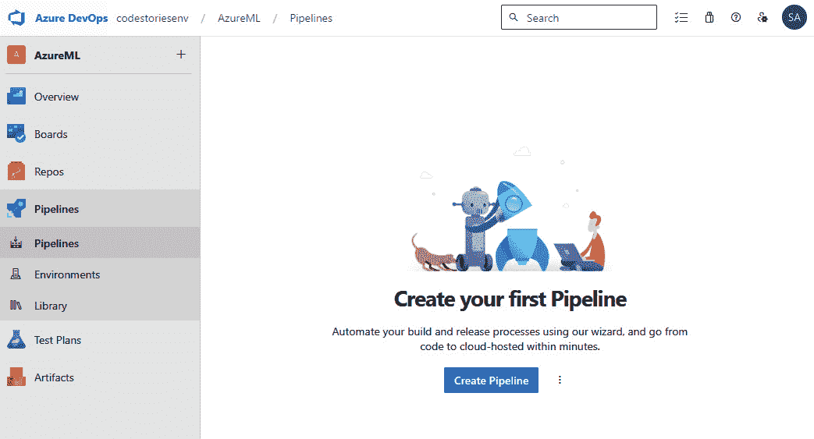

图 8.6 – 新管道

1.  您需要提供存储脚本所在的存储库。您可以使用项目中的存储库或外部存储库，例如 Bitbucket 或 GitHub：

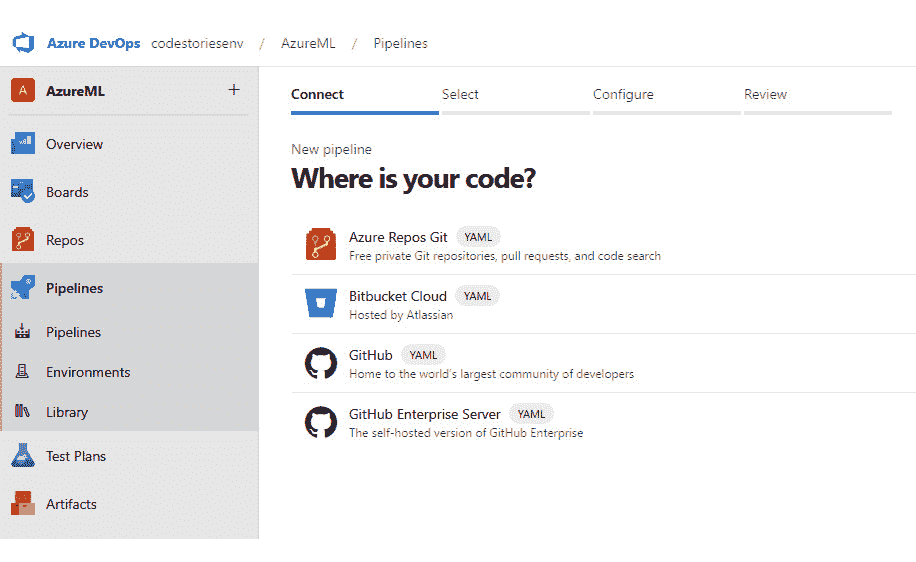

图 8.7 – 选择代码存储库

1.  我选择了同一项目中的存储库中的那个，所以我只需要选择存储库的名称，如下一截图所示：

f

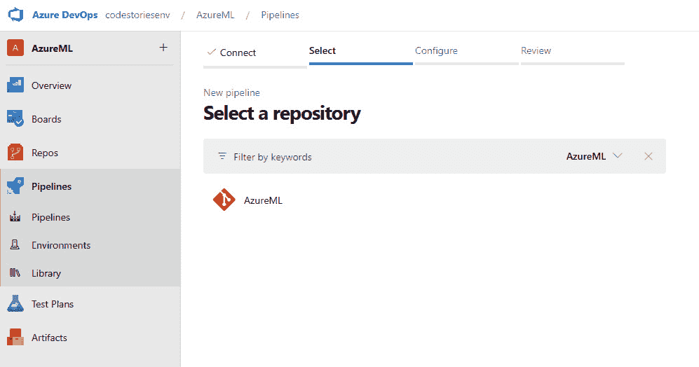

图 8.8 – 从列表中选择存储库

1.  在这里，选择**启动管道**模板以加载简单的管道 YAML 文件：

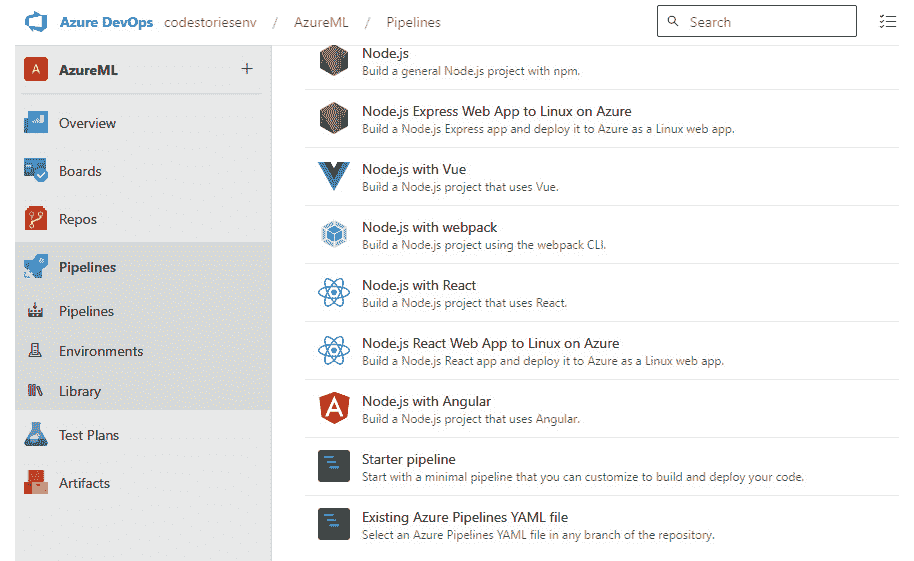

图 8.9 – 选择启动管道模板

现在，这里是一个大挑战。您需要定义触发器并从这里启动 Azure 机器学习管道。一个有效的开始方法是使用 CLI 提交任何 ML 作业。

启动管道确实提供了一些示例代码，如下一张截图所示，以帮助您开始并填写详细信息。对于一些事物，例如变量，您也可以通过集成设计器添加它们：

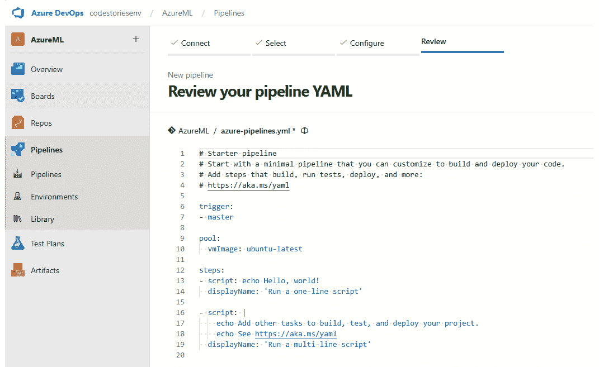

图 8.10 – 填写代码以调用您的管道

如果您选择克隆上一节中建议的存储库，您可以在 `mlops/devops-pipelines` 文件夹中找到管道 YAML 代码。复制并粘贴您选择的文件并提交代码。

一旦提交代码，您就可以运行您的管道。如果出现问题，您可以看到相关的错误消息，并且您始终可以返回修复管道代码并重新提交作业。

YAML 管道编辑器

有关 Azure DevOps 中 YAML 编辑器的简要介绍，请参阅此链接的信息：[`learn.microsoft.com/en-us/azure/devops/pipelines/get-started/yaml-pipeline-editor?view=azure-devops`](https://learn.microsoft.com/en-us/azure/devops/pipelines/get-started/yaml-pipeline-editor?view=azure)。

Azure DevOps 提供日志和输出，可以帮助您监控运行情况。此外，您还可以直接从 Azure 机器学习工作区监控运行。考虑在 Azure DevOps 中使用 *触发器*来自动化 ML 管道运行 – 例如，每次您的训练脚本或数据集发生变化时。

GitHub Actions

类似的功能也可以使用 GitHub Actions 实现。有关快速入门指南，请参阅此教程：https:/learn.microsoft.com/en-us/azure/machine-learning/how-to-github-actions-machine-learning?view=azureml-api-2&tabs=userlevel。

请记住，您将执行的具体步骤和任务将取决于您的 ML 项目的复杂性和您希望如何构建您的 CI/CD 管道。前面的步骤提供了一个高级指南，但您可能需要根据您的需求深入了解具体细节。

Azure DevOps 提供了一套全面且集成的工具，这些工具有助于敏捷软件开发、CI/CD、测试以及团队之间的协作。然而，它并不是唯一与 Azure 机器学习集成的 CI/CD 工具。我们可以使用 GitHub Actions 或通过使用其他服务来创建自己的工作流程。

让我们看看如何使用 Azure 事件和日志来驱动 Azure 机器学习中的工作流程。

# 探索 Azure 中的事件驱动工作流程

在 Microsoft Azure 的背景下，术语 *事件* 可以与多个服务和概念相关联，但最常见的是指一个消息或通知，表明平台上的某个事件发生。例如，我们在工作区中完成的每个操作都会生成事件，例如当工作区被创建或我们更改设置时。这些事件可以通过其他服务，如 Azure Event Grid，利用事件来创建工作流程。让我们接下来检查它。

## 探索事件网格

Azure 事件网格是一个完全托管的事件路由服务。它使您能够轻松构建响应 Azure 服务或本地环境中发生的变化或事件的程序。Azure 事件网格旨在通过事件将基于云的应用程序的不同部分连接在一起。应用程序可以在各种场景中从 Azure 事件网格中受益，例如在事件响应中自动化工作流（例如，在将图像上传到 Azure Blob 存储时创建缩略图）或监控 Azure 中的资源（例如，获取虚拟机更改的通知）。

事件网格使用发布/订阅模型来分发事件。**发布/订阅**（通常缩写为**pub-sub**）模型是一种在分布式系统中使用的消息通信模式。它将发送者（发布者）与接收者（订阅者）解耦，允许它们独立操作。这种解耦意味着发布者和订阅者不需要知道彼此的存在。

下面是发布/订阅模型的工作原理。至少有三个组件：

+   **发布者**：这是产生消息或事件的实体或组件。它不会直接发送到特定的接收者或订阅者。相反，它将消息发布到一个称为主题或频道的中间件。

+   **主题或频道**：主题（有时也称为频道）是消息发布的通道。订阅者对一个或多个主题表示兴趣，并且只接收感兴趣的消息，而无需知道发布者是谁。

+   **订阅者或处理器**：这是对接收特定消息感兴趣的实体或组件。它订阅特定的主题或频道，并在发布者向该主题发送消息时收到通知。

发布/订阅模型

这里是有关发布/订阅模型的一些更多信息：[发布/订阅模型](https://learn.microsoft.com/en-us/azure/architecture/patterns/publisher-subscriber)。

事件网格是一个负责管理主题、存储消息和通知订阅者的事件平面。以下是关键好处：

+   **事件源**：Azure 事件网格支持各种内置事件源，如 Azure Blob 存储、ARM 等。它还允许创建用于用户定义事件的定制主题。

+   **统一事件架构**：事件网格有一个通用的事件模型，这使得跨不同的 Azure 服务处理事件变得更加容易。

+   **事件过滤**：它通过允许订阅者根据事件类型或主题过滤他们感兴趣的事件，实现了细粒度控制。

+   **可靠性**：它提供至少一次交付保证，以确保事件始终被发送到订阅者。它还提供了一个名为**死信队列**的选项，用于保存由于各种原因而被**丢弃**到存储 blob 以供进一步处理的事件。

+   **可伸缩性**：它是根据需求自动扩展的，确保您的应用程序可以处理大量事件，正如大多数 Azure 服务所提供的那样。

+   **低延迟**：它提供一致的低延迟事件交付，这对于实时应用至关重要。

+   **解耦**：通过将事件生产者与事件消费者分离，事件网格允许具有更大的灵活性和更模块化的应用程序架构。

在下一节中，我们将看到一个示例，其中发布者是 Azure 机器学习工作区，处理器是存储队列。

让我们看看如何使用事件网格来实现这一点。

## 在 Azure 机器学习中处理事件

我们可以直接从 Azure 门户开始此过程。以下是执行此操作的步骤：

1.  打开**Azure 机器学习资源**选项卡并找到**事件**部分：

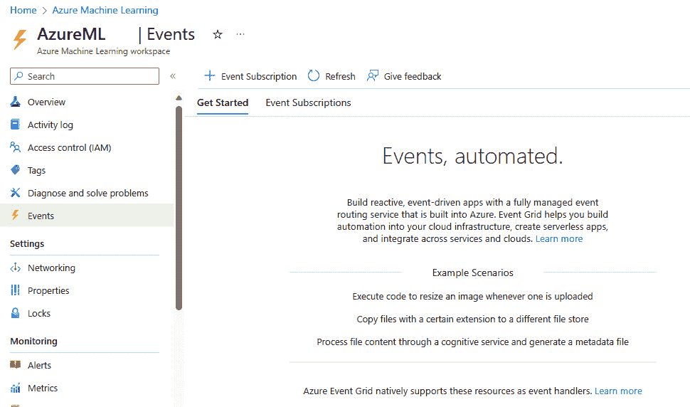

图 8.11 – 打开 AzureML 资源事件

1.  在**入门**选项卡中，如果我们向下滚动，我们可以看到哪些事件处理器是事件网格原生支持的。当然，我们总是可以创建自己的：

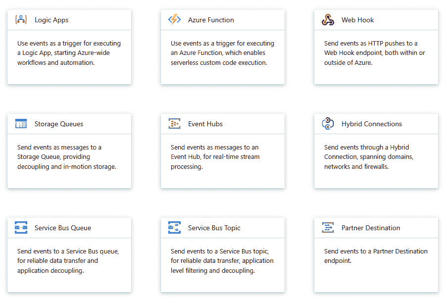

图 8.12 – Azure 事件网格处理器

1.  在页面顶部，我们可以点击**+事件订阅**来创建一个新的事件订阅。填写基本字段，仔细选择我们想要监控的事件，如下面的截图所示：

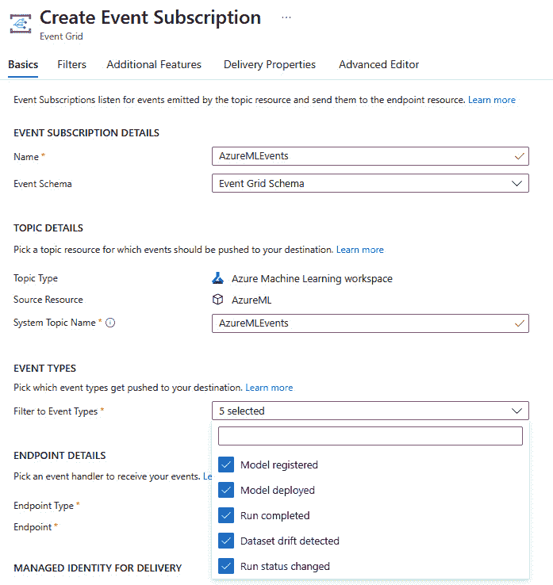

图 8.13 – 创建事件订阅

1.  然后，我们可以选择一个目的地。在这个例子中，我们将它们添加到存储队列以进行进一步处理，但请始终记住，您可以通过使用另一个服务（如 Azure Functions 或 Azure Logic Apps）来触发简单到复杂的流程。在**端点详情**下，选择**存储队列**端点类型并点击**选择****一个端点**：

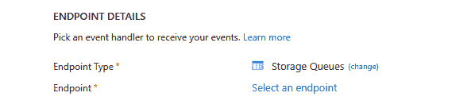

图 8.14 – 选择存储队列

1.  完成详细信息，并在提示时选择**创建新队列**并为它提供一个名称：

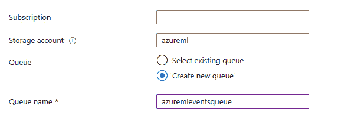

图 8.15 – 创建新队列

1.  在**交付的托管标识**下，选择**系统分配**：

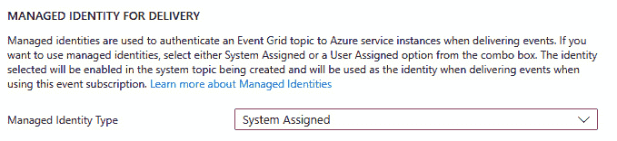

图 8.16 – 选择托管标识

1.  在**过滤器**选项卡中，您可以选择您想要的过滤器。我现在将跳过此选项卡：

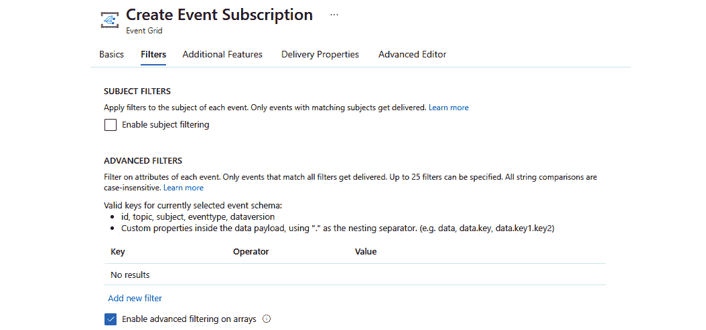

图 8.17 – 选择过滤器

1.  在**附加功能**选项卡中，选择**启用死信队列**选项是明智的，您可以选择您想要的**重试策略**和**事件订阅过期时间**值：

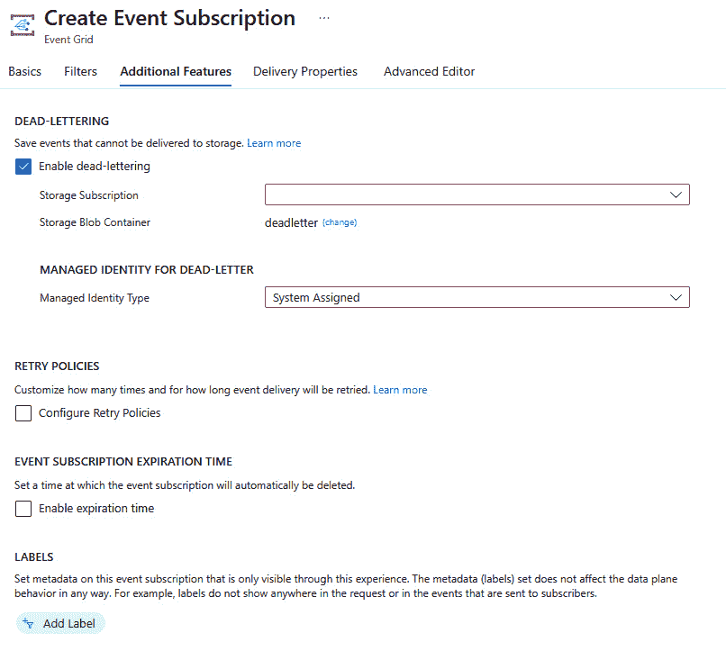

图 8.18 – 启用附加功能

1.  在**交付属性**选项卡中，选择合适的存储队列消息**生存时间**（**TTL**）。默认为**7**天：

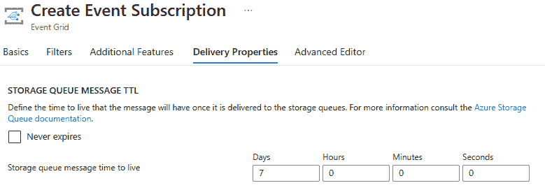

图 8.19 – 选择消息生存时间

1.  最后，点击**创建**，这样就完成了。现在，每当事件被记录到服务中时，它将被保存在存储队列中。

当然，这并不是我们拥有的唯一选项；我们可以使用多个服务作为事件处理器来捕获来自 Event Grid 的事件。让我们接下来探索那些服务。

## 在 Azure 中探索事件处理器

当使用 Event Grid 时，还有其他无缝集成的选项。在之前演示的**事件订阅**表单中的**事件类型**中，以下是我们可以选择的选项：

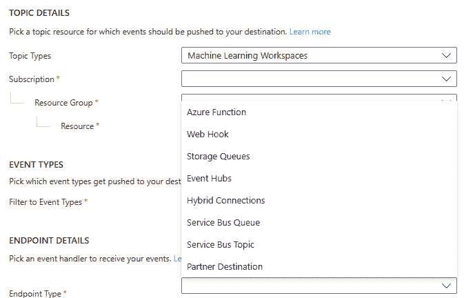

图 8.20 – Azure Event Grid 的端点选项

让我们探索一些这些服务以及它们如何与 Event Grid 协同工作：

+   **Azure Functions**：Azure Functions 是一种无服务器计算服务。它允许开发者在特定事件发生时运行代码片段（函数），而无需担心基础设施。这些函数可以用多种语言编写，包括 C#、Java、JavaScript、Python 和 PowerShell。Azure Functions 可以轻松集成 Event Grid，因为它支持 Event Grid 触发器。这意味着当事件发布时，Azure Functions 函数将自动触发并处理事件数据。

+   **Azure Logic Apps**：Azure Logic Apps 是一种云服务，它使用户能够设计和执行集成不同服务和系统的流程。这些流程可以在 Azure 内部和外部进行，连接基于云和本地系统。Logic Apps 的主要重点是集成，这使得连接不同的服务、编排数据流和自动化流程变得容易。这个描述与 Azure Functions 服务非常相似；然而，Logic Apps 需要无代码场景并提供可视化设计体验，这使得使用拖放连接器创建工作流程变得简单。当发生事件（例如，文件被添加到 Azure Blob 存储）时，Azure Event Grid 可以通知 Logic Apps 应用程序，反过来，该应用程序可以启动预定义的工作流程。

+   对 Webhook 的`POST`请求（用于执行操作）。Webhook 通常用作在网络上集成不同系统或服务的轻量级方法。Azure Event Grid 可以使用 Webhook 将事件数据发送到外部系统。本质上，外部系统通过 Webhook 订阅 Event Grid 主题，当事件发送到该主题时，Azure Event Grid 使用 Webhook 将事件数据推送到订阅者的端点。

+   **事件中心**：Azure 事件中心是微软 Azure 提供的一个大数据流平台和事件摄取服务。它每秒可以接收和处理数百万个事件，使其非常适合遥测和事件流分析场景，例如实时分析、应用程序监控和物联网遥测。事件中心本质上充当了事件管道的高度可扩展的“前门”，允许您摄取大量的事件数据，然后对其进行处理或存储。

    虽然 Azure Event Grid 和 Azure Event Hubs 都处理事件，但它们有不同的用途。Event Grid 是为跨不同 Azure 服务的事件路由和事件驱动架构而设计的。另一方面，事件中心是为高吞吐量、大规模事件流而设计的。

    在需要响应与事件中心相关的特定事件的情况下，例如创建新的事件流时，可以使用 Azure Event Grid 与 Azure Event Hubs 结合使用。

这些是 Event Grid 最常见的处理程序。然而，由于我们可以使用 Webhooks 或 Azure Functions 构建自己的处理程序，因此我们可以根据这些事件集成任何业务逻辑，包括在不想使用外部 DevOps 服务（如 Azure DevOps 或 GitHub）的情况下触发管道端点。本质上，Azure Event Grid 简化了基于事件的应用程序创建，并允许云应用程序景观更加反应灵敏和动态。

# 摘要

在本章中，我们简要介绍了 MLOps 及其在机器学习项目中的价值。通过使用 MLOps 工具和最佳实践，我们可以简化我们的机器学习任务，提高效率和协作。

尽管 MLOps 拥有从数据、模型、部署到开发的工具和实践，但我们更关注如何使用基础设施即代码（IaC）来管理我们的资源，以及如何使用 DevOps 实现持续集成和持续部署（CI/CD）。虽然使用成熟的代码开发工具提供了最常见的工作方式，但当涉及到 Azure 时，它们并非唯一的选择。由于 Azure 在其服务中收集了多个日志和事件，我们可以利用这些日志来自动化并使用其他 Azure 服务和工具创建自定义工作流程。Azure 收集的有关其服务的日志可以用于遥测和报告之外的其他用途。

让我们继续进入下一章，我们将看到如何使用 Azure Monitor 服务进行日志记录、监控和威胁检测。
