# 9

# 日志记录、监控和威胁检测

仅遵循最佳实践是不够的。威胁领域每天都在变化，对手找到新的方法来访问我们的资源。监控我们已实施的保障措施对于维护我们的安全态势至关重要。在本章中，我们将了解如何监控我们的资源，并查看我们的安全措施在防止和检测威胁方面的有效性。我们将学习 Azure Monitor 的工作原理以及如何配置日志记录、保留和通知。最后，我们将探索 Defender for Cloud 和 Microsoft Sentinel 的某些功能，这些功能可以帮助我们进一步保护资源并减轻威胁，甚至在实时中。

在本章中，我们将涵盖以下主要主题：

+   启用日志记录并配置 Azure 服务的数据保留

+   使用 Microsoft Defender 保护资源

+   使用 Sentinel 探索威胁管理

到本章结束时，我们将能够设置警报、创建分析查询、提高我们组织的网络安全态势，并了解在实时减轻威胁方面的下一步是什么。

# 技术要求

虽然本章主要涉及监控和日志记录，但在实施解决方案时，了解 **Kusto 查询语言**（**KQL**）可能会很有用。

KQL 是一种查询语言，用于查询、分析和可视化存储在 Azure Data Explorer、Azure Monitor、Microsoft Sentinel 和 Application Insights 中的大数据集。KQL 是一种强大的语言，允许您对数据进行各种操作，包括过滤、聚合、连接和可视化。

KQL 学习资源

可以在这里找到学习 KQL 的资源：https://learn.microsoft.com/en-us/azure/data-explorer/kql-learning-resources。

# 启用日志记录并配置 Azure 服务的数据保留

一旦我们创建了一个 Azure 订阅，我们就可以通过 **Azure Monitor** 服务获得完整的监控能力。这是一个我们无需启用或执行任何操作的服务，它自动对我们订阅可用。尽管它为我们提供了完整的堆栈监控和高级分析，但我们可以使用在 Azure Monitor 之上工作的服务做不同的事情。Azure Monitor 可以监控和组合 Azure、本地和其它云中的数据。

您可以通过在搜索栏中搜索 `monitor` 并点击资源来访问 Azure Monitor 服务。在这个页面上，您将看到 Monitor 提供的所有内容：

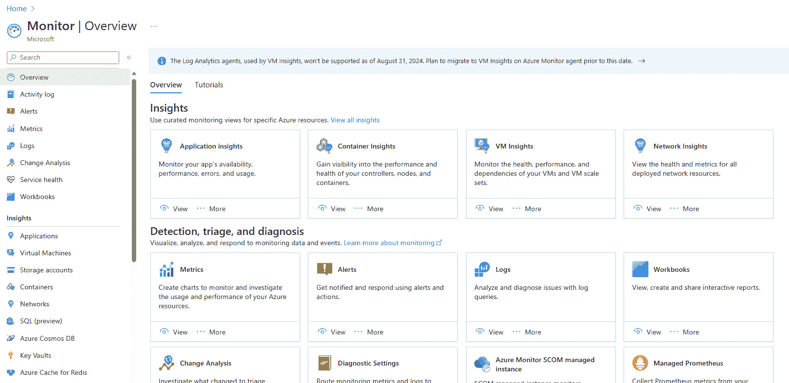

图 9.1 – Azure Monitor 概览

让我们看看 Azure Monitor 的关键组件。

## 使用 Azure Monitor

监控器收集两种类型的数据，**指标**和**日志**。指标是表示特定时间点 Azure 资源性能和健康状况的数值。这些指标提供了关于资源如何运行的实时数据，可用于监控和解决 Azure 中的应用程序和基础设施问题。Azure Monitor 收集了广泛的指标，包括性能指标，如 CPU 使用率、内存使用率、网络流量和磁盘活动。这些指标针对不同类型的资源，如虚拟机、数据库和 Web 应用程序。

Azure Monitor 中的指标在不同的时间框架内收集，具体取决于资源类型。例如，某些指标可能每分钟收集一次，而其他指标可能每小时收集一次。Azure Monitor 收集的指标也用于 Azure 自动扩展，根据需求自动调整资源组中的资源数量。数据在服务中保留 90 天。对于更长的保留期，还有其他服务，如*日志分析*或使用 Azure API 在*存储帐户*中的无限保留。

在下面的截图中，我们可以看到指标如何在图表中可视化：

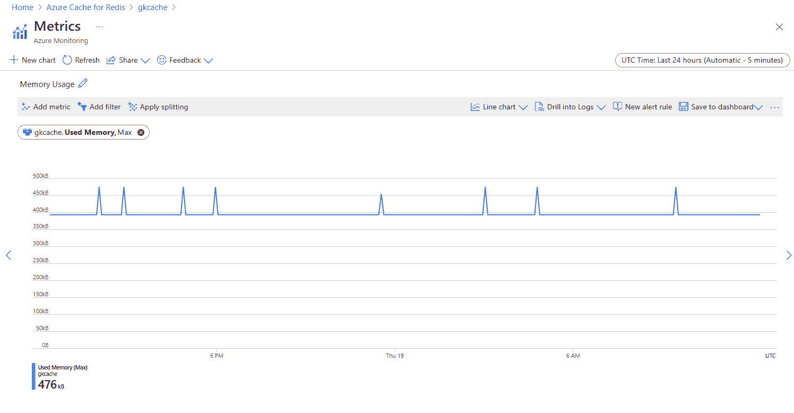

图 9.2 – Azure Monitor 指标

这些图表可以过滤和修改以显示不同的指标，可用于生成警报，并可以保存并添加到 Azure 仪表板中。

Azure Monitor 还收集日志。日志是来自您 Azure 订阅和租户中各种来源的事件记录。日志可以从广泛的来源收集，包括 Azure 资源、虚拟机操作系统、数据库、安全事件、网络事件应用程序以及使用 API 导入数据的来自外部源的自定义日志。

日志和指标在 Azure Monitor 中协同工作。您可以将指标数据与日志数据相关联，以全面了解您资源的健康和性能。我们可以通过访问**资源**选项卡并点击**活动日志**来查看每个资源的单个日志，如下面的截图所示：

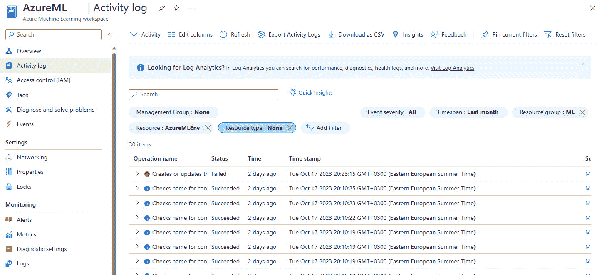

图 9.3 – Azure Monitor 日志

活动日志也可以通过 Azure 门户的主页或顶部栏中的铃声图标获取。您可以通过 Rest API 和命令行工具获取指标和日志。

当与监控或**日志分析**数据交互时，监控器还内置了 RBAC 角色。请查看以下表格截图，了解这些角色可以做什么：

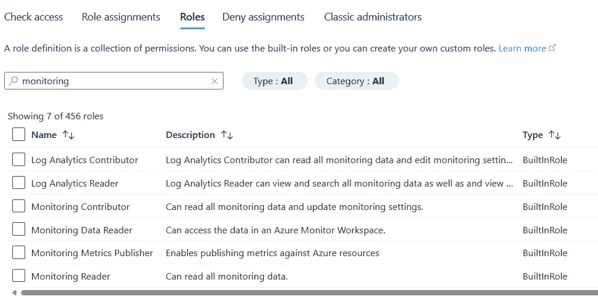

图 9.4 – Azure Monitor RBAC

接下来，让我们看看如何使用日志分析查询和从日志中获得洞察。

### 设置日志分析

如前所述，Azure Monitor 会保留数据 90 天。如果我们需要保留更长时间的数据，我们可以使用日志分析。这是一个强大的工具，可以帮助我们从多个来源收集数据，并将其保存到一个或多个工作区中，这些工作区充当日志的容器。它们为查询、视图和其他配置提供了范围。我们可以拥有多个工作区来组织和管理工作来自不同来源的日志数据。这些查询可以可视化、导出并保存以进行持续监控。Azure Monitor 日志使用 KQL 查询和分析日志数据。KQL 是一种类似于 SQL 的强大语言，专门设计用于高效查询大型数据集。它允许我们在日志上执行复杂的搜索和分析。

要开始收集日志，我们需要创建一个日志分析工作区。搜索“日志分析工作区”，然后点击**+ 创建**以创建一个新的工作区，如图所示：

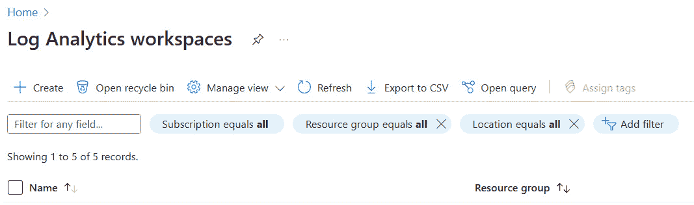

图 9.5 – Azure 日志分析工作区

在创建表单中，填写名称和其他所需信息，然后点击**审查 + 创建**按钮以部署资源。

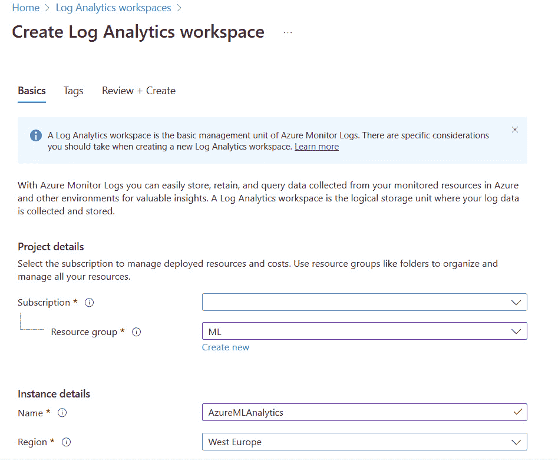

图 9.6 – 创建日志分析工作区

现在我们已经有一个日志分析工作区，我们需要的只是一些数据。在下一节中，让我们看看如何为我们的 Azure 机器学习资源启用诊断设置并将它们发送到工作区。

## 启用诊断设置

Azure 诊断设置允许我们从各种 Azure 资源收集和路由诊断数据到不同的目的地进行分析、监控和合规性。此功能有助于我们深入了解资源的性能和运行状况，并根据目标提供过滤和更大的保留时间。常见的目的地包括 Azure **存储帐户**、**日志分析工作区**和**事件中心**。我们可以同时发送数据到多个目的地。例如，我们可以将数据发送到日志分析工作区和 Azure 存储帐户，以实现冗余或不同类型的分析。

让我们在我们的 Azure 机器学习资源上启用**诊断设置**。

首先，打开您的 Azure 机器学习资源，选择**诊断设置**，然后点击**添加诊断设置**，如图下所示：

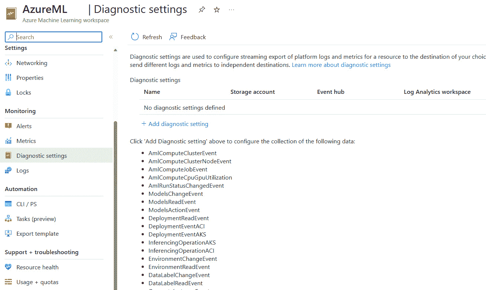

图 9.7 – 添加诊断设置

选择您感兴趣的日志类别，并点击选择目标详情。对于这个，我们将使用上一节中创建的**日志分析**资源。勾选**发送到日志分析工作区**复选框，并提供所需详情，如图下所示。然后，点击**保存**：

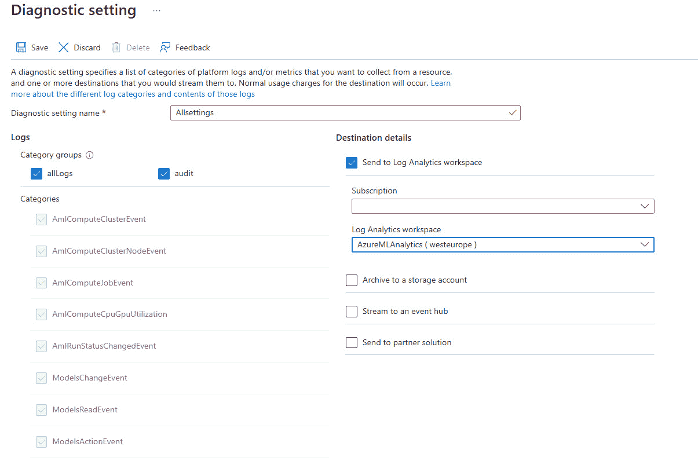

图 9.8 – 选择日志类别和目的地

我们必须启用额外的日志和更多数据的最重要原因之一是当我们的系统中发生某些事情时能够收到通知。让我们回顾如何在 Azure 监控中设置警报。

## 处理警报

警报帮助我们监控和管理 Azure 中的资源。当满足某些条件时，我们可以使用警报并接收通知，这有助于我们积极应对问题或变化。创建和使用警报涉及许多组件，让我们看看它们是什么。

我们将首先转到**监控**选项卡下的**警报**。在这里，我们可以看到按优先级触发的**警报**并创建新的警报：

n

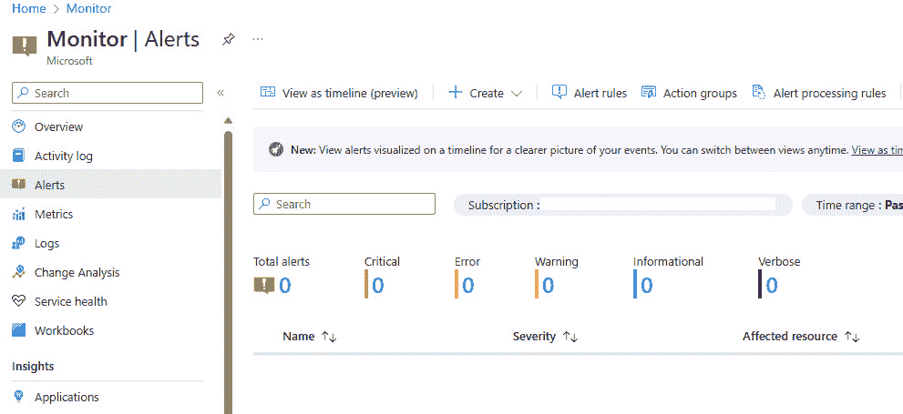

图 9.9 – 监控 | 警报

然而，在我们深入创建**警报**之前，让我们回顾操作组。

### 创建操作组

在我们创建警报之前创建操作组会更好。操作组定义了当警报触发时要执行的一组通知和操作。这可以包括发送电子邮件和短信、发起 HTTP 请求以及触发 Azure 函数。我们可以直接从警报表单创建操作组，但如果它已经存在，这会使事情更简单。

点击**创建**，然后从下拉菜单中选择**操作组**。这将带您到**创建操作组**表单。填写一些基本详情，如以下截图所示，然后点击**下一步**。

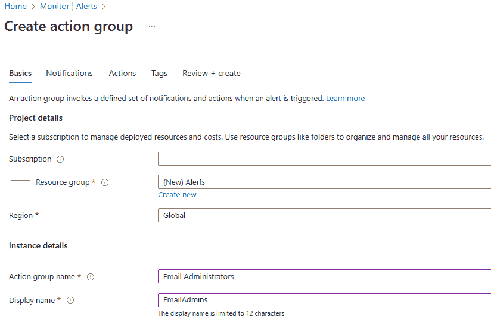

图 9.10 – 创建操作组的基本详情

接下来，在**通知**选项卡中，我们可以创建两种类型的通知 – 发送到特定角色的电子邮件或发送电子邮件/短信到特定账户/号码。我们在这里将配置这两个选项。在下拉菜单中选择**电子邮件 Azure 资源管理器角色**以显示右侧菜单。选择**所有者**作为角色，然后点击**确定**。还有其他通知角色的选项，包括**贡献者**和**读取者**。在此屏幕上，您还需要提供一个名称：

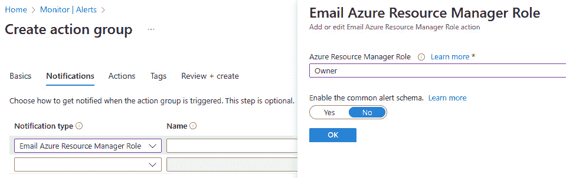

图 9.11 – 创建角色通知

在下一行，选择**电子邮件/短信消息/推送/语音**下拉菜单的第二种选项以显示右侧菜单。在这里，获取通知的最简单方法是提供一个电子邮件或向 Azure 移动应用发送推送通知；然而，还有更多可能产生额外费用的选项，例如**短信**和**语音**。检查所需的选项并提供必要的信息。例如，在**电子邮件**部分，您必须提供如这里所示的单独电子邮件：

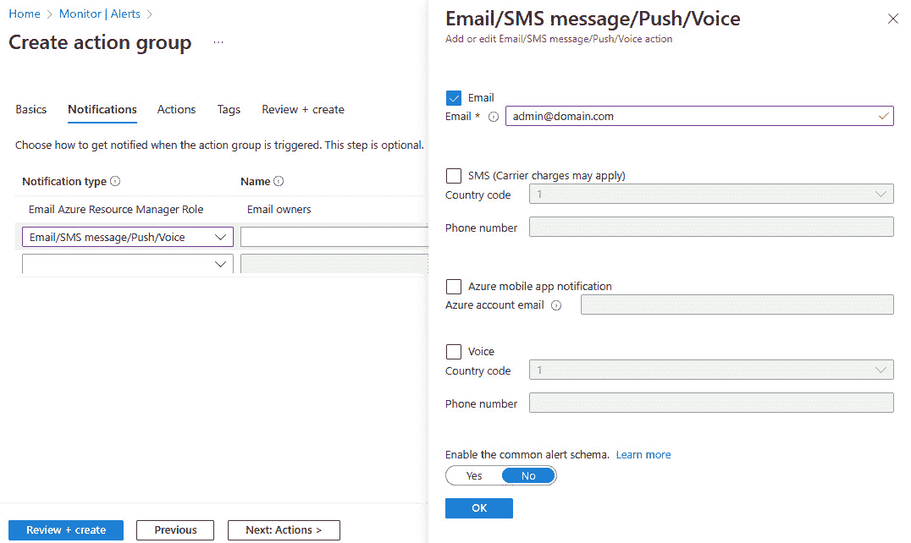

图 9.12 – 创建电子邮件通知

如果您需要更多角色或更多电子邮件，您始终可以添加更多行并相应地配置它们。这就是它的样子：

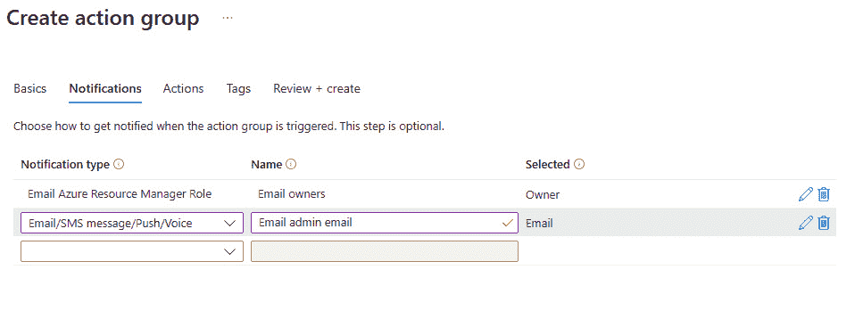

图 9.13 – 启用多个通知

完成后，点击**下一步**进入下一个标签页，**操作**。

在**操作**选项卡中，我们可以设置操作。操作不是必需的；然而，这是在一步中同时发送通知和触发其他操作的方式。我们的选项包括以下内容，如以下截图所示：


图 9.14 – 操作类型

我们将不会设置任何内容，但让我们仍然回顾一下我们的选项。其中一些我们在*第八章*中已经见过：

+   **自动化运行手册**：运行手册是自动化 Azure 中任务的一种方式。它们使用 PowerShell、Python 或图形工作流设计器构建。它们可以执行从简单脚本到涉及多个 Azure 服务的复杂工作流的各种任务。

+   **Azure Function**：这是一个无服务器计算服务，允许我们在不显式配置或管理基础设施的情况下运行由事件触发的代码。

+   **事件中心**：这是设计用来收集、处理和分析大量事件或数据流。事件中心可以每秒处理数百万个事件，使其成为处理高吞吐量数据流的强大工具。

+   **ITSM**：这是一种将 Azure Monitor 警报与 IT 服务管理（**ITSM**）工具（如 ServiceNow 或 System Center Service Manager）集成的方法。它允许在您的警报中满足特定条件时，在您的 ITSM 系统中自动创建事件或工单。

+   **逻辑应用**：这是一个基于云的工作流自动化平台，使您能够使用可视化设计器和连接器自动化和集成不同应用程序和服务中的各种任务和业务流程。

+   **安全 Webhook**/**Webhook**：应用程序提供其他应用程序实时信息的另一种方式是通过使用 webhook。

这些都是在**操作**下的所有选项。根据具体情况，我们可能需要多个操作组，一旦我们设置了这些操作组，我们就可以开始创建警报规则。

### 创建警报规则

要创建一个新的警报规则，点击**创建**，然后在下拉菜单中选择**警报规则**。这将带我们到**创建警报规则**表单：

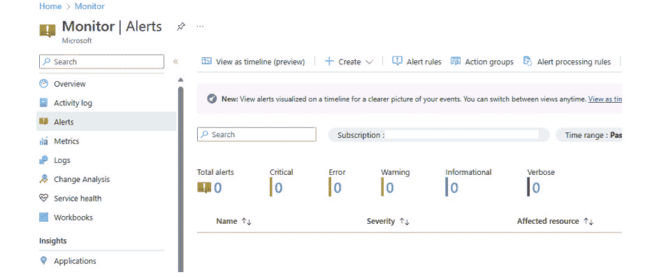

图 9.15 – 警报选项卡

第一步是选择规则的范围。这可以是一个订阅、一个资源或一个资源组。在这里，我们可以选择 Azure 机器学习资源。

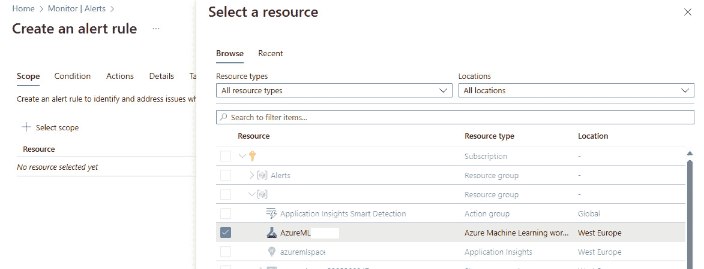

图 9.16 – 选择范围

在第二个选项卡中，我们可以选择**条件**。有不同的条件类型：

+   **基于 Azure 资源发出的指标**：例如，您可以将警报设置为当 CPU 使用率超过某个阈值时触发。

+   **基于对资源的操作**：例如，你可以设置一个警报，当发生特定类型的操作时触发，例如虚拟机的删除

+   **基于对 Azure Monitor Logs 收集的数据的日志查询**：你可以创建复杂的查询来定义警报的条件

在这里，转到**选择信号**下拉菜单，并选择**所有管理操作**选项。这将发送任何对 Azure 机器学习资源的行政变更警报：

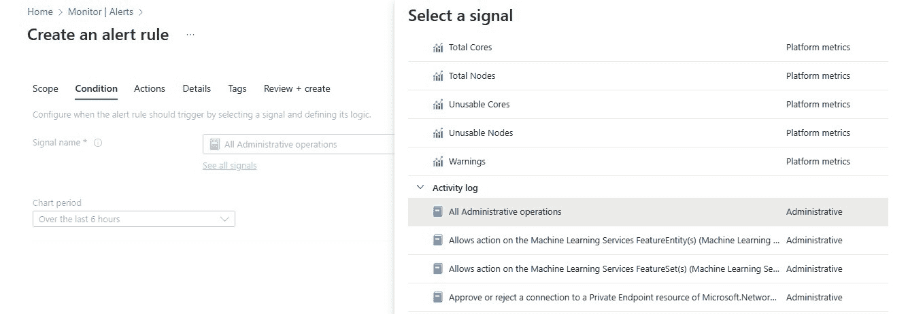

图 9.17 – 选择信号

根据信号的不同，你可能会有更多选项，例如频率，但在这里，我们只有关于**警报逻辑**的少数几个选项，如下面的截图所示。保留默认值并点击**下一步**：

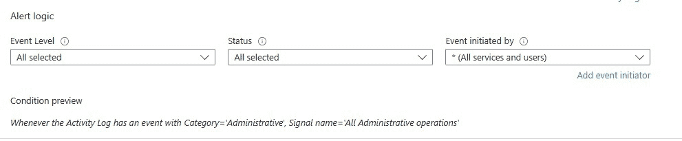

图 9.18 – 警报逻辑

在**操作**选项卡中，选择我们之前创建的操作组并点击**下一步**：

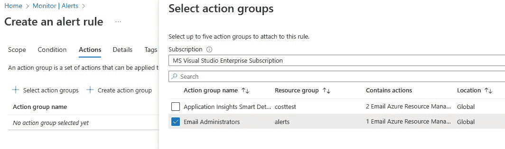

图 9.19 – 选择操作组

在**详细信息**选项卡中，我们可以填写一些基本详情以确保我们能在列表中识别出警报，如下面的截图所示：

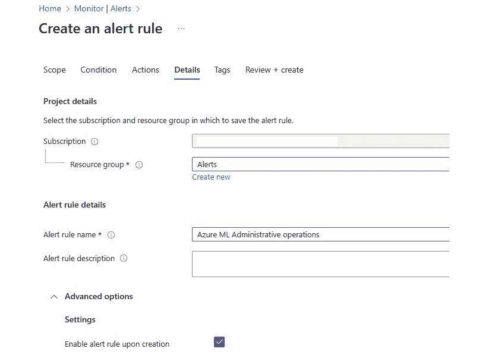

图 9.20 – 警报名称和描述

现在我们已经完成了配置，我们只需要等待警报触发。

在下一节中，我们将看到如何管理多个警报。

### 管理警报

当事件触发时，你将根据你设置的操作组收到通知。另一种监控警报的方法是从**监控**选项卡中的**警报**菜单，如下面的截图所示，我们可以看到事件正在触发。警报可以根据资源或严重性进行筛选：

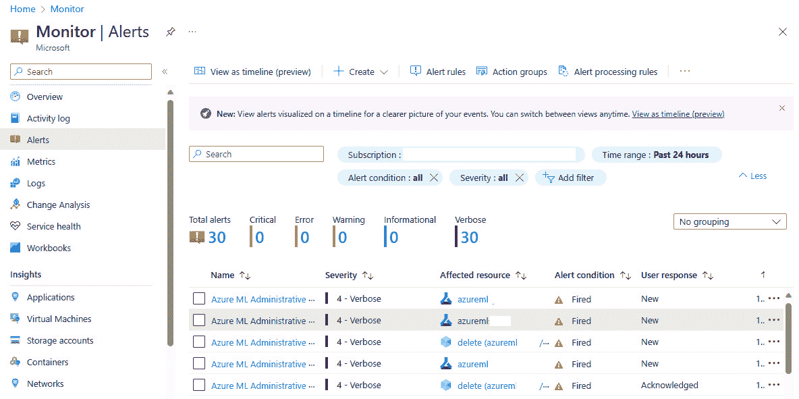

图 9.21 – 触发的警报

为了确保不是每个人都处理同一个警报，我们可以通过点击右侧的三点菜单，从**新建**切换到**已确认**或甚至**关闭**，来更改此警报的用户响应，如下面所示：

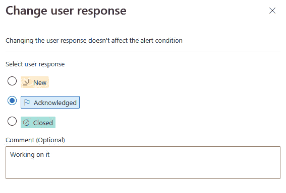

图 9.22 – 更改用户响应

记住，Azure Monitor 警报是维护你的 Azure 资源健康和性能的关键部分。正确配置的警报可以帮助你保持积极主动地管理资源，并迅速响应任何问题。尽管在本章中我们将看到更多监控资源的方法，但这是最快、最简单的方法来开始。

现在，让我们看看如何使用 Application Insights 监控我们的模型和端点。

## 使用 Application Insights

当我们创建工作区时，其中一个相关资源是**应用洞察**。应用洞察在 Monitor 之上工作，提供对应用程序的实时监控。它跟踪各种指标，如请求率、响应时间、失败率和依赖关系。这有助于你识别性能瓶颈、错误和异常。应用洞察可以帮助我们排查部署在**Azure Kubernetes 服务**（**AKS**）或**Azure 容器实例**（**ACI**）中的 ML 端点。应用洞察收集以下信息：

+   异常

+   响应

+   输出数据

+   请求率、响应时间和失败率

+   依赖率、响应时间和失败率

让我们看看如何通过 Azure 机器学习 Studio 或 SDK 启用洞察。

### 通过 Studio 和 SDK 配置日志

在*第一章*中，我们将一个模型部署到了 ACI 端点。在模型部署界面，要启用应用洞察，我们只需展开**高级**下拉菜单并勾选**启用应用洞察诊断和数据收集**复选框，如图所示：

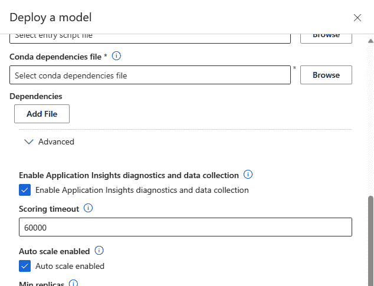

图 9.23 – 模型部署高级设置

现在，在部署之后，我们将获得关于此端点的洞察。如果你已经在使用 SDK，过程可能更简单。根据服务不同，你只需将`enable_app_insights`标志设置为`true`或`false`来分别启用或禁用日志记录。

首先，我们需要获取 Web 服务的引用，然后更新标志，如下面的代码片段所示：

```py
From azureml.core.webservice import Webservice
# reference the web service
my_web_service= Webservice(workspace, "service-name")
# update the enable_app_insights flag
my_web_service update(enable_app_insights=True)
```

然后，我们可以在**应用洞察**资源视图中查看结果：

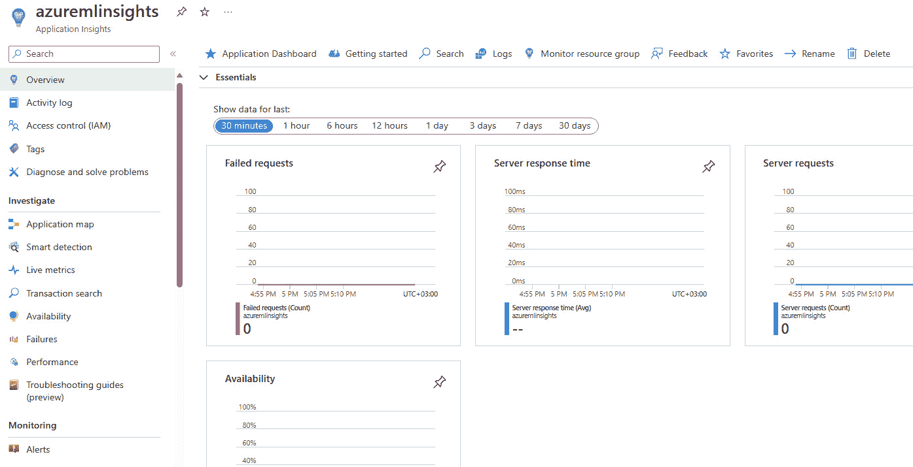

图 9.24 – 应用洞察

在这里，除了可用的日志和指标外，我们还可以与 DevOps 集成，创建实时指标流，并跟踪用户和会话，以及依赖的应用和服务。通过点击**日志**，我们可以运行日志分析查询。

这里是一个简单的 KQL 查询的示例：

```py
requests
| where timestamp > ago(24h) // Filter for requests in the last 24 hours
| where resultCode !startswith "2" // Filter for non-2xx status codes
| project timestamp, name, url, resultCode, operation_Id, duration, client_Type
| order by timestamp desc
```

让我们分析一下查询：

+   `requests`：这是包含所有发送到你的应用程序的 HTTP 请求信息的表。

+   `where timestamp > ago(24h)`：这一行筛选出过去 24 小时内发生的请求。你可以根据需要调整时间范围。

+   `where resultCode !startswith "2"`：这一行用于筛选那些`resultCode`不以`2`开头的请求。这实际上筛选出了非`2xx`状态码的请求，通常表示错误。

+   `project`：这用于选择要在结果中显示的特定列。你可以根据需要调整它以包含更多或更少的列。

+   `order by timestamp desc`：这一行按时间戳降序排序结果，以便首先看到最新的错误。

此查询将为您提供有关导致错误的最近请求的信息，包括时间戳、请求名称、URL、状态码、操作 ID、持续时间以及客户端类型等详细信息。根据我们需要监控的内容，我们可能需要更改查询以适应适当的表。除此之外，我们还可以将自定义异常添加到日志中。

### Application Insights API 用于自定义事件和指标

要将数据摄取或发送到应用程序洞察资源，请确保您熟悉此处提供的可用 API 和 SDK：[`learn.microsoft.com/en-us/azure/azure-monitor/app/api-custom-events-metrics`](https://learn.microsoft.com/en-us/azure/azure-monitor/app/api-custom-events-metrics)。Application Insights 还提供了一个仪表板来监控一切。

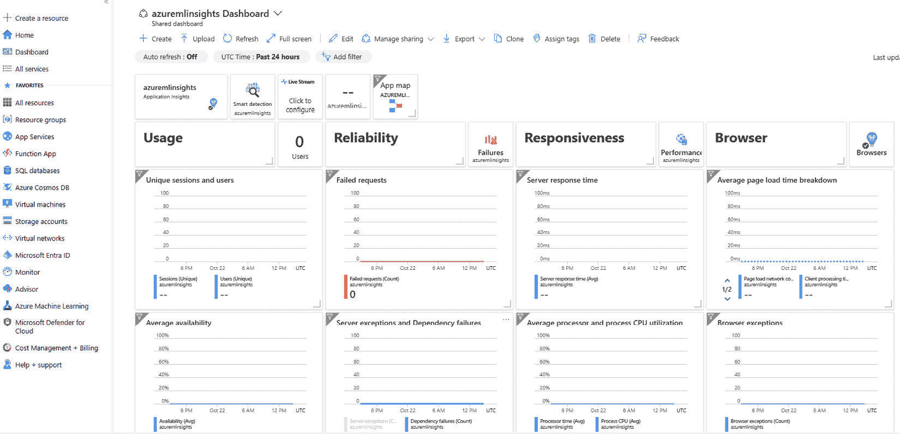

图 9.25 – Application Insights 仪表板

我们可以从 Application Insights 资源的**概览**选项卡访问此仪表板。我们所需做的只是点击**应用程序仪表板**以打开仪表板视图（如图 9.24 所示）。

创建 Azure 仪表板

要了解更多关于 Application Insights 仪表板的信息，请阅读此文档：[`learn.microsoft.com/en-us/azure/azure-monitor/app/overview-dashboard`](https://learn.microsoft.com/en-us/azure/azure-monitor/app/overview-dashboard)。

要了解如何一般地使用 Azure 仪表板，请参阅此处：[`learn.microsoft.com/en-us/azure/azure-portal/azure-portal-dashboards`](https://learn.microsoft.com/en-us/azure/azure-portal/azure-portal-dashboards)。

仪表板也可以通过使用模板编程创建。更多详细信息请在此链接中查找：[`learn.microsoft.com/en-us/azure/azure-portal/azure-portal-dashboards-create-programmatically`](https://learn.microsoft.com/en-us/azure/azure-portal/azure-portal-dashboards-create-programmatically)。

Application Insights 旨在帮助开发者监控其应用程序的性能和用法，识别和诊断问题，并深入了解用户如何与我们的应用程序互动。它在 Azure 机器学习中非常有用，因为它可以监控您的端点，并且通过使用连接字符串，我们还可以从我们的应用程序中收集日志。

日志和指标可能难以阅读，但在大数据集中，可视化它们则更为容易。让我们看看一些我们可以用来可视化从 Azure Monitor 收集的指标和日志的方法。

## 数据可视化

要可视化 Azure Monitor 中的数据，我们有各种工具和技术。让我们在这里看看其中的一些。

+   **仪表板**：Azure 仪表板允许我们在单个视图中组合多个可视化（如图表、表格和其他小部件）。我们可以将 Azure Monitor 日志中的可视化固定到仪表板上，以便于访问和监控。仪表板还可以设置为 Azure 门户的起始页面，这样我们就可以立即看到它们。

+   **工作簿**：Azure 工作簿提供了一种灵活且可定制的可视化 Azure 监控日志数据的方法。它包括一系列预构建的工作簿模板，适用于常见的场景，如虚拟机，可以根据我们的具体需求进行定制。工作簿可以与团队成员共享，并安排定期更新。

+   **日志分析语言**：您可以使用 Azure 日志分析查询语言编写查询，以从您的日志中检索特定数据。一旦您有了数据，您可以使用可视化功能将其以图形格式显示。

+   **PowerBI**：Power BI 可以连接到 Azure 监控日志，并帮助您创建更复杂和交互式的可视化。

Azure Monitor 是维护您的 Azure 基础设施和应用程序健康和性能的关键工具。它对于在云中运行关键任务应用程序的企业尤其有价值，因为它有助于快速识别和解决问题，优化资源利用，并确保流畅的用户体验。

现在，让我们看看一些其他工具，这些工具可以帮助我们监控资源，并提供安全建议。

# 使用微软防御来保护资源

**微软云防御**是一个专为云环境设计的**云原生应用程序保护平台**（**CNAPP**）。它提供了一套全面的安保措施和最佳实践，旨在保护基于云的应用程序免受各种网络攻击和漏洞的侵害。微软云防御结合了多个功能，包括一个专注于基础设施、存储等方面的**云工作负载保护平台**（**CWPP**），一个用于预防安全问题的**云安全态势管理**（**CSPM**）解决方案，以及一个**DevSecOps**解决方案，如果需要，它可以帮助在不同云环境中保护代码。防御器包括一个无需额外费用的基本 CSPM。您可以在其基础上启用高级功能，包括攻击路径分析、云安全探索器、高级威胁搜索、安全治理以及评估您在特定行业和地区适用的监管标准下的安全合规性的工具。

微软云防御定价

您可以在此处查看防御器的定价和功能：[`azure.microsoft.com/en-us/pricing/details/defender-for-cloud/?v=17.23h`](https://azure.microsoft.com/en-us/pricing/details/defender-for-cloud/?v=17.23h)。

让我们了解这项服务，看看我们如何利用它来增强我们的 Azure 机器学习资源。

以下是在顶部搜索框中“云防御”的主要选项卡：

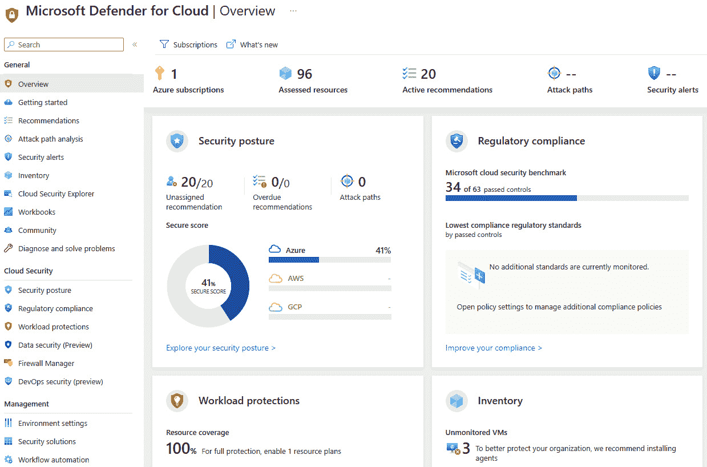

图 9.26 – 微软云防御

初看之下，我们可以看到我们工作负载的**安全态势**安全分数，这是基于我们资源中实施的安全推荐；我们的**合规性**分数，基于应用的政策；我们的**工作负载保护**百分比；以及监控资产的清单。屏幕上还有其他关于 Defender 的文章和公告。

让我们看看如何利用提供的信息来保护我们的 Azure 机器学习资源。

## 提升我们的安全态势

第一件事是点击**安全态势**以查看提高我们安全分数的推荐。安全分数是一个指标，它评估并分配一个分数来衡量您的 Azure 资源和工作负载的安全状态。分数越低，您的资源就越少遵循安全推荐。为了提高我们的分数，我们需要为我们的每个资源实施推荐。

注意在下面的屏幕截图中，安全态势评估针对的是 Azure、**亚马逊网络服务**（**AWS**）和**谷歌云平台**（**GCP**）。您可以将您的分析连接起来，创建一个统一的安全面板。

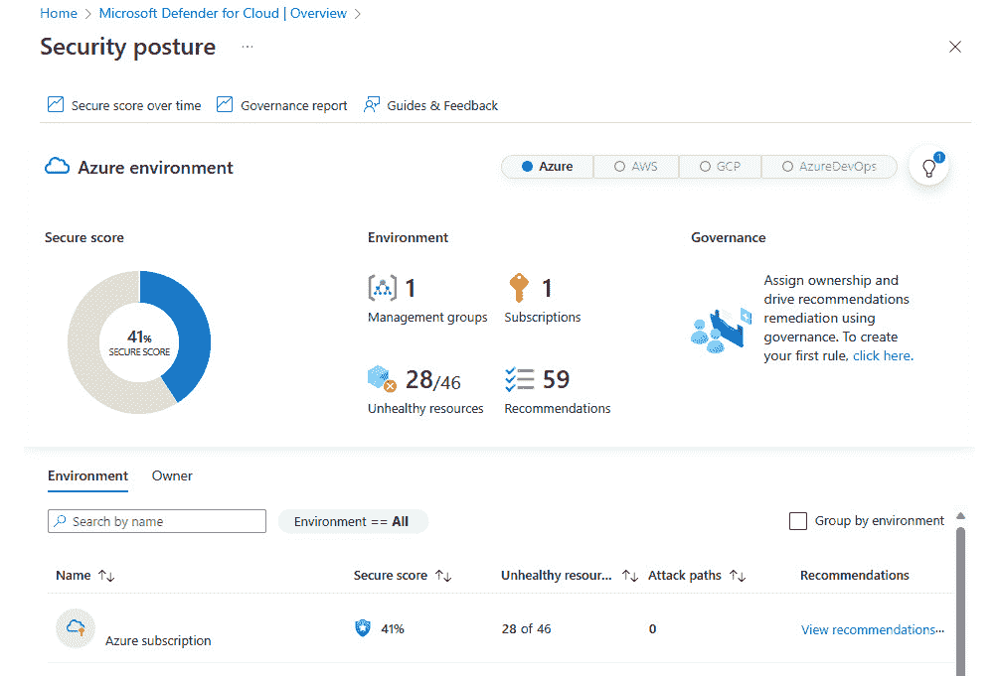

图 9.27 – 安全态势

要开始查看推荐，请点击**查看推荐**链接下的您的订阅。

然后，我们可以看到我们所有资源的推荐：

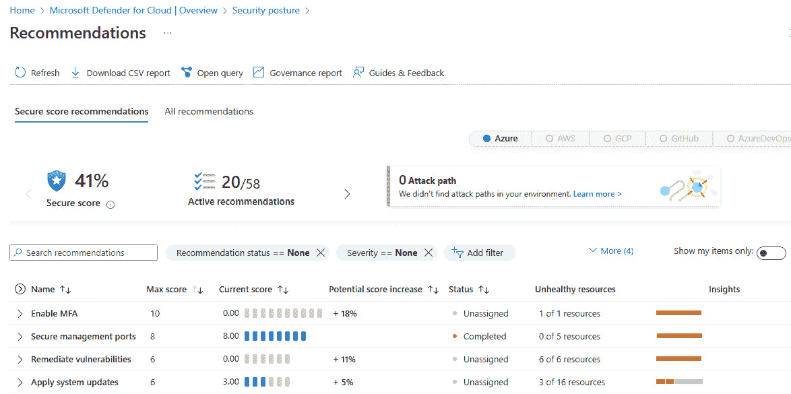

图 9.28 – 推荐项

要专注于 Azure 机器学习推荐，请适当筛选此列表。由于我的 ML 资源位于同一资源组中，我将通过**资源组**进行筛选，包含我的 Azure 机器学习工作区和相关服务：

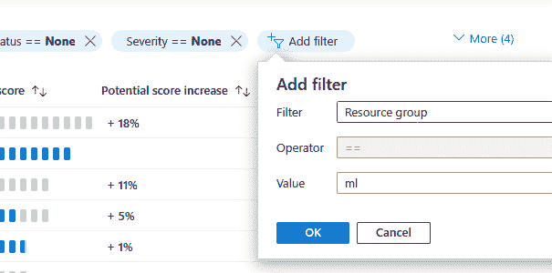

图 9.29 – 向资源组添加过滤器

对于每项推荐，我们可以看到实施方式将如何提高我们的分数。每个类别下的所有推荐都必须实施，才能获得上述分数提升。例如，**应用系统更新**推荐在下面的屏幕截图中只有一个操作，但实施将提高我们的分数**5%**。要实施推荐，您可以点击链接查看更多信息：

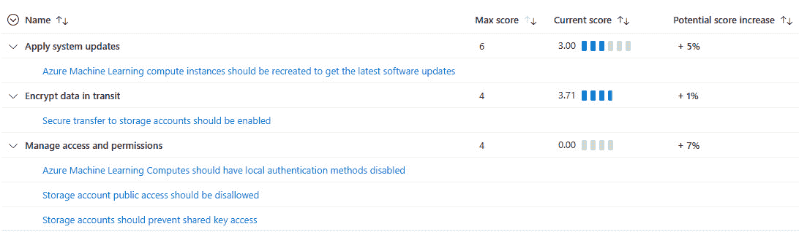

图 9.30 – 安全态势推荐

在这里，我们可以看到问题严重性、描述、修复步骤以及受影响的资源。然后我们可以手动进行并按照指示更新资源：

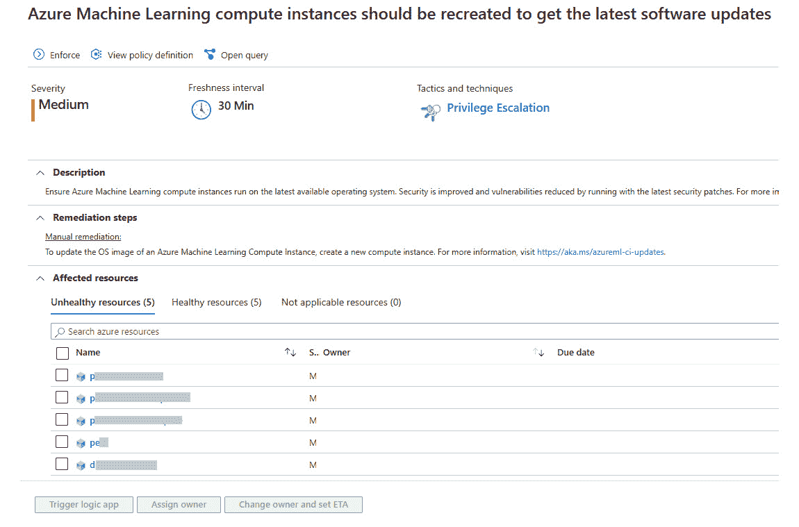

图 9.31 – 推荐修复

我们甚至可以通过点击之前屏幕截图中的**强制执行**按钮来在未来强制执行此操作，这将把这个推荐作为一项策略分配。

类似地，我们可以在 Azure Machine Learning 实例和订阅中的任何其他资源中实施安全建议。这些建议是 Azure 安全基线的一部分，我们将在*第十章*中更详细地分析，我们将使用安全最佳实践为我们的 Azure Machine Learning 环境创建安全基线。

现在，让我们探索 Microsoft Sentinel，以帮助我们确保和自动化对安全事件的响应。

# 使用 Sentinel 探索威胁管理

Microsoft Sentinel 是一个云原生 **安全信息和事件管理**（**SIEM**）和**安全编排、自动化和响应**（**SOAR**）解决方案。它为 Azure 和其他云提供集中的智能安全分析和威胁情报。使用 Sentinel，我们可以在一个面板中实现智能警报检测、威胁可见性、狩猎和响应。使用 Sentinel 进行上述任务有以下几个好处：

+   作为云解决方案，它随着我们的数据扩展，我们只为使用的内容付费。

+   Microsoft Sentinel 使用来自广泛来源的连接器收集数据，包括 Azure 服务、本地环境和其他云。

+   该服务内置了帮助识别可疑活动和减少误报的 ML 模型。随着时间的推移，这些模型可以根据您组织的独特模式进行训练，以提高其准确性。

+   使用 KQL 进行威胁狩猎，以识别威胁、异常和模式，并提供模板以帮助您开始。

+   除了检测之外，Microsoft Sentinel 还允许您自动化常见任务和响应。这可以帮助组织更快地响应威胁。

+   我们可以使用工作簿来可视化数据，并帮助团队深入挖掘数据，发现模式，更好地理解安全态势。

+   Microsoft Sentinel 提供从识别到调查再到修复处理事件的工具。

+   默认数据保留期为 30 天，但可以增加到 90 天。

要与 Sentinel 一起工作，我们需要一个 Log Analytics 工作区来收集日志。请参考本章前面的部分以创建一个新的 Log Analytics 工作区。创建工作区后，您可以将 Microsoft Sentinel 添加到工作区。在 Azure 门户的搜索栏中查找 `Microsoft Sentinel`，在加载的页面上点击 **创建**。

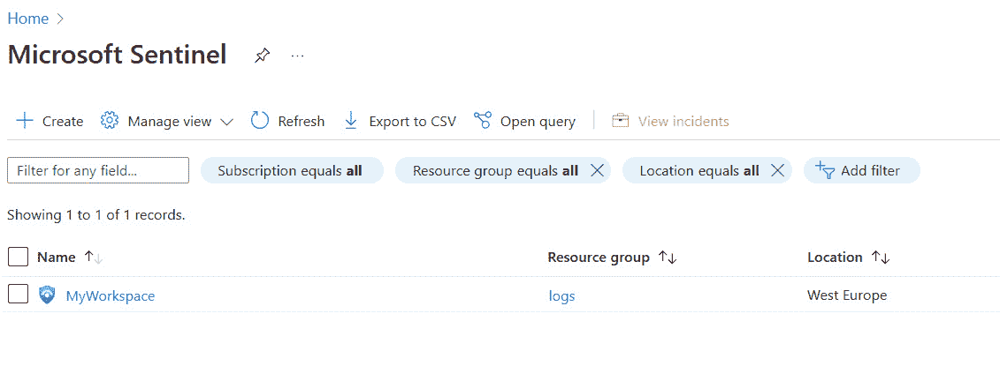

图 9.32 – Microsoft Sentinel

在下一步中，**将 Microsoft Sentinel 添加到工作区**，选择之前创建的工作区，如图 9.33 所示的下一张截图。

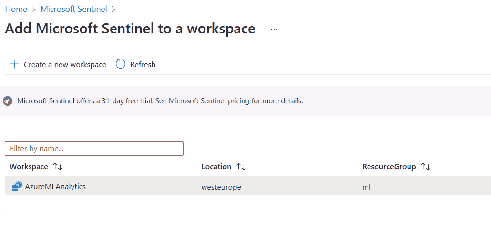

图 9.33 – 将 Sentinel 添加到工作区

一旦添加了工作区，您就可以利用 Sentinel 的威胁管理功能。这是 Sentinel 的主页面。您需要用于威胁管理的所有内容都可以在左侧菜单中找到。

让我们探索 Microsoft Sentinel 最有用的功能：

+   **事件**：在 Microsoft Sentinel 中，事件是相关警报的集合，代表系统内可能有害的活动或模式。它们提供了一个综合的视图，以帮助安全分析师估计潜在攻击的范围和顺序。Microsoft Sentinel 中的事件配备了涉及实体、相关警报的时间线和其他相关细节等信息。事件允许安全团队关注更广泛的事件，而不是单个警报，有助于根据相关警报的综合严重程度优先响应。

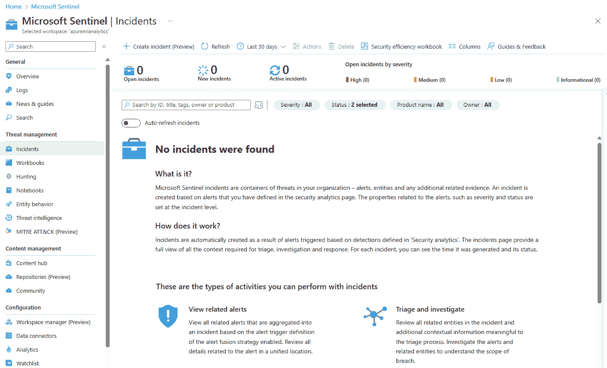

图 9.34 – 事件

+   **搜索**：在 Microsoft Sentinel 中，搜索是指主动查询和对数据的探索，以识别可能没有触发自动警报的恶意或可疑活动的迹象。我们可以运行预定义或自定义的 KQL 查询来过滤收集的数据，寻找异常或感兴趣的模式。目标是发现隐藏的威胁，识别以前未注意到的模式，并加强检测能力。

    要访问搜索查询，请点击**搜索**。创建搜索的过程很简单。从主页点击**新建搜索**。

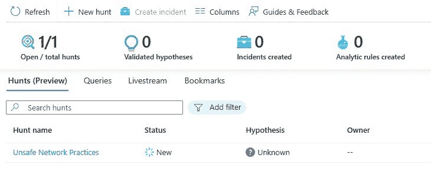

图 9.35 – 搜索查询

提供一个*名称*和必要时的更多信息，然后点击**创建**。

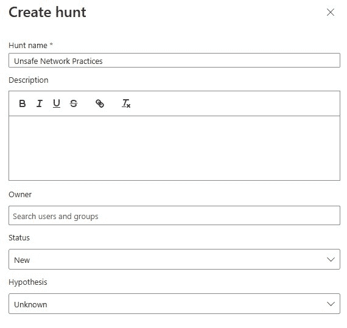

图 9.36 – 新建搜索

一个搜索由一个或多个查询组成。要添加您的查询，点击您刚刚创建的搜索名称，在**查询操作**下，您可以选择**新建查询**或**将查询添加到搜索**以从现有查询中选择。查询是用 KQL 编写的。

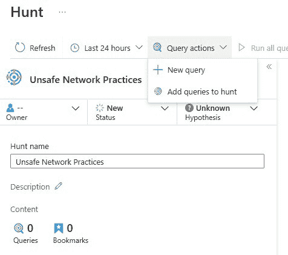

图 9.37 – 添加查询

我选择了后者，并从列表中选择了这两个查询，如下一张截图所示。

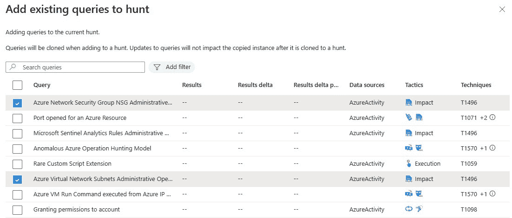

图 9.38 – 添加现有查询

现在，您可以通过运行这些查询来验证您的假设并发现疑似威胁。发现后，我们可以在搜索页面上直接创建事件。

+   **威胁情报**：Microsoft Sentinel 中的威胁情报涉及利用有关现有和新兴威胁和漏洞的信息。Microsoft Sentinel 与 Microsoft Defender 的威胁情报集成，提供有关已知恶意 IP 地址、URL、文件哈希等信息。当这些数据与您环境中的活动匹配时，Sentinel 可以发出警报。威胁情报的集成允许组织将其实时数据与已知威胁指标进行交叉引用，提高潜在安全漏洞的检测，并了解更广泛的威胁格局。

这些只是基础知识。Sentinel 集成了多个微软服务，例如云端的 Defender 和 Microsoft 365，因此具有很多功能。要提升 Sentinel 的技能，请查看以下资源，从学习路径到认证。

开始使用 Microsoft Sentinel

要开始使用 Microsoft Sentinel，请查看以下学习路径：[`learn.microsoft.com/en-us/azure/sentinel/skill-up-resources`](https://learn.microsoft.com/en-us/azure/sentinel/skill-up-resources)。

# 摘要

在本章中，我们学习了如何利用多个服务，通过启用不同的服务并学习如何开始使用我们收集的日志来预防安全事件，从而有效地监控我们的资源。我们首先使用的是 Azure Monitor，通过监控警报来确保我们能够被通知任何问题。通过结合 Monitor Log Analytics 和 Application Insights 的功能，我们可以对我们的资源和模型端点进行端到端监控。此外，通过使用 Microsoft Defender for Cloud，我们可以获得实施最佳实践的推荐，并且可以使用 Microsoft Sentinel 进行高级威胁管理。现在，我们已经对包含在机器学习项目中的不同表面区域内的最佳实践有了全面的了解，我们可以在下一章中结合它们，看看我们如何为 Azure 资源建立一个安全基线。

# 第四部分：Azure 机器学习中企业安全最佳实践

在本部分中，您将回顾本书中概述的最佳实践，并探索更多可用于进一步保护云资源的服务。您还将看到一个包含所有这些实践的示例解决方案架构。最后，您将学习如何与威胁建模合作，制定策略以保持相同的保护水平并在未来保持安全。

本部分包含以下章节：

+   *第十章**，为您的 Azure 机器学习工作负载设置安全基线*
