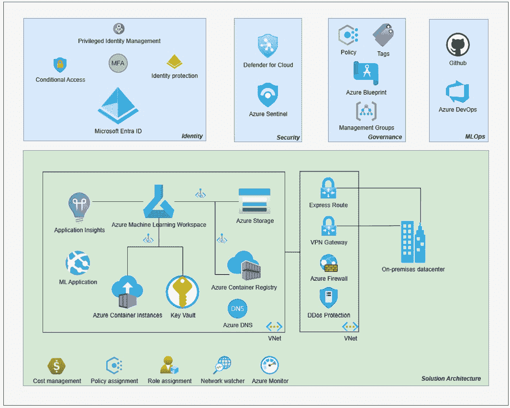
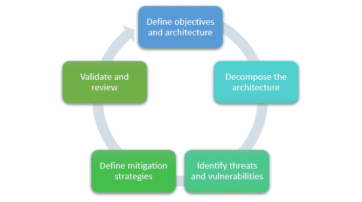
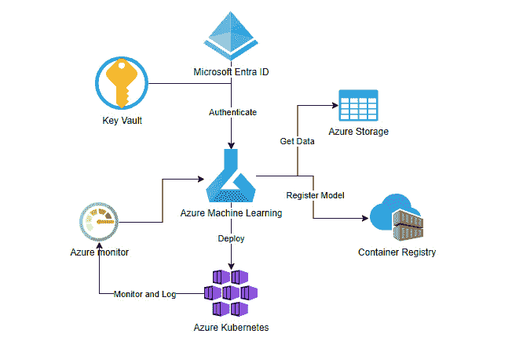
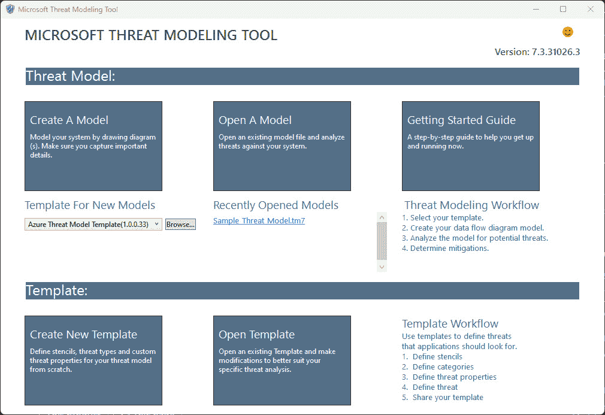
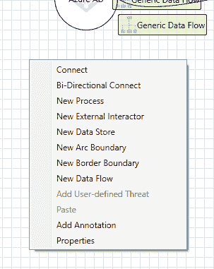
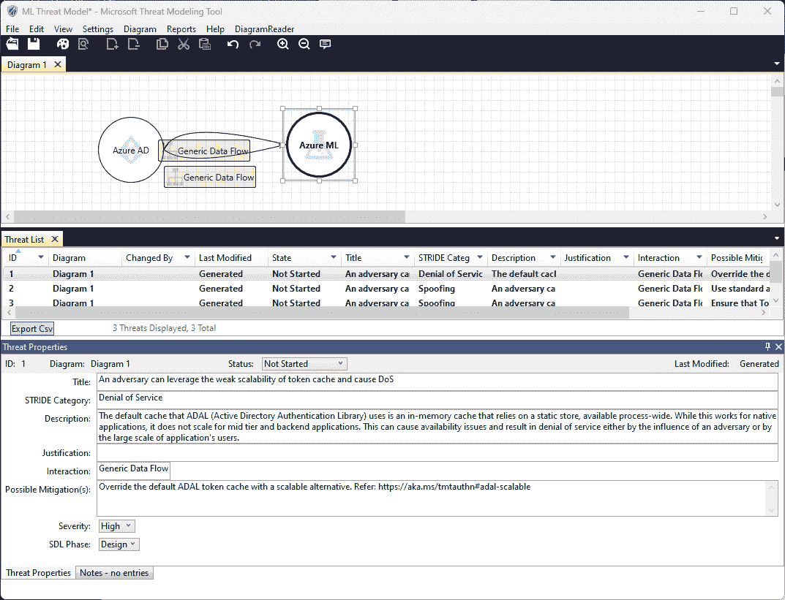
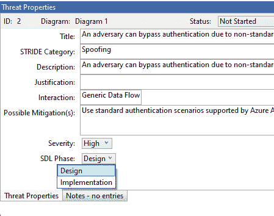
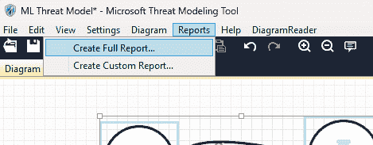
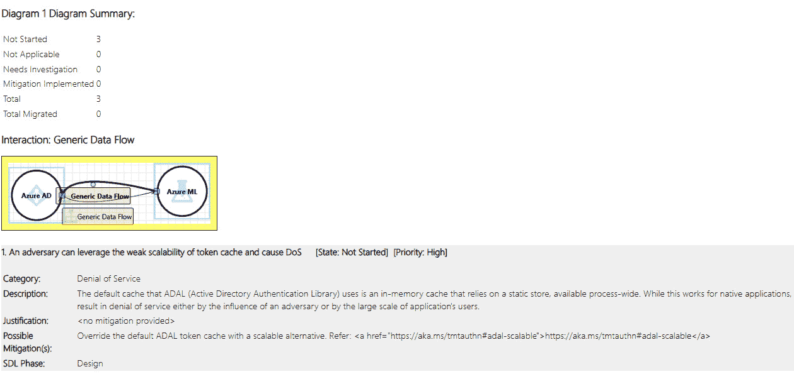
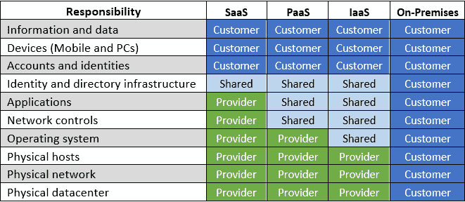

# 10

# 为您的 Azure 机器学习工作负载设置安全基准

在本章中，我们将总结本书中概述的所有最佳实践，从始至终为您的机器学习工作负载创建安全基准，以帮助您制定安全策略。我们将主要关注 Azure 服务，正如本书其他部分所做的那样。当然，总有更多的事情需要考虑，例如代码或应用程序安全，但这些不是本书的重点。

我们将回顾一些其他服务，尽管它们与 Azure 机器学习没有直接关系，但考虑它们对于提高我们 Azure 服务的整体安全性是有用的。当涉及到安全时，我们可以使用威胁建模来确保我们已识别和缓解的任何做法都持续维护和更新，以适应过去和新的安全建议，只要这些服务在运行。最后，我们将回顾云责任模型，以便我们始终记住某些任务是我们负责正确实施的任务。尽管 Azure 提供了许多工具和安全控制，但正确配置它们的责任在我们身上。

在本章中，我们将涵盖以下主要主题：

+   为 Azure 机器学习设定基准

+   Azure 机器学习的威胁建模

+   审查云安全共享责任模型

到本章结束时，我们将学习如何为我们的 ML 项目创建基准，并基于流行的框架制定威胁建模策略。

# 为 Azure 机器学习设定基准

在本书的整个过程中，我们已经看到了多个服务，并探索了多种方法来保护 Azure 机器学习工作空间及其在 Azure 中的相关服务。所有这些最佳实践都是建议的最佳实践的一部分。当我们专注于保护我们的工作负载时，建立安全基础来指导我们的努力是至关重要的。安全基准是我们需要为系统实施的最小安全控制集。让我们再次回顾保护在 Azure 机器学习中运行的工作负载所需的最小要求，这是我们已经在本书中概述过的，并学习如何通过使用其他服务进一步扩展此功能。

让我们回顾一下本书中提到的基于零信任模型的 Azure 机器学习最佳实践基准：

+   保障身份（*第六章*）：

    +   使用 Microsoft Entra ID 最佳实践：

        +   在用户账户中启用**多因素认证**（**MFA**）

        +   在服务上使用多个管理员

    +   规划**基于角色的访问控制**（**RBAC**）并使用最小权限原则

    +   当可能时，与应用程序身份和管理身份一起工作

    +   启用条件访问

    +   为 RBAC 启用特权身份管理

    +   通过利用 Azure Key Vault 防止密钥和秘密泄露

+   保护数据（[*第三章、第四章和第五章*]）：

    +   发现、分类和标记敏感数据

    +   制定公司级数据治理策略

    +   在静止状态下加密数据

    +   在传输中加密数据

    +   当可用时，使用客户管理的密钥进行加密

    +   在 Azure Key Vault 中确保密钥管理的安全性

    +   在可能的情况下使用证书

    +   仅使用来自信誉良好的来源的批准和安全的数据集

    +   通过使用策略保持合规

+   保护基础设施和端点（*第七章*）:

    +   保持更新并禁用计算实例中的公共访问

    +   在计算集群中禁用公共访问

    +   在容器注册库和容器中禁用公共/匿名访问

    +   遵循外部计算（AKS、ACI）的最佳安全实践

+   网络安全（*第七章*）:

    +   禁用公共网络访问

    +   使用服务或私有端点

在零信任类别之外，我们还讨论了以下最佳实践：

+   制定备份和恢复计划（*第四章*）:

    +   确保每个服务的定期备份

    +   测试恢复过程

    +   利用资源锁避免意外删除

    +   在适用的情况下启用软删除和点时间恢复

+   提升安全态势和漏洞管理（*第九章*）:

    +   启用 Azure Defender 并实施建议

    +   启用 Microsoft Sentinel

+   记录和监控（*第九章*）:

    +   启用日志记录和警报

    +   使用日志分析工作区来获取洞察

Azure 机器学习安全基线映射文件

为了制定我们的策略，我们将 Microsoft 云安全基准指南应用于与 Azure 机器学习相关的服务，基准指南可在[`learn.microsoft.com/en-us/security/benchmark/azure/overview`](https://learn.microsoft.com/en-us/security/benchmark/azure/overview)找到。

要查看机器学习服务与 Microsoft 云安全基准的完整映射，请参阅以下文档：

[`github.com/MicrosoftDocs/SecurityBenchmarks/tree/master/Azure%20Offer%20Security%20Baselines/3.0/machine-learning-service-azure-security-benchmark-v3-latest-security-baseline.xlsx`](https://github.com/MicrosoftDocs/SecurityBenchmarks/tree/master/Azure%20Offer%20Security%20Baselines/3.0/machine-learning-service-azure-security-benchmark-v3-latest-security-baseline.xlsx)

制定基线是组织特定的，尽管前面的建议可能看起来像清单，但它们只是建议。您可以根据您的场景和工作方式选择实施哪些建议。您应该如何决定将哪些建议应用于您的机器学习项目？让我们在下一节中回顾如何制定自己的威胁建模策略，以及在与云中的安全工作时应考虑的其他因素。

我们将首先探讨一些服务，尽管它们与 Azure 机器学习没有直接连接，但在考虑云安全时非常重要。然后，我们将继续探讨解决方案架构的示例。

## 发现增强安全性的服务

在这本书中，我们更多地关注了与 Azure 机器学习直接相关的服务的安全性。然而，我们讨论的所有服务都有自己的最佳实践和关联服务。当我们处理大数据时，有许多事情我们可以进一步考虑，例如网络或应用。以下是一些在进一步探索如何保护我们的 Azure 服务时需要考虑的服务。有些我们可能已经提到，有些没有，所以让我们在这里一起回顾它们：

+   **网络安全组（NSGs）**：NSGs 是云计算环境中网络安全的一个关键组成部分。NSGs 用于控制并保护部署在**虚拟网络（VNet）**或子网中的资源之间的网络流量。它们就像一个无状态的防火墙，允许您在网络级别定义和执行控制传入和传出流量的规则。

+   **VPN 网关**：VPN 网关是一种网络设备或服务，它通过不受信任的网络（如互联网）在两个或多个独立的网络或设备之间提供安全且加密的通信。VPN 网关在确保通过公共或不受信任网络传输的数据的隐私、完整性和安全性方面发挥着至关重要的作用。这是一种将我们的本地数据中心连接到云的方法。

+   **ExpressRoute**：ExpressRoute 是一种服务，它为组织在本地的数据中心或网络与 Microsoft Azure 的云服务之间提供专用、私有且高度可靠的网络连接。它旨在实现安全、高吞吐量、低延迟的连接，为使用公共互联网访问 Azure 资源提供更优越的替代方案。

+   **Azure 防火墙**：Azure 防火墙是一种基于云的网络安全服务，它通过过滤和检查传入和传出的网络流量，充当部署在 Azure VNet 中的资源和应用的防护屏障。Azure 防火墙提供网络安全、威胁保护和流量监控等功能。

+   **Azure 虚拟广域网（VWAN）**：Azure VWAN 是 Microsoft Azure 提供的一种网络服务，它简化并优化了不同 Azure 区域、本地位置和分支办公室之间的连接。它旨在简化广域网（WAN）基础设施的管理，并提高网络连接的性能和安全性。

+   **Web 应用程序防火墙（WAF**）：Azure WAF 是一种基于云的 Web 应用程序防火墙服务。它为托管在 Azure 平台上的 Web 应用程序和网站提供高级安全和保护。Azure WAF 旨在防御各种 Web 应用程序威胁和漏洞。您可以在 Front Door 和 Application Gateway 服务上启用它。

+   **分布式拒绝服务（DDoS）保护**：Azure 提供 DDoS 保护服务，以保护您的应用程序和资源免受 DDoS 攻击。DDoS 攻击可能会使您的网络和服务超负荷，导致用户无法访问。Azure DDoS 保护有助于检测和缓解这些攻击，确保您的应用程序的可用性和性能。

+   **Azure Front Door**：Azure Front Door 是一种全球性、可扩展且高度可用的内容交付和应用加速服务。它通过优化和通过微软管理的全球**边缘节点（PoPs**）路由流量，旨在通过优化和路由流量通过全球网络来提高 Web 应用程序和内容可用性、安全性和性能。它可以与 WAF 和 NSGs 一起使用，以提供更好的安全性。

+   **Azure 应用程序网关**：Azure 应用程序网关是一种第 7 层（应用层）负载均衡器和 Web 流量管理服务。它通过分配传入流量、执行 SSL 终止并提供高级应用层路由和安全功能，旨在提高 Web 应用程序的可用性、可伸缩性和安全性。

+   **Microsoft Defender for Cloud**：启用 Defender for Cloud 的高级功能。这些是**云安全态势管理（CSPM**）和**云工作负载保护（CWP**），它们将有助于提高 Azure 威胁和漏洞管理。

+   **Azure 站点恢复**：Azure 站点恢复旨在通过提供全面的灾难恢复解决方案来确保业务连续性。它帮助组织从一处复制和恢复虚拟化工作负载和数据到另一处，无论是从本地到 Azure、Azure 到 Azure，还是从本地数据中心之间。

Azure 端到端安全

本文概述了所有安全服务和每个可用工具的安全功能：

[`learn.microsoft.com/en-us/azure/security/fundamentals/end-to-end`](https://learn.microsoft.com/en-us/azure/security/fundamentals/end-to-end)

## 探索一个示例解决方案架构

如果我们将之前提到的某些服务与书中概述的最佳实践结合起来，以创建一个安全的 Azure 机器学习解决方案架构，下面的图示将展示它可能的样子：

图 10.1 – Azure 解决方案架构

在本例中，我们通过使用私有链接在 VNet 中保护并隔离了与 Azure 机器学习相关的所有资源。此时已禁用公共访问。此 VNet 与另一个 VNet 配对，该 VNet 有多个可以在多个对等 VNet 之间共享的服务。这种网络架构称为 **中心辐射拓扑**，其中中心是一个在 Azure 中的中心虚拟网络，它托管多个辐射端共享的服务，例如 Azure 防火墙和 VPN 网关。辐射端是与中心对等的虚拟网络。每个辐射端都可以用来隔离工作负载、环境、应用程序或部门。辐射端允许每个工作负载或应用程序拥有专用资源，从而提高安全性和组织性。在此架构中，辐射端用于隔离 Azure 机器学习资源。这也可以用来隔离不同的环境，如开发和生产环境。我们甚至可以更进一步，通过不同的订阅托管这些 VNet。然后我们可以通过 Express Route 或 VPN 网关使用私有连接与本地系统连接。在此示例场景中，Azure 防火墙可用于保护云和本地资源，并允许来自特定 IP 或外部网络的访问。

在这些服务之上，我们可以利用以下 Microsoft Entra ID 管理功能：云 Defender 和 Sentinel 用于安全和事件管理、GitHub 或 Azure DevOps 用于 MLOps，以及其他如策略和管理组用于治理等服务。每个订阅还包含成本管理、Azure Monitor 服务等。

当然，这只是其中一个例子。根据不同的组织和需求，我们可能会利用更多或更少的服务。要浏览有关机器学习、人工智能等不同解决方案架构，您可以通过下一个呼出窗口中显示的 Azure 架构中心进行浏览。

浏览 Azure 架构

如果您想获得如何组织 Azure 资源的想法，您可以在 Azure 架构中心找到与这里展示的类似的多达多个解决方案架构：

[`learn.microsoft.com/en-us/azure/architecture/`](https://learn.microsoft.com/en-us/azure/architecture/)

然而，这还不够。根据所使用的编程语言，我们需要利用安全的编码实践来确保代码不会被破坏，并提供对底层安全基础设施的访问，特别是对于面向公众的服务。

Azure 机器学习的安全编码最佳实践

在本文档中，您将找到一些与 Azure 机器学习和笔记本一起工作时的一些编码安全最佳实践：

[`learn.microsoft.com/en-us/azure/machine-learning/concept-secure-code-best-practice?view=azureml-api-2#next-steps`](https://learn.microsoft.com/en-us/azure/machine-learning/concept-secure-code-best-practice?view=azureml-api-2#next-steps)

既然我们已经很好地掌握了可用的服务和可能的架构，让我们通过制定自己的威胁建模策略来回顾如何决定和优先考虑我们需要哪些服务。

# Azure 机器学习的威胁建模

威胁建模是一种结构化的方法，用于检测和评估系统潜在威胁的严重程度，并评估潜在缓解措施可能对减少或消除这些威胁的影响。它在信息安全与网络安全领域被广泛使用，我们也可以将此过程应用于 Azure 机器学习，以主动保护我们的系统。在处理威胁建模时，我们试图确定以下问题的答案：

+   我们在做什么？

+   系统可能出什么问题？

+   我们将如何处理这个问题？

+   这够了吗？我们是否遗漏了其他东西？

该过程通常遵循以下一般步骤，并且是一个迭代过程：

图 10.2 – 威胁建模过程

让我们逐一审查：

1.  **定义目标和审查架构**：在这里，我们需要通过理解我们的数据和系统组件的价值来明确我们试图保护的内容。这通过关注重要内容为威胁建模练习设定了舞台。一旦我们有了组件，我们就应该理解系统的架构。这可能包括数据流图来显示数据如何在系统中移动以及信任边界来指示数据何时改变信任级别，例如跨越网络或在进程之间移动。以下是一个简单的 Azure 机器学习架构：

图 10.3 – Azure 机器学习架构

1.  **分解架构**：将系统分解为其核心组件和功能。这可能包括理解所使用的技术、系统的入口点以及你试图保护的资产。对于 Azure 机器学习，这包括工作区、计算、数据存储、管道、模型以及所有相关服务。

1.  **识别威胁和漏洞**：利用我们之前在*第二章*中讨论的 MITRE ATLAS 等框架，为我们的机器学习工作流程的每个组件识别特定的威胁或漏洞。根据潜在影响和发生的可能性优先考虑威胁。这将有助于将精力集中在最关键的安全问题上。

1.  **定义缓解策略**：对于每个威胁，我们需要确定减轻风险的最合适方式。这可能包括对架构的更改、采用新的安全控制措施、应用补丁或改变操作实践。

1.  **验证和审查**：在实施缓解策略之后，应对其进行测试以确保其有效性。这可能包括代码审查、测试和合规性检查。详细记录威胁模型和缓解策略。Azure Policy 和 Azure Blueprints 可以帮助执行和跟踪对您的安全要求的合规性。

威胁建模不是一个一次性过程，而应该是在整个系统生命周期中持续进行的活动。随着新功能的添加或对系统的更改，威胁模型应更新以反映系统的最新状态。因此，我们需要持续审查和更新我们 Azure 机器学习工作负载的威胁模型。新功能、数据或与其他 Azure 服务的集成可能会引入新的威胁或漏洞。通过应用这些原则，您可以为您 Azure 机器学习工作负载创建一个健壮的威胁模型，有助于确保我们的机器学习解决方案安全可靠。

可用的各种工具和资源可以帮助进行威胁建模，从微软的威胁建模工具到 OWASP 的资源，例如应用程序威胁建模框架。同样重要的是，要跟上最新的威胁情报和行业最佳实践，通过使用 MITRE 框架（例如，我们在 *第二章* 中突出显示的）来确保威胁模型的相关性和有效性。无论我们基于何处制定策略，我们都必须确保它能够使我们定期验证和审查结果。

应用程序威胁建模框架

在此处了解更多关于 OWASP 的应用程序威胁建模框架的信息：

[`owasp.org/www-community/Threat_Modeling`](https://owasp.org/www-community/Threat_Modeling)

我们已经看到了 MITRE ATLAS 框架，这是一个很好的知识库，可以从中开始并基于它制定策略，我们提到的 OWASP 框架则更侧重于应用程序。当然，我们不必一次性使用所有这些框架和方法。我们可以选择最适合我们需求并可以长期使用的框架。让我们简要地探索 STRIDE 方法论，因为我们在本章后面将要使用的 Microsoft 威胁建模工具就是基于它的。

## 探索 STRIDE 方法论

**STRIDE** 方法论是一个用于分析和对计算机系统、软件和应用程序中的安全威胁和风险进行分类的安全框架。STRIDE 主要是在威胁建模的程序中创建的。STRIDE 是一个代表六个安全威胁类别的缩写，即：*欺骗*、*篡改*、*否认*、*信息泄露*、*拒绝服务 (DoS)* 和 *提升权限*。

让我们审查每个类别：

+   **欺骗**：欺骗威胁涉及冒充某人或某物以获得未授权访问或欺骗用户。这可能包括身份欺骗，攻击者假装是合法用户或系统，或者网站欺骗，创建虚假网站以欺骗用户。

+   **篡改**：篡改威胁指的是对数据或代码进行未授权修改。这可能包括数据篡改，攻击者更改数据以破坏操作或窃取信息，或者代码篡改，攻击者修改代码以引入漏洞或恶意功能。

+   **否认**：否认威胁涉及否认行为或事件。例如，用户可能声称他们没有执行特定操作，或者系统可能不会以可以用来证明发生了什么的方式记录操作。非否认机制用于防止和检测这些威胁。

+   **信息泄露**：信息泄露威胁涉及未授权暴露敏感数据。这可能包括数据泄露，敏感信息被暴露给未授权用户，或者数据盗窃，攻击者为了恶意目的窃取敏感数据。

+   **拒绝服务**：拒绝服务攻击旨在破坏系统或服务的可用性。攻击者可能通过流量过载系统、使其崩溃或使用其他手段使其对合法用户不可用。DDoS 攻击是一个常见例子。

+   **权限提升**：权限提升威胁涉及攻击者获得比他们应有的更高水平的访问权限或特权。这可能导致对系统或数据的未授权访问、控制或操纵。

使用 STRIDE 方法论来应对安全威胁，我们通常执行上一节中概述的步骤，以确定处于风险中的系统资产，找到相应的威胁及其缓解措施，然后在实施后验证和审查流程。

这种方法通常与 Microsoft 的威胁建模工具一起使用，旨在帮助在软件开发早期阶段识别和解决安全漏洞。我们也可以独立使用它。

让我们回顾一下如何使用 Microsoft 威胁建模工具。

## 开始使用 Microsoft 威胁建模工具

Microsoft 威胁建模工具帮助我们识别威胁并规划缓解措施。此工具使用 STRIDE 方法论，并为我们提供基本报告。

要开始使用此工具，您可以在此处下载：

[`aka.ms/threatmodelingtool`](https://aka.ms/threatmodelingtool)

下载并安装工具后，这是打开的主屏幕：

图 10.4 – Microsoft 威胁建模工具

在此屏幕截图中，我们可以看到几个选项，从使用模板到从头开始。我们将首先点击**创建模型**按钮。

工具提供了一个名为**设计视图**的图形界面，用于创建威胁模型。用户可以绘制应用程序或系统的组件和数据流，以可视化潜在的攻击向量和安全边界。

在我们的示例中，我们将简单地从右侧的**模板**工具栏拖放到**Azure AD**组件（目前更名为 Microsoft Entra ID）上，因为这是我们的用户被管理和代表我们的工作区的**Azure ML**组件所在的位置。通过在画布上右键单击，我们可以在组件之间创建连接。对于这个示例，你可以点击如图所示的**双向连接**：

图 10.5 – 建立连接

通过单击每个组件，我们也可以更改或定义属性。例如，在 Azure Storage 组件中，你可以指定它是 blob 还是文件等。对于我们这里的组件，这并不是必要的。最终结果如图所示：

图 10.6 – 创建图表

一旦我们完成，我们就可以点击顶栏上的**分析视图**按钮来获取分析。我们可以通过使用如图所示的两个并排按钮在**分析视图**和**设计视图**之间切换：

图 10.7 – 打开分析视图

在分析视图中，我们可以看到**威胁列表**，通过单击每个威胁，我们可以看到**威胁属性**：

图 10.8 – 获取分析结果

**威胁属性**字段是可编辑的，我们可以将**状态**更改为**未开始**、**需要调查**、**不适用**或**缓解**，将**严重性**更改为**低**、**中**或**高**，以及将**SDL 阶段**更改为**设计**或**实施**，同时附上描述。示例如下：

图 10.9 – 编辑属性

在这个过程的任何时刻，我们都可以保存文档，分享它，或生成总结已识别威胁、相关风险和推荐缓解策略的报告。这些报告可以与利益相关者和开发团队分享，以便优先处理和解决安全问题。

要提取报告，点击**报告**然后点击**创建完整报告…**，如图所示：

图 10.10 – 生成报告

选择要包含在报告中的附加属性，然后点击**生成报告**；这就是我们得到的结果：

图 10.11 – 选择报告项

报告被保存到一个包含图表和工具内所有记录信息的 HTML 文件中。上一个示例中的报告如下截图所示：

图 10.12 – 将报告保存为 HTML

Microsoft 威胁建模工具文档

在这里找到这个工具的完整文档：

[`learn.microsoft.com/en-us/azure/security/develop/threat-modeling-tool`](https://learn.microsoft.com/en-us/azure/security/develop/threat-modeling-tool)

总体而言，Microsoft 威胁建模工具是组织和个人软件开发团队寻求增强其应用程序和系统安全性的宝贵资源。通过使用这个工具，我们可以系统地识别和解决安全威胁和漏洞，从而产生更稳健和安全的软件产品。重要的是要记住，虽然这个工具提供了宝贵的帮助，但它并不能取代在整个开发过程中对安全专业知识与实践的需求，它也不是我们唯一可以使用的工具。

对 AI/ML 系统和依赖进行威胁建模

这里有一个针对 AI/ML 系统的威胁建模的文档示例：

[`learn.microsoft.com/en-us/security/engineering/threat-modeling-aiml`](https://learn.microsoft.com/en-us/security/engineering/threat-modeling-aiml)

然而，尽管这个工具为我们提供了建议，如果我们有特定的怀疑，而这个怀疑不是概念性的，也不是基线的一部分，我们可以在 Sentinel 中创建一个假设，并使用威胁狩猎来深入数据并确认，在我们提出任何缓解措施之前。如何在 Sentinel 中与威胁狩猎一起工作的快速演示见*第九章*。

让我们通过回顾我们在保护我们的服务时的责任来结束这本书。

# 审查云安全共享责任模型

当涉及到迁移到云端时，我们的一些责任转移到了云服务提供商，例如购买和维护硬件的责任。这个概念对于理解在云端保护数据、应用程序和基础设施时谁负责什么至关重要。具体责任划分可能因所使用的云服务模型类型而异，包括**基础设施即服务**（**IaaS**）、**平台即服务**（**PaaS**）、**软件即服务**（**SaaS**）以及特定的云服务提供商。

根据微软的分类，每个服务类别的责任模型如下：

表 10.1 – 共享责任模型

安全责任划分同样适用。理解与 Azure 共享责任模型至关重要，并采取必要的步骤来履行我们的责任部分。未能这样做可能导致安全漏洞和合规性问题。

让我们回顾一下云安全共享责任模型的一般分解。

## 探索云提供商的责任

我们将从云服务提供商的责任开始：

+   **物理安全**：云提供商负责保护物理基础设施，包括数据中心、服务器、网络设备和物理访问控制。

+   **网络基础设施**：云提供商管理和保护底层网络基础设施，包括防火墙、负载均衡器和虚拟化层。

+   **虚拟机管理程序安全**：在 IaaS 环境中，云提供商负责保护管理虚拟机的虚拟机管理程序层。

+   **数据中心安全**：数据中心的物理安全，包括监控、访问控制和环境控制，属于云提供商的责任。

+   **核心云服务**：核心云服务本身，如计算、存储和网络，由云提供商维护和保护。

值得注意的是，这种责任划分在不同提供商之间可能有所不同，随着服务的变化或添加的变化，这些责任可能会随时间而变化。因此，我们必须跟上最新的安全更新和实践，以填补任何差距并防止未来问题。

让我们回顾一下我们的责任。

## 审查客户的责任

其他所有责任都属于客户，这意味着是我们！更具体地说，让我们回顾一下在确保我们的工作负载安全时需要考虑的类别：

+   **数据**：客户负责保护他们的数据，并确保适当的加密、访问控制和数据管理实践。如果数据适用于特定行业或当地法律，客户负责跟踪所有这些法规，并在必要时采取适当的行动。

+   **操作系统**：对于 IaaS 环境，客户负责保护并修补他们部署的虚拟机的操作系统。这包括完整的机器管理，包括许可。

+   **应用程序**：客户负责保护并维护他们在云平台上构建和部署的应用程序的安全性，在代码级别。尽管我们可能为托管应用程序的服务启用所有安全控制，但代码中的任何安全漏洞仍可能导致对其他服务的意外访问。

+   **身份和访问管理**（**IAM**）：客户负责管理用户访问、权限和身份验证机制，通常通过云提供商提供的身份和访问管理工具。

+   **配置管理**：配置和维护云资源的安全设置和配置，例如防火墙规则和安全组，是客户的责任。

+   **合规性和数据治理**：确保符合行业法规和数据治理政策是客户的责任。

+   **安全监控和事件响应**：客户负责监控其云环境中的安全事件，并对任何安全漏洞做出响应。

+   **备份和灾难恢复**：虽然云服务提供商通常提供一定程度的冗余和可用性，但客户需要负责其特定的备份和灾难恢复计划。

重要的是要记住，Azure 和任何云服务提供商都为我们提供了保护资源的所有必要工具，但我们必须在自己的安全和监控方面发挥作用。这就是为什么我们必须始终牢记共享责任模型。每个系统都与其最薄弱的用户一样强大，因此让我们确保我们已经尽最大努力尽快预防或至少检测和减轻任何问题。

# 摘要

保护我们的资源是一个迭代的过程。尽管我们可能已经完成了所有必要的步骤来保护我们的资源，但我们的项目中的每个更新或新增都可能影响系统的整体安全性。第一步是为我们使用的资源维护一个安全基线，第二步是制定策略，使用威胁建模框架保持最新，以便主动减轻可能的风险。我们看到了 STRIDE 方法和微软威胁建模工具，但还有更多框架可用。例如，我们可以基于 MITRE 框架制定策略，并根据我们组织的步骤进行调整。

记住，云中的安全是共享责任。虽然 Azure 提供了保护云环境的工具和基础设施，但确保我们的配置和数据安全则取决于我们。

网络安全具有多面性，对手每天都在变得更加有创意。随着我们的云生态系统不断发展，攻击也在随之演变，我们需要保持警惕以确保安全。我希望这本书以及这里概述的工具和服务能够为您提供知识，以保护您现有的 Azure 机器学习服务，并为您提供洞察力，以便在未来制定策略，领先一步应对任何可能的机器学习和非机器学习攻击。
