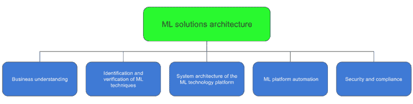

# 1

# 使用机器学习解决方案架构导航机器学习生命周期

人工智能（**AI**）和机器学习（**ML**）领域有着悠久的历史。在过去的 70 多年里，机器学习从 20 世纪 50 年代的棋类游戏计算机程序发展到能够击败人类围棋世界冠军的高级人工智能。最近，**生成式人工智能**（**GenAI**）技术如 ChatGPT 正在席卷行业，在企业和消费者中引发了巨大的兴趣，并承诺为药物发现、新媒体内容、财务报告分析和消费者产品设计等业务带来新的转型方式。在这个过程中，机器学习的技术基础设施也从用于小型实验和模型的单一机器/服务器发展到能够训练、管理和部署数万个机器学习模型的复杂端到端机器学习平台。人工智能/机器学习领域的超高速增长导致了众多新职业的诞生，如**MLOps** **工程**、**AI/ML 产品管理**、**ML 软件工程**、**AI 风险管理**和**AI 战略家**，这些职业遍布各个行业。

**机器学习解决方案架构**（**ML solutions architecture**）是另一个相对较新的学科，随着机器学习项目在**业务影响**、**科学复杂性**和**技术格局**方面的日益复杂，它在完整的端到端机器学习生命周期中扮演着越来越关键的角色。

本章将帮助您了解机器学习解决方案架构在完整数据科学生命周期中的位置。我们将讨论将机器学习项目从构思阶段到生产阶段所需的不同步骤，以及组织在实施机器学习项目时面临的各种挑战，例如用例识别、数据质量问题以及机器学习人才的短缺。最后，我们将简要讨论机器学习解决方案架构的核心关注领域，包括系统架构、工作流程自动化以及安全和合规性。

在本章中，我们将涵盖以下主要主题：

+   机器学习与传统软件的区别

+   机器学习生命周期及其关键挑战

+   什么是机器学习解决方案架构，它在整体生命周期中处于什么位置？

完成本章后，您将了解机器学习解决方案架构师的角色，以及您需要关注哪些业务和技术领域来支持端到端的机器学习项目。本章的目的是为那些在探索该领域的早期阶段的人提供一个机器学习生命周期的基本介绍。经验丰富的机器学习从业者可能希望跳过这个基础概述，直接进入更高级的内容。

更高级的部分从*第四章*开始；然而，许多技术实践者可能会发现*第二章*很有帮助，因为许多技术实践者通常需要更多的业务理解，了解机器学习可以在不同的业务和工作流程中应用。此外，*第三章*可能对某些实践者有益，因为它为那些对这一主题新手提供了机器学习算法的介绍，也可以作为那些定期实践这些概念的复习材料。

# 机器学习与传统软件

在我开始在人工智能/机器学习领域工作之前，我花了多年时间为大型金融服务机构构建计算机软件平台。我处理的一些业务问题具有复杂的规则，例如为投资银行交易识别可比分析的公司或为来自不同数据提供者的所有不同公司的标识符创建主数据库。我们必须在数据库存储过程和应用服务器后端中实现硬编码的规则来解决这些问题。我们经常争论某些规则是否适合我们试图解决的商业问题。

随着规则的改变，我们必须重新实现规则并确保这些变化不会破坏任何东西。为了测试新版本或更改，我们经常向人类专家反馈，以彻底测试和验证在生产发布之前实施的所有业务逻辑。这是一个非常耗时且容易出错的过程，需要大量的工程工作，对文档化的规范进行测试，以及每次引入新规则或现有规则需要更改时进行严格的变更管理。我们经常向用户反馈生产中的业务逻辑问题，当生产中出现问题时，我们有时不得不打开源代码来排查故障或解释其工作原理的逻辑。我记得我经常问自己是否有更好的方法来做这件事。

在我开始从事人工智能/机器学习领域的工作后，我开始使用机器学习技术解决许多类似挑战。有了机器学习，我无需提出复杂的规则，这些规则通常需要深入的数据和领域专业知识来创建或维护决策所需的复杂规则。相反，我专注于收集高质量的数据，并使用机器学习算法直接从数据中学习规则和模式。这种新的方法消除了创建新规则（例如，对深度领域专业知识的要求，或避免人类偏见）以及维护现有规则的许多挑战性方面。在产品发布前验证模型，我们可以检查模型性能指标，如**准确率**。虽然这仍然需要数据科学专业知识来解释模型指标与业务问题和数据集的性质之间的关系，但它不需要对所有不同场景进行详尽的手动测试。当一个模型部署到生产环境中时，我们会通过监控生产数据与用于模型训练的数据之间的任何重大变化来监控模型是否按预期执行。我们会收集新的未见数据和生产数据的标签，并定期测试模型性能，以确保其预测准确性在面对新的、以前未见的生产数据时保持稳健。为了解释模型为何以某种方式做出决策，我们不需要打开源代码来重新检查硬编码的逻辑。相反，我们会依赖机器学习技术来帮助解释不同输入特征的相对重要性，以了解哪些因素在机器学习模型的决策中最为关键。

下一个图显示了开发软件和训练机器学习模型之间过程差异的图形视图：

图 1.1：机器学习和计算机软件

现在你已经了解了机器学习与传统软件之间的区别，是时候深入了解机器学习生命周期的不同阶段了。

# 机器学习生命周期

我早期参与的一个机器学习项目是为一家主要联赛品牌解决的一个既迷人又令人畏惧的体育预测分析问题。我被提供了一份预测分析结果的清单，以便思考是否有机器学习解决方案可以用于这些问题。我对这项运动只是个业余观众；我对要生成的分析一无所知，对比赛规则的细节也缺乏了解。我提供了一些样本数据，但不知道如何处理它们。

我首先着手的工作是对这项运动本身的沉浸式体验。我深入研究了游戏的复杂性，学习了构成每场比赛和表演的不同球员位置和事件。只有在掌握了新发现的领域知识之后，数据才开始变得有意义。与利益相关者一起，我们评估了不同分析结果的影响，并根据我们所拥有的数据评估了建模的可行性。在明确理解数据的基础上，我们提出了几个最具商业影响的最顶级机器学习分析，并集中关注它们。我们还决定如何将它们整合到现有的业务工作流程中，以及如何衡量它们的影响。

此后，我进一步深入数据，以确定可用的信息和缺乏的信息。原始数据集包含大量无关的数据点，需要删除，而相关的数据点需要转换，以提供模型训练的最强信号。我根据考虑的一些机器学习算法处理和准备数据集，并进行了实验以确定最佳方法。我缺少一个跟踪不同实验结果的工具，因此我不得不手动记录我所做的一切。经过一些初步的实验轮次后，很明显，现有的数据不足以训练一个高性能模型。因此，我决定构建一个定制的深度学习模型，以整合不同模态的数据，因为数据点具有时间依赖性，并且建模需要额外的空间信息。数据所有者能够提供我需要的额外数据集，经过更多使用定制算法的实验以及大量的数据准备和特征工程，我最终训练了一个满足商业目标的模型。

在完成模型后，另一个艰巨的挑战开始了——在生产环境中部署和实施模型，并将其整合到现有的业务工作流程和系统架构中。我们参与了多次架构和工程讨论，最终为模型构建了一个部署架构。

如您从我的个人经验中可以看到，从商业想法到机器学习生产部署的旅程涉及许多步骤。一个典型的机器学习项目生命周期遵循一个正式的结构，包括几个基本阶段，如业务理解、数据获取和理解、数据准备、模型构建、模型评估和模型部署。由于生命周期的一个大组成部分是对不同数据集、特征和算法的实验，整个过程高度迭代。此外，必须注意的是，没有成功的保证。数据可用性和质量、特征工程技术（使用领域知识从原始数据中提取有用特征的过程）、学习算法的能力等因素都可能影响最终结果。

图 1.2：机器学习生命周期

前面的图展示了机器学习项目中的关键步骤，在随后的章节中，我们将更详细地探讨这些步骤。

## 业务问题理解和机器学习问题界定

生命周期中的第一个阶段是**业务理解**。这个阶段涉及理解业务目标和定义可以衡量项目成功的业务指标。例如，以下是一些业务目标的例子：

+   降低操作流程的成本，例如文档处理。

+   缓解业务或运营风险，例如欺诈和合规性。

+   产品或服务收入的提升，例如更好的目标营销、为更好的决策生成新的见解以及提高客户满意度。

为了衡量成功，您可以使用特定的业务指标，例如在业务流程中减少的小时数、检测到的真实正例欺诈数量的增加、目标营销的转化率提升或客户流失率减少的数量。这是确保有足够的理由进行机器学习项目以及项目结果可以成功衡量的关键步骤。

在您定义了业务目标和业务指标之后，您需要评估是否存在针对业务问题的机器学习解决方案。虽然机器学习应用范围广泛，但它并不总是每个业务问题的最佳解决方案。

## 数据理解和数据准备

“数据是新石油”的说法在机器学习中尤其正确。没有所需的数据，您就无法继续进行机器学习项目。这就是为什么在机器学习生命周期中的下一步是**数据获取**、**理解**和**准备**。

基于业务问题和机器学习（ML）方法，您需要收集和理解现有数据，以确定您是否拥有解决机器学习问题所需的数据和数据量。例如，假设要解决的商业问题是信用卡欺诈检测。在这种情况下，您将需要诸如历史信用卡交易数据、客户人口统计数据、账户数据、设备使用数据和网络访问数据等数据集。然后需要进行详细的数据分析，以确定数据集的特征和质量是否足以满足建模任务。您还需要决定数据是否需要标注，例如标注为`欺诈`或`非欺诈`。在此步骤中，根据数据质量，可能需要进行大量的数据处理和清洗工作，以准备和清理数据，并生成用于模型训练和模型评估的数据集。

## 模型训练和评估

使用建立的训练和验证数据集，数据科学家必须运行多个实验，使用不同的机器学习算法和数据集特征进行特征选择和模型开发。这是一个高度迭代的过程，可能需要多次运行数据处理和模型开发，以找到最佳模型性能的正确算法和数据集组合。除了模型性能外，还需要考虑数据偏差和模型可解释性等因素，以确保符合内部或监管要求。

在部署到生产之前，必须使用相关的技术指标来验证模型质量，例如**准确率得分**。这通常是通过使用**保留数据集**，也称为**测试数据集**，来衡量模型在未见数据上的表现。了解哪些指标适合模型验证非常重要，因为它们会根据机器学习问题和所使用的数据集而变化。例如，如果文档类型数量相对平衡，模型准确率将是一个适合文档分类用例的验证指标。然而，对于欺诈检测用例，模型准确率并不是一个好的评估模型性能的指标——这是因为欺诈的数量很少，即使模型始终预测`非欺诈`，模型准确率仍然可能非常高。

## 模型部署

模型经过充分训练和验证，达到预期的性能指标后，可以部署到生产环境和业务流程中。这里有两个主要的部署概念。第一个涉及将模型本身部署供客户端应用程序使用以生成预测。第二个概念是将这个预测工作流程集成到业务工作流程应用程序中。例如，部署信用欺诈模型可能是在 API 后面托管模型以进行实时预测，或者作为一个可以动态加载以支持批量预测的包。此外，这个预测工作流程还需要集成到业务工作流程应用程序中，用于欺诈检测，这可能包括实时交易的欺诈检测、基于预测输出的决策自动化以及详细的欺诈分析。

## 模型监控

机器学习生命周期并不随着模型的部署而结束。与软件不同，软件的行为高度确定，因为开发者明确地编写了其逻辑，机器学习模型在生产中的行为可能与模型训练和验证中的行为不同。这可能是由于生产数据特征、数据分布的变化，或者请求数据的潜在操纵所导致的。因此，模型监控是部署后检测模型性能下降（即模型漂移）或生产环境中数据集分布变化（即数据漂移）的重要步骤。

## 业务指标跟踪

实际业务影响应作为一个持续的过程进行跟踪和衡量，以确保模型能够带来预期的业务效益。这可能包括比较模型部署前后的业务指标，或者进行 A/B 测试，比较带有或不带有机器学习模型的流程之间的业务指标。如果模型没有带来预期的效益，应重新评估以寻找改进的机会。这也可能意味着将业务问题重新定义为一个不同的机器学习问题。例如，如果客户流失预测不能帮助提高客户满意度，那么可以考虑提供个性化的产品/服务来解决该问题。

# 机器学习挑战

在过去的几年里，我使用机器学习解决方案解决了许多现实世界的问题，并在机器学习采用过程中遇到了不同行业面临的不同挑战。

当我在机器学习项目上工作时，经常遇到相同的问题：*我们有很多数据——你能帮助我们找出我们可以使用机器学习生成哪些见解吗？*我把有这种问题公司称为有*业务用例挑战*的公司。无法识别机器学习的业务用例是许多公司面临的一个非常大的障碍。如果没有正确识别的业务问题和其价值主张及效益，就很难启动一个机器学习项目。

在我与不同行业的不同公司的交流中，数据相关挑战成为了一个常见问题。这包括数据质量、数据清单、数据可访问性、数据治理和数据可用性。这个问题影响着数据贫乏和数据丰富的公司，并且常常因数据孤岛、数据安全和行业法规而加剧。

数据科学和机器学习人才短缺是许多公司向我反映的另一个主要挑战。一般来说，公司都在努力吸引和保留顶尖的机器学习人才，这是所有行业都面临的共同问题。随着机器学习平台变得更加复杂，机器学习项目的范围也在扩大，对其他机器学习相关功能的需求开始显现。如今，除了数据科学家之外，一个组织还需要机器学习产品管理、机器学习基础设施工程和机器学习运营管理的职能角色。

根据我的经验，我观察到，对基于机器学习的解决方案的文化接受度是广泛采用中的另一个重大挑战。有些人认为机器学习是对他们工作职能的威胁，他们对机器学习的知识缺乏使他们犹豫不决，不愿在业务工作流程中采用这些新方法。

机器学习解决方案架构的实践旨在帮助解决机器学习中的某些挑战。在下一节中，我们将探讨机器学习解决方案架构及其在机器学习生命周期中的作用。

# 机器学习解决方案架构

当我最初作为机器学习解决方案架构师与公司合作时，当时的局面与现在大不相同。重点是数据科学和建模，手头的问题范围较小。当时，大多数问题都可以使用简单的机器学习技术解决。数据集较小，所需的基础设施要求不高。这些公司机器学习项目的范围仅限于少数数据科学家或团队。作为当时的机器学习架构师，我主要需要具备扎实的数据科学技能和一般云计算架构知识来完成工作。

在最近几年，机器学习（ML）项目的格局变得更加复杂和多元化，需要公司中更广泛的职能和角色参与。我的参与范围已经扩展到与商业高管讨论机器学习策略和组织设计，以促进他们在整个企业中广泛采用人工智能/机器学习。我被指派设计更复杂的机器学习平台，利用各种技术来满足大型企业的严格安全和合规要求。机器学习工作流程编排和运营已经成为越来越重要的讨论话题，越来越多的公司正在寻求使用大量训练数据来训练大型机器学习模型。一些公司训练和部署的机器学习模型数量在短短几年内从几十个激增至数万个。此外，复杂且对安全性敏感的客户寻求关于机器学习隐私、模型可解释性和数据与模型偏差等主题的指导。作为一名机器学习解决方案架构师，我注意到在这个角色中取得成功所需的技能和知识已经发生了显著变化。

在商业、数据、科学和技术景观的复杂性中导航可能是一项艰巨的任务。作为一名机器学习解决方案架构师，我亲眼见证了公司在将这些各个部分整合在一起时面临的挑战。在我看来，机器学习解决方案架构是一个至关重要的学科，它作为连接机器学习项目不同组件的桥梁。凭借我在与各种规模的公司和不同行业合作多年的经验，我相信机器学习解决方案架构师在识别业务需求、开发解决这些需求的机器学习解决方案以及设计运行这些解决方案所需的技术平台方面发挥着关键作用。通过与各种商业和技术合作伙伴合作，机器学习解决方案架构师可以帮助公司释放数据的全部潜力，并从他们的机器学习项目中获得切实的收益。

下图展示了机器学习解决方案架构所涵盖的核心功能区域：

图 1.3：机器学习解决方案架构覆盖范围

在接下来的章节中，我们将更详细地探讨这些领域：

+   **商业理解**：使用人工智能和机器学习理解商业问题和进行转型。

+   **机器学习技术的识别和验证**：识别和验证用于解决特定机器学习问题的机器学习技术。

+   **机器学习技术平台的系统架构**：机器学习技术平台的系统架构设计和实施。

+   **MLOps**：机器学习平台自动化技术设计。

+   **安全和合规**：机器学习平台和机器学习模型的安全、合规和审计考虑。

那么，让我们深入探讨吧！

## 商业理解和机器学习转型

业务流程分析的目标是识别流程中的低效率，并确定 ML 是否可以应用于帮助消除痛点、提高效率，甚至创造新的收入机会。

想象一下：你被分配去改进一个呼叫中心的运营。你知道存在需要解决的低效率问题，但你不确定从哪里开始。这就是业务流程分析发挥作用的地方。通过分析呼叫中心的流程，你可以识别出痛点，例如客户等待时间过长、代理之间的知识差距以及无法从通话录音中提取客户洞察。一旦你确定了这些问题，你就可以确定哪些数据可用以及哪些业务指标需要改进。这就是机器学习（ML）的用武之地。你可以使用 ML 来创建虚拟助手以处理常见的客户咨询，将音频录音转录成文本以便进行分析，以及检测客户意图以实现产品的交叉销售和升级销售。但有时，你需要修改业务流程以纳入 ML 解决方案。例如，如果你想使用通话录音分析来为交叉销售或升级销售产品生成洞察，但还没有建立处理这些洞察的既定流程，你可能需要引入自动化的目标市场营销流程或销售团队的主动外联流程。

## ML 技术的识别和验证

一旦你列出了一系列 ML 选项，下一步就是确定 ML 方法背后的假设是否有效。这可能涉及进行简单的**概念验证**（**POC**）建模来验证可用数据集和建模方法，或使用预构建的 AI 服务进行技术 POC，或者测试 ML 框架。例如，你可能想测试使用现有的文本转录服务从音频文件中进行文本转录的可行性，或者从营销活动构建一个新产品转换的客户倾向模型。

值得注意的是，ML 解决方案架构并不专注于开发新的机器算法，这项工作最适合应用数据科学家或研究数据科学家。相反，ML 解决方案架构专注于识别和应用 ML 算法来解决一系列 ML 问题，如预测分析、计算机视觉或自然语言处理。此外，任何建模任务的目标不是构建生产质量的模型，而是验证方法，以便全职应用数据科学家进行进一步的实验。

## 系统架构设计和实施

ML 解决方案架构师角色最重要的方面是 ML 平台的技术架构设计。该平台需要提供技术能力以支持 ML 周期的不同阶段和角色，如数据科学家和运维工程师。具体来说，一个 ML 平台需要具备以下核心功能：

+   **数据探索和实验**：数据科学家使用机器学习平台进行数据探索、实验、模型构建和模型评估。机器学习平台需要提供数据科学开发工具，用于模型编写和实验，数据整理工具用于数据探索和整理，源代码控制用于代码管理，以及软件包仓库用于库包管理。

+   **数据管理和大规模数据处理**：数据科学家或数据工程师需要具备技术能力，以摄取、存储、访问和处理大量数据，用于清洗、转换和特征工程。

+   **模型训练基础设施管理**：机器学习平台需要为不同类型的建模训练提供模型训练基础设施，包括不同的计算资源、存储和网络配置。它还需要支持不同类型的机器学习库或框架，例如**scikit-learn**、**TensorFlow**和**PyTorch**。

+   **模型托管/托管**：机器学习平台需要提供技术能力，以托管和提供模型进行预测生成，用于实时、批量或两者兼而有之。

+   **模型管理**：训练好的机器学习模型需要被管理和跟踪，以便于访问和查找，并包含相关元数据。

+   **特征管理**：需要管理和提供常见且可重用的特征，用于模型训练和模型托管。

## 机器学习平台工作流程自动化

机器学习平台设计的一个关键方面是**工作流程自动化**和**持续集成/持续部署**（**CI**/**CD**），也称为 MLOps。机器学习是一个多步骤的工作流程——它需要自动化，这包括数据处理、模型训练、模型验证和模型托管。基础设施提供自动化和自助服务是自动化设计中的另一个方面。工作流程自动化的关键组件包括以下内容：

+   **管道设计和管理**：能够为各种任务（如模型训练和模型托管）创建不同的自动化管道。

+   **管道执行和监控**：能够运行不同的管道并监控整个管道以及机器学习周期中每个步骤（如数据处理和模型训练）的执行状态。

+   **模型监控配置**：能够监控生产中的模型，针对各种指标，如数据漂移（生产中使用的数据的分布与用于模型训练的数据分布不同）、模型漂移（与训练结果相比，模型在生产中的性能下降）和偏差检测（机器学习模型复制或放大对某些个人的偏见）。

## 安全和合规性

机器学习解决方案架构的另一个重要方面是在敏感或企业环境中考虑安全和合规性：

+   **身份验证和授权**：机器学习平台需要提供身份验证和授权机制来管理对平台以及不同资源和服务的访问。

+   **网络安全**：机器学习平台需要配置不同的网络安全控制，如防火墙和 IP 地址访问允许列表，以防止未经授权的访问。

+   **数据加密**：对于对安全性敏感的组织来说，数据加密是机器学习平台设计考虑的另一个重要方面。

+   **审计和合规性**：审计和合规性工作人员需要信息来帮助他们理解如果需要的话，预测模型是如何做出决策的，从数据到模型实体的模型谱系，以及数据和中表现出的任何偏差。机器学习平台需要提供模型可解释性、偏差检测以及跨各种数据存储和服务组件的模型可追溯性等功能。

各个行业的技术提供商已经建立了最佳实践来指导机器学习基础设施的设计和实施，这是机器学习解决方案架构师实践的一部分。例如，亚马逊网络服务创建了*机器学习透镜*，以提供在关键领域（如运营卓越、安全性、可靠性、性能、成本优化和可持续性）的架构最佳实践。遵循这些发布的指南可以帮助从业者实施稳健有效的机器学习解决方案。

# 摘要

在本章中，我分享了一些作为机器学习解决方案架构师的个人经验，并概述了机器学习生命周期中涉及的核心概念和组件。我们讨论了机器学习解决方案架构师角色在整个生命周期中的关键职责。本章旨在让您了解作为机器学习解决方案架构师有效工作所需的技术和商业领域。有了这些基础知识，您现在应该对这一角色的广度和其在成功交付机器学习解决方案中的核心作用有所认识。

在接下来的章节中，我们将深入探讨不同行业（如金融服务和媒体娱乐）的多种机器学习用例，以进一步了解机器学习的实际应用。

# 加入我们的 Discord 社区

加入我们社区的 Discord 空间，与作者和其他读者进行讨论：

[`packt.link/mlsah`](https://packt.link/mlsah)

