# 第三章：探索机器学习算法

虽然机器学习算法设计可能不是机器学习解决方案架构师的主要角色，但对他们来说，仍然需要具备对常见现实世界机器学习算法及其在解决商业问题中的应用的全面理解。这种知识使机器学习解决方案架构师能够识别合适的数据科学解决方案，并设计部署这些算法所需的技术基础设施。

通过熟悉各种机器学习算法，机器学习解决方案架构师可以掌握每个算法的优势、局限性和特定用例。这使得他们能够准确评估业务需求，并选择最合适的算法方法来解决给定的问题。无论是分类、回归、聚类还是推荐系统，理解底层算法为架构师提供了做出明智决策所需的知识。

在本章中，我们将探讨机器学习的基础知识，并深入研究常见的机器学习和深度学习算法。我们将涵盖分类、回归、目标检测、推荐、预测和自然语言生成等任务。通过理解这些算法的核心原理和应用，您将获得识别适合现实世界问题的机器学习解决方案的知识。本章旨在为您提供跨各种领域的有见地的决策和设计有效的机器学习解决方案的专长。

具体来说，本章将涵盖以下主题：

+   机器学习是如何工作的

+   选择机器学习算法的考虑因素

+   分类和回归算法

+   聚类算法

+   时间序列算法

+   推荐算法

+   计算机视觉算法

+   自然语言处理算法

+   生成式人工智能算法

+   动手实践练习

注意，本章为对应用这些算法的新读者提供了机器学习算法的介绍。如果您已经拥有数据科学家或机器学习工程师的经验，您可能希望跳过本章，直接进入*第四章*，在那里我们讨论机器学习的数据管理。

# 技术要求

为了完成本章的动手实践练习部分，您需要一个个人电脑（**Mac**或**Windows**）。

您还需要从[`www.kaggle.com/mathchi/churn-for-bank-customers`](https://www.kaggle.com/mathchi/churn-for-bank-customers)下载数据集。在*动手实践练习*部分将提供额外的说明。

# 机器学习是如何工作的

在 *第一章*，*使用机器学习解决方案架构导航机器学习生命周期* 中，我们讨论了机器学习算法通过数据处理和参数更新实现自我改进的能力，从而生成类似于计算机源代码中编译二进制的模型。但算法实际上是如何学习的呢？本质上，机器学习算法通过优化目标函数（也称为损失函数）来学习，这涉及到最小化或最大化它。目标函数可以被视为一个业务指标，例如预测和实际产品销售之间的差异。优化的目的是减少这种差异。为了实现这一点，机器学习算法迭代并处理大量的历史销售数据（训练数据），调整其内部模型参数，直到预测值和实际值之间的差距最小化。这个过程被称为优化，专门为此目的设计的数学程序称为优化器。

为了说明优化的概念，让我们考虑一个简单的例子：训练一个机器学习模型来根据其价格预测产品销售。在这种情况下，我们可以使用线性函数作为机器学习算法，如下所示：

sales = W * price + B

在这个例子中，我们的目标是使预测销售值和实际销售值之间的差异最小化。为了实现这一点，我们采用 **均方误差**（**MSE**）作为优化的损失函数。具体任务是确定模型参数 *W* 和 *B* 的最佳值，通常称为权重和偏差。权重为每个输入变量分配相对重要性，而偏差表示平均输出值。我们的目标是找到产生最低 MSE 的 *W* 和 *B* 值，以提高销售预测的准确性：

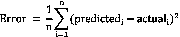

解决机器学习优化问题有多种技术可用。其中，梯度下降及其变体被广泛用于优化神经网络和各种其他机器学习算法。梯度下降是一种迭代方法，它涉及计算与每个输入变量相关的误差变化率（梯度）。根据这个梯度，模型参数（在本例中的 *W* 和 *B*）逐步更新，以逐步减少误差。学习率是机器学习算法的一个超参数，它控制每次迭代的参数更新幅度。这允许对优化过程进行微调。以下图展示了使用梯度下降优化 W 值的过程：

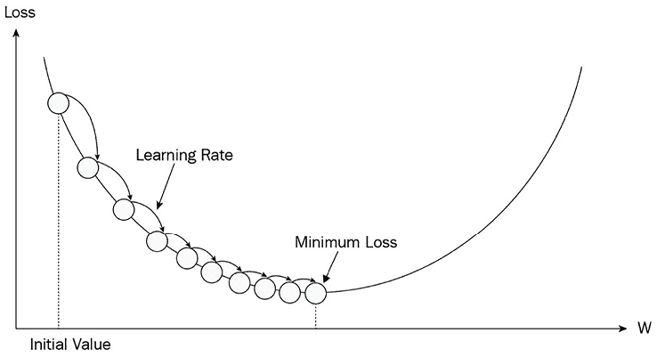

图 3.1：梯度下降

梯度下降优化过程涉及几个关键步骤：

1.  随机初始化 *W* 的值。

1.  使用分配的 *W* 值来计算误差（损失）。

1.  计算误差相对于损失函数的梯度（变化率）。梯度可以是正的、零或负的。

1.  如果梯度是正的或负的，更新*W*的值，使其在减少下一次迭代中误差的方向上移动。在这个例子中，我们将*W*向右移动以增加其值。

1.  重复*步骤 2*到*4*，直到梯度变为零，这表明*W*的最佳值已经达到，并且收敛已经实现。

除了梯度下降之外，还可以使用如正规方程这样的替代优化技术来寻找机器学习算法（如线性回归）的最佳参数。与梯度下降的迭代方法不同，正规方程为计算线性回归模型的系数提供了一个一步的解析解。其他机器学习算法也可能有针对模型训练的特定算法优化方法，这些将在下一节中讨论。

# 机器学习算法概述

在简要概述了机器学习背后的基本概念之后，现在让我们更深入地探讨各种机器学习算法。机器学习领域已经发展了许多算法，学术界和工业界都在持续地进行研究和创新。在本节中，我们将探讨几个著名的传统和深度学习算法，检查它们在预测、推荐和自然语言处理等各种类型的机器学习问题中的应用。此外，我们还将探讨不同算法的优缺点，并讨论每种算法最适合的情况。这将帮助你建立对每个算法不同能力和它们可以解决的各类问题的理解。

在我们深入探讨这些算法之前，讨论在选择适合特定任务的算法时需要考虑的因素是很重要的。

## 选择机器学习算法的考虑因素

在选择机器学习算法时，有几个关键因素需要考虑：

+   **问题类型**：不同的算法更适合不同类型的问题。例如，分类算法适用于目标是将数据分类到不同类别的任务，而回归算法用于预测连续的数值。理解问题类型对于选择最合适的算法至关重要。

+   **数据集大小**：你的数据集大小可能会影响算法的选择。有些算法在小数据集上表现良好，而其他算法则需要大量的数据才能有效地泛化。如果你数据有限，具有较少参数的简单算法可能更可取，以防止过拟合。过拟合是指训练模型对训练数据学习得太好，但无法泛化到新的、未见过的数据。

+   **特征空间**：考虑你的数据集中特征的数量和性质。一些算法可以处理高维特征空间，而其他算法则更适合具有较少特征的集合。特征工程和降维技术也可以应用于提高算法性能。

+   **计算效率**：算法的计算需求应予以考虑，特别是如果你有大量数据集或有限的计算资源。一些算法计算成本高昂，可能不适合某些环境。时间复杂度和空间复杂度是用于评估机器学习算法效率的定量指标。大 O 符号表示时间和空间需求的上限估计。例如，线性搜索的时间复杂度为*O(N)*，而二分搜索的时间复杂度为*O(log N)*。理解这些复杂性有助于评估算法效率和可扩展性，有助于为特定任务选择算法。

+   **可解释性**：根据你的应用，算法结果的解释性可能很重要。一些算法，如决策树或线性模型，提供易于解释的结果，而其他算法，如深度神经网络，则提供更复杂和抽象的表示。

+   **算法复杂度和假设**：不同的算法对潜在数据分布有不同的假设。考虑这些假设是否适用于你的数据集。此外，算法的复杂性可能会影响其实施的简便性、训练时间和处理噪声或不完整数据的能力。

通过考虑这些因素，你可以在选择最适合你特定问题和可用资源的机器学习算法时做出明智的决定。

## 用于分类和回归问题的算法

今天的大多数机器学习问题主要涉及分类和回归。分类是机器学习任务，它将类别或类分配给数据点，例如将信用卡交易标记为欺诈或不欺诈。另一方面，回归是一种机器学习技术，用于预测连续的数值，例如预测房屋价格。

在接下来的章节中，我们将探讨用于分类和回归任务的常见算法。我们将解释每个算法的工作原理，每种算法适合解决的问题类型，以及它们的局限性。这将有助于建立对不同任务选择不同算法的直觉。

### 线性回归算法

**线性回归**算法是通过基于独立输入预测连续值来解决回归问题的。它们在各种实际场景中得到了广泛应用，例如根据价格估计产品销售或根据降雨量和肥料确定作物产量。

线性回归利用一组系数和输入变量的线性函数来预测标量输出。线性回归的公式如下所示：

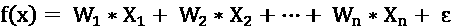

在线性回归方程中，*X*[s]代表输入变量，*W*[s]表示系数，表示误差项。线性回归旨在通过计算输入的加权总和来估计输出值，假设输出和输入之间存在线性关系。线性回归背后的直觉是找到一个线或超平面，可以估计一组输入值的值。线性回归可以有效地处理小数据集，通过系数评估输入和输出变量提供可解释性。然而，它可能无法很好地处理复杂、非线性数据集。此外，线性回归假设输入特征之间相互独立，当存在共线性（一个特征的价值影响另一个特征的价值）时，它可能会遇到困难，因为评估相关特征的重要性变得具有挑战性。

### 逻辑回归算法

**逻辑回归**通常用于二元和多类分类任务。它可以预测事件发生的概率，例如，一个人是否会点击广告或是否有资格获得贷款。逻辑回归是现实场景中非常有价值的一种工具，在这些场景中，结果为二元，需要估计特定类别的可能性。通过利用逻辑函数，该算法将输入变量映射到概率分数，从而实现有效的分类决策。

逻辑回归是一种用于估计事件或结果发生概率的统计模型，例如交易欺诈或通过考试。它与线性回归类似，但输出转换不同。逻辑回归的目标是找到一个决策边界，由一条线或超平面表示，能够有效地将数据点的两个类别分开。通过将输入变量的线性组合应用逻辑函数，逻辑回归确保预测输出落在 0 到 1 的范围内，表示属于特定类别的概率。以下公式是逻辑回归的函数，其中*X*是输入变量的线性组合(*b+wx*)。在这里，w 是回归系数：

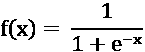

与线性回归一样，逻辑回归具有快速训练速度和可解释性作为其优点。然而，由于其线性特性，逻辑回归不适用于解决具有复杂非线性关系的问题。

### 决策树算法

**决策树**在各种现实世界的机器学习场景中得到了广泛的应用，包括心脏病预测、目标营销和贷款违约预测。它们用途广泛，可以用于分类和回归问题。

决策树的概念源于数据可以根据规则分层划分的想法，导致相似的数据点遵循相同的决策路径。它通过在树的各个分支使用不同的特征来分割输入数据来实现这一点。例如，如果年龄是用于分支分割的特征，则可以使用条件检查如年龄 > 50 来划分数据。选择用于分割的特征以及分割位置是通过诸如基尼纯度指数和信息增益等算法来决定的。基尼指数衡量误分类的概率，而信息增益量化了分割导致的熵减少。

在这本书中，我们不会深入探讨具体的算法细节。然而，决策树的一般概念涉及尝试不同的分割选项和条件，计算每个分割选项的度量值（例如，信息增益），并选择产生最高值的选项。在预测过程中，输入数据根据学习到的分支逻辑遍历树，最终预测由终端节点（叶节点）确定。请参阅*图 3.2*以了解决策树的一个示例结构。

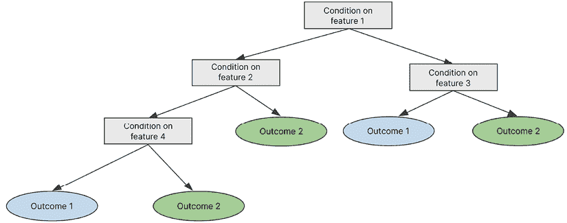

图 3.2：决策树

与线性回归和逻辑回归相比，决策树的主要优势在于它们能够捕捉特征之间的非线性关系和交互。决策树可以处理复杂的数据模式，并且不仅限于输入变量和输出之间的线性关系。它们可以表示更灵活的决策边界，并可以处理数值和分类特征。

决策树的优势在于它可以处理最少预处理的数据，适应分类和数值特征，并处理缺失值和变化的特征尺度。它也非常易于解释，允许轻松可视化和分析决策路径。此外，决策树在计算上效率很高。然而，它们可能对异常值敏感，并且容易过拟合，尤其是在处理大量特征和噪声数据时。过拟合发生在模型记住训练数据但在未见数据上表现不佳的情况下。

决策树和基于树的算法的一个显著局限性是它们无法在训练输入范围之外进行外推。例如，如果一个房价模型是在 500 到 3,000 平方英尺的平方英尺数据上训练的，那么决策树将无法对超过 3,000 平方英尺的数据进行预测。相比之下，线性模型能够捕捉趋势并在观察范围之外进行预测。

### 随机森林算法

**随机森林**算法在电子商务、医疗保健和金融等各个领域的实际应用中得到了广泛应用。它们在分类和回归任务中尤其有价值。这些任务的现实世界例子包括保险承保决策、疾病预测、贷款支付违约预测和定向营销活动。随机森林算法的通用性允许它们在广泛的行业中应用，以解决各种商业挑战。

如前述决策树章节所述，决策树使用单一树来做出决策，树的根节点（第一个分割树的特性）对最终决策影响最大。随机森林背后的动机在于，结合多个树的决策可以导致整体性能的提升。随机森林的工作方式是创建多个较小的**子树**，也称为**弱学习树**，其中每个子树使用所有特征的一个随机子集来做出决策，最终决策通过多数投票（用于分类）或平均（用于回归）来做出。将多个模型的决策结合起来的这个过程也被称为**集成学习**。随机森林算法还允许你引入不同程度的随机性，例如**自助采样**，这涉及到在单个树中使用相同的样本多次。这有助于使模型更加通用，并减少过拟合的风险。以下图示说明了随机森林算法如何使用多个子树处理输入数据实例，并组合它们的输出。

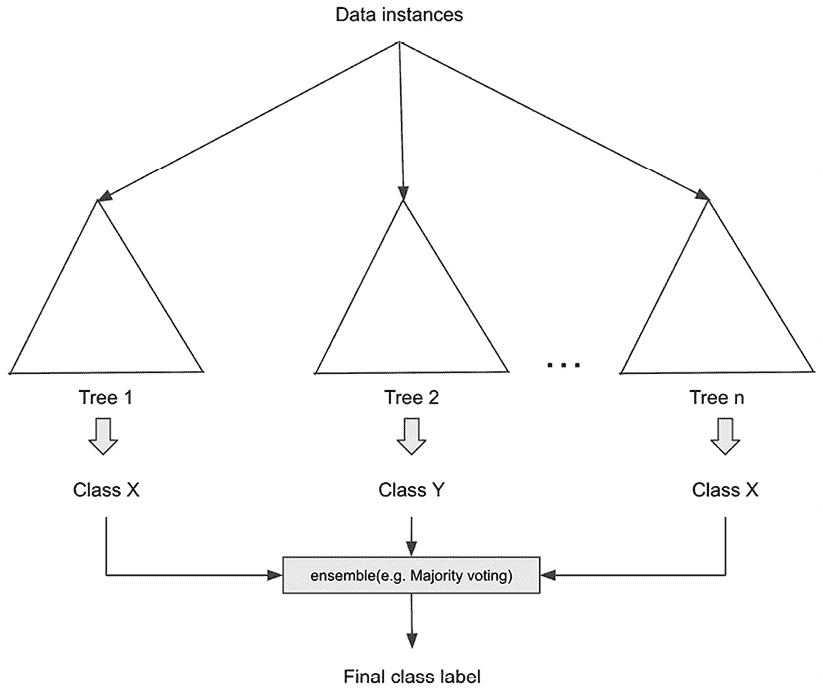

图 3.3：随机森林

与决策树相比，随机森林具有几个优势。通过多数投票或平均结合多个树的预测，它们提高了准确性。它们通过在模型中引入随机性和使用特征的不同子集来减少过拟合。随机森林通过关注数据的不同方面更好地处理大型特征集。它们对异常值具有鲁棒性，并提供特征重要性估计。此外，随机森林支持跨多台机器的并行处理，以训练大型数据集。随机森林的局限性包括与决策树相比的可解释性降低、较长的训练和预测时间、增加的内存使用以及需要调整超参数。

### 梯度提升机与 XGBoost 算法

梯度提升和 XGBoost 也是流行的基于多树的机器学习算法，广泛应用于信用评分、欺诈检测和保险索赔预测等各个领域。与随机森林在最后结合弱学习树的结果不同，梯度提升按顺序聚合来自不同树的结果。

随机森林利用并行独立弱学习器，而梯度提升采用一种顺序方法，其中每个弱学习器树纠正前一个树的错误。梯度提升提供了更多的超参数来微调，并且通过适当的调整可以实现卓越的性能。它还允许自定义损失函数，为建模现实世界场景提供了灵活性。参考以下图示了解梯度提升树的工作原理：

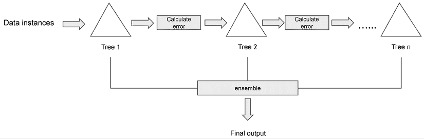

图 3.4：梯度提升

梯度提升提供了几个关键优势。首先，它在处理不平衡数据集方面表现出色，这使得它非常适合欺诈检测和风险管理等任务。其次，当适当调整时，它有可能比其他算法实现更高的性能。此外，梯度提升支持自定义损失函数，为建模现实世界应用提供了灵活性。最后，它能够有效地捕捉数据中的复杂关系并产生准确的预测。尽管梯度提升具有优势，但也存在一些需要考虑的局限性。首先，由于其顺序性，它缺乏并行化能力，因此在训练速度上比可以并行化的算法慢。其次，梯度提升对噪声数据敏感，包括异常值，这可能导致过拟合和降低泛化性能。最后，梯度提升模型的复杂性使其比决策树等简单算法更难以解释，这使得理解数据中的潜在关系变得具有挑战性。

XGBoost，梯度提升的一个广泛使用的实现，因其在大规模 Kaggle 竞赛中的成功而受到欢迎。虽然它与梯度提升具有相同的基本概念，但 XGBoost 提供了一些改进。它允许在多个核心和 CPU 上训练单个树，从而缩短了训练时间。XGBoost 结合了强大的正则化技术来减轻过拟合并降低模型复杂性。它还在处理稀疏数据集方面表现出色。除了 XGBoost 之外，其他流行的梯度提升树变体还包括 LightGBM 和 CatBoost。

### K 近邻算法

**K 近邻**（**K-NN**）是一种多用途算法，用于分类和回归任务。它也被用于搜索系统和推荐系统。K-NN 的基本假设是，在特征空间中，相似的项目往往彼此靠近。为了确定这种接近性，测量不同数据点之间的距离，通常使用欧几里得距离等度量。

在分类的情况下，K-NN 算法首先加载训练数据及其相应的类别标签。当需要对新数据点进行分类时，会计算其与现有数据点的距离，通常使用欧几里得距离。确定新数据点最近的 K 个邻居，并检索它们的类别标签。然后通过多数投票确定新数据点的类别标签，即将 K 个最近邻居中最频繁的类别分配给新数据点。

下面的图示展示了如何使用 K-NN 进行分类：

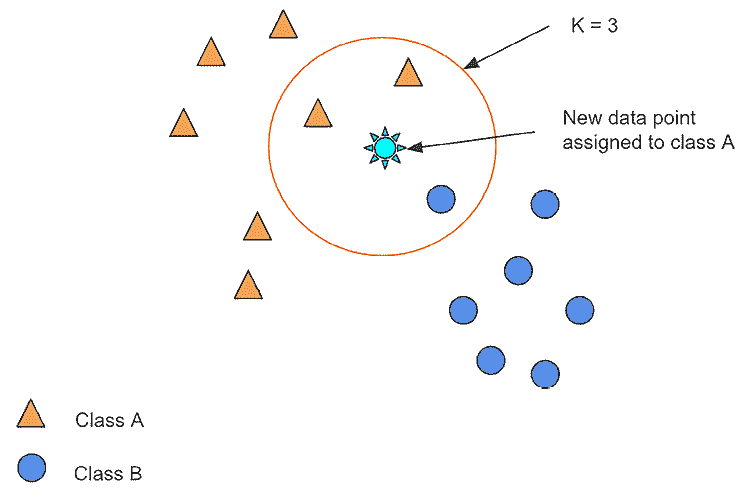

图 3.5：K-NN 用于分类

对于回归任务，K-NN 遵循类似的方法。计算新数据点与现有数据点之间的距离，并选择 K 个最近邻居。通过平均 K 个最近数据点的值来获得新数据点的预测标量值。

K-NN 的一个优点是其简单性以及不需要训练或调整超参数（除了选择 K 的值）。数据集直接加载到模型中，无需训练模型。值得注意的是，K 的选择对 K-NN 模型的表现有显著影响。最优的 K 值通常通过迭代试错过程，通过评估保留的数据集来找到。K-NN 的结果也易于解释，因为每个预测都可以通过检查最近邻居的性质来理解。然而，K-NN 也有一些局限性。

随着数据点的数量增加，模型的复杂性增加，预测可能会变慢，尤其是在大型数据集上。K-NN 不适合高维数据集，因为在更高维空间中，邻近的概念变得不那么有意义。该算法对噪声数据和缺失数据也很敏感，需要移除异常值和数据插补技术来有效处理这些情况。

### 多层感知器（MLP）网络

如前所述，**人工神经网络**（**ANN**）模拟了人脑的学习过程。大脑由众多相互连接的神经元组成，它们处理信息。网络中的每个神经元都从另一个神经元接收输入（电脉冲），处理并转换输入，然后将输出发送到网络中的其他神经元。以下是人脑神经元的示意图：

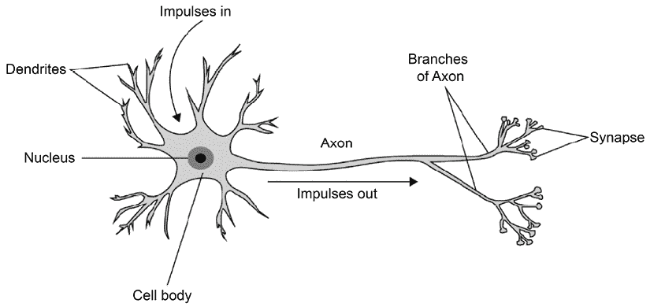

图 3.6：人脑神经元

人工神经元以类似的方式运作。以下图示展示了一个人工神经元，它由一个线性函数与一个激活函数组合而成。激活函数会修改线性函数的输出，例如将其压缩在特定范围内，如 0 到 1（Sigmoid 激活），-1 到 1（Tanh 激活），或保持值在 0 以上（ReLU）。激活函数被用来捕捉输入和输出之间的非线性关系。或者，每个神经元也可以被视为一个线性分类器，类似于逻辑回归。

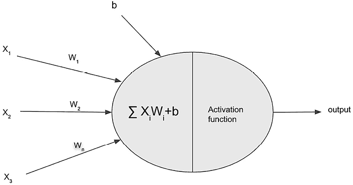

图 3.7：人工神经元

当将大量神经元堆叠成不同的层（*输入层*、*隐藏层*和*输出层*）并将所有神经元在相邻层之间连接起来时，我们就得到了一个称为**多层感知器**（**MLP**）的 ANN。在这里，“感知器”一词意味着“人工神经元”，它最初由 Frank Rosenblatt 于 1957 年发明。MLP 背后的理念是每个隐藏层将学习前一层的一些高级表示（特征），这些高级特征捕捉了前一层的更重要的信息。当使用最终隐藏层的输出进行预测时，网络已经从原始输入中提取了最重要的信息，用于训练分类器或回归器。以下图示展示了 MLP 网络的架构：

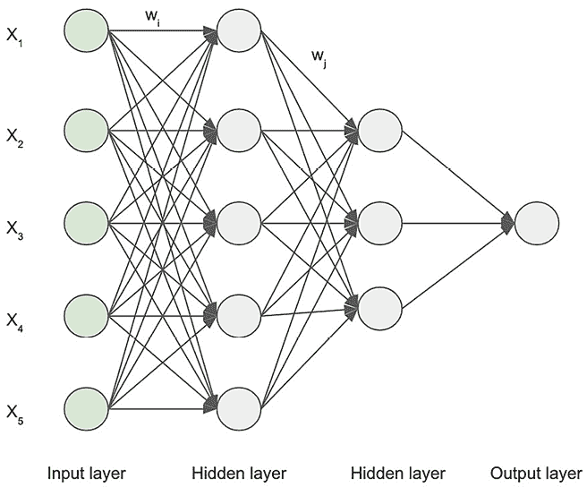

图 3.8：多层感知器

在模型训练过程中，通过梯度下降调整每一层中每个神经元的权重（*W*），以优化训练目标。这种调整过程被称为反向传播。它涉及将总误差反向传播通过网络，根据每个神经元的贡献将一部分误差分配给每个神经元。这允许对每个神经元中的权重进行微调，确保每一层的每个神经元都对最终输出产生影响，从而提高整体性能。

MLP 是一种多才多艺的神经网络，适用于分类和回归任务，类似于随机森林和 XGBoost。虽然通常应用于表格数据，但它也可以处理各种数据格式，如图像和文本。MLP 在捕捉数据集中的复杂非线性模式方面表现出色，并因其并行化能力而具有高效的计算处理能力。然而，与传统的机器学习算法相比，MLP 通常需要更大的训练数据集才能达到最佳性能。

## 聚类算法

聚类是一种数据挖掘方法，它涉及根据共享属性将项目分组在一起。聚类的一个实际应用是通过分析人口统计、交易历史或行为数据来创建客户细分。其他例子包括社交网络分析、文档分组和异常检测。存在各种聚类算法，在本节中我们将重点关注 K-means 聚类算法，这是最广泛使用的聚类算法之一，因为它简单易行。其他一些流行的聚类算法包括层次聚类和 DBSCAN。

#### K-means 算法

K-means 算法在现实世界的应用中得到了广泛的应用，包括客户细分分析、基于文档属性的文档分类和保险欺诈检测。它是一种多用途算法，可以有效地将数据点分组到各种领域，用于不同的目的。

K-means 算法旨在将相似的数据点分组到簇中，它是一种无监督算法，这意味着它不依赖于标记数据。算法首先随机分配 K 个质心，这些质心代表簇的中心。然后，它迭代地调整数据点到最近质心的分配，并将质心更新为每个簇中数据点的平均值。这个过程一直持续到收敛，从而根据相似性形成定义良好的簇。

K-means 聚类具有几个优点，包括其简单性和易于理解，这使得它对初学者来说易于访问。它是计算高效的，可以有效地处理大型数据集。生成的簇是可解释的，为数据中的潜在模式提供了有价值的见解。K-means 算法灵活多样，适用于各种类型的数据，包括数值、分类和混合属性数据集。然而，也有一些缺点需要考虑。选择最佳簇数（*K*）可能是主观的且具有挑战性。该算法对质心的初始位置敏感，可能导致不同的簇形成。K-means 假设簇是球形的且具有相等的方差，这在所有情况下可能并不成立。它对异常值也很敏感，并且在与非线性数据关系作斗争时存在困难。

## 时间序列分析算法

时间序列是由在连续时间间隔内记录的一系列数据点组成的。它通常用于分析预测各个领域的趋势，如金融、零售和销售。时间序列分析使我们能够理解过去的模式，并根据当前值与过去值之间的关系进行未来预测。时间序列预测依赖于未来值受不同时间点先前观察影响的假设。

时间序列数据表现出几个重要的特征，包括趋势、季节性和平稳性。**趋势**指的是数据的长期方向，它表示数据随时间是否呈现整体增加或减少。它有助于识别潜在的模式并理解时间序列的一般行为。另一方面，**季节性**捕捉固定间隔内的重复模式，通常在周期或季节中发生。它有助于识别在特定时间周期内重复的规律性波动，如每日、每周或年度模式。**平稳性**指的是时间序列的属性，其中统计属性，如均值和方差，随时间保持恒定。平稳性至关重要，因为许多预测技术假设基础数据是平稳的。非平稳时间序列可能导致预测不准确或不可靠。因此，在应用预测技术之前，评估和解决时间序列的平稳性是很重要的。

### ARIMA 算法

**自回归积分移动平均**（**ARIMA**）算法在各种实际场景中有实际应用，包括预算预测、销售预测、患者就诊预测和客户支持呼叫量预测。ARIMA 是分析预测时间序列数据的有力工具，允许组织在这些领域做出明智的决策并优化其运营。通过利用数据中的历史模式和趋势，ARIMA 可以实现准确的预测，并帮助企业在有效管理资源和规划未来方面发挥作用。

ARIMA 基于以下前提运作：给定时期变量的值受其自身先前值（自回归）的影响，与平均值之间的偏差遵循基于先前偏差的模式（移动平均），通过差分（计算连续数据点之间的差异）可以消除趋势和季节性。这个差分过程旨在将时间序列转换为平稳状态，其中统计属性如均值和方差随时间保持恒定。ARIMA 的这三个组件可以用以下公式进行数学表示：

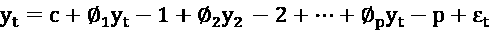

其中，**自回归**（**AR**）组件表示为先前值的回归（也称为滞后）：

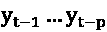

常数*C*代表漂移：

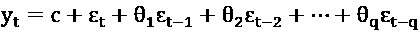

**移动平均**（**MA**）组件表示为先前时间周期的预测误差的加权平均值，其中它代表一个常数：

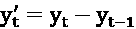

时间序列的**集成组件**（时间序列差分）可以表示为前一个周期内值与当前周期内值的差。

ARIMA 是预测单时间序列（单变量）数据的合适选择，因为它不依赖于其他变量。它优于简单的预测技术，如简单移动平均、指数平滑或线性回归。此外，ARIMA 提供了可解释性，使得对潜在模式有清晰的理解。然而，由于其向后看的本质，ARIMA 可能难以准确预测意外事件。此外，作为一个基于线性模型的模型，ARIMA 可能无法有效地捕捉时间序列数据中的复杂非线性关系。

### DeepAR 算法

基于深度学习的预测算法为传统模型如 ARIMA 的局限性提供了解决方案。它们擅长捕捉复杂的非线性关系，并能有效地利用多变量数据集。这些模型能够训练一个全局模型，使得一个模型可以处理多个相似的目标时间序列。这消除了为每个单独的时间序列创建单独模型的需求，提供了一种更高效和可扩展的方法。

**深度自回归**（**DeepAR**）是一种基于神经网络的先进预测算法，旨在处理具有多个相似目标时间序列的大数据集。它具有结合相关时间序列的能力，例如产品价格或假日安排，以增强其预测模型的准确性。当处理由外部变量触发的峰值事件时，这一特性尤其有价值，它允许进行更精确和可靠的预测。

DeepAR 利用**循环神经网络**（**RNN**）作为其底层模型来捕捉目标时间序列中的模式。它通过结合多个目标时间序列和额外的外部支持时间序列超越了单变量预测。RNN 不是考虑单个值，而是接受代表每个时间周期各种变量值的输入向量。通过联合学习这些组合向量随时间变化的模式，DeepAR 可以有效地捕捉不同时间序列之间的内在非线性关系和共享模式。这种方法使得 DeepAR 能够训练一个单一的全局模型，该模型可用于跨多个相似的目标时间序列进行预测。

DeepAR 在处理复杂的多变量数据集方面表现出色；然而，当使用大量数据进行训练时，它的表现最佳。它在涉及大规模零售预测的实际情况中特别有用，例如对众多商品的预测，需要考虑外部因素如营销活动和假日安排。通过利用其同时建模多个变量的能力，DeepAR 可以在这种实际应用场景中提供准确的预测和见解。

DeepAR 的一个显著缺点是深度学习模型的黑盒性质，它缺乏可解释性和透明度。这使得预测比简单的统计方法更难以解释和证明。另一个主要缺点是 DeepAR 对数据的贪婪性，当数据集较小时，其表现不佳。

## 推荐算法

推荐系统是一种关键的机器学习技术，它预测用户对物品的偏好，主要依赖于用户或物品属性的相似性或用户-物品交互。它在零售、媒体和娱乐、金融和医疗保健等各个行业中得到了广泛的应用。多年来，推荐算法领域已经发生了显著的变化，从基于相似用户的偏好和行为进行推荐，发展到基于强化学习的方法，其中算法随着时间的推移学习做出连续的决策，同时考虑用户反馈和交互。在下一节中，我们将探讨推荐系统领域的一些常用算法。

### 协同过滤算法

**协同过滤**是一种流行的推荐算法，它利用了这样一个观点：在一组物品中具有相似兴趣或偏好的个人，在其他物品中也可能具有相似的兴趣。通过分析不同用户的集体经验和行为，协同过滤可以有效地根据相似用户的偏好为单个用户推荐物品。这种方法利用了群体的经验，提供个性化的相关推荐。

下图展示了电影评分背景下的物品-用户交互矩阵。如图所示，它是一个**稀疏矩阵**。这意味着矩阵中有许多空项，这是预期的，因为任何个人都不太可能观看每一部电影：

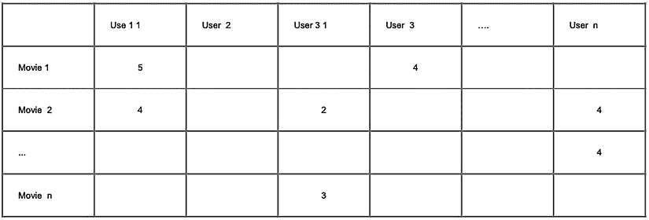

图 3.9：协同过滤的用户-物品交互矩阵

协同过滤的主要优点之一是它可以提供高度个性化的推荐，与每个用户的独特兴趣相匹配。与基于内容的系统不同，协同过滤模型不需要分析和理解物品特征和内容。相反，它们完全依赖于行为模式，如评分、购买、点击和用户之间的偏好，以揭示相关性。这使得协同系统能够根据群体智慧获得用户喜好的细致轮廓。然后，算法可以生成针对特定用户的定制推荐，超越明显的建议。这种个性化的程度和捕捉用户偏好的能力使协同过滤成为一种强大的方法，尤其是在分析内容不可行的庞大目录中。

协同过滤也有一些明显的缺点。一个主要问题是冷启动问题：当引入新用户或没有评分的项目时，协同模型会面临挑战。算法高度依赖于群体评分，因此它们无法有效地向缺乏历史数据的用户推荐新项目。协同系统也可能导致多样性有限，形成过滤气泡和明显的推荐而不是新颖的推荐。它们通常面临稀疏性问题，因为用户-项目矩阵通常是稀疏的，尤其是在大型目录中。

**矩阵分解**是协同过滤推荐系统中常用的一种技术。它涉及在用户-项目交互矩阵中学习用户和项目的向量表示或嵌入。目标是通过对学习的用户和项目嵌入矩阵进行乘积来近似原始矩阵。

这使我们能够预测矩阵中的缺失条目，这些条目代表用户对未见项目可能给出的评分。为了进行预测，我们只需计算用户嵌入和项目嵌入之间的点积。

嵌入是机器学习中的一个基本概念，在各个领域发挥着至关重要的作用。它涉及以捕捉实体（如单词或对象）的语义相似性的方式创建实体的数值表示。这些表示组织在一个多维空间中，其中相似的实体彼此靠近。通过使用嵌入，我们可以揭示对象的潜在语义，从而实现更有效的分析和建模。在接下来的章节中，我们将深入了解嵌入技术及其在自然语言处理算法中的应用。

矩阵分解提供了主要的可扩展性优势，因此协同过滤可以应用于极其庞大的目录。然而，由于潜在因子建模，该算法失去了一些透明度。总的来说，矩阵分解将协同过滤扩展到更大的数据集，但牺牲了一些可解释性。

### 多臂老虎机/上下文老虎机算法

基于协同过滤的推荐系统严重依赖于已识别用户和项目之间的先前交互数据来做出准确的推荐。然而，当缺乏先前交互或用户匿名时，这些系统面临挑战，导致冷启动问题。为了解决这个问题，一种方法是基于**多臂老虎机**（**MAB**）的推荐系统。这种方法从试错的概念中汲取灵感，类似于一个同时玩多个老虎机和观察哪个机器产生最佳整体回报的赌徒。通过采用强化学习技术，基于 MAB 的推荐系统可以动态探索和利用不同的推荐来优化用户体验，即使在缺乏大量先前交互数据的情况下。

MAB 算法在在线学习的范式下运行，其中在部署模型之前没有预先存在的训练数据。相反，模型随着数据的可用性逐渐学习和适应。在 MAB 学习的初始阶段，模型以相等的概率向用户推荐所有可用的选项（例如电子商务网站上的产品）。随着用户开始与项目的一部分进行互动并提供反馈（奖励），MAB 模型调整其策略。它开始更频繁地提供产生更高奖励的项目（例如，更多用户互动），利用它们积极表现的已知知识。

然而，该模型仍然继续将较小比例的推荐分配给新项目，旨在探索它们获得互动的潜力。这种在探索（提供新项目）和利用（提供已知奖励的项目）之间的平衡是 MAB 算法中的一个基本权衡。

MAB 算法面临几个限制。在探索和利用之间取得正确的平衡可能具有挑战性，导致在某些环境中出现次优解。处理高维上下文信息也是一个挑战，算法可能对噪声奖励敏感。此外，当新项目或用户的历史数据有限时，会出现冷启动问题。

## 计算机视觉问题的算法

计算机视觉是指计算机解释和理解视觉表示的能力，例如图像和视频，以便执行诸如对象识别、图像分类、文本检测、人脸识别和活动检测等任务。这些任务依赖于模式识别，其中图像被标注为对象名称和边界框，计算机视觉模型被训练以识别这些模式并在新图像上做出预测。计算机视觉技术在内容管理、安全、增强现实、自动驾驶汽车、医疗诊断、体育分析和制造业的质量检验等实际领域有众多应用。在下一节中，我们将深入探讨一些专门为计算机视觉任务设计的神经网络架构。

尽管即将到来的部分涉及深度学习架构、嵌入和其他技术——这些元素可能并不严格符合传统算法的定义——但为了在整个章节中保持语义一致性，我们将它们称为“算法”。通过这种方式，我们希望促进对我们将要探讨的细微概念的更流畅理解。

### 卷积神经网络

**卷积神经网络**（**CNN**）是一种专门设计用于处理和分析图像数据的深度学习架构。它从动物视觉皮层的功能中汲取灵感。在视觉皮层中，单个神经元对视觉场中特定子区域的视觉刺激做出反应。这些由不同神经元覆盖的子区域部分重叠，以覆盖整个视觉场。同样，在 CNN 中，不同的滤波器被应用于与图像的子区域交互，捕捉并响应该区域内的信息。这使得 CNN 能够从图像数据中提取有意义的特征和模式。

CNN 架构由多个层组成，这些层按照一定模式重复。每一层都有不同的子层，具有特定的功能。卷积层在从输入图像中提取特征方面起着至关重要的作用。它利用卷积滤波器，这些滤波器是由高度和宽度定义的矩阵，以提取相关特征。这些卷积层通过将滤波器与输入图像进行卷积处理输入图像，产生特征图，并将其传递到网络中的下一层。

在一个或多个卷积层之后，发现了一个池化层，它减少了提取的特征的维度。它将多个输出组合成一个输出，从而得到一个更紧凑的表示。两种常用的池化技术是最大池化，它从输出中选择最大值，以及平均池化，它计算平均值。

在卷积和池化层之后，使用一个全连接层来组合和展平前一层输出的结果。该层聚合提取的特征，并将它们输入到输出层，通常用于图像分类等任务。

CNN 的架构在以下图中展示，展示了信息通过各个层的流动：

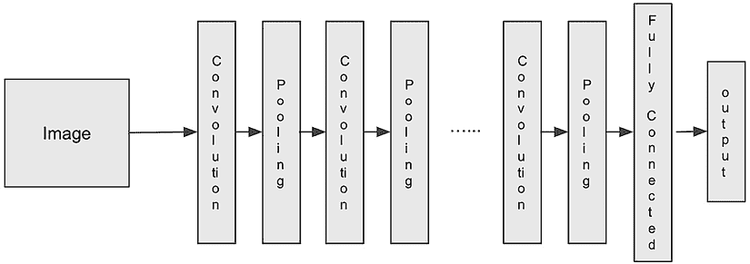

图 3.10：CNN 架构

由于 CNN 具有高度的并行性，因此基于 CNN 的模型提供了高效的训练。这对于涉及大规模图像数据的任务特别有利，因为并行处理可以显著加快训练时间。虽然 CNN 主要用于计算机视觉任务，但它们的成功已经导致它们在其他领域也得到了应用，包括自然语言处理。通过适应卷积和层次特征提取的原则，CNN 在文本分类和情感分析等任务中显示出希望。这证明了基于 CNN 的模型在计算机视觉传统应用之外的灵活性和有效性。

CNNs 有其局限性。由于复杂的架构，CNNs 缺乏可解释性，表现得像黑盒。这使得当模型可解释性至关重要时，它们不适用。此外，CNNs 需要大量的训练数据集来正确学习特征并避免过拟合。它们在较小数据集上的性能显著下降。

### ResNet

随着计算机视觉任务复杂性的增加，在卷积神经网络（CNNs）中增加更多层可以增强其图像分类能力，通过学习越来越复杂的特征。然而，随着 CNN 架构中层数的增加，性能可能会下降。这通常被称为**梯度消失**问题，其中来自初始输入的信号，包括关键信息，在穿过 CNN 的多个层时逐渐减弱。

**残差网络**（**ResNet**）通过实现层跳过技术来解决梯度消失问题。ResNet 不是按顺序通过每一层处理信号，而是引入了跳过连接，允许信号绕过某些层。这可以想象成一条出口较少的高速公路，使得早期层的信号得以保留并向前传递而不会损失。ResNet 架构在以下图中展示。

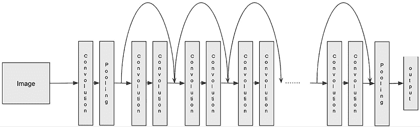

图 3.11：ResNet 架构

ResNet 可用于不同的计算机视觉任务，如**图像分类**、**目标检测**（检测图片中的所有对象）以及产生比传统 CNN 网络精度更高的模型。然而，ResNet 的一个潜在缺点是由于引入了跳过连接，计算复杂度增加。额外的连接需要更多的内存和计算资源，使得训练和推理比浅层架构更昂贵。

## 自然语言处理（NLP）问题的算法

自然语言处理（NLP）关注计算机与人类语言之间的关系。它涉及处理和分析大量自然语言数据，目的是使计算机能够理解人类语言背后的含义并从中提取有价值的信息。NLP 涵盖了数据科学领域内的广泛任务。其中一些任务包括文档分类、主题建模、语音转文本、文本生成语音、从文本中提取实体、语言翻译、理解和回答问题、阅读理解以及语言生成。

机器学习算法不能直接处理原始文本数据。为了有效地训练自然语言处理模型，有必要将输入文本中的单词转换成其他单词、句子或文档上下文中的数值表示。在嵌入技术发展之前，有两种广泛用于表示文本中单词相关性的方法：**词袋模型**（**BOW**）和**词频-逆文档频率**（**TF-IDF**）。

BOW（词袋模型）简单来说就是文本（文档）中单词出现的计数。例如，如果输入的文档是“我需要去银行存款”和“我沿着河岸散步”，并且你计算每个输入文档中每个独特单词的出现次数，你会得到单词“I”的计数为*1*，在第一个文档中单词“to”的计数为*3*，仅作为一个例子。如果我们有两个文档中所有独特单词的词汇表，第一个文档的向量表示可以是 `[1 1 3 1 1 1 1 1 1 0 0 0 0 0]`，其中每个位置代表词汇表中的一个独特单词（例如，第一个位置代表单词“I”，第三个位置代表单词“to”）。现在，这个向量可以被输入到机器学习算法中，以训练文本分类等模型。BOW 背后的主要思想是，在文本中，出现频率更高的单词具有更强的权重。

TF-IDF 有两个组成部分。第一个组成部分，*TF*，是词汇表中的单词在文档中出现的次数与文档中总单词数的比率。使用前面的第一个文档，单词“I”在第一句话中的 TF 值为*1/11*，而单词“walk”的 TF 值为*0/11*，因为“walk”没有出现在第一句话中。虽然 TF 衡量一个单词在文本上下文中的重要性，但 IDF 组件衡量一个单词在整个文档集中的重要性。从数学上讲，它是文档数量与包含该单词的文档数量的比率的对数。一个单词的 TF-IDF 最终值将是*TF*项乘以*IDF*项。一般来说，TF-IDF 比 BOW 效果更好。

虽然 BOW 和 TF-IDF 对于自然语言处理任务很有用，但它们缺乏捕捉单词语义意义的能力，并且经常导致输入向量大且稀疏。这就是嵌入概念发挥关键作用的地方。

嵌入是一种用于生成单词或句子低维表示（数学向量）的技术，它能够捕捉文本的语义意义。其基本思想是，具有相似语义意义的单词或句子往往出现在相似的环境中。在多维空间中，语义相似实体的数学表示彼此更接近，而意义不同的实体则更远。例如，如果我们考虑与运动相关的单词，如足球、网球和自行车，它们在高度嵌入空间中的嵌入会彼此靠近，这是通过诸如余弦相似度等度量来衡量的，余弦相似度通过计算它们之间角度的余弦值来衡量两个向量之间的相似度。嵌入向量代表了单词的内在意义，每个维度代表与单词相关联的特定属性。在多维空间中可视化嵌入显示了相关实体的邻近性。以下图表提供了这个多维空间中邻近性的视觉描述：

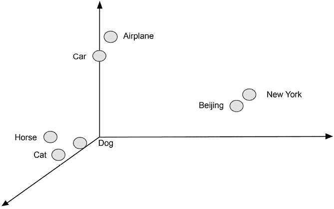

图 3.12：嵌入表示

现在，嵌入已经成为在大多数 NLP 任务中取得良好结果的关键组成部分。与简单的词频统计等其他技术相比，嵌入提供了更有意义的底层文本表示。这导致了它们在各种针对 NLP 设计的 ML 算法中的广泛应用。在本节中，我们将深入研究这些算法，如 BERT 和 GPT，探讨它们在 NLP 任务背景下的具体应用和优势。

### Word2Vec

托马斯·米科尔洛夫于 2013 年创建了**Word2Vec**。它支持两种不同的学习嵌入的技术：**连续词袋模型**（**CBOW**）和**连续跳字模型**。CBOW 试图预测给定窗口周围单词的一个单词，而连续跳字模型则试图预测给定单词的周围单词。Word2Vec 的训练数据集可以是任何可用的运行文本，例如**维基百科**。CBOW 生成训练数据集的过程是在运行文本上运行一个滑动窗口（例如，五个单词的窗口）并选择其中一个单词作为目标，其余作为输入（不考虑单词的顺序）。在连续跳字模型的情况下，目标和输入是相反的。有了训练数据集，问题可以转化为一个多类分类问题，其中模型将学习预测目标单词的类别（例如，词汇表中的单词）并为每个预测的单词分配一个概率分布。

Word2Vec 嵌入可以使用简单的单隐藏层 MLP 网络进行训练。在这种方法中，MLP 网络的输入是一个表示邻近单词的矩阵，而输出是目标单词的概率分布。在训练过程中，隐藏层的权重被优化，一旦训练完成，这些权重就作为单词的实际嵌入。生成的嵌入捕捉了单词的语义关系和上下文意义，使得它们可以在各种自然语言处理任务中有效利用。

由于大规模词嵌入训练可能成本高昂且耗时，Word2Vec 嵌入通常作为预训练任务进行训练，以便它们可以方便地用于下游任务，如文本分类或实体提取。这种将嵌入用作下游任务特征的方法称为**基于特征的应用**。公共领域中有预训练的嵌入（例如，Tomas Mikolov 的 *Word2Vec* 和斯坦福大学的 *GloVe*），可以直接使用。这些嵌入是每个单词与其向量表示之间的**1:1**映射。

### BERT

Word2Vec 为词汇表中的每个单词生成一个固定的嵌入表示，忽略了意义在上下文中的变化。然而，单词的意义可能因它们被使用的具体上下文而有所不同。例如，“bank”一词可以指代金融机构或水体旁边的土地。为了解决这个问题，已经开发出了上下文化的词嵌入。这些嵌入考虑了单词周围的其他单词或单词出现的整体上下文，从而允许更细腻和上下文感知的表示。通过考虑上下文，这些嵌入捕捉了单词可能具有的多种意义，使得在下游任务中可以进行更准确和上下文特定的分析。

**BERT**，即**来自 Transformer 的双向编码器表示**，是一种通过以下方式考虑上下文的语言模型：

+   预测句子（上下文）中随机遮蔽的单词并考虑单词的顺序。这也被称为**语言模型**。

+   从给定的句子中预测下一个句子。

2018 年发布，这种上下文感知的嵌入方法为单词提供了更好的表示，可以显著提高诸如**阅读理解**、**情感分析**和**命名实体识别**等语言任务。此外，BERT 在子词级别（例如，单词和字符之间的一个片段，例如，单词 *embeddings* 被分解为 *em*、*bed*、*ding* 和 *s*）生成嵌入。这使得它可以处理 Word2Vec 的另一个限制——**词汇表外**（**OOV**）问题，Word2Vec 只生成已知单词的嵌入，并将 OOV 单词简单地视为未知。

要使用 BERT 获得词嵌入，其过程与 Word2Vec 中使用的直接词到向量的映射不同。相反，句子被输入到一个预训练的 BERT 模型中，并动态地提取嵌入。这种方法生成的嵌入是在给定句子的上下文中上下文化的。除了词级嵌入外，BERT 还能够生成整个句子的嵌入。**预训练**是指使用输入标记学习嵌入的过程，以下图展示了 BERT 模型为此目的所涉及到的组件。

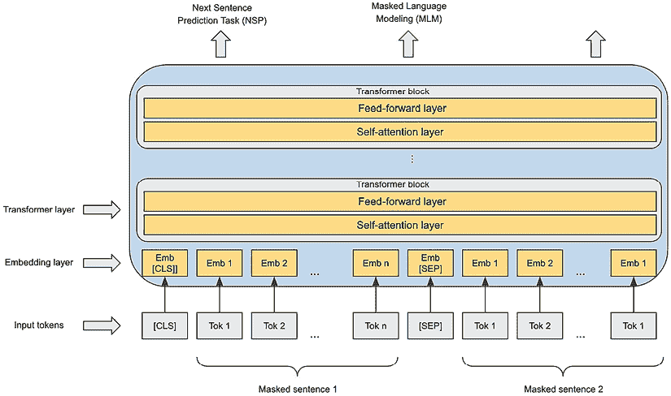

图 3.13：BERT 模型预训练

在架构上，BERT 主要使用一个称为**transformer**的构建块。transformer 内部有一堆编码器和一堆解码器，它将一个输入序列转换成另一个序列。每个编码器有两个组成部分：

+   自注意力层主要计算一个标记（表示为一个向量）与输入句子中所有其他标记之间的连接强度，这种连接有助于每个标记的编码。关于自注意力的一种思考方式是句子中哪些词比句子中的其他词更紧密地连接。例如，如果输入句子是*The dog crossed a busy street*，那么我们会说单词*dog*和*crossed*与单词*The*的连接比单词*a*和*busy*的连接更强，而后者将与单词*street*有较强的连接。自注意力层的输出是一系列向量；每个向量代表原始输入标记以及它在输入中与其他单词的重要性。

+   前馈网络层（单隐藏层 MLP）从自注意力层的输出中提取高级表示。

在解码器内部，也存在一个自注意力层和前馈层，以及一个额外的编码器-解码器层，这有助于解码器关注输入中的正确位置。

在 BERT 的情况下，只使用了 transformer 的编码器部分。BERT 可以用于多种 NLP 任务，包括*问答*、*文本分类*、*命名实体提取*和*文本摘要*。当它发布时，在许多任务中实现了最先进的性能。BERT 预训练也被应用于不同的领域，如科学文本和生物医学文本，以理解特定领域的语言。以下图展示了如何使用微调技术使用预训练的 BERT 模型训练一个问答任务的模型：

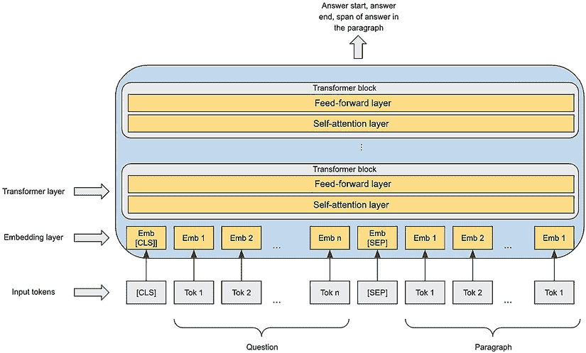

图 3.14：BERT 微调

虽然 BERT 的预训练嵌入可以提取用于下游任务，如文本分类和问答，但使用其预训练嵌入的一种更直接的方法是通过一种称为**微调**的技术。通过微调，BERT 网络中添加了一个额外的输出层以执行特定任务，例如问答或实体提取。在微调过程中，加载预训练模型，并插入特定任务的输入（例如，问答中的问题/段落对）和输出（段落中答案的起始/结束和跨度）以微调特定任务的模型。通过微调，预训练模型的权重得到更新。

## 生成式 AI 算法

尽管像 ChatGPT 这样的技术已经普及了生成式 AI，但生成模型的概念并不新鲜。**生成对抗网络**（GANs），作为生成式 AI 技术的突出例子，已经存在多年，并在各种实际应用领域取得了成功，其中图像合成是一个显著的应用。生成式 AI 已成为最具变革性的 AI 技术之一，我专门在*第十五章和第十六章*中深入探讨了实际生成式 AI 用例、实用技术解决方案和伦理考量。在本章中，我们将熟悉几种生成式 AI 算法。

### 生成对抗网络

GAN 是一种旨在生成真实数据实例的生成模型，例如图像。它采用由生成器和判别器组成的两部分网络。生成器网络负责生成实例，而判别器网络学习区分生成器生成的真实和假实例。这种对抗性设置鼓励生成器不断改进其生成越来越真实数据实例的能力。

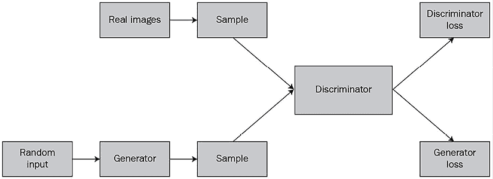

图 3.15：GAN

在训练过程中，GAN 中的判别器网络暴露于两种不同的数据源：一种来自真实数据集，作为正例，另一种来自生成器网络，生成合成或假样本。判别器被训练以分类和区分真实和假样本，优化其损失以准确预测每个样本的来源。相反，生成器网络被训练以生成看起来与真实数据不可区分的合成数据，目的是欺骗判别器。当判别器正确识别其生成的数据为假时，生成器会受到惩罚。

两个网络都使用反向传播来学习和更新它们的参数，使它们能够迭代地改进。在生成阶段，生成器被提供随机输入以产生新的合成样本。在整个训练过程中，生成器和判别器网络交替以连接方式训练，使它们能够作为一个统一系统学习和优化它们的性能。

GANs 在生成能够欺骗人类的逼真图像方面取得了很大的成功。它们可以应用于许多应用，例如将草图转换为逼真的图像，将文本输入转换为与文本对应的图像，以及生成逼真的人类面孔。然而，在训练期间使 GANs 收敛和稳定可能很困难，导致学习失败等问题。此外，在逼真图像生成方面出现了新的技术，它们比 GANs 的能力要强得多。

### 生成预训练转换器（GPT）

与 BERT 不同，BERT 需要使用大型特定领域数据集进行微调，以针对不同的下游 NLP 任务，而**生成预训练转换器**（**GPT**），由**OpenAI**开发，只需看到几个示例（或没有示例）就能学习如何执行任务。这个过程被称为**少样本学习**或**零样本学习**。在少样本场景中，GPT 模型被提供几个示例、任务描述和提示，然后模型将使用这些输入并开始逐个生成输出标记。例如，当使用 GPT-3 进行翻译时，任务描述可以是“将英语翻译成中文”，训练数据将包括一些从英语句子翻译成中文句子的示例。要使用训练好的模型翻译新的英语句子，你提供英语句子作为提示，然后模型生成相应的中文翻译文本。需要注意的是，少样本或零样本学习不涉及更新模型的参数权重，这与微调技术不同。

GPT，就像 BERT 一样，以 Transformer 架构作为其主要组件，并采用了一种称为下一个词预测的训练方法。这包括预测给定输入词序列后应跟的单词。然而，GPT 与 BERT 不同，它仅使用 Transformer 解码器块，而 BERT 使用 Transformer 编码器块。与 BERT 一样，GPT 通过包含掩码词来学习嵌入。然而，与 BERT 随机掩码单词并预测缺失的单词不同，GPT 将自注意力计算限制为排除目标词右侧的单词。这种方法被称为掩码自注意力。

GPT 及其聊天机器人界面 ChatGPT 在众多传统的自然语言处理任务中展示了卓越的能力，如语言建模、语言翻译和问答。此外，它们在开创性领域如生成编程代码或机器学习代码、编写网站内容以及回答问题方面也证明了其有效性。因此，GPT 为一种新的 AI 范式——生成式 AI 铺平了道路。

### 大型语言模型

**大型语言模型**（**LLMs**）是一类能够生成文本、翻译语言、创作内容以及为问题提供信息性答案的生成式人工智能模型。LLMs 在包含文本和代码的广泛数据集上训练，拥有数十亿个模型参数，这使得它们能够理解和学习词语和短语之间的统计模式和关系。例如，经过训练后，LLM GPT-3 拥有 1750 亿个参数。这种训练使得 LLMs 能够有效地处理和生成跨越广泛应用的类似人类的文本。虽然 GPTs 是 LLMs 的一个显著例子，但近年来开源社区和其他公司也开发了额外的 LLMs，主要使用类似的基于 Transformer 的架构。LLMs 也被称为基础模型。与为特定任务训练的传统机器学习模型不同，基础模型是在大量数据集上预训练的，可以处理多个任务。此外，基础模型还可以进行微调和适应额外任务。基础模型的卓越能力和适应性发现了许多以前难以解决的令人兴奋的 AI 应用。现在，让我们简要回顾一下其他一些流行的基础模型：

+   **Google 的 Pathways 语言模型**（**PaLM**）是一个仅具有解码器功能的 5400 亿参数 Transformer 模型。它提供了与 GPT 类似的特性，包括文本生成、翻译、代码生成、问答、摘要以及支持创建聊天机器人。PaLM 使用一种名为 Pathways 的新架构进行训练。Pathways 是一种模块化架构，意味着它由模块组成，每个模块负责特定任务。

+   **Meta 的大型语言模型 Meta AI**（**LLaMA**）是一个从 70 亿参数到 650 亿参数的多种尺寸的 LLM。与 GPT 和 PaLM 相比，它是一个较小的模型，但提供了几个优势，例如需要较少的计算资源。LLaMA 提供了与其他 LLM 类似的特性，如生成创意文本、回答问题和解决数学问题。Meta 为 LLaMA 发布了非商业许可证，强调其在研究环境中的使用。当 LLaMA 与额外的训练数据进行微调时，它被发现表现极为出色。

+   **大科学 BLOOM**是一个拥有 1760 亿参数的 LLM，能够用 46 种不同的语言和 13 种编程语言生成文本。BLOOM 的开发涉及来自 70 多个国家和 250 多个机构的 1000 多名研究者的协作努力。作为负责任的 AI 许可证的一部分，同意其条款的个人和机构可以在他们的本地机器或云平台上使用和构建该模型。该模型在 Hugging Face 生态系统中易于访问。

+   **彭博 BloombergGPT** – 虽然像 GPT 和 LLaMA 这样的通用 LLM 在不同的领域域中可以很好地执行各种任务，但像金融服务和生命科学这样的领域需要特定领域的 LLM 来解决针对特定领域的难题。BloombergGPT 是专门为行业训练的领域特定 LLM 的例子。BloombergGPT 在将这项技术应用于金融方面取得了重大进步。该模型将增强现有的金融 NLP 任务，如情感分析、命名实体识别、新闻分类和问答等。利用其广泛的收集和策划资源，彭博利用其 40 年的金融语言文档档案，形成了一个包含 3630 亿个标记的全面数据集，包括英语金融文档。该数据集通过一个 3450 亿个标记的公共数据集进行了增强，从而产生了超过 7000 亿个标记的训练语料库。

虽然这些 LLM 模型已经展示了非凡的能力，但它们也伴随着重大的局限性，包括生成错误信息（幻觉）和有害内容，以及显示潜在的偏见。LLM 在训练和运行时也消耗了大量的资源。值得注意的是，虽然 LLM 可以帮助解决一些新问题，但许多常见问题（例如，命名实体提取、文档分类、情感分析）已经通过现有的 NLP 技术得到解决，这些技术仍然是这些任务的可行选项。

### 扩散模型

最近，AI 在生成高分辨率、逼真图像以及以前未见过的生成艺术或精确操纵图像方面的非凡能力引起了广泛关注。所有这些令人惊叹的能力背后是一个新的深度学习模型，称为扩散模型。在深度学习和 GANs 的基础上，扩散模型引入了一种生成高质量、逼真数据实例的新方法。

与试图通过欺骗判别网络生成逼真假图像的 GANs 不同，扩散模型通过首先在输入数据（例如，图像）上逐步添加噪声，经过许多步骤，直到输入数据无法识别，这个过程称为扩散步骤。

然后，该模型被训练以从噪声到原始数据的扩散步骤进行逆向操作。从更技术性的角度来说，扩散模型的训练过程涉及通过反向传播优化一组可学习的参数。模型通过最大化给定一系列扩散步骤的训练数据的似然性来学习生成逼真的样本。这个迭代过程允许模型捕捉复杂的依赖关系、复杂的模式和结构，并生成高度逼真和多样化的数据实例。以下图示说明了这个过程：

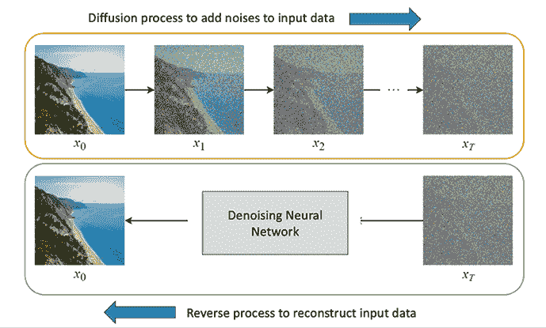

图 3.16：扩散模型的工作原理

此外，扩散模型在生成过程中提供了灵活性和可控性。通过调整扩散步骤，可以控制样本质量和多样性之间的权衡。这使用户能够微调模型以满足他们的特定需求，无论是强调对训练数据的忠实度，还是鼓励更多创造性和新颖的输出。与 GANs 相比，扩散模型可以生成更逼真的图像，并且比 GANs 更稳定。

扩散模型在计算机视觉、自然语言处理和音频合成等各个领域都显示出巨大的潜力。它生成具有精细细节的高质量数据的能力为图像生成、视频预测、文本生成等应用开辟了令人兴奋的可能性。

开源社区和私营公司已经基于这种扩散方法开发了众多模型。其中两个值得提到的流行模型是 Stable Diffusion 和 DALL-E 2：

+   **OpenAI 的 DALL-E 2**：DALL-E 2 是由 OpenAI 开发的一种文本到图像模型。DALL-E 2 使用图像和文本描述的数据集进行训练。首次发布于 2022 年 1 月，DALL-E 2 在从文本描述生成和操作图像方面显示出非凡的能力。它还应用于图像修复（修改图像中的区域）、图像扩展（扩展图像）和图像到图像的翻译。DALL-E 2 生成的图像通常与真实图像难以区分，可用于各种目的，如创作艺术和生成营销材料。从模型训练的角度来看，DALL-E 2 的训练包括两个关键步骤：

    +   **链接文本语义和视觉表示**：这一步涉及学习如何将一段文本，例如“一个戴帽子的男人”，在语义上与实际的“一个戴帽子的男人”图像相联系。为此，DALL-E 2 使用一种称为**对比语言-图像预训练**（**CLIP**）的模型。CLIP 使用数亿张图像及其相关描述进行训练。训练完成后，它可以根据一段文本描述输出一个文本条件下的视觉编码。您可以在[`openai.com/research/clip`](https://openai.com/research/clip)了解更多关于 CLIP 的信息。

    +   **从视觉嵌入生成图像**：这一步学习从 CLIP 生成的视觉嵌入中逆向生成图像。为此步骤，DALL-E 2 使用了一个名为 GLIDE 的模型，该模型基于扩散模型。您可以在[`arxiv.org/abs/2112.10741`](https://arxiv.org/abs/2112.10741)了解更多关于 GLIDE 的信息。

    模型训练完成后，DALL-E 2 可以生成与输入文本描述密切相关的新图像。

+   **Stable Diffusion by Stability AI**：Stable Diffusion 是由慕尼黑路德维希-马克西米利安大学的计算机视觉研究小组 Compvis 开发并由 Stability AI 主要赞助的算法。该模型也是一个使用真实图像和文本描述的数据集进行训练的文本到图像模型，这使得模型能够使用文本描述生成逼真的图像。首次发布于 2022 年 8 月，Stable Diffusion 已被证明在从文本描述生成高质量图像方面非常有效。在架构上，它使用 CLIP 编码器对模型进行文本描述的条件化，并使用 UNET 作为去噪神经网络从视觉编码中生成图像。它是一个开源模型，代码和模型权重已公开发布。您可以在[`github.com/CompVis/stable-diffusion`](https://github.com/CompVis/stable-diffusion)上获取更多关于 Stable Diffusion 的详细信息。

尽管扩散模型非常强大，但它们确实带来了一些担忧，包括版权侵权和有害图像的创建。

# 动手练习

在这个动手练习中，我们将在您的本地机器上构建一个**Jupyter** **Notebook**环境，并在您的本地环境中构建和训练一个 ML 模型。练习的目标是熟悉设置本地数据科学环境的安装过程，然后学习如何使用我们在前面章节中介绍的一种算法来分析数据、准备数据和训练 ML 模型。首先，让我们看一下问题陈述。以下图表说明了流程：

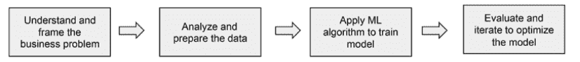

图 3.17：ML 问题解决流程

让我们开始吧。

## 问题陈述

在我们开始之前，让我们首先回顾一下我们需要解决的商业问题。一家零售银行一直在经历其零售银行业务的高客户流失率。为了主动实施预防措施以减少潜在的流失，银行需要知道潜在的流失者是谁，这样银行就可以直接针对这些客户提供激励措施，以防止他们离开。从商业角度来看，吸引新客户比提供激励措施以保留现有客户要昂贵得多。

作为一名 ML 解决方案架构师，您被要求运行一些快速实验以验证该问题的 ML 方法。目前没有可用的 ML 工具，因此您决定在您的本地机器上设置一个 Jupyter 环境来完成这项任务。

## 数据集描述

您将使用 Kaggle 网站上的银行客户流失数据集进行建模。您可以通过 [`www.kaggle.com/mathchi/churn-for-bank-customers`](https://www.kaggle.com/mathchi/churn-for-bank-customers) 访问数据集。请注意，您需要 Kaggle 账户才能下载文件。该数据集包含 14 个特征列，如信用评分、性别和余额，以及一个目标变量列 `Exited`，用于指示客户是否流失。我们将在后面的章节中更详细地审查这些特征。

## 设置 Jupyter Notebook 环境

现在，让我们设置一个本地数据科学环境，用于数据分析和实验。我们将使用您本地计算机上的流行 Jupyter Notebook。在本地机器上设置 Jupyter Notebook 环境包括以下关键组件：

+   **Python**：Python 是一种通用编程语言，也是数据科学工作中最受欢迎的编程语言之一。安装说明可以在 [`www.python.org/downloads`](https://www.python.org/downloads) 找到。

+   **PIP**：PIP 是一个 Python 包安装程序，用于安装不同的 Python 库包，如机器学习算法、数据处理库或可视化库。安装说明可以在 [`pip.pypa.io/en/stable/installation/`](https://pip.pypa.io/en/stable/installation/) 找到。

+   **Jupyter Notebook**：Jupyter Notebook 是一个用于编写包含代码、描述和/或可视化的文档（称为笔记本）的 Web 应用程序。它是数据科学家用于实验和建模最受欢迎的工具之一。安装说明可以在 [`jupyter.org/install`](https://jupyter.org/install) 找到。

## 运行练习

按照以下步骤运行实验室：

1.  环境配置完成后，让我们开始实际的数据科学工作。首先，下载数据文件：

    1.  让我们在本地机器上创建一个名为 `MLSALab` 的文件夹来存储所有文件。您可以在本地机器上的任何位置创建该文件夹，只要您能访问它。我有一个 Mac，所以我直接在默认用户的 `Documents` 文件夹中创建了一个。

    1.  在 `MLSALab` 文件夹下创建另一个名为 `Lab1-bankchurn` 的子文件夹。

    1.  访问 [`www.kaggle.com/mathchi/churn-for-bank-customers`](https://www.kaggle.com/mathchi/churn-for-bank-customers) 网站，下载数据文件（一个存档文件），并将其保存到 `MSSALab/Lab1-bankchurn` 文件夹中。如果您还没有账户，请创建一个 Kaggle 账户。在文件夹内解压存档文件，您将看到一个名为 `churn.csv` 的文件。现在您可以删除存档文件。

1.  启动 Jupyter Notebook：

    1.  在终端窗口（或 Windows 系统的命令提示符窗口）中，导航到 `MLSALab` 文件夹，并运行以下命令以在您的机器上启动 Jupyter Notebook 服务器：

        ```py
        jupyter notebook 
        ```

        将打开一个浏览器窗口并显示 Jupyter Notebook 环境（见以下截图）。有关 Jupyter Notebook 如何工作的详细说明超出了本实验的范围。如果您不熟悉 Jupyter Notebook 的工作方式，您可以在互联网上轻松找到相关信息：

        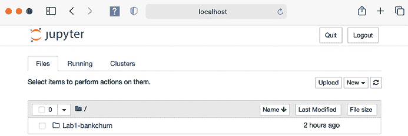

        图 3.18：Jupyter Notebook

    1.  点击 `Lab1-bankchurn` 文件夹，您将看到 `churn.csv` 文件。

1.  现在，让我们在 Jupyter Notebook 环境中创建一个新的数据科学笔记本。为此，点击 **新建** 下拉菜单并选择 **Python 3**（见以下截图）：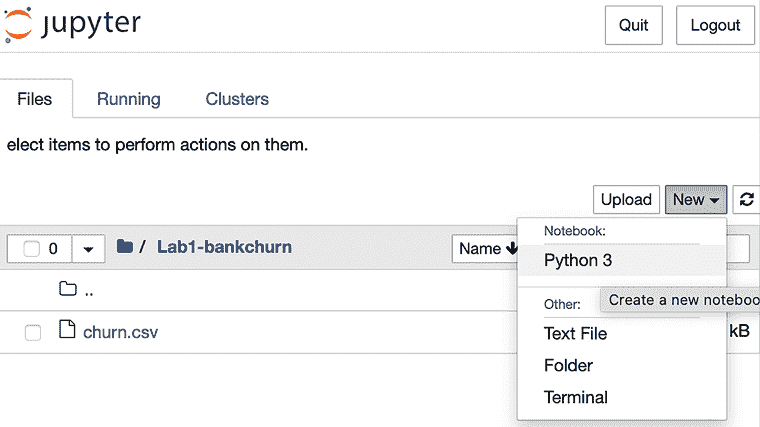

    图 3.19：创建新的 Jupyter 笔记本

1.  您将看到一个类似于以下截图的屏幕。这是一个空的笔记本，我们将使用它来探索数据和构建模型。**In [ ]:** 旁边的部分称为 **单元格**，我们将在此单元格中输入代码。要运行单元格中的代码，您点击工具栏上的 **运行** 按钮。要添加新的单元格，您点击工具栏上的 **+** 按钮：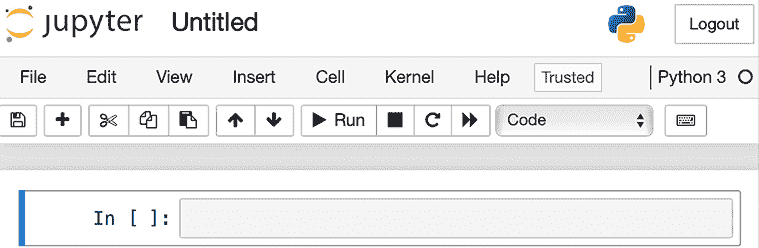

    图 3.20：空的 Jupyter 笔记本

1.  通过点击工具栏上的 **+** 按钮添加新的单元格，在第一个空单元格中输入以下代码块，并通过点击工具栏上的 **运行** 按钮来运行单元格。此代码块下载了用于数据处理（`pandas`）、可视化（`matplotlib`）以及模型训练和评估（`scikit-learn`）的多个 Python 包。我们将在第五章 *探索开源机器学习库* 中更详细地介绍 scikit-learn。我们将在以下章节中使用这些包：

    ```py
    ! pip3 install pandas
    ! pip3 install matplotlib
    ! pip3 install scikit-learn 
    ```

1.  现在，我们可以加载数据并探索。在新的单元格中添加以下代码块以加载 Python 库包并从 `churn.csv` 文件加载数据。您将看到一个包含 14 列的表格，其中 `Exited` 列是目标列：

    ```py
    import pandas as pd
    churn_data = pd.read_csv("churn.csv")
    churn_data.head() 
    ```

1.  您可以使用以下命令使用多种工具探索数据集，以理解信息，例如 *数据集统计*、*不同特征之间的成对相关性* 和 *数据分布*。`describe()` 函数返回有关数据的基本统计信息，例如均值、标准差、最小值和最大值，针对每个数值列。

    `hist()` 函数绘制所选列的直方图，而 `corr()` 计算数据中不同特征之间的相关矩阵。请在新的单元格中逐个尝试它们，以了解数据：

    ```py
    # The following command calculates the various statistics for the features.
    churn_data.describe()
    # The following command displays the histograms for the different features.  
    # You can replace the column names to plot the histograms for other features
    churn_data.hist(['CreditScore', 'Age', 'Balance'])
    # The following command calculate the correlations among features
    churn_data.corr() 
    ```

1.  为了用于模型训练，数据集需要进行转换。以下代码块将`Geography`和`Gender`值从分类字符串转换为序数，以便它们可以被 ML 算法后续使用。请注意，模型准确性不是这个练习的主要目的，我们进行序数转换是为了演示。我们将在这个练习中使用一个流行的 Python ML 库，即 sklearn。Sklearn 也是最容易使用和理解的库之一，特别是对于初学者。我们还会在*第五章，探索开源 ML 库*中更详细地讨论这个库。请在新的单元格中复制并运行以下代码块：

    ```py
    from sklearn.preprocessing import OrdinalEncoder
    encoder_1 = OrdinalEncoder()
    encoder_2 = OrdinalEncoder()
    churn_data['Geography_code'] = encoder_1.fit_transform(
      churn_data[['Geography']]
    )
    churn_data['Gender_code'] = encoder_2.fit_transform(
      churn_data[['Gender']]
    ) 
    ```

1.  通常，可能有一些列对于模型训练不是必需的，因为它们不会对模型的预测能力做出贡献，或者从包含的角度来看可能会引起偏差。我们可以使用以下代码块来删除它们：

    ```py
    churn_data.drop(columns = ['Geography','Gender','RowNumber','Surname'], inplace=True) 
    ```

1.  现在，数据集只包含我们关心的特征。接下来，我们需要将数据分为训练集和验证集。我们还通过从其余输入特征中分割目标变量`Exited`来准备每个数据集。请在新的单元格中输入并运行以下代码块：

    ```py
    # we import the train_test_split class for data split
    from sk.model_selection import train_test_split
    # Split the dataset into training (80%) and testing (20%).
    churn_train, churn_test = train_test_split(
      churn_data, test_size=0.2
    )
    # Split the features from the target variable "Exited" as it is required for model training
    # and validation later.
    churn_train_X = churn_train.loc[:, churn_train.columns != 'Exited']
    churn_train_y = churn_train['Exited']
    churn_test_X = churn_test.loc[:, churn_test.columns != 'Exited']
    churn_test_y = churn_test['Exited'] 
    ```

1.  我们已经准备好训练模型。请在新的单元格中输入并运行以下代码块。在这里，我们将使用随机森林算法来训练模型，`fit()`函数启动模型训练：

    ```py
    # We will use the Random Forest algorithm to train the model
    from sklearn.ensemble import RandomForestClassifier
    bank_churn_clf = RandomForestClassifier(
      max_depth=2, random_state=0
    )
    bank_churn_clf.fit(churn_train_X, churn_train_y) 
    ```

1.  最后，我们将使用`test`数据集来测试模型的准确性。在这里，我们使用`predict()`函数获取模型返回的预测值，然后使用`accuracy_score()`函数通过预测值（`churn_prediction_y`）和测试数据集的真实值（`churn_test_y`）来计算模型的准确性：

    ```py
    # We use the accuracy_score class of the sklearn library to calculate the accuracy.
    from sklearn.metrics import accuracy_score
    # We use the trained model to generate predictions using the test dataset
    churn_prediction_y = bank_churn_clf.predict(churn_test_X)
    # We measure the accuracy using the accuracy_score class.
    accuracy_score(churn_test_y, churn_prediction_y) 
    ```

恭喜！你已经在本地机器上成功安装了 Jupyter 数据科学环境，并使用随机森林算法训练了一个模型。你已经验证了 ML 方法有可能解决这个商业问题。

# 摘要

在本章中，我们探讨了各种可以应用于解决不同类型机器学习（ML）问题的 ML 算法。到目前为止，你应该对哪些算法适合哪些特定任务有了很好的理解。此外，你已经在本地机器上设置了一个基本的数据科学环境，利用 scikit-learn ML 库来分析和预处理数据，并成功训练了一个 ML 模型。

在接下来的章节中，我们的重点将转向数据管理和 ML 生命周期的交集。我们将深入研究有效数据管理的重要性，并讨论如何构建一个综合性的数据管理平台在**亚马逊网络服务**（**AWS**）上以支持下游的 ML 任务。这个平台将提供必要的基础设施和工具来简化数据处理、存储和检索，从而最终提高整体的 ML 工作流程。

# 加入我们的 Discord 社区

加入我们社区的 Discord 空间，与作者和其他读者进行讨论：

[`packt.link/mlsah`](https://packt.link/mlsah)


