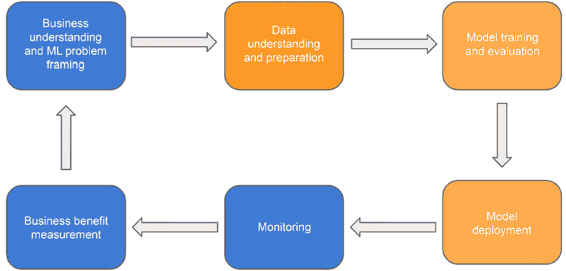
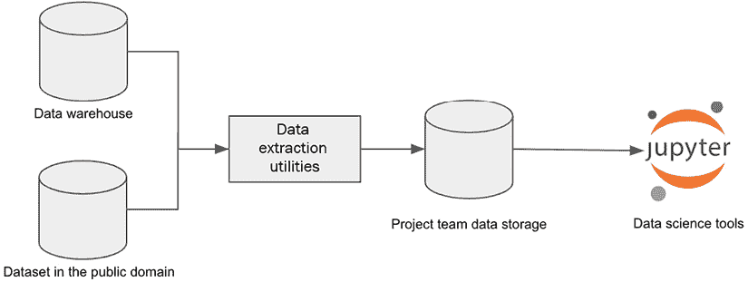
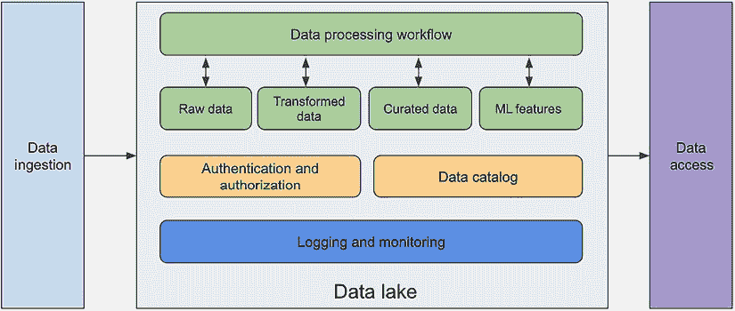
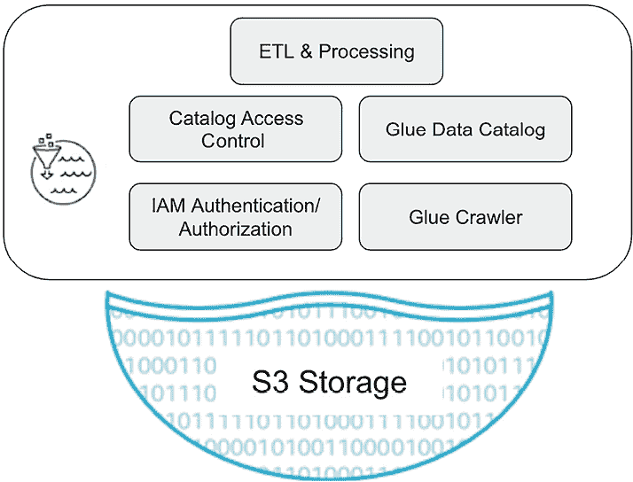
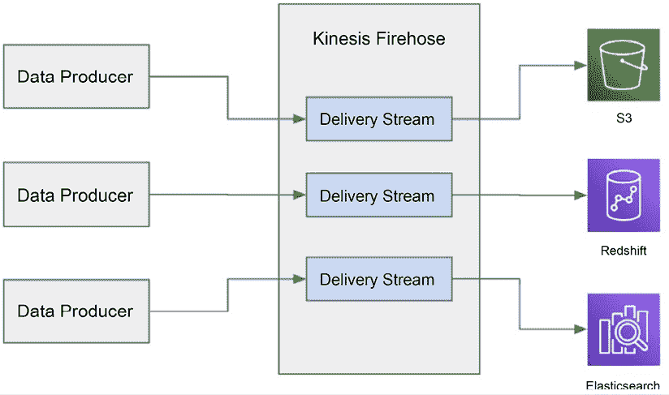
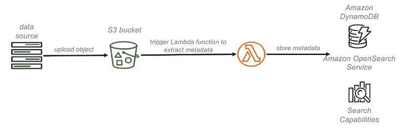
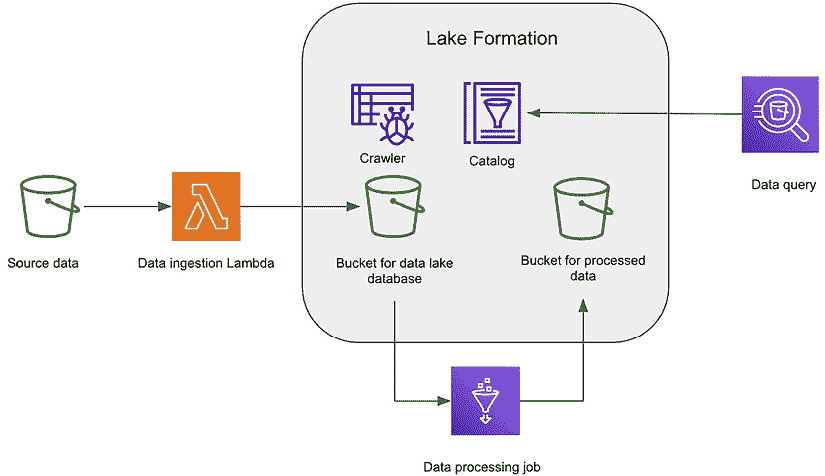
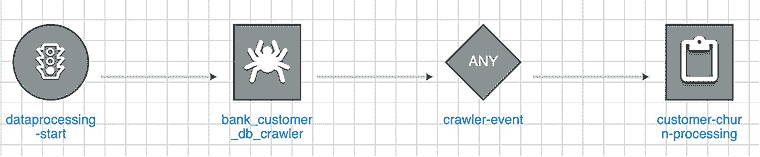
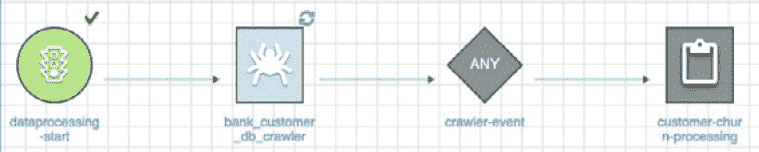

# 4

# 机器学习的数据管理

作为机器学习解决方案架构师，我经常收到关于设计机器学习工作负载的数据管理平台的指导请求。尽管数据管理平台架构通常被视为一个独立的技术学科，但它对机器学习工作负载起着至关重要的作用。为了创建一个全面的机器学习平台，机器学习解决方案架构师必须了解机器学习的基本数据架构考虑因素，并熟悉满足数据科学家和自动化机器学习管道需求的数据管理平台的技术设计。

在本章中，我们将探讨数据管理和机器学习（ML）的交汇点，讨论为机器学习量身定制的数据管理平台的关键考虑因素。我们将深入研究此类平台的核心架构组件，并检查可用于构建该平台的相关 AWS 技术和服务。

以下内容将涵盖：

+   机器学习的数据管理考虑因素

+   机器学习的数据管理架构

+   实践练习 – 机器学习的数据管理

# 技术要求

在本章中，您需要访问 AWS 账户以及 AWS 服务，如**Amazon S3**、**Amazon Lake Formation**、**AWS Glue**和**AWS Lambda**。如果您没有 AWS 账户，请按照 AWS 官方网站的说明创建账户。

# 机器学习的数据管理考虑因素

数据管理是一个广泛且复杂的话题。许多组织都设有专门的数据管理团队和组织来管理和治理数据平台的各种方面。从历史上看，数据管理主要围绕满足事务系统和分析系统的需求展开。然而，随着机器学习解决方案的兴起，在考虑数据管理平台时，现在还需要考虑额外的商业和技术因素。机器学习的出现引入了新的需求和挑战，这需要数据管理实践的发展，以有效地支持这些高级解决方案。

为了理解数据管理如何与机器学习工作流程相交，让我们回顾一下以下图中所示的机器学习生命周期：



图 4.1：数据管理和机器学习生命周期的交汇

在高层次上，数据管理在三个阶段与机器学习生命周期相交：*数据理解和准备*、*模型训练和评估*以及*模型部署*。

在**数据理解和准备**阶段，数据科学家需要执行多项基本任务。他们首先识别与建模任务相关的合适数据集的数据来源。然后进行探索性数据分析，以了解数据集，包括数据统计、特征之间的相关性以及数据样本分布。此外，为模型训练和验证准备数据至关重要，通常包括以下步骤：

+   **数据验证**：检查数据中的错误和异常，以确保其质量。这包括验证数据范围、分布和数据类型，并识别缺失或空值。

+   **数据清洗**：任何识别出的数据错误都需被修正或更正，以确保数据集的准确性和一致性。这可能包括删除重复项、处理缺失值或解决不一致性。

+   **数据丰富**：通过合并不同数据集或转换数据等技术从数据中提取额外价值。这有助于生成新的信号和洞察，从而增强建模过程。

+   **数据标注**：对于监督式机器学习模型训练，训练和测试数据集需要由人工标注员或机器学习模型准确标注。这一关键步骤对于确保高质量模型的发展和验证是必要的。

在这一阶段所需的数据管理能力包括以下方面：

+   **数据集发现**：能够使用相关元数据（如数据集名称、描述、字段名称和数据所有者）搜索和定位经过整理的数据集。

+   **数据访问**：能够访问原始和经过处理的数据集以执行探索性数据分析。这确保数据科学家可以有效地探索和分析数据。

+   **查询和检索**：运行查询以针对选定数据集获取详细信息的能力，例如统计信息、数据质量指标和数据样本。此外，还包括将数据从数据管理平台检索到数据科学环境进行进一步处理和特征工程的能力。

+   **可扩展的数据处理**：在大型数据集上高效执行数据处理操作的能力。这确保数据科学家在模型开发和实验过程中可以处理和加工大量数据。

在**模型训练和验证**阶段，数据科学家负责生成训练和验证数据集以进行正式的模型训练。为了促进这一过程，以下数据管理能力是必不可少的：

+   **数据处理和自动化工作流**：数据管理平台应提供强大的数据处理能力以及自动化工作流。这使将原始或整理好的数据集转换为适合模型训练的多种格式的训练和验证数据集成为可能。

+   **数据存储库和版本控制**：一个高效的数据管理平台应提供专门的数据存储库来存储和管理训练和验证数据集。此外，它应支持版本控制，使数据科学家能够跟踪对数据集进行的不同迭代和修改，以及代码和训练好的机器学习模型的版本。

+   **数据标注**：对于监督式机器学习模型训练，训练和测试数据集需要由人工标注员或机器学习模型准确标注。这一关键步骤对于确保高质量模型的发展和验证至关重要。这是一项劳动密集型任务，需要专门构建的软件工具来大规模完成。

+   **机器学习特征/嵌入生成和存储**：一些机器学习特征/嵌入（例如，平均值、总和和文本嵌入）需要为一个或多个下游模型训练任务预先计算。这些特征/嵌入通常需要使用专门构建的工具进行管理，以实现高效的访问和重用。

+   **为模型训练提供数据集**：平台应提供机制，将训练和验证数据集提供给模型训练基础设施。这确保了数据集可由训练环境访问，使数据科学家能够有效地训练模型。

在模型部署阶段，重点转向利用训练好的模型进行预测。为了有效地支持这一阶段，以下数据管理能力至关重要：

+   **为特征处理提供数据**：数据管理平台应能够在调用部署的模型时，作为输入数据的一部分提供用于特征处理的数据。这确保了模型接收到生成预测所需的相关数据输入。

+   **提供预计算的特性和嵌入**：在某些情况下，在调用部署的模型时，会使用预计算的特性和嵌入作为输入。数据管理平台应具备无缝提供这些预计算特性的能力，使模型能够将它们纳入预测过程。

与传统的事务或商业智能解决方案的数据访问模式不同，在这些模式中，开发者可以在较低的环境中利用非生产数据进行开发，数据科学家通常需要访问生产数据以进行模型开发。

在探讨了机器学习数据管理的考虑因素之后，我们将更深入地探讨专门为机器学习设计的机器学习数据管理架构。重要的是要理解，有效的数据管理对于应用机器学习的成功至关重要。组织在机器学习上失败的原因不仅仅是算法差或模型不准确，还可能是由于现实世界数据和生产系统的问题。数据管理的不足可能会使即使建模出色的人工智能项目失败。

# 机器学习的数据管理架构

根据你的 ML 倡议的规模，考虑不同的数据管理架构模式以有效支持它们是很重要的。正确的架构取决于组织内 ML 倡议的规模和范围，以便在业务需求和工程努力之间取得平衡。

对于具有有限数据范围、小型团队规模和最小跨职能依赖性的*小型 ML 项目*，一个专门构建的、满足特定项目需求的数据管道可能是一个合适的方法。例如，如果你的项目涉及从现有的数据仓库和公开可用的数据集中获取结构化数据，你可以考虑开发一个简单的数据管道。这个管道将从数据仓库和公共领域提取必要的数据，并将其存储在项目团队拥有的专用存储位置。此数据提取过程可以根据需要安排，以方便进一步的分析和处理。以下图表展示了一个简化的数据管理流程，旨在支持小型 ML 项目：



图 4.2：有限范围 ML 项目的数据架构

对于企业层面的*大规模 ML 倡议*，数据管理架构与企业分析非常相似。两者都需要对来自不同来源的数据摄取提供强大的支持，以及针对各种处理和访问需求的数据集中管理。虽然分析数据管理主要处理结构化数据，并且通常依赖于企业数据仓库作为其核心后端，但 ML 数据管理需要处理结构化、半结构化和非结构化数据以执行不同的 ML 任务。因此，通常采用数据湖架构。ML 数据管理通常是更广泛的企业数据管理策略的一部分，包括分析和 ML 倡议。

以下图表展示了一个包含关键组件如数据摄取、数据存储、数据处理、数据目录、数据安全和数据访问的逻辑企业数据管理架构：



图 4.3：企业数据管理

在以下章节中，我们将深入分析企业数据管理的每个关键组件，提供对它们在云中使用 AWS 原生服务构建的数据管理架构中的功能和影响的深入了解。通过探索这些组件的具体特性和能力，我们将获得关于基于 AWS 的数据管理架构的整体结构和机制的有价值见解。

## 数据存储和管理

数据存储和管理是整体机器学习（ML）数据管理架构的基本组成部分。ML 工作负载通常需要来自不同来源和多种格式的数据，尤其是处理非结构化数据时，数据量可能非常庞大。

为了满足这些需求，云对象数据存储解决方案，如 Amazon S3，通常被用作底层存储介质。从概念上讲，云对象存储可以类比为一种能够容纳不同格式文件的文件存储系统。此外，存储系统允许使用前缀来组织文件，这些前缀作为虚拟文件夹，以增强对象管理。需要注意的是，这些前缀并不对应于物理文件夹结构。术语“对象存储”源于每个文件都被视为一个独立的对象，附带元数据，并分配一个唯一的标识符。对象存储具有诸如几乎无限的存储容量、基于元数据的强大对象分析、基于 API 的访问和成本效益等特性。

为了有效地处理存储在云对象存储中的大量数据，建议实施一个利用这种存储介质的数据湖架构。一个针对整个企业或特定业务线量身定制的数据湖，充当数据管理和访问的中心枢纽。设计用于容纳无限数据量，数据湖促进了数据在各个生命周期阶段（包括原始、转换、精选和 ML 特征数据）的组织。其主要目的是将分散的数据孤岛合并到一个单一的存储库中，以便为分析和 ML 需求提供集中式管理和访问。值得注意的是，数据湖可以容纳多种数据格式，如来自数据库的结构化数据、文档等非结构化数据、JSON 和 XML 格式的半结构化数据，以及包含图像、视频和音频文件的二进制格式。这种能力对于 ML 工作负载尤其有价值，因为 ML 通常涉及处理多种格式的数据。

数据湖应组织成不同的区域。例如，应建立一个*着陆区*作为来自不同来源的初始数据摄入的目标。在数据预处理和数据质量管理处理之后，数据可以被移动到原始数据区。*原始数据区*中的数据可以进一步转换和处理，以满足不同的业务和下游消费需求。为了进一步确保数据集的使用可靠性，数据可以被精选并存储在*精选数据区*中。对于 ML 任务，ML 特征通常需要预先计算并存储在 ML 特征区中，以便于重复使用。

### AWS Lake Formation

AWS Lake Formation 是 AWS 提供的全面数据管理服务，它简化了在 AWS 平台上构建和维护数据湖的过程。以下图示说明了 AWS Lake Formation 的核心组件：



图 4.4：AWS Lake Formation

总体而言，AWS Lake Formation 提供了四个基本功能来增强数据湖管理：

+   **数据源爬虫**：此功能自动检查数据湖中的数据文件，以推断其底层结构，从而实现数据的有效组织和分类。

+   **数据目录创建和维护**：AWS Lake Formation 促进了数据目录的创建和持续管理，提供了一个集中式元数据存储库，便于在数据湖中进行数据发现和探索。

+   **数据转换处理**：凭借内置的数据转换功能，该服务允许处理和转换存储在数据湖中的数据，使数据科学家和分析人员能够使用精炼和优化的数据集进行工作。

+   **数据安全和访问控制**：AWS Lake Formation 通过提供全面的访问控制机制和启用细粒度权限管理，确保数据仅由授权的个人和团队访问，从而确保数据安全。

Lake Formation 与 AWS Glue 集成，AWS Glue 是一个无服务器 **提取、转换、加载**（**ETL**）和数据目录服务，以提供数据目录管理和数据 ETL 处理功能。我们将在后面的章节中分别介绍 ETL 和数据目录组件。

Lake Formation 提供了集中式数据访问管理功能，用于管理数据库、表或不同注册的 S3 位置的数据访问权限。对于数据库和表，权限可以细粒度地分配给单个表、列和数据库功能，例如创建表和插入记录。

## 数据摄取

数据摄取是数据源和数据存储之间的桥梁。它在从各种来源获取数据方面发挥着关键作用，包括结构化、半结构化和非结构化格式，如数据库、知识图谱、社交媒体、文件存储和物联网设备。其主要职责是将这些数据持久地存储在各种存储解决方案中，如对象数据存储（例如，Amazon S3）、数据仓库或其他数据存储。有效的数据摄取模式应结合实时流式传输和批量摄取机制，以满足不同类型的数据源，并确保及时高效的数据获取。

不同的数据摄入技术和工具满足不同的摄入模式。对于流数据摄入，流行的选择包括 Apache Kafka、Apache Spark Streaming 和 Amazon Kinesis/Kinesis Firehose。这些工具能够实现实时数据摄入和处理。另一方面，对于面向批次的摄入，常用的工具有**安全文件传输协议**（**SFTP**）和 AWS Glue。特别是 AWS Glue，它为广泛的源和目标提供支持，包括 Amazon RDS、MongoDB、Kafka、Amazon DocumentDB、S3 以及任何支持 JDBC 连接的数据库。这种灵活性使得从各种来源无缝摄入数据到所需的数据存储或处理系统成为可能。

在决定使用哪些工具进行数据摄入时，根据实际需求评估工具和技术非常重要。以下是在决定数据摄入工具时的一些考虑因素：

+   **数据格式、大小和可扩展性**：考虑各种数据格式、数据大小和可扩展性需求。机器学习项目可能使用来自不同来源和不同格式的数据（例如，**CSV**、**Parquet**、JSON/XML、文档或图像/音频/视频文件）。确定在必要时基础设施是否能够高效地处理大量数据，并在低量期间缩减规模以降低成本。

+   **摄入模式**：考虑需要支持的不同数据摄入模式。工具或几个工具的组合应支持批量摄入模式（在特定时间间隔传输大量数据）和实时流（实时处理如传感器数据或网站点击流）。

+   **数据预处理能力**：评估在数据存储到目标数据存储库之前，是否需要对摄入的数据进行预处理。寻找提供内置处理能力或与外部处理工具无缝集成的工具。

+   **安全性**：确保所选工具提供强大的安全机制，用于身份验证和授权，以保护敏感数据。

+   **可靠性**：验证工具是否提供故障恢复机制，以防止在摄入过程中发生关键数据丢失。如果缺乏恢复能力，确保有选项可以从源重新运行摄入作业。

+   **支持不同的数据源和目标**：所选的摄入工具应与广泛的源兼容，包括数据库、文件和流源。此外，它们应提供 API 以实现轻松的数据摄入。

+   **可管理性**：另一个需要考虑的重要因素是可管理性水平。该工具是否需要自我管理，或者它是否是一个完全管理的解决方案？在做出决定之前，考虑成本和操作复杂性的权衡。

AWS 在其平台上提供了多种服务，用于将数据导入其数据湖。这些服务包括 Kinesis 数据流、Kinesis Firehose、AWS 管理的 Kafka 流和 AWS Glue 流，它们满足流数据的需要。对于批量导入，可用的选项包括 AWS Glue、SFTP 和 AWS **数据迁移服务**（**DMS**）。在下一节中，我们将深入探讨如何使用 Kinesis Firehose 和 AWS Glue 来管理数据湖的数据导入过程。我们还将讨论 AWS Lambda，这是一种无服务器计算服务，提供简单轻量级的数据导入替代方案。

### Kinesis Firehose

Kinesis Firehose 是一种简化将流数据加载到数据湖中的过程的工具。它是一个完全托管解决方案，这意味着您无需担心管理底层基础设施。相反，您可以通过与服务的 API 交互来处理数据的导入、处理和交付。

Kinesis Firehose 为各种可扩展的数据导入需求提供全面支持，包括：

+   与各种数据源的无缝集成，如网站、物联网设备和视频摄像头。这是通过使用导入代理或导入 API 实现的。

+   在将数据发送到多个目的地方面具有多功能性，包括 Amazon S3、Amazon Redshift（一个 AWS 数据仓库服务）、Amazon OpenSearch（一个托管搜索引擎）和 Splunk（一个日志聚合和分析产品）。

+   与 AWS Lambda 和 Kinesis Data Analytics 的无缝集成，提供高级数据处理能力。使用 AWS Lambda，您可以利用无服务器计算来执行用 Python、Java、Node.js、Go、C#和 Ruby 等语言编写的自定义函数。有关 Lambda 功能的更详细信息，请参阅 AWS 官方文档。

下图展示了使用 Kinesis Firehose 的数据流：



图 4.5：Kinesis Firehose 数据流

Kinesis 通过建立交付流来运行，这些流是 Firehose 架构中的基础组件，负责从数据生产者接收流数据。这些交付流可以配置各种交付目的地，如 S3 和 Redshift。为了适应生产者生成的大量数据，您可以通过指定分片数量来调整数据流的吞吐量。每个分片具有每秒 1 MB 的数据导入能力，并可以以每秒 2 MB 的速度支持数据读取。此外，Kinesis Firehose 还提供 API 来增加分片数量并在需要时合并它们。

### AWS Glue

AWS Glue 是一种全面的、无服务器的 ETL 服务，它帮助管理数据湖的数据集成和摄取过程。它可以无缝连接到各种数据源，包括事务型数据库、数据仓库和无服务器数据库，促进数据移动到不同的目的地，例如 Amazon S3。这种移动可以是计划或由事件触发的。此外，AWS Glue 还提供了在交付目标之前处理和转换数据的能力。它提供了一系列处理选项，例如用于执行 Python 脚本的 Python shell 和用于基于 Spark 的数据处理任务的 Apache Spark。借助 AWS Glue，您可以高效地将数据集成和摄取到您的数据湖中，并从中受益于其完全托管和无服务器的特性。

### AWS Lambda

AWS Lambda 是 AWS 的无服务器计算平台。它可以无缝集成到各种 AWS 服务中，包括 Amazon S3。通过利用 Lambda，您可以在响应事件时触发函数的执行，例如在 S3 中创建新文件。这些 Lambda 函数可以开发成从不同来源移动数据，例如将数据从源 S3 存储桶复制到数据湖中的目标着陆桶。

需要注意的是，AWS Lambda 并非专门设计用于大规模数据移动或处理任务，因为其内存大小和允许的最大执行时间有限制。然而，对于简单的数据摄取和处理作业，它证明是一个高度有效的工具。

## 数据目录

数据目录在使数据分析师和科学家发现和访问存储在中央数据存储中的数据方面发挥着至关重要的作用。在机器学习生命周期中的数据理解和探索阶段，当科学家需要为他们的机器学习项目搜索和理解可用数据时，这一点尤为重要。在评估数据目录工具时，请考虑以下关键因素：

+   **元数据目录**：该技术应支持一个中心数据目录，以有效管理数据湖的元数据。这包括处理数据库名称、表模式和表标签等元数据。Hive 元数据目录是管理元数据目录的流行标准。

+   **自动数据目录**：该技术应具备自动发现和目录化数据集的能力，以及从各种数据源（如 Amazon S3、关系型数据库、NoSQL 数据库和日志）推断数据模式的能力。通常，此功能通过一个爬虫实现，该爬虫扫描数据源，识别元数据元素（例如，列名、数据类型），并将它们添加到目录中。

+   **标签灵活性**：该技术应能够为数据库、表和字段等元数据实体分配自定义属性或标签。这种灵活性支持在目录中增强数据搜索和发现能力。

+   **与其他工具的集成**：该技术应允许数据目录与广泛的数据处理工具无缝集成，从而便于访问底层数据。此外，与数据湖管理平台的本地集成具有优势。

+   **搜索功能**：该技术应在目录中的各种元数据属性上具有强大的搜索能力。这包括按数据库、表和字段名称、自定义标签或描述以及数据类型进行搜索。

当谈到构建数据目录时，有各种技术选项可用。在本节中，我们首先探讨 AWS Glue 如何用于数据目录目的。我们还将讨论使用标准 AWS 服务（如 Lambda 和 OpenSearch）的**DIY（自行制作）**数据目录选项。

### AWS Glue 数据目录

AWS Glue 为数据目录提供了全面的解决方案，与 AWS Lake Formation 和其他 AWS 服务无缝集成。AWS Glue 数据目录可以作为 Hive 元存储目录的直接替代品，因此任何与 Hive 元存储兼容的应用程序都可以与 AWS Glue 数据目录一起工作。使用 AWS Glue，您可以自动发现、目录化和组织您的数据资产，使它们易于搜索和访问数据分析师和科学家。以下是使用 AWS Glue 进行数据目录的关键功能和优势：

+   **自动化数据发现**：AWS Glue 提供了自动化数据发现功能。通过使用数据爬虫，Glue 可以扫描和分析来自各种结构化和半结构化数据源（如 Amazon S3、关系型数据库、NoSQL 数据库等）的数据。它识别存储在 AWS Glue 数据目录中的元数据信息，包括表模式、列名和数据类型。

+   **集中式元数据仓库**：AWS Glue 数据目录充当您数据资产集中式元数据仓库。它提供了一个统一的数据视图，使得搜索、查询和理解可用数据集变得更加容易。

+   **元数据管理**：AWS Glue 允许您管理和维护与您的数据资产相关的元数据。您可以在数据目录中使用数据库、表和分区定义自定义标签、添加描述并组织您的数据。

AWS Glue 数据目录的元数据层次结构是使用数据库和表组织的。数据库作为表的容器，实际数据存储在其中。像传统数据库一样，单个数据库可以包含多个表，这些表可以来自不同的数据存储。然而，每个表仅与单个数据库相关联。要查询这些数据库和表，可以使用与 Hive 元存储兼容的工具（如 Amazon Athena）执行 SQL 查询。当与 AWS Lake Formation 协作时，可以通过 Lake Formation 权益层控制对目录数据库和表的访问权限。

### 自定义数据目录解决方案

构建数据目录的另一种选择是使用一组 AWS 服务创建自己的数据目录。当您有特定需求而专用产品无法满足时，请考虑此选项。这种 DIY 方法涉及利用 DynamoDB 和 Lambda 等服务，如图所示：



图 4.6：自定义数据目录解决方案

在高层次上，AWS Lambda 触发器用于在对象被放入 S3 时，将对象名称和元数据填充到 DynamoDB 表中；Amazon OpenSearch 服务用于搜索特定资产、相关元数据和数据分类。

## 数据处理

数据湖的数据处理功能包括执行各种数据处理任务所需的框架和计算资源，例如数据校正、转换、合并、拆分和机器学习特征工程。该组件是机器学习生命周期中的关键步骤，因为它有助于准备数据以供下游模型训练和推理步骤使用。数据处理技术的必要要求如下：

+   **与底层存储技术的集成和兼容性**：能够无缝地与原生存储系统协同工作，简化了数据在存储和处理层之间的访问和移动。

+   **与数据目录的集成**：能够与数据目录的元存储进行交互，查询目录中的数据库和表。

+   **可伸缩性**：根据不断变化的数据量和处理速度要求，能够扩展或缩减计算资源的能力。

+   **语言和框架支持**：支持流行的数据处理库和框架，如 Python 和 Spark。

+   **批处理和实时处理能力**：能够处理实时数据流和批量数据处理的批处理模式。

现在，让我们考察一些 AWS 服务，它们在数据湖架构内提供数据处理能力：

+   **AWS Glue ETL**：除了支持数据移动和数据目录外，AWS Glue 的 ETL 功能还可以用于 ETL 和通用数据处理。AWS Glue ETL 提供了用于数据转换的内置函数，例如删除 `NULL` 字段（`NULL` 字段表示新数据）和数据过滤。它还提供了 Python 和 Spark 的通用处理框架，以运行 Python 脚本和 Spark 作业。Glue ETL 与 AWS Glue 数据目录原生集成，以访问目录中的数据库和表。Glue ETL 还可以直接访问 Amazon S3 存储。

+   **亚马逊弹性映射减少（EMR）**：**亚马逊** **EMR** 是 AWS 上的一个完全托管的大数据处理平台。它设计用于使用 Spark 框架和其他 Apache 工具（如 **Apache** **Hive**、**Apache** **Hudi** 和 **Presto**）进行大规模数据处理。它能够与 Glue 数据目录和 Lake Formation 原生集成，以访问 Lake Formation 中的数据库和表。

+   **AWS Lambda**：AWS Lambda 可用于轻量级数据处理任务，或作为数据湖架构中更大数据处理管道的一部分。Lambda 可以由实时事件触发，因此它是实时数据处理的好选择。

虽然高效的数据处理为模型训练和消费准备原始数据，但稳健的数据管理还必须确保机器学习团队能够跟踪数据来源，并通过数据版本化等能力在需要时访问历史版本。

## ML 数据版本控制

为了在训练数据和机器学习模型之间建立模型训练的谱系，实施训练、验证和测试数据集的版本控制至关重要。数据版本控制面临挑战，因为它需要使用适当的工具并遵守个人最佳实践。在模型构建过程中，数据科学家通常获取数据集的副本，执行针对其需求的特定清洁和转换，并将修改后的数据保存为新版本。这在数据管理方面带来了重大挑战，包括数据重复以及建立数据与其各种上游和下游任务之间的联系。

整个数据湖的数据版本控制不在此书的范围之内。相反，我们将专注于讨论一些与训练数据集版本控制相关的特定架构选项。

### S3 分区

在这种方法中，每个新创建或更新的数据集都存储在一个具有唯一前缀的单独 S3 分区中，通常从前缀的名称中派生。虽然这种方法可能导致数据重复，但它为区分不同数据集提供了一个清晰且简单的方法，这些数据集旨在用于模型训练。为了维护数据完整性，建议通过强制命名标准的受控处理管道生成数据集。处理管道还应跟踪数据来源并记录用于数据操作和特征工程的处理脚本。此外，应将数据集配置为只读，以确保其不可变性。以下示例展示了 S3 分区结构，说明了训练数据集的多个版本：

```py
s3://project1/<date>/<unique version id 1>/train_1.txt
s3://project1/<date>/<unique version id 1>/train_2.txt
s3://project1/<date>/<unique version id 2>/train_1.txt
s3://project1/<date>/<unique version id 2>/train_2.txt 
```

在这种情况下，数据集的两个版本使用不同的 S3 前缀进行隔离。为了有效地跟踪这些训练文件，建议使用数据库来存储与这些训练文件相关的元数据。当使用这些文件时，建立训练数据集、机器学习训练作业、机器学习训练脚本和生成的机器学习模型之间的链接至关重要，以建立全面的血缘关系。

### 版本化 S3 存储桶

Amazon S3 为 S3 存储桶提供版本控制支持，当启用时，可以用来管理训练数据集的不同版本。采用这种方法，每个新创建或更新的数据集都会在 S3 对象级别分配一个唯一的版本 ID。此外，建议使用数据库来存储与每个版本的训练数据集相关的所有相关元数据。这有助于建立血缘关系，跟踪从数据处理到机器学习模型训练的过程。元数据应捕获必要信息，以促进全面的跟踪和分析。

### 专门的数据版本工具

而不是为数据版本控制开发定制解决方案，现在有专门的工具可用于高效的数据版本管理。例如，这些工具可以用来跟踪和存储机器学习训练和验证数据集的不同版本，这对于可重复的实验和模型训练任务非常重要。以下是一些值得注意的选项：

+   **Git LFS（大型文件存储）**：Git LFS 扩展了 Git 的功能，以处理大型文件，包括数据集。它将这些文件存储在 Git 存储库之外，同时保留版本信息。Git LFS 与 Git 无缝集成，常用于在以数据为中心的项目中版本化大型文件。

+   **数据版本控制（DVC）**：DVC 是一个专门为数据版本控制和管理工作设计的开源工具。它与 Git 集成，并提供跟踪和管理大型数据集的功能。DVC 允许对存储在远程存储（如 Amazon S3 或共享文件系统）中的实际数据文件进行轻量级链接。这种方法维护了变更的历史记录，并允许轻松地在不同的数据集版本之间切换，消除了数据复制的需要。

+   **Pachyderm**：Pachyderm 是一个开源的数据版本控制和数据血缘工具。它为数据管道提供版本控制，能够跟踪数据、代码和配置文件的变更。Pachyderm 支持分布式数据处理框架，如 Apache Spark，并提供可重复性、数据血缘和数据血缘分支等功能。

这些专门设计的工具简化了数据版本控制的过程，确保了数据集的高效跟踪和管理。

## ML 特征存储

在大型企业中，集中管理常见的可重用机器学习特征，如精心整理的客户档案数据和标准化的产品销售数据，是有益的。这种做法有助于缩短机器学习项目生命周期，尤其是在数据理解和数据准备阶段。为了实现这一点，许多组织已经构建了中心机器学习功能存储，这是一个用于存储常见可重用机器学习特征的架构组件，作为机器学习开发架构的一部分，以满足下游模型开发、训练和模型推理的需求。根据具体要求，管理这些可重用机器学习特征有两种主要选项。

首先，您可以构建定制的功能存储，以满足机器学习模型训练中插入和查找组织化特征的基本要求。这些定制的功能存储可以根据组织的具体需求进行定制。

或者，您可以选择商业级功能存储产品，例如 AWS 提供的机器学习服务 Amazon SageMaker Feature Store，我们将在后续章节中深入探讨。它提供了高级功能，如在线和离线功能用于训练和推理、元数据标记、特征版本控制和高级搜索。这些功能使得在生产级场景中高效管理和利用机器学习特征成为可能。

## 为客户端消费的数据服务

中心数据管理平台应提供各种方法，例如 API 或基于 Hive 元数据存储的方法，以促进对数据的在线访问，用于下游任务，如数据发现和模型训练。此外，考虑支持将数据从中心数据管理平台转移到其他数据消费环境的数据传输工具也很重要，以满足不同的数据消费模式，例如在消费环境中本地访问数据。探索具有内置数据服务功能或可以无缝集成到外部数据服务工具中的工具是有利的，因为构建定制的数据服务功能可能是一项具有挑战性的工程任务。

在向数据科学环境提供数据时，需要考虑多种数据服务模式。在接下来的讨论中，我们将探讨两种突出的数据访问模式及其特点。

### 通过 API 消费

在这种数据服务模式中，消费环境和应用程序具有直接从数据湖访问数据的能力。这可以通过使用符合 Hive 元数据存储的工具或直接访问数据湖的基础存储 S3 来实现。Amazon 提供了各种服务来促进这种模式，例如 Amazon Athena，一个强大的大数据查询工具，Amazon EMR，一个强大的大数据处理工具，以及 Amazon Redshift Spectrum，Amazon Redshift 的一个功能。

通过利用这些服务，Glue 目录中索引的数据湖数据可以查询，无需单独复制数据。这种模式特别适合只需要数据子集用于下游数据处理任务的情况。它提供了避免数据重复的同时，能够高效选择和处理特定数据子集作为整体数据工作流程一部分的优势。

### 通过数据复制进行消费

在这种数据服务模式中，数据湖中存储的特定数据部分被复制或复制到消费环境的存储中。这种复制允许根据特定需求进行定制处理和消费。例如，最新或最相关的数据可以加载到数据分析环境，如 Amazon Redshift。同样，它也可以被发送到数据科学环境拥有的 S3 存储桶中，从而实现数据科学任务的便捷访问和利用。通过复制所需的数据子集，这种模式为不同环境中的不同处理和消费需求提供了灵活性和优化性能。

## 适用于 ML 的专用数据库

考虑到图神经网络和生成式人工智能等新兴的 ML 范式，已经开发了专门的数据库来满足 ML 特定的任务，如链接预测、聚类分类和检索增强生成。在下一节中，我们将深入探讨两种类型的数据库——向量数据库和图数据库——并检查它们在 ML 任务中的应用。我们将探讨它们在 ML 背景下的独特特性和应用。

### 向量数据库

向量数据库，也称为向量相似性搜索引擎或向量存储，是专门设计用于高效存储、索引和查询高维向量的数据库。高维向量的例子包括表示图像或文本的数值向量。这些数据库特别适合依赖于基于向量计算的应用程序。

在 ML 中，向量通常用于表示数据点、嵌入或特征表示。这些向量捕捉了底层数据的基本信息，使得相似性搜索、聚类、分类和其他 ML 任务成为可能。向量数据库提供了处理这些基于向量操作的大规模强大工具。

向量数据库的一个关键特性是它们能够执行快速的相似性搜索，允许高效检索与给定查询向量最相似的向量。这种能力在各种机器学习（ML）用例中至关重要，例如推荐系统、基于内容的搜索和异常检测。

市场上有多家向量数据库提供商，每个都提供其独特的功能和能力。其中一些突出的包括：

+   **Facebook AI Similarity Search (FAISS)**：由**Facebook AI Research**（**FAIR**）开发，FAISS 是一个用于高效相似性搜索和密集向量聚类的开源库。它提供高度优化的算法和数据结构，以实现快速和可扩展的向量搜索。

+   **Milvus**：Milvus 是一个开源的向量数据库，旨在管理和提供大规模向量数据集。它提供高效的相似性搜索，支持多种相似性度量，并通过分布式计算提供可扩展性。

+   **Pinecone**：Pinecone 是一个专注于高性能相似性搜索和推荐系统的云原生向量数据库服务。它提供实时索引和检索向量，具有低延迟和高吞吐量。

+   **Elasticsearch**：尽管 Elasticsearch 主要以其全文搜索和分析引擎而闻名，但它也通过插件提供向量相似性搜索功能，用于高效的向量索引和查询。

+   **Weaviate**：Weaviate 是一个开源的向量数据库。它允许您存储来自您最喜欢的机器学习模型的数据对象和向量嵌入，并无缝扩展到数十亿数据对象。

这些只是向量数据库提供商的几个例子，该领域的格局正在随着新的解决方案和该领域的发展而不断演变。在选择向量数据库提供商时，重要的是要考虑性能、可扩展性、集成简便性和您机器学习用例的具体要求。

### 图数据库

图数据库是专门设计的数据库，用于存储、管理和查询图结构化数据。在图数据库中，数据以节点（实体）和连接这些节点的边（关系）的形式表示，形成一个类似图的结构。图数据库擅长捕捉和处理实体之间的复杂关系和依赖，这使得它们对于机器学习任务高度相关。

图数据库提供了一种强大的方式来建模和分析在关系起关键作用的数据领域，例如社交网络、推荐系统、欺诈检测、知识图谱和网络分析。它们能够高效地遍历图，允许查询探索数据中的连接和模式。

在机器学习的背景下，图数据库有多个应用。一个关键用例是基于图的特性工程，其中使用图来表示实体之间的关系，并利用图结构来推导出可以增强机器学习模型性能的特征。例如，在推荐系统中，图数据库可以表示用户-项目交互，并可以推导出基于图的特性来捕捉用户相似性、项目相似性或协同过滤模式。

图数据库还支持基于图的算法，如 **图卷积网络**（**GCNs**），用于节点分类、链接预测和图聚类等任务。这些算法利用图结构在节点之间传播信息，并捕获数据中的复杂模式。

此外，图数据库可以用于存储和查询图嵌入，这些嵌入是节点或边的低维向量表示。这些嵌入捕获了图的结构和语义信息，可以输入到机器学习模型中，用于下游任务，如节点分类或推荐。

一些值得注意的图数据库包括 **Neo4j**，这是一个流行且广泛使用的图数据库，允许高效地存储、检索和查询图结构化数据，以及 Amazon Neptune，这是 AWS 提供的完全托管的图数据库服务。

## 数据管道

数据管道通过自动化数据摄取、验证、转换和特征工程等任务，简化了数据的流动。这些管道确保了数据质量，并促进了为机器学习模型创建训练和验证数据集。有许多工作流程工具可用于构建数据管道，许多数据管理工具也提供了构建和管理这些管道的内置功能：

+   **AWS Glue 工作流程**：AWS Glue 工作流程在 AWS Glue 中提供原生的工作流程管理功能，允许编排各种 Glue 任务，如数据摄取、处理和特征工程。由触发器和节点组件组成，Glue 工作流程包含计划触发器、事件触发器和按需触发器。工作流程中的节点可以是爬虫作业或 ETL 作业。触发器启动工作流程运行，而事件触发器在爬虫或 ETL 作业完成后发出。通过结构化一系列触发器和作业，工作流程促进了 AWS Glue 内数据管道的无缝执行。

+   **AWS Step Functions**：AWS Step Functions 是一个强大的工作流程编排工具，可以无缝集成到各种 AWS 数据处理服务中，如 AWS Glue 和 Amazon EMR。它允许创建强大的工作流程，以执行数据管道中的各种步骤，例如数据摄取、数据处理和特征工程，确保这些任务的协调和执行顺畅。

+   **AWS 管理的 Apache Airflow 工作流程**：AWS **管理的 Apache Airflow 工作流程**（**MWAA**）是一个完全托管的服务的，简化了 Apache Airflow 的部署、配置和管理，Apache Airflow 是一个开源平台，用于编排和调度数据工作流程。此服务提供可伸缩性、可靠性和与其他 AWS 服务的轻松集成，使其成为管理云中复杂数据工作流程的高效解决方案。

探索了机器学习数据管理架构的基本要素之后，接下来的章节将深入探讨与安全和治理相关的内容。

## 认证和授权

认证和授权对于确保数据湖的安全访问至关重要。联合认证，例如 AWS **身份和访问管理**（**IAM**），用于验证用户身份以进行管理和数据消费。AWS Lake Formation 结合了内置的 Lake Formation 访问控制与 AWS IAM 来管理对数据目录资源和底层数据存储的访问。

内置的 Lake Formation 权限模型使用诸如 grant 和 revoke 等命令来控制对数据库和表等资源以及如表创建等操作的访问。当用户请求访问资源时，会评估 IAM 策略和 Lake Formation 权限，以验证并强制执行访问权限，然后再授予访问权限。这种多层次的方法增强了数据湖的安全性和治理。

数据湖的管理和数据湖资源的消费涉及多个角色，包括：

+   **Lake Formation 管理员**：Lake Formation 管理员有权管理 AWS 账户中 Lake Formation 数据湖的所有方面。例如，包括为其他用户授予/撤销访问数据湖资源的权限、在 S3 中注册数据存储以及创建/删除数据库。在设置 Lake Formation 时，您需要注册为管理员。管理员可以是 AWS IAM 用户或 IAM 角色。您可以为 Lake Formation 数据湖添加多个管理员。

+   **Lake Formation 数据库创建者**：Lake Formation 数据库创建者被授予在 Lake Formation 中创建数据库的权限。数据库创建者可以是 IAM 用户或 IAM 角色。

+   **Lake Formation 数据库用户**：Lake Formation 数据库用户可以授予对数据库执行不同操作的权限。例如权限包括创建表、删除表、描述表和修改表。数据库用户可以是 IAM 用户或 IAM 角色。

+   **Lake Formation 数据用户**：Lake Formation 数据用户可以授予对数据库表和列执行不同操作的权限。例如权限包括插入、选择、描述、删除、修改和删除。数据用户可以是 IAM 用户或 IAM 角色。

通过兼容的 AWS 服务，如 Amazon Athena 和 Amazon EMR，简化了在 Lake Formation 中访问和查询数据库和表。当使用这些服务进行查询时，Lake Formation 会验证与之关联的实体（IAM 用户、组和角色），以确保它们具有对数据库、表和相应的 S3 数据位置的必要访问权限。如果授予访问权限，Lake Formation 会向服务颁发临时凭证，使其能够安全高效地执行查询。此过程确保只有授权的服务才能与 Lake Formation 交互并查询数据。

## 数据治理

获取可信赖的数据对机器学习项目的成功至关重要。数据治理包括确保数据资产可靠性、安全性和责任的基本实践。通过识别和记录数据流以及测量和报告数据质量，可以实现可信赖的数据。数据保护和安全涉及对数据进行分类并应用适当的访问权限，以保护其机密性和完整性。为了保持数据活动的可见性，应实施监控和审计机制，使组织能够跟踪和分析对数据执行的操作，确保数据管理中的透明度和问责制。

数据目录是数据治理最重要的组成部分之一。在 AWS 上，Glue 数据目录是一个用于数据目录管理的完全托管服务。您还可以选择使用不同的基础构建块来构建自定义数据目录。例如，您可以参考[`docs.aws.amazon.com/whitepapers/latest/enterprise-data-governance-catalog/implementation-reference-architecture-diagrams.html`](https://docs.aws.amazon.com/whitepapers/latest/enterprise-data-governance-catalog/implementation-reference-architecture-diagrams.html)中的参考架构，在 AWS 上构建自定义数据目录。

### 数据血缘

在跨不同区域的数据摄取和处理过程中建立和记录数据血缘时，捕获特定数据点非常重要。当在数据管道中使用 AWS Glue、AWS EMR 或 AWS Lambda 等数据摄取和处理工具时，可以捕获以下信息以建立全面的数据血缘：

+   **数据源详细信息**：包括数据源名称、其位置和所有权信息，以识别数据的来源。

+   **数据处理作业历史记录**：捕获管道中涉及的数据处理作业的历史和详细信息。这包括作业名称、唯一的**标识符**（**ID**）、相关的处理脚本和作业所有者。

+   **生成工件**：记录由于数据处理作业生成的工作件。例如，记录由管道生成的目标数据的 S3 URI 或其他存储位置。

+   **数据指标**：在数据处理的不同阶段跟踪相关指标。这可能包括记录数、数据大小、数据模式以及特征统计，以提供对处理数据的洞察。

为了存储和管理数据血缘信息和处理指标，建议建立一个中央数据操作数据存储库。AWS DynamoDB，一个完全托管的 NoSQL 数据库，是此目的的一个优秀技术选择。DynamoDB 具有针对低延迟和高事务访问优化的功能，能够高效地存储和检索数据血缘记录和处理指标。通过捕获和记录这些数据点，组织可以建立全面的数据血缘，从而清晰地了解数据从源头经过各种处理阶段的过程。此文档使得可追溯性、可审计性和数据在管道中移动时的更好管理成为可能。

### 其他数据治理措施

除了管理数据血缘之外，还有其他几个重要的措施对于有效的数据治理至关重要，包括：

+   **数据质量**：应在不同阶段实施自动化的数据质量检查，并报告质量指标。例如，在源数据被导入到着陆区之后，可以使用如开源的`Deequ`库等工具运行 AWS Glue 质量检查作业来检查数据质量。可以生成数据质量指标（如计数、模式验证、缺失数据、错误的数据类型或与基线统计偏差）和报告以供审查。可选地，应建立手动或自动的操作数据清理流程来纠正数据质量问题。

+   **数据编目**：创建一个中央数据编目，并在数据湖中的数据集上运行 Glue 爬虫以自动创建数据清单并填充中央数据编目。通过添加额外的元数据来丰富编目，以跟踪其他信息以支持发现和数据审计，例如业务所有者、数据分类和数据刷新日期。对于机器学习工作负载，数据科学团队也会从数据湖中的现有数据集中生成新的数据集（例如，新的机器学习特征）用于模型训练。这些数据集也应注册并跟踪在数据编目中，并且为了审计目的，应保留和归档数据的不同版本。

+   **数据访问授权**：应建立一个正式的过程来请求和授权对数据集和 Lake Formation 数据库和表的访问。可以使用外部票务系统来管理请求访问和授权访问的工作流程。

+   **监控和审计**：应监控数据访问，并保留访问历史。可以启用 Amazon S3 服务器访问日志来直接跟踪所有 S3 对象的访问。AWS Lake Formation 还会记录 AWS CloudTrail 中 Lake Formation 数据集的所有访问（AWS CloudTrail 在 AWS 账户中提供事件历史，以实现治理、合规性和运营审计）。通过 Lake Formation 审计，您可以获取有关事件源、事件名称、SQL 查询和数据输出位置等详细信息。

通过实施这些关键数据治理措施，组织可以建立强大的数据管理、安全和合规性基础，使他们能够最大化其数据资产的价值，同时降低风险。

# 实践练习 – 机器学习的数据管理

在这个实践练习中，您将经历构建一个虚构零售银行简单数据管理平台的过程。这个平台将作为机器学习工作流程的基础，我们将利用不同的 AWS 技术来构建它。如果您没有 AWS 账户，可以按照以下说明轻松创建一个：[`aws.amazon.com/console/`](https://aws.amazon.com/console/)。

我们创建的数据管理平台将包含以下关键组件：

+   使用 Lake Formation 进行数据管理的数据湖环境

+   使用 Lambda 将文件导入数据湖的数据摄取组件

+   使用 Glue 数据目录的数据目录组件

+   使用 Glue 数据目录和 Athena 的数据发现和查询组件

+   使用 Glue ETL 的数据处理组件

+   使用 Glue 管道的数据管道组件

以下图表显示了我们将在此练习中构建的数据管理架构：



图 4.7：实践练习的数据管理架构

让我们开始构建这个架构在 AWS 上的实施。

## 使用 Lake Formation 创建数据湖

我们将使用 AWS Lake Formation 构建数据湖架构；它是 AWS 上构建数据湖的主要服务。登录到 **AWS** **管理控制台**后，创建一个名为 `MLSA-DataLake-<您的首字母缩写>` 的 S3 存储桶。我们将使用此存储桶作为数据湖的存储。如果您收到存储桶名称已被使用的消息，请尝试在名称中添加一些随机字符以使其唯一。如果您不熟悉如何创建 S3 存储桶，请按照以下链接中的说明操作：[`docs.aws.amazon.com/AmazonS3/latest/user-guide/create-bucket.html`](https://docs.aws.amazon.com/AmazonS3/latest/user-guide/create-bucket.html)

在创建存储桶后，按照以下步骤开始创建数据湖：

1.  **注册 Lake Formation 管理员**：我们需要将 Lake Formation 管理员添加到数据湖中。管理员将拥有管理数据湖所有方面的完全权限。为此，导航到 Lake Formation 管理控制台，点击 **管理角色和任务** 链接，你应该会被提示添加管理员。选择 **添加我自己** 并点击 **开始** 按钮。

1.  **注册 S3 存储**：接下来，我们需要在 Lake Formation 中注册您之前创建的 S3 存储桶 (`MLSA-DataLake-<your initials>`)，以便它可以通过 Lake Formation 进行管理和访问。为此，点击 **仪表板** 链接，展开 **数据湖设置**，然后点击 **注册位置**。浏览并选择您创建的存储桶，然后点击 **注册位置**。这个 S3 存储桶将由 Lake Formation 用于存储数据库的数据并管理其访问权限。

1.  **创建数据库**：现在，我们准备设置一个名为 `bank_customer_db` 的数据库，用于管理零售客户。在我们注册数据库之前，首先在 `MLSA-DataLake-<your initials>` 存储桶下创建一个名为 `bank_customer_db` 的文件夹。这个文件夹将用于存储与数据库相关的数据文件。为此，点击 Lake Formation 控制台上的 **创建数据库** 按钮，并按照屏幕上的说明创建数据库。

您现在已成功创建了一个由 Lake Formation 驱动的数据湖，并创建了一个数据库用于数据管理。有了这个数据湖，我们现在准备构建额外的数据管理组件。接下来，我们将创建一个数据导入管道，将文件移动到数据湖中。

## 创建数据导入管道

现在数据库已经准备好了，我们可以将数据导入到这个新创建的数据库中。如前所述，有各种数据源可供选择，包括像 Amazon RDS 这样的数据库，社交媒体流这样的流平台，以及 CloudTrail 这样的日志。此外，AWS 提供了一系列用于构建数据导入管道的服务，例如 AWS Glue、Amazon Kinesis 和 AWS Lambda。在这个练习阶段，我们将专注于创建一个 AWS Lambda 函数作业，它将促进从其他 S3 存储桶到我们的目标数据库的数据导入。如前所述，Lambda 函数可用于轻量级的数据导入和处理任务：

1.  **创建源 S3 存储桶并下载数据文件**：让我们创建另一个名为 `customer-data-source` 的 S3 存储桶，以表示我们将从中导入数据的源。

1.  **创建 Lambda 函数**：现在，我们将创建一个 Lambda 函数，从 `customer-data-source` 存储桶导入数据到 `MLSA-DataLake-<your initials>` 存储桶：

    1.  要开始，导航到 AWS Lambda 管理控制台，在左侧面板中点击**函数**链接，然后在右侧面板中点击**创建函数**按钮。选择**从头开始编写**，然后输入`datalake-s3-ingest`作为函数名称，并选择最新的 Python 版本（例如，3.10）作为运行时。保持默认的执行角色，这将为此 Lambda 函数创建一个新的 IAM 角色。点击**创建函数**继续。

    1.  在下一屏中，点击**添加触发器**，选择**S3**作为触发器，并选择`customer-data-source`存储桶作为源。对于**事件类型**，选择**PUT**事件，然后点击**添加**按钮完成此步骤。此触发器将允许 Lambda 函数在发生 S3 存储桶事件时被调用，例如将文件保存到存储桶中。

    1.  添加触发器后，您将返回到`Lambda->function->datalake-s3-ingest`屏幕。接下来，让我们通过替换以下代码块来创建函数，替换默认函数模板。将`desBucket`变量替换为实际存储桶的名称：

        ```py
        import json
        import boto3
        def lambda_handler(event, context):
             s3 = boto3.resource('s3')
             for record in event['Records']:
                   srcBucket = record['s3']['bucket']['name']
                   srckey = record['s3']['object']['key']
                   desBucket = "MLSA-DataLake-<your initials>"
                   desFolder = srckey[0:srckey.find('.')]
                   desKey = "bank_customer_db/" + desFolder + "/" + srckey
                   source= { 'Bucket' : srcBucket,'Key':srckey}
                   dest ={ 'Bucket' : desBucket,'Key':desKey}
                   s3.meta.client.copy(source, desBucket, desKey)
             return {
                   'statusCode': 200,
                   'body': json.dumps('files ingested')
             } 
        ```

    1.  新函数还需要 S3 权限从另一个存储桶复制文件（*对象*）。为了简单起见，只需将`AmazonS3FullAccess`策略添加到与函数关联的**执行 IAM 角色**。您可以通过点击 Lambda 函数的**权限**选项卡来找到 IAM 角色。

1.  **触发数据摄取**：现在，从以下链接下载示例数据文件：[`github.com/PacktPublishing/The-Machine-Learning-Solutions-Architect-Handbook/tree/main/Chapter04/Archive.zip`](https://github.com/PacktPublishing/The-Machine-Learning-Solutions-Architect-Handbook/tree/main/Chapter04/Archive.zip)

然后，将文件保存到您的本地计算机。解压缩归档文件。应该有两个文件（`customer_data.csv`和`churn_list.csv`）。

您现在可以通过将`customer_detail.csv`和`churn_list.csv`文件上传到`customer-data-source`存储桶来触发数据摄取过程，并通过检查`MLSA-DataLake-<your initials>/bank_customer_db`文件夹中的两个文件来验证过程完成。

您现在已成功创建了一个基于 AWS Lambda 的数据摄取管道，用于自动将数据从源 S3 存储桶移动到目标 S3 存储桶。通过创建此简单的摄取管道并移动数据，我们现在准备实现支持这些数据文件发现的组件。接下来，让我们使用 Glue 爬虫创建 AWS Glue 数据目录。

## 创建 Glue 数据目录

要允许发现和查询`bank_customer_db`数据库中的数据，我们需要创建一个数据目录。如前所述，Glue 数据目录是 AWS 上的托管数据目录。它附带一个名为 AWS Glue 爬虫的实用工具，可以帮助发现数据并填充目录。

在这里，我们将使用 AWS Glue 爬虫爬取`bank_customer_db` S3 文件夹中的文件并生成目录：

1.  **授权 Glue 权限**：

    1.  首先，让我们授权 AWS Glue 访问 `bank_customer_db` 数据库。我们将为您创建一个新的 IAM 服务角色，名为 `AWSGlueServiceRole_data_lake`，并将其附加到 `AWSGlueServiceRole` 和 `AmazonS3FullAccess` IAM 管理策略上。确保在创建角色时选择**Glue**作为服务。如果您不熟悉如何创建角色和附加策略，请遵循以下链接中的说明：[`docs.aws.amazon.com/IAM/latest/UserGuide`](https://docs.aws.amazon.com/IAM/latest/UserGuide)

    1.  角色创建后，点击 Lake Formation 管理控制台左侧面板中的**数据湖权限**，然后在右侧面板中点击**授权**按钮。

    在下一屏，为**IAM 用户和角色**选择 `AWSGlueServiceRole_data_lake`，在**命名数据目录资源**下选择**bank_customer_db**，为**数据库权限**和**可授权权限**都选择**超级**，最后点击**授权**。**超级**权限允许服务角色访问创建数据库和作为自动化的一部分授权权限。`AWSGlueServiceRole_data_lake` 将用于稍后配置 Glue 爬虫作业。

1.  **配置 Glue 爬虫作业**：

    1.  通过点击 Lake Formation 管理控制台中的**爬虫**链接来启动 Glue 爬虫。一个新的 Glue 浏览器标签页将打开。点击**创建爬虫**按钮开始。将爬虫的名称输入为 `bank_customer_db_crawler`。点击**添加数据源**按钮，选择**S3**，并在**包含路径**字段中输入 `s3://MLSA-DataLake-<你的首字母>/bank_customer_db/churn_list/`。

    1.  再次点击**添加另一个数据源**按钮。这次，输入 `s3://MLSA-DataLake-<你的首字母>/bank_customer_db/customer_data/`。

1.  在下一屏，**配置安全设置**，为之前使用的现有 IAM 角色**选择 `AWSGlueServiceRole_data_lake`**：

    1.  在下一个**设置输出和调度**屏幕上，将目标数据库选择为**bank_customer_db**，并将爬虫调度的频率选择为**按需**。

    1.  在下一个**审查和创建**屏幕上，在最终屏幕上选择**完成**以完成设置。

    1.  在**爬虫**屏幕上，选择您刚刚创建的 `bank_customer_db_crawler` 作业，点击**运行爬虫**，等待状态显示为**就绪**。

    1.  返回 Lake Formation 管理控制台并点击**表**链接。您现在将看到创建了两个新表（`churn_list` 和 `customer_data`）。

    1.  您现在已成功配置了一个 AWS Glue 爬虫，该爬虫可自动从数据文件中发现表模式并为新数据创建数据目录。

您已成功创建了用于新导入数据的 Glue 数据目录。有了这个，我们现在有了支持数据发现和查询的正确组件。接下来，我们将使用 Lake Formation 和 Athena 来发现和查询数据湖中的数据。

## 在数据湖中发现和查询数据

为了便于机器学习工作流程中的数据发现和数据理解阶段，在数据湖中集成数据发现和数据查询功能是至关重要的。

默认情况下，Lake Formation 已经提供了一系列标签列表，例如数据类型分类（例如，CSV），用于在数据库中搜索表。让我们为每个表添加更多标签，使其更容易被发现：

1.  通过授予您的当前用户 ID 对 `customer_data` 和 `churn_list` 表的 **Super** 权限来编辑数据库表。

1.  让我们在表字段中添加一些元数据。选择 `customer_data` 表，点击 **编辑模式**，选择 `creditscore` 字段，点击 **编辑** 和 **添加** 以添加列属性，并输入以下内容，其中 `description` 是键，实际文本是值：

    ```py
    description: credit score is the FICO score for each customer 
    ```

1.  按照相同的步骤，为 `churn_list` 表中的 `exited` 字段添加以下列属性：

    ```py
    description: churn flag 
    ```

1.  我们现在可以准备在 Lake Formation 管理控制台中利用元数据进行一些搜索了。尝试在“查找表属性”文本框中单独输入以下单词来搜索表，并查看返回结果：

    +   `FICO`

    +   `csv`

    +   `churn flag`

    +   `creditscore`

    +   `customerid`

现在您已经找到了所需的表，让我们查询该表并查看实际数据，以学习如何交互式地查询数据，这是数据科学家在数据探索和理解过程中执行的重要任务。选择您想要查询的表，然后在 **操作** 下拉菜单中点击 **查看数据** 按钮。这应该会带您到 **Amazon Athena** 屏幕。您应该看到一个已经创建的 **查询** 选项卡，并且查询已经执行。结果显示在屏幕底部。如果您收到一个警告消息，表明您需要提供一个输出位置，请选择 **设置** 选项卡，然后点击 **管理** 按钮以提供 S3 位置作为输出位置。您可以运行任何其他 SQL 查询来进一步探索数据，例如使用 `customerid` 字段将 `customer_data` 和 `churn_list` 表连接起来：

```py
SELECT * FROM "bank_customer_db"."customer_data", " bank_customer_db"."churn_list" where "bank_customer_db"."customer_data"."customerid" = "bank_customer_db"."churn_list"."customerid" ; 
```

您现在已经学会了如何在 Lake Formation 中发现数据，并在 Lake Formation 数据库和表中运行查询。接下来，让我们使用 Amazon Glue ETL 服务运行一个数据处理作业，以便为机器学习任务准备数据。

## 创建 Amazon Glue ETL 作业以处理机器学习数据

`customer_data`和`churn_list`表包含对机器学习有用的特征。但是，它们需要被连接和处理，以便可以用于训练机器学习模型。一个选项是数据科学家下载这些数据集并在 Jupyter 笔记本中处理它们以进行模型训练。另一个选项是使用单独的处理引擎处理数据，以便数据科学家可以直接处理处理后的数据。在这里，我们将设置一个 AWS Glue 作业来处理`customer_data`和`churn_list`表中的数据，并将它们转换成可以直接用于模型训练的新机器学习特征：

1.  首先，创建一个新的名为`MLSA-DataLake-Serving-<your initials>`的 S3 存储桶。我们将使用此存储桶来存储 Glue 作业的输出训练数据集。

1.  使用 Lake Formation 控制台，授予`AWSGlueService_Role`对`customer_data`和`churn_list`表的**超级**访问权限。我们将使用此角色来运行 Glue 作业。

1.  要开始创建 Glue 作业，请转到 Glue 控制台，并点击 Glue 控制台上的**ETL 作业**链接。点击**脚本编辑器**，然后点击**创建脚本**按钮。

1.  在脚本编辑器屏幕上，将作业名称从**未命名作业**更改为`customer_churn_process`以便于跟踪。

1.  在**作业详情**选项卡上，选择`AWSGlueService_Role`作为 IAM 角色。在**高级属性**下添加一个新的`Job`参数`target_bucket`，并输入目标存储桶的值以输出文件。

1.  在**脚本标签**屏幕上，将以下代码块复制到代码部分。确保在代码中将`default_bucket`替换为您自己的存储桶。以下代码块首先使用`customerid`列作为键将`churn_list`和`customer_data`表连接起来，然后使用索引转换`gender`和`geo`列，创建一个新的只包含相关列的 DataFrame，并最终使用日期和生成的版本 ID 作为分区将输出文件保存到 S3 位置。代码使用默认的目标存储桶和前缀变量，并为 S3 位置生成日期分区和版本分区。作业还可以接受这些参数的输入参数。

    以下代码块设置了默认配置，例如`SparkContext`和默认存储桶：

    ```py
    import sys
    from awsglue.utils import getResolvedOptions
    from awsglue.transforms import Join
    from pyspark.context import SparkContext
    from awsglue.context import GlueContext
    from awsglue.job import Job
    import pandas as pd
    from datetime import datetime
    import uuid
    from pyspark.ml.feature import StringIndexer
    glueContext = GlueContext(SparkContext.getOrCreate())
    logger = glueContext.get_logger()
    current_date = datetime.now()
    default_date_partition = f"{current_date.year}-{current_date.month}-{current_date.day}"   
    default_version_id = str(uuid.uuid4())
    default_bucket = "<your default bucket name>"
    default_prefix = "ml-customer-churn"
    target_bucket = ""
    prefix = ""
    day_partition =""
    version_id = ""
    try:
         args = getResolvedOptions(sys.argv,['JOB_NAME','target_bucket','prefix','day_partition','version_id'])
         target_bucket = args['target_bucket']
         prefix = args['prefix']
         day_partition = args['day_partition']
         version_id = args['version_id']
    except:
         logger.error("error occured with getting arguments")
    if target_bucket == "":
         target_bucket = default_bucket
    if prefix == "":
         prefix = default_prefix
    if day_partition == "":
         day_partition = default_date_partition
    if version_id == "":
         version_id = default_version_id 
    ```

    以下代码使用`customerid`列作为键将`customer_data`和`churn_list`表合并为一个单一表：

    ```py
    # catalog: database and table names
    db_name = "bank_customer_db"
    tbl_customer = "customer_data"
    tbl_churn_list = "churn_list"
    # Create dynamic frames from the source tables
    customer = glueContext.create_dynamic_frame.from_catalog(database=db_name, table_name=tbl_customer)
    churn = glueContext.create_dynamic_frame.from_catalog(database=db_name, table_name=tbl_churn_list)
    # Join the frames to create customer churn dataframe
    customer_churn = Join.apply(customer, churn, 'customerid', 'customerid')
    customer_churn.printSchema() 
    ```

    以下代码块将几个数据列从字符串标签转换为标签索引，并将最终文件写入 S3 的输出位置：

    ```py
    # ---- Write out the combined file ----
    current_date = datetime.now()
    str_current_date = f"{current_date.year}-{current_date.month}-{current_date.day}"   
    random_version_id = str(uuid.uuid4())
    output_dir = f"s3://{target_bucket}/{prefix}/{day_partition}/{version_id}"
    s_customer_churn = customer_churn.toDF()
    gender_indexer = StringIndexer(inputCol="gender", outputCol="genderindex")
    s_customer_churn = gender_indexer.fit(s_customer_churn).transform(s_customer_churn)
    geo_indexer = StringIndexer(inputCol="geography", outputCol="geographyindex")
    s_customer_churn = geo_indexer.fit(s_customer_churn).transform(s_customer_churn)
    s_customer_churn = s_customer_churn.select('geographyindex', 'estimatedsalary','hascrcard','numofproducts', 'balance', 'age', 'genderindex', 'isactivemember', 'creditscore', 'tenure', 'exited')
    s_customer_churn = s_customer_churn.coalesce(1)
    s_customer_churn.write.option("header","true").format("csv").mode('Overwrite').save(output_dir)
    logger.info("output_dir:" + output_dir) 
    ```

1.  点击**保存**然后点击**运行作业**按钮来运行作业。通过在 Glue 控制台中点击**ETL 作业**链接，检查作业运行状态，然后点击**作业运行监控**。

1.  作业完成后，检查 S3 中的 `s3://MLSA-DataLake-Serving-<your initials>/ml-customer-churn/<date>/<guid>/` 位置，看看是否生成了新的 CSV 文件。打开文件，查看是否在文件中看到了新的处理后的数据集。

您现在已成功构建了一个 AWS Glue 作业，用于数据处理和机器学习特征工程。有了这个，您可以自动化数据处理和特征工程，这对于实现可重复性和治理至关重要。尝试创建一个爬虫来爬取 `MLSA-DataLake-Serving-<your initials>` 存储桶中的新处理数据，使其在 Glue 目录中可用，并对它执行一些查询。您应该会看到一个新表被创建，具有多个分区（例如，`ml-customer-churn`、`date` 和 `GUID`），用于不同的训练数据集。您可以通过使用 `GUID` 分区作为查询条件来查询数据。

## 使用 Glue 工作流程构建数据管道

接下来，我们将构建一个管道，执行数据摄取作业，随后创建数据数据库目录。最后，将启动一个数据处理作业以生成训练数据集。此管道将自动化数据从源到所需格式的流动，确保为机器学习模型训练提供无缝且高效的数据处理：

1.  首先，在 Gluemanagement 控制台的左侧面板中点击 **工作流程（编排）** 链接。

1.  点击 **添加工作流程** 并在下一屏幕上为您的流程输入一个名称。然后，点击 **创建工作流程** 按钮。

1.  选择您刚刚创建的工作流程，并点击 **添加触发器**。选择 **添加新** 选项卡，然后为触发器输入一个名称，并选择 `on-demand` 触发器类型。

1.  在工作流程 UI 设计器中，您将看到一个新的 **添加节点** 图标出现。点击 **添加节点** 图标，选择 **爬虫** 选项卡，并选择 `bank_customer_db_crawler`，然后点击 **添加**。

1.  在工作流程 UI 设计器中，点击 **爬虫** 图标，您将看到一个新的 **添加触发器** 图标出现。点击 **添加触发器** 图标，选择 **添加新** 选项卡，并选择 **在任意事件后启动** 作为触发逻辑，然后点击 **添加**。

1.  在工作流程 UI 设计器中，点击 **添加节点** 图标，选择 **作业** 选项卡，并选择 `customer_churn_process` 作业。

1.  在工作流程 UI 设计器中，最终的流程应类似于以下图表：

    图 4.8：Glue 数据流设计

1.  现在，您已准备好运行工作流程。选择工作流程，并从 **操作** 下拉菜单中选择 **运行**。您可以通过选择 **运行 ID** 并点击 **查看运行详情** 来监控运行状态。您应该会看到类似于以下截图的内容：

    图 4.9：Glue 工作流程执行

1.  尝试删除`customer_data`和`churn_list`表，并重新运行工作流程。查看新表是否再次创建。检查`s3://MLSA-DataLake-Serving-<your initials>/ml-customer-churn/<date>/` S3 位置，以验证是否创建了一个包含新数据集的新文件夹。

恭喜！你已经完成了动手实验室，并学习了如何构建一个简单的数据湖及其支持组件，以允许数据编目、数据查询和数据处理。你现在应该能够将所学的一些技能应用到现实世界的设计和 AWS 上数据管理平台的实施中，以支持机器学习开发生命周期。

# 摘要

在本章中，我们深入探讨了在机器学习背景下管理数据的考虑因素，并探讨了企业数据管理平台在机器学习中的架构。我们研究了数据管理与机器学习生命周期的交集，并学习了如何在 AWS 上设计数据湖架构。为了应用这些概念，我们通过使用 AWS Lake Formation 构建数据湖的过程进行了实践。

通过动手实践，我们练习了数据摄取、处理和编目，以进行数据发现、查询和机器学习任务。此外，我们还熟练掌握了使用 AWS 数据管理工具，如 AWS Glue、AWS Lambda 和 Amazon Athena。在下一章中，我们的重点将转向使用开源工具构建数据科学环境所涉及的架构和技术。

# 留下评论！

喜欢这本书吗？通过留下亚马逊评论来帮助像你这样的读者。扫描下面的二维码，获取你选择的免费电子书。


**限时优惠*
